# About The Financial Model

The financial model includes Extensible Dimensionality, which allows you to extend the Dimensions to suit your own financial purposes. Cubes and design model considerations, along with the use of an aggregate storage model called BI Blend, which supports large-volume reporting for data that is not appropriate to store in a traditional Cube, allow you to further customize financial data modeling. Finally, Hybrid Scenarios help to improve data query performance when analyzing smaller sets of data that contain high volumes of account-level detail. These tools, along with other data modeling techniques, allow you to build robust financial data models.

## Extensible Dimensionality

Business units can inherit standard dimensions from a standard set that corporate may maintain, but Extensible Dimensionality® also allows them to extend those dimensions to suit their own process and reporting needs. This allows for operational significance for the business units yet grants control of the overall process to corporate. The diagram below shows an example of how a certain account can be extended differently across a service business unit as opposed to a manufacturing business unit across the Actual and Budget scenarios. Notice how each business unit can look at Gross Sales differently in the Actual scenario. The Services business unit can also look at Gross Sales at an even greater level of detail in their Budget scenario.

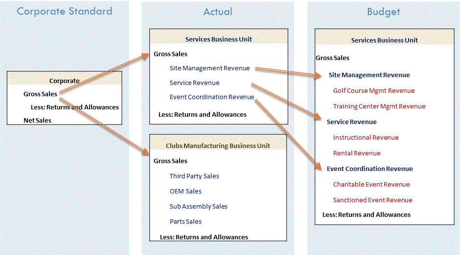

This is possible due to three reasons: 1. Extensible Dimensionality® can inherit dimensions and extend them. There are four different Account dimensions in the example that inherit from each other like this: l Corporate Accounts l Club Manufacturing Accounts l Services Accounts l Services Budget Accounts Corporate Accounts is the main chart of accounts. Club Manufacturing takes that dimension and extends it to add its own accounts, but it cannot change what is in Corporate Accounts. Services also takes Corporate Accounts and extends it to meet its needs for the Actual scenario and extends its own Services Accounts to meet its need for more detail in its Budget scenario in the Services Budget Accounts dimension.  However, when designing an extended dimension, members are either added below inherited members for additional detail, or to an alternate rollup by creating new parent members and then referencing inherited members below the new parents. Both actions cannot be done at the same time in the same section of the hierarchy. 2. Different dimensions can be assigned to different cubes and that dimensional assignment can be different for each Scenario Type. In the example, there are three cubes: Corporate, Clubs, and Services. When looking at the Corporate cube, data from the three cubes is there for analysis. In Corporate, the Corporate Accounts dimension is assigned to all Scenario Types. In Clubs, the Clubs Manufacturing Accounts dimension is assigned to all Scenario Types. In the Services cube, the Services Accounts dimension is assigned to every dimension except for Budget, which is where the Services Budget Accounts dimension is assigned. 3. The Clubs and Services cubes have their own respective Entity dimensions referenced in the Corporate cube. The Entity dimensions tie the data together.

> **Note:** Other dimensions such as Flow and the User Defined dimensions can also be

extended and have flexible cube assignment if needed.

> **Important:** Using Extensible Dimensionality to extend accounts used in the

Intercompany Matching process is not a recommended practice. Extensibility concepts are broken down into the following categories: l Vertical Extensibility l Workflow Extensibility l Platform Extensibility l Horizontal Extensibility Vertical Extensibility Vertical or Entity/Cube extensibility relates to the ability to include or exclude detail at different levels up the entity hierarchy. It is important to properly manage Data Unit size to enable optimal performance while accounting for future growth. Vertical extensibility also relates to varying dimensionality across business units. With vertical extensibility, lower-level entities still report at a detailed level, but the data can collapse to a summary level to facilitate reporting and increase performance. Vertical extensibility provides flexibility to vary dimensionality at a detailed level but consolidate to a common summary level. There can also be separate cubes for different uses, such as Human Resource data or Cost Drivers. These cubes can still reference other cube data through the CB# qualifier in Member formulas. Workflow Extensibility Workflow extensibility enables variation in the input steps and methods within each process flow. Workflow steps and settings are adjustable in each Scenario Type, or can be combined if multiple processes follow the same responsibility hierarchy. You can configure workflow extensibility on each parent cube to tailor the software interface to match process needs. There can be different Workflow Profile hierarchies per Scenario Type which is defined at the cube level.

|Col1|Example: An Actual scenario might be loaded from 12 GL systems across 500 entities, and Budget Forecast and Variance can define a Workflow for each of the 500 entities with regional review and sign off levels.|
|---|---|

If your actual data collection process is more import driven, and the planning process driven by calculations and dashboards, workflow extensibility can split these processes to ease management from an administrative standpoint. Some data collections may require centralized import while others are distributed to more end users. You can assign entities only once in a workflow hierarchy, so workflow extensibility can be used to vary entity sign off responsibilities and allow for differing entity assignments. Platform Extensibility Platform extensibility relates to variation in data storage locations and how it is utilized within the platform. Platform extensibility also enables multiple applications within one environment that can talk to each other. OneStream has the unique ability to consume, utilize, and report on data regardless of its storage in cubes, relational tables, or even external locations. With platform extensibility, Cube data can combine with relational data to achieve optimal balance between performance and reporting needs. Platform extensibility also allows use of relational data, web content, and external data sets. Horizontal Extensibility Horizontal Extensibility relates to the extension and use of different levels in a hierarchy for different business purposes. It also allows targeting of when and where the data model needs to include dimensions.

|Col1|Example: You can input data at a parent level. A parent becomes a base for input in a different scenario by using the scenario type settings and properly applying cube dimension assignments. See Cube Dimensions.|
|---|---|

|Col1|Example: If you have highly detailed metadata that only applies in a specific use case, horizontal extensibility can help limit potential intersections that are invalid for all other use cases by assigning metadata only where it is relevant.|
|---|---|

## Recommended Implementation Of

Extensibility There is not a universal way to implement extensibility in OneStream. Applications without extensibility commonly run into issues. A lack of vertical and platform extensibility can lead to performance issues. A lack of horizontal and workflow extensibility can lead to flexibility issues. Applications with too much extensibility encounter fewer performance or flexibility issues, but do have a higher maintenance burden. Balancing performance, usability, and maintenance is key. In most cases, it is recommenced that extensibility is considered in every design and implemented . When designing a solution, building a matrix can help you visualize the details and where they need inclusion, and then you can start shaping Scenario Types, cubes, dimensions, and any platform extensibility.

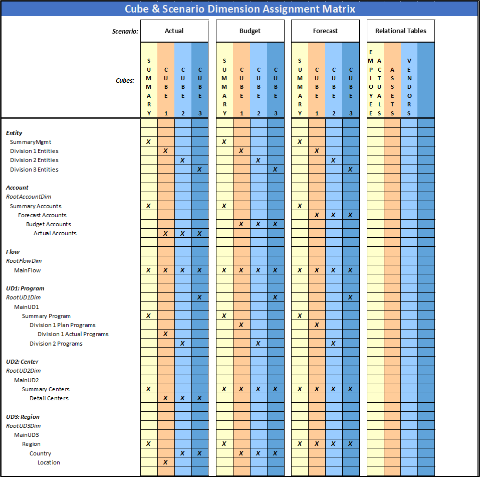

The CPM Blueprint application contains examples of extensibility configurations using general best practices. UD1 is an example of using the common configuration of a MainUD1 dimension parent to summarize the BU and Cost Center details into a common dimension.

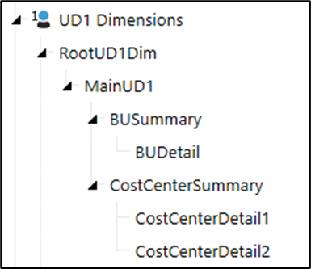

Applying this concept to all User Defined dimensions facilitates both vertical and horizontal extensibility. To create vertical extensibility, dimensional detail that is not needed in a parent cube can be collapsed by assigning MainUD1.

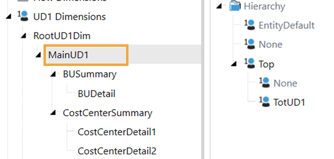

The dimensional detail is the extended from TotUD1 to expand into necessary levels of detail for each data collection and reporting need. This allows both None and Top to be active at all levels in the dimensional hierarchy.

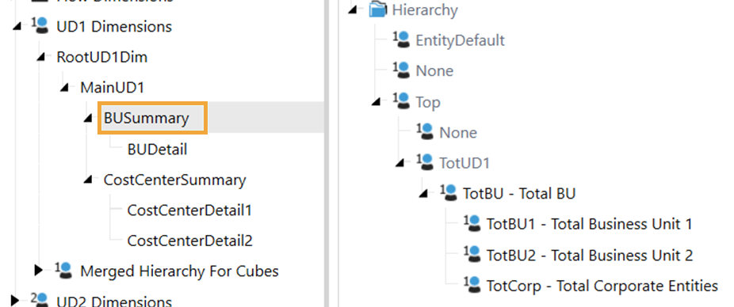

Another example of extensibility in the CPM Blueprint application is in the cube configuration. The configuration focuses on the financial reporting structure in this application and follows the recommendation for a base-summary cube relationship between Business Unit and total company reporting. This configuration has several benefits: l More flexibility to expand child cubes horizontally and plug in different dimensionalities l Greater ability to collapse the data unit if its size becomes an issue l Further future-proofing by enabling more platform expansion with the same foundation

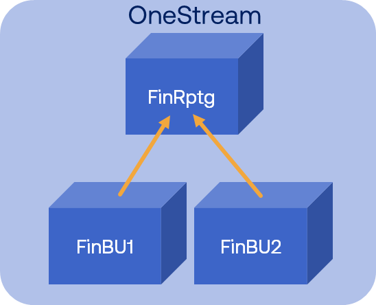

This application also has workflow extensibility on display. You can see the connection between top level and base level cubes in the cube settings, and the workflow suffixing applied in the CPM Blueprint application. In this example, the Actual Scenario Type has a different process flow and responsibility hierarchy from other data collections, so it has own suffix of ACT Budget and Forecast follow the same process flow and responsibility hierarchy, so they share a workflow suffix of BUDFCST This enables each process to have its own configuration and entity assignment.

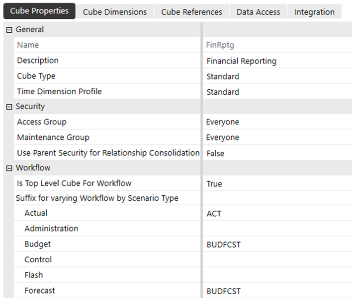

### Horizontal Extensibility

Horizontal extensibility allows metadata to be shared and inherited across Scenario Types, enabling the business processes to dictate application design. Within a cube, you can assign differing base members to each scenario type while sharing all relevant parent members. With horizontal extensibility, you can haveactuals, budgets, forecasts, long-range plans, and detailed data sets within the same cube and incorperate their proper level of input into the model. This model is designed to prevent these common obstacles: l Dummy input members to key/load data at different levels in a hierarchy. l Separate cubes or disparate systems with slight variations of the same hierarchies. l Multiple versions of the same common reports. l Duplicate data residing in multiple tools to facilitate the separate needs of each process. l Inconsistent data tie out points across systems. If applied properly, horizontal extensibility can: l Reduce technical debt by incorporating many fragmented processes. l Encourage adoption by meeting users where they operate. l Facilitate reporting and reduce data movement and maintenance. l Provide a single source of truth. Through horizontal extensibility in OneStream, you can create a single common set of metadata with input levels that can follow each distinct process need An example of this function is a budget or forecast that is completed at a more summary level than the actual financial data. In the CPM Blueprint application, the Account dimension contains this type of extension. Net Revenue is the base input member for budgeting and forecasting in this application, while actuals are captured at a lower granularity.

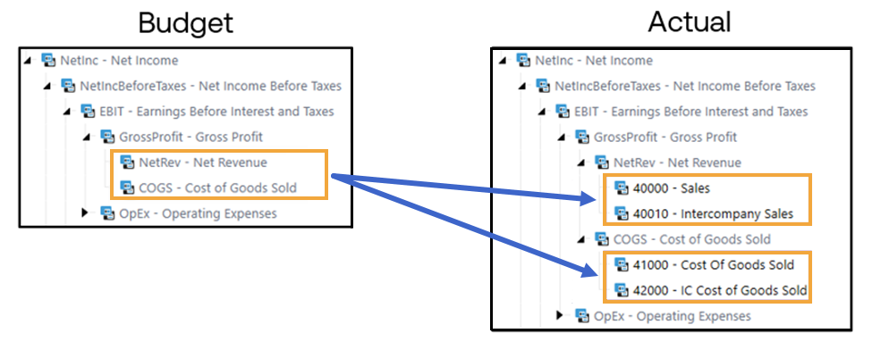

This example is within the Account dimension, but you can apply this concept across multiple OneStream dimensions. In the CPM Blueprint application, this type of horizontal extensibility is used in the LongTerm Scenario Type, because the application's long-range planning process takes place at a summary level. Like budgeting and forecasting, the account input is at the Net Revenue level. In the LongTerm Scenario Type, input into the Geography and Product dimensions vary from actual, budget, and forecast.

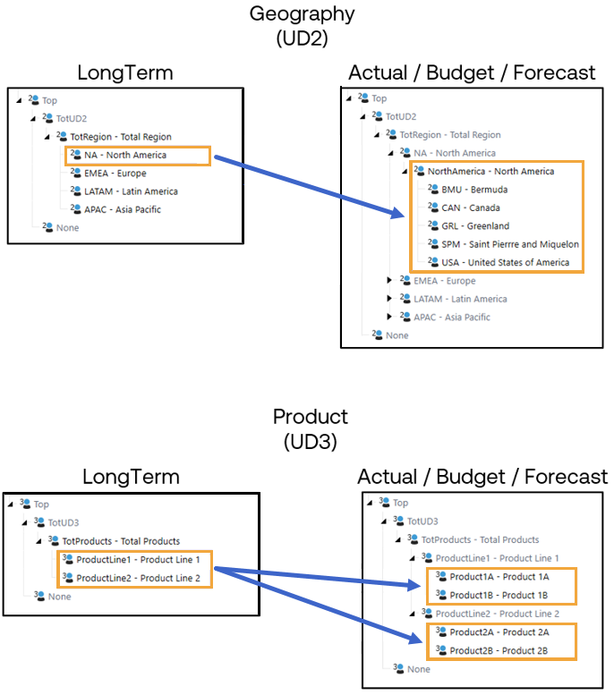

Horizontal extensibility allows this variability when designing scenarios, cubes, and global applications. Using horizontal extensibility across Scenario Types allows you to create a targeted user experience by adding or removing members and entire dimensions from scenario types where they are not valid. The examples above display processes occurring at different levels in the same hierarchies. Horizontal extensibility also creates flexibility when an entire dimension is not valid. The CPM Blueprint application’s CashFlow dimension is assigned to the Actual scenario type, meaning all Cash Flow members are included and valid in scenarios created with that Scenario Type. In the active planning scenario types, Budget, Forecast, and LongTerm, the Root dimension is assigned on the cube properties because only the None member is valid.

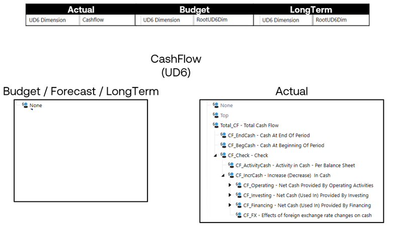

This targeted cube organization reduces confusion and limits potential data unit explosion caused by rogue rules, imported zeros, or other configuration issues. If invalid intersections are calculated because a business rule or member formula included Base, a zero could be stored in all those intersections that slows performance, causing the data unit expands exponentially as a result. Business rules without proper filtering and removal of zeros can potentially assess or write to significantly more intersections than intended. Configuring cube dimensions correctly by assigning the Root dimension for those that are inactive on a scenario type will allow addition and updates of new dimensions in the future. See Cube Dimensions

#### Implementing Horizontal Extensibility

The implementation of horizontal extensibility follows three main steps: l Planning and preparation l Configuration l Cube assignment

#### Planning And Preparation

The following example process demonstrates a recommended planning exercise that streamlines extensibility implementation. Start with a list of scenario types and data sets planned for incorporation into OneStream. Next, list out the various reporting dimensions used in each process and data set. Finally, create a grid with processes in columns and dimensions in rows. Fill in each valid intersection.

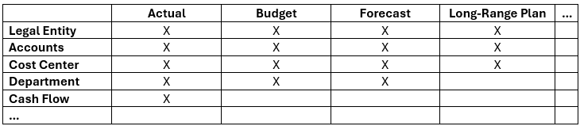

This chart visualizes that actuals and long-range planning should utilize separate Scenario Types to vary the inclusion and exclusion of entire dimensions. Next, build a chart that provides clarity for the differences between shared dimensions. As determined from the previous chart, all four processes need accounts. To determine which accounts are needed, compile a list of all possible members and hierarchies and repeat the process to identify where they should be valid.

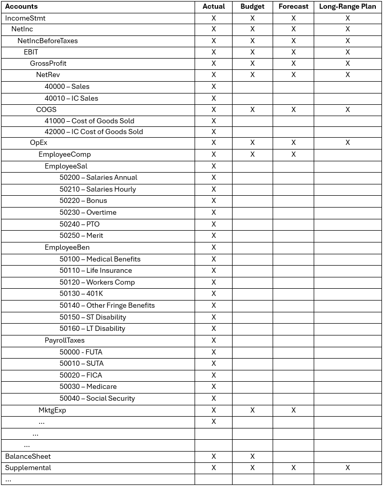

After this exercise is completed for accounts, repeat it for each reporting dimension identified to fully understand each data set. Decisions about setup should be made based on the account- level breakdown between the four different processes. Consider possible extension points in each dimension to set the foundation for future growth in the platform.

#### Configuration

After making decisions about potential horizontal extensibility, you can configure the dimensions and identify any issues with the extension points. When creating a summary dimension at the highest identified level in the member structure, the extended dimensions utilize the Inherited Dimension property on creation.

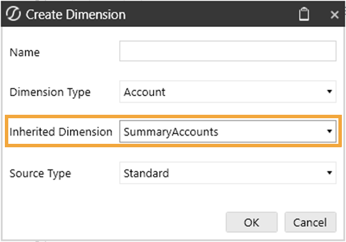

Inherited members are grey in the created dimension. You can begin adding the extended members, in most cases extending only from base members. In consolidating data between linked cubes, extending from parent members prevents the data from consolidating from sub cube to parent cube.

> **Note:** Entity dimension does not follow this restriction.

The following example displays two example account extensions. Example A does not follow the recommendation to extend from base members, while example B does follow the recommendation.

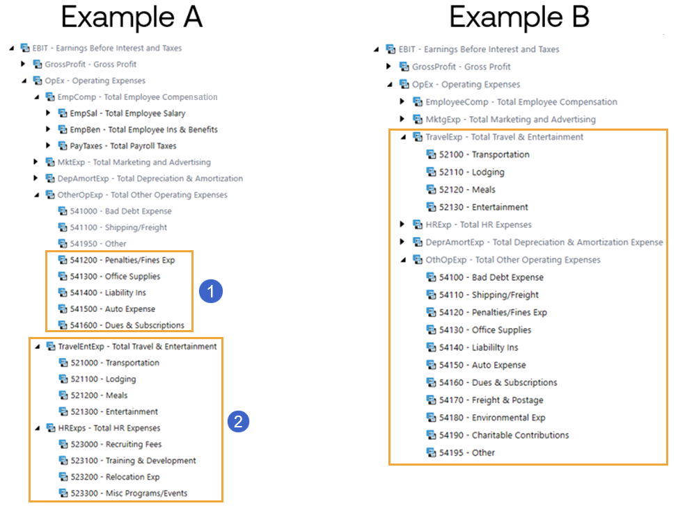

Two issues are identified in Example A: 1. Five base accounts are extended from the parent OtherOpExp. l The black and gray text in the account dimension library makes this difference visible. Accounts 541000, 541100, and 541950 are in gray text, signifying they are inherited from the parent dimension, while the five base accounts from 541200-541600 are in black text, signifying they were created in the currently selected dimension. This is an example of extending from a parent member, which will not consolidate correctly across linked cubes. These solutions are commonly used to resolve this configuration issue: o All the base members under OtherOpExp are included in the parent dimension and then inherited into the extended dimension. Input in the parent dimension would be to 541950-Other or one of the other base members. o Only the member OtherOpExp is included in the parent dimension and all child accounts are included in the extended dimension. Input in the parent dimension would be aggregated to the OtherOpEx level without the breakout of 541, 541100, and 541950. You can create a new parent member to extend from in the summary dimension. While this solution facilitates the desired split of base members between dimensions, it may cause confusion when viewing the hierarchy.

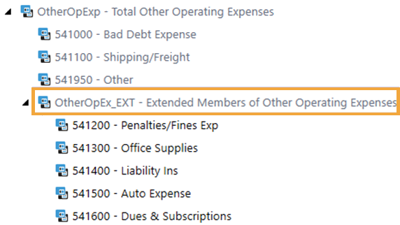

2. The parent accounts TravelEntExp and HRExps are extended from the parent account OpEx. l Even though the base members do not have siblings in the inherited dimension, the parents cannot have siblings in the inherited dimension either. All members in the extended dimension, both parent and base, should be extended from a base member. Example B shows the common solution for this configuration with the Travel and HR expense parents included in the parent dimension and all base members in the extended dimension. A similar approach with the _Ext parent member could be applied here as well. Consider future state goals when discussing extension points and deciding whether to move members up and down a dimension or add _EXT parent members to apply extensibility properly. For example, if the summary dimension you are creating is for facilitation of the forecast process, but the process does not include details around travel and HR expenses, ask if it will in the future. Consider creating a road map to expand your planning capabilities in these areas. Moving parent members between dimensions later can be accommodated, but moving base members is more difficult. The recommended practice is extension from a base member, but extending from parent members is acceptable in these situations: l If consolidation of data up the linked cube structure is not intended l If there is no linkage between cubes and the intent is limitation of members visible to end users l If it is in the entity dimension Though the example is of the Account dimensions, this also applies to Flow dimensions and User Defined dimensions.

#### Cube Assignment

Assign account dimensions to a cube after designing and creating them extensibly. Utilizing the flexibility provided by horizontal extensibility is dependent on proper cube dimension assignment. Non-data unit dimensions, Account, Flow, and UD1-UD8, should be applied in the specific Scenario Types in use. Any unused dimension in those active Scenario Types should be assigned to the Root dimension, for example, RootUD4D. Assigning the Root dimension instead of leaving each dimension type set to (Use Default) enables changes to that dimensional assignment later and activation for data input in the future. You can only update from the Root dimension to a specific dimension once. Changing from a Root dimension is a one-time change that cannot be reverted if there is data in the cube and Scenario Type combination.

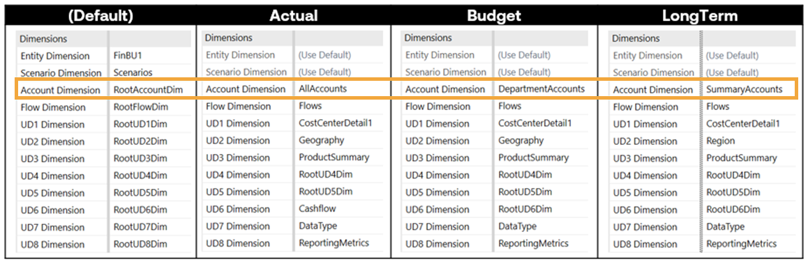

#### Recommendations

Horizontal extensibility relates more to providing flexibility and data model integrity than managing data unit sizes. It can shrink the potential data unit size and mitigate the impact of a rogue calculation, but its focus is on creating a single source of truth by allowing for a single set of master metadata. When planning for extensibility, be mindful of future expansion. Consider what levels other parts of the business report or plan at and if there is any defined need for extensibility that you can capture now to facilitate future adoption. Parent members can be moved between dimensions since there is no data stored in the database at that level, but base members cannot change dimensions. Consider incorporating plans to include certain members or hierarchies in a data set from the beginning. With proper configuration, horizontal extensibility can be utilized in Cube Views, Parameters, and Business Rules to drive standardization.

#### Member Filter Expansions

Applying extensibility and utilizing the provided member filter expansions can allow use of the same row and column set across varying scenario types in OneStream. If the business has a standard Income Statement where the only difference between processes is the level of detail, you can create it as a single report and share it across workflows. Two important member expansion functions are .Where() and .Options(). l .Where(MemberDim = Value)

|Col1|Example: A#60000.Base.Where(MemberDim = |WFAccountDim|)|
|---|---|

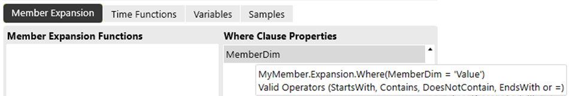

l .Options(Cube = CubeName, ScenarioType = Type, MergeMembersFromReferencedCubes = Boolean) o Targeting a specific extension point:

|Col1|Example: A#19999.Base.Options(Cube = [Total GolfStream], ScenarioType = Actual, MergeMembersFromReferencedCubes = False)|
|---|---|

o In combination with XFMemberProperty() to create a more dynamic member formula:

|Col1|Example: A#60000.TreeDescendantsInclusive.Options(Cube = |WFCube|, ScenarioType = XFMemberProperty (DimType = Scenario, Member = |WFScenario|, Property = ScenarioType), MergeMembersFromReferencedCubes = False)|
|---|---|

#### Calculations

Consider the .Where() and .Options() member expansion functions when writing calculations across the platform. They are necessary at times to make calculations more targeted, and they can make them more dynamic. Another consideration is the function api.Data.ConvertDataBufferExtendedmembers when copying data across extended dimensions. Copying actual data into a forecast is frequently necessary. This function is a performant way to do so while accounting for extensibility. The ConvertDataBufferExtendedMembers function aggregates the data from extended members in the source data unit to the base level of the target data unit. After aggregating the data in memory, it can then be manipulated or stored using the target dimensionality.

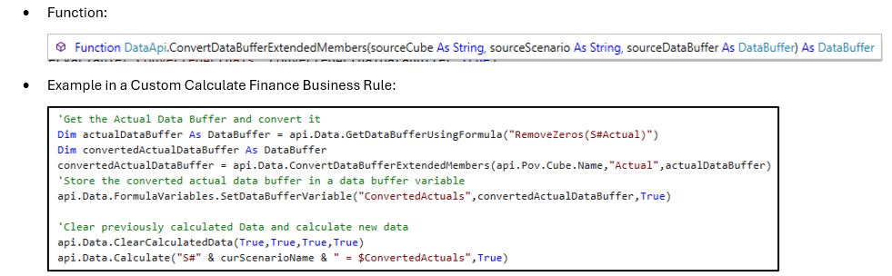

#### Application And Results

When applying horizontal extensibility, it is important to remember that it is not applied to a single hierarchy. Consider all alternative hierarchies and incorporate extensibility there as well. Keep in mind how certain extension points in one dimension could impact its use in another dimension.

|Col1|Example: Excluding balance sheet accounts from a forecast could impact the ability to make use of a Cash Flow dimension and corresponding calculations.|
|---|---|

## Cube Design Choices Within An Application

There are a few choices for the use of Cubes within an application, driven by the relationships between data. 1. Single or “Monolithic” Cube is the simplest Application design. These typically have one Workflow Profile structure, though that can vary by Scenario Type. 2. “Linked Cubes” is possible via relationships between multiple Entity dimensions into one superset Entity dimension. The “Top” or “Parent” Cube is configured with Cube References to others. Typically, Extensible Dimensionality is deployed with other dimensions, such as Accounts, allowing the Business Unit Cubes to satisfy their management reporting requirements. There is typically one Workflow Profile structure for all Linked Cubes, though that can vary by Scenario Type. 3. “Exclusive Cubes” are separate Business Unit Cubes that move their data from a Business Unit to a “Parent” Cube typically via Business Rules or the use of Data Management instead of through configured Cube References. Each separate Cube requires its own Workflow Profile structure, though that can vary by Scenario Type. 4. “Specialty Cubes” refers to special data collections outside of the typical Trial Balance or Planning data loads and is typically encompassed with no parent/child relationships between Cubes. Examples are for headcount or budget drivers. These figures might be referenced by other Cubes via Business Rules or Data Management. Each Specialty Cube would have separate Workflow Profile structures.

## Application Model Design Considerations

Application designers understand that, as a platform, each application must flexibly respond to growth, evolving business needs, and enhancements in OneStream Solutions. Review the following design options to best direct the overall design and performance expectations of your application.

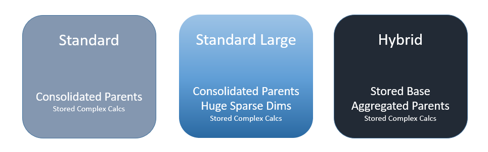

When designing an Application, consider these questions to identify the model Cube design best suited to your needs: l What is the overall size of the Entity, Account, Flow and User Defined dimensions that estimate the Data Unit size potential? A OneStream Data Unit is comprised of Cube, Entity, Parent, Consolidation, Scenario and Time. l What is the size and relationship between dimensions? For example, are the User Defined Dimensions large (thousand members) and are the members closely tied to a single or very few Entities (“sparsely populated”)? l Are dimension members more transactional in nature? Transaction members such as Employee ID, SKU and Project Code likely change frequently. While this level of detail may be needed for analysis, it can complicate a financial model. Other modeling techniques could help. l Is the data related to the Cube a “specialty” collection, such as Human Resources, Product Profit or Capital Expenditures? l Do you fully understand how the data is managed? Determine if the Legal Entity is appropriate for the Entity dimension so you can properly define the ultimate Data Unit Controlling Dimension. l Have you collected information how the data is assembled and used? Determine if the Cube data is integrated for different types of data such as Actual and Budget.

### Standard Cube Design

Following are considerations for standard cube design.

#### Guidelines

l Common design for a standard Statutory Consolidation Cube. l Primary metadata driven application. l Data Unit approximately 250k data records at higher end.

#### Performance Profile

l Consolidation times for 12 periods generally range from minutes to ~2 hours on the higher end, depending on complexity and volume. l Performance generally impacted by metadata parent structures, alternate hierarchies, and calculations executing on parent Entity members.

#### Reporting Guidelines

l Standard Cube Views with minimum number of rows and columns should perform well, rendering within a few seconds to a minute (depending on requirements). l Slow Cube View performance of a reasonable number of non-calculated rows and columns, rendering greater than a minute should flag a Cube View or Application design review. l Cube View Performance is strongly dependent on concurrent use, Cube View design and metadata involved.

### Standard Large Sparse Cube Design

Following are considerations for standard large sparse cube design.

#### Design Guidelines

l Common for a Statutory Consolidation Application.  Contain sparse intersections due to collecting transactional members, such as SKU, Part Number or Names, or other large dimensions, such as Product or Project. l Data Unit size approximately 750k or more data records. Larger Data Units demand more CPU processing power and time to calculate.

#### Performance Profile

l Optimize consolidation times by addressing sparse dimensions. With good extensibility you can significantly reduce the size of the Data Unit consolidating, for faster consolidation. l Applications that must be consolidated and contain large sparse dimension members, may have long consolidation times and lower overall performance.  Review these applications designs to consider alternate design solutions that include extensibility or other Cube and Model solutions. l Data Unit size, number of Data Units, Business Rule best practices and other factors effect consolidation times.

#### Reporting Guidelines

l Putting a “top” member such as UD2#Top for a large dimension on a Cube View , means OneStream loops through each child member and aggregates on-the-fly. This can consume large amounts of processing power and extend report processing. l It is best to use Sparse Data Suppression settings on Cube Views which are based on Single Data Unit. l You may need custom Sparse Cube View Business Rules for “top of the house” queries. l Quick Views may be impacted as they do not include Sparse Row Suppression settings.

### Hybrid Cube Design

Following are considerations for hybrid cube design.

#### Guidelines

Hybrid Applications are generally designed to support Analytics and not the Consolidation model. Hybrid cubes: l Typically require complex calculations at base level Entities. l Predominately present is aggregation having simple needs at parent Entity levels.  Parents do not require special calculations or logic. l Rely on Dynamic Business Rules attached to a dynamic member such as in UD8. This means parent Entity data is not stored. You can set the Is Consolidated property on these Entities to False. l Determine if parent Entity data must be exported to external system so you can understand the impact of Dynamic Business Rules. l Usually have a data unit size of up to one million data records at the top parent Entity level.

#### Performance Profile

l Performance will vary by application size and structure. l Data calculation is not stored at the parent level. l “Entity Aggregation on the Fly” consolidation simulation rules are required. You cannot consolidate parent entities. This involves the API.Functions. GetEntityAggregationDataCell function in a dynamic member. l You must support the export of calculated data which could involve unique Scenarios or cubes to replicate dynamic calculations as stored values. These processes can be automated using scheduled Data Management jobs.

#### Reporting Guidelines

l Apply Sparse Suppression settings on Cube Views. l You may need custom Sparse Cube View Business Rules for “top of the house” member queries. l Intermediate rules may run as Workflow-based or be driven by Dashboards or Calculation Definition settings. l Quick Views may be impacted because they do not include Sparse Row Suppression settings.

## Dynamic Cube Services

Dynamic Cube Services can assist with managing and analyzing complex volumes of financial data, leading to faster and more accurate analysis, reporting, and decision-making. Dynamic Cube Services provides these features for designers with advanced knowledge of the OneStream architecture: l Consolidate financial data from various sources l Create and compare different budgeting and forecasting scenarios l Track key performance indicators in real-time, enabling better management and decision- making l Analyze risk data across multiple dimensions, helping mitigate financial risks l Help ensure that financial data is accurate and up-to-date for internal compliance and auditing

### Dynamic Cubes Overview

Dynamic cubes structure data into a multidimensional cube, ready for simplified reporting and analysis using tools such as cube views, quick views and dashboards. Dynamic cubes offer a solution for application designers to surface non-traditional data, such as transactional data, without extra loads ; or to re-aggregate existing Cube or Solution data in different ways. Dynamic cubes enable real-time connectivity to a source, such as an external database or source cube, without needing to store the data in the target cube. They are based on Workspace Assembly files that can define the dimension metadata and hierarchies, and instruct the cube on how to retrieve and/or commit data records. Data is integrated using data bindings configured on the cube, rather than Workflow-based imports. Dynamic cubes can be supplied content from other cubes, tables, and external databases. Data can be copied from a source and stored in data record tables, or it can be shared. A shared configuration can function as a reference to the source system, which means the data might not be physically stored in OneStream. Dynamic cubes allow data collection through the Forms Origin member. The data submission flow can be customized using Workspace Assembly files to target tables, or to direct submitted data to an external system. The elimination of stored metadata can be accomplished using Dynamic Dimensions. Such Dimensions are created and referenced by the dynamic cube in the same manner as a standard cube. However, members, properties, and relationships, are defined using Workspace Assembly rules, which manage the retrieval of data records as well as the cadence and method to refresh data and dimension metadata.

> **Note:** Dynamic Cubes do not always require Dynamic Dimensions: data can be

provided dynamically for cubes built with traditional stored dimensions too.

### Dynamic Dimensions Overview

Dynamic dimensions are dimensions in which dimension members are not stored in an internal member table. Instead, the dynamic dimension is typically used to surface members from external sources for use in cubes. Dynamic dimensions are a key design tool that enable external database integration with dynamic cubes. Dynamic dimension members cannot be created, updated, or deleted through the standard Dimension Library. Workspace Assembly rules define and retrieve members from external sources. They are used to apply properties, and to define relationships used to create a dimensions. Metadata management of the dynamic dimension is performed by the definition within workspace assembly rules. Dynamic dimension members are read in real-time and cached each time the workspace assembly executes, according to the caching parameters defined in their rules. Dynamic dimension members only exist in code and are not saved to tables. Once referenced by stored data, they are partially kept in an internal table, called DynamicMember, to facilitate audit and application management.

### Configure A Dynamic Dimension

Dynamic Dimensions are created for “right-hand” Account-type dimensions only: Account, Flow and User-Defined 1 through 8. The dimension is created and assigned a Source Type of Dynamic Dimension in the Create Dimension dialog box for the Source Type property.

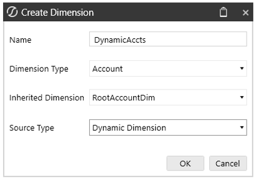

You can create and define members using a Workspace Service Factory, which is referenced through a workspace in the Source Path property. See Workspaces > Configure the Service Factory in the Design and Reference Guide for more information.

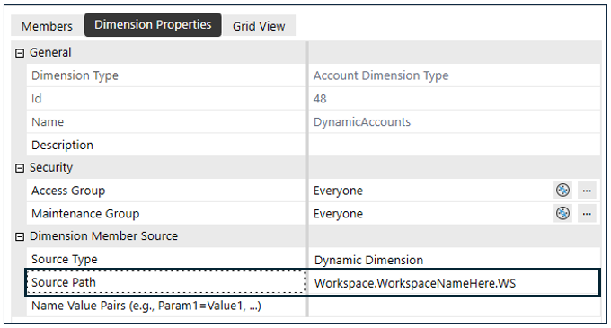

#### Capabilities

Dynamic Dimensions support the following functions: l Enrichment of metadata using all OneStream properties. l Extensibility is fully supported and integrated. l Members are supported in Sparse Row Suppression. l Can be extracted for use as a standard dimension.

#### Limitations

Consider these limitations when using Dynamic Dimensions: l Dynamic dimensions are not available on data unit dimensions.. l When writing to standard cubes or consolidating dynamic cubes, dynamic dimensions store records in data record tables. Redefining these dimension members will not clear stored data records; however, if a member is recreated with the same member ID, the records will continue to work properly. Specify external member IDs to help maintain references. l Dimension members created by mirroring an existing dimension are created with new member IDs. l Dynamic members that are removed or no longer exist, do not populate as orphan members. Dynamic members that are defined but not linked to any parent, will appear as orphans. l DynamicCalc formulas on members are not supported when defined within a dynamic dimension. l Standard dimensions should never be extended from dynamic dimensions. Extending a dynamic dimension with another dynamic dimension is possible, but not recommended.

#### Recommendations

Consider these recommendations when using Dynamic Dimensions: l Extensibility designs are only supported as dynamic dimensions extend from standard stored dimensions. l Use naming conventions to clearly identify that a dimension is dynamic.

### Workspace Assembly Dynamic Dimensions

Dynamic Dimension Services execute assembly files for dynamic dimensions. The assembly file uses public classes to construct the DynamicDimensionInfo object, which creates the Dynamic Dimension. The DynamicDimensionInfo object uses the following syntax: Syntax: DynamicDimensionInfo(ContentTimeStamp, NumSecondsBeforeReadContentTimeStamp, DynamicMemberCollection, DynamicRelationshipCollection) For additional details on required objects and syntax, refer to Dynamic Cube Services API Reference. When designing a dynamic dimension, consider the following: l Frequency and trigger for the dimension to update during workspace or assembly file changes, or time-based updates (daily, hourly, or by the minute). For details, see Frequency and Trigger. l Member definitions, including properties, relationships, and aggregation factors. For details, see Member Definitions. l Metadata Enrichment of dynamic members for properties, constraints, and member formulas. For details, see Metadata Enrichment.

#### Frequency And Trigger

Each application server processes and caches metadata using a simple algorithm. When a dimension object is created, it gets a timestamp and a wait period before checking for updates. During this period, the cached object is returned from memory for faster access. After the timeout, the system calls ReadDynamicDimensionContentTimestamp to decide whether to recreate the object or continue using the cached version.

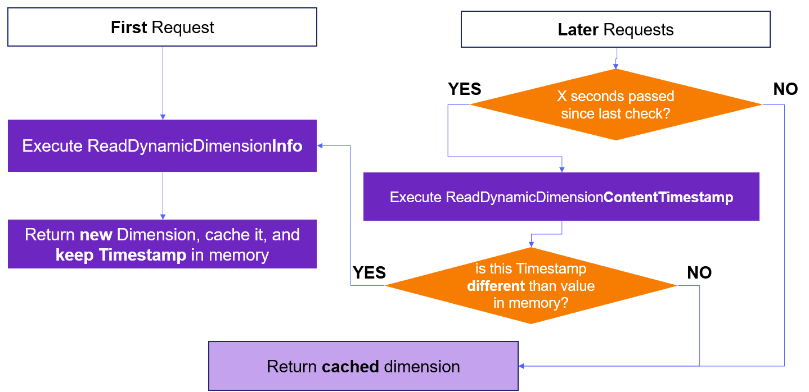

|Col1|Example: The timeout ("X seconds" in the diagram above) is defined with the NumSecondsBeforeReadContentTimestamp argument of the dimension constructor:|
|---|---|

Syntax: DynamicDimensionInfo( __, NumSecondsBeforeReadContentTimeStamp,__ ,__ ) Selection of such value should be based on the expected frequency of changes in the dimension source. If the cadence is unknown, or the members are manually created in the assembly file, the update can be triggered through changes to the assembly file by using the time variable SharedConstants.DateTimeMinValue in ReadDynamicDimensionContentTimestamp. The logic in ReadDynamicDimensionContentTimestamp will naturally determine how often the dimension is recreated. If you use a higher refresh frequency, such as by minute, application performance may be impacted, especially with high volumes. Refer to the following table for time-based refresh trigger rates:

|Refresh Type|Example ReadDynamicDimensionContentTimestamp implementation|
|---|---|
|Daily Refresh|Dim now = Datetime.now Return new DateTime( now.Year, now.Month, now.Day, 0, 0, 0, 0, DateTimeKind.utc)|
|Hourly Refresh|Dim now = Datetime.now Return new DateTime( now.Year, now.Month, now.Day, now.Hour, 0, 0, 0, DateTimeKind.utc)|
|Minute Refresh|Dim now = Datetime.now Return new DateTime( now.Year, now.Month, now.Day, now.Hour, now.Minute, 0, 0, DateTimeKind.utc)|

#### Member Definitions

After a dimension is created using the Source Code Type of Dynamic Dimension Service, all metadata management is performed through workspace assembly files. Members can be created and defined in the assembly file. The assembly file can also source members and define properties from external systems, such as a database table. The members may be defined as either base or parent.

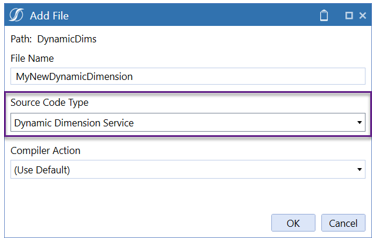

A new dynamic dimension service assembly file is created and populated with sample code that exposes the public classes and functions. The assembly file creates the member and its relationship to parents in the dimension hierarchy. These objects are then passed to the DynamicDimensionInfo constructor. This object includes a data-time property that supports controlling and triggering the dimension refresh. Syntax: DynamicDimensionInfo( ContentTimestamp, numSecodsBeforeCheckingTimestamp , DynamicMemberCollection, DynamicRelationshipCollection) The following objects will have to be created to support the constructor: l DynamicMemberCollection: The list of members in the dimension. Note: when specifying member names, if they contain unsupported special characters, they will be automatically stripped. l DynamicRelationshipCollection: The list of parent-child relationship between members, defining the hierarchy structure. Note that it should also contain the relationship between any top member and Root, or between top members and members of an inherited (extended) dimension. For additional details, refer to Dynamic Cube Services API Reference. Note that the system provides a shortcut method to build the entire dimension (and attach it to the Root member) with a single SQL query. See the API section for further details. If the resulting dimension must be nested under an existing member instead of Root, the relationship can be modified like this: Dim dynamicDim = api.ReadDynamicDimensionInfo(...) dynamicDim.Relationships.GetAllRelationships().Find(Function(r) r.ParentId.Equals (DimConstants.Root)).ParentId = newParentId { var dynamicDim = api.ReadDynamicDimensionInfo(...); dynamicDim.Relationships.GetAllRelationships().Find(r => r.ParentId.Equals (DimConstants.Root)).ParentId = newParentId; }

#### Enabling The Service

The Dynamic Dimension service must be returned by a Service Factory. Example: Select Case wsasType Case Is = WsAssemblyServiceType.DynamicDimension ' we can switch on the dimension name If itemName.XFEqualsIgnoreCase("MyUD1") Then Return New MyNewDynamicDimension() { switch (wsasType) { case object _ when wsasType == WsAssemblyServiceType.DynamicDimension: { // we can switch on the dimension name if (itemName.XFEqualsIgnoreCase("MyUD1")) return new MyNewDynamicDimension(); break; } } } See Workspaces > Configure the Service Factory in the Design and Reference Guide for more information.

#### Extensibility

Dynamic dimension assembly files can reference a stored dimension member to support extensibility. Standard dimensions should never be extended from dynamic dimensions. Extending a dynamic dimension with another dynamic dimension is possible, but not recommended.

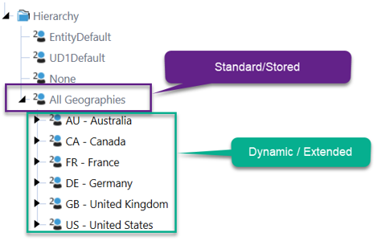

#### Metadata Enrichment

When objects are initiated as dynamic members or a relationship collection, the objects can be enriched to configure all stored and vary-by properties. Members created within the assembly file, or originating in source systems, can be configured with all required and optional properties, including vary-by-ScenarioType and Time properties. Example: Dim dynmem As DynamicMember = myDynamicDimensionInfo.Members.GetMember("My Member Name") dynmem.VaryingMemberProperties.GetUDProperties().Text1.SetStoredValue (ScenarioType.Unknown.id, DimConstants.Unknown, "Something") { DynamicMember dynmem = myDynamicDimensionInfo.Members.GetMember("My Member Name"); dynmem.VaryingMemberProperties.GetUDProperties().Text1.SetStoredValue (ScenarioType.Unknown.id, DimConstants.Unknown, "Something"); }

#### Example

The following example implements a simple dynamic dimension from an SQL table. Namespace Workspace.__WsNamespacePrefix.__WsAssemblyName Public Class MyDynamicDimensionService Implements IWsasDynamicDimensionV800 Function ReadDynamicDimensionContentTimestamp(ByVal si As SessionInfo, ByVal api As IWsasDynamicDimensionApiV800, ByVal args As DynamicDimensionArgs) As DateTime  Implements IWsasDynamicDimensionV800.ReadDynamicDimensionContentTimestamp Try ' Return SharedConstants.DateTimeMinValue if you are unable to determine ' when the underlying dimension members or relationships have been changed. ' In that case, the cache for this dimension will only be refreshed when ' a user edits this dimension's properties, this workspace's properties, ' or this workspace assembly's code. Return SharedConstants.DateTimeMinValue Catch ex As Exception Throw New XFException(si, ex) End Try End Function Public Function ReadDynamicDimensionInfo(ByVal si As SessionInfo, ByVal api As IWsasDynamicDimensionApiV800, ByVal args As DynamicDimensionArgs) As DynamicDimensionInfo Implements IWsasDynamicDimensionV800.ReadDynamicDimensionInfo Try ' retrieve parameters from Dimension configuration Dim nameValuePairs = New NameValueFormatBuilder (args.Dim.DimMemberSourceNVPairs) Dim secsToWait As Integer = nameValuePairs.NameValuePairs.XFGetValue ("SecsToWait", 5) ' Define timestamp Dim contentTimestamp As DateTime = DateTime.Now ' build the dimension from a query on the Application database Dim dynamicDim = api.ReadDynamicDimensionInfo(si, args, contentTimestamp, _ SharedConstants.Unknown, api.DbConnApp, _ "SELECT Child, Description, Parent FROM MyCustomDimensionTable", _ Nothing, Nothing, "Child", "Description", _ String.Empty, String.Empty, "Parent", String.Empty, String.Empty, String.Empty, False) ' Tweak the aggregation weight for one member Dim someMemberID As Integer = dynamicDim.Members.GetMember ("MyMember").Member.MemberId dynamicDim.Relationships.GetAllRelationships().Find(Function(r) r.ChildId.Equals(someMemberID)).UDAggWeight = 0.0 ' Set a text property on a member Dim dynmem As Integer = dynamicDim.Members.GetMember("AnotherMember") dynmem.VaryingMemberProperties.GetUDProperties().Text1.SetStoredValue( _ ScenarioType.Unknown.id, DimConstants.Unknown, "Something") ' return the hierarchy Return dynamicDim Catch ex As Exception Throw New XFException(si, ex) End Try End Function End Class End Namespace using System; using System.Collections.Generic; using System.Diagnostics; using System.Globalization; using System.IO; using System.Linq; using System.Reflection; using System.Runtime.CompilerServices; using System.Security; using System.Text; using System.Threading.Tasks; using Microsoft.VisualBasic; namespace TestProject.Workspace.__WsNamespacePrefix.__WsAssemblyName { public class MyDynamicDimensionService : IWsasDynamicDimensionV800 { public DateTime ReadDynamicDimensionContentTimestamp(SessionInfo si, IWsasDynamicDimensionApiV800 api, DynamicDimensionArgs args) { try { // Return SharedConstants.DateTimeMinValue if you are unable to determine // when the underlying dimension members or relationships have been changed. // In that case, the cache for this dimension will only be refreshed when // a user edits this dimension's properties, this workspace's properties, // or this workspace assembly's code. return SharedConstants.DateTimeMinValue; } catch (Exception ex) { throw new XFException(si, ex); } } public DynamicDimensionInfo ReadDynamicDimensionInfo(SessionInfo si, IWsasDynamicDimensionApiV800 api, DynamicDimensionArgs args) { try { // retrieve parameters from Dimension configuration var nameValuePairs = new NameValueFormatBuilder (args.Dim.DimMemberSourceNVPairs); int secsToWait = nameValuePairs.NameValuePairs.XFGetValue("SecsToWait", 5); // Define timestamp DateTime contentTimestamp = DateTime.Now; // build the dimension from a query on the Application database var dynamicDim = api.ReadDynamicDimensionInfo(si, args, contentTimestamp, SharedConstants.Unknown, api.DbConnApp, "SELECT Child, Description, Parent FROM MyCustomDimensionTable", null/* TODO Change to default(_) if this is not a reference type */, null/* TODO Change to default(_) if this is not a reference type */, "Child", "Description", string.Empty, string.Empty, "Parent", string.Empty, string.Empty, string.Empty, false); // Tweak the aggregation weight for one member int someMemberID = dynamicDim.Members.GetMember("MyMember").Member.MemberId; dynamicDim.Relationships.GetAllRelationships().Find(r => r.ChildId.Equals (someMemberID)).UDAggWeight = 0.0; // Set a text property on a member int dynmem = dynamicDim.Members.GetMember("AnotherMember"); dynmem.VaryingMemberProperties.GetUDProperties().Text1.SetStoredValue (ScenarioType.Unknown.id, DimConstants.Unknown, "Something"); // return the hierarchy return dynamicDim; } catch (Exception ex) { throw new XFException(si, ex); } } } }

### Configure A Dynamic Cube

You can turn a cube into a dynamic cube by setting a Data Binding Type property for the cube. In these configurations, data integration is based on the workspace assembly file definition and is limited to the Forms origin to meet any manual data entry requirements. Dynamic cubes can be configured with out-of-the-box properties that support the design of specialty cubes in a similar manner as hybrid scenarios. Workspace assembly configurations are used for more advanced solutions, such as surfacing external sources in a cube.

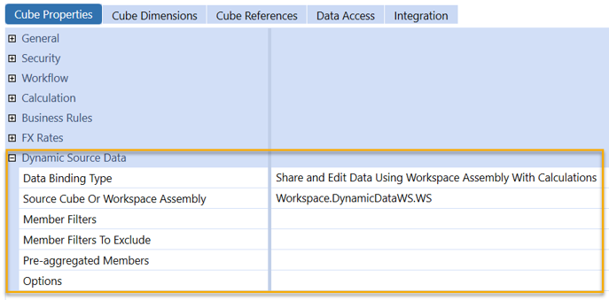

Data storage varies by use and design of the dynamic cube, as well as by the Data Binding Type property. Consider the following: l Copy input data options store data records in data record tables at base level intersections. l Share options for dynamic cubes manage the data as a pointer to the source system. l Dynamic cube data integration is restricted to the Forms origin member for data entry. l Dynamic cube data entry requires base-level intersections. O#BeforeAdj is not supported as a data entry point. l Dynamic cubes support write-back data to external sources and can write back text-based data through V#Annotations to external sources. Shared data acts as a pointer to parent and base level data unit members. However, account, flow, and user-defined parent members are calculated on the fly. Base-level data unit members are required when data is integrated with a copy operation. Data bindings have the following variations for edit and calculations: l Edit: Lets the dynamic cube use a workspace assembly file to write-back to the defined source, such as an external table. Note that writeback to stored cubes is not supported. l With Calculations: Lets dynamic cubes use workspace assembly files to execute member formulas that are stored in tables. Data is retrieved from the original source for the data unit and combined with any manual entry. Member formula calculations are stored and retrieved from regular tables, which are then merged into the results viewed in the dynamic cube. l CalcStatus: Is supported and defined using a workspace assembly file.

#### Capabilities

Dynamic Cubes support the following functions: l Can be used in consolidation, financial intelligence, and data unit calculation sequence adherence. l Data unit dimensions can be targeted for shared data. l Extensibility is supported.

#### Limitations

Consider these limitations when using Dynamic Cubes: l Data unit size and capacity recommendations are the same as a standard cube. Follow the best practices for Cube design. l Text-based data integration is restricted to V#Annotations.

### Dynamic Cube Data Binding Types

In Cube Properties > Dynamic Source Data, there are seven Data Binding Type options for Dynamic Cube Services. l Share Data From Source Cube l Copy Input Data From Source Cube l Share Data Using Workspace Assembly l Share and Edit Data Using Workspace Assembly l Share Data Using Workspace Assembly With Calculations l Share and Edit Data Using Workspace Assembly With Calculations l Copy Input Data From Workspace Assembly

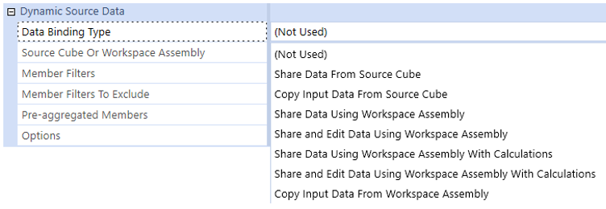

> **Note:** In this topic, the source data can refer to information that comes from

OneStream (stored cubes or Stage) or from external systems.

#### Share Data From Source Cube

Data is read-only and referenced from the source cube. This setting lets you refer to data from other cubes without duplicating the data, and also lets you filter which members to share. Benefits include a smaller data unit for filtering which members to share, as well as the ability to filter a specific member for data analysis when discontinuing an operation.

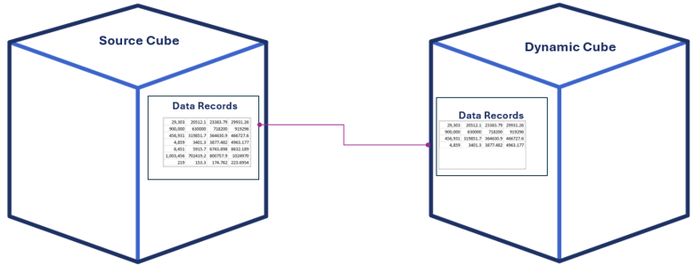

#### Copy Input Data From Source Cube

Base-level data is copied from the source cube as data records in dynamic cubes. Required for alternate rate-type and rule-type translations. You can copy base-level data from another cube and filter on members you want to copy. For example, you might only want to copy data from a P&L account and then retranslate in the source cube.

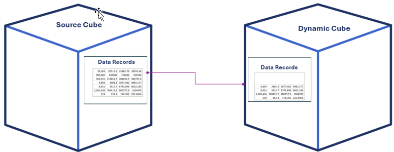

#### Share Data Using Workspace Assembly

This data binding lets you share data from any source through workspace assemblies. You can view data in cube views and filter which members you want to share. For example, you can do the following: l Only share data for specific members such as income statement accounts. l Rearrange or integrate data already collected in another cube using volatile dynamic dimensions and custom tables

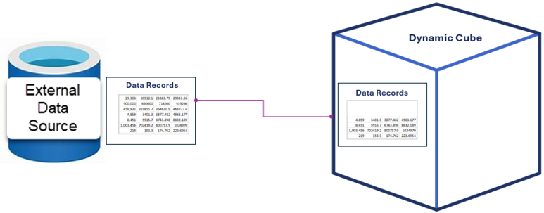

#### Share And Edit Data Using Workspace Assembly

Share data from a non-cube source through workspace assemblies. For example, you can do the following: l Use forms, such as cube views, to edit the data. l Input data into a form to write back to the source, as well as reference data from the original data source. l Filter members for sharing. For example, share data for specific members from an external data source, or integrate data already collected in another cube using data kept in custom tables.

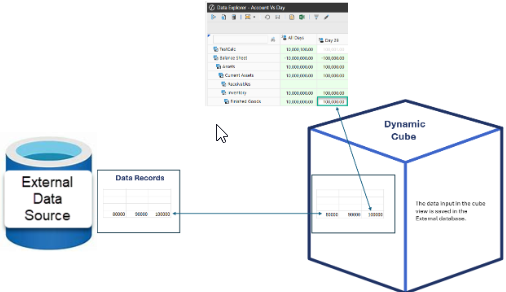

#### Share Data Using Workspace Assembly With Calculations

This model lets you share reference data from any data source and calculate data. You can filter members to share. For example, you might want to share data for specific members. Calculations defined in dynamic dimensions can be executed through workspace assemblies.

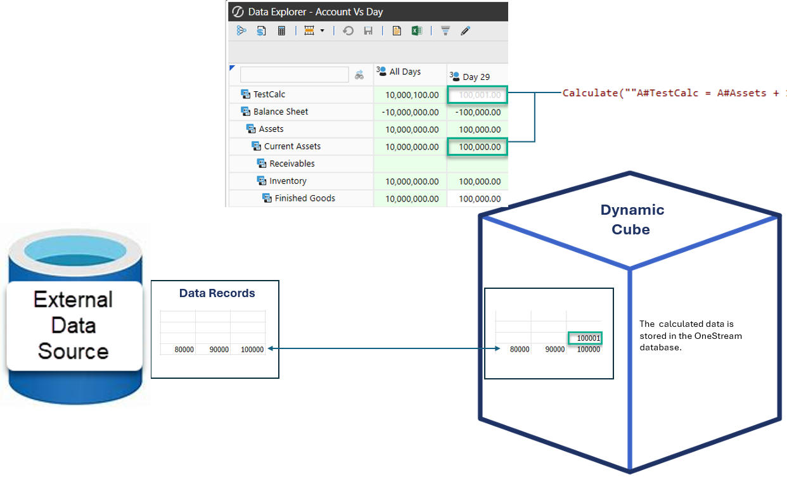

#### Share And Edit Data Using Workspace Assembly With

Calculations This model shares reference data from any non-cube source. You can use forms like cube views to edit the source data. You can filter members to share. For example, you might want to share data only for specific members. You can also perform calculations through workspace assemblies.

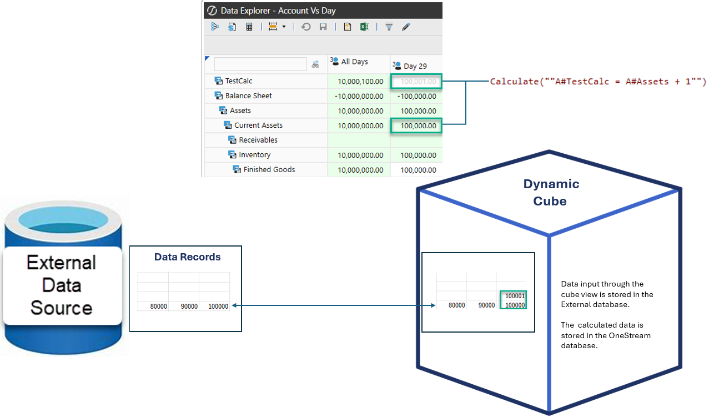

#### Copy Input Data From Workspace Assembly

With this model you can copy data from any source to data record tables.

### Dynamic Cube Query Performance

A dynamic cube improves reporting query performance by filtering the results from source cubes into smaller data units.

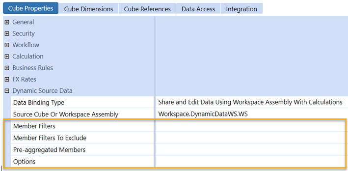

In Cube Properties > Dynamic Source Data section, set these properties: l Member Filters: Determines which data is included in query results. Use a comma separated list to include only members in the lists. This can include multiple dimension types, member expansions, or single members. To include all source data in query results, leave the field blank. l Member Filters to Exclude: Determines which data is excluded in query results. Use a comma separated list to exclude members in the lists. This can include multiple dimension types, member expansions or single members. If it includes members from the Member Filters property, those members are excluded. To exclude no data, leave the field blanka.

|Col1|NOTE: You cannot use Data Unit dimensions in the Member Filters or Member Filters to Exclude properties (Entity, Time, Consolidation, Scenario).|
|---|---|

l Pre-aggregated Members: Determines whether to share or copy data from a parent member, source, to a base member, target. Set the top member to a Base member to pre- aggregate if the detail of a dimension is not needed. This alleviates repetitive calculations for the same number. For example: UD1#Top=UD1#None,UD2#Top=UD2#None,UD3#Top=UD3#None,UD5#Top=UD5#Non e, UD5#Top=UD5#None, UD6#Top=UD6#None

|Col1|NOTE: Ensure the base members are included in the Member Filters property and the parents are included in the Member Filters to Exclude property.|
|---|---|

l Options: Optional and variable settings that provide additional control when running a hybrid share or copy. Options are name-value pairs. Ensure the option names, definitions, and syntax are accurate and include any custom name-value pairs if a business rule is used to copy. To include multiple options, enter the name-value pairs in a comma separated list.

### Dynamic Data Management

Workspace assembly files manage the retrieval and optional write-back of data between the external source and the data unit defined by the dynamic cube dimensions.

#### Workspace Assembly Dynamic Data

The Service Factory file references the DynamicData component. It initializes a class for a dynamic cube retrieval of data. Refer to the following example. VB Code Example case WsAssemblyServiceType.DynamicData: if (itemName.XFEqualIsIgnoreCase( "Dynamic Cube's Name")) { return new WsasDynamicData(); } C# Code Example switch (WsAssemblyServiceType.DynamicData) { case WsAssemblyServiceType.DynamicData: if (itemName.XFEqualIsIgnoreCase("Dynamic Cube's Name")) { return new WsasDynamicData(); } break; } When designing a DynamicData workspace assembly class file, consider the following three methods: l Triggering and refresh time-stamp controls. For details, see Workspace Assembly Dynamic Dimensions > Frequency and Trigger. l ReadDynamicDataUnitData: Returns a data unit object. For details, see Read Dynamic

#### Data Unit.

l SaveDynamicDataCells: (Optional) Manages the write-back of numeric and text data to a source. For details, see Save Dynamic Data Cells.

#### Read Dynamic Data Unit

Workspace Assembly files are designed to emulate the content of data record tables. The core definition must construct a list of data records that contain the required content of a data unit. This allows the Finance engine to properly interpret the data. The resulting data, which can be numeric or text-based, is in memory cached dynamic data. A data unit consists of these objects: l Entity l Parent l Scenario l Consolidation l Time (Year) A dynamic data service enables a dynamic cube to read and write data from an internal or external source.

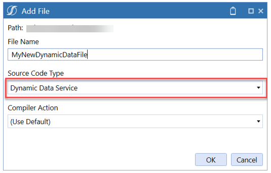

The file contains three functions to be implemented: l ReadDynamicDataUnitContentTimeStamp: Return a timestamp representing when the data might have changed. This will be used to determine whether cached data should be refreshed. Refer to Workspace Assembly Dynamic Dimensions.htm. l ReadDynamicDataUnitData: Return a DynamicDataUnitData object representing the requested DataUnit. The object can be populated with data coming from anywhere, including external databases and existing cubes. . l SaveDynamicDataCells: This function will receive cells modified via forms, giving developers the ability to send data to external systems or custom tables. . When creating a DynamicDataUnitData object to implement ReadDynamicDataUnitData, specify a timestamp indicating when the returned data was last changed ( [ contentTimestamp ] ) and how long to wait before the timestamp should be checked again ( numSecondsBeforeReadingContentTimeStamp). Refresh triggering options occur upon a change to the workspace assembly file. This occurs daily, hourly, and by the minute. Refer to the following example.

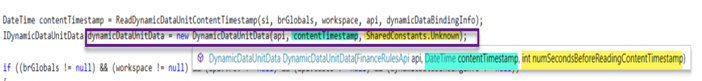

Data can be provided to the DynamicDataUnitData object as a DataRecord object or DataBufferCellPk: l DataRecord: One or more objects, representing all values in the year for a specific intersection. For example, having 12 values in a monthly application. See DataRecord. l DataBufferCellPk: Representing a specific intersection for a specific period only. For example, a single value in a single period, be it YTD or Periodic. See DataBufferCellPk.

#### Datarecord

DataRecord objects are typically created by specifying a DataRecordPk object (which contains the record coordinates, i.e. the members that define the intersection), and the number of cells it should have (one for each period in the year, e.g. 12 in a monthly application). ' define the Pk Dim drPk As New DataRecordPk( api.Pov.Cube.CubeId, _ api.Pov.Entity.MemberId, _ DimConstants.Unknown, _' this is parentId, optional at base level api.Pov.Cons.MemberId, api.Pov.Scenario.MemberId, _ 2025, _' use straight years here, not "timeId" ones accountId, flowId, originId, icId, _ u1id, u2id, u3id, u4id, u5id, u6id, u7id, u8id) ' create the record Dim newRecord as new DataRecord(drPk, 12) // define the Pk var drPk = new DataRecordPk(api.Pov.Cube.CubeId, api.Pov.Entity.MemberId, DimConstants.Unknown,  // this is parentId, optional at base level api.Pov.Cons.MemberId, api.Pov.Scenario.MemberId, 2025,  // use straight years here, not "timeId" ones accountId, flowId, originId, icId, u1id, u2id, u3id, u4id, u5id, u6id, u7id, u8id); // create the record var newRecord = new DataRecord(drPk, 12);

> **Note:** When using dynamic dimensions, IDs are automatically generated, and member

names could overlap with members or regular stored dimensions. The recommended best practice is to retrieve the dynamic member ID using the external ID or name. Dim accId = api.Members.GetMemberUsingExternalMemberId( _ api.Pov.AccountDim.DimPk, myExternalId).MemberId { var accId = api.Members.GetMemberUsingExternalMemberId(api.Pov.AccountDim.DimPk, myExternalId).MemberId; } Values can then be set in the record by manipulating the DataCells list of DataCacheCell objects. Note that YTD values are recommended for best performance. ' index determines the period - 0 is January, 1 is February, etc newRecord.DataCells(0).SetData(myDecimalAmount, DataCellExistenceType.IsRealData, DataCellStorageType.NotStored) newRecord.DataCells(1) = new DataCacheCell(myDecimalAmount, new DataCellStatus (DataCellExistenceType.IsRealData, DataCellStorageType.NotStored) { // index determines the period - 0 is January, 1 is February, etc newRecord.DataCells(0).SetData(myDecimalAmount, DataCellExistenceType.IsRealData, DataCellStorageType.NotStored); newRecord.DataCells(1) = new DataCacheCell(myDecimalAmount, new DataCellStatus (DataCellExistenceType.IsRealData, DataCellStorageType.NotStored)); } DataRecord objects can then be added to the DynamicDataUnitData instance using the following methods: l setDataRecord: To assign an individual instance l setDataRecords: To assign a List or other collection of instances in bulk.

#### Databuffercellpk

DataBufferCellPk objects represent individual values, and can be added directly to the DynamicDataUnitData object with the following methods: l SetDataCell: Sets numeric values to a defined time at the V#YTD or V#Periodic members. l SetDataCellAnnotation: Sets text values to a defined time at the V#Annotation member. l SetDataCellUsingCellIndex: Sets numeric values to a zero-based time index supporting full data unit emulation at the V#YTD or V#Periodic members. l SetDataCellAnnotationUsingCellIndex: Sets text values to a zero-based time index supporting full data unit emulation at the V#Annotation member. dynamicDataUnitData.SetDataCellUsingCellIndex(si, dataCellMonthIndex, dataBufferCellPk, amount, DataCellExistenceType.IsRealData, DataCellStorageType.Input); Return dynamicDataUnitData { dynamicDataUnitData.SetDataCellUsingCellIndex(si, dataCellMonthIndex, dataBufferCellPk, amount, DataCellExistenceType.IsRealData, DataCellStorageType.Input);/* TODO ERROR: Skipped SkippedTokensTrivia */ return dynamicDataUnitData; } The workspace assembly file should define all the base-level dimension intersections that are valid in the dynamic cube. Data will populate all the undefined members available to the data buffer. Data buffer members can be fixed to a base level member if they are not definable in the source system, such as the origin dimension targeting Import, AdjInput or Forms. Without reference, the consolidation dimension will be populated at local and translated. Local and specified currencies can be targeted.

> **Note:** The generated dataunit will not be further filtered by the system on the main

dimensions (Year, Scenario, Entity, Parent, Consolidation, and Cube). The system assumes that all records and cells appearing in the DynamicDataUnitData object belong to the dataunit that was requested, regardless of any DataRecordPK or DataBufferCellPK attached to the object. For example, if the requested dataunit was for entity Chicago and we added records pointing to entity New York, those records will still appear as pointing to Chicago !

#### Caching

DataUnits are cached in memory. For best performance, developers should ensure that data is served from such cache as much as possible; every execution of ReadDynamicDataUnitData will be significantly slower than just reusing cached data. The algorithm used by OneStream is similar to the one seen for Dynamic Dimensions:

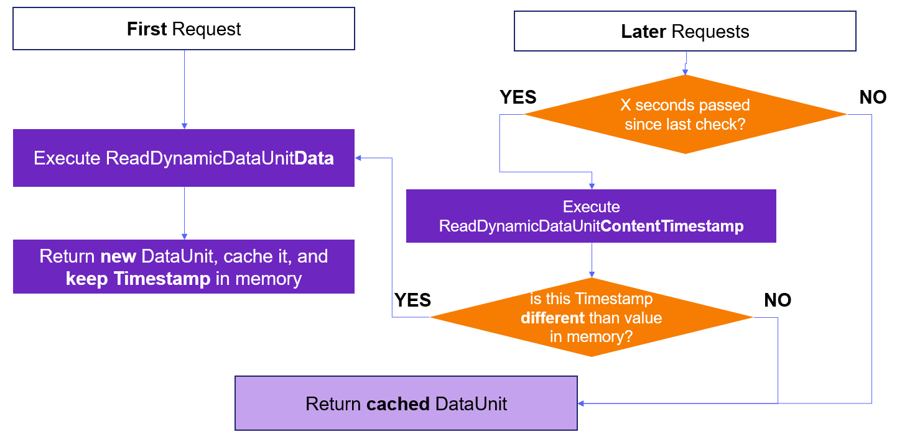

|Col1|Example: In the diagram above, "X seconds" is the value passed to the DynamicDataUnitData constructor as argument NumSecondsBeforeCheckingTimeStamp; likewise, the Timestamp is passed as the other argument to the same constructor.|
|---|---|

It is not possible to externally invalidate the cache. Because this logic is executed on each application server individually, if source data changes and caching timeouts are very long, a situation might arise where different users connected to different servers might observe different data until the timeout expires. If this is not acceptable, developers can set the timeout to a short value and add logic in ReadDynamicDataUnitContentTimestamp to look up a timestamp from a shared source (for example, a custom table); for best performance, this logic should be kept to a minimum, since this method could be called very often and by multiple processes.

#### Save Dynamic Data Cells

A dynamic cube designed for a workspace assembly using any data-binding type containing "Edit" must providemethods to manage the write-back of records. Write back is supported only on base level intersections of the O#Forms member. The SaveDynamicDataCells method will receive a list of records edited. The records are defined by OneStream-specific member IDs. For this reason, when using external sources such as an external database, the code logic will likely need to perform mapping to align with the target record keys. The developer is completely free to define such mapping or transformation logic in code, and to use whichever process is necessary to send data back (database writes, webservices, etc). A new dynamic data service assembly file automatically creates the SaveDynamicDataCells function. The function receives a list of the records that changed as dataCellEx objects, which have properties to retrieve all the details related to the DataCell.

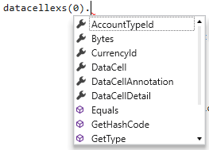

Both numeric and text values can be sent back to the source system. Changed cell records are attached to the Origin and View members in the following ways: l O#Forms:V#YTD or O#Forms:V#Periodic for numeric data l O#Forms:V#Annotations for text data When evaluating records, the view dimension should be used to target the results to the appropriate column or column type. Note how the example below performs checks on the View IDs to decide how data should be saved.

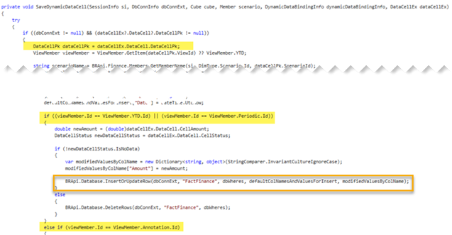

### Extracting Dynamic Dimensions

Dynamic Dimensions are defined, maintained, and initialized through workspace assembly files. For dynamic dimensions and dynamic cubes to functions in other applications and environments, workspaces must be present, as well as connectivity to required external sources. Where underlying requirements are not supported, or the requirement for a dynamic dimension does not exist, dynamic dimensions can be extracted as a standard dimensions. Note the following: l They are only supported by dimensions using metadata extract. l Dimensions extracted as dynamic dimensions only present the dimension properties in the XML output. To convert a dynamic dimension to a standard dimension: 1. Go to Application > Load Extract. 2. Select Metadata as the extract choice. 3. Select the dynamic dimension you want to extract. 4. Right-click and select Select Member to Extract. 5. In the dialog box, check the box labeled Extract Dynamic Dimension as Standard Dimension.

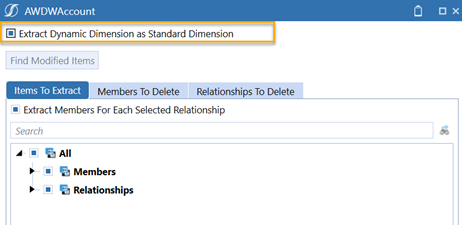

### Dynamic Dimensions And Smart Integration Connector

In some instances, dynamic dimensions and dynamic cubes access data sources that are public facing. In other instances, data sources are in a virtual private network (VPN) and require the use of Smart Integration Connector (SIC) to access. Refer to the following image.

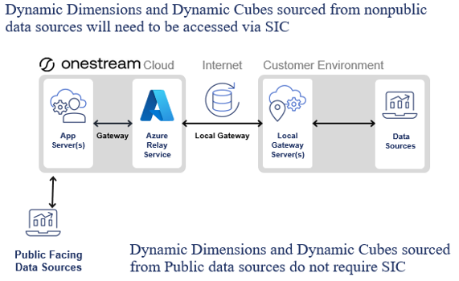

Smart Integration Connector setup is required to access non-public data sources. 1. A local gateway server should be installed and configured. There can be multiple servers including, development, production, disaster recovery, high availability, and multiple geographic locations depending on requirements. 2. The local gateway server should be added to OneStream.

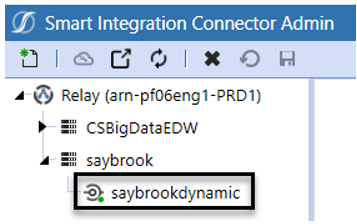

Local data sources must be green, indicating it is accessible. 3. Local data sources must be configured on the local gateway server.

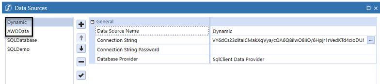

4. Local data sources must be added in the system configuration as Gateway Provider Types.

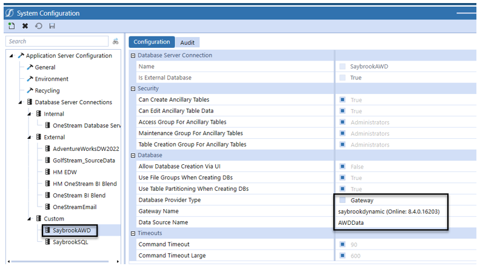

5. Data sources can be referenced in the workspace assembly.

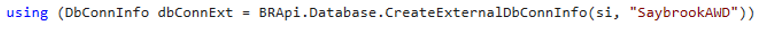

The code example above allows the OneStream cloud to communicate with the non-public data sources. The example in the image below is a dynamic hierarchy assembly that accesses a data source with a Smart Integration Connector.

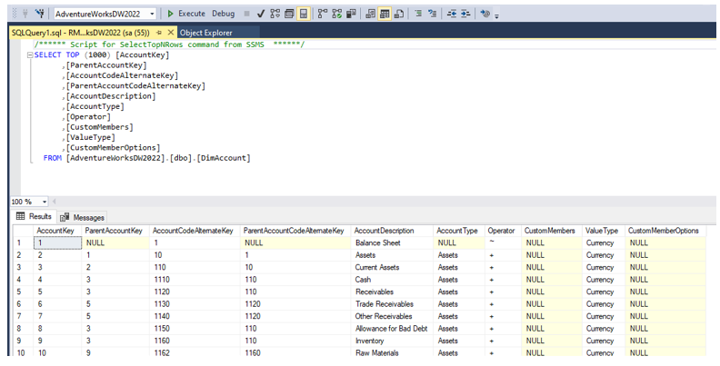

In this example, the name of the Smart Integration Connector gateway connection is SaybrookAWD.

### Master Data Considerations

Dynamic cubes and dynamic dimensions let you dynamically add members from external systems. Master data can then be managed by a central master data tool. Obtaining data from external systems may introduce member names that already exist in the system. Depending on the configuration of the data sources, this means that you might have existing members with the same name, but with different meanings and could lead to misinterpretation of data sets. For example, you could have a product member by the name of 10000 with a description of Widgets. An external data source might also have a product member named 10000, but in this external system, the member descriptions are Pencils. This could occur with multiple external data sources. Use a master data tool to manage all of this for you so that members have the same meaning across the enterprise.

#### Dynamic Dimension Use Cases

Dynamic Dimensions can be created from external sources that feed into dynamic cubes, or to define volatile structures with existing members. Cube filters let you exclude a member, or multiple members and dimensions. This allows you to perform data analysis for various scenarios. For example, you can exclude a member when considering the discontinuation of an operation.

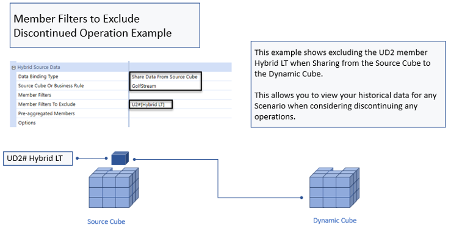

#### Dynamic Cube Use Cases

Large data units can impact application reporting performance. Dynamic Cubes can focus the data unit on filtered intersections of data. The focused data unit can return a smaller subset of data across all scenarios, as defined by cube properties. Dynamic Cubes can also be defined using stage attributes, marketplace registers, and custom datatables; this can enable easy reporting of non-cube data using cube-based tools like the Excel Add-in, cube views, and so on. Dynamic Cubes can be used to expose data produced by BI Blend as cubes, making it easier to mix with existing cube data. For best results, ensure the following: l Align the blend unit with the entity to pre-aggregate results l Leverage cube dimensions for transformation and aggregation points l Build aggregation points as derivative rules for pre-aggregated values l Use UD8 aggregation info in a dynamic dimension to generate metadata and aggregations l Plan required calculations using derivative rules and dynamic dimension member formulas Dynamic cubes used with external relational tables require Smart Integration Connector for non- public facing sources.

### Dynamic Cube Services API Reference

The following topics provide a breakdown of the classes required for implementation of Dynamic

### Cube Services:

l Common Arguments: objects available in all scripts; l Services: classes to implement in order to create dynamic cubes and dimensions; l Related Classes: classes that will typically be used when implementing Services.

#### Common Arguments

The following argument types are common to multiple methods and services.

|Name|Type|Description|
|---|---|---|
|si|SessionInfo|Generic information about the current user session, including the type of client. See the generic API Guide for details.|
|brGlobals|BRGlobals|In-memory store for basic data, which can be used to communicate between different methods of the same class as part of the execution flow. Note that its lifespan is short: as soon as a data request is fully satisfied (i.e. a dimension or dataunit has been created and returned), the object is destroyed.|

#### Services

Dynamic Cube Services must be enabled via a Service Factory. See the section on Configuring a Service Factory for more details on the overall approach.

#### Dynamic Dimension Service

This type of service is responsible for creating and refreshing a Dynamic Dimension. It should be returned by the Service Factory when an instance of type WsAssemblyServiceType.DynamicDimension is requested. It must implement interface IWsasDynamicDimensionV800, which requires the following methods:

#### Readdynamicdimensioncontenttimestamp

Return Type: DateTime This method returns a timestamp representing the last time the dimension has changed. If the system receives a timestamp more recent than the one associated with the last execution of ReadDynamicDimensionInfo, that method is executed again to rebuild the dimension. ReadDynamicDimensionContentTimestamp will be executed at periodic intervals, as specified by the DynamicDimensionInfo object returned by ReadDynamicDimensionInfo. In addition, different application servers might execute it at different times, and it might be triggered by a number of internal events. For this reason, it is recommended to keep its execution time as short as possible (i.e. very simple logic, few or no I/O calls, etc), to avoid impacting system performance. Note that individual application servers maintain their memory separately, so they might execute this method at different times, potentially returning different timestamps and hence letting users work with different hierarchies. Cache coordination can be implemented with custom logic between this method and ReadDynamicDimensionInfo.

#### Specific Arguments

api As IWsasDynamicDimensionApiV800 - see the related section args As DynamicDimensionArgs - see the related section

#### Readdynamicdimensioninfo

Return Type: DynamicDimensionInfo This method is responsible for creating and returning the DynamicDimensionInfo object representing the generated Dimension. It will be executed the first time the dimension is requested; the resulting object will be kept in the application server memory until its timestamp is found older than the one returned by a call to ReadDynamicDimensionContentTimestamp, at which point it will be discarded and replaced with a new execution of this method. Note that individual application servers maintain their memory separately, so they might execute this method at different times, potentially producing different hierarchies. Cache coordination can be implemented with custom logic between this method and ReadDynamicDimensionContentTimestamp.

#### Specific Arguments

api As IWsasDynamicDimensionApiV800 - see the related section args As DynamicDimensionArgs - see the related section

#### Service-Specific Arguments

Api as IWsasDynamicDimensionApiV800 This object provides various utilities for building and maintaining dynamic dimensions.

|Property|Type|Description|
|---|---|---|
|DbConnFW|DbConnInfo|Open connection to the Framework database|
|DbConnApp|DbConnInfo|Open connection to the Application database|
|BRGlobals|BRGlobals|In-memory store for basic data, which can be used to communicate between different methods of the same class as part of the execution flow. Note that its lifespan is short: as soon as a data request is fully satisfied (i.e. a dimension or dataunit has been created and returned), the object is destroyed.|
|Workspace|DashboardWorkspace|Reference to the Workspace containing the Assembly, including Text properties.|

Methods ReadDynamicDimensionInfo Return Type: DynamicDimensionInfo This method will build the entire hierarchy by executing an SQL query and mapping the resulting columns to member properties. It is not compulsory to use this function, but it is recommended whenever source member definitions are in SQL tables. Note that items can be further customized by manipulating the returned object. Specific Arguments: DateTime contentTimestamp The Timestamp to associate with this execution. As long as it continues to be more recent than what returned by ReadDynamicDimensionContentTimestamp, the system will not refresh the dimension. Int numSecondsBeforeReadingContentTimestamp How often, in seconds, the server should call RadDynamicDimensionContentTimestamp to verify cache validityi DbConnInfo dbConnExt Open connection to the database where the query will be executed. Please consider creating it with a Using block, for safety. string selectStatement The SELECT statement to execute. Note that WHERE and ORDER BY clauses should be omitted, and provided separately with their dedicated arguments listed below; this will allow for performance optimizations in the background. List<DbWhere> dbWheres WHERE clauses to be appended to the query, added to a List. For example a clause like "WHERE isEnabled = 'true' " should be expressed as: Dim dbWheres as new List(Of DbWhere)dbWheres.Add(New DbWhere ("isEnabled", DbOperator.IsEqualTo, "true") List<DbOrderBy> dbOrderBys ORDER BY clauses to be appended to the query, added to a List. Ordering records will influence the position of Members in the generated dimension. For example, a clause like "ORDER BY Name ASC" should be expressed as: Dim dbOrderBys As New List(Of DbOrderBy)dbOrderBys.Add(New DbOrderBy ("Name", True)) string memberNameColumn Name of the table field that contains member names. string memberDescriptionColumn, Name of the table field that contains member descriptions. string externalMemberIdColumn, Name of the table field that contains individual IDs for each member as present in the source system. OneStream will generate its own set of IDs, that will be automatically associated with the external ones in order to maintain a relationship with the source definitions. string externalMemberNameColumn name of the table field that contains member names as they appear in the source system. Note that it can be the same as memberNameColumn. string parentMemberNameColumn name of the table field that contains the names of the direct parent of a member. This will be used to build the hierarchy. string parentExternalMemberIdColumn name of the table field that contains the ID of the direct parent of a member, as it appears in the source system. If present, it will be used to build the hierarchy, taking precedence over parentMemberName and parentExternalMemberName. string parentExternalMemberNameColumn name of the table field that contains the name of the direct parent of a member, as it appears in the source system. If present, it will be used to build the hierarchy, taking precedence over parentMemberName. string aggWeightColumn name of the table field that will contain values to be used for the Aggregation Weight property of parent-child relationships. bool aggWeightIsPercentageNotFraction Boolean to specify whether the values found in aggWeightColumns are percentages (for example, 75) or fractions (for example, 0.75). CreateAndAddDynamicMembers This method can create several Dynamic Members starting from a source DataTable, adding them to a DynamicMemberCollection instance. Specific arguments DataTable dataTable The DataTable object containing member data. string memberNameColumn Name of the table field that contains member names. string memberDescriptionColumn, Name of the table field that contains member descriptions. string externalMemberIdColumn, Name of the table field that contains individual IDs for each member as present in the source system. OneStream will generate its own set of IDs, that will be automatically associated with the external ones in order to maintain a relationship with the source definitions. string externalMemberNameColumn name of the table field that contains member names as they appear in the source system. Note that it can be the same as memberNameColumn. DynamicMemberCollection dynamicMembers The collection object that will receive newly-created members. CreateAndAddDynamicRelationships This method can create several DynamicRelationships and add them to a DynamicRelationshipCollection object, starting from a DataTable that expresses such relationships. Note that any Dynamic Member involved must already exist in a DynamicMemberCollection object. See the sections on DynamicRelationship and DynamicRelationshipCollection for other details. Specific arguments DataTable dataTable The datatable object containing relationship information. DynamicMemberCollection dynamicMembers The collection object containing all DynamicMembers referenced in the relationships. See the relevant section. string memberNameColumn Name of the table field that contains member names. string externalMemberIdColumn, Name of the table field that contains individual IDs for each member as present in the source system. OneStream will generate its own set of IDs, that will be automatically associated with the external ones in order to maintain a relationship with the source definitions. string externalMemberNameColumn name of the table field that contains member names as they appear in the source system. Note that it can be the same as memberNameColumn. string parentMemberNameColumn name of the table field that contains the names of the direct parent of a member. This will be used to build the hierarchy. string parentExternalMemberIdColumn name of the table field that contains the ID of the direct parent of a member, as it appears in the source system. If present, it will be used to build the hierarchy, taking precedence over parentMemberName and parentExternalMemberName. string parentExternalMemberNameColumn name of the table field that contains the name of the direct parent of a member, as it appears in the source system. If present, it will be used to build the hierarchy, taking precedence over parentMemberName. string aggWeightColumn name of the table field that will contain values to be used for the Aggregation Weight property of parent-child relationships. bool aggWeightIsPercentageNotFraction Boolean to specify whether the values found in aggWeightColumns are percentages (for example, 75) or fractions (for example, 0.75). DynamicRelationshipCollection dynamicRelationships The collection object that will receive newly-created relationships. See the relevant section. Args as DynamicDimensionArgs This object provides context-specific properties of the dimension. Properties l Dim: Dim o Description: Generic properties for the dimension, including source configuration. Name Value Pairs defined on the Dimension configuration can be found in its DimMemberSourceNVPairs property1. l CachedDynamicDimensionInfo: DynamicDimensionInfo o Description: The dimension structure as it currently exists in cache. Note that this object can be null (for example, on first execution on a given appserver)

#### Dynamic Data Service

This service is responsible for creating and refreshing a Dynamic DataUnit for a Dynamic Cube. It should be returned by the Service Factory when an instance of type WsAssemblyServiceType.DynamicData is requested. It must implement interface IWsasDynamicDataV800, which requires the following methods:

#### Readdynamicdataunitcontenttimestamp

Return Type: DateTime This method returns a timestamp representing the last time the dimension has changed. If the system receives a timestamp more recent than the one associated with the last execution of ReadDynamicDataUnitData, that method is executed again to rebuild the dimension. ReadDynamicDataUnitContentTimestamp will be executed at periodic intervals, as specified by the DynamicDataUnitData object returned by ReadDynamicDataUnitData. In addition, different application servers might execute it at different times, and it might be triggered by a number of internal events. For this reason, it is recommended to keep its execution time as short as possible (i.e. very simple logic, few or no I/O calls, etc), to avoid impacting system performance. Note that individual application servers maintain their memory separately, so they might execute this method at different times, potentially returning different timestamps and hence letting users work with different data. Cache coordination can be implemented with custom logic between this method and ReadDynamicDataUnitData. Specific Arguments api As FinanceRulesApi - see related section dynamicDataBindingInfo As DynamicDataBindingInfo - see related section

#### Readdynamicdataunitdata

Return Type: DynamicDataUnitData This method is responsible for creating and returning the DynamicDataUnitData object representing the generated DataUnit. It will be executed the first time data is requested; the resulting object will be kept in the application server memory until its timestamp is found older than the one returned by a call to ReadDynamicDataUnitContentTimestamp, at which point it will be discarded and replaced with a new execution of this method. Note that individual application servers maintain their memory separately, so they might execute this method at different times, potentially producing different data. Cache coordination can be implemented with custom logic between this method and ReadDynamicDataUnitContentTimestamp. Specific Arguments api As FinanceRulesApi - see related section dynamicDataBindingInfo As DynamicDataBindingInfo - see related section

#### Savedynamicdatacells

This method can be used to receive data entered by users through a Cube View or Form, and save it to a source system or table.

> **Important:** DO NOT WRITE INTO INTERNAL ONESTREAM TABLES. Always save data in

custom tables or external systems.

#### Specific Arguments

cube As Cube Object representing Cube information and configuration. scenario As Member The Scenario containing modified cells. dynamicDataBindingInfo As DynamicDataBindingInfo see related section dataCellExs As List(Of DataCellEx) List of datacells containing submitted data.

#### Service-Specific Arguments

api As FinanceRulesApi This object contains methods and properties typically used in Finance Business Rules, see the generic API Guide for details.

> **Important:** although the object contains several "Set" methods to save data into cubes

(api.Data.SetDataCell etc), they should NEVER be invoked in this service. dynamicDataBindingInfo As DynamicDataBindingInfo This object contains information related to the configuration of the dynamic cube. Note that this is also available in Hybrid Scenario rules. All properties are Read-Only. Properties l IsCubeNotScenarioDataBinding: Boolean o Indicates whether the binding is used in a Dynamic Data Service (True) or in a Hybrid Scenario Business Rule (False). l DataBindingType: DynamicDataBindingType o Represents the value of the "Data Binding Type" property. l SourceCubeOrScenarioOrBRName: String o Contains the value of the "Source Cube or Workspace Assembly" property for cubes, or the "Source Scenario or Workspace Assembly" property for scenarios. l MemberFilters: String o Description: Holds the value of the "Member Filters" property. l MemberFiltersToExclude: String o Value of property "Member Filters to Exclude" l PreAggregatedMembers: String o Value of property "Pre-aggregated Members" l EndYear: int o In Hybrid Scenario Business Rules, the last Year containing data retrieved from Source l Options: String o Value of property "Options" l OptionsNameValuePairs: IReadOnlyDictionary(Of String, String) o Value of property "Options", parsed as a collection of Name-Value Pairs

#### Related Classes

The following object types are necessary to most Dynamic Cube Services implementations.

> **Note:** In the descriptions below, basic methods and properties (for example, ToString)

have been omitted.

> **Note:** Implementations typically require knowledge of other classes and BRApi

functions, typically found in Finance Business Rule (Member, DataCell, etc) and Connector Business Rules (DbConnInfo, etc).

#### Databuffercellpk Class

The DataBufferCellPk class is responsible for managing primary keys for data buffer cells, i.e. the combination of dimension members that points to an individual value. This is the same class typically found in advanced Finance Business Rules related to calculations.

#### Properties

|Col1|Col2|
|---|---|
|AccountId: int|Gets or sets the account ID.|
|FlowId: int|Gets or sets the flow ID.|

|Col1|Col2|
|---|---|
|OriginId: int|Gets or sets the origin ID.|
|ICId: int|Gets or sets the intercompany ID.|
|UD1Id: int|Gets or sets the user-defined dimension 1 ID.|
|UD2Id: int|Gets or sets the user-defined dimension 2 ID.|
|UD3Id: int|Gets or sets the user-defined dimension 3 ID.|
|UD4Id: int|Gets or sets the user-defined dimension 4 ID.|
|UD5Id: int|Gets or sets the user-defined dimension 5 ID.|
|UD6Id: int|Gets or sets the user-defined dimension 6 ID.|
|UD7Id: int|Gets or sets the user-defined dimension 7 ID.|
|UD8Id: int|Gets or sets the user-defined dimension 8 ID.|

#### Constructors

|Col1|Col2|
|---|---|
|DataBufferCellPk()|Initializes a new instance of the DataBufferCellPk class.|

|Col1|Col2|
|---|---|
|DataBufferCellPk(DataBufferCellPk from)|Initializes a new instance of the DataBufferCellPk class by copying an existing instance.|
|DataBufferCellPk(DataCellPk dataCellPk)|Initializes a new instance of the DataBufferCellPk class by copying an existing DataCellPk instance.|
|DataBufferCellPk(DataRecordPk dataRecordPk)|Initializes a new instance of the DataBufferCellPk class by copying an existing DataRecordPk instance.|
|DataBufferCellPk(int initialMemberIdForAllDims)|Initializes a new instance of the DataBufferCellPk class with the same initial member ID for all dimensions.|
|DataBufferCellPk(int accountId, int flowId, int originId, int icId, int ud1Id, int ud2Id, int ud3Id, int ud4Id, int ud5Id, int ud6Id, int ud7Id, int ud8Id)|Initializes a new instance of the DataBufferCellPk class with specified IDs for all dimensions.|

#### Methods

|Col1|Col2|
|---|---|
|CreateUnknown(): static DataBufferCellPk|Creates an instance of DataBufferCellPk with unknown values.|
|AreAllMembersSetToAll(): bool|Checks if all members are set to "all".|

#### Datacachecell Class

The DataCacheCell class represents a DataCell kept in memory.

#### Properties

|Col1|Col2|
|---|---|
|**CellAmount**: decimal|Gets or sets the cell amount.|
|**CellStatus**: DataCellStatus|Gets or sets the cell status.|

#### Constructors

|Col1|Col2|
|---|---|
|**DataCacheCell()**|Initializes a new instance of the DataCacheCell class.|
|**DataCacheCell(DataCacheCell from)**|Initializes a new instance of the DataCacheCell class by copying an existing instance.|
|**DataCacheCell(DataCacheCell from,** **decimal aggWeight)**|Initializes a new instance of the DataCacheCell class by copying an existing instance and applying an aggregation weight.|

|Col1|Col2|
|---|---|
|**DataCacheCell(DataCellStorageType** **dataCellStorageType)**|Initializes a new instance of the DataCacheCell class with the specified data cell storage type.|
|**DataCacheCell(DataCellExistenceType** **dataCellExistenceType,** **DataCellStorageType** **dataCellStorageType)**|Initializes a new instance of the DataCacheCell class with the specified data cell existence type and storage type.|
|**DataCacheCell(decimal cellAmount,** **DataCellStatus cellStatus)**|Initializes a new instance of the DataCacheCell class with the specified cell amount and cell status.|

#### Methods

|Col1|Col2|
|---|---|
|**SetData(decimal cellAmount,** **DataCellExistenceType** **dataCellExistenceType,** **DataCellStorageType** **dataCellStorageType)**|Sets the data for the cell in memory.|
|**Aggregate(DataCacheCell** **sourceDataCacheCell, decimal** **aggWeight, bool** **changeDerivedDataToRealData)**|Aggregates the data from the source data cache cell with the specified aggregation weight and changes data type from Derived to Real if specified.|

|Col1|Col2|
|---|---|
|**AggregateDataCacheCells** **(DataCacheCell[] sourceDataCells,** **DataCacheCell[] resultDataCells)**: static|Aggregates data cache cells from the source array to the rest array.|
|**ClearDataCacheCells(DataCacheCell[]** **dataCells, int lastPeriodIndexToClear)**: static bool|Clears the data cache cells up to the specified last period index.|
|**AreDataCacheCellsEqual** **(DataCacheCell[] dataCells1,** **DataCacheCell[] dataCells2)**: static bool|Checks if two arrays of data cache cells are equal.|

#### Datarecord Class

DataRecord objects represent a record in the DataUnit. Each record points to a specific combination of members for all dimensions, and contains all values of that intersection in a single year.

#### Properties

|Col1|Col2|
|---|---|
|**DataRecordPk**: DataRecordPk|Gets or sets the data record primary key, which holds references to the dimension members defining the intersection.|

|Col1|Col2|
|---|---|
|**DataCells**: DataCacheCell[]|Gets or sets the data cells. Note that cells can also be accessed directly from the object, e.g. Dim myCell as DataCacheCell = myDataRecordObject(0).|

#### Constructors

|Col1|Col2|
|---|---|
|**DataRecord()**|Initializes a new instance of the DataRecord class.|
|**DataRecord(int** **numDataCells)**|Initializes a new instance of the DataRecord class with the specified number of data cells, which should typically be the same as the amount of periods required in a DataUnit. For example, 12 for a monthly application.|
|**DataRecord** **(DataRecordPk** **dataRecordPk, int** **numDataCells)**|Initializes a new instance of the DataRecord class with the specified data record primary key and number of data cells, which should typically be the same as the amount of periods required in a DataUnit. For example, 12 for a monthly application..|
|**DataRecord** **(DataRecordPk** **dataRecordPk,** **DataCacheCell[]** **dataCells)**|Initializes a new instance of the DataRecord class with the specified data record primary key and data cells.|

|Col1|Col2|
|---|---|
|**DataRecord** **(DataRecord** **from)**|Initializes a new instance of the DataRecord class by copying an existing instance.|

#### Methods

|Col1|Col2|
|---|---|
|**Aggregate(DataRecord sourceDataRecord, decimal** **aggWeight)**|Aggregates the data from the source data record with the specified aggregation weight.|
|**Aggregate(DataRecord sourceDataRecord, decimal** **aggWeight, bool changeDerivedDataToRealData, int** **lastPeriodIndexToAggregate)**|Aggregates the data from the source data record with the specified aggregation weight, changes derived data to real data if specified, and aggregates up to the specified last period index.|
|**HasNonZeroCells()**: bool|Checks if the data record has non-zero cells.|
|**GetDataCellArrayLengthInYearForFrequency** **(SessionInfo si, TimeDimAppInfoEx timeDimAppInfo,** **int year, Frequency frequency)**: static int|Gets the length of the data cell array for a given year and frequency.|

|Col1|Col2|
|---|---|
|**ResizeDataCellArrayIfNecessary(TimeDimType** **timeDimType, int newNumDataCells)**: bool|Resizes the data cell array if necessary.|
|**ConvertToAnotherFrequency(SessionInfo si,** **DataRecord sourceDataRecord, TimeDimAppInfoEx** **timeDimAppInfo, int sourceFreqId, int destFreqId, ref** **bool foundDestCellsThatAreDerivedOrRealData)**: static DataRecord|Converts the data record to another frequency.|
|**ConvertDerivedDataCellToRealDataIfNecessary** **(DataCacheCell[] sourceDataCells, int** **indexOfSourceCellUsedToCreatePreviousDestCell, int** **indexOfSourceCellUsedToCreateThisDestCell,** **DataCacheCell destDataCell, ref bool** **foundDestCellsThatAreDerivedOrRealData)**: static|Converts derived data cells to real data if necessary.|
|**CreateNoDataDataRecord(DataRecordPk** **dataRecordPk, int numDataCells)**: static DataRecord|Creates a data record with no data.|

#### Datarecordpk Class

The DataRecordPk class is responsible for managing primary keys for data records, which means holding references to the dimension members defining the intersections that the record will contain.

#### Properties

|Col1|Col2|
|---|---|
|**CubeId**: int|Gets or sets the cube ID.|
|**EntityId**: int|Gets or sets the entity ID.|
|**ParentId**: int|Gets or sets the parent entity ID.|
|**ConsId**: int|Gets or sets the consolidation ID.|
|**ScenarioId**: int|Gets or sets the scenario ID.|
|**YearId**: int|Gets or sets the year ID.|
|**AccountId**: int|Gets or sets the account ID.|
|**FlowId**: int|Gets or sets the flow ID.|
|**OriginId**: int|Gets or sets the origin ID.|
|**ICId**: int|Gets or sets the intercompany ID.|
|**UD1Id**: int|Gets or sets the user-defined dimension 1 ID.|
|**UD2Id**: int|Gets or sets the user-defined dimension 2 ID.|

|Col1|Col2|
|---|---|
|**UD3Id**: int|Gets or sets the user-defined dimension 3 ID.|
|**UD4Id**: int|Gets or sets the user-defined dimension 4 ID.|
|**UD5Id**: int|Gets or sets the user-defined dimension 5 ID.|
|**UD6Id**: int|Gets or sets the user-defined dimension 6 ID.|
|**UD7Id**: int|Gets or sets the user-defined dimension 7 ID.|
|**UD8Id**: int|Gets or sets the user-defined dimension 8 ID.|
|**this[int** **dimTypeId]**: int|Returns the ID of the member for the dimension specified. Example: Dim myUd8MemberID as Integer = myDataRecordPK(DimType.UD8.Id)|

#### Constructors

|Col1|Col2|
|---|---|
|**DataRecordPk()**|Initializes a new instance of the DataRecordPk class.|
|**DataRecordPk(DataRecordPk from)**|Initializes a new instance of the DataRecordPk class by copying an existing instance.|

|Col1|Col2|
|---|---|
|**DataRecordPk(int cubeId, int entityId, int** **parentId, int consId, int scenarioId, int yearId,** **int accountId, int flowId, int originId, int icId,** **int ud1Id, int ud2Id, int ud3Id, int ud4Id, int** **ud5Id, int ud6Id, int ud7Id, int ud8Id)**|Initializes a new instance of the DataRecordPk class with specified IDs for all dimensions.|
|**DataRecordPk(int cubeId, int entityId, int** **parentId, int consId, int scenarioId, int yearId,** **DataBufferCellPk dataBufferCellPk)**|Initializes a new instance of the DataRecordPk class with specified IDs for DataUnit dimensions, retrieving IDs for the other dimensions from a provided DataBufferCellPk instance.|
|**DataRecordPk(DataCellPk dataCellPk, int** **yearId)**|Initializes a new instance of the DataRecordPk class for the provided year, retrieving member IDs from the provided DataCellPk instance.|
|**DataRecordPk(DataUnitCachePk** **dataUnitCachePk, DataBufferCellPk** **dataBufferCellPk)**|Initializes a new instance of the DataRecordPk class retrieving member IDs from the provided DataUnitCachePk and DataBufferCellPk instances.|

#### Dynamicdataunitdata

The DynamicDataUnitData class represents a DataUnit, which contains all records pointing to a specific Scenario/Entity/Year combination.

#### Properties

|Col1|Col2|
|---|---|
|**ContentTimestamp**: DateTime|Gets or sets the content timestamp. See the section on ReadDynamicDataUnitContentTimesta mp for more information.|
|**NumSecondsBeforeReadingContentTimesta** **mp**: int|The number of seconds before the content timestamp will be re-checked.|
|**NumTimePeriodsPerDataRecord**: int|Gets the number of time periods per data record. This depends on the application configuration; for example, a monthly application will require 12 periods per record.|

#### Constructors

|Col1|Col2|
|---|---|
|**DynamicDataUnitData(FinanceRulesApi api)**|Initializes a new instance of the DynamicDataUnitData class using the specified FinanceRulesApi instance.|
|**DynamicDataUnitData(FinanceRulesApi api,** **DateTime contentTimestamp, int** **numSecondsBeforeReadingContentTimestamp)**|Initializes a new instance of the DynamicDataUnitData class with the specified FinanceRulesApi instance, content timestamp, and number of seconds before checking the content timestamp.|

#### Methods

|Col1|Col2|
|---|---|
|**GetDataRecordCollection()**: DataRecordCollection|Returns the collection of DataRecord. This is a special List-like class with utility methods, see the relevant section for details.|

|Col1|Col2|
|---|---|
|**GetDataCellAnnotations()**: DynamicDataUnitAnnotationCollection|Returns a collection of data cell annotations. This is a special List-like class with utility methods, see the relevant section for details.|
|**SetDataRecords(SessionInfo si, IEnumerable** **dataRecords)**|Assign to the DataUnit all records contained in the provided IEnumerable. For example, a List or Array..|
|**SetDataRecord(SessionInfo si, DataRecord** **dataRecord)**|Add a single data record to the DataUnit.|
|**SetDataCell(SessionInfo si, int timeId,** **DataBufferCellPk dataBufferCellPk, decimal** **cellYTDAmount, DataCellExistenceType** **dataCellExistenceType, DataCellStorageType** **dataCellStorageType)**|Set a single data cell into the DataUnit. Note that it's typically preferable to work with DataRecords for better performance.|
|**SetDataCellUsingCellIndex(SessionInfo si, int** **zeroBasedCellIndex, DataBufferCellPk** **dataBufferCellPk, decimal cellYTDAmount,** **DataCellExistenceType dataCellExistenceType,** **DataCellStorageType dataCellStorageType)**|Sets a data cell using the cell index, where an index of 0 is the first period in the year, 1 is the second period, etc. Note that it's typically preferable to work with DataRecords for better performance.|

|Col1|Col2|
|---|---|
|**SetDataCellAnnotation(SessionInfo si, int** **timeId, int viewId, DataBufferCellPk** **dataBufferCellPk, string textValue)**|Sets a data cell annotation.|
|**SetDataCellAnnotationUsingCellIndex** **(SessionInfo si, int zeroBasedCellIndex, int** **viewId, DataBufferCellPk dataBufferCellPk,** **string textValue)**|Sets a data cell annotation using the cell index, where an index of 0 is the first period in the year, 1 is the second period, etc.|

#### Dynamicdimensioninfo

The DynamicDimensionInfo class represents a generated dimension.

#### Properties

|Col1|Col2|
|---|---|
|**ContentTimestamp**: DateTime|Gets or sets the content timestamp.|
|**NumSecondsBeforeReadingContentTimestamp**: int|Gets the number of seconds before reading the content timestamp.|
|**Members**: DynamicMemberCollection|Gets the collection of dynamic members.|
|**Relationships**: DynamicRelationshipCollection|Gets the collection of dynamic relationships.|

#### Constructors

l DynamicDimensionInfo(DateTime contentTimestamp, int numSecondsBeforeReadingContentTimestamp, DynamicMemberCollection members, DynamicRelationshipCollection relationships) Initializes a new instance of the DynamicDimensionInfo class with the specified content timestamp, number of seconds before reading the content timestamp, dynamic members, and dynamic relationships.

#### Dynamicmember

The DynamicMember class represents a single member of a Dynamic Dimension. It is effectively a wrapper around a regular Member object. In most cases, developers should obtain DynamicMember instances from the utility methods of a DynamicMemberCollection object.

> **Important:** if creating a Member instance from scratch, you should generate a unique ID with

the GetOrCreateMemberId method from a DynamicMemberCollection object.

#### Properties

|Col1|Col2|
|---|---|
|**Member**: Member|Gets or sets the Member object.|
|**VaryingMemberProperties**: VaryingMemberProperties|Gets or sets the varying member properties.|
|**MemberDescriptions**: Dictionary<string, MemberDescription>|Gets or sets language-specific member descriptions.|

#### Constructors

|Col1|Col2|
|---|---|
|**DynamicMember()**|Initializes a new instance of the DynamicMember class.|
|**DynamicMember(Member member,** **VaryingMemberProperties** **varyingMemberProperties,** **Dictionary<string, MemberDescription>** **memberDescriptions)**|Initializes a new instance of the DynamicMember class with the specified member, varying member properties, and member descriptions.|
|**DynamicMember(int dimTypeId, int** **memberId, string name, string description,** **int dimId)**|Initializes a new instance of the DynamicMember class with the specified dimension type ID, member ID, name, description, and dimension ID.|

#### Dynamicmembercollection

The DynamicMemberCollection class contains all members that will be available in a dynamic dimension. Optionally, it will maintain a set of mappings between members and their related information in an external system. The class also contains a number of utility methods to create Dynamic Members that can be added to the collection.

#### Properties

|Col1|Col2|
|---|---|
|**Count**: int|Gets the number of members in the collection.|

#### Constructors

|Col1|Col2|
|---|---|
|**DynamicMemberCollection()**|Initializes a new instance of the DynamicMemberCollection class.|

#### Methods

|Col1|Col2|
|---|---|
|**Add(SessionInfo si, DynamicMember member)**|Adds a dynamic member to the collection.|
|**CreateMember(SessionInfo si, Member member)**: static DynamicMember|Creates a dynamic member from a Member instance.|
|**CreateAndAddMember(SessionInfo si, Member member)**: DynamicMember|Creates a dynamic member from a Member instance and adds it to the collection.|
|**GetAllMembers()**: List<DynamicMember>|Gets all dynamic members in the collection.|
|**GetMember(int memberId)**: DynamicMember|Gets a dynamic member by its ID.|

|Col1|Col2|
|---|---|
|**GetMember(string memberName)**: DynamicMember|Gets a dynamic member by its name.|
|**GetMemberUsingExternalId(int externalMemberId)**: DynamicMember|Gets a dynamic member using its external ID.|
|**GetMemberUsingExternalName(string** **externalMemberName)**: DynamicMember|Gets a dynamic member using its external name.|
|**Clear()**|Clears all dynamic members from the collection.|
|**GetOrCreateMemberId(this DynamicMemberCollection** **thisDynamicMemberCollection, DbConnInfo dbConnApp,** **DynamicDimensionArgs args, ref string name)**: static int|Gets or creates a member ID, ensuring it doesn't overlap with member IDs already present in OneStream.|
|**CreateMember(this DynamicMemberCollection** **thisDynamicMemberCollection, DbConnInfo dbConnApp,** **DynamicDimensionArgs args, string name, string** **description)**: static DynamicMember|Creates a dynamic member with the specified name and description.|

|Col1|Col2|
|---|---|
|**CreateAndAddMember(this DynamicMemberCollection** **thisDynamicMemberCollection, DbConnInfo dbConnApp,** **DynamicDimensionArgs args, string name, string** **description)**: static DynamicMember|Creates a dynamic member with the specified name and description, and adds it to the collection.|
|**CreateMember(this DynamicMemberCollection** **thisDynamicMemberCollection, DbConnInfo dbConnApp,** **DynamicDimensionArgs args, string name, string** **description, int externalMemberId, string** **externalMemberName, object tag)**: static DynamicMember|Creates a dynamic member with the specified name, description, external ID, external name, and tag.|
|**CreateAndAddMember(this DynamicMemberCollection** **thisDynamicMemberCollection, DbConnInfo dbConnApp,** **DynamicDimensionArgs args, string name, string** **description, int externalMemberId, string** **externalMemberName, object tag)**: static DynamicMember|Creates and adds a dynamic member with the specified name, description, external ID, external name, and tag.|

#### Dynamicrelationship

The DynamicRelationship object represents a relationship between a parent DynamicMember and child DynamicMember, including the aggregation weight.

#### Properties

|Col1|Col2|
|---|---|
|**ParentMember**: DynamicMember|Gets or sets the parent member.|
|**ChildMember**: DynamicMember|Gets or sets the child member.|
|**AggregationWeight**: decimal|Gets or sets the aggregation weight.|

#### Constructors

|Col1|Col2|
|---|---|
|**DynamicRelationship()**|Initializes a new instance of the DynamicRelationship class.|
|**DynamicRelationship(DynamicMember** **parentMember, DynamicMember** **childMember, decimal** **aggregationWeight)**|Initializes a new instance of the DynamicRelationship class with the specified parent member, child member, and aggregation weight.|

#### Dynamicrelationshipcollection

The DynamicRelationshipCollection class is responsible for managing all relationships in a Dynamic Dimension. It contains a number of utility methods for creating Relationships, which can be added to the actual collection.

#### Properties

|Col1|Col2|
|---|---|
|**Count**: int|Gets the number of relationships in the collection.|

#### Constructors

|Col1|Col2|
|---|---|
|**DynamicRelationshipCollection()**|Initializes a new instance of the DynamicRelationshipCollection class.|

#### Methods

|Col1|Col2|
|---|---|
|**Add(DynamicRelationship** **relationship)**|Adds a dynamic relationship to the collection.|
|**CreateRelationship(SessionInfo si,** **DynamicMember parentMember,** **DynamicMember childMember)**: DynamicRelationship|Creates a dynamic relationship with the specified parent member and child member.|

|Col1|Col2|
|---|---|
|**CreateRelationship(SessionInfo si,** **DynamicMember parentMember,** **DynamicMember childMember,** **long siblingSortOrder, decimal** **udAggWeight)**: DynamicRelationship|Creates a dynamic relationship with the specified parent member, child member, sibling sort order, and aggregation weight.|
|**CreateRelationship(SessionInfo si,** **DynamicMember parentMember,** **Member childMember)**: DynamicRelationship|Creates a dynamic relationship with the specified parent member and child member.|
|**CreateRelationship(SessionInfo si,** **DynamicMember parentMember,** **Member childMember, long** **siblingSortOrder, decimal** **udAggWeight)**: DynamicRelationship|Creates a dynamic relationship with the specified parent member, child member, sibling sort order, and aggregation weight.|
|**CreateRelationship(SessionInfo si,** **Member parentMember,** **DynamicMember childMember)**: DynamicRelationship|Creates a dynamic relationship with the specified parent member and child member.|

|Col1|Col2|
|---|---|
|**CreateRelationship(SessionInfo si,** **Member parentMember,** **DynamicMember childMember,** **long siblingSortOrder, decimal** **udAggWeight)**: DynamicRelationship|Creates a dynamic relationship with the specified parent member, child member, sibling sort order, and aggregation weight.|
|**CreateAndAddRelationship** **(SessionInfo si, DynamicMember** **parentMember, DynamicMember** **childMember)**: DynamicRelationship|Creates a dynamic relationship with the specified parent member and child member, and adds it to the collection.|
|**CreateAndAddRelationship** **(SessionInfo si, DynamicMember** **parentMember, DynamicMember** **childMember, long** **siblingSortOrder, decimal** **udAggWeight)**: DynamicRelationship|Creates a dynamic relationship with the specified parent member, child member, sibling sort order, and aggregation weight, and adds it to the collection.|
|**CreateAndAddRelationship** **(SessionInfo si, DynamicMember** **parentMember, Member** **childMember)**: DynamicRelationship|Creates a dynamic relationship with the specified parent member and child member, and adds it to the collection.|

|Col1|Col2|
|---|---|
|**CreateAndAddRelationship** **(SessionInfo si, DynamicMember** **parentMember, Member** **childMember, long** **siblingSortOrder, decimal** **udAggWeight)**: DynamicRelationship|Creates a dynamic relationship with the specified parent member, child member, sibling sort order, and aggregation weight, and adds it to the collection.|
|**CreateAndAddRelationship** **(SessionInfo si, Member** **parentMember, DynamicMember** **childMember)**: DynamicRelationship|Creates a dynamic relationship with the specified parent member and child member, and adds it to the collection.|
|**CreateAndAddRelationship** **(SessionInfo si, Member** **parentMember, DynamicMember** **childMember, long** **siblingSortOrder, decimal** **udAggWeight)**: DynamicRelationship|Creates a dynamic relationship with the specified parent member, child member, sibling sort order, and aggregation weight, and adds it to the collection.|
|**GetAllRelationships()**: List<DynamicRelationship>|Gets all dynamic relationships in the collection.|

|Col1|Col2|
|---|---|
|**TryReplaceParent(oldParent,** **childParent, newParent)**: bool|Moves a child from the current parent to a new one and returns True on success. Any argument can be of type DynamicMember, Member, or int (member ID). If the dimension is extending another dynamic dimension, the new parent cannot belong to the parent dimension.|
|**Clear()**|Clears all dynamic relationships from the collection.|

## Bi Blend

BI-Blend is a “read-only” aggregate storage model that supports large-volume reporting for data that is not appropriate to store in a traditional Cube.  BI Blend data is large in volume and often transactional. For example, to analyze data by invoice, a standard cube requires metadata to store the data records.  Soon, most of the invoice metadata would not be needed given the transactional nature of the data. Therefore, storing transaction data in a Cube design is not a best practice. A key challenge of reporting on transactional data is presenting data in a uniform format for standardized reporting, while flexibility supporting ever changing records and reporting requirements.  The overall large size of the data sets requires a model suitable for responsive reporting and analysis. The BI Blend solution approaches these challenges in a unique and innovative way.  BI Blend rationalizes source data for uniform and standardized reporting, like the Standard Cube models, but stores the data in a new relational column store table for responsive reporting. Use BI-Blend to analyze large volumes of highly changing data, such as ERP system transaction data, which typically would not reside in a Cube.  Processing is free from the intensive audit controls within a traditional Consolidation Cube, such as managing calculation status.

### Key Elements Of Bi Blend

l Flexible for change l Fast Aggregation (through data as Stored Relational Aggregation) l Single Reporting Currency translation l Leveraged Metadata, Reporting and Integration tools l Non-Cube, executed to a relational table optimized for reporting on large data sets by storing results in a column store index For more information, see the BI Blend Design and Reference Guide.

## Relational Blending

The dynamic blending of data stored in a relational database with data stored/derived by the in- memory analytic engine is supported. Relational blending is a data management approach.  This enables analytic modelers to better manage the trade-offs between building unsustainable/poor performing complex analytic models that contain too much detail and the need to report on that level detail (data that may be transactional in nature or constantly changing).  Relational Blending makes it possible to seamlessly integrate detail data points into the analytic reporting process.

### Relational Blending Types

There are three methods of relational blending. 1. Drill-Back Blending (One-to-Many Relationship) This method of relational blending is used to provide access to detailed information that does not exist in the analytic model.  This capability is delivered right out-of-the box with its predefined drill back to stage detail data.  In addition, the stage integration engine provides drill-back and drill-around capabilities against external data. 2. Application Blending (One-to-Many Relationship) This method of relational blending leverages theOneStream Solution Specialty Planning and Compliance applications.  This collects information in a transactional register format and seamlessly maps/loads summarized data into an analytic model.  These applications also provide predefined transactional level reports as well as predefined drill-back connectors allowing drill-down from a summarized analytic model to the detailed register transaction data. 3. Model Blending (One-to-One Relationship) This method of relational blending combines the power of the in-memory analytic engine with the flexibility of relational database storage.  This functionality is provided as part of the Finance Engine API and the functions can be found under the api.Functions path in a Finance Business Rule.

### Model Blending

The following sections provide sample use-cases and explanations of how Model Blending is used to seamlessly integrate relational data points into an analytic model using Dynamic Member Calculations that leverage the relational blending API functions of the finance engine. A common challenge in analytic modeling is how to build a sustainable model when the definition of metadata and data becomes blurred.  The two use cases below provide examples of this modeling challenge.

#### Use Case 1

In many cases, analytic modelers are faced with the challenge of building a model containing Dimension Members that are unknown at design time or forced to build a Dimension containing Members that will be constantly changing.  Without relational blending, analytic modelers are forced to build models full of unknown members (TBD1, TBD2, etc.) with the hopes that users of the system do not need values beyond these placeholder members.  (This data is transactional and not a good candidate for an analytic model, Workforce Planning is a good example of this problem) This is a one-to-many issue so Drill-Back and Application Blending work well if the summary Cube is the primary focus of analysis and transactions are only used for supporting details.  Model blending can provide a benefit as well, but keep in mind that model blending must relate an analytic cell POV to a relational row or summarized row (one-to-one).  For Model Blending to be useful in these circumstances, the relational data must be returned in an aggregate format (avg, min, max, sum, count) in order to reduce the one-to-many relationship to a one-to-one Relationship.

#### Use Case 2

Analytic models that depend on Dimensions with Members that are constantly changing. Consider business problem where the analytic model is based on a fixed number of members (facility with rooms and beds).  This is easy from a modeling perspective; however, the user requirement is to build a model that is aware of the current occupant of the bed.  The logical metadata definition is room/bed, but the business problem requires the “occupant” to be defined as a Member for the model to be meaningful.  If occupant is used as a Member in the model, it is almost guaranteed that the analytic model will eventually become unsustainable due to the changing nature of the room/bed/occupant Dimension.  The administrator of this model now has the burden of constantly changing and rebuilding the model to reflect the current occupant data. This is a one-to-one issue, so Model Blending fits well and provides a tremendous amount of value.  Detailed and changing information can be continuously loaded and updated as attribute information in the OneStream Staging tables, Custom Relational Tables and the Model Blending API can be used to dynamically incorporate this information into analytic model through dynamic member formulas.

#### Model Blending Benefits

Relational blending is similar to the OneStream Staging engine in that it is a tool to protect the analytic engine.  Analytic modelers are aware that there is a powerful force with which they must contend when they are trying to create a well-designed, well-performing and maintainable model. That powerful force is Factorial Combination Math.  Analytic modelers understand that numbers of possible cells in a model (combinations) is determined by the number of Members in each Dimension multiplied by each other (1,000 Accounts x 100 Cost Centers x 10,000 Employees x 20 Regions = 20 billion combinations).  This phenomenon means that analytic modelers are in a constant battle.  They are trying to capture the data points required to understand the business process being modeled and model performance challenges created by the computational physics of factorial combination math.  In summary, it is easy to create an analytic model with a massive number of potential cells and as a result, end up with a poor performing model. Relational blending can help keep the size of an analytic model to a manageable level by allowing leaf level members to be kept in the relational table and only keeping summarize/static Members in the analytic model definition (Dimension Members).  Relational blending is not a cure-all, but it is an important tool for building maintainable well performing analytic models when a model has some dependencies on detailed information that cannot be clearly defined as metadata or data. In other words, the information is useful in the model, but it is so detailed or changes so much that it is difficult to incorporate into a rational metadata structure.

### Relational Blending API

The Relational Blending API functions listed below can be used to efficiently lookup a value in a cached relational table. This is based on the current POV values of the analytic engine or by providing specific override values for the Cube Name, Entity Name, Scenario Name, Time Name and Account Name. It is important to understand how caching of the data table is done.The CacheLevel parameter is used to control the cache granularity which will in turn control cache efficiency. To choose the most efficient CacheLevel value, determine how the data will be used in a Cube View. If the primary Cube View data request will be on a single data unit (Entity, Scenario, Time), then the best cache level choice would be BlendCacheLevelTypes.WfProfileScenarioTimeEntity. This is an efficient choice because the first time a cell is requested for the Entity, Scenario, Time combination, a query will run to load all the stage data for the combination. Then all subsequent cell requests would read values from cache. On the other hand, if the primary Cube View data request is for multiple Entities, then BlendCacheLevelTypes.WfProfileScenarioTime cache level would be a more efficient choice. This is more efficient because a single query would run to load all the data for the Scenario and Time into cache and then all subsequent cell requests would read values from cache. As a cautionary note, be aware that using coarse cache levels (reading more data at once into cache) only benefits performance when the target Cube View can read many values for the cache. If the target Cube View is only focused on one Entity/Account and the BlendCacheLevelTypes.WfProfileScenarioTime cache level is chosen, all rows for the entire Scenario and Time would need to be read into memory when only values for one Entity/Account combination was needed. In this case, BlendCacheLevelTypes.WfProfileScenarioTimeEntityAccount would be a more efficient cache level. In summary, choose a cache level that will minimize the number of actual database queries needed to run in order to get the desired cells for the target Cube View. This is not an exact science, and it may be difficult to choose a cache level that works efficiently for all target Cube Views. If there is a diverse set of Cube Views using relational blend data, consider creating specific Members that implement different cache levels that match the Cube View data pattern.

### Cache Level Types

BlendCacheLevelTypes.WfProfileScenarioTime Query will be run and cached using the supplied Workflow Profile, POV Scenario and POV Time as criteria and cache key. BlendCacheLevelTypes.WfProfileScenarioTimeEntity Query will be run and cached using the supplied Workflow Profile, POV Scenario, POV Time and POV Entity as criteria and cache key. BlendCacheLevelTypes.WfProfileScenarioTimeAccount Query will be run and cached using the supplied Workflow Profile, POV Scenario, POV Time and POV Account as criteria and cache key. BlendCacheLevelTypes.WfProfileScenarioTimeEntityAccount Query will be run and cached using the supplied Workflow Profile, POV Scenario, POV Time, POV Entity and POV Account as criteria and cache key. BlendCacheLevelTypes.Custom Intended to be used with custom table query (Cache level is explicitly controlled by the supplied SQL query). Query will be run and cached using the supplied cache name.

### Relational Model Blending API Functions

#### Getstageblendtextusingcurrentpov

Function Prototype Public Function GetStageBlendTextUsingCurrentPOV (ByVal cacheLevel As BlendCacheLevelTypes, ByVal cacheName As String, ByVal wfProfileName As String, ByVal fieldList As String, ByVal criteria As String, ByVal fieldToReturn As String, ByVal textOperation As BlendTextOperationTypes) As String Description Read a stage text attribute value from a cached ado.net data table using the current POV values and optionally perform concatenation on the results.

> **Note:** Cache only lives for the duration of the WCF call.

#### Parameters

cacheLevel Cache granularity level used to control how much information is cached in each chunk (Less granular cache level helps repeated calls but hurts requests for a single cell because more data is cached than necessary). cacheName Short name used to identify the values placed in the cache (Full CacheID will be CacheName + CacheLevel Values). wfProfileName Name of the Import Workflow profile containing the values to be looked up. (Pass an empty String to look up the workflow based on the POV Entity, use *.YourWFSuffix to get workflow profiles with the specified suffix.) fieldList List of STAGE fields that will be used as criteria and/or returned. Criteria Criteria statement used to select rows in the cached data table. fieldToReturn Name of the stage field to return. textOperation Text operation to perform on the resulting data table (Note: FirstValue returns the first matching row if there is more than one stage value for the specified cell). Return Type String

#### Example

'UD8 DynamicCalc - Lookup Attribute 1 From Stage If Not api.Entity.HasChildren Then Dim criteria As New Text.StringBuilder criteria.Append("U1T = '" & api.Pov.UD1.Name & "' ") criteria.Append("And U2T = '" & api.Pov.UD2.Name & "' ") Return api.Functions.GetStageBlendTextUsingCurrentPov(BlendCacheLevelTypes. WfProfileScenarioTimeEntity, "DU", "*.Sales Detail", "U1T,U2T,A1,ConvertedAmount", criteria.ToString, "A1", BlendTextOperationTypes.FirstValue) Else Return String.Empty End If

#### Getstageblendtext

Function Prototype Public Function GetStageBlendText (ByVal cubeName As String, ByVal entityName As String, ByVal scenarioName As String, ByVal timeName As String, ByVal accountName As String, ByVal cacheLevel As BlendCacheLevelTypes, ByVal cacheName As String, ByVal wfProfileName As String, ByVal fieldList As String, ByVal criteria As String, ByVal fieldToReturn As String, ByVal textOperation As BlendTextOperationTypes) As String Description Read a stage text attribute value from a cached ado.net data table using the specified POV values and optionally perform concatenation on the results.

> **Note:** Cache only lives for the duration of the WCF call.

#### Parameters

cubeName Name of the Cube to use for the POV. entityName Name of the Entity to use for the POV. scenarioName Name of the Scenario to use for the POV. timeName Name of the Time to use for the POV. accountName Name of the Account to use for the POV. cacheLevel Cache granularity level used to control how much information is cached in each chunk (Less granular cache level helps repeated calls but hurts requests for a single cell because more data is cached than necessary). cacheName Short name used to identify the values placed in the cache (Full CacheID will be CacheName + CacheLevel Values). wfProfileName Name of the Import Workflow profile containing the values to be looked up (Pass an empty String if to look up the workflow based on the POV Entity, use *.YourWFSuffix to get workflow profiles with the specified suffix). fieldList List of Stage fields that will be used as criteria and/or returned. Criteria Criteria statement used to select rows in the cached data table. fieldToReturn Name of the Stage field to return. textOperation Text operation to perform on the resulting data table (Note: FirstValue returns the first matching row if there is more than one stage value for the specified cell). Return Type String GetStageBlendNumberUsingCurrentPOV Function Prototype Public Function GetStageBlendNumberUsingCurrentPOV(ByVal cacheLevel As BlendCacheLevelTypes, ByVal cacheName As String, ByVal wfProfileName As String, ByVal fieldList As String, ByVal criteria As String, ByVal fieldToReturn As String, ByVal mathOperation As BlendNumericOperationTypes) As Decimal Description Read a stage numeric attribute value from a cached ado.net data table using the current POV values and optionally perform aggregation math on the results.

> **Note:** Cache only lives for the duration of the WCF call.

#### Parameters

cacheLevel Cache granularity level used to control how much information is cached in each chunk (Less granular cache level helps repeated calls but hurts requests for a single cell because more data is cached than necessary). cacheName Short name used to identify the values placed in the cache (Full CacheID will be CacheName + CacheLevel Values). wfProfileName Name of the Import Workflow profile containing the values to be looked up (Pass an empty String if you want to look up the workflow based on the POV Entity, use *.YourWFSuffix to get workflow profiles with the specified suffix). fieldList List of stage fields that will be used as criteria and/or returned. criteria Criteria statement used to select rows in the cached data table. fieldToReturn Name of the stage field to perform math on and return. mathOperation Math operation to perform on the resulting data table (Note: FirstValue returns the first matching row if there is more than one stage value for the specified cell). Return Type Decimal Example 'UD8 DynamicCalc - Lookup Average ConvertedAmount From Stage If Not api.Entity.HasChildren Then Dim criteria As New Text.StringBuilder criteria.Append("U1T = '" & api.Pov.UD1.Name & "' ") criteria.Append("And U2T = '" & api.Pov.UD2.Name & "' ") Return api.Functions.GetStageBlendNumberUsingCurrentPov(BlendCacheLevelTypes. WfProfileScenarioTimeEntity, "DU", "*.Sales Detail", "U1T,U2T,A1,ConvertedAmount", criteria.ToString, "ConvertedAmount", BlendNumericOperationTypes.AverageSkipZero) Else Return 0 End If GetStageBlendNumber Function Prototype Public Function GetStageBlendNumber(ByVal cubeName As String, ByVal entityName As String, ByVal scenarioName As String, ByVal timeName As String, ByVal accountName As String, ByVal cacheLevel As BlendCacheLevelTypes, ByVal cacheName As String, ByVal wfProfileName As String, ByVal fieldList As String, ByVal criteria As String, ByVal fieldToReturn As String, ByVal mathOperation As BlendNumericOperationTypes) As Decimal Description Read a stage numeric attribute value from a cached ado.net data table using the specified POV values and optionally perform aggregation math on the results.

> **Note:** Cache only lives for the duration of the WCF call.

#### Parameters

cubeName Name of the Cube to use for the POV. entityName Name of the Entity to use for the POV. scenarioName Name of the Scenario to use for the POV. timeName Name of the Time to use for the POV. accountName Name of the Account to use for the POV. cacheLevel Cache granularity level used to control how much information is cached in each chunk. Less granular cache level helps repeated calls but hurts requests for a single cell because more data is cached than necessary. cacheName Short name used to identify the values placed in the cache (Full CacheID will be CacheName + CacheLevel Values). wfProfileName Name of the Import Workflow profile containing the values to be looked up. Pass an empty String to look up the workflow based on the POV Entity, use *.YourWFSuffix to get workflow profiles with the specified suffix. fieldList List of Stage fields that will be used as criteria and/or returned. criteria Criteria statement used to select rows in the cached data table. fieldToReturn Name of the stage field to perform math on and return. mathOperation Math operation to perform on the resulting data table

> **Note:** FirstValue returns the first matching row if there is more than one stage value for

the specified cell Return Type Decimal GetStageBlendDataTableUsingCurrentPOV Function Prototype Public Function GetStageBlendDataTableUsingCurrentPOV(ByVal cacheLevel As BlendCacheLevelTypes, ByVal cacheName As String, ByVal wfProfileName As String, ByVal fieldList As String) As DataTable Description Read stage data into a cached ado.net data table using the current POV values so that it can be Queried / Analyzed in memory on the application server.

> **Note:** Cache only lives for the duration of the WCF call.

#### Parameters

cacheLevel Cache granularity level used to control how much information is cached in each chunk (Less granular cache level helps repeated calls but hurts requests for a single cell because more data is cached than necessary). cacheName Short name used to identify the values placed in the cache (Full CacheID will be CacheName + CacheLevel Values). wfProfileName Name of the Import Workflow profile containing the values to be looked up (Pass an empty String to look up the workflow based on the POV Entity, use *.YourWFSuffix to get workflow profiles with the specified suffix). fieldList List of Stage fields that will be used as criteria and/or returned. Return Type DataTable Example 'Lookup Attribute 1 From Stage Cached Data Table If Not api.Entity.HasChildren Then Dim result As String = String.Empty 'Get the DataTable from cache Using dt As DataTable = api.Functions.GetStageBlendDataTableUsingCurrentPov (BlendCacheLevelTypes.WfProfileScenarioTimeEntity, "DU", "*.Sales Detail", "U1T,U2T,A1,ConvertedAmount") If Not dt Is Nothing Then 'Execute a query against the data table and return the first matching row Dim criteria As New Text.StringBuilder criteria.Append("U1T = '" &amp; api.Pov.UD1.Name &amp; "' ") criteria.Append("And U2T = '" &amp; api.Pov.UD2.Name &amp; "' ") Dim rows As DataRow() = dt.Select(criteria.ToString) If rows.Count &gt; 0 Then result = rows(0)("A1") End If End If End Using Return result Else Return String.Empty End If GetStageBlendDataTable Function Prototype Public Function GetStageBlendDataTable(ByVal cubeName As String, ByVal entityName As String, ByVal scenarioName As String, ByVal timeName As String, ByVal accountName As String, ByVal cacheLevel As BlendCacheLevelTypes, ByVal cacheName As String, ByVal wfProfileName As String, ByVal fieldList As String) As DataTable Description Read stage data into a cached ado.net data table using the specified POV values so that it can be Queried / Analyzed in memory on the application server.

> **Note:** Cache only lives for the duration of the WCF call.

#### Parameters

cubeName Name of the Cube to use for the POV. entityName Name of the Entity to use for the POV. scenarioName Name of the Scenario to use for the POV. timeName Name of the Time to use for the POV. accountName Name of the Account to use for the POV. cacheLevel Cache granularity level used to control how much information is cached in each chunk. (The less granular cache level helps repeated calls but hurts requests for a single cell because more data is cached than necessary.) cacheName Short name used to identify the values placed in the cache (Full CacheID will be CacheName + CacheLevel Values). wfProfileName Name of the Import Workflow profile containing the values to be looked up (Pass an empty String to look up the workflow based on the POV Entity, use *.YourWFSuffix to get workflow profiles with the specified suffix). fieldList List of Stage fields that will be used as criteria and/or returned. Return Type DataTable GetCustomBlendDataTableUsingCurrentPOV Function Prototype Public Function GetCustomBlendDataTableUsingCurrentPOV(ByVal cacheLevel As BlendCacheLevelTypes, ByVal cacheName As String, ByVal sourceDBLocation As String, ByVal sourceSQL) As DataTable Description Read data from a custom table into a cached ado.net data table using the current POV values so that it can be Queried / Analyzed in memory on the application server.

> **Note:** Cache only lives for the duration of the WCF call.

#### Parameters

cacheLevel Cache granularity level used to control how much information is cached in each chunk (Less granular cache level helps repeated calls but hurts requests for a single cell because more data is cached than necessary). cacheName Short name used to identify the values placed in the cache (Full CacheID will be CacheName + CacheLevel Values). sourceDBLocation Database location name to query (Application, Framework, or a Named External Connection). sourceSQL SQL statement that defines the DataTable to cache for in memory querying. Return Type DataTable Example: 'Lookup Invoice Number From a Custom Table If Not api.Entity.HasChildren Then Dim result As String = String.Empty Dim queryToCache As New Text.StringBuilder queryToCache.Append("Select * ") queryToCache.Append("From InvoiceMaterialDetail ") queryToCache.Append("Where PlantCode = 'H200' And CustId = 'NH2421' And    InvYear = 2011 and InvMonth = 'M3'    ") 'Get the DataTable from cache Using dt As DataTable =  api.Functions.GetCustomBlendDataTableUsingCurrentPov (BlendCacheLevelTypes. Custom, "Material", "Revenue Mgmt System", QueryToCache.ToString) If Not dt Is Nothing Then 'Execute a query against the CUSTOM data table and return column InvNo for the first matching  row Dim criteria As New Text.StringBuilder criteria.Append("WorkDay = 15") Dim rows As DataRow() = dt.Select(criteria.ToString) If rows.Count > 0 Then result = rows(0)("InvNo") End If End If End Using Return result Else Return String.Empty End If GetCustomBlendDataTable Function Prototype Public Function GetCustomBlendDataTable(ByVal cacheLevel As BlendCacheLevelTypes, ByVal cacheName As String, ByVal sourceDBLocation As String, ByVal As String) As DataTable Description Read data from a custom table into a cached ado.net data table using the specified POV values so that it can be Queried / Analyzed in memory on the application server.

> **Note:** Cache only lives for the duration of the WCF call.

#### Parameters

cacheLevel Cache granularity level used to control how much information is cached in each chunk. (The less granular cache level helps repeated calls but hurts requests for a single cell because more data is cached than necessary.) cacheName Short name used to identify the values placed in the cache (Full CacheID will be CacheName + CacheLevel Values). sourceDBLocation Database location name to query (Application, Framework, or a Named External Connection). sourceSQL SQL statement that defines the DataTable to cache for in memory querying. Return Type DataTable

## Formulas

A formula is a set of calculation instructions to compute values. Formulas are written using Microsoft Visual Basic .NET procedures that use OneStream API function libraries and member script expressions. These combined capabilities provide a powerful programming environment delivering reliable compiled formula definitions.

### Formula Structure

#### Microsoft Visual Basic.Net With OneStream API And Member

Scripts All formulas and business rules run as compiled VB.NET code. In a VB.NET function or subroutine, calls are made to specific API functions which enable the rule writer to interact with the Analytic Engine.  Specific API functions are used to process member script expressions, and create calculated values in the analytic data model.

#### Common Finance APIs That Use Member Scripts

api.Data.GetDataCell(“A#Cash”) This returns a single numeric cell value. api.Data.GetDataCellEx(“A#Cash”) This returns a single numeric or text cell value. api.Data.SetDataCell(“A#Cash”, 5.00, False) This saves/writes a single data cell value. api.Data.Calculate(“A#Cash = A#Sales * 0.10”) This saves multiple data cells as stored values.

#### Basic Dynamic Cell Calculation

The following return a single cell. Calculate Current Ratio Return api.Data.GetDataCell("A#15000:O#Top / A#22000:O#Top") Formula Composition: VB.NET     Language Keyword(s) Return OneStream API    Function api.Data.GetDataCell("Member Script”) OneStream Member Script A#15000:O#Top / A#22000:O#Top

> **Tip:** When using a nested function (YearPrior(|POVTime|) in a GetDataCell call, you

must enclose the function in square brackets []. This is necessary because GetDataCell and the functions use “(“and “)” as indicators of the start/end points in the script. The inner functions must be wrapped in square brackets. GetDataCell("S#[|!ScenarioActual_GRT!|]:T#[YearPrior1(|CVTime|)][Period (|CVTime|)]"):Name("PYR Var")

#### Basic Stored Calculation

The following calculate and store multiple cells. Pull Prior Period Retained Earnings api.Data.Calculate("A#28000 = A#28999:T#POVPrior1") Formula Composition OneStream API    Function api.Data.Calculate("Member Script”) Member Script A#28000=A#28999:T#POVPrior1 You can use formula variables in member scripts to significantly improve performance when the same formula is used for multiple members. When using formula variables, the formula text remains the same, so there is no need for continued parsing and evaluation. Using variables can also improve performance if a member Id is used instead of a member name as the ID can also be used as the value in a formula variable. To use a formula variable in a member script, use a dollar sign $ instead of a pound # sign before the member name, and use the variable name after the dollar sign. Example 1 api.Data.FormulaVariables.SetTextVariable(“variableAccount”, “8150”) api.Data.Calculate(“A#8250=A$variableAccount * 10”) Example 2 Dim acctMember As Member = api.Members.GetMember(DimType.Account.Id, “8150”) api.Data.FormulaVariables.SetMemberVariable(“variableAccount”,acctMember) api.Data.Calculate(“A#8250= A$variableAccount * 100”) Example 3 Dim acctMember As Member = api.Members.GetMember(DimType.Account.Id, “8150”) Dim acctId As Integer = acctMember.MemberId api.Data.FormulaVariables.SetIntegerVariable(“myAccount”,acctId) api.Data.Calculate(“A#8250 = A$myAccount * 1000”)

### Applying Formulas

An administrator can create a formula on a Dimension Member or in a Business Rule.

#### Member Formulas

The preferred and more common approach is to write formulas on Dimension Members. Member formulas are written using the Formula property on individual Scenario, Account, Flow, or User Defined Members in the Dimension Library. The primary reasons for writing formulas on Dimension Members are they provide intuitive formula organization and promote reusability of Dimension and Members with their associated calculation across multiple Cubes.  They also enable parallel processing for performance optimizations using advanced multi-threading that executes multiple formulas at the same time.  Finally, writing formulas on Dimension Members support drill down from a calculated amount to the amount used as the source for calculation and they support the ability to vary formulas by Scenario and Time.  This is useful because changes can be made without affecting the calculation for older data or data in other Scenarios.

#### Finance Business Rules

Formulas can also be written using one or more Business Rule files. While this typically is not the preferred approach, it provides the ability to put all formulas in one location, and it is similar to the approach used by some older competitive products. The primary reasons for writing formulas in a Finance Business Rule are the formula requires extensive cross-dimensional dependencies and it is not clear on which Member an equivalent Member Formula should be written, or the formula requires complex sequential logic, variable, or conditional statements that affect multiple dependent calculations.  Another reason for writing formulas in a Finance Business Rule is when the application requires custom algorithms for Currency Translation, Share, or Intercompany Eliminations.

> **Tip:** Due to the sophisticated built-in translation and consolidation algorithms, most

applications only require Member Formulas for the Data Unit Calculation Sequence (DUCS) (i.e., Chart Logic). Custom Business Rules for Translation, Share, and Intercompany Eliminations are not typically needed.

> **Note:** Due to the way OneStream stores its data, Decimal should always be used

instead of Double or Integer when declaring variables that return a number within a Business Rule or Member Formula. Dim myNumber as Decimal = Api.Data.GetDataCell(“A#Sales – A#CostOfSales”).CellAmount See Business Rules in Application Tools for more details.

### Formula Types

Two types of formulas can be applied to dimensional members or members in a business rule file: l Dynamic Cell Calculation (Dynamic Calc): An in-memory calculation that runs on demand when a cell containing a dynamic member formula is requested.  A Dynamic Calc formula computes a value for a single cell and runs whenever the cell needs to be displayed without storing the result. l Stored Calculation: A persisted calculation that runs as part of the Data Unit Calculation Sequence (DUCS). With these formulas you can calculate many cells simultaneously, such as data buffer.

#### Performance Considerations

Dynamic Cell Calculation (Dynamic Calc): Dynamic Cell Calculations enhance the consolidation process because the amount is calculated when requested for display and is not written to the database. For reporting however, performance may be impacted because data is calculated on demand.  Dynamic calculations are usually used for ratio or percentage calculations. Stored Calculation: Consolidation performance is directly impacted by the volume and complexity of stored calculations. Carefully consider each stored calculation since one poorly written rule can cause large amounts of data to be written to the cube, negatively impacting consolidation performance. If you use many member formulas or if data volumes are not considered in member formulas, over 100,000 stored numbers may be generated from just 1,000 initially loaded numbers. The quantity of stored numbers is a critical factor to consider to optimize consolidation performance.

#### Reference And Aggregation Considerations

Dynamic Cell Calculations: Dynamic cell calculations can reference other dynamic cell calculations and stored calculations but should not be used by stored calculations because they do not naturally aggregate parent members. For example, if a parent member in an Account, Flow, or User Defined dimension has a child member calculated by a dynamic calculation formula, the parent excludes the child member from the aggregated amount. Achieve aggregation by writing another dynamic calculation on the parent member. Stored Calculations: Stored calculations can reference other stored calculations and parent members aggregate naturally.

> **Tip:** You do not need to write a stored calculation to add or subtract individual members.

Instead, create an alternative member hierarchy and use the Aggregation Weight property, set to -1.0 to negate. This aggregated value is dynamic and supports drill- down. Stored Calculation Evaluation Tools: You can access detailed process logging information. Run Force Consolidate With Logging and click Task Activity to analyze steps in the consolidation process to identify bottlenecks or errors for performance optimizations.  Examples: l Calculate with Logging l Translate with Logging l Consolidate with Logging Formula Calculation Threshold Monitoring: Calculation time threshold values can be set in the Application Server Configuration File using the NumSecondsBeforeLoggingSlowFormulas setting to log formulas exceeding the specified threshold time.

### Formula Execution

This section defines the types of calculations and calculation sequences used during different analytic processing routines.

#### Cube Processing

Calculation: This executes the standard calculation sequence for a single Data Unit. A Data Unit refers to a group of data cells for a specific Cube, Entity, Parent, Consolidation, Scenario, and Time Member. See Data Units in Workflow for more details on Data Units.  Except for Dynamic Cell Calculations, all Member Formulas are written to execute as part of a Data Unit’s Calculation Sequence. Translation: This executes a currency translation that occurs when the data for an Entity’s local currency needs to be translated to a foreign currency. The translation step executes after the system has run the Data Unit Calculation Sequence for an Entity’s local currency. After this is completed, the default translation algorithms use Foreign Exchange (FX) rates to generate and store a corresponding translated Data Unit. Finally, the Data Unit Calculation Sequence on the translated Data Unit to produce the final translated amounts are run. Consolidation: The Analytic Engine provides pre-built financial intelligence through a statutory Consolidation Dimension that defines a sequence of Data Unit calculations and aggregations which include currency translations, Parent-level adjustments, complex ownership computations, and Intercompany Eliminations.  For more details on Consolidation, see Consolidation. Dynamic Cell Calculation: Dynamic Cell Calculations are a special type of Member Formula for Account, Flow, or User Defined Members. They are used to generate amounts for a Member on the fly (i.e., the results are calculated on-demand and are not stored).  Dynamic Cell Calculations are often used for metric accounts (e.g., ratios involving other accounts) and are appropriate when the result of the Dynamic Calculation is not needed as the source number for another Stored Calculation. The use of Dynamic Cell Calculations can result in improved Consolidation performance because they do not generate stored numbers and are typically only executed when a number needs to be displayed, not during the Consolidation process.

#### Data Units And Formula Execution

OneStream executes formulas at a specific unit of work call a Data Unit. This section details the order and combination of logical processes that execute for a Data Unit.  See Using Data Units in Workflow. Guidelines on Formula Passes: There are 16 Formula Passes and one Dynamic Calculation Formula Type available on each Member.  Formulas that do not depend on one another can exist in the same formula pass and will be calculated in parallel using OneStream’s advanced parallel formula processing engine. As a basic guideline, customers should think about organizing formulas by account/collection type across OneStream’s available formula passes using the following examples. Formula Pass 1 - 8: Trial Balance Formula Pass 5 - 7: Translation logic related to Cash Flow Formula Pass 8 or 9: Balance Account and CTA account Formula Pass 9 - 16: Non-trial Balance All formulas in a pass are processed at the same time, so they cannot have dependencies on one another. Calculation Sequence of a Single Data Unit: The items below detail the specific list of tasks executed for each Data Unit’s calculation process.  As an example, the following steps are executed for a single Data Unit when a user selects Calculate for a single Entity, Scenario, and Time period.

#### Data Unit Calculation Sequences (Ducs)

1. Clear previously calculated data for the Data Unit. 2. Run the Scenario’s Member Formula, which is typically used for seeding a Scenario’s data from another Scenario or from a prior year. 3. Run reverse translations by calculating Flow Members from other Alternate Currency Input Flow Members. This is part of the built-in ability for an Entity to accept input using multiple currencies. 4. Execute Business Rules (1 and 2). Up to 8 Business Rule files can be attached to each Cube. 5. Run Formula Passes (1 – 4) for the Cube’s Account Dimension Members, then Flow Members, and then User Defined Members. The Formula Pass is specified using each Member’s Formula Type property in the Dimension Library. l Account, Flow, UD1, UD2, … UD8 (Member Formula Execution) 6. Execute Business Rules (3 and 4). 7. Run Formula Passes (5 – 8). l Account, Flow, UD1, UD2, … UD8 (Member Formula Execution) 8. Execute Business Rules (5 and 6). 9. Run Formula Passes (9 – 12). l Account, Flow, UD1, UD2, … UD8 (Member Formula Execution) 10. Execute Business Rules (7 and 8). 11. Run Formula Passes (13 – 16). l Account, Flow, UD1, UD2, … UD8 (Member Formula Execution) Every time a data cell is written to the database, information with the stored cell about how it was stored (e.g., manually entered, calculated, consolidated, etc.) is included.  If a number was calculated and stored as a result of a formula, it will always get cleared regardless of the metadata settings.  The AllowInput property specifies whether a cell can be written to, and therefore if a formula stored a number, there would be information if the cell was calculated.  If AllowInput is set to True, and a new number is typed over the same cell, it is stored as manually entered instead of a calculated cell.

#### Formula Execution For Statutory Consolidation Sequence

The consolidation process is run for a hierarchy of Entities.  See Consolidation.

#### Formula Level Controls

In addition to the Cube-level settings described above, VB.NET If statements are often used in a formula to have that formula execute only for certain types of Data Units. The most common usage is to contain checks for Base-Level Entities and local currencies. The following If statement will cause the formula to execute only for Base-Level Entities and the Entity’s default currency. This is often used when the results of the calculation in the Base-Level Entity is intended to be consolidated to Parent-Level Entities. If ((Not api.Entity.HasChildren()) And (api.Cons.IsLocalCurrencyForEntity())) Then End If

### Writing Formulas

The following section provide information on writing formulas.

#### Writing Dynamic Cell Calculations

When writing a formula for a Dynamic Calc Account, Flow, or User Defined Member in either a Member Formula or a Business Rule (via FinanceFunctionType.GetDataCell), the goal is to return an amount for a single data cell. In that case, the system knows the full 18 Dimensions of the data cell it needs to display. Therefore, use any of the api methods that refer to a specific Account, Flow, Intercompany, User Defined Dimension, etc. For example, a user selected a Cube View to view some numbers. The full 18 Dimensions for each cell the Cube View needs to display is determine that it needs to run a custom formula and it initializes the api, so it knows about all 18 Dimensions. The Member Formula then displays an amount on the Cube View.

#### Dynamic Calc Formula Examples

Return a Constant The simplest Dynamic Calc formula is to return a constant (i.e., the same number regardless of the intersection).  For example, select an Account (or a Flow or User Defined Member) in the Dimension Library, set the Formula Type property to DynamicCalc, and then enter the following line in the Member’s Formula property for the Default Scenario Type and Default Time Member. After typing the code, press the Compile button on the Formula Editor’s toolbar to make sure the VB.NET syntax is correct, press OK to close the dialogs, and then click Save. Return 123.4 If a Cube View is used to display the result of the above calculation for the Dynamic Calc account for any numeric intersection (any Entity, Scenario, Time, UD, etc. for View set to YTD), the Cube View will always display 123.4. If the account’s value is displayed for any text intersection (any Entity, Scenario, Time, UD, etc. for View set to Annotation), the Cube View will show an empty cell because the formula returned a numeric value, not a text value. To make the formula work for both numeric and text View Members, use an If statement to check which type of View Member is currently being requested. Then return a text value surrounded by double quotes when the View Member is an annotation type. After saving, run the Cube View using multiple View Members (YTD, Periodic, Annotation, Assumptions, etc.).  The corresponding cell will display either of the two constants specified. objViewMember As ViewMember = ViewMember.GetItem(api.Pov.View.MemberId) If objViewMember.IsAnnotationType Then Return "My first OneStream Member Formula" Else Return 123.4 End If

#### Return Types For Dynamic Calc Formulas

As shown in the example above, the return value for a numeric data cell can be a number such as a constant or a decimal variable, and the return type for a text intersection can be a text value such as words within double quotes or a String variable. However, when those types are returned, the underlying engine converts them to a DataCell or a DataCellEx object automatically. Therefore, if a DataCell or DataCellEx object was already contained by calling api.Data.GetDataCell, then it is recommended to return the full object instead of just the number contained within the DataCell object (i.e., which could be accessed using objDataCell.CellAmount). In order to specify status such as whether the cell is NoData, return a DataCell or DataCellEx and use its CellStatus property for those types of settings. A DataCell object is a wrapper for a DataCellPk object that defines the cell’s 18 Dimensional intersection, a decimal accessed using the CellAmount property to store the number, and a CellStatus containing other information about the cell such as NoData and Invalid Status. A DataCellEx object is a wrapper for a DataCell object and a text property called DataCellAnnotation which is used for setting a string for an Annotation type View Member. It also contains some additional properties for CurrencyId and AccountTypeId filled in and can be ignored when creating a DataCellEx object in a Dynamic Calc Member Formula. The following example accomplishes the exact same result as the example above, except this uses DataCell and DataCellEx objects to illustrate what to do if a return value containing cell status is needed. Dim objViewMember As ViewMember = ViewMember.GetItem(api.Pov.View.MemberId) If objViewMember.IsAnnotationType Then Dim objDataCellEx As DataCellEx = New DataCellEx() objDataCellEx.DataCell.CellStatus = New DataCellStatus(True) objDataCellEx.DataCellAnnotation = "My first OneStream Member Formula" Return objDataCellEx Else Dim objDataCell As DataCell = New DataCell() objDataCell.CellStatus = New DataCellStatus(True) objDataCell.CellAmount = 123.5 Return objDataCell End If

#### Using Math In Dynamic Calc Formulas

OneStream’s api.Data.GetDataCell function supports a powerful script parser that allows math equations to be written and operate on one or more data cells or constant amounts to calculate the values for a new data cell. For example, if a Dynamic Calc account needs to display Cash plus AcctsRec increased by 10%, this one-line Member Formula can do it. Return api.Data.GetDataCell("(A#Cash + A#AcctsRec) * 1.10") Notice the api.Data.GetDataCell function accepts one string Parameter in double quotes which represents a Member Script equation. Each operand of the equation (e.g., A#Cash) takes the unspecified Dimensions using the data cell currently being calculated. Therefore, every operand points to a specific data cell identified by using an 18 Dimension intersection. If the current data cell being calculated is: “E#CT:C#USD:S#Actual:#2013M1:V#YTD:A#NewAccount:F#None:O#Top:I#None:U1#None, …”, then the first operand is: “E#CT:C#USD:S#Actual:#2013M1:V#YTD:A#Cash:F#None:O#Top:I#None:U1#None, …” even though only “A#Cash” was specified. When writing Dynamic Calc formulas, specify any or all the 18 Dimensions if necessary. (e.g., “A#Cash:U1#AllProducts + A#AcctsRec:U1#None”)

#### Division In Dynamic Calc Formulas

Using Member Script equations in api.Data.GetDataCell as shown above is powerful for Dynamic Calc formulas, but there are occasions when all the math cannot be performed reliably in one line of script.  For example, use this formula to divide by a data cell when the data cell being used as the denominator is zero or NoData (i.e., a number was never entered). Since dividing by zero results in infinity and is an invalid operation for computers, the formula needs some extra checking. To illustrate additional concepts, here are three different examples of performing division in a Dynamic Calc formula. This first example uses the division operator (/) to calculate a data cell from one account divided by a data cell from another account. If the denominator (A#AcctsRec) is zero or NoData, it will automatically return a very large number (e.g., 9999999999999999999.0) as the result. This is because dividing by zero in mathematics results in infinity, and the large number to approximate infinity which allows subsequent functions or math operators that refer to the result to continue to be processed is used. Return api.Data.GetDataCell("A#Cash / A#AcctsRec") Although an extremely large number is the best mathematical approximation for infinity, it is typically not what administrators want to display in their financial system when source numbers are not available. A Divide function that produces a NoData cell if either the numerator or the denominator is NoData is available. Return api.Data.GetDataCell("Divide(A#Cash, A#AcctsRec)") The built-in Divide function is typically used when performing division in Dynamic Calc formulas. However, for completeness and to provide some insight about how to create more complex formulas, the following is an example of how to implement a formula that performs safe division. Notice that the Member Formula is performing division using two DataCell objects to create a resulting DataCell (Return numeratorDataCell / denominatorDataCell). This is a powerful capability that allows any type of math to be performed using any number of DataCell objects. Dim numeratorDataCell As DataCell = api.Data.GetDataCell("A#Cash") Dim denominatorDataCell As DataCell = api.Data.GetDataCell("A#AcctsRec") If ((Not numeratorDataCell Is Nothing) And (Not denominatorDataCell Is Nothing)) Then If ((Not numeratorDataCell.CellStatus.IsNoData) And _ (Not denominatorDataCell.CellStatus.IsNoData) And _ (denominatorDataCell.CellAmount <> 0.0)) Then Return numeratorDataCell / denominatorDataCell End If End If Return Nothing

> **Tip:** When using VB.NET, use the underscore character at the end of a line in order to

continue a statement on the next line.  For example, refer to the underscore after And in the code above. This was done here because the full statement did not fit on one line in this document. However, in the Member Formula editor, the If statement would be kept on one long line.

#### Days Sales Outstanding

Days Sales Outstanding (DSO) is a common formula that is a required calculation for many applications. Consequently, OneStream has provided a pre-built function to encapsulate the logic required for this function. Return api.Functions.GetDSODataCell("AcctsRec", "Sales") The example below demonstrates a possible customized version of the DSO calculation. Dim numDaysSum as Integer = 0 Dim currTimeId as Integer = api.Pov.Time.MemberPk.MemberId Dim acctsRec as decimal = api.Data.GetDataCell("A#AcctsRec - A#SaleTax").CellAmount If (acctsRec > 0.0) Then Dim salesSum as Decimal = 0.0 Dim numPeriodsInYear = api.Time.GetNumPeriodsInYearForSameFrequency(currTimeId) For (numPeriodsToSubtract As Integer = 0 To numPeriodsInYear) Dim timeId as Integer If numPeriodsToSubtract = 0 Then timeId = currTimeId Else timeId = api.Time.AddTimePeriods(-1 * numPeriodsToSubtract, True) End If Dim timeName As String = api.Time.GetNameFromId(timeId) Dim numDaysInTimePeriod As Integer = api.Time.GetNumDaysInTimePeriod(timeId) Dim MemberscriptBldr = New MemberscriptBuilder("A#Sales:V#Periodic").SetTime(timeName) Dim Memberscript As String = MemberscriptBldr.GetMemberscript() Dim salesForTimePeriod as Decimal = api.Data.GetDataCell(Memberscript).CellAmount If (salesForTimePeriod + salesSum >= acctsRec) Then Dim ratio As Decimal = (acctsRec - salesSum) / salesForTimePeriod numDaysSum = numDaysSum + (ratio * numDaysInTimePeriod) 'We are done Exit For Else numDaysSum = numDaysSum + numDaysInTimePeriod salesSum = salesSum + salesForTimePeriod End If Next End If Return api.Data.CreateDataCellObject(numDaysSum, False, False)

#### Dynamic Simulation Of Consolidation:

GetEntityAggregationDataCell Use a function called GetEntityAggregationDataCell for pseudo/approximate consolidation of a data cell with a Cube View when requested for display. The intention is not to produce a value that would tie to a formally consolidated number if custom Business Rules for ownership or translation are in play for such a financial model, but this on-the-fly dynamic value is presented to the user instantly as a convenience, typically during data entry. This function employs standard currency translation using the Entity in the cell’s POV’s local currency as the source and a parent Entity’s target and standard Percent Consolidation on the Relationship Properties to calculate Share. It does not take intercompany elimination into account unless that value was already consolidated and stored. api.Functions.GetEntityAggregationDataCell(memberScript as string, Optional useStoredAmountsWhereCalcStatusIsOK as Boolean, Optional fxRateTypeRevenueExpOverride as String, Optional fxRuleTypeRevenueExpOverride as FxRuleType, Optional fxRateTypeAssetLiabOverride as String, Optional fxRuleTypeAssetLiabOverride as FxRuleType) When useStoredAmountsWhereCalcStatusIsOK is set to True (the default setting), the algorithm checks if CalcStatus is OK for the intersection and uses numbers that are already calculated, translated, ownership share calculated, eliminated, consolidated and stored. This setting is also useful when displaying multiple translated currencies for consolidated parent Entities dynamically. If the parent Entity’s Local amount is OK and fully consolidated, the only dynamic calculation would be the last translation step. The last four optional settings let you specify alternate named FX Rate Types (e.g. “AverageRate”) and FX Rule Types (i.e. FxRuleType.Direct or FxRuleType.Periodic) to perform what-if simulations. If any of these four are specified, useStoredAmountsWhereCalcStatusIsOK is ignored and is treated as False because consolidated amounts would not have been stored using the alternate FX rates. Examples when used with a Dynamic Calc member (e.g. UD8): Return api.Functions.GetEntityAggregationDataCell("A#NetIncome:S#Budget:UD8#None") Return api.Functions.GetEntityAggregationDataCell("UD8#None", True, “AverageRate”, FxRuleType.Periodic) Return api.Functions.GetEntityAggregationDataCell("UD8#None", True, “AverageRate”, FxRuleType.Periodic, “HistoricalRate”, FxRuleType.Direct) Example use of GetEntityAggregationDataCell to enter inputs and instantly see aggregated results upon saving a Form: Create a UD8 Member named EntityAggregation and set its Formula Type to Dynamic Calc. Use this as the UD8 member's Formula: Return api.Functions.GetEntityAggregationDataCell("UD8#None")

#### Create A Cube View

Set Cube View POV tab to have Scenario set to Budget or whatever is desired on the Form and UD8 Member of EntityAggregation. Define rows that display a hierarchy of Entities. Define columns that display a few key Accounts. Include a base-level Account that supports input for both UD8#EntityAggregation and for input. E.g. A#Sales, A#Sales:UD8#None:Name(“Sales Input”) Change Cube View settings for General Settings / Common with Can Modify Data and Can Calculate set to True. Associate this Cube View with a Form Template which is assigned to a Workflow Profile. The user enters a number on the Form in the Account that accepts input and clicks Save. The user will see the dynamically aggregated Entity results without having to run a Consolidation.

#### Dynamic Calc Member Formula

This formula returns the name and description of the Entity’s UD1 Default Member. Other UD8 formulas can be created for the Entity’s UD2 Default, etc.  After adding the UD8 Member, the Entity’s Default UD1 Member name can be displayed using XFGetCell or in a Cube View by accessing the cell:  E#MyEntity:V#Annotation:U8#EntityDefaultUD2Name. This assumes that the UD8 Member with the formula is named EntityDefaultUD2Name. If XFGetCell is being used in Excel, use None or any valid Member for all the other Dimensions. 'Display the Member name of the entity's DefaultUD1 Member using the Annotation View Members. If api.View.IsAnnotationType(api.Pov.View.MemberId) Then Dim text As String = String.Empty Dim udId As Integer = api.Entity.GetDefaultUDMemberId(api.Pov.Entity.MemberId, DimType.UD1.Id) If udId <> DimConstants.Unknown Then Dim udMember As Member = api.Members.GetMember(DimType.UD1.Id, udId) If Not udMember Is Nothing Then text = udMember.NameAndDescription End If End If Return text End If 'If this is a numeric View Member (e.g., Periodic, YTD), display the number from the U8#None Member. Return api.Data.GetDataCell("U8#None")

#### Annotations On Dynamic Calc Members

To support the ability to calculate text or pull it from an external system to display in a Cube View, DynamicCalc or DynamicCalcTextInput formulas can be used.  If the user wants the formula to calculate the annotations, use a DynamicCalc formula to display text such as Pass and Fail. The DynamicCalcTextInput Formula Type works the same as a DynamicCalc formula, but it allows users to input annotations on Cube View cells without having to use the Data Attachment Dialog.  When this formula is used, the user can make annotations on Dynamic Calc Members following the same method as a non-calculated Member.

### Writing Stored Calculations

When writing a Member Formula or a Business Rule for a Stored Calculation, the new calculated numbers are being determined to store for that Cube, Entity, Parent, Cons, Scenario, and Time combination (i.e., a Data Unit). Return is never seen in a Member Formula for Formula Pass.  Instead of being returned, many numbers are being calculated and stored.   When running a Calculation, Translation, or Consolidation, the Member Formula calls for an entire Data Unit. It does not tell with which Account, Flow, or User Defined the numbers are being saved, this is the responsibility of the user. Initially, this may be confusing because Member Formulas are often written in an account’s Formula property, and administrators believe it will only allow that specific Member Formula to write to that specific account. However, putting a Member Formula in an account’s Formula property is only for organizational purposes. When it calls that formula, it is currently calculating a Data Unit and it will initialize the api with only the Data Unit Dimensions.

#### Basic Stored Formula Examples

The formula examples in this section demonstrate how to calculate basic stored values driven by formulas consisting of OneStream Member Script expressions.

#### Copy Data From Another Account

The following formula would be implemented as a Member Formula on the Sales1 account. It is executed as part of the DUCS during the Formula Pass that was specified in the account’s Formula Type setting. api.Data.Calculate("A#Sales1 = A#Sales2”) Stored Formula passes use Data Buffer math, not the Data Cell math that occurs for the single cell Dynamic Calc formulas.  Stored Formulas are multi-Dimensional. For example, the formula is executed for an entire Data Unit (e.g., Location1 Entity, USD Consolidation Member, Actual Scenario, January 2013 time period). That Data Unit is a portion of a Cube where the UD1 Dimension could contain 1,000 products to keep track of sales by product. Therefore, the data for the Sales2 account could contain a separate number for every Product (i.e., UD1), or if the Location1 Entity only sells some of the products, there might be 200 numbers for Sales2 and the other 800 products for Sales2 are NoData. That set of 200 numbers is called a Data Buffer. Data Buffers can get much larger and more complicated when multiple Dimensions are used for detailed analyses. However, since the same concepts still apply, it is easier to think about a smaller set of Dimensions as in this example. The formula “A#Sales1 = A#Sales2” is equivalent to saying, “Take the 200 numbers stored in the Sales2 Data Buffer and copy them to a new Data Buffer, but change the account to Sales1, and then store the new Sales1 Data Buffer in the database.” That one-line formula calculated and stored an additional 200 numbers that did not exist before the formula was executed. The formula below reads the Data Buffer for the Sales2 account (200 numbers) and then adds 50.0 to each of those 200 numbers to create a new Data Buffer that also contains 200 numbers. The account for each of the 200 numbers in the new Data Buffer is changed to Sales1 and it is then stored in the database. api.Data.Calculate("A#Sales1 = A#Sales2 + 50.0”) The newly modified formula below uses three accounts. That formula reads the Data Buffer for the Sales2 account (200 numbers) and then reads the Data Buffer for the Sales3 account. For example, the Sales3 account contains 100 numbers broken out by product in UD1, and 25 of those 100 numbers use the same UD1 Members as some of the numbers from Sales2. The other 75 Sales3 numbers are for other products not used by the Sales2 account. OneStream automatically combines the numbers from Sales2 and Sales3 and adds the Sales2 and Sales3 numbers that share a common intersection and also adds the additional non-common intersections. The result is a new Data Buffer containing 275 numbers stored in the database for the Sales1 account. api.Data.Calculate("A#Sales1 = A#Sales2 + A#Sales3”)

#### Copy Data From Another Scenario

The following formula would be implemented as a Member Formula on the Forecast Scenario. It copies all the data from the Actual Scenario and stores the results in the Forecast Scenario. The If statement in this example causes the data to be copied only for Base-Level Entities and each Entity’s local currency. This is because the example application wants the numbers for Parent Entities and foreign currencies to be determined using OneStream’s Consolidation and Translation algorithms, not by copying directly from another Scenario. Limit the formula to only copy data for certain Dimension Members by adding specific Members in the formula’s Member Script. For example, if the Forecast Scenario needs to copy only the Import Members, add O#Import to both sides of the equation.  If the Forecast Scenario needs to start with the sum of the Actual Scenario’s Import plus Forms plus AdjInput data and copy that into the Forecast Scenario’s O#Import Member, then use “S#Forecast:O#Import = S#Actual:O#Top”. When writing Stored Formulas, any Data Unit Dimension not explicitly specified uses the Dimension Member for the Data Unit currently being calculated. For any Account, Flow, Origin, IC, or User Defined Dimensions not explicitly specified, OneStream will use #All which is the syntax that represents all existing data for that Dimension. If ((Not api.Entity.HasChildren()) And (api.Cons.IsLocalCurrencyForEntity())) Then api.Data.Calculate("S#Forecast = S#Actual") End If To copy data from another Cube or Scenario that uses different Dimensionality, an example of the Scenario formula would be as follows: 'Convert dimensionality Dim destinationInfo As ExpressionDestinationInfo = api.Data.GetExpressionDestinationInfo("") Dim sourceDataBuffer As DataBuffer = api.Data.GetDataBuffer (DataApiScriptMethodType.Calculate, "Cb#AnotherCube:S#AnotherScenario",destinationInfo) Dim convertedDataBuffer As DataBuffer = api.Data.ConvertDataBufferExtendedMembers ("AnotherCube", "AnotherScenario", sourceDataBuffer) api.Data.SetDataBuffer(convertedDataBuffer, destinationInfo) To drill down on this formula, use the following example in the Scenario’s Formula for Calculation Drill Down setting: If api.Pov.Cube.Name.XFEqualsIgnoreCase("TheDestCube") Then Dim result As New DrillDownFormulaResult() result.Explanation = "Pseudo-formula: Cb#TheDestCube:S#TheDestScenario=Cb#AnotherCube:S#AnotherScenario” result.SourceDataCells.Add("Cb#AnotherCube:S#AnotherScenario") Return result End If Return Nothing

#### Out-Of-Balance

The following formula would be implemented as a Member Formula on the Balance account. It stores the difference of two other accounts. If ((Not api.Entity.HasChildren()) And (api.Cons.IsLocalCurrencyForEntity())) Then api.Data.Calculate("A#Balance = A#2899 - A#5999") End If

#### Cta Account Formula Examples

This is essentially the same formula as Out-Of-Balance, but only runs on translated Data Units. If ((Not api.Entity.HasChildren()) And (api.Cons.IsForeignCurrencyForEntity())) Then api.Data.Calculate("A#CTA = A#2899 - A#5999") End if

#### Reading A Specific Data Cell In A Stored Formula

Stored Formulas are executed for an entire Data Unit, so unlike Dynamic Calc formulas, there is no context about a specific View, Account, Flow, Origin, IC, or User Defined Member within the Data Unit. Therefore, to read the value for a Data Cell using api.Data.GetDataCell, a Member needs to be explicitly specified for all non-Data Unit Dimensions.  This is different than Dynamic Calc Member Formulas where the default setting for every Dimension Member comes from the Data Cell currently being displayed. Therefore, the following is incorrect when trying to read a specific Data Cell inside a Stored Formula: Dim objDataCell As DataCell = api.Data.GetDataCell("A#Cash") Instead, all non-Data Unit Dimensions need to be specified. If one or more of those Dimensions needs to be based on the other data stored in the Data Unit, then use Eval (for details on Eval see Advanced Stored Formulas using Eval below). Otherwise, the formula will look like this: Dim objDataCell As DataCell = api.Data.GetDataCell("V#YTD:A#Cash:F#None:O#Import:I#None :U1#None:U2#None:U3#None:U4#None:U5#None:U6#None:U7#None:U8#None") The syntax above is accurate but creating that long string for many Dimensions is tedious and error prone especially when using functions to determine what the Member names should be, and then concatenating multiple strings. Instead it is recommended to use the MemberscriptBuilder class when creating Member Scripts. Dim MemberscriptBldr = New MemberscriptBuilder("V#YTD:A#Cash") MemberscriptBldr.SetFlow("None").SetOrigin("Import").SetIC("None").SetAllUDsToNone() Dim Memberscript As String = MemberscriptBldr.GetMemberscript() Dim objDataCell As DataCell = api.Data.GetDataCell(Memberscript)

#### Advanced Stored Formulas Using Eval

As described in the examples above, OneStream’s Data Buffer math is extremely powerful and can process hundreds or thousands of numbers with just one simple equation. Without Data Buffer math or an equivalent scripting capability, a large multi-Dimensional financial application would not be feasible because every intersection would need to be considered separately.  There is a consequence when processing data using Data Buffers instead of individual Data Cells. Additional capabilities are needed when wanting to perform math differently based on the individual data cell amounts. Fortunately, OneStream accommodates that pattern using Eval. When implementing api.Data.Calculate functions, Eval has an advanced capability that provides the ability to get at the individual Data Cells in any Data Unit created while processing an api.Data.Calculate script. It even allows Eval() to be wrapped around a subset of the formula’s math in order to evaluate the Data Buffer that was just created by running that math. As an example for Eval, start with this formula: api.Data.Calculate("A#Sales1 = A#Sales2”) The Sales2 numbers need to be copied to Sales1 for “green” Products. In this fictitious example, there is a special tax situation for green products and the sales numbers for those products need to be isolated into the special Sales1 account.  The application uses the UD1 Member’s Text1 property to keep track of which products are green. The first thought might be to do something like the following (incorrect): Dim ud1Id As Integer = api.Pov.UD1.MemberId Dim text1 As String = api.UD1.Text(ud1Id, 1) If (text1.Equals("green", StringComparison.InvariantCultureIgnoreCase)) Then api.Data.Calculate("A#Sales1 = A#Sales2") End If However, this would not work because Stored Formulas are executed for an entire Data Unit. A Data Unit represents all data for a Cube, Scenario, Entity, Parent, Cons, and Time Member. Since there is no single product (i.e., UD1 Member) for the Data Unit currently being calculated, the first line above does not make sense.  A Data Unit cannot be asked what the UD1 MemberId is because a Data Unit has data for multiple UD1 Members (200 different products in the Sales2 example). The solution is using Eval to evaluate the individual Data Cells in a Data Buffer. Put the Eval keyword around any portion of the api.Data.Calculate function including math statements. After OneStream reads or calculates the DataBuffer defined within the Eval statement, it executes the Eval function to give the opportunity to filter the list of Data Cells in the Data Buffer, or to completely change the list of Data Cells in the Data Buffer. After the Eval function is completed, OneStream uses the modified Data Buffer to perform the remaining part of the api.Data.Calculate function. The example formula needs to be modified by adding the Eval keyword around the A#Sales2 Data Buffer, a helper function, typically the name OnEvalDataBuffer, needs to be implemented allowing an inspection, filter, and/or change to the Data Cells in the Data Buffer. The helper function Loops over each of the Sales2 Data Cells (200 in this example). If the Data Cell’s UD1 Text1 setting says green, add that Data Cell to a new list of result cells. Otherwise, ignore the Data Cell causing it to be skipped. The result is a new modified Data Buffer containing only the Data Cells for green products (i.e., fewer than 200 Data Cells). api.Data.Calculate("A#Sales1 = Eval(A#Sales2)", AddressOf OnEvalDataBuffer) Private Sub OnEvalDataBuffer(ByVal api As FinanceRulesApi, ByVal evalName As String, _ByVal eventArgs As EvalDataBufferEventArgs) 'Filter to list of Sales2 source numbers to only include numbers 'for "green" Products using each dataCell's UD1 Text1 setting. 'The final list of resultCells is what will be assigned to Sales1 by api.Data.Calculate. Dim resultCells As New Dictionary(Of DataBufferCellPk, DataBufferCell) For Each sourceCell As DataBufferCell In     eventArgs.DataBuffer1.DataBufferCells.Values If (Not sourceCell.CellStatus.IsNoData) Then Dim ud1Id As Integer = sourceCell.DataBufferCellPk.UD1Id Dim text1 As String = api.UD1.Text(ud1Id, 1) If (text1.Equals("green", StringComparison.InvariantCultureIgnoreCase)) Then 'Add this dataCell to the new list. resultCells(sourceCell.DataBufferCellPk) = sourceCell End If End If Next 'Assign the new list of DataCells to the result. eventArgs.DataBufferResult.DataBufferCells = resultCells End Sub

> **Note:** If using Eval for NoData and ZeroCells, refer to the Remove Functions in

Formulas section for alternative performance enhancing solutions.

#### Advanced Stored Formulas Using Getdatabuffer And

SetDataBuffer Most of the advanced stored formulas that need to process multiple Data Cells should use Eval. Eval allows the user to get at the individual Data Cells in any Data Unit while processing the Member Script in an api.Data.Calculate function. However, in some rare occasions, an appropriate Member Script may not be defined for the api.Data.Calculate function because multiple Data Cells that seem completely unrelated to each other are being processed and none of the Dimension Members are constant. For those rare situations, use the GetDataBuffer and SetDataBuffer functions directly. GetDataBuffer and SetDataBuffer are more fundamental then Eval. They are part of the internal implementation of the Eval functionality. They allow the user to read some numbers using a Member Script, process or modify each cell in the result, and then save the changes. In the following example, the UD2 and UD3 Dimensions are being used to analyze data based on each UD1 Member’s default settings for UD2 and UD3. All data is initially loaded to the U2#Input:U3#Input Members, but that loaded data needs to be copied to the U2#DefaultUD1:U3#DefaultUD1 Members. GetDataBuffer needs to be used in order to read the loaded data because the destination UD2 and UD3 Members can be different for every Data Cell based on its UD1 Member’s settings.  Loop over each Data Cell and use the UD1 Member to get its default UD2 and default UD3 settings. Then, change the UD2 and UD3 Member IDs for the Data Cell in the Data Buffer. Finally, after Looping, call SetDataBuffer to save the new numbers. When using api.Data.Calculate functions with or without Eval, it is important to know to which Member a formula is being attached.  For example, if the formula starts with api.Data.Calculate (“A#Sales1 = …”), put the formula in the Sales1 account Member’s Formula setting. However, the formula in this example is not writing to a specific Member. Every Data Cell being saved is possibly written to a different UD2 and UD3 Member. Technically speaking, the formula can be put in any Member’s Formula property even a seemingly unrelated Member.  If the Formula Pass is set correctly, the formula executes before any other dependent formulas. Assigning stored formulas to Members is for organizational purposes only. The Member does not restrict what the formula can do.  However, if a formula is attached to an unrelated Member, it will make the application difficult to maintain and understand. Therefore, decide to attach a formula like this to the Scenario’s Member which means this formula needs to be processed before most other formula passes.  If there are numerous Scenarios, this formula should be put in a Business Rule file, and the Business Rule file should be added to the Cube(s). This can be done under Application Tab|Cube|Cubes. See the completed formula using GetDataBuffer and SetDataBuffer below: 'Copy all "U2#Input:U3#Input" numbers for this dataUnit to the corresponding UD1 default Members for UD2 and UD3. Dim destinationInfo As ExpressionDestinationInfo = api.Data.GetExpressionDestinationInfo("") Dim sourceDataBuffer As DataBuffer = api.Data.GetDataBuffer (DataApiScriptMethodType.Calculate, _"U2#Input:U3#Input", destinationInfo) If Not sourceDataBuffer Is Nothing Then Dim resultDataBuffer As DataBuffer = New DataBuffer() For Each cell As DataBufferCell In sourceDataBuffer.DataBufferCells.Values If (Not cell.CellStatus.IsNoData) Then Dim ud1Id As Integer = cell.DataBufferCellPk.UD1Id cell.DataBufferCellPk.UD2Id = api.UD1.GetDefaultUDMemberId(ud1Id, DimType.UD2.Id) cell.DataBufferCellPk.UD3Id = api.UD1.GetDefaultUDMemberId(ud1Id, DimType.UD3.Id) resultDataBuffer.SetCell(api.DbConnApp.SI, cell) End If Next api.Data.SetDataBuffer(resultDataBuffer, destinationInfo) End If

#### Comparing Two Databuffers Using Eval2

Eval2 is the same as Eval except two Members Scripts are specified to define two DataBuffers. When finished, the OnEvalDataBuffer function can compare all the numbers in the two DataBuffers.  The example provided evaluates two separate Flow Members to see if they contain the same value. 'Use Eval2 to compare the numbers in 2 DataBuffers and store a value in F#USDOverride_Check for each pair of numbers that don't match. If ((api.Cons.IsLocalCurrencyForEntity()) And (Not api.Entity.HasChildren())) Then api.Data.Calculate("V#YTD:F#USDOverride_Check:O#Forms = Eval2(V#YTD:F#Local_Change_ Validation:O#Top,V#YTD:F#USDOverride_Change_Validation:O#Top)", AddressOf OnEvalDataBuffer) End If Private Sub OnEvalDataBuffer(ByVal api As FinanceRulesApi, ByVal evalName As String, ByVal eventArgs As EvalDataBufferEventArgs) 'This function compares the numbers in 2 DataBuffers and returns a new DataBuffer that has a value for each pair of numbers that don't match. eventArgs.DataBufferResult.DataBufferCells.Clear() If Not eventArgs.DataBuffer1 Is Nothing And Not eventArgs.DataBuffer2 Is Nothing Then 'For each cell in DataBuffer1, try to find a number for the same intersection in DataBuffer2. For Each cell1 As DataBufferCell In eventArgs.DataBuffer1.DataBufferCells.Values If (Not cell1.CellStatus.IsNoData) Then Dim cell2 As DataBufferCell = eventArgs.DataBuffer2.GetCell (api.SI,cell1.DataBufferCellPk) If Not cell2 Is Nothing Then If (cell1.CellAmount <> cell2.CellAmount) Then ‘Since the numbers don't match, add a cell to the result DataBuffer. Dim resultCell As New DataBufferCell(cell1) resultCell.CellAmount = 1.0 eventArgs.DataBufferResult.SetCell(api.SI, resultCell, False) End If Else 'A number exists in the 1st DataBuffer, but it doesn't exist in the 2ndvDataBuffer. 'Therefore, add a cell to the result DataBuffer. Dim resultCell As New DataBufferCell(cell1) resultCell.CellAmount = 1.0 eventArgs.DataBufferResult.SetCell(api.SI, resultCell, False) End If End If Next 'Now, for each cell in DataBuffer2, try to find a number for the same intersection in DataBuffer1 (the opposite of the loop above). 'Create a cell in the result DataBuffer for each DataBuffer2 cell that doesn't exist in DataBuffer1. For Each cell2 As DataBufferCell In eventArgs.DataBuffer2.DataBufferCells.Values If (Not cell2.CellStatus.IsNoData) Then Dim cell1 As DataBufferCell = eventArgs.DataBuffer1.GetCell (api.SI,cell2.DataBufferCellPk) If cell1 is Nothing Then 'A number exists in the 2nd DataBuffer, but it doesn't exist in the 1st DataBuffer. 'Therefore, add a cell to the result DataBuffer. Dim resultCell As New DataBufferCell(cell2) resultCell.CellAmount = 1.0 eventArgs.DataBufferResult.SetCell(api.SI, resultCell, False) End If End If Next End If End Sub

#### Referencing A Business Rule From A Member Formula Or

#### Business Rule

Finance Business Rules from Member Formulas or other Business Rules can be called. This is helpful when the same code must be copied to multiple Member Formulas and instead of using the same complicated code, a Public Function with two lines of code written in a Business Rule can be called. First, create a new Finance Business Rule (in this example, a Finance Business Rule called SharedFinanceFunctions was created) and then set the Contains Global Functions for Formulas property to True. If the Business Rule is only being used to hold Shared Functions, delete most of the content in the Main function.  However, a Main function is still needed even if it is empty. Next, create a Public Function or Sub in the Business Rule.  See below for an example.  If any edits to the Business Rule impact Calculation Status, assign the Shared Business Rule to the Cube under Application Tab|Cube|Cubes.  This is recommended. Use the Business Rule in a Member Formula by creating an instance of the Business Rule and assigning it to a variable.  Then, any of the Business Rule’s Public Functions or Sub can be called. Sample Member Formula Code: Dim sharedFinanceBR As New OneStream.BusinessRule.Finance.SharedFinanceFunctions.MainClass Dim myResult As String = sharedFinanceBR.Test(si, api, args) Sample Business Rule: Imports SystemImports System.Data Imports System.Data.Common Imports System.IO Imports System.Collections.Generic Imports System.Globalization Imports System.Linq Imports Microsoft.VisualBasic Imports System.Windows.Forms Imports OneStream.Shared.Common Imports OneStream.Shared.Wcf Imports OneStream.Shared.Engine Imports OneStream.Shared.Database Imports OneStream.Stage.Engine Imports OneStream.Stage.Database Imports OneStream.Finance.Engine Imports OneStream.Finance.Database Namespace OneStream.BusinessRule.Finance.SharedFinanceFunctions Public Class MainClass Public Function Main(ByVal si As SessionInfo, ByVal globals As BRGlobals, ByVal api As FinanceRulesApi, ByVal args As FinanceRulesArgs) As Object Try Return Nothing Catch ex As Exception Throw ErrorHandler.LogWrite(si, New XFException(si, ex)) End Try End Function Public Function Test(ByVal si As SessionInfo, ByVal api As FinanceRulesApi, ByVal args As FinanceRulesArgs) As String Try Return "This is the result of my Test function!" Catch ex As Exception Throw ErrorHandler.LogWrite(si, New XFException(si, ex)) End Try End Function End Class End Namespace

#### Conditionally Apply Formulas To Entities And Consolidation

Members Conditionally apply formulas to run only when needed.  For example, calculate headcount only at Base Entities and Local currency and the consolidation engine will do the rest. If (api.cons.IsLocalCurrencyForEntity And (Not api.entity.HasChildren)) Then api.data.calculate("A#10999=A#25999-A#25986") End If

#### Focus Consolidation To Calculate Only When Needed

There are up to seven calculation operations per Entity in the Consolidation process.  Add Conditional Statements to formulas to limit which Consolidation calculation processes will run for a particular formula. Base Entities Only If Not api.entity.HasChildren Then Local Currency Only If Api.Cons.IsLocalCurrencyforEntity Then Translated Currency Only If api.Cons.IsForeignCurrencyForEntity Then Parent-Child Relationships If api.Cons.IsForeignCurrencyForEntity Then returns True if the current calculated Consolidation Member also depends on the Parent Entity (i.e. OwnerPreAdj, Share, Elimination, OwnerPostAdj, Top).  If there are two different Parent Entities for the same Entity, then there are two different sets of numbers stored for those Consolidation Members. At Specific Level of Consolidation If (Not api.Entity.HasChildren()) And (api.Pov.Cons.Name.XFEqualsIgnoreCase("Elimination")) Then would run if the Entity is a parent and also if the member of the Consolidation dimension being processed in the Data Unit is Elimination. Note that this is the preferred function to use rather than the formerly supported api.Pov.Cons.ScriptName.

#### Formulas For Calculation Drill Down

To drill down on calculated Members, a formula must be entered in the Formula for Calculation Drill Down property.  This allows drilling to occur on calculated Account, Flow, User Defined or Scenario Members. Drill down can occur on data cells copied from one Scenario to another via formula or Data Management Sequence.  Before displaying the drill results, every cell’s Formula for Calculation DrillDown Scenario Property is executed.  The result determines whether the Scenario Member will appear as drillable or not.  Therefore, use If Statements in the formula to narrow in on the cell’s Storage Type and/or the POV Members associated with the data copy, so cells do not appear drillable when they are not. The example below copies data from the Actual Scenario Type to Budget: Dim result As New DrillDownFormulaResult() If args.DrillDownArgs.RequestedDataCell.CellStatus.StorageType = DataCellStorageType.Calculation Then ‘Use this to drill down to data that was copied using a Scenario Formula. result.Explanation = “Formula Definition: Actual = Budget” result.SourceDataCells.Add(“Cb#Houston:E#Houston:S#Actual”) Else If args.DrillDownArgs.RequestedDataCell.CellStatus.StorageType = DataCellStorageType.Input Then ‘Use this to drill down to data that was copied using Data Management. 'result.Explanation = “Data Management Defintion: Actual = Budget” ‘result.SourceDataCells.Add(“Cb#Houston:E#Houston:S#Actual”) End If Return Result

#### Global Entity For Driver Storage

A Global Entity can be created to store information that is unrelated to the company’s data such as switches, drivers, or values. To do this within the application, create the Entity and set the Is Consolidated property to False.  The Consolidation process will then skip this Entity allowing companies to use this for grouping purposes only.

### Avoiding Data Explosion

In some cases, many data intersections unintentionally explode in the Cube with unintended values. This can happen with multi-dimensional data structures. For example, an application has one Entity, four Accounts, 100 Products (UD1) and 100 Customers (UD2).  The user has entered three numbers in the system. (A#Sales:U1#Prod1:U2#Cust1=22.0,   A#Sales:U1#Prod5:U2#Cust1=33.0, A#Sales:U1#Prod7:U2#Cust100=55.0). The following cases explain what happens when writing the following Formulas.

#### Case 1: No Explosion

Use the following statement to set the value of a data intersection equal to another or a constant value. api.Data.Calculate(“A#Cash1 = A#RestrictedCash”) Cash1 Account will equal what was in the Restricted Cash Account.  The only UD1 and UD2 Members populated would be None Members because it is not typical to delineate Cash by Product, or Customer.

#### Case 2: No Explosion

api.Data.Calculate(“A#Profit:U2#Cust1 = A#Sales * 1.05”) Two of the three numbers are multiplied by 1.05 and copied from the Sales Account to the Profit Account which are only the source Sales numbers for Customer 1.

#### Case 3: Some Explosion

api.Data.Calculate(“A#Profit = A#Sales:U2#Cust1”) The user specified a Customer for source data but did not specify which customer to use when writing to the destination. This means answers are written to every base-level member of the Customer dimension, resulting in some data explosion. The Profit account has a number for every Customer (UD2) using the same Product (UD1) member as the source numbers. Profit account will have 300 numbers, but because there were three different source products, there will be some

#### Data Explosion.

Not specifying a Member for a Dimension is the same as specifying all for a Member.  If All is specified on the left only, data explosion occurs. Some level of data explosion occurs if: l The right side of an equation identifies a specific member or amount. l The left side of an equation specifies All for one or more dimensions.

#### Case 4: Large Scale Explosion When Setting To A Constant

api.Data.Calculate(“A#Profit = 2.0”) Profit will have 1000 numbers stored that are all Products by all Customers, causing large scale explosion.  However, this example is overly simple. If all Dimensions are used, trillions of numbers may be stored. A constant is the same as not specifying All for every Dimension on the right side of the equation.

#### Writing Formulas To Avoid Data Explosion

If a member is specified for a dimension on the right side of the equation, explicitly specify a value for that Dimension on the left side. The examples below are the same as Cases 3 and 4 from above, but this time the formulas are written to avoid data explosion.

#### Case 3: Specify A Target On The Left Side Of The Equation

api.Data.Calculate(“A#Profit = A#Sales:U2#Cust1”) would be better written as api.Data.Calculate (“A#Profit:U2#Cust1 = A#Sales:U2#Cust1” ) if that is what is intended. If the user intended on copying Cust1’s Sales figures to every Customer intersection under the Profit Account, the formula would need to be written as follows: api.Data.Calculate(“A#Profit:U2#All = A#Sales:U2#Cust1”

#### Case 4:

api.Data.Calculate(“A#Profit = 2.0”) will fail since the constant of 2.0 implies All Members from each Dimension.  In order for this Formula to execute, it needs to be api.Data.Calculate (“A#Profit:F#All:O#All:I#All:U1#All:U2#All:U3#All:U4#All:U5#All:U6#All:U7#All:U8# All = 2.0”), although the user may choose to do otherwise.

#### Avoiding Data Explosion In Stored Formulas

When writing stored calculations, the Member Script equations in api.Data.Calculate end up reading or calculating one or more Data Buffers for the purpose of saving a resulting Data Buffer. As described earlier, thousands of Data Cells could be processed using a seemingly simple one- line formula. Data Explosion can occur when a formula is inadvertently written to read or calculate a Data Buffer and then copy all  Data Cells in that Data Buffer multiple times to every base-level Member of a Dimension using the resulting Data Buffer (often causing hundreds of thousands of new numbers to be saved). We only apply calculation to intersections where data exists. Fortunately, OneStream protects the user from writing formulas that could result in data explosion, but the concepts are important to understand because it is possible to circumvent those protections. Consider the formula from an earlier example: api.Data.Calculate("A#Sales1 = A#Sales2 + A#Sales3”) Now, the formula is changed, so it only copies the sales data for specific customers with UD2 being the Customer Dimension. api.Data.Calculate("A#Sales1:U2#None = A#Sales2:U2#CustomerX + A#Sales3:U2#CustomerY”) The above formula will not result in data explosion because there is the same level of detail (i.e., the same Dimensions) specified in the destination as in every source operand. The example now reads the Sales2 data for CustomerX, adds it to the Sales3 data for CustomerY, and saves the results in the Sales1 account and the UD2 None Member. The following formula is written to cause Data Explosion: api.Data.Calculate("A#Sales1 = A#Sales2:U2#CustomerX + A#Sales3:U2#CustomerY”) The UD2 Dimension is specified for the source operands which is the right-hand side of the equals sign, but UD2 is not specified for the destination which is the left-hand side of the equals sign. When processing this formula, OneStream will read the two Data Buffers and add them together correctly as before. However, it then needs to assign the combined Data Buffer to the Sales1 Account. However, the system cannot use U2#CustomerX or U2#CustomerY because Data Cells were created by adding those together and it cannot arbitrarily choose one over the other. The system could also have defaulted to use the U2#None Member, but history suggests that this type of rule is more often written in error, and the customer did not intend the results to be stored in the U2#None Member. From a maintenance perspective, OneStream feels that it is better to explicitly specify U2#None if that is the intended destination Member. If something like this were to happen, OneStream will provide an error message notifying the user that data explosion will occur when trying to execute the above formula. Otherwise, the formula will copy the source Data Buffer to every base-level UD2 Member because #All is the default setting for each unspecified Member. To circumvent the error message and force data explosion (please do not do this), explicitly specify U2#All in the destination as shown below. This should be avoided and #All should never be used in Member Scripts for stored formulas. However, the capability is provided for extremely rare circumstances where that functionality was relied upon using an older product. In this case, the consultant carefully analyzed the quantity of data and metadata settings to ensure the data explosion resulted in a manageable number of Data Cells.

> **Caution:** This causes Data Explosion! Do not ever use #All explicitly in stored

Member Formulas. api.Data.Calculate("A#Sales1:U2#All = A#Sales2:U2#CustomerX + A#Sales3:U2#CustomerY”)

## Key Functions

The list below contains the most commonly used functions; however, this is not the complete list of all available functions.  See the API Overview Guide.

### Account

|Name|Function|Description|
|---|---|---|
|Account Type|Public Function GetAccountType (MemberId As Integer) As AccountType myAccountType = api.Account.GetAccountType (MemberId)|Retrieves the Account type for the Member.|

|Name|Function|Description|
|---|---|---|
|Get Cell Account Type|GetCellLevelAccountType|Retrieves the Account type of the data cell based on its Account and flow settings.|
|Get Formula Type|Public Function GetFormulaType (MemberId As Integer) As FormulaType myFormulaType = api.Account.GetFormulaType (MemberId)|Returns the Formula Type if the Account is calculated.|
|Get Plug Account|Public Function GetPlugAccount (MemberId As Integer) As Member myMember = api.Account.GetPlugAccount (MemberId)|Retrieves the plug Account.|

### Consolidation

|Name|Function|Description|
|---|---|---|
|Calculate|Public Sub Calculate(Formula As String, Optional onBeforeSetDataBuffer As BeforeSetDataBufferDelegate, Optional userState As Object, Optional arg0 As String, Optional arg1 As String, Optional arg2 As String, Optional arg3 As String, Optional arg4 As String, Optional arg5 As String, Optional arg6 As String, Optional arg7 As String) api.Data.Calculate(Formula, onBeforeSetDataBuffer, userState, arg0, arg1, arg2, arg3, arg4, arg5, arg6, arg7)|Executes a calculation for a specifically qualified Point of View.|
|Execute Default Elimination|Public Sub ExecuteDefaultElimination() api.ExecuteDefaultElimination()|Puts data into the Elimination Member of the Consolidation Dimension.|

|Name|Function|Description|
|---|---|---|
|Second Pass Eliminations|Boolean argument for use in FinanceFunctionType.Calculate rules Dim bValue As Boolean = args.CalculateArgs.IsSecondPassEliminatio nCalc|Used as a calculate argument to retrieve eliminations data. The argument is designed to ensure the immediate sibling entities within the node are calculated at Eliminations. Once the immediate sibling entities complete a first pass to consolidation at Elimination, the IsSecondPassEliminationC alc argument will allow a sibling entity to retrieve elimination values from any other sibling within the node. For this calculation to work, the scenario setting Use Two Pass Elimination must be set to True.|
|Execute Default Share|Public Sub ExecuteDefaultShare() api.ExecuteDefaultShare()|Puts data into the Share Member of the Consolidation Dimension.|

|Name|Function|Description|
|---|---|---|
|Execute Default Translation|Public Sub ExecuteDefaultTranslation (fxRuleTypeRevenueExp As FxRuleType, rateForRevenueExp As Decimal, fxRuleTypeAssetLiab As FxRuleType, rateForAssetLiab As Decimal) api.ExecuteDefaultTranslation (fxRuleTypeRevenueExp, rateForRevenueExp, fxRuleTypeAssetLiab, rateForAssetLiab) or api.ExecuteDefaultTranslation()|Calculates translation by bypassing consolidation and Business Rules.|
|Is Consolidated|Public Function IsConsolidated(MemberId As Integer) As TriStateBool myTriStateBool = api.Account.IsConsolidated(MemberId)|Reveals if the Account is consolidated.|

|Name|Function|Description|
|---|---|---|
|Percent Consolidated|Public Function PercentConsolidation (Optional EntityId As Integer, Optional ParentId As Integer, Optional varyByScenarioTypeId As Integer, Optional varyByTimeId As Integer) As Decimal myDecimal = api.Entity.PercentConsolidation(EntityId, ParentId, varyByScenarioTypeId, varyByTimeId)|The percent that an Entity contributes to a Relationship.|
|Translated Currency Member|Public Function IsForeignCurrencyForEntity (Optional EntityId As Integer, Optional consId As Integer) As Boolean myBoolean = api.Cons.IsForeignCurrencyForEntity (EntityId, consId)|Returns if the Consolidation Dimension Member is a translated currency Member. Used in translation rules.|

### Data

|Name|Function|Description|
|---|---|---|
|Allocation|Use Journals for allocations|Allocates data across Dimensions (Entities, User Defined Dimensions, Accounts, etc.) with configurable weighting, all through Journals that can be previewed, are generated, are posted and can be unposted.|
|Convert Data Buffer|api.Data.ConvertDataBuffer|Modifies Dimension Members for the cells in a Data Buffer using mapping.|

|Name|Function|Description|
|---|---|---|
|Convert Data Buffer Extended Members|api.Data.ConvertDataBufferExtendedMembers|Automatically aggregates the data for extended Members in order to create data cells for Parent Members that are Base-Level Members in the destination Dimensions.  This is used when copying data from a source Data Buffer created in another Cube or Scenario where one or more Dimensions have been extended.|

|Name|Function|Description|
|---|---|---|
|Get Data Buffer (working with Data Units)|Public Function GetDataBuffer (scriptMethodType As DataApiScriptMethodType, sourceDataBufferScript As String, expressionDestinationInfo As ExpressionDestinationInfo) As DataBuffer myDataBuffer = api.Data.GetDataBuffer (scriptMethodType, sourceDataBufferScript, expressionDestinationInfo)|Retrieves a Data Unit's values during a consolidation, calculation, or translation.|
|Get Data Buffer Using Formula|Dim myDataBufer As DataBuffer = api.Data.GetDataBufferUsingFormula ("A#Sales-A#Costs)|Use an entire math expression to calculate a final data buffer.|

|Name|Function|Description|
|---|---|---|
|Get Stored and Dynamically Calculated Values|Public Function GetDataCell(Formula As String, Optional arg0 As String, Optional arg1 As String, Optional arg2 As String, Optional arg3 As String, Optional arg4 As String, Optional arg5 As String, Optional arg6 As String, Optional arg7 As String) As DataCell myDataCell = api.Data.GetDataCell (Formula, arg0, arg1, arg2, arg3, arg4, arg5, arg6, arg7)|Retrieves the data contained in an intersection of the Cube. If this is a dynamically calculated value, the calculation will be run on the fly before returning the value.|

|Name|Function|Description|
|---|---|---|
|Has Cell Notes or Data Attachments|api.Data.GetDataCell(Formula, Parameters).CellStatus.HasAttachment|Indicates whether the data cell has notes or file attachments. (Boolean)  To retrieve the data attachment, query the appropriate Member of the View Dimension (Annotation, AuditComment, Footnote, VarianceExplanation, Assumptions).|
|Has No Data|api.Data.GetDataCell(Formula, Parameters).CellStatus.IsNoData|Indicates if the cell has no data. (Boolean)|
|Has Valid Data|api.Data.GetDataCell (Formula,Parameters). CellStatus.DataIsTimeLogicDerived|Indicates if the data in a cell contains valid data that was derived from time logic. (Boolean)|

|Name|Function|Description|
|---|---|---|
|Get Data Buffer for Custom Share Calculation|Public Function GetDataBufferForCustomShareCalculation (Optional cubeId As Integer, Optional entityId As Integer, Optional ParentId As Integer, Optional scenarioId As Integer, Optional timeId As Integer, Optional viewId As Integer) As DataBuffer myDataBuffer = api.Data. GetDataBufferForCustomShareCalculation (cubeId, entityId, ParentId, scenarioId, timeId, viewId)|Use this function to assist in Custom Consolidations|

|Name|Function|Description|
|---|---|---|
|Get Data Buffer for Custom Elim Calculation|Public Function GetDataBufferForForCustomElimCalculation (Optional includeICNone As Boolean, Optional includeICPartners As Boolean, Optional combineImportFormsAndAdjConsolidatedInto Elim As Boolean, Optional cubeId As Integer, Optional entityId As Integer, Optional ParentId As Integer, Optional scenarioId As Integer, Optional timeId As Integer, Optional viewId As Integer) As DataBuffer myDataBuffer = api.Data. GetDataBufferForForCustomElimCalculation (includeICNone, includeICPartners, combineImportFormsAndAdjConsolidatedInto Elim, cubeId, entityId, ParentId, scenarioId, timeId, viewId)|Use this function to assist in Custom Calculations|
|Rounding|Use the VB.NET function for rounding: Round(expression[, numdecimalplaces])|Controls the level of rounding that is used.|

|Name|Function|Description|
|---|---|---|
|Set and Clear Data|Public Sub SetDataCell(Memberscript As String, amount As Decimal, isNoData As Boolean) api.Data.SetDataCell(Memberscript, amount, isNoData)|Sets data to a certain value.|
|Show Cell Text|Data Attachment Members in the View Dimension: Annotation, Assumptions, AuditComment, Footnote and VarianceExplanation|Use these View Members to display data attachment text within a Cube View, which can be used to edit text or display on Reports.|
|Variance|((A-B)/Abs(B))|Returns a Variance, but does not consider Account Type|
|BetterWorse Difference|Revenue Accounts:((A-B/Abs(B))) Expense Accounts: ((-1*A)-(-1*B))|Returns a Variance based on the Account Type.|

|Name|Function|Description|
|---|---|---|
|VariancePercent|((A-B) / Abs(B)) * 100|Returns a Variance Percent but does not consider Account Type.|
|BetterWorse Percent|Revenue Accounts: ((A-B) / Abs(B)) * 100 Expense Accounts: (((-1 * A) – (-1 * B))/Abs(B)) * 100|Returns a Variance Percentage based on the Account Type.|
|Unbalanced Math: Add, Subtract, Multiply, and Divide|Api.Data.Calculate(“A#TargetAccount = AddUnbalanced (A#60000,A#41000:O#Top, O#Top)”)|Required to perform math using two Data Buffers where additional dimensionality must be specified for the second Data Buffer.|

### Entity

|Name|Function|Description|
|---|---|---|
|Default Currency|Public Function GetLocalCurrency(Optional EntityId As Integer) As Currency myCurrency = api.Entity.GetLocalCurrency (EntityId)|Retrieves the assigned Currency for the Entity or Parent.|
|Is Descendant|Public Function IsDescendent(dimPk As DimPk, ancestorMemberId As Integer, descendentMemberId As Integer, dimDisplayOptions As DimDisplayOptions) As Boolean myBoolean = api.Members.IsDescendent(dimPk, ancestorMemberId, descendentMemberId, dimDisplayOptions)|Returns if the Member is a Descendant of another Member. (Boolean)|
|Is Intercompany|Public Function IsIC(Optional EntityId As Integer) As Boolean myBoolean = api.Entity.IsIC(EntityId)|Returns if the Entity or Account Member is an intercompany Member.|

### Flow

|Name|Function|Description|
|---|---|---|
|Switch Sign|Public Function SwitchSign(MemberId As Integer) As Boolean myBoolean = api.Flow.SwitchSign (MemberId)|Flow Dimension only. Responds as to whether credits are switched to debits for the specified Member for Revenue / Expense Accounts. (Boolean)|
|Switch Type|Public Function SwitchType(MemberId As Integer) As Boolean myBoolean = api.Flow.SwitchType (MemberId)|Flow Dimension only. Responds as to whether Account types are switched for the current or specified Member. This can drive translating this Member by a different FX Rate Type. (Boolean)|

### Fx

|Name|Function|Description|
|---|---|---|
|Currency Type|Public Function GetDefaultCurrencyId(Optional CubeId As Integer) As Integer myInteger = api.Cubes.GetDefaultCurrencyId(CubeId) or Public Function GetCurrency(currencyName As String) As Currency myCurrency = api.Cons.GetCurrency(currencyName)|Retrieves the currency type for the Cube or the Consolidation Dimension Member.|
|Current Exchange Rate|Public Function GetStoredFxRate(fxRateType As FxRateType, Optional timeId As Integer, Optional sourceCurrencyId As Integer, Optional destCurrencyId As Integer) As FxRate myFxRate = api.FxRates.GetStoredFxRate (fxRateType, timeId, sourceCurrencyId, destCurrencyId)|Retrieves the current exchange rate for the specified Entity.|
|Exchange Rate Calculated|Public Function GetCalculatedFxRate(fxRateType As FxRateType, timeId As Integer) As Decimal myDecimal = api.FxRates.GetCalculatedFxRate (fxRateType, timeId)|Calculates the exchange rate from the default currency to another.|

|Name|Function|Description|
|---|---|---|
|Get FX Rate Type for Asset / Liability Accounts|Public Function GetFxRateTypeForAssetLiability (Optional CubeId As Integer, Optional ScenarioId As Integer) As FxRateType myFxRateType = api.FxRates.GetFxRateTypeForAssetLiability(CubeId, ScenarioId)|Retrieves the default Rate Type for Asset and Liability Accounts in this Cube or Scenario (overrides Cube value).|
|Get FX Rate Type for Revenue/ Expense Accounts|Public Function GetFxRateTypeForRevenueExp (Optional CubeId As Integer, Optional ScenarioId As Integer) As FxRateType myFxRateType = api.FxRates.GetFxRateTypeForRevenueExp(CubeId, ScenarioId)|Retrieves the default Rate Type for Revenue and Expense Accounts in this Cube or Scenario (overrides Cube value).|

|Name|Function|Description|
|---|---|---|
|Get FX Rule Type for Asset / Liability Accounts|Public Function GetFxRuleTypeForAssetLiability (Optional CubeId As Integer, Optional ScenarioId As Integer) As FxRuleType myFxRuleType = api.FxRates.GetFxRuleTypeForAssetLiability(CubeId, ScenarioId)|Retrieves the default translation Rule Type for Asset and Liability Accounts in this Cube or Scenario (overrides Cube value).|
|Get FX Rule Type for Revenue/ Expense Accounts|Public Function GetFxRuleTypeForRevenueExp (Optional CubeId As Integer, Optional ScenarioId As Integer) As FxRuleType myFxRuleType = api.FxRates.GetFxRuleTypeForRevenueExp(CubeId, ScenarioId)|Retrieves the default translation Rule Type for Revenue and Expense Accounts in this Cube or Scenario (overrides Cube value).|

|Name|Function|Description|
|---|---|---|
|Translate|Public Sub Translate(sourceDataBufferScript As String, destDataBufferScript As String, fxRuleType As FxRuleType, rate As Decimal) api.Data.Translate(sourceDataBufferScript, destDataBufferScript, fxRuleType, rate)|Performs the translation method assigned to the Cube or Scenario (Periodic or Direct).|

### Journals

|Name|Function|Description|
|---|---|---|
|Journal Postings Allowed|Public Function AllowAdjustments(Optional EntityId As Integer, Optional varyByScenarioTypeId As Integer, Optional varyByTimeId As Integer) As Boolean myBoolean = api.Entity.AllowAdjustments(EntityId, varyByScenarioTypeId, varyByTimeId)|Results determine if Journal postings are allowed for the Member.|

|Name|Function|Description|
|---|---|---|
|Journal Postings from Children Allowed|Public Function AllowAdjustmentsFromChildren (Optional EntityId As Integer, Optional varyByScenarioTypeId As Integer, Optional varyByTimeId As Integer) As Boolean myBoolean = api.Entity.AllowAdjustmentsFromChildren(EntityId, varyByScenarioTypeId, varyByTimeId)|Results determine if Journal postings from children are allowed for this Member.|

### Member

|Name|Function|Description|
|---|---|---|
|Base Members|HasChildren = false, e.g. A#Root.Children (HasChildren=False)|Determines if the Member is a base Member.|
|Get Member ID|api.Members.GetMember(dimTypeId, MemberName).MemberPk.MemberID or api.POV.Dimension.Memberpk.Memberid|Retrieves the name for the selected Member.|
|Get Member Name|api.Members.GetMember(dimTypeId, MemberName).Name|Retrieves the name for the selected Member.|

|Name|Function|Description|
|---|---|---|
|Member Lists|See section of documentation on Creating Member Lists|Retrieves the Members from a named list stored in a Business Rule.|
|Member Name|api.POV.AccountDim, api.POV.EntityDim, etc|Retrieves the Member name.|
|Member Name or ID|Get Member name from Member ID: Public Function GetMember(dimTypeId As Integer, MemberId As Integer) As Member myMember = api.Members.GetMember(dimTypeId, MemberId) Get Member ID from Member name: Public Function GetMember(dimTypeId As Integer, MemberName As String) As Member myMember = api.Members.GetMember(dimTypeId, MemberName)|Retrieves the Member for the specified ID number or name.|

|Name|Function|Description|
|---|---|---|
|Top Member|api.Account.GetTopMemberForDimType (AccountMemberId, dimTypeForTopMember)|Retrieves the top Member of the selected Dimension.|
|Is Base|Public Function IsBase(dimPk As DimPk, ancestorMemberId As Integer, baseMemberId As Integer, Optional dimDisplayOptions As DimDisplayOptions) As Boolean myBoolean = api.Members.IsBase(dimPk, ancestorMemberId, baseMemberId, dimDisplayOptions)|Determines whether the POV Member is the Base of a defined Member.|
|Get First Common Parent|Public Function GetFirstCommonParent(dimPk As DimPk, topMostMemberId As Integer, MemberIdA As Integer, MemberIdB As Integer, Optional dimDisplayOptions As DimDisplayOptions) As Member myMember = api.Members.GetFirstCommonParent (dimPk, topMostMemberId, MemberIdA, MemberIdB, dimDisplayOptions)|Returns the first common Parent between multiple Members.|

### Scenario

|Name|Function|Description|
|---|---|---|
|Scenario Consolidation View|Public Function GetConsolidationView (Optional ScenarioId As Integer) As ViewMember myViewMember = api.Scenario.GetConsolidationView (ScenarioId)|Determines if the Scenario's Consolidation View is set to YTD or Periodic.|
|Scenario Default View|Public Function GetDefaultView (Optional ScenarioId As Integer) As ViewMember myViewMember = api.Scenario.GetDefaultView (ScenarioId)|Retrieves the Scenario's Default View.|
|Scenario Input Frequency|Public Function GetInputFrequency (Optional ScenarioId As Integer) As Frequency myFrequency = api.Scenario.GetInputFrequency (ScenarioId)|Retrieves the Scenario's Input Frequency.|

### Status

|Name|Function|Description|
|---|---|---|
|Calc Status|Public Function GetCalcStatus(Optional CubeId As Integer, Optional EntityId As Integer, Optional ParentId As Integer, Optional consId As Integer, Optional ScenarioId As Integer, Optional timeId As Integer) As CalcStatus myCalcStatus = api.CalcStatus.GetCalcStatus(CubeId, EntityId, ParentId, consId, ScenarioId, timeId)|Retrieves the calculation status for the data intersection.|
|Impact Calc Status|Public Sub ImpactCalcStatus(Optional CubeId As Integer, Optional EntityId As Integer, Optional ParentId As Integer, Optional consId As Integer, Optional ScenarioId As Integer, Optional timeId As Integer) api.CalcStatus.ImpactCalcStatus(CubeId, EntityId, ParentId, consId, ScenarioId, timeId)|Changes the status of the specified Data Unit to impact.|

### Time

|Name|Function|Description|
|---|---|---|
|MemberId for the Month to which a Week belongs|Dim timeIdForMonth As Integer = BRApi.Finance.Time.ConvertIdToClosestIdUsingAnotherFrequency (si, timeIdForWeek, Frequency.Monthly)|Weekly applications only: This determines to which month a specific week belongs.  Used within a Finance Business Rule.|

### Functions

|Name|Function|Description|
|---|---|---|
|Days Sales Outstanding|Dim cell As DataCell = api.Functions.GetDSODataCell (acctsReceivableMember, salesMember)|Calculates Days Sales Outstanding (see below).|

|Name|Function|Description|
|---|---|---|
|Dynamic Simulation of Consolidation|api.Functions.GetEntityAggregationDataCell (memberScript as string, Optional useStoredAmountsWhereCalcStatusIsOK as Boolean, Optional fxRateTypeRevenueExpOverride as String, Optional fxRuleTypeRevenueExpOverride as String, Optional fxRateTypeAssetLiabOverride as String, Optional fxRuleTypeAssetLiabOverride as String)|Pseudo/approximate consolidation of a data cell (see Dynamic Simulation of Consolidation)|
|GetStage or GetCustom|Download the OneStream API Overview Guide from Solution Exchange for examples: GetStageBlendTextUsingCurrentPOV GetStageBlendText GetStageBlendNumberUsingCurrentPOV GetStageBlendNumber GetStageBlendDataTableUsingCurrentPOV GetStageBlendDataTable GetCustomBlendDataTableUsingCurrentPOV GetCustomBlendDataTable|Several functions that retrieve text and calculate values by reading values from the OneStream Stage or a custom relational table.|

### Examples Of Key Functions In Use

#### Calculate Data

The most common function used is api.data.calculate, which sets the value of one or more values (left side of Formula) equal to another (right side). A final argument (optional) can be added as True or False as to whether to use a data cell Storage Type of Durable. Durable data will not be cleared automatically when a Data Unit is re-calculated. It can only be cleared by calling api.Data.ClearCalculatedData with the clearDurableCalculatedData boolean property set to True. api.Data.Calculate(formula, isDurableCalculatedData) For example, the following Stat Account is used to calculate Total Cost of Sales for three months and is not set to be a Durable storage method (optional argument): api.data.calculate("A#TOT_COS_LAST3:V#YTD = A#TOT_COS:V#Periodic + A#TOT_ COS:T#POVPrior1:V#Periodic + A#TOT_COS: T#POVPrior2:V#Periodic", False) An alternative to this overloaded function is to provide Member Filters (all optional) that can be used to filter the results before saving them to the target to affect fewer intersections, such as only to be applied to certain Flow members: api.Data.Calculate(formula, accountFilter, flowFilter, originFilter, icFilter, ud1Filter, ud2Filter, ud3Filter, ud4Filter, ud5Filter, ud6Filter, ud7Filter, ud8Filter, onEvalDataBuffer, userState, isDurableCalculatedData) Another alternative allows the use of arguments to be applied: api.Data.Calculate(Formula, onBeforeSetDataBuffer, userState, arg0, arg1, arg2, arg3, arg4, arg5, arg6, arg7)

#### Clear Calculated Data

Clearing calculated data is performed when calculated Members need to be reset to NoData. This will result in the Data Units requiring a calculation. Note that the final argument must be true to clear any data with a Storage Type of Durable. See Calculate Data for how to set a calculation to store data as Durable. api.Data.ClearCalculatedData(dataBufferScript, clearCalculateData, clearTranslationData, clearConsolidationData, clearDurableCalculatedData) api.Data.ClearCalculatedData("A#[cash deposits]:ud1#Production", true, true, true, false)

#### Databuffer

The DataBuffer log helps debugging and troubleshooting. It allows datastring results to be written to any target and multiple string results can be merged. The output is formatted as Tab delimited for copy/paste to Excel. Results include the DataBuffer formula, the size and number of records and displays the XFCommon member PK. It also contains a default record limit to guard against log explosion. Examples of DataBuffer outputs: lError Log l Send to SQL l Send to a File l Email l FTP When setting a value equal to another value, the item on the left side of the expression is the value being set, and the item on the right side is the value being queried or calculated to set the left side. Example: F#BeginBalance = F#EndingBalance.T#POVPrior1 would set the beginning balance in the Flow Dimension to the prior period’s ending balance. In a Business Rule, the DestinationInfo is the left side of the equation while a GetDataBuffer is the right side of the equation. Dim destinationInfo As ExpressionDestinationInfo = api.Data.GetExpressionDestinationInfo ("A#EBITDA:UD1#Tires") Dim sales As DataBuffer = api.Data.GetDataBuffer("A#Sales:UD1#Tires", destinationInfo) Dim operatingExpenses As DataBuffer = api.Data.GetDataBuffer("A#OperatingExpenses:UD1#Tires", destinationInfo) Dim ebitda As DataBuffer = (sales – operatingExpenses) api.Data.SetDataBuffer(ebitda, destinationInfo) This translates to the following equation: A#EBITDA:UD1#Tires=A#Sales:UD1#Tires - A#OperatingExpenses:UD1#Tires

#### Getdatabufferusingformula

Use an entire math expression to calculate a final data buffer. Api.Data.GetDataBufferUsingFormula can perform the same data buffer math as api.Data.Calculate, but the result is assigned to a variable where api.Data.Calculate saves the calculated data.

#### Example

Dim myDataBuffer As DataBuffer = api.Data.GetDataBufferUsingFormula (“A#Sales-A#Costs”) Loop over the contents of myDataBuffer to conditionally change each data cell.

#### Formula Variables

There is additional capability to using Formula Variables to achieve the same level of flexibility and integration as using Evals.  After creating a data buffer variable, name it as a Formula Variable and reference it inside api.Data.Calculate or other calls to api.Data.GetDataBufferUsingFormula.  This provides flexibility and can improve performance because the Data Buffer is calculated once and the variable is re-used multiple times.

#### Example

Dim myDataBuffer As DataBuffer = api.Data.GetDataBufferUsingFormula (“A#Sales-A#Costs”) api.Data.FormulaVariables.SetDataBufferVariable(“myDataBuffer”,myDataBuffer,False) api.Data.Calculate(“A#Profit=A#5000 + $myDataBuffer Use api.Data.FormulaVariables.SetDataBufferVariable to name the data buffer.  Pass in any name followed by the data buffer variable.  Enter a True/False value for Uses Indexes to Optimize Repeat Filtering.  Using True will re-use the same data buffer using FilterMembers and improve performance.  After naming the data buffer, use a dollar sign and the name when referencing it in a script. FilterMembers Use this inside of an api.Data.Calculate or api.Data.GetDataBufferUsingFormula script.

#### Example

Dim myDataBuffer As DataBuffer Api.Data.GetDataBufferUsingFormula(“FilterMembers(A#All,A#6000,[A#[3600].Base])”) Change a data buffer and only include numbers for the specified Dimensions.  The first parameter is the starting data buffer.  This can be a variable name or an entire math equation in parentheses. There can be as many parameters as needed to specify Member Filters and different Member Filters can be used for multiple Dimension types.  The resulting filtered data buffer will only contain numbers that match the Members in the filters. RemoveMembers This uses the same syntax as FilterMembers, but it takes the data cells away for the specified Members instead of keeping them. Retrieving Member Names from IDs This retrieves the Member names from the IDs when looping over the cells in a data buffer.

#### Example

For Each sourceCell As DataBufferCell In myDataBuffer.DataBufferCells.Values Dim accountName As String = sourceCell.DataBufferCellPk.GetAccountName(api) Dim ud1Name As String = sourceCell.DataBufferCellPk.GetUD1Name(api) If ud1Name = "None" Then BRApi.ErrorLog.LogMessage(si, "UD1"& ud1Name, Nothing) Next Logging Contents of a Data Buffer Log the contents of a Data Buffer to the Error Log when writing Business Rules in order to make corrections and troubleshoot along the way.

#### Example

myDataBuffer.LogDataBuffer(api,”MyDataBufferOutput”,1000) The third Parameters (1000) indicates the maximum number of cells to include in the log and displays what is in the data buffer. Example api api.LogMessage(XFErrorLevel.Information, "MyDataBuffer As a CSV String For Excel", myDataBuffer.GetCSVString(api, False, 1000)) The false Parameter specifies whether to include Member IDs in the output.  Member names are always included.

#### Remove Functions In Formulas

Remove Zeros The RemoveZeros function evaluates a source data buffer and removes all cells where the amount is zero whether it is flagged as a NoData cell or not.  Therefore, it is not necessary to use both RemoveZeros and RemoveNoData together since RemoveZeros handles both situations. This can be identified on individual cells as the Cell Amount under Cell Status. This function is important to use for performance purposes.  Use the RemoveZeros function in calculations where there is a substantial amount of No Data or 0.00 cells in Data Units.  This can be determined by looking at the Data Unit Statistics when right-clicking on a cell in a Cube View.

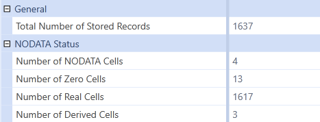

Example using api.Data.Calculate: 'Run for base Entities and local currency only If ((Not api.Entity.HasChildren()) And (api.Cons.IsLocalCurrencyforEntity())) Then api.Data.Calculate("A#CashCalc=RemoveZeros(A#10000)") End If Example using GetDataBufferUsingFormula:

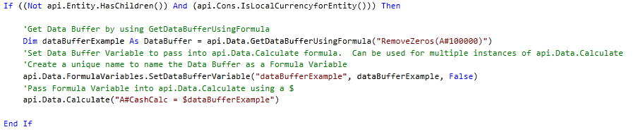

Remove NoData The RemoveNoData function evaluates a source data buffer and removes data cells that have a cell amount of NoData. This function is important to use for performance purposes.  Use the RemoveNoData function in calculations where there is a substantial number of cells with a Cell Status of NoData in Data Units.  This can be determined by looking at the Data Unit Statistics when right-clicking on a cell in a Cube View.

Example using api.Data.Calculate: 'Run for base Entities and local currency only If ((Not api.Entity.HasChildren()) And (api.Cons.IsLocalCurrencyforEntity())) Then api.Data.Calculate("A#CashCalc=RemoveNoData(A#10000)") End If Example using GetDataBufferUsingFormula:

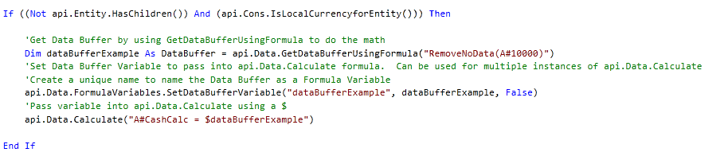

Performance Note: In the calculation performance testing for a single Data Unit, the use of RemoveZeros and RemoveNoData using api.Data.Calculate and/or GetDataBufferUsingFormula rendered a significant performance advantage. This is testing the before and after calculation time of a single formula change for a Data Unit.  Times may vary from Data Unit to Data Unit and Application to Application.  However, the use of RemoveZeros and RemoveNoData is highly recommended in formulas where Cube and Dimensionality designs lend to sparse data models. This is not limited to sparse data models as this can be identified in dense data models as well.

#### Dynamic Calc Using Getdatacell

A Dynamic Calc returns an Account value on demand without storing the data in the Cube. These Members cannot be referenced by other Members in calculating their values. Dynamic Calcs are best used in Members required for reporting only.  One ideal use is the GetDataCell function in ratio-style statistical Accounts (e.g. Current Ratio). Return api.Data.GetDataCell("Divide(A#[CurrentAssets], A#[CurrentLiabilities]")

#### Dynamic Filters And Aliases

Create Dynamic Member Filters to assign to rows or columns within Cube Views. A common example of a Variance column that subtracts one Member from another is shown below. Adding the :Name(“Membername”) option at the end gives the ability to assign a display name to the header of the Cube View. The double quotes in the Name() function are optional. Cube View Filter: GetDataCell(“Variance(T#POV,T#Prior12)”):Name("Variance")

#### Error Traps

Try if api.POV.Cons.name =api.POV.GetEntityCurrency() then api.Data.Calculate("A#Cash1=A#[Restricted Cash] + 70000") End If catch ex as exception api.LogError(ex) End Try

#### Math Functions

Use the math functions built into VB.NET. Examples: Absolute Value - math.abs() Rounding - math.round() Several other supported math functions and examples are listed here: http://msdn.microsoft.com/en-us/library/thc0a116%28v=VS.90%29.aspx

#### Member List Functions

When a Cube filter is run and the filter value does not match a Member, the system looks in all Business Rules for the MemberListProperty property to find a matching Member list name. Users should create MemberLists in Business Rules that are not assigned to Cubes because the entire Business Rule will be run if the system finds a matching Member list name.  Reference MemberLists like this: E#Root.PartnerList. The following example first declares the two MemberListHeader names of Sample Member List and PartnerList. It then addresses each MemberList. Sample Member List shows a way to get the children of an Entity.  E#Texas.[Sample Member List] is just another way of saying E#Texas.Children. In the PartnerList example, E#Root.PartnerList will generate a list that includes Paris and Nice. Case Is = FinanceFunctionType.MemberListHeaders ‘ Additional logic that defines the names of the two custom Member Lists Dim myMemberListHeaders = New List(Of MemberListHeader)myMemberListHeaders.Add(new MemberListHeader("Sample Member List"))myMemberListHeaders.Add(new MemberListHeader("PartnerList")) Return myMemberListHeaders Case Is = FinanceFunctionType.MemberList If args.MemberListArgs.MemberListName = "Sample Member List" Then Dim myMemberListHeader = new MemberListHeader(args.MemberListArgs.MemberListName) Dim myMembers = new List(Of Member)() Dim myMemberList = New MemberList(myMemberListHeader, myMembers)myMembers.AddRange(api.Members.GetChildren(args.MemberListArgs.DimPk, args.MemberListArgs.TopMember.MemberPk.MemberId,args.MemberListArgs.DimDisplayOptions)) Return myMemberList Else If args.MemberListArgs.MemberListName = "PartnerList" Then Dim myMemberListHeader = new MemberListHeader(args.MemberListArgs.MemberListName) Dim myMembers = new List(Of Member)() Dim myMemberList = New MemberList(myMemberListHeader, myMembers) myMembers.AddRange(api.Members.GetBaseMembers(args.MemberListArgs.DimPk, api.Members.GetMember(args.MemberListArgs.DimPk.dimtypeid,"Paris").Memberpk.Memberid, args.MemberListArgs.DimDisplayOptions)) myMembers.AddRange(api.Members.GetBaseMembers(args.MemberListArgs.DimPk, api.Members.GetMember(args.MemberListArgs.DimPk.dimtypeid,"Nice").Memberpk.Memberid, args.MemberListArgs.DimDisplayOptions)) Return myMemberList End If

#### POV Object

In Business Rules, only Data Unit Dimensions are valid in the POV object, not Account or User Defined Members, so the code below only works in Business Rules: Dim AcctID as Integer=api.POV.Account.MemberPk.MemberID Dim AcctID as Integer=api.POV.GetDataCellPk.AccountID

#### Retrieve Time Varying Property Of Relationship’s %

Consolidated Entity Attribute 'Get Entity ID, Parent Entity ID, Scenario ID, Scenario Type ID and Time ID dim EntityID as integer= api.POV.Entity.Memberpk.Memberid dim ParentID as integer= api.POV.Parent.Memberpk.Memberid dim ScenarioID as integer=api.POV.Scenario.Memberpk.Memberid dim ScenarioTypeID as integer = api.Scenario.GetScenarioType(ScenarioID).id dim TimeID as integer = api.Time.GetIdFromName("2013M1") 'Get time varying node % consolidation property value for current Scenario POV and 2013M1 dim myDecimal as decimal= api.Entity.PercentConsolidation(EntityId, ParentId, ScenarioTypeId, TimeId) 'Log the time varying property api.logerror(xfErrorLevel.Information,myDecimal & " " & api.POV.Entity.name & "." & api.POV.Parent.name)

> **Tip:** API.POV.Parent object is only relevant for relationship level Consolidation

Members

#### Setdatacell

Use this to set a value equal to another value. Any dimensions listed on the right side must have a member specified. You don't need to have all dimension on the right side but if they are not specified, the current POV is used. api.Data.SetDataCell(Memberscript, amount, isNoData) api.Data.SetDataCell("A#[Restricted Cash]:O#Forms:F#None:IC#None:U1#None:U2#None:U3#None:U4#None: U5#None:U6#None:U7#None: U8#None", 50, False)

#### Translate

The api.data.translate function is the same as api.data.calculate, but aggregates AdjInput data into the AdjConsolidated Member. 'GetParentCurrency only returns a value when running a translate. If api.Parameters.FunctionType = FinanceFunctionType.Translate Then if api.POV.Cons.Name = api.POV.GetParentCurrency.Name Then api.Data.Translate("A#[Restricted Cash]=A#[Restricted Cash]:C#[USD]*10")end if End If

#### Unbalanced Math

The Unbalanced math functions are required when performing math with two Data Buffers where the second Data Buffer needs to specify additional dimensionality.  The term Unbalanced is used because the script for the second Data Buffer can represent a different set of Dimensions from the other Data Buffer in the api.Data.Calculate text.  These functions prevent data explosion. In the examples below, the first two parameters represent the first and second Data Buffers on which to perform the function.  The third parameter represents the Members to use from the second Data Buffer when performing math with every intersection in the first Data Buffer.  The math favors the intersections in the first Data Buffer without creating additional intersections. It is key that the dimensionality of the Target (left side of the equation) matches the dimensionality of the first data buffer on the right side of the equation (argument 1). AddUnbalanced api.Data.Calculate("A#TargetAccount = AddUnbalanced(A#OperatingSales, A#DriverAccount:U2#Global, U2#Global)") SubtractUnbalanced api.Data.Calculate("A#TargetAccount = SubtractUnbalanced(A#OperatingSales, A#DriverAccount:U2#Global, U2#Global)") DivideUnbalanced api.Data.Calculate("A#TargetAccount =DivideUnbalanced (A#OperatingSales, A#DriverAccount:U2#Global, U2#Global)") MultiplyUnbalanced api.Data.Calculate("A#TargetAccount =MultiplyUnbalanced (A#OperatingSales, A#DriverAccount:U2#Global, U2#Global)") Consider this example.  A#OperatingSales has 100 stored records in January for a single Entity. Because A#OperatingSales has a total of 100 stored values, A#TargetAccount will end up with 100 stored numbers and the amounts would be the values from A#OperatingSales plus/minus/multiplied/divided by whatever was found at A#DriverAccount:U2#Global for each of those 100 intersections. This means that if there was no data in A#OperatingSales:U2#Widgets, then even though the UD2 Dimension is unspecified in the target and in the first Data Buffer expression, no record would be created, hence avoiding data explosion.  The most common use case would be applying a driver for some of the Dimensions. ConvertUnbalanced This function is related to the Unbalanced Math functions (see Unbalanced Math later in this section) and used to convert a data buffer so that it is balanced with an api.Data.Calculate script where unbalanced math does not apply.  This is necessary when using an api.Data.GetDataBufferUsingFormula to calculate a data buffer where the script was not balanced to match a formula in another script where a data buffer variable needs to be used. In the example below, a myDataBuffer was created to have data for all stored accounts, but the subsequent api.Data.Calculate scripts expects each operand to use a specific account.  The ConvertUnbalanced function filters the data buffer to only include the specified account name and it also converts the data buffer to make it balanced and consistent with the destination.  The same data buffer can be re-used multiple times. Example Dim myDataBuffer As DataBuffer = api.Data.GetDataBufferUsingFormula("A#All") api.Data.FormulaVariables.SetDataBufferVariable("myDataBuffer ", myDataBuffer, True) api.Data.Calculate("A#6050 = ConvertUnbalanced($myDataBuffer, A#6000) + ConvertUnbalanced($myDataBuffer, A#3000)")

### Finance Function Types

Use Finance Function Types, except for Custom Calculate, to run logic in certain calculation sequences during the calculation sequence while a Function Type is in process. There are thirteen Function Types: Calculate Additional logic during calculation of Entity, Consolidation Scenario and Time.  This sets the value of one or more values (left side of Formula) equal to another (right side). It then executes a calculation for a specifically qualified Point of View.  This is the most common function used. There are situations where the Entity being processed must access another Entity’s data.  In situations involving pulling Consolidation dimension Elimination results from other Entities as siblings, the multi-thread processing of the calculations requires an additional function to ensure the calculations are complete. Below is an example of this sibling relationship. The Entities Base1, Base2, etc. are siblings that would be calculated simultaneously during a consolidation:

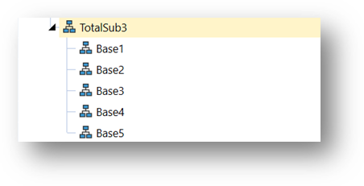

For this purpose, the Calculate Finance Function Type supports the argument IsSecondPassEliminationCalc.

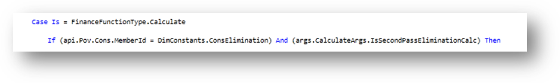

During the Calculate process, this function allows Business Rules to execute after the Sibling Entities have calculated results to the Consolidation Elimination member.  Below is a reference to the Consolidation dimension:

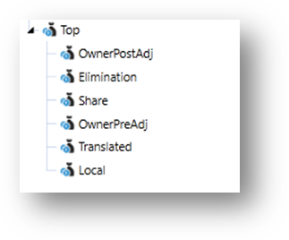

Once all the sibling Entity members are calculated to Elimination, the Business Rules within the IsSecondPassEliminationCalc will be executed. Translate Additional logic that uses custom translation. FXRate Custom logic used to determine Foreign Exchange rates for any intersection. Consolidate Share Additional logic used during the custom calculation of the Share Member. Consolidate Elimination Additional logic used during the custom calculation of the Elimination Member. Custom Calculate A CustomCalculate Finance Function Type can be used in order to execute a single year custom calculation via a Dashboard Parameter Component Server Task Action.  This is considered a partial calculation and does not store the calculated data or run the calculation during a consolidation.  Running a custom calculation from a Dashboard will impact calculation status for the affected data unit even if the data does not change. See Parameter Components in Presenting Data With Books, Cube Views and Dashboards for more details on how to assign this type of Finance Rule to a Dashboard. See Data Management for details on creating this type of Data Management Step. See Parameter Components for more information on passing arguments to a Custom Calculate function. Example: Select Case api.FunctionType Case Is = FinanceFunctionType.CustomCalculate If args.CustomCalculateArgs.FunctionName.XFEqualsIgnoreCase("FunctionName") Then Me.CalcTest(si, globals, api, args) api.Data.Calculate("A#TFS2903 = A#10000 + A#69000) End If End Select Calculation Drill Down Member Formula Provides custom drill down results. Conditional Input Rule Conditional Input Rules make data cells read-only.  While the settings for this can be done directly on the Cube, using a Conditional Input Business Rule offers more flexibility and still allows the use of the Cube settings.  This rule can return the following: ConditionalInputResultType.Default, ConditionalInputResultType.NoInput, ConditionalInputResultType.NoInputAllowCellDetail, and ConditionalInputResultType.NoCellDetailAllowInput. The following Business Rule example will make all cells for the Account 6000 read-only.  This should be added to a Business Rule attached to a Cube. Case Is = FinanceFunctionType.ConditionalInput If api.Pov.Account.Name.XFEqualsIgnoreCase("6000") Then Return ConditionalInputResultType.NoInput End If Return ConditionalInputResultType.Default Confirmation Rule Special logic that runs with Confirmation Rules. Data Cell Named GetDataCell calculations that can be reused such as a Better/Worse calculation in Cube Views. Dynamic Calc Account Special logic to use in Dynamic Calc members. Member List and Member List Headers A custom list of members for use in Cube Views and other areas.  See Commonly Used Member Filter Functions in Cubes for more details on using custom lists in a Cube View. Select Case api.FunctionType is the expression used when a certain process needs to be isolated and run special logic.  See examples below: Select Case api.FunctionType Case Is = FinanceFunctionType.Calculate ‘ Additional logic to run with every calculation. api.Data.Calculate("A#DACash1= A#Cash4 + 1") api.Data.Calculate("A#2150:F#Movement = V#Periodic:A#5750:F#None") if api.metaData.Cons.name ="USD" then api.Data.Calculate("A#Cash1=A#[Restricted Cash]") End If Case Is = FinanceFunctionType.Translate ‘ Additional logic to run with every translation. If api.ExecuteDefaultTranslation is not included, then the standard translation process will not run. api.ExecuteDefaultTranslation dim Cubeid as integer = api.Cubes.GetCubeInfo("GolfStream").Cube.Cubeid dim fxRule as fxRuleType=api.Cubes.GetFxRuleTypeForAssetLiability(CubeId) api.Data.Translate("A#[Restricted Cash]:C#[USD]","A#[Restricted Cash]",fxRule,.5) Case Is = FinanceFunctionType.ConsolidateShare then ‘ Additional logic to run when the Share Member of the Consolidation Dimension is being calculated. api.ExecuteDefaultShare() api.data.calculate("A#[Restricted Cash]=A#[Restricted Cash]*.8") Case Is = FinanceFunctionType.ConsolidateElimination then ‘ Additional logic to run while the Elimination Member of the Consolidation Dimension is being calculated. api.ExecuteDefaultElimination api.Data.Calculate("A#[IC AR]=A#[IC AR] * 1.1") Case Is = FinanceFunctionType.MemberListHeaders ‘ Additional logic that defines the names of custom Member Lists Dim myMemberListHeaders = New List(Of MemberListHeader)myMemberListHeaders.Add(new MemberListHeader ("Sample Member List")) Return myMemberListHeaders Case Is = FinanceFunctionType.MemberList ‘ Additional logic that defines the Members within custom Member List that are included in Business Rules. See the “MemberList Functions” section in the proceeding pages. 'Example: "A#Root.[Sample MemberList]" If args.MemberListArgs.MemberListName = "Sample Member List" Then Dim myMemberListHeader = new MemberListHeader(args.MemberListArgs.MemberListName) Dim myMembers = new List(Of Member)() Dim myMemberList = New MemberList(myMemberListHeader, myMembers)myMembers.AddRange (api.Members. GetChildren (args.MemberListArgs.DimPk, args.MemberListArgs.TopMember.MemberPk.MemberId,args.MemberListArgs.DimDisplayOptions)) Return myMemberList End If End Select Ultimate Ownership This function calculates and stores Ultimate Ownership results for every ancestor/child Entity relationship.  The current Entity being calculated is the ancestor Entity, and when storing the results, the Members in the Intercompany Dimension are used to represent each descendant Entity.  This function assumes the source Direct Ownership numbers are weights and are typically entered by a user (e.g., numbers between 0.0 and 1.0). C#OwnerPreAdj:O#AdjInput is using an account that does not consolidate and accepts manual entry for adjustments in those Parent/Child relationships.  It cascades the user-entered amounts up the Entity tree and multiplies them when a Parent owns part of a Child and that Child owns part of a Grandchild. sourceDirectOwnershipMemberscript represents the data cells where the user-entered Direct Ownership amounts are found for Parent/Child Entity combinations. destUltimateOwnershipMemberscript represents the intersection for the resulting calculations. All results are stored using the current Data Unit being calculated. This function is intended to run only for the Entity's Local Consolidation Member, and it uses IC Members to store the results for each descendant Entity. Example: Use the following as a Member Formula in the UltimateOwnership account: If api.Cons.IsLocalCurrencyForEntity() Then api.Data.CalculateUltimateOwnership("C#OwnerPreAdj:A#DirectOwnership:O#AdjInput", "A#UltimateOwnership:O#Forms", 1.0) End If Here are the steps to set up Ownership entry and calculations in an application. This functionality is intended to be used in a separate Control Cube accessed via the main Financial Cube:

### Create Two Accounts

DirectOwnership This is for the user to enter Direct Ownership for each Parent/Child Entity combination. AccountType = BalanceRecurring, IsConsolidated = False, Adjustment Type = Data Entry UltimateOwnership This stores the calculated results in Parent Entities using IC Members for every descendant Entity. AccountType = BalanceRecurring, FormulaType = Formula Pass 1, Allow Input = False, IsConsolidated = False, Is IC Account = Conditional Formula: If api.Cons.IsLocalCurrencyForEntity() Then api.Data.CalculateUltimateOwnership("C#OwnerPreAdj:A#DirectOwnership:O#AdjInput", "A#UltimateOwnership:O#Forms", 1.0) End If

#### Create A Cube View For Entering Direct Ownership Amounts

Cube View POV Consolidation = OwnerPreAdj, Origin = AdjInput, Flow, IC and UDs = None Column A#DirectOwnership Row E#Root.TreeDescendants

#### Create A Cube View For Running A Consolidation And Viewing The

Ultimate Ownership Results Cube View POV Consolidation = Local, Account = UltimateOwnership, Origin = Forms, Flow IC and UDs = None Column IC#ICEntities.Base Row E#Root.TreeDescendants

## Consolidation

Consolidation is the process of taking base level Entities and aggregating them up a hierarchy to their Parent.  The hierarchy and add efficiencies where applicable, meaning some siblings may be able to run in parallel when they are processed. Calculations and translations are also run during this process. Consolidations can be launched from the Process step in Workflow, Cube Views or Forms. By triggering a consolidation, the existing POV is run for that time period and is consolidated for the respective period along with any of the prior periods for that year. For example, if a consolidation is triggered for June, it will consolidate January through June. The following chart explains how the Consolidation Dimension works. TOP - Contributes to the Parent Entity’s LOCAL Member Sum (SHARE + ELIMINATION + OWNERPOSTADJ) OWNERPOSTADJ  (Execute Data Unit Calculation Sequences, FinanceFunctionType = Calculate) Stores Journal entries that are needed after the Share and Elimination calculations have been performed for an Entity and Parent. ELIMINATION  (Execute DUCS, FinanceFunctionType = Calculate) Elimination algorithms  (Use default or implement FinanceFunctionType.ConsolidateElimination in a BR) Start with SHARE Data Unit and eliminate data cells where IC is not None. If a common Parent Entity was reached for both the Entity and the IC Entity, generate an offset amount and a plug Account amount. SHARE  (Execute DUCS, FinanceFunctionType = Calculate, only if not using default calc-on- the-fly) Default Share is calculated on-the-fly Sum (TRANSLATED + OWNERPREADJ) * % Consolidation Share algorithms  (Use default or stored, or implement FinanceFunctionType.ConsolidateShare in a BR) OWNERPREADJ  (Execute DUCS, FinanceFunctionType = Calculate) Stores Journal entries that are needed before the Share and Elimination calculations have been performed. This is a Relationship-level Member, so the data is for a specific Parent Entity. TRANSLATED  (Execute DUCS, FinanceFunctionType = Calculate) The “Translated” Member is a shortcut to the Consolidation Member that matches the Parent Entity’s default currency (e.g., USD). It stores data that was generated by multiplying local currency data by FX rates, and then executing the DUCS. Translation algorithms  (Use default or implement FinanceFunctionType.Translate in a BR) Determine FX Rates and multiply to create a translated Data Unit from the local currency’s Data Unit. LOCAL(Execute DUCS, FinanceFunctionType = Calculate) The “Local” Member is a shortcut to the Consolidation Member for the Entity’s default currency (e.g., EUR). It stores input data in base Entities, or data that was consolidated by combining data from the TOP consolidation Member from lower-level child Entities.

### Example Of A Consolidation

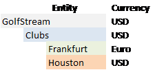

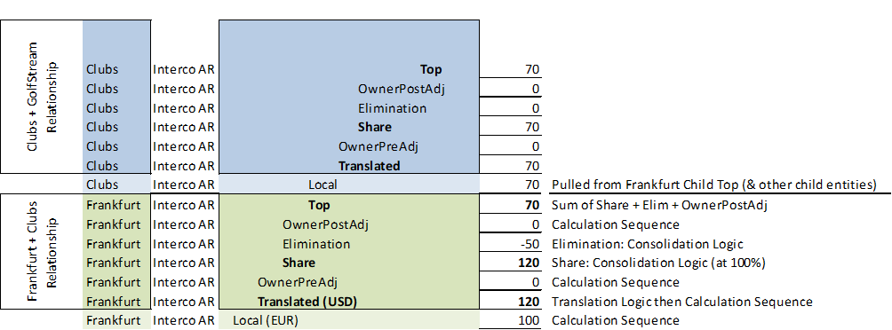

### Launching A Consolidation

In Workflow Profiles, set up Calculation Definitions to process the appropriate calculation, translation, or consolidation type. Right-click on the appropriate cell in a Cube View or Form to view Process options:

Calculate Runs calculations at the Entity level within the Local Member of the Consolidation Dimension without translating or consolidating. Calculate Force Calculate Calculate with Logging Force Calculate with Logging

Translate Runs the Calculate step above at the Entity and then translates data within the Translated Member of the Consolidation Dimension for each applicable Relationship. Translate Force Translate Translate with Logging Force Translate with Logging

Consolidate Runs the Calculate and Translate steps and then completes the calculations required all the way up the Consolidation Dimension. Consolidate Force Consolidate Consolidate with Logging Force Consolidate with Logging Force menu items such as Force Consolidate will run as if every cell included is marked as requiring calculation, translation or consolidation. Consolidate and Force Consolidate check and determine a Parent Member’s calculation status and all children of the Parent before consolidating any data.  The difference is Consolidate checks Calculation Status, and if the status is OK, it accepts it and continues the consolidation process. Force Consolidate runs as if every Member needs to be consolidated regardless of its actual Calculation Status and does not bother querying Calculation Status.  While they both perform optimally, there are some cases where one performs better than the other.  See the examples below to learn more about when to use Force Consolidate vs. Consolidate.

#### Calculation Status State 1: Actual Scenario, Loading For

December

In this case Consolidate will perform better than Force Consolidate because every month prior to December has an OK Calculation Status. This means the data for that month has not changed since the last consolidation and only the month of December needs to be consolidated. If a Force Consolidate was used, every calculation would be performed again whether it is necessary or not, therefore taking longer in the consolidation process.

#### Calculation Status State 2: Plan Scenario, Loading For 12

Months

In this case, Force Consolidate will perform better than Consolidate because every month needs to be consolidated.  If a Consolidate was used, the system would needlessly check each Calculation Status before calculating each period.  A Force Consolidate will calculate all periods regardless. See Calculation Status for details on the status codes.

> **Note:** Forced calculations that run on base entities from open periods will not impact

the status of Parent Entities for closed periods if the data is in an OK state. If a metadata change occurred and entities are in an OK, MC state, all periods and entities will recalculate, regardless of Workflow Open/Close state. The Logging items (such as Force Translation with Logging) trigger additional detailed logging

which can be viewed in the Task Activity area. Drill into a log to see the length of time and details about every calculation. A progress window displays Consolidations.

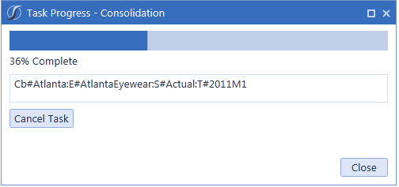

### Calculation Status

If the existing data set for a POV changes, the calculation status is updated accordingly. A timestamp table is used, and servers are synchronized to ensure the calculation status is always accurate. To explore calculation status, build a Cube View where the View Member in the Point of View is set to CS, the columns are the time periods, and the rows are set to the desired Entity structure. For example:

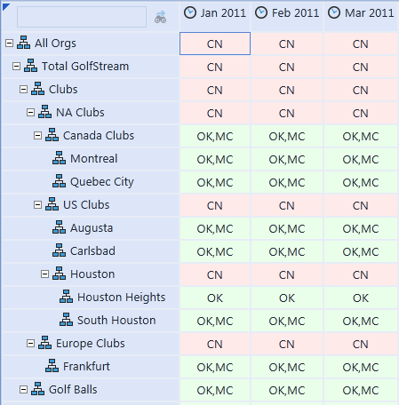

These status codes indicate what action to perform: l OK: The data for this intersection has not changed since the last calculation. l OK, NA: Calculation not required. No data. l OK, MC: The intersection was calculated but metadata changed due to modifications to artifacts such as Business Rules associated with this Cube, formulas and FX rates. This is a clue that if the calculation is run again, the results may not be the same. l CA: Calculate data since an import was run or data was entered. l TR: Translate. l CN: Consolidate because data for a child Entity has changed. l CA, CN: Calculate and consolidate. l CA, TR: Calculate and translate. l TR, CN: Translate and consolidate. l CA, TR, CN: Calculate, translate and consolidate.

### Currency Translation

Currency can be converted from one currency to another. This process utilizes the defined FX Rates in the FX Rates portion of the product. See Foreign Exchange Rates in Cubes for additional details. The base Entity can be converted to the Parent Entity’s currency if required. The currency translation is run as needed based on the configuration of the Parent / child currencies as stored in the Entity Dimension. This feature can be run independently of a consolidation if required. Right-click in the appropriate cell and the translation option will display.

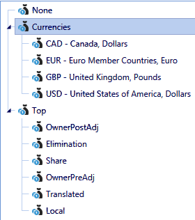

The Consolidation Dimension is shown above.  For example, if an Entity’s currency is Euro, and data is written to the EUR Member, that value is also displayed in the Local Member. The Local Member is a pointer to the appropriate local currency Member where the data is stored. If that European Entity in the screen shot above is consolidated to a company in the UK that has GBP as their Currency setting under Entities, when the European Entity is consolidated into the UK Parent, the European Entity’s Translated Member will reference the translated value which is stored under the GBP Member under Currencies. Calculation Status determines when data was entered.  If the Local currency’s Calculation Status is CA because the data has not been calculated yet, then the foreign currencies would also need to be translated and calculated resulting in a TR calc status.  If a calculation is done on the Local Currency in order to make its calc status OK, the foreign currencies are still going to be TR because that data has not been translated or calculated yet.  Also, if a foreign currency has an OK calculation status, and a foreign currency journal is entered, that currency then becomes TR.

### How The Origin Dimension Works With The

### Consolidation Dimension

The Origin and Consolidation Dimensions are separate but work well together. Origin primarily calls out how a number originated. This section explains how each Member of the Origin Dimension interacts with Members of the Consolidation Dimension. The consolidation process starts at Local, which is the same data as one of the currencies under the Currencies Member (based on the Entity’s default currency setting).  If the Entity is base-level, the data can be loaded into the Local Consolidation Member using the Import Origin Member, and data can be typed into the Local Consolidation Member using the Forms Origin Member.  If it is a Parent Entity, the Local Consolidation Member is read only (except for Journals) as it represents data that has been rolled up from child Entities (using the Import, Forms, and the AdjConsolidated Origin Members). Regardless of whether the Entity is base-level or a Parent, Journals can be entered using the Local, Translated, OwnerPreAdj, OwnerPostAdj, and Any Currency Consolidation Member.  For all the Consolidation Members, Journals are always posted to the AdjInput Origin Member.  As data is rolled up from child Entities into a Parent Entity during the consolidation process, the AdjConsolidated Origin Member will contain the combined values from the child Entities’ Journals.

#### Imports And Forms

When data is imported through Workflow to the Data Stage, it is happening through the Import Member in the Origin Dimension. When data is entered in web or Excel Forms, it is happening in the Forms Member in the Origin Dimension (with one exception discussed under Adjustments). The Import and Forms Members are coupled with the Local Member of the Consolidation Dimension. Consolidation Dimension                         Origin Dimension

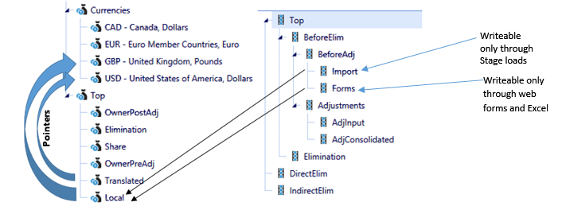

#### Adjustments

Adjustments are created either through Journal entries, or in special instances, through Forms that do their input as a Journal would. Both do their input into the AdjInput Member of the Origin Dimension. Adjustments can be made to the following Members of the Consolidation Dimension: Local, Translated, OwnerPreAdj and OwnerPostAdj. When a consolidation is run, the AdjInput entries in child Entities are consolidated into the AdjConsolidated Members in the Parent. Users can drill down into the Adjustments Member in a Parent to show adjustments made in both the Parent and child Entities. Consolidation Dimension                           Origin Dimension

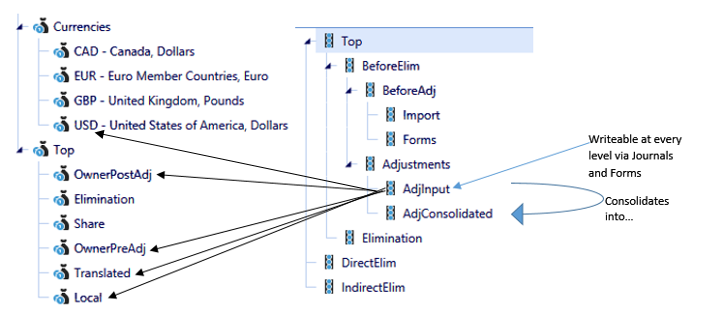

#### Eliminations

When eliminations are calculated, the Elimination Member of both the Consolidation and Origin Dimensions is updated. The primary purpose of the Elimination Member within the Origin Dimension is to allow visibility from the top down without those figures getting lost during the consolidation process. Users can drill down into the O#Elimination Member in a Parent to show the elimination entries made in both the Parent and child Entities. Consolidation Dimension                                    Origin Dimension

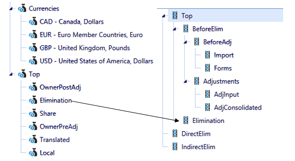

### Intercompany Elimination

Intercompany Elimination is the process of cancelling out account balances for intercompany partners for intercompany accounts with any unresolved balance being placed in a Plug Account.

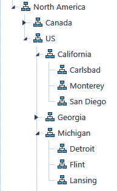

The Entity structure above belongs to GolfStream, a fictitious golf manufacturer. If the Detroit Entity sold golf club shafts to Monterey who assembles the final club product, this would be an intercompany transaction. The following prerequisites must exist for the transaction to eliminate. l Monterey and Detroit must have there Is IC Entity property set to True. l The Accounts Intercompany Receivables and Intercompany Payables must be set with the Is IC Account property set to True and the Plug Account pointed to a third account. l The intercompany entries must properly note the intercompany partner in the IC Dimension Member. For example, Detroit would book an entry to Intercompany Receivables and the IC Member for that entry would be Monterey. Intercompany Eliminations occur once the values roll up to a common Parent. As the consolidation begins, Detroit consolidates its values to Michigan and Monterey consolidates its values to California. An elimination does not occur because they have not yet consolidated their values to a common Parent. The elimination occurs when Michigan and California are consolidated into the US common Parent. The two intercompany values will be eliminated at this level with any discrepancies being posted to the Plug Account. In another example in Workflow, Houston Heights and South Houston trade with Carlsbad, Dallas, and Montreal. In the screen shot below, South Houston is shown in green because it is balanced within an acceptable tolerance of $1. The $0.59 discrepancy is booked to the related Plug Account.

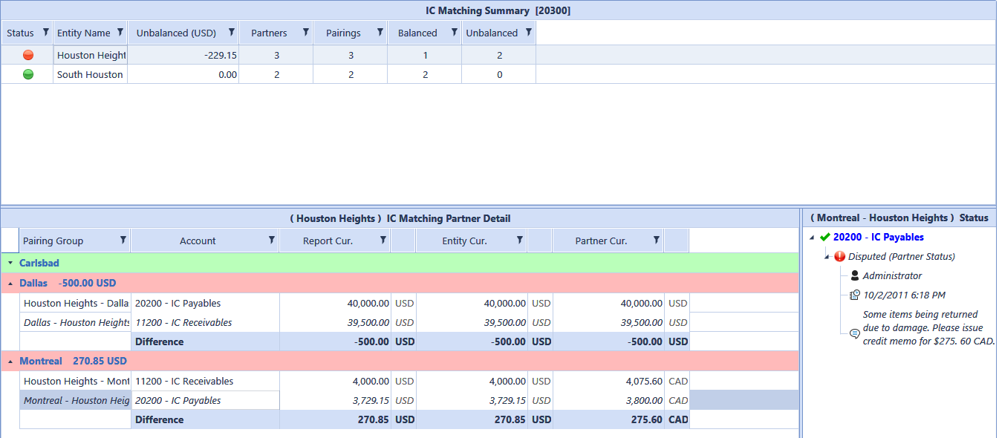

Houston Heights is shown in red because there is a $229.51 discrepancy. Details on the discrepancy are shown in the lower part of the screen. Houston Heights’ discrepancy with Montreal is shown at the bottom in the application reporting currency (USD), Houston Heights’ currency (USD), and the partner currency for Montreal (CAD). Through the right click menu, leave a status and description that each partner can see. As these values roll up the Entity structure, the Parent Entities can also see this detail. See Workflow Profiles in Workflow for more details on how to set up Intercompany Matching via Workflow.

> **Note:** Using Extensible Dimensionality to extend Accounts used within the

Intercompany Matching process is not a recommended practice.

### Direct And Indirect Eliminations

The Origin Dimension contains the Direct and Indirect members to simplify reporting on Eliminations.  The Direct member returns the results of Eliminations that occur from transactions, removing the direct children of a parent Entity. Indirect returns the total Eliminations that occurred outside the direct children of aparent Entity.

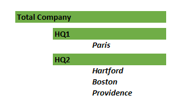

In the example, transactions that occurred between the HQ2 Entities eliminate at HQ2. Transactions between members of HQ1 and HQ2, such as a transaction between Paris and Hartford, eliminate at the first common parent, Total Company. Reporting on the results at the Total Company level, Direct returns results that occurred between the HQ1 and HQ2 groups. Indirect at Total Company would allow reporting on eliminations outside its direct children, HQ2 eliminations.

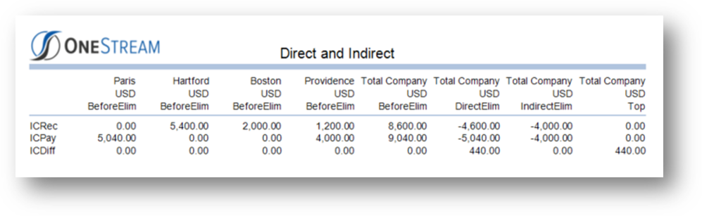

#### Custom Consolidation

If the standard consolidation or translation logic does not meet your project requirements, deploy custom Business Rules. The first step in this process is defining the Cube’s properties settings. See Cubes in Calculation section for Consolidation Algorithm Type and Translation Algorithm Type settings. The default setting is Standard but you can change this to Custom for additional flexibility. Next, write a Finance Business Rule. See: l Application Tools in the Business Rule section on applying Business Rule logic by Finance Function Type to discover what you can customize. l Formulas for common customizations. l The API Overview Guide. Reference the Finance Business Rule under any of the Business Rule 1-8 properties for each Cube on which to use the logic. Also see Data Unit Calculation Sequences (DUCS).

### Matrix Consolidation: Eliminating Beyond Legal Entity

Matrix consolidation is a term commonly used when finance teams want to prepare their management and statutory financials concurrently. This prevents the need to maintain separate scenarios and processes in the system. It will usually involve running eliminations on something more than a legal entity. In OneStream, this can mean using a User Defined (UD) dimension as part of the elimination process. A common use case is to run eliminations between profit centers (PCs) or segments. In this example, inter-profit center eliminations will be used, but that is not the only potential use case. The need is for an elimination to occur only at the first common parent in both the legal entity and profit center hierarchies.

#### Entity Dimension Or User Defined Dimension

There is a requirement to do eliminations on a level of detail below the legal entity/company code level. The example in this section is to generate eliminations between profit centers. The main options are Entity dimension or User Defined dimension, which are described in the following sections.

#### Entity Dimension Option

Include this profit center detail in your Entity dimension as base members. These will be children of the legal Entity members.

|Col1|Entity Dimension Option|Col3|
|---|---|---|
||**Pros**|**Cons**|
|Business Logic|No additional logic required to get eliminations running by PC|l Impacts consolidation performance more than the UD dimension option in a typical setup. This is due to the multiplication of members in the Entity dimension, more data units, to be consolidated. Analyze the impact for each project. l If you move a PC in the entity hierarchy, you will need to reconsolidate all history.|

|Col1|Entity Dimension Option|Col3|
|---|---|---|
||**Pros**|**Cons**|
|Dimensions|l Uses fewer UD dimensions than the UD dimension option l Generally, only appropriate when PCs are unique to entities. Otherwise, they would need to be duplicated for each entity.|l Can result in a large Entity dimension l To achieve some reporting, alternative entity hierarchies and additional consolidations may be required. l Often leads to creation of additional artificial or journal PC entities to contain data that does not need to be captured by PC, for example, balance sheet data, which creates more entities that need to be consolidated l When PCs are not unique to entities, they create many duplicate entities. This should be avoided. l Less flexible because PCs need to be created and moved within the entity hierarchy|

|Col1|Entity Dimension Option|Col3|
|---|---|---|
||**Pros**|**Cons**|
|Workflows|If the responsibility structure and workflow design are by PC, the workflow design and build can be improved.|l If the responsibility structure and workflow design are by PC, this option may make workflow design simpler. l Makes PCs the basis for everything where data is stored, processed, and locked|
|Reporting and Matching|l This may be a familiar approach, aligning with the reporting and matching in legacy systems. l Standard intercompany (IC) matching reports work for PC matching, although this requirement is less common.|l Out-of-the-box matching is only at PC level. Legal entity matching requires custom reporting. l Alternative entity hierarchies and consolidations may be required to achieve some reporting. l To see legal entity level data, as they will be parent entities, it is required to run consolidations.|

|Col1|Entity Dimension Option|Col3|
|---|---|---|
||**Pros**|**Cons**|
|Security|Native using the Entity dimension|Requires maintenance on a PC level even if not required on that level|

#### User Defined Dimension Option

Include this profit center detail in a User Defined dimension.

|Col1|User Defined Dimension Option|Col3|
|---|---|---|
||**Pros**|**Cons**|
|Business Logic|l Logic can be customized to specific requirements. l Does not add additional members, data units, to the Entity dimension, which is beneficial for consolidation performance in a typical setup l Running a consolidation will run a statutory and management consolidation in parallel.|Requires additional development time for business logic if it is not part of a starter kit|

|Col1|User Defined Dimension Option|Col3|
|---|---|---|
||**Pros**|**Cons**|
|Dimensions|l A cleaner Entity dimension to support legal entity and group reporting l Matrix view of consolidation can be created, for example, with entities in rows and PCs in columns l Can be combined with extensibility if PCs are not applicable to all entities and divisions|Requires the use of multiple UD dimensions (one for PC and another for PC counterparty). See UD7- New Counterparty Profit Center.|
|Workflows|Often more closely aligns with the responsibility structure for actuals (by legal entity)|None identified|
|Reporting and Matching|l Standard IC matching reports will support legal entity matching. l Consolidation is not required to view total legal entity values, pre-elimination data.|Custom IC matching reports may be required for PC matching. This is a less common requirement.|

|Col1|User Defined Dimension Option|Col3|
|---|---|---|
||**Pros**|**Cons**|
|Security|Native using the Entity dimension if security is driven by legal entity|Requires slice security, Cube Data Access security, if required at PC level, which can impact reporting performance if security is complex|

#### Other Design Considerations

l Data Quality of Matrix Counterpart: All intercompany data from the source system needs to be sourced for all matrix dimensions. It will negatively impact user experience if this data is not readily and accurately available in the source system. Significant manual input is required. l Stability of the Matrix Dimension: Consider whether the profit center hierarchy will change regularly as relationships change. This requires significant consideration in the design phase. See Org-by-period in the User Defined Dimension. l New or Existing Application: The choice of solution may depend on whether this is a new implementation or an addition to an existing one. It will likely be easier to add a new User Defined dimension to an existing application rather than redevelop the Entity dimension. l Performance: Common design considerations of performance, data unit sizes, and number of data units apply. In addition, because of the nature of matrix consolidation, it is unlikely that the Matrix dimension can be extended because it is required for the elimination postings. Therefore, carefully consider the size and sparsity of this dimension when thinking about the performance of your design. l Elimination or Matching: If eliminations happen on profit center, it does not mean that month end intercompany matching must be at this level. It is important to clarify these as separate requirements. l Workflow: Consider the responsibility structure of the organization. It will have a big impact on the decision. If the true process (loading, locking, calculating, and certifying the data) is by profit center, then this could be a good justification for using the Entity dimension. However, it is more typical that these are based on legal entity for actuals, which makes a User Defined dimension solution more appropriate.

#### Option Overview

The best approach varies depending on the specific requirements. Review the benefits and considerations of each approach. Adding members to the Entity dimension creates additional overhead during consolidation because the system must run the data unit calculation sequence (DUCS), consolidate, and check the status on each Entity member. Therefore, including profit center in the Entity dimension will often be slower than using a User Defined dimension with typical data volumes. Regardless of the approach, with the default, eliminations always occur at the first common parent in the Entity dimension. For a different approach, consider a non-matrix solution, which has separate cubes for statutory and management. Since the Entity dimension option mostly uses system-default logic for processing and eliminating the data, the setup is straightforward. Therefore, the following information focuses on how to design for the User Defined dimension option to contain this detail and run eliminations.

#### Out-Of-The-Box View Of Eliminations

If you need eliminations to run by profit center, it does not mean that you need to implement a full matrix consolidation solution. If you do not need the profit center elimination to happen at the first common parent in the PC hierarchy, out-of-the-box eliminations will suffice because you can report the eliminated data by selecting the correct combination of members, such as origin or PC. Here is an example of the default behavior of eliminations in OneStream. This is a profit center dimension in UD1 and an Entity dimension for the legal Entity members. In this example, all entities are using United States dollar (USD) only and are 100% owned.

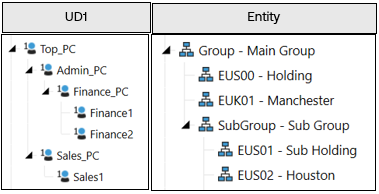

There is an intercompany transaction between the legal entities Manchester and Houston. For Manchester, it is captured in the Finance PC. For Houston, it is captured in the Sales PC.

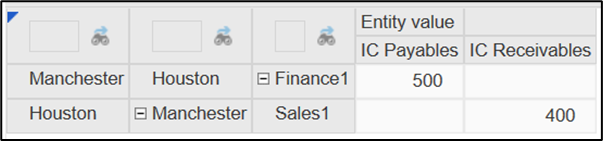

When out-of-the-box eliminations are run, the following results will display. Eliminations are in the red boxes, and consolidated results are in the blue box.

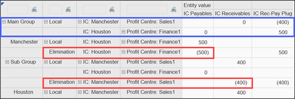

The eliminations occur at the first common parent in the Entity dimension. In this example, the first common parent is the Main Group. In UD1, the eliminations happen on the same member as the original data, so at the group level the plug amounts are by profit center. Focus on the PC dimension (UD1) at the top Main Group reporting Entity member. The aggregated difference on the plug account of the base-level profit centers for Finance1 and Sales1 is 100.

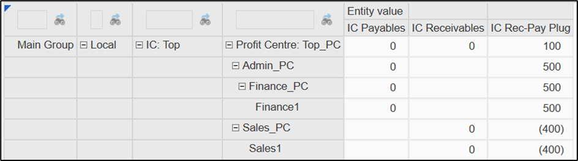

#### Matrix Consolidation - View Of Eliminations

In this setup, you can apply matrix consolidation. With the same data, the counterparty PC for each transaction is captured.

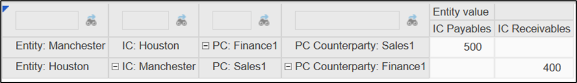

In the following image, eliminations will happen on a new elimination member in UD1, rather than the member the data sits on, which is highlighted in the green boxes. For more information about the required elimination members, see UD1 – Profit Center. The member where the elimination occurs represents the first common parent of the PC and Counterparty PC in the hierarchy. In this example, it is the Top_PC member in UD1.

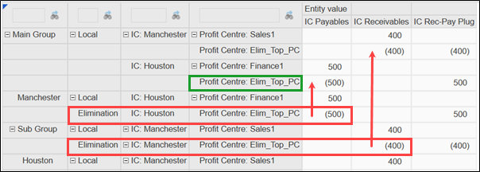

Review this result in more detail at the Main Group entity level. In the UD1 hierarchy, the elimination does not occur until the first common parent in the UD dimension. So, at Top_PC, the data is eliminated. But, at descendant UD1 members, the data is not eliminated, for example, Admin_PC, Finance_PC, and Sales_PC.

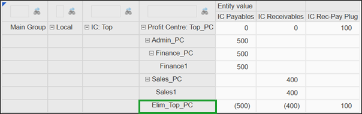

The top PC and group entity have different approaches but the same result.

#### Setup

The following items are configured in the matrix consolidation example.

#### Entity

No changes are required to the Entity dimension for matrix consolidation.

#### Account

No changes are required to the Account dimension for matrix consolidation. The same plug accounts can be used.

#### UD1 – Profit Center

Some additional elimination members are required in UD1 . UD1 is used in this example. Standard design decisions apply to any User Defined dimension.

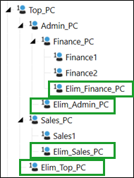

These new elimination members will be required at every point an elimination may happen, so you can see that this can add a large number of members to the existing hierarchy. A common naming convention is often used to allow the system to derive where to post the elimination. In this case, it is the parent member name with the Elim_ prefix. Alternatively, you could use text fields to store this information. Either way, the logic will rely on this being updated accurately and consistently.

> **Tip:** Ensure your consolidation logic provides useful error messages if it finds that an

elimination member does not exist or is misconfigured.

#### UD7 - New Counterparty Profit Center

A new dimension is needed to capture counterparty PC information. Like the Intercompany dimension in OneStream, this can be, and typically is, a flat list of the base counterparties.

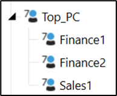

All relevant intercompany data now needs to be analyzed by this dimension. Input forms and transformation rules will need to be updated. In data models where almost all User Defined dimensions are already in use, this element can be challenging and requires consideration. UD7 is used in this example. The standard design decisions apply to any User Defined dimension. This dimension is used to capture the counterparty, so if your design already uses lots of dimensions, you may be able to combine this with other supplementary data or use UD8. However, this will require additional consideration in your dynamic reporting design.

> **Tip:** Consider how this dimension will be maintained. It is important for the logic that all

members exist with the same naming in this counterparty dimension. Consider whether the counterparty dimension should be automated to align with the main profit center dimension.

#### Business Logic

Unlike the Entity dimension, all parents in a User Defined dimension are calculated on-the-fly. This approach requires additional eliminations to be calculated. You will need to store your new matrix consolidation logic somewhere. In this case, it is a business rule attached to the cube, but it could also be attached to a member formula.

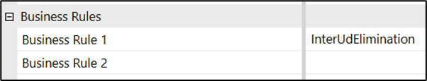

> **Tip:** You do not need to turn on a custom consolidation algorithm on the cube to achieve

a matrix consolidation result. Consider the overall requirements and design.

#### Reporting

Custom reports need to be developed to enable intercompany matching and reporting on the resulting eliminations. If you already do eliminations like this, specifications should already exist that can be designed for this purpose. If not, you will need to understand matrix consolidation when you build reports and Quick Views or run legal entity-based reports with top for profit centers.

> **Tip:** You can use data set business rules to help efficiently gather data for interactive

dashboards and reports.

#### Business Logic

#### Consolidation Algorithm

When a matrix consolidation requirement exists, it has been commonly observed that consultants will turn on the custom consolidation algorithm for each relevant cube. However, this stores the share data, so it has a negative impact on consolidation performance and database size. Before you use the custom algorithm, consider calculating the matrix elimination adjustments during the calculation pass of C#Elimination within a UD member (potentially within your data audit dimension). This enables you to remain on the standard or org-by-period algorithm. Within this member, you can update the standard eliminations with the profit center detail. You may have other requirements to use the custom algorithm. Determine the approach for matrix eliminations in the context of the overall design.

> **Tip:** Consider whether matrix eliminations are required for all processes and scenarios,

and ensure it is only running on those that require it.

#### Useful Functions

The general approach for writing a matrix consolidation rule is to check that the elimination only occurs at the first common parent. Other than that, it follows standard OneStream rule writing techniques, such as using data buffers. The following functions can be useful.

|Function|Comment|
|---|---|
|api.Members.GetFirstCommonParent()|Use this function to check both the entity and PC parents to see if they are common to the IC or counterparty member.|
|api.Members.IsDescendant()|This does not check whether a descendant has a consolidation percentage greater than zero. So, if doing org-by-period, this may need additional consideration.|
|api.Entity.PercentConsolidation()|Use this function to check if entity is being consolidated. Ensure you only pass valid parent/entity combinations into the function.|

#### Example Rule

The following rule is an example to demonstrate an approach to implement matrix consolidation. If you use it as a starting point, adapt and thoroughly test it before implementation. The example takes the following approach: l It retrieves a data buffer of the system-generated eliminations. l It checks if the record is a new elimination. l It reallocates the elimination (both intercompany and plug account entry) to the correct profit center. l It clears the duplicate system elimination as No Data. l It saves the results. This should be assigned to the cube when using the standard or org-by-period consolidation algorithm. It reallocates the out-of-the-box eliminations to the relevant UD member. With some reconfiguration of the dimensions and names referenced in the rule, it should work with the setup described. Imports System Imports System.Collections.Generic Imports System.Data Imports System.Data.Common Imports System.Globalization Imports System.IO Imports System.Linq Imports Microsoft.VisualBasic Imports OneStream.Finance.Database Imports OneStream.Finance.Engine Imports OneStream.Shared.Common Imports OneStream.Shared.Database Imports OneStream.Shared.Engine Imports OneStream.Shared.Wcf Imports OneStream.Stage.Database Imports OneStream.Stage.Engine Namespace OneStream.BusinessRule.Finance.MatrixElim Public Class MainClass Public Function Main(ByVal si As SessionInfo, ByVal globals As BRGlobals, ByVal api As FinanceRulesApi, ByVal args As FinanceRulesArgs) As Object Try Select Case api.FunctionType Case Is = FinanceFunctionType.Calculate If api.Pov.Cons.MemberId = DimConstants.Elimination Then 'Matrix consolidation 'Moves system-generated eliminations to first common parent elim members In UD 'Moving eliminations will prevent original value and elimination from netting, causing duplicate eliminations at each level 'Rule also clears these duplicate eliminations 'UD1 = main hierarchy (ProfitCentreDetail). UD7 = partner hierarchy (PC_Interco) 'Get system-generated eliminations Dim sourceDb As DataBuffer = api.Data.GetDataBufferUsingFormula ("RemoveZeros(A#All)",,False) If sourceDb IsNot Nothing AndAlso sourceDb.DataBufferCells.Count > 0 Then Dim currentElimDb As New Databuffer 'Determine if consolidation algorithm is org-by-period Dim povConsAlgorithm As ConsolidationAlgorithmType = api.Cubes.GetCubeInfo().Cube.ConsAlgorithmType Dim isOBP As Boolean = False If povConsAlgorithm = ConsolidationAlgorithmType.OrgByPeriodElimination OrElse povConsAlgorithm = ConsolidationAlgorithmType.StoredShareAndOBPElimination isOBP = True End If For Each sourceCell As DataBufferCell In sourceDb.DataBufferCells.Values '(1) Move system-generated eliminations to first common parent elim members In UD '(1a) Record is new elim only if IC entity is not a descendant of current entity Dim icPartner As String = sourceCell.GetICName(api) Dim isICDescendant As Boolean 'Create dictionary to hold results of IsDescendant check. Prevents repeating the test whenever the same IC partner is encountered Dim descDictionary As New Dictionary(Of String, Boolean) 'Check if IC partner has previously been encountered. If so, use previous IsDescendant results. If not, perform new IsDescendant check. If Not descDictionary.TryGetValue(icPartner, isICDescendant) If Not isOBP Then 'Standard algorithm isICDescendant = api.Members.IsDescendant (api.Pov.EntityDim.DimPk, api.Pov.Entity.MemberId, sourceCell.DataBufferCellPk.ICid) Else 'Org-by-period algorithm isICDescendant = IsDescendantWithNonZero(si, api, api.Pov.EntityDim.DimPk, api.Pov.Entity.MemberId, sourceCell.DataBufferCellPk.ICid) End If 'Save results of new IsDescendant check descDictionary.Add(icPartner, isICDescendant) End If '(1b) If record is new elim, move to first common parent elim member If Not isICDescendant Then 'Get first common parent of current record Dim ud1Pk As DimPk = api.Dimensions.GetDim ("ProfitCentreDetail").DimPk Dim topMemberId As Integer = api.Members.GetMemberId (dimTypeId.UD1, "Top_PC") Dim partnerId As Integer = api.Members.GetMemberId (dimTypeId.UD1, sourceCell.GetUD7Name(api)) Dim commonParent As Member = api.Members.GetFirstCommonParent(ud1Pk, topMemberId, sourceCell.DataBufferCellPk.UD1Id, partnerId) If commonParent.Name.Length = 0 Then Throw New System.Exception($"No common parent found for member {sourceCell.DataBufferCellPk.GetUD1Name(api)} and partner {sourceCell.DataBufferCellPk.GetUD7Name(api)}") End If 'Copy record and update UD to the UD elimination member Dim targetCell As New DataBufferCell(sourceCell) Dim elimMember As Integer = api.Members.GetMemberId (DimTypeId.UD1, $"Elim_{commonParent.Name}") If elimMember = -1 Then Throw New System.Exception($"Elimination member for common parent {commonParent.Name} not found.") End If targetcell.SetUD1(api,$"Elim_{commonParent.Name}") currentElimDb.SetCell(si, targetCell, True) End If '(2) Clear duplicate eliminations Dim nodataCell As New DataBufferCell(sourceCell) nodataCell.SetData(0,datacellexistencetype.NoData, nodataCell.CellStatus.StorageType) currentElimDb.SetCell(si, nodataCell, False) Next Dim di As ExpressionDestinationInfo = api.Data.GetExpressionDestinationInfo("") api.Data.SetDataBuffer(currentElimDb,di) End If End If End Select Return Nothing Catch ex As Exception Throw ErrorHandler.LogWrite(si, New XFException(si, ex)) End Try End Function 'Checks if a given entity is a descenant with a non-zero consolidation % Public Function IsDescendantWithNonZero(ByVal si As SessionInfo, ByVal api As FinanceRulesApi, ByVal dimPK As DimPk, ByVal ancestorMemberID As Integer, ByVal memberID As Integer) As Boolean Try Dim isDescendant As Boolean = False If ancestorMemberID = memberID Then Return False Dim children As List(Of Member) = api.Members.GetChildren(dimPK, ancestorMemberID) If (Not children Is Nothing) And children.Count>0 Then For Each childMember In children If api.Entity.PercentConsolidation(childMember.MemberId, ancestorMemberID) <> Decimal.Zero If childMember.MemberId = memberID isDescendant = True Exit For End If isDescendant = IsDescendantWithNonZero(si, api, dimPk, childMember.MemberId, memberID) If isDescendant Then Exit For End If End If Next End If Return isDescendant Catch ex As Exception Throw ErrorHandler.LogWrite(si, New XFException(si, ex)) End Try End Function End Class End Namespace

#### Org-By-Period In The User Defined Dimension

If you change the profit center structure, the Entity dimension has built-in tools to handle org-by- period so that entities can have relationship properties that vary by time period. Data is also stored on parent entities, which helps in this org-by-period. The User Defined dimension does not have the same functionality. So, if you move a member, that member is moved for all history. If you duplicate a member, the values are duplicated. This depends on the aggregation weight, but that cannot be varied by time. If a profit center needs to change parents one month, consider these options: l Change the Main Hierarchy: The old view will no longer be visible. The added complexity is that the eliminations for prior periods will occur in the wrong place in the UD hierarchy from a historical point of view unless a consolidation is rerun on all of those periods. If you rerun the consolidation on prior periods, all of your results will change, although not at the top level as long as nothing else has changed. This implies that the elimination will correctly display the elimination after the change. Historical data will not be kept for the reconsolidated periods. l Create Alternate Hierarchies (for example, Top_2023 and Top_2024): Create new hierarchies with unique parents to preserve the old hierarchy. As with the previous option, reconsolidation of prior periods is required to view historical data in the same format. However, if the data is only required in the new format for the future, reconsolidation of prior periods can be avoided.

> **Tip:** For each alternate hierarchy in which you run matrix eliminations, the eliminations

will be duplicated. Therefore, your business logic should allow you to configure, by time period and scenario, which hierarchies are eliminated to ensure only the necessary calculations are run. This could be done, for example, through tags on text fields of the members. It is not a common scenario, but it is something to consider during the requirements gathering and design.

### Equity Pickup

OneStream supports Equity Pickup calculations using three different properties located under the Entity’s settings all of which can vary by Scenario Type.  These settings were designed to implement Equity Pickup using normal Business Rules and formulas. See Entity Dimension in Cubes for definitions of each setting.

#### Equity Pickup Example

The Entity hierarchy example below illustrates how Equity Pickup works in OneStream and discusses how each Entity’s currency and Equity Pickup settings affect calculation and consolidation. l Clubs (USD) l Holding (EUR) l Houston (USD) l Carlsbad (USD) l Frankfurt (EUR) In the example above, the formulas for Holding need to read calculated data from the other sibling Entities.  Therefore, the Sibling Consolidation Pass property for Holding would be set to Pass 2 causing calculation to occur on all the other sibling Entities before the Holding Entity is calculated. This allows the formulas for Holding to correctly read calculated data from Houston, Carlsbad, and Frankfurt.  For Entities not involved in Equity Pickup, the (Use Default), or Pass 1 settings for Sibling Consolidation Pass causes all sibling Entities to be calculated at the same time. Holding is using a different local currency than its Parent Clubs, but only wants to read data using the EUR currency.  In this situation, the Auto Translation Currencies setting for Houston and Carlsbad needs to be set to EUR in order to have them automatically translate to EUR when Clubs is consolidated.  Normally, all the sibling Entities translate to the Parent Entity’s local currency, which in this case is USD, however this setting tells the engine to translate Houston and Carlsbad to EUR as well during the consolidation.  Once the consolidation is complete, Holding’s formulas, which are calculated in Pass 2, can read data from E#Houston:C#EUR, E#Carlsbad:C#EUR, and E#Frankfurt:C#EUR. Sibling Repeat Calculation Pass is designed for circular ownership and may not be used as often as the other Equity Pickup settings.  If this is used, it causes the Entity’s calculation to be repeated after all the Sibling Calculation Passes have been completed.  For example, if there was another Entity in the structure above named Holding2, it would be set to use a Sibling Calculation Pass of Pass 3.  This would cause its normal calculation to occur after Holding and allow Holding2 to read calculated data from Holding.  Holding could also use a Sibling Repeat Calculation Pass causing it to be recalculated.  In that repeat calculation, Holding could then read calculated data from Holding2 resulting in circular ownership.  When writing formulas, use api.Args.CalculateArgs.HasRepeatCalc and api.Args.CalculateArgs.IsRepeatCalc to determine if the engine is currently running the repeat calculation.

## Entity Aggregation

Entity Aggregation provides the speed and flexibility required for Budgeting, Planning and Forecasting. Unlike consolidation processes, entity aggregation is simpler and faster because it does not roll up financial data - heavily driven by financial and accounting rules - to a parent level for reporting. Consider this: "Consolidations are usually crafted to satisfy internal management and external regulatory agency reporting requirements. The most common, effective way to understand the core requirements of a consolidation system is to begin with the end in mind and look at the reports produced by the legacy (or current) system. These usually involve an Income Statement (Profit & Loss), a Balance Sheet, and a Cash Flow Statement” – OneStream Architect Factory

## How Entity Aggregation Works

Entity Aggregation bypasses most statutory financial and accounting rules to quickly consolidate / aggregate data the entity dimension for fast, what if scenario modeling. Entity Aggregation uses the Entity and the Consolidation dimension (Aggregated member) to aggregate data with minimal rules. For base level entities, the Aggregated member displays the data that is stored in the “Local” member. For parent entities, the Aggregated member stores the results of the Entity Aggregation process that occurs on its children. Aggregation Algorithm: l Execute chart logic (business rules and member formulas) on the Local Consolidation member for all base entities. l Execute these steps recursively for each Parent and its direct children, from lower-level entities to the parent entities: o For each child: n Translate stored data in memory. n Calculate the share amount in memory o Add the data cells from each child in memory. o Store the results in the Aggregated member for the parent entity.

### Example Of An Entity Aggregation

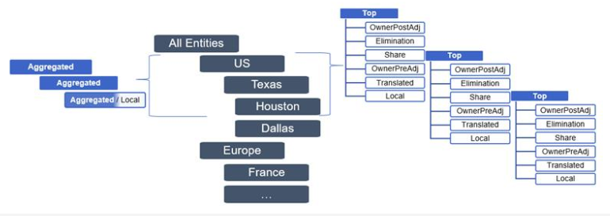

#### Aggregated Dimension

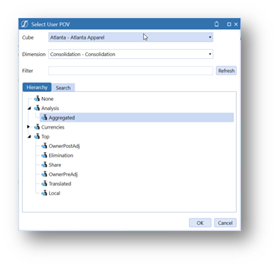

#### Example Of Cube View Using C#Aggregated Dimension

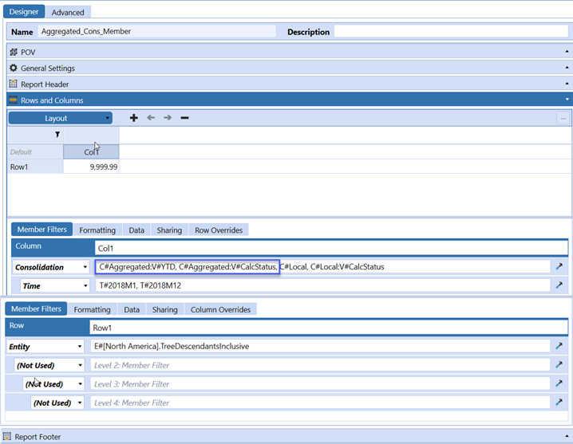

l Rows o Entity: E#[North America].TreeDescendantsInclusive l Columns o Consolidation: C#Aggregated, C#Aggregated:V#CalcStatus, C#Local, C#Local:V#CalcStatus o Time: T#2018M1, T#2018M12

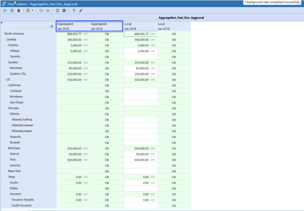

Aggregate Jan 2018, by right-clicking on the number and pick Consolidate to Aggregate numbers. Context aware algorithms are used recognize the Aggregated member. Notes: l No Parent Journal Adjustments l No Eliminations l Business Rules (execute at the base level only) l Select different Consolidation member (C#Aggregated) to run Consolidation on and pick the numbers that were loaded.

### Launching An Aggregation

This is the same process as launching a Consolidation using context aware algorithms once the Aggregated member of the Consolidation (C#Aggregated) is selected. For example, right-click on the appropriate cell in a Cube View or Form to view the Process by clicking Consolidate.

Consolidate l Consolidate l Force Consolidate l Consolidate with Logging l Force Consolidate with Logging Aggregate Jan 2018, by right-clicking on the number and picking Consolidate to Aggregate numbers. Context aware algorithms are used recognize the Aggregated member.

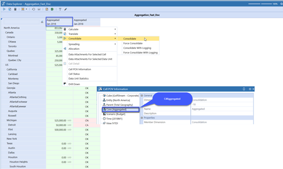

### Entity Aggregation Input

Entity aggregation input lets you submit data for base member values through the aggregated member. Use the “Allow Input Into the Aggregated Consolidation Member” property to enable input. Values entered into an aggregated cell are saved to the respective local currency member (C#USD, C#CAD, and so forth).

> **Important:** Data entered through journals cannot be entered into the aggregated

member. This feature is available in versions 7.4 and higher.

#### Enable Entity Aggregation Input

You must first enable aggregation input on the scenario you are using. Perform the steps below or watch the video. 1. On the Application tab, click Dimensions. 2. Expand Scenario Dimensions. 3. Expand the appropriate dimension, then select Scenarios. 4. On the Members tab, expand Hierarchy and click on the aggregated member to select it. 5. Click the Member Properties tab. 6. Under Settings, set Allow Input into the Aggregated Consolidation Member to TRUE. 7. Click Save.

## Working With Hybrid Scenarios

Hybrid scenario data improves query performance if you analyze smaller data sets from large data units that contain high volumes of account-level detail for a cube such as scenario and entity. This enhances query performance when: l Different business units require smaller subsets of the data unit because they only need to report on specific accounts, cost centers, products and so on. l Business processes require a higher level view of data for budget or planning. In these cases, data is filtered to focus on business and consumption needs for more efficient data analysis. Hybrid data uses data from a source scenario member and displays the results in a target scenario member. You may need multiple target scenarios based on how you use hybrid source data in your application. For information about associated properties, see Hybrid Scenarios. Also see: l Data Bindings l Data Filters lShare Data From the Source Scenario l Copy Data From the Source Scenario

### Data Bindings

Data bindings determine if data is shared or copied from the source scenario member to the target scenario member. Sharing data is best if you need to analyze smaller data sets from a large data unit. The data results are dynamic and reference source data. This data is not stored to the target scenario and is read-only. Shared scenarios also share the source scenario’s calculation status and indicate source data changes. Standard calculations run from a shared scenario also run on the source scenario member. Use Copy Data to compare ‘What If’ Scenarios, for budget versioning or forecasting. By default a data copy occurs if a standard calculation - associated with the following - is run on the target scenario: l Cube view or Quick View grid l Calculation definitions l Calculate data management step The Calculate Data Management Step offers more control over the hybrid source data process. Set ExecuteCopyAfterCalc Scenario to False and enable the copy execution on the Data Management Step. If enabled, calculations run on the scenario, but the data copy only occurs if the calculation runs from the Data Management Step.

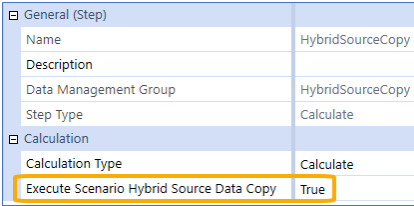

Calculations follow the standard sequence and store the data as "calculated". If multiple calculations run, the previously calculated or copied data is cleared. To preserve existing data, set the data as "durable" on the target scenario. Once the target scenario copy finishes, you can modify and adjust data, but the target scenario is still bound to the source. The data copy occurs whenever the scenario is calculated based on the scenario setup. Hybrid copies can be chained, so results in a target scenario can be used as the source in another.

### Data Filters

Hybrid source data generates unique data views using different filters, so you can best focus your data modeling and analysis. Pre-aggregated members provide a summarized source data view by defining the source parent members and target base members. Members are filtered before aggregation and cached in RAM. Then the smaller data set is brought in and Share or Copy the information over to the target accounts.

### Share Data From The Source Scenario

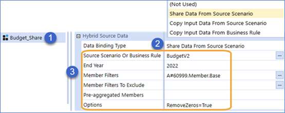

1. Create a target scenario called Budget_Share. 2. Specify a Data Binding Type: Share Data from Source. 3. Select source scenario and data settings: l Source scenario: BudgetV2 l Data binding ends in 2022 This shares the base accounts for Account 60999. Any zeros in the source data are removed.

### Copy Data From The Source Scenario

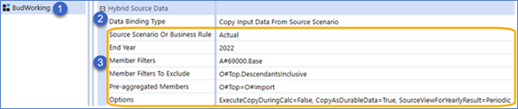

1. Create a target scenario called BudWorking. 2. Specify a Data Binding Type: Copy Input Data from Source Scenario. 3. Select the source scenario and data settings: l Source scenario: Actual l Data binding ends in 2022 This copies the base accounts of Account 69000 and excludes Origin dimension members. Data is copied from the top of Origin in the source scenario to the Import member of Origin in the target scenario. The calculation occurs only if run from the Data Management Step, and the copied data is stored as durable.
