# Navigation

You can access OneStream through a web browser or via OneStream Windows App through an application shortcut deployed via a OneStream website, or from a version installed directly on a computer. These options are available for both administrators and end users. The layout is intuitive and easy to use. OnePlace will highlight all the major touch points as well as provide information on the navigation tips.

> **Tip:** Hover over any of the icons and a tool tip will temporarily display.

## About The OneStream Windows Application

Using the Windows App is helpful because: l The Windows app automatically updates whenever the application server version is updated. l You do not need admin rights to download or use the application. l It offers robust spreadsheet functionality, so you may not need to install the Excel Add-in. To launch the Windows App: 1. Click the launch icon in the upper right corner of the window from any 4.2 or greater web- based instance. 2.If prompted, click Run. You can also launch the Windows App via Microsoft Edge with the URL associated with the latest version of the server. First, enable Edge Chromium support for Click Once. See https://docs.microsoft.com/en-us/deployedge/microsoft-edge-policies#clickonceenabled. To create a desktop shortcut:

The Create Windows Shortcut window displays. 1. Click

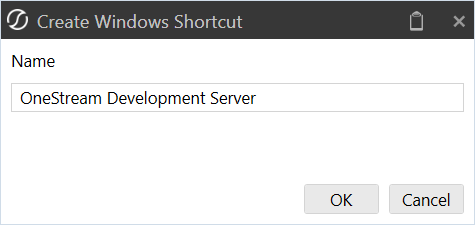

2. Modify the shortcut name as needed and click OK.

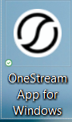

This icon can now be used to launch the Windows App from your desktop.

## Launching The OneStream Windows App

The Windows App is installed locally and can access different servers. To launch the app, click, Start and locate the OneStream Desktop app.

## Defining Server Connections

Before you can log in and open an application, you must define server connections:

in Server Address to add the URL of the server to connect 1. On the Logon page, click to. The Manage Connections window displays.

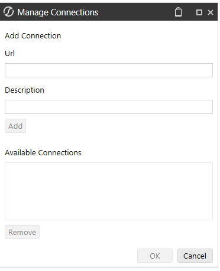

2. Enter the server URL and a description. 3. Click Add to include the server in the list of Available Connections. 4. In Available Connections, select the server and click OK.

## Logging In

If you are in a OneStream-hosted environment, see the Identity and Access Management Guide for information about authentication with OneStream IdentityServer. If you are in a self-hosted environment, to log in with the browser, see the Modern Browser Experience Guide. If you are in a self-hosted environment, to log in with the desktop application, follow these steps. 1. On the OneStream Logon screen, for Server Address, specify the URL or client connection. See Defining Server Connections. 2. Click the Connect button.

|Col1|NOTE: The Logon screen will look different depending on how your environment is configured (native authentication, external identity provider, or both native authentication and an external identity provider).|
|---|---|

Native Authentication Only

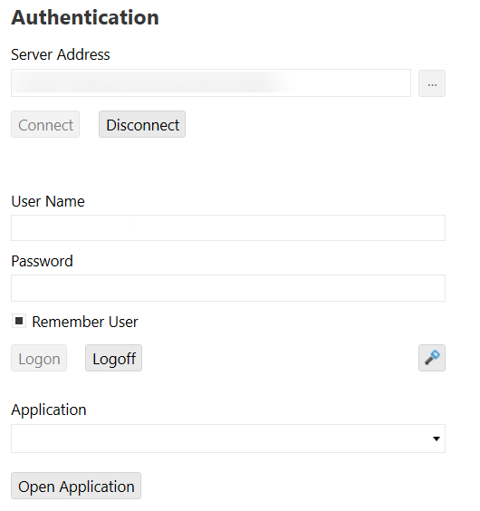

External Identity Provider Only

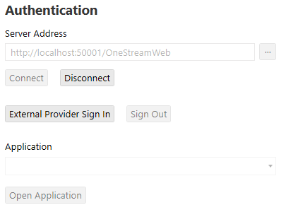

Native Authentication and an External Identity Provider

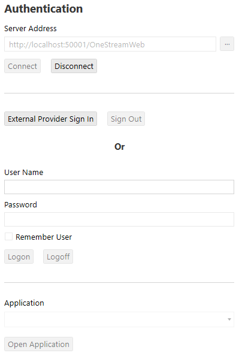

3. Follow the steps for your authentication configuration: l For native authentication: a. Enter your user name and password. b. Click the Logon button.

|Col1|NOTE: This process for native authentication is also used for authentication with MSAD and LDAP identity providers. Enter your user name and password set up in MSAD or LDAP and click the Logon button.|
|---|---|

l For an external identity provider: a. Click the External Provider Sign In button. b. Enter your external identity provider login credentials.

|Col1|NOTE: Single sign-on with an external identity provider can be configured to require a one-time verification code for authentication. If the Require Verification Code setting in the Web Server Configuration File is enabled, you will be provided with a one-time verification code to enter in the application. For information about the verification code, see the Installation and Configuration Guide.|
|---|---|

4. On the OneStream Logon screen, select an application from the drop-down menu. 5. Click the Open Application button. For instructions on configuring authentication in a self-hosted environment, see the Installation and Configuration Guide.

## Oneplace Layout

1. Navigation Pane - This section covers the three tabs that are available: System, Application and OnePlace.

> **Note:** Tab visibility is determined by users’ security settings.

Each bar can be displayed by pinning it to the screen, or by Auto Hide. Additional details can be found further down in this section. 2. Home - Click the large OneStream icon to navigate to the user’s set home screen. See Page Setting Options below for more information on setting home screens. 3. Title Bar - This displays the OneStream Logo. 4. Application Tray

Hamburger Menu (Navigation Pane) Clicking (not hovering) this icon will hide or unhide the Application, System, OnePlace Tabs on the left-hand side of the OnePlace screen. If the Navigate Pane is unpinned, clicking (not hovering) this icon will hide the Application, System, OnePlace Tabs.

Navigate Recent Pages This opens a navigation dialog allowing the user to select and go back to a recent page.

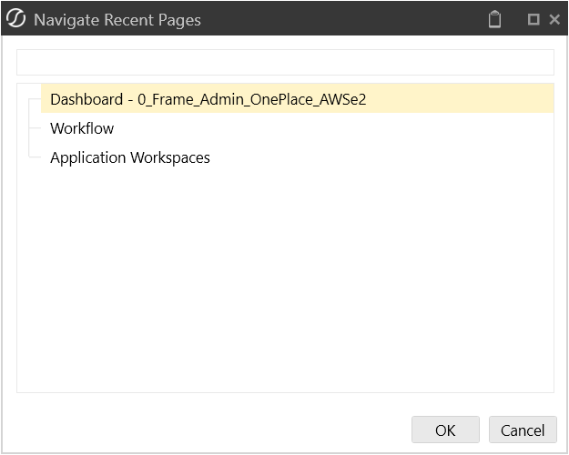

File Explorer This opens the File Explorer dialog allowing users to access public folders, documents and the File Share.

Environment Name This is a customized environment name which can be made different across environments (e.g. Development, Test and Production). Specify an environment name and color in the application’s application server configuration file. See Installation and Configuration.

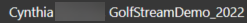

User ID and Application

Logon/Logoff Icon Upon selecting the Logoff icon, the user will be prompted to End Session or Change Application. End Session logs the user off and removes the saved password from the logon screen. Change Application keeps the user logged in and allows him/her to select a new application from the drop- down screen.

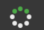

Task Activity This displays all tasks performed within the application. See Task Activity in Logging for more details on this feature.

Refresh Application Refreshes the Application and checks the first open tab. If it is an Application tab, the view will change to that tab. If it is not an Application tab, the view will stay on the selected tab but will change the main active tab to Application.

Pin or Unpin Navigation Pane or POV Pane This will hide or unhide the Application, System, OnePlace Tabs on the left-hand side of the OnePlace screen. In the POV Pane, this will hide or unhide the POV on the right side of the OnePlace screen.

Clipboard Drag and drop items such as data cells, text, rule scripts to the clipboard in order to reuse them in other areas. Users can store up to ten items on a clipboard.

Create Windows Shortcut This creates a desktop shortcut for the application. See About the OneStream Windows Application .

Help This opens OneStream documentation for Platform and OneStream Solution.

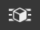

Hamburger Menu (POV Pane) Clicking (not hovering) this icon will hide or unhide the POV on the right side of the OnePlace screen. If the Navigate Pane is unpinned, clicking (not hovering) this icon will hide the POV on the right-hand side of the OnePlace screen. 5. Page Setting Options Click the small OneStream icon to use the following page settings: a. Refresh Page: This will refresh the current page. b. Close Page: This will close the current page. c. Create Shortcut: This will create a shortcut for the current page and store it in the user’s Favorites Folder. When this shortcut is selected from the user’s folder, it will navigate to that page. This can be used for specific Cube Views, Dashboards, or Application/System pages. d. Set Current Page as Home Page: This setting controls the default settings for both the page display as well as the pinning of the Navigation and Point-of-View panels when you sign on. Click the OneStream icon in the application tray in order to navigate to the home page from any other screen. This functionality works in both the browser and the OneStream Windows App versions. Changes made here within one environment carry over to the other. This also controls the Pinning of the Navigation Bar and the POV Bar as well. This generates a UserAppSettings.XML file that has the following pin options: <SLHomePagePinNavPane>TrueValue</SLHomePagePinNavPane> <SLHomePagePinPovPane>FalseValue</SLHomePagePinPovPane> These control if the user’s navigation bar is pinned by default when logging into the application. 1. Clear Home Page Setting This will remove the current home page setting. This functionality works in both the browser and the OneStream Windows App versions. Changes made here within one environment carry over to the other. 2. Save Home Page Setting As Default For New Users This will save a home page as the default home page for any new user logging in for the first time. This functionality works in both the browser and the OneStream Windows App versions. Changes made here within one environment carry over to the other. 3. Close All Pages This closes all open pages. 4. Close All Pages Except Current Page This will close all open pages except the one currently displayed. 5. Workflow Bar This section displays exactly where the user is in the Workflow process. Based on the Workflow Profile, this can be configured as a Certifier or as a Data Loader. The example above is configured as a Data Loader on the Validate task of the Workflow. The color green indicates a completed task, blue indicates incomplete tasks. The white OneStream icon indicates what task is currently in view. 6. Page Refresh This section covers the local refresh and the ability to close a page.

Refresh Page This refreshes the active page.

Toggle Page Size This changes the page size in order to fit the screen.

Close Page This closes the active page. 7. Toolbar Similar to the Workflow bar, this displays the items for a Data Loader or for a Reviewer / Certifier. 8. Context Pane This bar is where the Point of View is set. This is an important concept because it determines to which Dimensions the users will have access for this application view. Additional details can be found further down in this section. 9. Grid This displays the active window’s contents for the functionality being executed. l Pages: This allows the ability to navigate through the pages either by choosing the page, by clicking on the next page, or the first / last page. l Tabs: Now that the tab is open, simply click on one of them to save time in navigating. Clicking the New tab allows two or more like tabs to be opened. For example, two Cube Views tabs can be opened at once.

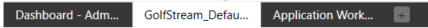

10. Pages

> **Note:** Right-click on any of these opened tabs for more page setting options.

The following icons are only located in the OneStream Windows App.

Zoom Options This controls the zoom settings when working in the OneStream Windows App.

## Point Of View

The Point of View panels located on the right side of the application. This tab can be docked by clicking the pin button, otherwise, it will disappear when clicking anywhere in the main page.

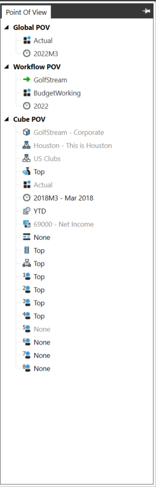

There are three primary sections defined under the Point of View. Global POV This is the Point of View for the whole application. This is set by the administrator and will not be active for the end user to update. This includes Scenario and Time. Workflow POV This has the same configuration as the Workflow area of the OnePlace Tab. It will display the active Point of View; however it will not be active for the end user to update. This includes Workflow, Scenario, and Time. The Time displayed is based on the Time Dimension Profile associated with the Cube assigned to the Workflow Profile. Cube POV This is active and available to be updated by the end user. Each Dimension will need to be set based on the information or activity a user needs to perform. Hover over any of the Dimensions and a tool tip will display the Dimension type. To update a Dimension, select one and a Select User POV box will appear. This box will give the user an opportunity to pick the Cube, Dimension, and the ability to apply a Member Filter and search.

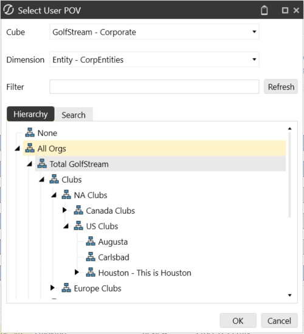

> **Tip:** Save a commonly used POV by right clicking on the Cube POV and selecting Save

Cube POV to Favorites.  This saves the POV under Application|Documents|Users >| (User Name)|Favorites allowing it to be used on any Cube View, grid, or Dashboard.

### User Defined Description – Point Of View

The Point -of -View panel supports the new User Defined Descriptions. Hovering over a selectable point-of-view member will display the defined description. Dimensions which are fixed, not selectable, will display the defined description and append “Not Used by Current Page”. See Application Properties and then User Defined Dimensions (Descriptions). The Point-of-View panel supports the new User Defined Descriptions. Hovering over a selectable point-of-view member will display the defined description. Dimensions which are fixed, not selectable, will display the defined description and append “Not Used by Current Page”. See Application Properties and then User Defined Dimensions (Descriptions).

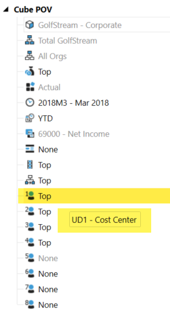

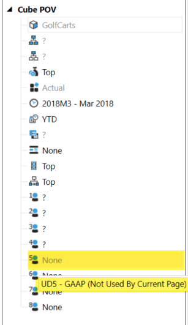
