# Docking

Docking improves your experience in OneStream by enabling you to click, drag, and drop OneStream tabs into specific areas.

## Benefits

You can use docking in several ways: l You can click and drag one tab to a separate screen or monitor while keeping other tabs open on the original screen. l You can dock pages side-by-side and make changes as an administrator in one page and quickly see the results in the other page upon refresh. l You can dock multiple pages within existing docking areas to create your own individualized layouts. Docking provides the following benefits for viewing, building, editing, and creating in the OneStream application:

|Task|Role|Benefits|
|---|---|---|
|Building a Dashboard|Application Developer|Instead of navigating between tabs in the application, you can dock multiple tabs and have them each display simultaneously.|

|Task|Role|Benefits|
|---|---|---|
|Data Analysis|End User|You can dock multiple Cube Views on several screens . For example, Window 1 has Income Statement docked, Window 2 has Revenue docked, and Window 3 has Expenses docked. This allows you to manage multiple items simultaneously.|
|Editing a Cube View|End User|You can view and edit Cube Views more easily with Data Explorer and Designer side- by-side docked.|

See Docking Use Cases.

## Docking Areas

You can create new docking areas and gain the ability to have tabs open simultaneously and multitask by clicking with the left mouse button, dragging, and then dropping tabs into specific

## Docking Areas.

> **Note:** The Toggle Page Size icon will not display in a floating window.

### Layouts

Each docking area allows you to move content in the following layouts: Left, Right, Top, and Bottom. This will move content to the layout direction of the document group.

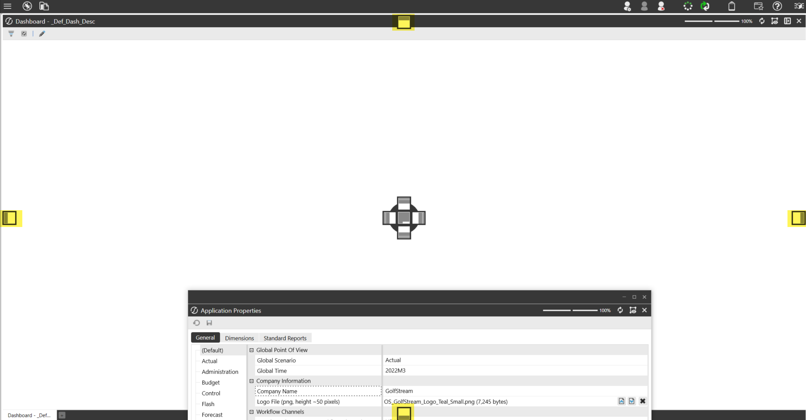

There are also inner components you can move content into for each individual window. You can move content into the following inner layouts: Left, Right, Top, Bottom, and Center. The Center layout opens content within the document group.

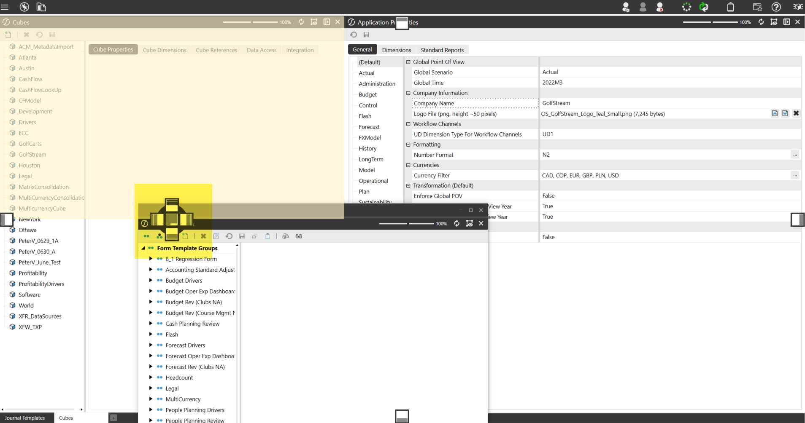

In the following example, the Application Workspaces page was docked to the right to edit the dashboard.

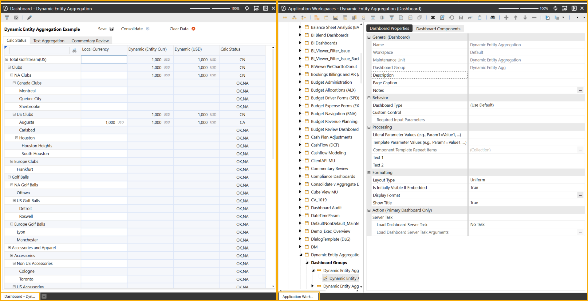

### Tabs

#### New Tabs

Click the New Tab button in the bottom tab bar to open a new (Empty) tab. When you open a new page through the left-hand Navigation pane, the new tab will replace the (Empty) tab in the main window. If actions or buttons in a specific OneStream page can launch a new page, those new pages will be opened in the same window as the original OneStream page.

|Col1|Example: If the Application Workspaces page is open in a floating window and you select a Cube View and then click the Open Data Explorer toolbar button, the new Data Explorer page will be opened in the same floating window.|
|---|---|

#### Empty Tabs

If you click the New Tab button to add a new (Empty) tab and then select a navigation link in the left-hand Navigation pane, it will open a new page and replace the empty tab.

|Col1|Example: If you click the New Tab button to create an (Empty) tab, then click the Books navigation link, the system will replace the (Empty) tab with the Books tab.|
|---|---|

> **Important:** You cannot dock the (Empty) tab in a docked or floating window. The

(Empty) tab only exists in the main window. When the last open tab in the main window is dragged away, there will be an (Empty) tab and the New Tab button at the bottom of the main window.

|Col1|Example: If the Books tab is dragged out of the main window and added to a Cube Views docked window, the (Empty) tab and New Tab button will display in the main window.|
|---|---|

> **Note:** The New Tab button will always display in the main window.

#### Context Menu

When right-clicking on a tab or a docked page, you will have four options. Context Menu Options l Refresh Page l Close Page l Close All Pages l Close All Pages Except This

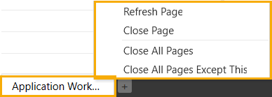

### Pane

#### POV Pane

The Update POV Pane To Current Page toolbar button displays at the top-right of the main document group and any page in docked and floating windows. Items in the POV Pane may be grayed out due to multiple active pages or tabs. This toolbar button will not display in the main document group, if no other docking or floating windows are open. To activate the POV on the docked, floating window or main document group content, select the Update POV Pane To Current Page toolbar button. When you hover over the toolbar button, it will highlight in yellow as an active icon.

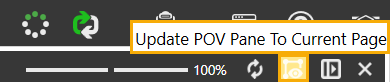

When docked pages or floating windows are closed or re-added to the main window, the POV returns to its previous functionality and the toolbar button will not display. If you do not have any docked or floating windows, the existing functionality on the right POV pane applies.

|Col1|Example: When selecting a tab to open that specific page in the main window, the POV pane will update to that page's POV.|
|---|---|

#### Left Navigation Pane

The Left Navigation Pane's OnePlace, Application, and System tabs will no longer be automatically selected depending on the page most recently opened in the main, docking, or floating window.

## Floating Window

You can create floating windows by clicking, dragging, and then dropping a tab into a screen or monitor. You can also drag and drop other tabs and pages onto the floating window. If the floating window has multiple tabs or pages, clicking the top-right Close Window button will close the floating window and all pages contained within it.

> **Note:** The Toggle Page Size icon will not display in a floating window.

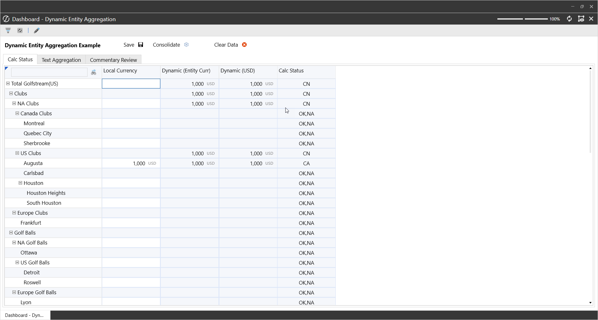

> **Note:** With the docking functionality, the floating windows maintain the same

functionality. Hover over the OneStream application in your taskbar to display different application floating windows in the foreground.

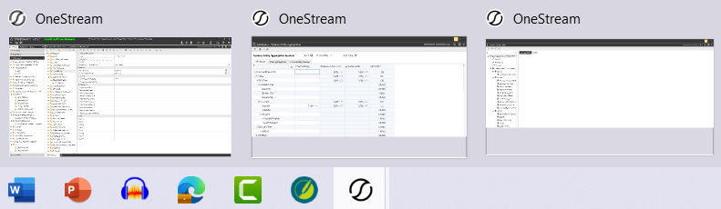

### Refreshing Content

If a docked, floating, or the main window contains multiple tabs or pages, clicking the Refresh button at the top-right of an individual, open page only refreshes the content within that one page.

### Undock Content

You can undock a tab or page in the following ways: l You can click, drag, and drop the tab or page into a new location. For example, click and drag a tab or page from a floating window and back into the main window.

|Col1|NOTE: If the last tab or page is dragged away or closed within a docked or floating window, that docked or floating window will also close.|
|---|---|

l You can drop a tab or page back into the main window tab bar or over the New Tab button. This will dock the content into the main window. l You can use the center docking component that displays when dragging tabs or pages into the specific window, which will open the tab or page in the selected document group rather than opening a new docking area.

## Docking Known Issues

Consider the following when docking in OneStream.

### Logon Page

lThe Close Page button will always appear on the Logon page. For example, when you log off, select Change Application and then click the Close Page button in the top right corner of the Logon page. A blank screen will display. You must restart the application to log in again.

### POV Pane

l The Update POV Pane To Current Page toolbar button appears in every docked or floating window even if the docked or floating window does not reference the POV pane settings. The Update POV Pane To Current Page toolbar button will not appear in the original, main window. You must create at least one additional docking or floating window for this toolbar button to appear.

### Floating Window

l When you minimize and attempt to re-open a floating window on a separate monitor or screen, the floating window opens on the main application screen. You will need to drag the floating window back to the separate monitor or screen every time you re-open that minimized window. l If you have a workflow page in a minimized floating window and then try to launch another workflow page from the main application page, the minimized floating window will display a black flash before loading.

### Navigate Recent Pages

l When navigating recent pages, docking will consider tabs that you first created or if the page is refreshed or modified in the main document group for docked and floating windows. The back and forward have also been removed. l In the Navigate Recent Pages dialog, when the same page is opened multiple times, such as a Cube Views page opened in the main window, a docked window, or a floating window, the Navigate Recent Pages dialog will only list the name "Cube View" three separate times. It does not specify which Cube View page (main, docking, or floating) each item references. l When using the Navigate Recent Pages dialog box to open a tab in a maximized floating window, docking will restore the floating window size (not maximized). l In the Navigate Recent Pages dialog box, the OK button is enabled even when an item is not selected. Click the OK button when no option is selected to close the dialog box.

### List Box

l A list box may display when you open multiple tabs or pages and click the left most tab and then right-click a tab closer to the right end of the tab bar. The list box will display a drop- down list with all currently opened tabs instead of the context menu.

### Docking Use Cases

The following sections provide sample use cases for docking to seamlessly create, multitask, and easily build in your OneStream. In many cases, you must toggle between various tabs and pages since only one window could be opened at a time when working in the application. Docking allows you to effectively view work side-by-side or create floating windows simultaneously. You can make changes on one screen and display the results on another screen when you save content and refresh.

|Role|Benefits|
|---|---|
|End User: User that creates and edits Cube Views.|End Users can manage Cube Views more easily with Data Explorer and Designer displayed side-by-side.|
|End User: User that creates and edits dashboards.|End users can efficiently modify dashboards and their components by opening the Designer View and Workspaces pages side-by-side or in a floating window. This allows you to make quick changes without having to reopen different pages or tabs to find objects needed for a dashboard.|
|Administrator that needs to debug Business Rules.|Administrators can dock multiples pages on one screen. This will allow you to run end user actions, show the business rule, and view the error log by docking these three pages in their own individual docking areas on the same or separate screens.|
|Administrators that use Analysis and Planning|Administrators can dock multiple pages in a side-by-side view to view multiple analysis and input forms for planning purposes.|

## Use Case

### Side-By-Side Cube View Editing

|Role|Benefits|
|---|---|
|End User: User that creates and edits Cube Views.|End Users can manage Cube Views more easily with Data Explorer and Designer displayed side-by-side.|

In this example, you can dock tabs or pages while editing the Cube View. 1. On the Application tab, under Presentation, click Cube Views. 2. Select the Cube View to edit and then click the Open Data Explorer toolbar button to open the Data Explorer page in another tab. 3. Click, drag, and drop the Data Explorer tab to any of following layouts: Left, Right, Top, or Bottom. In this example, the tab was moved to the right layout. The Cube View and the published version are now side-by-side.

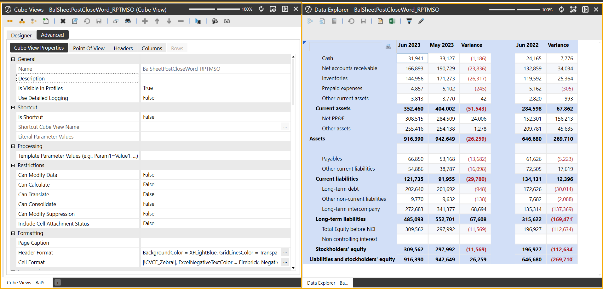

4. On the left layout, begin to edit your Cube View. In this example, the Cube View's Row Sharing field was updated from All Rows to (Not Used). 5. Click Save to save all changes. 6. On the right layout, click the Refresh icon. The Cube View will refresh and display the changes made.

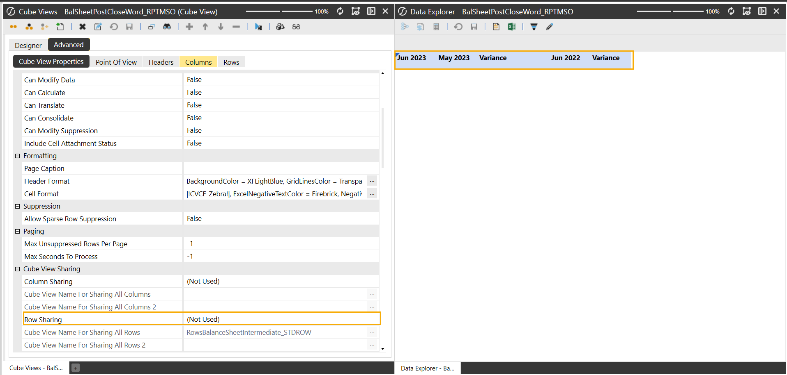

### Modify Dashboards

In this example, you are creating a floating window to modify multiple dashboard components. 1. On the OnePlace tab, under Dashboard, select a dashboard. 2. Click the Edit Dashboard icon. 3. Once the Application Workspaces page loads and the Dashboard is selected, select the drop-down arrow next to the View Dashboard in Design Mode button, and select the Set Selected Dashboard as Default. 4. Click and drag the dashboard in Designer Mode to another screen. In this example, you created a floating window on the right monitor while having the Workspaces page on the left monitor. 5. To edit the MarginLeft value, on the right floating window, click the Edit Dashboard button to refresh and load the Dashboard on the left floating window. 6. Navigate to the Formatting Dashboard Properties section, and click the Edit button in the Display Format field. In Display format, update the MarginLeft field's value from 50 to 100. 7. Click Save to save all changes. 8. On the right floating window, click the Refresh icon. The Dashboard now displays the changes. 9. To edit the order of Dashboard Components, on the right floating window, click the Edit Dashboard button. 10. Select the Dashboard Components tab and move the order. In this example, the Embedded 04 Component was moved above the Embedded 04 Headcount Component. 11. Click Save to save all changes. 12. On the right floating window, click the Refresh icon. The Dashboard now displays the changes. Left Monitor

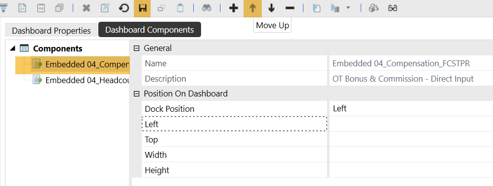

Right Monitor

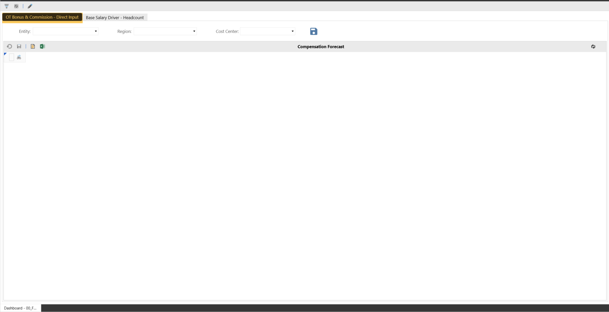

### Debugging Rules

In this example, you can run end-user actions, show business rules, and view the error log simultaneously on one screen. You have docked multiple pages such as the "Forecast Planning Process" Dashboard, your Business Rules at the top-right layout, and the Error Log at the bottom- right layout. This allows you to view your dashboard, the syntax being used in a Business Rule, and the log of errors from users. When clicking the Save Calculate icon in your dashboard and then refreshing content on the right layout pages, you can view all the errors and begin to debug your business rules.

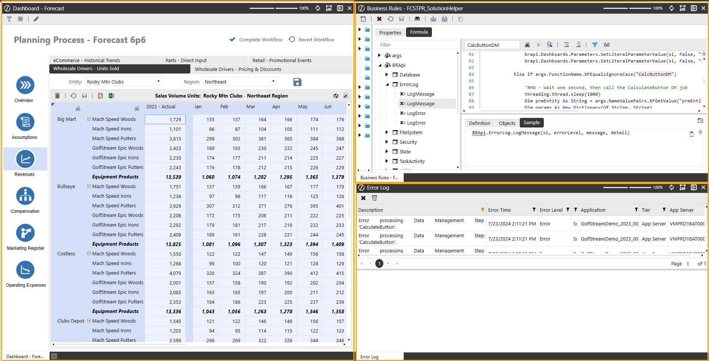

### Simplified Analysis And Planning

In this example, you can dock content side-by-side to view multiple analysis and input forms for planning purposes. From an analysis perspective, if you need to analyze data in a quick view while preserving your original view, you can begin to dock both views side-by-side. On the right layout, you can begin ad hoc analysis while still maintaining the context of the dataset you are analyzing on the left layout.

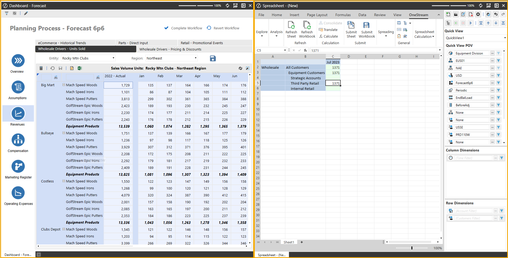

Another example of using docking to simplify Analysis and Planning is to view your drivers and inputs for your forecast and assumptions simultaneously. In your Forecast Dashboard, open the Forecast and Assumptions page on separate tabs. Begin to dock the Assumptions page to the right layout with the Forecast page on the left layout. This allows you to display multiple drivers, such as the Cost of Goods sold driver and the Forecast input, side-by-side. When using docking for this instance, you can view multiple drivers you are interacting with while running your calculations. This allows you to view multiple end-user screens and inputs together.

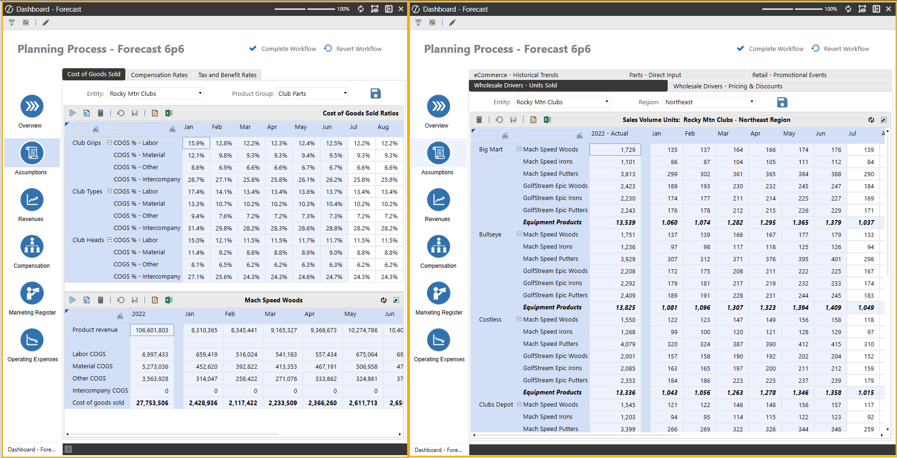
