# Workflow

A primary feature of the OneStream platform is the ability to tailor and optimize all aspects of an application to best fit the requirements of the model design, such as Consolidation, Planning, Forecasting or Operational models. In this section you will learn about the various import methods, workflow analysis, and the blend workflow.

### Workflow

The Workflow Engine is the coordinator of all activity in the system. It protects you from having to deal with the complexities of an advanced Multi-Dimension Analytic Model. Profiles and Channels are the basic building blocks of a solid workflow management structure. Data Units represent units of work for loading, clearing, calculating, storing, and locking data within the Multi- Dimensional engine.

### Workflow

Workflow is the overall system manager coordinating all end user activities while guaranteeing the quality and transparency of source data used to feed the Analytic Models contained in OneStream applications. The Workflow Engine’s primary responsibilities are to: l Protect the end user from Analytic Model complexities. l Manage and audit data collection. l Manage and enforce the quality process along with the data certification process. l Manage and intelligently coordinate the data consolidation process. l Deliver right-time information and guided analysis. l Create a standardized end-user experience with the capability of becoming personalized through guided Workspaces. The primary reason Workflow exists is to care and feed Analytic Cubes.  Therefore, before a Workflow hierarchy can be created, at least one Cube marked as Top Level for Workflow must exist in the application. A Cube is an Analytic Model that consists of eighteen Dimensions and provides system designers the ability to quickly and reliably create multiple Cubes within an application. They also create a Dimension Library that enables reusability and Dimension calculation logic. This capability enables system designers to create optimal Analytic Models tailored to the specific business process exhibited without having to move data in and out of the application. The Workflow Engine’s job is to provide a common and seamless user experience no matter how an application designer chooses to implement the underlying Analytic Models (Cubes). This capability enables application designers to create organized applications because they are free from worrying about how to train users on the specific Analytic Models to access during the business process. When a Cube is defined, it can be marked as a Top-Level Cube for Workflow.  This setting tells the Workflow Engine the Cube is eligible for Workflow management. Each Cube can only participate in one Workflow Management Structure, which means if a Cube is referenced by another higher-level Cube, it cannot be set as a Top-Level Cube for Workflow. After a Cube is tagged as a Top-Level Cube for Workflow, the Workflow Engine will recognize the Cube and allow a Workflow Management Structure to be created for the Cube based on the Suffix Values for varying Workflow by Scenario Type. Building a Workflow Management Structure for a Cube starts with defining how many variations there will be in the processes used to feed the Cube (suffix for varying Workflow by Scenario Type). Workflow hierarchy variation is aligned with the ten Scenario Types that enable Cube extensibility. By default, no suffix values are created which means the Cube can only have one hierarchy in its Workflow Management Structure. Setting up a Workflow Management Structure that enables multiple Workflow hierarchies is accomplished by assigning a defining set of suffix values reflecting the different business processes that will be used to populate the target Cube.

#### Creating Workflow Suffix Groups

For example, a Cube has been created to collect actual reporting data, financial planning data, and some other miscellaneous data collections (Cube Name = FinancialReporting). The first step to defining a Workflow Management Structure for this Cube is to determine how data will be provided to the Cube and the business processes it was designed to analyze. The table below details the three business processes for the Cube and the proposed suffix values that will identify the business process in the Workflow Management Structure.

|Business Process|Data Source|Suffix|
|---|---|---|
|Actual:|System Interfaces|Sys|
|Plan Data:|Keyed/Excel Uploads by Entity|Ent|
|Other Data:|Unknown at this point|Oth|

Next, the suffix values need to be assigned to the Scenario Type that will be used to capture data for each process. The assignment process will vary from application to application and will be dependent on the requirements of each business process.

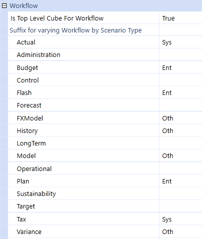

#### Creating A Workflow Hierarchy Using A Workflow Suffix

Group Three Workflow hierarchies can be created for the FinancialReporting Cube. This is accomplished by opening the Workflow Profiles screen and clicking the Create a CubeRoot Workflow Profile button from the tool bar. The Workflow Engine will automatically present the three Workflow hierarchy options for the FinancialReporting Cube.

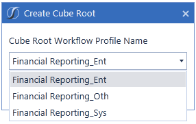

The Workflow Engine can now manage three different collection hierarchies for the FinancialReporting Cube. After a Workflow processing has begun and data is being actively collected for the Cube, the Workflow Management Structure (suffix definitions) cannot be changed. Workflow can be thought of as an outline (Workflow Profile Hierarchy) of the business process that is being used to model and analyze. This section describes the Components of a Workflow Management Structure and the relationship between Workflow Profiles, Entity Members and Origin Members.

### Workflow Profiles

Workflow Profiles are the foundation of the data loading process, which is where Data Sources and Transformation Rules are assigned, and the anchors for the review and certifications. This section will go through more detail about all the configuration settings available. See Workflow in Workflow for more details on how the Workflow function works.

> **Tip:** It is best to lay out the organization first in Excel to view and review how the

structure looks. Once confirmed, create the same structure in OneStream.

> **Tip:** There are a variety of combinations for building out the Workflow Profiles. Below

are a couple from some best practices. Fully Integrated This is the complete flow from data loading to certification in the same structure. Shared Services Data loading and data certification are integrated; however shared services are separated from the certification. Separation of Duties Data load and certification each have their own structures. Navigation tips for this section Each profile can have a separate configuration based on the Scenario. Out of the box, the standard configuration is set to (Default).

#### Workflow Profile Toolbar And Right Click Options

Create a Cube Root Workflow Profile Use this to begin the hierarchy of a new Workflow Profile.

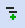

Create Child Under Current Workflow Profile There are three types of profiles that can be created:

Review Reviewer or Certification

Base Input Data Load

Parent Input Parent Adjustments

Create Sibling of Current Workflow Profile This has the same option as above.

Delete Selected Workflow Profile and its Children Use this to delete the selected Workflow Profile and any children it may have

Rename Profile Use this to rename a Workflow Profile or Workflow Profile Input Type

Cancel All Changes Since Last Save Use this to cancel any unsaved changes

Save Use this to save any changes made to selected Workflow Profile

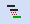

Move Current Workflow Profile as Child of Another Profile Use this to move a selected child of a selected Workflow Profile to another Workflow Profile

Move Current Workflow Profile as Sibling of Another Profile Use this to move a selected sibling of a selected Workflow Profile to another Workflow Profile

Move Up Use this to move sibling profiles up in the hierarchy

Move Down Use this to move sibling profiles down in the hierarchy

Work with Profiles Use this icon when working in the Workflow Template screen to navigate to the Workflow Profile screen.

Work with Templates Use this icon when working in the Workflow Profile screen to navigate to the Workflow Template screen. See Workflow Templates for more details on this feature.

Update Input Children Using Template Select a specific Workflow Profile Template and assign it to a Workflow Profile’s input child. See Workflow Templates for more details on this feature.

Unassign Selected Entity Use this to assign a selected Entity from a Workflow Profile

Show Items that Reference Selected Item Use this to see the other areas where the selected item is being used.

Navigate This icon appears in various fields and when clicked it navigates to a section that coincides with the Workflow Profile property. For example, if this icon is clicked in the Cube Name setting, the Cube screen will open allowing the user to make any changes needed before assigning a Cube to a Workflow Profile.

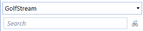

Use the Workflow search tool to filter down to the specific Workflow Profile or Workflow Input Type desired. The Cube Root defaults to the last one selected and displays the associated Workflow Profiles. In order to see another Workflow structure hierarchy, select a different Cube Root. Right-click on any Workflow Profile name in order to expand or collapse all the selected Workflow Profile’s descendants.

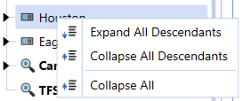

#### Using Workflow Profiles

A Workflow Profile is the basic building block of a Workflow Management Structure. Another way to think about a Workflow Profile is a task list that should be performed by a group of users in relation to a group of Entities. Eight different types of Workflow Profiles are available for use within a Workflow hierarchy. Each Workflow Profile type and its role within a Workflow hierarchy is described below.

#### Cube Root Profile Type

A Cube Root Profile should be thought of as the definition of a Workflow hierarchy for an entire Cube or a suffix group defined by the Cube. (See the preceding section on Cubes and Workflow). As a result, to create a new Cube Root Profile there must be a Cube defined in the Analytic Model marked as Is Top Level Cube For Workflow = True. Default Profile Relationship When a new Cube Root Profile is created, the Workflow Engine will automatically create a matching Default Input profile that is prefixed with the Cube Root Profile name (e.g. Corporate_ Default). A Default Input profile is required for each Workflow hierarchy and it cannot be deleted. The job of the Default Input is to establish the default relationship between the Workflow structure and the Entity Members within the Cube the Cube Root Profile was created to control. Controlling Workflow States Cube Root Profiles have a predefined Workflow used to control the state of the Workflow Management Structure (Open / Closed). Cube Root Profiles are used as a mechanism to control the state of the entire Workflow hierarchy for a given Scenario and time because they represent the top element of a Workflow hierarchy.

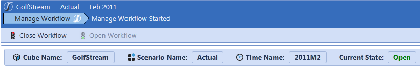

Open State The Workflow is available for usage and locking is controlled at the individual Workflow Profile level. In addition, all Workflow hierarchy structure information is read from the current Workflow hierarchy as it reads the Workflow Profiles management screen. This also means the Workflow hierarchy is accessed from memory (cache) rather than being read from the database which provides very fast read performance. Closed State The act of closing a Workflow hierarchy triggers the Workflow Engine to place a high-level lock on the Workflow. This means individual Workflow Profile lock status values do not matter, and the

Workflow level will display a to indicate a closed Workflow. In addition, the Workflow Engine will take a snapshot of the current Workflow hierarchy structure being managed from the Workflow Profiles management screen. It will store it in a historical audit table for the Scenario and time being closed. This also means the Workflow hierarchy is not accessed from memory (Cache) as would be the case with a Workflow in an open state. A closed Workflow must be read from the database rather than memory because it is considered a point in time snapshot stored in a historical table. This is a performance penalty noticed when reading the entire closed Workflow hierarchy for a Scenario and time. Workflow hierarchies should only be closed if major changes are being made to the Workflow hierarchy and the structure of a Cube and historical hierarchy relationships need to be preserved.

#### Review Profile Type

Review Profiles are best thought of as checkpoints in the Workflow hierarchy structure. This type of profile does not have a direct relationship to an Entity Member or Origin Member. However, Review Profiles can have Calculation Definitions assigned to them, so that Cube calculations can be ran in a controlled manner during the Workflow sign-off process. Named Dependents Review Workflow Profiles have a unique ability to establish a dependency on the status of Input Parent Profiles that are not their direct descendant in the Workflow hierarchy structure. This concept is referred to as a Named Dependent relationship and was developed to accommodate situations where a single Input Parent Profile loads data for many legal Entities that have very different responsibility structures from a sign-off perspective. This situation is very common when an organization utilizes a Shared Services infrastructure strategy. Creating a Named Dependent The screenshot below demonstrates an example of the Canada Clubs Review Profile establishing a Workflow dependency on the Eagle Drivers Input Parent Profile, even though the Eagle Drivers Input Parent is not a descendent of Canada Clubs.

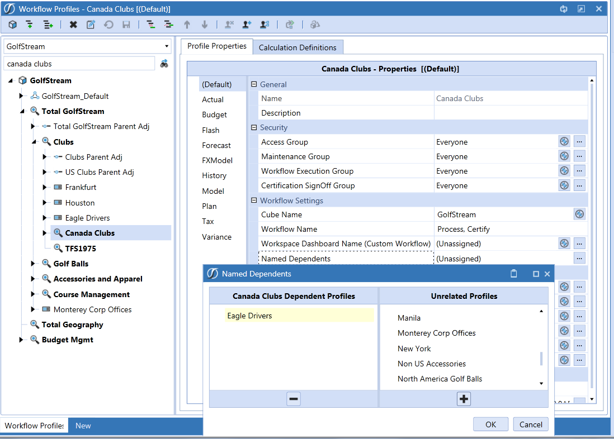

#### Input Parent Profile Types

Input Parent Profile types are special profile types because they are the point where a relationship is formed between the Workflow Management Structure and an Entity Member. All Input Parent Profiles types share the common purpose of organizing different types of data input used to feed an Entity. This is accomplished through the use and control of dependent profiles called Input Children. All Input Parent Profiles must have at least one Input Child of each type (Import, Form and Adjustment). This requirement exists because of the relationship between Input Child Profiles and the Origin Dimension Members.  Input Child Profiles can be thought of as a specialized extension of the Input Parent with added intelligence and control features particular to data updating. Default Input Default Input Parent Profiles are special because they cannot be created directly. They are automatically created whenever a Cube Root Profile is created. Unassigned Entities The primary purpose of the Default Input Profile type is to serve as the initial relationship between the Entities belonging to a Cube Root Profile and the Workflow hierarchy. Entities cannot be explicitly assigned to a Default Input Profile. Any Entity Member under the Cube with which the Default profile is associated and is not explicitly assigned to a Parent Input Profile or Base Input Profile, is implicitly assigned to the Default Profile. Parent Input Parent Input Profiles are used to allow adjustments to Parent Entities in the Cube. Adjustments to a Parent Entity are only allowed via Forms or AdjInput Members of the Origin Dimension. Consequently, Import Child Profiles are not allowed to be used with a Parent Input Profile. The Workflow Engine will automatically create an Import Child for each Parent Input Profile, but the Import Child will be forced to be inactive (Profile Active = False). Assigned Entities The primary purpose of the Parent Input Profile type is to establish a relationship between Parent Entities that require the ability to accept adjustments and the Workflow hierarchy. Parent Entities do not need to be explicitly assigned to a Parent Input Workflow Profile unless the Parent Entity requires the ability to be adjusted. Most Parent Entities exist as unassigned Entities and therefore are controlled by the Default Input Profile. Base Input Base Input Profiles are used to control all methods of data entry for Base Entities in the Cube. This is the most common Workflow Profile type and can be thought of as the workhorse of data update management. Base Input Parents define the Entities that can be updated, the Cube being targeted, and all the Import Child types that will participate in the input scheme. Assigned Entities The primary purpose of the Parent Input Profile type is to establish a relationship between Base Entities that need to receive data from an external source and the Workflow hierarchy.

#### Input Child Profile Types

Input Child Profile types will always be base Members of a Workflow hierarchy and can only be children of one of the three types of Input Profiles: Default, Parent or Base. Origin Dimension Relationship Input Children are mapped directly to Origin Members in the Analytic Cube to create a control mechanism between the Workflow hierarchy and the Cube. This linkage enables the Workflow Engine to control the importing, form data entry, adjustment (journal) data entry and data locking processes for one or more Entities.

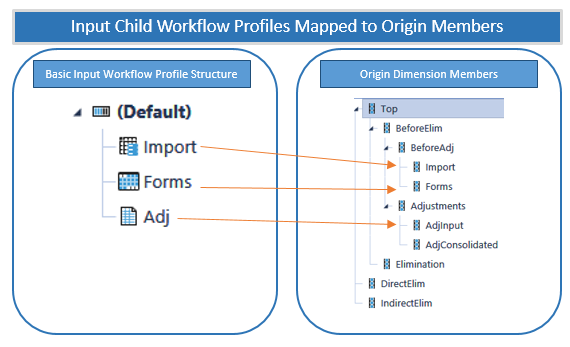

Controlling Input Channels The relationship between Origin Members and the Input Child Profiles that map to them enables the Workflow hierarchy to be configured in a way that allows/disallows certain input channels for the Entities assigned to the Input Parent Profile. By setting the Profile Active switch, an entire channel of input can be enabled/disabled. For example, if a Forms Input Child has the Profile Active set to False, and there are no other active Input Child siblings of the type Form, data entry forms and Excel (SetCells Function or Cube Views) cannot be used to set data cell values for the Entities assigned to the Input Parent Profile of the Forms Input Child.  The same technique can be used to enable/disable Import and Adjustment input types. Import Child An Import Child defines and controls how data is imported into the Cube (See Data Loading for more details). Each Import Child is bound to the Data Source and Transformation Rule Profile which will define its Workflow behavior during the Import Workflow Step. Import Child Origin Mapping The Workflow Engine enforces a relationship between Import Child Profile types and the Import Member of the Origin Dimension. This means, when loading data, the Origin Member will be forced to the value Import. Forms Child A Form Child defines and controls how data is manually entered in the Cube. Each Form Child is bound to an Input Forms Profile that will define its Workflow behavior during the Input Forms Step. Form Child Origin Mapping The Workflow Engine enforces a relationship between Form Child Profile types and the Forms Member of the Origin Dimension. This means when creating data entry forms, the Origin Member must be set to Forms or the data cell will appear as read only. It is possible to use a data entry form to update the AdjInput Member of the Origin Dimension, but this requires the account being updated to have its Adjustment Type set to Data Entry rather than the default value of Journal. Adjustment Child A Journal Child defines and controls how data is entered via journal into the Cube. Each Form Child is bound to a Journal Template Profile that will define its Workflow behavior during the Input Journals Step. AdjInput Child Origin Mapping The Workflow Engine enforces a relationship between Adjustment Child Profile types and the AdjInput Member of the Origin Dimension. This means when creating journal entries, the Origin Member will be forced to the value AdjInput.

#### Workflow Entity Relationship

The relationship between Workflow Profiles and Cube Entities creates a powerful asset that can act as leverage across many areas of the Workflow experience. By performing the one-time setup process of binding Entities to specific Workflow Profiles, the OneStream Workflow Engine can make this relationship information available to the application designer in many areas of the product. This means Workflow control structures and data entry mechanisms can be designed using abstract methodologies that refer to the current Workflow Unit value, which in turn can be resolved to a list of associated Entities. Workflow Entity Relationship Member Filter Examples The primary way the Workflow Entity relationship is used is through analytic Member Filters. E#Root.WFProfileEntities When used in a Member Filter, this expression returns all Entities associated with the selected Workflow Unit. E#Root.WFCalcuationEntities When used in a Member Filter, this expression returns all Entities defined as part of the Calculation Definitions for the selected Workflow Unit. E#Root.WFConfirmationEntities When used in a Member Filter, this expression returns all Entities defined as part of the Calculation Definitions when the Confirmed Switch is set to True for the selected Workflow Unit.

#### Multiple Input Workflow Profiles Per Type

An application can have multiple input Workflow Profiles of the same type (Import, Forms, Journals) within each period. This is useful when multiple source systems are feeding the same Entities that need separate Data Sources in XF. It is also convenient when multiple form groups need to be completed by different groups of people. People only see and work on what they have access to because different access groups are created for each. The example below shows a budget where there is one Import Workflow Profile and eight different Form data entry channels that can be assigned to different groups of people. Each of these input channels can have multiple Forms.

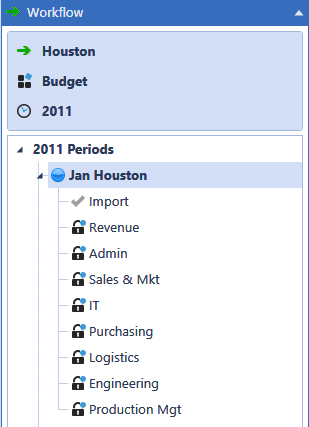

If there are multiple Import Workflow Profiles, it automatically handles clearing and merging data. For example, if there are two Import Workflow Profiles and import has already performed on one of them, when the second import is performed and the user clicks Load, all the target Entities are cleared. The two import data sets are merged, and a replace-style load is made to the financial model.

#### Load Ytd And Mtd In The Same Workflow Profile

During the configuration of a Workflow Profile for a Scenario, the Workflow may require the submission of YTD data in one Origin and MTD/Periodic data in another Origin within the same Workflow Profile. If the Default View for the Scenario is configured as YTD, the Origin submitting MTD/Periodic data needs to be configured appropriately for it to behave as MTD/Periodic. Select the Workflow Profile to configure, expand the Workflow Profile, and then select the Origin to be configured. In this example, Houston.Import is YTD and Houston.Sales Detail is MTD.

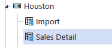

Next, choose the Scenario type where this behavior is needed. Select (Default) if this behavior is required for all Scenario Types.

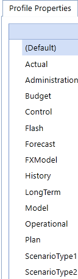

Select Integration Settings to change the following properties:

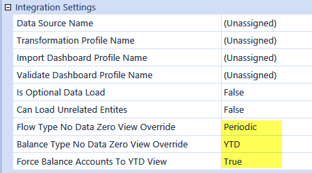

As a result, the Flow Type Accounts will be processed as Periodic rather than YTD upon data submission or when no data is loaded for Flow Accounts. The Balance Accounts are forced to be processed as YTD upon data submission.

#### Cube Root Profile

The Cube Root Profile provides the hierarchy build and organizational structure of the Workflow Profiles for the different Cubes used within the application. All top-level Cubes can have one or more Workflow hierarchies defined depending on whether a suffix was added for a given Scenario Type in Cube settings.

#### Workflow Profile Types

#### Base Input

This is where most of the data updates take place and are broken out by the input channels whereby the Origin Dimension Members are filled out: Import (O#Import), Forms (O#Forms) and Journals (O#AdjInput). Import Import is typically used to load a GL data file or a OneStream configured Excel Template. The Import Origin can be configured by one of the following: (Import, Validate, Load), (Import, Validate, Load, Certify), (Import, Validate, Process, & Certify), (Import, Validate, Process, Confirm, Certify) (Central Import), (Workspace), (Workspace, Certify), (Import Stage Only), (Import, Verify Stage Only), (Import, Verify, Certify Stage Only) Form Form is used to load data either through a Form template or a pre-configured Excel XFSetCell file. The Form Origin can be configured by one of the following: (Form Input), (Form Input, Certify), (Form Input, Process, Certify), (Form Input, Process, Confirm, Certify), (Pre-Process, Form Input), (Pre-Process, Form Input, Certify), (Pre-Process, Form Input, Process, Certify), (Pre-Process, Form Input, Process, Confirm, Certify), (Central Form Input), (Workspace), (Workspace, Certify) Journal Journal is used to load journal adjustment data through a journal template. The Journal Origin can be configured by one of the following: (Journal Input), (Journal Input, Certify), (Journal Input, Process, & Certify), (Journal Input, Process, Confirm, Certify), (Central Journal Input), (Workspace), (Workspace, Certify)

#### Parent Adjustment

If a top side adjustment is needed, do so with a Parent Input Workflow Profile either through a journal or form. Both will update the AdjInput Member in the Origin Dimension.

#### Review

These Workflow Profiles do not take input, but are meant for reviewing, confirming and certifying results from the lower input Workflow Profiles. Since the Review Workflow Profiles cannot load data, the only tasks available for a Review Workflow Profile are (Process, Certify), (Process, Confirm, Certify) See Workflow Tasks in Using OnePlace Workflow of the Reference Guide for more details on each of these task types.

#### Profile Properties

The first tab is the primary configuration tab and is available for all types of profiles. It is where security and other objects are attached.

> **Tip:** This can be configured per Scenario Type.

#### General

Name Name of profile. Description Brief description of profile.

> **Note:** If a description is added to a Workflow Profile in the Default Scenario, the

description will display in the Workflow Profile POV dialog in OnePlace.

#### Security

Access Group Controls the user or users that will have access to the Workflow Profile at run time to view results. Maintenance Group Controls the user or users that will have access to maintain and administer the rule group. Workflow Execution Group This group is configured for data loaders and allows users to execute Workflow. Certification SignOff Group This group is configured for certifiers and allows users to sign off on the Workflow. This group can be used to separate duties between a data loader and certifier. Journal Process Group (Journals Only) Access to this group allows users to process a journal. Journal Approval Group (Journals Only) Access to this group allows users to approve a journal. Journal Post Group (Journals Only) Access to this group allows users to post a journal.

> **Note:** Click and begin typing the name of the Security Group in the blank field. As the

first few letters are typed, the Groups are filtered making it easier to find and select the appropriate Group. Once the Group is selected, press CTRL and double-click to enter the correct name into the appropriate field. Prevent Self-Post (Journals Only) Allows you to prevent users from posting their own journals when users have security rights to post, process, or approve them. The Post button is disabled in journals where the status is Created User, Submitted User, or Approved User. Additionally, the Quick Post button is replaced with Submit, Approve, and Post action buttons. l If set to True, members of the Journal Post security group cannot post their own journals within this workflow profile. This configuration replaces the Quick Post action with the Submit, Approve, and Post actions if you are a member of all of the following groups: Journal Process Group, Journal Approval Group, and Journal Post Group. Administrators still have access to the Quick Post action. l If set to True (includes Admins), administrators and members of the Journal Post security group cannot post their own journals in this workflow profile. This configuration replaces the Quick Post action with the Submit, Approve, and Post actions if you are an administrator or a member of all of the following groups: Journal Process Group, Journal Approval Group, and Journal Post Group. l If set to False, administrators and members of the Journal Post Group are allowed to post their own journals. This is the default.

> **Tip:** Administrators are members of the security group Administrators. This is defined at

the environment level. They are also members of the security group set in the Application Security Role called AdministerApplication. This security group defines administrators for specific applications. Administrators are automatically granted rights to process, approve, and post journals without being members of Journal Security groups. Prevent Self-Approval (Journals Only) Allows you to prevent users from approving their own journals when users have security rights to approve and process journals. The Approve button is disabled in journals where they are the Created User or Submitted User. Additionally, the Quick Post button is replaced with Submit, Approve, and Post action buttons. Auto Approved and Auto Reversing journals are excluded from the self-approval restriction. A Journal created from an Auto Approved journal template type will be auto-approved when it is submitted. A journal that is automatically created when an Auto Reversed journal is posted will also be auto-approved. l If set to True, members of the Journal Approval security group cannot approve their own journals within this workflow profile. This configuration replaces the Quick Post action with the Submit, Approve, and Post actions if you are a member of all of the following groups: Journal Process Group, Journal Approval Group, and Journal Post Group. Administrators still have access to the Quick Post action. l If set to True (includes Admins), administrators and members of the Journal Approval security group cannot approve their own journals within this workflow profile. This configuration replaces the Quick Post action with the Submit, Approve, and Post actions if you are an administrator or a member of all of the following groups: Journal Process Group, Journal Approval Group, and Journal Post Group. l If set to False, administrators and members of the Journal Approval Group can approve their own journals. This is the default.

> **Tip:** Administrators are members of the security group Administrators. This is defined at

the environment level. They are also members of the security group set in the Application Security Role called AdministerApplication. This security group defines administrators for specific applications. Administrators are automatically granted rights to process, approve, and post journals without being members of Journal Security groups. Require Journal Template (Journals Only) Restricts users from creating new free-form journals by disabling the Create Journals button. It also prevents user from loading journal files that do not contain a journal template, enforcing new journal creation from existing journal templates only. System and Application administrators can still create free-form journals. This property works in combination with the Journal Process Group property, which defines who can create journals in the workflow profile. Set the value to True to enable this feature.

#### Workflow Settings

In this section the administrator can assign a Workflow Channel and a Workflow name. It is important to understand the tasks of each input type in order to properly assign a Workflow name. Workflow Channel This option ties to the Workflow Channels found under the Application Tab/Workflow/Workflow Channels. This allows for an additional layer of security that defined through the Dimension Library. (e.g., Accounts, or UD1 – UD8). Click on the drop down to display all configured Workflow Channels. By default, this is set to Standard. This is an option on each load channel (such as Import, Forms, and Adjustments). Workflow Name The Workflow name controls the tasks the users need to complete in the Workflow. There are a variety of combinations based on the type of Workflow being designed. These tasks can vary by Scenario and Input Type. For example, the Workflow Name Import, Validate, Load is set for the Houston Workflow Profile Import Input Type for the Actual Scenario.

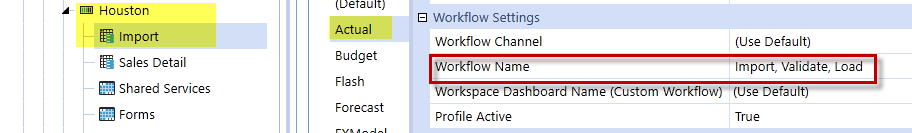

When working in the Houston Workflow and loading data in the Actual Scenario, complete the following tasks:

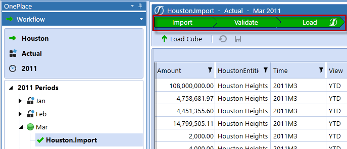

See Workflow Tasks in OnePlace Workflow for more details on these tasks. Workspace Dashboard Name (Custom Workflow) This property only works with a workflow name of Workspace or any selected containing workspace (for example, Workspace, Certify). Use this property to define any dashboard from the Application Dashboards page when an appropriate workflow name is chosen.

#### Integration Settings (Import Only Except Where Indicated)

Data Source Name The way Fixed Width, Delimited, Data Management Export Sequences, or SQL-based based Data Sources are all managed here. These are originally configured under the Application Tab|Data Collection|Data Sources. Transformation Profile Name The type of maps used for the Workflow Profile are managed here. These are configured under the Application Tab|Data Collection|Transformation Rules. This option will display the choices of profiles available. Import Dashboard Profile Name The type of Dashboards wanted for the Workflow Profile Import phase are managed here. Validate Dashboard Profile Name The type of Dashboards wanted for the Workflow Profile Validate phase are managed here. Is Optional Data Load If a Workflow needs to load data to some periods, but not others, this option provides a quick way to complete the Workflow Channel if no data is loaded that month. When set to True, this Workflow Channel will receive an additional icon called Complete Workflow. You can then click on this and complete the process if no data is loaded to this channel. Can Load Unrelated Entities (Import and Adjustment) Typically set to False unless there is historical data to be loaded. l If set to True, a Workflow Profile can load data to entities that are not assigned to its Input Parent Workflow Profile. l If set to False, a Workflow Profile can only load data to assigned entities. A journal can be saved with unassigned entities, but cannot be submitted, approved, or posted. When creating a new blank journal, the Entity Member Filter property is set to the value E#Root.WfProfileEntities. This ensures that entity properties show only assigned entities in its list. This filter value can be changed, but when creating journals from a template, the Entity Member Filter property uses the value from the template instead.

> **Tip:** The next three configurations are for configuring Workflow Profiles that may load as

MTD. The entire Workflow for the year must be loaded consistently the same way for Zero No Data. Flow Type No Data Zero View Override The Workflow will override the Scenario settings of load data from Stage and force Flow Accounts to the Zero No Data Selected. Settings are YTD and Periodic. Balance Type No Data Zero View Override The Workflow will override the Scenario settings of load data from Stage and force Balance Accounts to Zero No Data Deselection are YTD and Periodic. Force Balance Accounts to YTD View If set to True, Balance Accounts are forced to the YTD View for loading no matter what View Member is assigned to the account in the data load file, if set to False, Balance Accounts are loaded with the View Member assigned to the account in the data load file. Cache Page Size Integer must be greater than 0. Setting will default to 20000 records upon save if an invalid value is entered. Cache Pages In-Memory Limit Integer must be greater than 0. Setting will default to 200 upon save if an invalid value is entered. Cache Page Rule Breakout Interval Integer must be greater than 0. Setting will default to 0 upon save if an invalid value is entered. The value entered reflects the count of Transformation Rules which define a point to pause processing to check if the current Cache Page's data records are fully mapped. If the current Cache Page is determined to be fully mapped, the remaining Transformation rules will not be processed.

#### Form Settings (Forms Only)

Input Forms Profile Name The form templates displayed in the forms channel for this Workflow Profile are managed here. These are configured under the Application Tab|Data Collection|Form Templates.

#### Journal Settings (Journals Only)

Journal Template Profile Name The journal templates displayed in the adjustments channel for this Workflow Profile are managed here. These are configured under the Application Tab|Data Collection|Journal Templates.

#### Data Quality Settings

Cube View Profile Name The Cube Views displayed in the analysis pane are managed here. This section is displayed when clicking on the period level during the Process, Confirm, and Certify steps. These are configured under the Application Tab|Presentation|Cube Views. Process Cube Dashboard Profile Name The Dashboard’s rules that run during the Process step are managed here. Confirmation Profile Name The Confirmation Rules that run during the Confirm step are managed here. These are configured under the Application tab|Workflow|Confirmation Rules. Confirmation Dashboard Profile Name The Dashboards displayed during the Confirmation step are managed here. Certification Profile Name The certification questions that prompt the user during the Certify step are managed here. These are configured under the Application Tab/Workflow/Certification Questions. Certification Dashboard Profile Name The Dashboards displayed in the analysis pane are managed here. This section is displayed when clicking on the period level on the Certify step. These are configured under the Application Tab/Presentation/Dashboards.

#### Intercompany Matching Settings

Matching Enabled When set to True, the Matching Parameters section needs to be configured. This can be configured at all channels of the Workflow Profile. Settings are True or False. Matching Parameters Click on the ellipsis button in this field to configure the matching settings.

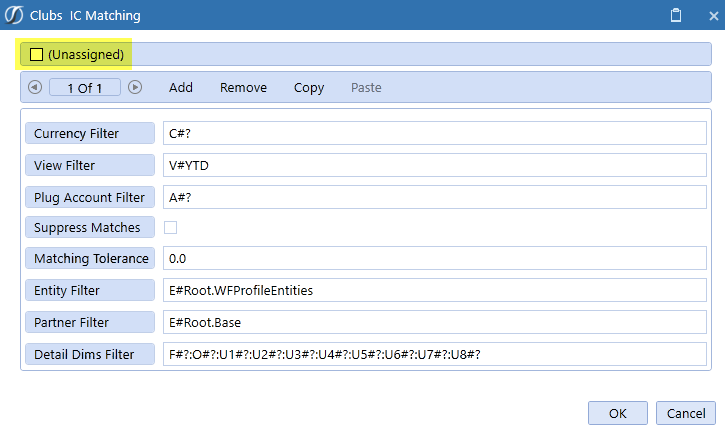

> **Tip:** Make sure the (Unassigned) box is unchecked, otherwise the fields will not be

available to update. Currency Filter Enter the reporting currency. View Filter Enter how the Intercompany data should display in the Workflow (such as V#YTD or V#Periodic). Plug Account Filter Enter the Plug Account for this Intercompany match. Suppress Matches Check this to apply suppression. Matching Tolerance If the matching tolerance must be on the penny, leave this at 0.0, otherwise add a tolerance threshold for the offset amounts. Entity Filter The Workflow Entities associated with the Intercompany matching.E#Root.WFProfileEntities automatically points to the Entities assigned to the Workflow. Partner Filter Enter a Member Filter specifying the Partner Entities. Detail Dims Filter Enter the Account-Level Dimension Members (Flow, Origin, UD1…UD8) to ensure users are seeing the correct data in the Workflow.

#### Entity Assignment

The third tab is only available when clicking on the Cube Root Workflow Profile. This is where the actual Entity gets tied to the Workflow Profile. There are two sections to this tab: Entity Assignment [Cube Name] This section repaints the Workflow as it was created in the middle pane. This is where an administrator can click on a Workflow Profile, and then use the Unassigned Entities tab to search for Entities. Unassigned Entities This is the search window to find Entities to attach to a profile. This only becomes enabled for the data loading profiles. The search engine uses that contains technology to find Entities. In other words, type the whole word or part of the word and it will search through the complete list looking for that combination of characters. More than one profile may be chosen. Lastly, once an Entity has been attached, it will no longer appear in the search window.

- Click this after the search criteria has been typed

- Click this to attach the item to the profile

- Click this to turn off the search criteria

#### Workflow Profile Grid View

The Workflow Profile Grid View allows an administrator to make several changes to numerous Workflow Profiles at once. Select the Grid View icon and choose data to view. There is also a drag and drop option where the user can select a column label and drag it to the top in order to specifically group the data. This is only available when the Cube Root Profile is selected.

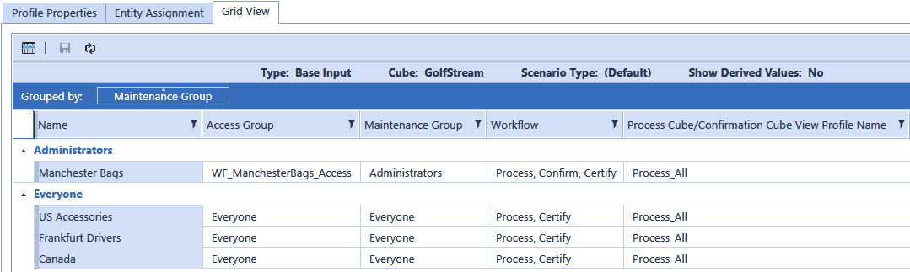

#### Central Input

For corporate configurations there is an option called Central Input. This can be used for situations where corporate does the final adjustment after the data has been loaded by the sites. The Workflow Channel can configure with Central Input which will then display a grey check mark for that Workflow Channel. This allows corporate to make updates and adjustments at the top level because the Workflow owns the Entity.  All activity is tracked in the audit history.

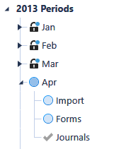

#### Workflow Templates

Workflow Templates are useful when building a series of Base Input Workflow Profiles with similar settings. Design a template as generic or customized as desired and then apply the template to the new Base Input Workflow. On the Workflow Templates screen, there is a (Default) Template

that can be used or click to create a new one. After the template is created, it will look similar to a Base Input Workflow Profile and include the default input types.

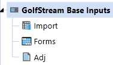

Customize the template to fit the needs of the Workflow design: l Rename the inputs (for example, rename Adj to Journals) l Add additional input types l Disable input types by Scenario (for example, disable Journals for the Budget Scenario if that input type is not used) l Configure Intercompany Parameters l Assign common Cube View or Dashboard Profiles The goal of the template is to make as many common changes and updates as possible which will

save time and clicks during the actual Workflow build. After a template is completed, click to navigate back to the Workflow Profile page. Create a Base Input Workflow and apply the template.

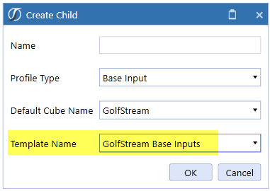

All the template settings now apply to this Base Input.

> **Note:** After a template is applied to a Base Input Workflow Profile, any changes made

to the existing input types (Import, Forms, Journals) cannot be applied to the Workflow Profile. If a new Input Type is added to the template, this can be applied to an existing

Workflow Profile.  From the Workflow Profile screen, select . Select the template with new input types and the Workflow Profiles to which the changes will apply.

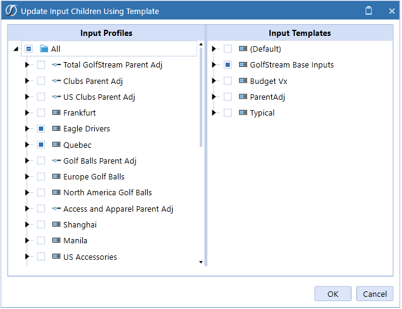

#### Using Calculation Definitions

All Workflow Profile types, except Cube Root, can create a set of Calculation Definitions. A Calculation Definition can be thought of as a macro or set of instructions performed whenever the Process Cube Step is executed.

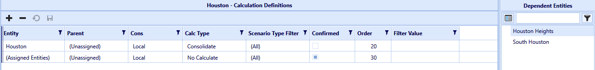

Calculation Definitions are an incredibly valuable tool to the application designer because they take the guess work out of what needs to be calculated and when. During the Workflow hierarchy design process, the Calculation Definitions can be used to run combinations of calculations, translations, and consolidations at Workflow completion points. When defining Calculation Definitions for a Workflow Profile, the Workflow Entity Relationship can be leveraged. This means predefined variables can be used to run calculations for Entities assigned directly to a Workflow Profile (Input Parent types) or related to the Workflow Profile through its dependency chain.

#### Calculation Definition Entity Placeholder Variables

#### Review Profile Type

Dependent Entities This defines a calculation for all Entities that assigned to the dependent Workflow Profiles of the Review Profile. This list also includes all Entities assigned to any Named Dependent Profiles. Named Dependent Filter This allows a filter value to be used to specify the specific Entities that are valid dependents of the Review Profile. This is required because in most cases Named Dependents are shared services and tend to have Entity relationships that span over multiple Review Profiles. This includes all Entities assigned to a Named Dependent that may return Entities not relevant to a Review Profile.

#### Input Parent And Input Child Profile Type

Assigned Entities This defines a calculation for all Entities directly assigned to the Workflow Profile. Loaded Entities This defines a calculation for all Entities imported by the Import Child Workflow Profiles and are dependents of the Input Parent. Journal Input Entities This defines a calculation for all Entities adjusted with journal entries by the Adjustment Child Workflow Profiles and are dependents of the Input Parent. User Cell Input Entities This defines a calculation for all Entities affected by data entry performed by the user executing the Workflow. This variable will return a different Entity list for each user. This is typically used in situations where a Workflow is setup without specifically assigned Entities but must update specific data cells across Entities owned by other Input Parent Profiles. This is referred to as a Central Input Workflow design and is usually used by corporate offices to control values in select Entities and accounts. Input Child Profile Type Input Child Profiles are considered extensions of their Parent Input Profile and as a result, they do not require an explicit Calculation Definition. If an Import Child does not have an explicit Calculation Definition defined, it will default to those defined by its Input Parent.

#### Confirmed Switch Value

Each Calculation Definition record has a Confirmed switch associated with it. This switch determines whether the Entities defined by a Calculation Definition should be subjected to the Confirmation Workflow Step. It also gives the application designer control over which Entities are subject to the Confirmation Rule validation process. Filter Value Assign a Data Management Sequence to Calculation Definitions by setting the name of the Sequence under the Filter Value and setting the Calc Type to No Calculate. Next, set up a DataQualityEventHandler Extensibility Business Rule to read the Sequence name assigned to the filter and in turn, run the Data Management sequence during the Process Cube task in the Workflow.

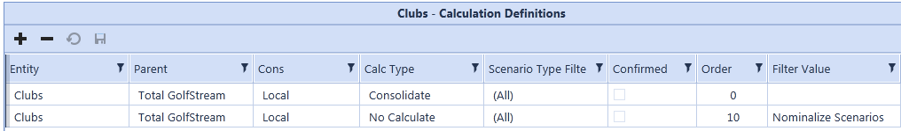

#### Calculation Definitions

The second tab is where the administrator assigns the Calculation Definitions for the Workflow Profile. This will determine the type of calculation/consolidation that occurs when a user selects Process Cube during the Workflow. Multiple Entities can be entered and ordered accordingly. See Using Calculation Definitions in Workflow in the Design Guide for more details.

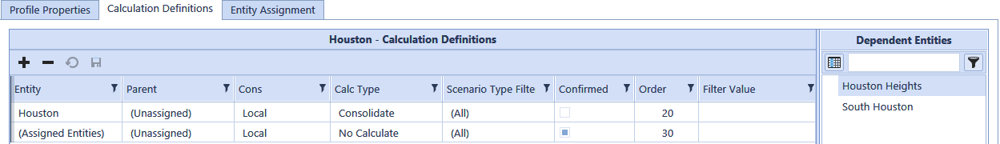

Auto-assigning Entities can be done through (Assigned Entities) or (Load Entities). The Confirmed check box controls which Entities are tested by Confirmation Rules.

> **Tip:** By right clicking on any line item, a user can insert or delete a row, save, or export

data.

### Data Units

A data unit is used to load, clear, calculate, store, and lock data in the multi-dimensional engine. With workflow channels, OneStream provides the following data units.

#### Level 1: Cube Data Unit

This is the largest unit of work and is commonly referred to as the entity, scenario and time data unit. This aligns with financial analytic system tasks to clear, load, calculate, and lock entity, scenario and time combinations. Members of the cube data unit are: l Cube l Entity l Parent l Consolidation l Scenario l Time Cube data unit analytic work items include (applicable to cube data processing): l Clear data l Load data l Lock data l Copy data l Calculate l Translate l Consolidate

> **Note:** The Cube data unit is locked when an input parent workflow profile is locked or

certified, provided an entity is assigned to this parent workflow step. See Data Locking for more information

#### Level 2: Workflow Data Unit

The workflow data unit builds on the cube data unit by including the account dimension. This decreases the unit of work by increasing the data unit's granularity. This indicates a workflow data unit is a sub-set of the cube data unit, allowing fine-grained control over analytic work items. The workflow data unit is the default level used by the workflow engine to control, load, clear, and lock data during the processing of stage data. Workflow level data loads from the staging data mart to the cube, and is processed at a granularity level that includes the account dimension by default. For example, if two import workflow profiles are not siblings of the same input parent, but load to the same entity, scenario and time dimensions, the data loads and clears at the account level. However, if these two workflow profiles load the same accounts, the last workflow profile to load is used.  If these workflow profiles load to different accounts, then data loads for both workflow profiles. Members of the workflow data unit are: l Cube l Entity l Parent l Time l Consolidation l Scenario l Account Workflow data unit analytic work items are (applicable to stage data processing and cube data import): l Clear data l Load data l Lock data At the cube level, data is locked on the assigned entities by origin dimension and is dependent on the workflow step that is locked. This can be Forms, Import, or Adjustment. See Data Locking for more information.

#### Level 3: Workflow Channel Data Unit

The workflow channel data unit builds on the workflow data unit by including a single user-defined dimension. The user-defined dimension decreases the unit of work by increasing the data unit's granularity. This means a workflow channel data unit is a subset of the workflow data unit, allowing fine-grained control over analytic work items. The user-defined dimension that extends the data unit is specified at the application level from the Application Properties screen. You can only use one user-defined dimension per application as a workflow channel, so carefully consider which user-defined dimension to select in relation to the application's account dimension. For example, cost center and version user-defined dimensions are commonly used in a workflow channel data unit. These user-defined dimension are frequently included in a workflow channel data unit because they represent data slices that align with data collection and locking requirements of the Budget and Forecast business processes.

> **Note:** Accounts can also utilize workflow channels.

#### Workflow Channel Unit Budget Example

A typical cost center budget collection process has many users submitting data to a single cube data unit. In addition, all users are submitting data for different cost centers to the same workflow data unit (that is, the same account). This can inevitably cause data contention within the workflow data unit. Therefore, assigning the user-defined dimension containing cost centers as the user- defined dimension type for Workflow Channels makes each entity/cost center act as a granular and autonomous cell collection in a legal entity. This allows individual cost centers to load, clear, and lock data with no impact to other cost centers. Workflow channel data unit members are: l Cube l Entity l Parent l Time l Consolidation l Scenario l Account l User Defined (x) Workflow channel data unit analytic work items are (applicable to stage data processing and cube data import): l Clear data l Load data l Lock data At the cube level, data is locked on the assigned entities by workflow channel if assigned correctly. This applies to workflow channels used in the account or a user-defined dimension. See Data Locking for more information.

#### Data Loading

This section describes how the workflow engine loads data for each relationship between the workflow and data units. The OneStreamworkflow engine controls data loading from the staging data mart to the analytic model. The workflow engine includes intelligence about what data to load and how to load for each workflow unit. The loaded analytic cube gets this from the binding relationship between its input parent workflow profiles and base entities. In addition, the workflow engine uses the origin dimension's import member exclusively when loading data. This predefined relationship provides a built-in level of data protection between imported data, manual data entry, and journal adjustments. The workflow engine manages how data is placed into the origin dimension's Import, Forms, and AdjInput members. The workflow engine also forces imported data to use the local member of the consolidation dimension. The workflow engine always starts with a workflow data unit to control clearing, loading, and locking data for its entities. A workflow channel data unit is used if workflow channels are active in the workflow unit's analytic model relationship.

#### Data Load Execution Steps (Clear And Replace)

When a workflow unit's data load process executes, the engine does the following: 1. Checks workflow state l Implicitly locked (parent workflow certified) l Explicitly locked 2. Checks workflow profile data load switches l Can load unrelated entities (True / False) l Flow type no data zero view override (YTD / Periodic) l Balance type no data zero view override (YTD / Periodic) l Force balance accounts to YTD view (True / False) See Integration Settings under Workflow Profiles in Workflow for descriptions of these settings. 3. Analyze prior data loads l Evaluate previously loaded data units to list data units to clear during the load. 4. Execute clear data l User-defined workflow channel configuration not used l Clear Workflow data units loaded by the workflow unit.  A workflow data unit considers accounts and cube data unit standard members, so data clears at an account level by default.

#### User-Defined Workflow Channel Configuration Execution Steps

Clear all workflow channel data units loaded by the workflow unit. User-defined members and workflow data unit members are standard members of a workflow channel data unit, so data clears at a user-defined member entity, scenario, time, and account level by default. 1. Execute load data l Data loads using parallel processing by entity. Multiple entities process at the same time.

#### Workflow Profile Data Loading Behaviors

This section describes three specific data loading behavior patterns. These behaviors range from the basic data load process where one workflow profile loads one data unit, to more than one workflow profile loads one data unit.

#### Behavior 1: Single Workflow Profile - Loading One Or More Entities On A Mutually

Exclusive Basis:

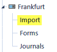

This workflow profile configurationhas only one import child profile under the parent (Frankfurt). The workflow engine follows basic clear and replace data loading steps described in Data Load Execution Steps (Clear and Replace).

#### Behavior 2: Multiple Import Child Workflow Profiles

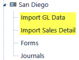

This workflow profile configuration has more than one import child profile under the parent (San Diego). The workflow engine must perform extra steps to determine how to load data in the child profiles. In this case the two import child profiles may try to load the same cube or workflow data unit because they have the same input parent workflow profile and are trying to load the same entities. When the import GL data or import sales detail workflow profiles execute the data load step, the following process determines how to correctly load data from both pofiles to the cube.

#### Multiple Import Child Data Load Evaluation Steps:

1. Check for overlapped data units between import child siblings (import GL data or import sales detail). 2. Determine the siblings have overlapped data units. If yes, clear all previously loaded data units for both import child siblings, then reload both using an accumulate load method in the order they appear in the workflow hierarchy. If the two siblings are loading to the same cells, the values are be added together and placed in the cell. If no, use the basic clear and replace data loading steps described in Data Load Execution Steps (Clear and Replace).

#### Behavior 3: Multiple Import Parent Workflow Profiles Loading One Or More Common

Entities

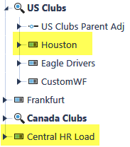

This workflow profile configuration has a central input parent profile that may load data assigned to another workflow profile. The Central HR Load workflow profile must have the Can Load Unrelated Entities set to True, so the workflow engine will let it try to write data for unassigned entities. In this situation, when either Central HR Load or Houston executes a data load, the basic clear and replace data loading steps described in the previous section are used. However, Central HR Load does not control any entities so it checks and abides by the workflow and locking status of the workflow profiles that own the entities. For example, the workflow engine disallow updates if Houston is certified or locked and Central HR Load tries to load an entity owned by Houston.

#### Managing Sibling Imports

Certain application designs may require a workflow parent to have multiple sibling import channels. These designs typically use parallel processing techniques to load multiple non- overlapping sibling import children. The Load Overlapped Siblings setting on the parent boosts parallel processing performance in these workflow designs by eliminating overlapping checks between sibling channels. It only happens when the sibling channels' data sources do not contain overlapping data unit data records. This switch lets applications optimize data partitioning with parallel processing using the least workflow profiles.

#### Load Overlapped Siblings

l True: Default behavior, sibling channels check for overlapping data units. l False: Do not check sibling channels for overlapping data units. If an overlapping condition occurs, the last processed channel overwrites the prior.

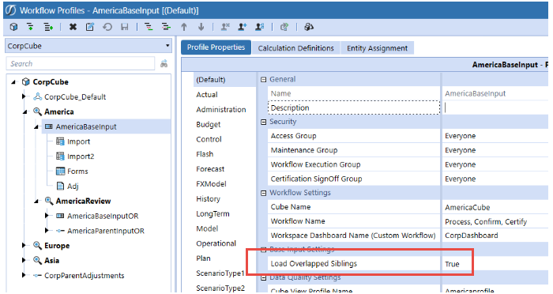

#### Data Locking

OneStream uses a locking strategy different than other analytic systems. All data control tasks are delegated to the Workflow Engine including the Entity data locking control because of the integrated Workflow Controller. The Workflow Engine creates a bidirectional link between the Workflow Engine, the Staging Engine, and the Analytic Engine. This two-way link creates a much stronger control structure compared to systems with separate Workflow control modules that only interact with an Analytic Model in a unidirectional control structure. This is an important control feature because if a user of the system attempts to update a data cell directly after all Workflow processing is completed, the Analytic Engine must check with the Workflow Engine to determine if the cell can be updated. In a unidirectional control structure, the data cell can be unlocked and updated regardless of the Workflow control state creating a break in the process audit chain. This situation cannot exist because every input data cell is associated with a Workflow Unit. Any attempt to update a data cell directly (Data Entry Form or Excel, etc.) triggers the Workflow Engine to validate the data cell’s Workflow state by resolving its Workflow status through the Entity assignment relationship mechanism. Locking data in means the data is Locked for Input. When data is locked (Explicitly or Implicitly) the Workflow Engine will not allow any form of data input to affect the Entities assigned to the Workflow Profile of the locked Workflow Unit.

#### Lock Types

Explicit Locks An Explicit Entity Data Lock is created when a Workflow Unit is locked therefore locking its assigned Entity(s) for the Scenario and Time associated with the Workflow Unit.

#### Implicit Locks

An Implicit Entity Data Lock is created when a Workflow Unit’s Parent Workflow has been certified. Implicit locks are created to ensure after a higher-level Workflow Unit is certified, the underlying Entity data cannot be changed. Implicit locks can be cleared by un-certifying the Parent Workflow Unit.

#### Workflow Only Locks

If a Workflow Unit is locked and the Workflow Profile does not have assigned Entities, all Workflow processing is blocked, but there are no Entity locks placed.

#### Locking Granularity

Data locks can be placed at different levels of granularity within the Analytic Model. Input Parent Workflow Profiles (Level One Data Unit Lock) The highest level of locking occurs when an Input Parent Workflow Profile is locked. This is a Level One Data Unit Lock because the Workflow Engine will force all data cells for the Entities assigned to the Input Parent to be locked. This is accomplished by locking the Input Parent Workflow Profile as well as the Input Child Workflow Profiles regardless of Origin Member binding or Workflow Channel assignment.

#### Input Child Workflow Profile (Origin Lock)

OneStream utilizes a predefined relationship between the three types of Input Child Workflow Profiles and a static Dimension called the Origin Dimension to control and lock the three basic channels of input for an Entity. This relationship provides the ability to control and lock data entry processes and associated data cells by binding the Workflow Profile Input Child Types to Origin Dimension Members.

#### Input Child Workflow Profile (Workflow Channel Lock)

Through the use of Workflow Channels assigned to Input Child Workflow Profiles and associated with Accounts or User Defined Members, it is possible to provide very detailed locking granularity within a given Origin Member. The diagram below demonstrates how the Forms Origin Member has been divided into multiple Workflow Channels enabling each Form Input Child Workflow Profile and the UD1 data cells bound to the same Workflow Channel to be locked independently. Workflow Channels can be used with Import Input Children as well Adjustment Input Children.

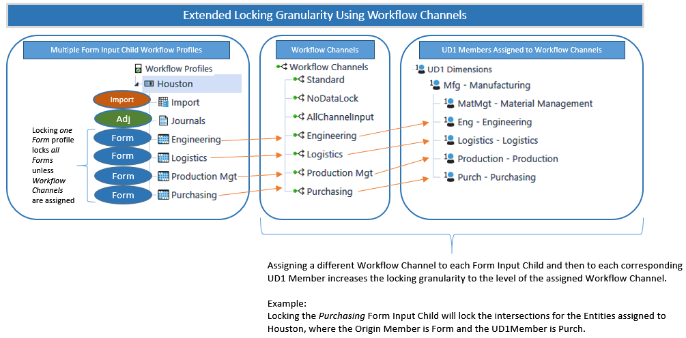

#### Security

To lock a Workflow Profile, you need Workflow Execution Group membership or an inherited Workflow Execution Group membership from an ancestor Workflow Profile. The Execution Group authorization to lock workflows applies to all descendent Workflow Profiles regardless of the Access Group or Workflow Execution Group member rights assigned to the descendants. The Audit Workflow Process provides an audit trail of user activity in the Locking and Unlocking Workflow Profiles To unlock workflows as a non-administrator, you must have membership in the Workflow Execution Group and the Application Security Role UnlockWorkflowUnit. Unlocking descendent Workflow Profiles is inherited from Workflow Execution Group membership on an ancestor Workflow Profiles

### Workflow Stage Import Methods

Workflow Stage Import has three primary methods of integrating data from the Stage Engine to meet the reporting requirement for each OneStream application model. l Standard: Highly durable and auditable, stored details that target Finance Engine Cubes. l Direct: In-memory, performance-focused, no storage of record details, that target Finance Engine Cubes. l Blend: In-memory, high-performance import designed to blend the multi-dimensional structure with transactional data. No storage of record details or targeting external relational tables needed.

#### Standard Import Methods

A Consolidation Model requires that data be durable and auditable, as OneStream is functioning as the “book-of-record” for financial reporting. In this regard, the Stage Engine’s Standard Type Workflow is ideal in that each Import performed has its source and target records stored in Stage tables. This allows every current and historical period loaded to be audited and analyzed at the source and target record level used for loading data to the Finance Engine. The stored tables also allow detailed analysis from the Finance to the Stage using the Drill-Down feature.

#### Direct Import Methods

Certain Planning, Forecasting or Operational models may not require detailed audit and historical durability of data, with the resulting database overhead, that is required of the Consolidation Model. The Stage Engine’s Direct Load Type Workflow is specifically designed to support the needs of data that is more operational in nature. The Direct Load Type’s in-memory processing, and lack of storing Source and Target record detail, enhances its performance in processing compared to the Standard Type Workflow. The performance benefits of not storing source and target records is also what makes the Direct Load Type inappropriate for Consolidations, where detailed audit, history and drill-back is required.

#### Blend Import Methods

The Blend Type Workflow is an in-memory process and the integration method used by the BI Blend Engine, which writes to external relational database tables and not to a Finance Engine Cube. The BI Blend Engine is a key element of Analytic Blend models as it is a read-only aggregate storage model. The purpose is to support reporting on large volumes of data that is not appropriate to store in a traditional Cube, such as transaction or operational data. The Blend Type Import rationalizes the source data into a structure that is uniform and standardized for reporting by leveraging Cube Dimensions, deriving the metadata and aggregation points for the resulting BI Blend relational tables. This enables the transaction content stored in the relational tables to be aligned with the Finance Engine Cube data through common metadata and aggregation points for Analytic Blend Reporting. Refer to the BI Blend Design and Reference Guide for more detail.

#### Stored Versus In-Memory Workflow Imports

The primary difference between the Standard and in-memory processing Import methods is how the source and target record details are stored in the Stage tables.

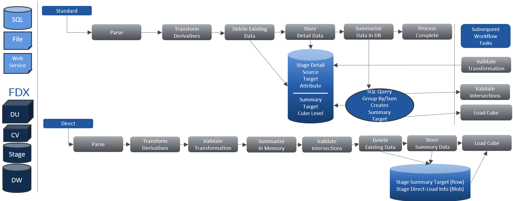

#### Guidelines On Volumes And Limits

Workflow Import performance is optimized by designing a Workflow structure that considers the data volumes of the total number of source records and the resulting total number of summarized target records. The transformed source records are summarized in the StageSummaryTargetData table. The volumes can be managed by structuring the data source loads across Workflows, gaining advantages in parallel processing.

|Limit|Description|
|---|---|
|Row Limit Per Workflow|24 million summarized records|
|Best-Practice Recommendation|1 million summarized records|

|Example|Description|
|---|---|
|Single Workflow Results|24 million summarized records|
|Best-Practice Solution|Parse the file to be used across 24 partitioned Workflows|

The benefits of efficient Workflow structure using partitioning when working with large data sources are: l Performance gains through parallel processing l Shorter processing times l Faster mapping and error correction l More transparent data validation

#### Standard Workflow Record Analysis

OneStream Task Activity / Load Cube presents the details of the total number of summary records in the SelectStageSummaryTargetRows entry.

#### Direct Workflow Record Analysis

The Direct Load Status / Execution Status screen displays the Summary Row Count for each load process to display the total number of summary records generated.

#### Blend Record Analysis

The Blend process differs from other Stage Import processes by generating additional data records, or rows, rather than one-to-one or summarizations. This is because the Analytic Blend designs require the generation of aggregation points, which add to the source rows. Detailed analysis of the BI Blend Processing Logs, Live Row Count statistics, and Task Activity BI Blend Load and Transform help guide the requirements for the application and systems. Refer to the BI Blend Design and Reference Guide for more detail.

#### In-Memory Workflow Imports

#### Direct Load Workflow Import

Workflow Import Type is optimized for performance by combining the Parse/Transform, Validate Transformations and Intersections, and Load Cube into a single Workflow process. This consolidation of processes, and resulting performance gains, is achieved by functioning in- memory and bypassing the overhead of writing and storing Source and Target record details to Stage database tables. The in-memory processing limits certain functionality and therefore may not be an appropriate solution for all model requirements. All other Workflow functionality remains as part of the Direct Type, such as all Business Rules, Transformation Rules and Derivative Rules.

#### Direct Load Use Cases

The Direct Load Workflow is designed for data that has a high frequency of change and does not demand durability for audit and history. Common Uses l Data Integrations where the OneStream Metadata and Source System are mirrored, allowing “* to * “ Transformation rules to pass-through all records, minimizing the need Drill- Down or Transformation analysis. l Data that is “disposable” in nature. Typically, this may be data that has a high frequency of changes and may only be valid for a short time. Perhaps only valid for one to seven days. l High-volume data loads, such as nightly batch loading, where optimal performance is desired. Such data is commonly deleted and reloaded frequently. l Extended Application data moves, where data from a detailed application feeds a summarized target application. l Where target data in OneStream is not required to be durable “book-of-record” data. Important Limitations A key differentiator of the Direct Load is that it does not store source and target records in Stage Database tables. This, by design, will eliminate the audit and historical archiving of Workflow Activity. Other limitations as a consequence of the in-memory Workflow are that the Drill-Down feature will not function to support analysis of records between the Finance and Stage tables. l Direct Load Type is not appropriate where: o Source file import history is required for historical reference. o Transformation Rule history is required for historical reference. o Drill-Down from Finance Engine is required. o Text based View member values are required to be file based. o Data loads are required to Append to prior Imports. l Direct Load Type does not support historical audit of workflow history, such as Import and Transformation Rule history. l Direct Load Type does not support Re-Transform as Import records are not stored data. Data must be re-loaded. l Transformation and Validation analysis and map correction is limited to 1000 error records per load. l Data files cannot load to Time and Scenarios beyond the current Workflow Scenario and Time. The data record's Time and Scenario being loaded must match the Workflow Scenario and Time. As Direct is an in-memory Workflow with only a single step for the data integration process, Load And Transform. The Direct Load Execution Status screen provides statistics to analyze the Workflow’s performance. These key statistics are helpful in determining if the Workflow design is supportive of best-practice designs to optimize application performance.

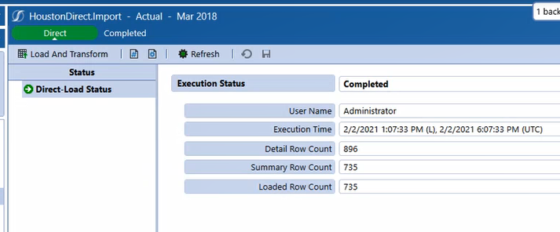

l Detailed Row Count: The total number of Data Source and Derivative Rule records. l Summary Row Count: The total number of records summarized in the Transformation process. l Loaded Row Count: The recorded number of records loaded to the Finance Engine target Cube, which should always equal the Summary Row Count.

#### Direct Load Transformations And Validations

The Direct Load Workflow’s in-memory processing results in Transformation and Validation errors that are not stored being stored in a table. The total number of errors that can be processed and presented in Validation is limited to 1000 records. If the total number of errors exceeds 1000, the data must be re-loaded to re-execute the Transformation and Validation process to generate the next batch of errors, at a maximum count of 1000 records per load. l Total Direct Load Error Storage Limit = 50,000 records l Error Presentation Limit = 1000 records presented per Import load Integrations with high complexity and mapping may benefit by having a “development”, Standard Workflow, to finalize the core Transformation Rules. A Standard Workflow supports pageable Validation and Intersection Error analysis, as well as the ability to Retransform source data that the Direct Load does not. The Standard Workflow also provides the Drill-Back from the Finance Engine to Stage that may streamline the data validation process. Once the core Transformation Rules are developed, a “production” Direct Load Workflow can be used, managing only the Validation exceptions.

#### Direct Load Workflow Implementation

The Direct Load Workflow Design and Requirements should consider strategies for configuration and data validation. Designers should consider the impact of the volume of source records and the complexity of mapping because of the Direct Load Workflow’s lack of stored source and target details. Additionally, the Direct Load Transformation and Validation of records is limited to 1000 records per data load. Therefore, multiple imports may be required to resolve all mapping errors. l Tightly coupled source metadata to OneStream metadata allows the use of “ * to * “ Mask maps to easily associate source data to cube data. l Integrations with complex mapping may best make use of a Standard Workflow as “development” to provide transparency and as a platform for debugging.

#### Direct Load Data Flow

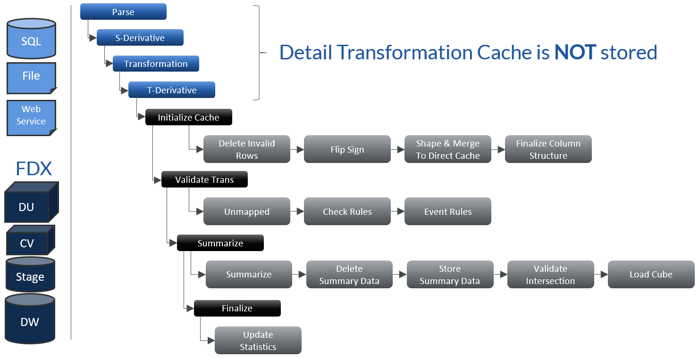

#### Direct Load Workflow Configuration

The Direct Load Type Workflow is an Import channel Workflow configured using various combinations of the “Direct” Workflow Name.

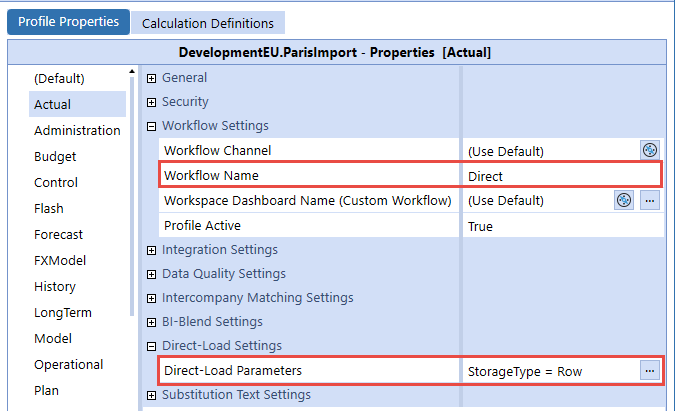

#### Row Or Blob Summarized Data Storage

The Direct Load has two options for managing results of the Transformed records that are ultimately loaded to the Finance Engine, the default being Row. l Row: Transformed summary records are stored in the StageSummaryTargetData table. l Blob: Summarized records are not stored directly in the StageSummaryTargetData, but as a serialized Byte array stored in the StageDirectLoadInformation.

#### Sample Blob Resource Analysis

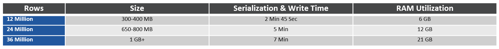

#### Direct Load Error And Troubleshooting

Direct Load Import Source File Data Keys must match the Workflow Data Keys. Unlike the Standard Workflow Import, the Direct Load Import cannot load data beyond the current Workflow. As an example, an Import to M1 cannot contain records for M2 in a Monthly Workflow.

#### Blend Workflow Import

The Blend Workflow Type utilizes the BI Blend Settings, which vary by Scenario Type. These settings allow the BI Blend Administrator to define, and optimize, the generation BI Blend tables to meet the reporting requirements. The BI Blend Settings contain core properties used to design and structure the relational tables created by the BI Blend Engine.

|BI Blend Settings Property Groups|Description|
|---|---|
|Data Controls|Defines the core data source and output structure and design of the relational tables.|
|Aggregation Controls|Settings to leverage Cube Dimension metadata to filter and define the relational tables.|
|Performance Controls|Server management and optimization settings.|

#### Bi Blend Use Cases

BI Blend is intended to provide focused reporting tables that are aggregated and saved as stored parent intersections for fast reporting at a later point in time. BI Blend is not intended to replicate and entire cube, but rather focus on specific reporting use cases that result in many parent intersections that would not perform well under Calc-On-Fly aggregation. BI Blend also solves for use cases that are not pure analytic reporting problems. By leveraging OneStream hierarchies, along with BI Blend configuration settings, it is possible to aggregate on a few dimensions (Entity or Account as an example) while including transaction information (Invoice number) that is not associated with a cube. The ability to combine the dimensional structure with transaction details allows for selective enrichment of transactional data. Refer to the BI Blend Design and Reference Guide for more detail.

#### Batch File Loading

You can import and process files all the way through the Workflow certification process. In addition, as the Workflow batch process is executed, the batch processing engine raises events used to monitor the processing and notify administrators and users of the status of the batch.

#### Setting Up And Using Batch File Loading

1. Create Batch Processing Extender Business Rule Batch file processing is executed by creating an Extender Business Rule that calls the OneStream API function BRAPi.Utilities.ExecuteFileHarvestBatch. This function also accepts switches that control the level of Workflow processing execution.

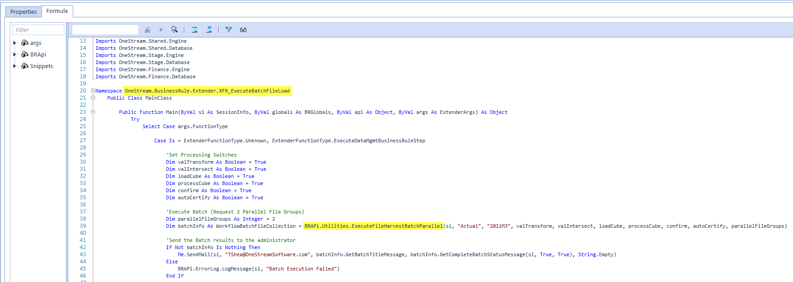

2. Create Data Management Sequence Batch file processing is executed by creating a Business Rule Data Management Step that calls an Extender Business Rule such as the rule example in step one.

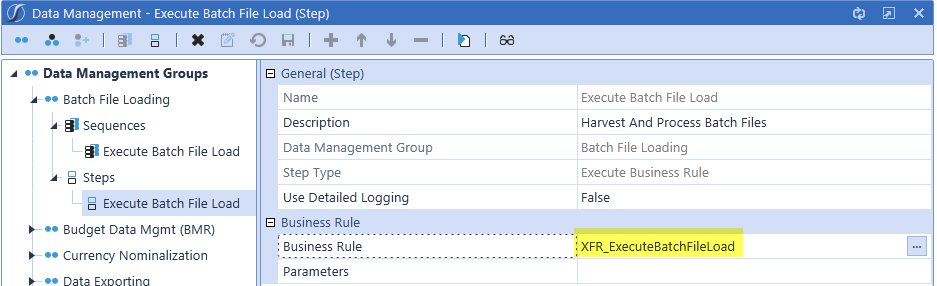

3. Formatting File Names Batch processing requires each file being processed to use a specific file name format to tell the batch engine how to process the file (Format: File Id-ProfileName-ScenarioName- TimeName-LoadMethod.txt).  See Batch File Name Format Specification later in this section for details on creating file names that comply with OneStream’s required format. 4. Copy Files to Batch\Harvest Folder OneStream automatically creates a Batch\Harvest folder in each application’s file share folder structure. This can be found in: System Tab|File Explorer|File Share|Applications|Application Name|Batch|Harvest 5. Execute the Batch After the files have been copied to the Harvest folder, execute the Data Management Sequence created in step one and the files will be processed. Manual Execution Navigate to Application Tab| Data Management, select the Batch Processing Data

Management Sequence, and click to run the sequence. 6. Evaluate Batch Processing Results Task Activity Logging Each batch process creates a detailed Task Activity entry that provides overall status results for the batch as well as detailed information about each processed file and Workflow step. Batch Function Return Value In addition to writing information to the Task Activity Log, the batch processing function returns a detailed results object to the Extender Business Rule. This object provides information and can be programmatically evaluated and used to create custom reporting and notification. 7. Scheduling Batch Processing Batch file processing can run using the Windows Task Scheduler or any other scheduling tool an organization may use. This is accomplished by creating a PowerShell Script to execute a batch processing Data Management Sequence when called from the specific scheduling tool. See Data Management Automation through PowerShell in Implementing Security for more information on executing OneStream Data Management Sequences from PowerShell scripts.

#### Batch File Name Format Specification

The information below provides a detailed list for each segment of the required batch file format. Field Layout File ID-ProfileName-ScenarioName-TimeName-LoadMethod.txt aTrialBalance-Houston;Import-Actual-2011M1-R.txt

#### Field Definitions And Values

File ID Any text value used for file identification and controlling sort order. Profile Name A valid Import Child Workflow Profile name. Use a ; to delimit Parent and Child Profile names. Houston.Import becomes Houston;Import Scenario Name This is a valid Scenario name passed to Data Sources using the Dimension data type Current DataKey Scenario. C can be passed as a substitution variable to reference the Scenario name passed in the function call: HarvestAndProcessFiles. G can be passed as a substitution variable to reference the Global Scenario name set for the application. Using Current Scenario: A-Houston;Import-C-2011M1-R.txt Using Global Scenario: A-Houston;Import-G-2011M1-R.txt Time Name This is a valid Time name passed to Data Sources using the Dimension data type Current DataKey Time. C can be passed as a substitution variable to reference the Time name passed in the function call: HarvestAndProcessFiles. G can be passed as a substitution variable to reference the Global Time name set for the application. Using Current Time: A-Houston;Import-Actual-C-R.txt Using Global Time: A-Houston;Import-Actual-G-R.txt Load Method This is a value used to control how the file is loaded. R = Replace, A = Append

### Workflow Channels

Workflow Channels are a free form list of Members representing a logical grouping or binding point between an Input Child Workflow Profile and a specific set of accounts or the Members of a designated User Defined Dimension. In addition, Workflow Channels are a mechanism used to increase the granularity of the standard Data Unit. They provide application designers with the ability to clear, load, and lock data at the intersection of accounts and the Members of a User Defined Dimension.  See Data Units for more details. There are three predefined default Workflow Channels when building an application: Standard, NoDataLock, and AllChannelInput. New metadata Members and new Workflow Profile Input Profiles are configured with default Workflow Channels. They have no effect on the granularity of application Data Units or the Workflow processes associated with clearing, loading, and locking Data Units.

#### Pre-Build Workflow Channels

Standard This is a basic Member without any special purpose other than to act as the default Workflow Channel for Account Members and Workflow Profile Input Children. NoDataLock This is a special Member that only applies to a metadata Member (Account or UDx) that should not participate in a Workflow Channel grouping scheme. Therefore, this Workflow Channel should not be assigned to Workflow Profiles but only to appropriate Metadata Members. This is the default value for any UDx Member. Assigning this Member removes it from the Workflow Channel process and allows it to function with any Workflow Profile regardless of the Workflow Channel assigned to the Workflow Profile. AllChannelInput This is a special Member that only applies to a Workflow Profile Input Child (Import, Forms or Adj) and indicates the Workflow Profile can control data input processes for any Workflow Channel. AllChannelInput should not be assigned to any Metadata members, but rather used to signal that this Workflow is not participating in the Workflow Channel grouping scheme. By default, this Worklfow Channel is not assigned in the OneStream Application.

#### Using Workflow Channels

Workflow Channels allow the process to be locked down to a more granular level than the standard Workflow Profiles. This is an additional setting that can be configured to one additional Dimension. For example, this can lock down by product. To set this, go to the Application Tab > Tools > Application Properties. See Workflow for more details.

#### Workflow Channel Account Phasing

Using a combination of Workflow Channels and Accounts enables independent Workflow control to be applied to groups of accounts. The diagram below details the steps it takes to set up a metadata and Workflow structure that isolates process management for groups of Accounts and binds specific Workflow Profiles to control the care and feeding of these groups (data clearing, data loading, and data locking).

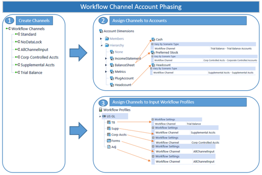

#### Setting Up Account Phasing

1. Create Workflow Channels to represent the groups of Accounts that should be linked together from a Workflow control perspective. In this example, three Workflow Channels have been created to provide separate control points for Basic Trial Balance Accounts, Corporate Controlled Accounts, and Statistical Accounts. 2. Tag each Account Member with the proper group to which it belongs. The Workflow Channel settings can vary by Scenario Type for both Metadata Members and Workflow Profile Members. 3. Tag each Workflow Profile Input Profile with the Workflow Channel it should control. This step hard wires the Workflow Profile to control data clearing, loading, and locking behaviors of the Metadata Members associated with the assigned Workflow Channel.

#### Workflow Channel User Defined Phasing

Using a combination of Workflow Channels and a specific User Defined Dimension enables independent Workflow Control to be applied to groups of User Defined Members. Before Workflow Channels can be used in conjunction with a User Defined Dimension, a single User Defined Dimension type (UD1-UD8) must be selected as the designated User Defined type to control Workflow Channel binding. This is done in Application Tab|Application Properties|User Defined Dimension Type for Workflow Channel. This selection is made at the application level and will apply to all Scenario Types and all Cubes within the application.

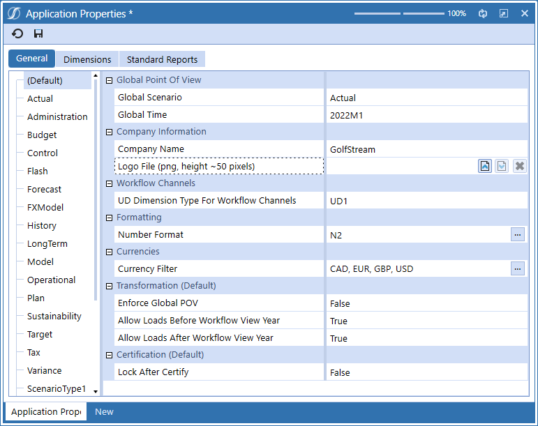

The diagram below details the steps to set up a metadata and Workflow structure that isolates process management for groups of User Defined Members and binds specific Workflow Profiles to control the care and feeding of these groups (data clearing, data loading, and data locking).

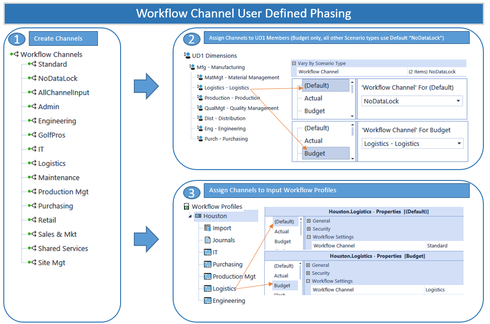

#### Workflow Channel Combined Account And User Defined Phasing

> **Important:** When attempting to combine Workflow phasing using both Accounts and

a User Defined Dimension, it requires the use of the NoDataLock Workflow Channel on Metadata Members and the use of the AllChannelInput Workflow Channel on Workflow Profiles. Based on the examples above, if both Accounts and a User Defined Dimension are making use of Workflow Channel tagging, a situation can occur where the Workflow Channel assigned to a Workflow Profile is incompatible with either the Workflow Channel assigned to the Account Dimension or the one assigned to the User Defined Dimension. This situation can be solved in one of two ways: 1. Assign the AllChannelInput Member to the Workflow Profile’s Workflow Channel. This will allow the Workflow Profile to function in a more generic manner by limiting its usage to metadata Members tagged with a specific Workflow Channel. The only negative consequence of this approach is the Workflow locking for Workflow Profiles using this setting reverts to the Origin Member level which is less granular than the Workflow Channel level. 2. Sacrifice the Workflow Channel assignment of either the Account or the User Defined Dimension by assigning the NoDataLock Member. Assigning this Member will basically take it out of the Workflow Channel process and allow it to function with any Workflow Profile no matter what Workflow Channel is assigned to the Workflow Profile.

#### Using Workflow Channels Across Two Base Input Workflow Profiles

The purpose of a Workflow Channel is to bind an Input Workflow Child Profile to a set of cells in a Cube by Account and a specified User Defined Dimension Member.  This relationship controls Cube Data Load/Replace granularity and cell locking granularity.  If Workflow Channels were used across two Import Base Input Workflow Profiles, one importing a Trial Balance and one importing Supplemental data, and the Trial Balance Workflow Profile was locked, OneStream goes through an extensive process to check data overlap.  In this case, there are two distinct Data Units defined by the Trial Balance and Supplemental Workflow Channels. Step 1: Stage Load The Trial Balance Workflow Channel data or the Supplemental Workflow Channel data is loaded and validated as usual. At the intersection validation step, will make sure that all intersections being processed belong to the correct Workflow Channel (Trial Balance or Supplemental). If not, the users will receive validation errors. Step 2: Cube Load When the Load Cube button is clicked for either Workflows, the following algorithm runs: It checks to see if there are any other sibling Import Workflow Profiles. If there are, it will then check for overlapping Data Units within the proposed Stage load. Workflow Channels in Use (One Channel per Workflow Import Child) If the Workflow Channels are separate, only the data for the selected Workflow Profile will be written to the Cube.  The data is only going into its own set of cells, so it does not need to consider the data in the other Workflow regardless if it is locked or not. Trial Balance and Supplemental can never overlap, the Workflow Channel guarantees it. Workflow Channels Not in Use (or Same Channel Applied to Multiple Import Children) In this case, it is possible that the two import siblings are attempting to load to the same intersections. Consequently, the Workflow Engine will evaluate the sibling import data content to determine if they overlap and are trying to write to the same data unit. No Overlap Load the Workflow Profile being processed because it is not overwriting sibling data. Yes Overlap Clear all data for all assigned Entities for the Import Origin Member. Next, reload the first Import Child Workflow using Replace. Then, reload the second, third, etc., Import Children in order, so the ultimate value in overlapped data units is the cumulative value from all Import Siblings.

### Confirmation Rules

Confirmation Rules are used as a control to check the validity of the processed data. The rules can be setup to act as an error to the process or show a warning message. If the rule was setup as an error and it failed within the process, the user would not be able to proceed within the Workflow. The rules will process individually for each Entity associated with the Workflow Profile.

#### Confirmation Rules Properties

#### General

Name The name of the Confirmation Rule group. Description A field for a more detailed description of the rule group.

#### Security

Access Group This controls the user or users that have access to the rule group within the Workflow. Maintenance Group This controls the user or users that have access to maintain and administer the rule group.

> **Note:** Click

in order to navigate to the Security screen. This is useful when changes need to be made to a Security User or Group before assigning it to a

Confirmation Rule. Click and begin typing the name of the Security Group in the blank field. As the first few letters are typed, the Groups are filtered making it easier to find and select the desired Group. After the Group is selected, click CTRL and Double Click. This will enter the correct name into the appropriate field.

#### Settings

Scenario Type Name The rule group can be made available to a specific Scenario Type or all Scenario Types. Order The order in which the rules will process and display within the group when the Workflow is processed. Rule Name A name given to the rule.  This name will be seen in the Workflow, so it is best to give it a descriptive, purposeful name. Frequency This option will dictate how often the rule is required to run in the Workflow Profile. All Time Periods This runs the rules every period. Monthly This runs the rules every month. If this is for a weekly application, they will run the last week of each month. Quarterly This runs the rules every quarter, or four times a year. Half Yearly This runs the rules two times a year; once in June and December. Yearly This runs the rules once a year in December. Member Filter This turns on the Frequency Member Filter. Filters can then be defined in that section. Frequency Member Filter This only becomes available when Member Filter is chosen in the Forms Frequency options above, otherwise this will be grey. The purpose of this option is to allow the ability to filter by time. Rule Text A description of the rule. This will also be seen in the Workflow. The Rule Text should be a textual description of the Rule Formula associated with this rule. Action A drop down list containing the options Warning (Pass) or Error (Fail). If the data being evaluated does not pass the rule, these options dictate how to handle the problem. If a rule is associated with the Warning action, a warning message will display to alert the user, but the process will not stop, andyou will be allowed to Certify if there were no errors in other rules. If a rule is associated with the Error action, an error message will display, and the rule will have failed. You will not be able to proceed further until all failures have been addressed and/or resolved. If No Action is associated with the rule, the value for the given rule will just be displayed during confirmation. This data can be used by the user for informational purposes. Failure Message This message will be displayed to the user if an error occurs. This field will only be used if the rule is associated with the Error Action. The message should stipulate the error again and possible options of what the user should look for or do to resolve it. Warning Message This message will be displayed to the user if the line item was associated with the Warning Error Action. The warning will alert the user to the issue.

> **Note:** Messages longer than 2000 characters will be truncated with an ellipsis (…)

placed in the last three characters.

> **Tip:** In order to edit the Rule Formula, right click on the line item that needs to be edited

and select Edit Rule Formulas. This will open the Rule Formula Editor and the rule logic can be created or maintained.

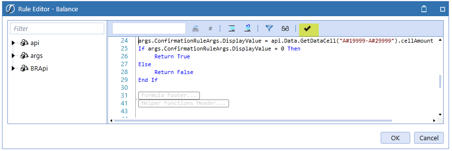

Click the highlighted check icon, to ensure the formula was compiled successfully. The right-click feature also allows the user to insert or delete a row, save, and export data.

#### Confirmation Rule Profiles

Once the Confirmation Rule Groups are created, they are organized into Confirmation Rule

Profiles. The Profiles are then assigned to Workflow Profiles. Choose the icon to create a

new Profile. To assign a Rule Group to a Profile, choose the icon. This allows the user to select which Groups will be in the Profile. Under the Rule Profile Settings, choose the Cube Name and Scenario Type where this Profile can be viewed and used when designing a Workflow Profile. Assigning a Rule Profile to a Workflow Profile is done in the Application Tab| Workflow Profiles| Data Quality Settings section.

### Certification Questions

Certification Question maintenance is the area where the repository of questions is maintained. The questions are answered by the assigned users and act as the certification to the data load process. Once the Certification Question Groups are created, they are organized into Certification Question Profiles. The Profiles are then assigned to Workflow Profiles. See Confirmation Rule Profiles  .

#### Certification Questions Properties

#### General

Name The name of the certification question group. Description The field for a more detailed description of the group.

#### Security

Access Group This controls the user or users that have access to the rule group within the Workflow. Maintenance Group This controls the user or users that have access to maintain and administer the rule group.

> **Note:** Click

in order to navigate to the Security screen. This is useful when changes need to be made to a Security User or Group before assigning it to a

Certification Question. Click and begin typing the name of the Security Group in the blank field. As the first few letters are typed, the Groups are filtered making it easier to find and select the desired Group. Once the Group is selected, click CTRL and Double Click. This will enter the correct name into the appropriate field.

#### Settings

Scenario Type Name The rule group can be made available to a specific Scenario Type or to all Scenario Types. Order The order in which the questions will appear to the user. Name A descriptive name given to the question. Category A drop down list of question types or categories. Select the best option for the question type. Risk Level Assign a risk level to the question. This will dictate the importance of the question as it pertains to being answered correctly. Frequency This option will dictate how often the question is required to be answered and when it will appear to the user. All Time Periods This displays the questions every period Monthly This displays the questions every month. If this is for a weekly application, they will display the last week of each month. Quarterly This displays the questions for every quarter, or four times a year. Half Yearly This displays the questions two times a year; once in June and December. Yearly This displays the questions once a year in December. Member Filter This turns on the Frequency Member Filter. Filters can then be defined in that section. Frequency Member Filter This only becomes available when Member Filter is chosen in the Forms Frequency options above, otherwise this will be gray. The purpose of this option is to allow the ability to filter by time. Question Text This is the question the user will answer. The question should be phrased to illicit a Yes or No response. The user is given a field to explain his/her answer in free text. Response Optional Check this box in order to make the question optional. Deactivated This will deem the question not active and it will not appear to the user any longer. All historical responses will be preserved if the question is not deleted. Deactivated Date Select the date the question was or is to be deactivated.

> **Tip:** By right clicking on any line item, a user can insert or delete a row, save, or export

data.
