# Data Collection

Data sources are built to act as a blueprint for the types of imports that need to be done and to define how the data should be parsed and imported. These include fixed files and delimited files, which use connectors to pull the data directly from the source. Data sources also have dimensions associated with them along with specific properties. In this section you will learn about these data sources and how to leverage them to build your data collection. OneStream recommends that any credentialed integration with the OneStream platform should change passwords regularly.

## Data Sources

Data sources are blueprints of the types of imports required and define how to parse and import data. Data sources can be a fixed file, delimited file, connectors file, or a Data Management Export sequence that pull data from a source system. Data sources also have dimensions associated with them along with specific properties. Once built, you can assign a data source to one workflow profile or to many workflow profiles sharing a common file format.

Associate a source file with a data source by clicking in the upper toolbar. The file opens in the top area of the screen and you can select fields and functions to build Data Source dimension definitions.

### Data Source Properties

General properties are standard across all data types. Name The name of the data source. Description The field for a detailed description of the data source.

#### Security

The security properties are standard across all data types. Access Group Members of the assigned group have the authority to access the data source. Maintenance Group Members of the assigned group have the authority to maintain the data source.

> **Note:** Click

and begin typing the name of the Security group in the blank field. As the first few letters are typed, the groups are filtered making it easier to find and select the desired group. Once the group is selected, click CTRL double-click. This will enter the correct name into the appropriate field.

#### Settings

Settings are standard across all data types. Cube Name The cube associated with this data source which will dictate the available dimensions that can be used. Scenario Type This allows the profile to be assigned to a specific scenario type or all scenario types. If the data source is assigned to a specific Scenario Type, it will only be available when assigned to the Workflow Profile.

#### Data Structure Settings

Data structure settings are standard across all data types. Type This defines the source file structure. The Type can be Fixed, Delimited, Connector, or Data Management Export Sequence. Details on these types can be found below. Data Structure Type Tabular This will have a line or lines specific to a single intersection with one amount. Matrix This will have multiple amounts on a given line using rows and columns to determine the intersection that corresponds to each amount. Allow Dynamic Excel Loads If set to True, users will be able to load Excel templates as well as the data file for which the data source has been built. See the section on Using Excel as a data source for information on the proper formatting of these files.

### Fixed Files

Fixed files are in a column format with data in predefined columns.

#### Connector Settings

Connector Name A drop down list of available Connector Type business rules. The rules will be built containing the code to connect to and pull data from a given source system or database.

### Delimited Files

Delimited files have fields that are separated by a common character.

#### Delimited File Settings

Delimiter The character being used to separate the distinct fields in the source file is defined here. Quote Character In delimited files, the fields are often put in quotes in case the delimiter is also a valid character in one of the field members. This option specifies what quote character is being used in the source file.

#### Connector Settings

Connector Name A drop down list of available Connector Type business rules. The rules will be built containing the code to connect to and pull data from a given source system or database.

### Connector Data Source

OneStream can connect and import data from any external system using direct database connection to the external system. This means data can be imported and processed all the way through the Workflow certification process without ever having to use a source system extract file.

#### Connector Settings

Connector Name A drop-down list of available Connector Type business rules. The rules will be built containing the code to connect to and pull data from a given source system or database. Connector Uses Files Set to True to process files that cannot be parsed using a data source. For example, if an Excel or text file has complex formatting, this setting allows you to code the way the file should be imported rather than defining it with a data source.

#### Connector Business Rule

A Connector Business Rule defines the connection, data result sets, and drill-back option capabilities of an external data connection. A Connector functions as a Business Rule called by a Data Source and reveals what information is required from an external system.  See Business Rules in Application Tools for an example of this rule.

#### Connector Data Source

Fields from the external data query results are mapped to Dimensions creating a processing behavior similar to the behavior of a Delimited File. Using this mapping process enables a Connector Data Source to use all the same built processing capabilities available with file-based Data Sources. This capability enables the design of an external data Connector to be entirely focused on connecting to and reading data from an external source instead of focusing on integrating complex business logic. The specific business logic can be added to the Data Source Dimensions in the form of a Complex Expression or Business Rule. This design methodology will help with writing the Connector Business Rule in a way that requires very little maintenance by business users.

#### Connector Information Request Types

GetFieldList This is called by the Data Source designer screen when the user selects a Connector Data Source or one of its defined Dimensions. A list of available fields in the external Data Source will be visible as a list of Vb.Net Strings [List(Of String)] is requested. GetData This is called by the Import Workflow task when the Load and Transform button is clicked. The execution of a data query(s) that retrieves the row values for the chosen Workflow Unit is requested. Fields The field names returned by this query must match the field names returned by the GetFieldList request. Where Clause Typically the active Workflow Unit Time and Scenario values are converted to equivalent criteria values for the Time or Scenario of the external system. Data Volume Consider loading summarized data rather than full transaction system data replication because drill back is provided for more detailed values. GetDrillBackTypes Drill Back types can deliver results based on the different visualization types. This is called when a user double-clicks or right-clicks and selects Drill Back from a row in the source data load or drill down screens.  A set of supported drill-back options to present to the end user as a list of DrillBackTypeInfo objects [List(Of DrillBackTypeInfo)] is requested. Drill Back types provide the Connector designer with the power to provide the end user with a menu list of drill back options. DataGrid This presents a grid of data rows to the end user. TextMessage This presents a text message to the end user. WebUrl This presents a website or custom HTML web content to the end user. WebUrlPopOutDefaultBrowser Opens a website or custom HTML web content in an external browser. From the Stage Import data grid, right-click on a data record, and select Drill Back. A dialog presents a menu of pre- configured Drill-back options. When you choose WebUrlPopOutDefaultBrowser, a standard browser session is launched, and you go to a web page based on variables. FileViewer This presents file contents to the end user from one of three locations. FileShareFile A file located in a folder in the OneStream File Share. AppDBFile A file stored in an application database. SysDBFile A file stored in a framework (System) database. GetDrillBack This is called when a user selects a specific Drill Back type presented by the GetDrillBackTypes request. When this action is executed, the Business Rule arguments will contain a reference to the DrillBackTypeInfo object the user selected which allows the Connector designer to determine how to get proper information to display for the DrillBackTypeInfo.

#### Connector Integration Prerequisites

The following items provide an overview of the major technology components involved in integrating external systems with deployment. Determine Source System Inventory The first step in integrating various source systems is to determine all the ones needed. This includes: Source System Location & Identification Database Type and Source System Oracle, SQL, DB2, Syteline, Newstar, Lawson, PeopleSoft, Access, MAS500, etc.

> **Note:** The requirement for Oracle Database integrations is that all Oracle Source

System TNS Profile details need to be in place on each of the OneStream application servers. Data Query Method Detailed Data Query, Data View, Stored Procedure, etc. Source System Drill Back Criteria (if required) Detailed Data Query, Data View, Stored Procedure, etc. Source System Direct Access Credentials A read-only type of access needs to be granted for the user account because the data from these external systems will be read. The read-only access should be granted against the productions instance of the data source as the data queries will be used to tie out data and do not present any risk to the source system themselves. Source System 64-bit Client Data Provider OneStream is a Microsoft .NET application with a 64-bit architecture. To communicate with any source system, a 64-bit source system client data provider needs to be available and installed on each OneStream application server. The source system’s client data provider is what gives the ability to make an OLEDB or ODBC connection to the system. Determine Connection String A connection string specifies information about a data source and the means of connecting to it. It is passed in code to an underlying driver or provider to initiate the connection. Whilst commonly used for a database connection, the data source could also be a spreadsheet or text file. The connection string may include attributes such as the name of the driver, server and database, as well as security information such as user name and password.

#### Create A Connection String From The OneStream Application

Server 1. Right-click the Desktop icon of the OneStream application server and select New > Text Document. 2. Name the document and change the file extension from txt to udl.

This creates a Data Link File to assist in the formation of the source system connection string. 3. Determine the DB Provider that the GL Source System is using (e.g. SQL, Oracle, etc.). 4. Determine the server name where the data resides for the GL Source System. 5. Determine the user name and password used to connect to the server for the GL Source System. 6. Determine the database name on the server where the GL Source System data resides. 7. Save the completed UDL file and then rename the extension back to txt from udl. 8. Open the text file to see the connection string provided.

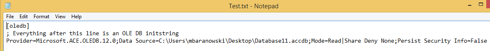

#### Example Connection Strings

SQL Server Provider=SQLOLEDB.1;Integrated Security=SSPI;Persist Security Info=False;Initial Catalog=DBName;Data Source=SQLSERVERNAME ORACLE (11i or R12) Provider=OraOLEDB.Oracle.1;Password=<xxxxx>;Persist Security Info=True;User ID=<username>;Data Source=frepro.world DB2 Provider=IBMDA400.DataSource.1;Password=<xxxxx>;Persist Security Info=True;User ID=OSuser;Data Source=HUTCH400;Use SQL Packages=True MS Access Provider=Microsoft.ACE.OLEDB.12.0;Data Source=\\UNCFileShare\DB1.accdb;Mode=Read|Share Deny None;Persist Security Info=False

#### Determine The Data Query Method

To extract data from any source system, the data query method and facility need to be determined. Data can be queried through a SQL Query, a SQL View, or Stored Procedure. OneStream executes this request against the source system using the defined source system connection string and processes the returned results within OneStream. For example, if directly pulling in Trial Balance Data is required, then the detailed query that currently makes up the existing Trial Balance Report would be necessary for OneStream to pull the same data. SQL Query A SQL Query can be broken down into numerous elements, each beginning with a keyword. Although it is not necessary, a common convention is to write these keywords in all capital letters. The standard sections of a SQL Query are made up of the following four elements: SELECT FROM WHERE ORDER BY The example below is a SQL Query used to pull Trial Balance Data from several different tables in an Oracle Database: SELECT GL_SETS_OF_BOOKS.NAME ,GL_BALANCES.ACTUAL_FLAG ,GL_BALANCES.PERIOD_NAME ,GL_BALANCES.PERIOD_NUM ,GL_BALANCES.PERIOD_YEAR ,GL_CODE_COMBINATIONS.CODE_COMBINATION_ID ,GL_CODE_COMBINATIONS.SEGMENT1 ,GL_CODE_COMBINATIONS.SEGMENT2 ,GL_CODE_COMBINATIONS.SEGMENT3 ,GL_CODE_COMBINATIONS.SEGMENT4 ,GL_CODE_COMBINATIONS.SEGMENT5 ,GL_CODE_COMBINATIONS.SEGMENT6 ,GL_CODE_COMBINATIONS.SEGMENT7 ,GL_CODE_COMBINATIONS.SEGMENT8 ,GL_CODE_COMBINATIONS.SEGMENT9 ,GL_CODE_COMBINATIONS.SEGMENT10 ,SUM( NVL(GL_BALANCES.BEGIN_BALANCE_DR,0) - NVL(GL_BALANCES.BEGIN_BALANCE_CR,0))"OPEN BAL" ,NVL(GL_BALANCES.PERIOD_NET_DR,0) "DEBIT" ,NVL(GL_BALANCES.PERIOD_NET_CR,0) "CREDIT" ,SUM( NVL(GL_BALANCES.PERIOD_NET_DR,0) - NVL(GL_BALANCES.PERIOD_NET_CR,0))"NET MOVEMENT" ,SUM(( NVL(GL_BALANCES.PERIOD_NET_DR,0) + NVL(GL_BALANCES.BEGIN_BALANCE_DR,0))) - SUM (NVL(GL_BALANCES.PERIOD_NET_CR,0)+NVL(GL_BALANCES.BEGIN_BALANCE_CR,0))"CLOSE BAL" ,GL_BALANCES.CURRENCY_CODE ,GL_BALANCES.TRANSLATED_FLAG ,GL_BALANCES.TEMPLATE_ID ,FND_FLEX_VALUES_VL.FLEX_VALUE ,FND_FLEX_VALUES_VL.DESCRIPTION ,FND_FLEX_VALUES_VL.FLEX_VALUE_SET_ID FROM GL_BALANCES, GL_CODE_COMBINATIONS, GL_SETS_OF_BOOKS, FND_FLEX_VALUES_VL WHERE GL_CODE_COMBINATIONS.CODE_COMBINATION_ID = GL_BALANCES.CODE_COMBINATION_ID AND GL_BALANCES.ACTUAL_FLAG = 'A' AND GL_BALANCES.CURRENCY_CODE = GL_SETS_OF_BOOKS.CURRENCY_CODE AND GL_BALANCES.LEDGER_ID = GL_SETS_OF_BOOKS.SET_OF_BOOKS_ID AND GL_BALANCES.TEMPLATE_ID IS NULL AND GL_BALANCES.PERIOD_NAME = 'Jul-14' AND FND_FLEX_VALUES_VL.FLEX_VALUE = GL_CODE_COMBINATIONS.SEGMENT4 AND FND_FLEX_VALUES_VL.FLEX_VALUE_SET_ID = '101432874' AND GL_CODE_COMBINATIONS.SEGMENT2 IN (2050, 2100, 2200, 2300, 2400, 2500) GROUP BY  GL_SETS_OF_BOOKS.NAME ,GL_BALANCES.ACTUAL_FLAG ,GL_BALANCES.PERIOD_NAME ,GL_BALANCES.PERIOD_NUM ,GL_BALANCES.PERIOD_YEAR ,GL_CODE_COMBINATIONS.CODE_COMBINATION_ID ,GL_CODE_COMBINATIONS.SEGMENT1 ,GL_CODE_COMBINATIONS.SEGMENT2 ,GL_CODE_COMBINATIONS.SEGMENT3 ,GL_CODE_COMBINATIONS.SEGMENT4 ,GL_CODE_COMBINATIONS.SEGMENT5 ,GL_CODE_COMBINATIONS.SEGMENT6 ,GL_CODE_COMBINATIONS.SEGMENT7 ,GL_CODE_COMBINATIONS.SEGMENT8 ,GL_CODE_COMBINATIONS.SEGMENT9 ,GL_CODE_COMBINATIONS.SEGMENT10 ,NVL(GL_BALANCES.PERIOD_NET_DR,0) ,NVL(GL_BALANCES.PERIOD_NET_CR,0) ,GL_BALANCES.CURRENCY_CODE ,GL_BALANCES.TRANSLATED_FLAG ,GL_BALANCES.TEMPLATE_ID ,FND_FLEX_VALUES_VL.FLEX_VALUE ,FND_FLEX_VALUES_VL.DESCRIPTION ,FND_FLEX_VALUES_VL.FLEX_VALUE_SET_ID HAVING SUM(( NVL(GL_BALANCES.PERIOD_NET_DR,0) + NVL(GL_BALANCES.BEGIN_BALANCE_DR,0))) - SUM(NVL(GL_BALANCES.PERIOD_NET_CR,0)+NVL(GL_BALANCES.BEGIN_BALANCE_CR,0)) <> 0 SQL View In many cases, creating a SQL View of data to provide information to OneStream is a more preferred option and typically simplifies the complexity of the query. In the example below, the customer can combine several data tables required in the source system, and present the data in one View for OneStream to query: SELECT SEGMENT1 As Entity SEGMENT2 As Establishment SEGMENT3 As France_Account SEGMENT4 As US_Account SEGMENT5 As Cost_Center SEGMENT6 As Family SEGMENT7 As Product_Line SEGMENT8 As Interco SEGMENT9 As Future PERIOD_YEAR As Year PERIOD_MONTH As Month CURRENCY_CODE As Currency_Code CLOSE_NET_BALANCE As Net_Balance SET_OF_BOOKS_ID As Set_Of_Books_ID FROM APPS.XXSWM_ONESTREAM_GL_BALANCES Stored Procedure The example below is a SQL Stored Procedure used to pull Trial Balance Data from several different tables in a SQL Database. In this example, the Entity, Year, and Period are passed to the Stored Procedure: spGLCalcTrialBalance 'ASCC', '2013', 6 Apply Connection String to XFAppServerConfig.xml File When the connection string is created, then the database connections can be centralized in the Server Configuration under the App Server Configuration File. Under Databases, click on (Collection) for Database Server Connections and the Database Server Connections will appear. The string will then be placed in the Connection String under Connection String Settings. The name of the connection string will be used as part of the source connector.

#### Defining External Data Connections

Application Server Configuration File Creating Named External ODBC / OLEDB Connection Step 1: Required ODBC/OLEDB Connection Software Any client ODBC/OLEDB drivers must be installed on each application server for the OneStream application to make a connection to the external database. This way the administrator knows what type of database engine contains which Data Source. Step 2: Creating the Connection String The application server configuration file must be modified to add a named external database connection that can be used by the Connector Business Rule and custom reports. Example of the Server Configuration Utility:

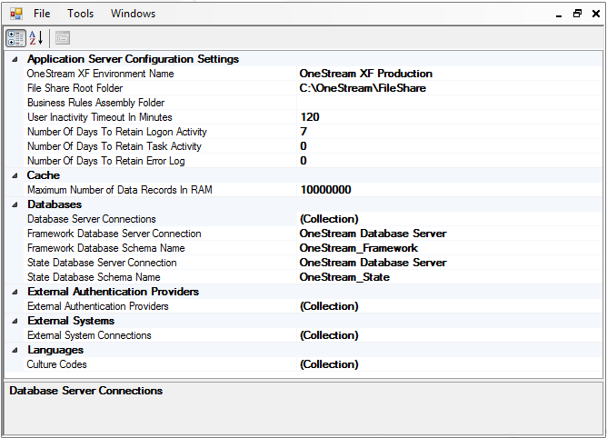

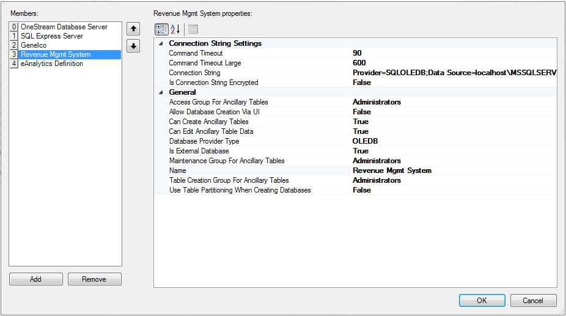

Step 3: Creating an External Database Test Query The best way to prototype the queries needed to create a Connector Business Rule is to create a set of Dashboard Data Adapters to be used as a test bed. As a best practice, create a new Dashboard Maintenance Unit named EXS The Connector Name. The prefix EXS stands for External System and will provide administrators with an immediate understanding of the Maintenance Unit’s contents. The three steps below explain how to create this. Step 1 Create a new Data Adapter for each type of query needed to proto type (GetFieldList, SelectData, Drill Back, etc.) Example of a Data Adapter being used to get all fields in the source table of the external database connection:

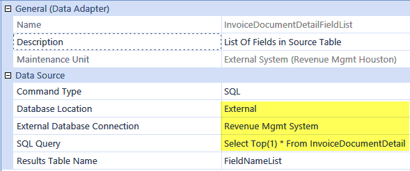

Step 2

Click in the Dashboard administration toolbar to test the query. Step 3 Evaluate the results of the query. The Data Adapter test only returns a small subset of rows from the query, but it specifies the actual number of rows that will return during an actual query execution.

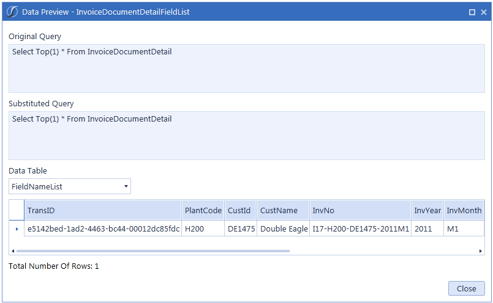

#### Building Data Connectors

ODBC / OLEDB Connectors GetFieldList Select Query against the external database. There will be a manual list of strings returned for each field. GetData The selected statement should match GetFieldList. Add criteria for Scenario and Time and map the OneStream Workflow Unit Scenario and Time values to corresponding values in the source system as a Where Clause criteria value. GetDrillBackTypes This shows the set of drill back options provided to the user. GetDrillBack This executes the selected drill back type for the current source data row. Custom API Connectors Uses OneStream's External Server Technology. IIS needs to be recycled on all application servers and followed by all web servers after adding the external named connection.

#### Drill Back

Using a SQL connector allows a user to drill back to a source system and show detailed records from a document, PDF, website. The Connector Data Source, configured by the author, provides a menu of data viewing options such as Year to Date, Month to Date, Invoice Documents or Material Type Detail. Utilizing this feature can reduce the amount of data imported into the Financial Model by allowing analysis to occur at the source system. Viewing Data After data is loaded into the Stage, a user can right-click on a data row and select Drill Back. This will bring up the pre-configured options from which the user can choose.

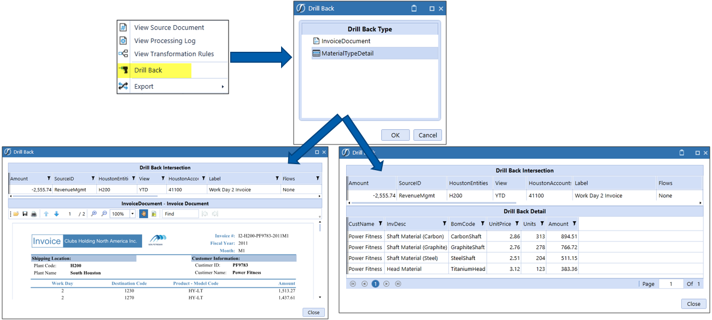

If more detail is needed, another level of Drill Back can be performed. This is configured in the Connector Business Rule and can drill back and around source systems. These nested drill paths can provide as much detail as an application requires.

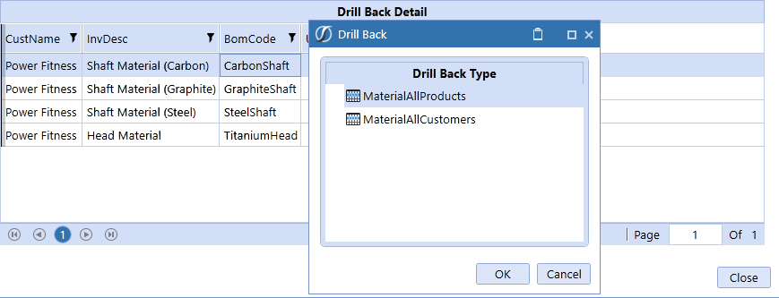

#### Key API, Args, Or BRApi Examples

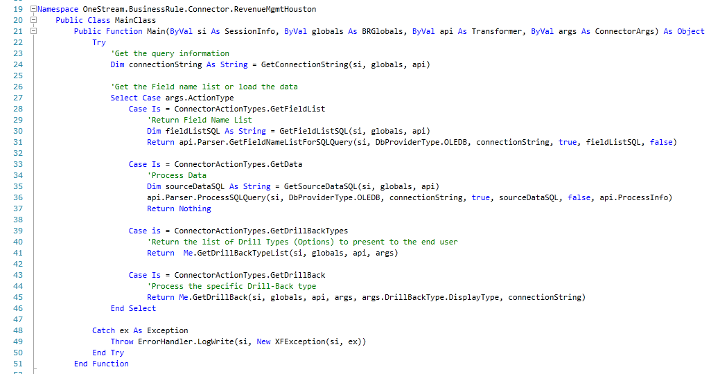

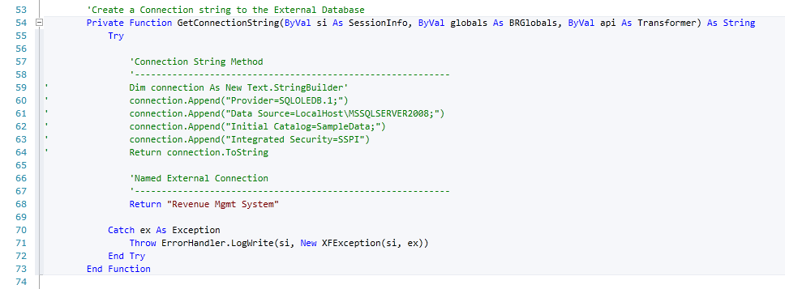

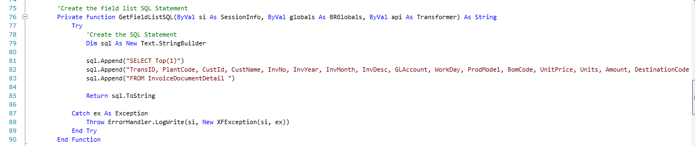

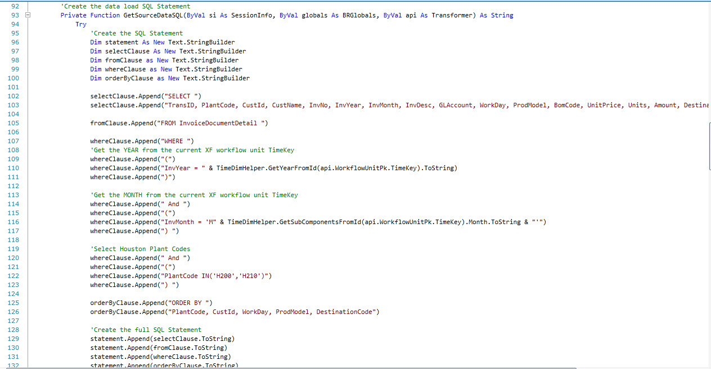

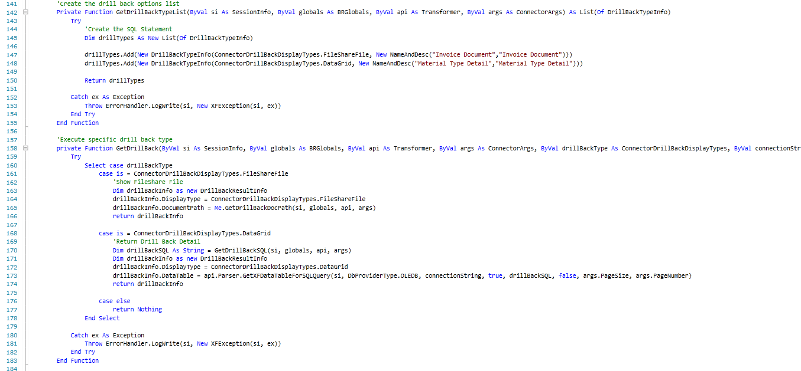

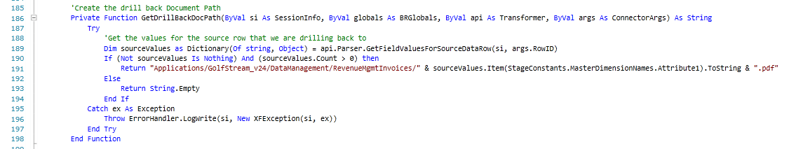

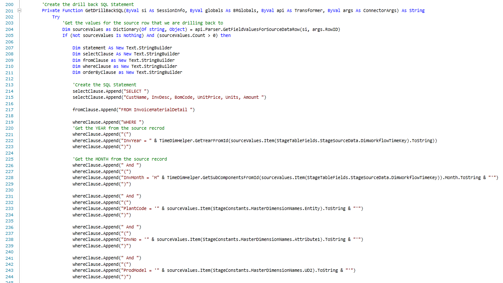

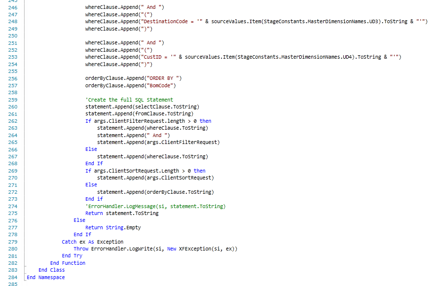

Namespace OneStream.BusinessRule.Connector.RevenueMgmtHouston Public Class MainClass Public Function Main(ByVal si As SessionInfo, ByVal globals As BRGlobals, ByVal api As Transformer, ByVal args As ConnectorArgs) As Object Try 'Get the query information Dim connectionString As String = GetConnectionString(si, globals, api) 'Get the Field name list or load the data Select Case args.ActionType Case Is = ConnectorActionTypes.GetFieldList 'Return Field Name List Dim fieldListSQL As String = GetFieldListSQL(si, globals, api) Return api.Parser.GetFieldNameListForSQLQuery(si, DbProviderType.OLEDB, connectionString, true, fieldListSQL, false) Case Is = ConnectorActionTypes.GetData 'Process Data Dim sourceDataSQL As String = GetSourceDataSQL(si, globals, api) api.Parser.ProcessSQLQuery(si, DbProviderType.OLEDB, connectionString, true, sourceDataSQL, false, api.ProcessInfo) Return Nothing Case is = ConnectorActionTypes.GetDrillBackTypes 'Return the list of Drill Types (Options) to present to the end user Return  Me.GetDrillBackTypeList(si, globals, api, args) Case Is = ConnectorActionTypes.GetDrillBack 'Process the specific Drill-Back type Return Me.GetDrillBack(si, globals, api, args, args.DrillBackType.DisplayType, connectionString) End Select Catch ex As Exception Throw ErrorHandler.LogWrite(si, New XFException(si, ex)) End Try End Function 'Create a Connection string to the External Database Private Function GetConnectionString(ByVal si As SessionInfo, ByVal globals As BRGlobals, ByVal api As Transformer) As String Try 'Connection String Method '----------------------------------------------------------- '                Dim connection As New Text.StringBuilder' '                connection.Append("Provider=SQLOLEDB.1;") '                connection.Append("Data Source=LocalHost\MSSQLSERVER2008;") '                connection.Append("Initial Catalog=SampleData;") '                connection.Append("Integrated Security=SSPI") '                Return connection.ToString 'Named External Connection '----------------------------------------------------------- Return "Revenue Mgmt System" Catch ex As Exception Throw ErrorHandler.LogWrite(si, New XFException(si, ex)) End Try End Function 'Create the field list SQL Statement Private Function GetFieldListSQL(ByVal si As SessionInfo, ByVal globals As BRGlobals, ByVal api As Transformer) As String Try 'Create the SQL Statement Dim sql As New Text.StringBuilder sql.Append("SELECT Top(1)") sql.Append("TransID, PlantCode, CustId, CustName, InvNo, InvYear, InvMonth, InvDesc, GLAccount, WorkDay, ProdModel, BomCode, UnitPrice, Units, Amount, DestinationCode ") sql.Append("FROM InvoiceDocumentDetail ") Return sql.ToString Catch ex As Exception Throw ErrorHandler.LogWrite(si, New XFException(si, ex)) End Try End Function 'Create the data load SQL Statement Private Function GetSourceDataSQL(ByVal si As SessionInfo, ByVal globals As BRGlobals, ByVal api As Transformer) As String Try 'Create the SQL Statement Dim statement As New Text.StringBuilder Dim selectClause As New Text.StringBuilder Dim fromClause as New Text.StringBuilder Dim whereClause as New Text.StringBuilder Dim orderByClause as New Text.StringBuilder selectClause.Append("SELECT ") selectClause.Append("TransID, PlantCode, CustId, CustName, InvNo, InvYear, InvMonth, InvDesc, GLAccount, WorkDay, ProdModel, BomCode, UnitPrice,Units, Amount, DestinationCode ") fromClause.Append("FROM InvoiceDocumentDetail ") whereClause.Append("WHERE ") 'Get the YEAR from the current XF Workflow Unit TimeKey whereClause.Append("(") whereClause.Append("InvYear = " & TimeDimHelper.GetYearFromId (api.WorkflowUnitPk.TimeKey).ToString) whereClause.Append(")") 'Get the MONTH from the current XF Workflow Unit TimeKey whereClause.Append(" And ") whereClause.Append("(") whereClause.Append("InvMonth = 'M" & TimeDimHelper.GetSubComponentsFromId (api.WorkflowUnitPk.TimeKey) .Month.ToString & "'") whereClause.Append(") ") 'Select Houston Plant Codes whereClause.Append(" And ") whereClause.Append("(") whereClause.Append("PlantCode IN('H200','H210')") whereClause.Append(") ") orderByClause.Append("ORDER BY ") orderByClause.Append("PlantCode, CustId, WorkDay, ProdModel, DestinationCode") 'Create the full SQL Statement statement.Append(selectClause.ToString) statement.Append(fromClause.ToString) statement.Append(whereClause.ToString) statement.Append(orderByClause.ToString) Return statement.ToString Catch ex As Exception Throw ErrorHandler.LogWrite(si, New XFException(si, ex)) End Try End Function 'Create the drill back options list Private Function GetDrillBackTypeList(ByVal si As SessionInfo, ByVal globals As BRGlobals, ByVal api As Transformer, ByVal args As ConnectorArgs) As List(Of DrillBackTypeInfo) Try 'Create the SQL Statement Dim drillTypes As New List(Of DrillBackTypeInfo) drillTypes.Add(New DrillBackTypeInfo (ConnectorDrillBackDisplayTypes.FileShareFile, New NameAndDesc("Invoice Document","Invoice Document"))) drillTypes.Add(New DrillBackTypeInfo(ConnectorDrillBackDisplayTypes.DataGrid, New  NameAndDesc("Material Type Detail","Material Type Detail"))) Return drillTypes Catch ex As Exception Throw ErrorHandler.LogWrite(si, New XFException(si, ex)) End Try End Function 'Execute specific drill back type private Function GetDrillBack(ByVal si As SessionInfo, ByVal globals As BRGlobals, ByVal api As Transformer, ByVal args As ConnectorArgs, ByVal drillBackType As ConnectorDrillBackDisplayTypes, ByVal connectionString as String) As DrillBackResultInfo Try Select case drillBackType case is = ConnectorDrillBackDisplayTypes.FileShareFile 'Show FileShare File Dim drillBackInfo as new DrillBackResultInfo drillBackInfo.DisplayType = ConnectorDrillBackDisplayTypes.FileShareFile drillBackInfo.DocumentPath = Me.GetDrillBackDocPath(si, globals, api, args) return drillBackInfo case is = ConnectorDrillBackDisplayTypes.DataGrid 'Return Drill Back Detail Dim drillBackSQL As String = GetDrillBackSQL(si, globals, api, args) Dim drillBackInfo as new DrillBackResultInfo drillBackInfo.DisplayType = ConnectorDrillBackDisplayTypes.DataGrid drillBackInfo.DataTable = api.Parser.GetXFDataTableForSQLQuery(si, DbProviderType.OLEDB, connectionString, true, drillBackSQL, false, args.PageSize, args.PageNumber) return drillBackInfo case else return Nothing End Select Catch ex As Exception Throw ErrorHandler.LogWrite(si, New XFException(si, ex)) End Try End Function 'Create the drill back Document Path Private Function GetDrillBackDocPath(ByVal si As SessionInfo, ByVal globals As BRGlobals,ByVal api As Transformer, ByVal args As ConnectorArgs) As String Try 'Get the values for the source row that we are drilling back to Dim sourceValues as Dictionary(Of string, Object) = api.Parser.GetFieldValuesForSourceDataRow(si, args.RowID) If (Not sourceValues Is Nothing) And (sourceValues.Count > 0) then Return "Applications/GolfStream_v24/DataManagement/RevenueMgmtInvoices/" & sourceValues.Item(StageConstants.MasterDimensionNames.Attribute1).ToString & ".pdf" Else Return String.Empty End If Catch ex As Exception Throw ErrorHandler.LogWrite(si, New XFException(si, ex)) End Try End Function 'Create the drill back SQL Statement Private Function GetDrillBackSQL(ByVal si As SessionInfo, ByVal globals As BRGlobals, ByVal api As Transformer, ByVal args As ConnectorArgs) As String Try 'Get the values for the source row that we are drilling back to Dim sourceValues as Dictionary(Of string, Object) = api.Parser.GetFieldValuesForSourceDataRow(si, args.RowID) If (Not sourceValues Is Nothing) And (sourceValues.Count > 0) then Dim statement As New Text.StringBuilder Dim selectClause As New Text.StringBuilder Dim fromClause as New Text.StringBuilder Dim whereClause as New Text.StringBuilder Dim orderByClause as New Text.StringBuilder 'Create the SQL Statement selectClause.Append("SELECT ") selectClause.Append("CustName, InvDesc, BomCode, UnitPrice, Units,Amount ") fromClause.Append("FROM InvoiceMaterialDetail ") whereClause.Append("WHERE ") 'Get the YEAR from the source record whereClause.Append("(") whereClause.Append("InvYear = " &  TimeDimHelper.GetYearFromId (sourceValues.Item (StageTableFields.StageSourceData.DimWorkflowTimeKey).ToString)) whereClause.Append(")") 'Get the MONTH from the source record whereClause.Append(" And ") whereClause.Append("(") whereClause.Append("InvMonth = 'M" & TimeDimHelper.GetSubComponentsFromId (sourceValues.Item (StageTableFields.StageSourceData.DimWorkflowTimeKey)) .Month.ToString & "'") whereClause.Append(")") whereClause.Append(" And ") whereClause.Append("(") whereClause.Append("PlantCode = '" & sourceValues.Item (StageConstants.MasterDimensionNames.Entity) .ToString & "'") whereClause.Append(")") whereClause.Append(" And ") whereClause.Append("(") whereClause.Append("InvNo = '" & sourceValues.Item (StageConstants.MasterDimensionNames.Attribute1) .ToString & "'") whereClause.Append(")") whereClause.Append(" And ") whereClause.Append("(") whereClause.Append("ProdModel = '" & sourceValues.Item (StageConstants.MasterDimensionNames.UD2).ToString& "'") whereClause.Append(")") whereClause.Append(" And ") whereClause.Append("(") whereClause.Append("DestinationCode = '" & sourceValues.Item (StageConstants.MasterDimensionNames.UD3). ToString & "'") whereClause.Append(")") whereClause.Append(" And ") whereClause.Append("(") whereClause.Append("CustID = '" &sourceValues.Item (StageConstants.MasterDimensionNames.UD4) .ToString & "'") whereClause.Append(")") orderByClause.Append("ORDER BY ") orderByClause.Append("BomCode") 'Create the full SQL Statement statement.Append(selectClause.ToString) statement.Append(fromClause.ToString) If args.ClientFilterRequest.length > 0 then statement.Append(whereClause.ToString) statement.Append(" And ") statement.Append(args.ClientFilterRequest) Else statement.Append(whereClause.ToString) End If If args.ClientSortRequest.Length > 0 then statement.Append(args.ClientSortRequest) Else statement.Append(orderByClause.ToString) End if 'ErrorHandler.LogMessage(si, statement.ToString) Return statement.ToString Else Return String.Empty End If Catch ex As Exception Throw ErrorHandler.LogWrite(si, New XFException(si, ex)) End Try End Function End Class End Namespace

### Data Management Export Sequences Data Source

Instead of a file or connector, use a data management export sequence in a workflow import. sequence data source in an Import workflow to move and export data. For example, these can be used in an Import workflow to: l Copy data from one OneStream cube or scenario to another cube or scenario, such as when cubes or scenarios contain different dimensionality. l Export OneStream data to an external source system and apply transformation rules through the workflow. This can be comprised of multiple data management steps. See "Data Management" in Application Tools for more information.

#### Data Management Settings

Data Export Sequence Name The name of the data management export sequence being used for this data source.

#### Use Case: Create A Data Management Export Sequence To

#### Copy Data Within OneStream

This use case reviews how to copy OneStream data to another cube or scenario with differing dimensionality through a Data Management Export Sequence data source in an Import workflow. In this example, users will copy actuals data from a financial close and a consolidations cube to a planning cube with differing dimensionality on a monthly basis. Below are the configuration steps and the result. 1. Configure a data management step with the Export Data type to specify the source data to move. Assign the step to a data management sequence. See "Data Management" in Application Tools for more information.

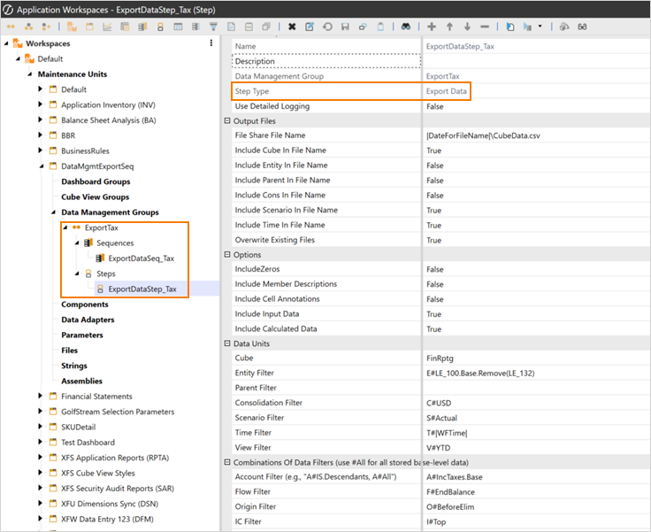

2. Create a data source with the Data Mgmt Export Sequences type. Set the Data Export Sequence Name to the name of the data management sequence.

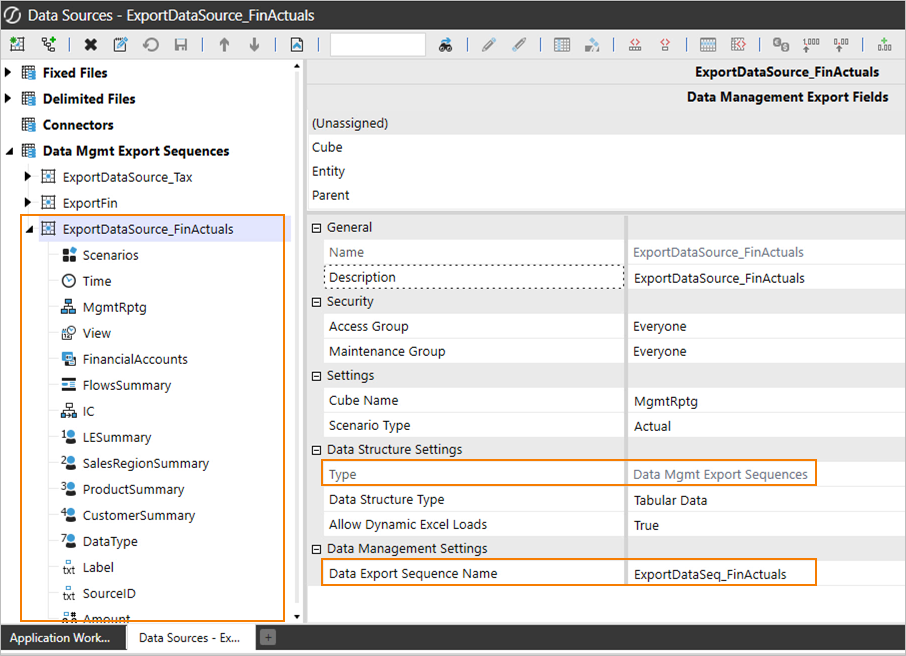

Configure the source dimensions for the data source. See "Source Dimension Properties" in Data Sources for more information. In this example, actuals data will be copied from the financial close and consolidation cube (FinRptg) to the planning cube (MgmtRptg), which contains different dimensionality. The FinRptg’s legal entity data will be copied to the MgmtRptg planning cube’s UD1 dimension, and the FinRptg’s UD1 cost center data will be copied to the MgmtRptg planning cube’s Entity dimension as defined in the Source Field Name properties.

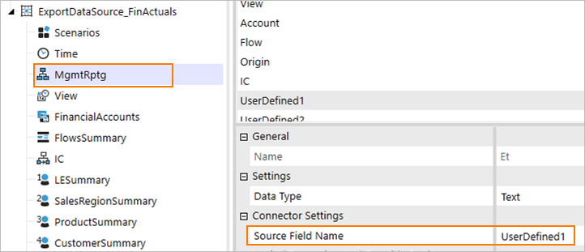

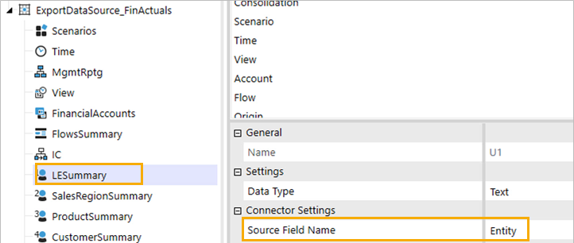

3.Create a transformation profile and groups to map the source data to the target. See “Transformation Rules” for more information.

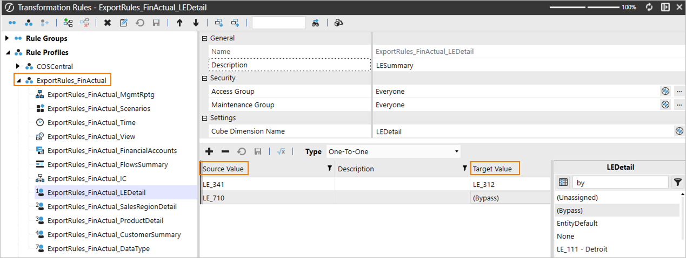

4. Create an Import Workflow Profile and assign the Data Management Export Sequence data source and the Transformation Profile Name. Set the Workflow Name to Import, Validate, and Load. The Import task will copy and transform the source data to the Stage tables. The Validate and Load tasks will map and load the Stage data to the target. Also, ensure that Profile Active is set to True, and Can Load Unrelated Entities is set to True if data is loaded to multiple entities.

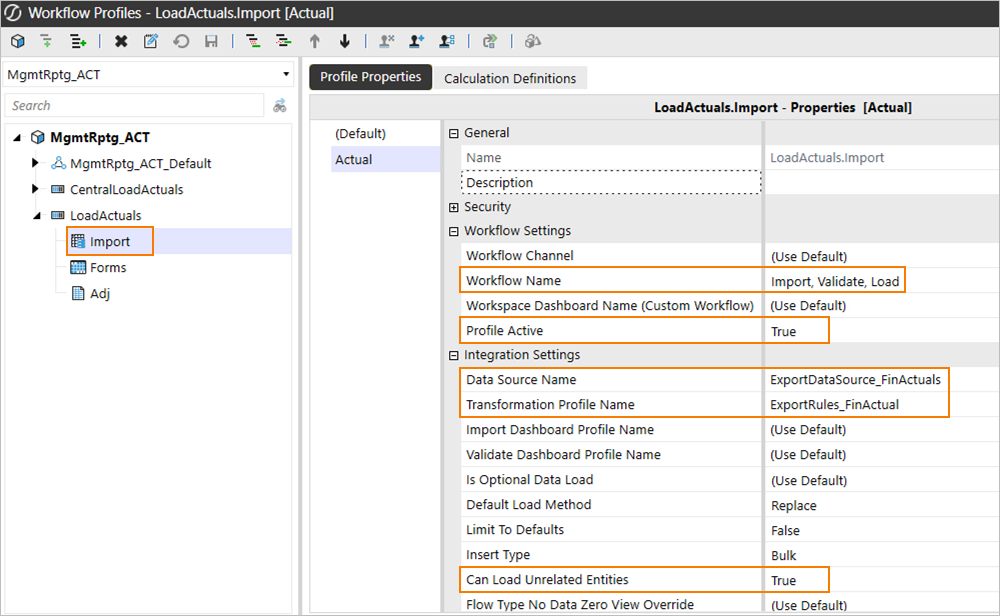

Result: In OnePlace, when a user clicks Load and Transform in the Workflow Import task, the Data Source Name and Type show the assigned Data Management Export Sequence data source.

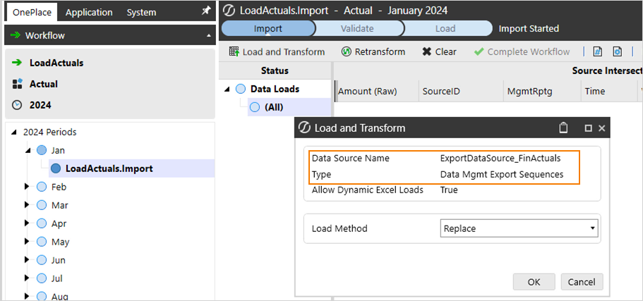

In this example, when a user completes the Import, Validate, and Load tasks in a workflow, the data from FinRptg is transformed and loaded into MgmtRptg cube. For the planning MgmtRptg cube, the FinRptg legal entities were loaded to the UD1 dimension, and the FinRptg UD1 cost centers were loaded to the Entity dimension.

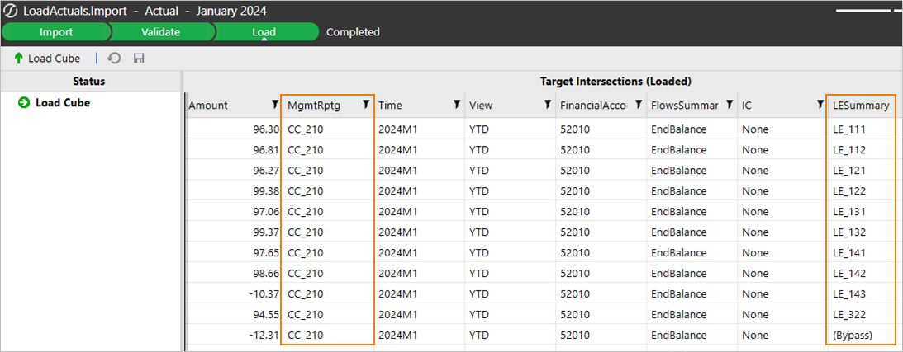

#### Use Case: Create A Data Management Export Sequence To

#### Export Data From OneStream

This use case reviews how to export OneStream data to an external source system with differing data structures through a Data Management Export Sequence data source in an Import Workflow. Below are the configuration steps and the result. In this example, users will export and transform data every month from OneStream to their external tax system, which has its own entity structure and chart of accounts. 1.Configure the Data Management Step and Sequence: Configure a data management step with the Export Data type to specify the source data to export. Assign the step to a data management sequence. See "Data Management" in Application Tools for more information.

2.Configure the Data Source: Create a data source with the Data Mgmt Export Sequences type. Set the Data Export Sequence Name to the name of the data management sequence. Configure the source dimensions for the data source. See "Source Dimension Properties" in Data Sources for more information.

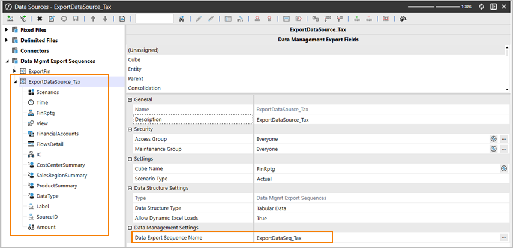

3. Configure the Transformation Rules: Create a transformation profile and groups to map the source data to the target. For dimensions that need to be transformed, specify the Source Value and Target Value. Import external target values using a TRX file. See “Transformation Rules” for more information.

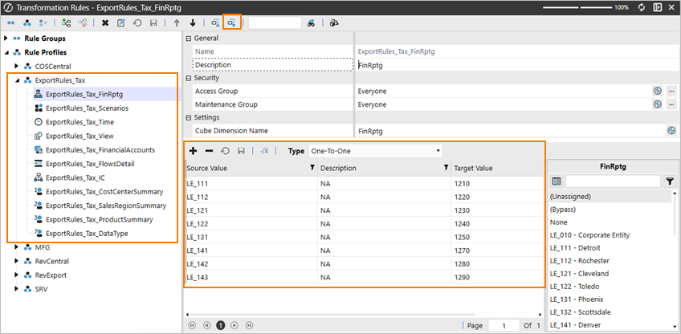

4. Configure an Import Workflow Profile: Create an Import Workflow Profile and assign the Data Management Export Sequence data source and Transformation Profile Name. Ensure the Workflow Name contains an Import (Stage Only) task, which will import the transformed data to the Stage tables. Also, ensure that Profile Active is set to True.

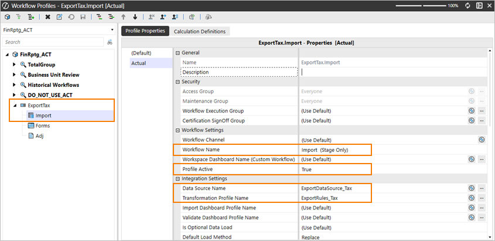

5. Configure the Method to Retrieve Source Data When a user completes the Import workflow task, the transformed data will be in the Stage tables. In this example, data is being exported from OneStream to an external source, so the data will need to be retrieved from the Stage tables. There are multiple methods to retrieve the transformed data, such as using a: • Workflow Event Handler: This business rule can run code when the Workflow completes a certain step. For example, the Workflow Event Handler can automatically generate a file with the exported and transformed data when the user completes the Workflow Import task. • Transformation Event Handler: This business rule can run code at various points of the Workflow from Import through Load. For example, the Transformation Event Handler can automatically generate a file with the exported and transformed data when the user completes the Import task. • Extender Rule: Data can be retrieved from Stage ad hoc with an Extender business rule. The rule can be run as needed or scheduled to run on a recurring basis to export the data to a table or file. • Data Adapter with OneStream Rest API: Stage data can be retrieved using an Application Workspace Data Adapter with the Command Type of Method and Method Type of StageSummaryTargetData. A OneStream Rest API can call the data adapter and give the data to the caller in JSON format. Result: In OnePlace, when a user clicks Load and Transform in the Workflow Import task, the Data Source Name and Type show the assigned Data Management Export Sequence data source. When the Import task is completed, the transformed data is populated in the Stage tables, and it can be retrieved for the external system.

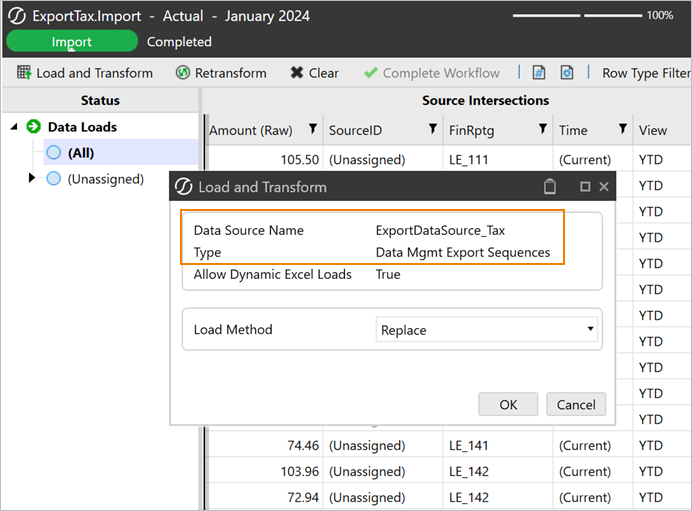

For example, a Workflow Event Handler business rule can automatically retrieve the transformed data from Stage and export it to a file when the Import task is completed. In this example, the exported file contains the OneStram source entity (ET), transformed target entity (EtT), OneStream source account (Ac), transformed target account (AcT), and amount.

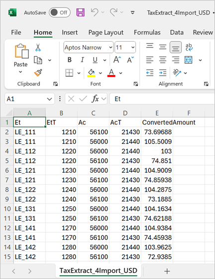

### Source Dimensions

Each data source has assigned Source dimensions. To add Source dimensions to a data source,

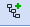

click Add in the toolbar and select a dimension. These dimensions correspond with the dimensions in the cube specified in data source properties.

### Source Dimension Properties

You can specify the following properties for a selected Source dimension.

#### Settings

Data Type Not all data types will be available for every Source dimension. DataKey Text This will read the value from the file as defined in the position settings. Stored DataKey Text This will override the position settings and force the Time value to be a constant value for every line. Global DataKey Time This will use the Time value from the current Global POV time being processed. Current DataKey Time This will use the Time Value from the current Workflow POV. Current DataKey Scenario This will use the Scenario value from the current Workflow POV. Matrix DataKey Text This is used as a Data Type when the data source is setup as a Matrix Load with multiple periods and used to identify the defined Start Position and Length of a single period. Text This will read the value from the file as defined in the position settings. Stored Text This will override the position settings and force the value to be a constant value for every line. Matrix Text This will have multiple amounts on a given line using rows and columns. This will determine the intersection that corresponds with each amount when more than one column contains the same dimension. Label This will read the value from the file as defined in the position settings. Stored Label This will override the position settings and force the value to be a constant for every line. Numeric This defines the numeric amount field for the data source.  This field will be read and stored as a number, not as text or string.

#### Position Settings

Position settings are the definition of where the Source dimension will be found in the source file. For both fixed width and delimited files, there are tools in the toolbar and an attached file that assist in populating these values. Highlight the specific area to assign it to a dimension (for a delimited file, it only needs to be a portion of the column). The highlight will appear in red. When

the defined area is selected, click . This will commit the selection to the dimension and the corresponding values will be populated in either the Start Position and Length fields for Fixed Width or the Column Number field for Delimited. To clear this selection without committing it to the

dimension, click . Start Position (Fixed Files Only) This is the numerical representation of the starting point for a line item. Length (Fixed Files Only) This defines how many characters will be taken from the start position. A Fixed data source with a start position of 20 and a length of five will start with the 20thcharacter and include the next five characters. Column (Delimited Files Only) A delimited data source will use a column number. If the column number is four, that dimension will be represented by the 4thcolumn in the source file.

#### Connector Settings

Source field names will be provided by the Connector business rule assigned to the connector data source. These field names will either be explicitly listed out in the business rule, or dynamically returned from a SQL query. Source field names for Data Management Sequences are provided and always contain the same list.

#### Logical Expression And Override Settings

Logical Operator Allows the ability to assign a .NET scripting functionality to a dimension of a data source. Complex Expression This selection is used when .NET scripting is needed for the dimension, but not needed elsewhere. The script used in the complex expression will only be available within that dimension. Business Rule This selection is used when .NET scripting is needed for the dimension and the script is available in the Business Rule Library.

#### Logical Expression

This is the name of the business rule assigned to the dimension when Business Rule is selected for Logical Operator. Static Value This is an override setting which allows a hard-coded value to be assigned to a dimension rather than being read from a file or data source.

#### Text Fill Settings

Leading Fill Value Characters entered in this field will precede whatever value is brought in from the file upon import. Lead Fill Mask = xxx, data value = 00, results value = x00 Trailing Fill Value Characters entered in this field will be placed after any value brought in from the file upon import. Trail Fill Mask = xxx, Data Value = 00, Results Value = 00x

#### Substitution Settings

Substitution Old Value (Find) If the value entered in this field is encountered in the dimension, it will be replaced with what is entered in the Substitution New Value. Single Value = value1 Multiple Values = value1^value2 Substitution New Value (Replace) This will replace the value in Substitution Old Value if it occurs in the dimension. Single Value = value1 Multiple Values = value1^value2 Empty String | Null| Single Space |Space|

### Matrix Settings

This setting is only available when Matrix is set as the Data Structure Type. Matrix Header Values Line # This setting indicates which row to look to for the dimension being matrixed. For example, if months are listed across columns on line four, and time is the intended Member to be matrixed, a 4 would be entered in this field.

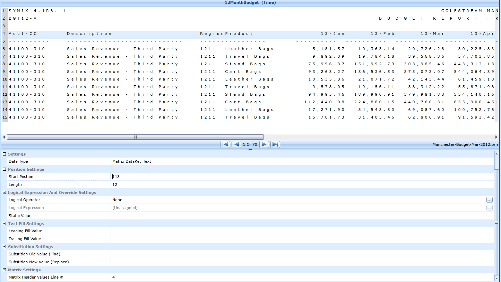

### Numeric Settings

These settings are only available in the Amount Source dimension which will help with the formatting and properties of the amount values. Thousand Indicator Enter the character used to separate thousands in the value. For example, for the value 1,000 the Thousand Indicator is “,”.This can also be done by highlighting the character in the file and clicking

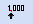

. Decimal Indicator Enter the character used to separate decimals in the amount value. This can also be done by

highlighting the character in the file and clicking . Currency Indicator Enter the currency symbol for the respective currency. This can also be done by highlighting the

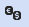

character in the file and clicking . Positive Sign Indicator If the amount values in the file contain text characters to dictate a positive value, enter the characters here.  This can also be done by highlighting the character(s) in the file and clicking

. Negative Sign Indicator If the amount values in the file contain text characters to dictate a negative value, enter the characters here.  This can also be done by highlighting the character(s) in the file and clicking

. Debit / Credit Mid-Point Position If debits and credits are in the same amount field, but are offset within that column, a midpoint can be entered here. Values to the left of the midpoint are considered a debit while values to the right are a credit. Factor Value The amount being imported is factored by the value entered in this field. Rounding The available options for Rounding are Not Rounded and the values 1 – 10. Not Rounded will not round the values. If a value between 1 and 10 is selected, the value will be rounded to the corresponding digit. Zero Suppression If the import process should not include zero values, set this to True. To import 0 values, set this to False. Text Criteria for Valid Numbers Fill in the criteria for numbers that are valid.

### Bypass Settings

Bypass allows an administrator to look for a specific value in a column or an entire line. If a value is found, that line will not be processed.  In order to setup the Bypass dimension, highlight the

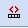

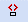

value to skip. Click to skip the value only if it is found in the exact position. Click to skip the value if it appears anywhere on a line.

#### Bypass Type

Contains at Position This switch will tell the data source to skip an entire line of a file if the Bypass Value is found at the specified location in the Position Settings section. Contains Within Line This switch will tell the data source to skip an entire line of a file if the Bypass Value is found anywhere on the line. Bypass Value The value defined will indicate an entire line should be skipped when found in a specific location, or anywhere on the line.

> **Tip:** Create a bypass in a fixed data source for blank spaces by specifying the position

settings and entering double square brackets around the number of blank spaces in the Bypass Value. This can be used if an import will encounter an area in the data source containing blank spaces in the location specified.

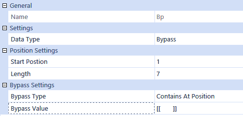

### Stored Text Settings

Text Criteria to Bypass in Storage Buffer This field provides the opportunity to enter a value or string of values indicating a bypass of the record being read even if you specify a stored value. Single Value = value1 Multiple Values = value1^value2 Stored Value Line # The line number to be used repeatedly to obtain value for each record’s importing regardless of whether it is on the line.

### Using Excel As A Data Source

An Excel file can be imported without having to configure the data source completely by setting Allow Dynamic Excel Loads to True and configuring an Excel template. See "Loading Data via Excel Templates or CSV" in Data Collection Guides for more information.

## Forms

### Forms Channel Workflow

To minimize form maintenance, Cube View and Excel XFSetCell updates are not tied to specific Forms. Association is at the Input Type level, not the individual Form level. The Forms Input Type determines if you can update data from Excel. If the Forms channel is completed, but the process is not certified, you can import data from Excel using XFSetCell or a Cube View. If a cell is updated, the Analytic Engine traces the cell by: 1. Identifying the Workflow that owns the Entity. 2. Checking the Input Child Workflow Profile. This determines if the Form Input Type is enabled for the Scenario Type. If not, the Form Input Type is disabled and cannot update cells from a Cube View in the web, Cube View, or XFSetCell function from Excel. If Form Input Type is enabled, the Analytic Engine checks the full Workflow Status for the active Form Input Type. If the Workflow is locked or the Parent Workflow is certified, cells are not updated. If the Workflow indicates updates can occur, the Process Cube task of the Workflow and all ancestor Parent Workflows are impacted.

### Form Allocations

#### Advanced Distribution

In the example below, an advanced distribution is used on a Product Revenue Form. This allocation will take the previous year’s actual data, increase it by 20% and populate the current year’s revenue budget revisions for all regions and customers.

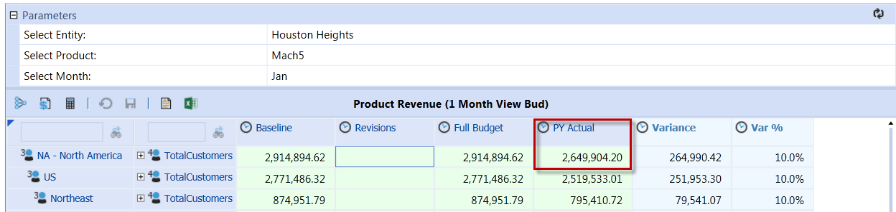

The allocation data is being written to a form which will then populate the Revisions column. The sum of the Baseline and Revisions will then create the new Full Budget for each Region and Customer. Right-click the first data cell in the Revisions column and select Allocation. This helps create the Source and Destination POV.

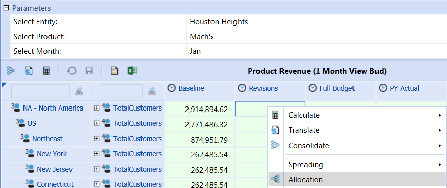

By default, the Allocation dialog will open to the last Allocation processed. Select the Allocation Type desired (e.g., Advanced).

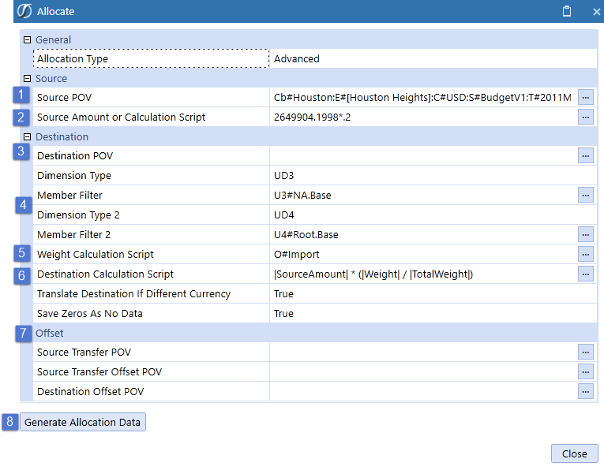

1. Source POV The Source POV defaults to the last cell selected for Allocation. Every Dimension is represented in the POV. In this example, it defaults to the data cell under Revisions because that is where the allocation option was selected. Cb#Houston: E#[HoustonHeights]:C#USD:S#BudgetV1:T#2011M1:V#YTD:A#2000_ 100:F#None:O#Forms:I#None:U1#None:U2#Mach5:U3#NA:U4#TotalCustomers:U5#None:U6#None:U7# None:U8#None Users can also select a data cell from the grid and drag and drop the cell’s POV into this field. The Source POV is the default Source Amount for the allocation. 2. Source Amount or Calculation Script To override the Source POV value, enter a source amount or a calculation script. In this example, the PY Actual value is used for the Source Amount. Click on the cell in the grid and drag and drop the value into the Source Amount property. To increase this amount by 20%, the value is multiplied by .2.

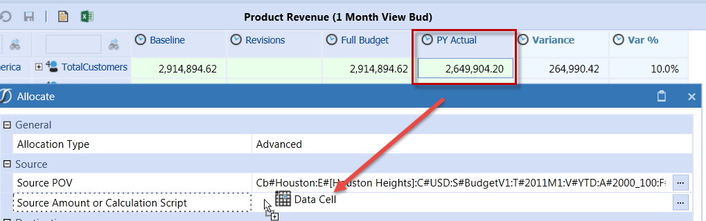

3. Destination POV This is where the allocation is applied. In this example, the Destination POV is blank because it is using the same Members from the Source POV. Users can also drag and drop a data cell’s POV. 4. Dimension Type/Member Filters These properties override the Destination POV and allow allocations to occur to several Members at a time. In this example, the UD3 (Regions) and UD4 (Customers) Dimensions are specified and therefore will override the UD3 and UD4 Members in the Destination POV. 5. Weight Calculation Script The Weight Calculation Script determines how the allocation is weighted. Any Members not specified in the script derive from the Destination POV. In this example, the weight for each Member is determined by the imported value in the Baseline column. 6. Destination Calculation Script The default Destination Calculation Script is |SourceAmount|* (|Weight|/|TotalWeight|). Additional calculations may be added to this field to customize how the weight calculation is performed. This example uses the default calculation. 7. Offset The offset properties are optional and not used in this example. 8. Generate Allocation Data After the allocation dialog is complete, click this button to see the allocation data before applying it. The allocation results dialog provides information on all the allocation destinations, weight information, and displays all the data rows that will be updated upon selecting Save Allocation Data. Check the Show All Dimensions box to see every Dimension intersection for each data row. After the allocation data is saved, the form data will update and store the data to the Cube.

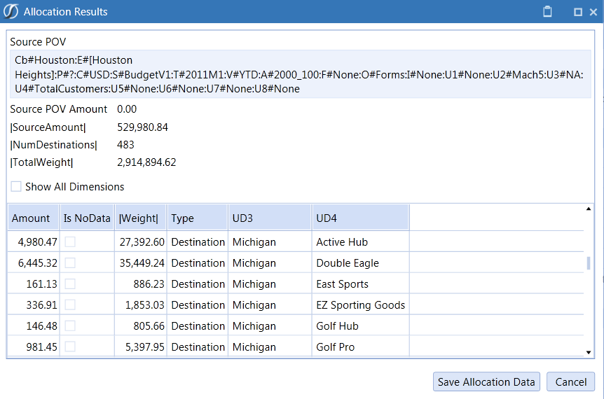

Results:

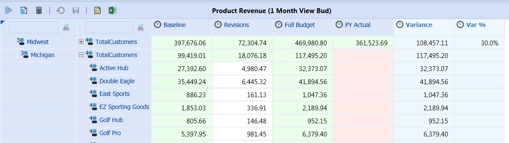

> **Note:** The Var % column updated itself to 30% from 10% because of the additional

20% added to the allocation. The Full Budget column also updated itself with the new total from the Baseline and Revisions columns.

### Form Templates

Form templates can be setup to allow manual data entry. The entries can be done in a cube view from an Excel file or from the Spreadsheet feature (OneStream Windows App only). Each form template group has an assigned cube view, dashboard or Excel file. Forms can also be loaded using an Excel or CSV template. See "Loading Form Data" in Data Collection Guides for more information.

#### Applying Literal Value Parameters To Form Templates

A Delimited List Parameter containing several Cube View or Spreadsheet names can be applied to a Dashboard to use the Dashboard in multiple Form Templates via the Name Value Pairs Form Template Property. Instead of creating multiple Dashboards to assign to multiple Form Templates, users can define the Parameter name thus defining which Cube View or spreadsheet the specific form should use. This approach helps in achieving a common toolbar and look for all data entry forms. The example below uses Cube Views, however, if the forms are driven from Spreadsheets, a Spreadsheet Dashboard Component can also be used. 1. Design the Cube Views necessary for data entry. After the Cube Views are complete, create a Dashboard Maintenance Unit. 2. Within the Dashboard Maintenance Unit, create a Delimited List Dashboard Parameter specifying all Cube View names in both the Value Items Property.

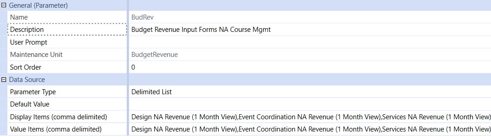

3. Create a Cube View Dashboard Component and enter the Parameter name in Cube View Property enclosed in Pipes and Exclamation Marks.

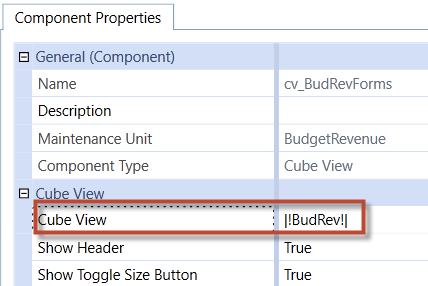

4. Create a Supplied Parameter Dashboard Component to pass the Parameter value from the Dashboard to the Form Template. Specify the Parameter Name in the Bound Parameter property.

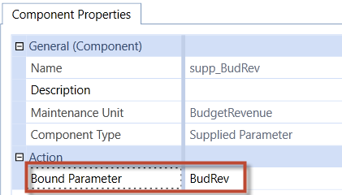

5. Create a Dashboard with a Uniform Layout Type and assign the Cube View and Supplied Parameter Components to it. 6. Create a Form Template and set the Form Type to Dashboard and assign the desired Dashboard. 7. Define which Cube View this specific Form should use in the Name Value Pairs property by hardcoding a specific Cube View name from the Delimited List Parameter.

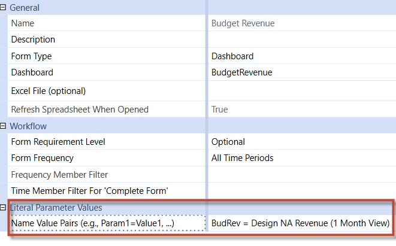

When the Form Template is used in the Workflow, the specified Cube View will display for data entry.

#### Form Template Profiles

After the form template groups are created, they are organized into form template profiles. The profiles are then assigned to workflow profiles.

l Click to create a new profile.

l Click to assign a group to a profile. This allows the user to select which groups will be in the profile. l Assign a profile to a workflow profile by clicking Application > Workflow Profiles | Form Settings, or Journal Settings for journal template profiles.

> **Note:** Click

to access the Security screen to modify users and groups before

assigning them to a form template profile. To assign groups, click and begin typing the group name. Groups are filtered, so you can select the group, press CTRL and then double-click. This specifies the correct name into the appropriate field.

#### Security

Access Group Members of this group have access to the Form Template group. Maintenance Group Members of this group have the authority to maintain the Form Template group.

> **Note:** Click

to navigate to the Security page so you can modify users or groups

before assigning them. Click and begin typing the name of the Security group in the blank field. As the first few letters are typed, groups are filtered, making it easier to find the right group. Select the group, click CTRL and double-click.

#### Form Template Properties

Form details can also be loaded using an Excel or CSV template. See Loading Form Data in Data Collection Guides for more information.

#### General

Name Name of the form template. Description This allows for a more descriptive definition of the form template.

#### Form Type

Cube View Select this to utilize a cube view for the form’s data entry method. Dashboard Select this to utilize a dashboard for the form’s data entry method. Spreadsheet (OneStream Windows App Only) Select this for the Form to be visible using the Spreadsheet feature in OneStream Windows App. When selected, it is the same functionality as attaching an Excel file, but the spreadsheet only exists within OneStream. Cube View/Dashboard

Select the cube view or dashboard that will be associated with this form template. Click and begin typing the name of the cube view or dashboard in the blank field. Names are filtered making it easier to select items. If the name is unknown, click Cube View or Dashboard Group and scroll through the list. Select a cube view or dashboard, click CTRL and then double-click. Spreadsheet (OneStream Windows App Only) This spreadsheet should have been built with an embedded cube view or retrieve functions in order to interact with form data. See Navigating the Excel Add-In for more information on this functionality that is available within the Excel Add-in and the Spreadsheet feature in OneStream Windows App. Upload a pre-created Excel file for data entry when this option is selected. Click

to upload an Excel file. Once selected, the file name in the Excel File space will appear.

l Click to delete an uploaded Excel file.

l Click to download a copy of the uploaded Excel file.

l Click to open the uploaded Excel file. Excel File (Optional) An Excel file may be used for data entry. Click to upload an Excel file. Once selected, the file name in the Excel File space will appear. You can also:

l Click to delete an uploaded Excel file.

l Click to download a copy of the uploaded Excel file.

l Click to open the uploaded Excel file.

#### Workflow

Form Requirement Level Not Used This setting is used if the form is no longer in use and shows the form as Deprecated in the Workflow. Optional This setting will allow the user to enter data via the form if desired. Required This setting will make the form mandatory for any process to which it is assigned Form Frequency All Time Periods This allows the form to display every period Monthly This allows the form to display every month. If this is for a weekly application, they will display the last week of each month. Quarterly This allows the form to display every quarter, or four times a year. Half Yearly This allows the form to display two times a year; once in June and December. Yearly This allows the form to display once a year in December. Member Filter This turns on the Frequency Member Filter. Filters can then be defined in that section. Frequency Member Filter This only becomes available when Member Filter is chosen in the Forms Frequency options above, otherwise this is gray for all the others. The purpose of this option is to allow the ability to filter by time. Time Filter for Complete Form The Time filter will dictate how often the form is required. The example below is what will be shown when selecting Complete Form using the filter T#WFYear.Base.

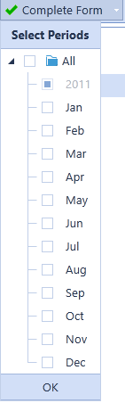

#### Literal Parameter Values

If the dashboard selected for the form, contains a parameter for the cube view or Spreadsheet name, enter the name/value pair which specifies which cube view the form will use in the Workflow. Example: ParameterName = CubeViewName See "Applying Literal Value Parameters to Form Templates" in Data Collection Guides for more information about the Literal Parameter Value feature.

#### Parameters (Cube View Forms Only)

Parameter Type (for Parameters 1 through 6) Parameter types allow for different values or variables to be passed to the cube view. Literal Value The value you specify will be hard coded. Input Value This allows the user to enter or change the value. Delimited List This provides a distinct list of values populated in the Parameter Type. Member List This will produce a flat list of Members to show to the user. Member Dialog Similar to the Member list, this allows the user to select a member, but through a pop-up Member Selection dialog which also has search capabilities. This is more appropriate for a dimension such as Accounts or Entities where the user can choose a base or Parent member by traversing a hierarchy. Variable Name from Cube View Place a parameter in this field to replace another parameter used in a cube view. For example, a prompt such as |!MyEntityName!| will suppress the Parameter dialog from appearing when opening the form. User Prompt This prompts the user based on the question entered here. Default Type Set the default value so it is not blank. Dimension Type Choose the dimension being prompted Member Filter Allows the ability to put in a defined filter. (for example, E#Root.WFProfileEntities)

#### Form Template Group Properties

This section includes general group properties.

#### General (Form Template Group)

Name The name of the form template group. Description A short description of the template group such as how or where it is used.

#### Managing Form Templates

Form Templates can be renamed, copied, and pasted from the toolbar. Form templates can be copy and pasted using a right-click.

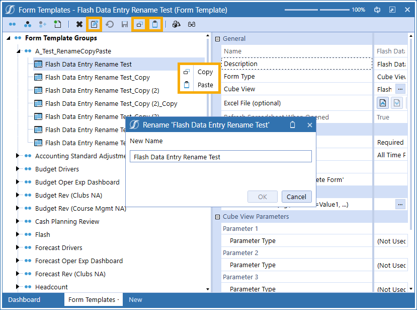

Rename a form template by clicking the Rename icon from the toolbar. All associated links for the Workflow Profile and Dashboard Groups will remain valid as the form template is based on a unique identifier, not the name.

Copy a form template by clicking the Copy icon from the toolbar or right-clicking the form template name and selecting Copy.

Paste a form template by clicking the Paste icon from the toolbar or right-clicking the form template name and selecting Paste.

## Transformation Rules

Transformation rules help map data from source systems to the financial model. The different member scripts and how you can use them with transformation rule types are described below. These are listed in the order in which the rules run during the Validate step in a workflow.

### Transformation Rules Toolbar

Create Group Use this to create a Transformation Rule Group under each dimension.

Create Profile See Transformation Rule Profiles.

Manage Profile Members See Transformation Rule Profiles.

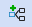

Create and Populate Rule Profile Selecting this will create a Transformation Rule Group and a Transformation Rule Profile with the same name. The Rule Profile will already be populated with each Dimension Rule Group and update as the Group is updated.

Delete Rule Profile and Groups This can only be done by selecting a specific Transformation Rule Profile. It will delete the Transformation Rule Profile and all non-shared Groups within the Profile.

Delete Selected Item Use this to delete one item such as one Rule Group or Profile.

Rename Selected Item This allows a user to rename Transformation Rules, Groups or Profiles.

Cancel All Changes Since Last Save This will undo any unsaved changes made.

Export Selected Group to a TRX File Use this to export a Transformation Rule Groups to use in another application or group. This exports a comma delimited file which are valid for only certain Transformation Rule designs. Logical Operators and complex expressions are not supported. Application Tools, Load/Extract of application *.XML files should be used to manage Transformation Rules.

Import a TRX file into the Selected Group Use this to import Transformation Rule Groups from another application or group. This comma delimited file format may not be valid for all Transformation Rule designs. Properties such as Logical Operators and complex expressions are not supported. The *.TRX import is intended as a utility to import Transformation Rules from compatible legacy systems. Application Tools, Load/Extract of application *.XML files should be used to manage Transformation Rules.

### General Settings

#### General

Name The name of the Transformation Rule group. Description A short description of the rule or where it is used.

#### Security

Access Members of this group will have access to the Transformation Rule group. Maintenance Members of this group have the authority to maintain the Transformation Rule group as well as load/extract from the Transformation Rules page.

> **Note:** Click

and begin typing the name of the Security group in the blank field.  As the first few letters are typed, the groups are filtered making it easier to find and select the desired group. After the Group is selected, press CTRL and double-click to add the correct name into the appropriate field.

#### Settings

Cube Dimension Name The specific dimension to which the rule group is assigned.

### Mapping Types

Mapping Types allow the data to be mapped in different ways with the possibility of using conditional rules, wild cards, ranges and others.

> **Important:** The characters !, ?, and | are used in operations for Transformation

Rules. These characters will cause errors if used with Source Members or Target Members.

#### One-To-One

One-to-One mapping allows one Source dimension member to be mapped or transformed to one target dimension member explicitly. No member scripts are used. Source Value This is the value for the related Cube dimension in a defined data field. Description (Optional) This is a description of the mapping rule. Target Value The Dimension Library member to which the Source Value is being mapped or transformed. Order (Optional) The one-to-one mapping rules will be processed in the order of the (defaulted) alpha numerical sort. The Order field allows a value to be assigned to a record which will allow a custom sort order of the mapping table.

#### Composite

Composite mapping is a way to do a map conditionally. Dimensional tags may be used to include another dimension in the evaluation. The * character is used to represent any number of characters. The ? character acts as a placeholder for a single character. In the following example, any similarly formatted account starting with 199 and an entity of Texas would be mapped to a specific target.

|Col1|Example: A#[199?-???*]:E#[Texas]|
|---|---|

In the following example of an entity composite rule using the ? character, records for all entities with accounts that start with H that have 10 or fewer characters would be captured, for example, accounts named Head, Heads, and Headcount.

|Col1|Example: E#[*]:A#[H?????????]|
|---|---|

Composite rules stop processing when a record meets the criteria. So, if the record meets the criteria for more than one rule, set the order to ensure they are mapped correctly. For example, using the following records, we can map those with Head to the entity Rhode Island, Heads to the entity Maine, and Headcount to be bypassed by setting the order from the shortest account name (narrowest search) to the longest account name (broadest search).

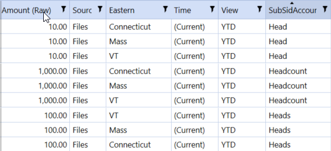

So, we would set the mapping to run in the following order: 1. E#[*]:A#[H???] to map all accounts that start with H and have 4 or fewer characters 2. E#[*]:A#[H????] to map all accounts that start with H and have 5 or fewer characters 3. E#[*]:A#[H?????????] to map all accounts that start with H and have 10 or fewer characters

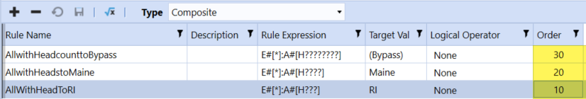

So first, the records for the Head account would map to Rhode Island. Then, the records for the Heads account would map to Maine. And last, the records for the Headcount account would be bypassed.

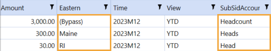

#### Range

A range mapping gives the upper limit and lower limit of a range. Any member that falls within this range will be mapped to the corresponding target member. Range rules do not stop processing when a record meets the criteria. If the ranges overlap and a member falls within multiple ranges, that member will be mapped only to the final range that is processed. So, for a member in multiple ranges, set the order so that the last rule run is applied. If an administrator wants the range of source Accounts from 11202 to 11209 to map to Account 12000, enter 11202~11209 under Rule Expression with ~ as the separator. Range rules use character sets not integers. So, use balanced character sets to ensure the full range is captured. For example, a range of 4 to 3000 must be entered as 0004~3000 under Rule Expression.

#### List

List mapping allows the user to create a delimited list of members that all map to the same target. If an administrator wants the list of Accounts 41137, 41139 and 41145 to map to Account 61000, enter 41137;41139;41145 under Rule Expression with ; as the separator.

#### Mask

Wild cards are used in mask mappings. The wildcard characters for these mappings are * and  ?. The * character is used to represent any number of characters.  27* would capture 270, 2709, or 27XX-009. The ? character acts as a placeholder for a single character. 27?? Would capture 2709, but would not capture 27999 or 2700-101. Double-sided wild cards can be used as well in Mask transformation rules. For example, *000* would capture any account number with character(s) before and after the 000 sequence. The following properties are standard for Composite, Range, List and Mask Mapping Types. Rule Name This is a unique name assigned to each mapping rule that will also determine the default sort and processing order. Description (Optional) The description of the mapping rule. Rule Expression This is where the specific source field processing rule is placed.  For example, 27* would capture 270, 2709, or 27XX-009. Target Value The Dimension Library member to which the Source Value is being mapped or transformed. The use of wild cards to define Target Values is not recommended. The following exceptions apply to Target Value wild card usage: l The ? character is not supported. l The * character is not supported when used as a prefix (left side) to a target value. l The * character used as a suffix (right side) will yield the Source value. Logical Operator This provides the ability to extend a normal mapping rule with VB.NET scripting functionality. Expression Type: None (Default) No script is assigned or employed for this related transformation rule. Business Rule This selection is used when .NET scripting is needed for the dimension and the script is available within the Business Rule Library. Complex Expression This selection is used when .NET scripting is needed for the dimension but will not need to be used elsewhere.  The script used in the complex expression will only be available within that dimension. Order (Optional) The Order field allows a value to be assigned to a record which will allow a custom sort order of the mapping table.

### Derivative

Derivative rules apply logic to stage data and generate additional records in the Stage environment. Derivative rule types include Source and Target.

#### Source Derivative Rules

Source derivative rules are created to apply logic defined by the inbound source data in the Stage environment. This will create new members as a data record, which are stored in the stage area, to be mapped to a cube or a temporary member.

#### Target Derivative Rules

Target derivative rules apply logic defined by the post-transformed stage environment data. This will create new members as a data record, which are stored in the stage area. Since these are post-transformation, any records stored as final will not be processed by transformation rules.

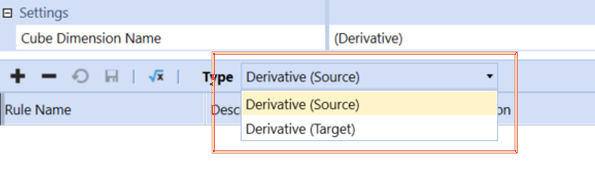

Rule Name A unique name given to a particular derivative rule. Description A detailed description used in the Label field of the data imported.

#### Bi Blend Derivative Rules

This is a class of derivative rules specifically designed for use with the external database tables generated from the BI Blend Workflow. l BlendUnit All l BlendUnit Base l BlendUnit Parent

> **Note:** The formula reference in BI Blend for the Log P1 function is not calculated for

values <=1 and returns null in that case. For more information, see the BI Blend Design and Reference Guide.

#### Derivative Rule Expressions

Below are some examples of the syntax used to write derivative rules. The variation between the use of Source or Target derivative rules is by the definition of the rule. Source derivative rules reference the inbound record members. Target type derivative rules reference the post- transformed records. In the rule expression samples, assume these rules will run in this order presented in the example.

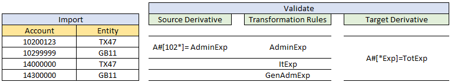

|Rule Expression|Expression Type|Derivative Type|Notes|
|---|---|---|---|
|A#[11*]=Cash|None|Final|Accounts that start with 11 aggregate to a new Account called Cash and stored in Stage.|
|A#[12*]=AR|None|Interim|Accounts that start with 12 aggregate to a new Account called AR, but not stored.|
|A#[1300- 000;Cash]=CashNoCalc|None|Interim (Exclude Calc)|The Derivative Account Cash is excluded because the calc is excluded. The CashNoCalc interim Account is created as an aggregate of Account 1300-000, but not stored.|

|Rule Expression|Expression Type|Derivative Type|Notes|
|---|---|---|---|
|A#[1310- 000;Cash]=CashIncludeCalc|None|Interim|The two Accounts (1310-000 and Cash) aggregate to equal the new Derivative Account called CashIncludeCalc because the calc is included.  Note the use of the semicolon (;) as a list separator.|

The following rules create additional rows in the Stage area when importing data based on logic.

|Rule Expression|Expression Type|Derivative Type|Notes|
|---|---|---|---|
|A#[1000~1999]<<New_:E# [Tex*]=TX|None|Applies to All Types|Creates a new row in the Stage for any Account that falls between 1000 and 1999 in the source data, but will add a suffix to it.  Account 1010 will create a new row for Account New_ 1010. The end of the rule syntax shows each Entity name starting with “Tex” will be created as the Entity called TX in these new Stage rows.|

|Rule Expression|Expression Type|Derivative Type|Notes|
|---|---|---|---|
|A#[2000~2999]>>_:Liability:U2# [*]= None:U3[*]=None:U4#[*]=None|None|Applies to All Types|Creates a new row in the Stage for every Account between 2000 and 2999 with a prefix.  Account 2300 will come into a new row as 2300_ Liability. The rest of the rule means all UD2, UD3 and UD4 Dimension Members will be set as the None Member.|

|Rule Expression|Expression Type|Derivative Type|Notes|
|---|---|---|---|
|A#[3000~3999]@3:E#[Tex*]@1,1|None|Applies to All Types|Takes the first three digits of each Account between 3000 and 3999 to create new rows in Stage. Each Entity starting with Tex will be shown as “T” since the @1,1 syntax starts at the first position of the string and looks one character to the right.|

### Logical Operators

Logical Operators extend a normal mapping rule with VB.Net scripting functionality. Derivative Expression Types These are used to perform additional calculations on the transformed Member’s data. None This is the default and no changes will be made. Business Rule A business rule runs on the resulting Derivative member data. This business rule must have Derivative as its type. Complex Expression Write a script here instead of a shared business rule and it will run against the resulting Derivative member’s data. Multiply This will multiply the resulting Derivative member’s value by another specified value. Divide This will divide the resulting Derivative member’s value by another specified value. Add This will add the resulting Derivative member’s value by another specified value. Subtract This will subtract a specified value from the resulting Derivative Member’s value. Create If > x A derivative record is created if the value is greater than a specified threshold. Create If < x A derivative record is created if the value is less than a specified threshold. Returns the past value (lag) per the number of years set in the Math Value field of the rule. Math Value = 1 by default. The lag operator looks at the first date in the set, then returns the lag value for the number of years specified. In the data set shown below, the value 12 would be returned if the Lag (Years) value is set to 1:

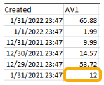

Lag (Months) Returns the past value (lag) per the number of months set in the Math Value field of the rule. Math Value = 1 by default. The lag operator looks at the first date in the set, then returns the lag value for the number of months specified. In the data set shown below, the value 9.99 would be returned if the Lag (Months) value is set to 1:

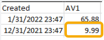

Lag (Days) The Lag (Days) logical operator returns the past value (lag) per the number of days set in the Math Value field of the rule. The data set is first sorted in descending order by the Created date. The lag operator looks at the first date in the set, then returns the lag value for the number of days specified. In the data set shown below, the value 23.39486017 would be returned if the Lag (Days) value is set to 2:

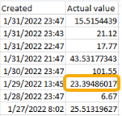

Lag (Hours) Returns the past value (lag) per the number of hours set in the Math Value field of the rule. The data set is first sorted in descending order by the Created date/time. The lag operator looks at the first date/time in the set, then returns the lag value for the number of hours specified. In the data set shown below, the value 43.53177343 would be returned if the Lag (Hours) value is set to 2:

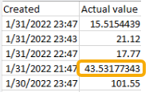

Lag (Minutes) Returns the past value (lag) per the number of minutes set in the Math Value field of the rule. The data set is first sorted in descending order by the Created date/time. The lag operator looks at the first date/time in the set, then returns the lag value for the number of minutes specified. In the data set shown below, the value 21.12 would be returned if the Lag (Minutes) value is set to 4:

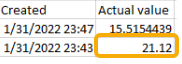

Lag (Seconds) Returns the past value (lag) per the number of seconds set in the Math Value field of the rule. The data set is first sorted in descending order by the Created date/time. The lag operator looks at the first date/time in the set, then returns the lag value for the number of seconds specified. In the data set shown below, the value 17.77 would be returned if the Lag (Seconds) value is set to 3600 (60 minutes):

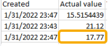

Lag Change (Seconds) Returns the difference between the latest value and a past value (lagged value), per the number of seconds set in the Math Value field of the rule. The data set is sorted in descending order by the Created date/time. The lag change operator looks at the first date/time in the set, then looks at the lag value based on the number of seconds set in the rule. The difference between the latest value and the lag value is returned. In the data set shown below, the value -2.25 would be returned if the Lag Change (Seconds) value is set to 3600 (60 minutes):

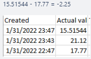

Lag Change (Minutes) Returns the difference between the latest value and a past value (lagged value), per the number of minutes set in the Math Value field of the rule. The data set is sorted in descending order by the Created date/time. The lag change operator looks at the first date/time in the set, then looks at the lag value based on the number of minutes set in the rule. The difference between the latest value and the lag value is returned. In the data set shown below, the value -5.60 would be returned if the Lag Change (Minutes) value is set to 4:

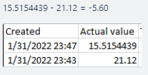

Lag Change (Days) Returns the difference between the latest value and a past value (lagged value), per the number of days set in the Math Value field of the rule. The data set is sorted in descending order by the Created date/time. The lag change operator looks at the first date/time in the set, then looks at the lag value based on the number of days set in the rule. The difference between the latest value and the lag value is returned. In the data set shown below, the value 8.85 would be returned if the Lag Change (Days) value is set to 3:

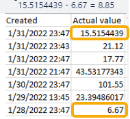

Lag Change (Months) Returns the difference between the latest value and a past value (lagged value), per the number of months set in the Math Value field of the rule. The data set is sorted in descending order by the Created date/time. The lag change operator looks at the first date/time in the set, then looks at the lag value based on the number of months set in the rule. The difference between the latest value and the lag value is returned. In the data set shown below, the value -3.37686333 would be returned if the Lag Change (Months) value is set to 1:

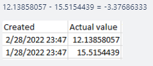

Lag Change (Years) Returns the difference between the latest value and a past value (lagged value), per the number of years set in the Math Value field of the rule. The data set is sorted in descending order by the Created date/time. The lag change operator looks at the first date/time in the set, then looks at the lag value based on the number of years set in the rule. The difference between the latest value and the lag value is returned. In the data set shown below, the value 3.37686333 would be returned if the Lag Change (Years) value is set to 1:

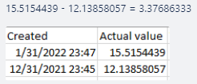

Lag Change (Step Back) First, sorts a data set in descending order by the Created date. Then, it “Steps Back” from the first record in the data set and selects the record based on the number of positions back specified in the Math Value. The first record in the data set is position zero. In the data set below, the difference between the 1st record and the 6th record is returned:

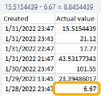

### Derivative Rule Expressions

Derivative rule expressions determine how derived records are grouped. Groupings occur on an attribute, unless the rule expression is explicitly set to “None.” In the following example, notice that attribute A4 is not specified in the rule. As a result, groupings occur based on A4. It corresponds to the Responsibility column (assigned to column in load file) in the BI Blend tables. Example: A#[TicketCost]=LagDays2_GroupbyResponsibility:A1#[]=None:A2# []=None:xBDT#[2022-01-01 00;00;00~2022-12-31 23;59;59]!M When a BI Blend file is loaded to the workflow, the calculation based on the logical operator is performed on each grouping. Group By Day Rule expressions in Transformation Rules can group derived records by day. In the rule expression shown below, the !D at the end of the expression indicates that the derivative records are grouped by day. Example: A#[TicketCost]=AvgGroupByDay:A1#[]=None:A2#[]=None:A4#[*]=None:xBDT# [2022-01-01 00;00;00~2022-01-31 23;59;59]!D When used with a logical operator, the calculation is performed on each grouping. For example, if the Average logical operator is used on the data set shown below, the average is calculated for each day. If the day only has 1 value, that value is returned.

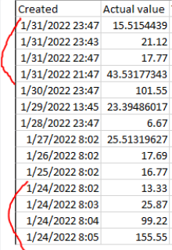

Group By Month Rule expressions in Transformation Rules can group derived records by month. In the rule expression shown below, the !M at the end of the expression indicates that the derivative records are grouped by month. Example: A#[TicketCost]=AvgGroupByMonth:A1#[**_]=None:A2#[_**]=None:A4# [*]=None:xBDT#[2022-01-01 00;00;00~2022-01-31 23;59;59]!M When used with a logical operator, the calculation is performed on each grouping. For example, if the Average logical operator is used, the average is calculated for each month. If the month only has 1 value, that value is returned. Group By Year Rule expressions in Transformation Rules can group derived records by year. In the rule expression shown below, the !Y at the end of the expression indicates that the derivative records are grouped by year. Example: A#[TicketCost]=CountGroupByYear:A1#[]=None:A2#[]=None:A4# [*]=None:xBDT#[2015-01-01 00;00;00~2022-12-31 23;59;59]!Y When used with a logical operator, the calculation is performed on each grouping. For example, if the Count logical operator is used on the data set shown below, the following counts are returned for each year:

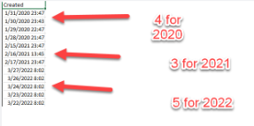

Group By All Rule expressions in Transformation Rules can group all derived records into one group when specified in a rule expression. In the rule expression shown below, the !All at the end of the expression indicates that the derivative records are grouped into one group that contains all records. Example: A#[TicketCost]=CountGroupByAll:A1#[]=None:A2#[]=None:A4#[*]=None:xBDT# [2015-01-01 00;00;00~2022-12-31 23;59;59]!All When used with a logical operator, the calculation is performed on the whole data set. For example, if the Count logical operator is used on the data set shown below, a count of 15 is returned:

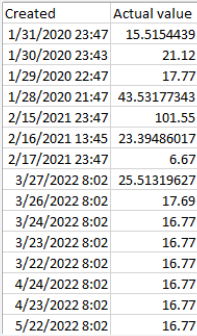

### Derivative Types

Derivative types determine if the resulting Derivative Member will be created, not created, or if the member will be calculated. Interim This will not be stored in the Stage area and cannot be mapped to a target member.  It can be used within other subsequently run derivative rules. Interim (Exclude Calc) This is similar to Interim but will be excluded in other derivative calculations. Final This will be stored in the Stage area and available to be mapped to a target member. Final (Exclude Calc) This is similar to Final but will be excluded in other derivative calculations. Check Rule This is a custom validation rule that uses the same syntax as member filters and can be applied to the source data during the Validation task of the workflow. Check Rule (Exclude Calc) This is similar to Check Rule but will be excluded in other derivative calculations.

### Order

The Order field allows a value to be assigned to a record which will allow a custom sort order of the mapping table.

### Lookup

The Lookup transformation rule has a versatile configuration and can be used as a table for formulas, business rules or as a simple look up.

### Transformation Rule Profiles

Once transformation rule groups are created, they are organized into transformation rule profiles. The profiles are assigned to workflow profiles.

Click to create a new profile.

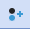

Click to assign a rule group to a profile so users can select groups for a profile. Under Rule Profile Settings, choose the cube and scenario type where the profile can be viewed and used when designing a workflow profile. Assign a rule profile to a workflow profile by clicking Application > Workflow Profiles > Import > Integration Settings.

## Loading Data With Excel Templates Or CSV

Files Use Excel templates or CSV files to load data into stage using the Import method in Workflow, Forms data, Journals, Cell Detail, Data Attachments or to Custom Tables. An Excel file can be imported without having to configure the data source completely by setting Allow Dynamic Excel Loads to True and configuring an Excel template. This section describes the configuration required for this integration.

### Loading Stage Data

#### Import Excel Template

When importing data into the Stage via Excel, a specific template must be used for OneStream to read and load the data. The user must first create Dimension Tokens (e.g. E#, A#, S#, etc.) to organize the data correctly. The Dimension Token specifies the specific type of data in any given column. For example, if the column header is E#, OneStream will read every row in that column as an Entity name when loading into Stage. After the Dimension Tokens are specified, create a Named Range beginning with xfd. There can multiple xfd Named Ranges across multiple tabs within an Excel workbook. The Dimension Tokens must be the Named Range’s first row. The following Dimension Tokens are used within an Import Excel Template. Please note these tokens can be in any order on the Excel template.

|Dimension Tokens|Meaning|
|---|---|
|A#|Account: each row below will list the accounts to be imported|
|AMT#|Amount: using the AMT.ZS# header will automatically apply zero suppression to this import. Tip: Apply zero suppression to a Matrix-style Excel import template by using this same .ZS extension on the AMT column.|
|F#|Flow|
|IC#|Intercompany|

|Dimension Tokens|Meaning|
|---|---|
|E#|Entity|
|C#|Consolidation|
|S#|Scenario|
|T#|Time Period|
|V#|View|
|O#|Origin|
|UD1#-UD8#|Each row must have a value even if a User Defined Member is not used in the application. Create a Static Value of None for any UD Members where this applies. Ex. UD5#:[None] UX# or UDX# can be used for all User Defined Dimensions.|
|LB#|Label: This is used for an Account description related to a line of data. It is imported just for reference purposes and not stored in the Cube.|
|SI#|Source ID: This is a key for data imported into Stage. This typically includes a reference to the Entity being loaded but depends on the implementation. It is a best practice to have only one Source ID per Named Range and these can be the same or different for every Named Range imported for one Excel workbook.|

|Dimension Tokens|Meaning|
|---|---|
|TV#|Text Value: this is used to store large amounts of textual data.|
|A1# through A20#|Attribute Dimensions: these 20 Dimensions can each store 100 characters of text.|
|AV1# through AV12#|Attribute Value Dimensions: these 12 Dimensions can store numeric data.|

#### Header Abbreviations

Static Value Use  :[] to fix a specific Member to the entire column creating a Static Value for the specified Source Dimension. For example, F#:[None] imports the None Flow Member for every Flow row within the Named Range. This syntax applies to all Dimension Tokens. Data Sources allow text values to be loaded as a View Member from the same row as the numeric value. Specify #Annotation, #VarianceExplanation, #AuditComment, #Footnote, or #Assumption as the Static Text Value of the TextValue Source Dimension and a new row will be created for the comment row. For example, use TV#:[#Annotation] to add an additional Annotation row. Business Rule Pass a Business Rule for any specified Source Dimension to set a specific value. AMT#:[]:[BusinessRuleNameThatSetsAValue] Matrix Member This repeats for each Member. For example, if there were twelve time periods in the named range the syntax would be as follows: T#:[]:[]:[2012M3] To use Current/Global Scenario and Time, use .C# and .G# which creates a Static Value for the Time and Scenario within the Named Range. T.C# and S.C# returns the current Workflow Time and Scenario.  T.G# and S.G# returns the Global Time and Scenario.

#### Import Data Extracted Via Data Management

Any type of data (Import, Forms, or Journals) extracted to a CSV file through a Data Management Job can be imported into Stage via an Extensibility Business Rule. This simplifies the migration of data between applications. Example Dim objXFResult As XFResult = BRApi.Finance.Data.SetDataCellsUsingCsvFile(si,  filePath, delimiter, originFilter, targetOriginMember, loadZeros) When using this BRApi make sure to specify the Origin Filter which determines the type of data desired from the file (Import, Forms or Adjustments), and the Target Origin Member which determines where the data will be stored upon loading the file.

### Loading Form Data

#### Form Excel Template

When loading Form data via Excel, a specific template must be created to determine the form properties, the Dimensions to which the data is loaded, the data entry amount, and any data attachment information. OneStream reads this template using a specific Named Range which is explained later in this section. Ensure the following information is included in the Named Range. Property Tokens The first four rows of the Named Range in the Excel template must include the following token definitions:

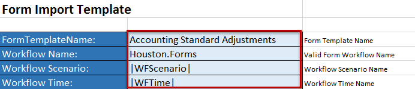

Form Template Name Enter the Form Template name intended for the Form data load. Workflow Name Enter the Form Workflow name.  For example, if the name of the Workflow Profile is Houston, and the Form input type is named Forms, enter Houston.Forms. Workflow Scenario Enter the current Workflow Scenario such as Actual, Budget, etc. To dynamically use the current Workflow Scenario, use the |WFScenario| Substitution Variable. Workflow Time Enter the current Workflow Time Period. To dynamically use the current Workflow Time, use the |WFTime| Substitution Variable. Dimension Tokens Next, create the Dimension Tokens necessary to load the form data to the correct Dimensions in OneStream. The Dimension tokens need to be the column header for each data row. The standard tokens used determine the Cube, Entity, Parent, Account, Flow, Intercompany, the User Defined Members, and an Amount. Refer to Loading Stage Data for the syntax. The form specific tokens are as follows: HD# Has Data Enter Yes or No to specify whether the row has data. AN# Annotation AS# Assumption AD# Audit Comment FN# Footnote VE# Variance Explanation

#### Header Abbreviations

Static Value Use  :[] to fix a specific Member to the entire column creating a Static Value for the specified Source Dimension.  For example, F#:[None] imports the None Flow Member for every Flow row within the Named Range.  This syntax applies to all Dimension Tokens. Using Substitution Variables If a Substitution Variable is used to define the Workflow Scenario or Workflow Time Tokens, link the Scenario and Time Dimension Tokens using the Ampersand (&) Excel Function and referencing the Excel cell. Example:

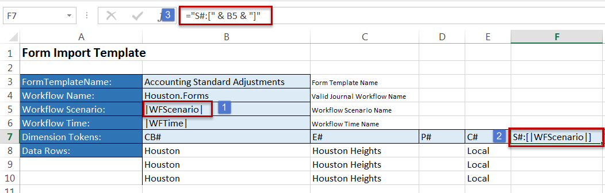

1. The Workflow Scenario Token, located in cell B5, is using a Substitution Variable to dynamically reference the user’s current Scenario. 2. The Scenario Dimension Token needs to reference that Substitution Variable to ensure the correct Scenario is used and the template functions properly. 3. The syntax to reference the cell B5 is =”S#:[“ & B5 &”]” This references the correct variable and displays it in the proper cell. After the Dimension Tokens are configured, enter the data in the corresponding column. The Dimensions can be in any order.

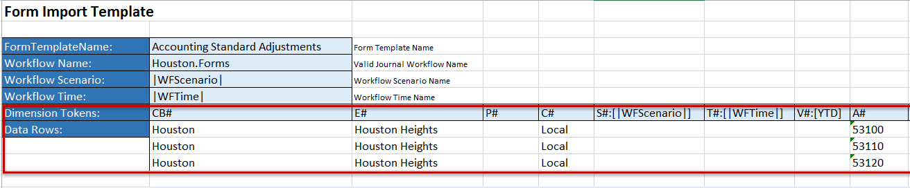

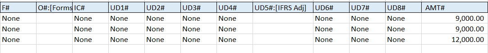

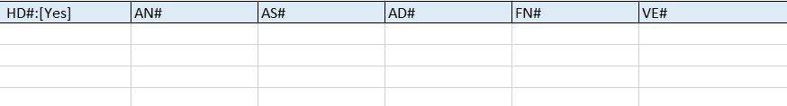

The final step is to create a Named Range beginning with XFF making sure to include the definition of each property, the Dimension tokens, and the data rows. The Named Range must begin with XFF for OneStream to read and load the form data correctly. Multiple XFF Named Ranges can be used across multiple tabs.

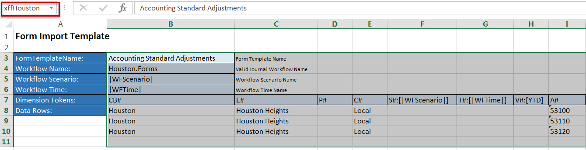

Form Matrix Excel Template A form matrix template is used to load multiple amount columns to multiple time periods at once. In this template, the Time Dimension Token is combined with the amount to identify which amount should load to which period. This template uses the same property tokens as a regular Excel Form template shown above.

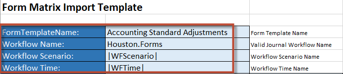

In the Matrix Form template, Amount and Time must be specified in the same column. A third Dimension can be specified (e.g., Scenario) if desired. The example below is indicating the Amount Column using AMT# and then specifying to which Time Members the Amount detail belongs.

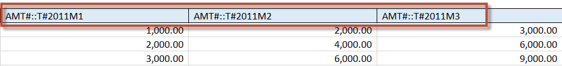

#### Form CSV Template

To set up a CSV template for a Form, the Header and Detail values must be specified.

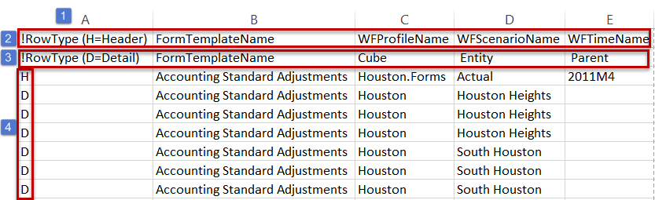

1. Column A Specifies Row Type In the first two rows of Column A, create two Row Type Parameters specifying the Header and the Detail. In the example above, !RowType (H=Header) and !RowType (D=Detail) are used to tag the corresponding rows with H or D identifying where the Header and Detail information is located in the CSV file. 2. Row One Specifies the Headers After the Header Parameter is configured, enter the form column headers. The required Form Headers are FormTemplateName, WFProfileName, WFScenarioName, and WFTimeName. For more details on these, refer to Form Excel Template. 3. Row Two Specifies the Details After the Detail Parameter is configured, enter the form detail headers. The required Form Detail Headers are FormTemplateName, all 18 standard Dimensions, Amount, HasData, Annotation, Assumptions, AuditComment, Footnote, and VarianceExplanation. For more details on these, refer to Form Excel Template. 4. Header and Detail Tags The Form data is driven by how each row in column A is tagged. Any rows tagged with H load as the Headers and any row tagged with D load as the details.

#### Loading Form Details Via Workflow

After the template is configured, users can load it directly into OneStream during the Workflow

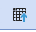

process. While the Form Input type is selected, click the icon in the Form toolbar. This allows the user to select the desired Excel or CSV template and load it into OneStream. After the file is loaded, the data will appear in the Form grid and it auto-saves upon importing to the Cube.

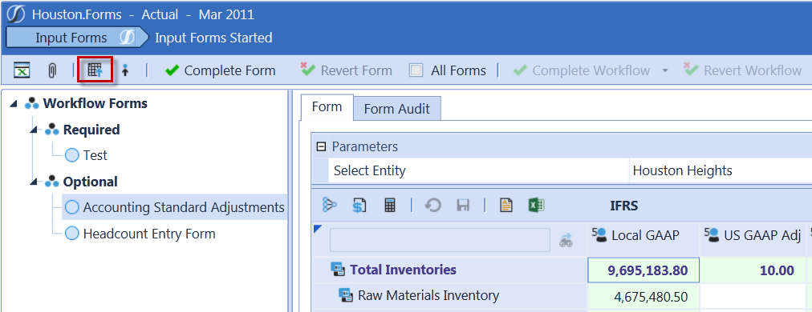

#### Loading Form Details Via Business Rules

Users can load Form details from an Excel Template or CSV file by configuring an Extensibility Business Rule and using the ImportandProcessForms BRApi. Within the BRApi, define the Session Info, file path, and Form actions. Load Example 'BRApi.Forms.Data.ImportAndProcessForms(si, filePath, save, complete, throwOnError)

### Loading Journal Data

#### Journal Excel Template

When loading journal entries via Excel a specific template must be created to determine the journal properties, the Dimensions to which the entries are being made, and the debit and credit amounts. OneStream reads this template using a specific Named Range which is explained later in this section. Ensure the following information is included in the Named Range. Property Tokens The first eleven rows of the Named Range in the Excel template must include the following token definitions:

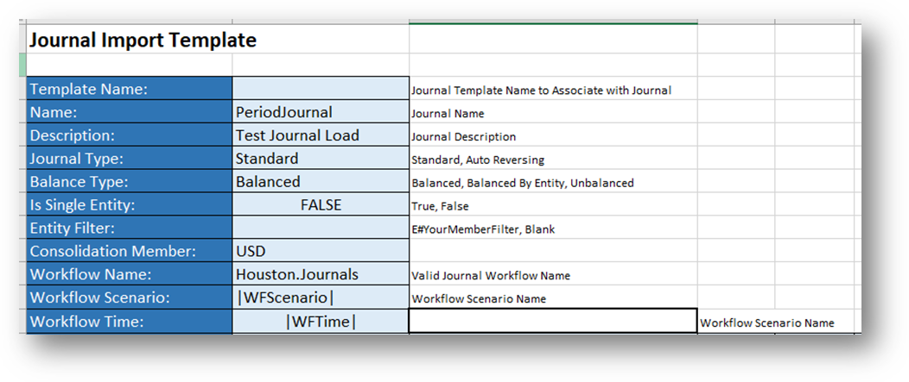

Template Name Enter a template name is applicable. If this is a free form journal, leave this blank. Name Enter the name of the journal. Description If desired, enter a description for the journal. Journal Type* Standard or Auto-reversing. Allocation is not supported for Excel or CSV import. Balance Type* Balanced, Balanced by Entity, or Unbalanced Is Single Entity* True or False Entity Filter* Use a Member Filter to specify the Entities used with this journal. Consolidation Member Enter the specific currency or Local Member of Consolidation. Workflow Name Enter the Journal Workflow name. For example, if the name of the Workflow Profile is Houston, and the Adj input type is named Journals, enter Houston.Journals. Workflow Scenario Enter the Workflow Scenario or make the template dynamic by entering the |WFScenario| Substitution Variable. Workflow Time Enter the Workflow Time or make the template dynamic by entering the |WFTime| Substitution Variable. Workflow Time support two fields. The available cell immediately to the right is option representing the CubeTimeName.  This field can be used when the Scenario’s Workflow Tracking Frequency is Yearly, and the Input Frequency is Monthly. For example, the Workflow Time would be |WFTime| or 2019 and the CubeTimeName would be the period to post, 2019M7.

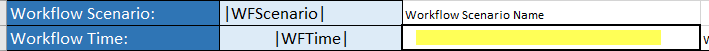

When Tracking Frequency is Yearly and Input Frequency is Monthly:

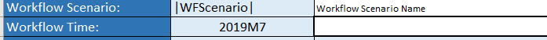

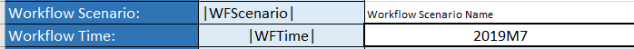

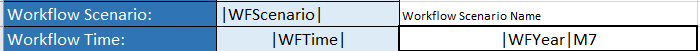

*See Journal Templates Data Collection for details on these Journal properties. Dimension Tokens Next, create the Dimension Tokens necessary to load the journal to the correct Dimensions in OneStream. The Dimension tokens need to be the column header for each data row. The standard tokens used determine the Cube, Entity, Parent, Account, Flow, Intercompany, the User Defined Members, and a Label if needed. Refer to Loading Stage Data for the syntax. The journal specific tokens are as follows: AMTDR# This indicates the debited amount. AMTCR# This indicates the credited amount.

#### Header Abbreviations

Static Value Use  :[] to fix a specific Member to the entire column creating a Static Value for the specified Source Dimension. For example, F#:[None] imports the None Flow Member for every Flow row within the Named Range. This syntax applies to all Dimension Tokens. After the Dimension Tokens are setup, enter the data in the corresponding column. Template Example:

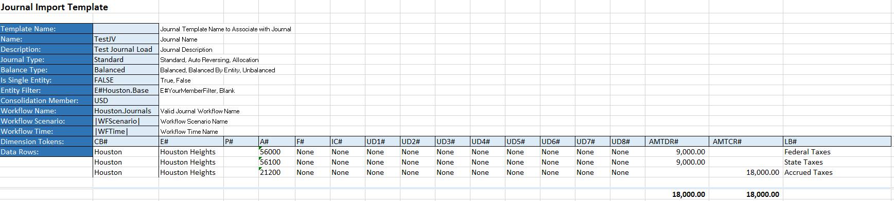

The final step is to create a XFJ Named Range making sure to include the definition of each property, the Dimension tokens, and the data rows. The Named Range must begin with XFJ for OneStream to read and load it correctly. Multiple XFJ Named Ranges can be used within the template over multiple tabs.

> **Note:** Loading of Journal Templates or previously exported Journal data only requires

a Parent (P#) column value to be populated if the target Consolidation dimension member being updated is OwnerPreAdj or OwnerPostAdj. Otherwise, this entry can be left blank. Named Range Example:

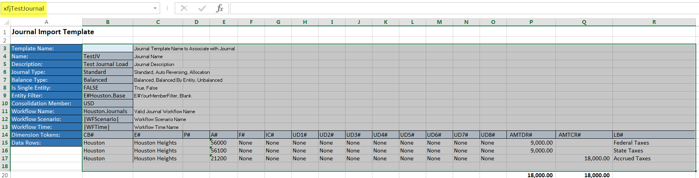

> **Note:** The Named Range only covers each property definition.

#### Journal CSV Template

To set up a CSV template for a Journal, the Header and Detail values must be specified.

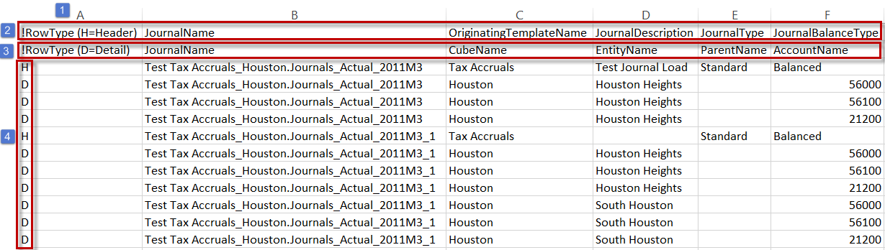

1. Column A Specifies Row Type In the first two rows of Column A, create two Row Type Parameters specifying the Header and the Detail. In the example above, !RowType (H=Header) and !RowType (D=Detail) are used to tag the corresponding rows with H or D identifying where the Header and Detail information is located in the CSV file. 2. Row One Specifies the Headers After the Header Parameter is configured, enter the Journal Column Headers. The required Journal Headers are JournalName, OrigniatingTemplateName, JournalDescription,JournalType, JournalBalanceType, IsSingleEntity, EntityMemberFilter, ConsName, WFProfileName, WFScenarioName, WFTimeName and CubeTimeName. For more details on these, refer to the Journal Excel Template. 3. Row Two Specifies the Details After the Detail Parameter is configured, enter the Journal Detail Headers. The required Journal Detail Headers are JournalName, CubeName, EntityName, ParentName, AccountName, FlowName, ICName, all UDNames, DebitAmount, CreditAmount, and LineDescription. For more details on these, refer to Journal Excel Template. 4. Header and Detail Tags The Journal data is driven by how each row in column A is tagged. Any rows tagged with H load as the Headers and any row tagged with D load as the details.

#### Loading Journal Details Via Workflow

After the template is configured, users can load it directly into OneStream during the Workflow

process. While the Journal Input type is selected, click the icon in the Journal toolbar. This lets you select the desired Excel or CSV template and load it into OneStream. After the file is loaded, the journal line items will appear in the journal and the user can save it to the Cube.

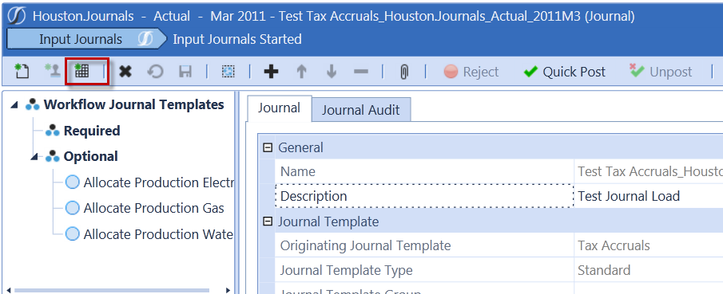

#### Extracting/Loading Journal Details Via BRApi

Users can export journal details into a CSV or XSLX file and load journals from a CSV or XSLX file by configuring an Extensibility Business Rule. This allows journal details to be extracted from one application and loaded into another. Users can also extract the journal, make changes, and re- load. Extract Journals to CSV Use BRApi.Journals.Data.ExportJournalstoCSV and define the session, filepath, Workflow Profile, Scenario, Time Filter, and Journal Status. BRApi.Journals.Data.ExportJournalsToCsv(si, filePath, "Houston", "Actual", "T#|WFYear|.Base", "Posted") Extract Journals to XSLX Export journals associated with defined parameters to an XSLX file using the ExportJournalsToXSLX BRApi. It is sometimes easier to read and modify journal data in an XSLX format as compared to CSV files that are generated by the ExportJournalsToCSV BRApi. Use the parameters listed in the following table.

|Parameter|Description|
|---|---|
|si|Session information|
|serverFilePath|Name and location to save the file|
|wfProfileName|Name of the Workflow Profile|
|wfScenarioName|Name of the Scenario|

|Parameter|Description|
|---|---|
|wfTimeMemberFilter|Filters workflow profile times. For example, if the scenario's Workflow Tracking Frequency is set to Quarterly, and Input Frequency is set to Monthly, the filter searches for journals associated with the Workflow Tracking Frequency. Time must be prefixed with T#. You can type a comma separated list of times such as T#2022H1, T#2022H2.|
|journalName|Filters journals that contain the specified text|
|journalStatus|Status of the journal. You can search by status or use All to return all statuses. You cannot type a comma separated list.|

The following code example uses the ExportJournalsToXslx BRApi:

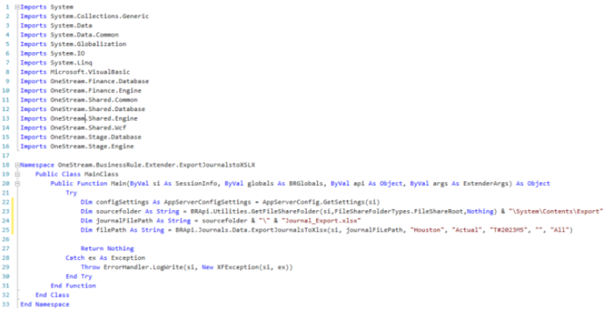

Load Example Use BRApi.Journals.Data.ImportAndProcessJournals and define the session, filepath, and journal tasks to complete upon loading the journal details. 'BRApi.Journals.Data.ImportAndProcessJournals(si, filePath, save, submit, approve, post, unpostAndOverwrite, throwOnError)

### Loading Cell Detail

#### Cell Detail Excel Template

When loading Cell Detail via Excel, a specific template must be created to determine the Cell Detail Dimension Tokens and each Cell Detail line data. OneStream reads this template using a specific Named Range which is explained later in this section. Ensure the following information is included in the Named Range. Dimension Tokens The first 19 rows of the Named Range in the Excel template must include the following token definitions:

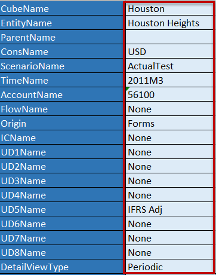

The Cube and each Dimension Member must be specified.  All User Defined Members must be specified. If a specific User Defined Member is not used in the application, enter None. Next, create the Dimension Tokens necessary to load each Cell Detail line. The specific tokens are as follows:

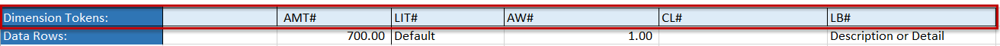

AMT# Amount LIT# Line Item Type AW# Aggregation Weight CL# Classification Type LB# Label allowing users to add a description or additional detail. After the Dimension Tokens are configured, enter the data in the corresponding column. The Dimensions can be in any order.

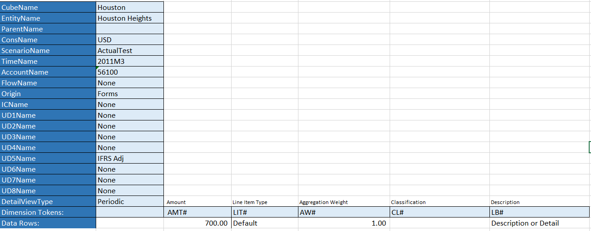

The final step is to create a Named Range beginning with XFC making sure to include the definition of Dimension token, and the data rows. The Named Range must begin with XFC for OneStream to read and load the Cell Detail correctly. Multiple XFC Named Ranges can be used across multiple tabs.

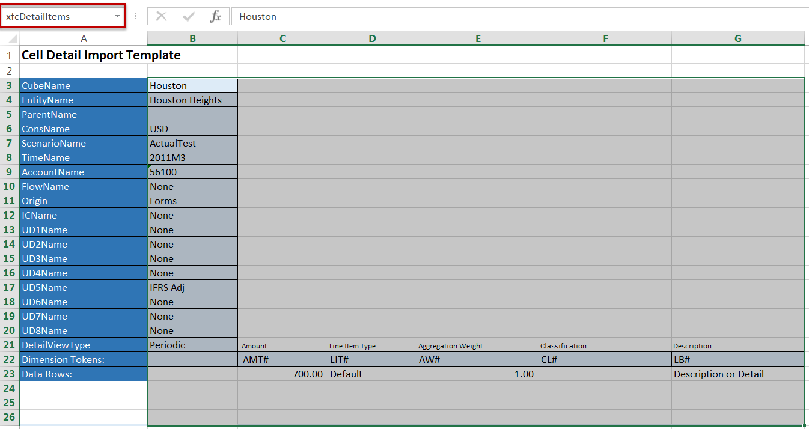

### Cell Detail CSV Template

To set up a CSV template for Cell Detail, the Header and Detail values must be specified.

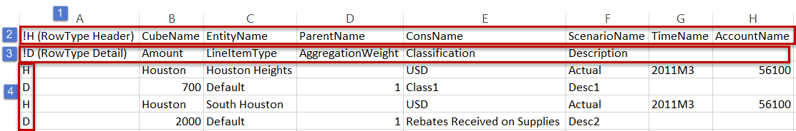

1. Column A Specifies Row Type In the first two rows of Column A, create two Row Type Parameters specifying the Header and the Detail. In the example above, !RowType (H=Header) and !RowType (D=Detail) are used to tag the corresponding rows with H or D identifying where the Header and Detail information is located in the CSV file. 2. Row One Specifies the Headers After the Header Parameter is configured, enter the Cell Detail column headers. The required Cell Detail Headers specify the Cube and all 18 Dimension Members. For more details on these, refer to Cell Detail Excel Template. 3. Row Two Specifies the Details After the Detail Parameter is configured, enter the Cell Detail detail headers. The required Detail Headers are Amount, LineItemType, AggregationWeight, Classification, and Description. For more details on these, refer to Cell Detail Excel Template. 4. Header and Detail Tags The Cell Detail’s data is driven by how each row in column A is tagged. Any rows tagged with H load as the Headers and any row tagged with D load as the details.

#### Loading Cell Detail Via Workflow

After the template is configured, users can load it directly into OneStream during the Workflow

process. While the Form Input type is selected, click the icon in the Form toolbar. This allows the user to select the desired Excel or CSV template and load it into OneStream. After the file is loaded, it has been successfully stored to the Cube.

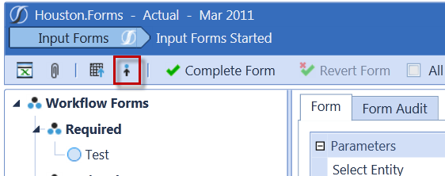

#### Extracting/Loading Cell Detail Via Business Rules

Users can export Cell Details into a CSV file and load Cell Details from a CSV file by configuring an Extensibility Business Rule. This allows Cell Detail to be extracted from one application and loaded into another. Users can also extract the Cell Detail, make changes, and re-load. Extract Use BRApi.Finance.Data.ExportCellDetailtoCSV and define the session, filepath, the Entity Dimension, the Entity Member Filter, the Scenario and the Time Member Filter. BRApi.Finance.Data.ExportCellDetailToCsv(si, filePath, entityDimensionName, entityMemberFilter, scenarioName, timeMemberFilter) Load Example Use BRApi.Finance.Data.ImportCellDetail and define the session and filepath. BRApi.Finance.Data.ImportCellDetail(si, filePath, throwOnError)

### Exporting Data Attachments

#### Exporting Data Attachments Via Business Rule

You can export data attachments to perform variety of actions such as retrieve the file name, read the contents, store them in a File Explorer folder, or import them into another application. This process is configured in an Extensibility Business Rule using the following API. Example: Dim objDataAttachmentList As DataAttachmentList = BRApi.Finance.Data. GetDataAttachments(si, memberScript, includeFileBytes)

#### Exporting Data Attachment Text

You can export the Data Attachment Text field to a CSV file using an Extensibility Business Rule. For example, use BRApi.Finance.Data.ExportCellTextToCSV and define the session, filepath, the Entity Dimension, the Entity Member Filter, the Scenario and the Time Member Filter. BRApi.Finance.Data.ExportCellTextToCsv(si, cellTextFilePath, entityDimensionName, entityMemberFilter, scenarioName, timeMemberFilter)

### Loading Excel Templates To Custom Tables

OneStream Solutions typically have related SQL Server tables. Other custom solutions may also include adding custom SQL Server tables. This allows users to load data to these custom tables using an Excel template. The mechanism for loading these tables could be through the user interface of a OneStream Solution or through OneStream Extensibility Rules. OneStream reads this template using a specific Named Range which is explained later in this section. Ensure the following information is included in the Named Range. In the first three rows of the Named Range in Column A, specify the following: Database Location Application or System specifies which database contains the custom tables. Table Name Custom tables only; enter the Table name Load Method The load method determines the action and any additional criteria for the action. The syntax is: Action:[Where Clause Criteria] (Where Clause Criteria is optional)

#### Load Method Definitions

Merge If there are no criteria, Merge updates the data if it finds a matching key, otherwise it inserts it Merge Where Clause Criteria Example First, this will clear the values for emp1 and then Merge Merge:[EmployeeID = ‘emp1’] Merge Where Clause Criteria with Substitution Variable Example Substitution Variables can be used in the Where Clause Criteria Merge:[WFProfileName = ‘|WFProfile|’] Replace If there are no criteria, Replace clears everything first.  By default, instead of merging, it clears the entire table. This will perform better for high volume because it does not try to match rows from the file to the table.  An error will occur if it finds a match. Replace Where Clause Criteria Example This does not try to locate, it only does inserts and appends. Replace:[EmployeeID = ‘emp1’] Replace Where Clause Criteria with Substitution Variable Example Replace:[WFProfileName = ‘|WFProfile|’] Next, define the Field Types and Field Names beginning in Column A Row 4 and spanning as many columns as necessary. The column definition syntax is: FieldType#:[FieldName]:StaticValue(optional):DefaultValue(optional) Field Type This relates to the column name in the table. xfGuid Unique identifier [SQL = uniqueidentifier] xfText Text defined column in the table [SQL = nvarchar, nchar, ntext] xfInt Short integer (4 byte integer) [SQL = int] xfBit 0,1 (True, False) [SQL = bit] xfDec Decimal [SQL = Decimal (28,9)] xfDbl Floating point number (8 byte floating) [SQL = Float] xfDateTime Date [SQL = datetime] Field Name This is specific to the SQL table to be loaded. StaticValue Whatever is specified as the Static Value will override every row for that column regardless if it is blank or not. StaticValueExample This example will override all rows and enter 50,000 as the Static Value. xfDec#:[Salary]:50,000 DefaultValue This only applies to blank rows.

> **Note:** If something is specified in the Static Value, it will ignore whatever is in the

DefaultValue. Default Value Example This example will enter a New Guid for all blank rows in the column. xfGuid#:[EmployeeID]::NewGuid Substitution Variable Example Substitution Variables can be used in both StaticValue and DefaultValue. xfText#:[EmployeeName]::|Username|

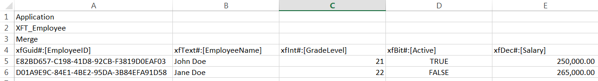

Finally, create a Named Range beginning with XFT making sure to include the entire template.

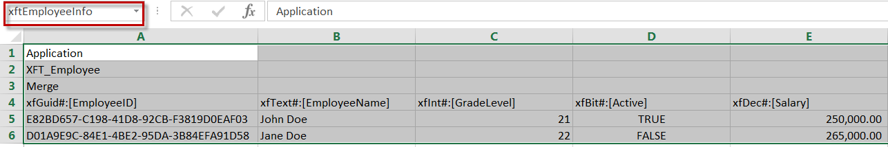

After the template is complete, it is ready to be loaded into the custom table.  If this is being used in conjunction with a OneStream Solution, refer to the Solution for further instructions on how to load the template to the table.  If this is being loaded via an Extensibility Business Rule, refer to the following example. Example Dim fieldTokens As New List(Of String) fieldTokens.Add("xfGuid#:[EmployeeID]::NewGuid") 'fieldTokens.Add("xfGuid#:[EmployeeID]") fieldTokens.Add("xfText#:[EmployeeName]") 'fieldTokens.Add("xfText#:[EmployeeName]::|Username|") fieldTokens.Add("xfInt#:[GradeLevel]") fieldTokens.Add("xfBit#:[Active]") fieldTokens.Add("xfDec#:[Salary]") fieldTokens.Add("xfDbl#:[VacationDays]") fieldTokens.Add("xfDateTime#:[HireDate]") BRApi.Utilities.LoadCustomTableUsingDelimitedFile(si, SourceDataOriginTypes.FromFileShare, filePath, Nothing, ",", dbLocation, tableName, loadMethod, fieldTokens, True)

### Importing Text-Based Data

To map cell text comments from a file into OneStream, here are a few tips to get started: 1. On the Cube’s Integration Tab, ensure that the TextValue field is enabled for the desired Scenario Type. This is needed to import the actual text. 2. Create a Data Source to import data for the Scenario Type.

|Col1|NOTE: TextValue is one of the mappable Dimensions.|
|---|---|

3. Hardcode the View Dimension to import to the Annotation Member, or one of the other View Dimension Comment Members such as VarianceExplanation. 4. Map the comment text to the TextValue Dimension. 5. There may not be an Amount to bring in but select a column that has a decimal value in each row and a comment and link the Data Source to that column. These numbers will come into the Stage but will not end up in the Cube because they are mapped to an Annotation-type View Member.

## Long Running Requests

Tasks that timeout can be resolved by OneStream Support. To contact OneStream Support, register https://www.onestream.com/support/. For additional information, see OneStream Web API Endpoints.
