# System Tools

There are a variety of system tools that can be used to manage the OneStream application. These tools include system business rules, database, tools that allow you to check the overall health of the application environment, and the File Explorer to name a few. In this section you will learn how to use these and other tools to manage the application system.

## System Business Rules

You can use System Extender Business Rules with Azure Server Sets for enhanced scalability at the Azure Database and Server Sets level. You can perform Server and eDTU scaling manually or using System Business Rules. If System Business Rules is selected as a Scaling Type, then a user-defined System Extender Business Rule determines if scaling is needed. You must implement the scaling function and return the proper scaling object by adding a System Extender Business Rule and assigning it appropriately. Under each Case statement, use these rules and related Args and BRApis to check the current Server Set capacity, query metrics about a Server Set or Azure Database, and identify the impact of the Server Sets volume or level of Azure Database deployed. See "Azure Database Connection Setting and Server Sets" in the Installation and Configuration Guide. Example starting point of empty System Extender Business Rule upon creation:

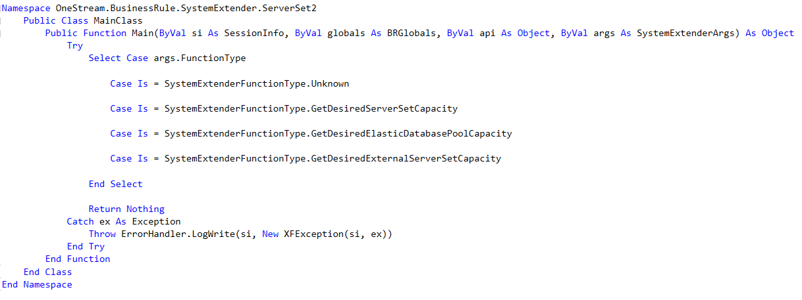

### Sample System Business Rule

Metric are passed to this function to help users determine if a server or database needs scaling. For server scaling, Environment metrics and Scale Set metrics are passed. For database scaling, Environment metrics and SQL Server Elastic Pool metrics are passed.

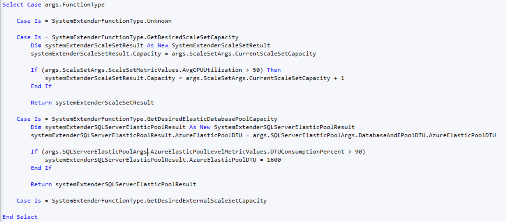

## Database

The Database screen allows System Administrators to view database tables and provides tools for managing stored data and other information. To view the Database screen, go to System > Tools > Database. Database Tables Go to Application Database > Tables or System Database > Tables to view all tables in the Application Database or System Database. This view provides read-only access to the data tables that can be used for debugging tasks that do not affect the database or system logs. Data tables that are imported through MarketPlace Solutions have their schema name added to the beginning of the database table name and replace dbo (for example, rcm.AccessGroup and txm.AccessGroup).

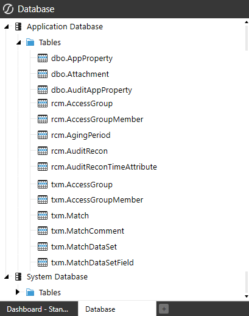

Tools Database Tools allow System Administrators to manage the database. Data Records Go to Application Database > Tools > Data Records to view data for the entire system. Filter the data using the member filter.

## Environment

This section can be used to check the overall health of the environment, which contains Web Servers, Mobile Web Servers, Application Server Sets and Database Servers. This will check the connection status as well as the configuration. The Environment page is designed to give both IT and power business users a way to manage and optimize their applications and the environment that is running under. Using the Environment page, the user can monitor the environment, isolate bottlenecks, look at properties and configuration changes, and scale in/out application servers and database resources if needed. They can also customize what data to collect in log files, save collection metrics files, and replay collected performance data in many ways. To access the Environment page, select System > Tools > Environment.

> **Note:** The Environment page is only accessible via the OneStream Windows App.

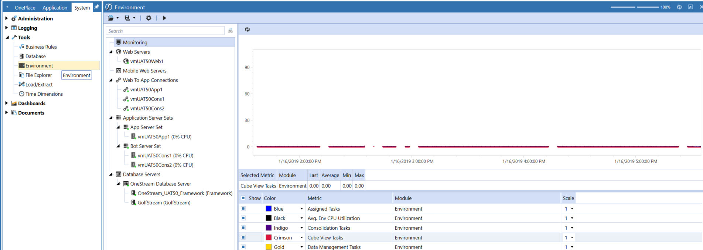

## Monitoring Environments

Instead of logging onto the server to collect metrics, use the Monitoring page to access real time Key Performance Indicators (KPIs) across an environment. Click System > Tools > Environment > Monitoring to: l Access user activity and interactive KPI graphs. l Track all system components that affect stability and performance. You can perform these tasks: l Open: Access a metrics and configuration setting file from the File System or a local folder. l Save As: Save metrics and configurations locally or in the File System. l Settings: Specify these types of KPI metrics to monitor and the monitor frequency: o Environment o Application Servers o Database Servers o Server Sets l Zoom into part of the chart to see running or queued activities.

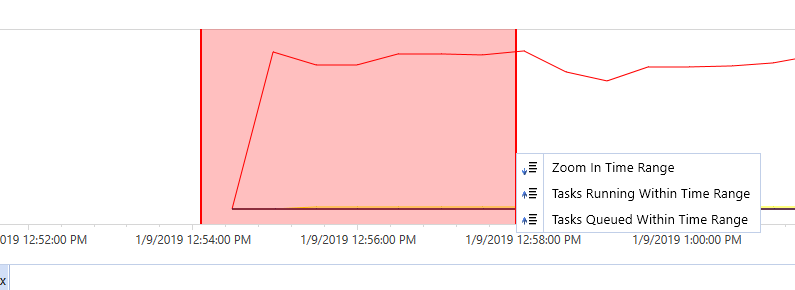

l Refresh Automatically Using a Timer: Retrieve metrics based on the Play Update Frequency interval setting.

### Specifying General Settings

l General Play Update Frequency (seconds): How often to update Performance charts. l Metric and Task Time Range: Indicate how much historical data to retrieve and depict on the Performance Chart. Applying a time range can help identify the cause of a server event or issue. l Y-Axis: If Auto Range box is selected, the system sets the range for the Min and Max values on the Y-Axis. If cleared, you can set the Min and Max ranges on the Y-Axis. l Secondary Y-Axis: Displays series of a different range of values, or different arguments (or values) in the same chart. Can be used when the numbers in a chart vary widely from data series to data series, or when there are mixed types of data.

### Specifying Monitoring Settings

l Monitoring(Server filter): Identify specific application or database servers to evaluate. l Filter Type: Specify the type of servers for which to collect metrics. l Source Filter: Use to filter the Source List. l Source List: Displays the servers that meet your criteria. l Result List: Displays selected Source List items for which to collect metrics.

### Specifying Metrics Settings

Metrics are collected based on the Metric Update Interval (seconds) setting in the Application Server Configuration utility. To minimize database access and maximize performance, some metrics are collected on every iteration, but some will skip iterations based on count settings defined for a metric.

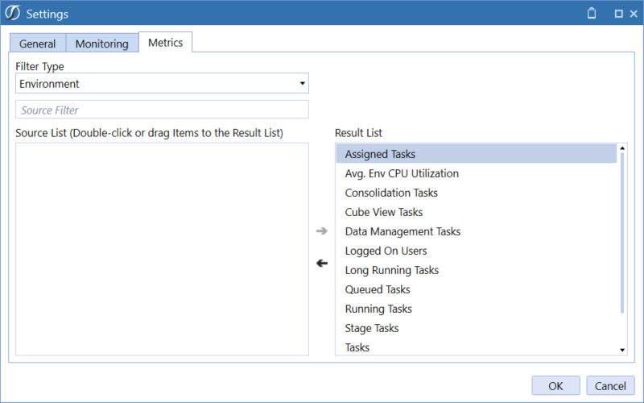

l Filter Type: Refine the types of application servers, database servers or server sets for which to collect metrics. l Source Filter: Use to filter the Source List. l Source List: Displays the list of filtered application servers, database servers or server sets. l Result List: Displays the items for which to collect metrics. These settings shown below in the Application Server Configuration File in Environment Monitoring, determine which metrics are collected and how often.

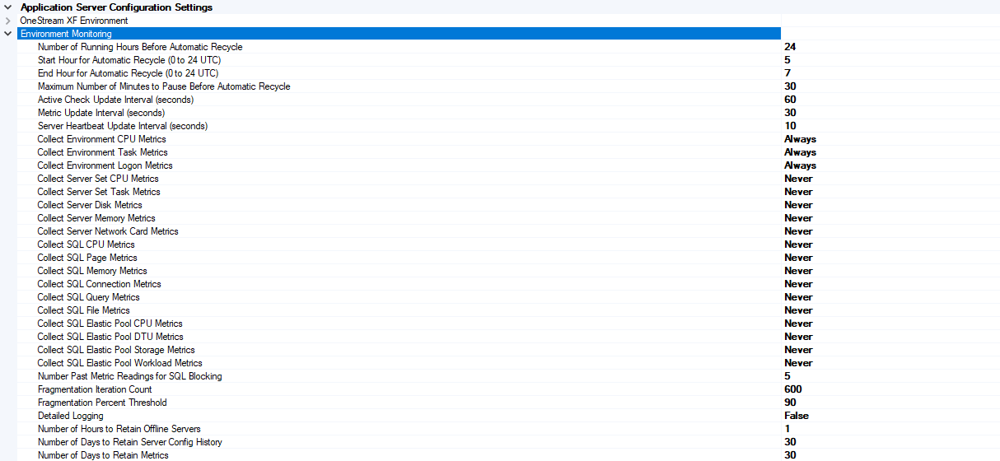

## Web Servers

This section lists all the web servers that are participating in that environment. Each web server will display its configuration and its audited setting.

### Configuration

Sample Web Server configuration settings:

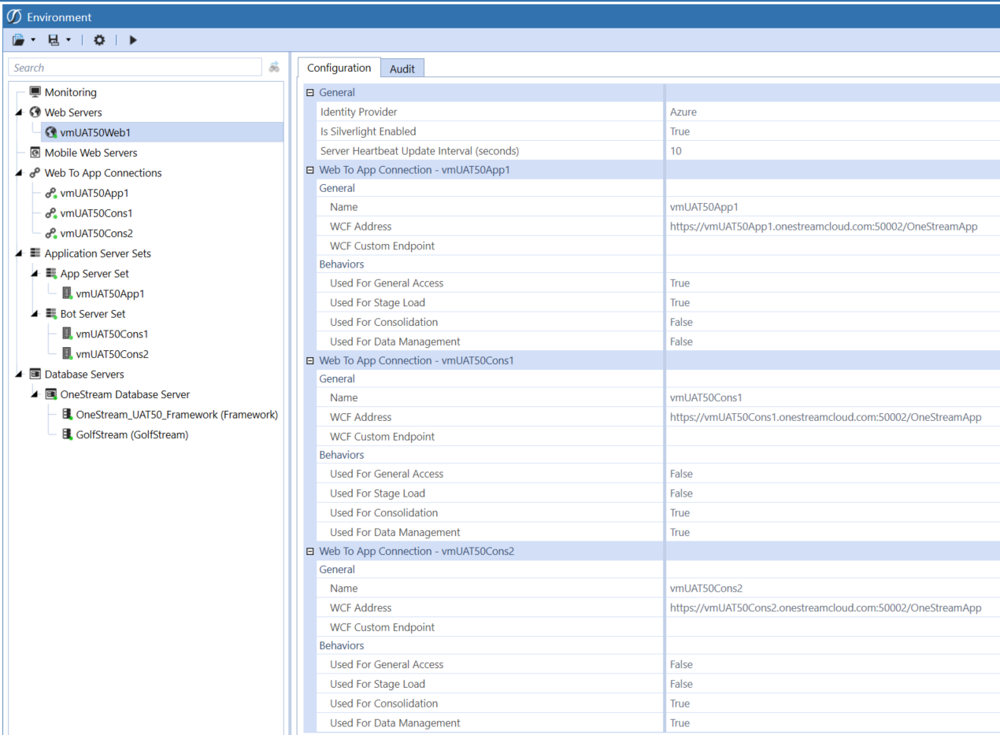

Identity Provider Displays single sign on identity provider if used. Server Heartbeat Update Interval (seconds) Used to specify how often each server updates its record that it is alive and responding to user input. Name This is the name of the server as it is defined in the web configuration file. WCF Address The full URL address of the server. WCF Connection This examines the status of the connection. Ok = connected Used for General Access This examines the web configuration file to see if it has this server configured as a general server. Settings are True or False. Used for Stage Load This examines the web configuration file to see if this server is configured as a Stage server. Settings are True or False. Used for Consolidation This examines the web configuration file to see if this server is configured as a consolidation server. Settings are True or False. Used For Data Management This examines the web configuration file to see if this server is configured as a Data Management server.  Settings are True or False.

### Audit

Sample Web Server audit setting:

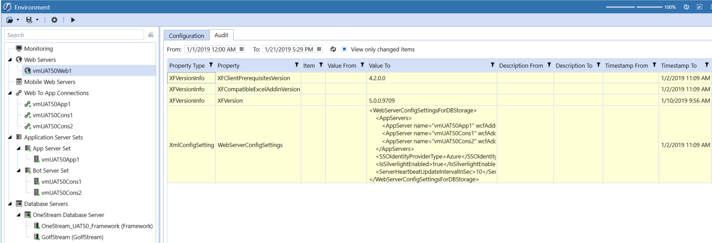

Property Type Type of server property in the hardware or software that was changed. Property Name The name of the property in the hardware or software that was changed. Value From Displays the original value of the property. Value To Displays the new value of the property. Description From Displays the original description of the setting if available. Description To Displays the new description of the setting if available. Timestamp From Displays the original date and time of the setting if available. Timestamp To Displays the new date and time of the setting. User From Displays the original user name if available. User To Displays the user name of the person that made the change if available.

## Mobile Web Servers

Similar to web server, the mobile web servers list all the web servers that are included in that environment. It pulls the information from the ServerHeartBeat table in the Framework database.

### Sample Mobile Web Server Configuration

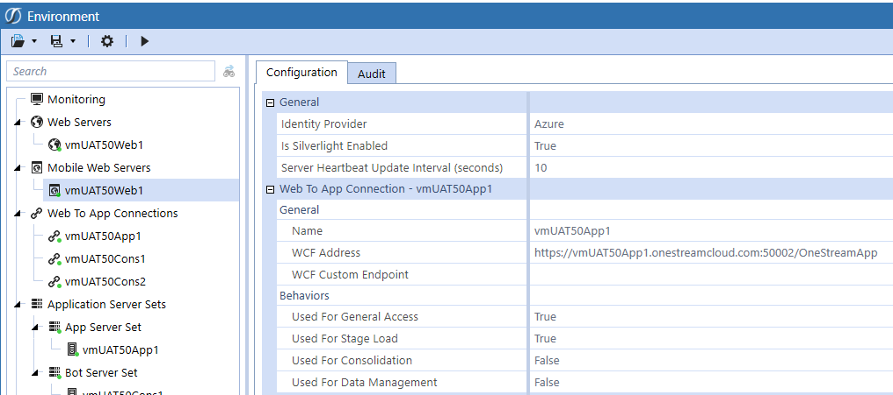

### Sample Mobile Web Server Audit

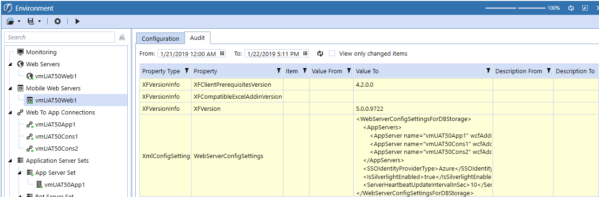

## Webto App Server Connections

This section will list all the combined connections from the web server configuration files to all the application servers. From here the user can pause and then resume a specific connection to an application server or a load balancer (a load balancer could point to a multiple application server). See Installation and Configuration Guide. Sample Web to App connection configuration:

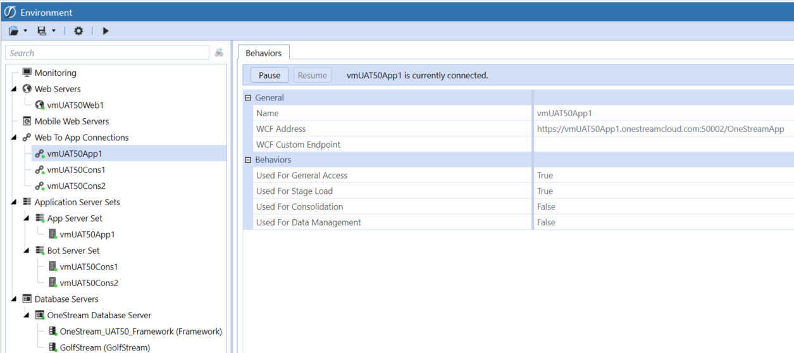

Pause Used to pause any request to a WCF Address connection. This connection could be either an Application Sever or a Load Balancer. This can be set in the web configuration file. Resume Used to Resume any request to a WCF Address connection. This connection could be either an Application Sever or a Load Balancer. This can be set in the web configuration file. Name This is the name of the server as it is defined in the web configuration file. WCF Address The full URL address of the server. WCF Connection This examines the status of the connection. Ok = connected Used for General Access This examines the web configuration file to see if it has this server configured as a general server. Settings are True or False. Used for Stage Load This examines the web configuration file to see if this server is configured as a Stage server. Settings are True or False. Used for Consolidation This examines the web configuration file to see if this server is configured as a consolidation server. Settings are True or False. Used for Data Management This examines the web configuration file to see if this server is configured as a Data Management server. Settings are True or False.

## Working With Application Server Sets

Click Application Server Sets to view the server sets participating in an environment. Sets display based on the Server Set configuration in the Application Server Configuration Utility. A red “X” indicates offline servers. You can access configurations for each sever set and server in a server set. If a Server is hosted on Azure, you can Scale Out/ and Scale In the Scale Set manually or using a System Business Rule. Sample Application Server Set:

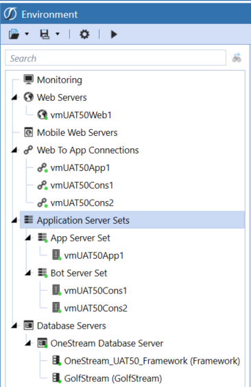

### Accessing Server Sets Behaviors

Use the Behavior tab to view the capability of a Server Set. You can Scale Out (remove) and Scale In (add and configure) if the Scaling Type setting is set to Manual or ManualAndBusinessRule in the Server Configuration Utility file. This enables you to expand or contract server resources manually or automatically. For scaling with Azure, select Server Sets > Azure > Scaling Type. This feature will be available in a future release.

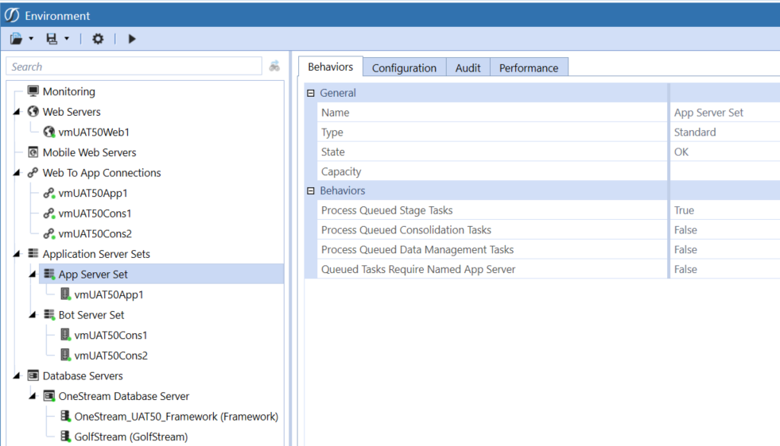

You can specify the following settings at the Server Set level using the Server Configuration Utility, but can override them at the individual Application Server level. l Process Queued Consolidation Tasks: If true, the server can processes consolidation tasks. l Process Queued Data Management Tasks: If true, the server can process data management tasks. l Process Queued Stage Tasks: If true, the server can process stage tasks. l Queued Tasks Require Named Application Server: If true, the server only runs assigned tasks.

### Server Sets Configuration

Use the Configuration tab to view Server Set configurations defined with the Application Server Configuration Utility. For example:

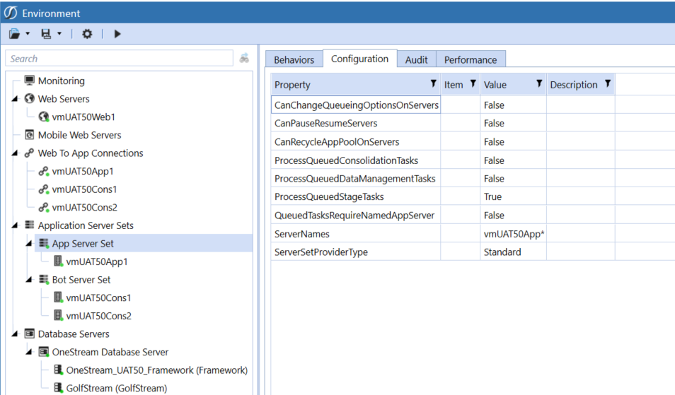

l Azure Resource Group Name: (Azure Scale Set Only) The resource group name for the set. l Azure Scale Set Name: (Azure Scale Set Only) The scale set name in the resource group. l Can Change Queuing Options On Servers: If true, Administrators can change the queuing behavior - impacting stage, consolidation and data management tasks - of specific servers. l Can Pause or Resume Servers: If set to true, then the user can pause and/or resume the server from the Environment page via the Pause and Resume buttons. l Can Stop or Start Servers (Azure Scale Set Only): If true, users can stop / restart the server on the Environment page. l Maximum | MinimumCapacity (Azure Scale Set Only): A fail-safe setting to identify the maximum | minimum number of servers. l Process Queued Consolidation Tasks: If true, the server can process consolidation tasks. l Process Queued <feature> Tasks: If true, the server can process tasks such as data management and state tasks. l Queued Tasks Require Named Application Server: If true, the server only runs its assigned tasks. l Server Names for Standard Server Sets (Supports *? Wildcards): Specify server names if the standard server set type is used. l Server Set Provider Type: Specify the external authentication provider used, such as Azure. l System Business Rule Name (Azure Scale Set Only): The name of the extender business rule for Azure scale set and database scaling.

### Using Server Sets Audit

The Audit tab identifies all property changes made in XFAppServerConfig.xml. Changes display in yellow. For example:

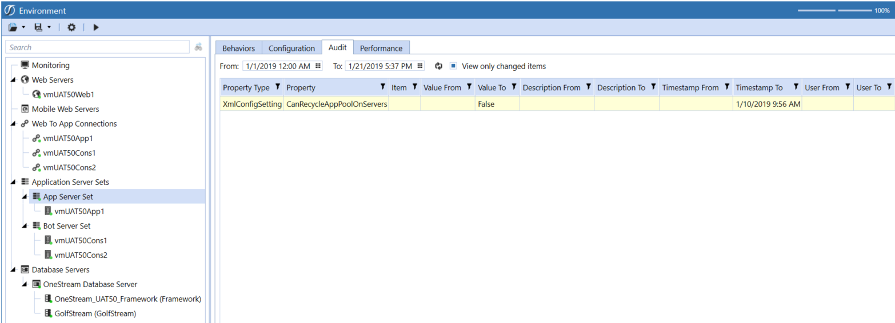

### Monitoring Server Sets Performance

Use the Performance tab to view scale set and environment metrics, highlighting sections to drill down to time-specific records.

## Application Server Behavior

When selected, the user can pause and resume that server, so that none of the long duration tasks can be run on that particular server. Also, IIS can be recycled by selecting the Recycle App Pool button. Whether these buttons appear or not is based on settings in the OneStream Server Configuration Utility.

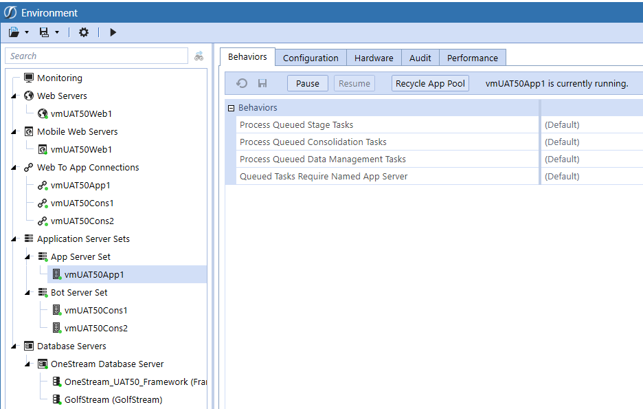

Pause Pause will stop the server from seeking more tasks to run from the queue but will let tasks that have already started, finish. Resume Server will resume accepting tasks from the queue. Recycle App Pool Used to recycle the specific server's application pool (reset IIS). Stop - (Azure Scale Set Only) Stops the server, but while in this state will continue to incur Azure compute charges. The public and internal will be preserved. Stop (Deallocate)- (Azure Scale Set Only) Stopping this way will mean the cost of virtual machine will not be charged, but the public and internal IP will be deleted.

### Application Server Configurations

This tab will display the server configurations from the OneStream Server Configuration Utility pertaining to that server.

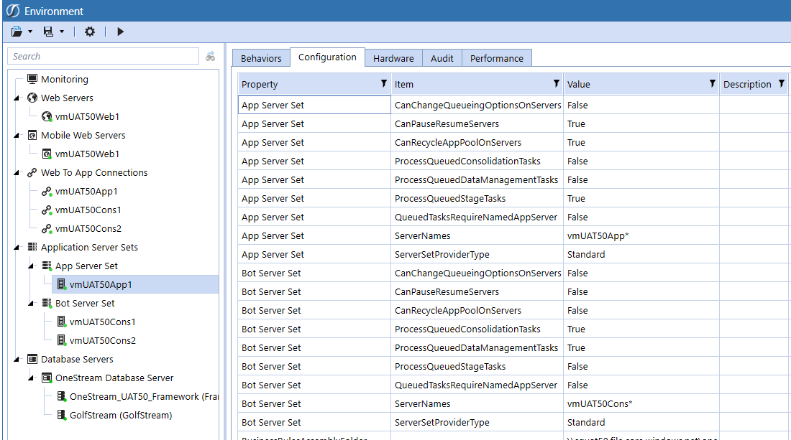

### Application Server Hardware

This tab will show the machine hardware information based on settings in the OneStream Server Configuration Utility.

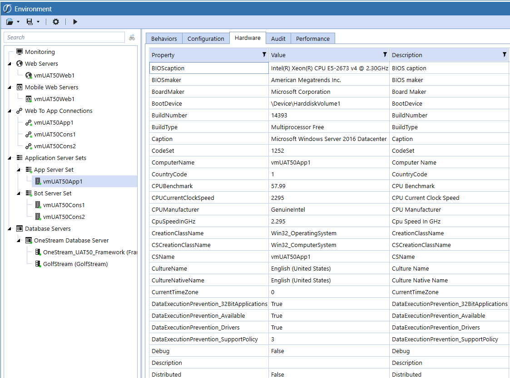

### Application Server Audit

The audit tab will keep track and display any hardware and configuration changes.

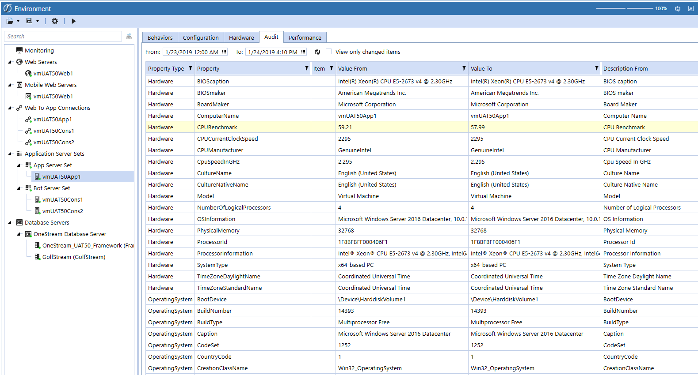

### Application Server Performance

This tab will display metric values pertaining to that server and the Environment.

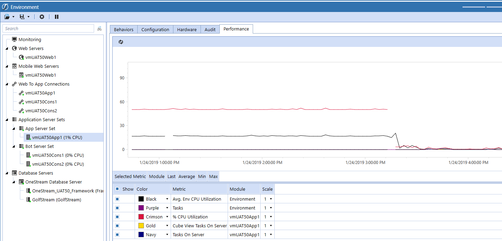

## Database Servers (Connection Items)

The Database Servers section will list all the database connections based on settings in the OneStream Server Configuration Utility and all the databases that each connection is pointing to. From the database connection items, the user can expand the SQL server elastic pool if one is configured, view hardware and server properties, view audit info, look at SQL server metrics, and run some diagnostic commands to track down performance issues.

### Behaviors

Sample database connection Behavior tab:

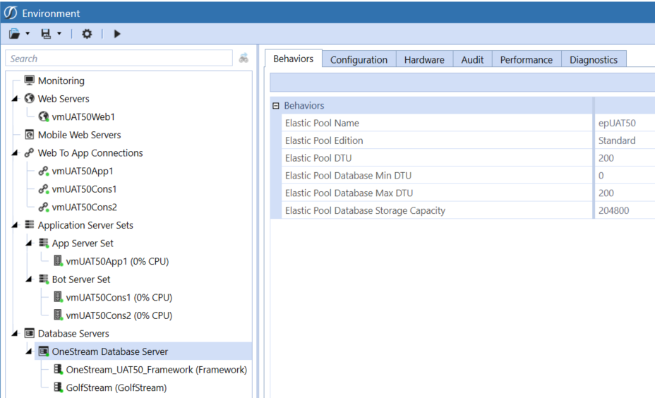

The behavior will show up if SQL Server Azure and Elastic Pool are configured and used. Using the Behavior tab, you can increase or decrease the resources available to an Elastic Pool based on resource needs. When rescaling Elastic Pool DTUs, database connections are briefly dropped. This is the same behavior as occurs when rescaling Elastic Pool DTUs for a single database (not in a pool).

### Configuration

The configuration tab will display SQL server configuration properties. Sample configuration properties:

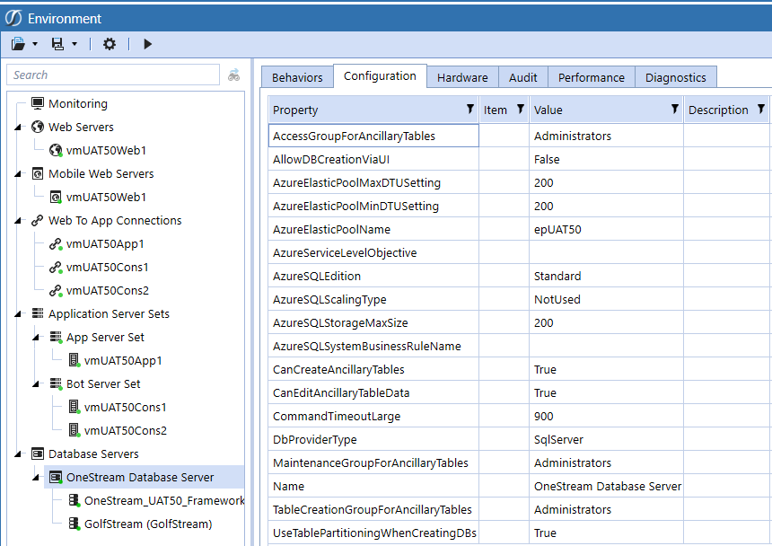

### Hardware

The hardware tab will display hardware related information pertaining to SQL server. Sample hardware properties:

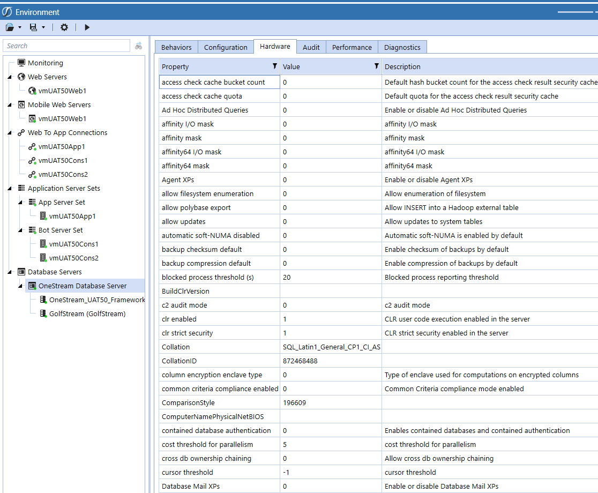

### Audit

The audit tab will display any changes to the SQL Server properties. Sample configuration audit report:

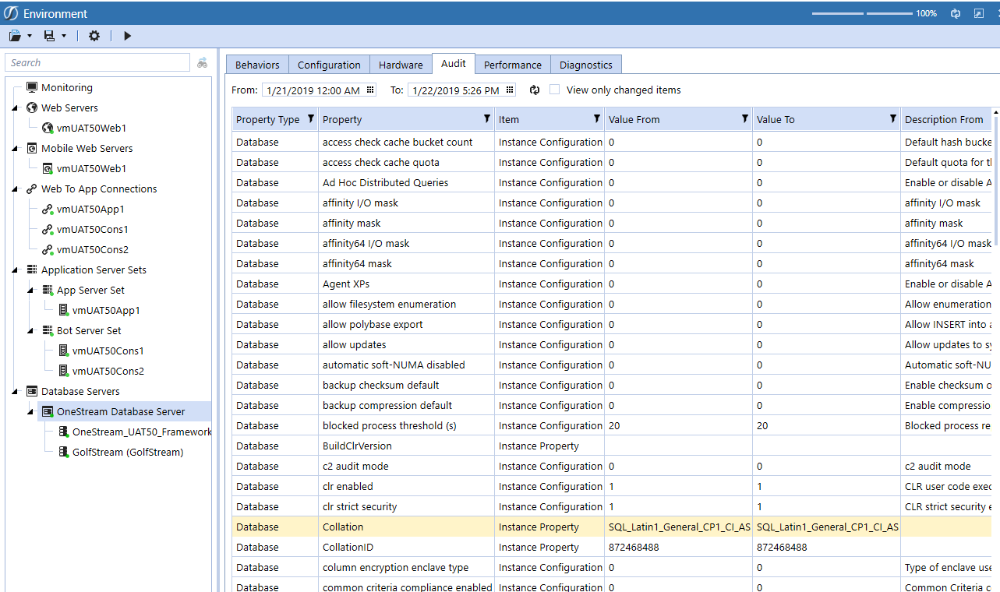

### Performance

The Performance tab will display metrics pertaining to SQL Server:

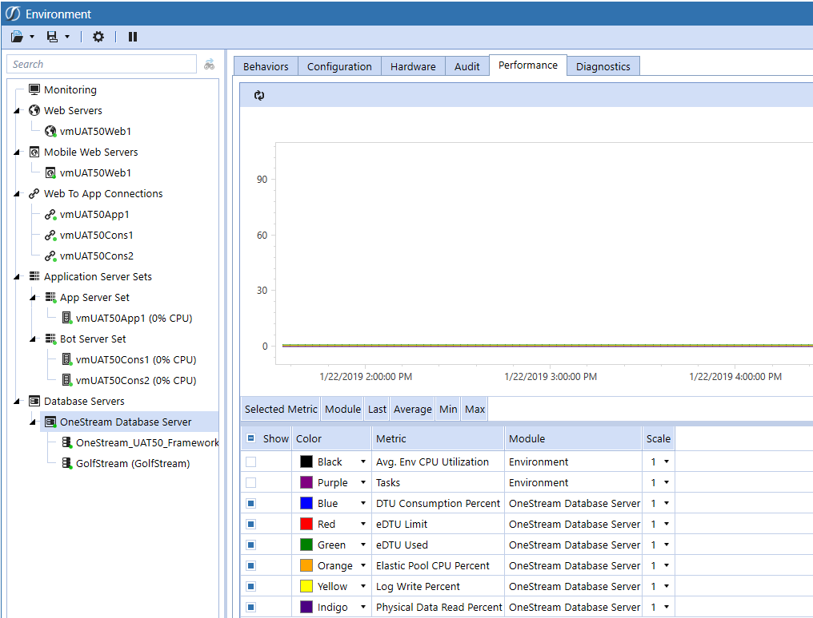

### Diagnostics

The Diagnostics tab allows the user to run SQL diagnostic commands to determine performance issue on the database instance.

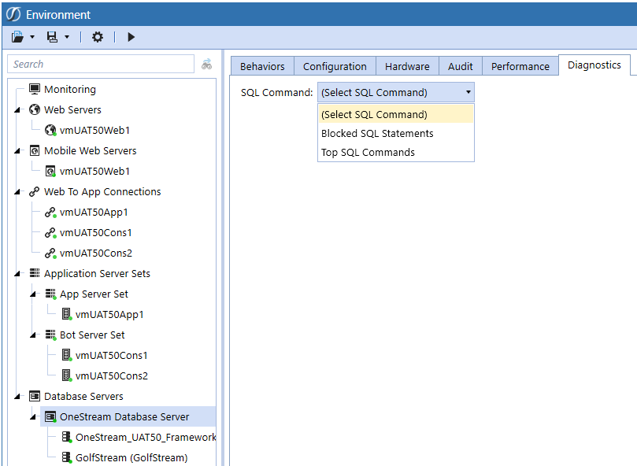

l SQL Deadlock information. l The Deadlock SQL command will list out any deadlocks if any on the SQL server instance. l Top SQL Commands will list out the top number of SQL using the order select by the user (Total Logical Reads, Total Logical Writes, Total Worker Time)

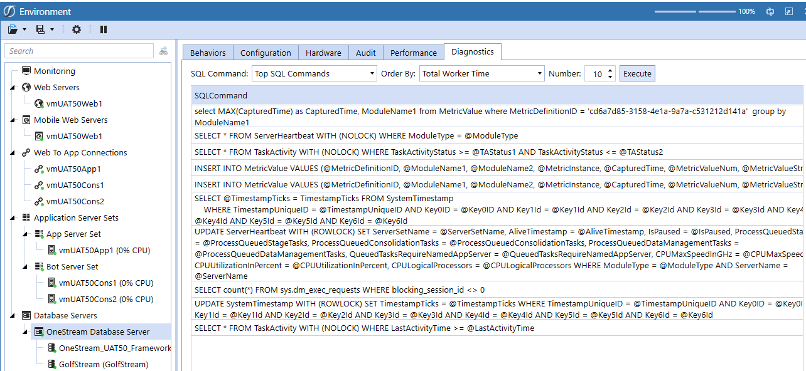

## OneStream Database Servers (Schema

Items) This section will list all the database schemas that this connection is pointing to. Each schema has its own configurations, audit and diagnostic tabs.

### Configuration

The Configuration tab contains the application-specific information:

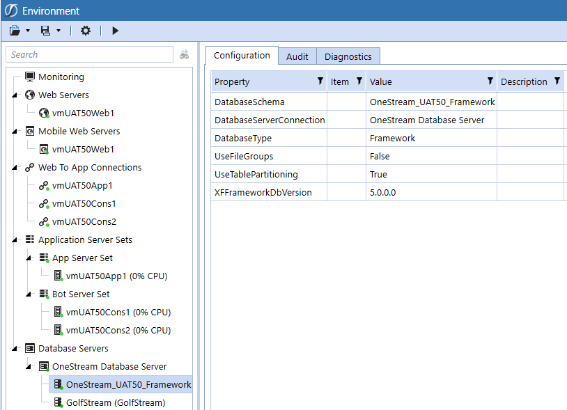

### Audit

The audit tab will show if any of the application configuration has been changed.

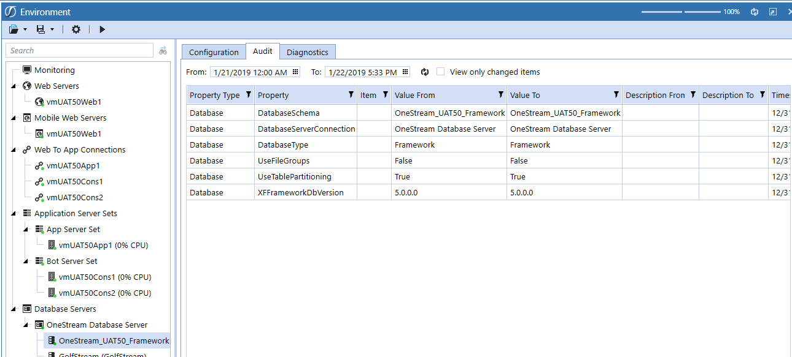

### Diagnostic

Diagnostics tab will show a report of current schema table fragmentation. Sample of table fragmentation on the framework DB showing all tables beyond 70% fragmented:

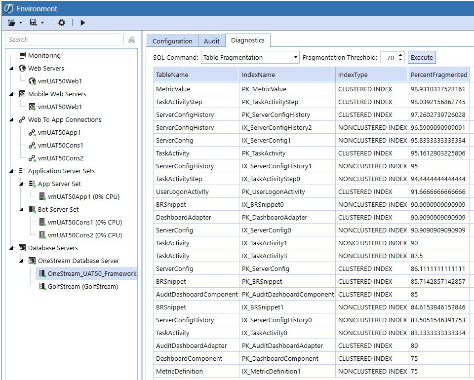

## Azure Configurations

(Azure Only or if Azure Elastic Pool Being Used)

### Azure Subscription Settings

The Azure Subscription Settings must be filled in, as they are used to login and retrieve Azure settings and data. This section will should be populated when using Azure Elastic Pool or if using Scale Sets (which is a feature that will available in a future release).

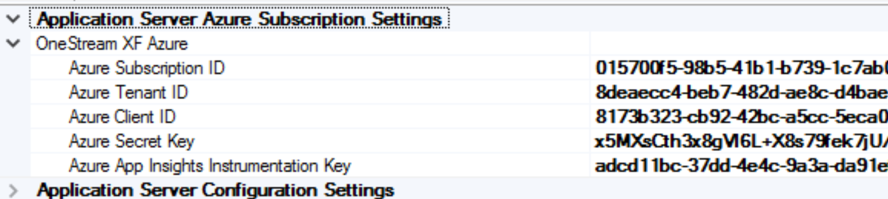

### Environment Monitoring

The Environment Monitoring section configures how and how often metrics are collected. What is available for metrics or monitoring is based on configurations made in the OneStream Server Configuration Utility. See Installation and Configuration Guide.

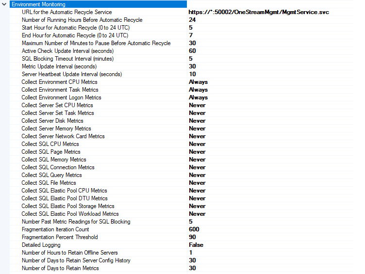

URL for the Automatic Recycle Service Used to specify the address of the recycle management service. The protocol for the address should be set to however the service is deployed (https or http) and the port (default is 50002). The asterisk will force the service to use the fully qualified domain name of the executing server. Number of Running Hours Before Automatic Recycle Used to specify how often the app servers should be restarted. The default is 24.0. Use 0.0 to turn off auto recycling. Fractional numbers may be used in this setting. Start Hour for Automatic Recycle (0 to 24 UTC) Used to specify the time period within each day that the server can be recycled. This setting is only used if Number of Running Hours Before Automatic Recycle is set to 24.0. The default setting is 5. With that value, the application servers will be recycled between 5:00am UTC and what the setting for the End Hour for Automatic Recycle is set to. End Hour for Automatic Recycle (0 to 24 UTC) Used to specify the time period within each day that the server can be recycled. This setting is only used if Number of Running Hours Before Automatic Recycle is set to 24.0. The default setting is 7. With that value, the application servers will be recycled between 7:00am UTC and what the setting for the Start Hour for Automatic Recycle is set to. Maximum Number of Minutes to Pause Before Automatic Recycle Used to specify the maximum number of minutes that the server should pause its ability to run newly queued tasks before recycling. The default setting is 30. This setting is the time period that the server will use to allow previously started tasks to finish. If there are no previously running tasks on the application server, the setting is ignored. Active Check Update Interval (seconds) How often system checks for system monitoring (i.e.; deadlocks ...) Metric Update Interval (seconds) How often system checks for metric updates. Server Heartbeat Update Interval (seconds) How often system updates that this server is alive. Collect Environment CPU Metrics How often to collect environment CPU metrics. Collect Environment Task Metrics How often to collect environment task metrics (i.e.; running tasks, Queued Tasks …) Collect Environment Login Metrics How often to collect environment user login metrics. Collect Server Set CPU Metrics How often to collect server set CPU metrics. Collect Server Set Task Metrics How often to collect server set task metrics (i.e.; running tasks, Queued Tasks …). Collect Server Disk Metrics How often to collect server disk metrics (i.e.; Average Disk read/write per sec…). Collect Server Memory Metrics How often to collect server memory metrics (i.e.; Available MBytes…). Collect Server Network Card Metrics How often to collect server network card metrics. Collect SQL CPU Metrics How often to collect SQL server CPU metrics. Collect SQL Page Metrics How often to collect SQL server Page caching metrics (i.e.; Page Life Expectancy…). Collect SQL Memory Metrics How often to collect SQL server CPU metrics. Collect SQL Connection Metrics How often to collect SQL server connection metrics (i.e.; Number of connections…). Collect SQL Query Metrics How often to collect SQL server Query metrics (i.e.; Number of Deletes/Inserts…). Collect SQL File Metrics How often to collect SQL server File growth metrics. Collect SQL Elastic Pool CPU Metrics How often to collect SQL server Elastic Pool CPU metrics (i.e.; Number of connections…). Collect SQL Elastic Pool DTU Metrics How often to collect SQL server Elastic Pool DTU metrics (i.e.; Number of connections…). Collect SQL Elastic Pool Storage Metrics How often to collect SQL server Elastic Pool Storage metrics (i.e.; disk storage usage…). Collect SQL Elastic Pool Workload Metrics How often to collect SQL server Elastic Pool Workload metrics. Number Past Metric Readings for SQL Blocking Used to select the past number of metric values for blocking analysis. Fragmentation Iteration Count Used for fragmentation check, every 10 hours if the ActiveCheckUpdateIntervalInSec is set to 60. Fragmentation Percent Threshold Used for fragmentation threshold check in percent. Detailed Logging If true, then log whenever we enter and exit the metric collection and the Active System check. Number Hours To Retain Offline Servers Remove offline servers from the heartbeat table after certain number of hours.

### Task Load Balancing

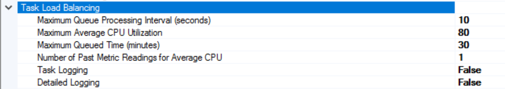

Maximum Queued Processing Interval (seconds) How often the queuing thread checks for new tasks to be run. Number Past Metric Reading For Analysis How many metric readings to retrieve for analyzing server demand. Maximum Queued Time (minutes) Maximum time to wait for a task to run before it is cancelled. Maximum Average CPU Utilization Maximum average CPU utilization before we determine that a server can't take a task. Task Logging Only If true will only logs picked up tasks. Detailed Logging If true, then log whenever we enter and exit the Task Load Balancing function and what was run.

### Database Server Connection

The Azure section in the Database Connection Settings needs to be completed only if Azure database and/or Azure Elastic pool is used.

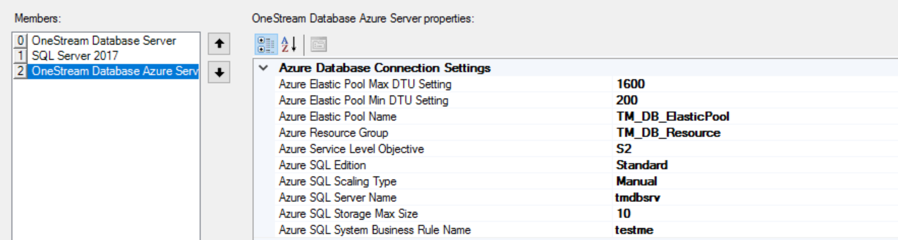

Sample Azure database connection settings: Azure Elastic Pool Max DTU Setting This is a fail-safe setting that the user can’t set the DTU setting above this point. Azure Elastic Pool Min DTU Setting This is a fail-safe setting that the user can’t set the DTU setting below this point. Elastic Pool Name The name of the elastic pool used with this database connection. Azure Resource Group The resource group name that the elastic pool is in. Azure Service Level Objective The service level used. This setting is used to create application on Azure. Azure SQL Edition The Azure SQL Server edition used. Azure SQL Scaling Type Manual, Business Rule or ManualAndBusiness Rule. The is used to set the type of scaling that is used to Scale Out or Scale In the SQL Server eDTUs. The default setting should be set to Not Used. Azure SQL Server Name The name of the SQL Server. This setting is used to create application on Azure. Azure SQL Storage Max Size This is used to specify the database storage size when creating a database on AZURE. Azure SQL System Business Rule Name If SQL Scaling Type is set to BusinessRule, this setting must be set to a business rule that is used to scale in/out.  The Environment metrics and the database metrics are passed to this rule to properly determine the eDTU scaling.

### Azure Server Sets Settings

This setting is used to set up the used scale sets for the different application servers:

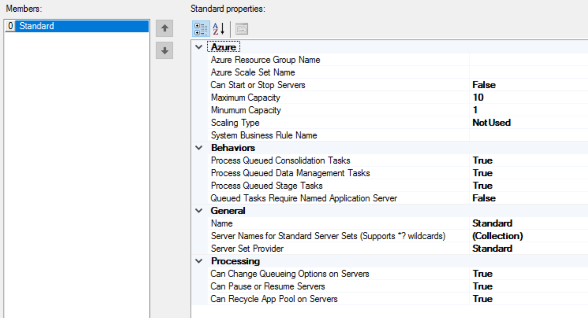

The Azure section is used to set the Azure resource group name and the scale set name as it exists on Azure. The Scaling options are used to set the scaling capacity and the Scaling Type (e.g. Manual or BusinessRule).  The System Business Rule Name must be set if the Scaling Type is set to Business Rule. The Behaviors section is used determine how this scale set is used.  Whether it can be called by the web server or it is used as a processing server for consolidations and Stage Load. The General section is used to determine whether this scale set is used and who is its provider (i.e.; Azure, External …).

## File Explorer

Documents and saved Point of View settings can be stored in the Application database.

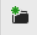

Create a new folder in the File Explorer

Upload a specific file into any folder. If a user has Administrator rights or is in the ManageFileShare security role, he/she can upload and delete files in the Harvest folder. A common Cube Point of View can be stored for continued reuse by multiple users. The POV can be stored for all users in the Public area or for the specific user in the User directory. To create a saved, named POV, right click the Cube POV node under Point of View within the Context Pane:

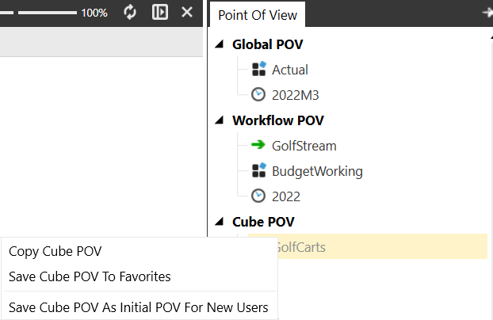

## File Share

File Share is a self-service directory which supports file storage external from the OneStreamApplication and System Databases. Files stored in an Incoming folder are accessible only through that Workflow Profile.

To access File Share, click the File Explorer button in the toolbar, or navigate to System >Tools > File Explorer. toolbar.

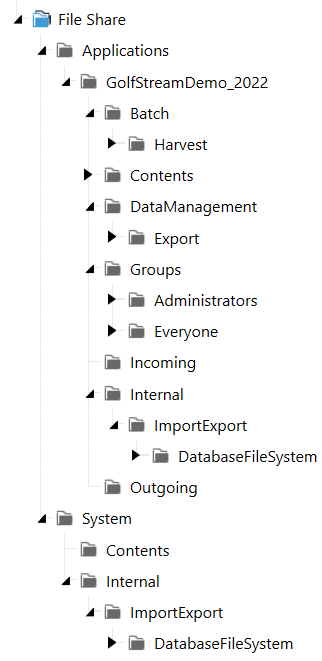

### Folders

#### Contents Folders

Both the Application and System folders contain an auto-generated folder named Contents intended to store files larger than 300 MB. This folder is a secureable storage area that can be used in place of the File Explorer application database.

#### Permissions

The Contents folders are managed and secured by System Security Roles. To set System Security Roles, navigate to System > Security > System Security Roles: l Administrator and ManageFileShare Roles have full rights. l Non-Administrators can be assigned rights to modify, fully access, or have limited access to the Content folders.

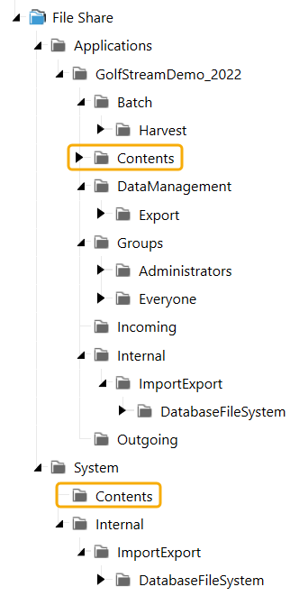

#### Application Folders

This folder has application specific storage.

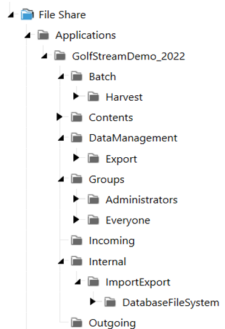

Batch and Harvest These folders are used for automation of Connector Data Loads. When the Harvest folder loads a file, it is automatically cleared and an archive folder with a copy of the loaded file is created. To add or delete files from the Harvest folder, you must have Administration rights or have the ManageFileShare security role.

> **Note:** The archive folder and the files within it can be cleared using Data Import

Schedule Manager. Content See Content Folders. Data Management This is the default folder for the data management export process. Groups This folder is used for dashboard components with a File Source Type of File Share to allow viewing by Security. The file is placed in one of the folders under \\MyServerName\OneStreamShare\Applications\MyApplicationName\Groups and then placed into a folder with the same name as a User Group. The user must have permissions to that User Group to view the file. See Content Components.

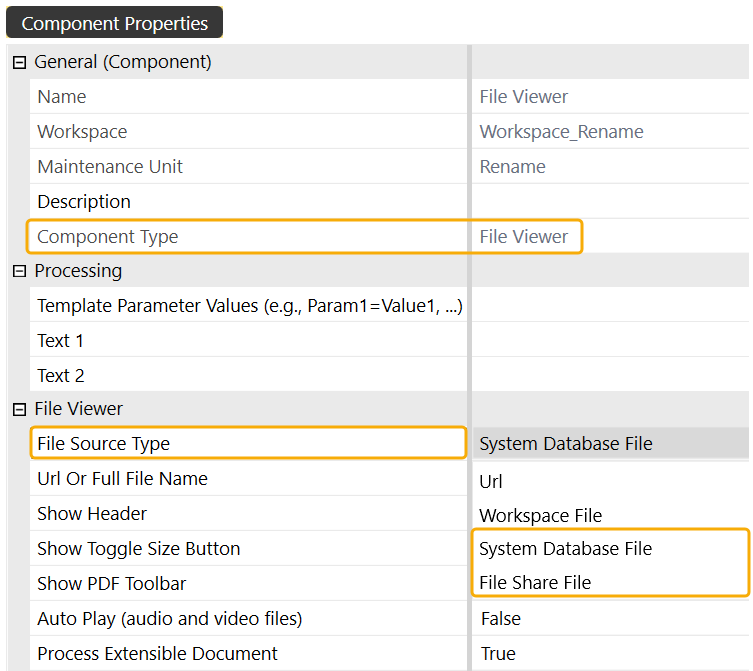

Incoming This folder is used as a location to place source files for import into Stage. It is also used for the File Viewer Component. During an Import Load step, click Load and Transform > Select Server File. Click the ellipses to display source files placed in the Import folder. See File Viewer. Internal This folder stores the contents of the Application Database files or System Database files.

These icons enable users to export this content to File Share.

> **Note:** To access the File Share export and import options, the user must be granted

rights to the SystemPane role and the FileExplorerPage role. When granted these rights, go to System > Tools > File Explorer and the icons will display in the toolbar. Outgoing This folder is available for use in customized processes that require a defined folder location.

#### System Folders

This folder has system specific storage.

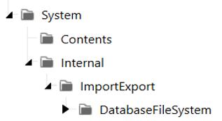

Content See Content Folders. Internal This folder exports from System Database.

### Uploads

By default, authorized users can upload or edit files or folders in the File Share using the OneStream File Explorer (required to use Content folder). To change this setting so no users have upload, edit file, or edit folder access to the File Share using the OneStream File Explorer, contact OneStream support. Normal access rules apply for browsing files and folders in the File System section. Users will receive a Security error when attempting to write or edit the files and folders while attempting to use API or non File Explorer methods.

### Supported File Sizes

The OneStream File Explorer can be used as an application interface to the File Explorer’s Content folders. The supported file size varies by interface. Windows Application l Uploads (Applications and System): Up to 300 MB l Uploads (Content): Up to 2 GB l Downloads (Application and System): Up to 2 GB l Downloads (Content): Up to 2 GB

## Whitelist File Extensions

Whitelist File Extensions provide a method of identifying which kinds of documents, according to their file extensions, are allowed to be saved into the OneStream application File Explorer. Whitelisting extensions helps to alleviate the risk of uploading malicious file types into the application.

### Overview

OneStream lets you save documents or upload documents from your device into the application. These documents are stored in one of three file storage root folders: l Application Database: Displays stored documents for the current application only. l System Database: Displays stored documents for the entire system without affecting the current application. l File Share: This is a self-service directory that temporarily stores files before they are imported into the Application or System Database. File Explorer is the product tool inside the Windows Application that lets you browse saved documents or upload new ones. For example, a spreadsheet can be saved to any of the three root folders. A Cube POV can be saved to either the application or system folders.

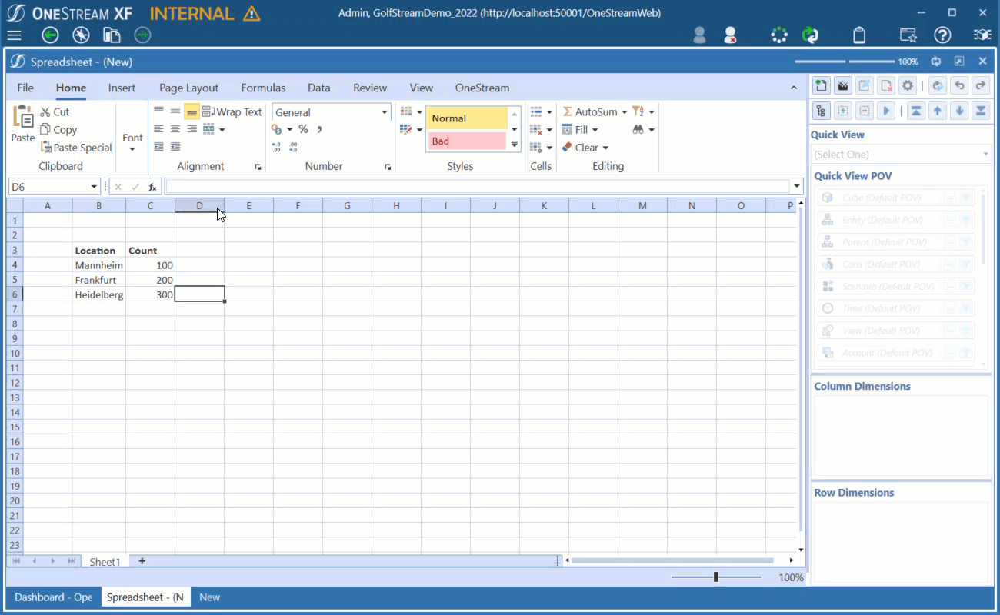

A Cube POV can be saved to either the application or system folders.

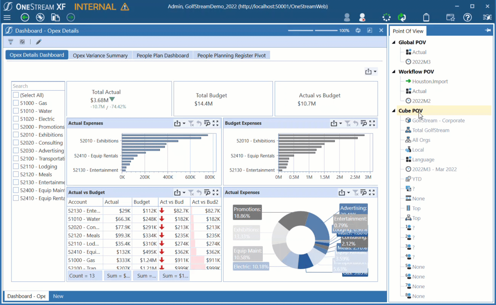

File Explorer is available from the main toolbar.

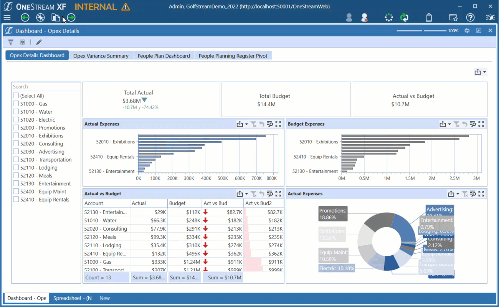

File Explorer is also available on the System tab.

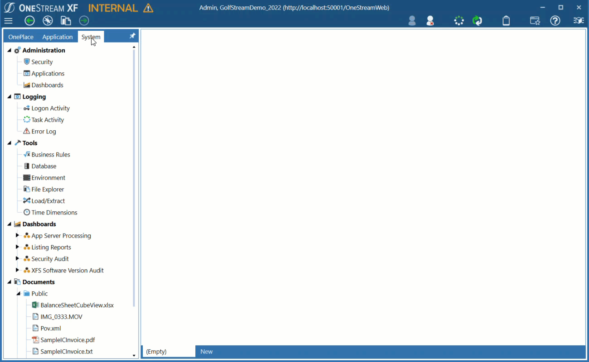

The Dashboard component “File Viewer” also launches the File Explorer component.

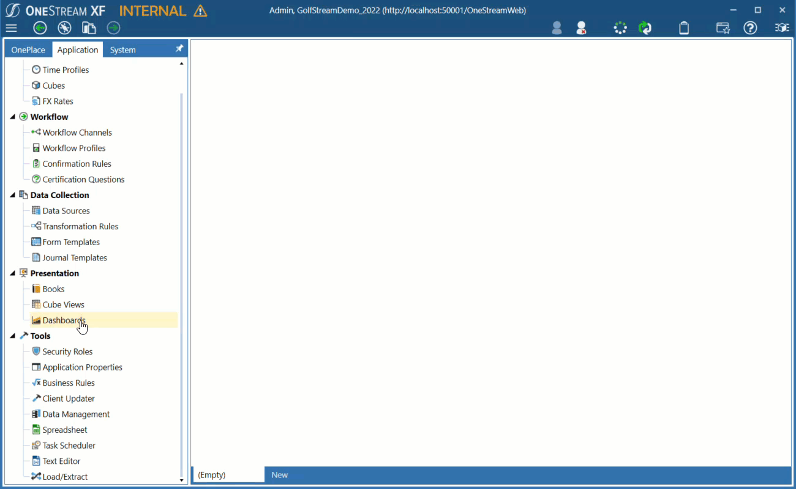

Finally, there is a BRAPI used by OneStream Solutions or custom-developed dashboards to upload documents.

### Whitelist Files Extensions Prerequisites

Standard File Explorer setup and security.

### Define The List Of File Extensions

Whilelisted file extensions must be specified in the OneStream Application Server Configuration file. To enable the whitelist and define allowed file extensions: 1. Go to Start > OneStream Software > OneStream Server Configuration Utility, right- click and select Run as Administrator. 2. On the File menu, select Open Application Server Configuration File. 3. Browse to the location of your XFAppServerConfigFile (typically located at C:\OneStreamShare\Config), select the application config file, and click Open. 4. In the Application Server Configuration Settings section, locate Whitelist File Extensions and click the ellipses (...) on the far-right of the field.

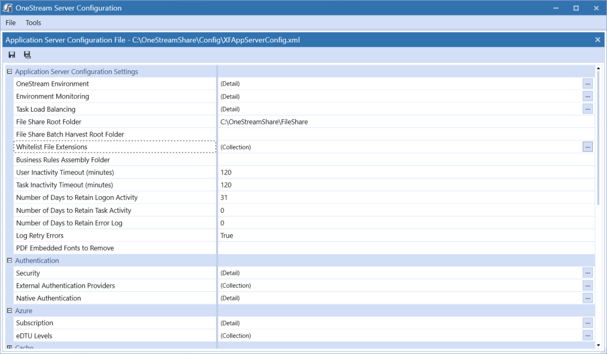

5. In the dialog box, click the plus sign (+) then type the whitelisted file extension. For example, .txt.

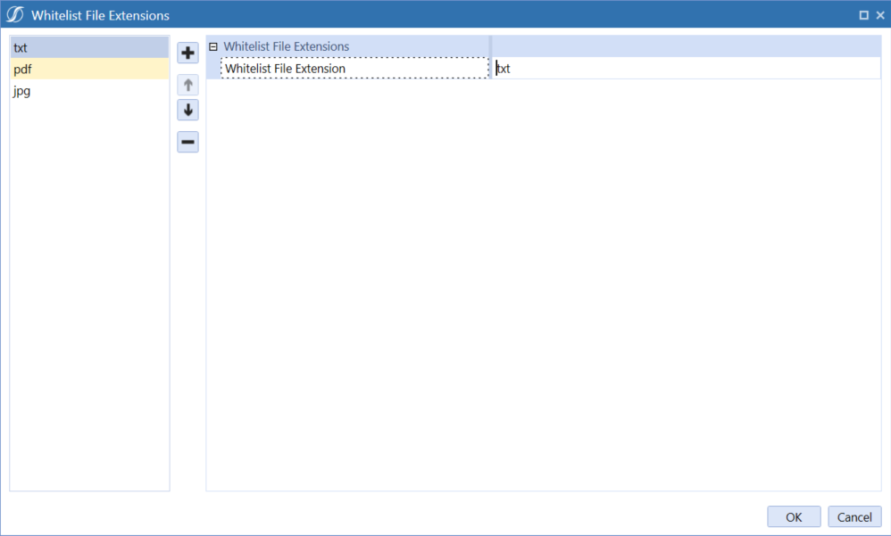

6. Continue adding other whitelisted file extensions. 7. When you are finished, click OK. 8. Click Save to save the changes to the Application Server Configuration File. 9. Restart Internet Information Service (IIS).

|Col1|NOTE: Cloud customers should contact support to have this configuration change made for them.|
|---|---|

Also, if you enter any of the following characters, they will be automatically removed. For example, typing .txt (with a period) becomes txt.

|/|^|=|'|
|---|---|---|---|

|(empty space)|&|\|[|
|---|---|---|---|
|!|*|?|]|
|@|(|<|.|
|#|)|>||
|$|–|~||
|%|+|`||

### Add Documents Using File Explorer

To add documents using File Explorer: 1. Navigate to any File Explorer component inside the Windows Application. 2. Select Upload File. 3. Browse to the file you would like to upload and click OK. If the extension of the file is whitelisted, it will be uploaded. If not, you will receive an error message.

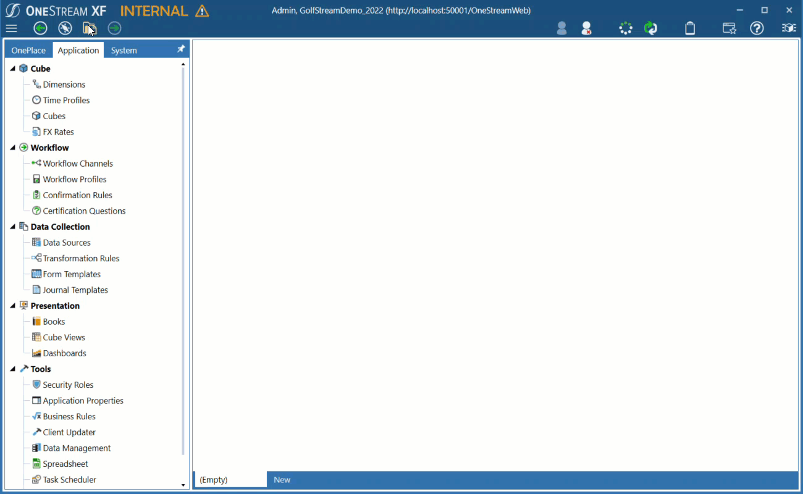

### Troubleshooting

After a whitelist is defined, new files whose extension is not in the whitelist will be restricted from uploading. If you upload a file that contains an exploit, malware, or a malicious script or macro, other users can download the file and infect their machine.

### Conclusion

Whitelisting a file extension provides a means of allowing only certain types of documents to be saved in the File Explorer. This helps to alleviate the possibility of introducing malicious file types into the system.

## Application Database/System Database

The Application Database displays stored documents for the current Application only. The System Database displays stored documents for the entire system without affecting the current application.

### Documents

Public Files available to everyone with access. Security Access Enables a user to access an object and read the content. Maintenance (Group) Enables a user to view an object and create, modify and delete objects in Groups. If in a Maintenance Group, a user does not need to be in the Access Group. The Maintenance Group also controls user profile contents. Users Private documents only available to named users. Internal Files used internally that cannot be modified.

## Load/Extract System Artifacts

You can import and export sections of the System using an XML Format.

> **Tip:** Only System Administrators have access to this portion of the tool.

Extract Choose an item from the drop-down list, click the Extract icon to start the extract process, then name the output file.

Load After browsing to the file, click the Load icon to initiate the process.

Extract and Edit This option is available for all extracts and allows the ability for the end user to edit the XML file as needed. The following items can be extracted: Security This covers System Roles, Users, Security Groups, and Exclusion Groups which can be found under the System Tab |Administration| Security. The screen will display Extract Unique IDs. If this box is checked, the unique IDs OneStream assigns to each user will be extracted with the security.  When moving security changes from one OneStream environment to another, trying to load the security with the unique IDs into the destination environment can result in an error if some of the records already exist. If this is the case, uncheck this box and extract without the unique IDs.  Items to Extract also displays and by default All is chosen. Choose specific items in each section or turn the sections on or off. System Dashboards This has multiple sections such as Maintenance Units and Profiles. Under Maintenance Units, the Groups, Dashboard Components, Dashboard Adapters, and Dashboard Parameters all go together.  System Dashboards can be found under the System Tab| Administration| Dashboards. The screen will display Items To Extract and by default All is chosen. Choose specific items in each section or turn the sections on or off. Error Log This covers the Error Log found under System Tab| Logging| Error Log. The screen will display an Extract All Items check box along with a Start Time and End Time. If the check box is notchecked,

choose the Start and End Time by clicking . Click on the extract button and define where the file will be saved. Task Activity This covers the Task Activity found under System Tab > Logging > Task Activity.  The screen will display an Extract All Items check box along with a Start Time and End Time. If the check box is not checked, choose the Start and End Time by clicking . Click on the extract button and define where the file will be saved. Logon Activity This covers the Logon Activity found under System Tab| Logging| Logon Activity.  The screen will display an Extract All Items check box along with a Start Time and End Time. If the check box is not checked, choose the Start and End Time by clicking . Click on the extract button and define where the file will be saved.

## Profiler

> **Important:** Profiler should be used by developers.

Profiler captures every event processed in a user session, such as Business Rules, Formulas, and Workspace Assemblies. This enables you to view the input and output of a method or function. Any code processed inside OneStream is profiled during a session. The ability to view the inputs and outputs of a method or function can be used to help troubleshoot performance issues. Profiler is tied to user activity and does not capture activity at the application level.

|System Security Role|Col2|
|---|---|
|ManageProfiler|Users assigned to this role can run Profiler sessions and view Profiler Events. The default is Administrator.|
|**System User Interface Role**|**System User Interface Role**|
|ProfilerPage|Users assigned to this role can view the Profiler page. They cannot run Profiler sessions or view Profiler Events. The default is Administrator.|

> **Note:** Administrators can end any active Profiler session.

To start a Profiler session, click the Start Profiler button.

To end all active sessions, click the Stop All Profiling for User button.

To only display active Profiler sessions, select the Show Running Items Only checkbox. To run a Profiler session, complete the following steps: 1. Click the Start Profiler button. 2. In the Start Profiler window, enter Profiler properties if needed. None of the following fields are required to run a session:

|Property|Description|
|---|---|
|**General**|**General**|
|Description|Enter a session description to display on the Profiler page.|
|Number of Minutes to Run|This entry determines how long Profiler will run after a session has started. The session automatically ends after the allotted time. The default value is 20 and the max value is 60. Values over 60 will be reset to the default value.|
|Number of Hours to Retain Before Deletion|The Profiler session is deleted after the time entered has passed. The default value is 24 and the max value is 168. Values over 168 will be reset to the default value. **NOTE:** The Profiler session is deleted in the first server restart after the deletion time.|
|**Filters**|**Filters**|

|Property|Description|
|---|---|
|Include Top Level Methods|This captures and displays high-level entry points, such as user actions, API calls, or workflow steps. When set to True, Profiler will log this activity. When set to False, no top-level methods display in the Profiler Events window. **NOTE:** Child Events are still visible when this filter is set to False. For example, if you have a Data Adapter that references a Workspace Assembly call, the Profiler Events will display the WSAS call as a child event within the Adapter event type.|
|Include Adapters|This includes any Data Adapter component calls to the Profiler output. When set to True, Profiler will log this activity. When set to False, no adapters are listed in the Profiler Events window, even when the Show All Child Events checkbox is selected.|
|Include Business Rules|This includes Business Rules in the Profiler output. When set to True, Profiler will log this activity. When set to False, no Business Rules are listed in the Profiler Events window, even when the Show All Child Events checkbox is selected.|

|Property|Description|
|---|---|
|Business Rule Filter|This entry determines what Business Rules are displayed in the Profiler Events window. See Filter Syntax.|
|Include Formulas|This includes formulas in the Profiler output. When set to True, Profiler will log this activity. When set to False, no formulas are listed even when the Show All Child Events checkbox is selected.|
|Formula Filter|This entry determines what Formulas are displayed in the Profiler Events window. See Filter Syntax.|
|Include Assembly Factory|This includes Assembly Method calls in the Profiler output. These are labeled as Factory to differentiate between Assembly Factory and Assembly Method calls. When set to True, Profiler will log this activity. When set to False, no Assembly Factories are listed even when the Show All Child Events checkbox is selected.|

|Property|Description|
|---|---|
|Include Assembly Methods|This includes Assembly Method calls in the Profiler output. These are labeled as WSAS to differentiate between Assembly Method and Assembly Factory calls. When set to True, Profiler will log this activity. When set to False, no Assembly Methods are listed even when the Show All Child Events checkbox is selected.|
|Assembly Method Filter|This entry determines what methods are displayed in the Profiler Events window. See Filter Syntax.|

|Col1|NOTE: For the fields Number of Minutes to Run and Number of Hours to Retain Before Deletion, if the default values are deleted and no value is entered, Profiler will still default to these settings when a session is run. If a zero is entered for both fields, Number of Minutes to Run defaults to one minute, and Hours to Retain Before Deletion defaults to one hour.|
|---|---|

3. Click the Start button. A new instance is displayed on the Profiler page. 4. Run the Business Rule, Formula, or Workspace Assembly you want to profile. When finished, navigate back to the Profiler page. To end the session, find your session on the Profiler page and click the Stop Profiler button for that line item. To delete a Profiler session, click the Delete Selected Item button. You cannot delete Profiler sessions that are actively running.

To end a singular session, click the Stop Profiler button.

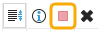

To display all Profiler property settings for a session, click the Instance Information button. Profiler Settings are view-only and cannot be modified once you have started the session.

To display the Profiler Events window and view all child events, click the Profiler Events button.

> **Important:** Application performance may be impacted if multiple users are running

Profiler at the same time or performing long-running tasks while other users are running Profiler.

### Filter Syntax

Use the Business Rule Filter, the Formula Filter, and the Assembly Method Filter to determine what is displayed in the Profiler Events window. For example, if you enter GetDataSet in the Assembly Method Filter, the filter only displays these methods. The following wildcards are valid syntax: l A question mark functions as a placeholder that accepts any character in its place.

|Col1|Example: If you enter SS?B in the Business Rule Filter, only sources that match this filter are displayed, such as SSIB and SSVB.|
|---|---|

|Col1|Example: If you enter A#????? in the Formula Filter, the filter only displays sources starting with A# followed by five characters.|
|---|---|

l An asterisk indicates that any string can be added before or after the hard-coded string that is next to the asterisk.

|Col1|Example: If you enter *Validation in the Business Rule Filter, only rules ending with Validation are included.|
|---|---|

|Col1|Example: If you enter P* in the Assembly Method Filter, the filter only displays methods that start with P.|
|---|---|

> **Note:** You can use multiple filters separated by a comma. For example,

TableEditorTest* , Spreadsheet???????, IBM?nSave.

### Profiler Events

To display the Profiler Events window, navigate to the session you want to view and click the Profiler Events button. The Profiler Events window displays everything that occurred during the Profiler session with Top Level Events displayed as parents.

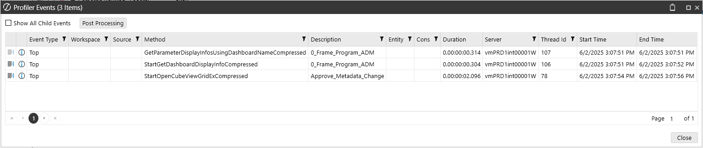

To display child events for all Top Level Events, select the Show All Child Events checkbox.

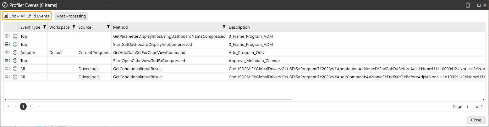

To drill down into a single Top Level event, click the Child Events button for that line item. This opens an additional Profiler Events window that only displays the child events for the selected Top Level event. If the Top Level event does not have any child events, the icon is grayed out for that item.

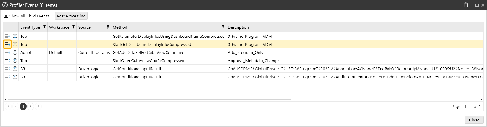

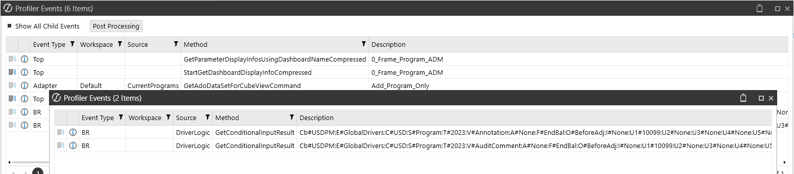

Review the following table for Profiler Events column descriptions:

|Column|Description|
|---|---|
|Event Type|The following event types are displayed in this column: Top, Queue, Adapter, Formula, BR, Factory, WSAS, and Manual.|
|Workspace|This column displays the name of the Workspace containing the item that caused the event.|
|Source|This column identifies the origin of the profiled event. Its value varies depending on the event type being profiled. l For WSAS and Factory event types, the value is the workspace object that initiates the call, such as Dashboard, Component, or DataSet. l For Business Rule, Adapter, and Formula event types, the value is the specific name of the rule, adapter, or formula. l For Top Level events types, the value is the method name called by the top-level event. l Manual event types do not have an associated Source value.|
|Method|This column displays the method called.|
|Description|This column displays a description of the event type.|
|Entity|This column displays the name of the Entity dimension member associated with the event. This column is blank if the event is not tied to a specific entity.|

|Column|Description|
|---|---|
|Cons|This column displays the name of the Consolidation dimension member. This column is blank if the event is not related to a consolidation.|
|Duration|This column displays the duration of the event type.|
|Server|This column displays the server.|
|Thread ID|This column indicates the operating system thread identifier on which the event was run.|

#### Post Processing

To display the Post Processing - Calculate Cumulative Durations window, click the Post Processing button.

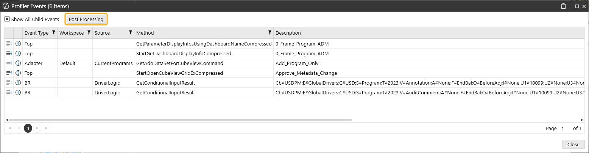

You can use the Post Processing - Calculate Cumulative Durations window to view information on different groupings, total all filtered items, and see what was returned. This information can help improve performance queries. For example, if you are looking specifically at performance time, you can filter by specific event types and have them grouped together. This enables you to view which specific methods or events are taking longer than others. When you run a calculate, the grid displays the duration and count for all Event Types selected in addition to selected Distinct Columns. To run post processing, make selections from Distinct Columns and Event Types To Include and then click the Calculate button. Distinct Column selections will display as columns in the grid, and Event Types To Include selections will display as rows in the grid. The following Distinct Columns and Event Types To Include are selected by default: Event Type, Workspace, Source, Method, Formula, BR, and WSAS.

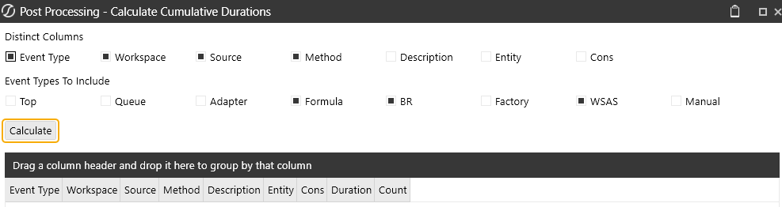

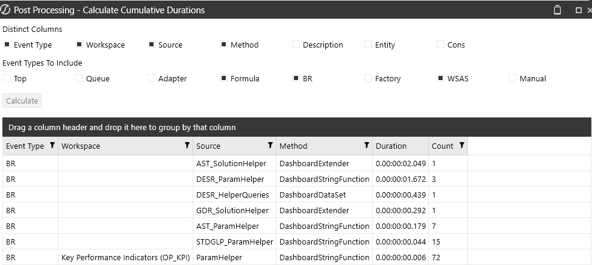

> **Note:** Updating the Distinct Column or Event Types To Include checkboxes after

running a calculate will clear the results.

### Event Information

To view Method Inputs, Method Results, and Method Errors for an event, click the Event Information button. The Events Information window contains the following tabs: l Method Inputs tab: This displays the parameters or data passed into the method or event. l Method Result tab: This displays the outcome or returned values of the method run. In the following example, the New Dashboard with Time Stamp button component was clicked, which called the 3_TimeStamp dashboard and the GetAdoDataSetForSqlCommand method.

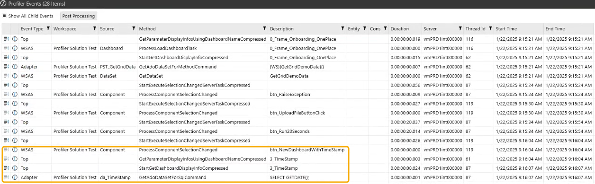

The Event Information window displays all method inputs, including the SQL Query and the date stamp submitted when the dashboard opened. The Method Result tab displays the time stamp that was returned to the dashboard. l Method Error tab: This displays any errors encountered during the session, providing thorough troubleshooting potential.

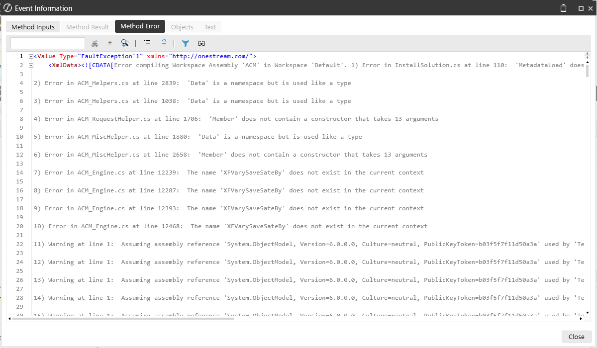

l Objects and Text tabs: These are enabled for Manual event types if objects or messages are logged through BRApi calls. In the following example, a user has the BRApi call attached to a button interaction to log the relevant information.

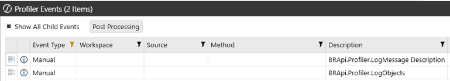

In the Event Information window for Manual event types, the user can view the BRApi.Profiler.LogMessage description in the Text tab and the BRApi.Profiler.LogObjects in the Objects tab.

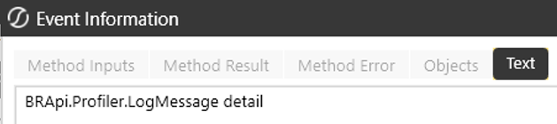

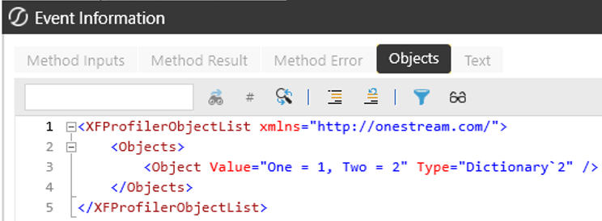

### BRApi.Profiler Methods

Reference the following calls directly in your business rules or application logic using the BRApi.Profiler prefix. IsProfiling This call determines if profiling is currently enabled for the session. This is useful for checking whether to log additional profiling information or to skip profiling logic for performance. Use BRApi.Profiler.IsProfiling(si). si is your current SessionInfo object. LogMessage This call records a custom message to the Profiler Events log. This can be used to log checkpoints, user actions, or important events during business rule processing. Use BRApi.Profiler.LogMessage(si, brProfilerSettings, "Description", "Detail"). l si: This is your current SessionInfo object. l brProfilerSettings: This is your profiler settings object. Use null if not applicable. l "Description": This is a short description of the event. l "Detail" (Optional): This is any additional detail.

|Col1|Example: You can use the following API call to log a message when a button is clicked: BRApi.Profiler.LogMessage(si, brProfilerSettings, "Button clicked", "User clicked the 'Process' button.")|
|---|---|

LogObjects This logs the state of one or more objects to the Profiler Events log. This is useful for capturing the values of key objects at specific points in your process for diagnostics or auditing. Use BRApi.Profiler.LogObjects(si, brProfilerSettings, "Description", [object1, object2, ...]). l si: This is your current SessionInfo object. l brProfilerSettings: This is your profiler settings object. Use null if not applicable. l "Description": This is a short description of the event. l [object1, object2, ...]: These are the objects whose states you want to capture.

## Time Dimensions

Applications can have a monthly or weekly Time Dimension. Time Dimension Types determine if an application uses a weekly, monthly or 12/13 period frequency, and the type of calendar (such as 445 or 454). In a new application, use a custom Time Dimension Type so users can specify the number of months in a quarter and the number of weeks in a month. After you create a Time Dimension, an XML file is generated. New applications use this file to implement the desired Time Dimension. If a Time Dimension Type is not assigned to a new application database, the default Standard Type is used.

> **Note:** Applications created prior to 4.1.0 can convert a monthly application to weekly

application using the Database Configuration Utility.  Contact Support for assistance. Time Dimension Types l Time Dimension Type Standard: Creates a Monthly Time Dimension and stores data by month in the data tables.  Applications created prior to version 4.1.0 use this type. l StandardUsingBinaryData: Creates a Monthly Time Dimension and stores data in a binary data table.  Use this type if you may need to later convert an application to a Weekly Time Dimension. l M12_3333_W52_445: Creates a 12 Month, 4 quarter, 52 Week, 445 calendar Time Dimension. l M12_3333_W52_454: Creates a 12 Month, 4 quarter, 52 Week, 454 calendar Time Dimension. l M12_3333_W52_544: Creates a 12 Month, 4 quarter, 52 Week, 544 calendar Time Dimension. l M12_3333_W53_445: Creates a 12 Month, 4 quarter, 53 Week, 445 calendar Time Dimension. l M12_3333_W53_454: Creates a 12 Month, 4 quarter, 53 Week, 454 calendar Time Dimension. l M12_3333_W53_544: Creates a 12 Month, 4 quarter, 53 Week, 544 calendar Time Dimension. l Custom: Creates a Time Dimension you can use to specify the months in a quarter and the in a month. This is only available for new applications. l Use Weeks: If true, you can define a Custom Weekly Time Dimension. If False, you can create a Custom Monthly Time Dimension. l Vary Settings By Year: If True, you can specify the number of weeks in a month for each year. If False, you can apply the number of weeks per month to each year. l M1- M16 Number of Weeks: Specify the number of weeks per month.  This coincides with the number of months per quarter, so any additional weeks required are enabled.  If Vary Settings By Year property is True, select a year and customize the number of weeks in that year.
