# Using Oneplace Workflow

The top of this slider configures the Workflow View for data loading: Workflow Profile, Scenario, and Year. Clicking on any of the three items displays a pop-up window to select Workflow Profile, Scenario, and Year. A Workflow Unit is an individual period within the selected year and Scenario combination for a particular Workflow Profile. Twelve Workflow Units or periods are always displayed for selection, but only one can be selected and active at a given time. Each Workflow Origin step available must be completed as well as the collective data confirmation and certification process for a single Workflow process to be finalized.

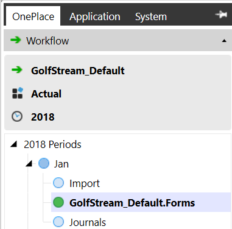

> **Tip:** The available tabs will be determined by the security level.

Right-Click Options Right-click a Workflow month, Workflow Input Type, or Dependent Status cell to display the following options. Not all options are available for every object. Status and Assigned Entities Displays the Workflow Status of each Origin process (Import, Forms, and Journals). See Dependent Status under Certify for more details on this feature. Audit Workflow Process Right-click any Workflow channel. This provides an audit for every Workflow task’s process including the date and time of the process, the user performing the process, how long it took for the process to complete, and any errors that occurred during the process. It also provides audit history through Lock History > Workflow Lock/Unlock. Lock/Lock Descendants This will lock a particular Workflow period, or Origin process. Unlock/Unlock Descendants This will unlock a particular Workflow period, or Origin process. Edit Transformation Rules This will navigate to the Transformation Rules screen and allow a user to fix any Transformation Rule errors that occur during the Workflow process. Clear All ‘Import’ Data From Cube This will clear all imported data from the Cube, but the data still remains in the Stage. Clear All ‘Forms’ Data From Cube This will clear all Forms data from the Cube. Corporate Certification Management This allows a user to unlock and uncertify ancestors, or lock and certify descendants. Corporate Data Control This allows a user to preserve data if changes need to be made and restore the preserved data if necessary. Workflow View Selection A description can be added to a Workflow Profile during its design. Descriptions can only be added to Workflow Profiles using the Default Scenario Type. Scenario Type specific descriptions cannot be used.

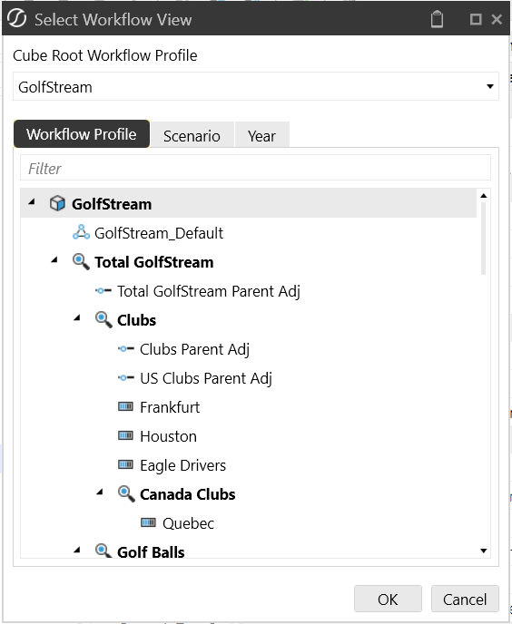

## Workflow Tasks

This simplifies the data collection, consolidation, and certification process. Importing data, entering a form, making a journal entry, and signing off on reports is completed through the Workflow process.

### Import

This process step gives the end user the ability to import data into the system. This can be through a defined Data Source or a Data Connector. First click on the Import Workflow Origin located under the active month, then click Import in the task bar.

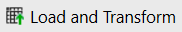

After a user clicks this icon, it will prompt him/her to either search for a file on the drive or initiate the Data Connector. The system will then import the data into the Stage engine. The file will be parsed into a clean tabular format with information on the Amounts, the Source ID, and each Dimension.  Once the data is loaded successfully, the Import task will change from blue to green. Load Method Upon clicking Load and Transform, a dialog will appear with four Load Options: Replace This will clear all data for the previous file that correlates with the specific Source ID and replace it with the new file’s data. This can be done even if the previous data has already been loaded into the Cube.  Once the file is re-loaded, the user will need to complete all Workflow Tasks and load the new data into the Cube. Replace (All Time) Replaces all Workflow Units in the selected Workflow View (if multi-period). Forces a replace of all time values in a multi-period workflow view Replace Background (All Time, All Source IDs) Replaces all Workflow Units in the selected Workflow View and all Source ID’s in a background thread while the new file parse or connector execution is running. The delete is being performed while parse is being performed.

> **Note:** This load method always must always be used to delete ALL Source IDs. If the

workflow uses multiple Source IDs for partial replacement during a load, this method cannot be used. Append This is used when additional rows are added to a source file and need to be loaded into the Stage. This will not change any of the data already loaded for the source file, it will only add rows that were not included in the previous file load.

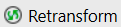

This is used after data has already been loaded, but some changes have been made and the calculations need to be repeated.

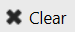

This will clear all loaded data from the Stage.

View Last Source File Processed for Current Workflow Profile

View Last Log File Processed for Current Workflow Profile

When this icon displays, the Global POV is enforced and data loading is limited to the Global POV. The Enforce Global POV setting is controlled under Application|Tools|Application Properties.

When this icon displays, data cannot be imported to time periods prior to the current Workflow year. The Allow Loads Before Workflow View Year setting is controlled under Application|Tools|Application Properties.

When this icon displays, data cannot be imported to time periods after the current Workflow year. The Allow Loads After Workflow View Year setting is controlled under Application|Tools|Application Properties.

### Right-Click Options

View Source Document This will open the source file imported into the application. View Processing Log This will open a processing log and provide information on when and how the source file was imported. View Transformation Rules This provides all mapping rules for the specific intersection Drill Back Using a SQL Connector allows a user to drill back to a source system and show detailed records from a document, PDF, website, within the application  This option is only available if data was loaded using a Connector Data Source.  For more details on this feature, see Drill Back in Data Collection Guides. Export This will export the data into an Excel XML< CSV, Text, or HTML file

### Validate

After the data is loaded, the user will then validate the map and intersections. During the Validate step two specific actions happen. First, OneStream will check to make sure each piece of data has a map. Next, OneStream will check to make sure the combination of Dimensions can be loaded into the Cube based on the constraints defined in the system (e.g. using Intercompany). Click the green Validate task in the taskbar.

Click this icon to validate the data.  If there are no errors, the Validate task will change from blue to green. If there are any errors, Validate will turn red and the errors will need to be fixed before

proceeding. Transformation Errors The errors will be listed by the Dimension with the error, such as a new account that was added, but not mapped. The user will be able to see the Source Value and the (Unassigned) Target Value. The system will already know the Dimension and pull up the possible targets. On the right, the user will be able to use the search box and click the funnel/filter button to find the correct account. The default will be a One-To-One Transformation Rule. For more information on these rules, see Transformation Rules in Data Collection.

Save any changes made and then click the Retransform icon, this will automatically re-validate the data. If there is an intersection validation error, this will now appear. If there are no intersection errors, the Validate Workflow step will change from blue to green. Intersection Errors Intersection Errors mean something is not correct with the entire intersection of data. For example, a Customer Dimension may be mapped to a Salary Grade Account. This does not make sense and the system will identify this prior to the load. To fix this error, click on the bad intersection and drill down to see the GL/ERP Account; (see Drill Down in Using OnePlace Cube Views for more details). Right-click to View Transformation Rules and from there, investigate each rule for each Dimension in order to find which one does not make sense.  Each Dimension will be on the left, and each Target Value Column needs to be investigated. To fix a Transformation Rule here, select the Target Value to correct, right-click and select Edit Rule.  Choose the appropriate Target Value and fix the intersection error. Click Save and close the next two windows. Click the Validate icon again and if it was fixed correctly, the Validate task will change from blue to green. See Right-Click Options under the Import Task for details on the right-click functions.

### Load

This simply loads the cleansed data from the Stage to the Analytic Engine. Click the Load task in the taskbar.

Next, click the Load Cube icon. This now loads the data into the Consolidation Engine and completes the Import process. A Task Progress dialog will appear:

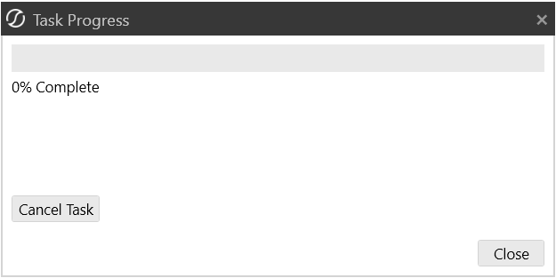

A green check will appear next to the Import Origin Workflow Step. See Right-Click Options under the Import Task for details on the right-click functions.

### Pre-Process

The Pre-Process task is the same as the normal Process task. This can be added as a first step in the Form channel process. Please refer to the Process description further down in this section for more details.

### Input Forms

Once in this step, there will be two options under Workflow Forms: Required and Optional. The required Forms will have to be completed before the end user can move on from this step.  Click on the specific Form, and manually enter the required data.

Open Excel Form A user can export a Form derived from a Cube View to Excel, complete it in Excel, and then submit the data back to the application.

Attachments This allows the user to attach supplemental files to specific Forms.

Import Form Cells Using Excel or Comma Separated Values File Click this to load Form data via Excel template or CSV template. See Loading Form Data in Data Collection Guides for more details on using these templates.

Import Cell Details Using Excel or Comma Separated Values File Click this to load Cell Details via Excel template or CSV template. See Loading Cell Detail in Data Collection Guides for more details on using these templates.

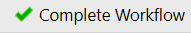

Once a Form is completed, click Save and then the Complete Form icon.

> **Note:** A drop-down time period menu will display for a form with a defined time filter

containing multiple periods. If a Form does not have a time filter defined, this will be a standard button.

This will re-open a Form and clear the data.  Once the Form is updated, Complete Form must be clicked again.

> **Note:** A drop-down time period menu will display for a form with a defined time filter

containing multiple periods. If a Form does not have a time filter defined, this will be a standard button.

Checking this box enables all Forms to be completed/reverted in one step.

When each Form is completed, click Complete Workflow and a green check will appear for the Forms Origin Workflow Step.

This will re-open the Workflow. To make changes to the Form, Revert Form must also be clicked. Make any necessary changes to the Forms and click Complete Form/Workflow again.

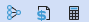

This will run a consolidation/translation/calculation for a specific Form.

Show Report This shows the Form in a Cube View Report.

Export to Excel This exports a copy of the Form into Excel. Cell Detail Cell Detail can be entered on a Cube View used for a data entry form, or on a Cube View or Quick View in Excel. Cell Detail is available on any writeable O#Forms or O#BeforeAdj Member. See Right-Click Options in Using OnePlace Cube Views for details on the right-click options in Forms.

#### Workflow Icons

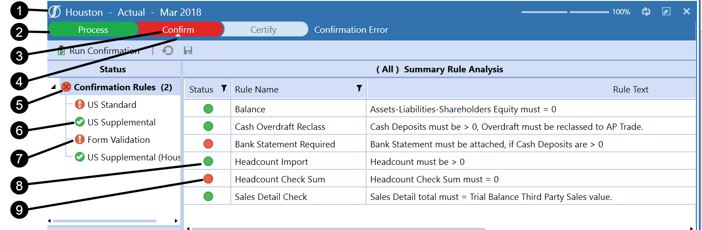

1. OneStream logo is white. 2. Workflow Status bar steps have curved edges. 3. Failed task text is white. 4. Up-arrow indicator for selected task. 5. Stop sign has an X in the middle, and a flat design style. 6. Confirmation Rules; Pass = green circle white checkmark, flat design style. 7. Confirmation Rules; Fail = red circle white exclamation mark, flat design style. 8. Status; last step completed green circle. 9. Status; last step error red circle.

## Journals Toolbar

The Journals toolbar contains many tools for working with journals. This section describes each tool in detail.

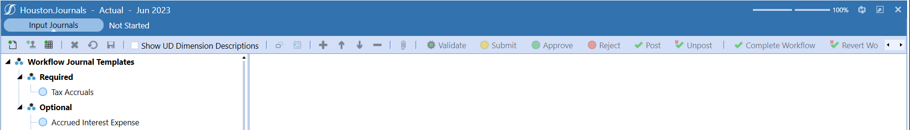

## Input Journals

Once in this step, there will be two options under Workflow Journal Templates: Required and Optional. The required Journals will have to be completed before you can move on from this step.

Create Journal Click this to create a Journal if a template is not available. If this button is disabled, it is because the workflow profile is configured to only allow you to create journals based on existing templates.

Create Journal Using Template Use this to create a Journal using the selected template. Manually enter the required Journal data and Click Save.

Create Journal Using Excel or Comma Separated Values File Click this to load a journal entry via Excel template or CSV template. See Loading Journal Data in Data Collection Guides for more details on using these templates.

Copy Selected Journals Copy existing journals into other time periods and scenarios. This is useful when you are creating similar journals, managing recurring journals, or copying Actual data into budget or what-if scenarios. 1. Select the journals you want to copy and click Copy Selected Journals. You can select journals in any status but when copied, they will be set to Working status in the new time period. 2. Click the drop-down arrow in the Target Scenario field. 3. Make a selection. The selection applies to all journals in that single-batch copy. 4. For each journal, select one or more time periods. 5. Type a new journal name and description. 6. You can include attachments by placing a check in the Include Attachments checkbox. Administrators and members of the Journal Process Group can copy journals into a specified Adjustment Workflow Profile.

> **Note:** After journals are copied, WfProfile_WfUnit_Scenario_TimePeriod_Index is

appended to the journal name.

Delete Selected Item Delete one or more journals simultaneously. Journals in Working or Rejected status can be deleted. This saves time when you need to remove multiple journal entries quickly and efficiently. Select the boxes next to the journals you want to remove then click this button and confirm.

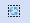

Reapply Template Settings to Journal This will clear the data from the selected Journal and return it to the original template.

Show UD Descriptions Check this checkbox to display descriptions for the eight UD Dimension Types. They will display next to the Dimension Type in the Journal POV and the line item headers. Descriptions are defined in the Application Properties, and can provide clarity on the purpose of the dimensions.

> **Note:** This feature applies to the Journal page only. Reports, BRApis and Excel/CSV

templates related to journals remain unchanged.

Export Export journals from within the journals page. This is useful when you are more comfortable using a spreadsheet tool to edit journal data. You can export data from one area in OneStream and import it into another area or application. 1. Click Export to open the Select Journals to Export dialog. Workflow profile and scenario are locked. 2. Type a Time Filter using the T# syntax. For example, T#2023M1, or for multiple time periods, T#2023M1,T#2023M2. 3. Type a Journal Status. Select a single journal status or select All to include all statuses. 4. Type a Journal Name. This optional step will find all journals that contain the text you type. 5. Click OK to generate an XLSX file with journals that match the selected criteria. 6. In the File Explorer dialog, browse to where you want to save the XLSX file. Data from all journals that match the selection criteria is saved. Journal Entry Checkboxes Select multiple journal entries in the same state (e.g., completed, posted, approved, etc.) in order to Submit, Post, Approve, or Quick Post them at the same time. Select multiple journal entries in either the Working or Rejected status to delete them at the same time.

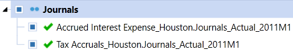

Validate You can ensure that dimension members selected in the journal are valid cube intersections based on constraints configured in the dimension library. If validation errors exist, they will display in a Validation pane allowing you to view them as you make edits to the journal. This helps you save time by validating entries earlier in the process. You must have the Journal Processing security role to use this feature and dimension member constraints must first be configured in the dimension library. To use this feature: 1. Open a journal that is in Working status. 2. Click Validate. If invalid data is found, the Validation pane will display messages that detail each entry error.

Once a Journal is completed, select Quick Post or Post. When all required Journals and any optional Journals are finished, click Complete Workflow and a green check will appear for the Journals Workflow Step.

Depending on the security configuration, there are multiple options for Journals. If full security is in place, the end user will be able to create and submit. The approver will approve or reject, then the end user can post and complete the Workflow. Journal Line Items Journal data is entered into line items. You can add line items to reflect the Dimensions they are adjusting. Any dimensions not in line items must be configured in the Journal POV. To select a dimension member in journal line items: 1. Double-click the Entity, Account, Flow IC, or UD1-UD8 field. 2. If you know the member name, type it into the text field. Repeat for all fields as needed. 3. If you do not know the member name, use the Select Member dialog to locate the member.

|Col1|NOTE: If the dimension members have a description, the members are displayed in the journal line items. For each dimension, you can set a preference to hide or show the description in journal line items. These preferences are saved on your local machine in OneStream user settings.|
|---|---|

You can filter journal line items by clicking the filter icon in the column headings. A drop-down selection box appears where you can choose from various filtering options.

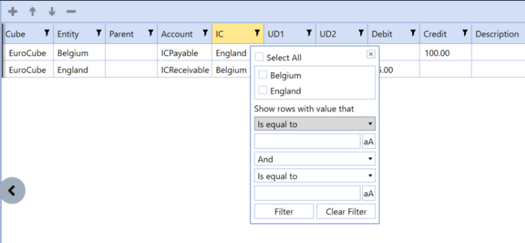

This is useful when you are working with journals that contain a large amount of line items, making it easier to locate a specific subset of line items. There are four line item actions buttons that sit just above the line item entries that aid in editing the journal line items: l Add: Creates a new journal line item. If an existing line is already selected, Add copies the selection. If no line is selected, the new line item is blank. l Up: Moves the selected item up in the list. l Down: Moves the selected item down in the list. l Remove: Deletes the selected line item.

### Process

Once in this step, click Process Cube in order to process the loaded data.

This icon performs No Calculate and all the standard Calculate, Translate, and Consolidate options using Calculation Definitions. Each added line item can be filtered by entity for reviewer level processes. Once the Cube is processed, the Process task will change from blue to green and move to the Confirm task. No Calculate can be used to allow the assignment of Data Management Sequences.

### Confirm

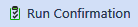

This step runs the Confirmation Rules defined for this particular Workflow. This will immediately inform users if they have passed or failed the data quality rules. The two types of statuses for this step are Warning or Error. Warning means the user is outside of the threshold, but it will not stop the process. Error means the user is outside of the threshold and this will stop the process and turn this step to red. If anything has failed, revisit one or many of the previous steps to make sure the data is accurate and complete.  Once the data has passed all quality rules, the Confirm task will change from blue to green and move to the Certify task.

### Certify

This is typically the final step in the Workflow process. This certifies and completes the phase of the Workflow.

Some questions may need to be answered regarding the processes. Click each set of questions under the Questionnaires area.  Answer the questions by clicking in the response cell and selecting the correct answer.  Comments can also be added in order to explain the answers. The status will be displayed on the right. When this is completed, click on the Set Questionnaire Status icon and select Completed and then OK.

After each group of questions is completed, the Set Certification Status icon will be enabled. Click this and select Certify in order to certify the data as complete and accurate. This will give the final green check for the month being processed and the data can now be trusted as complete and accurate by any stakeholder that is analyzing this information.

This is a one click option to expedite the Certify process.  No questions need to be answered. This will give the final green check for the month being processed and the data can now be trusted as complete and accurate by any stakeholder that is analyzing this information. This data can now be used for Consolidations by users or managers responsible for this workflow. They can look at data as it moves up and perform their own top side adjustments, confirmations, and certifications at as many levels as is appropriate for the organization.

Click on Dependent Status to see the status of each required Workflow task to ensure they are all completed. This will display the Workflow Profile name and all input types, the Workflow Channel, the status of each input type, the last step completed for each input type, the percentage of each step that is OK, In Process, Not Started, and steps with errors, and a record of when the last activity took place for each step.  See Right-Click Options for details on these right-click functions.

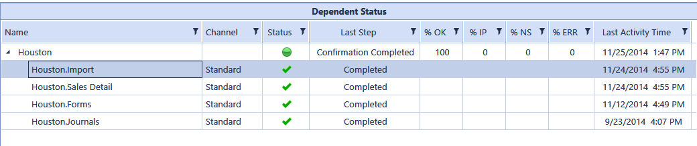

For more details on Workflow, see Workflow in Workflow.

### Multi-Period Processing

Click on the Year in the Navigation Pane to enact Multi-Period Processing options:

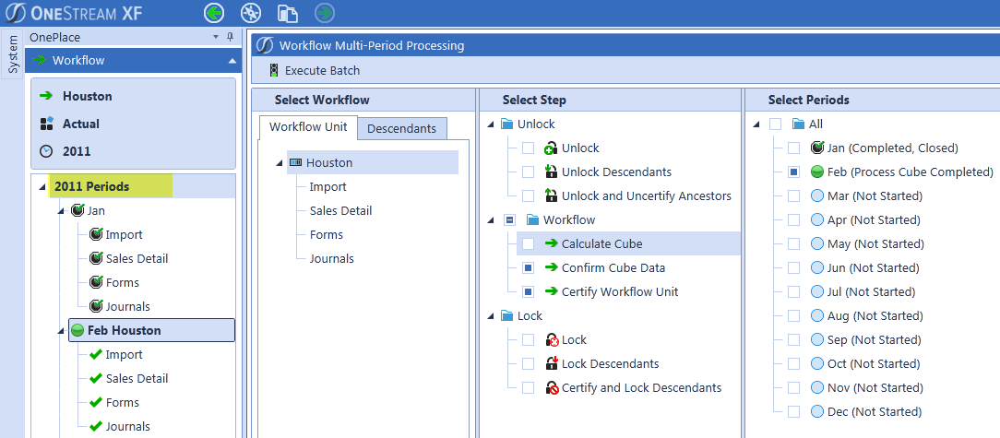

From here, perform multiple workflow tasks for one to many time periods, as shown above.

## Analysis Pane

In each workflow profile for a defined period there will be an Analysis Pane under the Status Pane. For example: under Process, Confirm, and Certify tasks.

### Cube Views And Dashboards For Analysis

This is where data can be viewed and analyzed in cube views and dashboards. If there is a grid in any dashboard or cube view, these are available for further drill down or annotation by right clicking the cell. See Using OnePlace Cube Views and Using OnePlace Dashboards for more details. To view the Cube Calculation Status, click on Cube Views| Calculation Status to show a data grid presenting the Calculation Status of the current active Workflow POV. This will be available at the total Monthly (not an Origin process) Review, Process, or Certify tasks. See Calculation Status in About the Financial Model for more details on this feature.

### Intercompany Matching

IC Matching which will show any Intercompany discrepancies. If the button is red in the status column, click the item to see the details. Each Intercompany counterparty will be visible along with counterparties with an Intercompany variance.  By clicking on the counterparty, details including the Reporting Currency, Entity Currency, and Partner Currency will be visible. Select the Intercompany Partner to see the status of the Intercompany issue and any annotations the partner may have made. Select the Difference row to see both parties’ statuses and annotations.

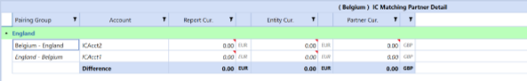

A red triangle indicator displays in the cell when data is dynamically derived. This generally occurs when the intercompany matching report performs currency translations. Right click on the Entity row to perform the following functions: Set IC Transaction Status This allows the user to update the status by selecting Not Started, Loaded, Adjusting, Disputed, Finalized. The user may also include comments for the counterparty to see. Show Partner Workflow Status This allows the user to see the Workflow status of the counterparty. Show/Hide Dimension Details This allows the user to see the Dimension details for the Intercompany accounts. Drill Down This will allow the user to drill down on the Dimensions in order to get more information about the Intercompany data. See Drill Down in Using OnePlace Cube Views for more details on this feature. See Intercompany Eliminations in About the Financial Model for more details on Intercompany.
