# Using Oneplace Cube Views

These Cube Views are complete and organized reports created specifically for the company’s data in the Application section. A Cube View is used to query Cube data and present it to the user in variety of ways. They can be made read-only, used for editing data, and can be used as the Data Source for several different display mechanisms. In order to copy Cube View cells from a Data Explorer Grid to an Excel spreadsheet, click CTRL, select the cells desired, and then click CTRL-C. Navigate to an Excel spreadsheet, select a cell, and click CTRL-V, this will paste the cells into Excel. This can also be done from an Excel spreadsheet into a Data Explorer Grid. While viewing these reports, users can right click on any cell in order to learn more about any given number or piece of data. For more information on creating Cube Views, see Cube Views in Presenting Data With Books, Cube Views and Dashboards.  For information on how to use Cube Views, or advanced uses, see Cube Views in Presenting Data With Extensible Documents.

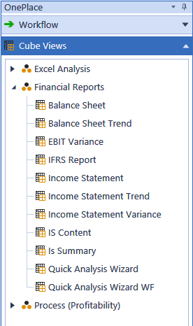

## Toolbar

Consolidate This consolidates the data in the Cube View

Translate This translates the data in the Cube View

Calculate This performs a calculation on the Cube View data

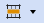

Row Suppression Use Default Suppression This suppresses the data based on the Cube View’s row suppression settings. Suppress Rows This suppresses any data rows with zeroes, no data, etc. regardless of the Cube View suppression settings. Unsuppress Rows This removes any data suppression set via the Cube View suppression settings and displays all data rows including those with no data, zeroes, etc.

> **Note:** The actions above vary based on the user’s security settings and restriction

properties set on the Cube View.

Show Report This opens the Cube View in a polished, formatted report

Export to Excel This will open the fully formatted Cube View in Excel. Users can open multiple excel exports using a Cube View without being prompted to rename or save the file. A version number will change with each export in sequence.

Select Parameters This allows the user to select new Parameters and view the Cube View data differently.

> **Note:** This is based on the Parameters set for this Cube View.  This feature will not

apply to all Cube Views

Edit Cube View This opens the Cube View Application page where changes can be made to the Cube View design.

> **Note:** This varies based on the user’s security settings.

Find Next Row When viewing a Cube View with a large number of rows, use the search filter at the top of the screen in order to navigate to the desired row. Type a keyword into the search filter and click the Find Next Row icon in order to navigate to the preferred row. Continue clicking the icon in order to navigate to any row with the keyword included in the row header name. This also works when rows are collapsed.

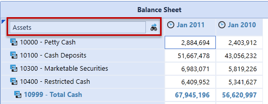

Copy or Paste Data to Multiple Cells Use <Ctrl+C> or <Ctrl+V> to copy and paste values into Cube View data cells. Select the desired data cell, click <Ctrl+C> to copy the cell value and then select another cell to paste <Ctrl+V> the value. Hold down <Ctrl> to select multiple cells and paste the value into the selected cells simultaneously.

## Shortcuts, Scaling, And Hotkeys

The Cube View Data Explorer allows the use of shortcuts, scaling, and hotkeys.

### Shortcuts

Use Shortcuts to calculate amounts within a cell. Click once in a cell, type in a shortcut, then click enter to run the calculation.

|Col1|Example: Type "add2k" to add 2,000 to the cell value. Type "in10" to increase the cell value by 10%. Type "pow2" to calculate to the power of 2.|
|---|---|

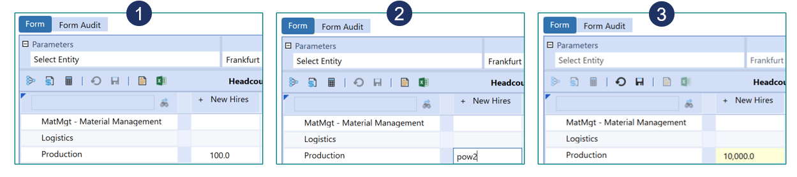

|Shortcuts|Col2|
|---|---|
|add|Add a number to the last value|

|Shortcuts|Col2|
|---|---|
|sub|Subtract a number from last value|
|div|Divide last value of a number|
|mul|Multiply last value of a number|
|increase, in, gr|Increase last value by a percentage|
|decrease, de|Decrease last value by a percentage|
|percent, per|Calculate a percentage of last value|
|power, pow|Calculate a power of last value|

### Scaling

When entering data in the Data Explorer, use scaling to quickly enter values.

|Col1|Example: Type "1m" for a cell value of "1,000,000"; "1.5b" for a cell value of "1,250,000,000"|
|---|---|

|Scaling|Col2|
|---|---|
|k|Scale value by 1,000|
|m|Scale value by 1,000,000|

|Scaling|Col2|
|---|---|
|b|Scale value by 1,000,000,000|
|%|Divide by 100 (when using with a P number format on Cube Views)|

### Hotkeys

Use HotKeys to manage changes while entering data into the Data Explorer.

|Col1|Example: Press CTRL+S to save changes.|
|---|---|

|HotKeys|Col2|
|---|---|
|CTRL + S|Save|

## Right-Click Options

### Expand/Collapse

If nested rows are used in a Cube View, right-click on any row header in order to collapse or expand the selected row content.  This feature works with the RowExpansionMode property in the Cube View designer and controls how users view Cube Views in the data grid. See Rows and Columns under Cube Views in Presenting Data With Books, Cube Views and Dashboards for more details.

### Calculate/Translate/Consolidate

Cube Views can be set to enable processing of the Cube View data.  This includes Calculate, Translate and Consolidate.  There are also option to force these calculations and log the activity in the Task Activity.  Each of these options can be enabled/disabled on an individual Cube View. For more details on these options, see Launching a Consolidation in About the Financial Model.

### Spreading

Spreading can be done from a Cube View while viewing it in the Data Explorer grid, in the Spreadsheet feature and Excel Add-in. User experience may differ slightly across these three user interfaces and more functions may be available in the Spreadsheet feature than others. This functionality provides the ability to spread values over selected cells.

> **Note:** The Spreading Dialog can be left open while entering data.  If the dialog is left

open while users are spreading values on the grid, it will update to the respective spreading behavior.

### Spreading Type

Fill This fills each selected data cell with the value in the Amount to Spread property. Clear Data This clears all data within the selected cells. Factor This takes the selected cell’s value and multiplies it by the rate specified. Accumulate This takes the first selected cell’s value and multiplies it by the rate specified.  It then takes that value, multiplies it by the specified rate and places it in the second cell selected, and does this for all selected cells.  For example, four cells are selected and the first cell has a value of 900.

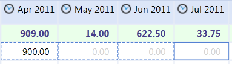

The Accumulate Spreading is setup as follows with a rate of 1.5:

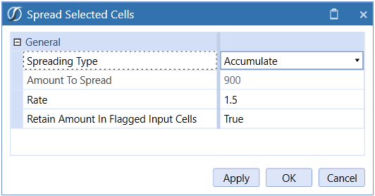

When the spreading is applied the outcome is as follows:

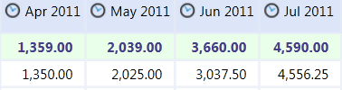

Each cell’s value is a factor of the previous cell amount. Even Distribution This takes the Amount to Spread and distributes it evenly across the selected cells. Proportional Distribution This takes the selected cell’s value, multiplies it by the specified Amount to Spread, and then divides it by the total sum of all selected cells. If all the cells have a zero value, the Amount to Spread will behave like an Even Distribution. In the example below, four cells are selected:

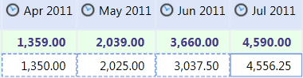

A proportional amount of 50,000 is applied to the cells.

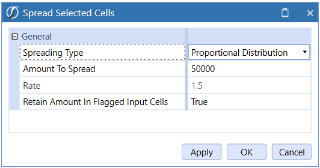

Result

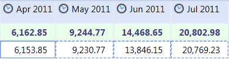

445 Distribution This takes the Amount to Spread and distributes it with a weight of 4 to the first two selected cells and a weight of 5 to the third cell. 454 Distribution This takes the Amount to Spread and distributes it with a weight of 4 to the first selected cell, a weight of 5 to the second cell and a weight of 4 to the third. 544 Distribution This takes the Amount to Spread and distributes it with a weight of 5 to the first selected cell and a weight of 4 to the second and third cells.

### Spreading Properties

Amount to Spread Specify the value to spread over the selected cells. The value defaults to the last cell selected. The way the amount in this field spreads varies by Spreading Type. Rate (Factor and Accumulate Spreading Types Only) Enter a rate to multiply by a cell value. Retain Amount in Flagged Input Cells Users can flag specific cells in order to retain the data within the cell. If this property is set to True, spreading will not apply to the selected flagged cells. Include Flagged Read only Cells in Totals Set this to True to include locked base-level cell values when calculating spreading totals. True is the default. Flag Selected Cells Flag cells so the original amount in the cell is retained during the spreading process. Clear Flags Select this to clear any flagged cells. Apply Enter spreading values in the dialog and select Apply to perform spreading without closing the dialog. The dialog closes upon clicking OK or Cancel. Spread Selected Cells In order to select multiple data cells, hold the Control Key (Ctrl) on the keyboard, and click on all cells that apply. Spreading occurs across rows first and then down the columns. Once spreading has been performed using the Spreading Dialog, users can type values on specific Members without having to launch the dialog again. This spreading function applies the settings from the last time the Spreading Dialog was used, so all Spreading Types and flagged cells can be utilized. Even Distribution is the default Spreading Type if there is nothing currently set in the Spreading Dialog. Users can select multiple Cube View data cells and type over the primary cell in order to apply spreading. If the primary selected cell is a Parent Member, a value can still be typed over it if multiple cells are selected. Any locked base-level data cells are automatically flagged when applying spreading. When spreading across multiple time periods on one data row, users can select the Parent Time Member and automatically apply spreading to all its Base Time Members without having to manually select them. For example, double-click on the Q1 Parent Member and the periods associated with Q1 will be selected.

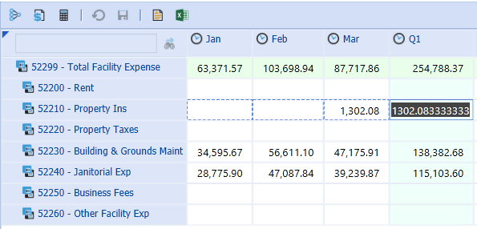

Enter a value to spread on the Q1 data cell.

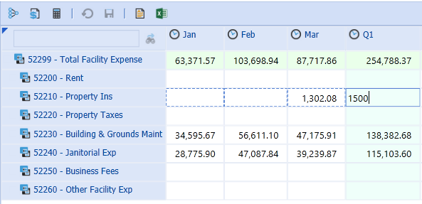

Click <Enter> and it will automatically apply to the periods associated with the Quarter.

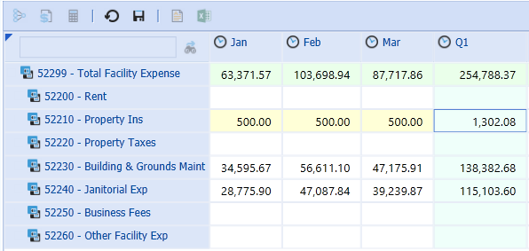

### Allocation

Form data Allocations can be completed on a Cube View in the Data Explorer Grid, a Cube View in Excel, and Quick Views. Allocation Type Clear Data This clears all Form data for the specified Destination POV.

> **Note:** Users can clear data for Dimension Members that are not displayed on the

Form. For property definitions, see Even Distribution. Even Distribution This provides an even distribution across the Destination Members. Source POV The Source POV determines the source intersection and applies the value from this intersection to the allocation. The Source POV defaults to the last cell selected. Users can also select a data cell and drag and drop the cell’s POV into this property in order to update it. Any Members not included in the Source POV will default to the user’s Cube POV. Source Amount or Calculation Script Use this property to override the Source POV value. Drag and drop a value from the Cube View grid, specify a source amount (e.g., 1000), or use the Source POV to specify a different source amount (e.g., A#SourcePOV*0.90). Destination POV The Destination POV determines the intersection where the allocation will take place. A Member for each Dimension must be specified for the allocation to take place in the correct intersection. Users can select a data cell and drag and drop a POV into this field in order to display all Dimensions. If the Destination POV is similar to the Source POV, specify as many Dimensions as necessary and the remaining Members will come from the Source POV, or leave this field blank and all POV Members will be based on the Source POV. Any Members not included in the Source or Destination POV will default to the user’s Cube POV. Dimension Type/Dimension Type 2 Allocations can be applied to Dimension Members not included in the Destination POV such as several periods or Accounts. These Members then override the Destination POV. Specify the Dimension in this property. For the Clear Data and Advanced Allocation Types, two Dimensions can be specified. Member Filter/Member Filter 2 Specify the Dimension Members to which the allocation will apply. The Members specified in this field override the Member in the Destination POV script. For the Clear Data and Advanced Allocation Types, two Dimension Member Filters can be specified. Save Zeroes as Not Data Set this to True in order to suppress zeroes when saving allocation data. The default setting is True. 445 Distribution A 445 Distribution takes the source amount and applies a weight of 4 to the first two specified destination intersections and then a weight of 5 to the third intersection. This applies the allocation across rows first and then moves down the column. 454 Distribution A 454 Allocation takes the source amount and applies a weight of 4 to the first destination intersection, a weight of 5 to the second and then a weight of 4 to the third intersection. This applies the allocation across rows first and then moves down the column. 544 Distribution A 544 Allocation takes the source amount and applies a weight of 5 to the first destination intersection and then a weight of 4 to the second and third intersections. This applies the allocation across rows first and then moves down the column. For Source and Destination property definitions, see Even Distribution above. Weighted Distribution This applies a weighted value to each specified Destination Member. The weights are determined in a Weight Calculation Script which uses the specified Dimension intersections’ cell values. For Source and Destination property definitions, see Even Distribution above. Weight Calculation Script The weight calculation script calculates the value by determining |SourceAmount| * (|Weight| / |TotalWeight|) It then applies the weighted values to the intersections specified in the Destination POV/Member Filter combination. These are system Substitution Variables and are determined by the following: |Weight| This is the weight value applied to each Member in the Destination POV. |TotalWeight| This multiplies the weight by number of allocated intersections. For example, if there is a weight of 5 being allocated across 12 intersections, the |TotalWeight| would be 60. Identify specific Dimension Members separated by a colon in order to determine the |Weight| and |TotalWeight|. Any Dimensions not specified in this field will come from the Destination POV. Users can drag and drop a POV from a data cell in order to jumpstart the calculation script. In order to apply the Members specified in the Member Filter property, delete that particular Dimension in the script.

#### Example

Destination POV Cb#Houston:E#[Houston Heights]:C#USD:S#Actual:T#2011M5:V#Periodic:A#56000:F#None:O#Forms:I#None:U1#Non e: U2#None:U3#None:U4#None:U5#[IFRS Adj]:U6#None:U7#None:U8#None Member Filter T#2011M7,T#2011M8,T#2011M9

#### Weight Calculation Script Example 1

A#26000:O#Top The remaining Dimensions are determined by the Destination POV and Member Filter.

#### Weight Calculation Script Example 2

Cb#Houston:E#[Houston Heights]:C#USD:S#Actual:V#Periodic:A#56000:F#None:O#Forms: I#None:U1#None:U2#None:U3#None:U4#None:U5#[IFRS Adj]:U6#None:U7#None:U8#None The Time Dimension was removed from the script in order to use the three Time Members in the Member Filter. In the example above, the Weight Calculation Script is identifying three intersections of data. OneStream uses the sum of those three intersections as the |TotalWeight| and each individual intersection as the |Weight|. This determines how to spread the Source Amount amongst the Destination Members. Enter a value in order to create an even distribution to all specified Destination Members. Advanced Advanced Allocations are similar to Weighted Distributions, but allow users to override two destination Dimensions, control how the weights are calculated, and offset amounts for the Source and Destination Members. See Form Allocations in Data Collection Guides for an Advanced Allocation example. For Source and Destination property definitions, see Even Distribution above. For Weight Calculation Script, see Weighted Distribution.

#### Destination Calculation Script

This determines how to calculate the Weight Calculation Script.  The default calculation is |SourceAmount| * (|Weight|/|TotalWeight|). Example: (|SourceAmount| * (|Weight|/|TotalWeight|)) *1.5 This will calculate the weighted value for each specified intersection, multiply it by 1.5 and apply that value to the destination data cell.

#### Translate Destination If Different Currency

Set this to True in order to translate the destination currency if it differs from the currency on the Form.

#### Offset

Specify specific Members to offset when doing an allocation. Transferring values out of the Source POV requires an entry in the Source Transfer POV while entries in Source Transfer Offset POV and Destination Offset POV will ensure that entries are balanced by updating a related Account.

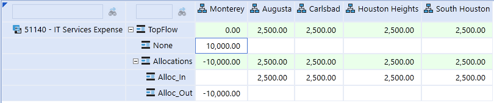

In the example above, Monterey is transferring their IT Services Expense to four other Entities. If a balanced entry is not required, the method below can be used by configuring the Destination and Source Transfer POV.

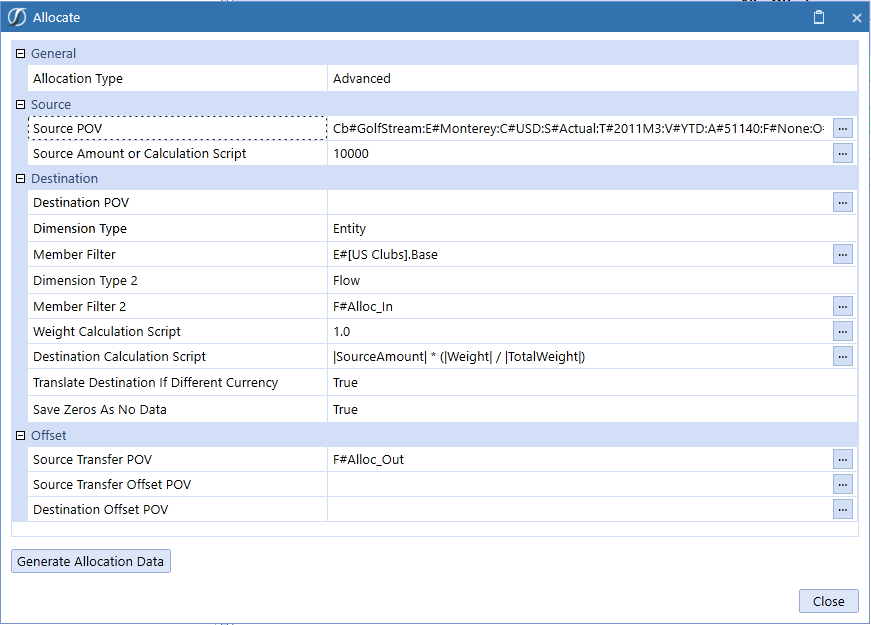

Source Transfer POV This is an optional field. Providing a Member Filter here will result in a transferring entry which will zero out the Source Amount. Using allocation members in the Flow Dimension in the example above, Monterey’s original value is reduced to zero after netting F#None with F#Alloc_Out, the Source Transfer POV. Note that the allocated values are targeted to the Alloc_In Member in the Destination.

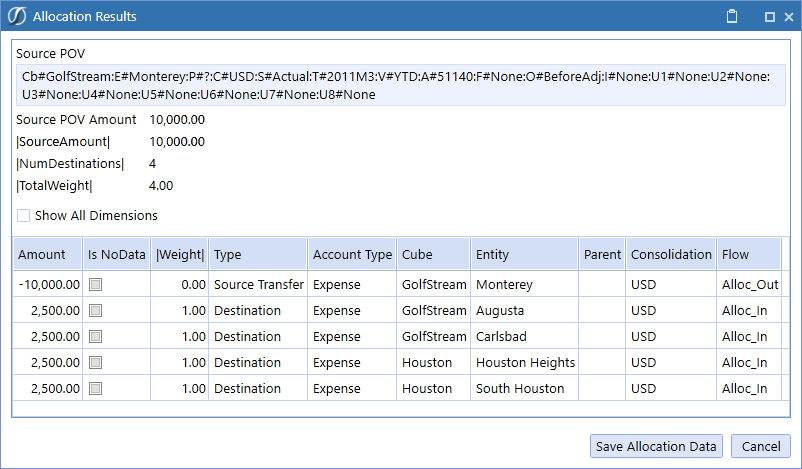

Source Transfer Offset POV This is an optional field but required to create a balancing entry usually in a different Account in the Source. In the example below, the intersection is a different Account and results in a different intersection from the Source POV being updated to offset the Source Transfer POV update that occurs with the allocation. In the example below, an expense in the Source POV is being reduced so the offset is to a payable (Liability) Account. Destination Offset POV This is an optional field but required to create a balancing entry usually in a different Account in the Destination. In the example below, the intersection is a different Account and results in a different intersection from the Destination POV or Member Filter being updated to offset the allocated value updates in the Destination. In the example below, an expense in the Destination is being increased so the offset is to a payable (Liability) Account. This could have been offset to an equity clearing Account instead, as this is typical.

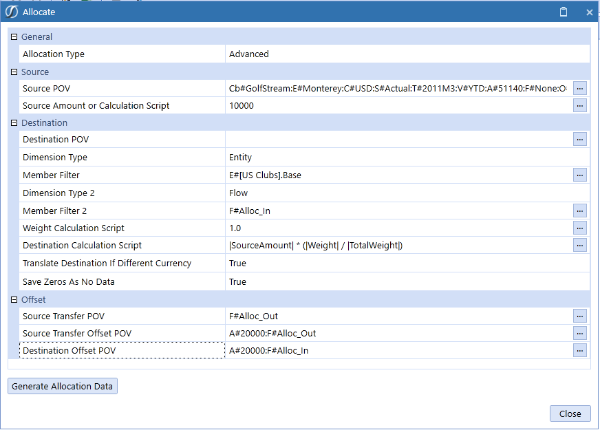

This results in these entries:

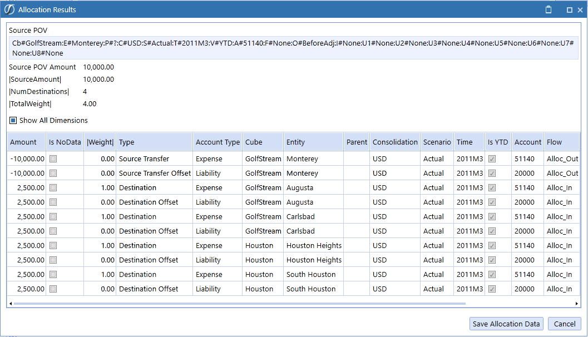

> **Note:** Both the expense and liability have been removed from Monterey and

transferred to the other four Entities:

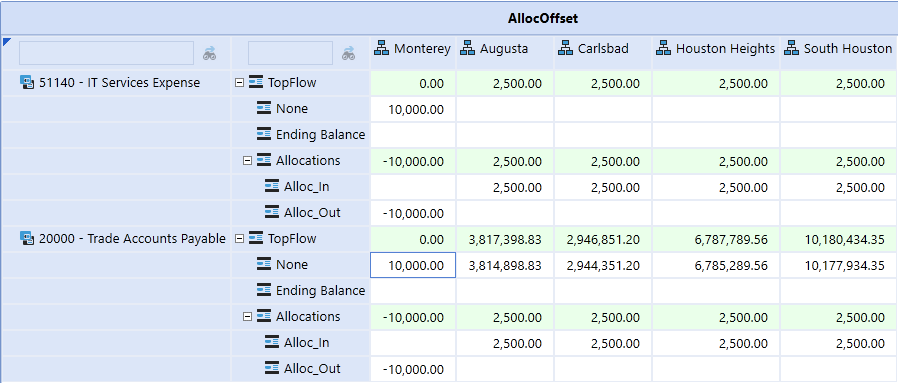

### Data Attachments For Selected Cell/Data Unit

Data Attachments can be added at the cell level or for the entire Data Unit and can be set up to show a red tick mark on cells that contain an attachment. These can be a textual comment, file attachment or both and with different types of attachments: Standard, Annotation, Assumptions, Audit Comment, Footnote or Variance Explanation. There can be many Standard attachments per cell or Data Unit, but only one of the other types. The other types of Data Attachments can be viewed in a row or column in a Cube View by selecting their related View Dimension Member. Attachment Types are part of the View Dimension which makes them available for a variety of reporting and explanation needed within the information delivery process. This allows them to be included within Cube View results. Data Attachments for Selected Cell/Data Attachments for Selected Data Unit Any cell in any grid can contain a data attachment. To attach a file, right click on any cell in a data grid and select Data Attachment for Selected Cell. Click the upper left Create Data Attachment

icon and select an Attachment Type from the drop-down menu, give it a title, select a file to attach or simply type in text, and click OK. The attachment will now appear in the Data Attachments box.

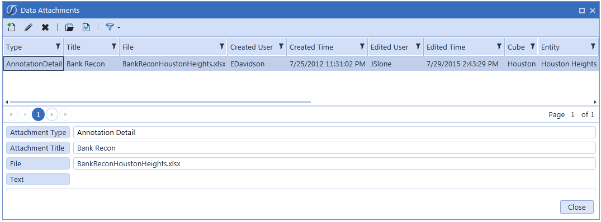

> **Tip:** This attachment can be viewed from any data grid that employs a Workflow Unit,

Scenario, and Period.  To view all data attachments for any Workflow Unit, Scenario and Period, right click on any cell and select Data Attachments For Selected Data Units. This ensures that all data attachments become valuable analysis tools.  This is part of the View Dimension because each is given a Type and the data attachments can be reported on as a whole and included in other types of reports.

### Spell Checking In Data Attachments

The text spell check feature is available only when using the Windows Application in a right-click menu. This feature is inactive by default. The default is set to Not Used. In Text Editor, the Review ribbon will allow the user to activate Spell Check using the Spell Check button. The Spell Check feature is enabled for the English language only. Spell Check will only work when English is selected in Windows for International users. The culture is determined by each user’s individual culture setting assigned in OneStream User Security. The culture is assigned to the OneStream application on the Application Server Configuration Utility as “en-US”. Spell Check in Data Attachments Spell Check options will be available when creating or editing Data Attachments. Once enabled, the spell check feature will actively check spelling in Data Attachments. The Spell Check will be applied to all Data Attachment dialogs once turned on. The user must right-click on a word to activate the Spell Check options where suggested solutions are presented. Choosing the “Ignore” option will only be retained for the current session. Closing and re-opening to the edit mode will re-check any previously ignored items.

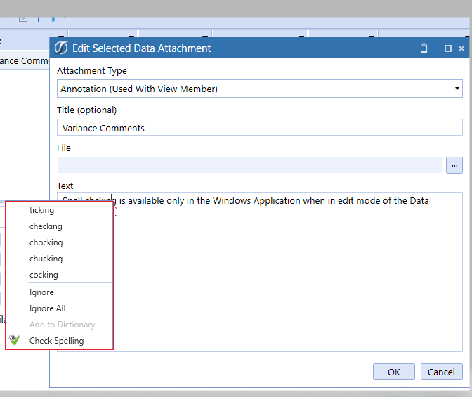

Choosing Check Spelling will check the spelling of words within the text box content from any starting point.

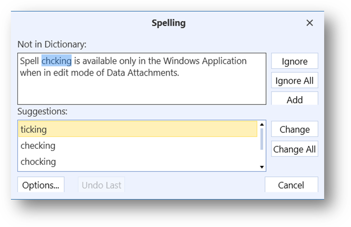

The Options button will allow the user to modify the Spell Check behavior within the current task session. These settings are never saved as a user preference.

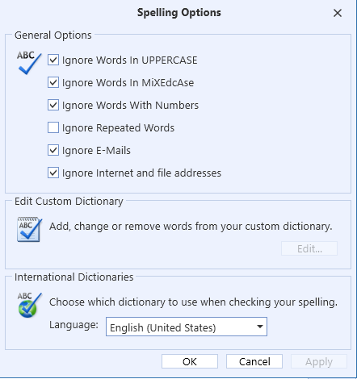

Users can also right-click on a word to turn English Spell Check on or off. The Spell Check Language will be set to (Not Used) by default in the Data Attachments text boxes.

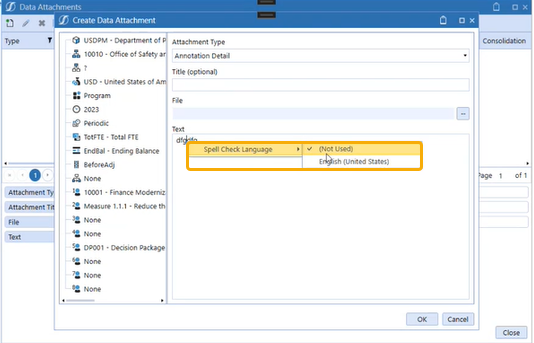

### Cell Detail

Cell Detail can be entered on a Cube View used for a data entry form, or on a Cube View or Quick View in Excel or Spreadsheet. Cell Detail can also be loaded via an Excel or CSV template. See Loading Cell Detail in Data Collection Guides for more details on creating these templates.  Cell Detail is available on any writeable O#Forms or O#BeforeAdj Member.  In order to disable this by account or any other intersection, use a Conditional Input Business Rule. See Finance Business Rules in Application Tools for an example of this rule.

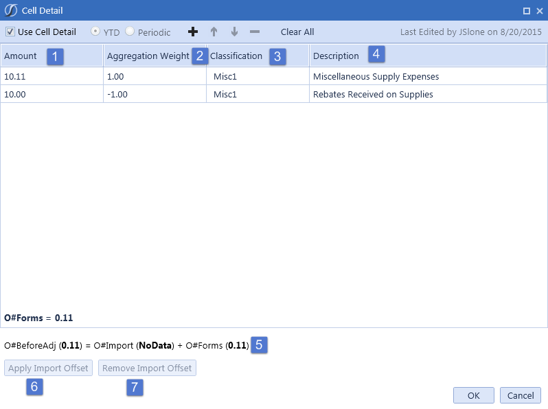

Cell Detail Toolbar Use Cell Detail Check this box in order to enable Cell Detail. YTD/Periodic This determines how the data is being entered in the Form. This only applies to Income Statement Accounts. If a YTD Form is being used and a Periodic line item is entered, the Form will calculate the YTD value and store it accordingly.

These icons add, delete, and move Cell Detail records in the grid. Clear All This removes all Cell Detail records in the grid but does not remove any stored numerical data from the Forms Member in the Cube. 1. Amount Enter the amount for the Cell Detail Record or Records. 2. Aggregation Weight Enter an aggregation weight to calculate a cell item using simple multiplication. For example, entering -1 will reverse the value in the amount column. 3. Classification The user can select a Classification from a drop list on each line item, where the list of Classifications is defined using a Dashboard Parameter specifically named as CellDetailClassifications. Once this Dashboard Parameter is created, Cell Detail will recognize the classifications without having to assign the Parameter to any Cube View or Form.

> **Note:** Users can add additional value items to a Parameter, or change existing items,

however, this will not change any classification assigned and stored to a line item in a form. 4. Description Enter text information about the Cell Detail. 5. This displays the values that are going to be stored in the Origin Members based on what was stored in the Cell Detail form. 6. Apply Import Offset This is used mainly for Budgeting purposes. This applies the reverse amount of what is in the Import Origin Member allowing users to enter the total amount for the cell intersection without having to determine what has already been imported. 7. Remove Import Offset This removes an Import Offset Adjustment previously made via the Cell Detail form.

### Cell POV Information

By hovering over the tick mark on a previewed Cube View, defaulted Members from this Cube View’s Point of View and the Cube’s Point of View settings will display in the form of a tool tip.

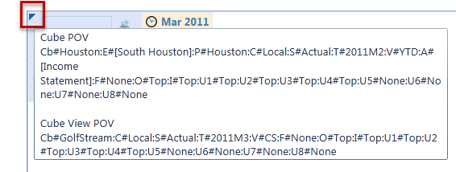

Right click on any cell and select Cell POV Information in order to see a detailed summary of the selected Members related to this intersection. All the major properties of these Members can be seen from this dialog.  The full Member Script and formula syntax to get to this value is also displayed. Users can use the clipboards to copy and paste the retrieve functions. The XFGetCell formula can be copied in this dialog and used in an Excel file to retrieve this specific data in Excel. The XFCell formula can be copied in this dialog and used in a text file, such as Word or PowerPoint, to retrieve this specific data in an Extensible Document. See Extensible Document Framework in Presenting Data With Extensible Documents for more details on this retrieve function.

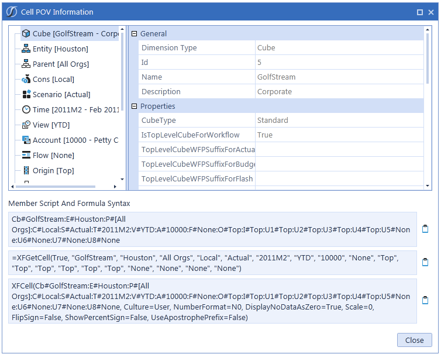

Interact with the Point of View in the Context Pane for the Cube View’s bolded Dimensions. When these Dimensions are changed, the Cube View’s results will change. In the example below the Cube View allows the Scenario and Time to change.

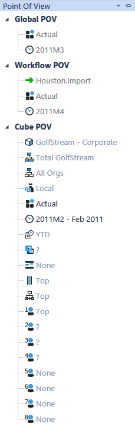

### Cell Status

Right click and select Cell Status in order to view status properties and Dimension information about a specific cell.

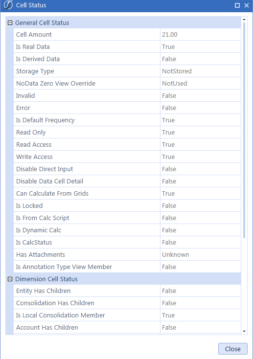

### Data Unit Statistics

Right click and select Data Unit Statistics in order to see details on the selected cell’s Data Unit. (Number of: zero cells, real cells, derived cells, NODATA cells, calculated cells, consolidated cells, translated cells, journal cells, input cells, etc.)

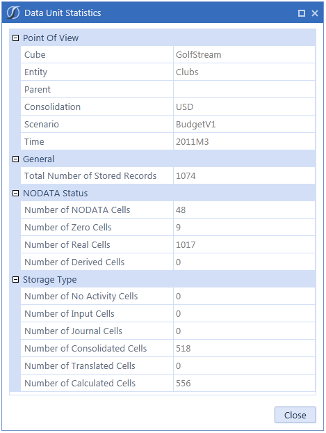

### Drill Down

When choosing Drill Down in the right click menu item in a Cube View or Quick View another tab will open with the Drill Down results. Drill down works the same whether a user is drilling from the data explorer grid in OneStream, from the Excel Add-In or OneStream Spreadsheet. An administrator might want to know what makes up Net Income for all Entities in Europe across all products groups, and with the Drill Down option this can be accomplished.

> **Tip:** Drill into any cell on a data grid or in Excel; it does NOT need to be a base level

number. The resulting screen shows the drilled back intersection in the Drill Down History section. The white cells show base amounts, meaning drilling cannot go further. The green cells can continue to be drilled.

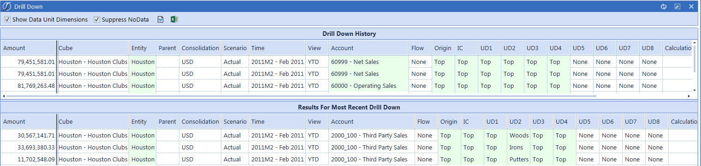

> **Note:** Drilldown is available on XFGetCell using the Excel Add-In. Right-click or use

the Drilldown option from the Analysis tab. Show Data Unit Dimensions When selected, the upper grid shows the Members for Cube, Entity, Parent, Consolidation, Scenario, Time and View. Download Results

These icons allow a download of the drill results into either a CSV or Excel file. When downloading drill results into a CSV file from the Drill Down page, the list separator in the CSV file is determined by the culture set on your user profile. If the culture on your user profile matches that of the operating system's regional settings, the file opens correctly in Excel without first having to save the file and then importing it into Excel. Drill Down History Every time an administrator drills further down a bread crumb trail of the last action is visible in the Selected Action column. This explains what happened in the drill down process to get to the most recent drill results on the bottom section of the screen. The user can always go back to this area and drill a different way into the data. The following options become available when a user right-clicks on any field. Not all options will be available for every cell. Entity Children Contribution (Entity Only) This shows how each Entity contributed to the Parent. Local Currency (Consolidation Only) This will show the local currency Entities. Member Children and Base This provides two ways to drill further into a green cell in the top section. The first will drill just into the children of the Member while the other will drill down to the white base cells. All Aggregated Data Below Cell This drills to white cells in each Dimension. All Stored Data in Data Unit This drills into all of the base stored data within the full Data Unit (Cube, Entity, Parent, Consolidation, Scenario, Time and View), so this is a much broader result set than the initially drilled data. Copy POV from Data Cell Select this to copy the Point of View for the selected cell. Create Quick View Using POV from Selected Cell Select this to create a Quick View based on the POV from the row selected from either the Drill Down History or the Results for Most Recent Drill Down pane. Individual data cells in the same row will result in the same Quick View being created. Cell POV Information Select this to see the full Point of View for the cell. Cell Status Select this to see information about the cell such as if the Members have children, if it is calculated, the lock status, etc. Calculation Inputs This gives details on the formula source accounts for a specific account. Load Results for Imported Cell This will drill back to the source data for the imported cell. Audit History for Forms or Adjustment Cell This will drill back to the source data for a Form or Journal.

> **Tip:** OneStream keeps a bread crumb trail of all drill actions in the right side of the top

drill screen under the heading Selected Action. Users will never get lost in the data as they can always start over from the top and begin a drill again. Origin Audit Drill Down Perform an Origin Audit Drill in order to see where data was delivered into the system. Right click on the Origin cell, typically Top and select Origin Base. This will reveal all the data that came from each Origin Member. This is now at the Origin Base and any of the following drill down processes can be performed. Import Drill Right click on the Origin Member Import and select All Aggregated Data. Right click again on the Origin Channel and click Load Results for Imported Cell and then select Navigate to Source Data to get down to the GL Account level. Right click on any cell in the source system data line to get down to the source document that created that line item. Forms Drill Right click on the Origin Channel Forms and select All Aggregated Data Below Cell. Right click again on the Origin Channel and click Audit History for Forms or Adjustment Cell.  This is the specific line item that created the drilled-on value.

> **Tip:** To see each line item from the Form used to create the drilled-on value, click the

button View All Submitted Data Cells. This is now showing all the line items from the Form used to create the actively drilled line item. AdjInput (Journals) Drill Right click on the Origin Channel AdjInput and select All Aggregated Data Below Cell. Right click again on the Origin Channel AdjInput and click Audit History for Forms or Adjustment Cell.  This is the specific line item that created the drilled-on value.  This view shows all Journal entries affecting this cell including previous Journals, deleted Journals and the current Journal.

> **Tip:** To see each line item from the Journal used to create the drilled-on value, click the

button View All Submitted Data Cells. This is now showing all the line items from the Journal used to create the actively drilled line item. User Defined Description – Drill-Down The Drill Down window displays the custom User Defined Description as the default header. If no custom description is created, the dimension type label, such as UD1, will display. See Application Properties and then User Defined Dimensions (Descriptions) for more information.

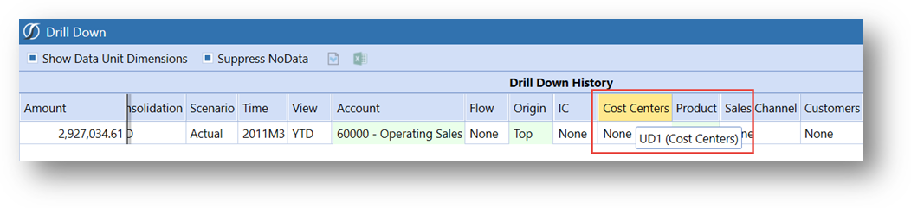

### Show Cube View As A Report

To generate a smoothly formatted presentation of the Cube View, click this button while in preview mode and a report similar to what one would see in Dashboards will open. Control column widths and row heights from within the Cube View. See Application Tab| Application Properties in order to show a company name and logo on all reports. There are also several application-wide settings for these Data Explorer reports under Application Properties and under the Application Tab| Presentation| Cube Views.

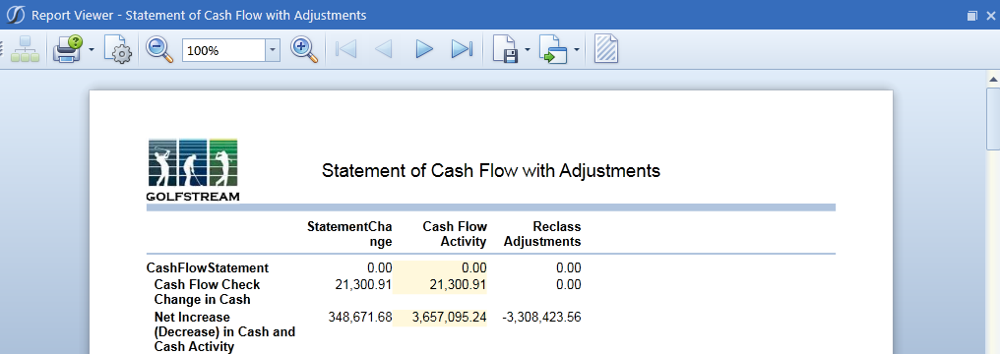

In order to print a Cube View, first generate a Report as shown above. Once the Report is generated, print and export that view to other Formats, such as PDF, HTML, RTF (for Word), CSV, Text, XPS, MHT or Excel.
