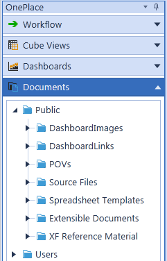
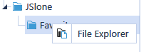

# Storing Documents

An administrator can save public documents or templates for users to access for their close process. These documents are saved in the Systems Tab|Documents where only administrators have access. However, a user can access these public documents in OnePlace.

> **Note:** Right click on any document or folder and select File Explorer in order to upload

files from the OnePlace or Systems tab. See File Explorer in System Tools for more details on this feature.

> **Note:** Files created with either the Spreadsheet or Text Editor feature are also visible

here. These files can be opened by Right clicking the file and selecting one of the three options. l Open in Text Editor Page/Open in Spreadsheet Page l Open- opens file in its related Microsoft application, if loaded on the local PC l Open With… this allows the user to select which application they want to use to open the file

> **Note:** The File Explorer option is also available by right clicking a file. Files can also be

uploaded or opened from this window.
