# Finance Engine Basics

Unless you are brand new to OneStream, you probably know that the OneStream platform contains a lot of functionality. If you are new to OneStream, don’t be intimidated. Even if you are an experienced OneStream veteran, there are areas of the product that you likely know better than others. Learning the entire scope of the product takes time and patience. We can follow the various functionalities of OneStream from the perspective of the data that moves through it – at its different stages. Data starts raw, living in disparate source systems, until finally appearing on a polished Report on the desk of the CFO. Along the way, the data can be parsed, transformed, validated, and loaded to a Cube. As data moves through OneStream, it is processed by different Engines; just as a car engine processes gasoline to make a vehicle accelerate, OneStream processes data to help propel a company forward. Of the various Engines within the platform, the Finance Engine is the primary Engine used to enrich data and add financial intelligence. Within this Engine, sophisticated calculations can be written to add company-specific financial intelligence. This book focuses solely on writing calculations within the Finance Engine. Before you start tinkering with the engine of your car, though, you had better know some basics about it. How do you turn it on? What smaller components is it comprised of? Where are the pistons located? What kind of gas does it need? The same is true for the OneStream Finance Engine. This chapter will introduce and break down the Finance Engine, which is where calculations take place.

## One Product, Many Engines

The Finance Engine is one of many Engines within the OneStream platform, with each suited to help process data as it moves within the product. The Finance Engine is an in-memory Financial Analytic Engine, which aggregates, consolidates, and provides financial intelligence to data. The Finance Engine works closely with the other Engines to create a unified User Experience. To introduce another metaphor, think of each Engine as a workstation within a factory that makes loaves of bread. Each station performs a specific task to bring raw data (flour, yeast, water) to a polished Sales Report (loaf of bread on the store shelf). Below is an overview of each of the various Engines in OneStream and how they interact with the Finance Engine.

### Stage Engine

The Stage Engine performs the task of parsing and transforming external data into the Cube, where it is then processed by the Finance Engine. It ensures that data is mapped to valid data points defined by the Finance Engine. The Stage Engine performs the role of the sourcing manager within the factory, ensuring the raw ingredients are prepped and refined before being used in the baking process.

### Data Quality Engine

The Data Quality Engine is responsible for the validation and certification of data within the Finance Engine. Think of the Data Quality Engine as the quality assurance manager, testing the product before it goes into the market.

### Data Management Engine

The Data Management Engine interacts with other Engines by providing the ability to automate tasks within those Engines. For example, the Clear Data step – within Data Management – clears data within the Finance Engine while the Export Report step interacts with the Presentation Engine. Think of the Data Management Engine as a robot that is used to automate certain assembly line activities within the factory.

### Presentation Engine

The Presentation Engine provides data visualization functionality. Data processed within the Finance Engine can be viewed on a Report or exported to Excel using the Presentation Engine. Think of the Presentation Engine as the distribution mechanism that brings the factory’s finished products to the store shelves.

### Workflow Engine

The Workflow Engine coordinates the activities of the other Engines via defined processes and responsibility hierarchies. It provides the ability to show the status and audit trail for specific tasks performed across the other Engines. The Workflow Engine is the factory manager, coordinating all the activities of the assembly line and reporting the status to superiors.

### Bi Blend Engine

The BI Blend Engine supports the reporting of large volumes of transactional or highly changing data. While BI Blend is a separate Engine from the Finance Engine, it does leverage metadata hierarchies from the Finance Engine to add structure and commonality to the data. Think of a BI Blend as a separate section of the factory, which uses similar ingredients to produce donuts instead of bread.

## Engine Interaction Via Business Rules

Each Engine described above can be interacted with to supplement standard functionality by executing custom scripts through Business Rules.

### Business Rule Library

The Business Rule library categorizes Business Rules by the Engines they relate to.

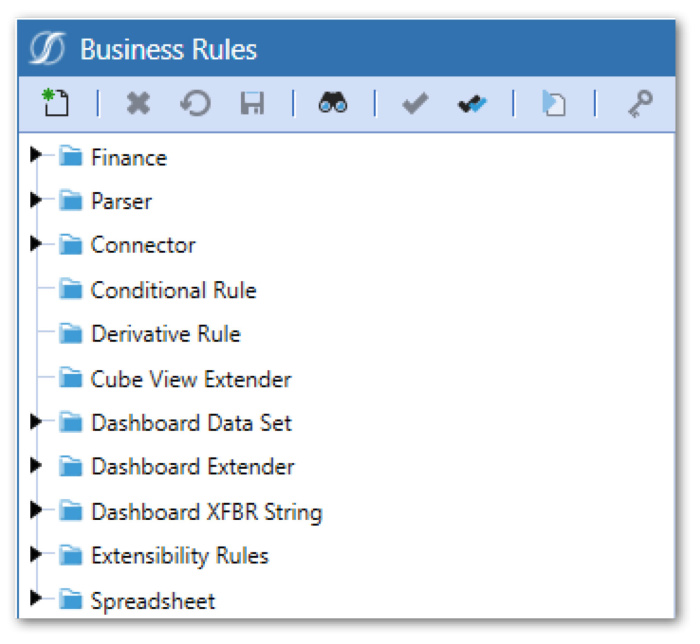

### Business Rule Editor

Here are the components and key features of the Rule Editor:

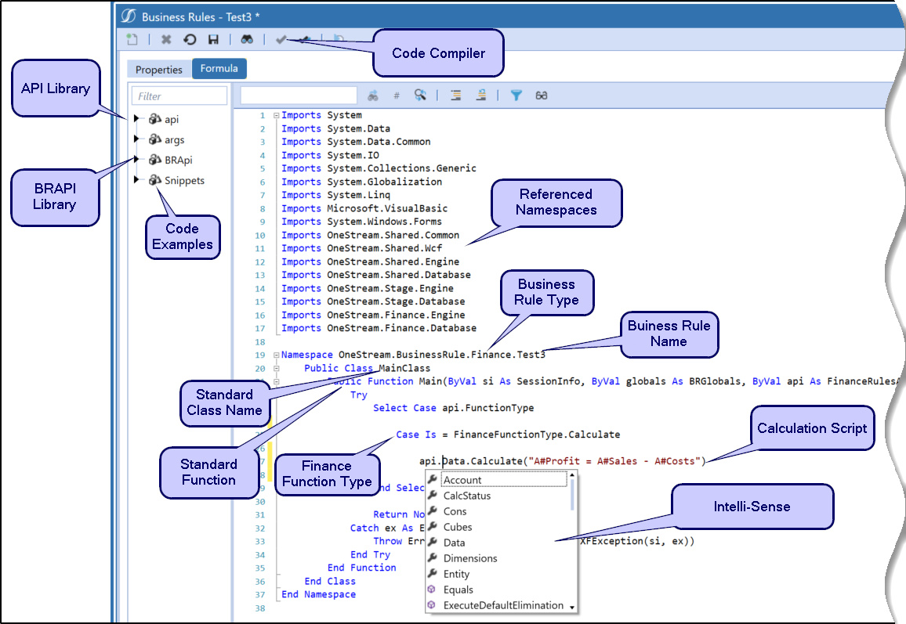

### Code And Script

The OneStream platform is based entirely on the Microsoft .NET Framework, as is the OneStream Business Rules Engine. Therefore, VB.NET is the logical choice for Business Rule syntax. VB.NET is one of the most popular programming languages in use today. This language is prevalent amongst Business Users because the syntax is perceived to be more readable and Business User-friendly than other programming languages. VB.NET still shares many of the same syntax elements of older VB dialects, such as VB6, VBA, and VBScript. This means that Users who have written macros in Microsoft Excel or used VBScript to write Business Rules in first- generation CPM solutions should feel comfortable with the core syntax elements of VB.NET. The main learning challenge Business Users face when migrating to VB.NET is understanding the object-oriented nature of the language. In comparison to VBScript, VB.NET offers a more elegant coding paradigm. As mentioned in this book’s introduction, you don’t need to be an expert-level coder to be proficient at writing Calculations. Does it help? Certainly, but it is far more important to grasp the OneStream-specific concepts around the data and understand the underlying business processes driving the Calculations. The coding part will come over time.

> **Note:** The C# programming language will be enabled for Business Rules in the future.

#### VB.Net Basics

This book will not teach you how to code VB.NET, but I will try to list common VB.NET concepts that will persist in many of your Calculations. There are a ton of online resources that can explain these concepts better than I can. This is far from a comprehensive list but a good starting point.

#### Data Types

• String (simple text string, e.g., “Hello”) • Integer (number without decimals, e.g., 123) • Decimal (full 128-bit variable) • Double (number with decimals, e.g., 123.45) • Boolean (True or False) • GUID (unique ID) • Array

#### Collection Classes

• List(OfValueClass) • Dictionary(Of KeyClass, ValueClass)

#### Classes & Methods

• Constructors • Variables • Properties • Subs • Functions • Events

#### Other Relevant Concepts

• Namespace – provides a path to identify classes when their names are not unique within an assembly • Imports – allow you to use someone’s classes with their short names • Public Variables – allow for the exposure of variables and functions to other classes (e.g., other Business Rules) • If, Then, Else If, End If • Select, Case • For, For Each, Next

### The OneStream API Library

Each Business Rule Type contains a plethora of API functions that allow you to interact with, and access, objects within that Engine. For example, using API functions, we can access Member names or descriptions from the Finance Engine, retrieve the Workflow status from the Workflow Engine, or parse Stage data from the Staging Engine. Getting familiar with the vast set of API functions will be a big part of Calculation writing. API functions will be specific to the Type of Business Rule that you are working in. Since Cube Calculations are written in Finance Business Rules, we will primarily be using Finance-specific API Functions. Throughout this book, you will be introduced to quite a few of these API functions, only scratching the surface of all that are available.

### BRApi

The BRAPI is common across all Business Rules and Engines. A BRAPI function runs outside of the other Engines and can orchestrate certain functions from within other Engines. In other words, a BRAPI function will allow you to execute functions outside of the Engine you are working in. For example, a parser function can be executed from a Finance Business Rule. While not covered in detail in this book, learning the entire suite of API functions within other Engines can help your Calculation writing skills since these APIs can be accessed through the BRAPI library.

### In-Solution Documentation

The OneStream Business Rule Editor includes context-sensitive help for API properties and Methods as well as snippets (code examples). In-solution documentation makes the process of writing a Business Rule more efficient because API documentation, objects, and samples are presented within the Business Rule Editor window. In addition, useful code snippets – accumulated by the OneStream engineering and consulting teams – are also presented in a context-sensitive manner within the Business Rule Editor.

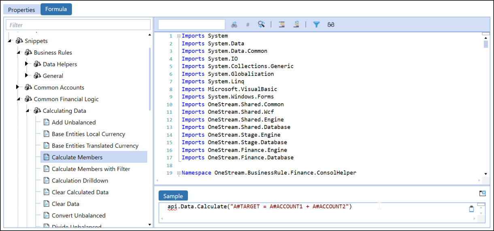

### Intellisense

IntelliSense is a code completion tool that is built into the OneStream Business Rule Editor. Start typing a function and IntelliSense will open available classes and functions right there on the screen, giving you the proper syntax and required parameters. It’s like coding training wheels. If it isn’t already, IntelliSense will soon become your best friend in rule writing.

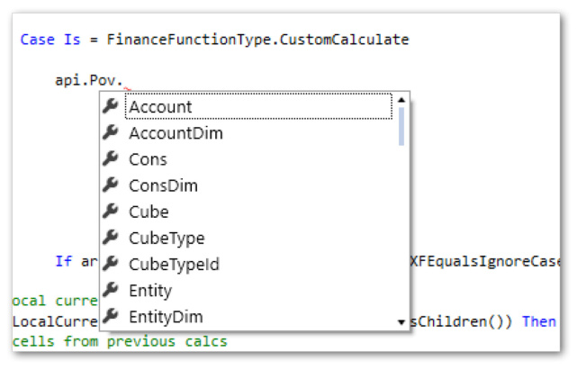

## The Cube Stores, The Finance Engine Processes

Data that is processed by the Finance Engine resides in a multidimensional database called a Cube. Data processed by the Staging Engine is loaded into the Cube. Data can also be inputted directly into the Cube via the Workflow Engine through data entry Forms. Simply put, Cubes store the data, and the Finance Engine processes it.

### Dimensions

Data is stored across the 18 Dimensions listed below. Some Dimensions are editable, and some are standard with a pre-defined list of Members.

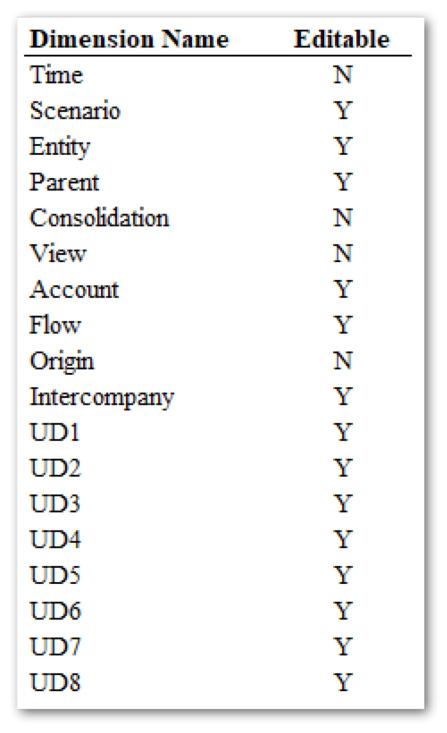

### Data Unit

The Data Unit acts as a grouping mechanism for data in the Cube and is defined as all data within a combination of Entity, Parent, Scenario, Consolidation, and Time Members. The Data Unit is the unit by which the Cube is partitioned and processed. In other words, Cube data is divided into Data Units, and the Finance Engine processes all the data within each Data Unit at once. Understanding the Data Unit and how data is stored in the Cube is crucial to writing Calculations and is covered in more detail in the next chapter.

## Functions Of The Finance Engine

The Finance Engine describes the set of features and functionalities that process data within the Cube. Below is a brief description of the various functions the Finance Engine performs.

### Consolidation Algorithm

The Consolidation algorithm encompasses several actions performed on Cube data: •

### Data Storage And Aggregation

• Currency Translation via the Translation algorithm • Calculation of `C#Share` by considering Entity Ownership %  • Intercompany elimination logic • Company-specific Calculations via Business Rules and Member Formulas The default Consolidation algorithm that performs the above functions can be modified in the Cube properties.

### Data Storage And In-Memory Aggregation

Data storage occurs at the Base-level Members of the 18 Dimensions contained in the Cube. The Consolidation algorithm also writes and stores aggregated Base data to Parent Entity Members. Parent Members in non-Data Unit Dimensions are aggregated in-memory only.

### Finance Business Rules And Member Formulas

Sophisticated Calculation and business logic can be executed when the Finance Engine executes the Cube Consolidation or Calculation algorithms through Finance Business Rules or Member Formulas. This ability opens up infinite possibilities for how data can be manipulated and created. The majority of this book focuses on how to write Calculation Scripts via Business Rules and

### Member Formulas.

Calculations within the Finance Engine are written in the Business Rule or Member Formula Editor, right inside the OneStream software platform, from the desktop app or the browser-based web application. In a practical sense, there is very little difference where you decide to write your Calculation logic. Both options have the same API functions available and can perform mostly the same things. There are, however, a few nuanced differences that I will describe below. Aside from these differences, everything else is essentially identical between them.

#### Finance Business Rules

#### Location

The Business Rule Editor can be accessed by going to Business Rulesin the Applicationtab.

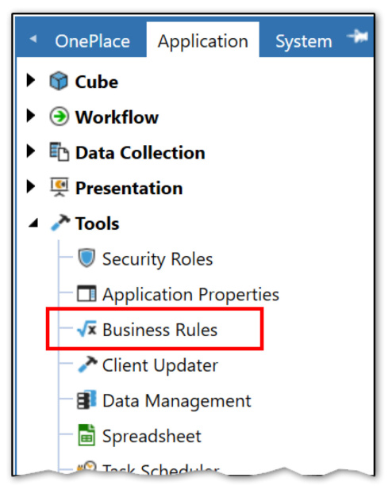

Finance Rules are grouped at the top, and each Rule created within is an independent object encapsulating VB.NET code.

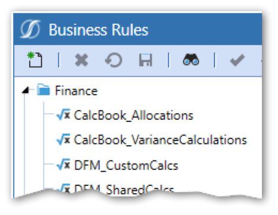

Each OneStream Business Rule has a pre-defined Namespace, a Public Class, and a Public Function that the OneStream platform Engines invoke when the Business Rule needs to be called.

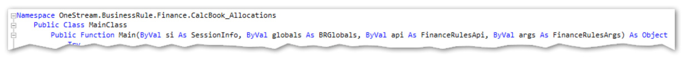

#### Finance Function Types

A unique attribute of Business Rules compared to Member Formulas is that Finance Function Types can be accessed to allow interactions with specific parts of the Calculation Engine. Below are Finance Function Types relevant to Calculations:

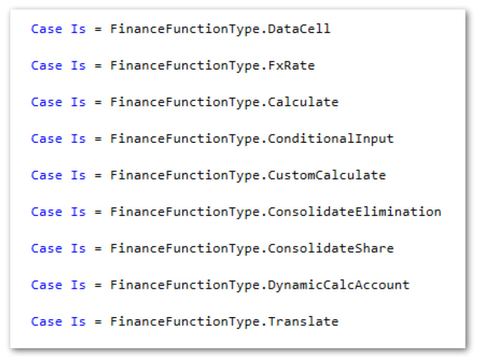

Business Rules give the ability to execute any of the above Finance Function Types. This is a key difference from Member Formulas, especially when needing to run Calculations outside of the Data Units Calculation Sequence using the Custom Calculate Finance Function Type (more on that later).

#### Advantages

The biggest advantage of using Business Rules over Member Formulas is the ability to control behavior through Finance Function Types, which are not available in Member Formulas. For example, Custom Calculate functions – which are explained in detail later in this chapter – cannot be executed through Member Formulas. Business Rules can also have some advantages when your Calculations have a high level of volume and complexity. For example, you may want to calculate multiple Accounts within the same script using some shared logic. While you technically could, it wouldn’t make much sense to put that logic in a Member Formula since it doesn’t apply to just one Member. You can also reuse variables and other objects through the duration of the Business Rule, which can save some redundancy if many Member Formulas are using the same variables. With Business Rules, all your Calculations are in one place, so it can actually make management easier if Calculation volume is high.

#### Member Formulas

#### Location

The Member Formula Editor can be accessed by going into any Scenario, Flow, Account, or UD Dimension Member’s Formulaproperty.

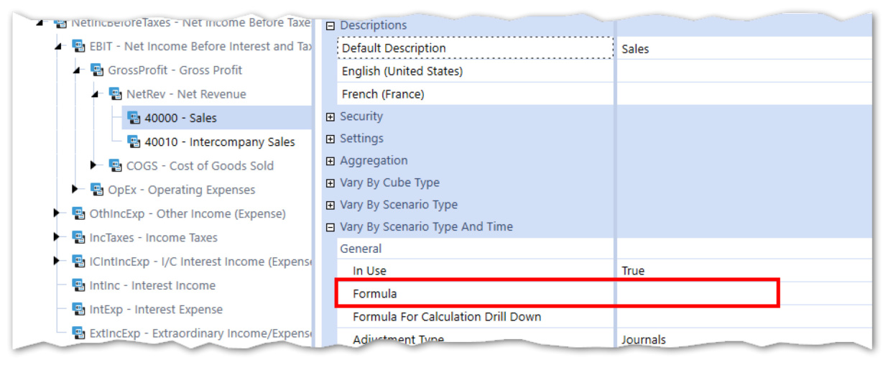

Menus are shown, which can allow Calculations to vary for specific Time periods and Scenario Types.

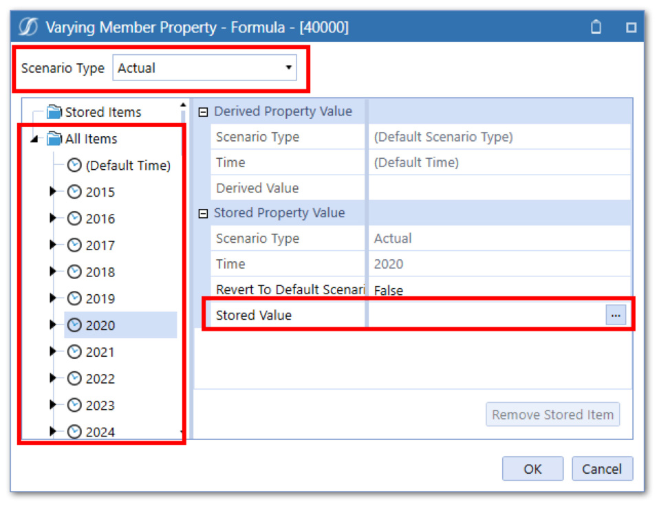

Clicking the Stored Value property opens the Formula Editor, which is similar in look, feel, and functionality to the Business Rule Editor.

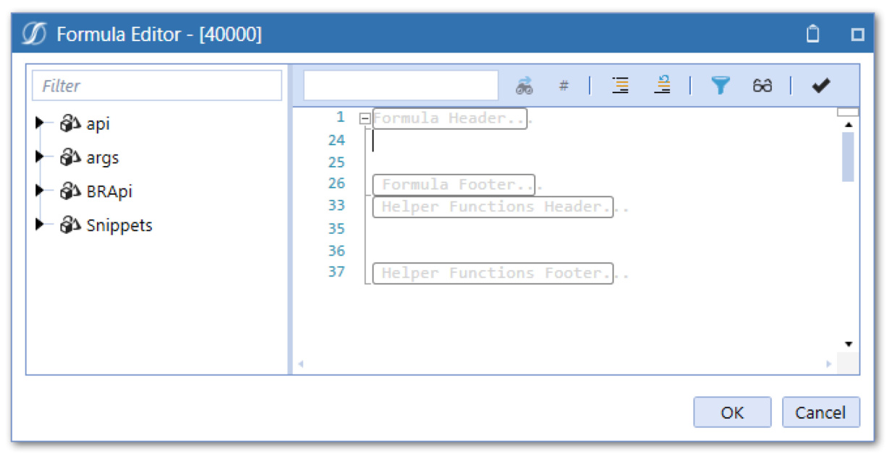

Assigning stored formulas to Members is for organizational purposes only. Formulas written to a particular Member are not restricted to writing data only for that Member. However, if a formula is attached to an unrelated Member, it can make the application difficult to maintain and understand. Therefore, decide to attach a formula that calculates multiple Members to the Scenario’s Member Formula or a Business Rule instead.

#### Calculation Drill Down

When analyzing data from Cube Views or Quick Views, data can be drilled into, down to the base data, and even beyond to the Stage tables and source system. If a calculated Member is drilled down upon, Calculation Drill Down can be enabled so that the data can be drilled on further – to show the Calculation inputs. To enable this functionality, a drill down script is entered on the Member’s Formula for Calculation Drill Down property.

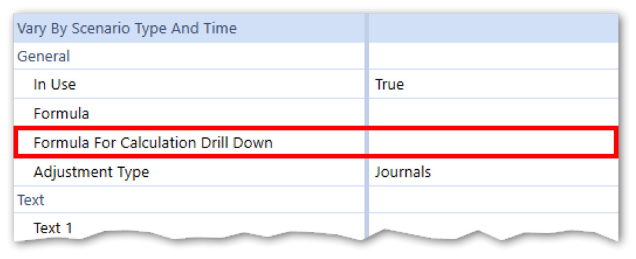

This formula will utilize specific drill down API functions and arguments.

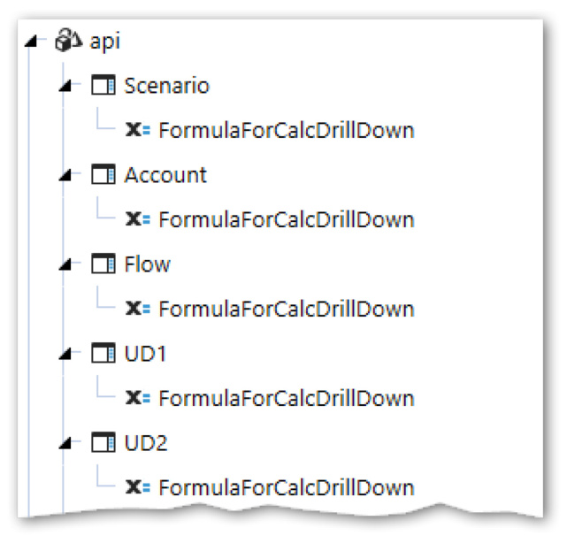


#### Advantages

The first benefit of Member Formulas is that they provide a natural organizational structure to your Calculation code that is maintenance-friendly. If you want to edit the Calculation Script for the Sales Account, you can quickly find it in the Dimension Library. There won’t be a bunch of other scripts there, and it will generally be easier to read. Member Formulas can vary by Scenario Type and/or Time without the need to write code. The Member Formula stores all these variations directly on the Member, via properties, through which the Administrator can carry out maintenance using drop-down menus. For example, you’ll likely encounter a requirement for a Calculation to change as of a certain date, or to calculate things differently on an Actual Scenario than a Forecast Scenario. Again, the Member Formula accommodates this out-of-the-box without needing to write additional lines of code. Another aspect of Member Formulas is the ability to assign a Formula Pass, which executes in order within the Data Unit Calculation Sequence (covered later in this chapter). Formulas running in the same pass multithread (run in parallel), so they do have a slight performance impact compared to Business Rules. The drawbacks of Member Formulas lie in the fact that they are a bit less flexible and lack some functionality for certain types of rules. Member Formulas only give the ability to run Calculate and Dynamic Calc Finance Function Types. If you need to run a Custom Calculate function, you will need to use a Business Rule. Lastly, with large Calculation volumes, it can become cumbersome to have to go Member by Member to find the Calculation, and it might be easier to manage all Calculations within one or a handful of Business Rules.

#### Which Is Better – Business Rule Or Member Formula?

Aside from the functionalities that Business Rules have, that Member Formulas do not, it comes down to which is easiest to maintain and administer when making the choice. The bottom line is that – in a given implementation – you will likely have a mix of both Business Rules and Member Formulas, and it is largely up to the Consultant or customer which Method is deployed.

#### Referencing Business Rules In Other Business Rules Or Member

Formulas Business Rules can be called from other Business Rules, or from within Member Formulas. First, the shared Business Rule is created.

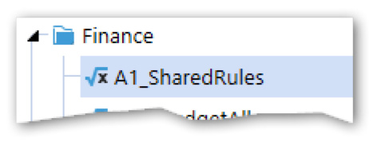

In the Properties tab of the Business Rule, make sure Contains Global Functions for Formulas is set to True.

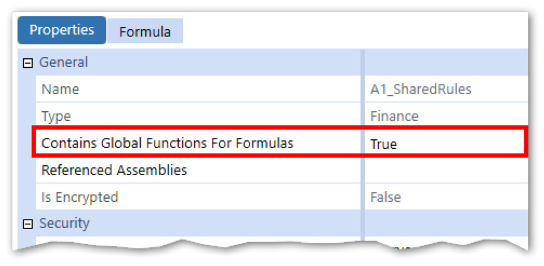

Inside this Rule, public functions are created and referenced by other Rules and Member Formulas. The function `Main` is included when creating the Rule, and other functions can be added if needed.

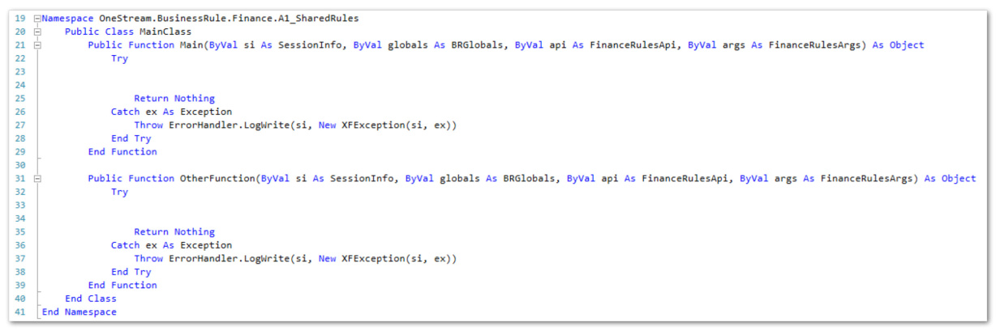

Next, call the Business Rule from a Member Formula using the below script:

```vb
Dim sharedFinanceBR AsNew
OneStream.BusinessRule.Finance.A1_SharedRules.MainClass
```

Each function within the Rule can then be called. Make sure all required parameters are passed in.

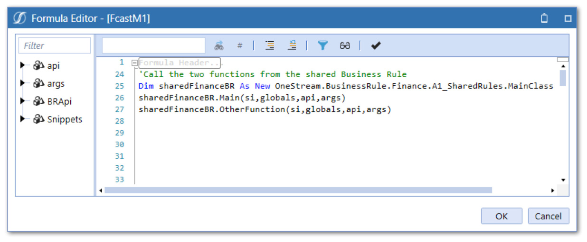

Using this technique can help streamline your Business Rules and Member Formulas as common logic or script does not need to be repeated in multiple rules.

### Cube Properties

The below Cube properties can change the standard Consolidation algorithm

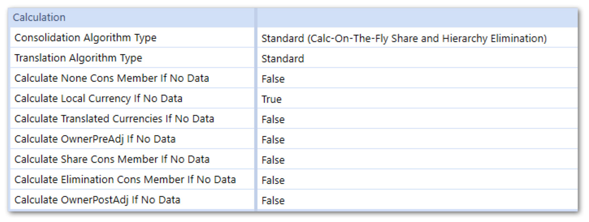

#### Consolidation Algorithm Type

The Consolidation Algorithm Type has the below options: • Standard (Calc-On-The-Fly Share and Hierarchy Elimination) •

#### Stored Share

•

#### Org-By-Period Elimination

•

#### Stored Share And Org-By-Period Elimination

•

#### Custom

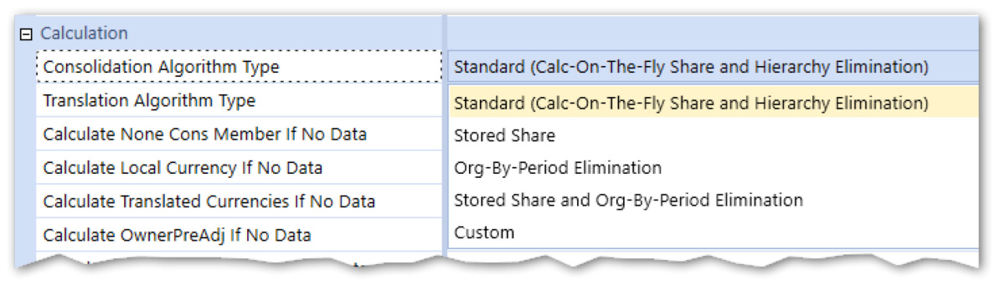

#### Standard

This is the default Consolidation algorithm. Amounts for the Share Consolidation Member are calculated dynamically and amounts for the Elimination Consolidation Member are calculated using built-in algorithms. Only in rare circumstances should Standard not be used.

#### Stored Share

This is similar to Standard, but values for the Share Member are stored instead of being calculated dynamically.

#### Org-By-Period Elimination

This differs from the standard Consolidation algorithm in that – when calculating the Elimination – this option considers the position of the IC Member in the Entity hierarchy and checks the percent Consolidation for every relationship down the hierarchy. If a percent Consolidation is zero, the IC Member is determined not to be a descendent of the Entity, and no elimination is calculated.

#### Stored Share And Org-By-Period Elimination

This option stores the Share Member and uses the Org-By-Period Elimination logic described above.

#### Custom

The Consolidation will utilize custom Business Rules to calculate amounts for the Share and Elimination Consolidation Members using the Finance Function Types of Consolidate Share and Consolidate Elimination.

#### Translation Algorithm Type

The Translation Algorithm Type has the following options: •

#### Standard

• Standard Using Business Rules for FX Rates •

#### Custom

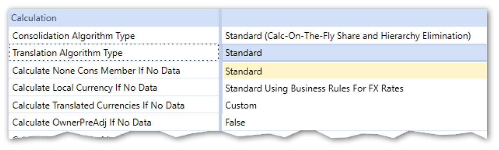

#### Standard

This setting runs the default Translation algorithm. Amounts calculated for a foreign currency Consolidation Member will be generated using the FX Rates determined by the Cube or Scenario settings.

#### Standard Using Business Rules For Fx Rates

This setting will run the default Translation algorithm, described above, but also allow the ability to run specific different FX Rates, beyond what is assigned to the Cube or Scenario. For example, if the required FX Rates differ for certain Accounts, this setting would be chosen, and a Business Rule would hold the logic to determine which Accounts get different rates.

#### Custom

This setting assumes Translation will be run entirely through Business Rules assigned to the Cube that use the `FinanceFunctionType`.

#### Nodata Calculate Settings

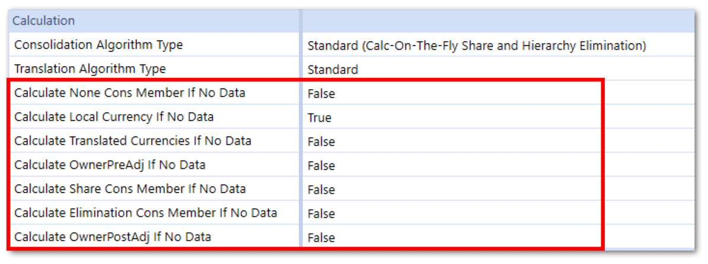

These settings control whether the Finance Engine will execute Calculations against cells within the specified Consolidation Member, even if there is no data stored in the entire Data Unit. This can provide a performance benefit and False should be the default setting for all Members except for Local. The use case for setting to True is when using a Business Rule or Member Formula to copy data from another Time period or Scenario. If not set to True, Data Units that are empty in the Target Data Unit will not run, even if there is data in the Source Data Unit and, thus, will not copy the data. Note that in most situations where data is copied from other Time periods or Scenarios, only copying `C#Local` data is suitable as the Consolidation algorithm will translate and consolidate the  local data to the other Consolidation Members.

## When And How Do Calculations Run?

How is the Finance Engine started so that our scripts inside Business Rules and Member Formulas execute? Going back to the car analogy, we need to know how to start the car and push the gas pedal. This section covers the mechanisms in which the Finance Engine can be initiated. There are two underlying processes that are triggered to execute the Calculation Scripts stored in Business Rules and Member Formulas – the Data Unit Calculation Sequence (DUCS) and Custom Calculate.

### Data Unit Calculation Sequence (Ducs)

The Data Unit Calculation Sequence (abbreviated to DUCS) is a series of steps that occurs each time a Calculation or Consolidation is run on the Cube. Below are the steps involved in the DUCS: • Clear previously calculated data (based on cell Storage Type – will not clear Durable Data). Note: OneStream will only perform this action if the calculated Scenario has its Clear Calculated Data During Calcsetting set to True • Run Scenario Member Formula • Perform reverse Translations by calculating Flow Members from other alternate currency input Flow Members • Execute Business Rules 1 and 2 (as assigned to Cube) • Execute Formula Passes 1 through 4 (Account formulas, then Flow formulas, then UD1 formulas, UD2, … UD8) • Execute Business Rules 3 and 4 (as assigned to Cube) • Execute Formula Passes 5 through 8 (Account formulas, then Flow formulas, then UD1 formulas, UD2, … UD8) • Execute Business Rules 5 and 6 (as assigned to Cube) • Execute Formula Passes 9 through 12 (Account formulas, then Flow formulas, then UD1 formulas, UD2, … UD8) • Execute Business Rules 7 and 8 (as assigned to Cube) • Execute Formula Passes 13 through 16 (Account formulas, then Flow formulas, then UD1 formulas, UD2, … UD8)

#### Consolidation Dimension

The Consolidation Dimension is part of the Data Unit which means that the DUCS will run for each Member. There is a slight nuance I should point out, which is that some `FinanceFunctionTypes` mentioned earlier will only run at certain Consolidation Members. The  below table shows which Finance Function Types run when each Consolidation Member is processed during a Consolidation.

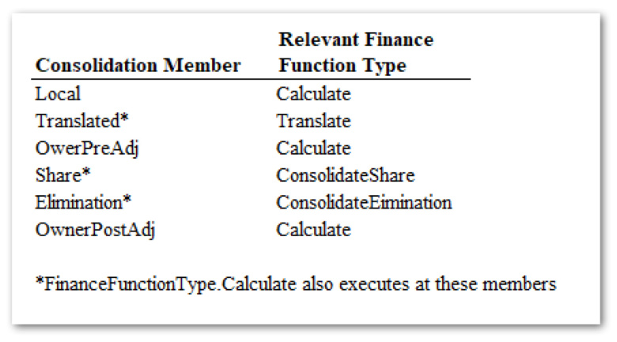

#### Assigning Business Rules To The Cube

Finance Business Rules need to be assigned to the Cube for them to execute within the DUCS. In Cube Properties, there are up to 8 Finance Business Rules that can be assigned to the Cube.

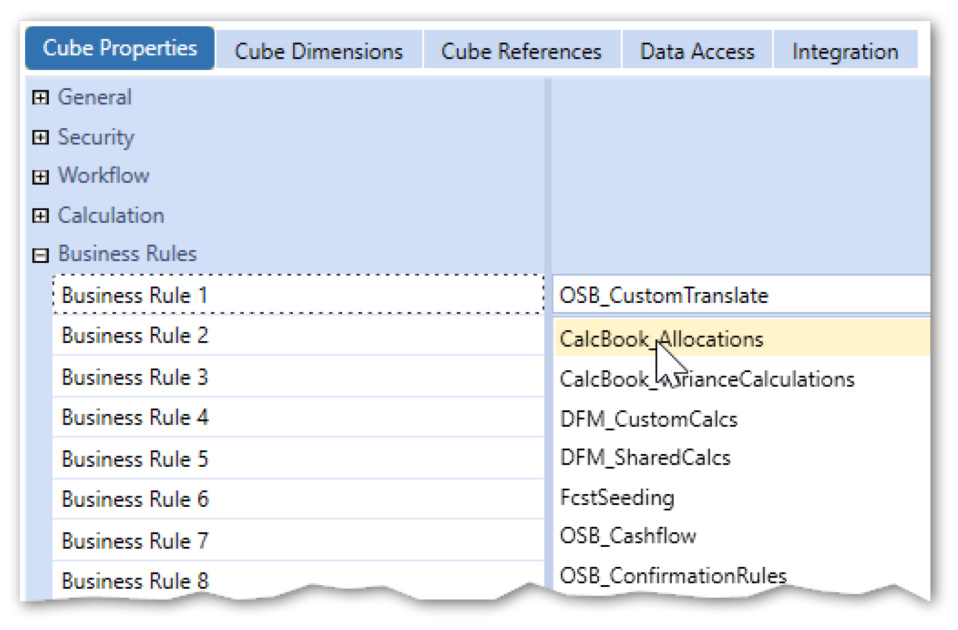

Note that some Business Rules may only run at certain Consolidation Members based on the `FinanceFunctionTypes `used.

#### Member Formulas

A Member Formula assigned to any Account, Flow, or UD Member with the Formula Pass Property set to FormulaPass1-16 will be included in the DUCS.

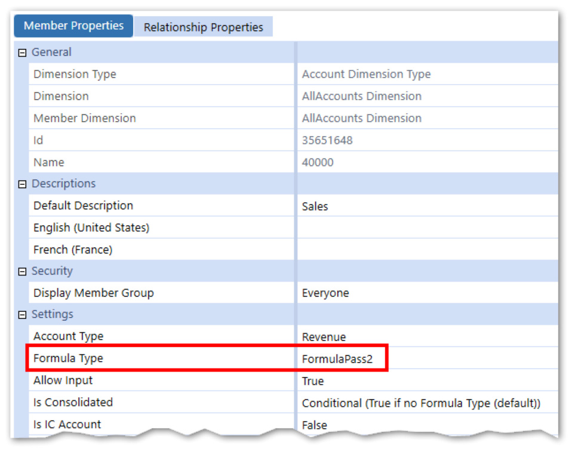

When storing Calculations on Member Formulas, it is important to pay attention to the Is Consolidated Property. The default setting of Conditional (True if no Formula Type (default)) means that data for this Account (calculated or otherwise) will not be consolidated. If you want data to be consolidated (as would be in most cases), this setting should be changed to True.

#### Triggering The Ducs

The DUCS is triggered by executing either a Consolidation or Calculation on one or more Data Units in a Cube. So, what’s the difference between a Consolidation and Calculation? A Calculation simply executes the DUCS for the selected Data Unit, while a Consolidation executes the DUCS and does several additional actions. A Consolidation will: • Aggregate and store data at Parent Members in the Entity hierarchy • Execute Currency Translations • Execute Intercompany Eliminations • Execute the DUCS As with many things in OneStream, you are provided with a menu of options for where, when, and how you want your Calculations to execute. Below are all the places where Users can execute Consolidations and Calculations. • Data Management • Cube Views • Dashboard Button • Workflow Process Step

#### Data Management

Let’s start with the most common and logical place to execute Calculations. Data Management (DM) can be used to, amongst other things, calculate, clear, copy, and export data. DM is structured into steps that are assigned to sequences. Sequences are then executed either directly from the DM module, or attached to other OneStream objects like Dashboards.

#### Create The Step

The Calculate and Custom Calculate Step Types can be used to execute a Calculation.

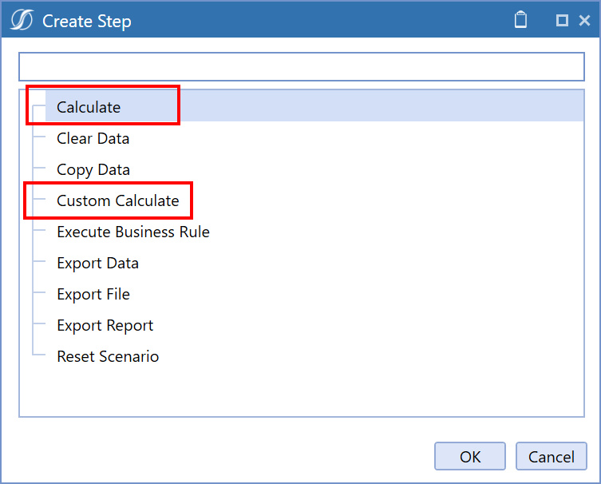

#### Calculation Type

Selecting the Calculate Step will require you to further specify the Calculation Type.

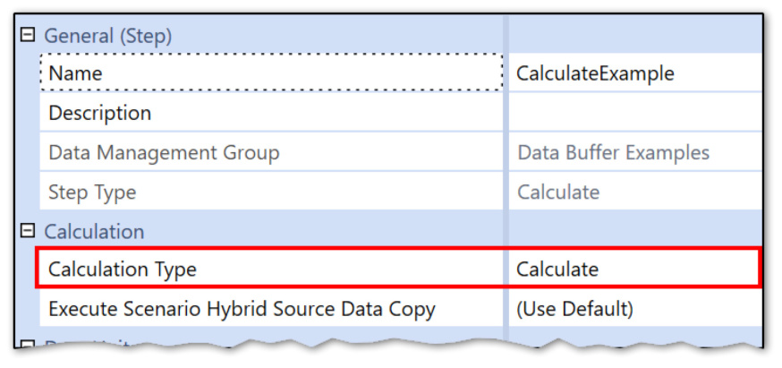

You can choose between Calculate, Translate, or Consolidate, which all contain With Logging and/or Force variations.

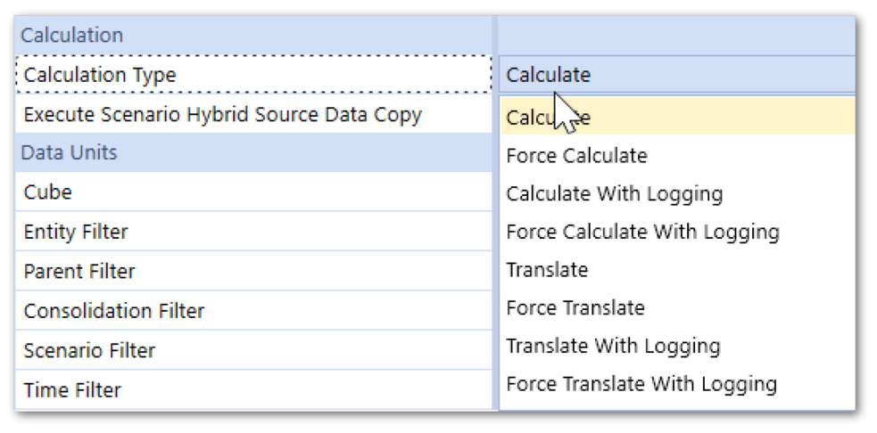

#### Define The Data Unit

Properties and required inputs will differ per the Step Type, but both Calculate DM steps require specification of the Data Unit Dimensions.

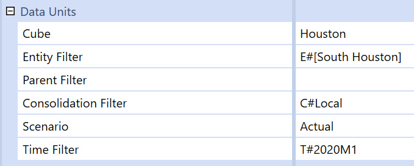

> **Note:** The automation and scheduling of Data Management sequences can be configured

through Windows PowerShell scripts running on the Application Server.

#### From A Cube View

Users can execute Calculations and Consolidations directly from a Cube View by enabling those actions in the Cube View properties.

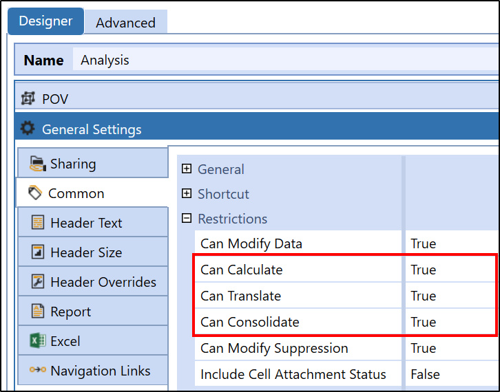

Setting these properties to True will activate those options in both the Data Explorer Header and in the right-click menu on each data cell.

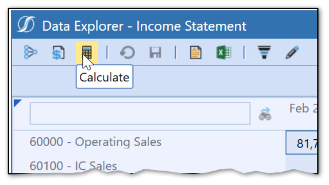

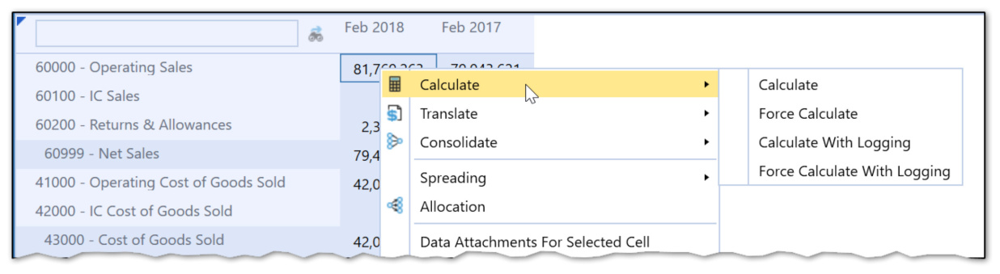

While not explicitly defined when clicking Calculate, the Data Unit(s) upon which the Calculation will run will be inherited from the POV of the clicked cell.

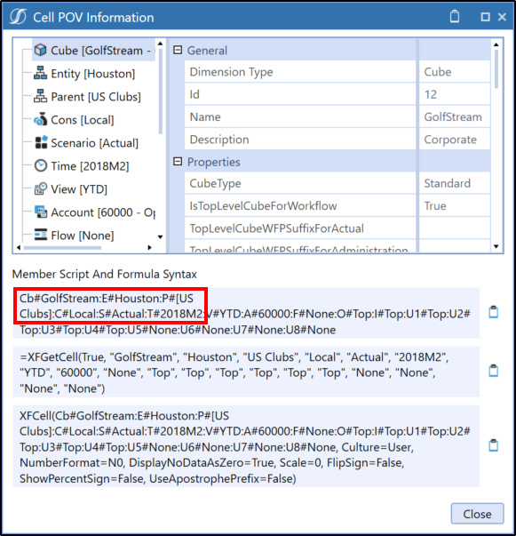

> **Note:** Custom Calculate Functions cannot be called from a Cube View.

#### Dashboard Button

Dashboards are collections of various Components in a nice, User-friendly layout. One of those Components is a button that, when clicked, can trigger an action to take place. In theActionsection of the button properties, the Server Task section allows you to either execute a DM Sequence (which would presumably contain a Calculate Step) or execute a Calculation directly.

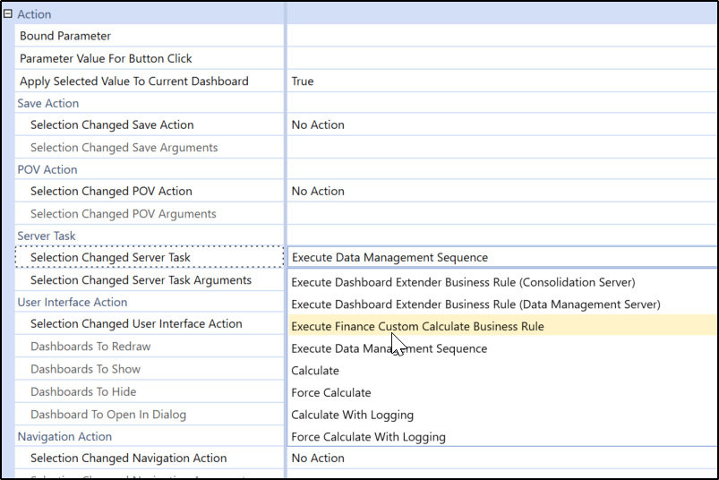

Arguments for the selected task will also need to be defined, which will control the Data Unit(s) that the task runs for.

#### Workflow Process Step

Built into OneStream’s Workflow is the ability to execute Calculations through Process or Pre- Process steps. This is controlled through theWorkflow Name,where various options are available depending on the requirements of that Workflow.

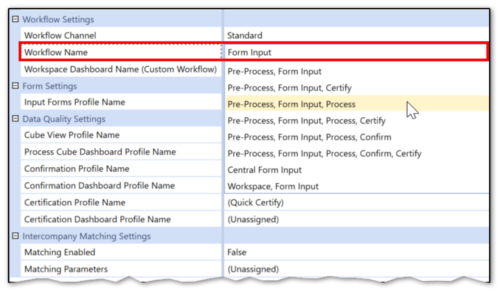

When selecting a Workflow Name that contains Process and/or Pre-Process, the Calculation Definitionstab will control the parameters in which the Calculation runs.

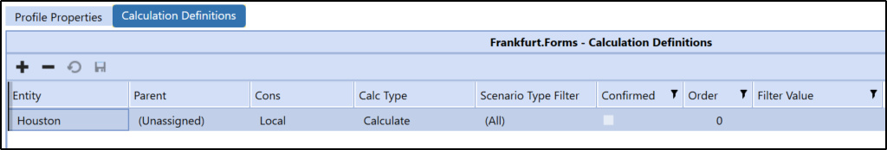

> **Note:** Custom Calculate Functions can be called from the Workflow Process Step via Data

Management only.

#### Data Unit, Data Unit, Data Unit

It’s important to call out that the Data Unit is defined every timea Consolidation or Calculation is triggered. If you think about it, this should make sense – the Data Unit Calculation Sequence needs a Data Unit to run for, and OneStream can’t guess which one.

#### Dependent Data Units

Some Data Units have dependencies on other Data Units and, in some cases, should be consolidated or calculated first. An example of this is within the Time Dimension. June’s data can be dependent on January-May. Entity and Consolidation Dimensions also have dependencies through hierarchy relationships (i.e., Children should Consolidate/Calculate before their Parents). OneStream uses a concept called Calculation Status to determine whether data has changed since the last Calculation or Consolidation and, therefore, if dependent Data Units need to be processed. After the DUCS runs on a Data Unit, the Calculation Status of that Data Unit is changed to OK(No Calculation Needed, Data Has Not Changed). As soon as data changes in the Data Unit – either through a Form input, data load, or Journal – the Calculation Status will change to CN(Calculation Needed, Data Has Changed). A Force Consolidation or Force Calculation can be used instead, which processes all dependent Data Units and ignores Calculation Status,while a normal Consolidate/Calculate will first check Calculation Status and will not run the DUCS if the Calculation Status for the Data Unit is OK. There is a lot more detail and nuance around Calculation Status, which can be explored further in the OneStreamDesign and Reference Guide.

#### Parallel Processing

With the dependent Data Unit concept, it is likely that multiple Data Units will process when a Consolidation or Calculation is triggered. When the Finance Engine processes multiple Data Units, it processes Sibling Data Units in parallel (i.e., at the same time) to save time. Also referred to as multi-threading, this concept is primarily observed through the Entity Dimension. If consolidating the top Member of the Entity hierarchy, groups of sibling Entity Members will be processed simultaneously using multiple threads.

> **Note:** Because parallel processing results in sibling Entities being processed at the same

time, the order in which two sibling Entities process can vary for each Consolidation. Special Entity properties are available, which can enable sibling Entities to process in order, using sibling passes. This use case is usually for Equity Pickup Calculations. An example is included in the last chapter of this book.

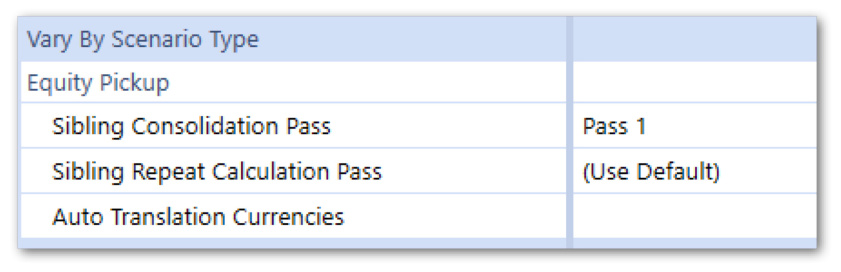

#### All Or Nothing

The DUCS is all or nothing. This is to say, all the steps run each time, no matter what. For example, you cannot choose to only execute Formula Pass 1 and bypass the other steps. This ensures that the entire Data Unit is always completely processed before data is then consolidated to its Parent Data Unit. Also, many Calculations have dependencies on other Calculations, so this ensures the Calculation order is never compromised. It also preserves data integrity by ensuring data is always cleared properly and completely before recalculating.

### Custom Calculate Function

You may be thinking, “Isn’t the DUCS a bit like overkill for certain situations? Do I really need to run every Calculation, even if I only want to calculate a handful of Accounts?” Indeed, if you were thinking something along those lines, you wouldn’t be the first. That’s where the Custom Calculate Function comes into play. In house remodeling, the DUCS would be akin to a full demolition and rebuild. In contrast, the Custom Calculate Function would allow you to remodel the kitchen only. Quite simply, Custom Calculate Functions only execute Calculation Scripts within that function. This allows the Calculation writer to be much more surgical with their Calculations and narrow the scope to specific elements of the financial process. There are, however, a couple of additional things that must be considered.

#### Triggering A Custom Calculate Business Rule

A Custom Calculate Function can only be triggered via a Data Management step or sequence. Simply create a step and select the Custom Calculate Step Type.

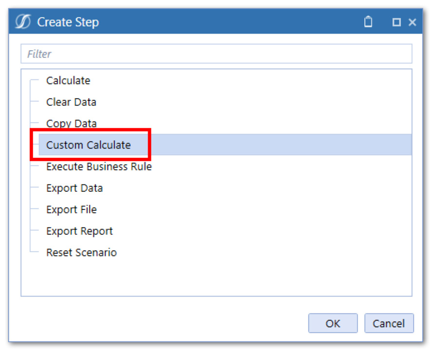

The Data Unit(s) will also need to be defined. A key difference with how Data Units are defined for Custom Calculate rules is that Calculation Status is not considered, so only Data Units explicitly defined will run. However, filters can be used for Entity, Consolidation, and Time which allow for multiple Members of those Dimensions to be included if needed.

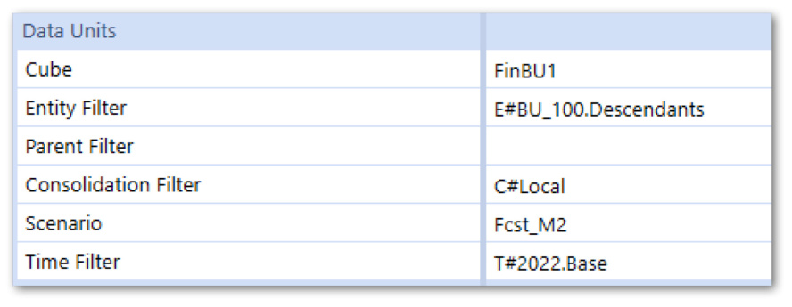

and all months in 2022. This will function like a Force Calculate because all Entity and Time Members within 2022 will be processed, regardless of Calculation Status. The Business Rule and Function Name must be defined for Custom Calculate Steps. Parameter definition is optional but can be used to pass custom parameters or substitution variables in the Business Rule.

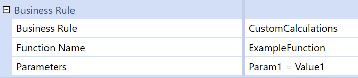

Dimension POV Members can also be defined and referenced in the accompanied Business Rule:

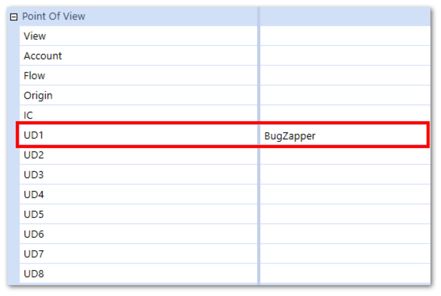

#### Durable Data

Let’s say you’ve calculated data using Custom Calculate and subsequently run a Consolidation that executes the DUCS. What’s the first step in the DUCS? I’ll save you from needing to flip back a few pages – it’s Clear Previously Calculated Data. Oh no! What will become of your Custom Calculated data? The answer will depend on whether you’ve flagged the data as `IsDurable` or  not. OneStream does not treat all calculated data the same. `DurableCalculatedData`is a data  storage Type that is used to prevent calculated data from being cleared during the Clear Data step of the DUCS. The data that results from a Calculation can be set as `isDurable = True`which  will protect it from being cleared during the DUCS. The data storage-type concept is expounded in the next chapter.

#### Data Clearing

Since you won’t have the benefit of OneStream automatically clearing all previously calculated data for you (as during the DUCS), A Clear Data Scriptshould be added at the top of every Custom Calculate rule so that all previously calculated data is cleared before recalculating. If you fail to include this, you could end up with data integrity issues such as ‘old data’ being left behind in the Cube, which could become very difficult to find and remedy. The `api.Data.ClearCalculatedData` function can be used.

```text
api.Data.ClearCalculatedData(False,False,False,True,
"A#AccountsToFilter.Base")
```

#### Other Differences

Custom Calculate Functions have a few other key properties which can make them much more flexible, User-friendly, and performant than Business Rules and Member Formulas that run inside the DUCS. Chapter 3 will explain those properties and how to use them in more detail.

### C#Aggregated

The Aggregated Member of the Consolidation Dimension, when selected, allows for faster Aggregation and storage of data within the Entity Dimension by removing a lot of the functions of a Consolidation.

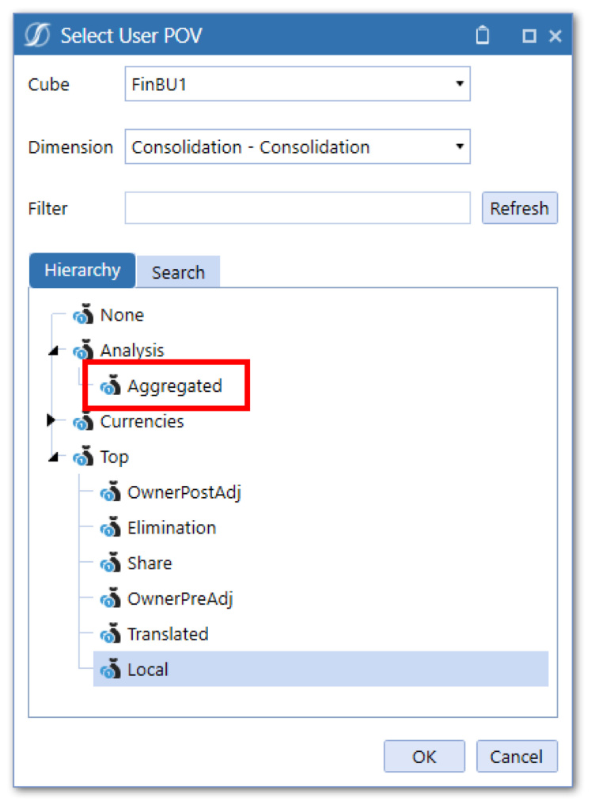

Aggregation can be triggered from the same mechanisms that trigger Consolidate or Calculate, described above. Simply define `C#Aggregated` as the Consolidation Member when defining the  Data Unit.

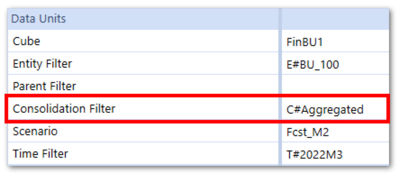

When running a Calculation or Consolidation on `C#Aggregated`, a modified version of the  Standard Consolidation algorithm is executed. The key differences when using `C#Aggregated` are: • The DUCS is only executed at Base Entities • No Intercompany elimination logic is performed • No Share or Ownership Calculations are performed • Data is stored at `C#Aggregated `at Parent Entities  • Only Direct Method Translation is performed

### Dynamic Calculations

Calculations can also be written which do not execute during the DUCS or via Custom Calculate. These Calculations are called Dynamic (or Reporting) Calculations and only run when queried in a Report such as a Cube View or Excel Quick View. Dynamic Calculations differ fundamentally in terms of how they are written and behave compared to stored Calculations. A dedicated chapter – later in the book – will cover these in detail.

### Clear As Mud

It may seem as though there is a lot to think about when trying to do something you’d expect to be simple, like executing a Calculation. I will do my best to simplify some questions that may be swirling through your head.

#### What Finance Function Type Should I Use?

Finance Function Types work hand in hand with the Consolidation Member being processed during the DUCS. Most Calculations and Business Rules will be restricted to run only at the Local Consolidation Member using `FinanceFunctionType.Calculate` or  `FinanceFunctionType.CustomCalculate`. This allows data to calculate at Local and then get  translated using the standard Translation. Running Calculations at the other Consolidation Members – using other Finance Function Types – are reserved for specific requirements and more scarcely used.

#### Ducs Vs. Custom Calculate

In many cases, most of what occurs during the Consolidation algorithm is only relevant for a Cube or Scenario with data that is heavily driven by financial and accounting rules. Executing Custom Calculate Rules and aggregating data using `C#Aggregated` is a simple way to execute  Calculations and will be adequate for most solutions. Of course, if you have Elimination, Translation, or complex ownership structure requirements, then the full array of options described above will have to be considered. The key benefit of the DUCS is that it removes a lot of the guesswork. Minimal thought needs to be given to clearing previously calculated data, dependent Data Units, and whether a Calculation was forgotten. I try to avoid making blanket statements, but I’ll make an exception in this case – Consolidation solutions should primarily run Calculations in the DUCS, and Planning solutions should primarily use Custom Calculations (outside the DUCS) with Entity Aggregation using `C#Aggregated`.  The reason for this lies in the underlying business processes that support each of those functions. Consolidation Calculations usually have a lot of dependencies – Trial Balance Calculations drive Flow Calculations, which in turn drive Cash Flow Calculations. Also, as their name implies, Consolidation Calculations are meant to be consolidated, so it is important that all Calculations run before data is moved up to a Parent Member. Data integrity is paramount, so full ‘clear and replace’ functionality is a necessity. In addition, the number of times data needs to be recalculated after an initial Consolidation is somewhat limited compared to more iterative Planning Calculations. As just mentioned, things are much more iterative on the Planning side. Numbers are constantly massaged and changed. In addition, multiple Users often work within the same Data Unit. Having Users constantly running Calculations on the same Data Units would wreak havoc on the server, which would be constantly running each step in the DUCS – overlapping with another User’s DUCS execution. This is where the Custom Calculate function saves the day. Of course, blanket statements are often wrong. There could certainly be situations where Custom Calculates are used in Consolidations and DUCS Calculations are used in Planning. In fact, you’re likely to have a mix of both. I’ll simply leave you with the knowledge of knowing the differences between each, and let you form your best judgment based on the specific requirements of your project.

## Conclusion

This chapter has sought to give you context around the various Engines within OneStream and how they interact with the Finance Engine. You should also understand the core functions of the Finance Engine and how we can intervene within it to write powerful business logic and Calculations. Having a solid grasp of what the Engine is doing behind the scenes is important when writing Business Rules because you want your rules to work with the Finance Engine and not against it. The next chapter will expound more on the Cube and break down the data within. Onwards!
