# Managing Calculations

As we’ve learned by now, Calculations can exist in – and be executed from – many places within OneStream. Without a proper system for managing Calculations, things can get chaotic quickly. It’s also important to write Calculations in a maintenance-friendly manner, so this chapter will discuss guidelines for the efficient maintenance and management of Calculations from the beginning to the end of a project.

## Start At The Beginning

Calculation management and documentation should start in the Design and Requirements phase of the project and continue to the end, where it is ultimately handed off to the application Administrator. Even though Design and Requirements meetings typically stray away from detailed discussion about Calculations, there will be indicators to look for that should trigger deeper dives for Calculations later in the project. For example, a customer may list things like “Automated Cash Flow,” “Complex Ownership,” and “Driver-Based Forecasting,” which are likely candidates for the heavy use of Calculations. Keep a log of these items through Design and Requirements with the intent of extrapolating more detail later.

### Create A Calculation Matrix

As more Calculation details are uncovered, it’s a good idea to create an inventory of each Calculation along with some other pertinent information in a Calculation Matrix. The Calculation Matrix will also prove handy later in the project when it’s time to test Calculation results with Users. An initial Calculation Matrix can be quite simple, capturing only basic Calculation details such as Calculation name, Type, and location. As the Design and Build phases of a project move forward, the initial Calculation Matrix becomes a living document that grows and changes as the project progresses. Depending on the complexity of a client’s implementation and required Calculations, the Calculation Matrix could evolve to capture more detail along the way, such as the Calculation scope and testing results.

#### Basic Information

Below is an example of the basic information that can be captured in a Calculation Matrix.

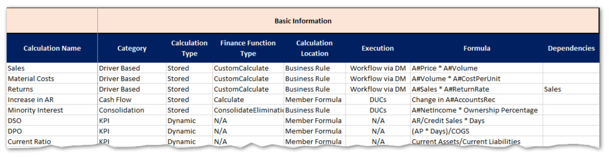

#### Calculation Name And Category

The Calculation name and category will help organize and classify your Calculations. Categories can be based on the functional area they cover, the User audience, or the Scenario they are specific to.

#### Calculation Type

Calculation Type will distinguish between stored and dynamic; these Calculation Types are fundamentally different in how they are written and tested.

#### Finance Function Type

For stored Calculation Types, the Finance Function Type should be indicated as this will determine how and when the Calculations are executed.

> **Note:** Member Formulas automatically use the Calculate Finance Function Type, which

is not explicitly defined like it is in Business Rules.

#### Calculation Location

Calculation location refers to where the Calculation syntax is physically written and maintained, either in a Business Rule or a Member Formula.

#### Execution

Refers to where the Calculation is executed from. This information isn’t relevant for Dynamic Calcs because they will run any time they are called.

#### Formula

A simple, plain-English description of the logic. Don’t worry about capturing every nuance or exception here.

#### Dependencies

Any other Calculations that this Calculation depends on. This will help to determine Formula Pass or the sequence within a Business Rule.

#### Scope Information

Calculation scope information will help performance and ensure Calculations don’t conflict or cause unexpected results. Data Unit scope will result in preceding `IF` statements or an assignment  to specific Scenario Types or Time periods in Member Formulas. Scope for Account-level Dimensions will help define what is included in the destination and source Member Scripts, as well as the filter (if needed).

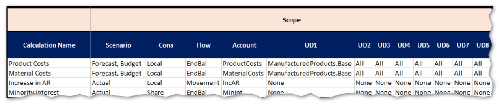

#### Testing

Once it’s time for testing, the Calculation Matrix will be a great starting point for logging results. It is highly likely that, as you test, many of the fields in the matrix will change as production data gets used and previous assumptions are proven incorrect.

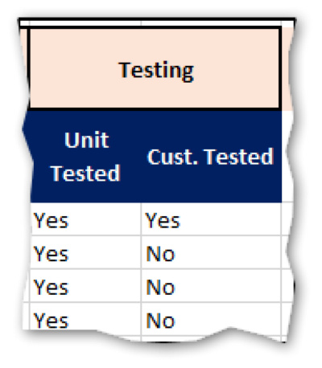

### Calculation Matrix Benefits

#### Tracking

Keeping a centralized list of all Calculations: •Reduces the risk of losing track of critical Calculations that must be built. •Provides useful details for estimating the level of effort required to build Calculations. •Creates a single source to quickly reference the status of the Calculation build. •Streamlines the process for identifying missing Calculations by having a referenceable list of all defined Calculations in one location.

#### Designing

The design of Calculations often requires an iterative process. A Calculation Matrix can be used to review all proposed Calculation logic – with a client – prior to building Calculations. A client can review the proposed logic, make edits where necessary, and approve the Calculations before beginning the build.

#### Building, Testing, And Approving

A Calculation Matrix can be used to track the progress of building Calculations, and to document additional testing and approval milestones (e.g., unit-tested, customer-tested, Calculation complete).

#### Transferring Knowledge

A Calculation Matrix that is kept up-to-date serves as a valuable reference for System Administrators, enhancing their knowledge of all Calculations that have been built in OneStream.

## Calculation Testing

The thorough testing of all Calculations is a critical success factor for OneStream implementations. It is important to complete detailed unit testing as well as client testing for each Calculation. Completing comprehensive and systematic testing helps to ensure that Calculation logic is functioning as intended.

### Testing Tips

•If possible, try to replicate results against legacy systems or historical results. •Create a Cube View that contains a `GetDataCell` formula that mirrors the logic of the Calculation (stored or dynamic) being tested. Use the Cube View to check the results after running the Calculation. Note that this may be difficult or impossible for complex Calculations. •Create a Cube View that shows data for both the Calculation inputs and outputs. If using Dimension filters, include Members outside the filters to ensure the Calculation is correctly applying the filter. •Use the functions available in the Excel Add-in to create a worksheet that mirrors the logic of the Calculation being tested. Use the Excel worksheet to check the results after running the Calculation.

## Calculation Reports

OneStream includes a suite of standard Application Reports to assist in managing Calculations. If not already loaded into the application, Application Reports can be downloaded and installed from the OneStream MarketPlace.

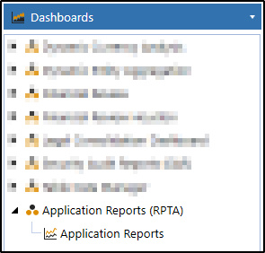

Application Reports contain several useful Reports but specific to Calculations are the Formula Statistics and Formula List Reports.

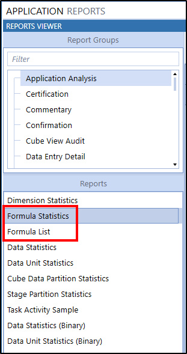

### Formula Statistics

The Formula Statistics Report will give you a breakdown of each Dimension and how many Members have Member Formulas or Dynamic Calcs assigned to them. Note that this will not include Members that are calculated via Business Rules.

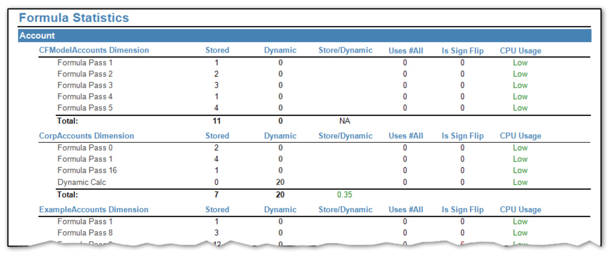

### Formula List

The Formula List Report shows each Member Formula and its syntax.

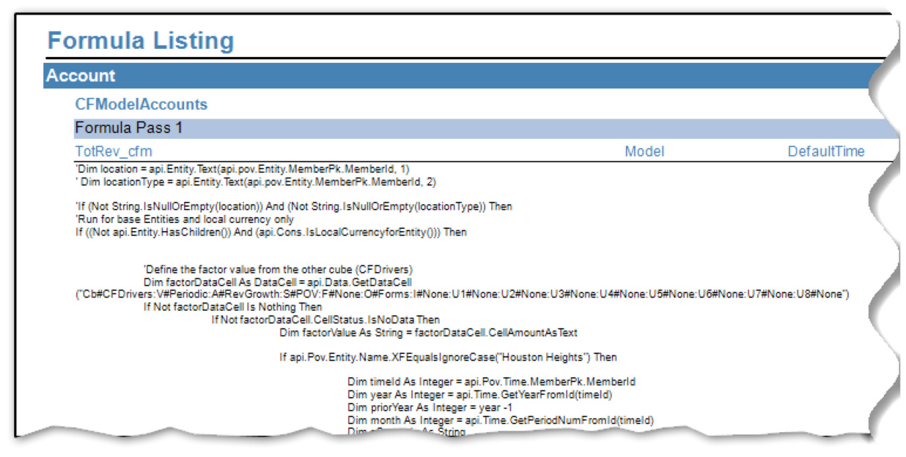

## Calculation Maintenance

At some point, you will (probably very happily) pass the job of maintaining the Calculations built during an implementation to someone else, likely an Administrator. At this point, they will have the daunting job of deciphering and making sense of your code, so they can make any necessary modifications resulting from changes in business processes or underlying data. Ensuring this process goes smoothly requires building Calculations in a maintenance-friendly way, as well as ensuring all your Calculation code is properly commented.

### Comments

Comments are text within your code that do not compile or execute. They are strictly there to provide some context and explanation from the code writer. Writing good comments is just as crucial as writing good code. There are two main components to comments: a header block and inline explanations.

#### Header

Header comments are at the beginning of each code function or subroutine. They: 1.Identify the Calculation name. 2.Describe the purpose and usage of the Calculation. 3.Document who wrote the code originally (and when), as well as any modifications. Modified dates must include what was changed and who changed it. 4.Note any special maintenance considerations.

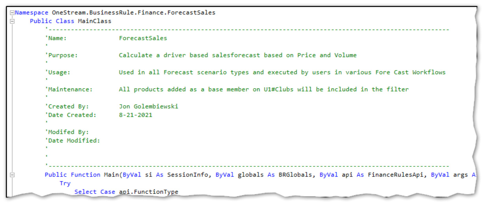

#### Inline

It is always better to err on the side of ‘over-commenting’ versus ‘under-commenting.’ Try your best to provide a comment for each line or block of 3-5 lines. Inline comments can be as short as a few words or as long as several sentences. Length is not important; conveying why a given block of code does what it does is.

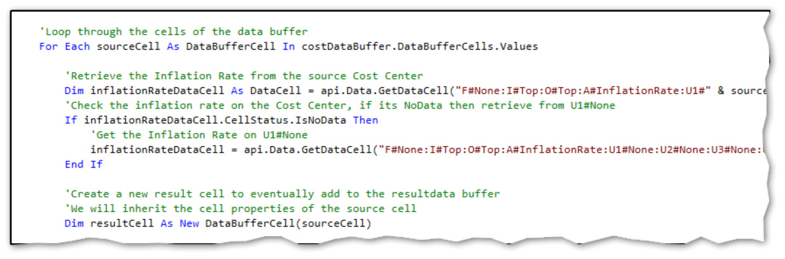

### Regions

Regions are a VB.NET directive that can be used to specify a block of code that can be expanded or collapsed using the outlining feature within the Business Rule Editor. You can place or nest regions within other regions to group similar regions together. This technique is great for organizational purposes within large Business Rules. Use the `#Region “RegionName”` and `#End Region` syntax to specify a collapsible region  within your code.

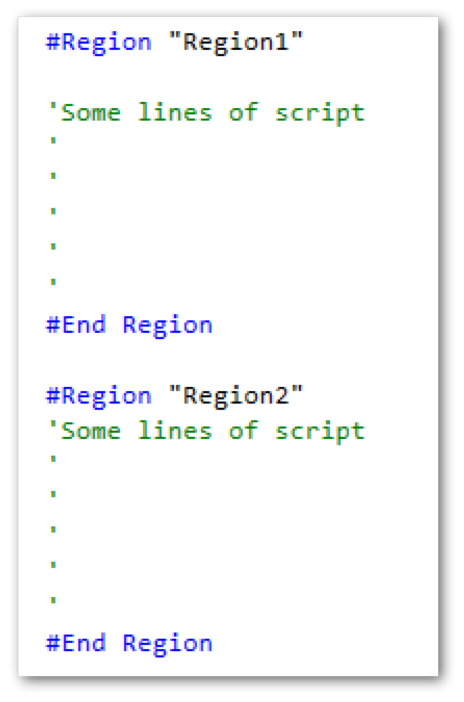

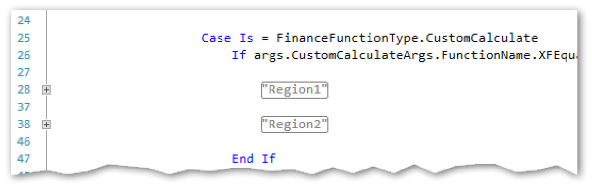

### Maintenance Tips

Maintenance refers to any time a production script needs to be changed or modified due to changes in the application, such as adding Members to Dimensions. The goal should be to minimize any changes to code and narrow maintenance to specific areas of the application, such as the Dimension Library.

#### Time Functions

Time periods or years should never be hardcoded into `api.Data.Calculate` formulas.

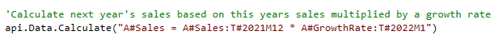

The above formula is attempting to calculate 2022 Sales based on the last period of the prior year’s Sales multiplied by a constant growth rate, which is entered in month 1 of the Forecast year. This formula will work fine for 2022, but once 2023 comes along, the formula is obsolete and maintenance must be performed to update the Calculation for the next year. There is a better way! Time functions exist that can reference the current Time period being processed. •`POVPriorYear` •`POVYear` •`POVPrior1`, `POVPrior2,``POVPrior12`, etc.  •`POVNext1, POVNext2, POVNext12`, etc.  •

```text
POVFirstInYear
```

This allows the formula to be dynamic and function correctly in any Time period.

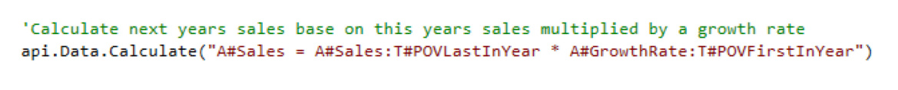

The above example may seem painfully obvious but – believe it or not – I have seen the wrong approach taken many times!

> **Note:** The T#POVLastInYear and T#POVFirstInYear should be used instead of

`T#POVPriorYearM12 `when possible since these functions will work on Scenarios of  quarterly or yearly frequencies as well as monthly. There are many other Time functions to the ones mentioned. The Member Filter Builder contains a list of available functions.

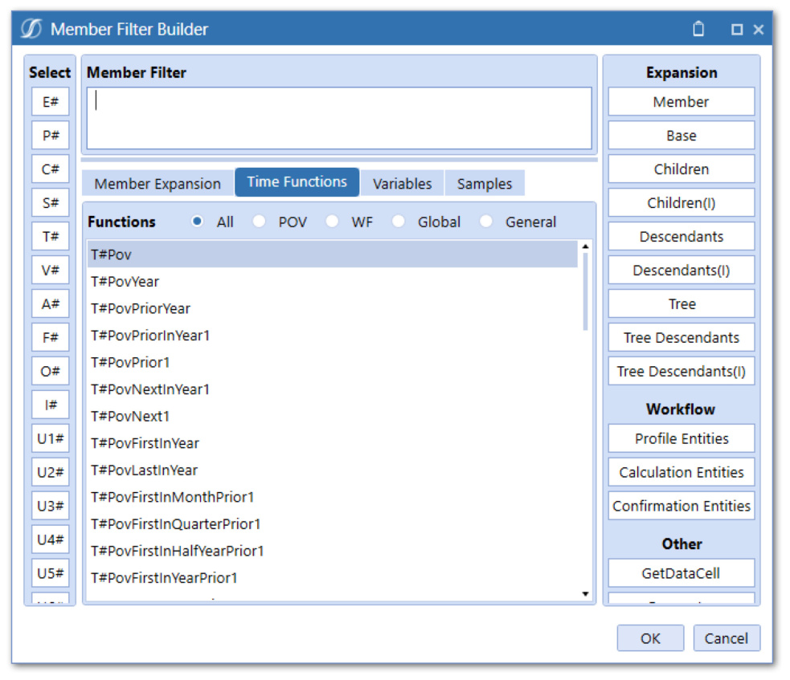

#### Utilizing Hierarchies

Dimension hierarchies typically exist to support reporting requirements but can also be utilized to support Calculations. We’ve seen how Dimension filters can be used to limit the scope of Calculations. If used with Dimension hierarchies, they can also be used to reduce Calculation maintenance. Let’s look at an example of a Calculation written by Curly:

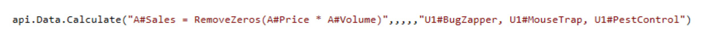

At first glance, this looks like a perfectly good Calculation as it correctly uses a filter to reduce scope. But it is not very maintenance-friendly. If another Cost Center gets added to the Dimension Library, that needs to be included in this Calculation, and the formula will need to be modified by an Admin in the Business Rule Editor. Not ideal. If we look at the hierarchy, we can see why Curly wrote it this way.

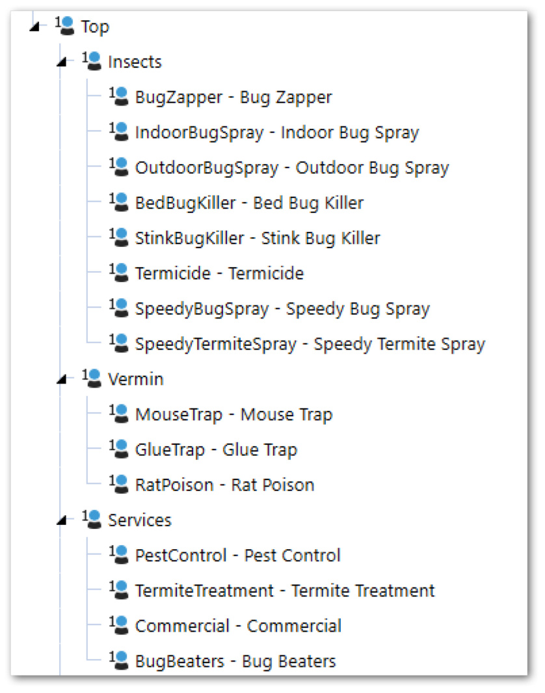

We can see that the above hierarchy does not have a common Parent for BugZapper, MouseTrap, and PestControl Products. The very simple solution is to create a new Parent that groups these Members together.

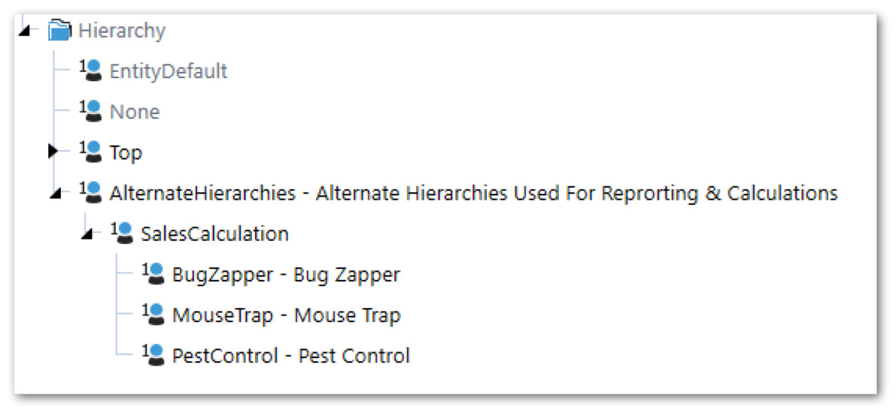

`SalesCalculation` is created under another Parent called `AlternateHierarchies`, which is a  sibling of `Top`, so that it won’t cause any double-counting of the included Members.  Our Calculation formula can now be written like this:

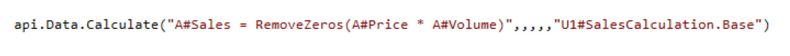

A comment should be included in the header of the Calculation that explains that any new Product Member, that should be included in this Calculation, should be added to the `U1#SalesCalculation` hierarchy.

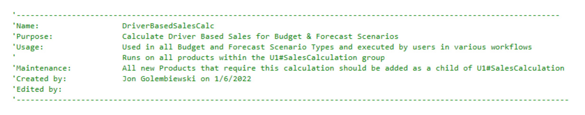

Creating alternate hierarchies is fairly simple from a technical standpoint and doesn’t add any Calculation performance overhead. It is always easier to simply copy a Member beneath a new Parent than it is to change and retest code.

#### Text Properties

Like alternate hierarchies, text properties can be referenced in Member Filters and used to support Calculations. Let’s apply the use of text properties to our previous example:

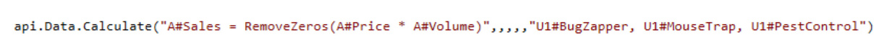

Instead of grouping each of the individually referenced Members beneath a newly-created Parent, text properties can be utilized to achieve the same result. Each Member’s Text2 property will contain the text `SalesCalculation`.

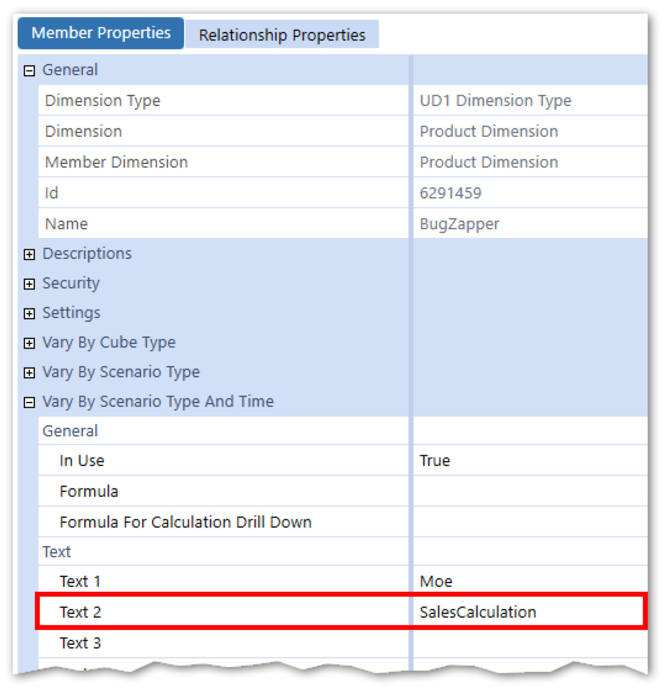

The Dimension filter within our `api.Data.Calculate` function can now use a `Where` clause and  reference the `Text2` property.

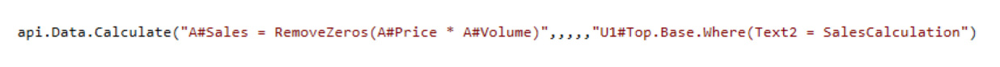

The comment should also be modified to make note of the `Text2` property requirement.

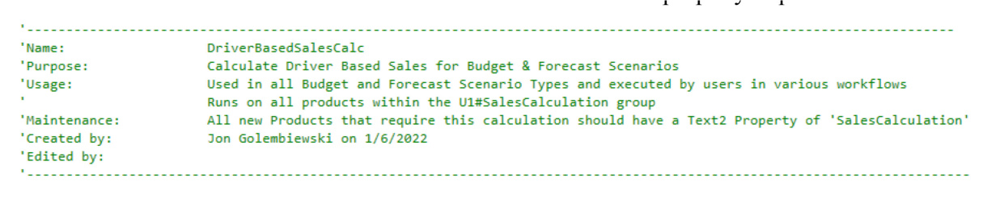

#### Custom SQL Tables

Using custom SQL tables is another technique that can be employed to reduce maintenance and make your Calculations cleaner and more dynamic. Calculation logic and/or inputs can be stored in a table and then referenced in a Business Rule or Member Formula. Maintenance is then narrowed to changing the table fields to modify Calculation logic or adding rows for new Calculations. Let’s take a look at an example of how SQL tables can be used.

#### Use Case

In this example, we have a Forecast Scenario where just about all the data will be calculated. The combination of Account and Cost Center determines the Calculation logic. Due to many Account/Cost Center combinations, this is likely to result in a large number of Calculations leading to a very long Business Rule or a lot of Member Formulas. You can quickly see where this is going – a maintenance nightmare! Both Dimension hierarchies and text properties can only be defined for a single Member within a Dimension, so those two Methods will not work here. Instead, a SQL Table will be used to store the Account and Cost Center combination along with the Calculation Method and Calculation inputs.

#### Create The Table

First, a SQL table must be created in the Application Database. This can be done in several ways: Use the Create Table script property in SQL Table Editor > Component Properties in Dashboards.

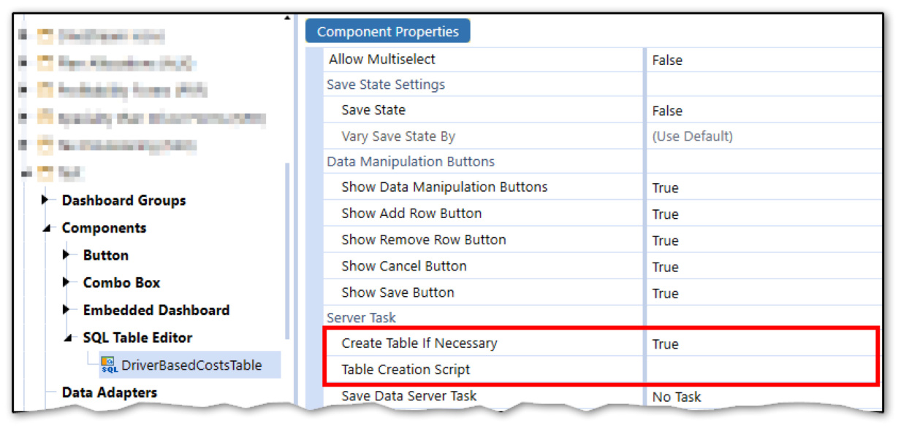

Use the Table Data Manager Marketplace solution, which provides a User-friendly interface for creating and managing SQL Tables within the Application Database.

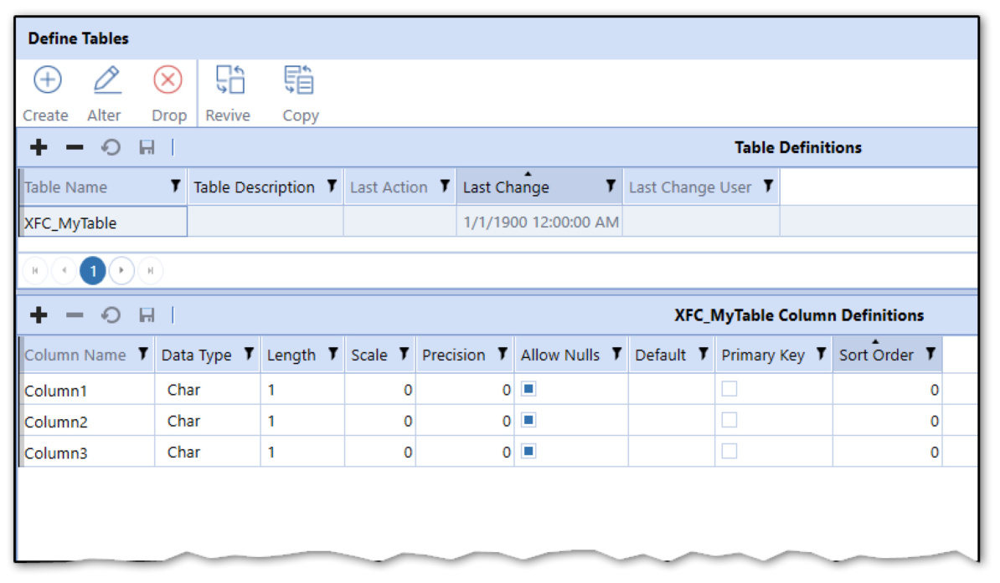

Use SQL Management Studio on the Application Server (requires server access or assistance from Database Admin). I typically opt to create tables via Table Data Manager as I am not an expert at writing SQL, and it provides several tools for migration and data extraction for tables created within its framework. The table – created for our example – will contain the below columns: •`RowID` – A unique identifier column used as the Primary Key  •`AccountName` – Stores the name of the Account  •`ProductName` – Stores the name of the Product  •`CalculationDefinition` – Stores the Calculation definition  •`CalculationPriceDriverInput` – Stores the Price Driver Account name  •`CalculationQuantityDriverInput` – Stores the Quantity Driver Price name

#### Populate The Table

Users can interact with SQL tables via Dashboards using a SQL Table Editor Component.

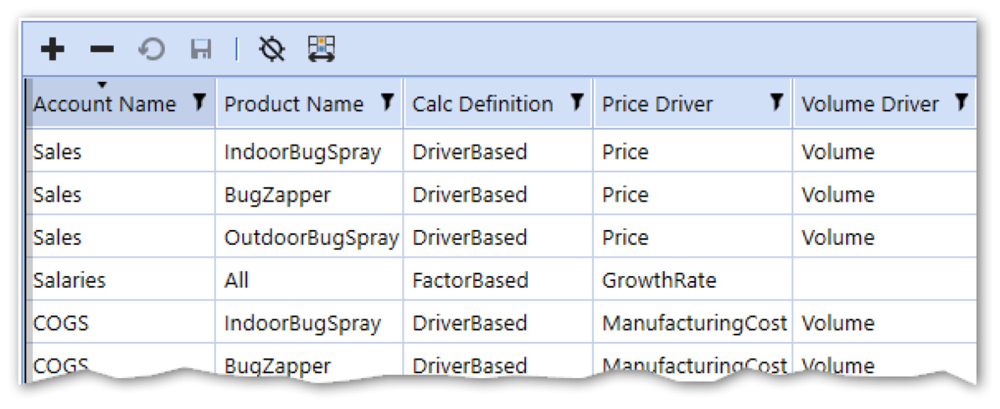

Exposing this Dashboard to a User via Workflow or OnePlace will allow them to add, delete, or modify rows. The table can also be populated via an Excel file import.

#### Referencing The Table In A Calculation

To reference the table in a Calculation, we will need to call the table via a SQL query using the `api.Functions.GetCustomBlendDataTable` function and then loop through the rows of the  table. For each row iteration, we will run a Calculation using an `api.Data.Calculate` function.

#### Rule Context

This Calculation will be written in a Business Rule with a FinanceFunctionType of Custom Calculate. The Calculation will be executed in the Data Management Step/Sequence.

#### The Code

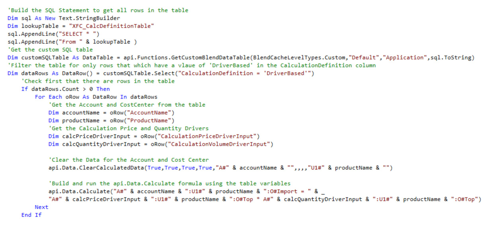

#### The Breakdown

#### Get The SQL Table

The first thing our Calculation will do is bring the SQL table into memory using the `api.Functions.GetCustomBlendDataTable` function.

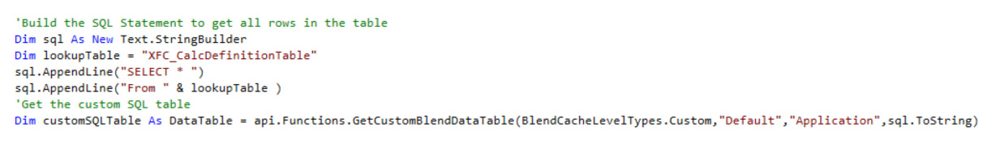

A SQL statement is built using a StringBuilder and passed into the function along with the other required parameters.

#### Filter The Table Using The .Select Method

Once we have the entire table in memory, we can filter it to only include rows with `DriverBased` as the `CalculationDefinition` field.

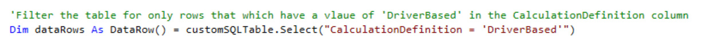

Next, we will check to make sure at least one row exists… so we don’t waste any processing time if there isn’t.

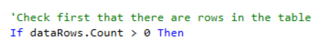

#### Loop Through The Table Rows

Once we have the desired table rows, we will loop through each row and bring in each field as a variable.

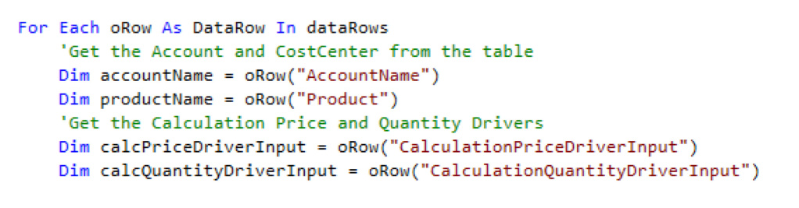

#### Clear The Previously Calculated Data And Execute The Calculation

Now we have everything we need to build the `clear` statement and the formula inside the  `api.Data.Calculate` function. The row field variables are passed into the formula string.

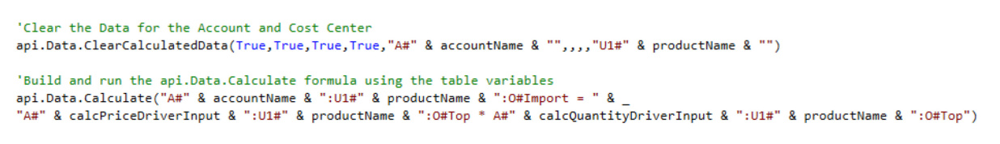

#### Performance Note

The above example shows the power of using SQL tables to help manage Calculation build and maintenance. It’s important to note that the above example could be written more efficiently. Each row will generate an ADC function which calls the Data Unit into memory and then writes back to the database. It is always better for performance to minimize those two actions as much as possible. Instead of using an ADC function within the loop, a Result Data Buffer could be declared outside the loop with result cells added to it in-memory within the loop, and the cells committed to the Cube after the loop with a `SetDataBuffer` function.

## Conclusion

Learning how to properly plan, manage, and track Calculations is just as important as learning the skill of writing Calculations. Even the best-written Calculations will fail or fall apart if they aren’t written in a maintenance-friendly way. This means including proper commentary and documentation for whoever winds up maintaining them after you’re gone. Further, there are several tools and techniques that can reduce and ease maintenance – be sure to deploy them when writing Calculations and you can save yourself (and others) a lot of headaches in the future.
