# Account Reconciliations Settings

## Setup and Installation

l Table Creation Group for Ancillary Tables: Select a group who can create tables.

4. Restart Internet Information Server.

Ensure these user group settings include the people who will be working on and setting up

OneStream Financial Close tables.

### Install Financial Close

1. Navigate to SolutionExchange.

2.  In the OneStream Solution Exchange, go to OneStream Solutions and select the

OneStream Financial Close solution tile.

3. On the OneStream Financial Close Solution page, select the appropriate OneStream

platform version from the Platform Version drop-down list.

4. Select the most recent version from the Solution Version drop-down list and then click

Download.

5. Log in to OneStream.

6. On the Application tab, click Tools > Load/Extract.

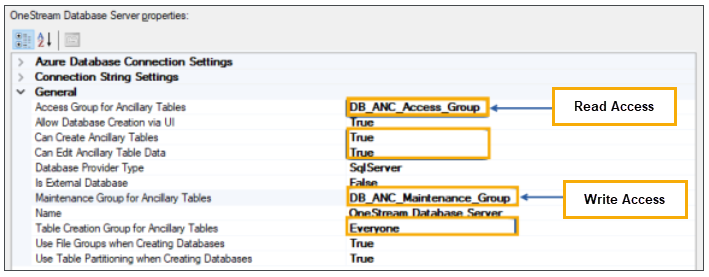

## Setup and Installation

7. On the Load tab, click the Select File icon, locate the solution package, and click Open.

8. Click the Load icon.

9. Click Close to complete the installation.

NOTE: Multiple instances can be successfully installed, however the same instance

number build of the current release is required when upgrading.

IMPORTANT: Due to refactoring and restructuring of the source code, any previous

source code customizations will be obsolete.

### Set up OneStream Software Financial Close

The first time you run the solution, you are guided through the table setup process. You can

perform the setup process from any of the solutions in OneStream Financial Close.

Click OnePlace > Dashboards > Account Reconciliations > Account Reconciliations.

### Create Tables

1. Click Step 1: Setup Tables

This step may be necessary when upgrading even if tables already exist. OneStream

Financial Close does not drop any tables that already exist but modifies table structures

and adds new ones if necessary.

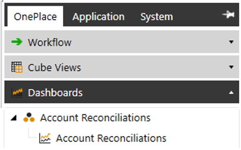

## Setup and Installation

NOTE: This step sets up tables for all solutions in OneStream Financial Close

regardless of which dashboard you are in.

2. When setup is complete, click Step 2: Launch Solution to open the solution.

### Turning Off Dashboards

If you are not using a one of the solutions, you can turn off the dashboard for the solution.

1. Go to Application > Workspaces> Dashboard Profiles.

2. From Dashboard Profiles, select the dashboard that you want to turn off.

3. Change Visibility to Never and click Save.

### Review the Package Contents

This section describes the Account Reconciliations and Transaction Matching packages.

## Account Reconciliations

The Account Reconciliations Dashboard is the user interface for settings and performing

reconciliations. The following Business Rules are included:

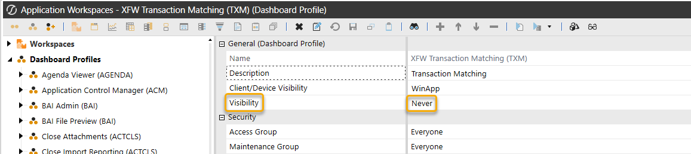

## Setup and Installation

l RCM_FormulaHelper is a Finance Business Rule. Dynamic Member Formulas that use

SQL Queries to generate reconciliation status percentages and reconciliation item type

values for use in Cube View data cells.

l RCM_DataMgmtProcess is an Extensibility Business Rule used with a Data Management

Sequence to run the Process Reconciliations process when needed to ensure that

Reconciliation balances are up to date and notify Account Reconciliation administrators if

balances change.

UD8 Reporting Dimension (RCM_DynamicCalcs) and its Members is created in the

application and does not need to be added to a Cube to use its members on reports. These are all

DynamicCalc members that are typically shown as columns on a report where the rows are

Accounts. They are used to look up values and perform calculations to show the Reconciliation

status of a particular Account/Entity/Scenario/Time Period.

l RCM: Reconciliation Manager Statistics – This is a member used to group the other RCM

members.

l RCM_PctComplete_Ent: Entity % of Recons Completed - Gets the percent complete for

all reconciliations associated with this Entity, Scenario, and Time.

l RCM_PctComplete_EntAcct: Entity-Acct % of Recons Completed - Gets the percent

complete for all reconciliations associated with this Entity, Scenario, Time, and Account.

l RCM_ISC_EntAcct: IS Correction (Entity Account) - Gets the IS Correction Value for all

reconciliations associated with this Entity, Scenario, Time, and Account.

l RCM_BSC_EntAcct: BS Correction (Entity Account) - Gets the IS Correction Value for all

reconciliations associated with this Entity, Scenario, Time, and Account.

l RCM_ISC_Ent: IS Correction (Entity) - Gets the IS Correction Value for all reconciliations

associated with this Entity, Scenario, and Time.

## Setup and Installation

l RCM_BSC_Ent: BS Correction (Entity) - Get the BS Correction Value for all reconciliations

associated with this Entity, Scenario, and Time.

The following Data Management Sequences and Steps are created and can be used with their

related Business Rules. Running these processes through a Data Management Sequence allows

them to run in the background while the user continues their work.

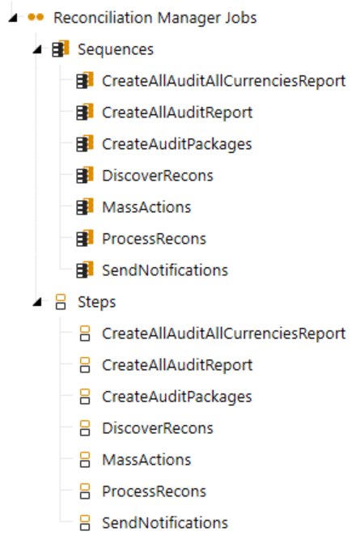

## Setup and Installation

## Transaction Matching

The Dashboard Maintenance Unit provides the user interface for Transaction Matching and

includes the required Dashboard Groups, Components, Data Adapters, Parameters and files.

### Edit the Transformation Event Handler

### Business Rule

The Transaction Matching solution requires changes to the Transformation Event Handler

Business Rule Formula and Referenced Assemblies for the solution to work properly.

Click Application > Business Rules > Extensibility Rules > TransformationEventHandler

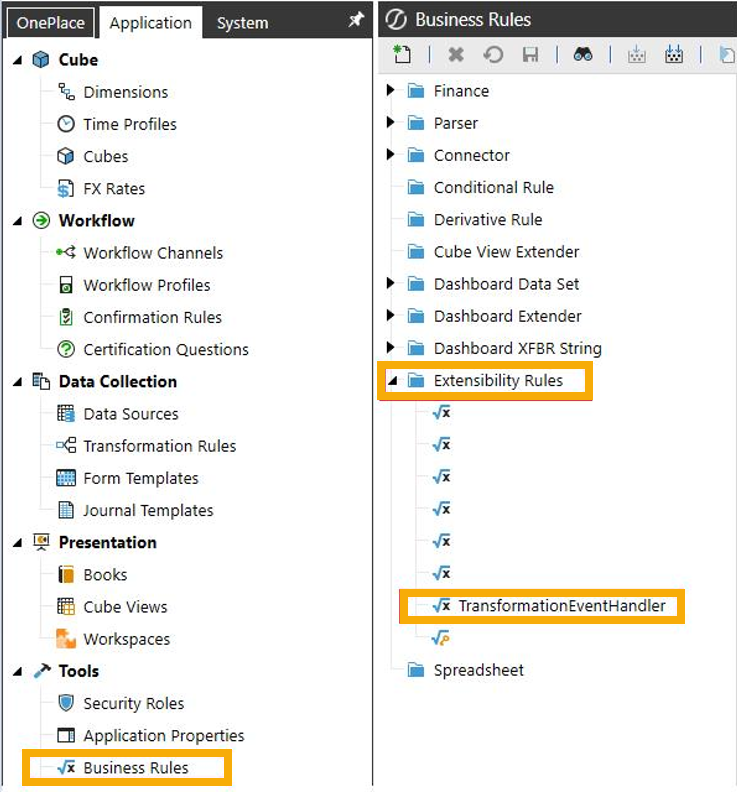

## Setup and Installation

1. Add the following applicable code to the Formula tab:

NOTE: Use either VB.net or C# as there can only be one

TransformationEventHandler per OneStream Application.

### VB.net

### Dim txmTransactionSourceController As New

Workspace.OFC.TXM.Integration.TransactionSourceController(si, args, "OneStream

Financial Close") txmTransactionSourceController.ExecuteOperation()

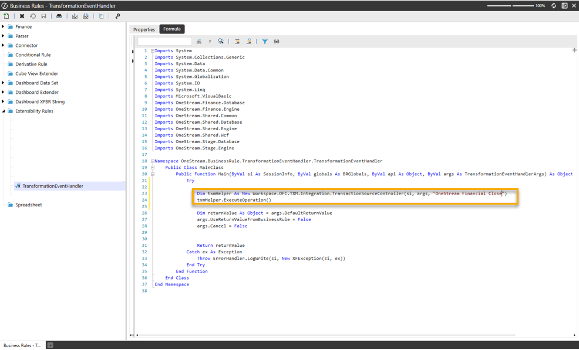

## Setup and Installation

### C#

new Workspace.OFC.TXM.Integration.TransactionSourceController(si, args, "OneStream

### Financial Close").ExecuteOperation(); return null;

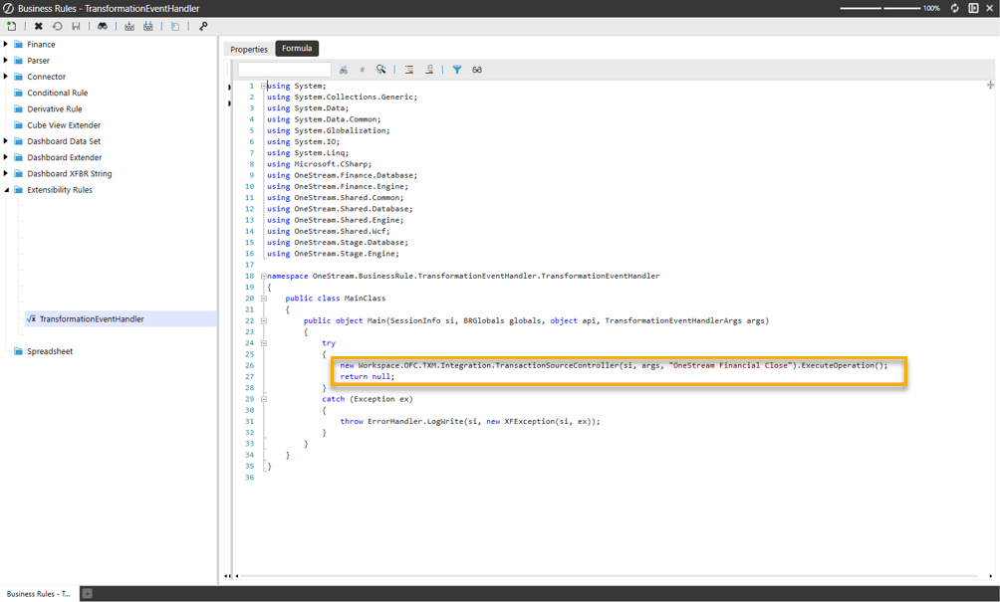

## Setup and Installation

2. On the Properties tab, add the following code to the Referenced Assemblies row:

### WS\Workspace.OFC.TXM

### Multiple Instances

IMPORTANT: If using multiple instances, the TransformationEventHandler must be

configured for all instances. The number in bold must match the instance(s) installed.

1. Add the following applicable code to the Formula tab:

### VB.net

Dim txmHelper As New Workspace.OFC1.TXM.Integration.TransactionSourceController(si, args,

"OneStream Financial Close1") txmHelper.ExecuteOperation()

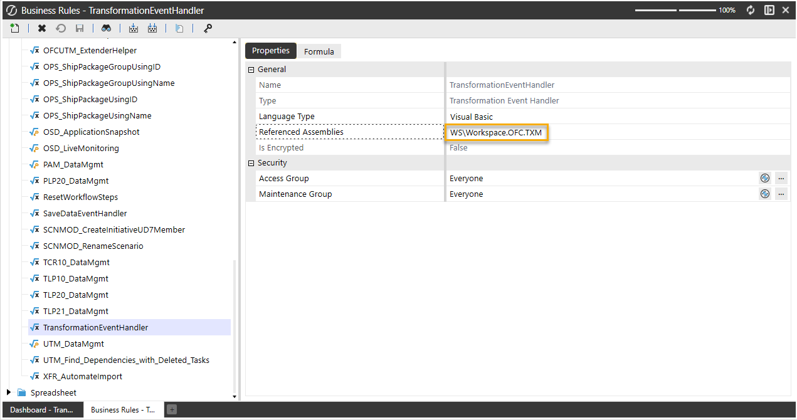

## Setup and Installation

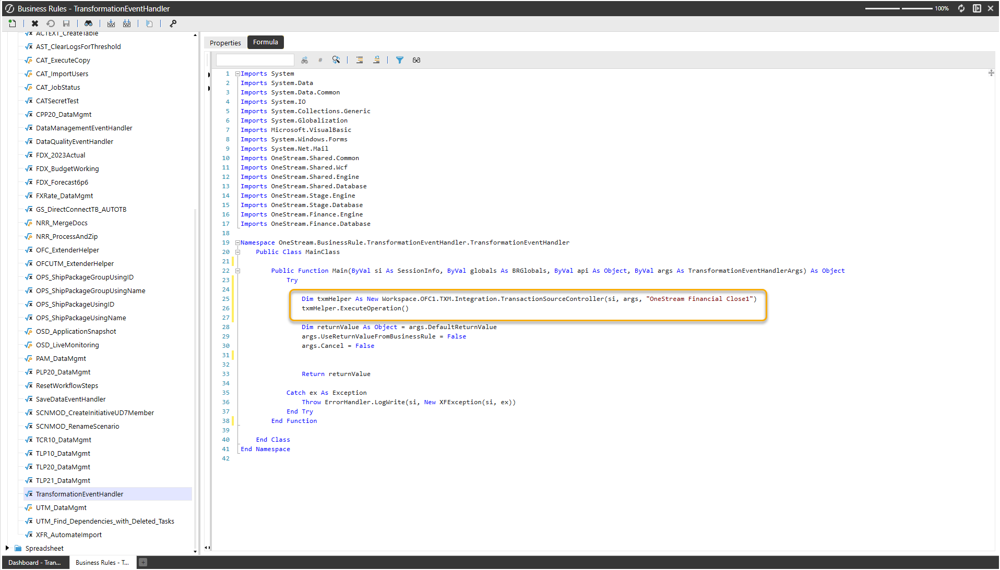

## Setup and Installation

### C#

new Workspace.OFC1.TXM.Integration.TransactionSourceController(si, args, "OneStream

### Financial Close1").ExecuteOperation(); return null;

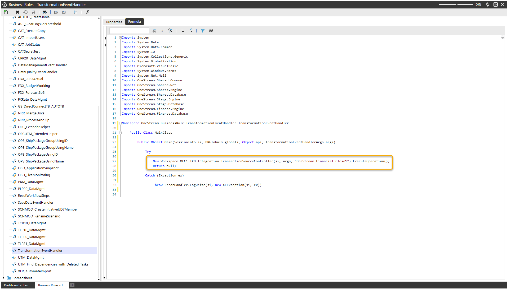

## Setup and Installation

2. On the Properties tab, add the  code for all instances installed to the Referenced Assemblies

row:

WS\Workspace.OFC1.TXM, WS\Workspace.OFC2.TXM, etc.

### Upgrade Considerations

Edit the Transformation Event Handler each upgrade. See  Edit the Transformation Event Handler

Business Rule.

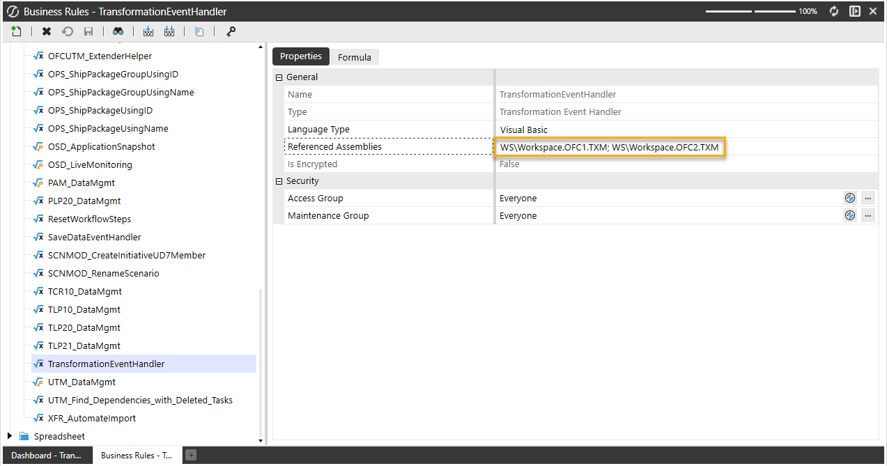

## Account Reconciliations

## Account Reconciliations

### See these topics:

l Settings

l Reconciliation Administration

l Security

l Using Account Reconciliations

l Analysis and Reporting

l Anomaly Detection

## Settings

To access the Settings page, click the toolbar button:

Use the Settings page to configure options for:

l Global Setup

l Control Lists

l Column Settings

l Templates

l Access Control

## Account Reconciliations

l Certifications

l Uninstall

Only OneStream Administrators or Account Reconciliations Administrators can access this page.

This security access is configured in Global Options. With security access, you can see and make

changes to any Global Settings page and any Reconciliation configuration. The Account

Reconciliations Administrators are referenced in this document as Reconciliations Global

Admin.

## Global Setup

The Global Setup page consists of settings for Global Options and Global Defaults.

### Global Options

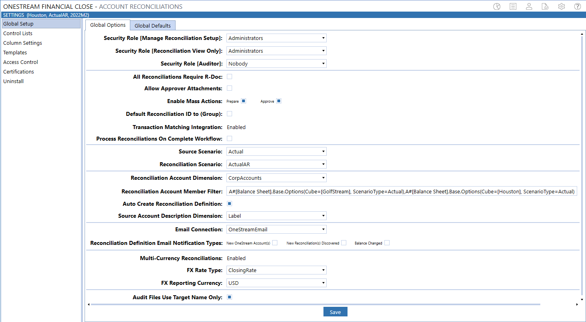

## Account Reconciliations

Security Role [Manage Reconciliation Setup]: Anyone assigned to this OneStream User

Group is considered a super user who can configure any aspect of Account Reconciliations and

also prepare, approve, comment, or view any reconciliation. This role is also referred to as the

Reconciliations Global Admin. The default setting is the standard Administrators User Group.

NOTE: Anyone in the Administrators User Group is a OneStream System Administrator

and, by default, can perform any of the same duties as a Reconciliations Global Admin.

Different from the OneStream System Administrator, this can be someone in the Administer

Application Security Role User Group, which is configured under the Application tab and then in

Security Roles. This User Group could be different from a System Administrator if the

Administrators User Group is not assigned. If it is desired for anyone with this OneStream

application’s Administer Application Security Role to also play the role of Reconciliations Global

Admin, include that same User Group as a member of the User Group assigned to Security Role

[Manage Reconciliation Setup].

Security Role [Reconciliation View Only]: This group can see reconciliations but cannot make

any changes or log any reconciliation line items. This group must also have Access Group

privileges to the workflow profiles where reconciliations are managed.

Security Role [Auditor]: This group can see Fully Approved reconciliations only and can add

comments to Fully Approved reconciliations.

All Reconciliations Require R-Doc: If selected, each reconciliation that is not auto reconciled

must have an R-Doc attached in order to click the Prepare button.

Allow Approver Attachments: If selected, allows approvers to add attachments to prepared

reconciliations.

Enable Mass Actions: By default, these check boxes are clear. If selected, users can set

multiple reconciliations to the same status at one time. If clear, the buttons for mass actions do not

display on the reconciliation workspace.

## Account Reconciliations

l Prepare: Preparer can complete or recall multiple reconciliations.

l Approve: Approver can approve, unapprove, or reject multiple reconciliations.

### Default Reconciliation ID to (Group):

l If selected, when you create an I-Item for an account group, the Reconciliation ID field will

be (Group) by default. You can change the reconciliation ID before you save it.

l If clear (default), when you create an I-Item for an account group, the Reconciliation ID field

will be blank by default. You will have to select an option from the drop-down menu for this

required field.

IMPORTANT: After you select a reconciliation ID and save the item, it cannot be edited.

To update the reconciliation ID, delete the item and then add it with the correct

reconciliation ID.

Transaction Matching Integration: Select to enable integration with the Transaction Matching

solution.

IMPORTANT: After you enable integration with Transaction Matching and save the

### settings, you cannot disable the integration.

Process Reconciliations on Complete Workflow: If selected, initiates Process Reconciliations

before marking the workflow as completed. If balances have changed, then the workflow cannot

be completed.

NOTE: The Process Reconciliations action performed as part of the Complete workflow

step is an in-line action. Running Process at the Base Input or Review level are Data

Management jobs.

Source Scenario: Typically the Actual scenario. When Discover is performed during

reconciliation, this is the scenario queried for balances.

## Account Reconciliations

Reconciliation Scenario: Set this up as a scenario separate from Actual. In this example, we are

using a scenario called ActualAR. This is a mirror of Actual but assigned a different scenario type,

so a different workflow profile can be used with it. Therefore, it can have separate workflow

locking from the Actual scenario type scenarios.

Reconciliation Account Dimension: Select the Account dimension containing the accounts to

be reconciled.

Reconciliation Account Member Filter: Enter an account-based member filter used to query a

list of accounts to reconcile. For example:

### A#[Balance Sheet].Base, A#1000, A#2000.Base

If Extensible Dimensionality is being used on the Account dimension in this application, this

member filter must be adjusted to query accounts differently across each cube. This is because

an account could be a base member in one Account dimension and a parent in another. Here is

an example of this syntax:

A#[Balance Sheet].Base.Options(Cube=[GolfStream], ScenarioType=Actual),A#[Balance

### Sheet].Base.Options(Cube=[Houston], ScenarioType=Actual)

Auto Create Reconciliation Definition: If selected (default), when a user clicks Discover on the

Reconciliation’s Definition, a Reconciliation Definition is added for any account in the Account List

that does not yet have one.

Source Account Description Dimension: Select the field (Label, Text Value, or Attributes 1–

20) to populate the S.Account Desc. column in grids and the description in the detailed

reconciliation header and reports for individual reconciliations. Default value is (Unassigned).

NOTE: If you have more than one source account description associated with a single

source account, the S.Account Desc. field will only be populated with one. In this

scenario, you cannot select a specific source account description, so if a specific value is

required, ensure the source import data being mapped to the account is consistent.

## Account Reconciliations

IMPORTANT: After you update the Source Account Description Dimension, you must

save the change and then run Discover.

Email Connection: The named email connection used for notifications. The name of the

connections in this drop-down list derives from the initial server configuration.

Reconciliation Definition Email Notification Types: By default, these check boxes are clear. If

selected, an email is sent to those in the main Security Group (Manage Reconciliation Setup)

under Global Options when these events happen.

l New OneStream Account(s): New account is included in the Account List after running

Discover.

l New Reconciliation(s) Discovered: New Reconciliation Inventory items are found after

running Discover.

l Balance Changed: A reconciled balance was changed either after it was marked Complete

or set to In Process and is different from the original value.

## Account Reconciliations

Multi-Currency Reconciliations: Enables the multi-currency features in the solution.

NOTE: After you click this button and save the settings, multi-currency cannot be

disabled. It is strongly recommended that this feature be tested in a development

application because you cannot revert to single currency reconciliations.

The impact of multi-currency is discussed throughout the guide. Enabling multi-currency allows

you to have a currency type set at the Source Account level (GL Account). The Account currency

type for each reconciliation item is maintained within the Reconciliation Inventory. This differs

from the Local currency (maintained on the Entity dimension) and Reporting currency (maintained

at the Cube level). Therefore, each reconciliation item may have a different Account currency.

Reconciliations with a common Target Entity will have the same Local currency, and all

reconciliations within an application will have a single Reporting currency. In addition, for

reconciliations where multi-currency is enabled, Account, Local, and Reporting currencies all

display in the Account Reconciliations user interface.

Detail items may also be created using any currency type maintained in OneStream and are

automatically translated to Account, Local, and Reporting currencies upon save. Also, Account

Groups may be created for accounts or entities that have different currency types, allowing child

reconciliations to be translated and aggregated to a single reconciling currency type, for each

currency level, at the Account Group level.

### FX Rate Type

Single Currency Solutions: The FX Rate Type that is being used to calculate the reconciliation

balances on specific reports. Examples include ClosingRate or AverageRate. If this is not

populated, no translated values are available in reports. This must be set even if multi-currency is

enabled because some reconciliations within the Reconciliation Inventory may remain single

Currency.

## Account Reconciliations

Multi-currency Solutions: The FX Rate Type that is being used to translate reconciliation balances

from Local currency to Account currency and from Local currency to Reporting currency.

Translation from one currency level to another only occurs if the account or reporting balances are

not loaded into Stage. Local currency is the base-level currency and is the level that is reconciled

for single currency applications. Therefore, local balances are required for multi-currency

reconciliations. This is also the rate type that is used to translate detail items from the detail

currency type to the Account, Local, and Reporting currency types. If this is not populated,

translations do not occur.

### FX Reporting Currency

Single Currency Solutions: The currency type used as the target currency for reports that translate

values. If this is not populated, no translated values will be available on these reports.

Note on translation in certain reports: Account Reconciliations provides a translated value in

certain reports for the convenience and analysis of the administrator or end user. This translated

value is not stored but is calculated based on settings in Global Setup as the report is being

processed. This is a simple translation being run that assumes a calculation similar to the Direct

translation method of multiplying what is expected to be a Year to Date value by the FX Rate Type

specified in Global Setup; however, these are not the same translation algorithms being

processed, and no custom translation methods (that is, Business Rules) are supported. These

reports note that they are translated by listing this FX Reporting Currency in the right side of the

report’s header section.

## Account Reconciliations

NOTE: To see the reports within the Reports and Analysis in different currency types,

enable multi-currency.

Audit Files Use Target Name Only: Controls the naming convention for Audit Package files. If

selected, audit files that are created will only use the Target Account and Entity in the file name. If

clear, the audit files are created with the Source and Target Account and Entity in the file name.

The default is set to clear.

NOTE: The check box should be selected if there is the possibility of the file name length

exceeding the Windows limit of 260-character file names. If the file name exceeds 260-

characters, the Audit Package file will not be generated. Windows 10 does enable users

to change the 260-character limit by changing the Windows Group Policy.

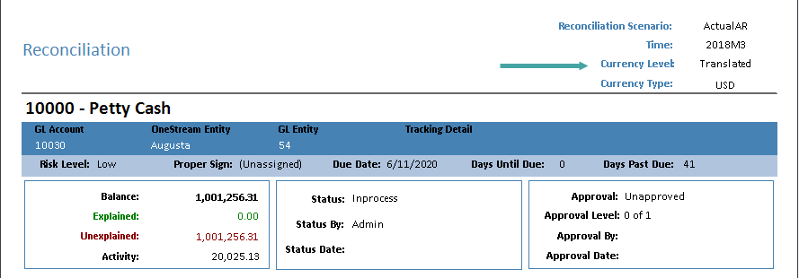

## Account Reconciliations

### Global Defaults

Default Reconciliation Definition: Default attributes for all new Reconciliation Definitions

created during the Discover process. See Reconciliation Definition for details on configuration.

This only occurs if the Auto Create Reconciliation Definition property of Global Options is

selected.

Default Reconciliation Attributes: Default attributes for Security Roles (Preparer, Approvers 1–

4, and Access Group) and Notification Method. Note that the same user cannot be assigned to

more than one security role.

These settings apply to all new Reconciliation Inventory items created during the Discover

process. See Reconciliation Inventory for details on configuration.

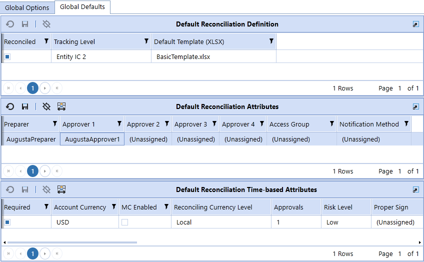

## Account Reconciliations

Default Reconciliation Time-based Attributes: Default attributes for time-based attributes.

These settings apply to all new Reconciliation Inventory items created during the Discover

process.

## Control Lists

You can set up control lists for:

l Item Types

l Reason Codes

l Close Dates

l Aging Periods

l Attribute Columns

### Item Types

When a Preparer creates Reconciliation Detail Items, these are the types of items that can be

created. You can add new Item Types.

NOTE: An Item Type cannot be deleted.

## Account Reconciliations

Stored Value: Text written to the Account Reconciliations tables when an item is added. The user

does not see this.

Display Value: Item Type text that displays to the user when reconciling.

Description: Type of item added to a reconciliation.

l Correction (BS) or Correction (IS): These items indicate an issue with the current

balance in the GL and requiring a correction.

l Explained: A manually entered item.

l Statement: An item supported with an attached statement such as a cash account

statement.

Active: By default, this is set to True. If False, these Item Types do not display when creating

items.

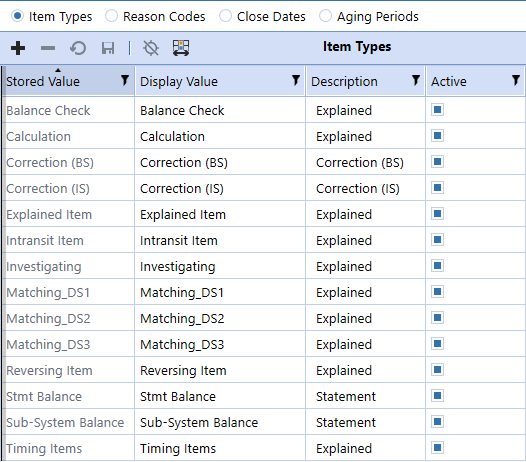

## Account Reconciliations

### Reason Codes

When you click Reject or Unapprove, you are prompted to provide a Reason Code for the

change. You can edit the reason codes or add new ones.

Stored Value: Text written to the Account Reconciliations tables when a reason is added. The

user does not see this.

Display Value: Reason Code text that displays to the user when entering a reason.

Active: By default, this is set to True. If False, these Reason Codes do not display when rejecting

or unapproving.

### Close Dates

Close Dates associate a Workflow Time Period with a specific day and time. The purpose of this is

to pivot from this date and time to determine if someone is late with their assignments, regardless

of their location.

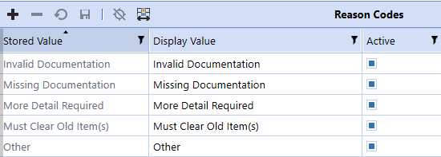

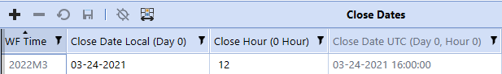

## Account Reconciliations

NOTE: If the Close Dates are not set up for a given period, then the date is 1900/01/01

on the Reconciliations page.

WF Time: Workflow Time Period. Click the + button to add one record for each Workflow Time

Period related to the Source Scenario.

NOTE: The list of Workflow Time periods is for the currently selected Workflow Year

plus the following year. This includes all frequencies of time (half years, quarters,

months). The Input Frequency properties of each scenario (for example, Monthly) must

match.

Close Date Local (Day 0): Set to the date when the financial close starts for this Workflow Time

Period.

Close Hour (0 Hour): Set to the hour of day for what local time the close starts. For instance, if

this is 5:00 PM, set this as 17. Local time is determined by the time zone where your OneStream

server is located.

Close Date UTC (Day 0, Hour 0): No entry is required because saving the record calculates the

value. The Close Date Local (Day 0) and Close Hour (0 Hour) are converted to the UTC

(Coordinated Universal Time, aka GMT/Greenwich Mean Time) equivalent for the purposes of

comparing the current local time for when a Reconciliation Inventory item is due.

### Aging Periods

Aging periods are used to review your detail item aging, in total, so you can determine which

balances need to be written off. The aging period is automatically assigned to an item upon Save

based on the calculated aging and the periods created. Aging periods are used in the Aging Pivot

analysis report. Each start date must be unique.

## Account Reconciliations

Period Start Date: Click the + button to add aging periods. For example, if you enter 16 for a new

period start date, the first period is 0-15 days and the next period is 16-30 days.

### The default period start dates are:

l 0: 0 to 30 days

l 31: 31 to 60 days

l 61: 61 to 90 days

l 91: 91+ days

### Attribute Columns

You can create up to three custom attribute columns to display in the Account Reconciliations

page for users. They can be free-form text boxes or have a drop-down menu of values. These

customized attribute columns will also display in the Inventory page and the Edit Reconciliation

Attributes dialog box.

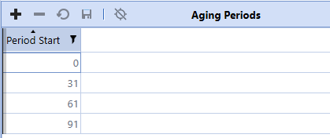

## Account Reconciliations

To add an attribute, first enter a display name and then select the Active check box for the

attribute.

Display Name: Enter a name for the attribute to display on the Account Reconciliations page.

This name must be unique.

Active: Select this check box to make the attribute visible on the Account Reconciliations page.

Dropdown: Select this check box to add a menu of values for users to select from.

Value: After you select the Dropdown check box for an attribute and save, the Dropdown Values

section displays. Enter each value to display for users in a drop-down menu. Each value must be

unique within that attribute.

IMPORTANT: Editing or removing active values that are in use may affect work in

progress.

## Column Settings

Administrators can select which columns are visible for users on the Account Reconciliations

page and in the Scorecard grids.

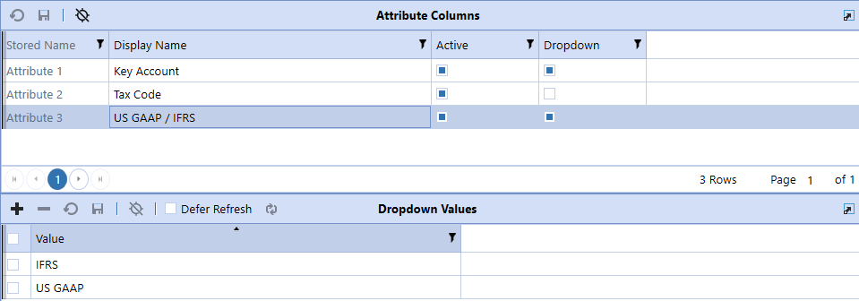

## Account Reconciliations

Column: Name of each column on the Account Reconciliations page and the Scorecard grids.

Order: Update the numbers to reorder the display of columns.

TIP: Leave a gap between numbers when you set the order (for example, 10, 20, 30) to

avoid having to renumber each subsequent item when you edit the order.

Active: Select this check box to display the column in the Reconciliation page and the Scorecard

grids. Clear this check box to hide the column.

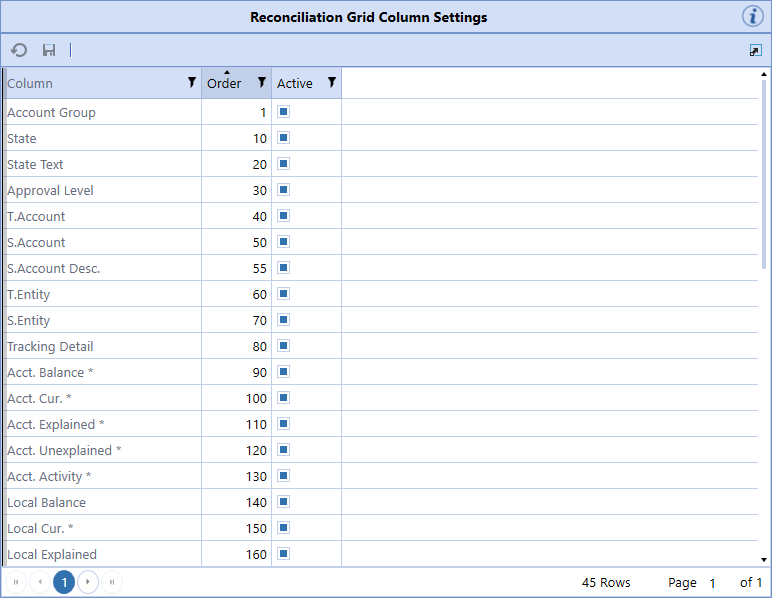

## Account Reconciliations

NOTE: Multi-currency columns have an asterisk. If Multi-Currency Reconciliations is

enabled in Global Setup > Global Options, you can select the Active check box to

display those columns. If Multi-Currency Reconciliations is not enabled, the Active check

box cannot be selected. See Global Setup.

## Templates

The location where standard Excel templates are stored for assignment to Global Defaults and

## Reconciliation Definitions.

Account Reconciliations comes with a few example templates. You can create custom templates

and upload them here.

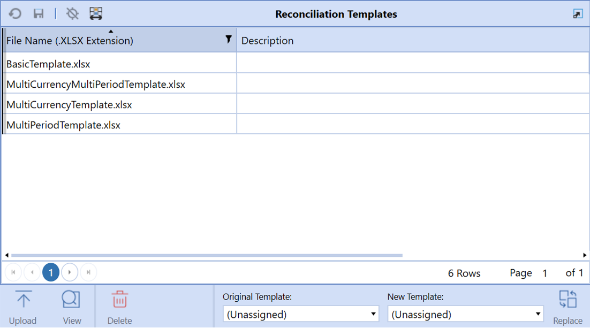

## Account Reconciliations

NOTE: If you upgrade using Uninstall Full, custom templates are removed and replaced

with default templates. To save custom templates for future use, save the Excel files

outside of OneStream Financial Close and upload them after you upgrade. If you

upgrade using Uninstall UI, custom templates are retained.

IMPORTANT:  If using multiple instances [rcm].[ReconItem] will reflect the instance in

use. For example, [rcm1].[ReconItem].

If you are using any of the Templates or Exports listed below from a prior release version, please

update the file to reflect the new table names in the following areas:

IMPORTANT:  If you are using a Template or Export from a prior release version,  you

will need to unhide certain rows within the template to update to the new table names.

Upload: Add a new Excel template to this solution.

View: Opens a read-only copy of the selected template.

Delete: Deletes a template if it is not assigned to any reconciliations.

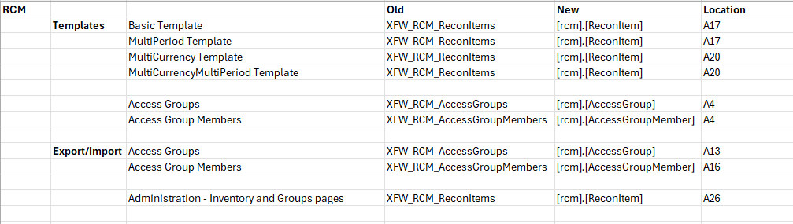

## Account Reconciliations

Replace: To change the template assigned to any existing Reconciliation Definition, select the

Original Template and the New Template, and then click Replace. This change occurs in all

Reconciliation Definitions. When viewing the Basic Template that comes with Account

Reconciliations, there are Substitution Variables replaced with values from the reconciliation

being processed. The following example is the design view.

NOTE: In this template, the rows typically hidden are shown along with the Excel Named

Range being imported.

The references to Substitution Variables in the top part of the Excel template relate to Substitution

Variables available in Account Reconciliations. These settings are replaced when you download

the template at runtime to substitute with values from Account Reconciliations. Other Substitution

Variables can be used here, making templates flexible.

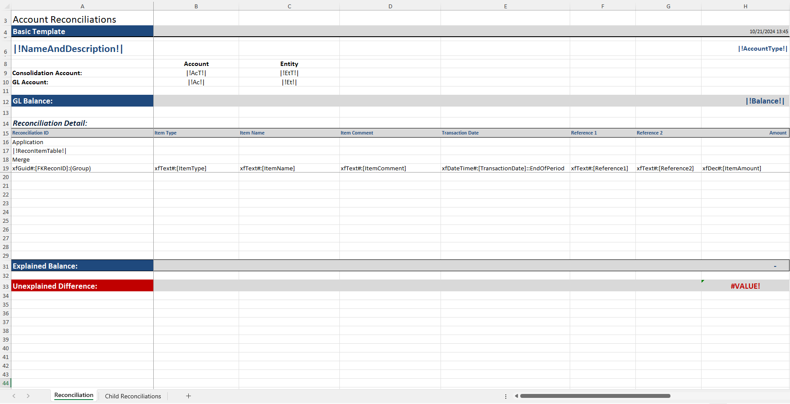