# Reconciliation Administration

## Account Reconciliations

For details on designing this type of Excel template to load into OneStream, see Data Collections

in the Design and Reference Guide.

The following examples are the MultiPeriodTemplate.xlsx and

MultiCurrencyMultiPeriodTemplate.xlsx. Note that the Named Range of xftRecon is selected and

rows are shown that are typically hidden (rows 16–19 in the MultiPeriod template and rows 19–22

in the MultiCurrencyMultiPeriod template). This Named Range would need to be extended if

additional rows are needed for import. The top left cell of such a Named Range must be the cell

with the word Application in it and the bottom right cell of the range should be the last column of

the last row to be imported. It is acceptable to include additional empty rows in this range.

OneStream can read in multiple xft Named Ranges on one or more sheets of the same Excel

workbook. Save this file in Excel .xlsx format.

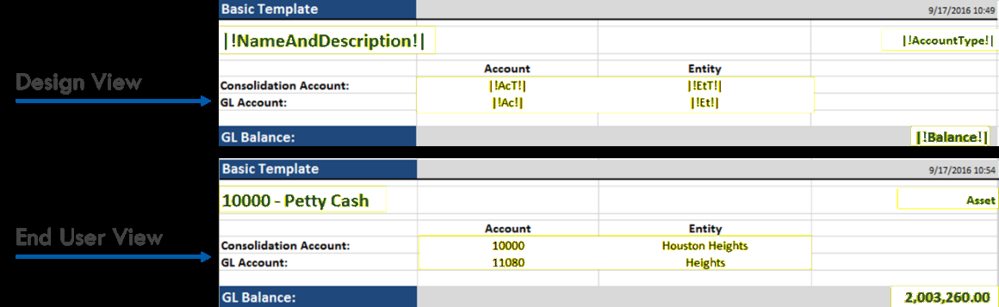

## Account Reconciliations

### MultiPeriod Template

### MultiCurrencyMultiPeriod Template

Note the following information for the highlighted items:

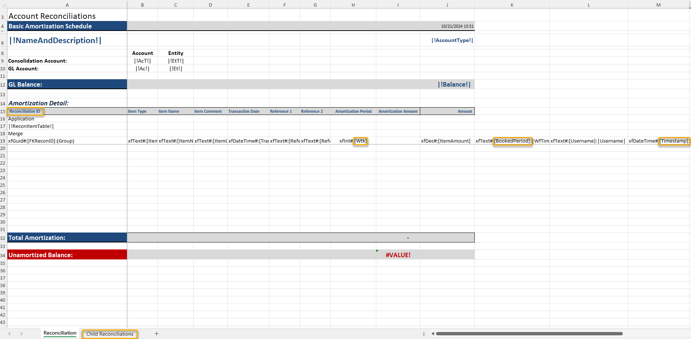

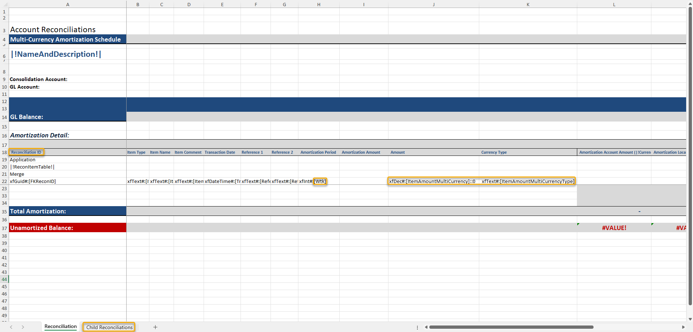

## Account Reconciliations

Reconciliation ID: A Reconciliation ID column with a drop-down menu is included in the following

templates: Basic, MultiCurrencyMultiPeriod, MultiCurrency, and MultiPeriod. For account groups,

the drop-down menu displays the related child reconciliations associated with the group as well as

(Group); for individual reconciliations, the drop-down menu is blank. When you import an item with

the template, the Reconciliation ID from the template will display in the Detail Items grid on the

Reconciliations page.

Child Reconciliations tab: The Basic, MultiCurrency, MultiPeriod, and MultiCurrencyMultiPeriod

templates include a Child Reconciliations tab that displays related balances for each child

reconciliation in an account group.

Wtk: Workflow Time Key. These OneStream time periods contain an exclamation point as the first

character (for example, !2018M1). This helps OneStream look up the time key for this period and

store that value in the database when imported. Include as many rows as periods of data are

necessary, even if spanning years.

BookedPeriod: The |WFTime| Substitution Variable is used, which means that every row

imported lists the period it was booked as the same period that was processed at the time.

TimeStamp: The date and time this template was imported, which will be the same for each time

period.

NOTE: If a template is used to create a supporting Detail Item, that support type, either

T-Doc or S-Doc, must be attached to the reconciliation or the reconciliations may not be

completed.

Item Amounts (Multi-currency Solutions): These columns are automatically translated within the

template. The template is pulling FX rates for the period in order to translate the Detail Amount

balances. The translated amounts are for display purposes only, because translation of the Detail

Amounts takes place when imported into OneStream. Further, only current period balances will

be translated on the template.

## Account Reconciliations

Multi-currency Solutions: Templates that support multiple currencies are included for solutions

that have multi-currency enabled. In the MultiCurrency template and MultiCurrencyMultiPeriod

template, columns are included to allow for Detail Amount, Detail Currency Type, Account

Balance, and Reporting Balance.

For single currency reconciliations, only Local balances are loaded and as such, if a reconciliation

is set to single currency, the templates that do not include multi-currency functionality must be

used. The currency type for each currency level appears within the template and FX rates are

automatically pulled in order to show the conversion that will occur on import. Note that

OneStream still uses the translation functionality within the system to translate Detail Amounts.

The translated balances of Account, Local, and Reporting for the Detail Items are for informational

purposes only. However, if an override is necessary for any of the levels, OneStream accepts the

overridden amount upon upload of the template if overrides are permitted on the reconciliation. To

identify balances that were overridden within the template, amounts overridden display bold and

the override alert appears on the face of the reconciliation.

For MultiPeriod templates, informational translated balances only display for the current month

because future rates are not available at the time of template creation.

## Access Control

Access Groups can be created under Access Control by OneStream Administrators or

Reconciliation Global Admins. Access Groups are used only by the Account Reconciliations

solution and are different than User Groups used in other parts of OneStream.

Access Groups can be initially set up to support the concept of backup people in the case of

vacation or other reasons where the person assigned to a primary role cannot perform their duties

in a given month. It can contain many users of each role. For example, an Access Groups may

contain more than one user for the Preparers role. By adding more than one user per role in this

way, the main person’s backup is already granted access.

## Account Reconciliations

Another way that backups are built in is where a person in a superior role can act in place of a

person in a lessor role for a given month. For example, if a user in a Preparers role is on vacation,

a person in the Approvers 1 role can act as a Preparer that month, but cannot approve the

reconciliation because of enforced Segregation of Duties requirements. Someone else must

approve for this particular month.

See Security for more information including the concepts of Local Admin and Segregation of

Duties.

### To manage access groups:

l Click + to add a row.

l Select the boxes next to one or more items in the list and click - to delete. As a best practice,

export your access groups before making a mass update. See Access Groups (Mass

Updates).

l Click Save to save changes.

l Click Cancel All Changes Since Last Save to cancel unsaved changes.

## Account Reconciliations

### Access Groups (Editor)

Name: Name of the Access Group. It is recommended to use a common naming configuration

since there could be many of these. For instance, starting the Name with R_ is a good way to

signify that this Access Group is meant to be assigned to an individual Reconciliation Inventory

item. Starting with G_ would mean that this Access Group is meant to be assigned to an Account

Group. Whatever standard is set by your project team, it is recommended that this is documented

and followed by all Account Reconciliation Admins.

Description: A more detailed description of this Access Group.

## Security User Members

Security User: Select a user from a list of all users within the OneStream Framework. A user can

only be added to an Access Group once.

Role: Select a role for this user:

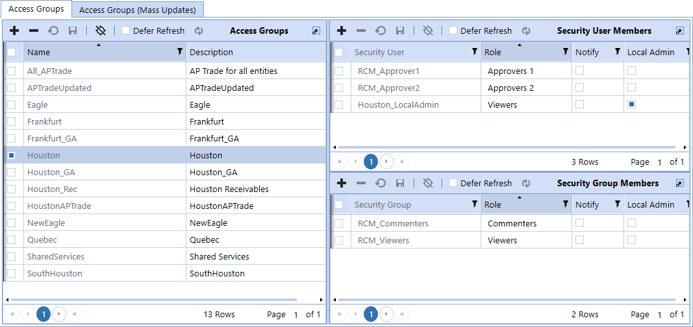

## Account Reconciliations

l Preparers – Can see assigned reconciliations and perform preparation duties through

clicking the Prepare button.

l Approvers 1 through Approvers 4 – Choose up to four levels of approvers. You should

assign at least as many Approvers as there are approval levels on the reconciliation that

this Access Group is assigned to. For example, if the reconciliation has Approvals set at 3,

there must be at least a user assigned to the related Access Group at Preparer, Approval 1,

Approval 2, and Approval 3 to be able to prepare, and approve the reconciliation.

l Commenters – Optional. This user can see the data and activity but can only make

comments related to this reconciliation.

l Viewers – Optional. This user can see the data and activity but cannot make comments

related to this reconciliation.

Notify: Select this box to send email notifications to this user (as configured under the

### Notifications tab on the Administration page).

Local Admin: Select this box if this person acts as the Local Admin for this Access Group. See

Local Admin Permissions for more information.

## Security Group Members

Security Group: Select a group from Platform Security Groups. A group can only be added to an

Access Group once.

Role: Select a role for this group:

## Account Reconciliations

l Preparers– Can see assigned reconciliations and perform preparation duties by clicking

the Prepare button.

l Approvers 1 through Approver 4 – Choose up to four levels of approvers. You should

have an Approver for each approval level on the reconciliation that this Access Group is

assigned to. For example, if the reconciliation has Approvals set at 3, there must be at least

a group assigned to the related Access Group at Preparer, Approval 1, Approval 2, and

Approval 3 to be able to prepare, complete, and approve the reconciliation.

l Commenters– Optional. This group can see the data and activity but can only make

comments related to this reconciliation.

l Viewers– Optional. This group can see the data and activity but cannot make comments

related to this reconciliation.

Notify: Select this box to send email notifications to this group (as configured under the

### Notifications tab on the Administration page).

Local Admin: Select this box if this group acts as the Local Admin for this Access Group. See

Local Admin Permissions for more information.

### Access Groups (Mass Updates)

### Import / Export of Access Groups

Allows you to use Excel to edit Access Groups.

## Account Reconciliations

Table Type: Select whether to export data or a template for Access Groups or Members of

Access Groups.

Export: Exports either Access Groups or Access Group Members to a CSV file that opens in

Excel for editing. You must add a Named Range starting with the letters ‘xft’ covering appropriate

columns and rows, with the cell with the word Application in it being the top left cell of the range.

Save this file in Excel xlsx format. See Templates for more information.

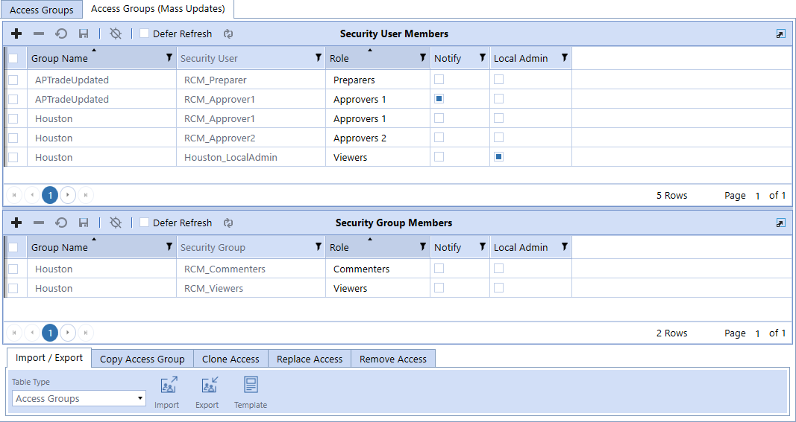

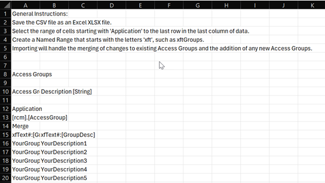

## Account Reconciliations

Template: Opens a pre-fixed Excel template for loading Access Groups or Access Group

Members depending on the Table Type selection.

Import: Opens a dialog to select an Excel or CSV file that contains Access Groups or Access

Group Members to merge changes or add new records.

CAUTION: When you import, make sure that the source file is not open on your

computer otherwise an error occurs.

### Copy Access Group

Select a Source Access Group as the model group, enter a name for the Target Access Group,

and then click Copy. The Users and User Settings in the Source Access Group are added to the

newly created Target Access Group.

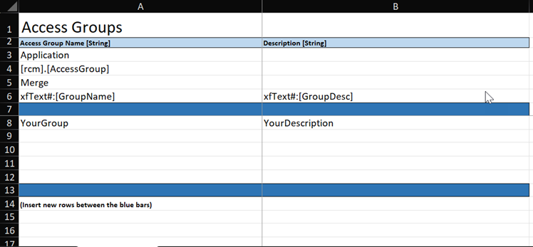

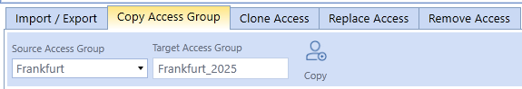

## Account Reconciliations

### Clone Access

Select a Source Security User as the model user and a Target Security User, and then click

Clone. The Target Security User is added into every Access Group that the Source Security User

is in. If the Target Security User was previously in an Access Group that the Source Security User

is not in, the Target Security User is removed from that group. The Target Security User and

Source Security User will have the same access.

You can use the same procedure to clone security group access.

### Replace Access

Select a Source Security User who will be replaced in every Access Group with the Target

### Security User and then click Replace.

You can use the same procedure to replace security groups.

### Remove Access

Removes the selected security user or group from every Access Group.

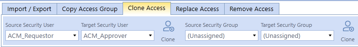

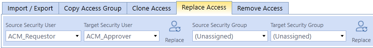

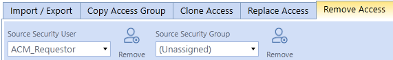

## Account Reconciliations

## Certifications

Certifications are customizable text that are presented to users with the Preparer or Approver

roles when a reconciliation is completed and approved.

Role: The role of Preparer or Approver for the certification.

NOTE: The Approver Certification is presented for all approval levels.

Message: The certification message presented to the Preparer or Approver when completing or

approving reconciliations.

Active: By default, this is set to True. If False, the certification is not displayed when completing or

approving reconciliations.

Comment Required: By default, this is set to True. If False, comments are not required, but can

optionally be added when completing or approving reconciliations. Comments are displayed in

the Status and Approval History – Detail section.

Time Stamp: The date and time the certification settings were created or modified.

User: The ID of the user who created or modified the certification settings.

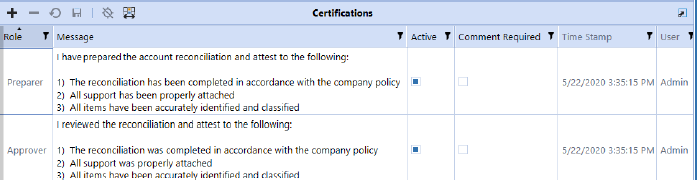

## Account Reconciliations

## Uninstall

The Uninstall feature allows you to uninstall the user interface or all solutions within OneStream

Financial Close. If performed as part of an upgrade, any modifications that were made to standard

solution objects are removed.

Users can navigate to the Uninstall tab to view available options.

1. On the Settings page, click Uninstall.

IMPORTANT: The Uninstall option uninstalls all solutions integrated in the OneStream

Financial Close.

### The uninstall options are:

1. Uninstall UI - OneStream Financial Close removes all solutions integrated into the

OneStream Financial Close, including related dashboards and business rules but leaves

the databases and related tables.

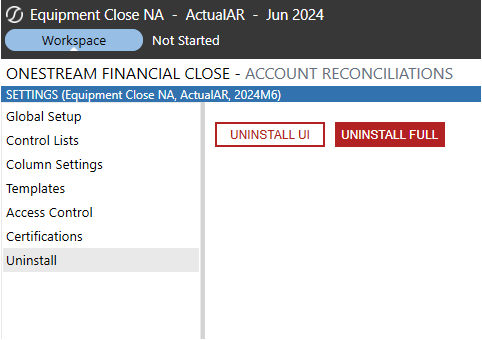

## Account Reconciliations

IMPORTANT: This procedure resets the Workspace Dashboard Name to (Unassigned).

An Administrator must manually reassign the Workspace Dashboard Name after

performing an Uninstall UI.

2. Uninstall Full - OneStream Financial Close removes all the related data tables, data,

dashboards, and business rules from all solutions integrated into OneStream Financial

Close. Select this option to completely remove the solutions or to perform an upgrade that

is so significant in its changes to the data tables that this method is required.

CAUTION: Uninstall procedures are irreversible.

## Reconciliation Administration

### Click

to open the Administration page. This page is accessible by OneStream Admins,

Reconciliations Global Admins and Local Admins (in limited scope).

The Administration page is where you configure:

l Definition

l Inventory

l Groups

l Tracking

l BalCheck

l AutoRec

l DAM

l Notifications

## Account Reconciliations

## Reconciliation Definition

IMPORTANT: If you have reconciliations that have a frequency other than monthly and

migrate to OneStream Financial Close Release PV710 SV201 or later, you may need to

mark the reconciliations as required in the current period and then run Discover for the

current period.

The Reconciliation Definition page is where high-level properties are set for all Reconciliation

Inventory items that are found through the Discover process. Reconciliation Definitions tell

OneStream that these Account dimension members need to be reconciled. Reconciliation

Inventory items are detailed Account data rows and Account Groups found in the OneStream

Stage that were imported from the General Ledger. This page is not accessible by Local

Administrators.

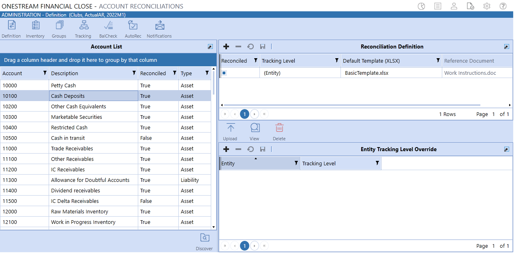

## Account Reconciliations

### Account List

The initial Account List is generated based on the solution's Reconciliation Account Dimension

and Reconciliation Account Member Filter settings in Global Options. These accounts are from

the OneStream Cube, not from the General Ledger. This lists each of these accounts along with

their account type. If an account has a related Reconciliation Definition, then it displays a value of

Reconciled = True.

## Reconciliation Definition

Click Discover to add a Reconciliation Definition to each account. Only one Reconciliation

Definition can be added per account in the Account List. You can also click the + button to add a

## Reconciliation Definition to an account.

Reconciled: Determines whether an account is reconciled. If selected, this is set to True in the

Account List on the left and the account is reconciled. If cleared, this is set to False in the Account

List on the left and it and any of its related detailed imported Stage rows are not reconciled.

Tracking Level: Derived from the Tracking Levels settings page and determines the granularity

of the reconciliation. It is used during the Discover process.

Default Template (XLSX): Derived from the Templates page and determines the template used

by the preparer. This can be overridden at the Reconciliation Inventory level.

Reference Document: The document to display to the user at runtime for this account. See

Reference Document Options.

## Account Reconciliations

### Entity Tracking Level Override

There are times when an account needs to be tracked in the Reconciliation Inventory at a level

that is an exception for certain entities beyond the setting for that account in general as set in the

Reconciliation Definition. In these cases, click + to add an exception per entity that requires one

for this Reconciliation Definition. For instance, account 10000 has a Tracking Level of (Entity),

which means by Entity and Account. But for that same account and an entity called ABC, they

may need to track this account by Entity, Account, and Flow.

### Discover

Click Discover to process the Reconciliation Definitions and create the Reconciliation Inventory

as a background process. Discover runs for the current and future workflow periods. Prior periods

are not affected by the discovery process.

Time-based attributes are copied in the Discover process if they do not exist in the current period:

l For reconciliations that do not have attributes for the current period, Discover copies the

time-based attributes from the previous period to the current period.

l For reconciliations that do not have attributes for the current period and were not created

from the prior period, Discover copies the time-based attributes from the next period to the

current period.

NOTE: The time-based attributes will only be copied from the next period not any

further future periods.

In Global Options, if the Auto Create Reconciliation Definition property is selected, it adds a

Reconciliation Definition for each row in the Account List that does not already have one.

## Account Reconciliations

This process also builds out the Reconciliation Inventory entries by searching the current and

future time periods for the Source Scenario in the Stage for any instance of a row of source data

that was mapped to an account that has an active Reconciliation Definition.

IMPORTANT: Clicking Discover searches for every entity associated with the currently

selected Workflow Profile, so running Discover at a higher level in the Workflow Profile

structure at a Review level Workflow Profile will generate considerably more

## Reconciliation Definitions.

You can run Discover on multiple workflows simultaneously as long as the workflows do not have

a parent/child relationship. For example, you can run Discover on the Frankfurt and Houston

workflows at the same time. But you cannot run Discover on Frankfurt and Clubs at the same

time, because Clubs is a parent of Frankfurt.

### Click the Task Activity icon

to show the results of the Discover process and how many new

## Reconciliation Inventory Items were discovered.

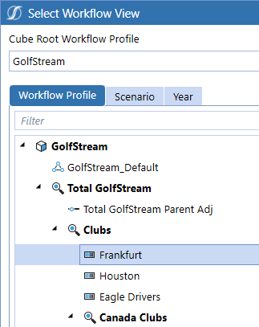

## Account Reconciliations

NOTE: You can manually run the Discover process from the Data Management

Sequence called DiscoverRecons_RCM. For scheduled Discover jobs, you must pass in

these parameters: ProfileKey, SourceScenarioId, ReconScenarioId, TimeKey.

### Reference Document Options

A Reference Document is a set of instructions used to explain how to perform a reconciliation.

This can be presented to the user as they prepare the reconciliation.

Upload: Load a document to the Reconciliation Definition.

View: Download a copy of the document from the Reconciliation Definition.

Delete: Delete the document from the Reconciliation Definition.

## Reconciliation Inventory

This is where you configure reconciliations. The Reconciliation Definition is based on the target

accounts being reconciled. After you click Discover, the Reconciliation Inventory is generated.

The Reconciliation Inventory is based on the Source Accounts (from the GL) related to the Target

Accounts (accounts in the OneStream Cube) that have active Reconciliation Definitions for a

specific Workflow Profile.

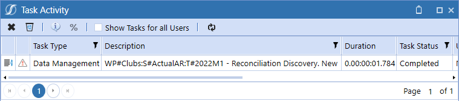

## Account Reconciliations

TIP: The state of each reconciliation inventory item is visible. This helps you to

understand which items are already prepared when selecting reconciliations to make

edits to.

Assigned Match Sets: Select an option to filter the inventory to view where Match Sets are

assigned. Select one or more match sets or select one of these options:

l (Full Inventory): All reconciliations.

l (All): Reconciliations that have a match set assigned.

l (None): Reconciliations that do not have a match set assigned.

Edit: Edit the attributes for the selected reconciliation. You can select multiple reconciliations and

make changes that apply to all. For example, you can select multiple reconciliations and change

the Risk Level from Medium to High.

Delete: Deletes the selected Reconciliation Inventory item.

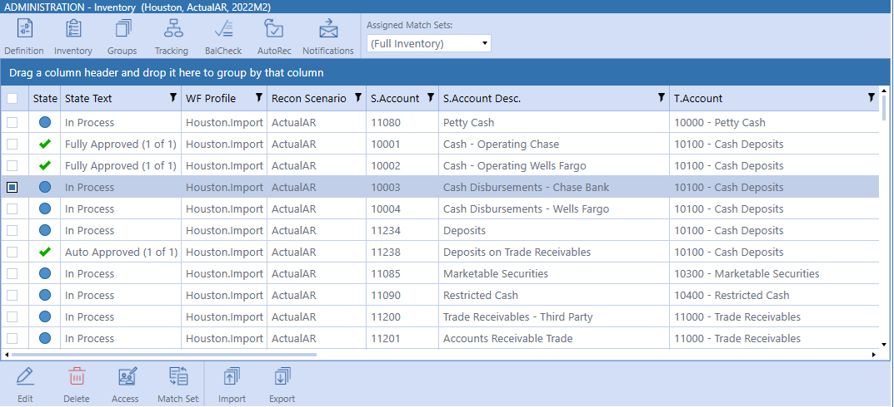

## Account Reconciliations

NOTE: If the Discover process results in more Reconciliation Inventory items than

desired, delete those that are not intended for future processing.

Access: Edit the access group for the selected reconciliation.

Match Set: Manage the assigned match set for the selected reconciliation.

NOTE: Match Set cannot be used to update the assigned match set for a child

reconciliation because it is associated with a group. You can manage the match set for

child reconciliations in Groups. See Account Group Actions.

Import: Opens a dialog box to select an Excel .xlsx formatted file to import that contains

Reconciliation Inventory Items to merge changes. The import will not create new Reconciliation

Inventory Items nor allow the [NewGuid] argument. You must close this file before importing it.

This button is not accessible by Local Admins.

Export: Exports all reconciliations in the Reconciliation Inventory, except for Account Group type

items, as a CSV file that can be opened in Excel. You must add a Named Range starting with the

letters xft covering appropriate rows starting with the cell with the word Application in the top left

cell. This file should then be saved in Excel .xlsx format. You must close this file before importing.

Instructions are included in the exported file. This button is not accessible by Local Admins.

NOTE: The headers at the top indicate the global default value that will be used.

## Account Reconciliations

## Reconciliation Inventory Item Attributes

Attributes must be configured for every Reconciliation Inventory Item not assigned to an account

group. For items assigned to an account group, these attributes are configured at the account

group level.

Reconciliation attributes are pulled forward from month to month using Discover. Changes made

to reconciliation attributes are reflected in all subsequent periods and do not apply to prior

periods.

### Editing Reconciliation Attributes

### To edit reconciliation attributes:

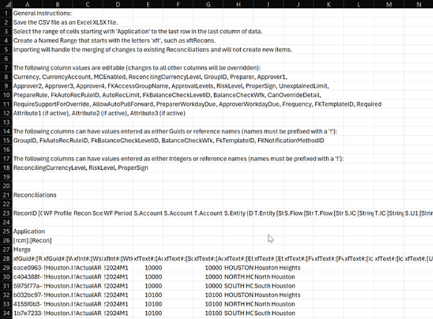

## Account Reconciliations

1. Select a reconciliation from the inventory list and then click Edit. If multiple reconciliations

are selected, the attributes of the first reconciliation selected (from the Inventory page, not

the validation grid below) will appear in the dialog box.

2. Make changes to attributes.

IMPORTANT: When you edit reconciliation attributes, you must select the check

box above the attribute for the change to be applied when you click Save. The

Save button displays after a check box is selected.

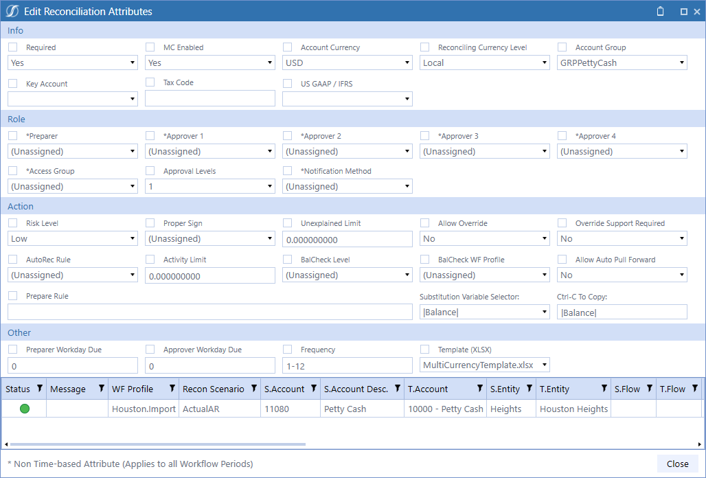

## Account Reconciliations

3. Click Save.

When editing reconciliation inventory attributes, Security Roles and Notification Methods can be

edited at any time. Other attributes can be edited only if the reconciliation has not been prepared.

Required: If clear, this will not be required to be reconciled.

MC Enabled (Multi-currency Solutions): Indicates if Multi-currency is enabled for the

reconciliation.

Within the Reconciliations page, Account and Reporting currency types will appear as a dash and

balances will be zero for a reconciliation until the established MC Enabled period.

While Account currency may not be used or required, being able to see Reporting within the

Reconciliations page may be helpful. In this instance, where only two currency levels exist (for

example, Local and Reporting), it is recommended that Multi-currency be enabled, the Account

currency default set to Local, and the MC Enabled setting enabled for each reconciliation.

Performance considerations must also be considered when using Multi-currency for the entire

Reconciliation Inventory. Specifically, if the entire inventory enables Multi-currency, forcing a

translation on Reconciliation Balances and Detail Items may cause processing times to increase.

As such, it is recommended only reconciliations where Multi-currency is necessary be enabled or

a translation on demand is run during non-critical business hours. See FX Translation Warning for

more information.

Account Currency (Multi-currency Solutions): Currency type for the Account level balance. This

will be a drop-down menu of all currency types within the Currency Filter in the Application

Properties. The default currency type will be set to Local and will therefore be the T. Entity’s

currency type. This may be changed by selecting a different currency from the drop-down menu.

## Account Reconciliations

Reconciling Currency Level (Multi-currency Solutions): Determines the currency level, either

Account, Local, or Reporting, to be used for the reconciliation. The default is Local, as this is the

level that was previously reconciled prior to Multi-currency was enabled. This reconciling level

applies to the Unexplained Limit, Prepare Rules, AutoRec, Balance Change, and Balance

Checks. For example, if the Unexplained Limit for a reconciliation is set to 0, the Reconciling

Currency Level is set to Account, and the Unexplained Limit is 0 for the Account level but 100 for

the Local, the reconciliation could be prepared. However, if the Reconciling Currency is set to

Local in the example above, the reconciliation could not be prepared.

The Reconciling Currency level is easily identified as it is the level in larger, bold font.

Account Group: Shows whether this Reconciliation Inventory Item is related to an account group

or (No Group) if it is reconciled individually. If the user is a Local Admin, the list of account groups

is limited to only those they manage. The Local Admin can change the assignment of a

Reconciliation Inventory Item to a different account group, but once assigned they are unable to

set as (No Group).

Custom Attributes: If custom attribute fields were added, this is where they will display in the

dialog box. See Attribute Columns.

Preparer: Assign the user or group. The same user or group cannot be added to multiple

roles. You can update security roles at any time.

Approver 1-4: Assign the user or group. The same user or group cannot be added to multiple

roles. You can update security roles at any time.

Access Group: Assign an Access Group to each Reconciliation Inventory Item that is not

assigned to an account group or set to (Unassigned). If user is a Local Admin, list of Access

Groups is limited to only those they manage.

## Account Reconciliations

Approval Levels: Choose levels of approval required for each Reconciliation Inventory Item from

1 through 4. Ensure that the Access Group assigned has people configured at the appropriate

levels of approval. See Access Control.

Notification Method: Select a method for notification created on the Notifications page or set to

(Unassigned) .

Risk Level: Options are Low, Medium, or High Risk for this Reconciliation Definition. This is for

reporting and other filtering.

Proper Sign: Options are Positive and Negative. Assign a value for the proper signage expected

on a reconciled number that is to be imported into the Stage.

Unexplained Limit: This will determine whether a Reconciliation can be prepared if the explained

value is within a certain absolute value threshold. By default, a reconciliation is not considered

prepared unless the balance is explained to the penny. If the Unexplained Limit is set to 1000 and

the currency is USD, then the reconciliation can be prepared if the difference is explained within

$1000 USD.

Allow Override (Multi-currency Solutions): When set to Yes, the ability exists to override

translated Account, Local, and Reporting amounts for Detail Items. If FX Rates exist for the

current period, upon Save (creation) of a Detail Item, OneStream will automatically translate the

Account, Local, and Reporting amounts. If Allow Override is enabled, the ability exists to manually

input amounts for any of the currency levels. If only one level is overridden, the other translated

balances will remain. Similarly, if FX Rates have not been entered for the current period and a

level is overridden, the override balance will appear and the amounts to be translated will appear

as zero. Amounts that are overridden will hold period over period if a Detail Item is pulled forward.

## Account Reconciliations

NOTE: When an amount is overridden using zero, OneStream automatically

retranslates the amount using the rates in FX Rates table. If showing a zero balance for

a currency level is required, a new Detail Item must be created with a detail amount of

zero and enter the opposite balance for the currency level that needs to be set to zero

(that is, offset balance).

Override Support Required: When set to Yes, supporting documentation, either an I-Doc or R-

Doc, is required for all detail items with translated amounts that were manually overridden. Note

than an S-Doc will also satisfy this requirement.

AutoRec Rule: This is a drop-down list populated from the list of rules created in the AutoRec

page. The default is set to (Unassigned), meaning the reconciliation does not have an AutoRec

Rule applied.

A second item, (Legacy), will exist in all solutions which first checks the Balance to see if it is zero

and if so, will automatically reconcile that reconciliation. Otherwise, it checks the activity in this

reconciliation since the last period and compares to the absolute value of the Activity Limit.

Activity Limit: If an AutoRec rule is created that has Activity selected, the rule will check the

activity (differences in Balance) in this reconciliation since the last period and compares to the

absolute value of this number. For instance, if the balance was explained last month at $1000, the

new balance is $100, and the Activity Limit is $500. This reconciliation would not automatically

reconcile.

## Account Reconciliations

BalCheck Level: Detailed calculation and testing of details from the GL. This is typically used to

ensure the value in total matches a summary value as expected. This type of reconciliation is

pointed to a Workflow Profile to retrieve data from the Stage as a point of reference for a given

reconciliation. The Workflow Profile assigned to check this Balance can be set up in an account

group or in a single Reconciliation Inventory Item. The default is set to (Unassigned), which

means the reconciliation is a standard reconciliation that does not use Balance Check. When you

select (Tracking Level) for a child reconciliation, Balance Check is performed at the tracking level

of the child reconciliation and the BalCheck WF Profile selection is used. When you select

(Tracking Level) for an account group, the BalCheck WF Profile selection of the account group is

ignored and will be used from the child reconciliation.

BalCheck WF Profile: This is required if using a Reconciliation Type of Bal-Check. Details from

the GL are loaded to Stage in a separate Workflow Profile and tested by some form of

Transformation Rule such as mapping many detail lines to one summarized value or even using

complex Transformation Event Handler logic to calculate a check figure. For example, the

Transformation Rule might add all of the detailed transactions that make up a Trade Receivables

Account and compare it to the amount imported from the Trial Balance. If that matches when the

number is brought into the Reconciliation as an explained amount, it may reconcile or not based

on the amount. This field is where the Workflow Profile containing that detailed data load is

specified. After a Workflow Profile is assigned here for a Balance Check-type reconciliation,

Account Reconciliations checks to see if that Transformation Rule passed or failed to determine

whether this reconciliation is complete.

## Account Reconciliations

NOTE: The reconciliation balance for RCM is based on the source value loaded.

Although the source value may be transformed to flip signs for consolidation purposes,

the flip sign will not apply when the reconciliation is created in RCM. Contrary to this,

when uploading Balance Check information in the reconciliation workflow, the flip sign is

available to transform the source Balance Check values. This may be needed to ensure

that the sign aligns with the reconciliation balance.

Multi-currency Solutions: Loading in Detail Amounts, Detail Currency Types, Account level, and

Reporting level balances requires identifying the columns related to these items within the Data

Source. Note that Detail Amount represents the transaction amount, which could be in a currency

type that is different than any reconciliation currency level and is different than what is loaded for

Single Currency solutions since they just load Local currency balances. Detail Amounts, Account

Amounts, and Reporting Amounts need to be set to the Data Type of Attribute Value and Detail

Currency needs to be set to the Data Type of Attribute. Local amounts must exist for BalCheck to

properly translate and calculate. If null, values will not translate. As such, ensure null values are

replaced with zero.

## Account Reconciliations

Allow Auto Pull Forward: When set to Yes, the reconciliation automatically pulls forward I-Items

and T-Items with the related I-Docs during processing when the account balance is first created.

T-Items are also converted into I-Items.

Prepare Rule: Overrides the Unexplained Limit. Rule logic can include any item from the

Substitution Variable Selector. See Expression Rule Syntax.

### Example 1:

|Balance| < 1000

### Example 2:

|BalanceAccount| < 1000

### Example 3:

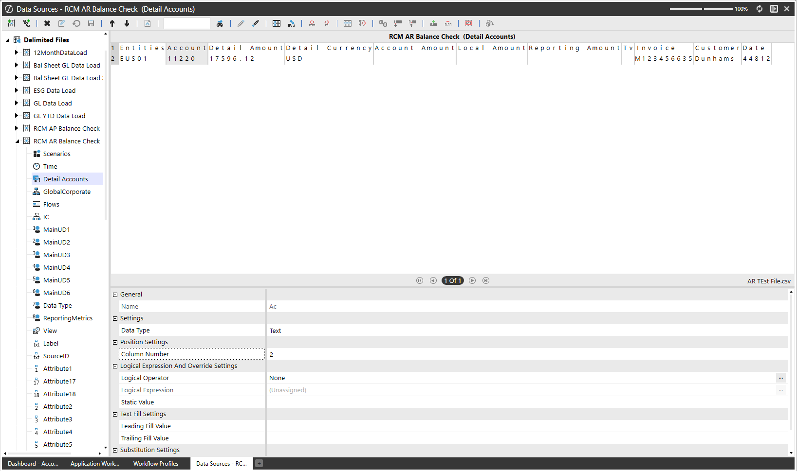

## Account Reconciliations

This logic will set a global unexplained limit based on currency by retrieving the closing FX rate for

the individual reconciliation’s currency relative to USD.

|UnexplainedBalance| < XFBR

(MyCustomBusinessRule,UnexplainedLimitHelper,Currency=|Currency|,Time=|Wtk|)

Substitution Variable Selector: A list of Substitution Variables used in Prepare Rule as an input

to an expression. Select one of these Substitution Variables and click the blue field next to it. Type

Ctrl-C and it will copy that text to the Windows clipboard for convenient pasting later. The options

are either variables from Account Reconciliations or fields in the Stage tables. For example, |Ac| is

the Account field from Stage while |AcT| is the post translated Account from that same table.

Preparer Workday Due: Enter + or - and a 1–2 digit number for the days. For example, if you

enter -10 and the close date is 1/31/22, then the preparer due is 1/21/22.

Approver Workday Due: Indicates the due date for the final approver. Enter + or - and a 1–2 digit

number for the days. For example, if you enter +2 and the close date is 1/31/22, then the approver

due date is 2/2/22.

IMPORTANT: The Approver date cannot be before Preparer date.

Frequency: Determines how often the completion of this Reconciliation Definition is required. The

default is 1–12, which indicates months 1–12. This can be 3, 6, 9, 12 if required quarterly, or you

can enter another type of frequency expression.

NOTE: If the Frequency is changed on the Reconciliation Definition, some

reconciliations may be Prepared or still In Process. This would normally stop the user

from preparing them due to this new Frequency. In these cases, the reconciliations will

be marked with a Status of Frequency Changed, which will not prevent the preparer from

preparing. This status is ignored in all status counts except for the Scorecard

Preparation Status chart.

## Account Reconciliations

Template (XLSX): The Reconciliation Definition sets the default Excel Reconciliation Template

for any related Reconciliation Inventory Items, but a single Reconciliation Inventory Item can

override this template assignment with this field.

WF Profile: This is the Workflow Profile that was discovered for this Source Account and is a

Base Input Child Import Workflow Profile.

Recon Scenario: This will default to the Recon Scenario set in Global Options.

T.Account: Target Account in the Cube and this comes from the Reconciliation Definition.

S.Account: Source Account. This comes from the related Stage area from the Source Scenario.

The Source Accounts are derived from that Workflow Profile's Transformation Rules and are

based on the Target Account in the Reconciliation Definition.

S.Account Desc.: Source Account Description. This is based on the option selected in the

Source Account Description Dimension field in Settings > Global Setup > Global Options.

T.Entity: Target Entity in the Cube. There will be an entry here for each Entity that has relevant

data in the Stage in any time period in the application from the Source Scenario.

S.Entity: Source Entity from the Stage.

Currency (Single Currency Solutions): Currency is the Target Entity currency per the Entity

dimension.

Local Currency (Multi-currency Solutions): Currency type for the Local level balance. This is the

same as the Currency column in Single Currency Solutions. It is not editable within Account

Reconciliations as it is maintained within the Entity dimension.

Reporting Currency (Multi-currency Solutions): Currency type for the Reporting level balance.

This is not editable as it is derived from the Cube currency. Only a single Reporting currency is

allowed per Cube.

## Account Reconciliations

Discovery Time: The date and time when an account group was created or when a

### Reconciliation Inventory Item was first discovered.

NOTE: The filter on this column can be used to find newly discovered Reconciliation

Inventory Items by, for instance, setting the filter properties to be Is Greater Than and a

date that is before Discovery is done for a given month, such as the first day.

### Expression Rule Syntax

The fields for Prepare Rule and AutoRec Rule use the same expression syntax. OneStream uses

an ADO.NET data table calculated column to interpret expressions, so there is no OneStream

parser logic involved. Choices from the Substitution Variable Selectors can be used to make

these more dynamic. The expression evaluator supports the following operators and more:

l And, Not, In, Between, Like, Null, Or, Trim

l Open bracket ‘(‘ and close bracket ‘)’

l <, >, <=, >=, <>, =

l + (addition)

l - (subtraction)

l * (multiplication)

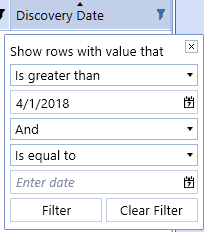

## Account Reconciliations

l / (division)

l % (modulus)

l Conditional ‘if’

l Substring

### Example:

|BalanceChange| > 1000 And |BalanceLocal| = 0

XFBR String Business Rules can also be used to determine the expression to be placed here at

run time. For XFBR String rule syntax, refer to the Dashboard XFBRString section of the Design

and Reference Guide.

## Account Groups

Groups of Source Accounts can be reconciled collectively instead of individually. Each Account

Group becomes a single reconciliation for the aggregate of the Source Accounts. Local Admins

can only save new Account Groups if they assign an Access Group that they manage.

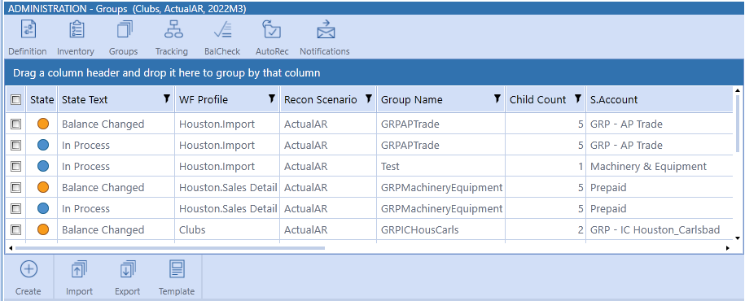

## Account Reconciliations

### Single Currency Solutions

Account Groups should be created in a single currency because, by an Account Group’s nature,

the untranslated source data will be aggregated together for analysis. For example, if someone

reconciles all the Fixed Asset accounts for USD, create an Account Group for each local currency

to be reconciled and then add accounts to each of these from the Reconciliation Inventory.

### Multi-currency Solutions

Account Groups may be created using any currencies included in the Application Properties and

maintained in the FX Rates grid. The Account Group will be a single reconciliation for the

translated aggregate of the Source Account, Local, and Reporting currencies. For example, if a

company reconciles all intercompany accounts at a consolidated level and the Local currencies

are different, a Multi-currency Account Group may be created to reconcile the related accounts in

a single, consolidated currency.

First, each currency level is translated to the Account Group currency and then aggregated. When

creating a new Multi-currency Account Group, both Account and Local currency must be selected

for the group, as well as the MC Enabled option. After the Account and Local currencies are

selected, Multi-currency Account Groups are reconciled the same as Single Currency, in that

detail items are used to support the aggregate balance of all child reconciliations.

See Multi-currency Account Groups.

When a reconciliation is added to an Account Group, it can no longer be prepared individually and

can only be prepared at the group level. Therefore, the Prepare button is not visible for

reconciliations that are part of an Account Group.

### Child Reconciliations

Select one or more Account Groups to view the child reconciliations assigned to the groups.

## Account Reconciliations

After a Reconciliation Inventory item is assigned to an Account Group, it becomes a child

reconciliation of the group. After adding the child to an Account Group, most of the child's

attributes take on the values assigned for the Account Group. Additionally, if attributes are

changed for an Account Group, the child reconciliations' attributes within the group will be

updated to be in line with the Account Group attributes upon Save. This is helpful because

detailed configuration of individual items is not necessary.

For example, if you change the Risk Level for an Account Group from Low to High, the risk level of

the child reconciliations changes from Low to High.

Only these attributes are changed at the child reconciliation level:

l Account Currency

l BalCheck WF Profile

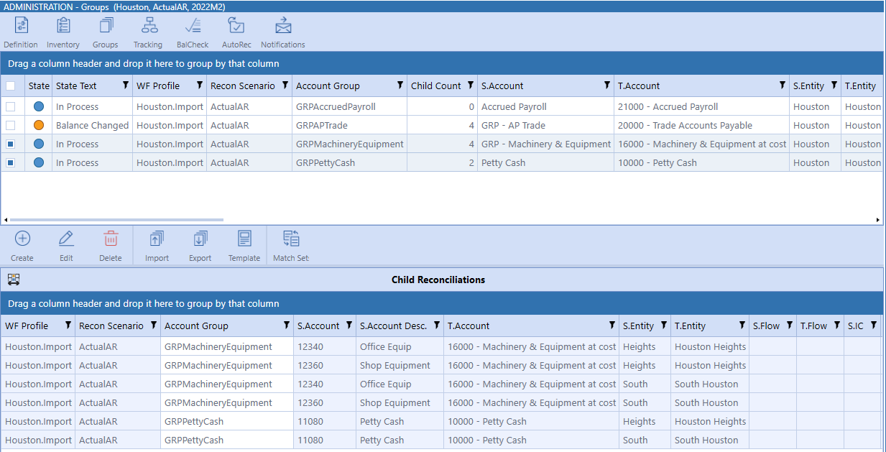

## Account Reconciliations

NOTE: When you select (Tracking Level) for the BalCheck Level of an account group,

the BalCheck WF Profile selection of the account group is ignored and will be used from

the child reconciliation.

NOTE: The Administrator can change the account group from Multi-currency to single

currency only if the child reconciliations of the group all use the same local currency.

These attributes, set at the group level, do not flow through to the child reconciliations:

l T Account

l S Account

l T Entity

l S Entity

l WF Profile

l Local Currency

l Account Currency

l BalCheck WF

## Account Reconciliations

State and State Text: Indicates state of Account Group.

WF Profile: Workflow Profile where this Account Group will be shown for reconciling. This can be

either a Review level or Base Input Import-level Workflow Profile.

Recon Scenario: Defaults to the Recon Scenario set in Global Options.

Group Name: Account Group name set up by the Reconciliations Global Admin.

Child Count: Number of reconciliations assigned to the group.

T.Account: Target Account in the Cube. Choose this from the list. This will help filter results and

guide the drill down process.

S.Account : Source Account. Indicate something that will notify the user as to what type of

Account Group this will be.

T.Entity: Target Entity in the Cube. Specify an Entity, however the Entities to which this Account

Group are applied are more related to the Source Accounts from the Reconciliation Inventory.

Depending on the Reconciliation Inventory items added to this Account Group, there could be

many target entities. This will help filter results and guide the drill down process

S.Entity: Source Entity. Indicate something that will notify the user as to what type of entity this

will be. The entities seen when preparing reconciliations are those related to the Workflow Profile.

Currency (Single Currency Solutions): Untranslated source Local currency data is aggregated in

the Account Group, requiring it to be one currency. If needed, create a similar Account Group for

each currency to be reconciled.

Account Currency (Multi-currency Solutions): Currency type for the Account level balance.

Account balances for each Source Account within an Account Group will be translated to the

Group's Account currency and then aggregated to the total Reconciliation Balance.

## Account Reconciliations

Local Currency (Multi-currency Solutions): Currency type for the Local level balance. Local

balances for each Source Account within an Account Group will be translated to the Group's Local

currency and then aggregated to the total Reconciliation Balance.

Reporting Currency (Multi-currency Solutions): Currency type for the Reporting level balance.

This is not editable as it is derived from the Cube currency. Only a single Reporting currency is

allowed per Cube.

Other attributes: See Reconciliation Inventory Item Attributes. The attributes set at the Account

Group level override what is set for the included Source Accounts. These attributes set at the

group level do not flow through to the child reconciliations:

l T Account

l S Account

l T Entity

l S Entity

l WF Profile

l Local Currency

l Account Currency

l BalCheck WF

NOTE: Changing an Account Group composition will change its status. If an Account is

moved out of an Account Group, the Account Group’s status is copied to the individual

reconciliation.

## Account Reconciliations

Assign Account Groups to a Review-level Workflow Profile when a group of Accounts is being

reconciled across many entities by several people. That Review Workflow Profile should be high

enough in the Workflow Profile structure to encompass the required entities. The entities are

included in Base Input Workflow Profiles and are dependents of this Review-level Workflow

Profile.

### Account Group Actions

For descriptions of the fields in the create, edit, and clone dialog boxes described below, see

## Reconciliation Inventory Item Attributes.

You can perform the following actions on Account Groups:

Create: Create a new Account Group. Keep in mind:

l Group Name must be unique and cannot include special characters (including spaces).

l Local Admins can only see the Access Groups that they are members of.

## Account Reconciliations

Clone: Clone the attributes of the selected Account Group to create a new group. Keep in mind:

l Group Name must be unique and cannot include special characters (including spaces).

l To assign an Access Group to an Account Group, you must be Local Admin of the selected

Access Group.

Edit: Edit the attributes of the selected Account Group. Keep in mind:

l The Local Currency of a single currency Account Group must match the currency of the

child reconciliations.

l The Local Admin can only edit account groups if they are within part of the Access Group

assigned to the Account Group.

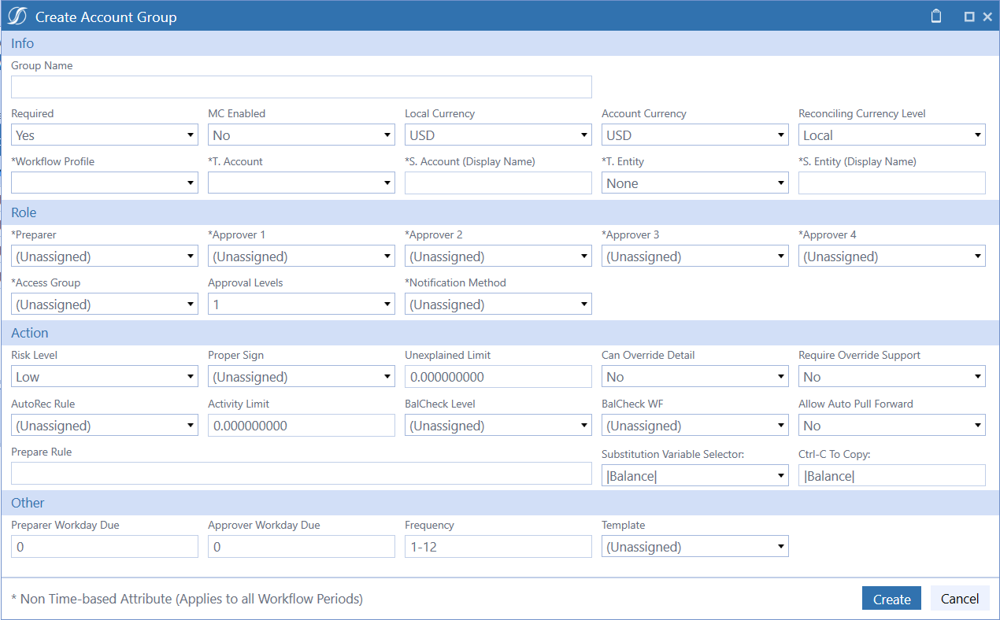

## Account Reconciliations

l To assign an Access Group to an Account Group, you must be a Local Admin, RCM Admin,

or a OneStream Admin. Local Admins can only assign the access groups that they are a

part of.

l T. Account, S. Account, T. Entity, and S. Entity are assigned at the group level and are not

time based. The child reconciliations do not take on these attributes.

l No changes are saved if errors are found.

IMPORTANT: When you edit Account Group attributes, you must select the check box

above the attribute for the change to be applied when you click Save . The Save button

only displays after a check box is selected.

Delete: Select one or more Account Groups to delete. Keep in mind:

l Local Admins can delete Account Groups that they are assigned to. RCM and OneStream

Admins can delete any Account Group.

l Only Account Groups that have not been prepared in any period (current or prior) can be

deleted.

l All child reconciliations must be removed from an Account Group before it can be deleted.

Import: Select an Excel .xlsx file to import that contains Account Groups to merge changes or add

new records. You must close this file before importing it. This button is not accessible to Local

Admins.

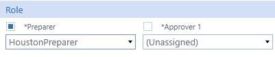

## Account Reconciliations

Export: Exports all Account Groups as a CSV file that is opened in Excel and used to edit or

update group information. To import these updates, the user must add a Named Range starting

with the letters xft covering appropriate rows starting with the cell with the word Application in the

top left cell. This file should then be saved in Excel .xlsx format. See Templates for more

information. This button is not accessible to Local Admins.

Template: Opens a pre-filled Excel Template to load Account Groups. Note that some field

entries (such as WF Profile and Recon Scenario) must start with “!” because the import process

replaces those text values with a long numeric key. The How To tab contains further instructions

on using the template. This button is not accessible to Local Admins.

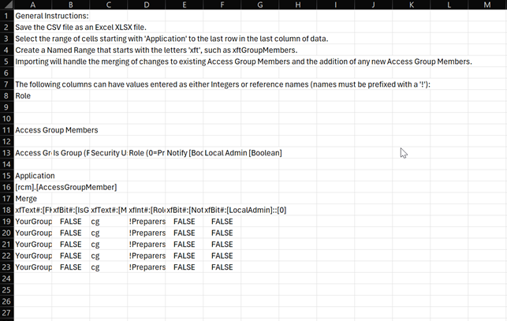

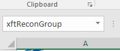

## Account Reconciliations

Access: Edit the access group for the selected Account Group.

Match Set: Manage the assigned match sets for the selected account group.

## Tracking

This determines the granularity of reconciliations. The default entry is (Entity) which means each

reconciliation will be done by entity and then account. There may be instances where dimensions

need to be added to this combination. For example, an account such as Property, Plant and

Equipment needs to be reconciled by Entity and Account, but also by the Flow dimension. The

more dimensions you include will result in more reconciliations. Adding entries here allows for

assignment later in the Reconciliation Definition screen. This page cannot by accessed by Local

Admins.

IMPORTANT:  If you plan to assign Tracking Levels to Reconciliation Definitions, do so

before clicking the Discover button for the first time. After you run Discover, the records

are added to the Inventory and cannot be removed.

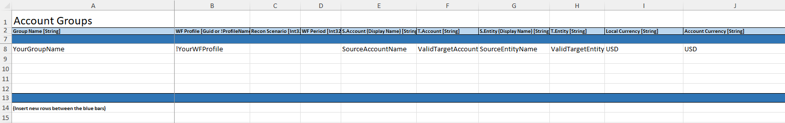

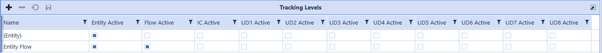

## Account Reconciliations

## BalCheck

This determines the reconciliation’s balance check granularity. Balance check levels can be

created for any single dimension or combination of dimensions. This allows balances being pulled

from a single source file to be split to the corresponding reconciliations at the same granularity of

detail as provided within Tracking Levels or BalCheck Levels, whichever is more granular. These

levels are used to populate the BalCheck Level within the Inventory. Any dimensions included that

are not part of the Tracking Level will be used to sum the Balance Check items. This page is not

accessible by Local Admins.

There are several types of Balance Checks that are pre-populated within the solution:

l All Entities & Accounts: As long as the Transformation Rules assigned pass their test,

then there is included functionality to pull that Balance Check figure into the Reconciliation

as an Explanation.

l S.Account: Works by filtering the Balance Check items loaded to the Stage to just the

values that match the Source Account of the selected Reconciliation that is referencing the

Balance Check workflow stage data.

l S.Entity: Works by filtering the Balance Check items loaded to the Stage to just the values

that match the Source Entity of the selected Reconciliation that is referencing the Balance

Check workflow stage data.

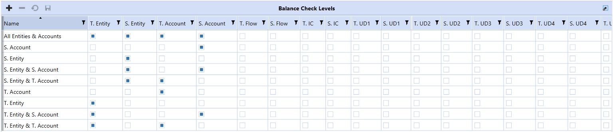

## Account Reconciliations

l S.Entity & S.Account: Works by filtering the Balance Check items loaded to the Stage to

just the values that match the combination of Source Entity and Source Account of the

selected Reconciliation that is referencing the Balance Check workflow stage data.

l S.Entity & T.Account: Works by filtering the Balance Check items loaded to the Stage to

just the values that match the combination of Source Entity and Target Account of the

selected Reconciliation that is referencing the Balance Check workflow stage data.

l T.Account: Works by filtering the Balance Check items loaded to the Stage to just the

values that match the Target Account of the selected Reconciliation that is referencing the

Balance Check workflow stage data.

l T.Entity: Works by filtering the Balance Check items loaded to the Stage to just the values

that match the Target Entity of the selected Reconciliation that is referencing the Balance

Check workflow stage data.

l T.Entity & S.Account: Works by filtering the Balance Check items loaded to the Stage to

just the values that match the combination of Target Entity and Source Account of the

selected Reconciliation that is referencing the Balance Check workflow stage data.

l T.Entity & T.Account: Works by filtering the Balance Check items loaded to the Stage to

just the values that match the combination of Target Entity and Target Account of the

selected Reconciliation that is referencing the Balance Check workflow stage data.

## Account Reconciliations

## AutoRec

AutoRec rules can be created and maintained by Reconciliation Global Admins and OneStream

Admins. If an option is selected, that qualifier will allow for a reconciliation to automatically be

reconciled. When creating new rules, selecting multiple item type criteria within one rule will

permit any of the selected items to enable a reconciliation to automatically reconcile. If Zero

Balance and Activity are both selected, both criteria must be satisfied to automatically reconcile.

This page is also used to create an Expression and name the Expression on the AutoRec page.

Changing the Expression on this page updates the rule throughout the Reconciliation Inventory if

it is applied to multiple reconciliations. This page is not accessible by Local Admins.

To use AutoRec rules, at least one of the following criteria must be met:

l Zero Balance check box is selected.

l Activity check box is selected.

l Expression is included in the text box.

IMPORTANT: If an AutoRec rule is used to Prepare or Fully Approve a reconciliation, it

cannot be modified or deleted.

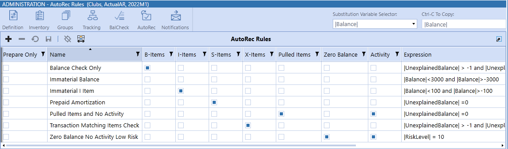

## Account Reconciliations

l Prepare Only: If selected, the reconciliation is auto reconciled to the Prepared status (Auto

Prepared). The reconciliation still requires approval. If not selected, the reconciliation is

auto reconciled to the Fully Approved status (Auto Fully Approved). The reconciliation will

not require any approvals.

l B-Items: (Balance Items) Balance Check items allow a reconciliation to auto reconcile if

they agree to the reconciling currency balance. For Balance Check reconciliations, if only

Balance Items should be allowed for AutoRec, only this option should be selected, and the

rule created should be applied to reconciliations that have a BalCheck Level.

l I-Items: Individually created items created in the current period will allow for AutoRec if the

aggregate of the items agrees to the reconciling currency balance.

l S-Items: Multi-period templates that support and agree to the reconciling currency balance

allow a reconciliation to automatically reconcile. The booked period for the S-Item must be

prior to the current period. If S-Items are created in the current period, auto reconciliation is

prohibited.

l X-Items: Items created from Transaction Matching transactions allow a reconciliation to

auto reconcile. (X-Items are used with integrated solutions only.)

l Pulled Items: Detail items pulled from the prior period will allow AutoRec. This logic will

apply to all Detail T-Items and I-Items. If Allow Auto Pull Forward is set to Yes, Pulled Items

must be selected for the AutoRec Rule to run successfully. See Reconciliation Inventory.

l Zero Balance: Will auto reconcile all reconciliations with a zero balance (for the reconciling

currency, if Multi-currency is enabled).

l Activity: Will auto reconcile if reconciliation activity for the reconciling currency has not

changed or if the activity for the reconciliation is within the Activity Limit threshold

established in the Reconciliation Inventory.

## Account Reconciliations

l Expression: This is a text box that allows for user defined text. Rule logic can include any

item from the Substitution Variable Selector above the property grid.

### Example:

|BalanceAccount| < 1000 and |RiskLevel| = ‘Low’

To clarify, if an item type is selected, a reconciliation can automatically reconcile if that item type

exists. If the item type is not selected and it exists within the reconciliation, the reconciliation will

not automatically reconcile. If a qualifier (Zero Balance, Activity, or Expression) is selected, all of

the selected criteria must be met in order to automatically reconcile. For example, if Zero Balance

is selected and an Expression exists, the reconciliation must have a balance of zero and meet the

Expression criteria.

IMPORTANT: AutoRec rules cannot be run for Account Groups until FX rates have

been entered for the period. This is because the source currencies need to translate to

the Account Group currencies before reconciliation, and thereby automatic

reconciliations can take place.

### Auto-prepared and Auto-approved Reconciliation States

These diagrams show how auto-prepared and auto-approved reconciliations move between

states.

### Auto-prepared reconciliations follow this flow:

## Account Reconciliations

Fully approved auto reconciliations follow this flow:

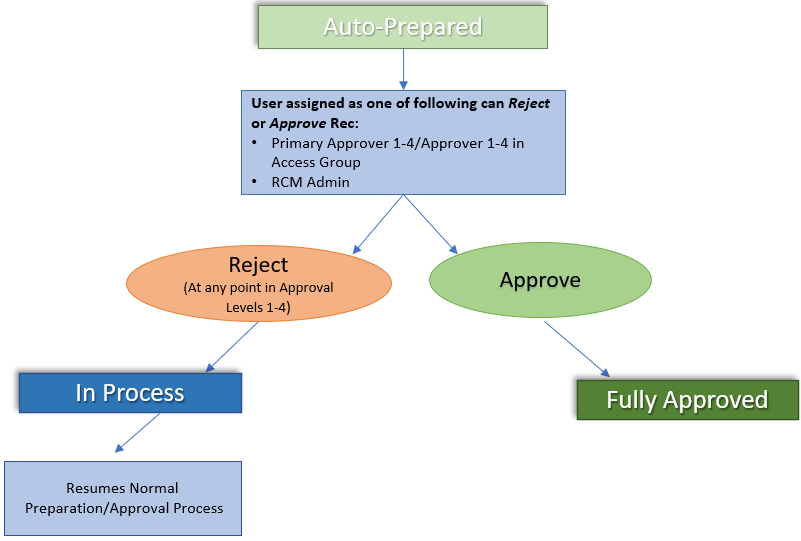

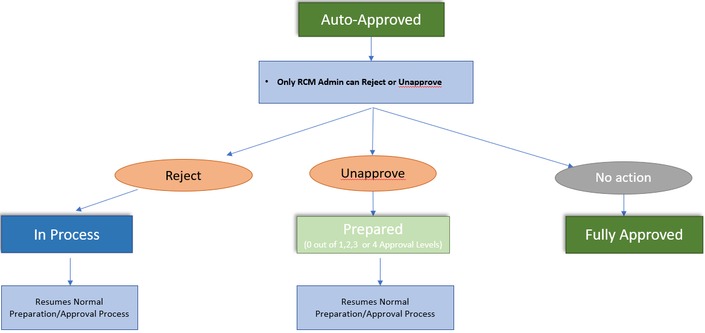

## Account Reconciliations

## Dynamic Attribute Mapping

Dynamic Attribute Mapping (DAM) automates the maintenance of reconciliation attributes. For

example, you can assign risk levels based on balances, frequency, or other conditions, and group

reconciliations according to specific criteria. Rules can be executed on demand or scheduled to

run automatically, streamlining the reconciliation process for greater efficiency.

The Dynamic Attribute Mapping Rules page is where Administrators and Solution Administrators

can create, edit, copy, delete, and run Dynamic Attribute Mapping Rules.

If no rules or multiple rules are selected, the right pane displays "Select a Rule". If there are no

existing rules, the grid displays "Create a Rule".

This interface presents a grid view, not a SQL table editor. To update rule details you must use the

form, right of the grid.  Columns include:

l Multiselect checkboxes: When a single rule is selected, you can edit, copy, delete, or run

rules. When multiple rules are selected, the you can delete or run rules.

l Order: Enter the order to run  the active rules. It must be a whole number 0 or greater.

Default is 0.

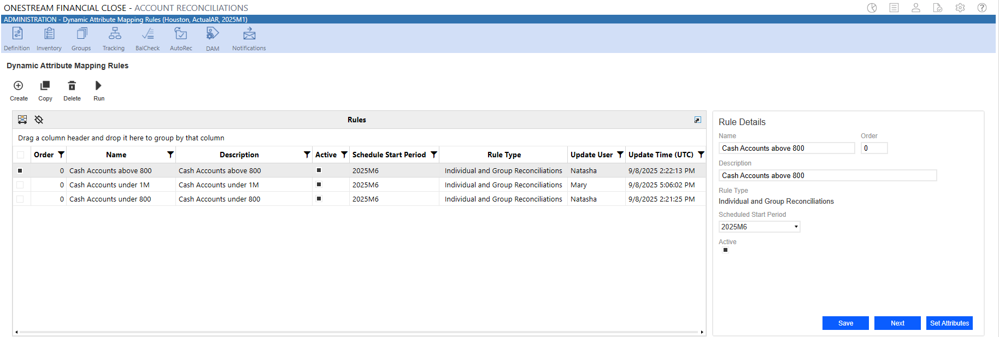

## Account Reconciliations

l Name: This field is required. Enter a unique rule name. The character limit is 100.

l Description: This field is optional. The character limit is 500.

l Active: Upon rule creation the status defaults to active.

l Scheduled Start Period: Select the start period from the drop-down menu. Default is

current period.

l Rule Type: This field is required. Select the Rule Type from the drop-down menu. Options

include Individual Reconciliations Only, Group Reconciliations Only, Individual and Group

Reconciliations.

l Update User: Record of last user to edit rule.

l Update Time (UTD): Time stamp of rule update.

NOTE: The Dynamic Attribute Mapping Rules breadcrumb directs the Administrators

and Solution Administrators to the main rules page.

### Create a Rule

1. On the Administration page, click the DAM button.

2. On the Dynamic Attribute Mapping Rules page, click the Create button.

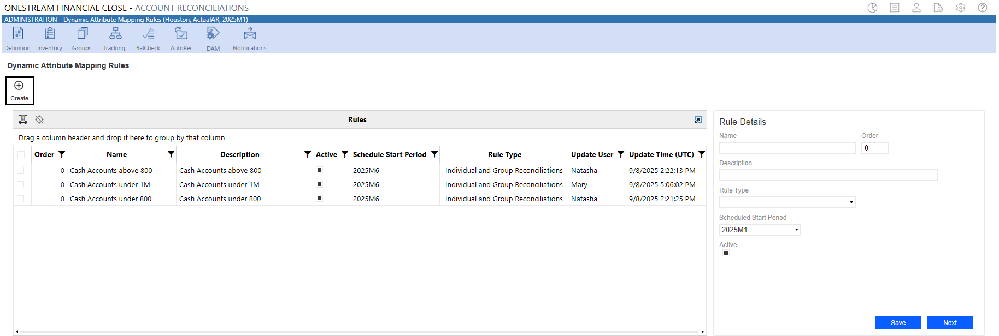

## Account Reconciliations

3. In the Rule Details dialog pane, enter a name. This field is required.

4. In the Order field, type the order to run the rule.

5. Enter a description. This field is optional.

6. From the  Rule Type drop-down menu, select a rule type.

7. From the  Scheduled Start Period drop-down menu, select a start period. Default is the

current period.

8. Click one of the following buttons:

l Save to save the rule.

l Next to save and go to Filter Criteria.

NOTE: If the rule should not be run, clear the Active checkbox.

### Edit a Rule

1. On the Administration page, click the DAM button.

2. On the Dynamic Attribute Mapping Rules page, select the checkbox next to the rule  to

edit.

3. In the Rule Details dialog box, edit the available fields.

## Account Reconciliations

4. Click one of the following buttons:

l Save to save the rule.

l Next to save the rule and go to Filter Criteria.

l Set Attributes to save the rule and go to the Set Attributes page.

### Delete a Rule

1. On the Administration page, click the DAM button.

2. On the Dynamic Attribute Mapping Rules page, select the checkbox next to each  rule to

delete.

3. Click the Delete button.

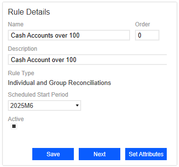

## Account Reconciliations

4. In the Delete Rules message box, click the Delete button .

### Copy a Rule

1. On the Administration page, click the DAM button.

2. On the Dynamic Attribute Mapping Rules page, select the checkbox next to the rule to

copy.

3. Click the Copy button.

The newly created rule will have _Copy appended to the end of its name. If the same rule is

copied again, the new rule will have _Copy_Copy appended to its name.

### Run a Rule

Set attributes are updated on the selected rules when Run is executed. Active rules are executed

in the order specified in the rules list and follow the scheduled start period. If multiple  rules share

the same order number, the system will  execute them in alphabetical order.

To run a rule and view Task Activity, follow these steps:

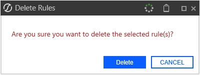

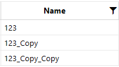

## Account Reconciliations

1. Select the checkbox next to each rule to run.

2. Click the Run button.

3. In the message box, click the OK button.

4. Click the Task Activity button and view the log.

### Run Execution

When the run process is executed on a list of rules and encounters a validation failure, the

reconciliation attributes revert to their original values.

IMPORTANT: When multiple rules update the same field,  the last rule  modifies the

attribute.

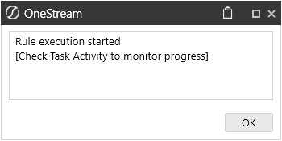

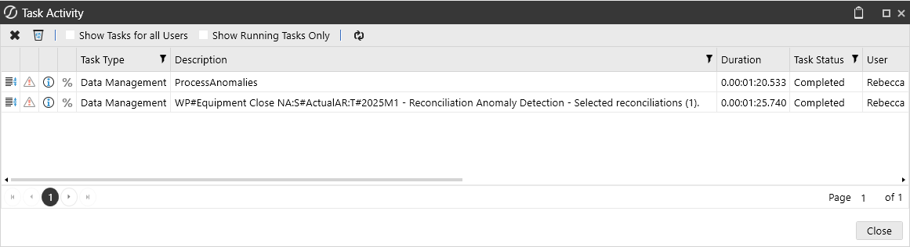

## Account Reconciliations

### Run Actions

During the execution of run, certain actions are blocked. Additionally, the same actions restricted

during process are blocked during the execution of run. If any of the restricted actions are

performed ruing the execution of run, an error message displays.

Items Blocked by Process, Mass Actions, and Create Detail Items (TXM Integration):

l Open Match Detail Items Dialog in RCM (TXM Integration)

l Create Detail Items in RCM (TXM Integration)

l Data Management Jobs for MassActions/Process

l Pull Prior Items

l Copy Prior Items

l Complete Workflow

l Revert Workflow

l Upload a T-Doc

l Upload a S-Doc

l Run Process

l Add Detail Items (Reconciliation and Group Reconciliation)

l Remove Detail Items (Reconciliation and Group Reconciliation)

l Prepare a Reconciliation(with Certification on and off)

l Approve a Reconciliation (with Certification on and off)

l Recall a Reconciliation

l Reject a Reconciliation

## Account Reconciliations

l Unapprove a Reconciliation

l Prepare a Reconciliation  Mass Action (with Certification on and off)

l Approve a Reconciliation  Mass Action (with Certification on and off)

l Recall a Reconciliation Mass Action

l Reject a Reconciliation  Mass Action

l Unapprove a Reconciliation  Mass Action

l Pull B-Check

NOTE: When a TXM CreateDetailItems Data Management Job is running, updates to

Recon Balances are blocked regardless of Workflow Profile.

Items Blocked by Process, and Mass Actions:

l Attaching a Support Doc (R and I)

l Deleting a Support Doc (R and I)

l Copying Prior Support Doc

l Overwriting a Support Doc (R and I)

See Rule Processing.

### Expression Filter Editor

The  Filter Editor is a Platform component that enables you to build frameworks for diverse

outputs.