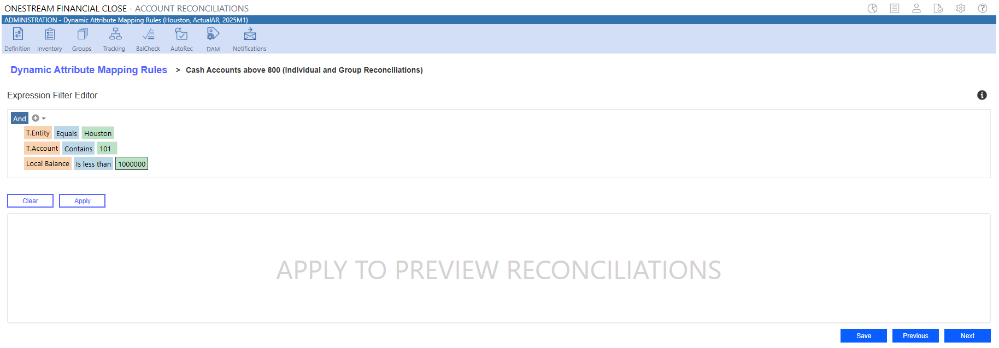
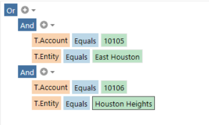
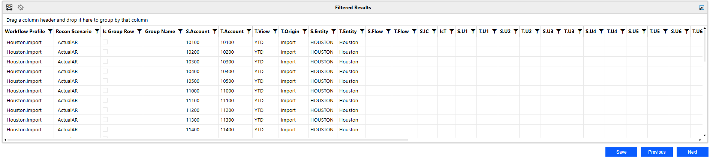

# Notifications

## Account Reconciliations

NOTE: For guidance on the Filter Editor,  click the Information button
.

### Pick List

The  Filter Editor provides a pick list for quickly selecting attributes. An existing attribute value

needs to be associated with the reconciliation to display in the pick list. The pick list in a

subsequent filter line item is narrowed based on the reconciliations filtered in the preceding line

items.

If a value has been deleted, the error “Value no longer exists” will display. For example, if a WF

Profile was deleted and it was part of your filter criteria previously, you will receive this error.

### AND/OR Functionality

When using the Expression Filter Editor, the AND/OR function is applied to the filters.

## Account Reconciliations

### Build a Filter

1. To begin an expression, select either And or Or.

2. To add a condition or a group, click the plus button.

3. To set filter criteria, select the drop-down menus.

l Orange field: Populated from the Recon, Recon Balance, and Recon Time Attribute

tables

l Blue field: List of operators

l Green field: Values

4. Click Save or  the Next button to save the filter criteria and go to the Set Reconciliation

Attributes page.

To preview the filtered results, click the Apply button. The filter will not save when you click the

Apply button. To delete data entered in the Filter Editor, click the Clear button.

NOTE: If an existing value is not linked to your reconciliation, it will not display in the

drop-down menu. You can manually enter the value in the field.

See Dashboard Component Filter Editor.

## Account Reconciliations

### Filtered Results

After the filter criteria are applied, a list of reconciliations that meet the criteria displays.

NOTE: The Previous button does not save filter criteria. To save filter criteria, you must

click the Next or Save button.

### Reconciliation Attributes

The Set Reconciliation Attributes page enables you to define rule attributes and dynamically make

updates based on the Rule Type selected.

