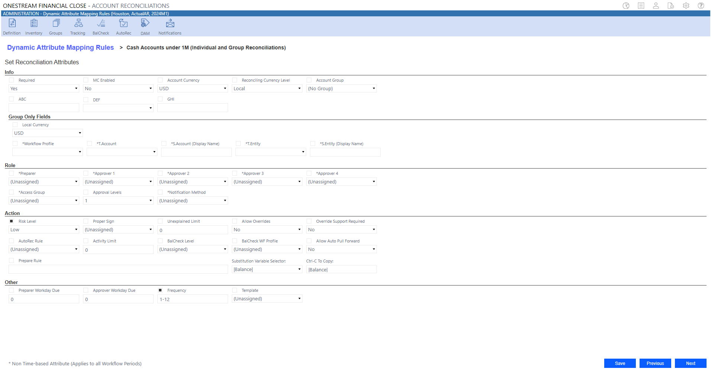
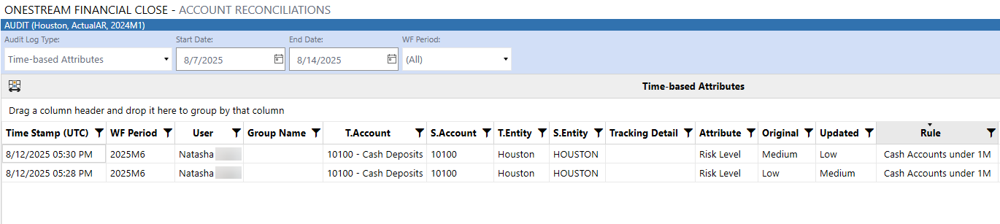
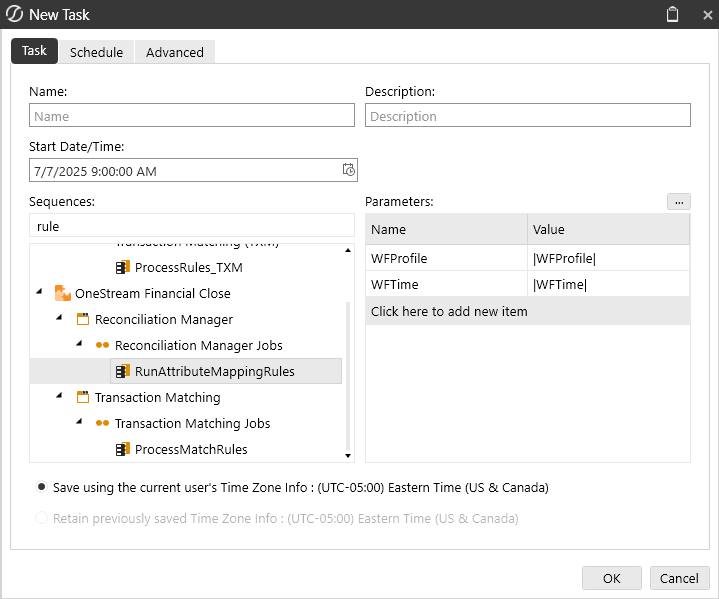
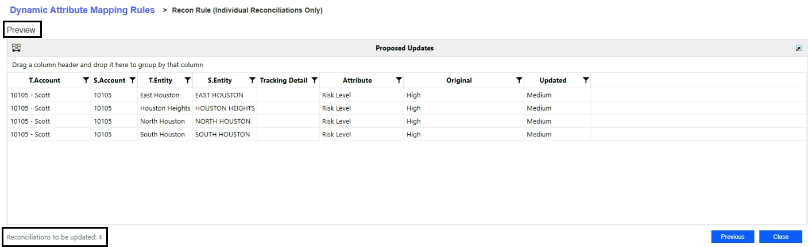
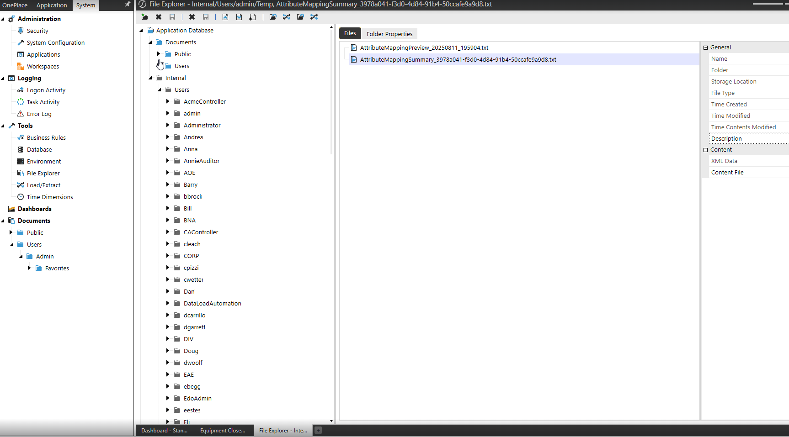
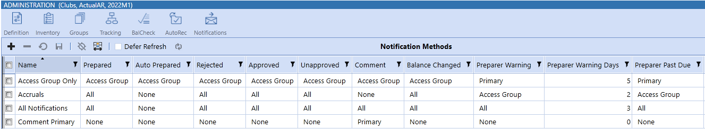

# Security

## Account Reconciliations

IMPORTANT: The Group Only Fields section will not display when setting attributes for

an Individual Reconciliation.

### Audit Log

The Audit Log captures attribute updates to reconciliations. To identify the rule responsible for an

attribute update during reconciliation, see the Rule column. The Rule column is applicable to the

following audit log types:

l Time-based Attributes

l Security Roles (Non-time based)

l Account Groups (Non-time based)

The User column displays the last known user who executed the rule. Additionally, when multiple

rules are executed in a specific order and similar fields are updated, the last rule indicates the final

update. The Audit Log also notes original and updated values in their respective columns.

## Account Reconciliations

NOTE: When active rules are executed through a scheduled task, the User column will

display System.

### Task Scheduler

Administrators and Solution Administrators can set the RunAttributeMappingRules sequence as a

task in Task Scheduler. The Task Scheduler captures active rules and the scheduled start period.

## Account Reconciliations

The following parameters are required for RunAttributeMappingRules:

l WFProfile

l WFTime

When the scheduled run task is executed, the task displays under Task Activity. Task Activity will

also display the number of updated reconciliations (if applicable). See Task Scheduler Details.

### Preview Reconciliations

After setting the filter criteria and reconciliation attributes, you can preview active and inactive

rules and the potential impacts of attribute updates to the corresponding reconciliations while

creating rules in the Proposed Updates grid.

If previewing an inactive rule, the following message displays:

The Proposed Updates grid displays a list of reconciliations that have passed validation and are

eligible for updates. It includes the following columns:

## Account Reconciliations

l T.Account

l S.Account

l T.Entity

l S.Entity

l Tracking Detail

l Attribute

l Original

l Updated

The Proposed Updates grid also highlights the number of reconciliations to be updated.

NOTE: If the Scheduled Start Date is set for a future period, no results will display in

Preview, and a preview file will not be generated.

### Validations

Administrators and Solution Administrators can access the Temp folder to review summary files,

view how many reconciliations were updated, or understand why reconciliations were not updated

(view applicable validations). Summary files can be created for Preview and for when rules are

Run.

## Account Reconciliations

### To view the summary file:

1. Click the System tab.

2. Under Tools, select File Explorer.

3. Go to Application Database >  Internal > Users to view the list of users.

4. Select your username.

5. Click Temp Folder.

## Account Reconciliations

List of Current Validations when Assigning Attributes

Existing validations are executed in the background upon Preview and only display the list of

reconciliations eligible for updates.

### Reconciliation and Group Reconciliation

l Unexplained Limit

o Valid Decimal Value

l AutoRec Limit

o Valid Decimal Value

l Preparer Workday Due

o Valid numeric value

o Less than or equal to Approver Workday Due

l Approver Workday Due

o Valid numeric value

l Custom Attributes

o Less than 50 characters

l Time Based Attributes

o Cannot update if Reconciliation is prepared

l Primary Roles

o No user assigned to multiple roles

l Access Group

o User must be a OneStream Administrator, Reconciliation Global Admin, or the Local

Admin of the Access Group being assigned to the Account Group

## Account Reconciliations

### Reconciliation Only

l Account Group

o Account Group is Prepared

n Account Group has been prepared for the current time period

o MC Enabled and CanOverrideDetail

n Cannot add reconciliation to the group because it enables overrides and the

FX rate does not exist for Local Currency: {childCurrency} -> {groupCurrency}.

For example, USD to CAD.

n Cannot add reconciliation to the group because it enables overrides and the

FX rate does not exist for Account Currency: {childAcctCurrency} ->

{groupAcctCurrency}. For example, USD to CAD.

o Not MCEnabled and Local Currency does not match

n Account Group Local Currency does not match

o Has T or S Items

n Reconciliations with T or S items cannot be added to a Group

o Warning

n Attributes are overridden with the selected Account Group attributes

o Rec being removed from a group and Has T or S Items

n Reconciliations with T or S items cannot be removed from a Group

## Account Reconciliations

l Reconciliation assigned to Group

o "Preparer", "Approver1", "Approver2", "Approver3", "Approver4",

"FKAccessGroupName", "FKNotificationMethodID"

n Must update attributes at Account Group level. Cannot update attributes of a

child reconciliation except, Account Group, BalCheck WF Profile, and Account

### Currency

o "Required", "MCEnabled", "ReconcilingCurrencyLevel", "ApprovalLevels",

"RiskLevel", "ProperSign", "UnexplainedLimit", "CanOverrideDetail",

"RequireSupportForOverride", "AllowAutoPullForward", "FkAutoRecRuleID",

"AutoRecLimit", "FkBalanceCheckLevelID", "PrepareRule", "PreparerWorkdayDue",

"ApproverWorkdayDue", "Frequency", "FKTemplateID", "CustomAttributes"

n Must update attributes at Account Group level. Cannot update attributes of a

child reconciliation except Account Group, BalCheck WF Profile, and Account

### Currency

o Account Currency and McEnabled and CanOverrideDetail and No FX Rate exist for

currencies

n Cannot update Account Currency because the group enables overrides and

the FX rate does not exist for: {childAcctCurrency} -> {groupAcctCurrency}. For

example, USD to CAD.

o Warnings

n BalCheckLevel = (Tracking Level) the BalCheck WF Profile = Unassigned

n "The BalCheck WF Profile must be assigned when the BalCheck Level is

set to (Tracking Level)

n BalCheck WF Profile Not Unassigned and BalCheckLevel <> (Tracking Level)

## Account Reconciliations

n The BalCheck WF Profile is ignored and the BalCheck WF Profile is

used from the Account Group

### Group Reconciliation Only

l Workflow Profile

o Not empty

l T.Account

o Not empty

l T.Entity

o Not empty

l MC Enabled

o All child reconciliations must have same Local Currency

l Local Currency

o Local Currency can only be updated if the Account Group is Multi-Currency Enabled

or no child reconciliations have been assigned to the Account Group

l Warnings

o BalCheck Level = Tracking Level

n The BalCheck WF Profile is ignored when the BalCheck Level is set to

(Tracking Level) and the BalCheck WF Profile of the child reconciliation is used

o BalCheck WF Profile NOT Unassigned

n The BalCheck WF Profile is ignored when the BalCheck Level is set to

(Tracking Level) and the BalCheck WF Profile of the child reconciliation is used

o BalCheck WF Profile = Unassigned and BalCheck Level NOT Tracking Level

## Account Reconciliations

n The BalCheck WF Profile must be assigned when the BalCheck Level is not

set to (Tracking Level).

## Notifications

You can send email notifications to users when a reconciliation:

l Changes state such as when it gets prepared, rejected, or approved.

l Is approaching its Preparer or Approver due date.

l Is past its Preparer or Approver due date.

To set up users in access groups to receive notifications:

1. Set up as recipients on the Notifications tab as described below.

2. Select the Notify check box for the user in Access Control. See Access Groups (Editor).

### Notification Methods

RCM and OneStream Administrators can set up which users get notified about reconciliation state

changes.

NOTE: Only RCM and OneStream Administrators can create and edit notification

methods. Local Admins cannot access the Notifications page but can apply notification

methods to reconciliations that they are assigned to.

### To create a new notification method:

## Account Reconciliations

1. Click + and enter a name for the new method in the Name column. Names must be unique

and cannot contain special characters.

NOTE: The first six columns notify you of state changes that have already

occurred. The Preparer and Approver columns are for pending reconciliations that

are nearing or past their due date.

l Prepared: Email is sent to the assigned Primary Approver 1 and Assigned Approvers

1 in Access Group.

l Auto Prepared: Email is sent to the assigned Primary Approver 1 and Assigned

Approvers 1 in Access Group.

l Rejected: Email is sent to the assigned Primary Preparer and assigned Preparers in

Access Group.

l Approved: Email is sent to the next assigned Approver (Primary Approver 2-4 and

Approvers 2-4 in Access Group). If there is only one level of approval, then no

additional notification is sent.

l Unapproved: Email is sent to the next assigned Approver (Primary Approver 1-4 and

Approvers 1-4 in Access Group).

l Comment: Email is sent to all assigned roles.

l Balance Changed: Email is sent to the assigned Primary Preparer and assigned

Preparers in Access Group.

l Preparer Warning: Email is sent to notify that the reconciliation is approaching the

Preparer due date.

## Account Reconciliations

l Preparer Warning Days: Enter the number of days (absolute value) before the

Preparer due date that you want recipients to start receiving email notifications. For

example, if you enter 5 days and the Preparer due date is 6/10/22, recipients would

start receiving warning emails on 6/5/22 and stop receiving warning emails on

6/10/22.

l Preparer Past Due: Email is sent to notify that the reconciliation is past the Preparer

due date.

l Preparer Past Due Days:  Enter the number of days (absolute value) after the

Preparer due date you want the recipients to stop receiving email notifications. For

example, if you enter 5 days and the Preparer due date was 6/10/22, the recipients

would start receiving past due emails on 6/10/22 and stop receiving past due emails

on 6/15/22.

l Approver Warning: Email is sent to notify that the reconciliation is approaching the

Approver due date.

l Approver Warning Days: Enter the number of days (absolute value) before the

Approver due date you want recipients to start receiving email notifications.

l Approver Past Due: Email is sent to notify that the reconciliation is past the

Approver due date.

l Approver Past Due Days: Enter the number of days (absolute value) after the

Approver due date you want recipients to stop receiving email notifications.

NOTE: For multiple levels of approval, all approvers (Approver 1-4) get

notifications until the reconciliation is fully approved. For example, if a

reconciliation is approved at level one but not at level 4, approvers continue to get

## notifications.

2. For each type of notification, select who gets notified:

## Account Reconciliations

l All: Notifications are sent to the applicable role for the primary and assigned to that

role within the access group. For example, if the notification is for preparers it will go

to anyone who is a primary preparer and a preparer assigned within the access

group.

l None: No notifications are sent.

l Primary: Notifications are sent to users who are directly assigned as primaries on the

reconciliation.

l Access Group: Notifications sent to users in the access group.

### Task Scheduler

In Task Scheduler under Reconciliation Manager, a new task ProcessNotifications_RCM is added

which is used to run the notification methods setup in Account Reconciliations. An administrator

should only need to set up the Task Scheduler job once, and then any edits would be done on the

Notification Methods tab.

## Security

Security in Account Reconciliations is split into:

l Design

o Reconciliations Global Admin vs. OneStream Admin vs. Local Admin

o Workflow Profile Security

o Access Groups and Reconciliation Inventory Security

l Runtime

## Account Reconciliations

o Workflow and Reconciliation Filtering

o Roles

o Segregation of Duties

l Dashboard Security

### Reconciliations Global Admin, OneStreamAdmin and

### Local Admin Permissions

There is a difference in permissions granted to the Reconciliations Global Admin, OneStream

Administrator and a Local Admin both from a configuration and end user standpoint.

### Reconciliations Global Admin and OneStream Admin

### Permissions

Within Account Reconciliations Settings and Reconciliation Administration pages, any user in the

Security Role [Manage Recon Setup] user group can change anything. This includes changing

any Reconciliation Definition, Reconciliation Inventory, Account Groups, AutoRec, BalCheck,

Mass Update, Tracking Levels and running Discover and Process Reconciliations from a Review-

level Workflow Profile. This includes creating Access Groups and assigning the Local Admin flag

to one or more members who can then continue managing related Reconciliation Inventory items

and Account Groups.

On the Reconciliations page, these users can step in to prepare, approve, comment or view any

reconciliation. These same rights apply to any OneStream System Administrator (anyone in the

Administrators Security Group).

## Account Reconciliations

The Reconciliations Global Admin applies Access Groups to any Account Groups and newly

discovered Reconciliation Inventory Items. By doing so, if the Access Group has at least one

member that is marked as a Local Admin, they are making these items visible and editable by

these Local Admins. If the Reconciliations Global Admin wishes the Local Admin to assign

Reconciliation Inventory Items to Account Groups, they must first assign an Access Group to each

Account Group and Reconciliation Inventory Item in order for these to be visible to the Local

Admin. However, a Local Admin is able to create their own Account Groups if they assign a valid

Access Group to it that is an Access Group that they manage.

### Local Admin Permissions

An Account Reconciliations user becomes a Local Admin when the Reconciliations Global Admin

assigns them to an Access Group with the Local Admin flag designation and then assigns that

Access Group to Reconciliation Inventory Items or Account Groups.

The Local Admin has certain abilities that are shared with a Reconciliations Global Admin, but

which are limited in these areas:

## Account Groups

l Can create, view and edit only those Account Groups which an Access Group is assigned

which they manage as Local Admin.

l Cannot delete, export or import Account Groups or use the Account Group Template.

### Administration

l Can navigate to the Reconciliation Administration page.

l Cannot see the Account Reconciliations Settings icon, which prevents them from making

any changes to Reconciliation Definitions, Tracking Levels or seeing the Settings page to

make changes, such as Global Options, Control Lists or Certifications. They cannot run

Discover.

## Account Reconciliations

## Reconciliation Inventory Items

l Can view, edit and delete Reconciliation Inventory Items where the Access Group property

is set to one that they manage. Can assign Reconciliation Inventory Items to Account

Groups and other Access Groups that they manage.

l Cannot change the properties of any Reconciliation Inventory Item that they do not manage

either manually or through the Reconciliation Inventory page or Mass Updates. Cannot

assign a Reconciliation Inventory Item or Account Group to an Access Group they do not

manage or to (Unassigned). Cannot assign a Reconciliation Inventory Item to an Account

Group they do not manage or assign to (No Group) once already assigned to an Account

Group.

## Reconciliation Inventory Mass Update

l Can perform Mass Updates to Reconciliation Inventory Items they manage.

l Cannot assign a Reconciliation Inventory Item to an Access Group they do not manage or

to (Unassigned). Cannot assign a Reconciliation Inventory Item to an Account Group they

do not manage or assign to (No Group) once already assigned to an Account Group.

### Access Groups

l Can create, modify and delete the members of the Access Groups that they manage.

l Cannot create, delete, export, import or perform Mass Updates on Access Groups. Cannot

change the Local Admin property on any Access Group user or create new Access Group

members of the type Local Admin. They cannot delete their own record.

## Account Reconciliations

### Preparer and Approver Workflow page

l Can perform activities in the Preparer and Approver Workflow page as any end user would,

restricted to their assigned Access Group Role.

l Cannot click the Process Reconciliations button on Review-level Workflow Profiles, which

is reserved for the Reconciliations Global Admin.

### Analysis and Reporting page

l Can review any report with the same filters applied to any end user, yet the Reconciliation

Access Groups Report will be filtered to only the Access Groups they manage.

### Workflow Profile Security

The primary access to reconciliations rests in access to the related Workflow Profiles. If a user is

only present in an Access Group in the Workflow Profile, they may be able to see certain

reconciliations. Only Account Reconciliations Administrators can Complete a Workflow Profile.

### Access Groups and Reconciliation Inventory Security

Once a user has access to enter the Account Reconciliations interface via the Workflow Profile,

they now have a chance to see certain Reconciliations due to their inclusion in an Access Group

that is assigned to each Reconciliation Inventory Item or Account Group. Visibility is granted by

assigning these Access Groups to Reconciliation Inventory Items.

### Workflow and Reconciliation Filtering

The Workflow Profiles that the user can see is directly related to whether they are in the Access

Group of a given Workflow Profile.

## Account Reconciliations

The Reconciliations that the user can see is directly related to this user’s inclusion in an Account

Reconciliations Access Group or if they are in a User Group that is assigned to the Security Role

[Recon View Only] option under Global Options. The Reconciliation Inventory Items and

Reconciliation Inventory Account Groups the user sees when entering a Workflow Profile is

directly related to the Workflow Profile listed on each as assigned during design under the

## Reconciliation Inventory.

## Roles

The following tables describe the assigned roles and the actions that can be performed at

different stages in the Account Reconciliations workflow. All permissions are allocated to the

individual who has completed the action. The user that prepared a reconciliation is not necessarily

the assigned Preparer. Also, if Approver 2 approved at approval level 1, their rights would be

viewed as the reconciliation being in the Fully Approved state, because they have already signed

off on the reconciliation.

### Assigned Role: Preparer

### Actions

### Reconciliation State

### In

### Prepared

### Partially

### Fully

### Process

### Approved

### Approved

### View

### View

### X

### X

### X

### X

## Reconciliation

## Account Reconciliations

### Actions

### Reconciliation State

### In

### Prepared

### Partially

### Fully

### Process

### Approved

### Approved

### Comment

### Add Comments

### X

### Edit Their Own

### X

### Comments

### Copy Any

### X

### Comments

### Pull Forward

### X

### Their Own

### Comments

### Delete Their

### X

### Own

### Comments

## Account Reconciliations

### Actions

### Reconciliation State

### In

### Prepared

### Partially

### Fully

### Process

### Approved

### Approved

### Actions

### Prepare

### X

### Recall

### X

### Reject

### Approve

### Unapprove

### Edit

## Reconciliation

### Attributes

### Access Groups

### FX Rates

### Run

### Process

### X

### Discover

## Account Reconciliations

### Assigned Role: Auditor

### Actions

### Reconciliation State

### In

### Prepared

### Partially

### Fully

### Process

### Approved

### Approved

### View

### View

### X

## Reconciliation

### Comment

### Add Comments

### X

### Edit Their Own

### X

### Comments

### Copy Any

### Comments

### Pull Forward

### Their Own

### Comments

### Delete Their

### X

### Own

### Comments

## Account Reconciliations

### Actions

### Reconciliation State

### In

### Prepared

### Partially

### Fully

### Process

### Approved

### Approved

### Actions

### Prepare

### Recall

### Reject

### Approve

### Unapprove

### Edit

## Reconciliation

### Attributes

### Access Groups

### FX Rates

### Run

### Process

### Discover
