# Using Account Reconciliations

## Account Reconciliations

### Assigned Roles: Approvers 1–4

Once an approver has signed off on a reconciliation that is in Partially Approved state, they can no

longer edit their own comments. Only approvers at the current level of approval and higher can

edit their own comments.

Only approvers at the highest level of approval for a reconciliation or above can reject or

unapprove. For example, if there are 3 levels of approval, both Approver 3 and Approver 4 could

reject or unapprove a reconciliation in the Fully Approved state.

### Actions

### Reconciliation State

### In

### Prepared

### Partially

### Fully

### Process

### Approved

### Approved

### View

### View

### X

### X

### X

### X

## Reconciliation

## Account Reconciliations

### Actions

### Reconciliation State

### In

### Prepared

### Partially

### Fully

### Process

### Approved

### Approved

### Comment

### Add Comments

### X

### X

### X

### Edit Their Own

### X

### X

### X

### Comments

### Copy Any

### X

### X

### X

### Comments

### Pull Forward

### X

### X

### X

### Their Own

### Comments

### Delete Their

### X

### X

### X

### Own

### Comments

## Account Reconciliations

### Actions

### Reconciliation State

### In

### Prepared

### Partially

### Fully

### Process

### Approved

### Approved

### Actions

### Prepare

### X

### Recall

### X

### Reject

### X

### X

### X

### Approve

### X

### X

### Unapprove

### X

### X

### Edit

## Reconciliation

### Attributes

### Access Groups

### FX Rates

### Run

### Process

### X

### Discover

## Account Reconciliations

### Assigned Role: Commenter

### Actions

### Reconciliation State

### In

### Prepared

### Partially

### Fully

### Process

### Approved

### Approved

### View

### View

### X

### X

### X

### X

## Reconciliation

### Comment

### Add Comments

### X

### X

### X

### X

### Edit Their Own

### X

### X

### X

### X

### Comments

### Copy Any

### Comments

### Pull Forward

### Their Own

### Comments

### Delete Their

### X

### X

### X

### X

### Own

### Comments

## Account Reconciliations

### Actions

### Reconciliation State

### In

### Prepared

### Partially

### Fully

### Process

### Approved

### Approved

### Actions

### Prepare

### Recall

### Reject

### Approve

### Unapprove

### Edit

## Reconciliation

### Attributes

### Access Groups

### FX Rates

### Run

### Process

### X

### Discover

## Account Reconciliations

### Assigned Roles: Reconciliations Global Administrator and

### OneStream Administrator

### Actions

### Reconciliation State

### In Process

### Prepared

### Partially

### Fully

### Approved

### Approved

### View

### View

### X

### X

### X

### X

## Reconciliation

## Account Reconciliations

### Actions

### Reconciliation State

### In Process

### Prepared

### Partially

### Fully

### Approved

### Approved

### Comment

### Add

### X

### X

### X

### X

### Comments

### Edit Their Own

### X

### X

### X

### X

### Comments

### Copy Any

### X

### X

### X

### X

### Comments

### Pull Forward

### X

### X

### X

### X

### Their Own

### Comments

### Delete Their

### X

### X

### X

### X

### Own

### Comments

### Delete Any

### X

### Comments

## Account Reconciliations

### Actions

### Reconciliation State

### In Process

### Prepared

### Partially

### Fully

### Approved

### Approved

### Actions

### Prepare

### X

### Recall

### X

### Reject

### X

### X

### X

### Approve

### X

### X

### Unapprove

### X

### X

### Edit

## Reconciliation

### X

### Attributes

## Access

### X

### Groups

### FX Rates

### Only

### OneStream

### Admin

## Account Reconciliations

### Actions

### Reconciliation State

### In Process

### Prepared

### Partially

### Fully

### Approved

### Approved

### Run

### Process

### X

### Discover

### X

### Full Uninstall

### Only

### OneStream

### Admin

### UI Uninstall

### Only

### OneStream

### Admin

### Assigned Roles: Local Administrator and Viewer

Local Admins can only edit the attributes of reconciliations for which they are assigned the role of

Local Admin in the Access Group.

### Actions

### Reconciliation State

### In

### Prepared

### Partially

### Fully

### Process

### Approved

### Approved

### View

### View

### X

### X

### X

### X

## Reconciliation

## Account Reconciliations

### Actions

### Reconciliation State

### In

### Prepared

### Partially

### Fully

### Process

### Approved

### Approved

### Comment

### Add Comments

### Edit Their Own

### Comments

### Copy Any

### Comments

### Pull Forward

### Their Own

### Comments

### Delete Their

### Own

### Comments

## Account Reconciliations

### Actions

### Reconciliation State

### In

### Prepared

### Partially

### Fully

### Process

### Approved

### Approved

### Actions

### Prepare

### Recall

### Reject

### Approve

### Unapprove

### Edit

## Reconciliation

### Only Local

### Attributes

### Admin

### Access Groups

### FX Rates

### Run

### Process

### X

### Discover

## Account Reconciliations

## Segregation of Duties

Account Reconciliations honors strict Segregation of Duties. You may not perform more than one

security role on a reconciliation in a specific time period. For example, if you act as a Preparer for

a reconciliation, you cannot perform any level of approval for the same reconciliation. If you

approve a reconciliation at Level 1, you cannot approve at any higher level. After you change the

state of a reconciliation in a given month, you cannot move that reconciliation forward in the

process beyond that point.

An Approver 2 or above can unapprove a reconciliation more than once. You can always send a

reconciliation back down the chain of approval as long as you have the assigned role or higher to

do so. But if you have already moved it up the approval chain you cannot move it forward again.

### Sample Segregation of Duties error message:

## Dashboard Security

Default Maintenance Group security on the Account Reconciliations Dashboard Maintenance Unit

is set to Administrators. This should remain at Administrators or another restrictive User Group to

prevent unauthorized access.

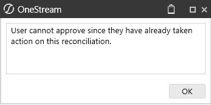

## Account Reconciliations

## Using Account Reconciliations

Typically, you start the reconciliation process by importing the current month’s general ledger data

into the Actual scenario in OneStream (“Actuals”). Then you can prepare reconciliations.

### Click

to open the Reconciliations page.

## Workflow Actions

### Process

This is the first step that you take when working with reconciliations. Click Process to update

balances for all reconciliations. The Process action has certain requirements to run and has

different behavior based on the type of workflow profile association:

l Base Input Workflow Profile (used to load data): Anyone included in the access group of

the workflow profile can click this button to retrieve and update the balances of this workflow

profile’s reconciliations. You cannot proceed with the reconciliation until Process

Reconciliations is finished.

l Review level Workflow Profile (reviews data and makes no inputs): Anyone in the

Security Role (Manage Reconciliation Setup) user group under Account Reconciliations

Global Options can click this button.

## Account Reconciliations

### Click the Task Activity icon

to show the Process Reconciliations process results:

NOTE: When Process Reconciliations is complete, view updated balances by clicking

### Show Reconciliations Page

.

IMPORTANT: If you run Process in a prior period, you need to run Process in all periods

from that period to the current period to ensure the balance activity is updated. For

example, if you run Process in M3 and then M2, you need to run Process again in M3 to

ensure the balance activity is updated for M3.

### FX Translation Warning (Multi-currency Implementations)

You can create detail items before entering FX Rates. This allows you to prepare reconciliations

before the close of the period and possibly before the availability of FX Rates. Create a detail item

by entering the value and selecting the currency type. If not specified, the detail item currency type

defaults to the account currency type. However, the values for Account, Local, and Reporting

display as zero (unless the translation is one to one) after saving. Additionally, if OneStream is

used to translate either Account or Reporting reconciliation balances from Local, these balances

display as zero until FX Rates are entered. The following warning symbols may display:

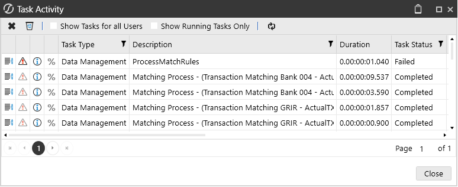

## Account Reconciliations

l Red FX: FX Rates are not entered for the period.

l Yellow FX: FX Rates are missing. Hover over the icon to view the missing rates.

l Yellow FX!: FX Rates are updated, but a Process is necessary.

If necessary, the administrator must run Process to translate all reconciliation balances and detail

items for the entire Reconciliation Inventory. An administrator running Process within any

reconciliation meets this requirement.

NOTE: It is strongly recommended that an administrator run Process after entering FX

Rates. This ensures that all balances are translated and consistent throughout the

solution.

If an administrator enters the FX Rates and does not run Process, end users can still see

translated Account and Reporting balances and translated values for detail items, but translation

is only performed on reconciliations to which they have access.

### All Audit

Only the administrator or users in the Security Role (Manage Reconciliation Setup) user group

can run this option. When you click All Audit, a Data Management Sequence called

CreateAuditPackage_RCM runs. It generates and exports all reconciliation audit packages for the

current workflow view.

This creates multiple compressed folders under a single folder that each contain a reconciliation

report and supporting file attachments, as well as a consolidated reconciliation report for all

reconciliations.

This Data Management Sequence places its output under the OneStream File Share under

Applications/<APPLICATIONNAME>/DataManagement/Export/ as shown here:

## Account Reconciliations

### Complete Workflow

If you have the appropriate security level and all reconciliations are approved, you can click

Complete WF. If you later need to set the workflow in process, you can click Revert Workflow.

### Reconciliations Page

### On the Reconciliations page, you can:

l View and filter the list of reconciliations. The list can be filtered by target account, role,

preparation status, and other categories.

l View statistics for the filtered list of reconciliations including percent complete, number

rejected, and number fully approved.

l Reorder columns and search the list of reconciliations.

l View and update reconciliation details, including properties, comments, supporting

documents, and so on.

l Perform actions such as Prepare or Approve for single or multiple reconciliations.

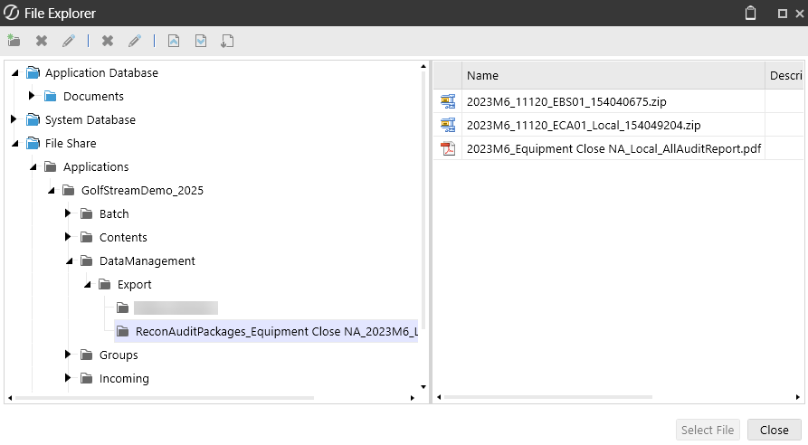

## Account Reconciliations

### Filters

You can use filters to limit the content in the reconciliation grid. The filters can be used together to

create a list of reconciliations that are specific to the circumstances you want to view. For

example, you can filter to see in process reconciliations that are past due for a specific target

account.

Role: Select a role to filter the list of reconciliations:

l Administrator: All reconciliations regardless of assigned role.

l Any User Role: Reconciliations where you are assigned as a Commenter, Viewer, Primary

Preparer, Primary Approver, Preparer, or Approver via an access group.

l Primary Preparer: Reconciliations where you are assigned as Primary Preparer on the

## Reconciliation Inventory.

l Primary Approver: Reconciliations where you are assigned as Primary Approver on the

## Reconciliation Inventory.

l Primary Preparer/Approver: Reconciliations where you are assigned as Primary Preparer

or Primary Approver on the Reconciliation Inventory.

l AG Preparer: Reconciliations where you are assigned as Preparer via an Access Group.

l AG Approver: Reconciliations where you are assigned as Approver via an Access Group.

l AG Preparer/Approver: Reconciliations where you are assigned as Preparer or Approver

via an Access Group.

l Any Preparer/Approver: Reconciliations where you are assigned as Primary Preparer or

Approver on the Reconciliation Inventory or a Preparer or Approver from an Access Group.

l Viewer: Reconciliations where you are assigned as Viewer. You can view reconciliations in

any state such as In Process, Prepared, and Fully Approved.

## Account Reconciliations

l Commenter: Reconciliations where you are assigned as Commenter.

l Auditor: This option only displays for a user in the Auditor role.

The default role is Administrator for Admins and Any User Role  for other users. To set a different

default role, change the value of the SelectedFilterBarRole_RCM parameter under Dashboards.

NOTE: If you change the default role, you must reset the parameter value when you

upgrade Account Reconciliations because the upgrade sets the default role back to

Preparer.

T. Account: List of target accounts for reconciliations assigned to the workflow profile. Target

accounts are defined in the reconciliation definition. Select All or select a target account.

State: Select All or select one or more state options.

l In Process: Reconciliations that are not yet prepared.

l Prepared: Reconciliations in a prepared state. Does not include reconciliations that are

partially or fully approved but were previously in the Prepared state. This does not include

auto prepared.

l Partially Approved: Reconciliations that have at least one level of approval and require

additional approvals.

l Fully Approved: Reconciliations that have received all manual approvals. This does not

include auto approved.

l Rejected: Reconciliations that have been rejected by the approver.

l Balance Changed: Reconciliations where the balance was changed.

l Auto Prepared: Reconciliations that were auto prepared.

l Auto Approved: Reconciliations that were auto approved.

Miscellaneous: Select None or select one or more options.

## Account Reconciliations

l Failed Auto Rec: Reconciliations that did not meet the auto reconciliation rules applied in

the inventory.

l Frequency Changed: Frequency for the reconciliation was changed in the workflow

period. Reconciliations with this status are hidden by default and not included in the total.

Use this filter to see these reconciliations.

l High Risk: Marked as high risk in the inventory.

l Improper Sign: Balances for the period are not aligned with the sign as set in the

## reconciliation inventory.

l Past Due: Past due date or were completed after the due date.

### Status Bar

The status bar displays statistics for the reconciliations displayed in the grid. When you change

filter selections, the status bar refreshes to show the statistics for the updated list.

Total: The total number of reconciliations displayed in the grid and that are to be completed for the

period.

Percent Done: The percentage of reconciliations that have been fully approved or were auto

approved . Only reconciliations currently displayed in the grid are used to generate this number. If

you change filters to change the reconciliations list, this number changes accordingly.

In Process: Number of reconciliations that are in process.

Balance Changed: Number of reconciliations that were loaded in one state, but the balance

changed either after it was marked  Prepared or while the item was set to In Process.

## Account Reconciliations

NOTE: The reconciliation balance for RCM is based on the source value loaded.

Although the source value may be transformed to flip signs for consolidation purposes,

the flip sign will not apply in RCM. Therefore, this will not cause a Balance Changed

status.

Rejected: Number of reconciliations rejected by an approver.

Prepared: Number of reconciliations prepared by a preparer or auto prepared, where not yet

approved.

Partially Approved : Number of reconciliations that have received some level of approval, but not

all.

Fully Approved: Number of reconciliations that have received all approvals, including auto

approved reconciliations.

This diagram shows how reconciliations move from state to state:

## Account Reconciliations

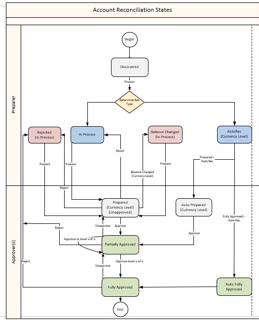

## Account Reconciliations

### Grid Columns

To show, hide, and order columns in the grid, right click on the grid and select Column Settings.

Move columns between the Hidden and Visible columns using the left and right arrow buttons.

Order the columns by moving them up or down the Visible Columns list. You can also drag and

drop column headers within the grid. Rearranged column order is retained when you change to a

different page or window.

The grid columns are determined by the reconciliation inventory. In addition to the columns from

the reconciliation inventory, these columns also display. See Reconciliation Inventory.

State and State Text: Displays reconciliation states:

l In Process

l Balance Changed

l Rejected

l Prepared

l Partially Approved

l Fully Approved

l Auto Prepared

l Auto -Approved

Tracking Detail: Additional dimensional detail if tracking levels are set beyond entity and

account.

Multi-currency Solutions: If Multi-currency is enabled, all three currency levels are displayed on

the grid for the entire reconciliation inventory, including single currency reconciliations. You can

sort by currency type for any of the currency levels.

AutoRec Rule: Assigned AutoRec rule or, if the reconciliation does not have one, (Unassigned).

## Account Reconciliations

Type: Account type such as Asset.

Preparer Due Date: Due date the preparer needs to prepare the reconciliation by. Calculated off

of the close date and Preparer Workday Due set up in the Inventory Page.

Preparer Due-In: Number of days if the due date minus today’s date is a positive number. This is

based on the Preparer Due Date.

Preparer Past Due: Number of days if today’s date minus the due date is a positive number. This

is based on the Preparer Due Date.

Approver Due Date : Due date the approver needs to approve the reconciliation by. Calculated

off of the close date and the Approver Workday Due set up in the Inventory Page.

Approver Due-In: Number of days if the due date minus today’s date is a positive number. This is

based on the Approver Due Date.

Approver Past Due: Number of days if today’s date minus the due date is a positive number.

This is based on the Approver Due Date.

Process User : Last user to run Process.

Process Time:  Last time Process was run that checks for a balance change even if the

reconciliation was previously fully approved.

Update User: The user who last took action on the reconciliation.

Update Date: The date and time the last user took action on the reconciliation.

Approval Level: Displays the current approval level of the reconciliation.

Balance: Balance for the selected reconciliation.

Currency Type: Currency type, such as EUR or USD.

Explained: The amount of balance explained.

## Account Reconciliations

Unexplained: Amount of the balance not yet explained.

Activity: Calculates to the prior reconciliation period, not the last period based on the

reconciliation frequency.

NOTE: Multi-currency implementations display Balance, Currency Type, Explained,

Unexplained, and Activity for all three currency levels.

### Reconciliation Workspace

When you select a reconciliation from the list, details display below the list.

IMPORTANT: Unless otherwise noted, fields are editable for the current booked period.

### Detail Items

This is a grid of explanations of reconciliations.

O (Multi-currency Solutions): Identifies which translated currency levels were overridden for the

detail item.

l A: Individual or group account currency value is overridden.

l A*: Group and child account currency values are overridden.

l L: Individual or group local currency value is overridden.

l L*: Group and child local currency values are overridden.

l R: Reporting currency value is overridden.

NOTE: You can filter on column “O” to show only detail items with overrides.

R Identifies the type of reconciliation detail item.

## Account Reconciliations

l S: Item imported via a multi-period template as a schedule.

l I: Individually explained detail item.

l T: The item was imported via a template.

l B: The explanation is for a balance check reconciliation. The value is pulled from the related

workflow profile that loaded and checked the detail with transformation rules.

l X: The item was created from Transaction Matching. Used with integrated solutions only.

NOTE: After B-Items and X-Items are created, Item Type, Item Name, Reference 1 and

Reference 2 cannot be changed. Only the Item Comment field can be edited. A new

detail item must be created if the Preparer wants to modify an imported item.

Amount: The amount explained.

Currency (Multi-currency Solutions): Currency type for the explained amount.

Account (Multi-currency Solutions): Account currency explained amount.

For existing detail items, if you update the Account currency or (for account group reconciliations)

Local currency attributes and the associated reconciliation or account group reconciliation already

has detail items, the values associated with the Account currency or Local currency attributes do

not retranslate based on the change in currency. Therefore, it is recommended to make any

changes in currency before adding detail items to the reconciliation. If the currency was changed

after detail items were added to the reconciliation:

l You can change the currency type to another currency type related to the amount for the

detail item, which will force the detail item to retranslate the Account, Local, and Reporting

values. You can then change the currency type back to the original currency for the detail

item, which will force the detail item to recalculate the Account, Local, and Reporting

values.

## Account Reconciliations

l You can remove all detail items and then add them back. For example, for pulled forward

items, you can delete them and then pull forward again.

Local: Local currency explained amount.

Reporting (Multi-currency Solutions): Reporting currency explained amount.

Reconciliation ID (Account Groups): Drop-down menu of options, including (Group) and the list

of child reconciliations associated with the account group. For B-Items and X-Items, this field

displays the child reconciliation ID.

IMPORTANT: After you select a reconciliation ID and save the item, it cannot be edited.

To update the reconciliation ID, delete the item and then add it with the correct

reconciliation ID.

Item Type: Type of reconciliation detail (from Control Lists) that drives later reporting. For

example, the status of Correction (BS) because that is a status that may draw a level of review.

Item Name: Description of item. Item Name cannot be blank.

NOTE: For account groups and individual reconciliations with a BalCheck Level set to

(Tracking Level), the BalCheck Workflow Profile related to the item will display as the

Item Name. For account groups and individual reconciliations with a BalCheck Level set

to any value other than (Tracking Level), the BalCheck Level together with the BalCheck

Workflow Profile related to the item will display as the Item Name.

Item Comment: Additional comments. The Item Comment field is always editable.

Booked Period: Period related to this explanation based off workflow time and is not editable.

## Account Reconciliations

Transaction Date: Date of the transaction. When creating a detail item, the transaction date

defaults to the last day of the current workflow period. You can change the date to be any date

from the current workflow period or a prior period. After you save the detail item, you cannot

change the transaction date.

Aging: Calculated upon Save based on the period end date minus the transaction date. For

example, if the transaction date is January 15 and the period end date is January 31, the aging is

16 days.

Reference: Text input fields used for additional references.

User/Time Stamp (UTC): The user who made the explanation and when it happened.

### Adding Detail Items

### To add detail items, click

, enter detail information, and then click
.

NOTE: Item Name cannot be blank.

### Deleting Detail Items

### To delete detail items:

1. Take an action:

l To delete specific items, select the check box next to each item.

l To delete all items, select the check box at the top of the column.

2. Click
.

NOTE: Items and their associated documentation are deleted. If multiple items are

selected, R-docs are not deleted.

## Account Reconciliations

### Standard Explanation Actions

Prior Items: Gives you the option to copy or pull forward detail items or comments from the prior

period. For a group reconciliation, I-Items and T-Items related to the group will display. Either

option will allow you to save time by not having to re-explain the same reconciliation. Copy is

intended to allow detail items or comments from prior periods to be used as a template, where

changes can be made, and pull is intended to carry the specific item and documentation or

comment into the next period without edits. You can select individual or multiple items or

comments to copy or pull forward.

You can copy any comments, but you can only pull forward your own comments. Permission to

copy and pull forward comments is based on your role and the step you are completing in the

workflow. See Roles.

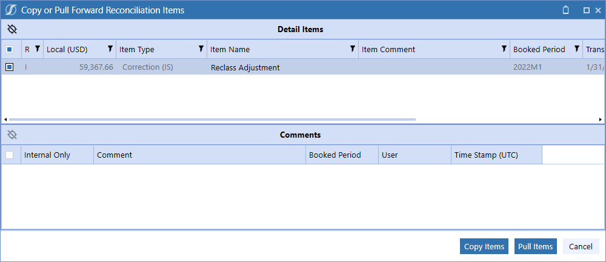

## Account Reconciliations

When you copy a detail item from an account group, you can overwrite the reconciliation ID by

selecting an option from the drop-down menu, which includes the related child reconciliations and

(Group).

NOTE: The Overwrite Reconciliation ID option is only available when you copy items.

Pull replicates the selected detail items that cannot be edited in the current period. Associated

documents are pulled forward. The booked period will always be the period that the item was

initially created. When a detail item is pulled forward, the transaction date remains the initial

transaction date when the item was created. Aging is recalculated for the current workflow period

end date, and changes can be made to the Item Comment field only.

Copy replicates the selected detail items that can be edited in the current period. Associated

documents are not copied. When detail items are copied, the booked period for the newly created

item becomes the current period and the transaction date defaults to the last day of the current

period. You can edit the transaction date so that it properly reflects the actual date the transaction

took place.

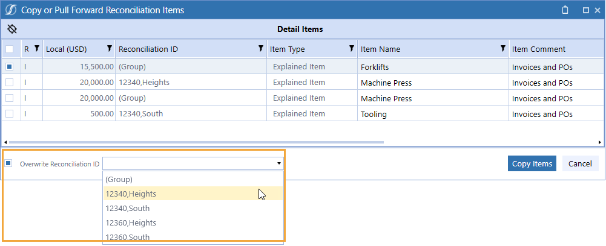

## Account Reconciliations

NOTE: You can pull forward a detail item with a blank Item Name, but if you change any

field on the item, you must add an Item Name to be able to save it.

I-Items that have been pulled forward and used to create detail items in subsequent periods

cannot be deleted. When a detail item is pulled forward into the current period, the supporting I-

Docs cannot be deleted or edited.

If a reconciliation has the Allow Auto Pull Forward option set to Yes, the related I-Items and T-

Items in the previous period are pulled forward into the current period with (for I-items) the related

I-Docs when the account balance is first created. See Reconciliation Inventory. T-Items are also

converted into I-Items.

You cannot pull forward X-Items (used with integrated solutions), B-Items, or S-Items.

Multi-currency Solutions: For items pulled forward, the detail amount and item currency type are

pulled forward. All other currency values for the detail item are translated using the current

month's FX rates unless a currency level has been overridden.

When you pull forward an item from a previous period that contains an overridden value, the

overridden balance remains and is pulled forward period over period, and the transaction date

and booked period display the original date and time. Overrides on pulled forward Multi-currency

items cannot be edited. When you pull forward an item from a previous period that does not

contain an overridden value, the value, transaction date, and booked period display the original

value, date, and time.

When you copy an item from a previous period that does or does not contain an overridden value,

the value is recalculated using the current period FX rate, and the transaction date (the last day of

the period) and booked period (the current period) are updated to the current date and time. If a

Multi-currency item is copied into a current period that does not have FX rates, the Local, Account,

and Reporting amounts will be translated to zero until FX rates are populated and Process is re-

run.

T-Doc: Imports a template document that adds new reconciliation detail items.

## Account Reconciliations

NOTE: Detail Item Name cannot be blank.

This document is stored in the system and displayed under Reconciliation Support with a T

symbol. Below is an example of the basic template being completed.

NOTE: The Consolidation Account, the GL Account, and the GL balance are brought

into the template when launched.

Template: Downloads the template stored with this Reconciliation Definition or Reconciliation

Inventory item. You can then fill out the template and import it as a T-Doc or S-Doc.

S-Doc: Imports a template document that adds new reconciliation detail items for multiple

periods.

NOTE: Detail Item Name cannot be blank.

This document is stored in the system and displayed under Reconciliation Support with an S

symbol. Below is an example of the detail portion of a multi-period template being completed.

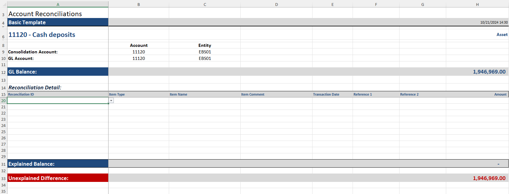

## Account Reconciliations

This document opens like the T-Doc example above, but there is an additional column in the detail

section in which the user can list the period in which this reconciliation detail item should apply.

The user should use the syntax of adding an exclamation point (for example, !2023M1) before the

OneStream time period as in this example:

S-Items: View all S-Doc items associated with the selected reconciliation, regardless of the time

period.

### Balance Check Explanation Actions

These actions display only for balance check reconciliations. For reconciliations that have a Bal-

Check assigned, if this is also set with the AutoRec rule to Legacy, the AutoRec process

automatically pulls the balance from the workflow profile assigned if the status of the related

## BalCheck WF Profile is Completed.

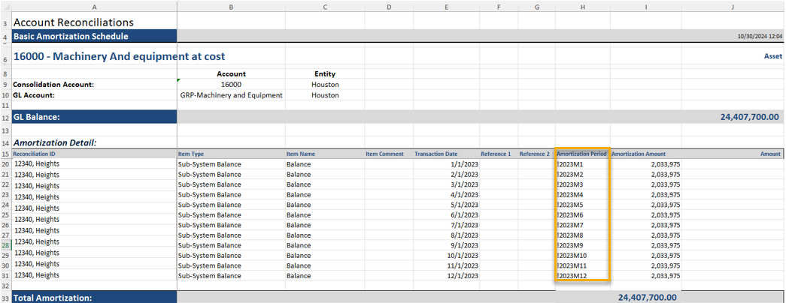

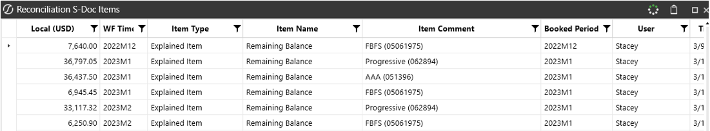

## Account Reconciliations

Detailed balance check of an Account Group:

Pull B-Chk: This Balance Check Explanation value is pulled from the related Workflow Profile

that has been loaded and successfully validated. The detail Item Name is automatically set to the

name of the BalCheck Workflow Profile and Balance Check Level associated with the

reconciliation.

NOTE: If this workflow profile is not in a prepared state or has failed, this balance will not

be pulled and the user is notified.

l Multi-currency Solutions: When performing balance checks for multi-currency

reconciliations, the balance is loaded to the Detail Amount column in the detail items grid.

Unless a currency type is identified within the data source, it is assumed that the currency

type for the Detail Amount is the same as the account currency for the reconciliation.

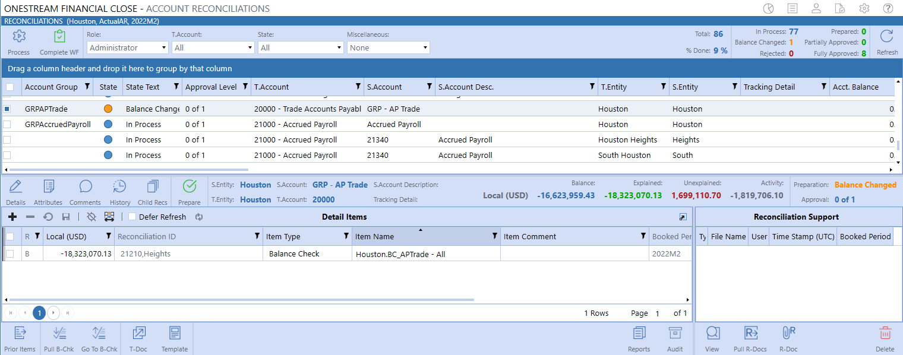

## Account Reconciliations

If the transaction currency type is different and is not provided within the data source, it

must be manually changed within OneStream after the balance has been pulled into the

reconciliation. If multiple currency types exist within the source file, each currency type is

aggregated and shown as a summary detail item within the reconciliation. The Detail

Amount for each currency type is translated to the three reconciliation currency levels

(Account, Local, and Reporting) upon pulling the balance.

An exception exists when Account, Local, or Reporting balances are provided within the

BalCheck source file. If any line within the BalCheck file contains Account, Local, or

Reporting balances, or any combination of the three, OneStream assumes an override has

occurred and accepts those balances as the amount to be shown on the reconciliation.

It is recommended that either all or no lines contain the currency level balances, and

overrides are performed within the system. Otherwise, balances may appear incorrect.

Furthermore, if any level of currency is provided, the reconciliations need be set up to allow

overrides within the inventory or the BalCheck pull will fail.

NOTE: To pull forward a statement balance, create an item type for balance that uses

the explained item description instead of statement.

## Account Reconciliations

Go To B-Chk: When selected the Base Input Child Import Workflow loads in a separate tab.

### Reports, Audit Packages, and Reference Documents

NOTE: Reports will automatically change to legal landscape format if needed to fit the

columns.

Reports: Runs a standard or translated reconciliation or reconciliation history report. See

information on the limitations of translated reports under Global Options.

l Single Currency Reconciliations: You can run reports for local or translated currency.

1. From Report Type select Reconciliation or History.

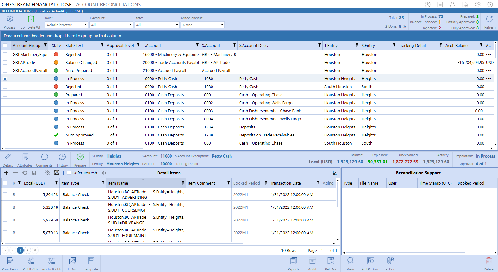

## Account Reconciliations

2. From Currency Level select Local or Translated to Reporting.

l Multi-currency Reconciliations: You can run reports for any or all currency levels for the

reconciliation.

1. From Report Type select Reconciliation or History.

2. From Currency Level select All, Account, Local, or Reporting.

Audit: Creates the audit package for one or more selected reconciliations, including a

reconciliation report and related file attachments.

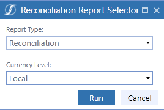

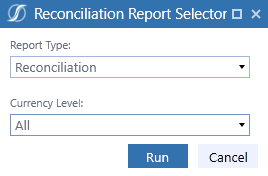

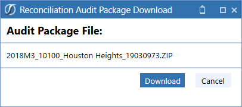

## Account Reconciliations

The audit package is stored in the OneStream File Share under the current user’s personal folder

in a subfolder named Recon Audit Packages:

NOTE: If files with duplicate names exist, a timestamp field is added to supporting doc

file names to ensure uniqueness.

Ref Doc: Displays only if the reconciliation has an attached reference document. Opens the

reference document related to this reconciliation definition. This document typically contains

instructions on how to complete this reconciliation.

### Reconciliation Support

In the Reconciliation Support area, you can view or upload related documents for the selected

reconciliation or individual reconciliation detail item. If you upload a document with the same

name, you have the option to overwrite the existing attached document.

### Documents are denoted by:

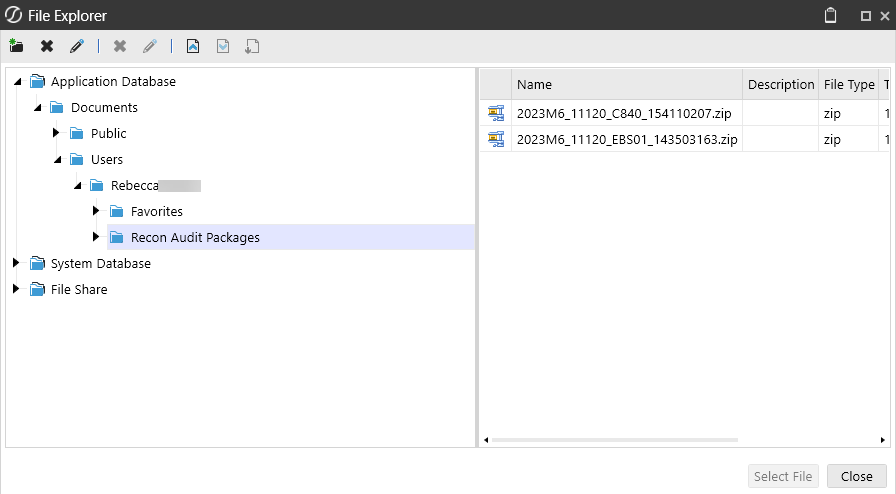

## Account Reconciliations

l T for T-Doc

l S for S-Doc

l R for R-Doc

l I for I-Doc

Pull R-Docs: Pulls the documents forward from the prior period depending on the frequency of

reconciliation.

R-Doc: Upload a document associated with the entire reconciliation, not necessarily one detail

line item.

NOTE: R-Docs will automatically carry forward into future periods for reconciliations

associated with an AutoRec rule. Do not attach an R-Doc with a balance, because it will

automatically carry forward and may not be valid in the next period.

I-Doc: Upload a document associated with the selected detail line item. You can only upload I-

Docs to reconciliations that are In Process. Not supported for items imported by a template.

NOTE: To attach an I-Doc, you must select a reconciliation detail item.

View: Opens the selected document.

Delete: Deletes the selected document.

If the Allow Approver Attachments option is selected in the Global Options tab, any user assigned

to the Approver role or above can add I-Doc and R-Doc attachments after a reconciliation is

prepared. See below for which documents the approver can add or delete depending on the state

of the reconciliation.

## Account Reconciliations

### Action

### In Process

### Prepared

### Partially

### Fully

### Approve

### Approved

### Add I-Docs or R-Docs

### Yes

### Yes

### Yes

### No

### Delete I-Docs or R-Docs

### Yes

### No

### No

### No

added before preparation

(by anyone)

### Delete I-Docs or R-Docs

### N/A

### Yes

### Yes

### No

added after preparation

(by anyone)

### Attributes

Any user can view reconciliation attributes. The Local Admin assigned to the reconciliation,

OneStream Admin, or the RCM Admin can edit attributes.

### Comments

Click the Comments icon to add, edit, or delete comments on a reconciliation. The icon displays

in green if comments already exist.

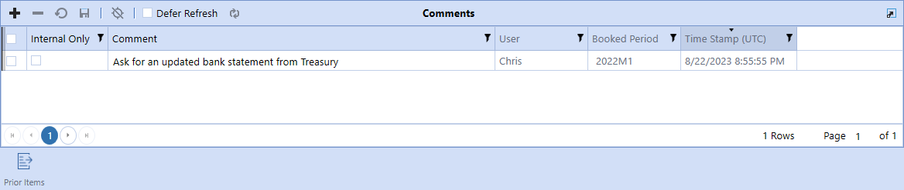

## Account Reconciliations

The grid displays the comment, user, booked period (period the comment was created), and time

stamp of each entry. After you save a comment, the user, booked period, and time stamp are not

editable. These comments print on reconciliation reports but are not included in the audit export

file.

A comment that was copied can be edited, but a comment that was pulled forward cannot be

edited. You can delete a comment that was pulled forward, but you cannot delete the original

comment. To delete the original comment, first delete each instance that was pulled forward.

Then, delete the original comment.

TIP: Comments can be set to Internal Only. Internal Only comments are not visible to

auditors and do not display on reports. Comment visibility can only be updated by

OneStream administrators, Reconciliation Global administrators, or the user who added

the comment.

Click the Prior Items icon to copy or pull forward comments from the prior period. Copy is

intended to allow comments from prior periods to be used as a template, where changes can be

made, and pull is intended to carry the specific comment into the next period without edits. You

can select individual or multiple comments to copy or pull forward.

You can copy any comments, but you can only pull forward your own comments.

Permission to add, edit, delete, copy, and pull forward comments is based on your role and the

step you are completing in the workflow. See Roles.

### History

Displays reconciliation approval and document history.

### State History

The history updates when the state of the reconciliation is changed by a user or the system.

## Account Reconciliations

l Action: Tracked actions are: Prepared, Rejected, Recalled, Unapproved, Approved, and

Balance Changed.

l State: State changes include In Process, Prepared, Rejected, Balance Changed, Auto

Prepared, Partially Approved, Fully Approved, and Auto Approved.

l Detail: If an AutoRec rule was used to automate the preparation or approval of the

reconciliation, the rule name is listed. Certification comments are also displayed.

l User: Name of the user who performed the action. State changes performed by the system

include Auto Prepared, Auto Approved, and Balanced changed and display as "System".

l Time Stamp: Time that the action was taken.

### Document History

Lists all documents attached to the reconciliation including documents pulled forward. To

download a document, select a row and then click View.

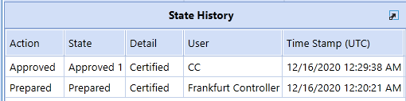

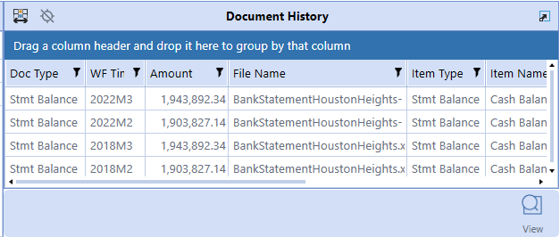

## Account Reconciliations

NOTE: S-Doc and T-Doc detail items display blank or 0.00 for the Amount, Item Type,

Item Name, and Item Comment Note columns as they are not directly assigned to these

items and can span across multiple reconciliations.

### Child Recs

Only visible if the reconciliation is from an account group and lists the reconciliation inventory

items associated with the account group.

NOTE: The Child Recs tab only displays detail items that are assigned to a child

reconciliation level. The Detail Items grid displays detail items for both child

reconciliations and account groups. Therefore, the Child Rec balances might not match

the Detail Items summary balances.

### Single Currency Solutions

The child balance displays.

### Multi-currency Solutions

Select the balance type to view from the drop-down menu: All Currencies, Child Currency, or

Group Currency.

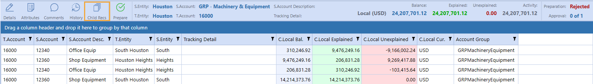

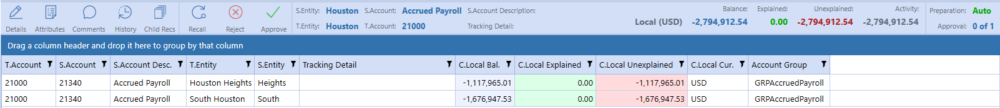

## Account Reconciliations

### Preparer and Approver Actions

To perform status changes to reconciliations, select the check box next to the reconciliation and

make changes to the bottom of the workspace.

If mass actions are enabled, you can select multiple reconciliations and apply a status change to

the selected reconciliations. A summary dialog is displayed with explanations for any actions that

were not successful.

NOTE: Any comments or certifications apply to all marked reconciliations.

### Prepare

: Marks a reconciliation as prepared, but all necessary balances must first be

explained.

### Recall

: Sets a prepared reconciliation back to In Process.

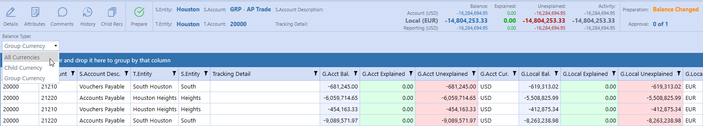

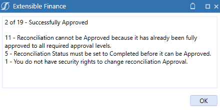

## Account Reconciliations

### Reject

: Approver status change. If the reconciliation is prepared, sets the status to Rejected .

Auto-prepared reconciliations can be rejected by Approver 1-4/Approver 1-4 Backup or the

RCM Admin. Fully Approved - auto reconciliations can only be rejected by the RCM Admin. If an

auto-prepared or fully approved auto reconciliation is rejected, it returns to In Process and can be

prepared again.

### Approve

: If the reconciliation is prepared, sets the state to Approved. Due to segregation of

duties, the user who approves the reconciliation cannot be the same user who prepared the

reconciliation. There are no exceptions to segregation of duties. If there is more than one approval

level, the approval level (for example, 1 of 3) updates after each approval.

Auto-prepared reconciliations can be approved by Approver 1-4/Approver 1-4 Backup or the

RCM Admin.

### Unapprove

: Removes one level of approval. If a reconciliation is manually unapproved, it

goes back to Approved level one below the level it was previously approved . For example, if a

reconciliation previously had 3 of 4 levels of approval completed and was unapproved by a level 3

approver, it would go to a state of Partially Approved 2 of 4.

Fully approved auto reconciliations can be rejected or unapproved only by the RCM Admin. If

rejected, the fully approved reconciliation goes to In Process and can be prepared again. If

unapproved, the fully approved reconciliation goes to Auto Prepared with no approvals complete

(for example, 0 of 3) regardless of how many approval levels there are. The reconciliation can

then resume the normal manual approval process.

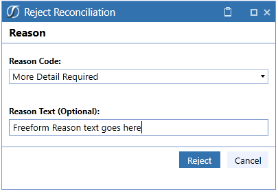

## Account Reconciliations

This diagram describes the flow of a reconciliation through the different states:

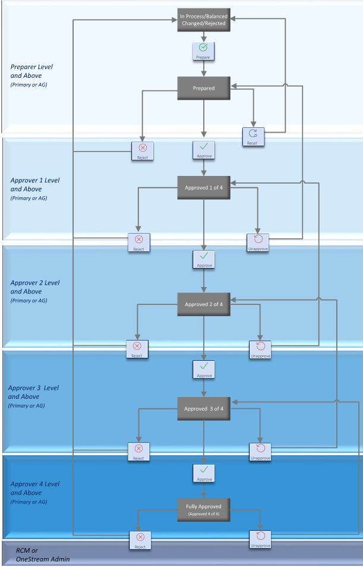

## Account Reconciliations

## Certification

If certification is required when preparing or approving a reconciliation, the certification dialog box

displays. If you are preparing or approving multiple reconciliations, your certification comment

applies to all selected reconciliations.

1. Enter a certification comment when preparing or approving a reconciliation. The comment

may be required or optional.

You can click View to display the certification text in a separate window.

2. Click Certify to prepare the reconciliation.

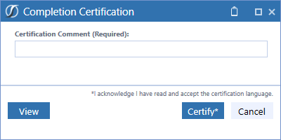

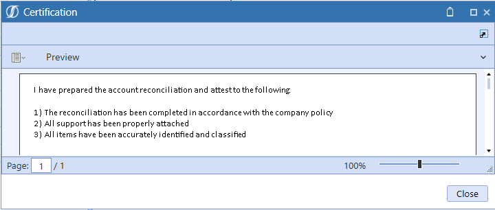

## Account Reconciliations

### Reconciling and Changes to Account Groups

If an account group is being reconciled as opposed to a single reconciliation, the experience of

adding explained items, attachments, completing, and approving is the same to the user. The only

exception is the appearance of the Child Recs button on the screen, which shows the base

reconciliations that are included in the account group.

Approval levels between account groups and the child reconciliations cannot be different. The

child reconciliation inherits the number of approval levels assigned to the account group.

For example, see the GRPAPTrade account group and the reconciliations that belong to this

account group. They each have 1 approval level.

Reconciliation, Preparation and Approval of Account Groups

Whenever an account group is marked prepared or is approved at a certain level, the related child

reconciliations are also marked that way. In the example above, here are some situations and

their results when working with AP Trade – Houston:

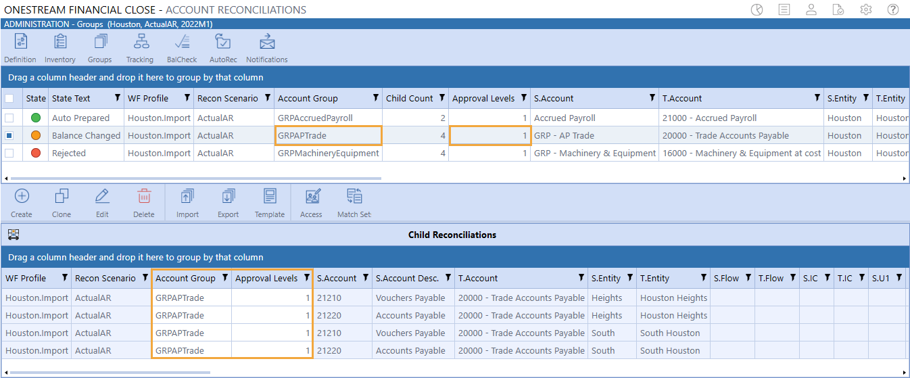

## Account Reconciliations

l If marked complete, all four child reconciliations are marked complete in the underlying

tables.

l This account group needs two levels of approval. If marked approved at level 1, the child

reconciliations are marked approved at level 1.

l If marked approved at level 2 (the final approval level), the three child reconciliations that

have approvals of 1 would be marked approved at level 1. The reconciliation that has

approvals of 3 would be marked approved at level 3, the final approval level.

l If the account group is fully approved and then Unapprove is clicked, all child reconciliations

would be set to Unapproved (level 0).

### Changes to Account Groups

Account groups and their related reconciliations can change over time. New reconciliations may

be added and existing ones removed to be reconciled individually. Here are the effects.

IMPORTANT: If you make any changes to currency for an individual reconciliation or

account group (for example, changing from single currency to multi-currency or

changing the currency type) with existing detail items, the detail items may not be valid.

You will need to delete the detail items and manually re-create them. To avoid this issue,

make any changes to currency before adding detail items.

l Balance

o If a reconciliation inventory item starts out being reconciled individually and then is

added to an account group, the prior reconciliation inventory item can be viewed in

historical periods with its previous balance. The Process button pulls in balances and

marks those balances internally as being for this reconciliation individually or as part

of an account group.

## Account Reconciliations

o If a reconciliation inventory item is part of an account group and is removed from the

account group, it will retrieve its balance and the Balance Changed field will take the

previous balance into account for this reconciliation inventory item.

o If the items that add up to an account group change over time, the total balance

amount previously stored for that account group will not change in historical periods if

that account group is approved, even if Process is executed again in that period. The

approved balance is essentially locked. If Process is executed again against an

account group whose members have changed, the balance will be updated

according to the current members of that account group.

o If a new account group is created and existing reconciliations that had history are

added, the account group will not show any activity from the prior month since the

account group did not exist. It does not add the sum of the prior month's activity for

the reconciliations in the account group. As such, the Balance Changed field will be

the full amount of the balance and it will need to be explained.

o If an account group has all of its children removed, it is recommended to change that

account group to be Auto Reconciled because from that point forward it will retrieve a

zero balance. If that account group had child reconciliations in the past that were

reconciled, it is not advised to clear the Required property on this account group in

order for those historical reconciliations of the account group to be able to be audited.

Note that in historical periods where this account group was fully approved, it will

continue to appear in that way with the proper balance intact.

o Any new account group created after prior periods have been processed would show

up in prior periods as not being completed yet.

## Account Reconciliations

o Process Warning: When a reconciliation account group is removed from a

reconciliation in inventory a Process will need to be done by an Account

Reconciliations Administrator or Application Administrator at the review-level

workflow profile to ensure that all account groups and reconciliation balances are

updated. When this occurs a warning icon will appear next to the Process button on

the Workflow page. This warning icon will be removed for users after an

Administrator processes the reconciliations and the workflow page is refreshed.

l Approval Levels

o Removing Reconciliation Inventory Items from an Account Group: For example, if the

reconciliation inventory items in the AP Trade – Houston example above were

removed from the account group that was not fully approved, the child reconciliations

would show with their appropriate status. If the account group was fully processed, in

historical periods it will not show the child reconciliation that was removed. These

reconciliations would be processed and approved individually in future periods.

### NOTE:

You cannot remove child reconciliations from an Account Group if it has

been prepared for the current period. If child reconciliations are removed

they maintain the account group's attributes and do not revert back to their

former settings.

o Adding Reconciliation Inventory Items to an Account Group: Reconciliation inventory

items added will now fall under the same approval behavior from that point forward as

they would have if they had been there all along. Their historical approvals and

related explained items would still be visible in those periods.

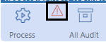

## Account Reconciliations

l Override Values in Detail Items

o When you remove a child reconciliation that has overridden values from an account

group and run Process:

n If the currencies between the account group and child reconciliation match, the

overrides are added to the new individual reconciliation and its values equal

the previous account group values.

n If the currencies between the account group and child reconciliation do not

match, the overrides are removed and the new individual reconciliation values

are translated from the amount.

o When you add a child reconciliation that has overridden values to an account group

and run Process:

n If the currencies between the account group and child reconciliation match, the

overrides are added to the account group and its values equal the child

reconciliation values.

n If the currencies between the account group and child reconciliation do not

match, the overrides are added to the account group and the values are

translated in the account group currency.

### Analysis and Reporting

Review and monitor exceptions and unresolved items with this standard set of dashboards and

reports.

## Account Reconciliations

### Scorecard

The Scorecard is a dashboard that contains charts reflecting the current workflow period’s

reconciliation statuses by preparation, approval, due date, and unreconciled by entity.

Selecting any data points in a chart will open a detailed drill down that can be exported for further

analysis.

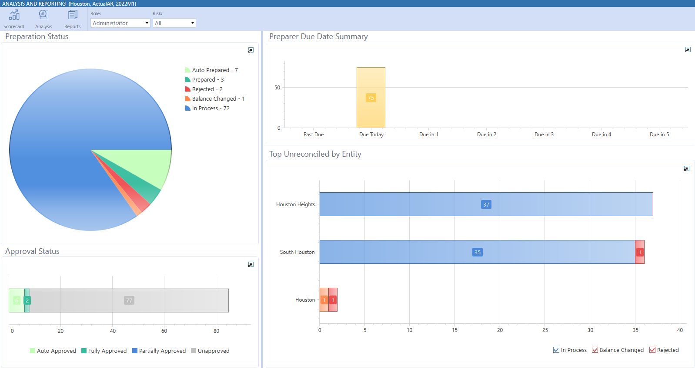

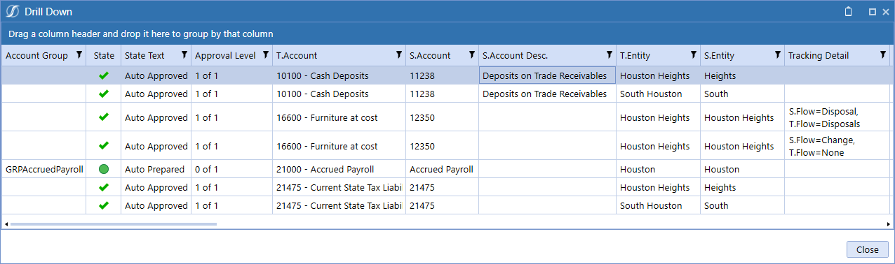

## Account Reconciliations

### Analysis

### Reconciliation Exposure

The Reconciliation Exposure dashboard contains a past due summary and charts reflecting past

due reconciliations by days, entity, and unexplained balances. Like the scorecard, selecting any

data points in any chart opens a detailed drill down dialog box that you can export for further

analysis.

### Aging Pivot

Provides a view into the aging of reconciliation detail items. The ranges for the Aging column are

derived from the Aging Periods control list. If no data exists for a range, then the column for that

range does not display. You can export the grid to Excel by right-clicking on the header of the

pivot.

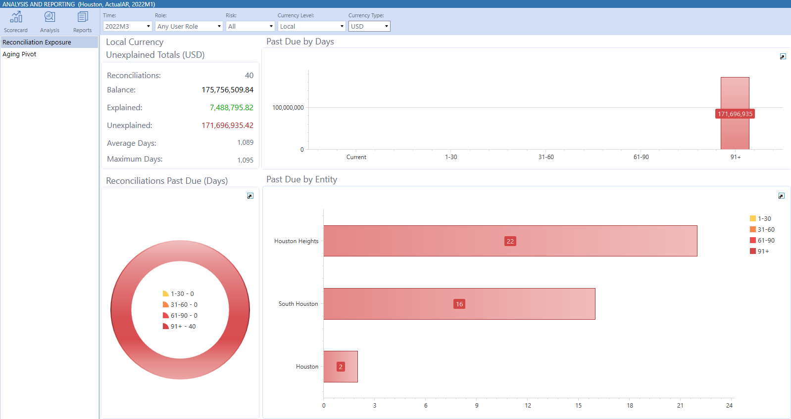

## Account Reconciliations

Any detail item attribute can be added or removed from the rows and columns by clicking and

dragging them from the Hidden Fields section. The default rows are Entity, Currency, and

Account. The default column is Aging. The default Data Area is Item Amount.

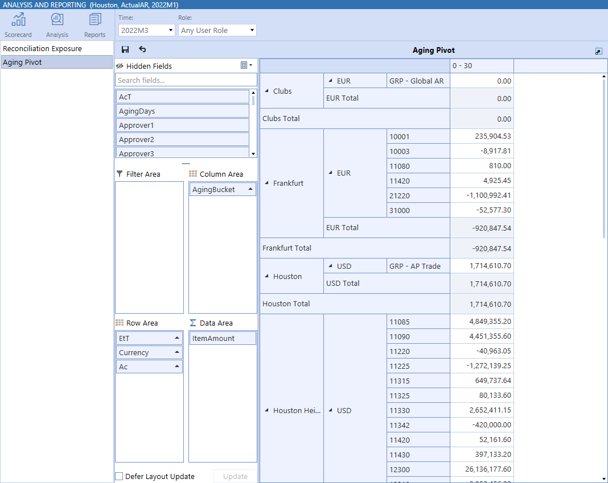

## Account Reconciliations

### Reports

Reconciliation State: Reconciliations by state with Account, Entity, and balance information.

Reconciliation Detail: Detailed Reconciliations with status information and other Explanation

detail.

Reconciliation by Acted Preparer: Same as above but grouped by Preparer.

Reconciliation Risk Analysis: Reconciliation items by Risk Level with Account, Entity, and

balance information.

Reconciling Item Analysis: Reconciliation items by Reconciliation Item Type with Account,

Entity, and balance information.

Reconciliation Item Aging: Reconciliation items aged by period originally booked.

Reconciliation Access Groups: List of Security Access Groups and users assigned to each if

the user running this report is a OneStream Administrator or Reconciliations Global Admin. Note

that if a Local Admin runs this report, this listing will be limited to only show Access Groups to

which this user manages. If any other user runs this report, the report’s contents will be empty.

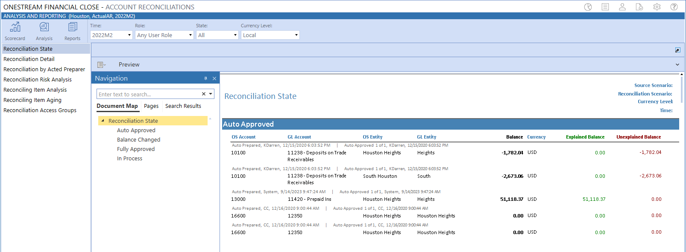

## Account Reconciliations

### DynamicCalc UD8 Accounts

This dimension and these UD8 members are provided to convey Reconciliation status. They are

designed to be assigned as columns on a Cube View and will run their logic against every row

(typically Accounts).

These run extensive Business Rule logic, so if they are run across a lengthy list of Accounts, it

may take some time to open this report. Also, they can run against a Review-level Workflow

Profile, which will aggregate all of the Entity data that falls under all of the Base Input Workflow

Profiles that are descendants of this Review level. If that results in numerous Entities being

aggregated, then this could also result in some wait time for that Cube View to render its results.

Note that this aggregation of Local currency values are not translated, so if the Entities that fall

under the related Review level Workflow Profile are of mixed currencies, the aggregated amounts

may be of little value to the reader of that report.

Examples of Reports with UD8 Dynamic Calcs and with

### Navigation Links for Drilling

The GolfStream_v37 reference application, available on the OneStream Solution Exchange, has

examples of the types of reports that can be built to take advantage of the included UD8 members

and also has an example of using Navigation Links to drill from a financial report to its related

Reconciliation details.

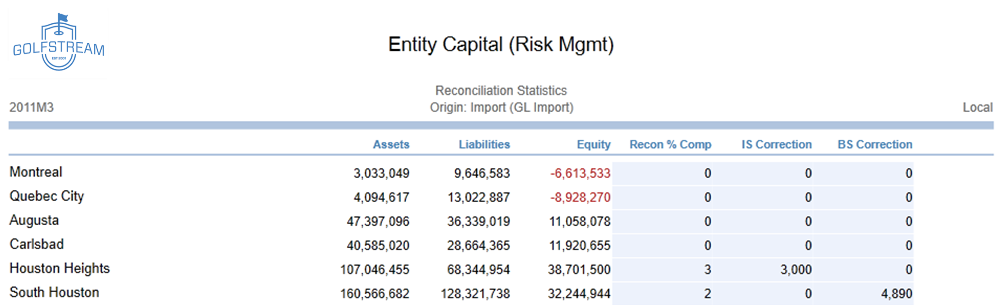

## Account Reconciliations

The example shown below has a Navigation Link, which launches a related Report to drill into

### Reconciliation details:

### Here is the drilled report:

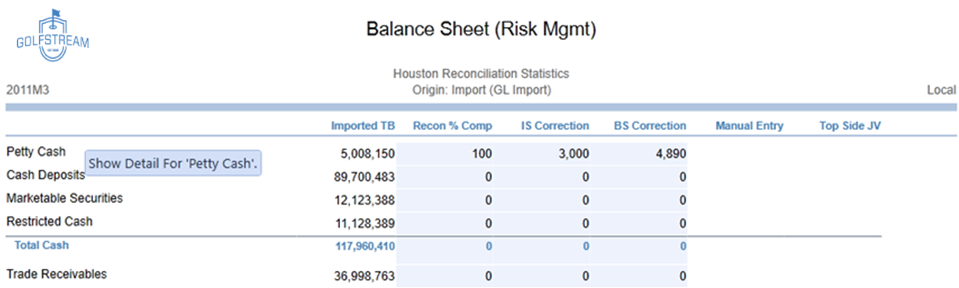

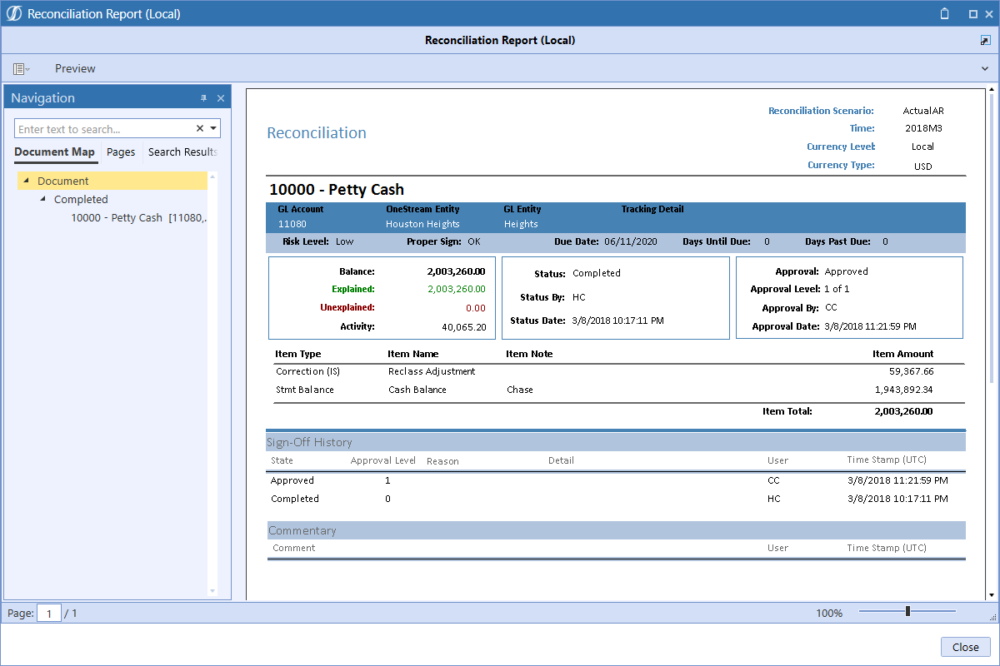

## Account Reconciliations

### Anomaly Detection

IMPORTANT: Anomaly Detection requires: i) SensibleAI Studio, a separately priced

Solution; and ii) Customer be on Version 9.1 or greater.

Anomaly Detection identifies data points that deviate from typical patterns or behaviors. These

anomalies manifest as outliers or exceptional events that distinguish themselves from the typical

data set.

Types of anomalies identified during the reconciliation process:

l Reconciliation Balance: Analyzes the degree of abnormality for an account balance

based on prior values. The detector looks to identify if there are abnormal increases or

decreases based on the reconciliation balance in  prior periods.

l Aged Item Commentary: Reviews reconciliation detail items that have exceeded the

specified aging thresholds for your Aging Periods and verifies if they include commentary.

l R-Doc Sparsity: Checks how often "R-Docs" (supporting documents at the reconciliation-

level) are consistently attached to reconciliations period over period.

l Reconciliation Detail Text Field Length: Looks at the average text length entered in the

ItemName, Item Comment, Ref 1, and Ref 2 fields for Detail Items in a reconciliation.

l Auto-Manual Reconciliation Ratios: Measures each reconciliation and checks whether

they were automatically reconciled versus manually reconciled in the prior period, and

analyzes how the ratio changes.

l Number of reconciliation detail items: Monitors how many individual detail items are

included in each reconciliation period over period.

l Number of I-items: Focuses on the count of "I-items" (manual adjustments). It tracks how

consistently these items display, calling out sudden spikes or dips.

## Account Reconciliations

l I-Doc Sparsity: Evaluates how consistently "I-Docs" (supporting documentation for manual

or "I-Item" entries) are attached to reconciliation detail items over time. It tracks each

period's percentage of I-Items that have an accompanying I-Doc and flags sudden

decreases, suggesting insufficient or missing documentation compared to typical patterns.

l Balance Check I-Items: Verifies if the current period has an I-Item and a B-Item linked to a

reconciliation. You can reference the previous period, but the rule applies only to the

current period.

l Repetitive Rejections: Detects when a reconciliation is rejected multiple times over a span

of periods or within a single cycle.

l Sign Difference: Identifies instances where the sign (positive or negative) of a

reconciliation's balance is different than prior periods.

l Fluctuating Risk Level: Tracks how the assigned risk ratings of reconciliations change

over time. It detects large or erratic swings in the risk level assigned to a reconciliation.

l Security:

o Number of Approver Changes: Looks for changes in the number of approvers

required for a reconciliation. It flags reconciliations that have swings in the number of

a approvers during the current period compared to prior periods.

## Certifications

Certifications are customizable text that are presented to users with the Preparer or Approver

roles when a reconciliation is completed and approved.

## Account Reconciliations

Role: The role of Preparer or Approver for the certification.

NOTE: The Approver Certification is presented for all approval levels.

Message: The certification message presented to the Preparer or Approver when completing or

approving reconciliations.

Active: By default, this is set to True. If False, the certification is not displayed when completing or

approving reconciliations.

Comment Required: By default, this is set to True. If False, comments are not required, but can

optionally be added when completing or approving reconciliations. Comments are displayed in

the Status and Approval History – Detail section.

Critical Anomaly Resolution Required: When enabled, critical unresolved anomalies must be

resolved before the reconciliation can be certified.

Update User: The ID of the user who created or modified the certification settings.

Update Time: The date and time the certification settings were created or modified.

### Critical Anomaly Resolution Required

Critical Anomaly Resolution Required enables OneStream Administrators and Solution

Administrators to require action on critical unresolved anomalies by Preparers or Approvers.

When Critical Anomaly Resolution Required is enabled and Certification is Active, Preparers and

Approvers must address critical unresolved anomalies before the reconciliation can be certified.

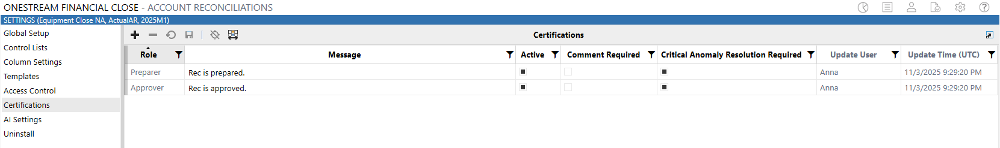

## Account Reconciliations

When Critical Anomaly Resolution Required is not enabled and Certification is Active, Preparers

and Approvers can proceed with certification and critical unresolved anomalies are marked as

Acknowledged. Approvers can see all anomalies in this dialog box except for anomalies that have

been Auto-Resolved.

Mass Actions for Critical Anomaly Resolution Required

When Critical Anomaly Resolution Required is not enabled and Certification is Active and if two or

more reconciliations are selected, Preparers and Approvers can prepare and/or approve

reconciliations with anomalies in mass. Critical unresolved anomalies are marked as

Acknowledged.

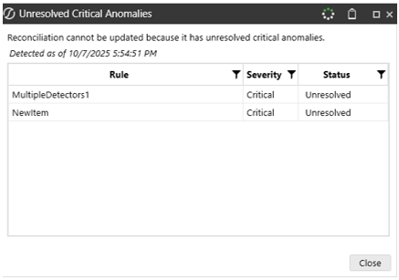

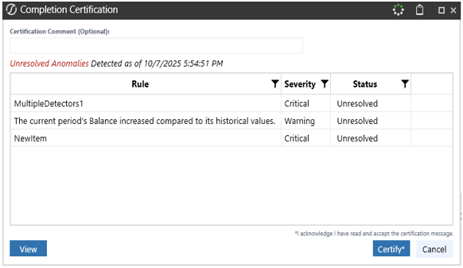

## Account Reconciliations

When Critical Anomaly Resolution Required is enabled and Certification is Active, if two or more

reconciliations are selected and there are critical unresolved anomalies on any of the selected

reconciliations, Preparers and Approvers receive the following message:

TIP: When there are no critical unresolved anomalies in the selected reconciliations

when Critical Anomaly Resolution Required is enabled and/or certification is inactive,

Preparers and Approvers can prepare and/or approve reconciliations with anomalies in

mass.

### AI Settings

AI Settings utilizes an AI component, incorporating default detectors and rules as part of the

solution when SensibleAI Studio is activated and the (PFC) AIS Plugin Financial Close workspace

is present within your application. The AI Settings page displays an Anomaly Detectors grid and a

Data Rules grid. Administrators have the ability to enable, disable, and reset detectors.

NOTE: AI Settings will only display for Administrators when AI Sensible Studio is

enabled.

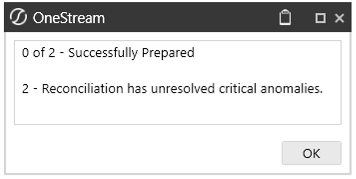

## Account Reconciliations

### Export Configuration

Click the Export icon to export the current anomaly detector and data configuration to the

OneStream File Explorer (your Favorites directory) in a JSON format. You can reimport

the JSON file via the Reset Arena to refresh the AI Settings page to the export made at

that point in time.

### Reset Arena

Click the Reset icon to open the Anomaly Arena Creation dialog box.

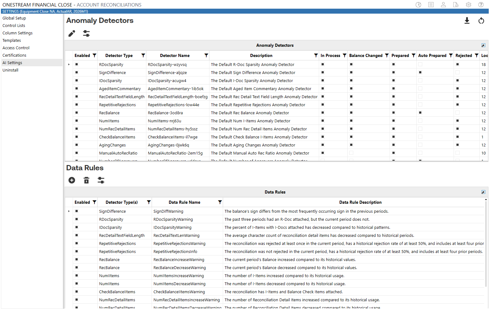

## Account Reconciliations

In the Anomaly Arena Creation dialog box you can:

l Reset to default

l Load a JSON configuration file

Resetting to default wipes the arena and recreates the standard template of detectors and rules.

### To load a JSON configuration file:

1. Navigate the OneStream file system

2. Locate a saved JSON configuration file

3. Reconstruct the arena precisely as specified in the file

NOTE: You can upload a JSON file directly.

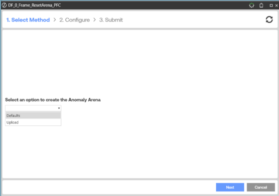

## Account Reconciliations

AI Services Log (Job Status and Error Log)

Click the AI Services Log icon to display an overview of AI Services activity in the

environment, job activity, and the Xperiflow Error Log.

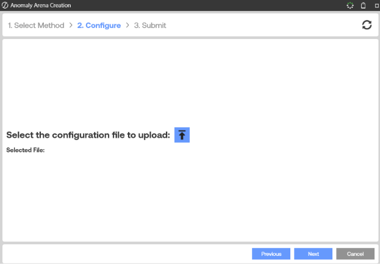

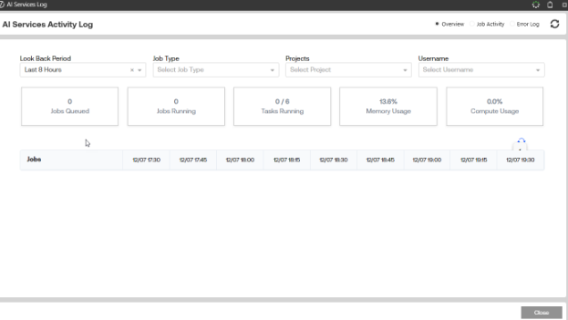

## Account Reconciliations

### Anomaly Detectors Grid

Anomaly detectors apply to reconciliations based on the Preparer's state of the reconciliations.

You can edit the states in which these detectors are involved. Anomaly detectors  scan

reconciliations for a specific pattern or statistical output:

l Enabled: Toggle whether the detector runs when AI Insights is run on a reconciliation.

l Detector Type/Name: The Anomaly Detector to be run (Balance, Change, or Sign

Difference).

l Description: Description of Anomaly Detector. This is automatically provided based on

what Detector Type is chosen.

l In Process, Balance Change, Prepared, Auto Prepared, Rejected: Checkboxes that

indicate which reconciliation state the detector will run on. For example, if only In Process is

selected the detector will only run on reconciliations that have a current status of In

Process.

l Lookback Periods:The maximum number of lookback periods the detector will look at.

l Creation Time:When the detector was first created to last reset.

Click the Modify icon to open the Edit Detector Wizard.

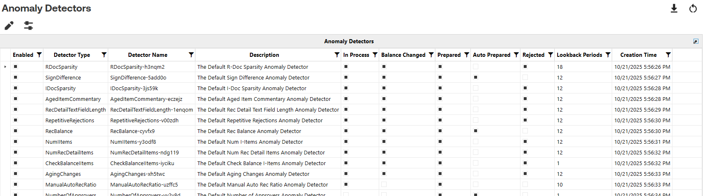

## Account Reconciliations

Click the Toggle icon to enable or disable (a row must be selected).

### Editing an Anomaly Detector

The Edit Anomaly Detector Wizard is a three-step form:

1. Select the detector you'd like to change from the drop-down menu.

2. Select the reconciliation statuses the Anomaly Detector should operate on. This can be

None or All of the statuses.

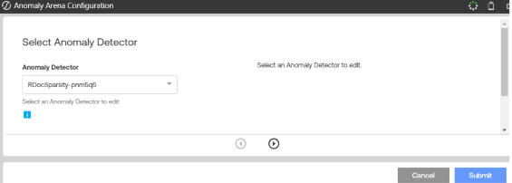

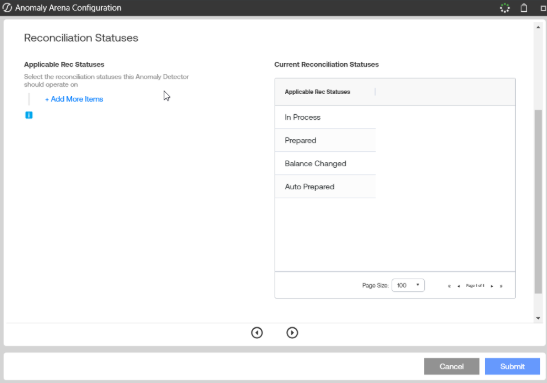