# Transaction Matching Settings

## Account Reconciliations

3. Enter a positive integer representing the max number of lookback periods the Anomaly

Detector looks at historically when calculating anomalies.

4. Review your settings and click Submit.

### Data Rules Grid

Data Rules are the "ifthen" alerts that are added under a parent anomaly detector. A rule can

reference one detector or combine many. Columns in the Data Rules Grid include:

l Enabled: This determines if the Rule is applied  when AI Insights is run. If the rule is off

when the parent detector is run, the rule itself will not. If the parent anomaly detector is

turned off, then the rule will not run even if enabled. Disabling an anomaly detector disables

the rules that refer to that detector.

l Detector Name: Name of Parent Detector(s).

l Data Rule Name: User-friendly, Administrator created  identifier for the data rule.

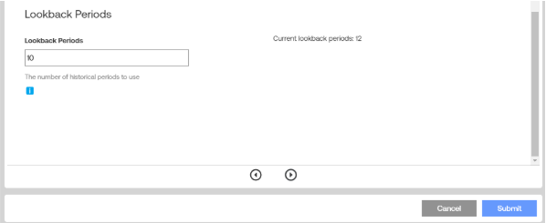

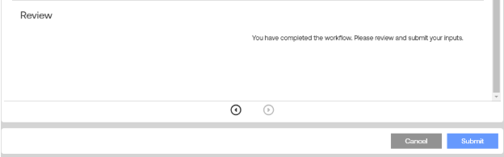

## Account Reconciliations

l Severity: Critical, Warning, or Info.

l Lookback Periods: How many prior periods of history the algorithm analyzes.

l Data Rule Syntax: The SQL-like rule expression that implements the triggering of

anomalies.

Click the Add icon to launch the Add Data Rule wizard (filter-editor-based).

Click the Delete icon to open the Delete Data Rule dialog box. Select a rule from the drop-

down. Click Delete to confirm.

Click the Toggle icon to enable or disable data rules.

Click the Copy icon to launch a wizard to copy a current rule.

NOTE: Rules cannot be edited to ensure accurate tracking of specific rules on

reconciliations as its unable to track different instances of the rule at a point in time.

### Create Rule Wizard

You can author complex logic without writing the Data Rule Syntax directly.

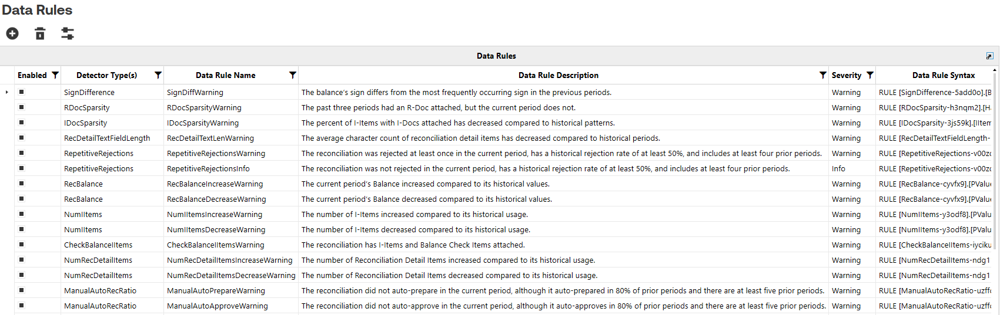

## Account Reconciliations

1. Enter a unique Name and Description of the Data Rule.

2. Select the Data Rule Filter Editor type.

a. Single Monitor builds conditions against a single detector's fields.

b. Multi-Monitor combines fields from several detectors (balance change and aged

community) to build a single data rule.

3. Select which detector(s) to apply.

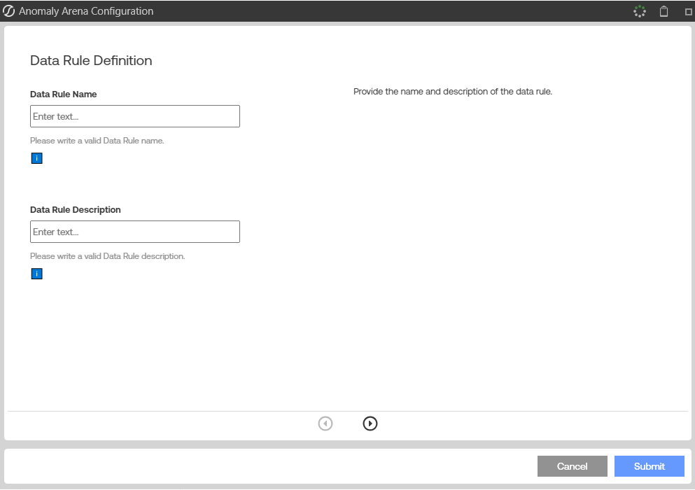

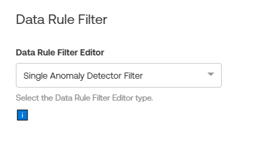

## Account Reconciliations

4. Build Conditions.

a. Select a field from the list of drop-downs.

b. Choose an operator.

c. Enter a value (numbers, dates, or True/False for booleans).

d. Chain multiple lines with the AND/OR toggle at the top.

5. Choose the rule severity (Critical, Info or Warning)

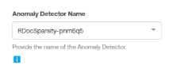

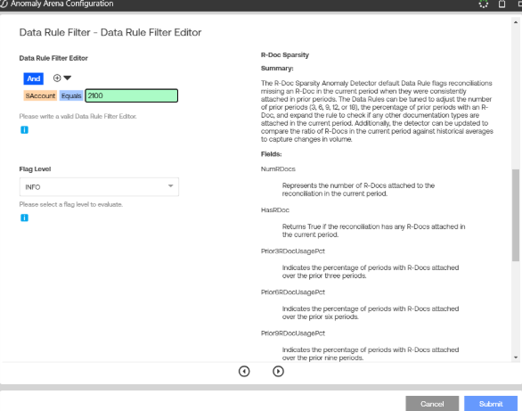

## Account Reconciliations

6. Review and submit.

### How Changes Propagate

Edits to the Anomaly Arena in the component workflow update the Anomaly Arena and

associated Anomaly Detectors or Data rules without needing to press the save button. The next

run of the AI Insights button will use changes that are made on this page.

Previously detected anomalies will remain unchanged, however, if anomaly detection is re-run on

a reconciliation with a data rule that no longer exists or is toggled off, the anomaly status updates

to auto-resolved.

## Best Practices

l Start broad, refine, enable default detectors first, review flags, then narrow lookback

windows or status scopes.

NOTE: For monitors that rely on statistics, fewer lookback periods result in less

statistical power, requiring more significant anomalies to trigger.

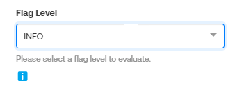

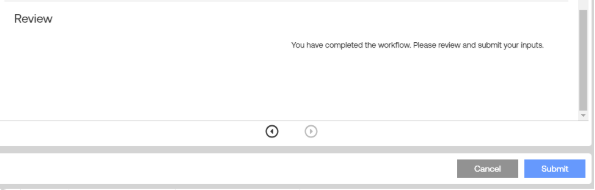

## Account Reconciliations

l Keep rule names short but descriptive.

l Export JSON before major changes.

### Default Detectors and Rules

Sign Difference identifies instances where the sign of a reconciliation's balance is different than

prior periods.

l Applicable Reconciliation Statuses: InProcess, Prepared, BalanceChanged, AutoPrepared

l Lookback Periods: 12

l Warning

o Data Rule Name: SignDiffWarning

o Data Rule Description: The balance's sign differs from the most frequently occurring

sign in the previous periods.

o Data Rule Syntax:

R-Doc Sparsity checks how often R-Docs (supporting documents at the reconciliation level) are

consistently attached to reconciliations period over period.

l Applicable Reconciliation Statuses: InProcess, Prepared, BalanceChanged, Rejected

l Lookback Periods: 18

l Warning

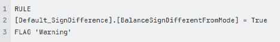

## Account Reconciliations

o Data Rule Name: RDocSparsityWarning

o Data Rule Description: The past three periods had an R-Doc attached but the current

period does not.

o Data Rule Syntax:

I-Doc Sparsity Evaluates how consistently I-Docs (supporting documentation for manual or I-

Item entries) are attached to a reconciliation over time. The default rule tracks each period's

percentage of I-Items that have an accompanying I-Doc and flags sudden decreases, suggesting

insufficient or missing documentation compared to typical patterns.

l Applicable Reconciliation Statuses: InProcess, Prepared, BalanceChanged, Rejected

l Lookback Periods: 12

l Warning

o Data Rule Name: IDocSparsityWarning

o Data Rule Description: The percent of I-Items with I-Docs attached has decreased

compared to historical patterns.

o Data Rule Syntax:

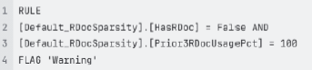

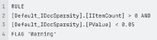

## Account Reconciliations

Aged Item Commentary uses the set Aging Periods to bucket aging items on a reconciliation.

For each aging bucket, the monitor tracks if there are items without comments. Using the default

rules, the monitor checks if there are any items beyond the third aging period without comments.

For example, if the aging periods are set to 0, 31, 61, 91 and 121 days, the monitor will evaluate

whether items aged 61-90 days, 91-120 days, and 121+ days have comments.

l Applicable Reconciliation Statuses: InProcess, Prepared, BalanceChanged, Rejected

l Lookback Periods: 12

NOTE: This rule is based on the Aging Periods and the column names are

created based on the values in that table.

l Warning

o Data Rule Name: AgedItemCommentaryWarning61

o Data Rule Description: The reconciliation has items aged over 61 days, and the

percent of those items without comments has increased from the previous period.

o Data Rule Syntax:

The Reconciliation Detail Text Field Length detector compares the text of a reconciliation in

the current period to its historical values. The detector gathers statistics to determine whether a

decrease has occurred, which may indicate that Preparers are not providing sufficient information

on their detail items. It analyzes the ItemName, ItemComment, Ref1, and Ref2 fields to make this

determination. The detector collects statistics on both the total length of text on a reconciliation for

each period and the average length of text per detail item on a reconciliation.

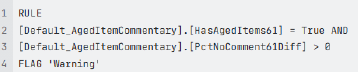

## Account Reconciliations

l Applicable Reconciliation Statuses: InProcess, Prepared, BalanceChanged, Rejected

l Lookback Periods: 12

l Warning

o Data Rule Name: RecDetailTextLenWarning

o Data Rule Description: The average character count of reconciliation detail items has

decreased compared to historical periods.

o Data Rule Syntax:

Repetitive Rejections detects when a reconciliation is rejected multiple times over a span of

periods or within a single cycle.

l Applicable Reconciliation Statuses: InProcess, Prepared, BalanceChanged, Rejected

l Lookback Periods: 12

l Warning

o Data Rule Name: RepetitiveRejectionsWarning

o Data Rule Description: The reconciliation was rejected at least once in the current

period, has a historical rejection rate of at least 50%, and includes at least four prior

periods.

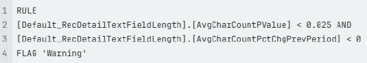

## Account Reconciliations

o Data Rule Syntax:

### Rec Balance

l Applicable Reconciliation Statuses: InProcess, Prepared, BalanceChanged, AutoPrepared

l Lookback Periods: 12

l Warning Increase

o Data Rule Name: RecBalanceWarning

o Data Rule Description: The current period's Balance increased compared to its

historical values.

o Data Rule Syntax:

l Warning Decrease

o Data Rule Name: RecBalanceWarning

o Data Rule Description: The current period's Balance decreased compared to its

historical values.

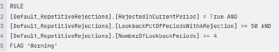

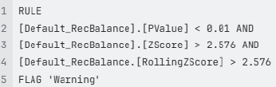

## Account Reconciliations

o Data Rule Syntax:

### Num I-Items

l Applicable Reconciliation Statuses: InProcess, Prepared, BalanceChanged, Rejected

l Lookback Periods: 12

l Warning Increase

o Data Rule Name: NumIItemsIncreaseWarning

o Data Rule Description: The number of I-Items increased compared to its historical

usage.

o Data Rule Syntax:

l Warning Decrease

o Data Rule Name: NumIItemsDecreaseWarning

o Data Rule Description: The number of I-Items decreased compared to its historical

values.

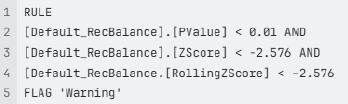

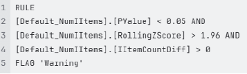

## Account Reconciliations

o Data Rule Syntax:

Num Rec Detail Items monitors how many individual items are included in each reconciliation

period over period. It flags reconciliations that change compared to the number of detail items in

historical periods.

l Applicable Reconciliation Statuses: InProcess, Prepared, BalanceChanged, Rejected

l Lookback Periods: 12

l Warning Increase

o Data Rule Name: NumRecDetailItemsIncreaseWarning

o Data Rule Description: The number of Reconciliation Detail Items increased

compared to its historical usage.

o Data Rule Syntax:

l Warning Decrease

o Data Rule Name: NumRecDetailItemsDecreaseWarning

o Data Rule Description: The number of Reconciliation Detail Items decreased

compared to its historical usage.

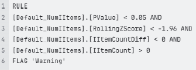

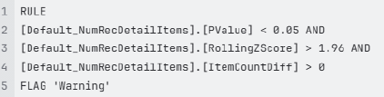

## Account Reconciliations

o Data Rule Syntax:

Check Balance I-Items evaluates if a reconciliation has both a B-Item and an I-Item as detail

items. This detector flags reconciliations that have a Balance Check attached but have had a

manual adjustment.

l Applicable Reconciliation Statuses: InProcess, Prepared, BalanceChanged, AutoPrepared

l Lookback Periods: 1

l Warning

o Data Rule Name: CheckBalanceIItemsWarning

o Data Rule Description: The reconciliation has I-Items and Balance Check Items

attached.

o Data Rule Syntax:

Aging Changes reviews if the change in aging items in the current period deviates from historical

trends. This monitor detects if the reconciliations detail items collectively have increased or

decreased. The default rules include an increase and decrease rule enabling you to toggle one

off.

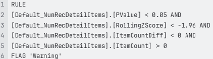

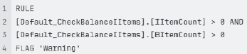

## Account Reconciliations

l Applicable Reconciliation Statuses: InProcess, Prepared, BalanceChanged, Rejected

l Lookback Periods: 12

l Warning Increase

o Data Rule Name: AgingChangesIncreaseWarning

o Data Rule Description: The change in average aging days has increased compared

to historical patterns.

o Data Rule Syntax:

l Warning Decrease

o Data Rule Name: AgingChangesDecreaseWarning

o Data Rule Description: The change in average aging days has decreased compared

to historical patterns.

o Data Rule Syntax:

Manual AutoRec Ratio checks if a reconciliation has an auto rec rule attached and identifies

whether in the prior lookback periods the reconciliation auto prepared or auto approved.

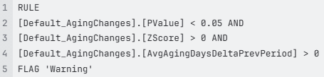

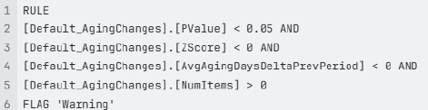

## Account Reconciliations

l Applicable Reconciliation Statuses: InProcess, Prepared

l Lookback Periods: 10

l Warning Auto-Prepare

o Data Rule Name: ManualAutoPrepareInfo

o Data Rule Description: The reconciliation did not auto-prepare in the current period,

although it auto-prepared in 80% of prior periods and there are at least five prior

periods.

o Data Rule Syntax:

l Warning Auto-Approve

o Data Rule Name: ManualAutoApproveInfo

o Data Rule Description: The reconciliation did not auto-approve in the current period,

although it auto-approved in 80% of prior periods and there are at least five prior

periods.

o Data Rule Syntax:

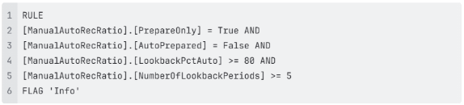

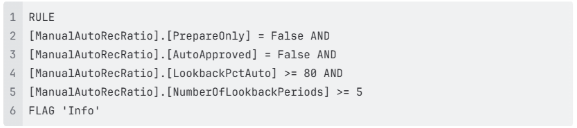

## Account Reconciliations

Number of Approvers looks for changes in the number of approvers required for reconciliation. It

flags reconciliations that have swings in the number of approvers during the current period

compared to prior periods.

l Applicable Reconciliation Statuses: Prepared, AutoPrepared

l Lookback Periods: 1

l Warning

o Data Rule Name: NumApproversWarning

o Data Rule Description: Compared to the prior period, the number of required

approvers dropped by at least one.

o Data Rule Syntax:

T-Doc Sparsity checks how often T-Docs (supporting documents at the reconciliation level) are

consistently attached to reconciliations period over period.

l Applicable Reconciliation Statuses: InProcess, Prepared, BalanceChanged, Rejected

l Lookback Periods: 18

l Warning

o Data Rule Name: TDocSparsityWarning

o Data Rule Description: The past three periods had a T-Doc attached but the current

period does not.

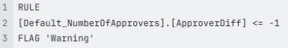

## Account Reconciliations

o Data Rule Syntax:

S-Doc Sparsitychecks how often S-Docs (supporting documents at the reconciliation level) are

consistently attached to reconciliations period over period.

l Applicable Reconciliation Statuses: InProcess, Prepared, BalanceChanged, Rejected

l Lookback Periods: 18

l Warning

o Data Rule Name: SDocSparsityWarning

o Data Rule Description: The past three periods had an S-Doc attached but the current

period does not.

o Data Rule Syntax:

Risk Level Fluctuations check if the current assigned risk rating is different from prior periods. It

detects large or erratic swings in the risk levels assigned to a reconciliation.

l Applicable Reconciliation Statuses: InProcess, Prepared, AutoPrepared,

### BalanceChanged, Rejected

l Lookback Periods: 3

l Warning

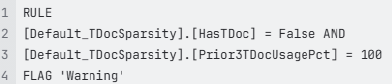

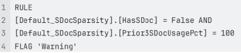

## Account Reconciliations

o Data Rule Name: RiskLevelFluctuationsWarning

o Data Rule Description: The risk level changed from the prior period.

o Data Rule Syntax:

### AI Insights

AI Insights streamlines the process of anomaly detection by leveraging sophisticated

AI algorithms that carefully analyze reconciliations to identify any irregularities or deviations.

AI Insights uses a combination of AI/Statistical analysis, depending on the type of detector.

Preparers and above have flexible options, enabling them to run AI-powered Anomaly Detection

either on a single reconciliation or across multiple reconciliations simultaneously. AI Insights is

highly efficient and adapts to a variety of reconciliation processes and use cases, ensuring

comprehensive results.

To run AI Insights for a single reconciliation:

1. Navigate to Account Reconciliations

2. Select a reconciliation on the Reconciliations Grid

3. Select the Anomalies tab in the Reconciliation Workspace

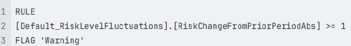

## Account Reconciliations

4. Click the AI Insights button to run anomaly detection

NOTE: Preparers or above can click the AI Insights button. When run, it looks to the

AI Settings to determine which detectors/rules will run at that point in time.

To run AI Insights for multiple reconciliations:

1. Navigate to Account Reconciliations

2. Select multiple reconciliations on the Reconciliations Grid

IMPORTANT: To run anomaly detection on all reconciliations, select the top

checkbox and then select AI Insights from the Mass Actions toolbar.

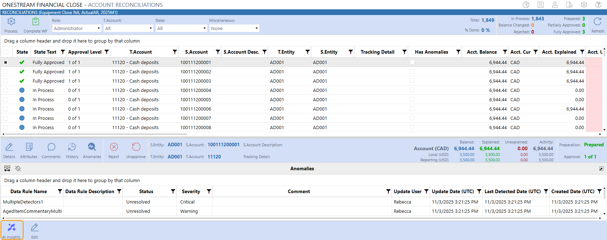

## Account Reconciliations

3. Click the AI Insights button on the Mass Actions toolbar

The  Has Anomalies column included in the Reconciliations Grid shows if anomalies are detected

on a reconciliation.

NOTE: The box  remains checked if anomalies were detected at any point during the

current period, regardless of severity. Even if those anomalies are later resolved, the

box stays checked to indicate that an anomaly was detected on the reconciliation during

the period.

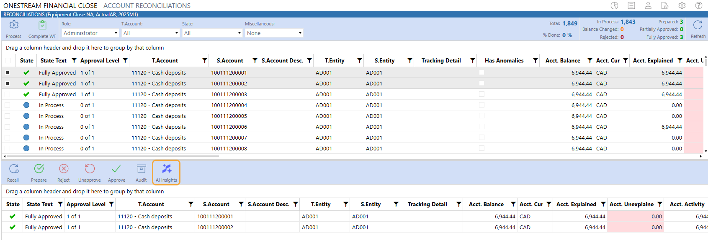

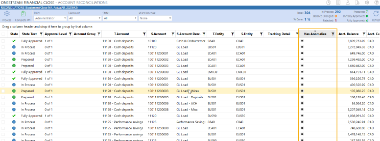

## Account Reconciliations

### Task Activity

You can monitor the Anomaly Detection job in Task Activity. When running anomaly detection

manually on selected reconciliations, the Task Activity displays the number of selected

reconciliations under the Description.

TIP: To optimize system performance, we recommend limiting anomaly detection to a

maximum of 15K-20K reconciliations per run.

Multiple anomaly detection jobs can run simultaneously, provided they run on distinct

reconciliations. When multiple jobs are run on the same reconciliations, you encounter the

following error:

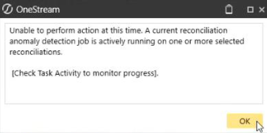

## Account Reconciliations

### Anomalies Tab

The Anomalies tab in the Reconciliation Workspace displays identified anomalies after the

anomaly detection has been initiated (if applicable). It includes the specific rule that triggered

each anomaly and relevant information.

1. Select a reconciliation with an anomaly indicated in the Has Anomalies column

2. Navigate to Reconciliations Grid > Reconciliation Workspace

3. Click the Anomalies button

Columns that display for each anomaly identified during the reconciliation process, when an

anomaly has been detected in the selected reconciliation:

l Data Rule name: Name of rule

l Data Rule Description: Description of rule

l Status: State of the rule that is editable by Preparers and above

o Unresolved (default)

o Reviewed

o Auto-Resolved

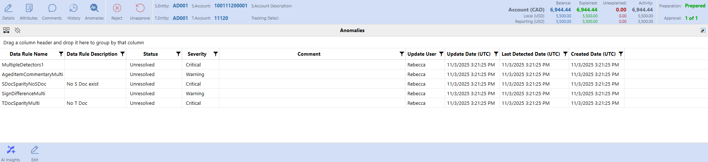

## Account Reconciliations

n Does not display in the drop-down

n Anomalies can be Auto-Resolved when you correct the anomaly and rerun

anomaly detection on the reconciliation.

o Acknowledged

n Does not display in the drop-down

n Unresolved anomalies will be marked as Acknowledged when Anomaly

Resolution Required is disabled and certification is active.

l Severity: Level of seriousness identified

o Info

o Warning

o Critical

l Comment: Preparers and above can add a comment

l Update User: Identifies who ran the Anomaly Detection job, added or updated the

comment, or anomaly status.

l Update Date: Identifies the date and time when the Anomaly Detection job was performed,

or when a comment or anomaly status was added or updated.

l Last Detected Date: Identifies the last time an anomaly was detected

l Created Date: Identifies when the anomaly was created

### Anomaly Summary Grid

The Anomaly Summary Grid provides a detailed overview of various anomalies detected during

your selected period, offering insightful data to help you understand unusual patterns or

deviations within your dataset. Additionally, you can export the data for further in depth analysis,

enabling you to investigate anomalies and take appropriate actions based on your findings.

## Account Reconciliations

### To access the Anomaly Summary Grid:

1. Navigate to the Analysis and Reporting Page

2. Click the Analysis button

3. Select Anomaly Summary

The Anomaly Summary Grid includes the following dropdowns:

l Time

l Role

The Anomaly Summary Grid includes the following columns:

l S.Account

l T.Account

l S.Entity

l T.Entity

l Account Group

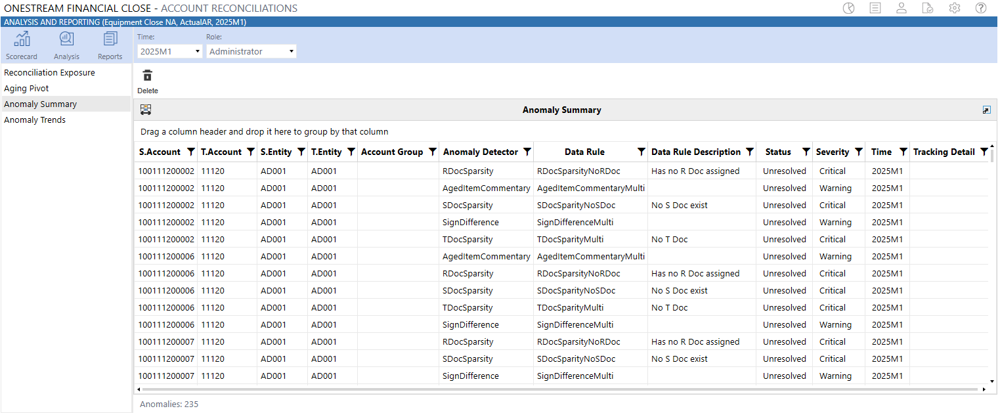

## Account Reconciliations

l Anomaly Detector

l Data Rule

l Data Rule Description

l Status (Of anomaly)

l Severity

l Time

l Tracking Detail

NOTE: Right click on the gird to export your data. You can adjust it according to your

specific requirements.

### Delete Anomalies

OneStream Administrators and Solution Administrators can multi-select rules that were run in the

current time period and delete the anomalies detected with that rule(s). This will remove the

anomaly from any reconciliation no matter what state the reconciliation is currently in. Deleting

anomalies can be helpful when a rule created in the Settings page and executed through

AI Insights produces irrelevant anomalies  for front-end users.

### To delete an anomaly:

1. Navigate to the Analysis and Reporting page

2. Click the Analysis button

3. Select Anomaly Summary

4. Click the Delete button

## Account Reconciliations

5. From the dialog box, click the drop-down to select Data Rules detected in the current period

to delete.

6. Click Delete in the Delete Confirmation dialog box to confirm deletion.

NOTE: The Anomaly Rules drop-down default is All.

### Anomaly Trends

Anomaly Trends provides a view of the anomalies over time periods. You can filter the information

by Data Rule, Status (of the anomaly), Severity, and S.Entity. When you click a bar or dot in the

graphs, the grid below will filter down to display the information.

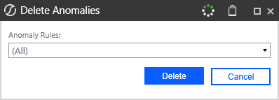

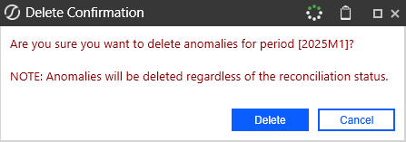

## Account Reconciliations

### To configure Anomaly Trends:

1. Navigate to the Analysis and Reporting page

2. Click the Analysis button

3. Select Anomaly Trends

### Drop-downs in Anomaly Trends include:

l Time: Defaults to the current workflow period you are in

l Periods: The number of periods you want to look back from the time selected in the Time

field

l Role: The role you want to view as

The Anomaly Trends page is setup using a BI Viewer Component:

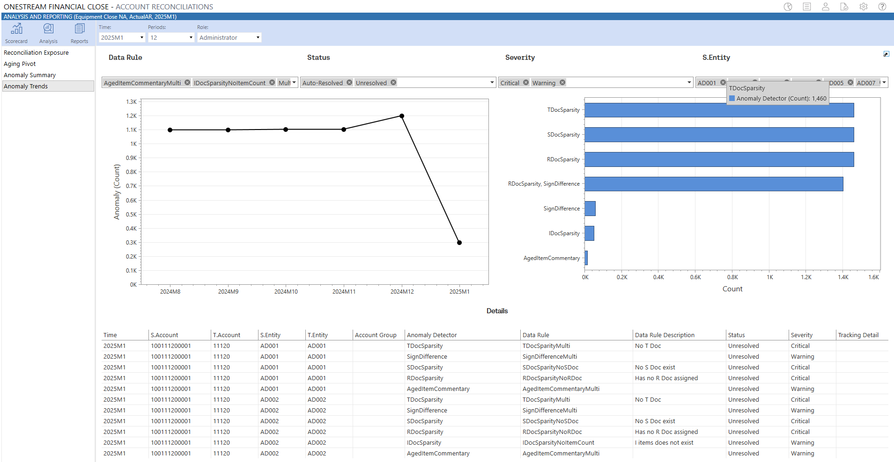

## Account Reconciliations

l BI Viewer Filters: You can filter  Data Rule, Status, Severity and S.Entity. Within these

filters you can multi-select and the line chart, bar chart, and grid will reflect the filters set.

l Anomaly Count Line Graph: Displays the count of the anomalies based on the filters

selected above (Time, Periods, Role, Data Rule, Severity, Status, S.Entity)

l Anomaly Detector Bar Chart: Displays the count of the anomaly detectors based on the

filters selected above (Time, Periods, Role, Data Rule, Severity, Status, S.Entity)

l Details: The fields within the grid are the same as in the Anomaly Summary tab. The data

will update based on the filters selected above (Time, Periods, Role, Data Rule, Severity,

Status, S.Entity). The data will also be filtered down further if you click within a specific point

or bar within the line or bar chart.

o Time

o S.Account

o T.Account

o S.Entity

o T.Entity

o Account Group

o Anomaly Detector

o Data Rule

o Data Rule Description

o Status (Of Anomaly)

o Severity

o Tracking Detail

## Account Reconciliations

### Multi-Currency Calculation Examples

The Account Reconciliations solution performs translation calculations automatically within the

system. The examples in the following demonstrate how the calculations are performed.

### Data Loaded into Stage

Account Reconciliations requires that at a minimum, Local balances are loaded into Stage. If

Account and/or Reporting balances are not loaded, OneStream will automatically translate the

Local balances to the respective levels using the FX Rate Type selected within Global Options.

1. Load FX Rates for the current reconciling period using the FX Rate Type that was selected

within the Account Reconciliation Global Options. For this example, the rates being

used are as follows:

Note that the rates in the upper right, which are shown in grey, are included for clarification

purposes only. OneStream calculates inverse rates.

2. Load Trial Balance data into Stage. Note that balances may be loaded at different levels,

for different Source Accounts. The one exception being that Local balances must always be

loaded.

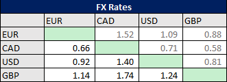

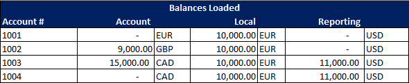

## Account Reconciliations

3. OneStream will automatically translate the Account and Reporting level balances for

Source Accounts loaded that do not load these level balances. Balances that are loaded,

will hold and supersede any further translation.

a. 10,000 EUR * 1.00 = 10,000 EUR

b. 10,000 GPB * 1.09 = 10,900 CAD

c. 10,000 EUR * 1.52 = 15,200 CAD

d. Note that the loaded balances remain and that variances exist between translated values,

even when the currency types are the same.

### Multi-currency Account Groups

For the Source Accounts that were loaded, assume a single Account Group is desired to reconcile

all cash balances in one reconciliation. First, the Account Group is created, and the Account and

Local currency types are selected as part of that creation. For this example, The Account Group

Account currency is CAD and the Account Group Local currency is GBP.

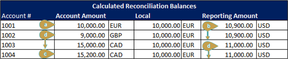

## Account Reconciliations

1. Using the same FX rates listed above, OneStream will automatically translate the Child (i.e.

Source) currency balances to the Group currency balances.

2. The translated balances are then aggregated for each currency level and are the

reconciling balances for the Account Group.

a. 10,000 EUR * 1.52 = 15,200 CAD**

b.  9,000 GBP * 1.74 = 15,660 CAD

c. 15,000 CAD * 1.00 = 15,000 CAD

d. 15,200 CAD * 1.00 = 15,200 CAD

e. 10,000 EUR * 0.88 = 8,800 GBP**

f. 10,900 USD * 1.00 = 10,900 USD

g. 11,000 USD * 1.00 = 11,000 USD

**These examples reflect the use of OneStream calculated inverse rates and is for clarification

purposes only.

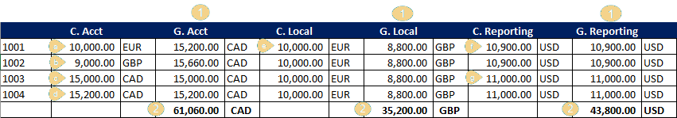

## Transaction Matching

## Transaction Matching

### See these topics:

l Settings

l Administration

l Matches

l Transactions

l Scorecard

l Analysis

l Data Splitting

l Prepare External Files

## Settings

The Settings page contains the Global Options sub-page in which key properties

that guide administration are set as well as User Preferences, Access, Match Sets,

and Uninstall sub-pages.

### Global Options

Global Options contains key properties that guide  Transaction Matching administration and are

used for the initial setup and configuration of Transaction Matching.Global Options is the default

sub-page for Administrators. User Preferences is the default sub-page for Non-Administrators.

## Transaction Matching

NOTE: All global option settings are retained during solution upgrades.

All options display horizontally on the Settings page with the selected sub-page underlined.

## Security Role

Security is governed at the global level. The user group assigned to the Security Role determines

who will be the Transaction Matching Administrators. Users in this group have access to all areas

of Transaction Matching..

See Options.

IMPORTANT: If Data Security is enabled, Transaction Matching Administrators will only

be able to see transactions for which they have access, based on the Data Set Security.

### Assign User Group to Security Role

Click Global Options, select the user group from the drop-down list (the default value is

Administrators), and click Save.

### Data Splitting Workflow Profile

The Data Splitting Workflow Profile is the Base Input Parent created if data splitting is needed.

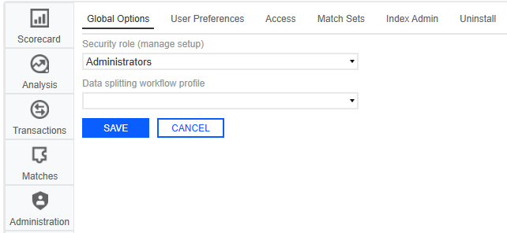

## Transaction Matching

See Data Splitting Setup for complete setup details.

### Assign Data Splitting Workflow Profile

Click Global Options, select the workflow profile from the drop-down list, and click Save.

### User Preferences

All users can set preferences for the Start page and the layout of the data sets on the

Transactions page.

1. On the Settings page, click User Preferences.

2. In the drop-down menus, select the options.

l Start Page: The default option is Transactions . You can change it to Scorecard,

Analysis or Matches .

l Transactions Page Layout: The default option is Horizontal. You can change it to

Vertical.

l Defer Refresh Transaction Page: The default option is Yes. You can change it to

No.

3. Click Save.

4. Click OK.

NOTE: Clicking Cancel will revert unsaved changes to the previously saved selections.

## Access

An Access Group is a list of users and their respective roles that are created by OneStream

Administrators or Transaction Matching Administrators.

## Transaction Matching

Access Groups can be set up to support the concept of backup resources for a role when the

designated user cannot perform the duties. It can contain many users for each Role. For instance,

an Access Group may contain more than one User for the Role of Preparer. By adding more than

one User per Role in this way, the main person’s backup is already granted access.

Another way that backups are built in is by allowing a person in a superior role to act in place of a

person in a lessor role for a given period. For instance, if a user in a Preparer Role is on vacation,

an Approver can act as a Preparer, but someone else must approve the match due to

## Segregation of Duties.

NOTE: Access Groups are used only by the Transaction Matching solution and are

different than User Groups used in other parts of OneStream.

See Segregation of Duties.

## Role

### Duties

### Viewer

### Read-only access to:

l View transactions

l View matches

l View scorecard

l View notes

l View reason codes

### Commenter

### Same as Viewer and:

l Add comments to matches and transactions

## Transaction Matching

## Role

### Duties

### Preparer

### Same as Commenter and:

l Add attachments to matches and transactions

l Create manual matches

l Accept suggested matches

l Process match set rules

l Add and edit notes

l Edit reason codes

### Approver

### Same as Preparer and:

l Approve and unapprove suggested and manual

matches

## Transaction Matching

## Role

### Duties

### Local Admin

### Same as Approver and:

l Access Administration

o Create and manage rules

o Create and edit data sets and data set fields

o Create and edit rule sets

o Create and edit reason codes

o Add, remove, and edit user access to match

sets

o Delete transactions

o Remove deleted transactions

### Add Access Group

1. On the Settings page, click Access.

2. In the Access Groups pane, click Insert Row and then click in the fields to add a Name

and Description for the group. It is recommended to use a common naming convention

since there could be many of these. Whatever standard is set by your project team, it is

recommended to document the naming conventions so that it can be followed by all

administrators.

## Transaction Matching

3. Click Save.

### Add Members to Access Group

1. On the Settings page, click Access.

2. Click the name of the Access Group you want to modify. The name must be unique and is

limited to 200 characters. Once selected, the Members pane will display.

3. In the Members pane, click Insert Row.

4. Click the User cell and select a name from the drop-down list. You can only add a user to an

Access Group once for each Role.

5. When a new row is inserted, the Role defaults to Preparer. Change this setting by clicking

the Role cell and select the new role from the drop-down list.

6. Click Save.

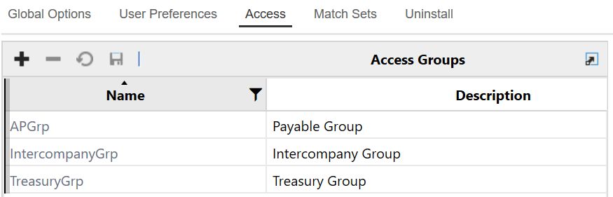

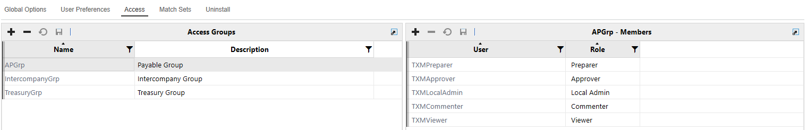

## Transaction Matching

### Match Sets

The Match Sets list displays all match sets and their respective Access Group, identified by a

Workflow Profile and Scenario.

### Create Match Set

1. On the Settings page, click Match Sets.

2. Click Insert Row.

l Double-click the Workflow Profile cell and select a Workflow Profile.

l Double-click the Scenario cell and select a Scenario.

l Double-click the Type cell and select the number of data sets for this Match Set.

l Double-click the Access Group cell and select an Access Group to assign to the Match

Set.

l Double-click the Archive Retention Days cell and enter the number of Archive Retention

Days, -1 or greater. Default is -1, meaning no archiving is happening.

l Double-click the Purge Retention Days cell and enter the number of Purge Retention

Days, -1 or greater. Default is -1, meaning no purging is happening.

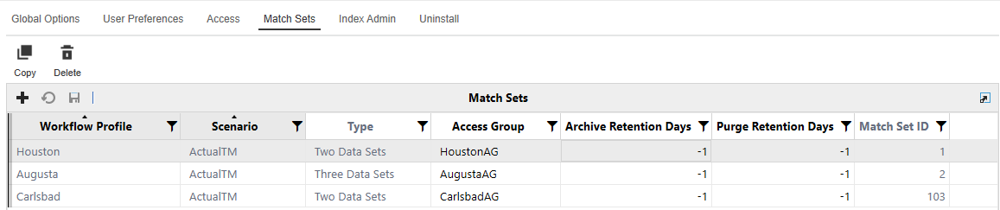

## Transaction Matching

l Do not make any changes to the Match Set ID. Any text entered is reverted to a system

generated GUID.

3. Click Save.

NOTE: Match Sets must contain unique Workflow Profiles and Scenarios.

Copy Match Set to New or Same Scenario

1. On the Settings page, click Match Sets.

2. Select the Match Set you want to copy.

3. Click Copy.

4. In the Copy Match Set dialog box, select the scenario you want to use from the drop-down

list and click Copy.

IMPORTANT: When copying a Match Set in the same scenario, it is recommended that

all data set fields match.

### Delete Match Set

1. On the Settings page, click Match Sets.

2. Select the Match Set you want to delete.

3. Click Delete.

4. Click OK.

IMPORTANT: Only Match Sets without transactions or matches can be deleted.

## Transaction Matching

### Archive Retention Days

This indicates that any matched transaction dated  earlier than the Archive Retention (Days),

calculated from today’s date, will be archived. For example, if Days is set to 180  and today is

September 1, 2025 then, transactions with matched dates  earlier than 3/5/2025 (180 days earlier)

are archived.

IMPORTANT: This can only be updated in the Match Sets page but is also displayed in

the Data Retention page.

### Purge Retention Days

This indicates that any matched transaction dated  earlier than the Purge Retention (Days),

calculated from today’s date, will be purged. For example, if Days is set to 180  and today is

September 1, 2025 then, transactions with matched dates  earlier than 3/5/2025 (180 days earlier)

are purged.

IMPORTANT: This can only be updated in the Match Sets page but is also displayed in

the Data Retention page.

### Index Admin

The Index Admin page is accessible to Administrators and displays helpful information in tables

and indexes.

Indexes in SQL are specialized data structures that improve the speed of data retrieval operations

on a database table enabling you to achieve optimal performance when filtering within the

Transactions or Matches grid since they reduce the time required to locate data. This is especially

beneficial as volume of transactions continue to grow.

## Transaction Matching

NOTE:  The recommendations provided for indexing comes from Microsoft SQL

industry standards and is not a recommendation of OneStream. This page is intended to

easily surface this information so that Administrators can  update indexes, and do not

have to reach out to Support or wait for specific maintenance windows to make index

changes.

1. Tables:

a. All tables under the TXM schema are listed here. This includes the transactions table,

transactions attributes table, and individual transaction attributes tables.

b. This section also includes Row Count, Compression Type, and Storage Usage (GB).

c.  No actions allowed within the table section, this is purely informational.

2. Indexes:

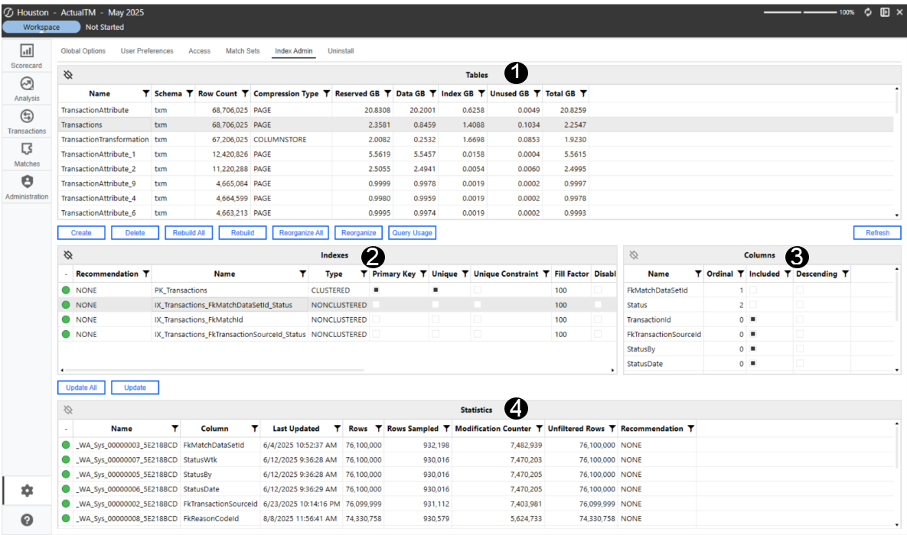

## Transaction Matching

a. Provides insight into the indexes for a specific table. This includes Name, Primary

Key, Unique, Fill Factor, Fragmentation, and more.

b. Displays usage information on how many times it was used in an Index Scan or Index

Seek. This information is read from SQL and resets each time the SQL Service

restarts.

c. Displays a recommendation on whether the index should be reorganized or rebuilt

based on fragmentation (based on SQL recommendations). When an index is

created that is not useful, the Query Optimizer will ignore it.

d. Actions are located above the Indexes section:

l Create: Administrators can create their own index from scratch.

l Delete: Administrators can delete the selected index.

l Rebuild: Will drop and recreate the index. This removes fragmentation and

updates the structure completely and is suggested when fragmentation is

greater than 30%.

l Rebuild All: Will rebuild all the indexes in the associated table.

l Reorganize: Is a  lightweight operation that defragments the index without

dropping and recreating. Reorganizing is suggested when fragmentation is

between 5-30%.

l Reorganize All: Will reorganize all the indexes in the associated table.

l Query Usage

3. Columns:

## Transaction Matching

a.  Displays the columns that make up an index as well as the included data columns.

l Ordinal : Shows which fields are being indexed. A “0” indicates the field is not

being indexed on. An integer will indicate that the field is being indexed on.

l Included: Indicates fields that are included for easy reference, but NOT

indexed on.

4. Statistics:

a. These statistics are created by SQL and used by the Query Optimizer to help

determine the recommendations.

b. This includes information like Rows, Rows Sampled, Modified Counter, and

Unfiltered Rows.

c. Actions are located above the Statistics section:

l Update: Updates just the selected statistic.

l Update All: Updates all statistics for the selected table.

## Uninstall

The Uninstall feature allows you to uninstall the user interface or the entire solution. If performed

as part of an upgrade, any modifications that were made to standard solution objects are

removed.

IMPORTANT: The Uninstall option uninstalls all solutions integrated in OneStream

Financial Close.

### The uninstall options are:

## Transaction Matching

1. Uninstall UI - OneStream Financial Close removes all solutions integrated into

OneStream Financial Close, including related dashboards and business rules but leaves

the databases and related tables.

IMPORTANT: This procedure resets the Workspace Dashboard Name to (Unassigned).

An Administrator must manually reassign the Workspace Dashboard Name after

performing an Uninstall UI.

2. Uninstall Full - OneStream Financial Close removes all the related data tables, data,

dashboards, and business rules from all solutions integrated into OneStream Financial

Close. Select this option to completely remove the solutions or to perform an upgrade that

is so significant in its changes to the data tables that this method is required.

CAUTION: Uninstall procedures are irreversible.

### Load Transaction Data

After Transaction Matching is set up, one of the first steps is to create the data set. In order to do

this, the data source must be identified.

Data loading leverages the OneStream Data Integration Functionality (Flat File or Direct Connect)

into Stage. During import, the data transfers into Stage and then to the linked Match Set Data Set;

assigning it a transaction number.

You can leverage a single file with all transactions and then split the data in Transaction Matching

to the applicable Match Set Data Sets. Organizations can also import multiple data source formats

(i.e. disparate GLs) and stack the transactions in a single Data Set creating a single source. Data

can be imported Daily, Weekly, Monthly, etc.

## Transaction Matching

Once the base input import is set up, data can be loaded to it before it is assigned to a transaction

matching data set. This occurs only in stage and will not be copied into Transaction Matching until

it is linked to a data set. In order to reduce the volume of data maintained in OneStream, once

data is loaded into the Transaction Matching tables it is cleared from Stage.

If the date field in your data source is active but contains a null or blank value, or if certain date

formats are incompatible with InvariantCulture during the transaction import, the import process

will fail. You will receive an error message specifying the unsupported column and value.

However, you can use a Complex Expression to correctly convert date formats or set a default

date for blank values.

This example is provided in case the source data cannot be altered. This will convert the date into

syntax suitable for the transaction matching conversion:

TIP: The first row of data imported will remain in Stage in order to identify the sources

imported into Transaction Matching.

See Integration in the Design and Reference Guide.

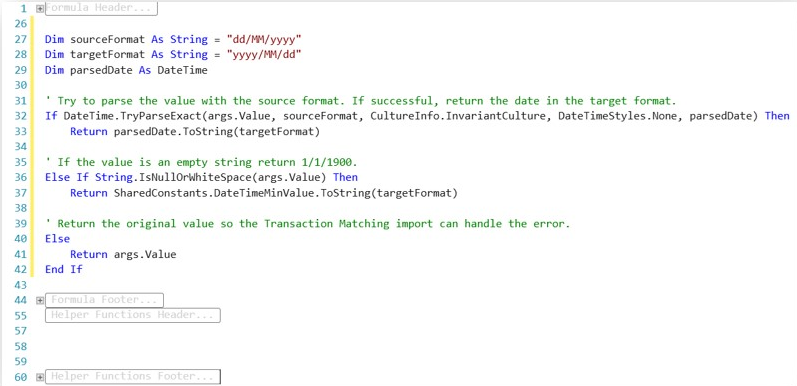

## Transaction Matching

### Administration

Administration contains the Rules, Data Sets, Options, Reason Codes,

and Access.

Administration contains the areas a user requires to manage the match sets by implementing and

refining the settings in order to automate as much of the matching activities as possible.

Administration is only accessible to Transaction Matching Administrators and Match Set Local

Administrators.

### Rules

The  Rules page displays rules created for the current match set and provides the

ability to create new ones.

Rules contains the logic that data runs through to determine rules-based matches. There is no

limit to the number of rules that can be created. The Rules list displays the following information

for each Rule:

l Name: Freeform text field to give rule a short name

l Description: Optional freeform text field containing additional rule information

l Rule Type:Drop-down list containing the rule types

l Match Type: Drop-down list containing the match types

l Reason Code: Field displaying the information established during reason code setup

l Active: Indicates if the rule should be run during Rule processing (on/off toggle)

l Order:The order in which the rules are run

## Transaction Matching

l Update By: The user who last updated the rule.

l Update Date (UTC): The time the rule was last updated.

### See also:

l Rule Types

l Match Types

l Reason Codes

### Create Rule

1. On the Administration page, click Rules.

2. Click Insert Row and then double-click in the following cells to enter information:

l Name: Enter a display name to identify the rule

l Rule Type: Select the Rule Type you want to use from the drop-down list. For One

Sided match see Create a One-sided Match.

l Match Type: Select the Match Type from the drop-down list

l Description: Enter additional information you want to display regarding the rule

l Reason Code: Select the appropriate reason code from the drop-down list

3. Click the Active box to turn it on/off.

4. In the Order cell, enter the number indicating which order you want the rule run.

5. Click Save. The Rules Definition pane will appear upon successful save.

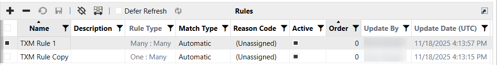

## Transaction Matching

### Create a One-sided Match

After you create the rule on the Rules tab, continue with these steps to create a one-sided match.

If you selected One Sided – DS1 then on the Grouping tab you will see fields only for Data Set 1,

and Data Set 2 and Data Set 3 are blank. If you want to match transactions that cancel or reverse

each other out, you can group by common fields such as Source Account, Source Entity and PO

Date, as shown below.

NOTE: Selections will display if a date field is assigned to the data set.

On the Definition tab, you can only set a tolerance amount for value fields (amount). In this

example, the tolerance is set between -1 and 1.

## Transaction Matching

With the criteria in the Grouping and Definition tabs set as above, the match rule creates matches

where transactions have the same amount, entity, and cost center and the net of the transactions

is less than or equal to 1 and greater than or equal to -1.

In this example, the two highlighted amounts would create a match.

### Rule Types

The following Rule Types are available for two data set matches:

l One to One (1:1): An exact match in which a transaction in one data set is compared to a

single transaction in the other

l One to Many (1:M): A single transaction in one data set can be matched with one or more

transactions (a grouping) in another

l Many to One (M:1): One or more transactions (a grouping) in one data set are condensed

into one transaction and then compared to a single transaction in another

