# Transaction Matching Administration

## Transaction Matching

l Many to Many (M:M): One or more transactions (a grouping) in one data set are collapsed

into a single amount and then compared to the same in another

l One Sided - DS1, One Sided - DS2, One Sided - DS3: Match transactions within the

same data set

Additionally, the following Rule Types are available for three data set matches:

l One to One to One (1:1:1)

l One to One to Many (1:1:M)

l One to Many to One (1:M:1)

l Many to One to One (M:1:1)

l One to Many to Many (1:M:M)

l Many to Many to One (M:M:1)

l Many to One to Many (M:1:M)

l Many to Many to Many (M:M:M)

### Match Types

l Automatic matches do not require acceptance or approval.

l Suggested matches require acceptance and may also require approval.

### Standard Rule Filters

Filters define the criteria for returning unmatched transactions.

You can create or edit filters for any rule by clicking Filters and applying them to any data set.

Only the unmatched transactions returned by the filter are used during rule processing.

## Transaction Matching

l Field Name: Drop-down list containing all fields in the data set. Select the field to which you

want the filter to be applied.

l Operator: Function used to combine items or determine the parameters in order to create a

filter

l Value: Information used by the operator

### Operator

### Definition

=
Is equal to the value specified (exact match). To return fields that are

blank, leave Value blank.

>
Is greater than the value specified.

> =
Is greater than or equal to the value specified.

<
Is less than the value specified.

< =
Is less than or equal to the value specified.

< >
Is not equal to the value specified. To return fields that are not blank, leave

Value blank.

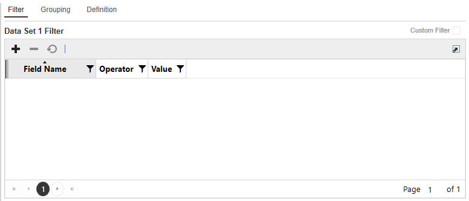

## Transaction Matching

### Operator

### Definition

### In 1;2;3 or 'A';

Displays values that are the same as what is specified.

'B'; 'C'

### Between 1;2 or

Displays values that fall between the first and second values (including the

'A'; 'Z'

listed values).

### Starts With

Displays results where the data in the column starts with the value in the

filter.

### Does Not Start

Displays results where the data in the column starts with anything except

### With

the value in the filter.

### Ends With

Displays results where the data in the column ends with the value in the

filter.

### Does Not End

Displays results where the data in the column ends with anything except

### With

the value in the filter.

### Contains

Displays only records where the data in the column contains all the values

in the filter.

### Does Not

Displays only records where the data in the column does not contain any

### Contain

of the values in the filter.

NOTE: Syntax of the filter is validated when you click Save.

## Transaction Matching

### Custom Rule Filters

In addition to the standard rule filters, administrators can create custom rule filters that use

## complex expressions.

CAUTION: Only advanced users should create custom rule filters.

Use custom rule filters to create filters more quickly and efficiently and reduce the need to

duplicate filters with slight variations within the standard filter, which can be time consuming and

also prone to error.

Administrators can set up standard and custom rule types for a data set. Whichever filter is

selected is the one that is applied.

1. Select Custom Filter.

2. Enter a custom rule and then click Save. The rule syntax is validated when you save.

### Rule Grouping

Grouping displays in the Rule Definition pane when you select a Many rule type.

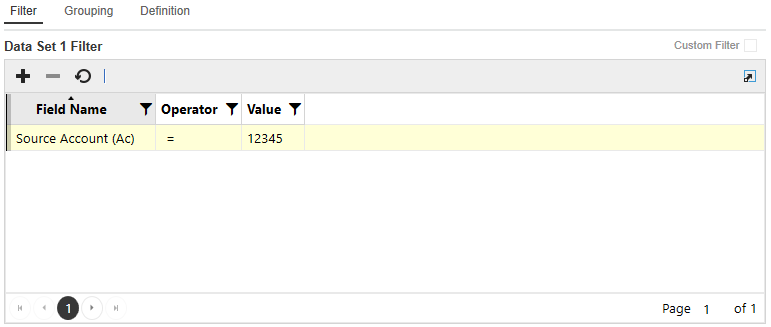

## Transaction Matching

When you select a Many rule type, the Grouping tab displays, providing the ability to specify how

to aggregate (group) the data. Once the grouping is defined, the items in the group become the

only items available in the Definition Field Name list for selection, in addition to the Summary

fields.

For each data set, you can group data by attributes  and apply date tolerances. Applying date

tolerances in the Grouping tab creates a match rule that applies the date tolerances before

grouping as opposed to after grouping. You can set up date tolerances to be applied after

grouping in the Definition tab.

For a detailed example of how to use date tolerances, see Appendix A: Date Grouping Tolerances

.

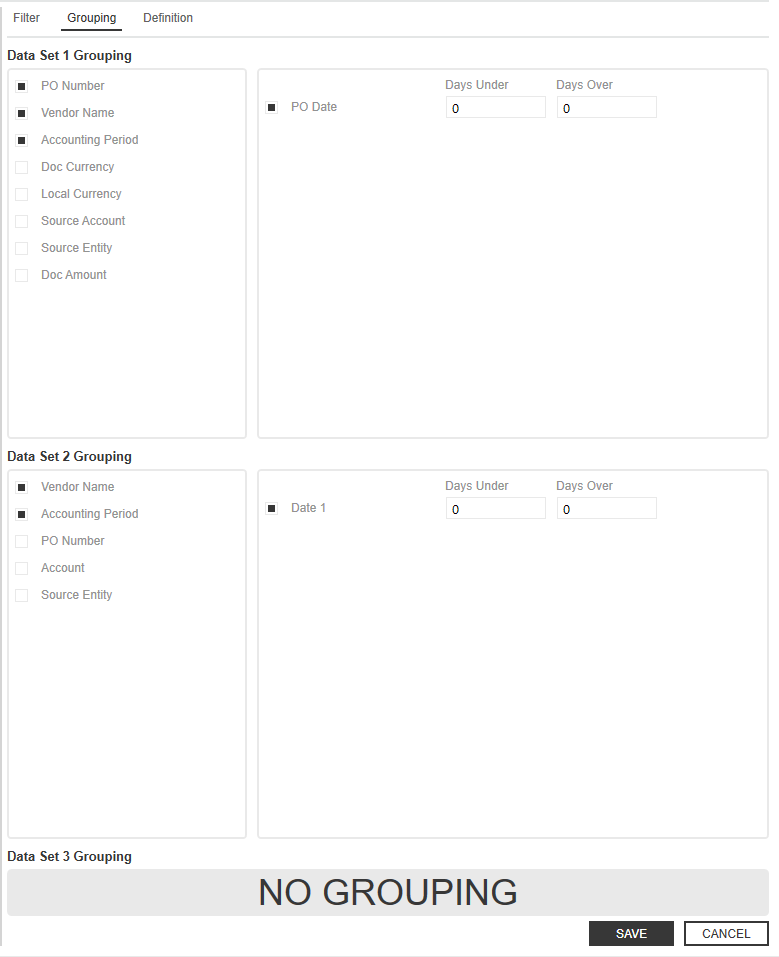

## Transaction Matching

### Add Rule Grouping for Attributes

1. On the Administration page, click Rules and then select a Many : One or Many to Many

rule type.

2. Click Grouping.

3. In the Attributes  pane, click attributes to group by.

4. Click Save.

### Add Date Grouping Tolerances

For a detailed example of how to use date tolerances, see Appendix A: Date Grouping

Tolerances.

1. On the Administration page, click Rules and then select any rule type that uses Many or

One Sided for one of the data sets.

2. Click Grouping.

3. In the Dates pane, click a dates box to group by.

4. When a date field is selected, set the date tolerances. Date tolerances applied in the

Grouping tab are applied pre-aggregation. Date tolerances applied post-aggregation are

done in the Definition tab. For example, if set to 1 day before and 1 day after, before

summing up the total amount based on the common attributes, there would be a date

tolerance of 1 day before and after applied.

5. Click Save.

### Rule Definition

Definition displays detailed information about a selected rule.

The Rule Definition contains the data set field names, conditions, and tolerances for each rule.

## Transaction Matching

If no matches exist, lines can be added or deleted to the Attributes, Dates and Values table

editors.

NOTE: When a field is added under Definition, the field is automatically added to

Grouping.

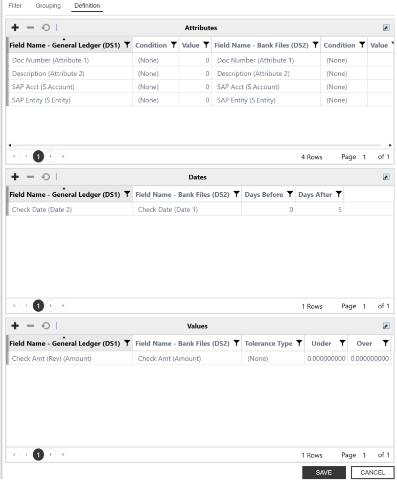

## Transaction Matching

### Attributes

l Field Name (DS1): Drop-down list containing all fields in the first data set (DS1). Select the

field on which to perform the match. Each selected field must have a corresponding field in

all other data sets.

o Condition: Indicates the placement (None, Left, Right) set for DS1; this is particularly

useful if there will be leading or trailing zeroes in one data set that may not exist in the

other data sets. Rule conditions help guide the position the rule should be applied to

for a certain data element. The position can start at the beginning of a string (left) or

the end of a string (right). The Rule definitions have Conditions and Value fields for

each data set.

o Value: Integer field

l Field Name (DS2): Drop-down list containing all fields in the second data set (DS2). Select

the field on which to perform the match. Each selected field must have a corresponding field

in all other data sets.

o Condition: Indicates the placement (None, Left, Right) set for DS2

o Value: Integer field

### Values

l Tolerance Type: Tolerances can be set on amount (Numeric dollar amount or Percentage)

or date fields (Numeric only)

l Under: Default minimum is 0 (Example: 5.00)

l Over: Default maximum is 0(Example: 5.00)

### Rule Tolerances

Tolerances can be set on amount (numeric dollar amount or percentage) or date fields (numeric

only) to allow some variation when creating a match.

## Transaction Matching

Date variations provide allowances for circumstances such as transit times when a transaction

may arrive at a customer’s ERP system and a bank/3rd party source on different dates.

### Tolerance Example

If the amount tolerance equals plus or minus $5 and the data in DS1 = 100, the rule will search for

an amount in the corresponding DS2 for a range of $95-105.

### Copy Rules

Administrators can copy match rules on the Rules sub-page by selecting a rule and clicking the

Copy button. In the Copy Match Rule dialog box, the Rule Type field is editable for all rule types

except One-Sided. This enables you to change the rule type during the copy process.

When changing rule types, the system automatically handles grouping fields as needed. For

instance, if a rule is copied from a One-to-One to a One-to-Many configuration, grouping fields will

be added based on the attributes used in the original rule.

If copying from a Many-type rule to a One-type rule, grouping fields will be removed. For One-

Sided rules, the Rule Type field remains locked and cannot be changed during copy.

1. Select a Rule.

2. Click the Copy button.

3. In the Copy Match Rule dialog box:

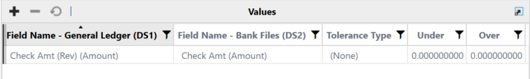

## Transaction Matching

a. Enter a Name.

b. From the Rule-Type drop-down menu, select a rule type.

c. From the Match Type drop-down menu, select a match type.

d. From the Reason Code drop-down menu, select a code.

4. Click the Copy button.

### Rule Instancing

Administrators can edit match rules on the Rules page even after those rules have been used in a

match. When a rule is edited post-use, it is created using a new instance of the rule and preserves

the original version for audit and reporting purposes. This enables you to maintain and refine your

matching logic without impacting historical match results.

All validations applied during rule creation are enforced during editing. If a validation fails, an error

message displays and the rule is not saved until resolved. All rule logic and conditions are

managed under the Definition tab.

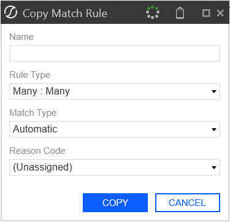

## Transaction Matching

The system ensures that the DateTime when a rule is retrieved for processing aligns with the

DateTime stored on the match, supporting accurate audit trails.

NOTE: Delete is still invalid if the rule has been used to create matches. Only edits are

allowed. Editing a rule after it has been used in a match does not affect historical

matches. The new rule instance applies only to matches processed after the edit.

To edit a rule after it has been used in a match:

1. On the Rules page, select a rule.

2. Make your updates in the Filter, Grouping, or Definition tabs as needed.

3. Click the Save button.

### Rules Tab

When viewing a match in Transaction Matching, you can access a dedicated Rule tab. This tab

displays the exact version of the rule that was used to create the selected match, providing

transparency into the logic and configuration applied at the time the match was made.

The Rules tab presents the Rules table and associated tabs, such as Filter, Grouping, and

Criteria, populated with the values and configurations that were in effect when the match

occurred. You can review the specific rule logic, filters, and grouping fields that determined the

match outcome, exactly as they were at the time of matching. This design helps users and

auditors understand the reasoning behind each match by showing the rule version and its

configuration at the time of matching. This ensures that any investigation or review can always

reference the correct logic, regardless of later changes.

This view is read-only and reflects the historical state of the rule for that match. Any edits to the

rule are versioned and do not change the information shown for existing matches. This supports

auditability, troubleshooting, and user understanding by making it clear which rule logic was

applied to each match, even as rules evolve over time.

## Transaction Matching

### Extract and Load

Administrators can extract and import rules across applications to streamline testing in

development environments and simplify deployment to production.

Within the Rules tab, you can use the Load and Extract buttons. Multi-select functionality

enables you to choose one or more rules for extraction. When selected, the Extract option

downloads a .json file containing the selected rules in a structured format. This file can then be

loaded using the Load button, which recreates the rules in Transaction Matching. During load,

validations ensure rule integrity: rules with duplicate names cannot be loaded, fields must exist in

the target Data Set, and all dates and numbers must conform to invariant culture formatting.

IMPORTANT: Extract and Load is intended solely for migrating rules between

environments and should not be used for editing, since extracted files are not editable or

meant for load after modification.

### Extract

1. On the Administration page, click the Rules tab.

2. From the Match RulesGrid, select the rule want to extract.

3. Click the Extract button.

4. Open and view the file.

### Load

1. On the Administration page, click the Rules tab.

2. Click the Load button.

3. View the newly loaded rules on the Match Rules grid.

## Transaction Matching

### Data Sets

The Data Sets page displays the available data sets for the current match set and

provides the ability to create new sets.

A Data Set is the transactional data used for matching. A data set may contain one or many data

sources. Each data set may contain the following fields:

### Field

### Description

### Name

The name of the data set.

### Description

The description of the data set.

## Security Type

Security level of the data set (Entity, IC, Entity OR IC, or Entity AND IC)

based on members in the Read and Write Data Group or Read and

Write Data Group 2 in the Security section of Member Properties on the

OneStream Entity.

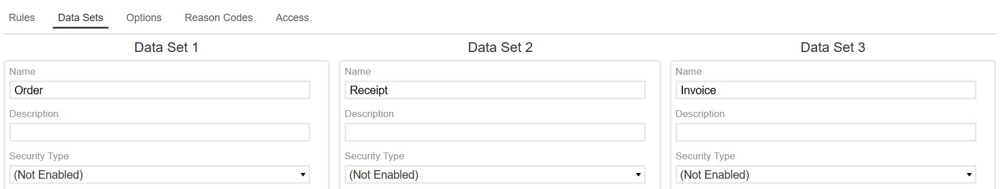

## Transaction Matching

IMPORTANT: Match variances are calculated by comparing all subsequent data sets to

the primary. The first data set is the primary.

### Create a Data Set

1. On the  Administration page, click Data Sets.

2. In each Data Set enter the following information:

l Name: Enter a display name to identify the data set

l Description: Enter additional information you want to display to further identify the data set

l Security Type (Optional): Select the security type you want to assign to the data set from

the drop-down list or leave the default (Not Enabled) to display everything.

3. Click Save.

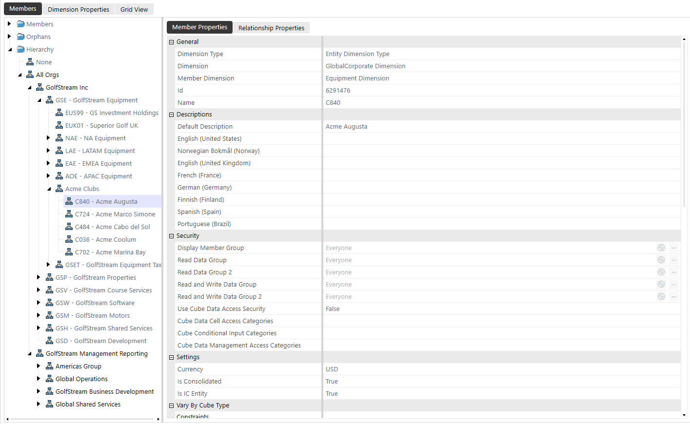

## Transaction Matching

IMPORTANT: Information must be saved on the first data set before creating additional

data sets.

NOTE: Although the Transaction Matching Administrators user group has the access

necessary to manage the solution, if Data Security is enabled, the ability to view

transactions depends on the individual user’s Entity level security. Users are only able to

see transactions for the entities to which they have Read and Write access.

### Import Workflows

1. On the Administration page, click Data Sets.

2.  Navigate to the data set you want to import into.

3. In the <Data Set name>Import Workflowssection  select the checkbox next to the workflow

(s) that you want to import.

4. Click Save.

### Data Set Fields

In addition to Transaction ID, Transaction Number, and Comment/Attachment identification, the

following fields can be added per data set:

l 16 Cube Dimensions: Entity, Account, Scenario, Flow, Time, IC, UD1-8, Label, SourceID,

TextValue, WF Profile, WF Scenario, WF Time, and Status WF Time

l 16 Text Fields: Attribute Fields 1-16

l 4 Date Fields: Attribute Fields 17-20

l 13 Value Fields: Amount and Attribute Value Fields 1-12

Each piece of data contains the following descriptors:

## Transaction Matching

### Field

### Description

### Alias

Freeform text field that describes the friendly name intended to further

identify the data in a field.

### Order

Allows users to see the data/information in a specific order on both Matched

and Transactions pages.

### Editable

Select which fields are editable on the Transactions page directly in the grid.

The following fields cannot be set as editable: SourceID, S.Cons, Cons,

S.Scenario, Scenario, S.Time, Time, S.View, View, S.Origin, Origin, WF

Profile, WF Time, and Status WF Time

NOTE: Even if fields are marked editable, they cannot be edited for

matched transactions.

Amount or Attribute Value fields displayed on transactions and match grid

pages that are used to cross-reference and total up to three value fields to

### Summary 1–

verify that the values are in balance.

NOTE: Summary fields can only be changed before matches exist

in a match set.

### Detail Item

Select which column in Transaction Matching will populate the detail item in

### Map

## Account Reconciliations.

## Transaction Matching

### Field

### Description

### Format

Formats that numerical values display such as dates, amounts, and decimals

throughout the solution, for example:

l N0 will not show any decimals or zeroes.

l N1-N6 shows X number of decimals (N2 shows two decimals, N5

shows five decimals, etc.)

l #,###,0\% displays 10,000% and -10,000%

l #,###,0.00 displays 10,000.00 and -10,000.00

See Application Properties in the Design and Reference Guide for the

complete listing of number formats.

### Add or Remove Data Set Fields

1. On the Administration page, click Data Sets.

2. Click the
button on the data set to add or remove fields.

3. Select or clear fields on the Available Fields box.

4. Click Apply.

### Options

Options contains Match Set Options and Manual Matching Tolerances.

## Transaction Matching

### Match Set Options

The following conditions can be required during the approval process. To activate or deactivate

an option, select or clear the check box and click Save.

l Require Approval (Manual): An Approver must approve every manual match

l Require Approval (Suggested): An Approver must approve every suggested match

l Require Comment: A comment must be entered for every manual match

l Require Attachment: An attachment must be uploaded to every manual match

Require Match Reason Code: A match reason code must be selected

IMPORTANT: If you select Require Comment or Require Attachment on the

Transactions page, the Match Reason Code drop-down menu and Match icon in

the bottom right will not display. In this case, you must click the Match+ icon to

create a manual match, which opens a dialog box for you to add comments and

attach documents.

l Data Security: Select a Cube from the drop-down list to specify the Cube the Entity

## security will reference

l Auto Unsuspend: Unsuspend all suspended transactions that were suspended in any

prior Workflow period, redefining them as Unmatched in the current Workflow period. This

will allow match rules to run against the previously suspended transactions in the current

Workflow period.

NOTE: Anything that is suspended in the current Workflow period will remain

suspended.

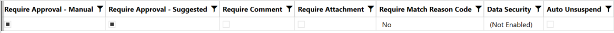

## Transaction Matching

### Manual Matching Tolerances

Because manual matching is a transaction-selecting process, you can select transactions that

have an amount variance range by defining and applying tolerances. A tolerance allows

transactions to be matched when they do not have exact matching values (which would otherwise

trigger human intervention). Defining a tolerance range (upper and lower levels of acceptable

variance) tells the system how far outside of the exact amount it can consider an acceptable

match.

Tolerance Type options are both Numeric or a Percentage of the total (or None) and different

tolerances can be set against each of the Summary fields.

Admin Override grants Administrators the ability to create manual matches even if the variance

is outside the tolerances defined for any of the three Summary fields.

Approver Override grants Approvers the ability to create a manual match even if the variance is

outside the tolerances defined for any of the three Summary fields.

Summary 1, 2, 3 Type options are (None), Numeric, or Percentage (of total).

Summary 1, 2, 3 Min defines the absolute value lower limit in which a difference is automatically

accepted.

Summary 1, 2, 3 Max defines the absolute value upper limit in which a difference is automatically

accepted.

### Reason Codes

Reason Codes contains the Name, Description and Active status.

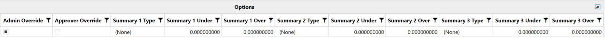

## Transaction Matching

A reason code is a brief explanation or description of the match. Reason codes can be assigned

through match rules or manual matches. They can be used for reporting purposes or to extract

specific pieces of information.

### Add New Reason Code

1. In the Reason Codes tab on the Administration page, click Insert Row.

2. Click the Name cell and enter the name of the Reason Code.

3. Click the Description cell and enter an explanation of the Reason Code (optional but

recommended, limited to 250 characters).

4. Click Save.

### Edit a Reason Code

1. On the Administration page, click Rules.

2. In the Reason Code column for a rule, click in the field to display a drop-down menu.

3. Select the reason code from the drop-down menu.

4. Click Save.

NOTE: Updates to the reason code will  affect future matches and all periods in which

the reason code was used.

### Delete a Reason Code

Users can delete reason codes that are unused.

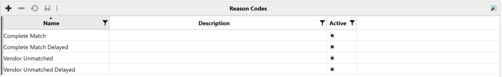

## Transaction Matching

1. In the Reason Codes tab, select an unused reason code and click Delete Row.

NOTE: Reason codes assigned to a rule, match, or transaction are unavailable for

deletion.

## Access

The Access page displays the user name and role for each team member in the

current match set.

The Access page lists the <GroupName> team members who are permitted to work with the

current match set and their role. It is where an existing role can be changed, and additional team

members added. Match Set Administration is only accessible to Transaction Matching

Administrators and Match Set Local Administrators.

### See also: Access

Add User to Match Set Access Group

1. On the Administration page, click Access.

2. In the Members pane, click Insert Row.

3. Click the User cell and select the name from the drop-down list.

4. When a new row is inserted, the Role defaults to Preparer. To change this setting, click the

Role cell and select the role from the drop-down list.

5. Click Save.

## Transaction Matching

Modify User Role to Match Set Access Group

1. On the Administration page, click Access.

2. In the Members pane, click the name you want to modify in the User column.

3. Click the Role cell and select the appropriate role from the drop-down list.

4. Click Save.

Remove User from Match Set Access Group

1. On the  Administration page, click Access.

2. In the Members pane, click the name you want to remove in the User column.

3. Click Delete Rows.

4. Click Save.

### Data Retention

The Data Retention page displays the overview, configuration, and preview

for Archiving and Purging.

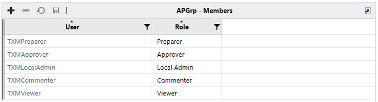

## Transaction Matching

The Data Retention page enables the Transaction Matching Administrator to configure settings

for Archiving and Purging matched transactions and to preview the number of matches and

transactions to be Archived and Purged.

### Archive

Archiving maintains matched transactions in the system and compresses the matched

transactions in the database to minimize storage utilization. Matches are moved from the existing

live tables such as, Transactions and TransactionsAttribute Tables, into a new archived table.

Archived Matched Transactions will display where they have been used in Account

Reconciliations as reconciliation detail items. Transaction details can still be drilled into.

NOTE: Archived matched transactions are accessible in Account Reconciliations where

they are used as detail item support.

IMPORTANT: Archiving data cannot be undone once it has been processed.

### Purge

Purging permanently deletes the matched transactions from OneStream.

Purged Matched Transactions will display where they have been used in Account Reconciliations

as reconciliation detail items. However, you CANNOT drill into the transaction details anymore.

IMPORTANT: Purging data cannot be undone once it has been processed.

## Transaction Matching

### Archive Setup

1. Overview

a. Earliest Unarchived Match Date: This date displays the oldest matched

transactions that are currently in Transaction Matching and not yet archived.

b. Earliest Archived Match Date: This date references the archived matched

transactions and displays the oldest.

2. Archive Configuration

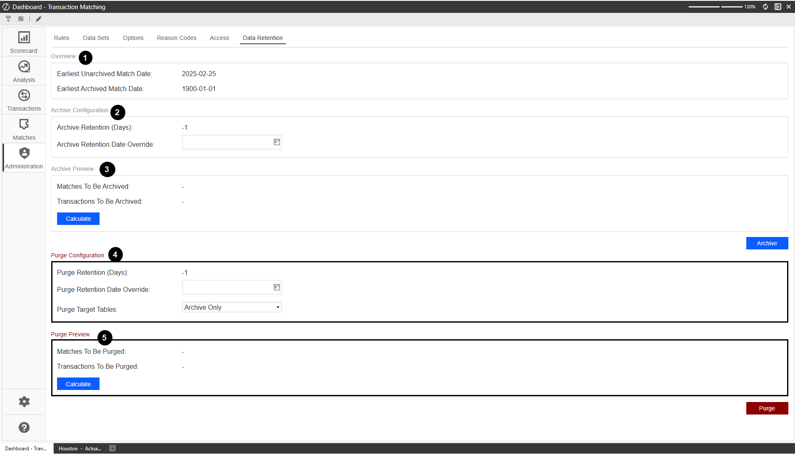

## Transaction Matching

a. Archive Retention (Days): This indicates that any matched transaction dated

earlier than the Archive Retention (Days), (calculated from today’s date) will be

archived. For example, if Days is set to 180  and today is September 1, 2025 then,

transactions with matched dates  earlier than 3/5/2025 (180 days earlier) will be

archived.

i. The Archive Retention (Days) displays from the settings in the Match Set page.

The value is read-only but can be modified in Match Sets.

ii. The Archive Retention (Days) enables you to enter a numeric value greater

than -1. The default value  is -1, meaning nothing is being purged.

b. Archive Retention Date Override:  When  set, it  overrides  the Archive Retention

(Days) and archives anything earlier than the day entered. For example, if  the date

1/1/2025 is selected from the date picker than the Archived Retention (Days) is

ignored and any matches with a matched date prior to 1/1/2025 are archived.

i. You can set the Archive Retention Date Override by selecting a date from the

calendar picker.

ii. By default the Archive Retention Date Override is blank and will look to the

Archive Retention (Days) set.

3. Archive Preview

a. Matches To Be Archived: Displays the number of matches to be archived based on

the Archive Configuration.

b. Transactions To Be Archived: Displays the number of transactions across all

matches to be archived based on the Archive Configuration.

c. Calculate: The Admin clicks the calculate button to preview the number of Matches

and Transactions to be archived.

## Transaction Matching

d. Archive:  Processes the matched transactions based on the configuration settings to

the archived table. A dialog box displays to confirm the archive.

### Purge Setup

CAUTION: Purging matched transactions deletes all the associated transactions

and support permanently. Check your configuration settings before proceeding as

this action cannot be undone.

4. Purge Configuration

a. Purge Retention (Days): This indicates that any matched transaction dated  earlier

than the Purge Retention (Days),  (calculated from today’s date) will be purged. For

example, if Days is set to 180  and today is September 1, 2025 then, transactions with

matched dates  earlier than 3/5/2025 (180 days earlier) will be purged.

i. The Purge Retention (Days) displays from the settings in the Match Set page.

The value is read-only but can be modified in Match Sets.

ii. The Purge Retention (Days) enables you to enter a numeric value greater than

-1. The default value  is -1, meaning nothing is being purged.

b. Purge Retention Date Override:  When  set, it  overrides  the Purge Retention (Days)

and archives anything earlier than the day entered. For example, if  the date 1/1/2025

is selected from the date picker than the Purge Retention (Days) is ignored and any

matches with a matched date prior to 1/1/2025 are purged.

i. You can set the Purge Retention Date Override by selecting a date from the

calendar picker.

ii. By default the Purge Retention Date Override is blank and looks to the Purge

Retention (Days) set.

## Transaction Matching

c. Purge Target Tables:  Enables you to choose if the purged matches come from the

Archived Only, Live Tables or both.

i. Purge Target Table default is set to Archive Only.

5. Purge Preview

a. Matches To Be Purged: Displays the number of matches to be purged based on the

Purge Configuration.

b. Transactions To Be Purged: Displays the number of transactions across all

matches to be purged based on the Purged Configuration.

c. Calculate: The Admin clicks the calculate button to preview the number of Matches

and Transactions to be purged.

d. Purge:  Deletes all matched transactions per the Purge Configuration. A warning

message displays before proceeding.

### Task Scheduler

You can  configure archiving and purging to run on a schedule using Task Scheduler. Set the

ProcessArchive or ProcessPurge job. The scheduled job will look to the relevant settings at the

time for archiving or purging, set up within the Match Sets and Data Retention pages. The

PurgeProcess within  Task Scheduler automatically looks to the archived tables. The

Administrator can set the live tables or Both by adding the parameter PurgeTargetType.

## Transaction Matching

### Matches

The Matches page displays a grid containing all matches made for the active

Match Set and allows for Match Actions like Accepting, Approving, and

Unmatching.

Matches are displayed in a Match Grid View (MGV), with a numerical summary on the header bar.

The results in the MGV display can be further customized by selecting filters from the drop-down

list.

NOTE: Only matches for the current workflow period are displayed.

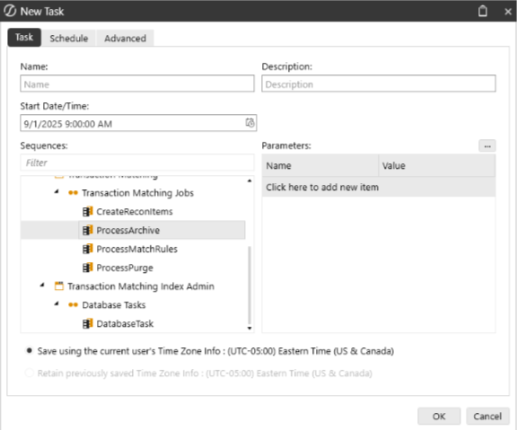

## Transaction Matching

### Match Filters

The Match filters narrow down the matches displayed in the grid.

### Filter Name

### Filter Option

### Description

### Type

### Manual

### Require review and approval

### Suggested

### Require review and acceptance

### Automatic

### Created by the system via Rules

### Rule

### List

Dynamic list populated with all match set rules

### Status

### All

### All Status states

### Pending

Suggested matches that have not yet been accepted

### Matched

### Automatic, Accepted, Suggested, and Manual Matches

### Approval

### All

### All Approval states

### Unapproved

Not yet been approved or a previous approval was

retracted

### Approved

### Approved either automatically or manually

### Not Required

Applies to Matches that are set to Approval Not Required

for Manual and/or Suggested.

## Transaction Matching

### Filter Name

### Filter Option

### Description

### Reason

### List

Dynamic list populated with all match set reason codes

### Code

### Date Range

### Today

### Timespan

7 Days

### All

### Matches Columns

Change the order in which Matches are displayed by clicking the Filter icon of any column.

l Match

l Type

l Rule

l Match By

l Match Date (UTC)

l Match Period

l Status

l Status By

l Status Date (UTC)

l Approval

l Approval By

## Transaction Matching

l Approval Date (UTC)

l Reason Code

l Summary fields across each data set

### To Select

### Do This

### A single row

Click anywhere in the row or click the row’s checkbox

### Multiple non-contiguous

1. Click anywhere in a row.

rows

2. Hold down the Ctrl key and select the next row.

3. Repeat until all rows are selected.

### A contiguous group of

1. Click the first row of the group.

rows

2. Hold down the Shift key and select the last row of the

group.

### Multiple contiguous

1. Click the first row of the group.

groups of rows

2. Hold down the Shift key and select the last row of the

group.

3. Hold down the Ctrl key and select the first row of the next

group.

4. Press and hold Ctrl+Shift and select the last row of the

next group.

## Transaction Matching

### To Select

### Do This

### Rows on multiple pages

1. Perform the steps for the row type you want to select.

2. Repeat until all rows on the page are selected.

3. Click the next page and repeat the procedure until all

rows on all pages are selected.

### Rule Processing

Process Match Set Rules initiates a Data Management job on all active

rules in a Match Set.

Rule processing can be launched from either the Matches or Transactions page by a Preparer,

Approver, Local Admin, or Transaction Matching Administrator. While the Data Management job

runs in the background, its progress can be monitored at any time in Task Activity. Manual

Matching is blocked while the process rules job is running. Only one active job per Match Set can

be run at a time.

### Process Matches

1. On the Matches or Transactions page, click Process.

2. Click OK in the Process Match Set Rules Started dialog box.

### Match Detail

When you select a match in the Matches grid, the Match Detail appears beneath it. This pane

contains the system-generated Match ID (an alphanumeric code beginning with the letter M), the

rule that created the match, and a color-coded status box stating the Type, Status, and Approval

state.

## Transaction Matching

The Match Detail pane displays transactions matched from each data set. The number of

transactions displayed in each pane is determined by the Rule Type. For example, a Many to One

rule applied may result in the display of multiple transactions in the first data set (DS1) with a

single transaction displayed in the second data set (DS2).

At the bottom of each section of the Match Detail pane are the summary totals. The number of

summary totals displayed correlates to the number of summary fields previously determined in the

data sets. The variance calculation will display in the appropriate pane.

IMPORTANT: If Data Security is enabled, a user must have Entity access to view

transaction-level information in Match Detail. If the user does not have access to any

transaction in the match, an "access restricted" message is displayed.

### Match Detail Header Bar Metrics

The header bar of the Match Detail displays the Type, Status, and

Approval of the match.

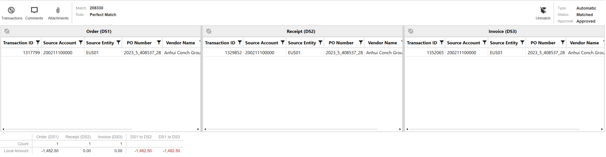

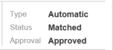

## Transaction Matching

### Complete or Revert Workflow

Completing a workflow can be used to reflect that the process of matching transactions is done for

the selected time period and can be performed from either the Matches or Transactions page.

Only administrators have permission to complete or revert a workflow.

### Complete a Workflow

Complete  marks a workflow period Complete.

l On the Matches or Transactions page, click Complete .

l After a workflow is complete, the Complete  icon is replaced by the Revert  icon. When a

workflow is complete:

o All users can view the workflow but cannot edit or delete the existing information.

o Commenters, preparers, approvers, and administrators can add comments.

o Preparers, approvers, and administrators can add attachments.

### Revert Workflow

The Revert  removes the Complete checkmark from the workflow and restores it to

an open status.

On the Matches or Transactions page, click Revert .

### Export

Export takes filtered matches and transaction information and exports all or portions of

the match data.

## Transaction Matching

IMPORTANT:  When data security is enabled, the ability to export transactions or

matches depends on the user's entity level security of the data set.

The Export option exports all or partial match data in the active match set into a comma-separated

values (*.csv) format. This information can be brought into account reconciliation activities, journal

entry, reporting, or even third-party solutions for general or other entry work.

IMPORTANT: The Export feature requires the OneStream App for Windows.

### Export Match and Transaction Details

1. On the header bar of the Matches page, click Export.

2. Select the Export Type from the drop-down list and then click Export.

NOTE: When Data Security is enabled and applied to any Data Set, the Export Matches

icon will only be available to OneStream Administrators.

### Comments and Attachments

Comments and attachments can be added at either the Transaction level or the Match level.

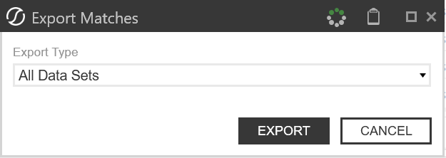

## Transaction Matching

Add Comments and Attachments to a Suggested Match

1. In the Matches grid, select the matches that you want to accept.

2. Click Comments to add a comment.

3. Enter the comment in the text box.

4. Select Add.

The Comments icon when there are no comments.

The Comments icon when there are  comments.

NOTE: Users cannot delete or edit comments.

l Click Attachments to add a file to the match.

l Click Upload, navigate to the location of the file, and then click Open. Repeat the process

to add additional files.

The Attachments icon when there are no attachments.

The Attachments icon when there are attachments..

NOTE: Viewers and Commenters cannot upload or delete attachments.

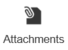

## Transaction Matching

### Match Actions

Matches can be reviewed, and different actions can be taken on and through the Matches page.

### Automatic Matches

Automatic matches are generated by the system based on the match rules created for the match

set and can be unmatched by the Approvers, Transaction Matching Administrator, and

OneStream Administrators.

### View Automatic Matches

To display automatic matches in the Matches grid, on the Matches page, select Automatic from

the Type drop-down list.

### Accepting/Unaccepting Suggested Matches

Suggested matches are matches made by the system that require acceptance. They may also

require approval if Require Approval - Suggested is set under Match Set Options.

### Accept Suggested Matches

1. In the Matches grid, select the matches that you want to accept. You can select multiple

matches and accept them together.

2. In the Selected Matches pane, click Accept.

### Unaccept Suggested Matches

A suggested match that has been accepted can be unaccepted if it is still unapproved. If it is

already approved, it must be unapproved before the suggested match can be unaccepted.

## Transaction Matching

1. In the Matches grid, select the accepted match.

2. In the Match pane, click Unaccept.

### Approving/Unapproving Suggested and Manual Matches

### Approve Matches

Automatic matches are approved when the match is made. Approving an unaccepted suggested

match will bypass acceptance and approve the match in a single action.

1. In the Matches grid, select the matches that you want to approve. You can select multiple

matches and approve them together.

2. In the Selected Matches pane, click Approve.

### Unapprove Matches

1. In the Matches grid, select the approved matches you want to unapprove. You can select

multiple matches and unapprove them together.

2. In the Match pane, click Unapprove.

## Segregation of Duties

Transaction Matching honors strict Segregation of Duties for manual matches. If a user creates a

Manual Match, the approval must be performed by another user.

### Unmatch Matches

When you Unmatch a match, these events occur:

## Transaction Matching

l The transactions become available on the Transactions page.

l The match ID, comments, and attachments associated with the match are permanently

removed.

### Remove a Suggested Match

1. In the Matches grid, select the checkbox next to the matches that you want to remove. You

can select multiple matches and unmatch them together.

2. Click Unmatch to remove the match.

The selected matches are removed from the Matches grid.

### Remove All Matches

OneStream Administrators, Transaction Matching Administrators, and Local Administrators can

remove all matches for the current filter selections.

NOTE: If entity security is enabled, a Local Admin or Transaction Matching

Administrator cannot unmatch for entities that they do not have access to.

1. In the Matches grid, make selections from the filters to identify the matches to be removed.

2. Click Unmatch All.

3. Confirm the match removal.

All matches for the selected filters are removed from the Matches grid.

### Multi-Match Actions

When you select multiple matches on the Matches grid, you can apply one of these actions to the

selected matches:

## Transaction Matching

l Accept

l Approve

l Unapprove

l Unmatch

### Transactions

The Transactions page displays a stacked grid view for all transactions.

IMPORTANT: If Data Security is enabled, users are only able to see transactions for the

entities to which they have Read and Write access.

The Transactions page can be set as the default page in Settings under User Preferences,

making it easily accessible. You also have the option to view transactions horizontally or vertically.

Horizontal is the default option.

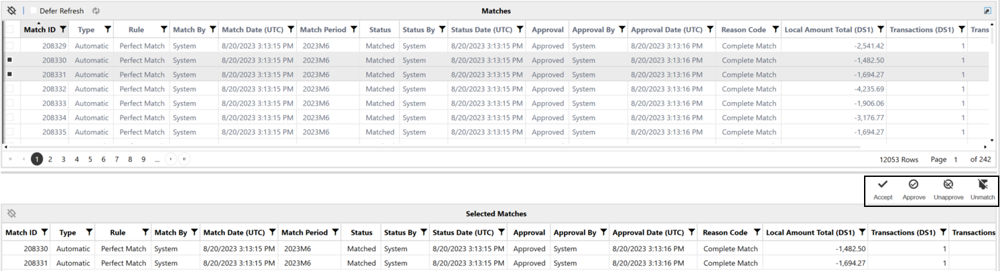

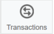

## Transaction Matching

### Transaction Status

The Transaction Status drop down filters the transactions based on the current status of the

transaction:

l (All)

l Unmatched

l Unmatched (As of Period End)

l Matched

l Suspended

l Pending Delete

l Deleted

The Transaction page displays a stacked grid view by default with Data Set 1 (DS1) on top and

Data Set 2 (DS2) under it. If the Match Set is a Three Data Set Match Set Type, a Data Set 3

(DS3) will appear under DS2.

### TIP: You can click

in a column to filter and sort transactions.

(All)

Select ( All) in the Status drop-down to view every transaction regardless of its individual status

such as Matched, Unmatched, Suspended, Deleted, or Pending Delete. This option provides a

comprehensive view for preparers and above, enabling them to interact with all transactions in

one place.

## Transaction Matching

Transactions marked as Unmatched (As of Period End) are excluded from this view, as that

status is calculated separately. When filtered on All, all exports will include only the transactions

shown and will contain a Status column to indicate each transaction’s current state. If multiple

transactions with different statuses are selected, only the icons that are common across those

statuses will be displayed, ensuring that you can view only the applicable actions.

### Unmatched

Select Unmatched to show all transactions that are not currently matched and manually match

transactions. Manual matching is a process performed when transactions are not matched via the

match rules.

### Create a Manual Match

On the Transactions page, select the transactions in each data set to be matched. The status bar

at the bottom automatically updates the amounts and variance calculations as transactions are

selected or cleared. When you make a manual match, these events occur:

l The match type “manual” is assigned to the match.

l A match ID is generated.

l The match status changes to Matched.

### Unmatching a Manual Match

Manual matches can be unmatched by Preparers, Approvers, Local Admins, and Transaction

Matching Administrators. After approval, only Approvers or Transaction Matching Admins can

unmatch a manual match.

### One-Sided Matches

One-sided matches are permitted when selecting more than one transaction in the same data set.

## Transaction Matching

### Assign a Match Reason Code

Match reason codes can be used to aid in identifying issues with matches or individual

transactions that may have required a manual match to be performed.

1. Select the transactions from the data sets.

2. On the status bar, select a reason from the Match Reason Code drop-down list.

3. Click Match +.

### Create Quick Match

A Quick Match moves matched transactions out of the unmatched transaction list immediately

upon selection without requiring additional steps such as adding comments or attachments.

1. Select the transactions from the data sets.

2. (Optional): Assign a Match Reason Code.

3. Click Match.

### Create Match Plus

Match Plus enables the creation of a match while providing an opportunity to add comments or

attachments. When the process is complete, the transactions are matched, and any added

comments or attachments are saved to the match.

1. Select the transactions from the data sets.

2. (Optional): Assign a Match Reason Code.

3. Click Match +.

4. (Optional): Click Comments to add a comment.

5. (Optional): Click Attachments to add a file to the match.

## Transaction Matching

l Click Upload, navigate to the location of the file, and then click Open.

l Repeat to add additional files.

6. Click Accept to finalize the match or Decline to discard the match.

### Matching Outside of Tolerance

If tolerances are in place across any of the three summary fields and a variance exists then a

match will not occur, and an error message is displayed. If the user’s role lets them override this

tolerance variance, a warning that the match variance is outside the tolerance is displayed.

### See also: Manual Matching Tolerances

### Suspend Transactions

Suspend a transaction to set it aside until it is ready for matching.

If there are transactions awaiting additional data, for example the need to wait for a first of month

reconciliation, that transaction can be marked Suspended. This action removes the transaction

from the Unmatched status and stores it until it is ready to be matched.

You can apply a reason code to explain why the transaction is being suspended. If the transaction

becomes unsuspended or is moved to any other status besides suspended, the reason code is

removed from the transaction. You can view reason codes when the transaction list is filtered to

suspended transactions.

NOTE: Reason codes can only be applied from the Transactions page. You cannot

apply them from the transaction details dialog.

### To suspend a transaction:

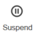

## Transaction Matching

1. Select Unmatched from the Status drop-down list.

2. Select the transactions you want to suspend.

3. (Optional): Select a Reason Code.

4. Click Suspend.

IMPORTANT: If Auto Unsuspend is not enabled, suspended transactions are excluded

from rules-based matching.

### Delete Transactions

Delete a transaction that does not need to be matched.

If there are transactions that will never be matched, for example a bank fee deemed immaterial,

that transaction can be deleted and marked as Pending Delete. This action can be done by

Preparers, Approvers, and Administrators and removes the transaction from the Unmatched

status and moves it to the Pending Delete status.

### To delete a transaction:

1. Select Unmatched or Suspended from the Transaction Status drop-down list.

2. Select the transactions you want to delete.

3. Click Delete.

### Unmatched (As of Period End)

Select Unmatched (As of Period End) to show all transactions that are unmatched in the current

period, regardless of future period match status. For example, if there are 10 unmatched

transactions in total for M1 and 6 are matched in M2, the filter for Unmatched (As of Period End)

would show 10 transactions, and the filter for Unmatched would show 4 transactions.

## Transaction Matching

### Matched

Select Matched to show all transactions that are matched and perform Match Actions in the

Transactions page.

When you select Matched transactions, you can use these additional filters to change the

transactions that display:

l Match Reason Code: Select one or more reason codes or All.

l Match Period: Select All, Current Period, or Future Periods.

l Import Period: Select one or more import periods or All.

### See Also:

l Match Actions

l Unmatch Matches

l Multi-Match Actions

### Suspended

Selecting Suspended shows all transactions that are currently suspended. The period the

transaction was suspended will be identified by the Status Period column. The reason for the

suspension, if provided, displays in the Reason Code column. If Auto Unsuspend is enabled,

transactions suspended in one Workflow period will be unsuspended in the next period, upon

running Process in the new period. The Status Period will then reflect the new Workflow period,

which is the period the transaction was automatically moved from suspended to unmatched.

## Transaction Matching

### Unsuspending Transactions

1. From the Transaction Status drop-down list select Suspended.

2. Select the transactions you want to unsuspend.

3. Click Unsuspend.

The selected transactions are returned to the unmatched transaction grid.

### Pending Delete

Selecting Pending Delete shows all transactions that were deleted by users. Transactions with a

Pending Delete status can be deleted or recalled, which moves them back to the Unmatched

state. Only Approvers, Transaction Matching Administrators, or OneStream Administrators may

move transactions to a Deleted state.

Transactions with a Pending Delete state can be deleted from the Transactions Detail dialog box:

1. Select Pending Delete from the Transaction Status drop-down list.

2. Select the transactions you want to delete.

3. Click Details.

4. Click Delete.

5. Click Delete on the Delete Transactions prompt.

### Recalling Transactions

1. Select Pending Delete from the Transaction Status drop-down list.

2. Select the transactions you want to recall.

3. Click Recall.

When transactions are recalled, they are returned to the unmatched transaction grid.

## Transaction Matching

NOTE: To view comments, attachments, or drill back prior to selecting Recall, click the

Details button.

### Deleted

Only Transaction Matching Administrators or OneStream Administrators have the ability to view

deleted transactions. The ability exists to recall these transactions or to permanently remove the

transactions from the transaction matching database tables.

Permanently remove a transaction from the transaction matching database

tables.

When a transaction is selected for removal, the user will be prompted:

(1) Transaction Permanently Removed

When a transaction is selected for removal that has previously been deleted, the user will be

prompted:

(1) Transaction Not Actionable

Once removed, the selected transactions are permanently removed from the Transaction

Matching tables.

NOTE: The Not Actionable message will display if the user attempting to remove the

transaction put the transaction into the deleted state.

### Data Filters

On the Transactions page, you can apply data filters to all types of transactions. You can also use

the Manage Filters dialog box to create, edit, clone, and delete filters for each data set.

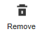

## Transaction Matching

Data filters provide increased efficiency by letting you create and save filters that are applied to

transactions within a data set. Data filters also enable you to:

l Filter on any dimension within the data set.

l Filter using wildcards and select multiple items to add to a filter.

l View and clone other users’ filters within the match set.

l Edit and delete other users' filters within the match set and assign filters to other users

(administrators only).

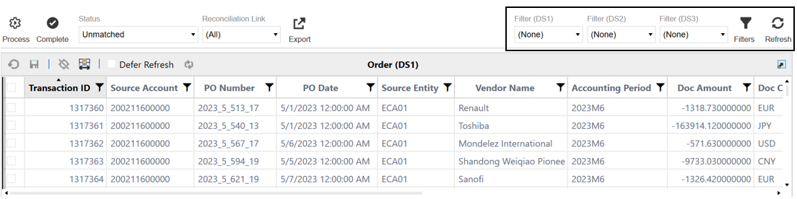

## Transaction Matching

### Create a Filter

1. On the Transactions page, click Filters.

2. In the Manage Filters dialog box, click Create.

3. Complete the Filter Name field. The filter name will appear on the Transactions page in the

filter drop-down menus. Each filter name must be unique within the data set for each

assigned user. This field cannot be left blank.

4. Select the data set from the drop-down menu to indicate which data set will use the filter.

5. Click Create.

NOTE: In the Manage Filters dialog box, the box in the Enabled column is

selected by default, which means that the filter will appear on the Transactions

page in the filter drop-down menus. If the box is cleared, the filter is disabled and

will not appear as an option in the drop-down menus.

6. Add filter information. See Edit a Filter.

7. Click Save

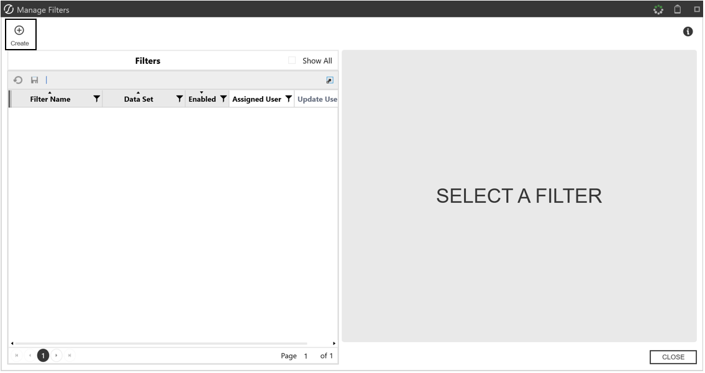