# Using Transaction Matching

## Transaction Matching

### Edit a Filter

1. On the Transactions page, click Filters.

2. In the Manage Filters dialog box, select the name of the filter to edit.

TIP: To view a list of all filters created by other users within the same match set,

select the Show All option. All users are able to view and  copy other users' filters

within the match set. Administrators can also edit and delete other users' filters

within the match set.

NOTE: Administrators can assign filters to other users. In the Assigned User

column for a filter, click in the field to display a drop-down menu and select the

user.

3. Fields for the filters that you can apply to the data set are listed: Attributes, Dates, Values,

and Dimensions. There is also a Notes field where you can enter a description for the filter.

In the Manage Filters dialog box, enter the filter information.

NOTE: To clear the contents of a filter field, click
.

TIP: For Dates fields, the Start Date must be before the End Date.

TIP: For Values fields, the value entered must be a decimal, and the minimum

value must be less than or equal to the maximum value.

You can also enter information in the Attributes and Dimensions fields using the Selector

dialog box.

## Transaction Matching

a. Click
to open the Selector dialog box.

b. (Optional) Type filter information in the Filter field.

c. (Optional) Click
to apply the filter.

d. Select the boxes next to the items in the list to select one or more options.

e. Click Save.

You can also filter using wildcards in the filter fields in the Manage Filters dialog box and the

Selector dialog box. This table shows the information about filtering using wildcards. Click

to see this information displayed in the Manage Filters dialog box and the Selector

dialog box.

### Operator

### Definition

### Example

_

### Represents a single

### Filter for invoices set as “34_7_

character

_” would return any invoices

where the first two digits are “3”

and “4” and fourth digit is “7”.

### The third, fifth, and sixth digit

could be anything (for

example, “340785” or “345722”

could be returned).

## Transaction Matching

### Operator

### Definition

### Example

%

### Represents zero or

### Filter for invoices set as “34%”

more characters

would return all invoices that

start with “34” as the first two

digits and the last digits could

be anything (for example,

“3450” or “345001” could be

returned).

[ ]

### Represents any single

### Filter for invoices set as “3

character within the

[45]00” would return any

brackets

invoices with “4” or “5” as the

second digit (for example,

“34000” or “35000” could be

returned).

^

### Represent any

### Filter for invoices set as “3

character not in the

[^45]00” would return any

brackets

invoices where the second

digit is not “4” or “5” as the

second digit (for example,

“36000” or “37000” could be

returned but not “34000” or

“35000”).

## Transaction Matching

### Operator

### Definition

### Example

-

### Represents any single

### Filter for invoices set as “3[4-

character with the

6]00” would return any invoices

specified range

where the second digit is within

the bracketed range (for

example, “34000”, “35000”, or

“36000” could be returned).

‘A’, ‘B’, ‘C’

### Represent a string or

### Filter for invoices set as

specific, distinct value.

“340000, 340001, 340002”

### Display values that are

would return those exact

the same as what is

invoices only, or if the invoices

specified

do not exist, nothing is

returned.

4. Click Save.

5. Click Close.

### Copy a Filter

1. On the Transactions page, click Filters.

2. In the Manage Filters dialog box, select the name of the filter to  copy.

TIP: To view a list of all filters created by other users within the same match set,

select the Show All option. All users are able to view and copy other users' filters

within the match set. Administrators can also edit and delete other users' filters

within the match set.

3. Click Copy.

## Transaction Matching

4. Complete the Filter Name field. The filter name will appear on the Transactions page in the

filter drop-down menus. Each filter name must be unique within the data set for each

assigned user. This field cannot be left blank.

5. Click Create.

6. Click Save

### Delete a Filter

1. On the Transactions page, click Filters.

2. In the Manage Filters dialog box, select the name of the filter to delete.

TIP: To view a list of all filters created by other users within the same match set,

select the Show All option. All users are able to view and copy other users' filters

within the match set. Administrators can also edit and delete other users' filters

within the match set.

3. Click Delete.

4. Click Delete to confirm.

5. Click Close.

### Apply Filters

1. On the Transactions page, the filter drop-down menus display the list of saved (and

enabled) filters that you created: Filter (DS1), Filter (DS2), and, if a third data set is

included in the match set, Filter (DS3).

2. In each drop-down menu, select the filter to apply it to the data set.

NOTE: You can create filters that apply across all data sets. See Custom Filter

Dashboard.

## Transaction Matching

### Edit Transactions

You can add  or edit a note or reason code for a transaction directly in the grid on the Transactions

page  by double-clicking in the field.

To edit notes and reason codes for multiple transactions:

1. On the Transactions page, select each transaction to edit.

2. Click the Edit icon.

3. In the Edit Transactions dialog box, select the Reason Code check box, the Notes check

box, or both. Edit each selected item.

IMPORTANT: You must select the check box for each item you edit in order to

save the changes. The Save button displays after a check box is selected.

4. Click the Save button.

NOTE: Fields for matched transactions cannot be edited in the grid on the Transactions

page.

You can edit a transaction when the transaction status is one of the following:

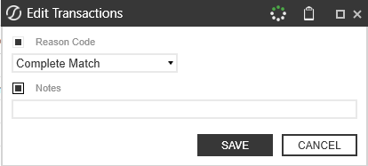

## Transaction Matching

l Unmatched

l Unmatched (As of Period End)

l Suspended

l Pending Delete

l Deleted

For reason codes, note the following information:

l You can only assign reason codes that are active.

l After the reason code has been updated, the change does not affect any prior matches,

only future matches.

Permission to add and edit notes and edit reason codes is based on your role. See Access.

NOTE: Notes must be less than or equal to 250 characters.

### Transaction Details

Select a transaction to review the transactional level details, including comments and

attachments. You can also drill back to the source level information. Select a transaction from a

data set and then click on the corresponding Details button.

## Transaction Matching

The Transaction Details dialog box will highlight the transaction status and action buttons such as

Suspend and Delete will be available.

### Drill Back

When you click Drill Back, information for any Dimension data that was not null upon import is

displayed. Additionally, the dialog displays the source data that was loaded, the target

(transformed data), the transformation rule that was applied, and if the sign was flipped.

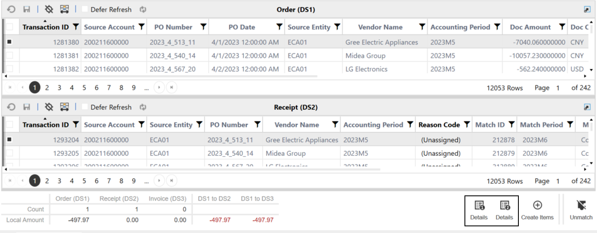

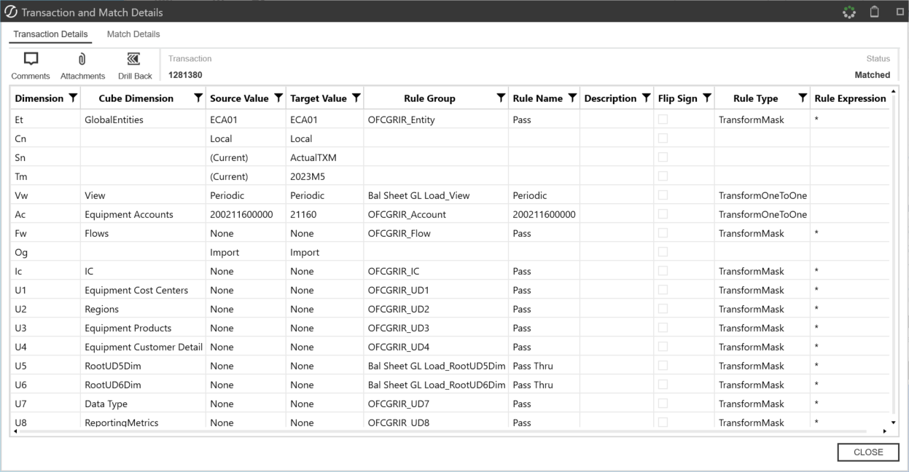

## Transaction Matching

IMPORTANT: Data imported for Transaction Matching is cleared from stage at the

conclusion of the import. Therefore, source data cannot be retransformed in Transaction

Matching and must be loaded.

### Export Transactions

Transactions displayed in a grid can be exported from the Transactions page.

1. Select the transactions you want to export.

2. Right-click anywhere on the selection of rows and click Export > To Csv.

3. Navigate to the location you want to save the file. Enter the file name and click Save.

Open the extracted file in Excel to view the exported information.

### Multi-Row Selection

By using the mouse and the keyboard, you can select multiple rows in a grid view, including items

that are not next to each other (non-contiguous), even if they are on different pages. To clear all

the selections made, click Deselect All or Refresh.

### To Select

### Do This

### A single row

Click anywhere in the row.

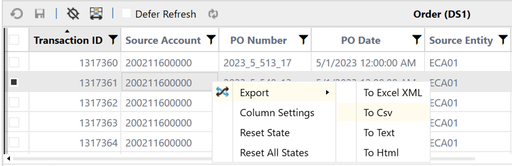

## Transaction Matching

### To Select

### Do This

### Multiple non-contiguous

1. Click anywhere in a row.

rows

2. Hold down the Ctrl key and select the next row.

3. Repeat until all rows are selected.

### A contiguous group of

1. Click the first row of the group.

rows

2. Hold down the Shift key and select the last row of the

group.

### Multiple contiguous

1. Click the first row of the group.

groups of rows

2. Hold down the Shift key and select the last row of the

group.

3. Hold down the Ctrl key and select the first row of the next

group.

4. Press and hold Ctrl+Shift and select the last row of the

next group.

### Rows on multiple pages

1. Perform the steps for the row type you want to select.

2. Repeat until all rows on the page are selected.

3. Click the next page and repeat the procedure until all

rows on all pages are selected.

## Transaction Matching

### Export Transactions Page

You can export transactions into a comma-separated values (.csv) format. Use this information for

account reconciliation activities, journal entries, and manual matching. Transactions displayed as

a result of filters will be the same that are exported to the .csv (exception is column specific filters

will not be applied to the transactions exported).

1. On the Transactions page, click Export.

2. Select the data set or all data sets that you want to export.

3. Click Export.

NOTE: When Data Security is enabled transactions can be exported based on entity

level security.

### Scorecard

The Scorecard is a visual display of Key

Performance Indicators of the active match set

based on a selected Time Period.

The Time Period dropdown includes the following options:

l Periodic

l YTD

l Trailing 12 Months

NOTE: Periodic is the default time period.

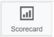

## Transaction Matching

Statistics are based on transactions for which a user has access that were loaded and/or matches

created in the selected Date Range. Information is available in the following areas:

l Transaction Information is a text-based summary of all transactions

l Match Information is a text-based summary of match results

l Matches by Type is a pie chart that displays the number of Automatic, Manual, and

Suggested matches while also showing the proportional to the sum of all matches in the

match set. Hover the mouse over the titles to view total and percentage values.

l Transaction Status is a stacked bar chart displaying the number of Unmatched, Matched,

Suspended, Pending Delete, and Deleted transactions, with the data sets on the vertical

axis and their values along the horizontal axis. Hover the mouse over the chart to view

totals by transaction status.

l Top 20 Rules by Transaction is a stacked column chart that displays the rule type along

the horizontal axis and their values on the vertical axis. Hover the mouse over a shaded

section to view the rule name and results.

IMPORTANT: If Data Security is enabled, information displayed relates to the user's

## security access.

## Transaction Matching

The data displayed on each individual chart can be reviewed further by utilizing the following

functions:

### Maximize  a section of the Scorecard

### Minimize a section of the Scorecard

### Export data

### Inspect data

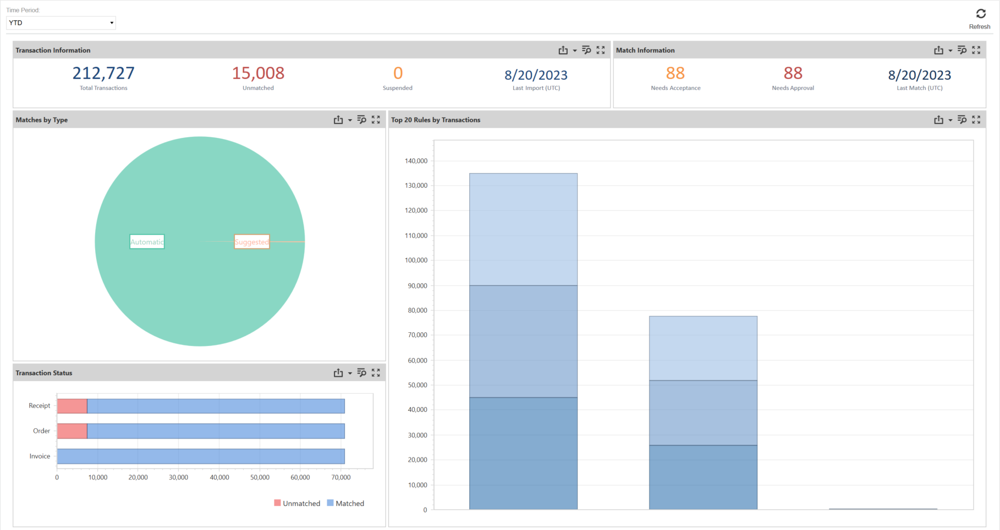

## Transaction Matching

### Analysis

Analysis contains pivot information for transactions loaded in the selected

Time Period by data set and matches made during the Time Period by rule,

variances, or comments and attachments based on a selected Time Period.

The Time Period dropdown includes the following options:

l Periodic

l YTD

l Trailing 12 Months

NOTE: Periodic is the default time period.

The following operational reports are available from the Analysis page based on the user’s

transaction access:

l Transactions by Data Set displays totals for each data set as well as grand totals for

Unmatched, Suspended, Manual, Suggested, and Automatic matches. Each row also

shows the percentage matched.

l Matches by Rule displays totals for Matches, Transactions, Pending, and Unapproved for

each rule included in the workflow. The information is also displayed in percentage form for

Accepted and Approved and provides the Last Match Date.

l Matches with Variance lists matches containing a variance that can be filtered and/or

sorted by Status or Approval detail, Reason Code, amount information, or Transaction by

data source

l Matches with Comments or Attachments lists matches that contain comments or

attachments

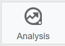

## Transaction Matching

Select a row in any of the above grids and click Details to view the complete

Match Details.

To create custom reports for Transaction Matching, the following tables and views are useful:

l txm.Transactions

l txm.vAllTransactions

l txm.vMatchedTransactions

l txm.vNonMatchedTransactions

If you have a large volume of data, use a large data pivot grid.

The data  can be reviewed further by utilizing the following functions:

### Maximize  a section

### Minimize a section

### Inspect data

### Export data

## Transaction Matching

### Data Splitting

Data Splitting provides the ability to divide a single data source between numerous data sets

across multiple Match Sets. This flexibility enables the file to be accessed across different areas

such as departments or divisions, while controlling access and visibility through the separate

match sets.

### Data Splitting Setup

### Assign Data Splitting Workflow Profile

Data Splitting Workflow Profile are base input parent workflow profiles that are available for Data

Splitting. When applied, all base input imports under this profile are available for data splitting

setup.

1. On the Settings page, click Global Options and then select the Data Splitting Workflow

Profile from the drop-down list.

2. Click Save.

## Transaction Matching

NOTE: Select Cancel to revert settings to the last saved options.

### Set up Data Splitting Dashboard

1. On the Application tab, click Workflow > Workflow Profiles > {Select Your Transaction

### Matching Review Level WF}

2. Click the Workflow Profile and the Scenario you want to assign.

3. On the Profile Properties tab in the Workflow Settings section, adjust the following

## settings:

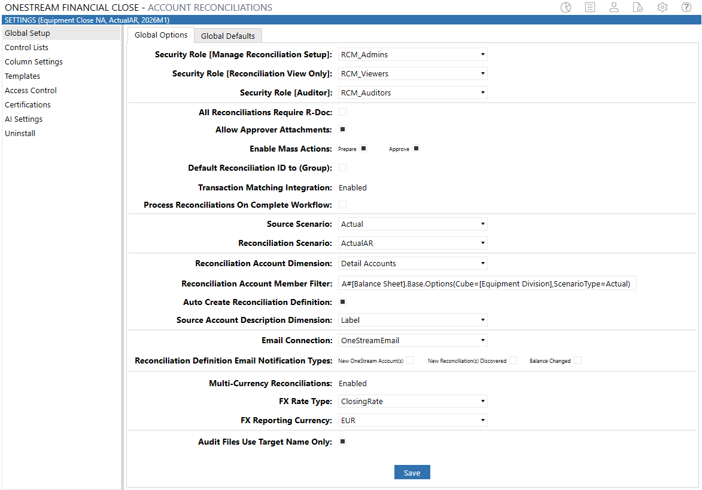

## Transaction Matching

l Cube Name: Select the Cube Name from the drop-down list.

l Workflow Name: Select Workspace from the drop-down list.

l Workspace Dashboard Name (Custom Workflow): Click Edit (…), select OneStream

Financial Close – Transaction Matching - Data Split (TXM) - 0000_DataSplit_TXM

from the drop-down list and then click OK.

4. Click Save.

IMPORTANT: Uninstall UI will reset the Workspace Dashboard name to (Unassigned).

An Administrator must manually reassign the Workspace Dashboard name after

performing an Uninstall UI.

### Source Import

The source imports are the Base Import Children in the Data Splitting Workflow Profile assigned

to a data set.

### Filters

The Filters page provides for the management of data splitting filters which

determine how transactions are split between the various target data sets.

On the Filters page, there is no limit to the number of filters you can create and modify. At any

time, you can refine the processing order of the application of these filters to a target data set in

the Source Import.

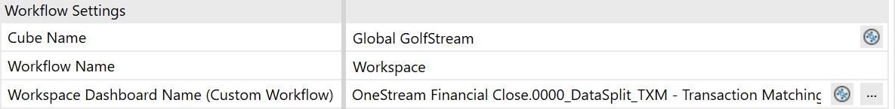

## Transaction Matching

### Add Splitting Filters

1. On the Data Splitting page, select a data source from the Source Import drop-down list.

2. In the Target Data Sets pane, click the data set where the split data will be added.

3. In the Splitting Filters pane, click Insert Row to add a filter to the selected import source.

4. Click Save when you have finished adding or editing the filters.

### Target Data Sets

l Data Sets display in the Target Data Sets pane after the Source Import is selected.

l For target data sets to show up in data splitting, they must already be assigned to the match

set data set.

l Filter Sequence is the order in which filters are applied to the source import to determine

where each transaction is split to.

### Splitting Filters

l Field Name is a drop-down list containing all fields in the selected target data set.

l The Operator in a filter specifies how filter criteria relate to one another.

l Value is the information used by the operator.

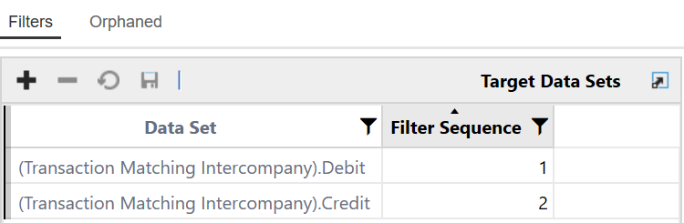

## Transaction Matching

### Operator

### Definition

=
Is equal to the value specified (exact match).

>
Is greater than the value specified.

> =
Is greater than or equal to the value specified.

<
Is less than the value specified.

< =
Is less than or equal to the value specified.

< >
Is not equal to the value specified.

### In 1;2;3 or 'A';

Displays values that are the same as what is specified.

'B'; 'C'

### Between 1;2 or

Displays values that fall between the first and second values (including the

'A'; 'Z'

listed values)

### Starts With

Displays results where the data in the column starts with the value in the

filter.

### Does Not Start

Displays results where the data in the column starts with anything except

### With

the value in the filter.

### Ends With

Displays results where the data in the column ends with the value in the

filter.

## Transaction Matching

### Operator

### Definition

### Does Not End

Displays results where the data in the column ends with anything except

### With

the value in the filter.

### Contains

Displays only records where the data in the column contains all the values

in the filter.

### Does Not

Displays only records where the data in the column does not contain any

### Contain

of the values in the filter.

### Orphaned

The Orphaned transactions grid displays transactions that were not picked

up through the application of filters and weren’t imported and split into a

target data set.

Orphaned transactions are displayed in a grid that can be filtered and/or sorted. This process is

intended to provide visibility in order to determine which transactions need to be manually

assigned to a data set.

## Transaction Matching

### Managing Orphaned Transactions

There are two ways to manage orphaned transactions:

1. Analyze the transactions in the orphaned transactions grid and create or edit a match set

rule filter to catch the transactions. (Best Practice)

2. Manually assign orphaned transactions to a data set.

NOTE: Filters created for a source import in data splitting are only applied to that import

source.

Manually Assign Orphaned Transactions to a Data Set

1. In the Orphaned transactions grid, select the transactions you want to assign.

2. Select the appropriate data set from the Data Set drop-down list.

3. Click Assign.

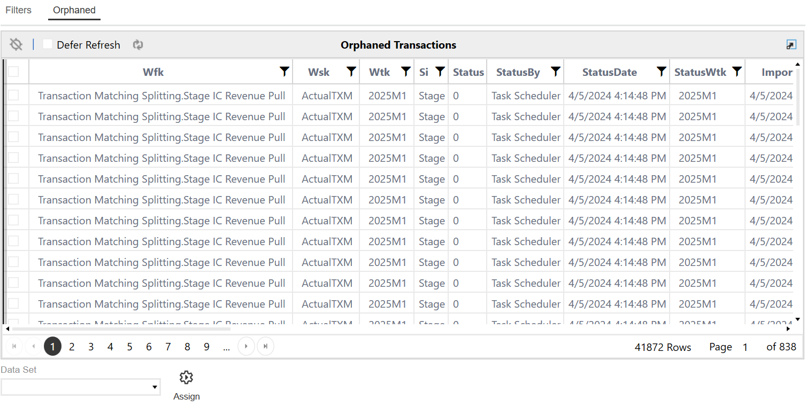

## Transaction Matching

NOTE: If Assign is selected without a corresponding transaction or data set, an error

message will display.

### Prepare External Files

For integration purposes, the transactional level data must contain the applicable dimensionality

to correlate the transaction to the respective reconciliation. In many cases, this is S.Entity,

S.Account, T.Entity, and T.Account but could also contain other tracking levels such as UDs if

required.

The source dimensionality is often in the files pulled from the ERP. However, third party or

external systems may be used for matching purposes and these files most likely will not have the

source information needed.

Follow these steps to pre-process the data to enhance the external files so that upon import the

transactional line contains the source dimensions based on a field in the data.

NOTE: All lookups in this example were put into a single lookup table and run on a single

parser rule but could be broken out if significant lookups are required.

## Transaction Matching

1. Data source creation, map file to the specific fields.

Example: Mapped Entity and Account from the bank

2.

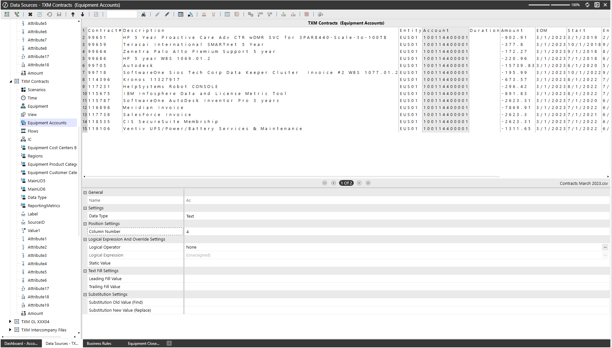

## Transaction Matching

3.

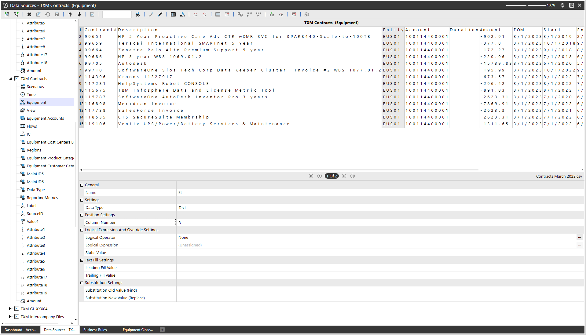

## Transaction Matching

4. Create a transformation lookup rule.

5.

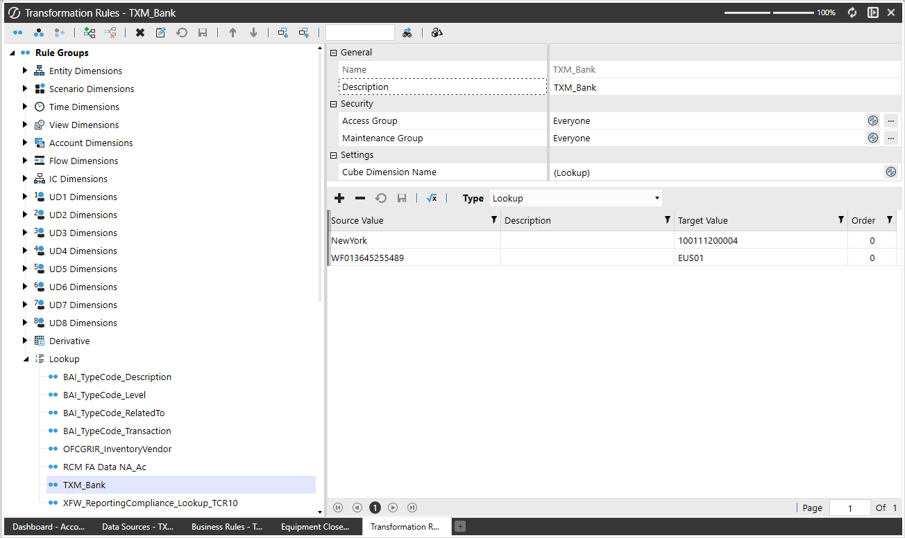

## Transaction Matching

6. Create a parser rule and update it to call the lookup table created in step 4.

7.

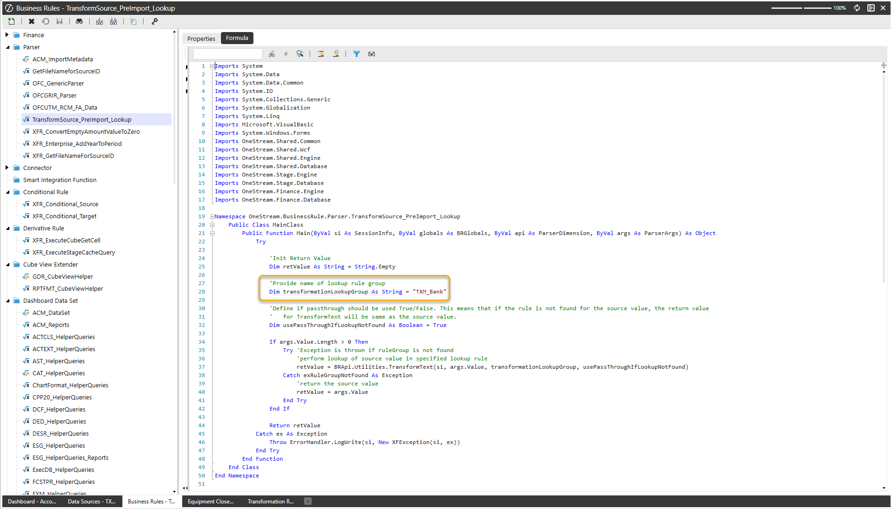

## Transaction Matching

8. Update the data source mapping for Entity and Account to call the parser rule.

9.

### Load File

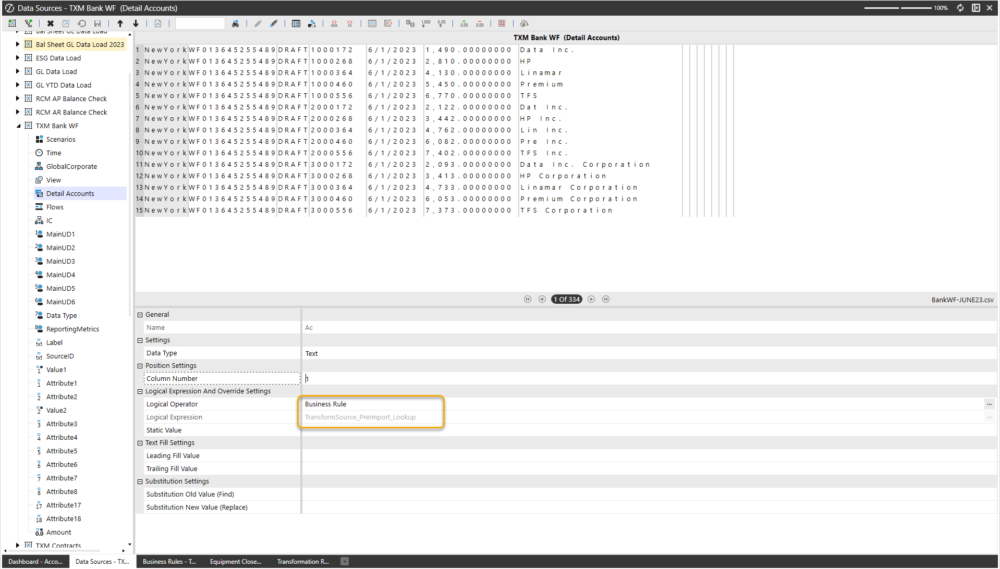

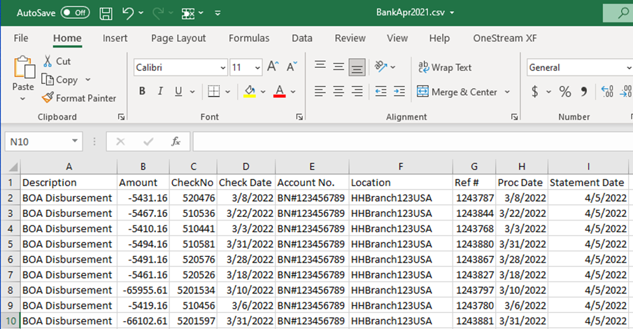

## Transaction Matching

### Results

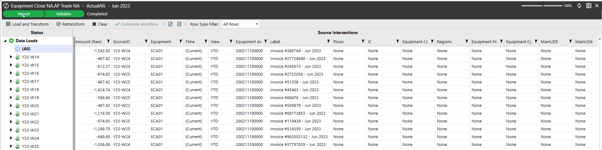

### Journal Entry Manager

### Journal Entry Manager

### See these topics:

l Settings

l Journals

l Templates

l ERPs

l Audit Log

l Workflow

## Settings

The Settings page contains the Global Options, Accounting Periods, Connections, and

Notifications Methods sub-pages where key properties are set and the Uninstall sub-page.

Use the Settings page to configure options for:

l Global Options

l Accounting Periods

l Connections

l Notifications Methods

l Uninstall

### Journal Entry Manager

### Global Options

Global Options enables administrators to set distinct options at a global level. The Global

Options sub-page contains key properties that guide Journal Entry Manager administration and

are used for the initial setup and configuration of Journal Entry Manager. Global Options is the

default sub-page for administrators. Journals is the default sub-page for non-administrators.

NOTE: All global option settings are retained during solution upgrades.

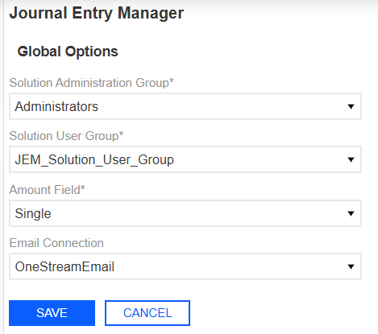

### Journal Entry Manager

### Solution Administration Group

The Solution Administration Group is governed at the global level. Administrators can select a

Platform Security user group to assign as the Solution Administration Group, which will serve as

Journal Entry Manager administrators. Users in this group have access to Journals, Templates,

ERPs, Audit Log, and Settings pages of Journal Entry Manager.

### Solution User Group

Administrators must assign the Solution User Group, which is a Platform Security group that

contains all users that need access to Journal Entry Manager. Users assigned at this group level

can perform journal workflow actions.

### Amount Field

Administrators can select an Amount Type to configure how end users input the amount in journal

entries by selecting the Amount Type. The options are Single and Dual:

l Single: Only one amount field is displayed in the Journal slide-out panel.

l Dual: Separate debit and credit columns are displayed in the Journal slide-out panel.

IMPORTANT: This does not impact how the journal is extracted and is solely a UI

function.

### Email Connection

Administrators can specify the email address linked to Journal Entry Manager, enabling

notifications to be sent to the designated connection.

### Journal Entry Manager

### Assign Global Options

1. Go to Settings > Global Options.

2. From the Solution Administration Group drop-down menu, select a user group.

3. From the Solution User Group drop-down menu, select a user group.

4. From the Amount Field drop-down menu, select either Single or Dual.

5. In the Email Connection field, enter an email connection to use for notifications sent from

Journal Entry Manager.

6. Click the Save button.

### Accounting Periods

Journal Entry Manager does not use workflow within the platform. Administrators must use the

Accounting Periods page to configure custom time periods within the solution. These periods

allow journals to be created for specific periods of time associated with underlying ERPs.

### Accounting Periods Grid

Once periods are created, the Accounting Periods grid displays these attributes:

l Name: The name of the Accounting Period.

l Start Date/Time (UTC): The beginning date and time of the period. The hour is a drop-

down with the options of 0-23.

l End Date/Time (UTC): The actual end date and time of the period. The hour is a drop-

down with the options of 0-23.

l Accounting End Date: The end date of the period according to accounting principles.

### Journal Entry Manager

l Status: A dynamic column that indicates whether the period is currently open, based on

current date/time compared to the Start and End Date/Time.

l WF Time: The platform Workflow Time period associated with the Accounting Period.

The grid includes a Range drop-down menu to filter periods:

l (All): Displays all periods created.

l 12 Months: Displays the 11 previous periods and the next two upcoming periods.

### Create Accounting Period

You can create and maintain these periods through the Create Accounting Period slide-out panel,

which enables you to set all attributes for periods.

NOTE: Journal Entry Manager uses UTC Time.

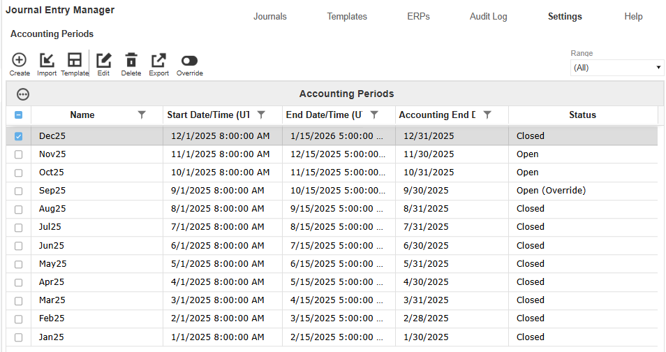

### Journal Entry Manager

IMPORTANT: The Accounting End Date marks the close of the accounting period,

though the period may remain open. The Date Picker respects the application’s

configured culture code, automatically adjusting date formats to match the user’s locale.

### This page has validations that include:

l [Name] is required and must be unique. It has a max character length of 200 characters.

l [End Date] must be a date after [Start Date].

l [Accounting End Date] must be a date after [Start Date] and must be a date before [End

Date].

l [Start Hour] and [End Hour] is required.

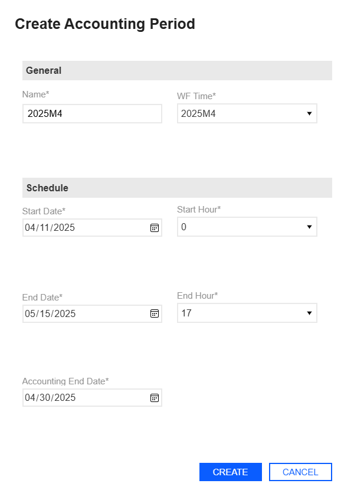

### Journal Entry Manager

### Create an Accounting Period

1. Go to Settings > Accounting Periods.

2. Click the Create button.

3. In the Create Accounting Period slide-out panel, enter the following items:

a. Enter a name for the account period.

b. From the WF Time (Workflow Time) drop-down menu, select a workflow time.

c. Select a Start and End Date.

d. Enter an Accounting End Date.

e. Select a Start and End Hour from the drop-down menus.

4. Click the Create button to add the account period.

### Edit an Accounting Period

1. Select an existing Account Period.

2. Click the Edit button.

3. The Edit Accounting Period slide-out panel displays the current inputs for the Account

Period. Make your changes.

4. Click the Save button to save your changes.

Delete an Accounting Period.

1. Select an existing Account Period.

2. Click the Delete button.

### Journal Entry Manager

CAUTION: You cannot delete an accounting period associated with a journal. The

following error message will display: Unable to delete accounting period [Accounting

Period]. It is associated with journals.

### Import and Export Accounting Periods

Administrators can manage accounting periods by using Excel templates to import and export

data, rather than creating periods manually through the UI.

On the Accounting Periods page, click Template to download a preformatted Excel file. This file

includes all relevant fields and available values shown in the UI, enabling users to complete it

offline. Once filled out, click the Import button to upload and display the new periods directly in the

grid.

To review or update existing periods in bulk, select the periods that need editing and click the

Export button to download a populated Excel file. All drop-down menu options and validations

from the UI are included in both the template and export files.

IMPORTANT: Excel formulas within the template are now honored  during import. This

prevents errors and supports more flexible spreadsheet use.

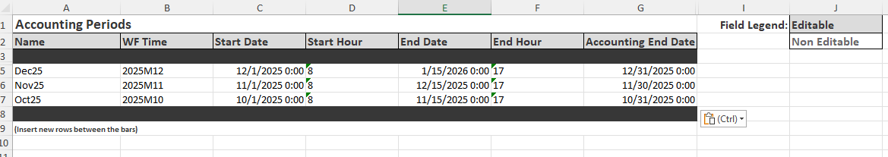

### Journal Entry Manager

### Import Accounting Period

1. Go to Settings > Accounting Periods.

2. Click the Import button to import your Accounting Periods.

3. Click the Browse button or drop your file within the File Upload dialog box.

4. Use File Explorer to browse and select the file you want to import.

5. Click the Open button.

6. Click the Upload button.

## Template

1. Click the Template button to download a template to import.

2. The JEM_AccountingPeriod_Template file is automatically downloaded to your default

downloads location.

IMPORTANT: Ensure that you click the Enable Editing button on the Excel

sheet.

3. Fill out the following fields under Accounting Periods:

a. Enter a name.

b. From the WF Time drop-down menu, select a time.

c. Enter a Start Date.

d. From the Start Hour drop-down menu, select an hour.

e. Enter an End Date.

f. From the End Hour drop-down menu, select an hour.

g. Enter an Accounting End Date.

### Journal Entry Manager

NOTE: Insert new rows between the bars.

4. Save your file.

### Export

1. Select an existing Accounting Period you want to export.

2. Click the Export button.

3. The JEM_AccountingPeriod_Export file is automatically downloaded to your default

downloads location.

### Override for Accounting Periods

Administrators can override the auto-state of accounting periods to support last-minute

adjustments and corrections through the Override button.

Example: If you select a closed accounting period and

override it, the status will update to Open (Override).

If a period is already in the override state Status (Override), the Automatic button displays. Click

the Automatic button to turn the period back to its original auto-state. All override and reset

actions are tracked in the Audit Log. Journal creation and editing actions respect the overridden

status:

l Open periods allow journal activity.

l Closed periods prevent journal activity.

Overridden periods follow filter logic based on their current state:

### Journal Entry Manager

l Periods overridden to Closed are excluded from the Current and Open filters.

l If all periods are closed, including overridden ones, the Current and Open filters will return

no results.

### Override

1. Select an accounting period and click the Override button.

2. The status of the selected period updates to Status (Override). Make your edits as

needed.

3. To revert the period back its original automatic state, select the same accounting period

and click the Automatic button.

### Connections

The Connections page enables you to communicate with any ERP within your business

ecosystem.

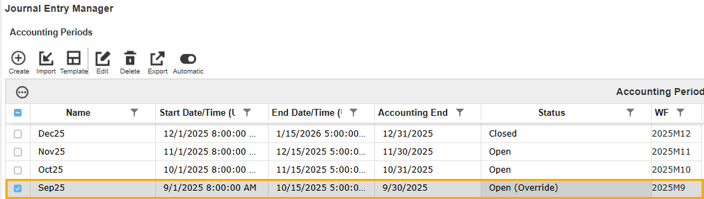

### Journal Entry Manager

This page enables you to create different connections to send journals to a OneStreamFile

Explorer folder or an external folder by Secure File Transfer Protocol (SFTP).

Example: The following example is a sample of the Create

Connection slide-out panel for OneStream File Explorer.

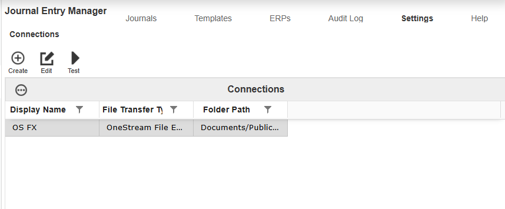

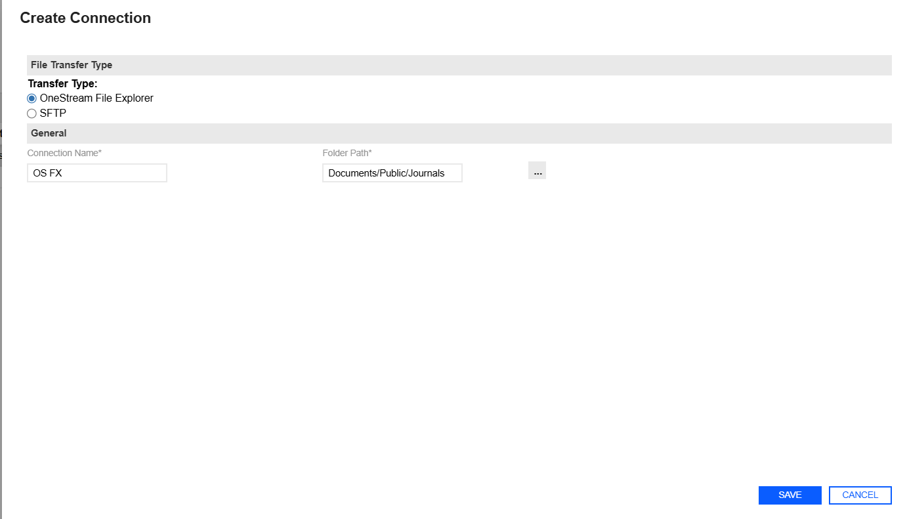