# Integration

### Journal Entry Manager

Example: The following example is a sample of the Create

Connection dialog box for SFTP.

To use OneStream File Explorer folders and use the File Share folders within the File Explorer,

these permissions must be adjusted to allow approvers to send journals to that folder. Changes

need to be made to the ManageFileShare, ManageFileShareContents,

AccessFileShareContents, and RetrieveFileShareConents permissions to allow all users to send

journals. Also, a separate Platform Security user group can be created for Journal Entry Manager

approvers, as they will be the main individuals sending journals to these folders.

If you are not using the File Share and choose to use the App Database, the folder chosen must

be accessible to everyone within the solution. See File Share.

CAUTION: You are not able to use your own Users folder.

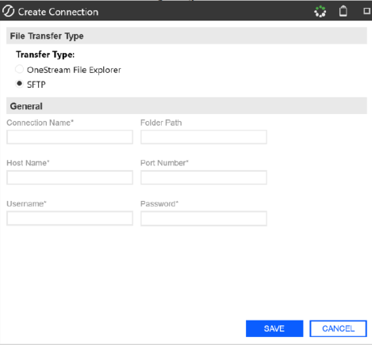

### Journal Entry Manager

To set a OneStreamFile Explorer connection type, you must provide a Connection Name and

select the desired folder for the Folder Path. SFTP connections requires the following:

l Connection Name: Unique name of the Connection.

l Host Name: The server's domain name where the SFTP service is running.

l Port Number: A unique numerical identifier assigned to a specific application or service on

a computer network.

l Username: A unique identifier that allow users access to the connection.

l Password: Passwords are encrypted and are not viewable in the solution to maintain

## security.

### This page has validations that include:

### Field

### Requirement

### Connection

### Type

### Connection

Required, less than or equal to 200 characters

### OneStream File

### Name

### Explorer and

### SFTP

### Folder Path

Required, less than or limited to 250 character limit.

### OneStream File

### Explorer only

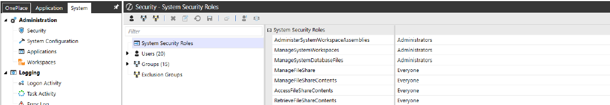

### Journal Entry Manager

### Field

### Requirement

### Connection

### Type

### Host Name

Required, less than or limited to 250 character limit.

### SFTP

### Port Number

Required, must be between 0 and 65535

### SFTP

### Username

### Required

### SFTP

### Password

Required, less than or limited to 250 character limit.

### SFTP

NOTE: The Password field is currently only

available in the OneStreamWindows

Application and is not accessible in the

Modern Browser Experience.

### Create Connection

Follow these steps to set up your file transfer connection:

1. Go to Settings > Connections.

2. Click the Create button.

3. Select a Transfer Type:

l OneStreamFile Explorer

l SFTP

### When selecting OneStream File Explorer:

### Journal Entry Manager

1. Populate the Connection Name field with a unique name.

2. In the Folder Path field, click the ellipses (...).

3. In the OneStream File Explorer, select a folder path for files to be dropped in later. The

folder you select appears in the Folder Path's text box.

4. Click the Save button.

### When selecting SFTP:

1. Under General Information, fill out the following fields:

a. Connection Name

b. Folder Path

c. Host Name

d. Port Number

e. Username

f. Password

NOTE: All fields except for the Folder Path are required to be filled out.

2. Click the Save button.

### Edit Connection

1. Select an existing Connection.

2. Click the Edit button.

3. The Edit Connection slide-out panel displays the current inputs of the Connection. Make

your changes.

4. Click the Save button to save your changes.

### Journal Entry Manager

NOTE: Saving any edits will overwrite the previous Connection, even with a name

change.

### Test Connection

1. Select an existing Connection.

2. Click the Test button.

3. If the connection is successful, a message box displays stating: Connection test successful.

4. Click the X button to exit out of the message box.

### Notification Methods

Administrators can create various Notification Methods to be applied to different templates. These

notifications inform and prompt users to act on journal entries.

They can be categorized in two types:

l State Changes: These notifications are automatically sent to  users in designated access

groups when a journal is moved into the Prepared, Approved, Awaiting Confirmation,

Posted, Rejected, Failed to Send, Failed to Post states. If the state changes are assigned to

approvers, then the notification will only be sent to the last level of approvers.

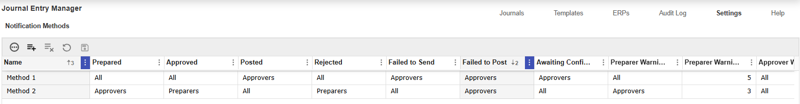

### Journal Entry Manager

l Warnings: These notifications are sent by the SendJournalNotifications Data Management

job and are sent a number of days before the end of the period. See Accounting Periods.

Like other Data Management jobs, these can be scheduled through the Task Scheduler to

automate the process. The types of warnings include:

o Preparer Warning: Sends a list of journals not prepared based on the warning days

set for this type.

o Approver Warning: Sends a list of journals not fully approved based on the warning

days set for this type.

o Confirmation Warning: Sends a list of journals not confirmed posted based on the

warning days set for this type.

Example: The following image displays a sample email

notification method sent to users.

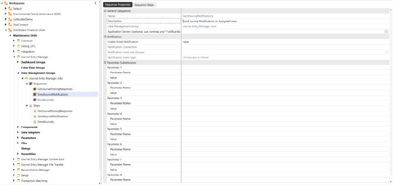

### Journal Entry Manager

### Notification Methods Grid

Once a notification method is added, it displays in the Notification Methods grid. See Grid

Toolbar.

### Column Fields

The table displays the following column fields:

### Field

### Notification Method Options

### Name

Enter name for the Notification Method. For example, High Risk.

### Prepared

Select one of the following options from the drop-down menu:

### None, All, Preparers, Approvers

### Approved

Select one of the following options from the drop-down menu:

### None, All, Preparers, Approvers

### Posted

Select one of the following options from the drop-down menu:

### None, All, Preparers, Approvers

### Rejected

Select one of the following options from the drop-down menu:

### None, All, Preparers, Approvers

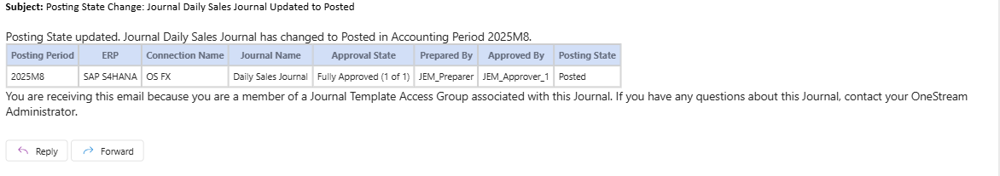

### Journal Entry Manager

### Field

### Notification Method Options

### Failed to Send

Select one of the following options from the drop-down menu:

### None, All, Approvers

### Failed to Post

Select one of the following options from the drop-down menu:

### None, All, Approvers

### Awaiting

Select one of the following options from the drop-down menu:

### Confirmation

### None, All, Preparers, Approvers

### Preparer Warning

Select one of the following options from the drop-down menu:

### None, All, Preparers, Approvers

### Preparer Warning

Enter number of days to send notification.

### Days

### Approver Warning

Select one of the following options from the drop-down menu:

### None, All, Approvers

### Approver Warning

Enter number of days to send notification.

### Days

### Confirmation

Select one of the following options from the drop-down menu:

### Warning

### None, All, Approvers

### Confirmation

Enter number of days to send notification

### Warning Days

### Journal Entry Manager

### Add Notification Methods

1. Go to Settings > Notification Methods.

2. Click the Insert Row button.

3. Fill out the Notification Method fields you want applied to the desired template group. See

Column Fields.

4. Click the Save button.

## Uninstall

The Uninstall feature allows you to uninstall the user interface or the entire solution. If performed

as part of an upgrade, any modifications that were made to standard solution objects are

removed.

IMPORTANT: The Uninstall option uninstalls all solutions integrated in

OneStreamFinancial Close.

### The uninstall options are:

1. Uninstall UI - OneStream Financial Close removes all solutions integrated into

OneStream Financial Close, including related dashboards and business rules but leaves

the related databases tables.

2. Uninstall Full - OneStream Financial Close removes all the related database tables,

data, dashboards, and business rules from all solutions integrated into OneStream

Financial Close. Select this option to completely remove the solutions and underlying data.

CAUTION: Uninstall procedures are irreversible.

### Journal Entry Manager

If you have an application that includes a version of OneStream Financial Close without Journal

Entry Manager, you can uninstall UI and install the General Availability build, and you will receive

the most recent version of Account Reconciliation Manager and Transaction Matching, and the

initial version of Journal Entry Manager.

If your application includes a version of OneStream with Journal Entry Manager, a full uninstall

may be required before installing the General Availability build, depending on the version you're

upgrading from.

Example: If you are on OFC PV8.5.0 SV100 or PV8.5.0

SV101, you do not have to do a Uninstall Full to upgrade to

PV8.5.0 SV110.

Example: If your using a version prior to OFC PV8.5.0 100

you must do an Uninstall Full.

IMPORTANT: Uninstall Full deletes all data.

If you are a user that upgraded from a previous version of Journal Entry Manager, you may

receive an error message similar to the following:

Unable to open dashboard '0000_Frame_JEM_OnePlace'.

Error processing Dataset 'GetJournalEntryListForGridView'. Error executing Workspace

### Assembly

Service class 'Workspace.OFC.JEM.WsAssemblyFactory'.

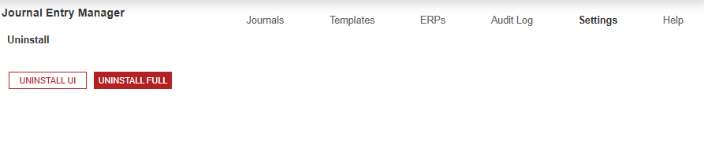

### Journal Entry Manager

Must specify valid information for parsing in the string. (Parameter 'value').

If this error displays, go to the Journals page and reset the parameters by clicking the Reset

Parameters button. If this error still occurs, please contact OneStream Support by registering at:

### Support - OneStream Software

### Journals

The Journals page includes the Journals and Grid Column Settings sub-pages, where preparers,

approvers, and administrators can create, manage, and approve Journals. Administrators can

also configure the Journals grid with custom columns.

### Use the Journals page to configure:

l Journals

o Journals Import and Export

o Manage Journals

l Journal Reports

l Recurring Journal Definitions

o Recurring Journals Import and Export

o Manage Recurring Journals

l Grid Column Settings

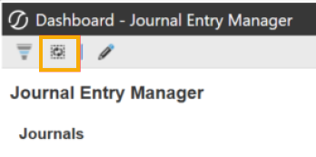

### Journal Entry Manager

### Journals

The Journals grid is the primary workspace for most users (Preparers and Approvers). This page

provides access to all journals according to selected filter criteria, allowing journals to be viewed,

edited, prepared, and approved.

The Journal Grid Column Settings page can be configured, see Journal Grid Column Settings.

The KPIs indicate the quantity of journals within the selected filter criteria. By clicking the label or

number, you can further filter the Journals grid to show only journals in the chosen category.

Example: If you click the Prepared tile, only Prepared journal

entries display.

The Posting Period and Posting State filters enable you to refine which journals are shown in the

Journals Grid. The current period options include:

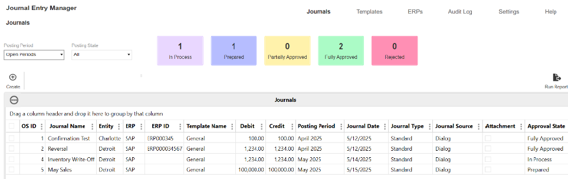

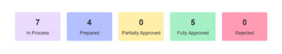

### Journal Entry Manager

l Current Period: The open period if only one exists, or the oldest open period if multiple

periods are open.

l Open Periods: All periods with an Open status.

l Future Periods: Displays journals assigned to a period later than the current period.

l Last 6 Periods: Shows the previous six periods.

l Last 12 Periods: Shows the previous twelve periods.

l Specific Closed Periods: Displays past closed accounting periods that match the selected

filter criteria.

Example: If you select January 2025, you can view and

filter within that specific closed period.

### Journal Create and Edit

Use the Journals grid to create journals. The page updates dynamically based on the selected

template. After selecting a template and completing all General Required fields, clicking the

Create button, populates both the header and line field sections with the fields specified within

that template. Information entered on this page is displayed and verified based on the Field

Attributes configured in the Administration section.

Example: If a field is categorized as a date field, the input area

will be a date picker.

If a field has an associated Field Value List, the input area is a drop-down menu displaying the

values associated with that Field Value List.

This page provides two actions that do not advance the journal's approval or posting status:

### Journal Entry Manager

l Validate: Runs validations against the journal and informs the user of any validation errors.

l Save: Retains and saves all information within the slide-out panel.

NOTE: All changes must be saved before validating.

IMPORTANT: The visibility of Auto Reversal fields and the Manual Posting Confirmation

fields are determined by the Journal Template’s Controls settings. When Enable Auto

Reversals or Enable Manual Posting Confirmation is set to No, the related fields  do not

display for Approver-and-below roles. Administrators may continue to see some options.

These settings are configured in the Journal Templates. See Journal Template.

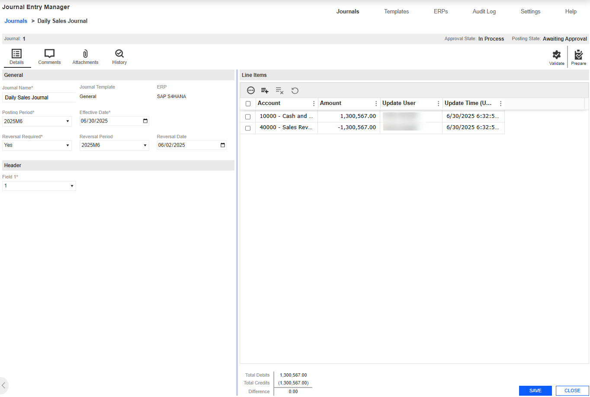

### Journal Entry Manager

### Create a Journal

1. Go to Journals > Journals.

2. Click the Create button.

3. Complete the following General fields:

a. Enter a Journal Name.

b. From the Posting Period drop-down menu, select a period.

c. From the Reversal Required drop-down menu, select whether to enable this option.

d. If Reversal Required is Yes, from the Reversal Period drop-down menu, select a

period.

e. If Reversal Required is Yes, select a Reversal Date.

f. From the Journal Template drop-down menu, select a template.

g. Select a Effective Date for the journal.

4. Click the Create button

5. Under Header, select your Field.

6. Under Line Items, click the Insert Row button.

a. Enter values for all fields marked as required. Fields that are not required can be left

blank.

b. Enter the amount.

NOTE: The available fields are dynamic and vary depending on your ERP setup.

7. Click the Save button.

### Journal Entry Manager

### Delete a Journal

1. Select an existing Journal.

2. Click the Delete button.

IMPORTANT: Once a journal is confirmed posted, it cannot be deleted.

### Reversing Journals

In the Journal Create slide-out panel, you can set a journal to require a reversing entry. When this

option is enabled, you are required to select a Reversing Period and a Reversal Date. The

selected reversal date is used as the Effective Date for the new reversing journal.

After the originating journal is confirmed and posted, a reversing journal is automatically created

and placed in the specified period with an approved status. The name of the reversing journal will

correspond to the originating journal name, with _Reversal appended added to identify the

connection. When setting up the reversing journal, the following validations apply:

l The Reversal Period must be the current or a future period. Previous periods are not

available in the drop-down menu.

l The Reversal Date must be a valid date within the selected reversal period.

When you run the SendJournals Data Management job, all reversing journals with an Effective

Date that is the same as or prior to the current date are sent.

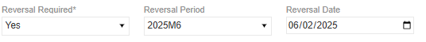

### Journal Entry Manager

### Manual Reversals

Preparers, approvers, or administrators can manually create a reversing journal from an existing

journal entry. This enables corrections or adjustments that were not anticipated during the original

journal creation.

To initiate a manual reversal, select a journal that is in In Process status or higher. When eligible,

a Reverse button will display.

When the Reverse button is selected, a new journal dialog box opens with all header and general

fields pre-populated based on the original journal. The following exceptions apply:

l The Journal Name is duplicated with _Reversal appended to identify the connection.

l All details such as comments, attachments, and line items carry over, except for the History

tab, as the reversal acts as a standalone journal.

For line-level details, debit and credit amounts are flipped based on the Global Option for Amount

### Fields:

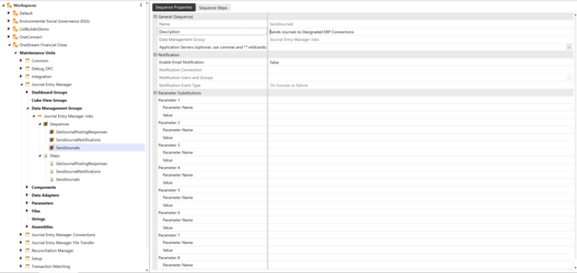

### Journal Entry Manager

l Debit amounts become credits.

l Positive values become negative.

Once created, the reversal journal enters the In Process state and follows the standard approval

workflow.

Unlike scheduled reversals, manual reversals are not automatically sent by the SendJournals

Data Management job. They must be manually sent the same as a standard journal. They provide

flexibility for users to reverse journals at any time, offering a solution for non-standard or late-

discovered adjustments.

### Reverse

1. Select an existing Journal.

2. Click the Reverse button.

3. From the Posting Period drop-down menu, select the appropriate period.

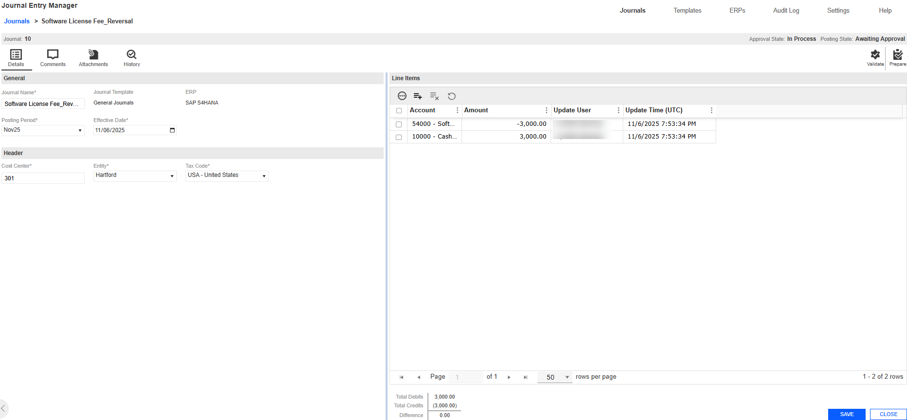

### Journal Entry Manager

4. In the Journals > Reverse page, the reverse journal contains the fields from the original

journal. Modify these fields as needed.

5. Click the Reverse button.

6. In the Header section, review and update any existing or copied fields as necessary.

7. In the Line Items section, review and adjust existing or copied fields as necessary.

8. Click the Save button to apply your changes.

### Copy Journal

The Journal Copy slide-out panel enables you to duplicate an existing Journal and create a copy.

Upon initialization, the Journal Copy slide-out panel assigns the new template a name by

appending _Copy to the original Journal name, indicating that it is a duplicate. The name is not

subject to a unique name validation until the Copy action is confirmed. All other fields are

transferred and remain editable, except for the ERP field and Journal Template, as these fields

are associated with a specific ERP system.

When you select a Journal and click the Copy button, a slide-out panel displays with Copy and

Cancel options. The new journal is only created in the database once the Copy button is selected.

If Cancel is selected, the slide-out panel closes without generating an additional journal in the

database.

This slide-out panel has validations that include:

l The Copy slide-out panel uses the same validations as the Journal Create slide-out panel.

See Journal Create and Edit.

### Journal Entry Manager

### Copy a Journal

1. Select an existing Journal.

2. Click the Copy button.

3. From the Posting Period drop-down menu, select the appropriate period.

4. In the Copy Journal slide-out panel, the duplicate journal contains the fields from the

original journal. Modify these fields as needed.

5. Click the Copy button.

6. In the Header section, review and update any existing or copied fields as necessary.

7. In the Line section, review and adjust existing or copied fields as necessary.

8. Click the Save button to apply your changes.

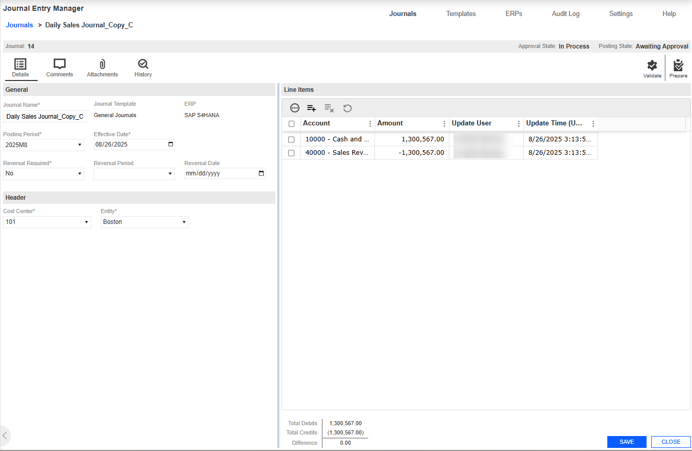

### Journal Entry Manager

### Import and Export of Journals

Journal entries can be created manually using Journal Entry Manager UI. For situations involving

large volumes of data, you can use the import process for creating or editing journal entries.

When the Template icon is selected, an Excel file containing a blank Journal template is

downloaded. This file contains the same fields and available values as those shown in the UI,

enabling users to complete it offline. The security settings used in the solution for template

selection also apply here, preventing users from posting a journal using a template they do not

have permission to access. A user can select a journal and then use the Export button to export

an existing journal if they choose to edit it in Excel. All Field Value List options and other drop-

down menu options available within the Journal Entry Manager are included in the Excel file

template or export, along with the same validations.

After creating or editing a journal, users can click Import and upload the Excel file.

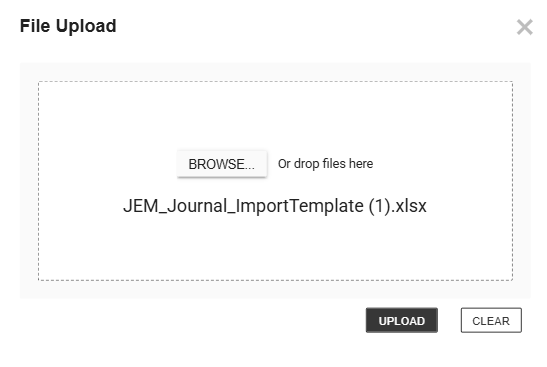

### Journal Entry Manager

NOTE: A user can only upload one file at a time.

IMPORTANT: Excel formulas within the template are now honored during import. This

prevents errors and supports more flexible spreadsheet use.

IMPORTANT: The visibility of Auto Reversal fields is determined by the Journal

Template’s Controls settings. When Enable Auto Reversals is set to No, the related

fields do not display for Approver and below roles. Administrators may continue to see

some options. Manual Posting Confirmation field visibility is not impacted by Journal

Template Controls settings. These settings are configured in the Journal Templates.

See Journal Template.

### Import

1. Go to Journals > Journals.

2. Click the Import button to import your Journal Entries.

3. Click the Browse button or drop your file within the File Upload dialog box.

4. Use File Explorer to browse and select the file you want to import.

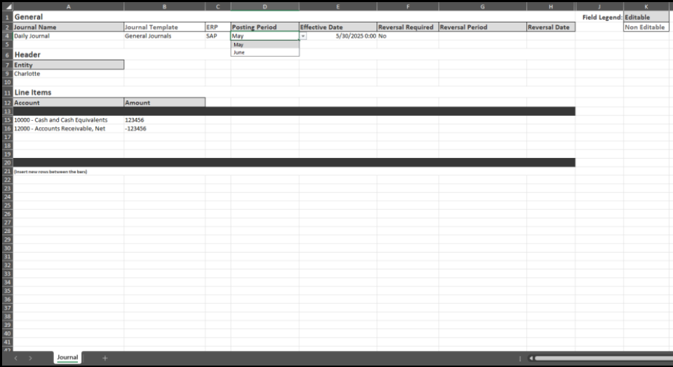

### Journal Entry Manager

5. Click the Open button.

6. Click the Upload button.

## Template

1. Click the Template button to download a template to import.

2. In the Journal Import Template slide-out panel, select a Journal Template from the drop-

down menu and click the Create button.

3. The JEM_Journal_Template.xlsxfile is automatically downloaded to your default

downloads location.

IMPORTANT: Ensure that you click the Enable Editing button on the Excel

Sheet.

4. Fill out the following fields under General:

a. Enter a Journal Name.

b. From the Posting Period drop-down, select a period.

c. Enter a Effective Date for the journal.

d. From the Reversal Required drop-down, select whether to enable this option.

e. If Reversal Required is Yes, from the Reversal Period drop-down, select a period.

f. If Reversal Required is Yes, select a Reversal Date.

NOTE: The Journal Template and ERP fields should not be edited.

5. Under Header, fill out the following fields:

a. If a Field Value is associated to the field, select from the drop-down. If no field value

list is associated, input the desired value.

6. Under Line Items, fill out the following fields under Line Items:

### Journal Entry Manager

a. If a Field Value is associated to the field, select from the drop-down. If no field value

list is associated, input the desired value.

b. Enter an amount for each line.

NOTE: Inset new rows between the bars.

7. Save your file.

### Export

1. Select an existing Journal you want to export.

2. Click the Export button.

3. The JEM_Journal_Export.xlsx file is automatically downloaded to your default downloads

location.

### Automated Journal Import

Administrators can use the folder structure and a data management job to automatically import

journal entries into JEM using Task Scheduler. This setting is managed at the ERP level. On each

ERP, set the Enable Auto Journal Import option to Yes. The GetJournallmports data

management job searches for the specified parent folder for each individual ERP's Connection

Type. See Connections. You are required to set up sub-folders with the following folder names:

l Journal

l Processed

After the folder hierarchy is set up, you can choose how OneStream manages already imported

journals. In Parameter 1 of the data management job, you can set MoveToProcessedFolder to

either True or False.

### Journal Entry Manager

l When set to True, all imported journals are moved from the Journals folder to the

Processed folder.

l If set to False, the system automatically deletes the imported journals.

If journals are moved to the Processed folder, it is necessary for the organization to manually clear

that folder to prevent accumulation of files.

When journals are ready for import, they must be placed in the Journals folder and use the

following file name format: OneStream_JEM_Journal_. Additional text may be appended to the

end of the file name as needed.

IMPORTANT: You must add OneStream_ to the export file to import through the data

management.

### Folder Hierarchy Example:

l Journal Entries: This folder is selected within the Connections page and applied to the

ERP.

l Journal: This folder contains all journals that will be imported.

l Field Value List: This folder contains all Field Value Lists that will be imported.

IMPORTANT: All these sub-folders must be created manually. They are not

automatically created during the installation of Journal Entry Manager.

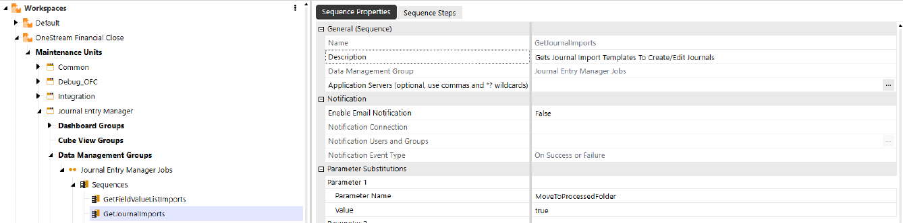

### Journal Entry Manager

### Import as Attachment

You can automatically attach import files to journals using a template field calledInclude Import

as Attachment. When you download a journal template from theJournalspage and fill it out, the

Excel file you import will be automatically attached to the journal entry, if the template has Include

Import as Attachment set to Yes. If the field is set to No, no attachment will be added or updated.

This also works when using the Journal Import Data Management job. SeeImportandTemplates.

### Manage Journals

After creating a journal, it can be managed through the Details, Comments, Attachments, and

History tabs.

NOTE: To close any of the tabs below, click the Close button on each tab page.

### Details

The Details tab displays all information entered during journal creation. See Journals Create and

Edit.

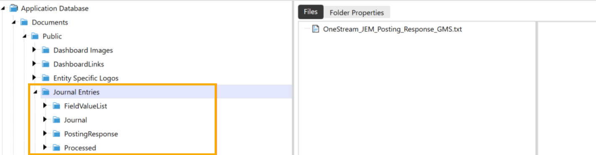

### Journal Entry Manager

### Comments

The Comments tab enables you to create and edit comments within a journal. In the Manage

Journals page, you can access the Comments tab to view comments from different users and

associated timestamps for when they were made or last modified. Comments can be added at

any time. Comments can be edited or deleted until the journal is fully approved

### Add a Comment

1. Go to Journals > Journals.

2. Select the Journal.

3. Click the Manage button.

4. Click the Comments tab.

5. Click the Create button.

6. Under the Comment box, enter your comment.

7. Click the Create button.

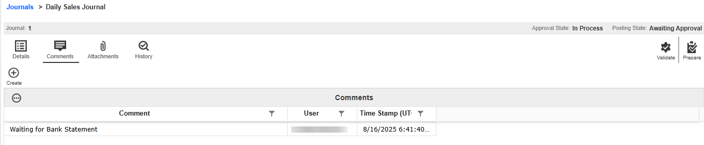

### Journal Entry Manager

### Attachments

The Attachments tab enables you to add, view, and delete supporting documentation related to

journals. This feature enables Preparers and Approvers to provide attachments that supplement

the journal. Attachments can be uploaded by Preparers or Approvers, or viewed by

Commentators or Viewers, at any time. Preparers and Approvers can only deleted their own

attachments until the journal is fully approved

### Add an Attachment

1. Go to Journals > Journals.

2. Select the Journal.

3. Click the Manage button.

4. Click the Attachments tab.

5. Click the Upload button.

6. Click the Browse button or drop your file within the File Upload dialog box.

7. Use File Explorer to browse and select the file you want to import

8. Click the Open button.

9. Click the Upload button.

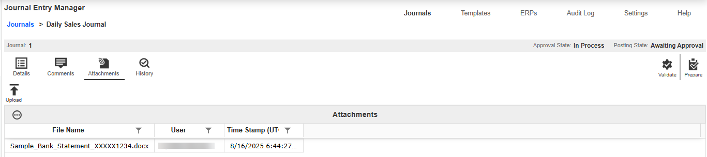

### Journal Entry Manager

### History

The History tab records various actions related to the journal. It is divided into three sections:

State, Comment, and Attachment.

The State History grid lists the action performed, the resulting Approval and Posting State, and the

responsible user. The details column displays any errors encountered during the send and

posting confirmation process.

### Journal Reports

The Journal Report enables administrators to select a period range and specific fields for

inclusion that can be exported in a formatted Excel file. These reports can provide insight into the

company's processes by enabling you to analyze and interact with data.

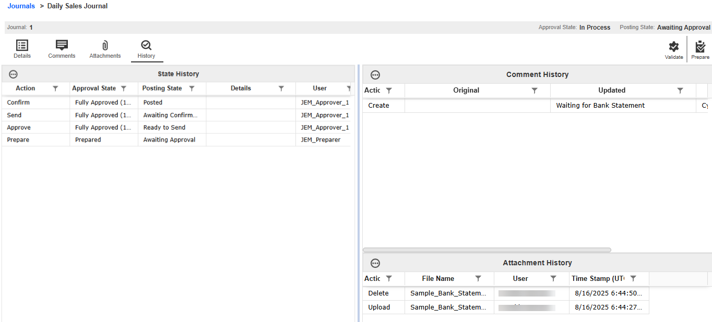

### Journal Entry Manager

### This page has validations that include:

l [Start Period] is required.

l [End Period] is required.

l At least one [Visible Column] must be selected.

l [Start Period] must be the same as or earlier than [End Period].

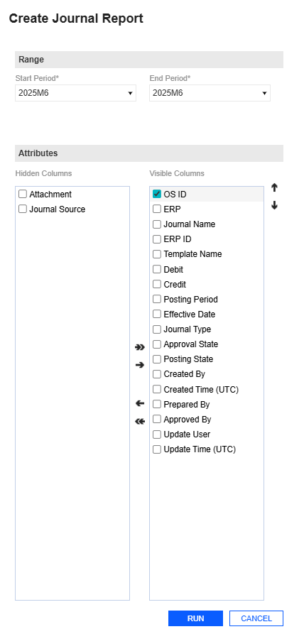

### Journal Entry Manager

Example: The following image is a sample of a Journal

Report.

### Run Report

1. Go to Journals > Journals.

2. Click the Run Report button.

3. In the Create Journal Report slide-out panel, complete the following Range fields:

a. From the Start and End Period drop-down menus, select your periods.

4. Under the Attributes fields, select the desired attributes for the journal.

a. Click each attribute and use the arrow buttons to move them into the Visible

Columns area.

TIP: To change the order of fields in the Visible Columns, use the up and

down arrows on the right side.

5. Once you have selected all your attributes, click the Run button.

6. The JEM_JournalReport_Export.xlsx file is automatically downloaded to your default

downloads location.

### Recurring Journal Definitions

Recurring Journal Definitions streamline the monthly closing process by automating journal

entries that repeat over a defined range of accounting periods. Instead of manually recreating

entries each period, you can define a recurring journal definition that specifies:

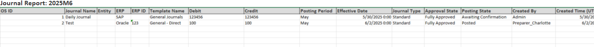

### Journal Entry Manager

l Start and end periods, such as October through December.

l Effective date for each instance, such as the first or last day of the period.

l Template structure including accounts, amounts, and commentary.

l Approval and publishing states distinct from standard journals.

This page includes a grid view with the following headers:

l Journal Name

l ERP

l Journal Template

l Debit / Credit

l Starting Period / Ending Period

l Attachment

l Approval State / Publish State

l Created By / Created Time (UTC)

l Update User / Update Time (UTC)

Approval actions and segregation of duties for recurring journals follow the same workflow and

role-based controls as standard journals. See Workflow.

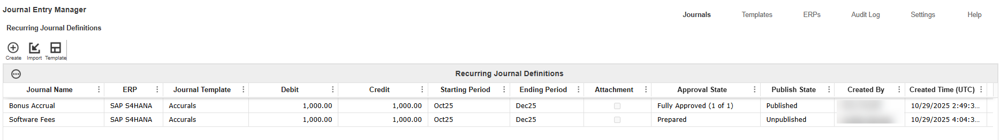

### Journal Entry Manager

### Create Recurring Journal Definitions

As a preparer, approver, or administrator, you can create journal entries that automatically recur

across multiple accounting periods. This significantly improves efficiency and reduces manual

effort during month-end close.

### This page has the following validations:

l A minimum of two line items is required.

l Debit and credit amounts must be balanced.

When saving a recurring journal definition, a series of validations occur to ensure that all required

fields are completed, values conform to ERP configurations, and the journal’s time frame is

logically structured. These validations include:

l Journal Template, Start and End Period, Day of Period, and Journal Name are required.

l Header and Line fields marked as required in the ERP must contain a value.

l Header and Line fields must:

o Match the data type assigned in the ERP.

o Respect character limits defined in the ERP.

l Start Period must precede End Period based on their respective start dates.

### Create a Recurring Journal Definition

1. Go to Journals > Recurring Journal Definitions.

2. Click the Create button.

3. Complete the following General fields:

### Journal Entry Manager

a. Enter a Journal Name.

b. From the Journal Template drop-down menu, select the appropriate period.

c. From the Starting Period and Ending Period drop-down menus, select a period.

d. From the Day of Period drop-down menu, select a first day of period.

4. Click the Create button.

5. Under Header, select your fields.

6. Under Line Items, click the Insert Row button.

a. Enter values for each Line field.

b. Enter the amount.

7. Click the Save button.

Recurring Journal Definitions Scheduling and Send Behavior

Once a recurring journal definition is created, fully approved, and published, journal instances are

generated based on the defined schedule. These instances are then eligible to be sent through

the SendJournalEntries data management job.

When the SendJournalEntries job is run, the following criteria apply:

l Journal Type: Recurring

l Approval State: Fully Approved

l Posting State: Ready to Send or Failed to Post

l Effective Date: The current date or earlier

Recurring journal definitions instances that meet these conditions are sent for posting. This

process ensures that only approved and timely entries are processed, reducing manual oversight

and improving consistency.

### Journal Entry Manager

Edit or Delete a Recurring Journal Definition

Use the Recurring Journal Definitions grid to locate and manage existing recurring journal

definitions. Recurring journal definitions that are In Process or Rejected,  states can be edited. The

page dynamically displays the journal’s structure based on the selected recurring journal

definition. This page provides validations that do not advance the journal’s approval or publishing

status:

l Validate: Runs validations and informs the user of any errors.

l Save: Retains and saves all information within the slide-out panel.

NOTE: All changes must be saved before validating.

### Edit a Recurring Journal Definition

1. Select the existing recurring journal definition.

2. Click the Manage button.

3. Make your edits in the Details, Schedules, Comments, or Attachments tabs.

4. Click the Save button.

### Delete a Recurring Journal

Recurring journals can be deleted in any state other than Published or Closed. Once deleted, the

journal definition and all associated data are permanently removed.

### Delete

1. Select an existing recurring journal definition.

2. Click the Delete button.

### Journal Entry Manager

IMPORTANT:  Unpublish will delete any journals created from the recurring journal

definition that are not yet awaiting confirmation.

### Copy Recurring Journal Definitions

The Copy slide-out panel enables duplication of an existing recurring journal definition. When a

recurring journal definition is copied, _Copy is appended to the original journal name to indicate it

is a duplicate. The new recurring journal definition is only created once the Copy button is

selected.

All fields from the original recurring journal definition are transferred and remain editable, except

the ERP and Journal Template, which are locked due to ERP constraints. The Copy panel follows

the same validations as the Create panel.

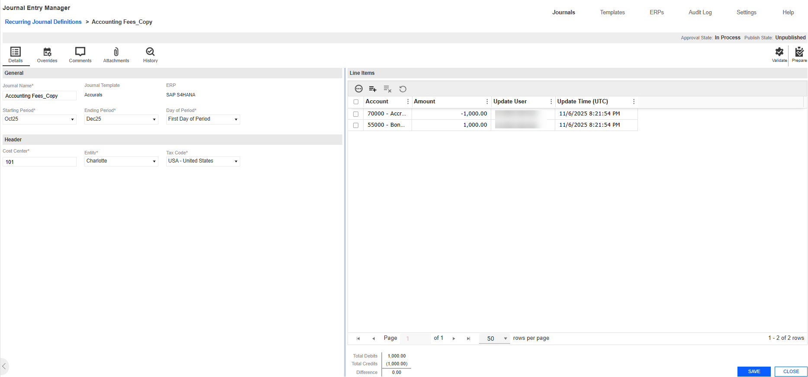

### Journal Entry Manager

### Copy a Recurring Journal Definition

1. Select an existing recurring journal definition.

2. Click the Copy button.

3. In the Recurring Journal Definition Copy slide-out panel, the duplicate recurring journal

definition contains the fields from the original recurring journal definition. Modify these fields

as needed.

4. Click the Copy button.

5. In the Header section, review and update any existing or copied fields as necessary.

6. In the Line Items section, review and adjust existing or copied fields as necessary.

7. Click the Save button to apply your changes.

Import and Export of Recurring Journal Definitions

Recurring Journal Definitions can be created manually using the Journal Entry Manager UI or

imported using Excel templates. This supports efficient setup and maintenance of recurring

journal definitions, especially when working with large volumes.

When the Template icon is selected and a Journal Template is selected from the drop-down

menu, an Excel file containing a blank recurring journal definition template is downloaded. This file

contains the same fields and available values as those shown in the UI, enabling users to

complete it offline. The security settings used in the solution for template selection also apply

here, ensuring users can only access templates they are authorized to use. If the selected

template has changed, such as fields added or removed, Field Value Lists assigned or

unassigned, or required status updated, users will be prompted to re-download the updated

template before proceeding.

### Journal Entry Manager

Select a recurring journal definition and click the Export button to export an existing recurring

journal definition and edit it in Excel. All Field Value List options and other drop-down menu

options available within the Journal Entry Manager are included in the Excel file template or

export, along with the same validations.

After creating or editing a recurring journal definition, click the Import button and upload the Excel

file.

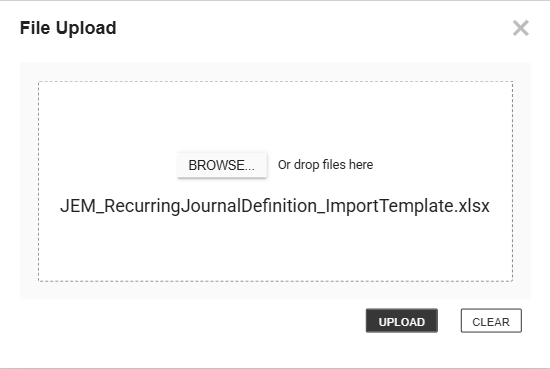

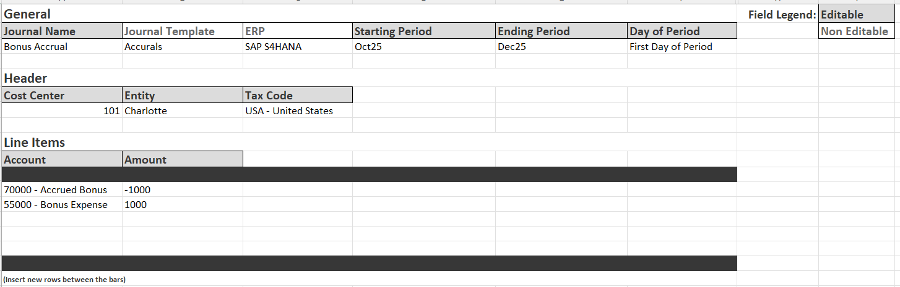

### Journal Entry Manager

NOTE: A user can only upload one file at a time.

IMPORTANT: Excel formulas within the template are honored during import. This

prevents errors and supports more flexible spreadsheet use.

### Import

1. Go to Journals > Recurring Journal Definitions.

2. Click the Import button to import your recurring journal definitions.

3. Click the Browse button or drop your file within the File Upload dialog box.

4. Use File Explorer to browse and select the file you want to import.

5. Click the Open button.

6. Click the Upload button.

## Template

1. Click the Template button to download a template to import.

2. In the Recurring Journal Definition Template slide-out panel, select a Journal Template

from the drop-down menu and click the Create button.

3. The JEM_RecurringJournalDefinition_ImportTemplate.xlsxfile is automatically

downloaded to your default downloads location.

IMPORTANT: Ensure that you click the Enable Editing button on the Excel

sheet.

4. Fill out the following fields under General:

### Journal Entry Manager

a. Enter a Journal Name.

b. Select the Day of Period.

c. From the Starting and Ending Period drop-down menus, select a period.

5. Under Header, fill out the following fields:

a. If a Field Value List is associated with the field, select it from the drop-down menu. If

no field value list is associated, input the desired value.

6. Under Line Items, fill out the following fields:

a. If a Field Value List is associated with the field, select it from the drop-down menu. If

no field value list is associated, input the desired value.

b. Enter an amount for each line.

NOTE: Insert new rows between the bars.

7. Save your file.

### Export

1. Select the existing recurring journal definition you want to export.

2. Click the Export button.

3. The JEM_RecurringJournalDefinitionExportxlsx file is automatically downloaded to

your default downloads location.

### Manage Recurring Journal Definitions

After creating a recurring journal definition, it can be managed through the Details, Schedules,

Comments, Attachments, and History tabs.

NOTE: To close any of these tabs below, click the Close button on each tab page.

### Journal Entry Manager

### Details

The Details tab displays all information entered during recurring journal definition creation. See

Create Recurring Journal Definitions.

### Schedules

The Schedules tab enables preparers, approvers, and administrators to customize recurring

journal definitions entries for specific accounting periods prior to publishing. This enables mass

creation and reduces backend adjustments during the monthly close.

The tab is split into two sections: Schedules and Line Items. Each row of the Schedules section

represents a customized journal instance tied to a specific period.  This allows preparers and

approvers to manage period-specific journal customizations efficiently.

When a recurring journal definition is published, any schedules entries created in this tab are used

in place of the default values from the Details tab for the specified periods.

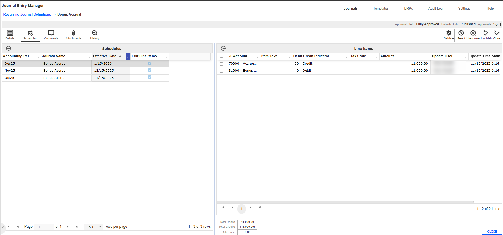

### Journal Entry Manager

### Create

1. Go to Journals > Recurring Journal Definitions.

2. Go to the Schedules tab.

3. Click the Create button.

4. In the Create Schedules slide-out panel, complete the following fields:

a. From the Accounting Period drop-down menu, select one or more accounting

periods.

b. Enter a Journal Name.

c. From the Edit Line Items drop-down menu, select Yes or No.

5. Click the Create button.

### Comments

The Comments tab enables you to view, create, edit, and delete comments within a recurring

journal definition. Comments can be added at any time and are visible to all roles. Comments

remain editable or deletable until the journal is fully approved.

### Add a Comment

1. Go to Journals > Recurring Journal Definitions.

2. Select the recurring journal definition.

3. Click the Manage button.

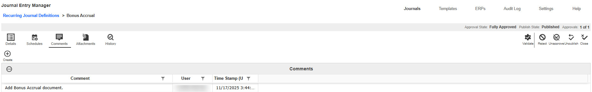

### Journal Entry Manager

4. Click the Comments tab.

5. Click the Create button.

6. Under the Comment box, enter your comment.

7. Click the Create button.

### Attachments

The Attachments tab enables you to upload, view, and delete supporting documentation related

to recurring journal definitions. This feature enables preparers, approvers, and administrators to

provide files that supplement the journal. Attachments can be viewed by Commentators or

Viewers at any time. Preparers and Approvers can delete only the attachments they uploaded,

while Administrators can delete any attachment. Attachments remain editable until the journal is

fully approved.

### Add an Attachment

1. Go to Journals > Recurring Journal Definitions.

2. Select the journal.

3. Click the Manage button.

4. Click the Attachments tab.

5. Click the Upload button.

6. Click the Browse button or drop your file within the File Upload dialog box.

7. Use File Explorer to browse and select the file you want to import

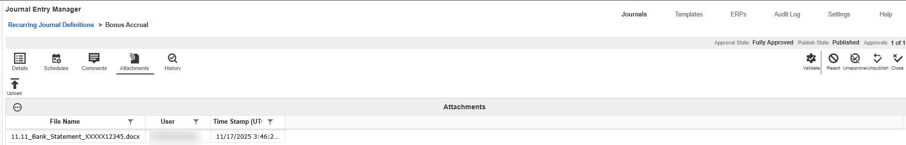

### Journal Entry Manager

8. Click the Open button.

9. Click the Upload button.

### History

The History tab records actions related to a recurring journal definitions. It is divided into three

sections: State, Comment, and Attachments.

The State History grid lists the action performed, the resulting Approval and Publish states, and

the responsible user with a timestamp. The Attachments History grid tracks upload and delete

actions, including file name, user, and timestamp. The Comment History grid logs comment

creation, edits, and deletions, showing original and updated text, user, and timestamp.

### Grid Column Settings

Journal Entry Manager allows administrators to configure the Journals grid to meet their needs.

Use the Grid Column Settings to manage fields displayed within the Journals grid.

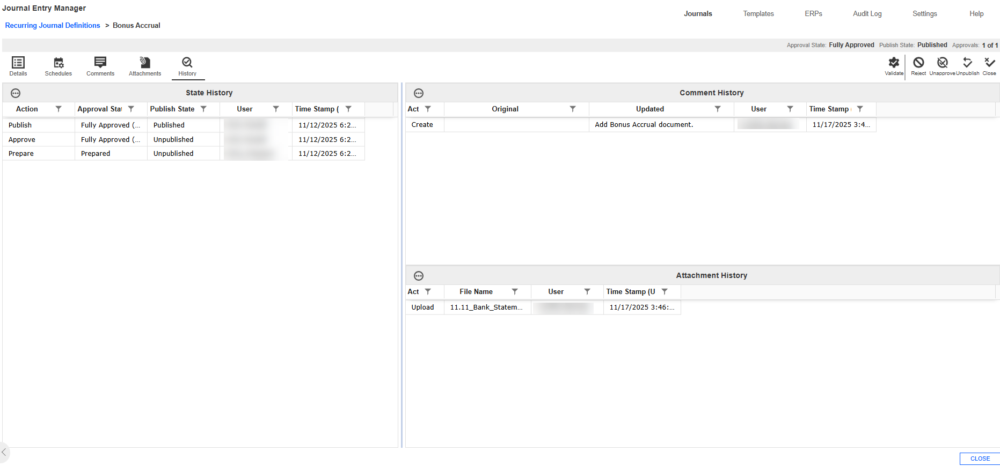

### Journal Entry Manager

IMPORTANT: This page is available only to administrators.

By default, standard columns are always available, including:

l OSID

l Journal Name

l ERP

l ERP ID

l Template Name

l Debit

l Credit

l Posting Period

l Effective Date

l Journal Type

l Journal Source

l Attachment

l Approval State

l Posting State

l Created By

l Created Time (UTC)

l Prepared By

l Approved By

### Journal Entry Manager

l Update User

l Update Time (UTC)

You also have the option to add custom columns and arrange them to suit organizational

requirements. These columns can be assigned to specific ERP Fields, facilitating the grouping of

similar data across different ERPs into single columns where naming conventions may differ.

### This page has validations that include:

l Column Names must be unique and less than or equal to 50 characters or fewer.

l Special characters are removed upon saving. Standard columns cannot be edited or

deleted but can be inactivated.

### Journal Grid

Once a grid column is added, it will display in the journals grid. See Grid Toolbar.

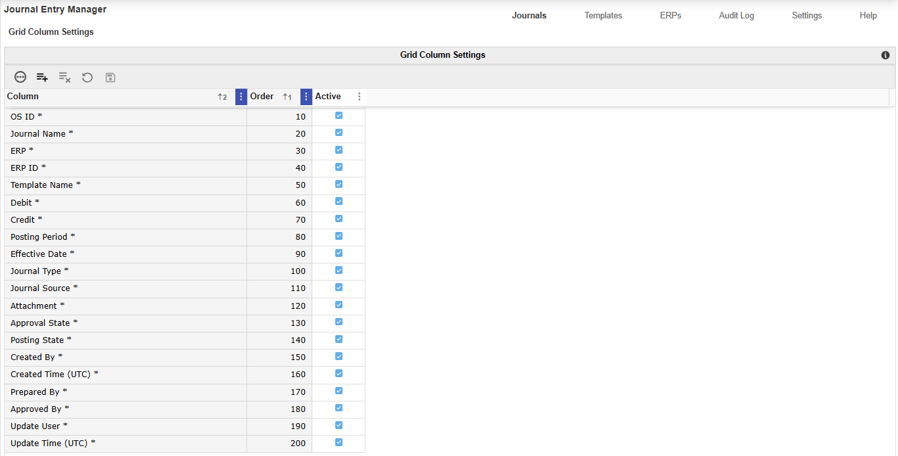

### Journal Entry Manager

### Add a Column

1. Go to Journals > Grid Column Settings.

2. Click the Insert Row button.

3. Enter a Column name.

4. Input an Order value.

5. Select the checkbox to set a column as active.

6. Click the Save button.

### Delete a Column

1. Select a Column field.

2. Click the Delete Row button.

## Templates

The Templates page includes the Templates and Template Access Groups sub-pages, where key

properties that guide and manage templates and access groups for ERPs are set.

### Use the Templates page to configure:

l Templates

l Template Access Groups

## Templates

The Templates page serves as the central interface for administrators to manage their Journal

templates. You can create new templates, modify existing ones, and review all active templates in

use.

### Journal Entry Manager

## Templates Grid

Once a Journal Template is created, the Templates grid displays these attributes:

l Name: The designated name of the Journal Template.

l Description: A brief description of the template purpose or intended use.

l ERP: Indicates the ERP the template is linked to.

l Active: Shows whether the template is active.

l Notification Method: Specifies what notification method will be used to send notifications

for journals created from the template.

l User: Displays the user who last modified or created the template.

l Time Stamp (UTC): Displays the exact date and time in UTC when the template was last

created/updated.

### Create Journal Template

The Create Journal Template slide-out panel enables administrators to configure the attributes

needed to create a template for a specific ERP system. When setting up a template, you must

provide a template name and specify the relevant ERP.

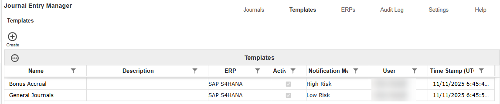

### Journal Entry Manager

After selecting the ERP and completing all required fields, the Create button displays additional

options in the slide-out panel for choosing fields within the Header and Line Field areas that

correspond to the selected ERP. This process ensures that the attributes assigned to the ERP's

fields are maintained so that journals sent to the destination ERP can meet necessary validations.

You can also assign one or more Access Groups to the template to determine which users have

permission to use it. When an end user creates a journal, they can only select templates

associated with their access group. Administrators can set the number of Approval Levels

Required, ranging from 1 to 4, for journals created using this template.

Example: If a template has an Approval Level Required set to

2, the journal will require 3 individuals, 1 preparer and 2

approvers.

### This slide-out has validations that include:

l ERPis required.

l Name is required and must be less than or equal to 200 characters.

l Description must be less than or equal to 250 characters.

l Active is required.

l Notification Method is optional.

l Attachment Required is required.

l Include Import as Attachment is required.

l Enable Auto Reversals is required.

l Enable Manual Posting Confirmation is required.

l Access Groups is required.