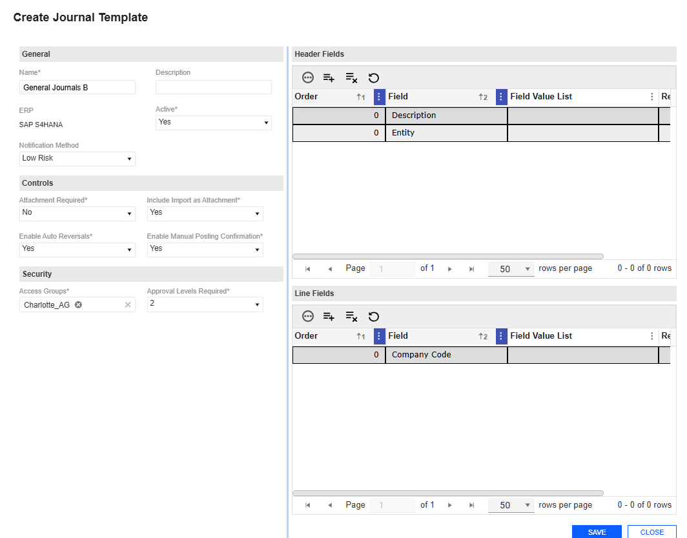
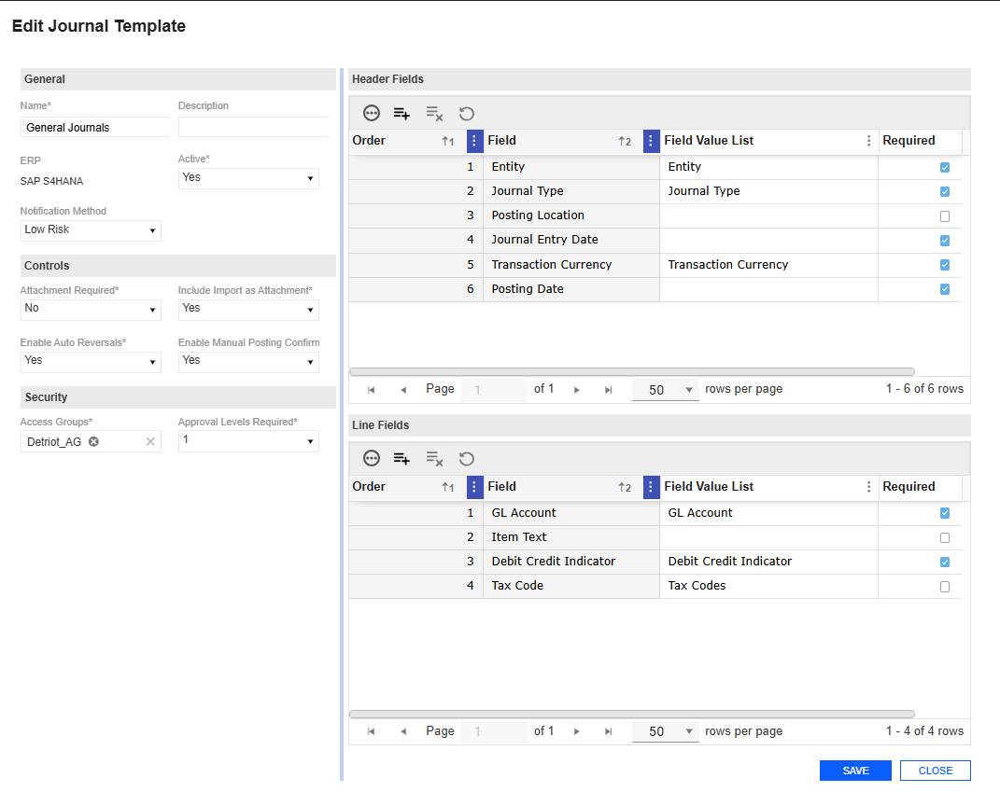
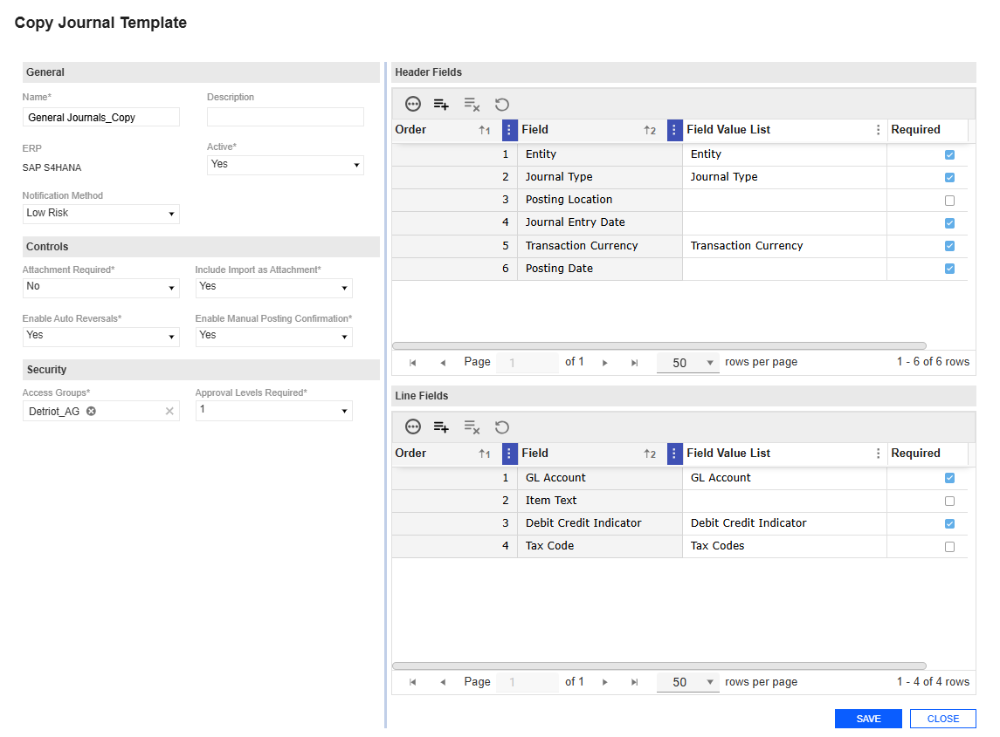
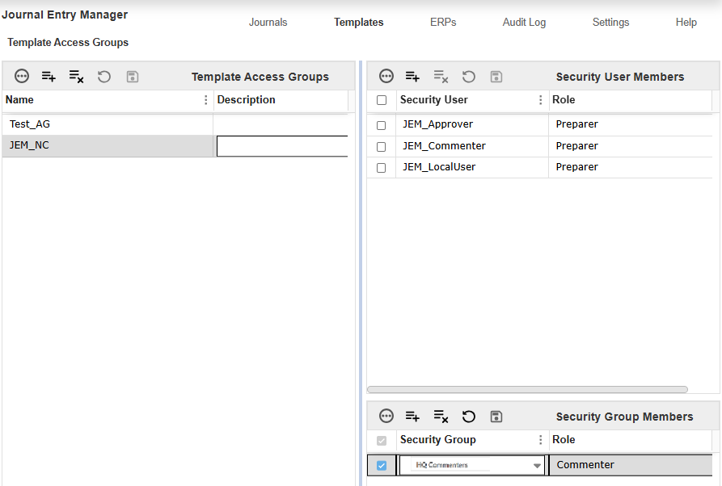
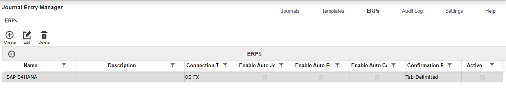
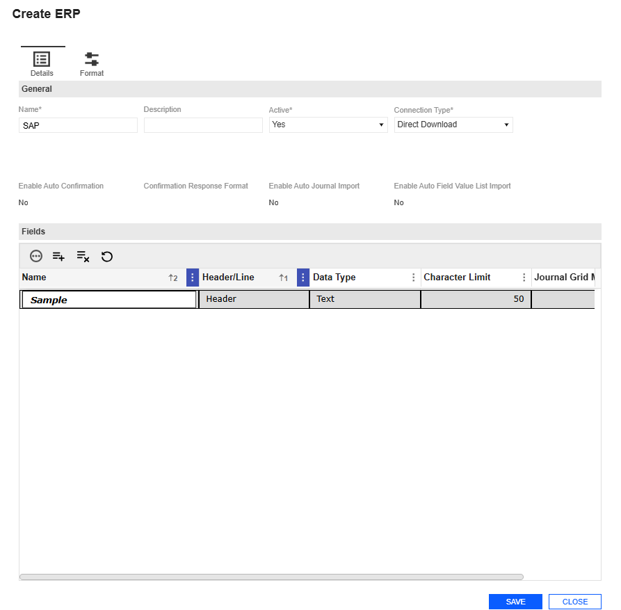
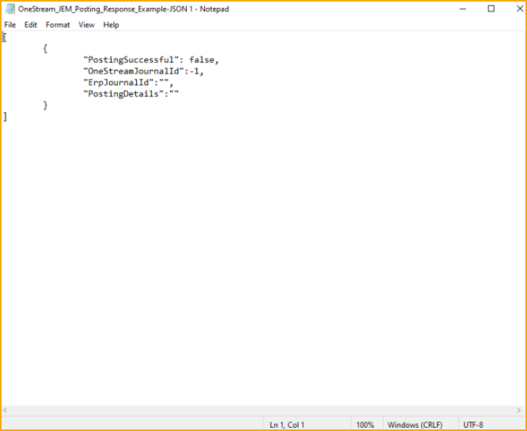
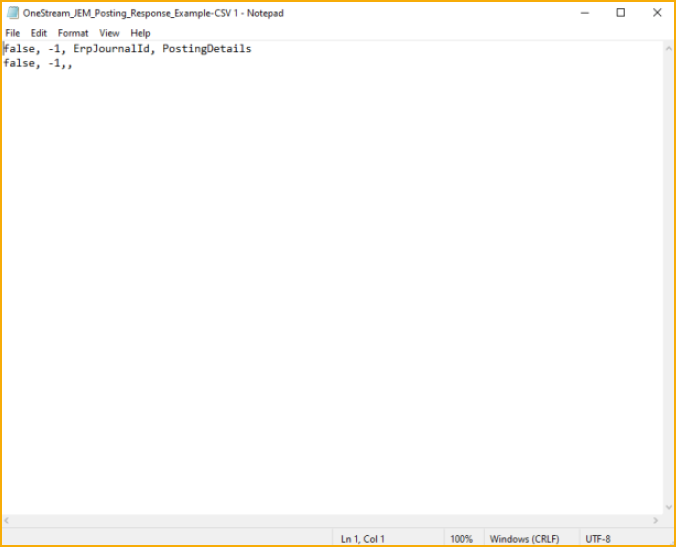
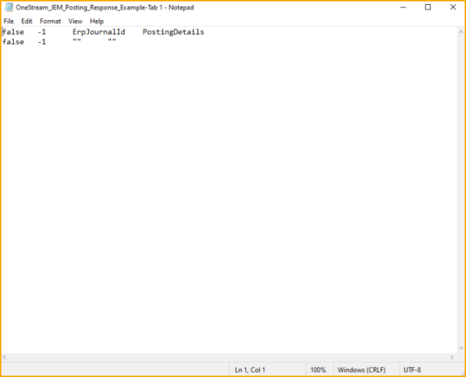
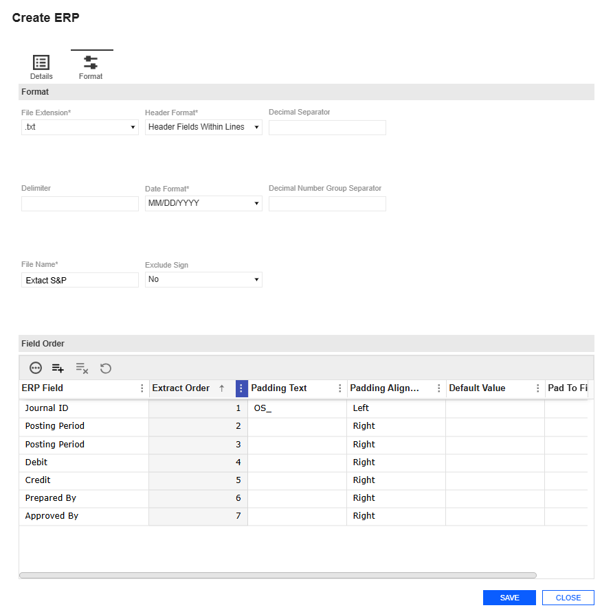

# Journal Entries

### Journal Entry Manager

l Approval Levels Required is required.

l Header and Line Item Fields are optional.

### Create Journal Template

1. Go to Journals > Journals.

2. Click the Create button.

3. Complete the following General fields:

### Journal Entry Manager

a. Name the template.

b. Select an ERP.

c. Enter a description (optional).

d. Under the Active drop-down menu, specify whether this Journal Template is active.

NOTE: Journals can only be created from active Journal Templates.

e. Under the Notification Method drop-down menu, select a method (optional).

4. Complete the following Control fields:.

a. From the Attachment Required drop-down menu, indicate whether an attachment

is required.

b. From the Include Import as Attachment drop-down menu, indicate whether the

attachments is automatically included as an attachment on the journal.

c. From the Enable Auto Reversals drop-down menu, indicate whether reversal fields

(Reversal Required, Reversal Period, Reversal Date) should display when creating

journals from this template.

d. From the Enable Manual Posting Confirmation drop-down menu, indicate whether

the confirm action is available, allowing Approvers that are assigned to this template

to access the property.

5. Complete the following Security fields:

a. Select an Access Group.

b. From the Approval Levels Required drop-down menu, choose the required levels.

6. Click the Create button.

### Journal Entry Manager

7. In the Create Journal Template slide-out panel, add line items for Header Fields and Line

fields in the pane.

8. In the Header Fields panel, click the Insert Row button.

a. Enter values in the Order, Field, and Field Value List columns (optional), and indicate

if it is Required.

9. In the Line Fields panel, click the Insert Row button.

a. Enter values in the Order, Field, and Field Value List columns. For each Line Item

Field, you can set the required field on or off.

NOTE: Optional (non-required) fields will display as text boxes in the journal

entry grid. Required fields will use the appropriate data type input such as

date picker, number, and more.

10. Click the Save button.

### Delete a Journal Template

1. Select an existing Journal Template.

2. Click the Delete Row button.

### Edit Journal Template

The Journal Template Edit slide-out panel enables you to modify existing templates. Any changes

made to the templates will impact any journals not posted.

Example: If a field is added or removed from a template, that

field will automatically be added to or removed from all

associated journals not posted.

### This has validations that include:

### Journal Entry Manager

l The Edit slide-out panel uses the same validations as the Journal Template Create slide-

out panel. See Create Journal Template.

### Journal Entry Manager

### Edit Journal Template

1. Select an existing Journal Template.

2. Click the Edit button.

3. The Edit Journal Template slide-out panel displays the current inputs of the Journal

Template selected. Make your changes.

CAUTION: Any changes made to the templates will impact in-process journals.

4. Click the Save button to save your changes.

### Copy Journal Template

The Journal Template Copy slide-out panel enables you to duplicate an existing Journal Template

and create a copy. Upon initialization, the Copy slide-out panel assigns the new template a name

by appending _Copy to the original Template name, indicating that it is a duplicate. The name is

not subject to a unique name validation until the Copy action is confirmed. All other fields are

transferred and remain editable, except for the ERP field, as fields are associated with a specific

ERP system.

Select a Journal Template and click the Copy button to display a slide-out panel with Copy and

Cancel options. The new template is only created in the database once the Copy button is

selected. If the Cancel button is selected, the slide-out panel will close without generating an

additional template in the database.

### This has validations that include:

l The Copy slide-out panel uses the same validations as the Journal Template Create slide-

out panel. See Create Journal Template.

### Journal Entry Manager

### Copy a Journal Template

1. Select an existing Journal Template.

2. Click the Copy button.

3. In the Copy Journal Template slide-out panel , the duplicate template contains the fields

from the original template. Modify these fields as needed.

4. Click the Copy button.

5. In the Header Fields section, review and update any existing or copied fields as necessary.

### Journal Entry Manager

6. In the Line Fields section, review and adjust existing or copied fields as necessary.

7. Click the Save button to apply your changes.

### Template Access Groups

Administrators can create Template Access Groups by assigning a Platform Security user group

as the Solution User Group in Global Options. Once this property is set in Global Options, the

Template Access Groups page becomes available, allowing you to create Access Groups. You

can then  add Security User Members and Security Group Members to your template. The

available users and groups that can be added to an Access Group are defined by the Solution

User Group in Global Options.

### Journal Entry Manager

### Template Access Groups Grid

The Template Access Groups grid displays on the page. See Grid Toolbar.

## Roles

Each user or group can be assigned one of the following roles:

## Role

### Duties

### Viewer

### Read-only access to:

l View journals

### Commenter

### Same as Viewer and:

l Add comments to journals

### Preparer

### Same as Commenter and:

l Create and prepare journals

### Approver 1

### Same as Preparer and:

l Approve at level 1

### Approver 2

### Same as Approver 1 and:

l Approve at level 2

### Approver 3

### Same as Approver 2 and:

l Approve at level 3

### Journal Entry Manager

## Role

### Duties

### Approver 4

### Same as Approver 3 and:

l Approve at level 4

If a user is assigned to multiple roles, the highest level is granted.

Example: If a user is individually assigned as a Preparer but

also included in a group assigned Approver 1, the user would

have Approver 1 level access.

Once these groups are created, they can be assigned to specific templates. This assignment

allows users to select from all templates associated with their access group when creating

journals.

### This page has validations that include:

l Security User/Group cannot be duplicated or left blank.

### Add a Template Access Group

1. Go to Templates > Template Access Group.

2. Click the Insert Row button.

3. Enter a name and description.

4. Click the Save button.

### Under Security User Members

### Journal Entry Manager

1. Click the Insert Row button.

2. Select a Security User and Role.

3. Add users as needed, then click the Save button.

### Under Security Group Members

1. Click the Insert Row button.

2. Select a Security Group and Role.

3. Add groups as needed, then click the Save button.

### Delete a Template Access Group

1. Select an existing Template Access Group.

2. Click the Delete Row button.

NOTE: All Security User Members and Security Groups assigned to that

Template Access Group will also be removed.

3. Click the Save button.

### ERPs

The ERPs page contains the ERPs and Field Value Lists sub-pages where key properties that

guide ERPs are set.

### Use the ERPs page to configure:

l ERPs

l Field Value Lists

### Journal Entry Manager

### ERPs

Administrators can configure integration settings between Journal Entry Manager, various ERPs,

and their accounting ecosystem. This page enables administrators to create ERP instances, and

define the required or available fields for each ERP.

### This page contains the following attributes:

l ERP Name and Description: Assign a user friendly name for the ERP, along with any

additional information needed. Each ERP can be inactivated through the Active field. If this

field is set to No, no new templates can be created related to that ERP.

l Connection Type: Displays a list of connectors created on the Connections page to be

applied to each ERP. This connection serves as the destination for journal extracts during

flat file transfers. Also, this connection is used to import journal templates, confirmation

responses, and field value list templates. A Direct Download option is always available,

even if no connectors are configured. See Field Value List and Journal Create and Edit.

l Enable Auto Confirmation: When enabled, this setting pulls in a response file that

automatically updates the posted status of a journal.

l Confirmation Response Format: Specifies the format used for confirmation responses.

Supported formats include JSON, CSV, and Tab Delimited.

l Active: Indicates whether ERP is enabled.

l Enable Auto Journal Import: Set to Yes to enable the automated workflow for importing

journal entries. See Journal Create and Edit.

l Enable Auto Field Value List Import: Set to Yes to enable the automated workflow for

importing Field Value Lists through an import process. See Field Value List.

### This page includes the following validations:

### Journal Entry Manager

l ERP Name must be unique and less than, or equal to 200 characters.

l Description must be less than or equal to 250 characters.

IMPORTANT: If you include special characters, no error message will display.

However, when saving, the special characters will be removed.

### Details Tab

Once an administrator has created an ERPs, they can define the necessary fields for creating

journal entries. This process involves documenting each field's name, header/line type, data

types, such as Integer, Decimal, Date, or Text, character limit (based on the specifications of the

destination ERP), and mapping to the journal grid. Multiple fields from different ERPs can be

mapped and displayed in a single column when viewing journal entries across ERPs and

## templates within the journals grid.

### General

Each ERP includes a list of General Fields, which are not specific to any individual ERP but apply

broadly to all ERPs. See ERPs.

### Journal Entry Manager

At the ERP level, you can choose the auto confirmation process. When enabled, users can select

a preferred data structure for responses, including JSON, CSV, and Tab Delimited formats. If

using this process, a text file formatted according to the assigned data structure must be placed in

the PostingResponse folder, which is a child folder within the designated location for extracts,

such as the OneStreamFile Folder or an SFTP site. For all structure types, headers are not

required. However, fields must follow a specific order.

Each response in the document should appear in the following sequence:

l Posting Status: Indicates whether the post was successful (True) or unsuccessful (False).

l OS ID: Refers to the journal ID number assigned within Journal Entry Manager.

Administrators can choose to enclose this value in quotation marks if a comma is required

for CSV formatting or exclude the data when using a tab delimited format.

l ERP ID: Represents the journal ID number designated in the destination ERP system.

l Details: Captures any supplementary information for Journal Entry Manager. If the Posting

Status is False, these details are recorded in the Details column of the State History table

under the History tab for the respective journal. If the Posting Status is True, details are

disregarded. For CSV structures, administrators can encapsulate this value as needed or

exclude it in tab delimited formats. Administrators may choose to enclose this value in

quotation marks if a comma is required for CSV formatting or exclude the data when using a

tab delimited format.

### Journal Entry Manager

The table below presents templates that indicate the required formatting for each data structure.

### Journal Entry Manager

### Data Format

### Example

### JSON

### CSV

### Journal Entry Manager

### Data Format

### Example

### Tab Delimited

### Folder Hierarchy Example:

l Journal Entries: This folder is selected on the Connections page and applied to the ERP.

l PostingResponse: This folder contains all confirmation responses that are imported to

update the posting status for each journal entry.

IMPORTANT: All these sub-folders must be created manually. They are not

automatically created during the installation of Journal Entry Manager.

### Journal Entry Manager

After the response file is placed in the designated folder, you must run the

GetJournalPostingResponses data management job. This job retrieves the response file and

processes it to update the relevant journal entries. Each journal's Posting State is updated based

on the posting confirmation response, such as Failed to Post or Posted.

If the response files contain any specific details, these are displayed in the details section of the

State History table within the relevant journal's History tab, provided the Posting Status is Failed

to Post.

CAUTION: Only one data management job can run at a time. If two are active, you’ll see

this error: Unable to perform action at this time. A Get Journal Entry Responses job is

currently running.

### Fields

### This page includes the following validations:

l Field Name: Must be unique within each ERP system and must be less than or equal to

200 characters. You can have the same field name across multiple ERPs.

l Header/Line Field: This field is required and cannot be modified once saved. If the field

needs to change, this must be removed and added again.

### Journal Entry Manager

l Data Type: This field cannot be altered after the field is saved. If the field needs to change,

this must be removed and added again.

l Character Limit: Text fields are between 1 and 4,000, and integer fields are between 1 and

19. The value cannot be zero or contain special characters.

l Format: Only applies to decimal data types. If a format is set for a non-decimal field, it will

revert to None upon saving.

l Journal Grid Mapping: Enables administrators to align fields across multiple ERPs so

they appear consistently in the Journal Grid columns. You can select from custom columns

to include values in the journal grid column. This is not a required field.

### Format Tab

### Format

After all fields are added for a given ERP, they can be configured to match the required format for

extraction and sending to the destination ERP. Various options are available to support flexible

configuration, enabling you to tailor settings as needed for your ERP. The following fields can be

selected and adjusted:

l File Extension (Required): Allows specification of a file extension such as .txt or .csv.

l Delimiter: This is an open field for any desired delimiter. If left blank, no delimiters will

separate fields upon extraction.

NOTE: Including /t in the delimiter field will produce a tab-delimited extract.

l File Name (Required): Enables a consistent file name for extracts. The system appends

this file name with the journal name and OneStream ID. Anything entered after this field is

appended.

### Journal Entry Manager

l Header Format (Required): Determines whether header fields appear on a single line or

are combined with each line field.

l Date Format (Required): Enables you to set a specific date format different from

OneStream’s default, displaying dates to end users in their local format while meeting ERP-

specific formatting needs.

l Exclude Sign: If set to Yes, this will remove the sign from any negative amount fields

during extraction.

l Decimal Separator: Enables you to specify any character as the decimal separator. If left

blank, no separator is included unless the ERP adds one automatically.

l Decimal Number Group Separator: Enables you to input any character for separating

number groups in decimals. Leaving this blank results in no group separator for decimals.

NOTE: Integers never use a group separator.

From the Details and Standards fields, in the Header and Line Field Order tables, you can select

which fields are required in the extract and their specific order.

### Field Order

You can customize your formatting options by Field Order fields options.

l ERP Field: Specifies the ERP field. You can create custom fields such as Journal ID, Cost

Center, or other.

l Extract Order: Determines the sequence in which fields are extracted and displayed.

l Padding Text: Adds custom padding, such as spaces, words, or other characters, to either

side of the field, based on the specified alignment.

l Padding Alignment: Determines where the padding is applied relative to the value. This

option is only applicable to fields with a character limit, such as Text and Integer types.

### Journal Entry Manager

l Default Value : Specifies values for non-required fields left blank in journals.

l Pad to Fill: Adds spaces (for text) or '0's (for integers) to meet the character limit during

extraction.

l  Decimal Format option enables a different decimal format in the extract than in Journal

Entry Manager, which is useful if the ERP requires more decimal places than typically

displayed.

### Journal Entry Manager

### Create ERP

1. Go to ERPs > ERPs.

2. Click the Create button.

3. Complete the following General fields:

a. Name the ERP.

b. Enter a Description (optional).

c. From the Active drop-down menu, select Yes or No.

d. From the Connection Type drop-down menu, select a connection.

e. From the Enable Auto Confirmation drop-down menu, select whether to enable this

option.

f. From the Confirmation Response Format drop-down menu, select your response

format.

g. From the Enable Auto Journal Import, select whether to enable this option.

h. From the Enable Auto Field Value List Import, select whether to enable this option.

4. Create the Create button

5. Under Fields, click the Insert Row button.

a. Enter a name. Select Header/Line, Data Type, Character Limit, Format, and Journal

Grid Mapping.

6. Click the Save button

7. Click the Format tab.

8. Complete the following Format fields: