# Troubleshooting and Best Practices

### Journal Entry Manager

a. From the File Extension type drop-down menu, select a type.

b. From the Header Format drop-down menu, select a Header Format.

c. Enter a Decimal Separator.

d. Enter a Delimiter.

e. From the Data Format drop-down menu, select a format.

f. Enter a Decimal Number Group Separator.

g. Enter a File Name.

h. From the Exclude the Sign drop-down menu, select whether to exclude this option.

9. Under Field Order, click the Insert Row button.

a. Select an ERP Field. Specify Extract Order, Padding Text, and Padding Alignment

from the drop-down menus.

b. Enter a Default Value and check Pad to Fill if applicable.

10. Click the Save button.

### Edit ERP

1. Select an existing ERP.

2. Click the Edit button.

3. The Edit ERP slide-out panel displays the current inputs of the ERP selected in the Detail

and Format tabs. Make your changes.

4. Click the Save button to save your changes.

### Delete an ERP

1. Select an existing ERP.

2. Click the Delete Row button.

### Journal Entry Manager

### Field Value Lists

A Field Value List is a tool used to provide drop-down menu options for specific ERP fields during

journal creation. You can create different Field Value Lists by assigning a unique name and

linking each list to a configured ERP Field. Mapping a list to a field enables system validations that

check requirements like data type and character limits. The display format of each field can be

adjusted by selecting either Stored Value, Display Value, or Both as the Display Option. Selecting

Stored Value or Display Value will show only that respective value, while choosing Both will

present them together.

IMPORTANT: Only the Stored Values are sent to the ERP system, so validation only

occurs against this value's data type and character limit attributes.

After the Field Value List attributes are defined, you can enter values to display in the drop-down

menu. This page includes the following validations:

l The Stored Value must be unique, within the character limit specified for the related ERP

field, and match the required data type for that field.

l If Display Option is set to Display Value, a corresponding value must be entered for the

Display Value.

NOTE: When set to Both, the Display Value is optional, but the Stored Value is

required. If no Display Value is entered, the user will see only the Stored Value.

l Display Value must be less than or equal to 200 characters.

### Journal Entry Manager

### Field Value List Grid

Once a Field Value List is added, it displays in the Field Value List grid. See Grid Toolbar.

Import and Export of Field Value Lists

Field Value Lists can be created manually using the UI of Journal Entry Manager. For situations

involving large volumes of data, you can use the import process for creating or editing journal

entries

Select the Template button to download an unpopulated import file. This file contains the same

fields and available values as those shown in the UI, enabling users to complete it offline.

Users can also select an existing Field Value List and select Export to download a populated

import file for that specific Field Value List. All drop-down menu options from the Journal Entry

Manager UI are included in both the Excel template and export, along with the documented

validations.

After creating or editing a Field Value List, click Import to upload the import file.

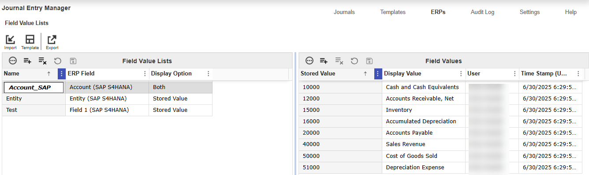

### Journal Entry Manager

NOTE: Users can only upload one file at a time.

IMPORTANT: Excel formulas within the template are now ignored during import. Only

values are processed. This prevents errors and supports more flexible spreadsheet use.

### Automated Field Value List Import

Administrators can use the folder structure and a data management job to automatically import

journal entries into Journal Entry Manager using Task Scheduler. This setting is managed at the

ERP level. On each ERP, set the Enable Auto Field Value List Import option to Yes.

GetFieldValueListlmports data management job searches for the specified parent folder for

each individual ERP's Connection Type. See Connections. You are required to set up sub-folders

with the following folder name:

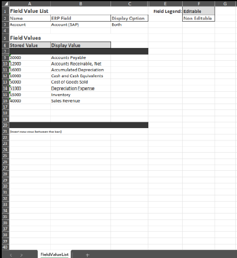

### Journal Entry Manager

l FieldValueList

When Field Value Lists are ready for import, they must be placed within the Field Value List folder

and use the following file name format: OneStream_JEM_FieldValueList_. Additional text may

be appended to the end of the filename as needed.

### Folder Hierarchy Example:

l Journal Entries: This folder is selected on the Connections page and appiled to the ERP.

l FieldValueList: This folder contains all Field Value Lists that will be imported.

IMPORTANT: All these sub-folders must be created manually. They are not

automatically created during the installation of Journal Entry Manager.

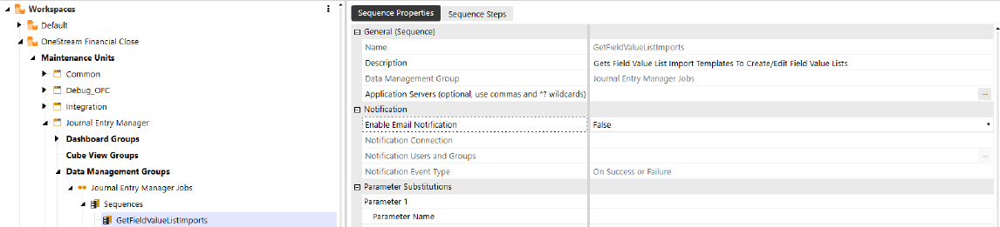

### Journal Entry Manager

### Import

1. Go to ERPs > Field Value Lists.

2. Click the Import button to import Field Value Lists for your ERP.

3. Click the Browse button or drop your file within the File Upload dialog box.

4. Use File Explorer to browse and select the file you want to import.

5. Click the Open button.

6. Click the Upload button.

## Template

1. Click the Template button to download a template to import.

2. The JEM_FieldValueList_Template.xlsx file is automatically downloaded to your default

downloads location.

IMPORTANT: Ensure that you click the Enable Editing button on the Excel

Sheet.

3. Fill out the following fields under Field Value List:

a. Enter a name.

b. From the ERP Field drop-down menu, select a field.

c. From the Display Option drop-down menu, select an option.

4. Fill out the following fields under Field Values:

a. Enter a Stored Value.

b. Enter a Display Value.

### Journal Entry Manager

NOTE: Inset new rows between the bars.

5. Save your file.

### Export

1. Select an existing ERP Field Value List you want to export.

2. Click the Export button.

3. The JEM_FieldValueList_Export.xlsx file is automatically downloaded to your default

downloads location.

### Audit Log

Administrators can use the Audit Log to review and track any change, ensuring effective change

management and auditability. It presents information in a clear and detailed format. Each entry

includes the following components:

l Functional Area: The main area where the change occurred, including Accounting

Periods, ERPs, Field Value Lists, Templates, and Template Access Groups.

l Component: This is one level down from the Functional Area and helps narrow down

specifically what was updated. These include Accounting Period, ERP, ERP Field, ERP

Format, Template Access Group, Security User Member, Security User Group, Template,

Field Value, and Field Value List.

l Parent: Certain areas are given parents to further narrow down the area that was changed.

Parents are given to ERPs, Template Access Groups, and Field Value Lists. This helps

identify the specific ERP, Template Access Group, or Field Value List that was updated.

l Name: The name of the specific field that was updated.

l Action: Indicates if the action was to create, edit, or delete.

### Journal Entry Manager

l Update User: The user who made the update.

l Update Time (UTC): The timestamp of the update made by that user.

You can filter your audit log by selecting a date range at the top of the page. This narrows the time

frame of displayed entries, making it easier to locate specific records . By default, the filter shows

entries from the past seven days, to highlight the most recent changes made.

When you click into an audit log entry, the right-hand panel displays additional details about the

update. For creations or deletions, it shows the affected fields and their resulting values. For edits,

it displays both the original and updated values for each modified field.

### Grid Toolbar

The Journal Entry Manager features grids on multiple pages that presents a range of attributes

and fields. Each grid is equipped with multiple toolbar buttons, configurable options, and sorting

capabilities to facilitate efficient viewing of items.

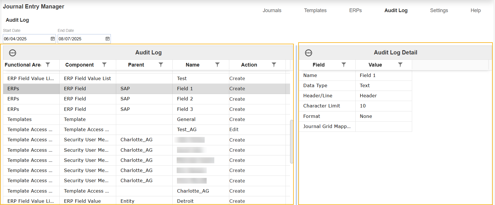

### Journal Entry Manager

### Toolbar Buttons

l Ellipses: Autofit, Reset State, and Export the Menu Columns.

l Insert Row

l Delete Row

l Cancel All Changes Since Last Save

l Save

### Click on the Column Menu filter

to sort the fields by:

l Sort Ascending

l Sort Descending

l Filter: Customize by logical or comparison operators, such as equal to, less than, null, or,

and.

l Set Column Position: The options available are Lock, Unlock, Move Previous, and Move

Next.

You can also customize the table by dragging and dropping column fields in any order desired. If

you click a column, it automatically sorts by ascending or descending order.

The content below is an example of dragging and dropping column fields.

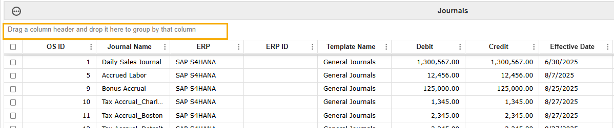

### Journal Entry Manager

### Sample Grid Toolbar

The content below is an example of the Grid Toolbar on the Journals page.

Example: The content below is an example of the Grid

Toolbar on the Notification Methods page.

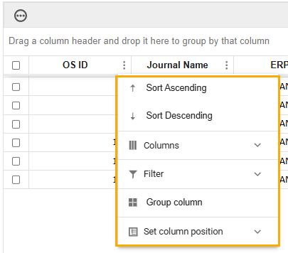

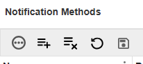

### Journal Entry Manager

### Journal Workflow

Journal Entry Manager uses a cascading workflow model, enabling users to act at their assigned

role level and any level below it. To maintain integrity, the system incorporates Segregation of

Duties. Once a user has acted on a journal, they cannot take further action on that same journal.

The journal goes through the following states:

l In Process: The initial state in which the journal is editable.

l Prepared: The first non-editable state. If changes must be made, the Preparer must recall

the journal or the Approver must reject the journal.

NOTE: Approvers also have access to the recall action if they prefer not to leave

the journal in a rejected state.

l Partially Approved: Applies only when the journal template requires multiple levels of

approval.

l Fully Approved: Indicates that the final approver has signed off. The journal is ready to be

confirmed as Posted.

l Rejected: A state where the journal becomes editable again. This is typically initiated by an

Approver to return the journal to the Preparer’s queue for revisions.

## Role

### In Process

### Prepared

### Partially Approved

### Fully Approved

### Preparer

### Prepare

### Recall

### No Action

### No Action

### Journal Entry Manager

## Role

### In Process

### Prepared

### Partially Approved

### Fully Approved

### Approver

### Prepare

Recall,

Reject, Unapprove,

Reject,

### Reject, or

### Approve

Unapprove,

### Approve

Confirm Posting,

### Download

### Administrator

### Prepare

Recall,

Reject, Unapprove,

Reject,

### Reject, or

### Approve

Unapprove,

### Approve

Confirm Posting,

### Download

NOTE: The table above displays if each role acted in this order. The available actions

differ if an Approver prepares a journal. The variations in actions are dictated by

OneStreammaintaining Segregation of Duties for each journal entry.

### Posting State

Journal Entry Manager includes an additional layer of workflow called the Posting State, which

informs users of where a journal is in the posting process and what actions are required to move it

to the final Posted state.

l Awaiting Approval: The initial posting state for a journal. Journals are not sent until they

are Fully Approved, so this state alerts users that the approval workflow must be completed

before posting can begin.

### Journal Entry Manager

l Ready to Send (Direct Download, Schedule Reversals, and Recurring Journal

Definitions only): Appears after the journal reaches the Fully Approved state in the Direct

Download workflow. Since manual extraction is required to send the journal from

OneStream, this state signals that the user must perform that action. This state is also used

when a reversing journal has been created for a future period and is being held until the

effective date to send.

l Awaiting Confirmation: For Direct Download, this state is triggered once the journal is

downloaded. For SFTP or OneStream File Explorer, this state follows the Fully Approved

status.

Example: The Posting State moves from Awaiting

Approval to Awaiting Confirmation.

l Posted: After the journal is sent to the ERP, the final Approver or an administrator can

confirm the posting. This is done with the Confirm icon, where the ERP ID and an optional

comment can be added. Once confirmed, the journal moves to the Posted state.

l Failed to Send: If the journal fails to reach its destination folder using SFTP or OneStream

File Explorer, it enters the Failed to Send state. This indicates a connection error. Once

resolved, the journal can be resent.

l Failed to Post: If the journal reaches the ERP but fails to post due to validation errors, it

enters the Failed to Post state. The journal can then be returned to In Process, revised, and

re-submitted through the workflow.

## Role

### Awaiting

### Ready

### Awaiting C

### Post

### Failed to Se

### Failed to Po

### Approvals

to Post

onfirmation

ed

nd

st

### Prepar

### No Action

### No

### No Action

### No A

### No Action

### No Action

er

### Action

ction

### Journal Entry Manager

## Role

### Awaiting

### Ready

### Awaiting C

### Post

### Failed to Se

### Failed to Po

### Approvals

to Post

onfirmation

ed

nd

st

### Appro

### No Action

### Downlo

### Confirm

### No A

### Recall, Rejec

### Recall, Rejec

ver

ad

ction

t, Unapprove

t, Unapprove

### Admini

### No Action

### Downlo

### Confirm

### No A

### Recall, Rejec

### Recall, Rejec

strator

ad

ction

t, Unapprove

t, Unapprove

### Manual Posting State Selection

When confirming a journal in the Awaiting Confirmation posting state, administrators and final

approvers indicate the posting outcome by selecting Yes or No.

l If Yes is selected, indicating that the journal was successfully posted, the confirmation

dialog displays fields for ERP Journal ID and Posting Details.

l If No is selected, indicating that the journal failed to post, only the Posting Details field is

displayed.

This ensures that all posting outcomes are tracked and audited and enables accurate manual

intervention when necessary.

IMPORTANT: If Enable Manual Posting Confirmation is set to No, the manual posting

icon and confirmation dialog do not display. See Journal Template.

### Journal Entry Manager

Reject or Unapprove a Journal and Extract Deletion

When a journal is in the Awaiting Confirmation posting state and is moved back to Awaiting

Approvals, for example if the journal is rejected or unapproved, the system will automatically

delete the previously sent journal extract from the file folder (File Share or SFTP). This ensures

that if the journal is later re-approved and re-sent, no duplicate extracts exist. The Reject and

Unapprove actions are available in the following posting states:

l Awaiting Approvals

l Failed to Send (File Share/SFTP only)

l Failed to Post (File Share/SFTP only)

NOTE: Once a journal reaches the Posted state, Reject and Unapprove are no longer

available.

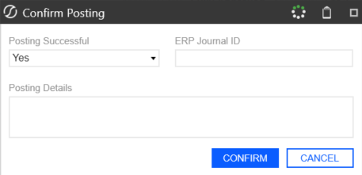

## Integration

## Integration

OneStream Financial Close consists of these integrated solutions:

l Transaction Matching

l Account Reconciliations

Perform these tasks in order to integrate the OneStream Financial Close solutions.

### Step

### Task

### See

1

### Enable integration

### Enable Integration

2

### Assign Match Sets

### Assign Match Sets

3

### Map Detail Item information

### Map Detail Item

### Information

### Enable Integration

NOTE: After you enable integration with Transaction Matching and save the settings,

you cannot disable the integration.

To enable integration between solutions in OneStream Financial Close:

## Integration

1. In Account Reconciliations, click Show Settings Page
.

2. On the Global Setup > Global Options page, click Enable next to Transaction Matching

## Integration.

3. Confirm the integration and then click Save.

See Global Setup.

### Assign Match Sets

In Account Reconciliations, assign one or more match sets to a reconciliation in the inventory.

After assigning match sets, you can filter the reconciliation inventory by the match sets assigned.

You can assign match sets to a single reconciliation or you can select multiple reconciliations and

assign match sets to the entire selection.

### To assign match sets:

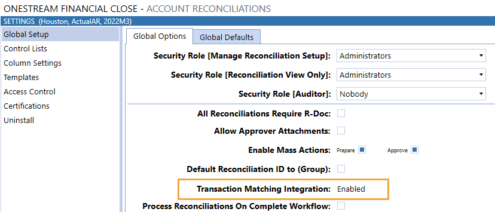

## Integration

1. In Account Reconciliations, click Show Administration Page
to display the

## Reconciliation Inventory.

2. To filter the inventory to view where Match Sets have been assigned, from the Assigned

Match Sets filter, select one or more match sets to include in the list or select one of these

options:

l (Full Inventory): All reconciliations.

l (All): Reconciliations that have a match set assigned.

l (None): Reconciliations that do not have a match set assigned.

3. Select one or more reconciliations and then click Match Set.

4. If you selected a single reconciliation, from Available Match Sets, select one or more

match sets to assign to the reconciliation, click Add, and then click Close.

If you selected multiple reconciliations, select the check box next to the match sets you

want to assign to the reconciliations, click Add, click OK, and then click Close.

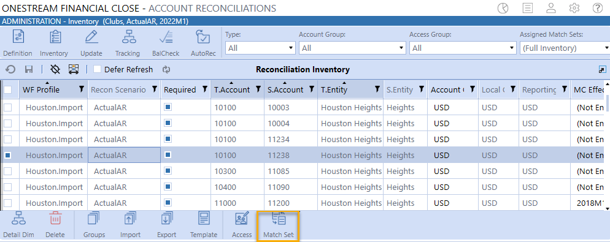

## Integration

### Map Detail Item Information

Detail item mapping is done in Transaction Matching. If a match set is assigned to a reconciliation,

you must map each data set within the match set to a reconciliation.

### Keep these mapping requirements in mind:

l If the account reconciliation instance is single currency (multi-currency is not enabled), then

Local Amount and Item Name must be mapped.

l If multi-currency is enabled and all reconciliations within the Reconciliation Inventory are

multi-currency, then Detail Amount and Item Name must be mapped.

l If multi-currency is enabled and single and multi-currency reconciliations exist in the

Reconciliations Inventory, then Local Amount, Detail Amount, and Item Name must be

mapped.

### To map detail item information:

1. In Transaction Matching, click Show Administration page
.

2. Click Data Sets and then select a data set.

3. Align the Name column with the alias for the Account Reconciliation column. For example,

Invoice is mapped to Item Name in Account Reconciliation.

## Integration

4. In the Detail Item Map column, make selections to map which columns in Transaction

Matching populate the detail item in Account Reconciliations. For example, the check

number will be displayed in the Reference 1 column.

5. In the Editable column, set which fields will be editable on the Transactions page directly in

the grid by clicking Yes or No. The following fields cannot be set as editable: SourceID,

S.Cons, Cons, S.Scenario, Scenario, S.Time, Time, S.View, View, S.Origin, Origin, WF

Profile, WF Time, and Status WF Time.

NOTE: Even if fields are marked editable, they cannot be edited for matched

transactions and transactions that are associated to a detail item in Account

Reconciliations.

### Create Detail Items

There are two ways to create detail items in OneStream Financial Close:

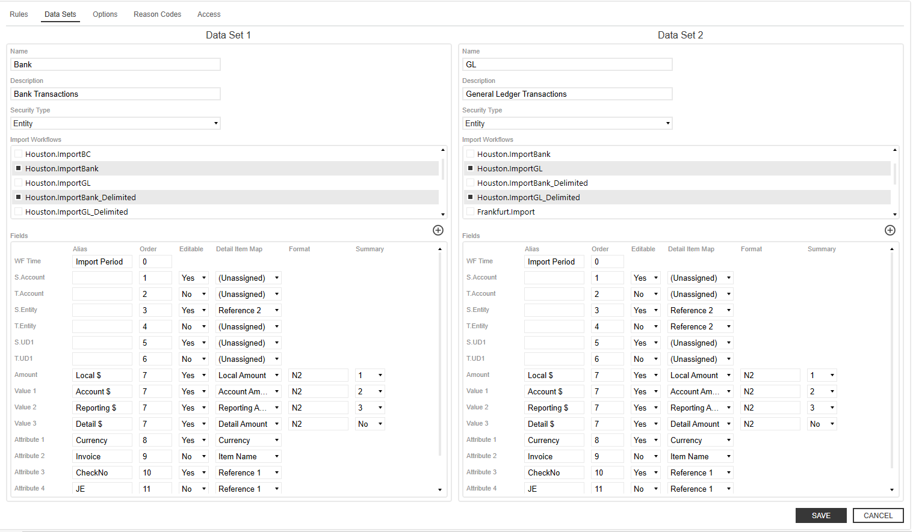