# Appendices

## Integration

l From Transaction Matching

l From Account Reconciliations

Both methods create detail items using Transaction Matching and detail items are defined as X

item types.

### From Transaction Matching

From the Transactions page, you can create detail items from matched, unmatched, or

unmatched (as of period end) transactions and send them directly into Account Reconciliations to

both individual reconciliations and reconciliations within account groups. Detail items can be

created by data set for selected transactions or all available transactions. Available transactions

are those transactions that have not already been used to create a detail item in the current

workflow period. Transactions can only be used once per workflow period to create a detail item

and cannot be deleted if used to create a detail item in any workflow period. You can also create

detail items for multiple reconciliations at once.

### Aggregation can be done by:

l Total (single sum amount)

l Transaction Date (recommended)

l Item Name

NOTE: The user creating the detail items must have access and entitlements to both

## Transaction Matching and Account Reconciliations.

These actions are not allowed while detail items are being created:

## Integration

l Processing in Account Reconciliations

l Completing Workflow in Account Reconciliations

l Running Process in Transaction Matching for the match set

l Manual matching and unmatching in Transaction Matching for the match set

### To create detail items:

1. From Transaction Status, select Matched , Unmatched, or Unmatched (As of Period

End).

2. From the Reconciliation Link drop down, select an option to filter the list of transactions:

l (All): Displays all transactions.

l No Detail Item: Displays transactions that have not been used to create a detail item

in the current workflow period. Use this option to ensure that you do not select a

transaction that has already been used to create a detail item.

l Detail Item Exists: Displays transactions that have been used to create a detail item

in the current workflow period.

3. If you selected Unmatched or Unmatched (As of Period End), go to the next step. If you

selected Matched, make selections from these filters to update the displayed transactions:

l Match Reason Code: Select one or more reason codes or All.

l Match Period: Select All, Current Period, or Future Periods

l Import Period: Select one or more import periods or All.

4. Select the check box next to one or more transactions for which you want to create a detail

item.

NOTE: The selected transactions must all be of the same currency level to create one

detail item. Transactions are first aggregated by currency level.

## Integration

5. Click Create Items.

6. For each data set, make selections from these options:

l Transactions: Options are: Selected, All, or None.

CAUTION: All creates detail items for all transactions in the data set, not

just the transactions displayed on the first page.

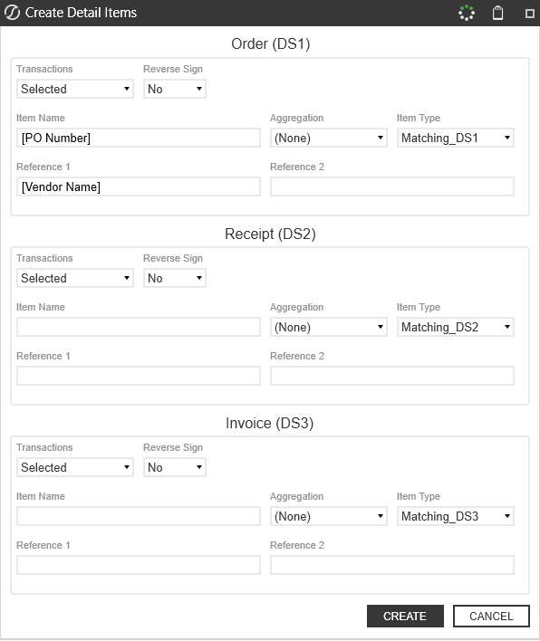

## Integration

l Reverse Sign: Reverses the sign from positive to negative or negative to positive.

l Item Name: Defaults to the mapped Item Name field and can be changed. If left

blank, it defaults to "Transaction Matching Item" as the item name.

l Aggregation: Select from these options:

o None: Creates a detail item for each transaction.

o Total: Creates one detail item for all transactions in the data set.

o Item Name: Creates a detail item for each unique item name.

o Transaction Date: Creates a detail item for each transaction date.

l
NOTE: Regardless of the aggregation selected, transactions of different

currencies will not aggregate into a single line item. For example, if you

have 10 CAD and 10 USD transactions and selected total there would be

two detail line items created, one for USD total and one for CAD total.

l Item Type: Defaults to Matching_DS1, Matching_DS2, or Matching_DS3

depending on the associated data set. You can change this to be any item type in the

control list.

l Reference 1: Defaults to the mapped Reference 1 fields. If you make any changes in

this field, the value that you input becomes Reference 1.

l Reference 2: Defaults to the mapped Reference 2 fields. If you make any changes in

this field, the value that you input becomes Reference 2.

7. Click Create.

In Account Reconciliations, the detail items display as X item types.

## Integration

### From Account Reconciliations

From the Reconciliations page, you can pull transactions directly into Account Reconciliations to

both individual reconciliations and reconciliations within account groups. To be able to pull

transactions into Account Reconciliations, the Tracking Level Dimensions must be added to the

Transaction Matching Data Set Definition. See Detail Item Integration Addendum.

From the Reconciliations Workspace, you can create detail items by matching transactions and

pulling them into Account Reconciliations. Transactions are filtered to show only those that relate

to the individual reconciliation or reconciliations within the account group and that are available for

the current period. Detail items created this way are defined as X item types and can be auto-

reconciled. See AutoRec.

NOTE: X item types created with overrides do not require supporting documentation.

The ability to drill back to Transaction Matching provides the required support.

### To create detail items:

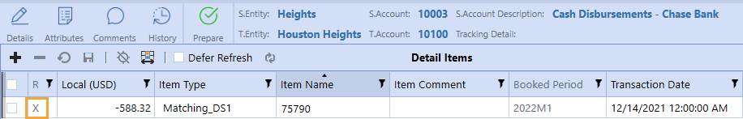

## Integration

1. Select a reconciliation or account group and then click Match Item.

2. Make selections in the Create Detail Items dialog box. These selections filter the

transactions within the match set to only those that relate to the selected reconciliation or

account group. In other words, where the tracking level in Account Reconciliations is the

same as the tracking level in Transaction Matching.

l Select the Match Set to use.

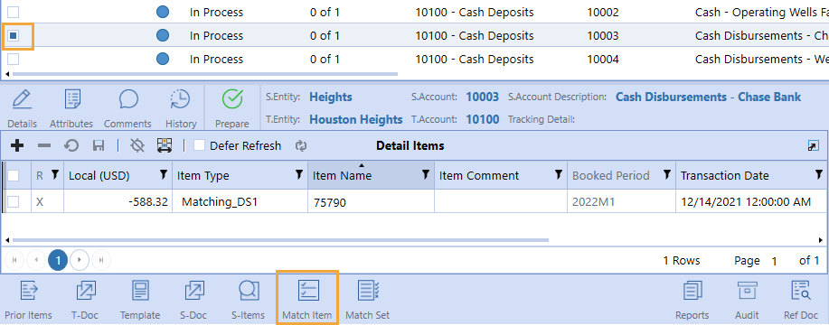

## Integration

l Select the Transaction Status: Matched, Unmatched, or Unmatched (As of Period

### End)

3. For each data set, make selections from these options:

l Transactions: Options are: Selected, All, or None.

CAUTION: All creates detail items for all transactions in the data set, not

just the transactions displayed on the first page.

l Reverse Sign: Reverses the sign from positive to negative or negative to positive.

l Item Name: Defaults to the mapped Item Name field and can be changed. If left

blank, it defaults to "Transaction Matching Item" as the item name.

l Aggregation: Select from these options:

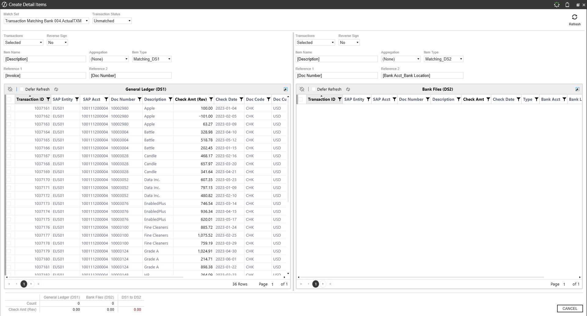

## Integration

NOTE: Regardless of the aggregation selected, transactions of different

currencies will not aggregate into a single line item. For example, if you

have 10 CAD and 10 USD transactions and selected total there would be

two detail line items created, one for USD total and one for CAD total.

o None: Creates a detail item for each transaction.

o Total: Creates one detail item for all transactions in the data set.

o Item Name: Creates a detail item for each unique item name.

o Transaction Date: Creates a detail item for each transaction date.

l Item Type: Defaults to Matching_DS1, Matching_DS2, or Matching_DS3

depending on the associated data set. You can change this to be any item type in the

control list.

l Reference 1: Defaults to the mapped Reference 1 fields. If you make any changes in

this field, the value that you input becomes Reference 1.

l Reference 2: Defaults to the mapped Reference 2 fields. If you make any changes in

this field, the value that you input becomes Reference 2.

4. Select the transactions to include in the detail item and then click Create Items.

## Integration

The transaction is added as a detail item to the reconciliation.

### Drilling Back to Transactions

From the Account Reconciliation workspace, you can select an X item type and drill back to the

transaction detail.

NOTE: You can delete detail items (X item types) that have been pulled

from Transaction Matching into Account Reconciliations. Doing so will allow the

transaction to be used again in the current period, as it is no longer associated to a

reconciliation. Select the item, click the minus sign, and then click Save. The transaction

is removed and can be used to create a new detail item in the current workflow period.

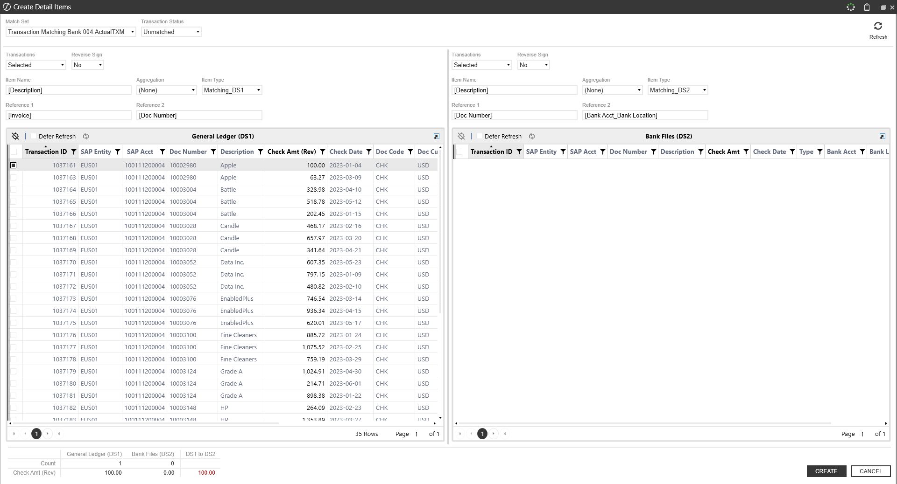

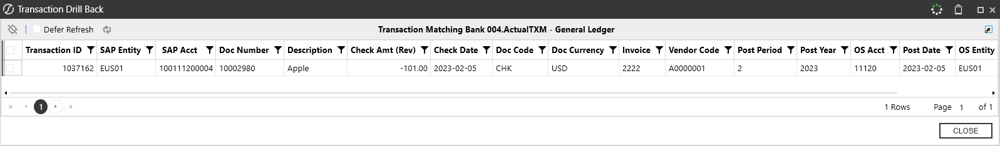

## Integration

To drill back, select an X item type detail item and then click Drill Back.

The transactional detail from Transaction Matching displays.

### Navigating to Match Sets

From the Reconciliation Workspace, you can navigate to match sets in Transaction Matching.

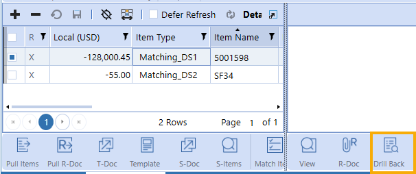

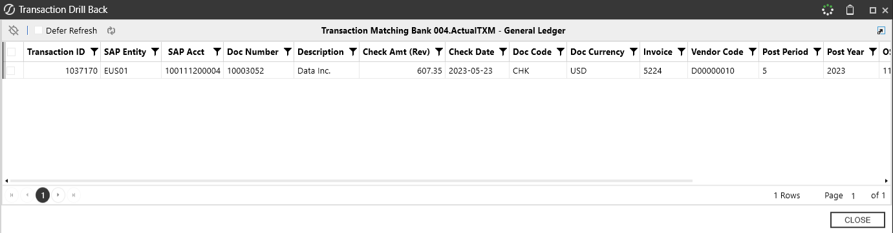

## Integration

1. Select a reconciliation that has associated match sets.

2. Click Match Set.

3. If prompted, select the match set in Transaction Matching that you want to navigate to. If

only one match set is applicable, the Transactions page opens.

### Detail Item Integration Addendum

Transaction Matching transactions are used to create detail items in the Account Reconciliations

solution. The following examples demonstrate how the selections in the Create Detail Items dialog

box determine the information in the detail item that gets created.

### Mapping

To use Transaction Matching transactions to create detail items in Account Reconciliations the

data sets in Transaction Matching need to be assigned to Account Reconciliations fields.

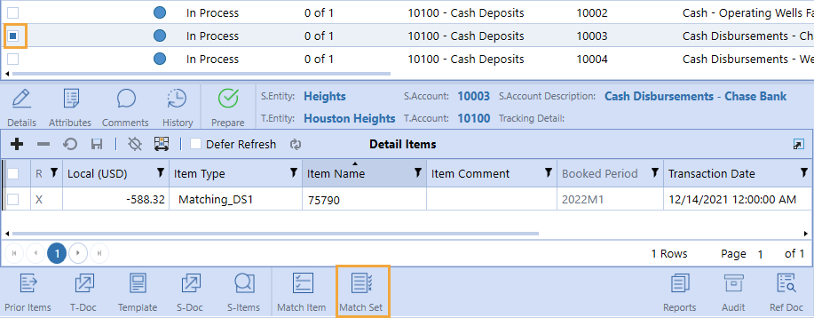

## Integration

1. Detail Amount: If multi-currency is enabled, identifies the amount to be pulled in as the

Account Reconciliation detail amount.

2. Currency Type: Detail Amount currency type used when multi-currency is enabled.

3. Local Amount: If multi-currency is not enabled, identifies the detail item amount.

4. Account Amount: Overrides what would be calculated for the account amount if multi-

currency is enabled.

5. Reporting Amount: Overrides what would be calculated for the reporting amount if multi-

currency is enabled.

6. Item Name: Default value for item name. It can be overridden and is dependent on the

selections made when creating a detail item.

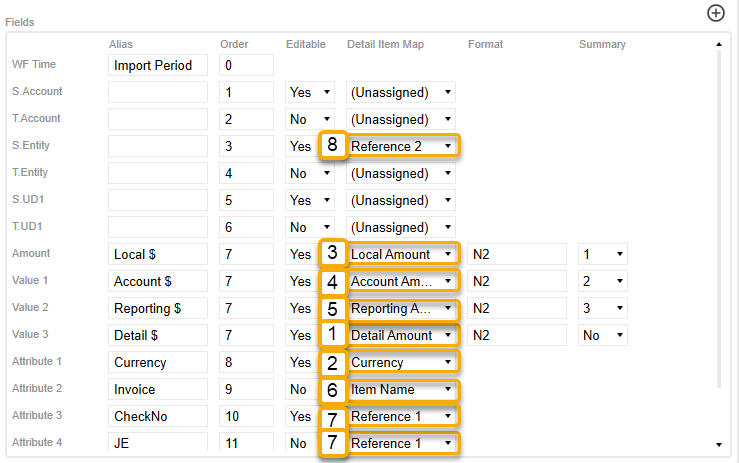

## Integration

7. Reference 1: Concatenates up to two fields and is used to provide additional information. It

can be overridden and is dependent on selections made when creating a detail item.

8. Reference 2: Concatenates up to two fields and is used to provide additional information. It

can be overridden and is dependent on selections made when creating a detail item.

### Selections

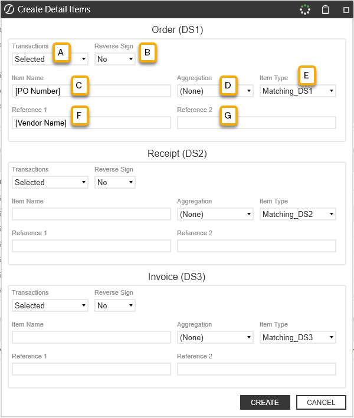

## Integration

A. Transactions: The transactions to use to create the detail items.  Options are: Selected,

All, or None.

NOTE: All creates detail items with all transactions available in the match set, not

just the transactions displayed on the first page.

B. Reverse Sign: Select to change the sign for the detail items from positive to negative (or

vice versa).

C. Item Name: Defaults to the mapped Item Name field. If you make any changes in this field,

the value that you input becomes the item name.

D. Aggregation: Used to group multiple transactions into a detail item based on the type of

aggregation selected.

NOTE: Detail items never combine transactions of different currencies.

Aggregation level overrides the mapped fields for Item Name, Reference 1,

Reference 2 and Transaction Date.

l None: This selection creates a detail item for each transaction.

o Item Name – Input from this field in the dialog.

o Reference 1 and Reference 2 – Input from these fields in the dialog.

o Transaction Date – Date of the transaction.

l Total: This selection creates one detail item for all transactions in the data set

o Item Name –Displays as “Transaction Matching Item”.

o Reference 1 – Name of the Data Set, Transaction Status, and reason codes (if

matched) (for example, Bank;Matched;ReasonCode:Immaterial,DateVariance)

## Integration

o Reference 2 – Selection of transactions and aggregation level (for example,

### Selected;Total)

o Transaction Date – Defaults to end of the period.

l Item Name: Creates one detail item for each unique item name.

o Item Name – Input from this field in the dialog.

o Reference 1 – Name of the data set, transaction status, and reason codes (if

matched) (for example, Bank;Matched;ReasonCode:Immaterial,DateVariance)

o Reference 2 – Selection of transactions and aggregation level (for example,

### Selected;Total)

o Transaction Date – Defaults to end of the period.

l Transaction Date: Creates one detail item for each transaction date.

o Item Name – Displays as “Transaction Matching Item.”

o Reference 1 – Name of the data set, transaction status, and reason codes (if

matched) (for example, Bank;Matched;ReasonCode:Immaterial,DateVariance)

o Reference 2 – Selection of transactions and aggregation level (for example.

### Selected;Total)

o Transaction Date – The date of the transaction.

E. Item Type: Defaults to Matching_DS1, Matching_DS2, or Matching_DS3 depending on

the associated data set. You can change the item type to be any item type in the control list.

F. Reference 1: Defaults to the mapped Reference 1 field. If you make any changes in this

field, the value that you input becomes Reference 1.

G. Reference 2: Defaults to the mapped Reference 2 field. If you make any changes in this

field, the value that you input becomes Reference 2.

## Integration

### Scheduling Data Management Jobs

You can schedule data management jobs to create detail items from Transaction Matching. See

the Task Scheduler section of the Design and Reference Guide.

Available parameter names, including default values and valid values, are listed below.

Parameters with an asterisk are required.

NOTE:  Use the following format to define a MatchSetName value: Workflow

Profile.Scenario. For example, in the previous image, the MatchSetName value is

Houston.ActualTM. The Workflow Profile is Houston and the Scenario is ActualTM.

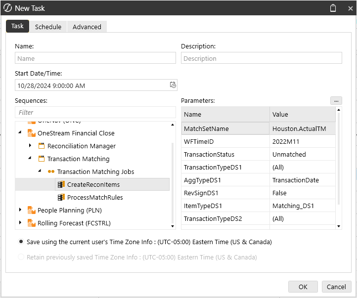

## Integration

### Parameter

### Default Value

### Valid Value

### MatchSetID* (default) or

### MatchSetName*

### WFTime* (default) or

### WFTimeID*

### TransactionStatus*

### Unmatched, Unmatched as

of Period End, Matched

### MatchReasonCode

(All)

### Any Reason Code name

### MatchPeriod

### Future

(All), Future, Current

### ImportPeriod

(All)

### Any WFTimeID

### TransactionTypeDS1

(All)
(All), Selected, (None)

### ItemNameDS1

### Substituted Value

### ReferenceOneDS1

### Substituted Value

### ReferenceTwoDS1

### Substituted Value

### AggTypeDS1

(None)
(None), Total, ItemName,

### TransactionDate

### RevSignDS1

### FALSE

### True/False

## Integration

### Parameter

### Default Value

### Valid Value

### ItemTypeDS1

### Matching_DS1

### Any Item Type

### TransactionTypeDS2

(All)
(All), Selected, (None)

### ItemNameDS2

### Substituted Value

### ReferenceOneDS2

### Substituted Value

### ReferenceTwoDS2

### Substituted Value

### AggTypeDS2

(None)
(None), Total, ItemName,

### TransactionDate

### RevSignDS2

### FALSE

### True/False

### ItemTypeDS2

### Matching_DS2

### Any Item Type

### TransactionTypeDS3

(All)
(All), Selected, (None)

### ItemNameDS3

### Substituted Value

### ReferenceOneDS3

### Substituted Value

### ReferenceTwoDS3

### Substituted Value

### AggTypeDS3

(None)
(None), Total, ItemName,

### TransactionDate

## Integration

### Parameter

### Default Value

### Valid Value

### RevSignDS3

### FALSE

### True/False

### ItemTypeDS3

### Matching_DS3

### Any Item Type

### Help and Miscellaneous Information

### Help and Miscellaneous

### Information

Access the help documentation.

l Set Optimal Display Settings

l Package Contents and Naming Conventions

l Database Migration Considerations

l Modifying Solution Considerations

l Custom Service Factory

### Set Optimal Display Settings

OneStream Solutions frequently require the display of multiple data elements for proper data

entry and analysis. Therefore, the recommended screen resolution is a minimum of 1920 x 1080

for optimal rendering of forms and reports.

Additionally, OneStream Software recommends that you adjust the Windows System Display text

setting to 100% and do not apply any Custom Scaling options.

### Help and Miscellaneous Information

### Package Contents and Naming Conventions

The package file name contains multiple identifiers that correspond with the platform. Renaming

any of the elements contained in a package is discouraged in order to preserve the integrity of the

naming conventions.

### Example Package Name: OFC_PV9.0.0_SV202_PackageContents.zip

### Identifier

### Description

### OFC

### Solution ID

### PV9.0.0

Minimum Platform release required to run solution

### SV202

### Solution version

### PackageContents

### File name

### Solution Database Migration Advice

A development OneStream application is the safest method for building out a solution with custom

tables such as this one. The relationship between OneStream objects such as workflow profiles

and custom solution tables is that they point to the underlying identifier numbers and not the

object names as seen in the user interface. Prior to the solution configuration and to ensure the

identifiers match within the development and production applications, the development

application should be a recent copy of the production application. Once the development

application is created, install the solution and begin design. The following process below will help

migrate the solution tables properly.

See also: Managing a OneStream Environment in the Design and Reference Guide.

### Help and Miscellaneous Information

### OneStream Solution Modification

### Considerations

A few cautions and considerations regarding the modification of OneStream Solutions:

l Major changes to business rules or custom tables within a OneStream Solution will not be

supported through normal channels as the resulting solution is significantly different from

the core solution.

l If changes are made to any dashboard object or business rule, consider renaming it or

copying it to a new object first. This is important because if there is an upgrade to the

OneStream Solution in the future and the customer applies the upgrade, this will overlay

and wipe out the changes. This also applies when updating any of the standard reports and

dashboards.

l If modifications are made to a OneStream Solution, upgrading to later versions will be more

complex depending on the degree of customization. Simple changes such as changing a

logo or colors on a dashboard do not impact upgrades significantly. Making changes to the

custom database tables and business rules, which should be avoided, will make an

upgrade even more complicated.

### Custom Service Factory

The purpose of the Custom Service Factory is to provide a method in which you can add

customizations to the Transaction Matching solution.

IMPORTANT: Maintain your assembly as customizations will not remain in place during

a solution upgrade.

### Help and Miscellaneous Information

### Set Up the Custom Service Factory

1. On the Application tab, go to Workspaces > OneStream Financial Close >

Maintenance Units >  Transaction Matching > Files.

2. In the Files folder, click CustomEvents_TXM.xml.

3. In the General (File) pane, click the Download File button, and save the file.

4. On the Application tab, click Tools > Load/Extract.

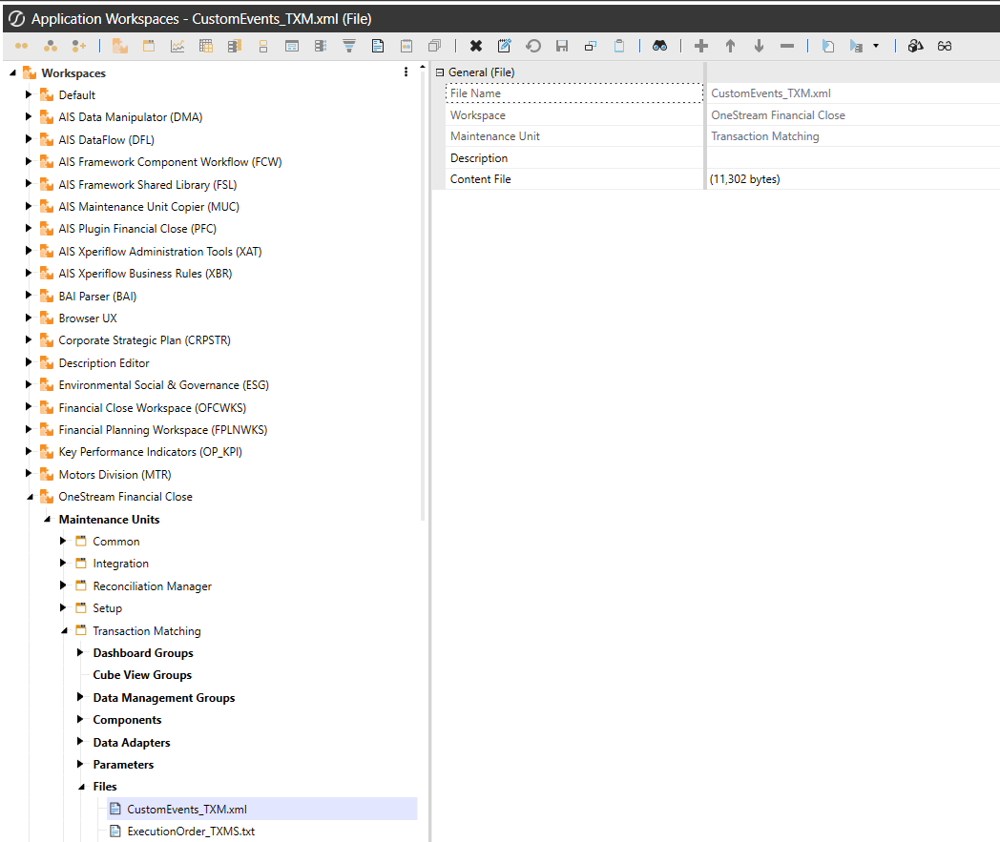

### Help and Miscellaneous Information

5. On the Load tab, locate CustomEvents_TXM.xml using the Select File icons and click

Open.

### Change Assemblies Setting Upon Install

1. On the Application tab go to Workspaces > OneStream Financial Close > Maintenance

Units >  Transaction Matching.

2. In the Workspace Assembly Servicefield, type TXM_Custom.WsAssemblyFactory.

### Maintain Assembly

1. On the Application tab, click Tools > Load/Extract > Extract.

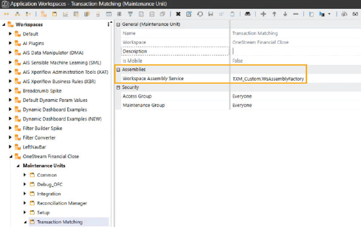

### Help and Miscellaneous Information

2. Clear the All checkbox.

3. Go to Workspaces > OneStream Financial Close > Maintenance Units > Transaction

Matching > Workspace Assemblies.

4. Select TXM_Custom.

5. Click the extract button
.

NOTE: Extract assembly before uninstalling UI.

## Appendix A: Date Grouping Tolerances

## Appendix A: Date Grouping

### Tolerances

This section explains Date Grouping Tolerances and how to set them up in OneStream. To help

explain Date Grouping Tolerances, we'll use two data sets to show how matches work when you

have:

l No date tolerances

l Post-aggregate date tolerances

l Pre-aggregate date tolerates (new feature added for the PV710 SV100 release)

These are the data sets we'll use to explain the different scenarios. They both have a list of five

transactions containing invoices with dates and amounts.

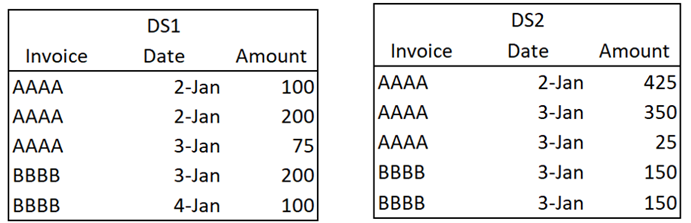