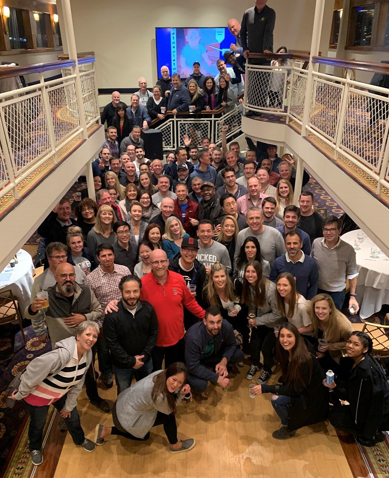

# Introduction

Originally written by Peter Fugere, updated by Chul Smith Welcome to the OneStream Foundation Handbook. We hope this book will serve not only as a guide to help you become certified, but also act as a reference as you build your career implementing and supporting OneStream. This book is meant to be part of your library, but not your only reference; indeed, it is not an administrator’s guide. Administrator guides answer the ‘how’ of settings in OneStream, but this book answers the ‘why’. For example, if you need to know where the settings are for the intercompany (IC) member, so you can map data to it for your intercompany accounts, this book will not be all that helpful to you. That information is well-documented in the OneStream Documentation (click the ? in the application) and Resources section of OneStream Community website. But those places do not tell you how other people are using the IC member to simplify the close, how they integrate it with other features, plus any tips for making the close easier and more auditable. If you need to understand why, then I think the following pages in this book will help. The good news, moving forward, is that there really could not be a more qualified team to bring this information to you. Not only has the team writing this book pioneered many of the approaches detailed, they have also been working exclusively with OneStream longer than anyone else. They have decades of experience with Corporate Performance Management (CPM) systems, and have worked with products from SAP, Oracle, and other suites.

## What Is OneStream?

OneStream Software is a powerful platform that performs all the critical roles one would desire from a world-class Corporate Performance Management (CPM) solution. At its core is a powerful budget and forecasting, consolidation, financial data quality, and management reporting solution. This platform includes solutions like Account Reconciliation, Task Management, People Planning, and Compliance solutions. OneStream, as mentioned above, really is a platform. A technology platform is a set or group of technologies or applications on which other technologies or applications are developed. A great example of this is Visual Basic. On that technology, all kinds of applications and solutions have been created; from simple macros in Excel to more complex database automation programs. OneStream allows developers to write software on our software, and that defines a true platform. We talk a lot about extensibility. Extensibility means the ability to be extended or stretched. Really, it is a software engineering and design principle that considers the ability and level of effort required to implement new functionality, and which facilitates enhancements without impacting the existing functionality. It is a powerful concept. OneStream is extensible in several ways, which all need to be considered when forging designs. They include dimensions, workflow, cubes, and applications. The Solution Exchange also allows for extensibility. Extensibility allows OneStream to do everything it does. The OneStream Solution Exchange has fully functioning applications, sample dimensions, and application starter kits. OneStream develops some of them while others have been created by our partner network and those in the OneStream Community. A couple of OneStream-developed examples include People Planning and Capital Planning. People Planning manages all employee and vendor-related details, including compensation benefits and travel expenses; this makes it easier to add new employees and their training plans. Capital Planning manages all capital assets and related expenses, including depreciation and insurance. Customers can get information about the impact capital planning decisions have on business-wide financial results. We won’t get too far into each of these solutions in this book, but we will cover the foundational concepts that will allow you to design for, and consider, the implications of adding anything from the Solution Exchange. The other concept we will spend some time on, in this book, is the concept and principles of relational blending. This is a powerful concept that is based on the simple fact that not everything belongs in a cube data model. Other products will force virtually everything into a cube if they are based on multidimensional models. It’s the old cliché, ‘When you’re a hammer, every problem looks like a nail.’ In OneStream, we have a full toolbox. When you want to use a cube, a relational table, or something in between, you can (and should). Because of the platform, users will not have issues around the timing of data and the integration of multiple systems. This is a game-changer. OneStream is more than just a CPM product. It includes XP&A, financial signaling/steering, and account reconciliation, to name a few. It holds a lot of power and flexibility. We will cover our proven methodology in this book, plus explain how you can benefit from the system and work off an effective blueprint. One thing we have a lot of pride about (here at OneStream) is having so many clients willing to be a reference. Many companies use OneStream with fantastic results. Many people use the platform to make their close and budget cycle smoother and improve the work they are doing. The key is obvious: there is a right way to put this tool in place. This book shares the right approach, and the tips that will save you hours – maybe days – of frustration and pain.

### Contents

This book is not just written for people who want to implement OneStream for the first time, although the flow of the book does follow the lifecycle of design and implementation. Before you even get the product in your company, you will likely need to build a case for buying the tool. This book will help you to understand the three differentiators that OneStream offers, and help you unlock the full value of a project. Chapter 2,Methodology and the Project by Greg Bankston (updated by Greg Bankston), covers multiple areas when planning for, and beginning, your implementation. We cover things such as requirements gathering, design considerations, choosing a partner, and testing methodologies. We also discuss the importance of defining scope, and creating a timeline, as well as supporting your application after the project team has moved on. We even tackle the tough topic of project management, particularly regarding why a project manager is critical, along with understanding different methodologies, such as Waterfall and Agile. Finally, we discuss the overarching challenges of managing your implementation. What critical elements do you have to balance during the course of a project in order to achieve success? What are the trade-offs involved in them? How can you mitigate risk along the way? At the end of Chapter 2, you should have a solid understanding of how to best position yourself and your implementation for success, and how to handle obstacles as they arise. Experience has shown that challenges always come up, so it’s best to be ready for them! Chapter 3, Design by Peter Fugere (updated by Chul Smith), will cover the critical steps when making sure a project gets off on the right foot. This chapter explains how to utilize cubes and extensibility to have a good design. This chapter will start to explain key objectives and provide the foundation for beginning your design. You should leave this chapter with a good understanding of what OneStream is capable of. Then, the chapter will cover key drivers to help identify the goal when embarking upon a project using OneStream, plus the team that should be assembled. The key to having a good project will be starting the first two phases correctly from Chapter 2, thus providing a strong foundation for your project. The design part of this chapter will cover the fundamentals of dimensions, and some key considerations when designing them. The main aim of this chapter is to explain how you might get better use from the product, by making some simple updates to the design. It will cover many of the tips and techniques you will need to have a great implementation, which will allow the later chapters to go into deeper detail. There is no ‘secret sauce’ to having a great project. There are some simple guiding principles that – when followed – ensure success. In fact, almost every successful consulting company uses quite similar processes and approaches. The key is simplifying the transfer of ownership and ensuring high-speed end-user adoption. Chapter 4, Consolidation by Eric Osmanski (updated by Nick Bolinger), will cover the concepts and approach for building what many consider to be one of the two pillars of CPM. Consolidation is much more than aggregating data. Global enterprises are tasked with solving complex consolidation challenges every day – often with legacy tools or spreadsheets that are inflexible, create manual work, and unreliable. As an organization grows and becomes more sophisticated, these tools are no longer able to meet the business’s requirements. In this chapter, we cover the most common challenges and the various solutions OneStream’s unified platform can provide, always keeping in mind the balance between maintenance, user experience, and performance. Chapter 5, Planning by Jonathan Golembiewski (updated by Jonathan Golembiewski), takes his years of experience implementing planning, and explains some of the most important design considerations. Easily the most common use of OneStream, planning (with the detailed requirements that today’s companies require) is anything but easy. The volumes of data, the complexity of calculations, and the need for flexibility make OneStream just about a necessity. Chapter 6, Data Integration by John Von Allmen (updated by Joakim Kulan), covers the fundamentals of gathering data from disparate source systems and serving it to the OneStream database in a way that provides transparency, auditability, and security. Chapter 7, Workflow by Todd Allen (updated by Chul Smith), will cover what the workflow is. Why do we have workflow? And where does one start!? Great questions. For folks who are new to OneStream, workflow is one of the more powerful portions of the tool. We consider it the backbone of the system. It defines who does what, when, and how. In this area of the platform, we can import basically any kind of data. Then transform it, validate it, calculate it, automate it, and perform analysis on it. We can even certify it. Those are just some highlights, as workflow has so much to offer. Take the journey with us through the history and evolution of OneStream workflow! Chapter 8, Rules and Calculations by Nick Kroppe and Chul Smith, breaks down the intricacies of writing rules. If these calculations were easy, most products could do them. They don’t. OneStream expertly handles the most difficult and sophisticated aspects of consolidation and planning, from translation, eliminations, and contributions – and why we do what we do in OneStream – it is all covered here. Chapter 9, Security by Jody Di Giovanni (updated by Bobby Doyon), provides a unique perspective on security, not just from the standpoint of implementation, but from the author’s world of experience in support. Jody sees the impact of bad design practices and the rework required to fix them. Jody’s views and guidance are truly matchless and invaluable, and she will explain the foundational principles for building security that can last for the lifetime of your implementation. Chapter 10, Reporting by Jacqui Slone and Chul Smith (updated by Chul Smith), covers reporting fundamentals. A system is only as good as the reports you create. In this chapter, you’ll learn how to deliver quality reports that perform to their peak. Chapter 11, Excel and Spreadsheet Reporting by Nick Blazosky (updated by Nick Blazosky), covers all the things you can do with OneStream in Excel. Quick Views, Cube Views, Table Views, Excel, and Spreadsheet. With so many options, which one should you choose and why? This chapter familiarizes readers with the various ad-hoc reporting methods and how to use them. By the end of this chapter, the reader should be an expert in the various means by which to create ad-hoc reports. Chapter 12, Analytic Blend by Andy Moore, Sam Richards, and Terry Shea (updated by Chul Smith), discusses OneStream’s unmatched ability to ‘blend’ validated financial data, highly dimensional operational data, and detailed transactional data in one platform for comprehensive, controlled, and consumable analysis and visualization. You will be able to combine financial, operational, and transactional data in a single dashboard for all-inclusive visualization and analysis. Allow your finance team to maintain one source of truth for data, extending access to business managers and executives with confidence. And eliminate data latency and unnecessary replication of financial data for analysis, while retaining security, intelligence, workflow, governance, and audit trails. Phew! Chapter 13 sees Shawn Stalker (updated by Shawn Stalker) cover the Introduction to the Solution Exchange. It includes a brief history and how it was created, then delves into the Solution Exchange’s relationship with the platform development team, development processes, how we differ, and how we work together. Shawn then covers what is in the Solution Exchange, before diving into environment considerations, solution upgrading, and customization. Chapter 14, Performance Tuning by Jeff Jones and Tony Dimitrie, covers how to tune and optimize your application. Again, we have two experts – who are responsible for supporting many of our client applications – sharing their experiences. Not only do they give examples, but they explain why and how to resolve numerous issues.

## The Life Cycle Of Data And Its History

It all starts when someone buys something. It could be anything – a book, a car, or a coffee. This simple transaction, done millions and billions of times, is the start of a chain of events that drives the reporting of a business. The cashier enters that transaction into a cash register, or more likely today, a computer. All kinds of information are captured: the item bought, date and time, location of the sale, the price, and probably more. That single transaction record gets moved to a larger database. More detail of the transaction is identified and tagged to the data. In what region did this sale take place? What reporting period is it? Lots more detail is captured. But how does that data become something meaningful that explains what is happening in the business? And the real question that more and more companies ask is how that single data point contributes to something that is actionable. In the late 1970s, IBM and Oracle developed the first SQL databases based on Edgar Codd’s research on the System R database. Computers were large, bulky, and expensive, and the ones available for less than a few thousand bucks were only for enthusiasts. But over the next 20 years, the price and other restrictions would fall. Companies built large databases (at that time) of all kinds of information, but the reporting fell short. The large transaction volumes made the types of summary viewing slow and difficult. The large databases recorded these transactions in sales databases, inventory systems, and general ledgers. The data across all of them was often not consistent, though. More broadly, key systems like the general ledger are often considered the ‘book of record’. This book of record is the single truth that should be used across the business – because those are the numbers that are externally reported. However, businesses do not report transactions; they report balances or subtotals of the transactions. Furthermore, the types of calculations that need to be done on the data are not things that lend themselves to be done on transactional data. Accounting rules requiring translation and eliminations are complicated enough to reconcile on a summary level, but useless on the transactional level. Business processes, like forecasting and budgeting that add dimensions and slices of data, are done at a level above transactional data. So, while the large SQL databases captured transactional data as part of a business process, used to run the business, more agile databases were needed to support decision-making. A special type of database for this was called OLAP. By the 1990s, many companies were developing all kinds of such agile OLAP databases, for all kinds of different functions in the business. Consolidation, tax provisioning, budgeting, capital planning, cash forecasting, and human resource systems were all springing up. Helping companies undertake these different business reporting endeavors became known as Corporate Performance Management (CPM). By the early 2000s, there was an opportunity for the larger players to consolidate all these functions at different companies and bundle them as ‘suites’. While they could address many business issues, and help with reporting, the management of these systems proved costly and difficult – to say the least. The other thing happening in the early 2000s was that many new vendors began to offer new reporting called Business Intelligence (BI). Most BI projects then were managed by the IT department, and they looked to leverage the Extract, Transform, and Load (ETL) tools and Online Analytical Processing (OLAP) software that companies had in place. There was a natural overlap with CPM suites, and many of them began to offer BI as part of the CPM offering. By the late 2000s, new companies sprung up that even broke the individual processes into several databases. Disconnected planning, for example, doubled down on creating applications spread across organizations. While it gave smaller groups more of a voice in creating plans, a quick Google search will reveal how it created a lot of infighting. And while all that was happening, in the offices of the CFOs, the costs of supporting massive transactional databases, maintaining the software to keep them in sync, and the dozens of business vendors each offering an application was getting ridiculous. I was on a CPM project for a health provider in Michigan in 2011, and we had a project manager, seven product-specific experts, and an infrastructure consultant on the team. We completed a design and installation for one client, and the cost was over $100,000. We did not even start building anything for them! Costs were getting out of control, which brought pressure and scrutiny on projects that made them more difficult to manage and deliver. By the early 2010s, the team at OneStream had an idea that – in hindsight – seems so obvious, but which was truly revolutionary. If we could deliver a platform that could do all the things mentioned above, the support, complexity, and difficulty of maintaining all these CPM databases would be drastically reduced. The suite was created from different products, all using different technology at different times, by different companies. This platform would be a single set of software that could do everything CPM was defined by, but which could grow and evolve with the business. This platform would defy disconnected planning, but still allow everyone to have specific applications and requirements. It was a game-changer.

## Why Use The OneStream Platform?

OneStream looks at our platform as having three main functions. They are CPM (corporate performance management), operational data/OKRs, and AI/ML. These groupings give different types of insight into your business at different times. I like to describe it as if you’re driving a car. CPM is like looking in your rear-view mirrors – the information you are getting is in the past. Even Budget data, by the time it is approved, is dated. This data is often required by law and regulations, and includes Actual, Budget, and Forecast data. Operational data is like looking at your car’s dashboard. You can see the immediate feedback of metrics that tell you how to steer your business. These are often defined as OKRs or metrics in a business. Units sold, new hires; these are small data sets updated very frequently. And while having this information allows you to react quickly, these data sets don’t help you long term. Machine learning used in planning on-time series data is like seeing out your windshield and down the road. The constant, immediate, and accurate forecasts give more information about where you want to take your company. This Foundation book will focus on CPM and its purpose. Companies that spent millions on data warehouses found the reporting from these systems wanting, and needed better solutions. OneStream is built for consolidations and planning; it is ready to do basic work on day one. For example, intercompany reconciliations can be a challenge without a CPM tool. You can’t use Excel reliably anymore. The fact that OneStream has an out-of-the-box report that allows users to view not only the accounts they have going out, but what other people in other legal entities have booked against those amounts, helps the people who are booking those transactions to be proactive. I like to say CPM tools change the conversation. Instead of people explaining to someone else that there is ‘an issue’ – each person can see for themselves what the issue is, and more importantly, proactively work to resolve said issue. Instead of, “Did you know your intercompany doesn’t balance,” the conversation would be, “Yes, I saw the issue, and we think we know what booking caused it. We will have an update in the next couple of hours.” This saves time in the reporting process. It makes people more productive.

### Flexibility

OneStream, with its Extensible Dimensionality, allows for simple and complex changes to structures. You can have an account as a base member for the Budget, but be a parent for Actuals – or vice versa. The ability of rules to recognize the different structures, and parents and values within system accounts, allows OneStream to aggregate data in a variety of ways. You can design accounts and User Defined dimensions to give tremendous flexibility and handle all kinds of unforeseen changes. You can load the data one time, and consolidate it in as many ways as you need with different structures and parents. Each parent-child relationship allows for the separate storage of elimination and proportional data. Also, each entity has four separate places where journals can be posted to the system, including parent members. All in all, OneStream provides a means to handle anything that comes your way as your reporting structure changes.

### Accountability

OneStream records just about everything that users and administrators do. You can also see key tasks your users are doing and when, and there are audit logs that record how the data changes and who is making those changes. Workflow with security makes it easier for end-users to navigate the system, and harder for someone to make a mistake. OneStream records date and time stamps, and also records user IDs whilst authenticating them with a variety of commonly-used network security databases. These measures ensure the system is secure and data is safe.

### Mergers And Acquisitions

The front end of OneStream benefits from the decades of knowledge our founders have accumulated whilst working with Fortune 100 companies on data integration. Acquisitions can sometimes prove to be a struggle to integrate to a corporate standard. Consider how every company has a different chart of accounts and structure to their databases. Even companies that work in the same business might have quite different accounts and naming conventions. How do you bring together all these systems into one common chart of accounts? OneStream! An auditable and secure source for all of your data.

### Speak Better To Your Data

Not only does OneStream offer one place for reporting data – including consolidation, budgets, and forecasts – it brings together tax provisioning, account reconciliations, leaseholding reporting, and much more. The ability to have all this data in one system speeds up reporting, and ensures that there is little chance the numbers will be out of sync. Instead of reconciling data, people on your team can do things like analyze KPIs or key differences. They won’t be spending their time making sure every report reconciles, and each report reconciles to each other. In turn, workflow’s ability to report on all tasks gives visibility into what is driving the time people take to submit. This improves the opportunities to see what is really happening in the business, leading to smarter decisions.

### Validating The Data

In this book, we are going to explain how to take advantage of certification and confirmation rules to allow for many types of data to come together and reconcile. Text and document attachments allow OneStream to become the book of record for all your financial close-related documents.

### Costs – Rising Audit Fees

Because OneStream has set the standard for data integration and reconciliation, integrations with other systems lead to a platform that is easier to audit; you will find all your data in one place. This improves transparency without sacrificing any security. OneStream reports provide basic reporting for journals and intercompany data, which makes the system much faster to audit and understand. With OneStream, you can reduce and replace manual control procedures with automated and preventative controls that ultimately reduce your processing and auditing costs. This includes tasks like eliminations and allocations, plus common or repetitive validations within the system.

### Leading Practices

The goal of this book is to provide a way for our community to build a system – for our mutual clients – that lives up to the promise of OneStream. There will be reasons why you might not follow every prescribed approach or detail here in this book, but knowledge is power, and you should consider the pros and cons of doing so. Moreover, you should explain these pros and cons to any client. They might be willing to live with something, knowing they are getting a benefit.

## Conclusion

In this chapter, we covered the history of OneStream and what defined it. We also laid out the critical parts to a project, and aligned them with the chapters that are to follow. With this knowledge, you are ready to begin your project. That project may be a new set of reports, adding a cash flow, or a full implementation – now you are ready. Closing each chapter, the authors have included a photo and short story about something that makes them proud to work at OneStream. We thought it would be fun to share our journey with our readers. This is mine.

## Epilogue

In 2013, I was managing a consulting team doing implementations. My last book about implementation practices had been released in 2011, but even in two short years, it was clear that there had been a seismic shift in the landscape of Corporate Performance Management (CPM) software. (The biggest change being the movement of products to the cloud.) The team recognized this shift, and that new products needed to be considered if we were to maintain growth. Alongside other trips, I headed out to Michigan to look at a brand-new startup company called OneStream Software. I knew all the people there; anyone who worked on Hyperion would know them. The team from Data Fusion was the top group of data integration consultants in the field, and included Eric Davidson (a product manager since 2001), Craig Colby (one of the owners of UpStream), Bob Powers (Vice President of software development for Hyperion and the inventor of Hyperion Financial Management), and Tom Shea the founder and inventor of UpStream (later rebranded as FDMEE). Like many people in the space, I got to meet and work with all these people. It was clear that there was something special happening at OneStream. As I did my research, I needed to know if the company had more than some well-known leaders, and if a real product existed. I came with a couple of senior managers from my team for a training session and demo. The three of us heading to the OneStream headquarters had worked on hundreds of applications; we would know the limitations very quickly, and if the product was viable. We met in a small office on Main Street in Rochester. It was clear this company was just starting out, but the product left us impressed. This was a platform; it was an approach unlike anything else in this space. The highlight came at the end when Eric Davidson offered to upgrade the server while we watched. I politely explained we had to catch a flight in three hours. Eric finished the upgrade in seven minutes! The three of us at the meeting left enthralled. Since that time, most of the consultants I have worked with on other products have migrated to OneStream. All of them have realized what I did during that week of training. The OneStream platform is a powerful tool that does more to meet the needs of a client than any other single product. It is going on twelve years for me working on projects and helping companies use OneStream. One of the greatest pleasures of my working career has been in helping to build the team in the photo on the next page. I consider myself truly lucky to have worked with so many amazing consultants. We have an amazing team, and they are as responsible as anything for this company’s success. These people deliver our projects. A big part of our success has been our unusually high reference rate; at OneStream, we honestly believe every client will be a reference. Indeed, OneStream is well-known for giving prospective clients our entire client list to call as references. That is truly remarkable in software. Often, our competitors can only give one or two. To maintain our growth, it was obvious to the team at OneStream that we needed to get more information about our best practices out to the community. This book should help you take your design and implementation game to another level. In this book, you will find chapters written by experts with decades of combined experience, working on the largest and most complex companies in the world. I hope this will serve as your guide to help us deliver on more and more successes!

