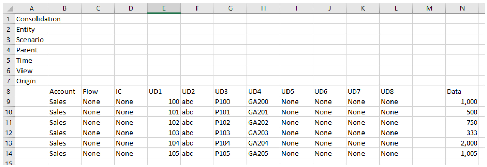
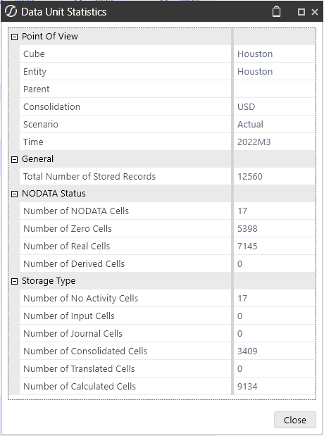
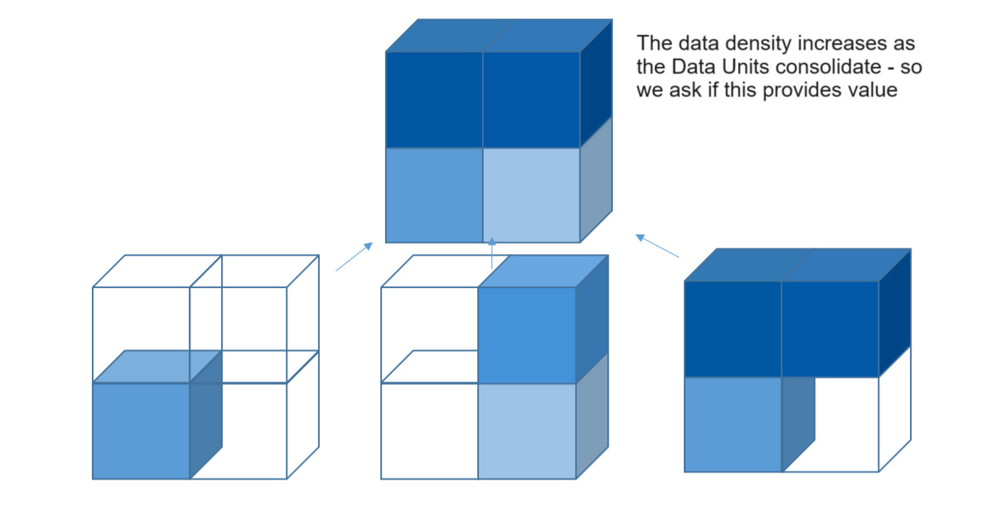
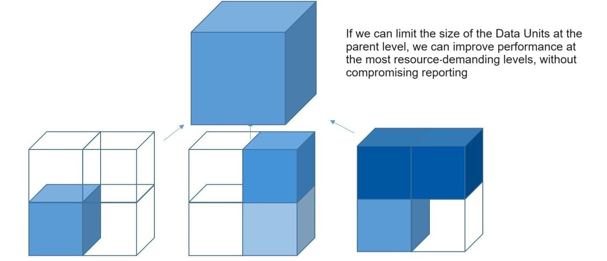
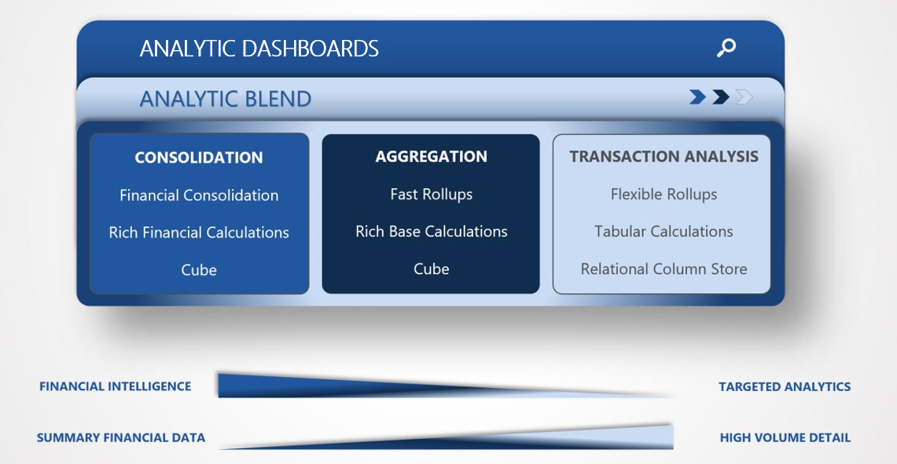
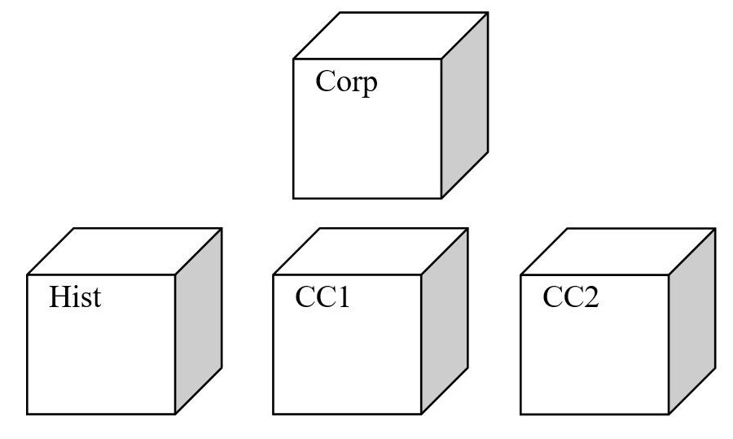
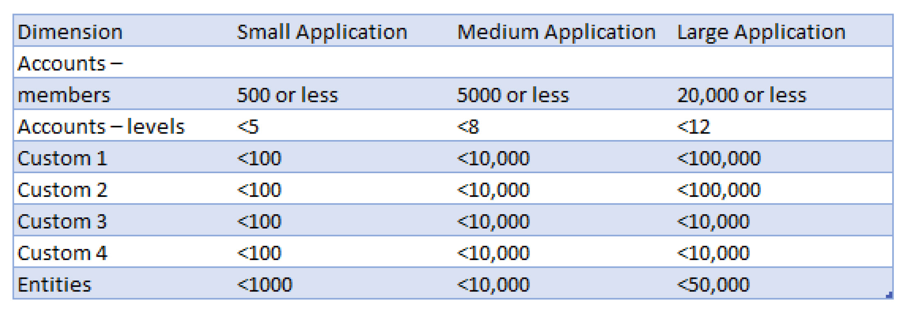
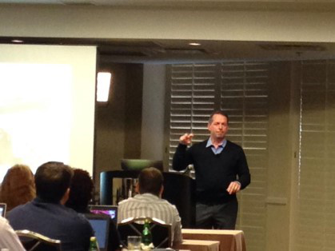

# Design And Build

Originally written by Peter Fugere, updated by Chul Smith The design is the most important part of the project. It sets you up for an easy build and ensures testing will go as smoothly as possible. The ability to design separates the consultants who can only lead a project from the ones who proudly wear the label architect. It’s understanding the product, being able to think critically about the business process, and directing the conversation. Nothing will replace the experience of having design meetings and answering questions; however, this chapter should give you a foundation from which to start. In this chapter, I will explain the critical questions you will need to ask during design, the impact of those decisions, and the core concepts that impact the performance of the OneStream solution. The second purpose of this chapter is to talk about the build. Not where to click, but why we set up our applications the way we do.

## Design

The ability to do solid and well-performing design is what separates the best consultants from the pack. In my years of doing this work, I have coached dozens of consultants, many of whom have gone on to become very senior and valuable members of our team. They all have a few traits in common. Just like when you take golf lessons and see what the pros are doing and copy that, I think it’s valuable to see what the best design people are doing and consider how to incorporate their approaches into yours. First, all great consultants follow a structured strategy. They have a tested and proven agenda. They all have some humility – they do not know everything. The client will know their business better than you do, and you hopefully know OneStream better than they do. The design process should be collaborative. This means being okay with having peers review your work. And I cannot emphasize this enough – ask questions! The best consultants will workshop with their clients. This includes having a prototype. You can start this by having a shell of the existing application or mock-ups of your first pass of the dimensions. The visual of the mock-up will go miles toward explaining the concepts. The design session should be a time to generate solutions with the client. This is the first chance you get to explain how OneStream works, and it is as educational for the client as it is for you (the consultant) driving the design. The best design meetings I was ever part of were an interactive back and forth, driving out the details of the business process. Importantly, the design meeting should include the project stakeholders. Of course, there are often topics that do not apply to everyone. That might mean not everyone is in the room for every topic. Nonetheless, I cannot tell you how many times someone who was just casually involved with the project has brought something insightful to the design. So, if it is reasonable to do so, I encourage larger participation. Not everyone who is in the room will have attended administrator training. A good technical overview will explain key concepts and set terms for people so they can follow along. I have found when people do not understand one topic, they will not always ask! Instead, they will sit quietly and wonder, “What does that mean?” Meanwhile, you will have moved forward ten topics. It can save you a lot of time – plus improve the quality of your design – if you spend the time at the beginning of the session covering the basics of OneStream. It is also strongly recommended that the client administrators attend product training prior to the meeting so that they understand the features and functions of the product(s) being implemented. I like to say that, during requirements, I listen 90% of the time, but during design I will be talking 90% of the time. Design is a chance to explain the product and timeline to your client, “This is what I heard; this is when it will be done; this is who will do it,” and most importantly, “This is why we will do it this way.” If you ask a client to make any decisions, the answer you should be expecting should be something that would be fine either way: not a decision on performance and design. You should never ask if they want better performance; assume they do. As the expert, you should understand and be able to articulate the impact of any choices being made. The following items should be available for review during the design meeting: • Proposed, detailed chart of accounts (in Word or Excel) • Proposed, detailed custom dimension structures • Excel listing of all calculated values and any conditions • Complete list of all reports and executive decks (including visualizations or charts), prioritized, along with a soft copy of each • Decisions on any open items from the analysis phase • Sample data files from each data source • List of every user, including user ID, domain, and name A good design meeting should move into reviewing and discussing the client’s reporting and analytical needs. I like to start by looking at the reports that we will be building. In those reports, you have almost everything you need. You can see the dimensions and the calculations and get a sense of the data volumes you will need. It is a great place to start. But as with any good discussion, you need to have an objective. That objective is creating an application that is: • Going to perform well • Meets all reporting needs • Is scalable for new needs and data volumes • Considers future functionality on the client’s roadmap • Maintainable The design meeting will help accomplish a plan to meet these goals. It should be considered the final discussion. In fact, even if you worked for weeks to nail down the most detailed design, the business is evolving and growing (hopefully), and – as such – the reporting requirements likely will too. I was once part of a project that followed a strict waterfall approach. We spent several weeks detailing each report and calculation – we had it all nailed down. Then, four weeks into build, they acquired a new company! Too short can be a problem, too. You need to have enough time to flush things out. One or two weeks seems to work very well for most clients. However, this should get longer if there are many stakeholders, multiple solutions, complex data issues, and/or multiple consulting teams.

> **Tip:** Three balanced pillars supportan application design:

1.End-user experience: Meeting the client’s reporting/analytical needs while ensuring usability with speed of adoption. 2.Performance: Maintaining reasonable processing times (e.g., retrievals, calculations, etc.) throughout the application. 3.Administration: Simplifying application maintenance where possible.

### Client’s Reporting/Analytical Needs

A good design agenda dives into detail about the client’s business process. Even if you covered this during the requirements meeting, it is still good to go back over and change the focus of the discussion to how you will meet the requirements in the new system. I would encourage the client to listen to the playback of what was heard. It is not uncommon for people to skip over that part of a design document. The benefits of having a thoughtful review should never be minimized. Then, the conversation can turn toward the timeline, design topics, and team resources (skills and availability). The place we often start troubleshooting a project is design. Every project should have a detailed design document. This document should be clear and explain the decisions made. There is often a lot of boilerplate that makes its way into these documents, and I think it is because people feel they need to justify the cost of the document and the writing of it to the client. But I have found that the extra boilerplate creates a document that is just too unwieldy to consume. If you review your design with a client and they are not challenging and asking questions, you have not met your goal. They either do not understand or did not read the document. If you still feel compelled to write a lot of nonsense or copy something from the Admin Guide into your design document, then I would recommend boiling the design down to a couple of PowerPoint slides and taking the time to review it with the client.

> **Tip:** Keep processing times (retrievals, calculations, maintenance) reasonable. Be careful

that you do not create a separate dimension for every single view/slice the client wants, as it could result in many dimensions and database explosion. You need to understand the limitations of what you are putting in each cube, when to use the relational blending, and the limitations of today’s hardware and database connections. That means understanding the Data Unit, and the benefits of blending the relational tables. We will cover that later in this chapter. So, what is a reasonable processing time? This depends on the client’s expectations. Consolidations for a single month of more than 10 minutes, or a full year of over 30 minutes, are both normally a red flag. However, each client may expect different results. If they are using a system now, it is especially important to get those metrics from them. An hour might be fine if it’s half as long as it takes in the older system. You will want to set the expectation early that we cannot estimate calculation times without loading a representative dataset into the database and running calculations. I strongly encourage planning a time for a review of performance as early as possible during the build when you have that representative dataset. If you find the performance is not as expected, then you will have time to fix it. You need to avoid waiting until the project is about to go live to find out the performance times are not good. One final note on processing times is to never use the desired processing times as a success factor of the project. There are times when you will want to automate a process or possibly add something that is not done in the current process. These are valid reasons why it might take longer. Having time as a metric will mean having to explain why things take longer than expected.

> **Tip:** Speed of Adoption. The ability of end-users to incorporate the tool is the adoption

speed. The faster they can incorporate OneStream into their jobs, the better! The design of an application is not to show how smart you are, or to create something the client cannot maintain, and I always ask myself, “Is the performance gain here worth the added support and complexity?” Indeed, I have a friend who likes to say, “My car can go 120 miles per hour, but that doesn’t mean I should go 120 miles per hour.” The same thing is true with a good design. You should have a reason for doing something in the application. The best consultants understand why. Overly complex dimensionality could put the ability of users to understand the application at risk. I will often look at the existing system and ask how comfortable the users are with known dimensionality. If – across the organization – many users are already comfortable with the dimensions and naming, you may want to leverage that as a starting point. For example, if two- thirds of users have been using the numbers and labels of the general ledger system for reporting, you should consider using that as a basis for your design. Not only will those users become instantly familiar with the structure, but account reconciliation will be much faster since people will intuitively know where to find their data. In fact, when a large group sources their data from that dimension, even the users who do not will benefit. They are often accustomed to relating to those dimensions. And the project team will likely find mappings that already exist. That being said, customers who take a rigid approach to their dimensionality without being open to modifying them to best fit OneStream, sacrifice functionality and benefits that our software provides. Another mistake people make (which slows down the speed of adoption) is too many dimensions or having cross dimensions. It is already difficult for many users to conceptualize 18 dimensions. But when they must think about multiple dimensions for the same type, they will be confused. Sometimes people want to see data by source, and we call this a Type dimension. OneStream also has an Origin dimension that identifies if data was loaded or manually entered. The Type and Origin dimensions have to be combined to get the right data view, and can be confusing. While it is not uncommon, and I will tell you it is not wrong – you should clearly explain the cost of using a dimension like this. Maybe consider limiting where it is used. Another consideration for dimensions includes stacking. Stacking dimensions is combining multiple types of dimensions into a single dimension. An example is combining product and market in one dimension. It will work well and will not impact performance but may confuse the end-user, especially if they are unrelated. Think about what dimensions can be reused and which cannot. You could and should consider combining something like product type and product, but you should not be combining location and tax jurisdiction. The product dimensions are related; when combined, they simplify the reporting and updating of metadata. Location and jurisdiction are likely not really the same and – if they are – may not be in the future. Dimensions that already exist should not be replicated. Dimension names and content that do not represent intuitive business views can confuse the user. They will need to think about having different custom members for each account. Forms and Excel spreadsheets should look, as much as possible, like the existing documents used. Where possible, you should consider using existing spreadsheets for certain types of forms. The more familiar the documents look, the more comfortable the end-users will be. Rules are a valuable and powerful tool in OneStream. However, each rule will require the server to do something, and it can add up! A friend once said the best rule file is an empty one. Okay, he was joking, but to be fair, it requires no maintenance and is the fastest to calculate. So, maybe not completely joking. The best advice I can give you is to keep your rule file simple, and only include the rules that you need. Limit when and where the rules run by limiting the scope of the rules. Use the formula for Calculation Drilldown for as many calculations as possible. One recommendation I would make is not only including the inputs for the cell, but adding cells that help with analysis, too. Remember that you can drill down on all the accounts that appear. For example, you could include the revenue account when showing the change in depreciation for cash flow. So, while the movement on the balance sheet should equal what is on the cash flow, it could help an end-user to see the expense line to ensure the statements flow correctly all the way through. Use the Documents folder to store documents for the end-user. This includes all training materials that were presented. I also include things like the close calendar and, if available, the account glossary. Not every company has a proper portal or SharePoint web page for their team. The documents folder can distribute the documents that help end-users. I very often create a sample Excel template for end-users to use to create their own Excel add-in spreadsheets. It accelerates the use of the Excel tool if they have a reliable starting point that already works. It takes a lot of the guesswork out of using this tool. The last comment I will make about helping increase your speed of adoption is to record short training videos. These can be embedded directly into the Workflow for each step a user must complete! You could have specialized videos by domain, finance function, or even language! Having dozens of videos by language could be difficult to manage for the administrator, though. So, you could identify a troubled group that has issues, either local training or employee turnover, and give that group some extra help with a specialized video to help keep them on track.

### Designing And Building Your Model

I explained the goals of the design meeting. The part of the design that people struggle most with is organizing the dimensions in a way that will yield objectives defined in the design. Being able to break down those dimensions – thinking of both present and future needs – is really the goal. There are some performance guidelines you need to think about that I will get into later in the chapter. Let us break down the steps of a good design.

#### Gather All Dimension Types

I suggest gathering all the reports. All the information you will need exists within those reports. The dimensions, data sources, and rules can be gleaned off those reports. And from the client’s perspective, if that report comes out fast, reliable, and accurate, then ‘how’ that happens almost does not matter.

#### Review The Detail Of Each Dimension To Ensure It Meets Reporting

Needs Each dimension you identify may not be fully represented in the report. Discuss the dimensions to ensure you understand the full detail that needs to be captured. Often, it helps to have the dimensions electronically so you can display them and discuss the detail. For example, one report may have the cost of sales accounts broken out by department. I would ask if they also break out operating expenses by department. If they do not, then is that something they want to do? This point is critical to discussing the dimensions; just because they do not look at something now does not mean they do not want to. Clients always ask, “What other people are doing?” That can be a frustrating question to ask a consultant because you may have only been engaged on the project for a couple of weeks as you start to design. Often, what the client really means is, “What could we be doing better?” The easiest thing is to help see what dimensions they are not fully utilizing. If they have department detail down all expense lines, why not consider that for future use? Ask them the question. In almost every project I have been part of, I have been able to help our application add detail that had not been there before. There is a balancing act here. While we do not want to find the project falling into the morass of a business process reengineering effort, we want to use the software in the most efficient way. So, it is proper and smart to challenge statements like, “This is the way we’ve always done it.” I will take the time to explain that the most efficient companies will adapt processes to get faster or better results. But, again, limited to the context of small changes determined by the software. It should be said that the goal is not to automate inefficiency. We do not want to take a bad process and fold it into a design. Otherwise, you will still have the same problems, just with the new tool.

#### Group The Dimensions To Identify Cubes

As you organize your dimensions into cubes, you will see dimensions that share all or part of their hierarchy. Product groups could be a summary or parent level of product name. In that case, you could have a dimension type of product group, and product name could be another group that rolls up to product group. Product Group Product Names This is the dimension extensibility. People often make a critical error here: use extensible dimensions! I will explain more of the performance benefits when discussing our performance guidelines later. You should analyze all dimensions for this overlap. You can consider both functionality and purpose. We often call that looking at the dimensions horizontally and vertically. This just means consider the dimensions changing by scenario (Actual, Budget, and Forecast) and by User Defined (business function). You may need to consider the dimensions changing by entity as well. Then you can group your dimensions by ‘cube’. I know, I put cube in quotes because – at this point – you do not know if they will really be cube or Scenario Type. You will also have to consider your options for cube design. It’s important for the implementation team to determine the best data model for the data set. You’ve got dimensions, but maybe the data is better suited in a relational data model rather than a multidimensional cube data model. Sometimes, it’s a coin flip, but there are times where application performance will suffer if the data is in a suboptimal model.

#### Consider Future Solutions And Ensure Your Design Considers Other

#### Dimensions Needed

A good design will discuss future use. Not only use of the dimensions (as said earlier) but of future solutions. If the application will ever add the Tax Provisioning solution, it makes sense to review the dimensional model to ensure there is no duplication of dimensions. For example, you may have locations identified as a dimension. You may think that jurisdiction in the tax solution is a duplicate. It may or may not be. You may be able to share this dimension. You should be familiar enough with the tax solution to know jurisdiction is not the same as location. I would not expect anyone to know what every dimension does in every Solution Exchange solution. So, after you have gathered your dimensions, and discussed a roadmap of future plans, compare any dimension you have identified with those future solutions. They are documented and will give you an explanation. This point also applies to extensibility. We sometimes advise our design leads to “stub out dimensions.” What that means is to ask what dimensions they are not using now, which they should consider or want to add later. They may have sales detail and plan to report on this by regional manager, but they don’t have the detail in the ledger. It is something they want to add, but it will not be available for the current project. I would add the dimension type at a minimum and then – as detail is added or refined – update the dimension. The reason is that if you change the dimension type on a given cube, you will have to reload and reconcile the data again. No one wants to do that. Avoid that by making the plan upfront.

#### Create Foundation Of Workflow – Begin Refining The Workflow For Each

#### Cube Within The Parameters Of The Requirements

The workflow is one of those things that can be hard to design out-of-the-gate. It is incredibly powerful if used right. So much so that we dedicated a whole chapter to this topic. However, for the design, it is helpful to set up a basic workflow. Once you have shown it to your stakeholders, you can refine it and add to it. Remember that workflows are defined by each cube.

#### Identify And Plan All Data Flows Into OneStream And Between

#### Solutions Within OneStream

One other benefit of gathering reports is you can ask, “Where does this data come from?” for each of them. You will have data from ledgers, data marts, and Excel sheets. You will want to plan for getting data into the application as soon as possible for not only will it help you create a prototype, it will help to identify missing or incorrect data more quickly.

#### Create Rules Inventory – Identify All Rules To Be Built

Having a full list of all rules will not only make sure you don’t miss anything, but it will also help you identify and plan to utilize the rule passes optimally. You can learn more about the rule passes in the Rules chapter.

#### Create Report Inventory – Identify All Reports To Be Built

You do not want to miss any reports, so having a full list will help. I always break down the reports to the group that is ‘must-have’. Then, the reports that are ‘like to have’. The tedious changes of formatting can add more time than you might expect. I have seen people propose doing the reporting as a mock-up in Excel first. It does not save you any time! It takes just as long in Excel as it does in Cube View Editor to write a report.

#### Plan For Training End-Users

Each of the documentations you write will build on each other throughout the project. The requirements help with design, which helps with project documents, which helps with test cases, which helps with user acceptance testing, which helps with training, and then end-user guides. You should be thinking of training out-of-the-gate. What is the process that gets those reports populated? If you keep going back to those reports and break down the steps that get them completed, you will ultimately get to the goal. Okay, now you have a good design document. You have discussed all the dimensions the client thinks they need. You have the requirements. How do you transform that into a design which you can have some confidence will perform well? Well, you will need to decide what dimensions will hold what, and decide on the cube and application set-up. There are only two major guiding principles that you will need to follow (Data Unit and data volumes). If you do, you can be sure the application will perform quickly and reliably. While there are other things to consider, these two will be the source of most issues.

### Data Volumes And Design

To fully understand the design of cubes, I must provide a little background. One of the most important considerations when building a OneStream application is the potential size of the Data Units that the system will create, as well as the number of Data Units in the application.

#### What Makes OneStream Unique

What makes OneStream a different tool from standard analytic engines is that OneStream mixes reporting performance with updating performance. Consider databases with large volumes of transactional data. These databases need to store everything, and these OLTP (online transaction processing) databases have simple queries, large data volumes, and are made to process transactions. Performance is based on the ability to find data and recall it as it is needed for reporting. By contrast, OLAP (online analytic processing) databases are built to optimize the reading process. OLAP databases will do more complex queries and smaller volumes. A database that relies on the ability to pull data from stored tables has limitations. And a database that relies on in-memory processing completely has limitations as well. OneStream combines reporting performance with updating performance, and the part of the technology that makes this possible is the Data Unit. Firstly, it is designed around common reporting dimensions that define almost all financial reporting, things like the scenario, time, and entity. Users tend to look at data by this point of view (POV). Secondly, by residing in-memory, the changes in updating performance are instant. This is extremely effective for financial reporting. When you consider updating performance, you are thinking of the Data Unit. OneStream’s core engine combines the storage of the relational and dynamic properties of a multidimensional tool.

#### Data Units

To understand how OneStream performs many of its tasks and operations – including logic execution, consolidation, and data cache – it is critical to understand the concept of Data Units. A Data Unit represents the constituent of work for loading, clearing, calculating, storing, and locking data within the OneStream multidimensional engine. A Data Unit is also something that shares some common point of view (POV) information. OneStream can deliver three different levels of Data Unit granularity. As this relates to design, I will address level 1 (for other levels, please refer to the OneStream Design and Reference Guide).1

#### Data Unit – Level 1

This is the largest unit of work within the system and is mostly thought of as entity, scenario, and time. Users of financial analytic systems typically think about clearing, loading, calculating, and locking combinations of entity, scenario, and time. Members of the level 1 Data Unit: • Cube • Consolidation • Entity • Scenario • Parent • Time These level 1 dimensions define the Data Unit, and it consists of the stored data records for the above combination of dimensional intersections. When you reference any combination of these dimensions, a Data Unit is created in the server’s memory. The server calculates parent members of account, flow, and User Defined – dynamically – and generates a small cube of this data. The greater the size of the Data Unit, the larger the strain placed on the system. You can estimate the size of a Data Unit by multiplying the number of members in the account and User Defined dimensions to determine all possible intersections. Thus, an application with many accounts (for example, 10,000) and large custom dimensions (Custom 1 has 10,000 members, Custom 2 has 7,500 members, and so on) will result in potentially exceptionally large Data Units. You will then need to evaluate the data to determine the quantity of stored records for each Data Unit. This needs to be evaluated for both base and parent-level entities as they are handled the same by the system. I like to explain the Data Unit like a page in a workbook. It is easier to see. 1 Data Units, OneStream Design and Reference Guide, OneStream Software, 2016 – Reference to this document will be used throughout this chapter.

Here is an example of a Data Unit, with each record a single row in a spreadsheet. Each record and loadable dimension has a data value. None of the parent members are shown in the rows. If you wrote a rule to loop over each of these records in the Data Unit (represented as a row, above), you would only run the rule six times. This thinking helps the rules in OneStream be ‘data-driven’. That means the volume of data will dictate what and when rules run. This can be a very efficient way to design an application. You can’t beat factorial math here. Adding one dimension can create millions or more intersections of data. Adding a dimension for the existing six records with only four members could increase that Data Unit from 6 to 24. The size and number of Data Units are what you are trying to manage. A cube with exceptionally large User Defined dimensions – populated with a lot of data – will have large Data Units. A cube with everything pushed into the Entity dimension will have much smaller, but many more, Data Units. If the processor is spending all its time creating and managing these Data Units, because they are either big or numerous, it does not have capacity for anything else. OneStream treats a zero as data, so it is strongly recommended to avoid loading or calculating cells with zero ‘hard coded’ values. Dense account or custom dimensions will result in slower performance as the application server must process and aggregate many records resulting in performance degradation. I would be careful with allocation rules; while they will not populate the database with a lot of zeros, they could populate the database with near-zero data. I define near- zero data as data that is not zero, but numerically insignificant. If I have a bad rule that creates thousands of cells with fractions of a penny, the number will not increase the accuracy of the financial data but can slow the system down. Near-zero data adds no value and will slow performance.

OneStream will provide detail on the data that is zero in the Data Unit statistics. This is available by right-clicking on a cell in a grid (see Figure 3.2) or within the System Diagnostics Solution Exchange solution. The number of zeros should be monitored closely, and if they either spike significantly or increase above 10% of the data, they should be addressed. You will need to identify the source of the zeros and resolve it. It is important to note that the period is part of the Data Unit. So, if you loaded data in each month, and did not load data in the subsequent months, the system will generate either a year-to-date or periodic zero. While this is not real data, you will see that number if you loop over the cells of the Data Unit in your rules. Stored calculations also add cells of data that could require processing.

#### Stored Data Versus Calculated-On-The-Fly Data

The OneStream application server is a hybrid transactional and multidimensional Engine. Some of the information is persisted in the relational data store, and some of its data is only calculated within the Data Unit and stored in RAM on the application server when specifically requested by a user. OneStream does not provide any administrative options for configuring what information is stored and what is calculated on-the-fly. We will talk about which dimensions are sparse later in this chapter. All base-level information for dimensions, calculated numbers, line-item detail, text, and journal information is stored and persisted in the relational database. All parent levels of accounts, intercompany partner (IC), and all custom dimensions, are calculated when a requested Data Unit is created. For example, an end-user opens a form with cost of sales for a given department, market, and channel. The Data Unit is retrieved from the relational database, created, and then stored in RAM, and then the number is sent to fulfill the request. If the user then selects another account and the members of the level 1 Data Unit cube have not changed, then that number is already stored in RAM and is sent to fulfill the request. If the user then changes the account to total expense, the Data Unit in memory will have already aggregated the parent-level values. The hierarchy in the Data Unit stores the total and any other intermediate totals for the product dimension in RAM. As other users request the data from the members of the level 1 Data Unit cube, the Data Unit will remain in memory.

#### Data Volumes

If you find you have a data issue, it will be important to get some details on where the issue is. Data volumes vary widely by application. To get some actionable analysis on your data, your volumes should be measured in the following manners to be of relevance: • Input level data for one year – this is measured by extracting all of the base-level entities (choose the [Base] hierarchy), all base-level accounts ([Base] hierarchy as well), for all base periods, for the densest year/scenario combination. This metric indicates the complete volume of data loaded into the application for that year/scenario. It is important, primarily, as a baseline for the other data metrics. • Calculated base-level data for one year – performs all the same selections as above, but this time includes calculated data (check the Include Calculated Data). Note that this assumes the application has been fully consolidated, or at the very least that all base entities have been calculated and have an OK calc status. • Consolidated base-level data for one year – performs the same selections as in 2 (above) with one important distinction:only choose the primary top entity in the application. The reason for this is to attempt to measure the densest dataset in the application. • Consolidated base-level data for one single period – performs the same selections as in 3 (above), except this time selects only the last period in the year. This is the simplest way to measure the maximum number of records in each Data Unit by counting all the unique combinations of account/User Defined/IC members that have been loaded to, or calculated during, the consolidation process. This set of unique base combinations provides the definition of total base records, which will be discussed in several cases below. What we are looking for in this exercise is to establish the data explosion from rules, as well as the largest Data Unit size. Seeing patterns in the data will give you clues to find the issue – a rule, an error on data loading, or some other problem. While hardware can help lessen the impact, Data Units over 2 million records are significantly slower. One should consider the cost of hardware and the required time of consolidation when choosing to have these large volumes of Data Units. With OneStream extensibility, you are likely better off creating a new cube or leveraging the relational store (either Analytic Blend or custom SQL table) than trying to fit too much data in one cube.

#### Data Unit – Interdimensional Irrelevance And Database Sparsity

When building your application, you add User Defined dimensions, and the data resides at these intersections. When you create your first pass, there will be many intersections that normally would not make sense. These intersections are often left blank or have no data. We call these intersections of blank data interdimensional irrelevance. You would never use the Intercompany dimension on accounts like deferred tax assets. It is uncommon. So, you can – and should – prevent the accidental use of those accounts and limit the database sparsity. Why do you care if there are used cells in the dimensions? Because of the Data Unit. As those intersections get populated, either intentionally or unintentionally, then the performance of the system will degrade. This can happen either slowly, as is often the case with loading zeros, or suddenly, as is often the case with a bad rule causing data explosion. So, why would you allow all intersections to be open at all? When migrating an existing application, you will find it significantly easier to allow input at all intersections. Over time, the data may have changed, or the quality improved, but going forward you may want to explore incorrect combinations of data to identify and resolve these issues. If you are about to work through a full data reconciliation effort as part of a project, it would be good to limit the intersections (even at least somewhat) to ensure you are resolving as much as you reasonably can. If the data quality of the history is poor, this may be a much greater effort than you realize. The first way to manage what dimensions are open is by using constraints on the dimensions. You can limit what User Defined dimensions are used by account and by entity. This is a powerful feature that many designs don’t fully utilize. I worked on an application with a single, large- product dimension, extended down from group to part numbers. Obviously, you do not want this dimension for all entities. But for reporting, have a way to capture the group at the parent entities, and each entity has its own part numbers. Since entities shared part numbers, simply adding dimension types would not work. A single dimension type would need to exist in multiple types, and that is not allowed. So, I added only two types – the group and part number. The part number rolled up to groups. I then created some smaller alternate roll-ups of the part numbers needed by entity. Then, using constraints, I limited which part numbers were available by entity. Not only did this limit the ability to load bad data, but it also ensured the parent entity’s Data Unit would perform as well as possible. Another issue is database sparsity. This is where data is only sparsely used across dimensions. For example, one customer member will only be populated with one product member and this occurrence is consistent across all customers and products. You often see this when people think they will have more detail than exists. They want a dimension for the whole P&L, but only a subset of expense accounts really uses it. The risks are the same as per interdimensional irrelevance. Somehow, these empty data intersections will get mistakenly populated. And when they do, it will not likely be during a low point; often, these issues come up during a close and will become a critical issue. Your design can easily avoid this. Start by combining dimensions when it makes sense. If only a handful of accounts use a dimension, and within that dimension there are only one or two members – I would ask if we really need that detail in the cube. Or can we combine it into the Account dimension? Or can we leave the detail in the Stage and drill back to it? Another option is to just assign the User Defined to only the accounts that will be using them. A detailed look at the data will tell you the correct accounts to use. Any of these approaches would protect the Data Unit.

#### Selecting Valid Account Combinations For Budget And Forecast

Earlier in the chapter, we talked about limiting the intersections of data to prevent data explosion and other issues. It is possible that you want more dimensions available in one scenario and not for another. You could want to leave the Actuals history wide open and have only limited restrictions. Often, the ledger manages the valid account strings, and you will not be worried about invalid Account and User Defined dimension combinations getting loaded into the application. If you also consider the historical data could have changed, or is not high quality, restricting the combinations for all the history could be more work than you are prepared to take on. However, you need to think long and hard about leaving it that wide open for Budget and Forecast. This is especially true if people are loading data via Excel. They could create all kinds of invalid account strings completely by mistake. In those cases, you have three options for managing this. You could use the constraints but know those will only vary by cube. The next option is to create a simple conditional input rule; these rules are very flexible and powerful. The third option is using the rules, but also using an input template or administrative cube. You can flag the intersections you want to turn on or off in the administration cube. It could be as simple as loading a ‘1’ to those intersections, then have the rule loop over those intersections.

#### Data Unit – Performance

As you can gather from this section, the Data Unit design is important. If any single Data Unit gets to 1 million intersections of data and the Data Unit grows, you will see an increasing impact on performance. The largest Data Units should never be above 2-3 million intersections. Early systems (before OneStream) were designed for 5,000 records per entity. The next generation started at 10,000 and could not consolidate with more than 100,000. The sweet spot for OneStream is between 250,000 and 500,000 records. As you increase above that number, the performance will deteriorate at an increasing rate. The processor speed becomes more critical at that point. The higher the frequency of the processors, the faster they can create these Data Units. As you build the application, if you find Data Units this size, you should consider a couple of issues. Firstly, you should look to see if you can break up the entity or cube to spread out the data. Secondly, you should explain the impact on performance. You will have some idea if you are doing a prototype. If you have not, then I would consider building one. This is an issue that is easily managed if you have performance data; avoid the surprises! Set the expectation with the client. I have had clients who think a two-minute consolidation is exceptionally long, and others who are amazed we can do the consolidation in less than a couple of hours. They have different expectations based on the data volumes and calculations and the systems they have used before. If you can explain that on each occasion you ‘give up some time, for some benefit’, you will help them understand how the entire process is improving, and hopefully they will be happy with whatever times the system generates. One last note on Data Units as it relates to new features such as dynamic attribute dimensions. Now that you understand the dynamic nature of the Data Unit, it should be obvious that adding members can create millions of aggregation points that can impact performance. Dynamic attribute dimensions can create an explosion of intersections. If you are creating trillions of cells of calculations, expect this to slow reporting and Excel. Consider this impact and test changes in terms of impact as you move forward.

#### Cube Design

Once the dimensions are considered, you will need to group them into cubes. Cube is just a concept of the data dimensional model grouping. A cube is an organizational structure that holds data in OneStream. Each must contain the 18 dimension types you have defined. And if you have not determined a dimension type for a dimension? Then the cube will use the default type and the member `None`. A major consideration for designing cube grouping is understanding that workflow  and security are driven from the cube. So, I typically look at the purpose of the data and group the dimensions appropriately. A wrinkle in the cube design is understanding the capability of Scenario Types. You can change the Data Unit dimensions by each scenario within a given cube. So, you can override the default for Account, Flow, and the User Defined dimensions in a scenario. This is a great option for scenarios that will report in similar workflows, but which need different dimensions. Actual and Budget data are probably the most common use of this. You would give the Actual scenario the Actual type, and Budget the Budget type. Then, within the cube setting, change the dimension as needed. The administrator guide does a great job explaining the details. Let’s look at an example. During design, the client asks for consolidation, budget, tax provisioning, and sustainability data. For the Actual data, each data submitter must also update the Forecast and Budget data. Well, Actual scenario is a great case for using the Scenario Type. The workflow will be the same for the end-users because they only need to change scenarios. Your reports, rules and dimension can be changed conditionally by Scenario Type. The reporting is easier, too, simply because you do not have to change cubes. The fewer choices the end-user must make, the better. However, the sustainability cube would likely have different end-users, limited common data, different security, and ultimately a different workflow. Sustainability data is likely collected from plant managers or different users than those who control the financial systems. Data is unlikely to be financial in nature and will also not be subject to blackout restrictions and controls. This sustainability scenario is probably better served by being its own cube (and, at a minimum, its own Scenario Type). All these differences will give the client more flexibility to make changes.

#### Determining The Dimensions In The Database

I always recommend rethinking the idea of having users select multiple dimensions for the same dimension type. In other words, one conceptual dimension to one dimension type. I would not put rollforwards in User Defined 1, and cash flow movements in User Defined 2. Both are rollforward adjustments, but for different accounts, and are related. I would think carefully about having adjustments broken out in one dimension, and a data source in another. Firstly, not only does this confuse the end-users, but it makes reporting more difficult and creates an inflexible application. It undermines the benefit of extensible dimensions. You could create a relationship between dimension types and use them in other ways for future applications. Another example of this is when people want to put accounting function as the Account dimension and break accounts across Account and User Defined (UD), by placing operating expense accounts in the User Defined dimension. I’ll define function here to be like a department; for example, accounting, sales, legal, etc. Accounts in this example are natural accounts, like salary, bonus, etc. The other choice is to put all of the natural accounts in the Account dimension, and function in the User Defined dimension. The first thing to understand is that both options provide the exact same detail. There is no benefit for either with respect to level of detail. So why would I choose one over the other? There are some questions to ask. What does the client currently use? Do they only use function? If this is the driver of reporting – and the users mostly expect it – then having the dimensions split won’t confuse the end-users, just the opposite. Another question to ask here is if a functional income statement is used for other scenarios. If end- users never break out expenses for Budget and Forecast beyond that function, asking them to add a natural account might be a non-starter. The point here is that while there is no clear right or wrong approach, there are guiding principles that will help you understand the right choice for any design. It is never okay to just let the client decide without this context. This was a simple choice for adding function. Both options provided the same reporting detail, but one of the choices will meet their needs, based on how they are using the dimensions for other scenarios. So how do I begin my mapping of these dimensions for cubes? I often go right up to the whiteboard and start breaking it down. I create an application and design matrix. The following table (Figure 3.3) demonstrates which dimension (and dimension detail where necessary) is included in each application by cube. I take the time to review this alongside the design team, and try to find a consensus that it will meet our reporting needs.

|Col1|Col2|Col3|Col4|Col5|Col6|Col7|Col8|Col9|
|---|---|---|---|---|---|---|---|---|
|**Dimensions**|**Dimensions**|**Dimensions**|**Cube 1** **(Financial Data)**|**Cube 1** **(Financial Data)**|**Cube 2** **(Planning)**|**Cube 2** **(Planning)**|**Cube 3** **(Subsidiary)**|**Cube 3** **(Subsidiary)**|
||||||||||
||**Scenario**||**Actual**|**Budget**|**Budget**|**Forecast**|**Actual**|**Budget**|
||**Type **|**Type **|**Type **|**Type **|**Type **|**Type **|**Type **|**Type **|
|**Time** **Periods**|**Time** **Periods**|**Time** **Periods**|X|X|X|X|X|X|
|**Years**|**Years**|**Years**|X|X|X|X|X|X|
|**Scenarios**|**Scenarios**|**Scenarios**|X|X|X|X|X|X|
|**Flow**|**Flow**|**Flow**|X|X|X|X|X|X|
|**Accounts**|**Accounts**|**Accounts**|IFRS|Detailed|Only salary relevant|Detailed|Mgt COA|Mgt COA|
|**Entities**|**Entities**|**Entities**|X|X|X|X|X|X|
|**UD1** **Products**|**UD1** **Products**|**UD1** **Products**|-|X|X|X|-|X|

|Col1|Col2|Col3|Col4|Col5|Col6|Col7|
|---|---|---|---|---|---|---|
|**Dimensions**|**Cube 1** **(Financial Data)**|**Cube 1** **(Financial Data)**|**Cube 2** **(Planning)**|**Cube 2** **(Planning)**|**Cube 3** **(Subsidiary)**|**Cube 3** **(Subsidiary)**|
|**UD2** **Projects**|-|X|X|-|X|X|

Figure 3.3

#### ‘Unspecified’ Dimension Members

In the case where specific data points do not exist across one or more dimensions (e.g., balance sheet account detail does not exist across the product and customer Dimensions), use `None` members in each of these dimensions to designate a placeholder member to contain the data. As the detail becomes available later, you can either break out the history to the new members or start breaking out the detail at a go-forward point. This approach is easy to add later, and will not require reloading, and hence reconsolidating and reconciling the database again.

#### Cube Integration

Often, you will have to move data between the applications. Fortunately, OneStream gives us some great options. You will have the ability to connect the cubes by creating linked cubes via the Entity dimension. Conversely, you could use rules to copy data. You can even update the workflow to pull data from one cube to another using rules. Then, you can drill on the data by using the formula for Calculation Drilldown to specify how a user can drill. The rule is simple, too. All of this is covered in the Rules chapter of this book. You can also use OneStream as a data source. Why would you want to do that? Because you could summarize or remap data and allow people to drill from one cube to another with the benefit of the mapping. If data is being transformed, it would be helpful for users to see this in the system. Since it is how other data sources are mapped, it can be a great way for the user to copy the data, as they will be familiar with it. You need to be careful if you create too many copies of the data. This is important to understand… cubes can reference other cubes. You do not want to copy data unnecessarily. Also, copying data creates timing differences. By using a rule to copy at a parent level, and drilling to the detail in another cube, data synchronization will be faster, and you have mitigated the timing difference.

#### Intercompany Across Cubes

If you find an opportunity to break an application by cube for business channel or region, you should know you will have intercompany partners (IC) available for all entities available in each cube. And if you do not need to share the IC across all cubes, you should know they will be available! So, in the latter case, please consider using conditional input rules to limit people making the mistake of choosing the wrong IC member.

#### Cube Design Options

There are a few design options, and each has advantages and disadvantages to the application design. The first three are typically for financial data designs.

#### Monolithic Cube

This cube type is good for extremely small and simple designs for specialty use or very small data sets with no possibility for extensive expansion. It does not make use of extensibility and, therefore, is not often recommended for an application of any size or significance. In this design, you would likely make use of the Scenario Types. This is also a popular choice for ‘lift & shift’ applications because the assumption is this design is temporary and will be replaced. When it is replaced, the extensible option can be implemented.

#### Super Cube – Linked Cubes

This is the cube example used in the GolfStream application. There is a parent/top cube, and its dimensions are at a higher level of detail to the cubes that roll up to it. There is only one level from the parent/top to detail cubes. You can have several detail cubes, and each can have different dimension detail. This is the most common design as it makes the best use of extensibility, is the most common way to manage Data Unit sizes in the parent/top cube, and allows for the greatest flexibility later.

#### Paired Cubes

Paired cubes are combinations of cubes that allow for some special situations. The most common use of this design manages split and shared entities. Split entities are where the same entity can exist in multiple cubes. Shared entities are where the users can load to the same entity in multiple cubes. Since dimension members can only exist in one cube, there needs to be a common Entity dimension that has all entities in every cube. That would be assigned to all cubes. For each cube, there will be a second dimension that has its hierarchy but uses the base members of the first Entity dimension as its base members. For each cube in the original design, you would create two cubes. All dimensions must be the same except for the Entity dimension. One cube has the base entity’s dimension; the second has the hierarchy dimension. Then the cubes must be linked by making the cube with all base entities the child of the other. This effectively creates a base cube with all entities for its parent. Users would only ever be in the parent cube, so they do not see all entities. While this will not remove the need to copy the data, all data could be copied by a data management job rule. The linking of cubes must then be done by rules.

#### Specialty Cubes

Specialty cubes are basically monolithic cubes but are much more limited in purpose. They would be used as administrator cubes (driver cubes, overrides, or equity control) or specialty apps (process control). The benefit of putting these cubes as standalone is simplicity of security. They can easily be separated from the rest of the application.

#### Some Other Cube Design Considerations

You might ask, “How many cubes can I have? This seems like a lot.” Having more cubes will not slow the application. You should not worry about adding cubes. Remember to think of the process as the end-user. A high number of cubes will mean more maintenance, but it should not be a deterrent. The gains in performance – while hard to estimate – will justify the needed support. Always consider the roadmap. How will the cube design fit with the long-term solutions? Not many people look to OneStream to have only one solution. The benefit of a platform is the ability to leverage multiple solutions. You will do yourself a big favor by ensuring your design considers the dimensions and cube designs of future applications. Even if you don’t have dimensions that could be overlapping or duplicative, you will need to consider the data integration between these cubes and solutions. Determine if you will ‘stub out’ dimensions for future use. It is for the same reason as above… no one usually buys a platform for one solution – especially if the first project goes well – they will see other uses for OneStream very quickly. When you create a dimension type, even if it only has the default ‘None’ member, you make it as simple as adding new members when it is time to add detail. Make all Cube Views as dynamic as possible. We haven’t spent much time on reporting in this chapter; however, it is another major design consideration. If you have used extensibility properly, you will find that dynamic references to the metadata will give you reports that require very little updating as the dimensions change. That means a single report can be used across the application, and as the company grows. You will find an incredibly happy administrator who only has a fraction of the reports to maintain. ALWAYS leverage extensibility.

#### When Should I Use Extensibility?

I just said, always! All applications should be designed for extensibility, or at the very least, you should have a particularly good reason for not doing it. One of the biggest complaints of customers that have had the solution longer than a year or so is they wished they thought more carefully about the future. Extensibility gives you the advantage of flexibility. It will also help if you find yourself with a performance issue; specifically, the use of multiple cubes and creating breaks in dimensions when possible. To understand why, remember what the Data Unit, and a good Data Unit design, is. Benefits to the client in multiple ways: 1.Performance 2.Flexibility – the multiple cube approach gives clients the possibility to make changes to the design for new dimensions, added models, or performance changes. The application will perform better when using extensibility. When you watch consolidation times by entity, you will see the base entities moving very quickly, and as the consolidation moves up to the top, it slows down significantly. There are two primary reasons for this; first, for each child entity below a parent, the processor uses a processor thread to aggregate that data. At the base of the hierarchy are many child entities, and so many threads can be used. At the top parent, there may only be a couple of child entities, so only a couple of threads can be used. Second, the dataset for parent entities is naturally denser as the data consolidates at the higher levels. By using extensibility, you can design smaller Data Units for the parent entities. This dramatically improves consolidation times.

In the example above, each cube represents a Data Unit. The three base units are not completely full for every possible intersection. Because they do not have overlap, the Data Unit for the parent entity is completely full and would perform the slowest. So, we ask ourselves here if there is anything to be gained by aggregating the detail to that parent Data Unit. Can we get the same reports from the child Data Units?

With many members in UD, there is an opportunity for invalid data cells to get populated. This could be from poorly-written rules that allowed for the population of those members, or allowed end-users to load zeros. By limiting the available cells by base cube, you can minimize this risk. Typical symptoms of application design problems, or memory configuration problems, are almost certainly due to a server that is too busy swapping Data Units in and out of memory. Customers may – at times – attempt to stop or ‘kill’ a running report by ending the execution of the client, restarting the client, and launching another report. This action, however, does not stop the server from pursuing its query, but instead results in an even longer queue of activity requested of the already overloaded OneStream server. Another reason to use extensibility is that it allows for flexibility by giving a way to add dimensions or new members more easily without impacting the entire user base. You must remember that changing the dimensions on the cube will require dropping the tables for the cube and creating a complete rebuild. This is especially problematic if the data is Actuals, as all the history of loading and workflow sign-off could be lost. This would mean the data will likely need to be reconciled all over again, and this will require some significant re-work.

#### Relational And Analytic Services Design

Since so many clients are now pushing the envelope of what should be in a CPM system, they want access to more detail across more systems. The thing is, not everything needs to be in a cube. Data (especially the data that is more transactional in nature) does not fit well in a cube concept. This is true because data does not always fit nicely into hierarchies. Take employee compensation, for example. Employees, when looking at an extremely specific point in time, could fit into a hierarchical structure, but not over any normal stretch of time. Employees can transfer between departments, resources are shared between departments and varying percentages of their time, or just flat out quit. In those cases, the data is just as well served in a flat table. We offer that as an option in OneStream, and we call it Analytic Services. Now, we have a whole chapter on Analytic Blend (Chapter 12) in this book, so I am only going to say what is important as it relates to cube design. I would encourage you to read that chapter to understand the various options and consider how they will impact your design. There are a couple of differences between the concepts of Analytic Services and Analytic Blend, although both involve SQL tables that can handle large volumes of data. We are talking millions of records, so this is great for detail that you might need (but do not want to see) in the cube. Analytic Services is an umbrella term for the broad range of analytic capabilities in OneStream, ranging from financial consolidation to data aggregation to transaction analysis. The ability to support all three types of data models in one platform is ground-breaking. It intelligently brings together CPM, financial analytics, BI, operational, and other transaction-level data for comprehensive analysis and visualization directly within OneStream.

Analytic Services expands OneStream’s unified platform across a broad range of data and analysis requirements. It bridges the gap between the full cube and the blend tables. The cube can have an extremely specific (even down to a single cell) level of data in a calculation. Analytic Blend has only the most basic calculations. There is no aggregation of the type you would expect from a cube. Another use of Analytic Services is for certain Solution Exchange solutions, where it serves as the database. The OneStream People Planning solution leverages its own table. However, there are limited calculations that you would use here. If you need to do calculations, you might consider doing them on the load of data. You can add new fields and do some calculations on the load. Analytic Blend is the concept of using a SQL table to house all the transitional data records. The advantage of copying the data here is that you can accumulate the details from a variety of sources. You can always drill to the source if you have a direct connection. It might not be possible to drill to the source data, though. You may have a licensing issue, or there are too many sources. With Analytic Blend, you can have aggregations based on the metadata the cube uses. These aggregations will need to run at a specified time, possibly overnight. They are not as dynamic as the cube. Cubes can run consolidations at any time, and the Data Units from the cube aggregate every time they are called. You might have to consider using multiple tables to get the dimension views you want, while all those views might fit in a single cube. But the volume of data is far more than you would put into a cube. You can report on the blend tables with the dashboards in OneStream. This example is a case of using the right tool for the right job. One final note on the blend options. Your design should – as much as possible – ensure that blend options are transparent to the end- users. By that, I mean build your reports and process so users do not have to select cubes, and as few other dimensions in the POV as possible.

#### Extensible Applications

Why might you need the application to be extensible, you ask? With the options for so many cubes and relational tables, is this not overkill? Well, there are times when you need to have this option if the current database and its connection is simply not big enough. In other words, there is a database limitation. A second example might be when the business process does not support a single application. Private companies sometimes have requirements where an application has sensitive data that not everyone will have access to. Such data could exist in its own application, and still take advantage of common metadata and workflow. Extensible applications allow you to mitigate the risk from the current limitations of today’s hardware. A vast majority of OneStream customers use a single production application, which gives the following benefits: • Create a scalable platform that can unify financial processes in a single application. `o`Consolidations   `o`Planning   `o`Transactional  Analysis (Analytic Blend) • Eliminate redundant maintenance caused by multiple product solutions. • Eliminate the need to support multiple technology platforms. • Provide an extensible development environment within the platform. • Solve domain-specific business problems with reliable Solution Exchange solutions. • Unify analytic and relational solutions under a common platform. All of these are possible when standard, non-exotic hardware is not required. As soon as the limitations of today’s hardware become a restriction, you are limited by the simple physics of the volume of data. This is when you might need to consider an extensible application design. It is important to understand what an application is. OneStream can have one installation with multiple applications. There are some common components in an application, and they are held in the framework. OneStream has a single framework for each installation. The framework database holds the following: • Common structures required by applications controlled by the framework. `o`Users   `o`Groups   `o`Application definitions   `o`Error logs   `o`Activity logs   `o`System-level dashboards   Each application will house components (it needs a set of tables), and the dataset is a collection of the following: • Analytic metadata • Workflow definitions • Integration definitions • Data quality definitions • Staging data • Analytic data • Analytic Blend data • Dashboard visualization • Solution Exchange solutions (Apps) • Custom ‘customer-driven Solution Exchange solutions (Apps) • Application resource utilization An installation has a web tier, an application tier, and a database tier. Good designs will consider the impact on, and limitations of, the hardware for each tier. As data is calculated, especially when the volume of data is high, we need to consider following: • All cubes must fit in memory (managed cache). • All Stage transformations must fit in memory (burst cache). • All metadata must fit in memory (managed cache). • All workflow must fit in memory (managed cache). • All dashboards and Solution Exchange solution definitions must fit in memory (managed cache). • All framework definitions (users & groups) must fit in memory (managed cache). The database also needs considerations to be made for these large data volumes: • All metadata must fit in the application database. • All Stage and analytic data must fit in the application database. • All metadata and data must be backed up and restored together. Large applications can create stress on the hardware. Sometimes, it does not even seem large, but when you consider the complexity of 18 dimensions, the dataset can get large quickly. For example, if one only used ten members in ten of the possible 18 dimensions – that is ten to the tenth power, or ten billion records (10,000,000,000). OneStream can handle many multiples beyond ten in each of the dimensions. Even average-sized applications can have thousands of members. Large applications have other considerations. Even a backup and restore can be problematic. Not only will the size create a long processing time for the SQL database, but being selective about what to back up can be difficult. Exceptionally large applications can take longer to initialize, as everything is loaded into memory. Once again, the hardware is a limitation. Required data caching must often manage much more data – even though the user for the given task might not be concerned with the full set of data. The size of Data Units becomes more difficult to manage as well, since more data is available. Data Units are the small arrays of data calculated and stored in memory. They are combinations of account, IC, flow, and the UD members. The more of those members that are populated, the more that need to be calculated and stored in memory. Larger applications put more pressure on the RAM, as they will have more and larger Data Units. This does not necessarily help the user with reporting, and they are likely working only in a subset of that data. These larger Data Units also require more IO to the database, and since the server will provide added pressure on RAM, there could also be more caching of data. Which all finally leads to the most constrained resource we have, which is the connection to the database. We need a SQL database because we require transactional reliability. It is not practical or reasonable to build a monster database. However, as the hardware does evolve and grow, the OneStream software will be able to take advantage of many of those hardware gains. This is also true in the cloud. While OneStream has no scale up limitations, it can use all application server processors and all application server memory. OneStream also has no scale out limitations. XScale supports 1-N application BOT servers (batch workload servers), and XScale supports 1-N application general call servers (UI/reporting servers). However, the hardware available is, by definition, a scale out limitation. The database scaled up eventually hits a limit and cannot meet application server demand. The network scaled up eventually hits a limit and cannot meet application server demand. The cloud also has limitations. The architecture of the cloud is: • Redundancy focused • High-availability focused • Reliability over exotic performance Servers are treated as expendable; not something that you name and take care of. Cloud servers are created and destroyed as needed, and you cannot have exotic hardware in this architecture. Size and speed are limited compared with what is available. Azure limits will ultimately define how far a single application can be pushed. Having looked at the background, we can now look at the Data Unit and size of the database to determine how big the server needs to be. While there are no absolutes, we look at applications with Data Units of 2 million, and data record loads of 10 million as red flags. We also look in those applications for heavy multi-threading operations like consolidation and data loading. Breaking the solution into multiple applications provides the solution to this problem of scalability. Using the Rest API from OneStream will allow you to keep the data, metadata, and workflows in sync. These functions will allow you to link many of the features, like updating the workflow across applications, on the same instance of OneStream. This is just another way OneStream is scalable. And with the addition of this option, you can see how OneStream is infinitely scalable. There really is no limit; even current hardware doesn’t stop you.

#### Design Example

#### Problem

At a medium-sized company, we created a single cube. During our performance test for our prototype, we found the consolidation times were excessively long. It was taking 45 minutes for what should have been a reasonable dataset. Using the data analysis described in this chapter, we found two issues. The first was that the UD1 dimension had extraordinarily little overlap across the leaf entities. The second was calculated data for allocations was generating a large volume of detail that was not reported. The sum of these issues created the poor performance, with so many members in UD1 and some poor rules that allowed for the population of those members. In addition, existing data volumes at the top entity in UD1 were too dense. Typical application design problems, or memory configuration problems, are almost certainly due to a server that is too busy swapping Data Units in and out of memory. As mentioned above, customers may – at times – attempt to stop, or ‘kill’, a running report by ending the execution of the client, restarting the client, and launching another report. This action, however, does not stop the server from pursuing its query, but instead results in an even longer queue of activity requested from the already overloaded OneStream server.

#### Resolution

Let’s tackle the second issue first. By adding some control of scope, you can limit where the rule runs. Then, you can decide if you need to consolidate all the data from the allocation. You can measure the impact of the rule by running the calculation with and without the rule. A detailed review of the rule usually leads to performance improvement. See the Rules chapter for more detail. By using the power of cubes more effectively in the design, we can avoid this issue completely. Here is a great example of why you should avoid the single cube design approach. Let’s start by breaking up the UD1 by group: Corp – corporate summary cost centers, by group Hist – historical cost centers no longer active CC1 – logical grouping of cost centers CC2… and so on…

Each cube would now only have the cost centers required for each entity. Not only does this solve performance issues, but it will simplify navigation for each user as they will only see the cost centers they need by entity. Each Data Unit queried will be smaller and perform faster. The more we can break down the cost center dimension, the better. An example that is commonly used for larger projects is having two cubes, a ‘detailed cube’ and a ‘summary cube’. The detailed cube would have large dimensions in accounts and User Defined dimensions. The summary cube would have fewer members in the accounts and User Defined dimensions. However, the data would be naturally sparser in the detailed cube. The summary cube would be denser with data. This yields all the reporting detail and maximizes the performance of the data as it aggregates.

#### What Makes An Application Large?

People may be concerned about how big their application is getting, with all the cubes and tables, so I want to give some context. Each option below has a cost and benefit. • Look for Data Units that exceed 1 million records. While OneStream can handle much higher volumes, these are large enough to warrant inspection and review of the design. • More cubes could create integration points but – as per our example – is likely the best design. • More dimensions – less is better where possible, but reports should consider ensuring that requirements are met. • The database structure depends on a client’s reporting/analytical needs. Some guidelines for numbers of members are as follows:

### Prototyping A Design

#### Introduction And Purpose

Following the design, a prototype can be created based on available data, metadata, and report specifications (possibly in a follow-up visit). This is not meant to be a full build, but more of a quick build (2-3 days tops) based on available information. The prototype can then be updated based on client feedback and available metadata, etc. – it is not meant to be a throw-away application. Now that you have identified where your dimensions will go, you need to start building the application. The sooner you can start testing your assumptions about the data volumes and dimensions, the sooner you can be assured that performance will be acceptable. I would plan for the time needed to do a prototype. This will give you some real advantages. You can: 1.Validate the expected performance. 2.Begin to benchmark expected times for tasks. 3.Validate the design will meet the reporting needs with your client. 4.Refine your design by having a working example for complex topics like workflow. Let us talk about that last point. Workflow is incredibly powerful and will give the users of OneStream some incredible information over time. You cannot only manage the data loading and audit experience, but you can identify where bottlenecks are in the close process over time. Planning users often do not see the value of a workflow. This is especially true if they are coming from a legacy system that does not have this type of functionality. But workflow can help manage the user experience so that often confusing steps – like selecting the correct point of view – are completely automated. The topic can be difficult to design because it’s so flexible. Having a working example to demo to end-users will help refine the experience. Often, there is not a specific step for this in a project plan, and that is okay, but I would recommend planning on short meetings during the build to show functionality and confirm the design. This will allow stakeholders and users, who are new to planning, to see the initial results of the design. Seeing the outline content, and sample reports/business rules, solidifies the design discussions and validates that the client’s needs are being met.

### Workflow Design

#### Overview

The workflow is a critical part of the design but is very difficult for people to conceptualize. The focus here needs to be on the process, and not the entities or structure. Often, people coming from other tools are hung up on the idea of the hierarchy they need to follow. This is a great use of the prototype, as a picture tells a thousand words.

#### Considerations For Workflows

• When you promote a parent level, its children must be promoted. • Security must be added for each level. • Determine here who can enter journals, parent entities, or base entities. • Using the training dashboards is strongly recommended.

#### Confirmation Rules

• What are the most common checks they perform on the data? • What checks do they use now? • Do they want to have thresholds on the data? • Group these by warning and error – then by submitter and approver. • Basically, any validation that someone does visually on a report or in a “check” cell formula in Excel would be a great candidate for a confirmation rule.

#### Certification Rules

• Do they need Sarbanes–Oxley questions addressed? • Group these by warning and error – then by submitter and approver.

#### Data Loading And Considerations For Partitioning

One client was loading data by month for a large dataset. The dataset was about 8 million records. The IT group pushed back on grouping the load by entity; they said it was not possible. Since we were seeding data for the Forecast, it would be easy to load a single file for a given month to an ‘admin’ location. This could run overnight, so performance would not be too bad. When we added a new scenario, we were loading different months at the same time. Effectively, the file was being portioned by period. Since we were loading data to the same entities just for different periods, we created an issue where the system could not figure out the zero for missing data or how to clear data it should not have. Moreover, this was a bad design. We went back and created a load file by entity group. Not only were we able to resolve the data loading problem, we had a more scalable design. Firstly, if there was a change, we could load a subset of the entities instead of all of them (this was much faster). Secondly, since we grouped by entity, we could have a greater number of smaller partitions, which allowed us to utilize more threads on the load.

### Dimension Types

#### Overview

Before you build the cubes, you will need to determine the dimensions required for each cube. Dimensions could have relationships by each dimension type. For example, the accounts you might need for a subsidiary could inherit the accounts from the corporate standard.

#### Considerations For Each Dimension

Take the time to think about each of the following. Avoid duplicating dimensions. • Description/purpose • Number of members • Naming conventions (duplicates within dimension) `o`Use prefixes or suffixes with numeric member names to eliminate potential  duplicate member names in two or more dimensions or where numbers are used as member names. For example, subsidiary dimension: `1100_Service for ` `Service Revenue`, and maybe in the corporate dimension: `1000_Revenue`.   `o`I have a strong preference to always use the dimension labels that your customer is  most comfortable with. This will help with the speed of adoption! `o`If they aren’t sure, then ask what data source represents the largest set to load. If  half of the data is coming from one ledger, for example, then that should be the label of the base members in that dimension. Not only is the mapping a simple `* ` `= *`, the data reconciliation for half of the data is much easier. You will be able to  line up the dimensions in a sheet and just go down the list quickly. `o`For parent accounts, consider that OneStream allows you to use labels and  descriptions for report headers. Using labels and descriptions also applies when searching for members. Labels that are too long will mean more work when writing rules. I find rules that have `A#Sales * A#Percent = A#PctSales` much easier to read than `A#1000 * A#7999 = A#19999`.   `o`Consider having a way to identify which accounts are calculated, or parents, by  using the labels. `o`At the end of the day, I always ask, “Okay, what will be most familiar and easiest  for your end-users?”

#### Top Customs

Each dimension should have a top. This will help when you want to create your reports. I like a top dimension that is simple and quick to write yet identifies the dimension I am referencing. For example, `UD1Top`.

#### Calculation Efficiency

Utilize dynamic calculations where possible. Remember, dynamic calculations will not be referenced during consolidation. However, too much of a good thing can be bad! Consider these calculations being run every time the cell is called. Excessive use will hurt performance.

### Dimension Design

#### Time Periods/Years Dimensions - Implications

#### Time Dimension Types

The Time dimension should require the least discussion. Without mentioning who was running the project, I was part of a meeting that scheduled four hours to discuss the Time dimension. After I said, “Can we all agree there are 12 months in a year?” we really had nothing else to talk about. I know, sometimes there is a thirteenth period. But that would not have been as funny a story. Seriously, though, this dimension is simple. You may need a thirteenth period. If so, add it. You might be okay with an adjustment member in a User Defined dimension, though. I will say, regarding the thirteenth period, that if you are adding it only to duplicate what is in the ledger, you might be adding complexity for no gain. The reason the thirteenth period exists in a ledger is often to roll the income statement into the balance sheet and add year-end adjustments. Both of those reasons are not valid in OneStream. You can have fiscal calendars that are different than the traditional calendar. For those calendars that start with months other than January, you simply change the labels. Period one then becomes March. This is also how to manage different fiscal calendars in OneStream. It is not complicated. You will just need to do some thinking about the Time dimension when you do your mapping. First, pull periodic data from your source, then know that period one is March in your source cube, and period one is January in your destination.

#### Time Dimensions: Questions And Considerations

• Will data need to be entered, reported, or analyzed by week? • What is the fiscal calendar (fiscal year-end)? • How many years of data will be loaded and maintained? • Is data loaded in a YTD or monthly (periodic) format? `o`Financial reporting apps with general ledger sources are typically YTD.   `o`Budget and Forecast are typically periodic.   `o`Other apps could typically have monthly data loaded (e.g., salary, CapEx).   • How often is data loaded? • What are the necessary reporting frequencies – MTD, QTD, and YTD? • Are there any calculations or views of data that would require spanning across years? (e.g., rolling forecast). `o`Define them and how they are used.  `o`Do these spanning views affect only a few accounts or many accounts?   One last thing to mention is that throughout this book, the authors may use the terms “periodic” and “MTD” interchangeably. In most applications where the Time dimension is monthly, this is true. However, if your application was set up using a weekly Time dimension, these terms differ in only the scenarios that use weekly time. Periodic would be defined as weekly data. MTD means you’re viewing the weeks of data that have been loaded to date. For example, if you’re in the third week of the month, the periodic view would give you only data for week 3, whereas the MTD view would give you the data for weeks 1 through 3.

### Scenario Dimension

Scenarios require thinking about the process, use of data, and workflow. Typically, you will start with Actuals, but you can truly start with any scenario of data. Since you need Actuals for Forecast… that will drive the decision. I will honestly say, however, that I have seen projects start just about everywhere, and they are successful. Consider breaking out scenarios for versioning, and full years of data.

#### Scenario Dimension Considerations

• Create Scenarios dimension groups in your application to separate each plan cycle with their own review cycles. • Scenarios can be grouped by Scenario Type – this allows for the following: `o`Different dimensions (except scenario and entity)   `o`Varied workflows  `o`Grouping of rules using Scenario Types  • Assigning access might determine additional views to control user access (e.g., Actual is read-only). • Different exchange rate tables can be applied to respective scenarios; do you need multiple scenarios, or will one do? • The time range property allows you to: `o`Determine start and end year, start and end period of the workflow   `o`Determine valid periods for data entry  `o`Periods outside the range are read-only  ▪Define specific variances needed. `o`Which members and type of variance ($, %)   `o`Will expense reporting be used; some clients don’t always want it  A period is missing data when a subsequent period has data, but a prior period has none. During processing, missing data is always considered zero. `Zero View for Adj` and `Zero View for ` `Nonadj` determines if zeros appear as a periodic or YTD value. This ensures that derived data,  based on zero values, remains the same in both data views in grids and reporting details. This only applies to account types of income, expense, and flow.

|Col1|Col2|Col3|
|---|---|---|
|**If the View is**|**And Zero View is**|**Then the Value is**|
|YTD|YTD|Each period following the last period that contains data is zero.|
|YTD|Periodic|Each period is the YTD value, even if it contains data.|
|Periodic|YTD|The first period that does not contain data is a number that cancels all previous periods’ values. The value for all periods following that period is zero.|
|Periodic|Periodic|Each period that does not contain data is zero.|

Figure 3.9 This sometimes causes confusion for future months when zero is loaded. Let us say you load 100 in January and 200 YTD for February. The rates are probably going to be different for each month – so just assume it is .9 for January, and .95 for February, and 1 in March. If you load nothing for the month of March, local currency YTD will be zero. But there will be an amount periodic. It will be the reverse of the prior month’s YTD value. This can be more confusing when you consider it because – if the rate changed – there is a residual foreign exchange amount for each account. But I assure you, the software is correct. Go ahead and do the math!

### Entity Dimension

Entities are special dimension members, especially in OneStream. They are not only important from a reporting structure, they are the basis of intercompany members, the drivers for foreign currency translations, and drive the workflow design. Entity will also have an impact on ownership and security. Special care should go into reviewing this dimension.

#### Overview

You can consider legal entity for Actuals. You could also look to create an entity for each location or responsibility center that submits a plan for approval. The entity, in effect, does not have to be the same for scenario, but then you will need to consider how to move data between scenarios. Each entity has a base currency; if no base currency is defined, use the application currency.

#### Entity/Organization Dimension Considerations

• Will multiple organizational structures exist (legal, management, regional)? • Typically, legal entity should be the base member in this dimension – this is the member that should be flagged for intercompany. Intercompany partners that are parent entities will cause issues in the event of a reorganization. • Are department and/or cost center details specific to one entity (entity dim roll-up), or is detail common to all entities (separate User Defined dimension)?

#### Entity/Org Dimension Considerations

Typically, flag only base entities as IC partners; this will simplify reorganizations and restructuring of the entity hierarchy. • The Entity dimension does not ‘extend’ like others – please refer to the OneStream Design and Reference Guide. • For each business unit that is going to have different Entity dimensionality, they need their own Entity dimension type, which gets assigned to its own cube. • Using relationships, insert entities from other Entity dimensions into your main Entity dimension to tie all the dimensions and cubes together. • Relationships are used for creating multiple hierarchies. • Parent entities always store data. • Entity constraints & defaults `o`Entity defaults can be used to ‘tag’ an entity similar to an attribute.   Best practice is to choose dimensions with few members, for performance reasons. `o`Constraints lock in selections for the User Defined dimensions to only those  selected values as valid values for input and calculations.

### Account Dimension

#### Overview

The Account dimension will require a bit more effort. You need to consider the different accounts by group, and level of detail, and when they will be used. • Use accounts to specify the information that you want to gather from a source’s systems and planners. • Account types define the time balance and variance reporting properties. There are applications that do not make use of account type functionality. I would only use this option when the legacy system uses that convention. Otherwise, you will find issues. The preferred approach is the ‘positive as normal’ design, utilizing account types. The goal is to build an application that supports reporting presentations consistent with public filings. Public filings should present financial statements as positive amounts across the income statement and balance sheet, standardizing data collection. There are exceptions to this rule by line item, such as when presenting ‘non-operating income’ balances. The data is loaded and presented as (+); however, the account attribute manages the debit/credit nature of the data to correctly aggregate amounts through the hierarchy. Additionally, revenue and expense accounts are ‘flow type’, which then allows frequency views such as YTD and periodic.

|Col1|Col2|Col3|Col4|Col5|
|---|---|---|---|---|
||||**Debit**|**Credit**|
|Revenue|Revenue|Revenue||X|
|Expense|Expense|Expense|X||
|Asset|Asset|Asset|X||
|Liability|Liability|Liability||X|

Figure 3.10 The impact of not using the account types correctly causes issues with Cube Views and reports. Sign flipping is required for external reporting, which is not normally necessary. The journal module becomes difficult to read and then requires custom intercompany reports. Data entry may need to be explained since people will need to know debit vs. credit and positive vs. negative sign flips, depending on the setup. All these workarounds may be acceptable if already done in a legacy system, but it could cause a lot of unnecessary confusion.

#### Typical Structures

I would review the structure the client presents. Some typical structures and related questions include: • Profit and loss (P&L) `o`Non-financial reporting apps might have a subset of the entire P&L (e.g.,  gross margin). `o`Expense reporting settings, as necessary.  `o`What sign (+ or -) should be used for contra accounts.  ▪Balance Sheet `o`Expense reporting settings as necessary, usually up to the client – typically  liability and equity Accounts. `o`Out of balance account to balance the balance sheet.   `o`Currency translation adjustment (CTA) account to derive the effect of differences  in currency rates. `o`Retained earnings ending balance flow.   • Cash Flow `o`Are changes in balance sheet calculated based on prior month, prior year-end,  and/or prior quarter-end? `o`Need client’s definition of cash flow formulas   • Statistics, metrics, analysis `o`Need client’s definition of statistic formulas.   `o`Do not store percent or ratios. Store the numerator and denominator instead. The  percent or ratio should be a dynamic account type and rule. `o`Have ‘input only’ measures for percentages or ratios that are input.   • Unit, rate, and dollar calculations `o`Usually involve ‘activity driver’ relationships within the accounts dim.

#### Account Dimension Questions And Considerations

With a financial reporting application, I would also consider the level of account detail necessary. Do you have the correct level of detail? If an application includes Actual and Budget data, the Budget data typically exists at a higher level of detail than Actual for some accounts, and maybe more detail for others. Analyze the combinations of accounts and User Defined dimensions to get the right mix. I would ask if adjustments to the data are made in the application, and will these adjustments need to exist separately from the data loaded. Take our example, from before, of a period thirteen; maybe you should consider a User Defined member for capturing these adjustments. For intercompany accounts, group them by eliminating members and create a plug (suspense) account for each combination.

### Flow

#### Overview

Every application should have a Flow dimension. A basic Flow dimension will not only provide a basis for cash flow, it will give a currency translation proof by providing a calculated foreign exchange amount for every line item on the balance sheet. The standard and complex Flow dimensions are in the Solution Exchange, and are a good place to start. It is expected you will customize this dimension. If there is any dimension where people struggle to understand functionality, it is the flow. So, while I have avoided spending too much time explaining anything that is already discussed in the administrator guide, I am going to explain a little more of what the features and financial intelligence for flow do.

#### Switch Sign

Depending on the account type, this property would be set to `True` to switch the sign of data for  the Flow member, or set to `False` to keep the sign as is. Let us say users enter data as a positive,  and expect the number to decrease the total, like a contra account. This setting manages this, which is easier to do than manually updating every form and Excel sheet.

#### Switch Type

This option switches the type of data based on the account attribute; for example, setting an asset to an expense. This is useful when treating rollforward accounts as income statement accounts in the balance sheet.

#### Flow Processing

These settings are used for dollar override values. They are used less frequently, as this override will only work in the base entity the data is loaded. However, it is a nice feature for smaller applications and will reduce the number of rules written. To be used, an account must be flagged as `True` by using the setting `UseAltInputCurrencyInFlow`. (Except for  `IsAlternateInputCurrencyforAllAcounts`.) The Flow dimension can hold both values of a  dollar override, and the settings differ based on how this setting is used.

#### Flow Processing Type

#### Is Alternate Input Currency

This indicates a dollar override. You would set this for the override member.

#### Is Alternate Input Currency For All Accounts

This indicates that all accounts will be able to use this alternate currency. You would use this if you had an alternate currency for all accounts. Unlike other systems, OneStream will allow you to enter multiple currencies for a single entity.

#### Translate Using Alternate Input Currency, Input Local

This will override the translated value with the amount inputted at the local currency level.

#### Translate Using Alternate Input Currency, Derive Local

This will override the translated value and change the local currency value to be derived, based on what the local currency rate would be. This setting probably should not be used in a trial balance unless accounting for the out of balance condition that might result.

#### Alternate Input Currency

This setting contains a list of all available currencies to put in for the source value override. If this Flow member has a USD override, then it should be set to USD. If the override is a EUR override, then it should be set to EUR. Typically, this is the default currency of the application, but can also be used in instances of functional currency.

#### Source Member For Alternate Input Currency

Define the actual Flow member to override the value for the current Flow member.

#### Flow Dimension Considerations

• Will you be loading ending balances or activity for the balance sheet? • Where will you load data for the P&L? • Will you be using the default override functionality of OneStream?

### Other User Defined Dimension Considerations

The User Defined dimensions are very flexible.

#### Overview

• Determine what other views of data are needed for the accounts and entities. • Use constraints to limit intersections that are not in use.

#### User Defined Considerations

• Define specific detail level and each generation group/roll-up. • Alternate hierarchies will require maintenance and data validation.

#### Dynamic Components

Finally, consider the impact of any dynamic components. There is a performance impact to every option added to the design. Only add what you need. Dynamic components, while they’re immensely powerful, could cause any larger application to struggle.

## Conclusion

It is not a coincidence that I have said – multiple times in this chapter – that the design is the most important part of the project. It is critical, but it is not impossible if you follow some simple guidelines. Understand Data Unit and performance considerations. Data Units that are not too small, and not too big, perform best. Know the ways that OneStream is extensible, and leverage that to create an application that performs well. To conduct the design meeting, start with all the requirements and review the reports you intend to develop. Then do the following: • Gather all dimension types. • Review the detail of each dimension to ensure it meets the reporting needs. • Group the dimensions to identify cubes. • Consider future solutions and ensure your design considers other dimensions needed. • Create the foundation of workflow. Begin refining the workflow for each cube within the parameters of the requirements. • Identify and plan all data flows into OneStream and between solutions within OneStream. • Create a rules inventory – identify all rules to be built. • Create a report inventory – identify all reports to be built. • Plan for training end-users. • Gather the dimensions, define the data model(s) depending on any differing data sets and present a design that encompasses cubes and or blend options. •Ask the client to review and sign off on the design. •Then, if time and budget allow, build a prototype. If you do these steps, you have significantly reduced the risk of a bad design.

## Epilogue

I had been with OneStream for three months, sitting with Tom Shea, Bob Powers, and Craig Colby, and a prospect from Sweden, Hein Scholten (great guy, by the way).

At that meeting, Hein told us, “This is all nice what you promise, but I need to know you can deliver.” So, we agreed to a large proof of concept. The next thing I know, we were taking on our biggest competitor’s most complex project in Europe. Looking back, it was very audacious of us. I was commuting from Boston to Copenhagen. We had some of the first designs for a project of this size. We met in a castle in Denmark, and in Times Square, New York.

The first picture is from our design meeting at Kokkedal Slot, Hørsholm, Denmark. The second is Tom presenting before that meeting in 2013.
