# Consolidation

Originally written by Eric Osmanski, updated by Nick Bolinger In today’s economic environment, organizations are faced with more pressure during the financial close process than ever before. The pressures to lead decision-making processes require the financial close to be fast and agile, and for organizations to have confidence in the financial statements. Yet, it is amazing how many organizations are leading their business with manual spreadsheets and legacy applications. Closing the books with these tools comes with countless inefficiencies we hear every day – manual and redundant efforts, lack of consistency, inflexibility, and little confidence in reported numbers, among others. Either teams are stuck in the process of ‘making it work’ or there is one person who has built a convoluted series of workbooks that no one else understands or uses. In these situations, most of the financial close is spent generating the financial statements rather than analyzing the financial statements. In this chapter, we will discuss some key consolidation concepts and dive deeper into the complex challenges that organizations face, and how we provide solutions for them in OneStream.

## Key Consolidation Concepts

Before going into detail on particular consolidation topics, it is important to outline some key consolidation concepts. These concepts lay the groundwork for the implementation and will help you determine the best methods for application design. The consolidation concepts outlined in this section are not meant to be a comprehensive or complete guide to the accounting guidelines, but rather an overview. Accounting standards evolve over time, and the appropriate standards should always be reviewed in detail.

### Consolidation Methods

Consolidation methods are used in order to properly calculate the values that are consolidated from an entity to its parent. These are the values written to the share and elimination members within OneStream’s Consolidation dimension. Share is the proportionate value that is being consolidated into its parent, and the elimination member is the amount being removed while being consolidated into its parent. The consolidation method that is used is determined by whether the parent entity has control of the subsidiary. When a parent entity has control – regardless of ownership percent – it must consolidate the subsidiary; if not, other non-consolidating methods are used.

#### Consolidating

The consolidation of entities has differences based on the accounting guidelines. Under U.S. GAAP as of 2024, there are two consolidation models – the variable interest entity model (VIE) and the voting interest model. The VIE model is applied first and was designed to accommodate situations in which control is demonstrated in ways other than through voting interests. Under the VIE model, an entity is consolidated when the parent entity has significant power over the activities of the VIE and has significant economic exposure to the gains or losses of the VIE. Consolidation under the VIE model also has different measurement, presentation, and disclosure requirements that need to be considered. If the conditions to consolidate under the VIE model do not apply, or if it is an exception to the VIE model, then the voting interest model would then be applied. Under the voting interest model, full consolidation is used when a parent entity has a controlling financial interest, and the percentage ownership of the subsidiary is greater than or equal to 50%. Under this method, the financial statements of the subsidiary are consolidated into the parent. Whether a parent entity is required to present consolidated financial statements under IFRS is based on its control of the investee. Control is defined as when a parent entity has power over the investee, has rights to returns due to its involvement, and can influence its returns from the investee based on its power. When all three control elements are present, the financial statements of the subsidiary are consolidated into the parent. The parent company records the amount owned as an investment in the subsidiary, and the subsidiary records the same amount in equity. All intracompany transactions – including the investment and equity – are eliminated during consolidation so that the values are not overstated. If ownership is less than 100%, the parent company will record in equity, and on the income statement, the non-controlling interest in the subsidiary, which is equal to the subsidiary’s equity at the percentage not owned by the parent.

#### Non-Consolidating

Under the voting interest model, the equity method is used when the percentage ownership of the investee is between 20 and 50%, and the investor has significant influence. The balances of the investee are not consolidated under the equity method. Instead, the investor records an investment on the balance sheet equal to its ownership share of the investee’s equity balance. For each period, the investor increases (or decreases) its investment by its ownership share of the investee’s net income (loss), known as equity pickup. The ownership share of net income (loss) is also recorded on the investor’s income statement separately. Under the voting interest model, the costmethod is used when the percentage ownership of the investee is less than 20%, and the investor has little or no influence. Under this method, the investee’s trial balance is not consolidated, and the investor records an investment at cost instead. No equity pickup occurs, like in the equity method, and the only entries made are when dividends are received. Investment entities are an exemption under IFRS and do not consolidate their subsidiaries when they meet the investment services, business purpose, and fair value management conditions. Under this exemption, the investee’s financial statements are not consolidated, and the investment entity measures their investment in the investee at fair value through profit and loss.

### Translation Methods

Companies that consolidate foreign entities’ results must translate their functional currency financial statements into the reporting currency, according to the guidance set forth in accounting standards. Companies require consolidated financial statement results in various currencies due to external reporting, statutory reporting, management reporting, or other analysis requirements. When this is attempted using Excel spreadsheets, or a legacy application, the task of collecting, translating, and consolidating all of the entities in the organization is time-consuming, costly and, in many cases, inaccurate! OneStream has the ability to streamline this process through its consolidation engine, which allows for automatic translation into any currency. Translation of the financial statements from functional to reporting currency is accomplished by using various exchange rates to convert each financial statement line item, in accordance with the following: • Revenues and expenses translated at the average rate for the period. • Assets and liabilities translated at the closing rate at the end of the reporting period (balance sheet date). • Equity, except for retained earnings, translated at the historical exchange rate at the time of the transaction. • Retained earnings translated at a weighted average rate for the year. The above are generally the ways that balances are translated under U.S. GAAP and IFRS, but other translation methods may be appropriate in cases such as, but not limited to, remeasurement, hyperinflationary, or temporal.

#### Periodic Method

Income and expense financial statement line items are translated at the average rate for the period using the periodic method. The periodic method takes the functional currency period movement and multiplies that by the period’s average rate. The translated value is then added to the prior period’s translated YTD value to calculate the YTD translated value.

#### Direct Method

Asset and liability financial statement line items are translated at the closing rate, at the end of the reporting period, using the direct method. The direct method takes the functional currency YTD balance at the end of the reporting period and multiplies that by the closing rate.

## Cube

When beginning to design and build your OneStream application, the cube plays a fundamental role – it determines how the data will be translated and consolidated according to the consolidation algorithm type and FX rates settings. The algorithm types are closely related to the various methods previously discussed, so an understanding of each type and how they interact with the application is imperative.

### Consolidation Algorithm Types

When a consolidation is executed in OneStream, data is moved up the Entity and Consolidation dimensions (see Figure 4.1). The consolidation algorithm type on the cube specifies how the share and elimination members will be treated, and each is explained below.

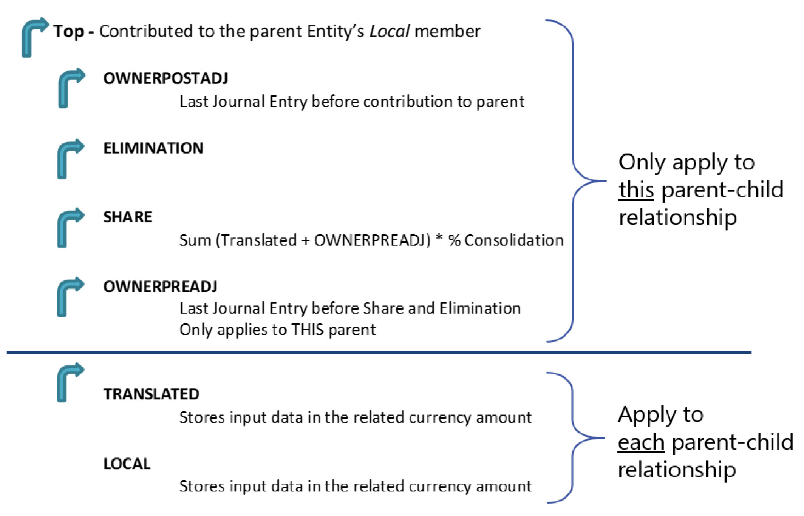

#### Standard

Standard (calc-on-the-fly share and hierarchy elimination) is the most commonly used consolidation algorithm type. This cube setting calculates an entity’s share amount dynamically (the value does not get stored in the OneStream database). Share is a Consolidation dimension member defined for a specific parent/child relationship and is calculated as an entity’s translated balances + owner pre-adj journals * percent consolidation. Eliminations under standard are calculated using OneStream’s built-in algorithms.

#### Stored Share

The stored share consolidation algorithm type stores the amounts for share rather than calculating them dynamically as in standard. However, the eliminations under stored share are still calculated as in standard, using OneStream’s built-in algorithms. This consolidation algorithm type may be used when you have the need for different logic in calculating share than is performed in standard (defined above). An example of this would be if you had a minority interest calculation, where the share contribution cannot be driven from the percent consolidation. When the stored share consolidation algorithm type is used, the rules to calculate the value need to be written under the finance function type `Calculate `(or `CustomCalculate`).

```text
Case Is = FinanceFunctionType.Calculate
```

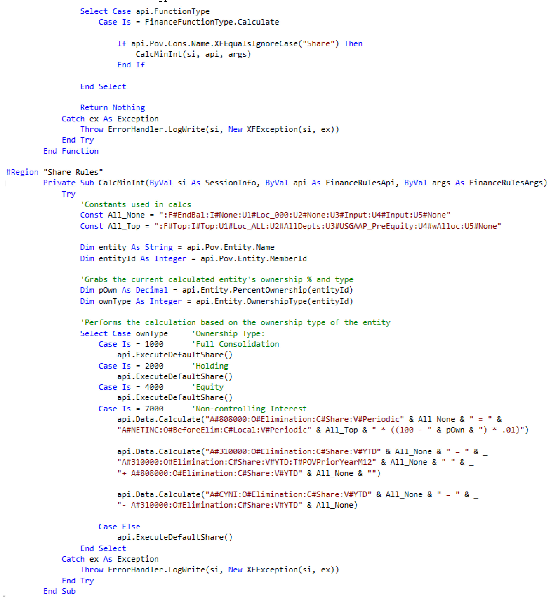

#### Org-By-Period Elimination

The org-by-period elimination consolidation algorithm type uses the calc-on-the-fly share – as in standard – but has unique elimination considerations. When determining if the data cell’s IC member is a descendant of the entity being consolidated, this consolidation algorithm type considers the position of the entity in the hierarchy and also checks the percent consolidation for every relationship down the hierarchy. If percent consolidation is zero for the particular relationship, the IC member is determined not to be a descendant of the entity. In comparison, the standard elimination (hierarchy elimination) only considers the position of the member in the Entity dimension hierarchy. Standard elimination is the default approach and does not consider percent consolidation.

#### Stored Share And Org-By-Period Elimination

The stored share and org-by-period elimination consolidation algorithm type is a combination of the two settings which have been explained above.

#### Custom

The custom consolidation algorithm type allows for the ability to calculate share and elimination data intersections using logic within a business rule. This is often used when you have custom eliminations that are different from OneStream’s built-in algorithm and org-by-period elimination logic. This could be due to having custom eliminations within a User Defined dimension or wanting to write eliminations to unique and specific data intersections.

```text
CaseIs = FinanceFunctionType.ConsolidateShare
CaseIs = FinanceFunctionType.ConsolidateElimination
```

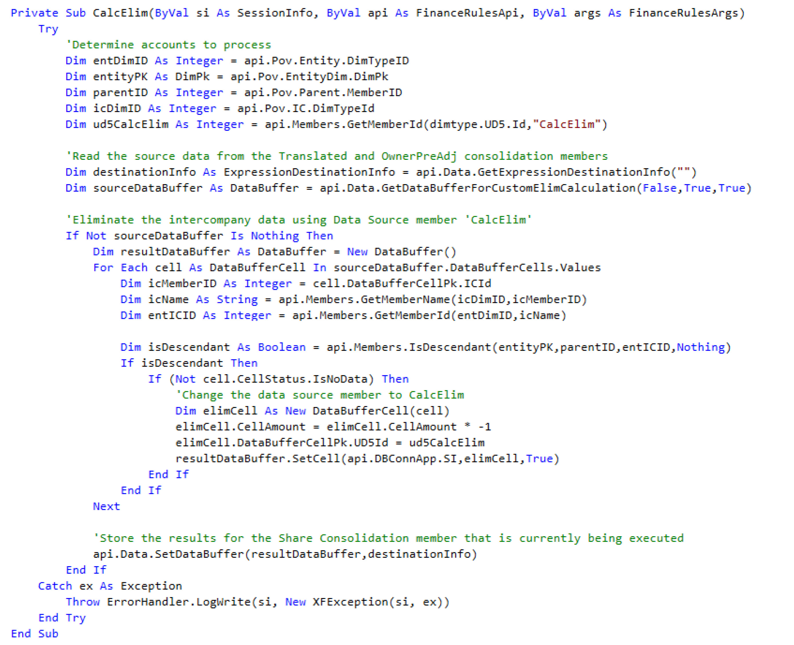

#### Performance Considerations

When determining what consolidation algorithm type settings are needed for the application, it is also important to be aware of performance implications. Under the standard consolidation algorithm type, OneStream does not store share because it is dynamically calculated on the fly. When turning on any of the above consolidation algorithm types which store share, there will be performance implications in doing so. When storing share, the consolidation engine has to perform the custom logic written in the business rule and write the records to the database; the size of each Data Unit will become larger as a result of the additional records. Elimination records are stored in the database under all consolidation algorithm types. When turning on custom eliminations, performance implications will depend largely upon the rule design. Additional records may be written to the database and the engine may spend more time within the custom elimination logic than it would with OneStream’s built-in algorithms.

### Translation Algorithm Types

#### Standard

Standard is the most commonly used translation algorithm type. This cube setting takes an entity’s local currency values and translates them based on the FX rate types (average, closing, etc.) and FX rule types (periodic, direct) assigned to the scenario.

#### Standard Using Business Rules For Fx Rates

Standard using business rules for FX rates is similar to standard but allows the ability to use a business rule to specify translation rates for any given intersection. Any intersections not specified in the business rule will translate based on the standard translation logic. This is commonly used during the translation of Forecast, Constant Currency, and other such scenarios. It is also commonly used when the rate needed for translation already exists in the FX rate table but in another rate type/time, or the rate needs to be determined dynamically. For example, consider needing to translate the Actual scenario at the current year’s Budget rates. In this case, all of the Actual data needs to be translated based on rates which already exist in the FX rate table. By using a business rule, we can dynamically determine what the year we need to translate is based on, without having to copy rates that have already been entered to another rate type. This reduces administrator maintenance by eliminating the need to copy or enter duplicate rates within the system.

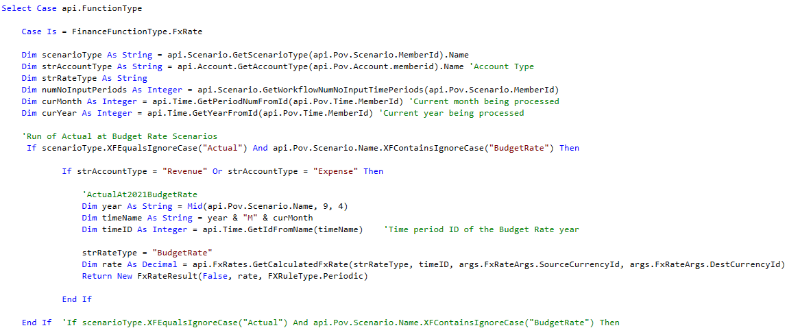

#### Custom

Custom translation logic is rarely used but allows for the ability to calculate the translated values for all intersections within a business rule. The system is flexible to modify to custom unique methods that are not common, nor out-of-the-box.

### Fx Rates

Setting the cube default currency and translation method (rule type) used for revenue, expense, asset, and liability account types is done on the Cube Properties (see Figure 4.2).

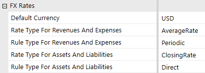

These settings apply to all scenarios within the cube, unless the cube settings are overridden on the Scenario properties by marking Use Cube FX Settings to False and modifying the rate and/or rule type (see Figure 4.3).

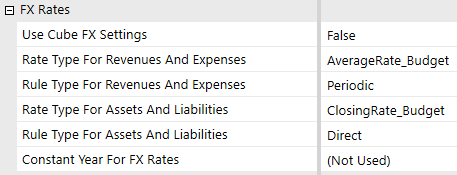

OneStream uses the FX rates entered in order to translate an entity into the currency of its immediate parent. This means that if a GBP entity has an immediate parent of USD, OneStream will translate the GBP entity to USD during translation and consolidation. If the currency of the immediate parent is the same, then OneStream will not translate the results of the entity. If an entity requires translation to a currency other than its immediate parent, that translation currency could be set on the entity using the Auto Translation Currencies setting or an alternate hierarchy developed (refer to the parent currencies section for a breakdown of the pros and cons related to each of these approaches). During translation, if the rate is not specifically entered in the FX rate table, OneStream will use the process of triangulation in order to determine the rate based on the DefaultCurrency of the application. What that means is, if the default currency of the application is USD and the GBP/USD and EUR/USD rates are entered, OneStream will derive the GBP/EUR or EUR/GBP rate based on the other rates entered (see Figure 4.4). Triangulation will only occur if the rates provided include the default currency. For example, if the default currencyis USD and the rates entered are for GBP/JPY and EUR/JPY, OneStream will not derive the GBP/EUR or EUR/GBP rate.

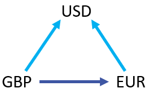

## Entity

Many of the accounting complexities that occur within the Entity dimension are due to the translation and consolidation of data up the entity hierarchy. As such, the Entity dimension is a key dimension that requires scrutiny in the design phase of any implementation. Several design considerations and entity properties are available to use to help facilitate and streamline the consolidation.

### Relationship Settings

Relationship settings on the Entity members which can vary by Scenario Type and time (see Figure 4.5) are used to help consolidation based on various consolidation methods; each is explained in more detail below.

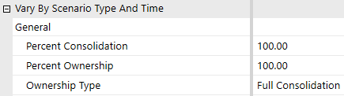

#### Percent Consolidation

Percent consolidation is used to define the percentage of the entity which is consolidated into its immediate parent. This setting, by default, will take all account balances and multiply them by the percentage entered to determine the contribution to its immediate parent during consolidation. It can also be referenced in business rules – for example, if custom logic needs to occur based on whether the entity’s percent consolidation is greater or less than a certain value.

```vb
Dim dValue AsDecimal = api.Entity.PercentConsolidation(entityId,
parentId, varyByScenarioTypeId, varyByTimeId)
```

#### Percent Ownership

Percent ownership is a setting that has no effect on consolidation by itself. This setting can be used to enter ownership percentages, which can then be referenced in business rules developed to perform various consolidation methods. For example, the percent ownership is often referenced in calculating minority interest on the consolidation member share (refer to the stored share section).

```vb
Dim dValue AsDecimal = api.Entity.PercentOwnership(entityId,
parentId, varyByScenarioTypeId, varyByTimeId)
```

#### Ownership Type

Ownership type is a setting that has no effect on consolidation by itself. OneStream pre-populates this setting with four options (full consolidation, holding, equity, non-controlling interest), and five custom options (custom 1–5), which then can be referenced in business rules developed to perform various consolidation methods (refer to the stored share section).

```vb
Dim objOwnershipType As OwnershipType =
api.Entity.OwnershipType(entityId, parentId, varyByScenarioTypeId,
varyByTimeId)
```

### Intercompany Eliminations

Intercompany elimination is the process by which balances held between entities under a common parent are removed during consolidation, with any discrepancies being held in a plug (balancing) account. OneStream utilizes a combination of the entity, account, and IC members in order to eliminate intercompany balances. When two entities are consolidated into a common parent, OneStream creates a balanced entry for each intercompany account. The intercompany balance is reversed, and the offsetting value is booked into the designated plug account. When both entities have matching values, the debits and credits within the plug account will net to 0. If the balances between the two entities do not match, the plug account will hold the difference between their intercompany balances. Figure 4.6 displays how the intercompany elimination process works in OneStream. As Houston Heights and South Houston get consolidated in the parent entity Houston, their balances with each other are eliminated and the offset amount is booked to the plug account. When the plug account is netted, there is a difference of 100 remaining at Houston.

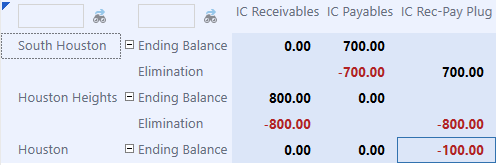

#### Settings

In order for the intercompany eliminations to execute properly in OneStream, several settings need to be applied: The IsIC Entity property on the entity must be set to True. This signifies that the entity can engage in intercompany activity and is then automatically added as a member in the IC dimension. If an entity is a member in the IC dimension, then it could be selected as a valid IC partner. This setting should be applied to the lowest level of intercompany activity available. The IsIC Account property on the account must be set to Conditional or True. When the IC account is set to Conditional, an intercompany balance in this account can be with all IC partners except themselves. It can also be with the IC member none, which represents third-party balances and does not eliminate during consolidation. When this setting is True, the IC partner on intercompany balances can be the same as the entity. Accounts requiring balances to be eliminated must have a plug account assigned. If the account does not have a plug account assigned, regardless of the IsIC account property, the balances in this account will not eliminate during consolidation. Plug accounts are used to hold the offset value during the intercompany elimination process and should be reserved for that purpose only. They should not have data loaded to them, and the Allow Inputsetting should be marked False to prevent the entry of data to these accounts. Plug accounts should have the setting IsIC Account marked as True so that the values held in this account are visible by intercompany partners; this helps with the reconciliation process.

### Parent Currencies

Parent entities are typically set up so they all have the same currency – the reporting currency of the application. A common request from customers is to have the ability to see parent entities in multiple currencies through the consolidation. There are two primary approaches that can be implemented so that you can achieve this – alternate hierarchies or through the auto translation currencies setting on the entity.

#### Alternate Hierarchy

If an entity requires translation to a currency other than that of its immediate parent, a common approach is to create an alternate hierarchy, where each hierarchy has unique parent entity names and are assigned a different currency. For example, if the primary entity hierarchy has parent entity `ABC` in USD, but you also need to see that rollup in EUR, the approach would be to create a new  structure with the parent name `ABC_EUR` (or anything unique) and assign it a currency of EUR. All  of its descendants would be shared from the primary hierarchy. This approach comes with its own set of pros and cons. The benefit of using this approach is its simplicity – only a new parent needs to be created, and everything which has been designed and implemented for the application should stay the same. The disadvantages to this approach, however, are added maintenance and a potentially more confusing user experience. The administrator will have another hierarchy (or hierarchies) to maintain, users will have to make sure they are consolidating all hierarchies, and users will also have to make sure they select the appropriate entity (based on the currency they would like to view) in reporting.

#### Auto Translation Currencies

OneStream allows for the ability to specify multiple currencies for an entity to translate to, through its Auto Translation Currencies property on the entity (see Figure 4.7).

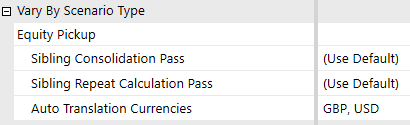

While an entity already translates into the currency of its immediate parent, this allows for translation into other currencies automatically when a translation occurs. Now, instead of maintaining multiple hierarchies with various different parent currencies, maintenance is moved to an entity property only when a new currency translation is needed or can be removed. Users do not have to change entities depending on the currency and, instead, can toggle based on OneStream’s Consolidation dimension, which holds the application currencies. With this approach, however, there are things to contemplate and certain design considerations that need to be made prior to any implementation.

#### Limitations

• Currencies in the Auto Translation Currency property are not the consolidated total of its children. `o`For example, if there are two base entities with an auto translation currency of  CAD, and the parent has no auto translation currency, you cannot view the parent in CAD. The parent must also have an auto translation currency on it, and will translate on the fly, independently of the base entities. `o`This means that it also does not consider account overrides on the children  entities. New overrides will have to be entered for the parent entity as well.

#### Things To Consider

• Rule modifications `o`Rules that run in translated currencies must be opened up to also run on parent  entities. `o`Custom eliminations may be needed on balances not translated using the standard  FX rates (e.g., historical overrides). • Overrides `o`Users will need to input overrides into all of the currencies specified in the Auto  Translation Currencies property for that entity. `o`Input on parent entities is limited to the Origin of `AdjInput`, so forms, rules, and  account Adjustment Type settings will have to be configured appropriately. • Performance `o`Consolidation times will be negatively impacted, and will depend largely on the  rules, how many currencies, entities, etc.

#### Tips

• Only assign auto translation currencies to entities that are required to translate to an alternate currency (a currency other than its local currency and that of its immediate parent). • If the parent entity is assigned the currency you want to translate to, the auto translation currency should not be applied. `o`e.g., I have a parent entity of AUD with a direct parent of USD; a USD auto  translation currency should not be applied to the AUD entity. • Parent entities required to be viewed in their local currency and other currencies should be assigned their local currency, when applicable. `o`e.g., I have two SGD base entities which roll up to a parent. The parent needs to  be in SGD and USD. The parent should be assigned a local currency of SGD. This reduces the number of overrides required. Using this approach does come with things to consider, primarily translation and consolidation rule modifications, but the approach has been used with many customers. When deciding which approach to use, choose a balance between maintenance, performance, and user experience; decide which approach gives the best mix for the customer.

### Parent Adjustments

Parent adjustments are a common requirement across many companies – the ability to make a top side entry that is reflected in the parent entity but which is not booked to a specific base entity. There are two common ways of handling such adjustments – through the use of OneStream’s Origin dimension or through adjustment entities. Either approach can be successful, but the pros and cons relating to user experience and maintenance must be weighed up with the customer.

#### Origin

OneStream’s Origin dimensions allow for the easy input and tracking of adjustments made to base and parent entities (see Figure 4.8). Journal/adjustment data is entered into the `AdjInput `Origin  dimension and when it is translated or consolidated, the data moves into the `AdjConsolidated ` member. This allows for the differentiation of adjustments when looking at a parent entity; all of the consolidated adjustments from child entities are in the `AdjConsolidated` member, and any  adjustment being made directly to the parent entity can be inputted to `AdjInput`.

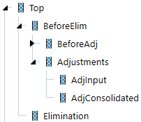

With this method of entering parent adjustments, there are pros and cons; it comes down to knowing the customer, and the user community that is going to be using the data. On the one hand, this is a seamless way of inputting adjustments – there is no additional build that needs to occur in order to do so; indeed, the system was designed to be utilized in this manner. On the other hand, some customers may find this to be a difficult way to find the data. When looking at any analysis which is not by Origin, it may appear as if the sum of the parts do not equal the total (see Figure 4.9).

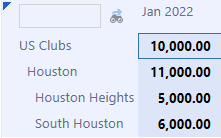

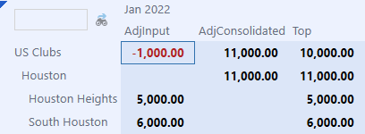

#### Adjustment Entities

Another common approach to making parent entity adjustments is the creation of adjustment entities (see Figure 4.10). Under this method, new entities are created as a child of the parent, typically with a suffix `Adj` and assigned the same currency as the parent. Any adjustments which  would need to be booked at the parent entity are now booked into the new adjustment entity.

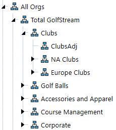

This approach’s benefits come from its visibility and simplicity – the purpose of these entities is clear, and it is easy for a user to find the data. A user can drill down on a parent entity, and the data is in its own entity, isolated from other entities. Also, the entirety of the Origin dimension becomes available, which means that a user can load data through the import member, enter data through the forms member, or load a journal to the `AdjInput` member within this entity.   However, many users may not prefer this approach because it adds additional build and maintenance. Any time a new parent is added to the application, a new adjustment entity potentially has to be added. Other users may dislike this approach because the entity is not a true entity in their structure.

### Equity Pickup

Equity Pickup is the process of revaluing the investments of an investor to reflect the current value of its proportionate share of the investee’s equity balance. OneStream allows for the automation of these entries – including layered ownership models – by entering ownership percentages, defining the calculation sequence, and developing a rule to generate the entries.

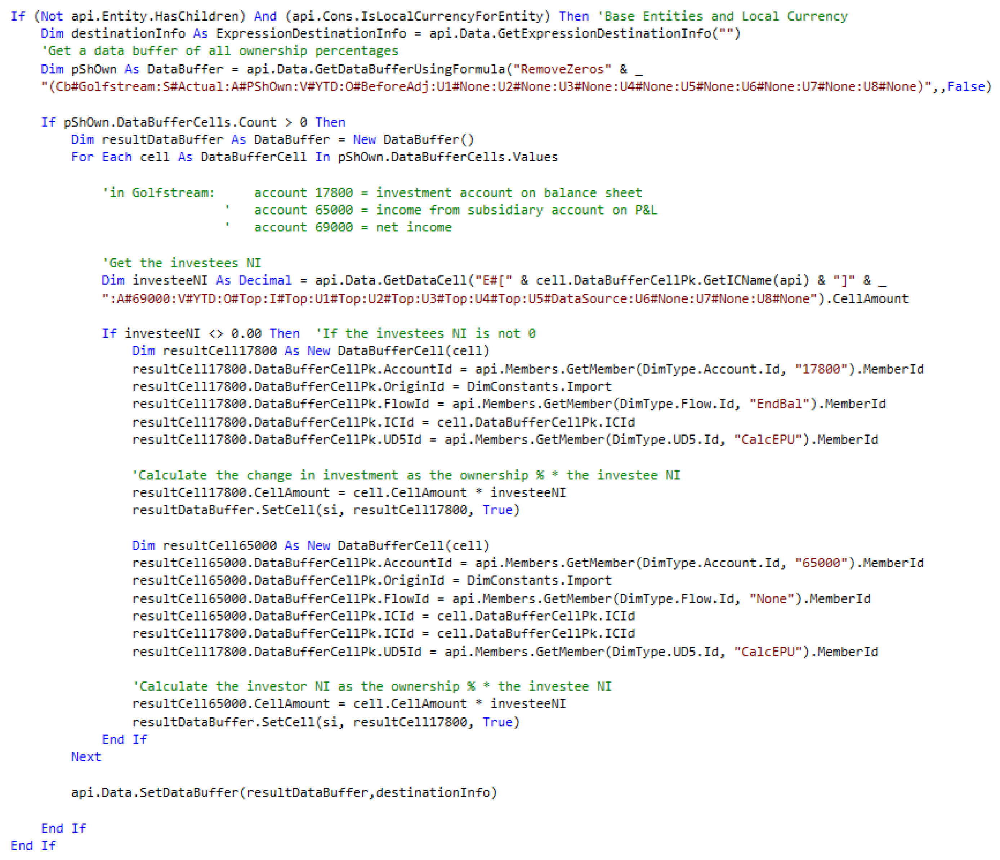

#### Ownership Percentages

Ownership percentages must be entered for each investor and investee relationship. A form is created in OneStream where these percentages are entered for each relationship using the entity (investor) and intercompany partner (investee) (see Figure 4.11).


A form is typically used to enter ownership percentages because the percentage consolidation / percentage ownership settings on Entity members do not permit designation of the investee. In the case where the holding company has multiple investments, or an investee is split owned, having the ability to designate the investee is required. In situations such as this, a new account is typically created to store the percent ownership, and the ownership percentages are entered through a form.

#### Calculation And Consolidation Passes

A layered ownership structure often exists for a company, as seen in the above screenshot – Houston Heights has investments in South Houston, and Downtown Houston has investments in Galleria and Houston Heights. In this case, Houston Heights needs to be calculated first in order to properly reflect its balances prior to calculating Downtown Houston. Instead of leaving this up to the user to ensure entities are calculated in the correct sequence, OneStream provides the ability to specify what the sequence is for sibling entities using the Sibling Consolidation Pass setting (see Figure 4.12).

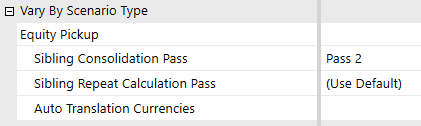

In this example, Houston Heights would be set to Pass 2 (Pass 1 is the default for all entities), and Downtown Houston would be set to Pass 3 to ensure that Downtown Houston is only calculated and consolidated after Houston Heights.

### Org-By-Period

Reorganization of entity structures may occur for a number of reasons – mergers, acquisitions, disposals – and in some cases, they can be frequent within a company. When organizational structures change, having the ability for the current structure to coexist with past structures is critical. This allows a company to easily have consistent and reliable comparability while reducing the maintenance burden of multiple hierarchies. When entities move parents during the year, an entity’s balances must be reported based on the percentage contributed to each parent in that reporting period. For example, consider if an entity consolidated under Parent A 100% through March and then a reorganization occurred where the entity then consolidated under Parent B 100% from April forward (see Figures 4.13 and 4.14).

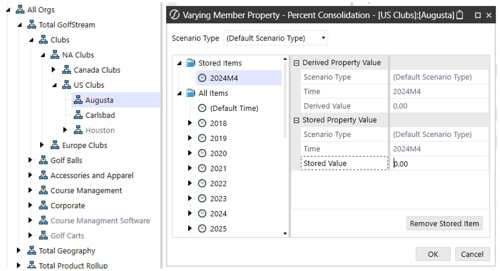

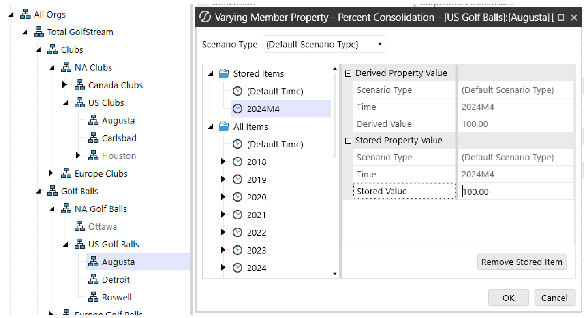

Beginning in April, only the entity’s balances in the month of April can be consolidated to Parent B. Consolidating on a YTD basis would overcontribute the entity’s balances to Parent B. This is accomplished in OneStream with a few settings. The percent consolidation on the entity, which can vary by time period, must be set and the consolidation view of the scenario must be set to periodic. These settings tell OneStream what percentage of the entity consolidates into each parent and to consolidate on a monthly basis, instead of moving its YTD balances. Additionally, eliminations need to consider an entity’s place in the hierarchy but also the percent consolidation for the relationship. OneStream has built-in logic to accommodate this and is explained further in the Org-By-Period Eliminations section above.

#### Considerations

When implementing periodic consolidation, it is important to understand how eliminations are calculated. All of the data in the data record tables is stored YTD, which includes the elimination member. If no data is loaded for an IC member, then the YTD will be stored as 0, and the periodic number will be derived as the reversal of the previous month’s YTD balance (see Figure 4.15).

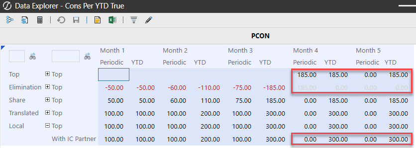

However, in the case of org-by-period, when an entity moves within the hierarchy (and thus the IC balance goes to 0), the elimination should still live on within the parent it occurred in. In order to accommodate this, formulas will need to be written to pull forward the elimination YTD when no data is loaded to an IC member.

## Flow

The Flow dimension is a customizable OneStream dimension that is used to facilitate other complexities that come along with the financial consolidation – capturing historical FX rate overrides, calculating beginning balances, activity, and FX impacts, as well as cash flow rollforwards and the cash flow statement. Each of these items plays an important role in financial consolidation; in this section, we dig deeper into some of the key design considerations of the Flow dimension.

### Periodic Vs. Ytd Data Loads

When loading trial balance and other information into your application, there are two primary ways – periodic (monthly activity) or YTD balances. While YTD is more common, there are situations where the source ERP cannot extract YTD balances, and periodic balances must be loaded. Either data load can be accommodated in OneStream with certain setups. An important consideration is that ERPs loading periodic data need checks to make sure prior period adjustments have been included, whereas YTD data loads would inherently include the prior period adjustments.

#### Ytd

When loading YTD balances into OneStream, the flow setup (Figure 4.16) becomes straightforward. The YTD ending balance of each account is loaded directly to a base member within the ending balance hierarchy (`EndBalLoad`). The base members within beginning balance,  activity, and FX are calculated based on the ending balance which is loaded.

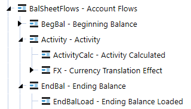

Within this hierarchy, only the ending balance (`EndBal`) should aggregate to the top of the  dimension. Since this balance is provided directly, a user can pull the local currency ending balance without any other calculations needing to be run. Alternatively, as in periodic data loads, if any of the other members (`BegBal`, `Activity`) are  aggregated to the top of the dimension, it would also require a calculation (since these are calculated members) to be run in order to populate the members. YTD balance loads within the Actual scenario are the most common across companies because it provides a simple structure, it is easily understood, includes prior period adjustments, and does not require any calculations (for loaded accounts) to view YTD balances on a local currency basis.

#### Periodic

When loading periodic balances into OneStream, certain items must be considered. First, the scenario member’s No Data Zero View settings should be set to Periodic. Since periodic balances are being loaded, this setting tells OS how it should handle a balance when it is not loaded in the period. This means that when a balance is not loaded in the current period, OS will treat that as a periodic (monthly) 0, which results in the current period YTD being equal to the previous period YTD balance. The Flow dimension hierarchy (see Figure 4.17) design becomes crucial when loading periodic balances, where the difference in setup (versus YTD) is explained further below. • Balance sheet activity – this needs to be a separate member from the monthly activity being loaded for the income statement because the balance sheet activity Flow member requires the switch type setting to be set to True (and the income statement activity should have this setting as False). This allows for balance sheet activity to be translated at the average rate. • Ending balance – the ending balance of your balance sheet accounts becomes an aggregated total of Beginning Balance + Activity + FX (in a YTD load, since the ending balance is provided, it becomes the only aggregated member). The income statement activity member and the stat account input member (`EndBalInput`) can be aggregated as  well. • A calculation would need to be run in order to provide YTD local currency ending balances because the aggregated ending balance relies on the calculated beginning balance.

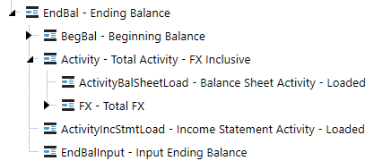

Loading data as periodic comes with one distinct advantage over a YTD load, and that is the number of records requiring to be loaded each period can be significantly reduced than when compared to YTD. Periodic data loads only require the user to load account balances that have activity. A YTD data load has to load any account balance, whether or not it has activity in the current period (as long as it still has an ending balance in the current period). However, a periodic approach to loading data is not as common because its downsides include: a more complicated hierarchical structure, it requires movements to be separated for balance sheet and income statement accounts, it requires solutioning related to prior period adjustments, and it requires calculations (for loaded accounts) to view YTD balances on a local currency basis.

### Historical Overrides

As the financial statements are translated from an entity’s functional currency to the currency of its immediate parent, certain accounts – such as equity – must be translated using the spot rates at each specific transaction date. There are two primary ways to account for this using OneStream: using historical exchange rates or using historical values (both of which are discussed below).

#### Using Historical Exchange Rates

One method of translating accounts at historical exchange rates is to enter the specific spot rate at the transaction date. Transactions occur throughout time at various rates, and each specific transaction must be translated accordingly. Entering historical exchange rates is not done often by companies because it requires either transactional data with the associated rates to be stored in OneStream or a calculation of the weighted average rate to be applied to the balance. This is difficult because transactional level detail is not typically stored in a OneStream cube, and the maintenance of the various rates in the system can be overwhelming.

#### Using Historical Values

The method used more often by companies is entering the translated value of the balance. This requires account balances which are already loaded from the trial balance, and the user to load the translated value either through a file or data entry form. OneStream has functionality built into the platform to easily facilitate this method.

#### Out-Of-The-Box: Account And Flow Member Configuration

When configuring OneStream to override the translation of an account using entered balances, using the out-of-the-box approach comes with benefits and limitations. The main benefit of this approach is not having to write or maintain any rules, as all of the settings needed are properties on the Account and Flow dimension members. However, using this approach for historical rate overrides does come with limitations. Since the Flow member where you load your ending balance can only refer to a single currency override, multiple Flow members by currency will be needed (a member for each override currency). Also, it does not carry forward the override from period to period, so overrides will need to be entered each period or a rule written to pull the value forward into the next period. Additionally, the override values are by individual intersection, but many times, users want to enter the total override because there are too many intersections within an account. In this case, a rule would need to be written to accommodate how the total override is spread to the individual intersections. With multiple currency overrides, if having the ability to pull forward override values or not doing intersection-based overrides is a requirement, then it may be better to go with a custom override approach, as discussed below.

#### Custom Override: Account And Flow Member Configuration

Another method used in OneStream for historical override values is to develop custom rules. This method is used when more advanced override functionality is required. Some examples of this may include the customer wanting to pull forward override values, having the ability to enter a single value for the total account balance (and have it allocated to all of the intersections of the account), or simplifying the metadata when entering various currency value overrides. For the configuration of this method, all accounts which will use a historical value override will have a unique text field identifier. In the Flow dimension, the historical override value will be entered into a member. A formula can be written to pull forward the override value so it only has to be adjusted when there is a new transaction.

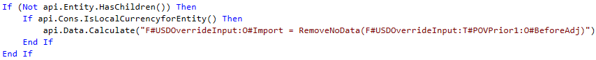

On the member where the historical override will be entered, the flow processing type should be set to Is Alternate Input Currency For All Accounts. This will make the translated intersection of the historical override member invalid. Since the historical override member has the translated value entered to it, the balance does not require translation and this setting will avoid these unnecessary data values. On the Flow dimension member where the local currency balances were loaded, a formula is written to take the historical override value from the associated Flow member and write it to the translated value of the account (if the account has the unique text field identifier). Within this formula, custom logic can be applied.

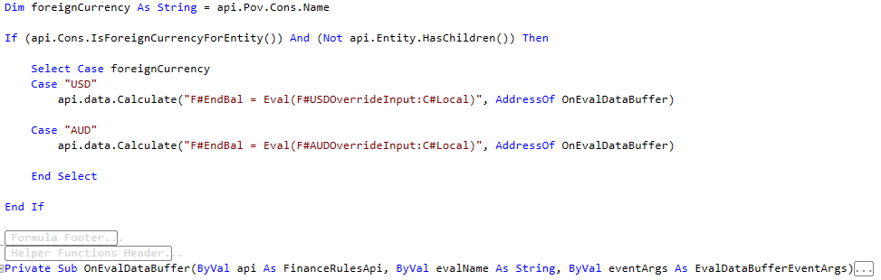

This approach may seem daunting, but the rules applied to these members are customer-agnostic in most cases, and there isn’t a need to change or re-write them on every implementation. The flexibility and ease of use for the user outweigh the perceived downside of requiring rules. An example of the outlined configuration above along with the described Member Formulas can be found in the CPM Blueprint on the Solution Exchange.

### Fx And Cta

CTA, or cumulative translation adjustment, is the calculation of the cumulative balance sheet exposure as a result of the difference in translation rates for each reporting period and is reported in OCI. At each reporting period date, balance sheet accounts are either translated at the closing rate, historical exchange rate, or weighted average rate, which results in changes attributable only to the differences in these rates. For example, a functional currency balance could not change from period to period, but the reporting currency balance could, due to the exchange rate used. CTA reported on the balance sheet is the summation of the FX for each individual balance sheet account. Calculation of FX is comprised of two major components: • FX on the opening balance, calculated as the change in the current closing rate and the closing rate at prior year-end. • FX on the current movement, calculated as the change in the current closing rate and the current average rate. FX exposure is important for a company to understand in order to analyze pure account movements. Changes in balances on the surface may appear as a positive or negative change in cash, but analyzing the FX proves what the true effect on cash inflows or outflows was. Why is this important? Take accounts receivable, for example. If the balance in accounts receivable went down from period to period, it may appear as though the company is collecting cash. If you are able to break down the A/R account into its pure activity versus FX exposure, you can analyze just how much, if any, the company collected. With the OneStream Flow dimension, the calculation and reporting of FX and CTA are simplified. FX members are created and attached to each balance sheet account, with rules (as outlined above) to calculate the components of FX (see Figure 4.18). This allows a user to report and analyze every account by its FX exposure.

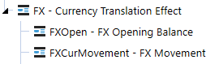

As part of a company’s audit, they are often asked to provide proof of the calculation of the translation adjustment in CTA. This is no longer a disconnected, separate process to calculate a proof and make sure it reconciles to the CTA balance. The FX by account can be totaled and moved to the CTA account so that the calculation of CTA is the proof. If the calculation of FX by account is not correct, the balance sheet won’t balance in the translated currency.

### Cash Flow

The cash flow statement analyzes the cash inflows and outflows of the business in order to understand its financial performance, including its ability to pay down existing and future debts, to reinvest funds for growth, and its sustainability during economic hardships. Overall, the cash flow statement explains the period’s activity in cash in detail. What were the proceeds from the sale of PP&E or investments? Did the company incur debt over this period through borrowings? What was the change in working capital? Whether cash increases or decreases during a period, a business needs to understand why and what is causing it in order to determine any course of action. Companies often struggle with the collection of detailed balance sheet and income statement activity information in order to support the cash flow statement and the required level of analysis. Rarely is this information readily available or complete in a database to integrate with. More often than not, the detailed information to support the cash flow is pieced together by a group of accountants and manually entered. Within OneStream, the Flow dimension plays a vital role in capturing the changes in balance sheet accounts and collecting detailed rollforward information.

#### Rollforwards

Rollforwards are a record of the activity in the account, explaining how the account balance went from its beginning balance to its ending balance. When a trial balance is loaded into OneStream, it typically only includes the periodic or YTD balances. This allows for the calculation of the balance sheet account movements, but not always the required level of movement detail. The trial balance does not detail the purchases or disposals of PP&E, borrowings or payments of debt, or impairments of goodwill during the period, for example. All of the movement in the account for each period needs to be fully explained, or there is a component of cash inflows or outflows that is incomplete. This would throw the cash flow statement out of balance. Cash flow rollforwards are created within OneStream to capture this information, whether through an import process or manual entry. If loading some or all of this information through an import file, it is a mapping exercise as the data gets loaded. If it is captured through manual data entry, forms are created for the user to easily enter and see whether they are explaining all of the activity.

#### Flow Configuration

Within OneStream’s Flow dimension, rollforwards are designed and built based on the detailed movement information being captured (see Figure 4.19).

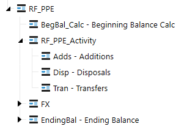

In real time, a user will be able to see how much activity needs to be explained on the account through the use of aggregation weights. The Flow members `BegBal_Calc`, `RF_PPE_Activity`,  and `FX `will use an aggregation weight of `-1`, while `EndingBal` will use an aggregation weight of  `1`. By doing so, OneStream’s on-the-fly aggregation will net these members and allow the ‘Check  Sum’ (`RF_PPE `member) to be updated as the user is entering the activity (see Figure 4.20).

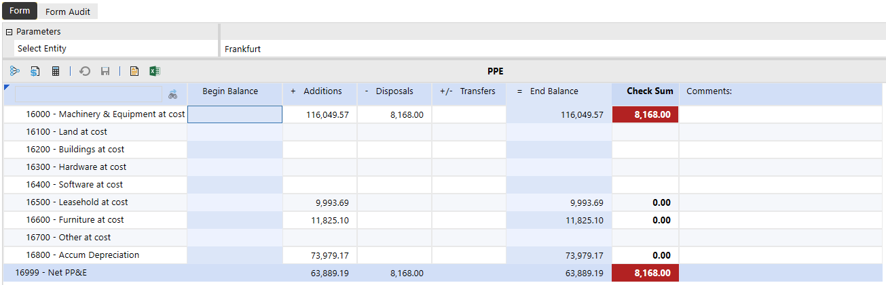

#### Switch Type

Flow dimension members use the account type to determine their behavior (what FX rate to use to translate, and whether the account has a periodic and YTD value), but there is an ability to easily change the behavior for specific Flow members through the Switch Type setting. For purposes of rollforwards, the activity members are attached to balance sheet accounts but need to translate at the period’s average rate. Like income statement accounts, the activity in these accounts happened throughout the period and translation by the average rate is appropriate. By adjusting the Switch Type setting to True, the activity members are now treated like income statement accounts, including the translation (see Figure 4.21).

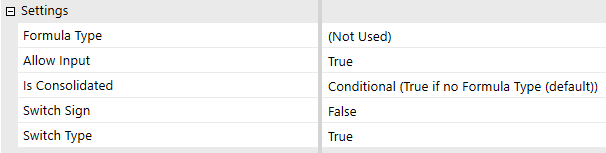

#### Cash Flow Hierarchy Configuration

The cash flow statement metadata structure is typically created in the Account, Flow, or a UD dimension, but of the three options, a UD dimension provides the greatest reporting and analysis benefits. Companies often reconcile their cash flow statement through a CF worksheet or proof, where balance sheet accounts or groupings are in the columns, and the cash flow statement is in the rows. This allows for a matrix to make sure that the activity of each balance sheet account is properly accounted for in the cash flow statement. If the CF statement is built in the Account dimension, this is harder to accomplish because the matrix becomes account by account. Formulas are then needed, which may lead to hardcoded cells within the worksheet. If the CF statement is instead built in the Flow dimension, the creation of the matrix worksheet becomes Flow by account, which allows it to be built dynamically. Additionally, moving the cash flow statement metadata to a User Defined dimension instead of Flow (see Figure 4.22) allows for the same matrix view but also gives the user additional visibility into the flow intersections. This configuration creates the optimal view into one’s cash flow.

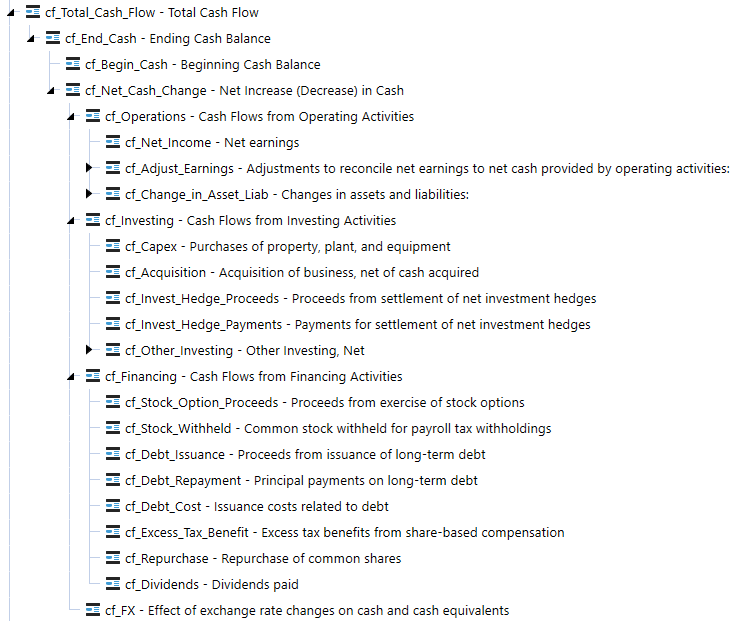

#### Calculation Approach

There are various ways to calculate the cash flow statement in OneStream – Member Formulas or business rules are two of the most common approaches in the past. However, using Member Formulas or business rules to calculate each line in the cash flow statement is rules-intensive and isn’t appropriate for all levels of administrators to maintain. With each modification of the cash flow statement, the administrator has to go into a formula and make the adjustment within the code. This isn’t bad for an administrator familiar with writing and modifying rules, but it can be challenging for others without this background. A hybrid approach of business rules with text field tagging allows for a dynamic and metadata- focused approach, which is easy for an administrator of any level to maintain and users to understand.

#### Text Field

Using this approach, balance sheet accounts and select income statement accounts (when necessary) are tagged with a text field. The text field on these accounts includes the source Flow dimension movement, target cash flow statement line item, and appropriate signage in which they are mapped to (see Figure 4.23). Additional splits of the mapping are designated with a | (pipe) character. In the example shown, FX flow movements for the account with this text field are mapped to a separate cash flow statement line.

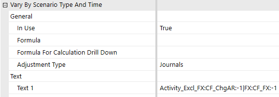

A standard cash flow rule is written to take all the data in the account/flow intersections which have an appropriate text field and push it to the specified cash flow statement line items. With any change to a mapping, the administrator only has to modify text fields on metadata, which can also vary by Scenario Type and/or time. The code is dynamic in reading the text fields so no updates are needed to any code. All users have visibility into how the cash flow statement is calculated by looking at the properties of any member, and reports can be written to display this mapping as well. There are no more questions on where the number came from or sifting through long rule files to determine how line items were calculated. An example of the configuration outlined above can be found in the CPM Blueprint on the Solution Exchange.

## Other Consolidation Topics

### Discontinued Operations

Discontinued operations is a component of a company’s business that has been divested, shut down, or disposed of. When these disposals meet the criteria outlined by financial accounting standards, they must be reported separately from continuing operations on the balance sheet, income statement, and cash flow statement. The presentation of these amounts separately must begin in the first period the discontinued operation is classified as held for sale, and for all comparative periods. Reclassification of these balances allows users to properly evaluate a company’s continuing or ongoing operations.

#### User Defined Dimension

This method accomplishes discontinued operations requirements by creating a new member (e.g., `DiscOps`), within a User Defined dimension. If the application is already using a dimension to  track the source or adjustment type of data, it can be included there. This allows the user the flexibility to toggle to pre-disc ops balances, the disc ops reclassified balances, and balances net of disc ops throughout the entity hierarchy (see Figure 4.24).

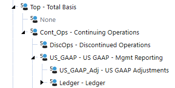

To calculate the reclassification, we need to be able to appropriately identify what has been discontinued and how to reclassify its amounts. An example would be if an entity was discontinued (this can also be segments, product lines, etc.). In this case, we need to identify that the entity has been discontinued, which is usually done through a text field on the entity. Next, we need to identify where the account balances are going to be reclassed to, so they can be presented separately. Each account will have a text field which is equal to the discontinued account which its balances will be reclassed to (see Figures 4.25 and 4.26).

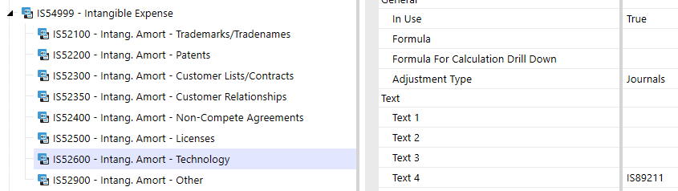

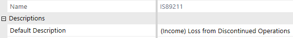

A rule is written which takes all of the data from entities (or other dimension members) with the appropriate disc ops text field identifier, and in the accounts with an appropriate text field, and pushes it to the discontinued account/disc ops UD member. An offsetting value is written against the account holding the balance/disc ops UD member, so the entry is balanced. With any change to a mapping, the administrator only has to modify text fields on metadata, which can vary by Scenario Type and/or time. The code is dynamic in reading the text fields, so no updates are needed to any code. Users have visibility into how disc ops is calculated by looking at the properties of any member, and reports can be written to display this mapping as well. There are no more questions on where the number came from or sifting through long rule files to determine how line items were calculated.

### Acquisitions

An acquisition is when a company purchases a majority of another company’s shares or assets and has control over the business decisions of the acquired organization. A company can acquire another company for many reasons, whether it is part of the company’s growth strategy, diversification by entering into a new market, or to reduce competition, amongst many others. Acquisition accounting occurs outside of OneStream, but the question becomes how do we integrate this new company into our existing application? There can be several areas of the application that need to be updated, including metadata, integrations, and workflows. These are all of the areas expected when a new dataset needs to be integrated.

#### Beginning Balances

It’s also more likely than not that the acquisition occurred during the year, so beginning balances need to be properly reflected for rollforwards and cash flow purposes. How does the beginning balance sheet get entered and picked up properly? With OneStream’s dedicated Flow dimension, this becomes a straightforward process. A member is created in the Flow dimension (e.g., `BegBal_Inp`), where a user will import or manually enter the beginning balance sheet to. The  beginning balance member (e.g., `BegBal_Calc)` will first look to see if a beginning balance sheet  was entered and, if so, use those values; if not, it will use the prior year-end (see Figure 4.27).

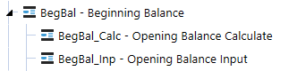

#### Pro Forma

Pro forma financial statements are essentially what-if scenarios – reports used to gain insight into what the business may have looked like in the past, or what it will look like in the future based on certain assumptions or hypothetical events. Pro forma financial statements typically come up when integrating acquisitions and wanting the ability to see what the financial statements would have looked like if the company was acquired from the beginning of the year (or even in prior years). To produce pro forma financial statements in OneStream, there are two common approaches – using a User Defined dimension or a separate scenario.

#### User Defined Dimension

This method accomplishes pro forma requirements by creating a new member (e.g., `Pro forma`),  within a User Defined dimension. The application may already have a dimension that tracks the source of all data which may be used. This allows data to be loaded to the existing dimension members while all pro forma data (pre-acquisition periods) would get loaded to the new `ProformaAdj` member, as pro forma data will not be split out by source (see Figure 4.28). The pro  forma member would only be selected on reports as needed.

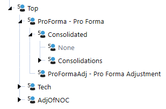

This has some key advantages over the scenario approach, in that there is never the need to copy or move data, which means no further development work, the data is always current, and no reconciliation is required.

#### Scenario

This method accomplishes the pro forma requirements by creating a new scenario (e.g., `Proforma`) within the Scenario dimension. This allows data to be loaded to the Actual scenario,  while all pro forma data (pre-acquisition periods) would get loaded to the new pro forma scenario. After the Actual periods are closed within the Actual scenario, a process would occur that would copy the data to the pro forma scenario, with the result being that the Actual scenario holds all post-acquisition periods, while the pro forma scenario holds all the pre- and post-acquisition data. As mentioned above, because this approach requires copying and moving data, there is potentially more development work in the form of copy rules or jobs. This approach also introduces data latency, and with any movement of data, there is a certain level of reconciliation which would be required.

### Constant Currency

As global companies are analyzing their financials, it is important to understand the performance of the company without the impact and unpredictability of fluctuating exchange rates. Constant currency analysis is the translation of the financial statements at fixed exchange rates in order to eliminate the effects of exchange rates. To perform constant currency analysis, all periods of the financial statements are translated at a constant rate for accurate comparability. This analysis is often used to compare how the company is doing against its budgeted or forecasted numbers, or how the company is trending in key areas. The fluctuations in exchange rates could be masking trends, whether favorable or unfavorable, which would otherwise be identifiable. Departments or employees are often measured on key performance figures, and without stripping out exchange rate effects, the results could be skewed and be measured unfairly. There are several ways to accomplish constant currency analysis in OneStream, and the common approaches are discussed below.

#### Scenario Settings

Translating a scenario at another year’s rates is available using scenario setting Constant Year For FX Rates (see Figure 4.29).

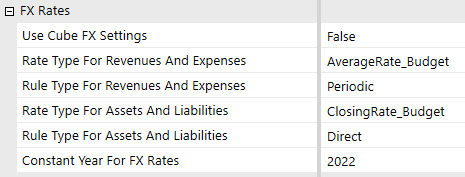

When applying this setting, OneStream will use the rates from the year specified to translate the values within the scenario. What this means is that if 2021 results are being translated with the settings above, January 2021 will be translated at January 2020 rates, February 2021 will be translated at February 2020 rates, and so on.

#### Translation Rules

Utilizing translation rules allows for more flexibility when calculating constant currency. While the Constant Year For FX Rates only allows all data within the Constant Currency scenario to be translated at a single year’s rates, using translation rules allows for each year within the Constant Currency scenario to act independently. As an example, a company may want its Forecast translated at Budget rates. Using translation rules, each subsequent year of the Forecast can be translated at the corresponding Budget rates for the year, without the creation of new scenarios.

#### User Defined

Using this approach, a member is created with a formula that will translate the local currency results at the rate specified (see Figure 4.30). The translation at the constant currency rate happens at the same time the normal financial results are being translated.

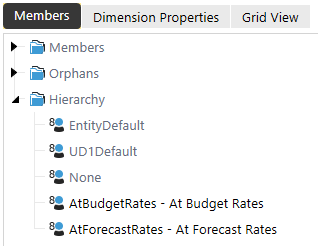

This means there is no data latency, and analysis on the constant currency rate can be done simultaneously during the close. It also means another scenario isn’t required, so source data does not move, and no level of validation has to occur. However, Data Unit size must be considered. With this approach, the data within the Data Unit (cube, entity, parent, consolidation, scenario, and time) may be doubled, tripled, etc., depending on how many constant currency rates are needed. Since calculations occur against the Data Unit, increasing the Data Unit size will increase the calculation and consolidation time. This approach may be appropriate for applications that have low record counts in the Data Unit or which analyze constant currency regularly during the close cycle.

#### Scenario

Using a separate scenario provides the same flexibility to translate each period at any rate while reducing the Data Unit size. Using this approach, a scenario is created for each constant currency rate required (see Figure 4.31). Data is copied from the source scenario to the Constant Currency scenario and translated at the constant currency rate.

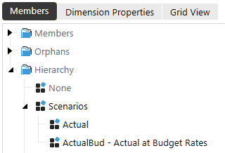

This approach reduces the Data Unit size because it creates a new Data Unit and the calculation performance of the Constant Currency scenario acts independently of the source scenario. However, whenever data is moved, there is a level of reconciliation that has to occur to ensure the data is copied correctly. This approach may be appropriate for applications with high record counts or companies that only analyze this data at particular times later in the close cycle. Copying and translating the data can be scheduled or user-driven and not increase calculation overhead during the close. Hybrid scenarios can also be utilized to aid with the data copying process.

## Conclusion

In OneStream, there are several options you may have at your disposal to solve many of an organization’s complex problems and – in many instances – there isn’t a single solution that works for every customer. When weighing solution options, it is imperative to keep a balance of maintenance, user experience, and performance in mind. The balance between these three key aspects is rarely the same from customer to customer, but knowing the administrator and the user community will help in understanding the right balance. I hope this chapter helped you understand many of the fundamental consolidation concepts and solutions in OneStream so that you may have options to strike the perfect balance with your customers.

## Epilogue

One of my favorite memories thus far with OneStream was in 2017, when 20 OneStreamers decided to run the Tough Mudder in my hometown of Buffalo, NY. Through our participation, we raised money for a great charity: the Navy- Marine Corp Relief Society (NMCRS).


All of the employees from the Detroit area traveled down together on a bus, and several others flew in from other states around the country. On the morning of the run, it started raining consistently and – little did we know – it would be up and down the slopes of the ski resort it was being held on. The course conditions made it even more challenging, and I can’t say that everyone finished the course but we had a lot of laughs throughout the 10 miles and several hours we were out there. It was a team event where we were able to raise money for a great cause and everyone could have fun outside of the office together.
