# Planning

Originally written by Jonathan Golembiewski, updated by Jonathan Golembiewski When I embarked on my first Planning project, I had been at OneStream for almost two years. In that time, I had mostly worked on consolidation projects as those were the type of projects we focused on in the early days. This project would be the very first complex, driver-based planning solution that would be implemented in OneStream. It was also the first implementation of People Planning (which would become the basis of the Specialty Planning suite of Solution Exchange solutions). While I didn’t have a lot of planning experience, I did have a solid grasp of the vast capabilities of the OneStream platform. I would since come to learn these capabilities could solve just about any planning problem you could imagine. In the end, the first planning project at OneStream was a success, and we were able to implement a very elegant solution (thanks to the help of numerous colleagues and a very patient customer). Since that first project, OneStream has implemented hundreds of unique planning solutions across companies of varying sizes and complexity. This is a testament to the ‘Power of the Platform’ and how OneStream is constantly adapting and improving to meet the needs of the market.

## Designing Planning Solutions In OneStream

The OneStream platform offers a unique set of tools to handle the complex planning requirements of large corporations. Retail, manufacturing, and service industries have vastly different business models and will, therefore, have vastly different ways of producing their financial plans. It is also common for one company to have a variety of business models operating under the same umbrella. Further, financial planning does not happen in isolation from other financial processes such as consolidation. Often, Actual data is used as the basis of financial plans. Imagine a CFO asking an analyst, in June, for a report that gives the projected end of year results. This report would need to blend data from both Actual historical data with data from the annual budget or forecast. Further, there is tremendous value in having financial data that is comparable across scenarios. For example, a CFO wants to see how the most recent period’s financial results compared with the plan for every product in a department. If there isn’t a commonality between these two datasets, this report would be cumbersome, if not impossible, to produce. This is where OneStream shines. It was built upon the idea that all these financial processes belong in the same product, and accomplishing this can create tremendous value for the office of the CFO. OneStream’s Extensible Dimensionality allows the data that supports these processes to live within the same cube without having to sacrifice specific planning requirements and complexities. Plan data can be prepared at more or less detail than Actual data while still holding a common point for reporting. Another unique aspect of financial planning is the variety of methodologies and sources of data that can be drawn from to assemble a company-wide financial plan. Data is often sourced from transactional databases, payroll systems, or production data warehouses. OneStream’s robust data integration engine can bring this data into the application so it can be enriched and used across various planning processes. This feature is also important in explaining the ‘why’. Having the data living in one tool gives tremendous value when combined with OneStream’s robust reporting and analytical tools. After all, financial projections are only useful if they can be used to make informed business decisions. The founders of OneStream set out to create a platform that can bring everything together into a connected enterprise-wide plan. Accomplishing this is a paradigm shift in the industry. My goal for this chapter is primarily to get you – the reader – to think about planning more broadly in the context of other business processes. When implementing planning in OneStream, you should be thinking about the big picture as much as the fine details. I will try to put the key concepts in the context of the bigger picture and never as isolated processes.

## Approach To This Chapter

The goal for this chapter is to create a common framework for how to approach planning projects in OneStream. I will focus specifically on how to design and utilize OneStream’s robust set of tools most effectively for your customers. As we move through the sections of this chapter, I will first try to establish a foundation of the basic concepts in financial planning. I think it’s important to understand the underlying business processes that companies use to produce their plans before tackling the more technical elements. I will start by identifying the various types of planning processes you are likely to encounter, and the methodologies used to create them. From there, I will explain how we can leverage OneStream’s unique capabilities to build a unified solution that encompasses all these financial processes and methodologies. Along the way, I will also give tips and techniques that can be employed to build planning tools in OneStream. These are mostly meant to be a nudge in the right direction and not hard and fast rules. Anybody who has spent time in a Financial Planning & Analysis department, or has experience implementing planning CPM solutions, knows that the first rule of planning is that there is no ‘one way of doing things’. Even companies within the same industry can have vastly different approaches to creating their financial plans. At OneStream’s annual Splash Conference, where OneStream consultants and customers gather from all over the world, many conversations can be heard describing different ways of implementing similar planning solutions. There are always several ways of getting to the same result, and this is especially true of a product with the robustness and flexibility of OneStream. For consultants or users of other planning tools, it is highly likely that you will encounter planning challenges that you’ve never seen before. That being said, ‘out-of-the-box’ thinking is not only encouraged but necessary. This is not to say there aren’t industry trends, patterns, and common techniques that can and should be followed. This chapter will attempt to provide a basic framework, common language, and tips and techniques for tackling planning projects in OneStream. Further, every design decision should be weighed against two important benchmarks – performance and maintenance. You can build the greatest, most-accurate planning solution with every bell and whistle imaginable, but if it requires a 10-person team of data scientists, IT experts, and system administrators to maintain, you haven’t created much value for your client. Similarly, you can create a highly-detailed plan that tracks profitability for every SKU in the company’s product catalog, but if it takes hours to generate a simple report because the performance is poor, it will not be very useful to the Executive Team. As such, these two standards should be at the back of every consultant’s mind when making any design decision. Unfortunately, both metrics can sometimes be difficult to measure. One customer’s perception of poor performance could be vastly different to another’s. It’s important to establish benchmarks and set expectations early in the project. As a final thought, I will note that it’s impossible to cover every possible design nuance and that consultants, working jointly with FP&A team members, should do their best to weigh the pros and cons of all possible solutions before coming to a decision. I hope that by the end of this chapter, you are armed with better knowledge to tackle the variety of situations you are bound to encounter.

## What Is Planning?

Let’s start by defining what planning is, as it’s a rather broad term that can mean a lot of different things. In the context of OneStream and this chapter, I am more specifically referring to financial planning. Traditionally, financial planning refers to the projection of a company’s future financial position. All companies need to create financial projections to make business decisions, decide how to invest capital, and provide guidance to investors. Companies strive to create accurate financial projections in the shortest amount of time possible. This dynamic is why most companies look to a powerful tool like OneStream to achieve this goal. Financial planning is typically used to drive financial decisions. This type of planning is more closely related to the Actual data reporting requirements, as financial plans are periodically measured against Actuals. Supporting data structures are typically multidimensional with semifrequent updates to metadata. Financial intelligence and data aggregation are necessary against these structures as well. The preparation of financial plans requires heavy interaction with end- users, and calculations derive most of the data. OneStream is also positioned to handle other, more detailed planning processes outside of traditional financial planning.

### Specialty Planning

Specialty planning refers to planning that focuses on a specific area within the financial plan. The level of detail used to generate specialty plans is generally much greater, but will ultimately feed into (and relate back to) the greater financial plan. The data structure within specialty planning is highly detailed and transient in nature – changing frequently. Users will need to interact with this data moderately and execute stored calculations against the data. Sophisticated financial intelligence and aggregations will usually not take place in specialty planning. An example of specialty planning would be People Planning. A detailed people plan could provide insight into hiring decisions or highlight differences between supply and demand.

### Operational Planning

Operational planning refers to highly detailed datasets that provide key information and metrics between financial periods to help drive financial decisions. It provides real-time financial information to guide the business on shorter timeframes – such as daily or weekly. Operational planning data is not interacted with, or modified, by end-users. Simple calculations and aggregations can be performed. The majority of this chapter will focus on financial planning, but we will make several references to specialty planning and operational planning as well. The Analytic Blend Chapter (12) goes into much greater detail around how to design and implement operational planning.

## Designing & Building Planning In OneStream

### Classifying Planning Projects

Planning projects can take many shapes and forms. It’s important to understand, upfront, what kind of planning project you will be undertaking. We can classify planning projects based on the following criteria: • Stand-alone – this is the first implementation of OneStream at the customer, and planning is the first phase. The biggest thing to keep in mind for these project types is to make sure the solution is set up to accommodate future phases. • Phase 2 (or later) –there is an existing implementation that is already live, and planning will be a subsequent phase. For example, consolidation is already live, and now planning is being implemented. For these project types, prior phase solutions should be carefully reviewed, as many existing elements can be leveraged for planning. • Combined – planning is being implemented alongside consolidation (or another solution). Combined solutions may have separate project teams dedicated to each solution. Communication between both phases is key as there will be many areas of overlap. For these types of projects, it often makes sense to hold at least some of the design sessions together with both groups.

#### A Note On Actuals

The vast majority of OneStream customers fall into the latter two categories of projects and have implemented consolidation or Actuals before (or in parallel to) planning. There are several reasons for this. First, Actuals are often used as the basis or source for the plan. Second, most companies need to produce variance reports that compare the plan against Actuals. I don’t think I can remember having ever implemented a planning solution in OneStream where Actuals didn’t need to be considered! If you think about it, this makes sense. Financial planning should align to financial consolidation and reporting. However, you should never assume this is the case. Later in this chapter, we will outline how to analyze this and come to the right decision on how to integrate planning data alongside Actual data.

### Planning Design Principles

In Chapter 3, Peter described the fundamentals of a OneStream design session. The same principles he explained will apply here, and I will seek to expand on them as they specifically relate to planning. A planning design typically occurs over several meetings. Depending on the size and scope of the project, it may stretch over several weeks. It’s important to establish clear goals for the meetings and agree on what the outputs will be. Below are some basic principles that should be followed for every planning design: • Strive for standardization • Avoid replicating manual processes • Consider future phases

### Design Approach

The basic premise I use for planning designs is to focus on the business processes first, before moving into technical design elements. There will likely be non-technical people in the room and certainly people who don’t know OneStream. By focusing on the business processes and using familiar terms initially, you will set the stage for an easier transition into the more technical OneStream-specific topics. To this point, there should be two main focal points in the design meetings. The business process designis a description of the inputs and tasks performed by the planners to produce the company’s financial Plans. The BPD will focus on the business side of things. It’s not meant to be technical or OneStream-specific. The BPD is ‘solution agnostic’, meaning that it should be the same if you were designing a solution in Excel rather than with OneStream.

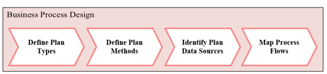

The technical designdescribes the specifics of how the solution will be built and configured to meet the requirements of the business process design. This is where OneStream-specific terms and elements will be referenced. It is also what will become the blueprint for building the solution.

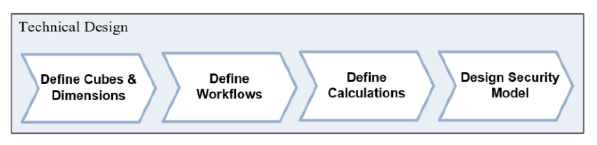

The coming sections of this chapter will break down these two aspects of the design into greater detail.

### Business Process Design

As mentioned above, the business process design (BPD) should be the starting point for the planning design. The goal for the BPD is to create a bridge from functional to technical. To do that, we will start by defining some basic planning terms. Some readers may find this rudimentary, but I’d suggest skimming through this section to at least get familiar with the vocabulary I will be using. As with most professional topics, there is a lot of interchangeable jargon, so this will at least get everyone on the same page. I also think it helps to use more generic terms in design sessions when there may be non-technical people in the room. After all, part of being a consultant is being able to effectively translate functional terms to technical software.

### Plan Types

Just like the wall of deodorant varieties at the drugstore, there are many different types of financial plans. Let’s think of our own personal budgets. You probably have a monthly budget of how much you will earn, spend, and save. You have fixed costs such as rent and utilities, and variable costs such as meals and entertainment. You also likely have a longer-term financial plan for planning larger purchases or preparing for retirement. Without these plans, it would be very difficult to make personal financial decisions. Businesses are no different and often have numerous financial plans that are used to drive business decisions. We can define a plan type as a financial plan that shares a common preparation process, duration, scope, and level of detail. The below sections will define and describe several plan types, commonly seen within the industry.

#### Budget

Most companies prepare an annual budget as a one-time exercise before the start of the next fiscal year. The preparation cycle for the budget is usually longer than for other planning processes and can occur over several months, often going through several iterations. The budget can be at a different level of detail than other planning processes and is often used as the basis for subsequent forecasting cycles.

#### Forecast

Forecasts are usually prepared periodically throughout the fiscal year and are meant to quickly capture changes in a company’s business. A forecast usually occurs at a higher frequency, often monthly, and sometimes quarterly or weekly. The scope of a forecast is also defined by the number of periods forecasted. The most common forecast is ‘year-to-go’ (YTG), in which Actual data is blended with Forecasted data to create a projection for the current year only. In this case, the number of periods forecasted is variable as the company operates throughout the year. A rolling forecast refers to a forecast that always spans a constant number of periods. A 12-month rolling forecast will always project 12 months from the current month.

#### Long-Range

Long-range plans typically span over multiple years and are updated less frequently than other plan types. They will often be prepared at a higher level within Account or reporting dimensions. For example, a long-range plan may only project results of total company sales instead of breaking down sales across individual products like in the Forecast or Budget.

#### Operational

An operational plan is typically a highly-detailed plan that is often specific to a department or section of the company. Operational planning often uses detailed driver or transactional data as the basis for creating the plan.

### Planning Time

Once you’ve established your plan types, the next step is to collect information related to the timing, duration, and other time-related information, which will have downstream configuration effects relating to scenario properties, data seeding logic, and workflow settings. The information covered in this section is typically collected in a design session or scoping call.

#### Preparation Cycles

How often is this type of plan created? Once a month? Once a year? How long does each cycle take? A day, a week, three months? Each plan type will have a preparation cycle, which is how often this plan type is prepared. A budget may be prepared once a year, while a detailed forecast might be prepared each month. It’s also important to understand how long each cycle lasts. The annual budget may be prepared over a period of three months, while the preparation of the monthly forecast is much quicker, lasting only three days.

#### Input Frequency

Input frequency refers to the time unit of the plan data (e.g., monthly or quarterly). A budget would likely be prepared as 12 units of monthly data. It could also be prepared as four units of quarterly figures, or 52 units of weekly figures. A long-range plan could be five units of yearly figures.

#### Plan Duration

Plan duration is the number of time units that the plan consists of. A yearly budget with a monthly input frequency would have a plan duration of 12 months. The plan duration will mostly control the workflow settings in the Scenario dimension.

#### Plan Input View

The plan input view refers to how the plan data will be entered into the system. This can either be year-to-date (YTD) or periodic. Periodic will refer to the input frequency (e.g., week-to-date for weekly, month-to-date for monthly, quarter-to-date for quarterly, and so on). It’s important to note that OneStream always stores data as YTD, so this setting is mostly dependent on how the data will be entered into the system. A good way to approach this is by looking at how a user will be typing numbers into a form, or how the data will be imported from external data sources. In general, users are most comfortable entering periodic data (e.g., they would enter month-to-date numbers into a scenario with a monthly input frequency). It is also possible to have different input views between adjustments and imports.

### Plan Methods

There are a lot of ways you can derive a financial plan or a budget. Let’s go back to our personal budget, and think about how we might plan our monthly dining and entertainment expenses. One place to start would be to look at our average monthly expenditures over the past 12 months. This would probably be pretty accurate but would fail to capture monthly spikes due to special occasions, such as holidays or anniversaries. Alternatively, we could determine the number of ‘nights out’ we are planning for each month and then multiply that by an average dinner bill. As you can quickly see, there are a lot of different ways to create a financial plan. There is a common joke amongst planning consultants that “The numbers are just made up anyway.” But try telling that to a CFO when he asks how you got to a particular number for projected sales for a product! Being able to explain the basis of financial projections is an essential requirement of any planning tool. During the design session or scoping call, it is important to identify what plan methods will be a part of the overall solution. The next sections will cover planning methodologies commonly seen within the industry and give an introduction as to how they should be tackled in OneStream. We’ll use an example of salary costs to illustrate the application of each planning method.

#### Driver-Based Planning

Driver-based planning describes a financial plan that is derived from two or more driver inputs. A simple example of a driver-based sales plan is price per unit * quantity of units sold. Often, one driver input is used as an input in many calculations. The same quantity driver can be used in the cost of sales calculation as well as form the basis for warranty costs. As such, a company can get a sense for the sensitivity it may have to one particular driver or assumption. This allows the system to do the work and can greatly reduce the burden on the end-users. Driver-based planning can also give organizations powerful analytic options. Changing the value of one driver can have impacts across the entire income statement and balance sheet. Imagine a supply chain disruption that delays the shipment of a specific product. A forecast can be quickly adjusted by changing one or two inputs and recalculating a plan. Further, driver data is often sourced from other systems or entered by sales and manufacturing teams. It is important to identify these sources and compare their level of detail to that of the reporting cubes. Depending on what you uncover, the driver data may fit better in its own cube or may lack the detail necessary to support the reporting requirements. In a driver-based plan for salary costs, we need to first define our drivers. In this example, we will use headcount as our quantity and average salary as the price. We might have managers enter headcount for their respective departments each month. We could also have managers enter average salary, or we could calculate within the system using historical data. Either way, the result will be a simple formula: headcount * average salary = salary expense This method gives insight into projected salary costs by allowing visibility into the drivers that were used. For example, an analyst can say, “Salary costs increased by 20% due to the hiring of five employees” and reference the headcount driver trend. Driver-based plans will make heavy use of the OneStream calculation engine. I will walk through several examples of driver-based calculations in OneStream later in this chapter.

#### Factor-Based Planning

Factor-based planning refers to the use of either historical or existing data as the basis for a financial plan. A growth factor (often a percentage) is then applied to extrapolate financial data over the duration of the plan. In a factor-based plan for salary costs, we would use the last 12-month average salary cost as the starting point. A growth factor of 20% would be entered by a department manager, and the salary costs would be extrapolated to create the plan. Factor-based planning has an advantage in that it can be produced quickly; however, it will typically fall short on accuracy as the adage “Historical results do not predict future performance” can be applied. As such, the use of factor-based planning is usually limited within organizations or reserved for long-range plan types, where the level of detail is much higher and there is a greater level of uncertainty. I will walk through several examples of factor-based calculations in OneStream, later in this chapter.

#### Zero-Based Planning

Perhaps the antithesis to factor-based planning, zero-based planning refers to planning in which each expense must be detailed and justified for each planning period. This method of planning typically focuses on the operating expenses section of a company’s income statement. Historical data or drivers are purposely ignored as the process for producing a zero-based budget starts from zero each period. A zero-based approach to salary costs may involve a manager justifying each existing position within their department and making a business case for any planned new hires over the planning periods. Supporting detail could be provided as either text explanations or the attachment of supporting files. Zero-based planning has the advantage that it forces each expenditure to be justified. Explanations, attachments, or line item detail is often required to support each expense. Cost-cutting initiatives within an organization will often drive heavier use of this methodology for producing financial plans. This type of planning puts more responsibility on the planner to provide details and defend each line item. OneStream has several tools available that can support zero-based planning. • Data cell annotations • Data cell attachments • Cell detail These tools can be used to collect textual information or categorize costs. This information can then be shown on reports or drilled into from Cube Views or Excel Quick Views. Refer to the Data Integration Chapter for more information on these features.

#### Transaction-Based Planning

Operational plan types generally fall into the category of transaction-based planning in that the data used as the basis for the plan is much more detailed and transactional in nature. This can be thought of as a type of driver-based planning in which the drivers are loaded or inputted as a list, and can have various attributes associated with them. The amount of detail captured is much greater than for traditional driver-based planning processes. This creates a very specific set of requirements that need to be considered at implementation time, so we have carved it out as its own plan type. Transaction-based planning can put a much higher strain on an organization’s finance teams due to the highly detailed nature of the data. Detailed lists of items with attributes must be verified, maintained, and updated throughout the planning processes. However, accuracy and insight into the financial data are benefits that often outweigh the drawbacks. OneStream’s blend engine provides powerful tools for this type of planning. In turn, the Solution Exchange has several ‘specialty planning’ solutions specifically designed to solve this type of planning requirement. To plan salary costs using a transaction-based approach, we will start at the same place we did for our driver-based approach. Let’s take our headcount * average salary = salary expense equation and go one step further to each individual employee. So, instead of one number for headcount and one number for average salary, we will create a list of all employees with their respective individual salaries. We can also collect additional attributes about each employee, such as salary, bonus percentage, merit increase month, and training costs. Planned new hires or terminations would then be integrated during each planning cycle. Calculations would be run against the list of employees to produce the detailed salary cost, which would be transformed and loaded into the cube at an aggregated ‘total employee’ level. It will likely take longer for end-users to prepare this plan in relation to the driver-based method, but from an analytic point of view, you have the ability to go deeper than just FTEs and are able to gain valuable insight into the details of each employee, and how they contributed to the overall salary cost expense.

#### Plan Data Sources

For all plan methods and types, data from a variety of sources will be required to produce financial plans. These data sources will need to be identified and integrated into the build. Below are some examples of common data sources: • Historical data (Actuals) • Production data • Production schedules • Hiring plans • Salary tables • Labor Union agreements • Sales projections Once you’ve identified each data source, you should also collect some additional information about each of the data sources. The method of inputting into the system, the person responsible for the input, and the format of the data will be very helpful. You won’t always be able to find this out in the design phase, but you’ll need to know it eventually, so find out as early as possible. If you can get samples of the files, even better.

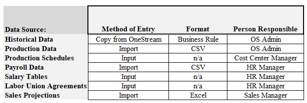

During the BPD phase, we will just create an inventory of the data sources with some basic information. Later, in the technical design, we will determine how and where we will integrate each data source in OneStream.

#### Plan Process Flow

Understanding the detailed process behind how each plan type is prepared is crucial. By now, we’ve already collected a lot of information about each plan type – we know the plan methods, preparation cycles, and data sources that are needed. Now it’s time to fill in the gaps and lay it out into a process flow of what happens, when it happens, and who does it. It’s good to focus on cause and effect, and the timing of certain tasks. Try to get information on cut-off times or dates in the process. Next is an example of a plan process flow:

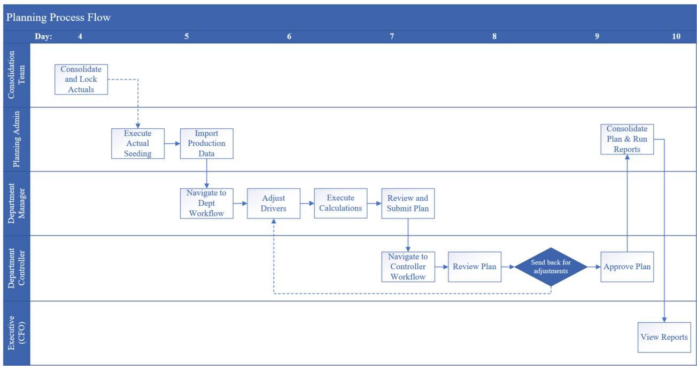

The plan process flow brings everything from the BPD together and will identify any gaps or areas that need to be investigated in more detail. It is also a good idea to scrutinize the process and identify areas that can be automated or redefined. Later in this chapter, we will expand on this concept by translating the process flow to OneStream’s workflow mechanism.

#### Conclusion

It’s best to start planning design sessions by focusing on the underlying business processes instead of the technical details. If you’ve done a good job here, the rest of the design and build will be much easier. Let the business processes drive the software… not the other way around. In the next sections, we will discuss how we can now take the business process design and transform it into a

## Technical Design.

## Technical Design And Build

Once you’ve completed the business process design, you will be in a great position to start the technical design. For all the nerds reading (which I assume is the majority of the audience for this book), you can rest easy because we are finally getting to the technical stuff. The technical design is when we determine where our data is going to go, what calculations we need to build, and how users are going to interact with the solution. We will use the information collected from the business process design to guide us. The basic components of the technical design are shown below. We will break each of these down in the next sections.

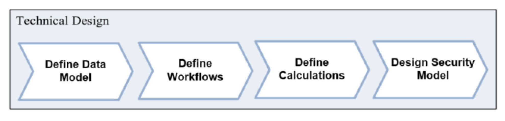

### Defining The Data Model

The data model refers to how all the data related to the plan is organized in OneStream. This includes data imports, user inputs, and data that is derived from calculations. It’s important to consider all the above options when designing the overall data model. Not all data should, or needs to, reside in the cubes. The final picture of your data model will largely depend on the plan types, methods, and plan data sources identified in the business process design. The goal of this part of the design is to create a data model that meets the reporting needs of the organization while performing well and requiring the least amount of maintenance.

#### Picking The Right Tool For The Job

The first key to success in designing your data model is to align each set of data to the appropriate tool in OneStream. The OneStream platform offers a lot of ways data can be stored, calculated, and analyzed. • Cubes • Relational tables (includes specialty planning) • Staging tables • Analytic Blend Cubes are great at storing, consolidating, and giving fast access to summary data. They are not designed, however, to hold large volumes of transactional data. Putting unnecessary or misplaced data in the cube can lead to performance issues. If you wanted to use a cube to retrieve all potential voters in the US, you’d likely have dimensions for state, county, and party registration, but would stop short of creating individual voter names within a dimension as it would be millions of members. Further, storing this data in a cube would be cumbersome to maintain and cause performance issues. Think about how often you’d have to add a new member to the voter dimension! Instead, the data can remain in staging tables where it can be drilled into from the cube. Analytic Blend can also be used for analytical purposes. To review, data in the cube should: • Require financial intelligence • Require stored aggregations and consolidation • Require complex calculations • Require the ability for users to both read and write • Not be transactional in nature • Not have frequently changing or transient metadata • Not be textual in nature If a dataset doesn’t meet these requirements, it can probably be better stored elsewhere without sacrificing analytic value. Perhaps equally as important as determining what data goes into your cubes is understanding what data does not belong in the cube. Throughout a planning implementation, you are likely to need a variety of data types to support the plan. Keeping this data outside of the cube can drastically improve overall performance and user experience without compromising functionality. Some examples of data types that you may need to support your planning solutions but which can remain outside the cube: • Production dates • Vacation and holiday schedules • Invoice detail • Text attributes • Transactional data • Transient data In other CPM tools, it was assumed that this data would need to reside in the same place as the financial data if it was needed in calculations or reports. This was mostly because there were limited alternative options. If it couldn’t go into the cube, then it needed to remain outside of the system in an Excel spreadsheet, Access database, or a third-party tool. OneStream has unique capabilities, however, to store data outside the cube while being totally accessible to users in reports, forms, and business rules. In the next sections, we’ll discuss the various options we have in OneStream to store these types of data. How the data is ultimately used will largely determine where it should reside in OneStream. Understanding reporting needs, whether users need write access to edit it, and how it needs to be reported will be important factors in your decision.

#### Cubes And Dimensions

We will start the data model discussion with cubes. Although cube data is stored in a relational database, it best services a multidimensional data model. It has a powerful consolidation, aggregation, and calculation engine, along with robust financial intelligence and reporting tools. All cube and dimension designs should leverage extensibility to the greatest extent possible. Extensibility will give your cubes ultimate flexibility and optimize performance. By using extensibility, you will significantly reduce the build-time of the project and the maintenance going forward. Perhaps more importantly, extensibility can have a tremendous impact on business processes and how companies produce their financial plans. In my experience, when implementing planning solutions for large organizations, most companies start with a very disjointed planning landscape. Various teams within their organizations use a variety of methods and tools to get their financial plans. Then, there is another separate team that must cobble everything together to get it on a report. I have seen 20MB Excel files that crash half the time you try to open them. The maintenance burden and margin for error is just too high. Extensibility is the tool that can help solve these problems. It’s an opportunity to standardize dimensions, calculations, and data. In planning design sessions, I try to push organizations into standardizing as much as possible. Before we dive into the details of how we can use extensibility, we need to define a few other items. We’ll first define our Scenario Types and scenarios, then we’ll determine the inventory of reporting dimensions we need to support the reporting for each plan type. From there, we will look at the unique properties of the Entity dimension and determine which dimension we should assign as our entity. After that, we will assign the rest of our dimensions in a matrix. Last, but certainly not least, we will determine our cubes and circle back to extensibility.

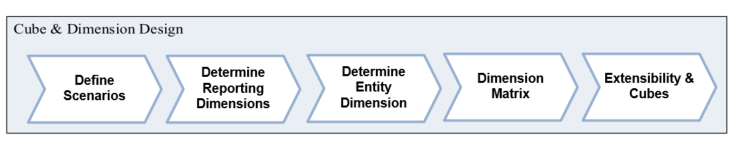

### Scenarios

The Scenario dimension is a logical starting point when designing cubes and dimensions, as they will need to be clearly defined before considering extensibility. Beyond extensibility, there is a lot of flexibility around Scenario built into other areas of the OneStream platform as well. Member properties, calculations, and workflow can all have different settings by Scenario Type. Because of this, designing the Scenario dimension first usually makes sense, as it will have implications for almost every other design element. To determine the number of scenarios you will need to create to support all planning processes – plan types are a great place to start. It is usually easy for an organization to tell you all the plan types they produce. It’s rarely a good idea to ask, “How many planning scenarios do you have?”, however, as you are likely to draw confusion, especially if the customer does not have experience with other CPM solutions. Rather, framing the question around plan types will prompt them to describe their normal business processes, which can then be translated into the number of scenarios and Scenario Types.

#### Scenario Types

Scenario Types are a way to group scenarios that will share common dimensions, properties, and calculations. Dimension member properties, workflow, and calculations are a few examples of behavior that can vary by Scenario Type. Plan types will generally translate directly to Scenario Types. It’s really that simple. If you’ve identified your plan types in the BPD and collected all the relevant information about them, you’ve probably already identified your Scenario Types as well. The next step will be to determine the scenario members for each one.

> **Note:** Extending cubes by Scenario Type is referred to as horizontal extensibility, which

will be discussed at length later in this section.

#### Naming Conventions

Once you’ve defined your Scenario Types, it’s time to create the individual scenario members for each one; you’ll want to give some thought to the naming conventions. I always hate naming things in OneStream. It’s one of the few things that you generally don’t change once you’ve started loading data. So, once you’ve picked a name, you’re stuck with it. I think it’s a good idea to create some general guidelines for scenario names and then try to stick to them as closely as possible. Something like `PlanFrequency_PlanDuration_PlanningType`, e.g., `Yearly_12Month_Forecast`, could work for 90% of your scenarios.  In general, planning scenarios that do not span across multiple years can, and should, be reused for subsequent planning cycles. For example, the same Budget scenario that was used for 2020 can be used again in 2021. When the plan duration of a scenario does span across multiple years, it is typically best practice to create ‘year-specific’ scenarios by appending the year to the scenario name, e.g., `Budget_2020`,` Budget_2021`. This is because there will likely be data overlap in  planning cycles from year to year. If the 2020 budget has an 18-month plan duration, there will already be data in the first six months of 2021 when the 2021 budget cycle starts. It is certainly possible to clear the data before starting the 2021 budget, but other elements such as audit logs and workflow statuses will be more cumbersome to reset. A general rule of thumb is that if a plan duration spans across multiple years, a scenario member should be created per year. Scenario versions (which are covered in a later section) should also be considered.

#### Input Frequencies

Input frequency is a technical setting on scenario members that defines how the data will be entered within the Time dimension. The input frequencies that OneStream supports are illustrated below: Yearly: Year is the lowest level of granularity and accepts input.

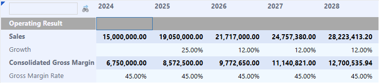

Monthly: Choose the number of planning periods and locked actual periods.

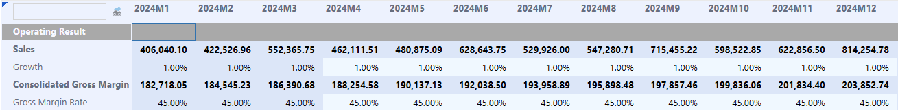

Mixed: Apply a mix for longer planning periods. The first year is monthly, then it becomes yearly. Months and years both accept input.

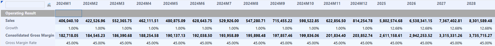

Weekly: The maximum granularity is weeks. The distribution of weeks among months and the number of days per week can be configured.

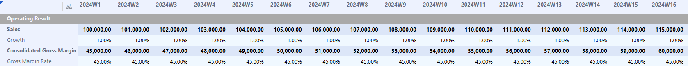

#### Examples

Scenario members can be configured for a nearly infinite number of plan types. We can’t cover every possibility in this chapter, so we’ll go through some common examples of plan types and how to apply the various scenario properties. This should give you a pretty good idea of what each property does and how you can apply them to your unique requirements.

#### Example 1: Yearly Budget

Plan Type: Budget Preparation Cycle: Once a year Input Frequency: Monthly Plan Duration: 12 months Plan Input View: Periodic (month-to-date)

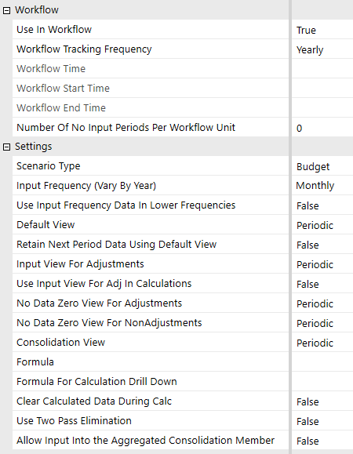

We set the Workflow Tracking Frequency to Yearly, which means this scenario will be prepared once a year. The plan duration of 12 months means we won’t span across years, and we can ‘reuse’ this scenario every year.

#### Example 2: 12-Month Ytg Forecast

Plan Type: Forecast Preparation Cycle: Once a month Input Frequency: Monthly Plan Duration: Variable Plan Input View: Periodic (month-to-date) For this example, we will end up with 12 scenarios since the preparation cycle is once a month. The naming convention for our scenarios will be `Forecast_MX`, where X represents the month  number.

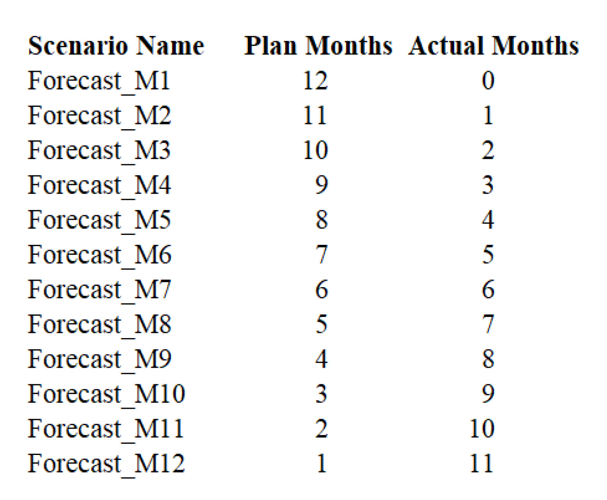

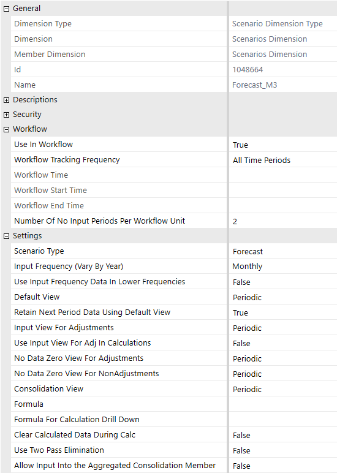

For our year-to-go (YTG) forecast, the number of forecasted months will vary from month to month as Actual data is reported. It’s important to point out the use of All Time Periods as the Workflow Tracking Frequency. Since this scenario does not span across multiple years, it can be reused in subsequent years. This means we want to make all time periods available to this scenario and not restrict it to a range. Also, notice the use of No Input Periods. Since this example is for `Forecast_M3`, the first two months  would be populated with Actual data via a seeding rule. Setting the No Input Periods to 2 will remove the risk of users changing already reported historical data. It will also have the added benefit of disabling those columns for input on forms.

#### Example 3: 12-Month Rolling Forecast

Plan Type: Forecast Preparation Cycle: Once a month Input Frequency: Monthly Plan Duration: 12 months Plan Input View: Periodic (month-to-date) The main distinction between a rolling forecast and our YTG forecast example is the fixed plan duration in the rolling forecast. In a rolling forecast, the same number of periods is forecasted regardless of what period of the year it is. Below are the scenario settings.

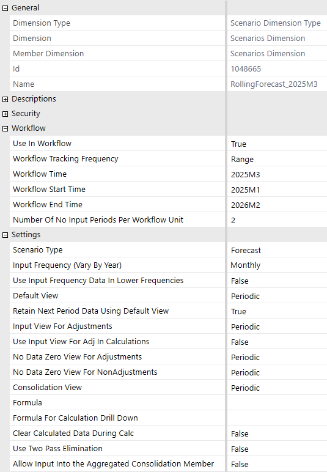

Since scenarios for this plan type will cross over multiple years, the naming convention is `RollingForecast_YearMonthNumber`. Also, note the difference in the workflow settings. A  tracking frequency of Range is used with a start time of 2025M1 and an end-time of 2026M2 for a total of 14 months (two months of Actual data and 12 months of Forecast data). I will also point out that using a range should include months back to M1 in order to get a full-year view in reports. In 2026, a new rolling Forecast scenario will be created since there will be an overlap of periods.

#### Example 4: Five-Year Long Range Plan

Plan Type: Long term Preparation Cycle: Once a year Input Frequency: Monthly in the first year, yearly in years 2-5 Plan Duration: Five years Plan Input View: Periodic (month-to-date & year-to-date) For our five-year plan, we’ll need to include the year in the scenario name since we are spanning across multiple years. I like to use the year in which the plan is being prepared. I have also seen the final year of the plan used.

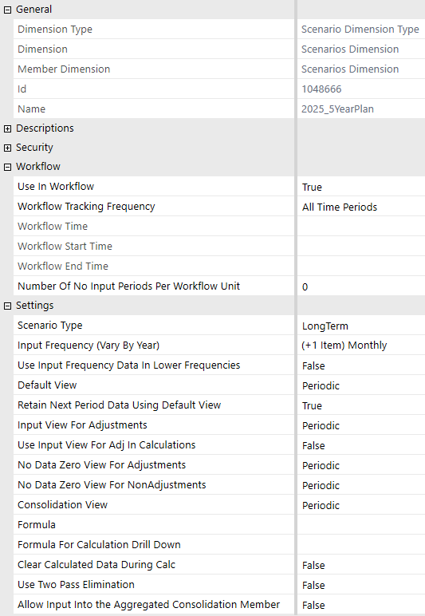

The Input Frequency can vary by year, so it is set as Monthly in the first year and Yearly from 2026 onwards.

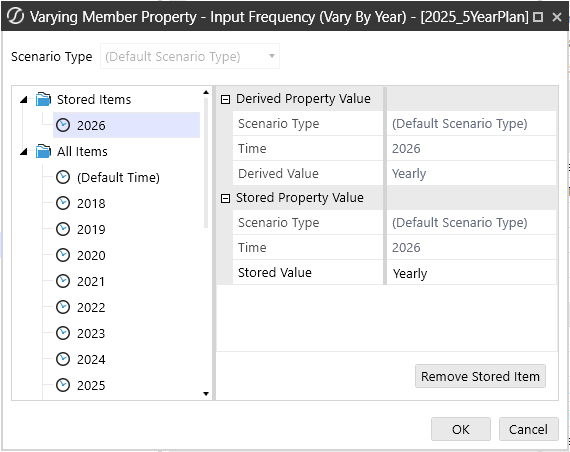

### Versions

During a planning cycle, there may be a requirement to track the changes made at certain points in the cycle either to monitor accuracy, or to present significant changes in the plan to management. Versions will typically relate to the same plan type (e.g., Budget Version 1, Budget Version 2, etc.). Creating the storage point will allow for easy reporting and trend analysis of the different versions. There are generally two ways to handle planning versions within OneStream, with one being the recommended method. The first involves the creation of additional scenario members to track each version. The ‘baseline’ or version0 scenario can be cloned and copied quickly and potentially reused in subsequent cycles. A good technique for naming conventions is to use a suffix appended to the end of the related scenario. For example, `V1`,` V2`,` V3`, etc., would be appended to `Budget` with an underscore to create `Budget_V1`,` Budget_V2`, and` Budget_V3` scenario members. This  suffix can then be parsed out and referenced in business rules, reports, and dashboard menus to streamline the user experience when toggling between versions. It is likely that data will need to be copied from the baseline scenario into each version, rather than starting each version from scratch. For this, a scenario formula can be utilized, using the suffix to dynamically pull data from the prior version.

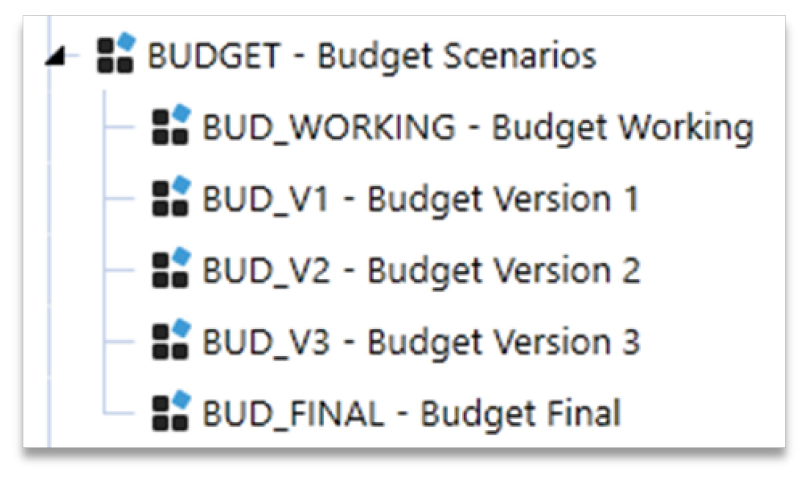

The second option would be to track versions within the same scenario using a UD dimension.


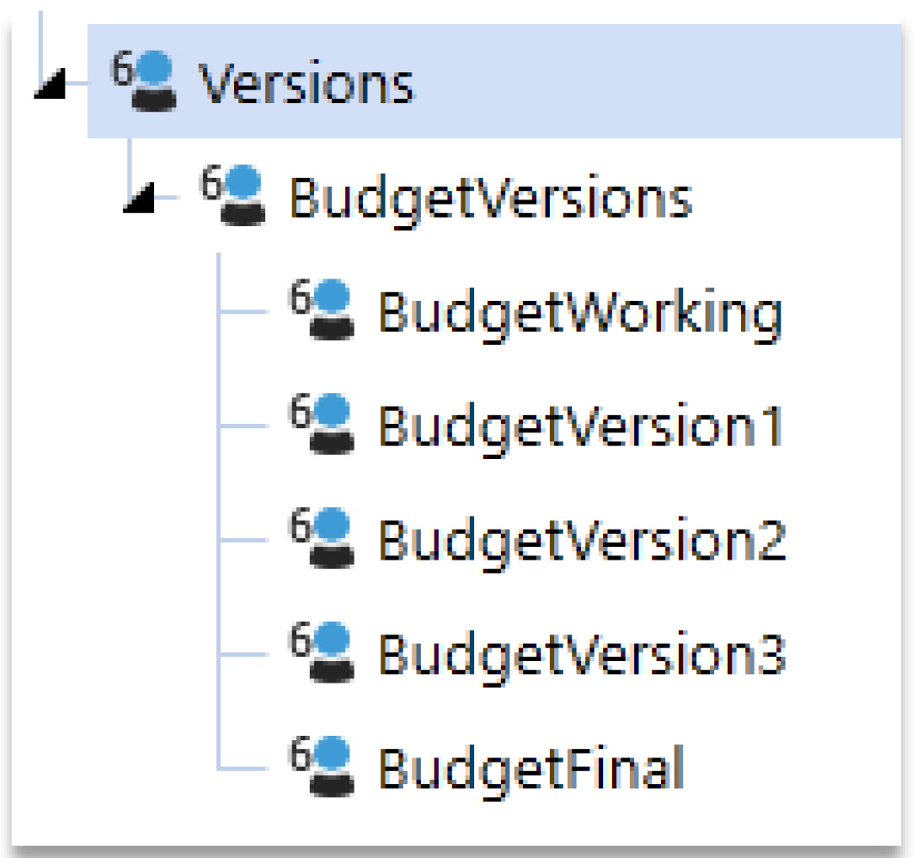

The recommended method for versioning is to use scenarios, but there may be instances where the UD method makes sense. The driver for making the decision between the two options comes down to dimension availability, performance, and process requirements. If you have used all 8 UD dimensions or plan to use them in the future, then using a UD for versions is not an option. From a performance standpoint, adding scenario versions will have no effect on the performance of other scenarios since you are creating an additional Data Unit. Creating additional UD members and copying data to them could significantly increase the size of the Data Unit and slow down aggregations, calculations, and reports. Also, since the UD dimensions are outside the Workflow Unit, they cannot be locked down without assigning the version UD as a channel. If another UD dimension is assigned as the channel dimension, then the option to lock down channels would be lost. There are, however, a few benefits to taking the UD dimension approach. First, version data may not need to be copied from version to version since it can be aggregated within the scenario in the UD dimension member hierarchy. Second, the UD dimension members can be re-used and applied to ALL scenarios that need versions. This means that there won’t be a need to create additional versions for each Scenario Type that needs them. In addition to the technical setup, the process of how versions are used should be considered. If users will be working across multiple dimensions, the process should offer clear cut-off points as to when they should stop working in one version and move to the next. Another approach is to create a ‘live’ scenario, where users will always work, and have an admin copy data off to each version. Again, setting and communicating the cut-off points is key, and the process should be clear and well-defined before discussing the technical set up.

### What-If Scenarios

What-if scenarios are similar to versions in that they will likely have data copied into them and then be modified (based on new assumptions). When creating what-if scenarios, the same principles as versions should be applied. It’s important to note that there is no ‘out-of-the-box’ functionality for what-if scenario analysis. OneStream simply provides the ability to create new scenarios, copy data, and leverage the same properties and assumptions as existing scenarios. While simple things like overlaying a high-level adjustment to a what-if scenario are possible with minimal incremental development, there are no inherent ‘what-if’ capabilities unless they are built. For example, if a driver-based planning methodology is used to create the budget, then the `Budget ` `What If` scenario would be created with the same Scenario Type and would use the same  methodology. A user could change a driver value and recalculate the plan, but could not calculate a new plan by applying a factor instead. This, of course, can be built, but it should be treated as a new ‘plan type’ and designed from beginning to end as such. It is also important to note that OneStream has addressed what-if scenarios with a Solution Exchange tool that can be quickly configured and deployed. Scenario Analysis 1-2-3 affords users the ability to quickly create and iterate through several what-if scenarios utilizing different driver-based rules in order to efficiently analyze different outcomes. The solution allows for the creation and management of multiple rules and the execution of calculation jobs and scenarios. The solution also includes built-in reporting capabilities to compare results across scenarios. It is likely that additional what-if solutions and capabilities will be addressed within the Solution Exchange or with platform updates in the future.

#### Determine Reporting Dimensions

Now that we’ve defined our Scenario Types and scenarios, we’ll need to figure out what dimensions will need to be supported for reporting. Each Scenario Type should be looked at separately as they could require different dimensions or levels of detail within the same dimension. The best place to start is by scrubbing through reports or looking at legacy system configurations. You should also consider Actuals in this exercise, as Actual data is likely to be shown alongside planning in many reports. If there is an Actuals or consolidation cube in OneStream already, then this should be easy. After you have a complete inventory of dimensions, the next step is to look for commonalities between them. Often, the personnel responsible for one plan type are completely different from one another, and they may use different names to describe the same dimension. For example, the team that prepares the budget may use a dimension called ‘Department’ while the forecast team uses ‘Division’. After a bit of questioning, you might determine these are the same thing. This may be the first time these processes have existed in the same tool. This is the chance to align and standardize the processes. You will also find dimensions that are unique to a plan type. Also, note any technical dimensions that are uncovered. Technical dimensions are dimensions that don’t provide any analytic or reporting value but can provide support for a technical process. An example would be a data source dimension, which could allow data to be cleared only for one data source in the loading process. After identifying all the dimensions, I like to lay them out in a matrix so that it is easy to see which dimensions are relevant for each plan type.

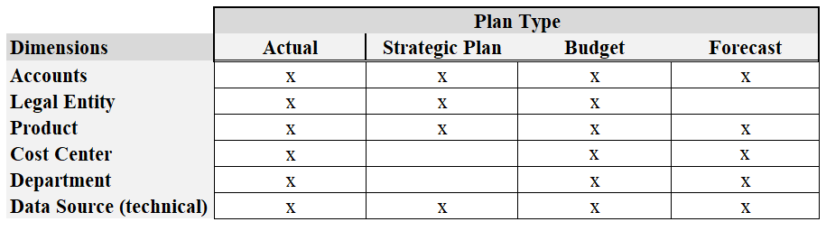

The data model is now starting to take shape, and we can start to see some commonalities and differences with dimensions across the plan types.

#### Determine Entity Dimension

A note on consolidation: The next few sections will make mention of the consolidation process and Actuals reporting. Consolidation is often viewed as the antithesis to planning. Consolidation is reporting history, while planning is reporting the future. Consolidation has strict accounting and legal rules that all companies must follow, while planning employs a variety of methodologies at the behest of the individual planner. It is unlikely any of your plan types will have statutory consolidation or GAAP reporting requirements; if they do, they will likely be very minimal. However, if any of your plan type requirements include any of the below, then using the same Entity dimension as your consolidation cube is probably a requirement instead of an option. • Intercompany eliminations • Currency overrides • Percent ownership • Joint venture or equity method accounting If you’ve determined that you need one or more of these in planning (again, a rare case), then have a good read through the Consolidation Chapter (4). I would also suggest leveraging existing consolidation functionality that has already been built to the best extent possible. Once you’ve defined all the reporting dimensions, you’ll need to start assigning them to one of the dimension types in OneStream. The first dimension that should be assigned is the Entity dimension. It’s vital not to understate the importance of the Entity dimension selection as it is crucial for a variety of functions inside OneStream. Here is a brief summary of the functions that the Entity dimension controls across the product. • Extensibility –extensible cubes require a common Entity dimension. If you want to extend a cube by Scenario Type, sharing an Entity dimension is a requirement. • Calculations and consolidations –entity is part of the Data Unit. Calculations and consolidations in OneStream run for all data in a Data Unit. Data Units also process in parallel, so spreading data across more Data Units will generally perform faster than the same data volume in fewer Data Units. See Chapter 14 for a more in-depth analysis of cube size and sparsity, and the impact on performance. • Translation –the currency of the financial data loaded to the cube is designated in the Entity dimension. Data is translated from entity currency to parent currency.

> **Note:** there are special functions within the Flow dimension that allow multi-currency

input within an entity. • Reporting –the Entity dimension determines data storage points. Data stored in more entities will require less dynamic processing when generating reports, resulting in better- performing reports. • Workflow –entity is part of the Workflow Unit that controls the data loading, locking, and clearing mechanisms. • Security –security that is entity-driven requires much less maintenance than security at the Account-level dimensions. Given how much functionality is dependent on the Entity dimension, it is important that you make the right selection. There is a lot to consider, and there will likely be tradeoffs. Each potential Entity dimension candidate should be weighed against all the factors listed above. The next sections will outline some guidelines and considerations for determining the Entity dimension assignment in your cube(s).

#### Align The Entity Dimension Across Scenario Types As Much As Possible

The first question you should ask yourself is if it is feasible to use the same Entity dimension for all Scenario Types. It is highly likely that showing Actual and planning data side by side on the same reports is a customer requirement. Sharing an entity is the easiest way to make that possible with minimal maintenance or additional build work. Sharing an entity does have consequences and assumes there is enough similarity between the data in the Scenario Types to warrant it. Sometimes Scenario Types are just fundamentally different in their reporting, collection process, and data structure, and sharing an entity will do more harm than good. Let’s explore what we should look out for when considering an Entity dimension for a planning Scenario Type. We will assume we have an existing consolidation cube using Legal entity as the Entity dimension, and we are considering using Legal entity for planning.

#### Submission Process And Workflow

Sharing an Entity dimension assumes at least some similarity in how the data is entered into the system across Scenario Types. Let’s say the general process of our consolidation scenario is that a user submits a trial balance for a Legal entity, enters some data into a form, then validates and certifies the data. We can easily see that this submission process is driven by Legal entity. Now, let’s say our budget process is driven by department. Budgets are entered by department managers for an entire department across many Legal entities. OneStream’s workflow is flexible enough to handle this situation, but there are a few things to keep in mind. First, you’ll need to use a workflow suffix to vary the workflow structure by Scenario Type.

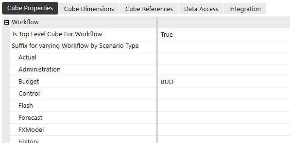

Entering data across multiple entities in one workflow breaks up the Workflow Unit, which means you’ll have to take special care with how data is imported and locked. If locking or importing data by department is a requirement, the use of workflow channelswill need to be employed to break the Workflow Unit. Note that only one UD dimension can be assigned to a workflow channel and this setting is made at the application level. This means that if two Scenario Types need a different dimension as the channel, only one dimension can be used as a channel, and the other will have to use a different entity. If data locking is not a requirement, and data importing is not needed or done centrally, this won’t be a big deal. Refer to Chapter 7 for more information about workflow design.

#### Performance

When I talk about performance, I am specifically referring to two things: • Consolidation and calculation performance – how quickly OneStream is able to process and store data within Data Units. • Reporting performance – how quickly OneStream is able to derive and display cube data on reports or data queries. A key driver of performance is Data Unit size and sparsity. Remember that entity is part of the Data Unit, so the choice for Entity dimension will have a direct impact on these two things. Using the same Entity dimension across Scenario Types could result in vastly different Data Unit size and sparsity between them. This could be due to a Scenario Type using more dimensions or the same dimension but at a greater level of detail. When considering an Entity dimension, the number of data records within Data Units should be estimated as best as possible to get an idea for performance. If the number of data records is large (>500k records), you should consider a different dimension as the Entity to create less data record volume and sparsity.

#### Data Copying

Scenario Types that do not share an Entity dimension will pose a challenge if the data needs to reside on the same reports, or if one is used as a source for the other. Getting the data to a point of symmetry will require data copying to transpose data from one cube to another. In some cases, this can be complex and have a performance impact. Let’s look at our consolidation cube with Legal entity as the entity, and our planning cube with Department as entity. Requirements dictate that we need to show data from both cubes on the same report. This wouldn’t be possible without some additional work. First, we’ll need to assume that Department exists in the consolidation cube as UD dimension. Next, we’ll need to copy the data from one cube into the other. One way to do it would be to create an ‘Actual’ scenario in the planning cube, and write a rule to copy the data from the consolidation cube into the planning cube. The rule would transpose the Department UD dimension from the consolidation cube into the Entity dimension of the planning cube. Note that intercompany detail would need to be ignored to make this work. Data copying is a trade-off for having cubes with different Entity dimensions. While each cube may perform better overall, the data copying is an added step in the process.

#### Translation

Currency translation happens in the Entity dimension. If currency translation is part of your planning requirements, and you’ve designated a different entity than Actuals, you will have to take special consideration to set up the currency translation correctly. To illustrate this, let’s look at an example of a company that has a consolidation cube with currency translation based on the functional currency of the Legal entity. For planning, Department is used as the Entity dimension with department managers entering a budget for a single department spanning across multiple currencies. This design is possible by using the alternate input currencyfunctionality within the Flow dimension. Each Department entity would be designated with the reporting currency, and currency input would be controlled within the Flow. All data would be translated back to the entity’s currency during the Data Unit Calculation Sequence.

#### Conclusion On Entity Dimension

We’ve covered quite a bit regarding the Entity dimension, and I hope you leave this section less confused than when you entered it. The major takeaways from this section should be understanding the functions of the Entity dimension in OneStream and ensuring you spend the proper time determining the Entity dimension(s) needed for each Plan Type. To summarize what we’ve covered, I think everything boils down to these main points: • Align your entities across financial processes as much as possible so that extensibility can be leveraged. • Give adequate consideration to data volumes and sparsity (by Data Unit) early in the build and assign the Entity dimension to plan types accordingly. • Get data into the cube as early as possible and monitor performance. If performance is acceptable, then don’t second-guess your decision. • Understand requirements around data submitting, loading, and locking for each plan type. • If performance is unacceptable, there are several considerations to make for picking the right Entity dimension. Weigh the pros and cons of each, discuss with relevant stakeholders, and decide. Refer to the Performance Tuning Chapter for a more in-depth discussion of how to analyze and troubleshoot performance issues. Sometimes, a particular Entity dimension just won’t fit for some plan types, and that’s perfectly fine. Don’t force a square peg into a round hole. It’s better to have optimally performing standalone cubes than one extended cube that performs poorly for some Scenario Types. There are a lot of factors to consider, and there will often be trade-offs. One choice for the Entity dimension might streamline reporting but create longer-running calculations or aggregations or make the security model more complex. Let me offer a personal anecdote from a project where I was the architect for a large driver-based planning implementation. We created a driver cube to hold all the drivers used in the calculations. In the reporting cube, `Business Unit` was used as the Entity dimension as it was the driver of  intercompany eliminations and workflow. Since the driver data was not related to any one business unit, there didn’t seem to be an obvious choice for Entity. We ended up loading all the driver data into one Entity called `Global`. When we loaded the data in, we had more than a million data  records in the Global Entity for one month. This was a perfect example of a ‘large, sparse Data Unit’. The cube performed horribly. Data loads, calculations, and reports all took much longer than was tolerable. We knew right away; we made a mistake in our Entity dimension choice. After looking at data volumes and which dimension would create the densest Data Units, we ended up pivoting Account as the entity, which was somewhat counter-intuitive to traditional thinking. Performance was almost night and day. Learn from my mistake and give the proper attention to the Entity dimension upfront, so you can prevent a major headache later.

#### Refine Your Dimension Matrix

Now that we’ve determined what to use for the Entity dimension across our Scenario Types, we can refine our dimension matrix a bit more. First, we can now assign dimension types to our dimensions. Next, we can look at each dimension and determine the level of detail each Scenario Type needs. Some dimensions can use higher or lower levels of detail depending on the needs of that Scenario Type.

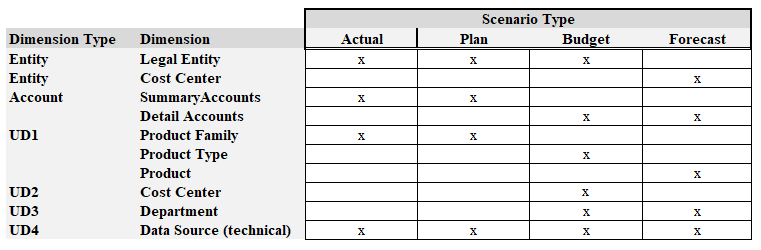

Our data model is almost there! The last steps will be to apply extensibility and assign our dimensions to cubes.

### Cubes And Extensibility

Now that we’ve set up scenarios, picked the right Entity dimension, and defined the reporting dimensions, we can now determine how those dimensions will be assigned to cubes. I started this section by talking about extensibility and how important it is, but then veered off a bit. The ultimate number of cubes we will need will depend on how we use extensibility. We’ll start by defining the different types of extensibility we have.

#### Types Of Extensibility

As Peter mentioned in Chapter 4, there are two types of extensibility – horizontalandvertical extensibility. Horizontal extensibility refers to the concept of sharing, inheriting, and extending dimensions across financial processes or Scenario Types. Horizontal extensibility does not require the creation of multiple cubes. When using horizontal extensibility, each Scenario Type can have its own level of reporting detail while still retaining a point of commonality through inherited dimensions.

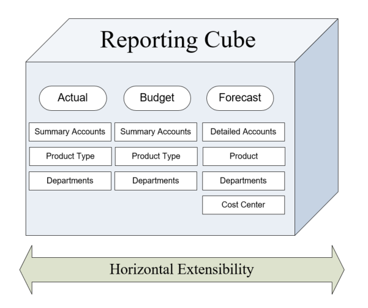

Horizontal extensibility takes place within the same cube, with all Scenario Types sharing the same Entity dimension. Accounts, flows, and UD dimensions can be assigned differently for each

#### Scenario Type.

Vertical extensibilityrefers to sharing and extending dimensions by entities. It requires breaking the entity hierarchy apart into multiple cubes. A master cube will contain the full entity hierarchy and consolidate data from the sub-cubes. Each sub-cube can have its own dimensions or levels of detail within the same dimension. This allows for both a better-performing and more flexible cube design.

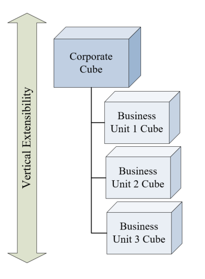

Each business unit has its own Entity dimension, which is inherited in the corporate cubes Entity dimension. Accounts, flows, and UD dimensions can be assigned differently for each BU cube.

> **Note:** In each type of extensibility, both the Entity and Scenario dimension must be shared.

#### How To Apply Extensibility

Now that you understand the different types of extensibility, a lightbulb hopefully went off when I described horizontal extensibility. This type of extensibility allows you to extend cubes by Scenario Type, which suits planning perfectly since several plan types will typically exist. Let’s look at some common situations and how cubes and extensibility can be applied differently.

#### Example 1: One Cube – Extended By Scenario Type

For this example, we have all Scenario Types using the same Entity dimension, which means we only need one cube extended by Scenario Type.

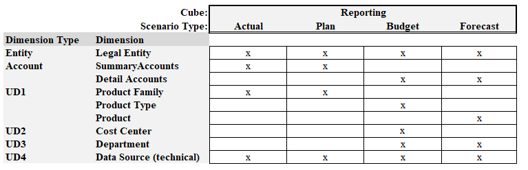

In this situation, each Scenario Type is free to use different dimensions or different levels of the same dimension. This provides each Scenario Type with maximum flexibility and easy reporting by creating commonality within all dimensions.

#### Example 2: Separate Cubes – Consolidation & Planning Cube

For this example, we’ve determined that all our planning Scenario Types will use a different Entity dimension than consolidation, due to differences in process and high data volumes. This will require two cubes – one for consolidation and one for planning. The planning cube can still make use of horizontal extensibility to assign different dimensions and dimension levels by planning Scenario Type. Also, notice the Actual Scenario Type being used in the planning cube. This is an optional step that will allow data to be copied from the consolidation cube so that it aligns with the planning cube. By doing this, the planning cube can use the Actual data for calculation or provide variance reporting.

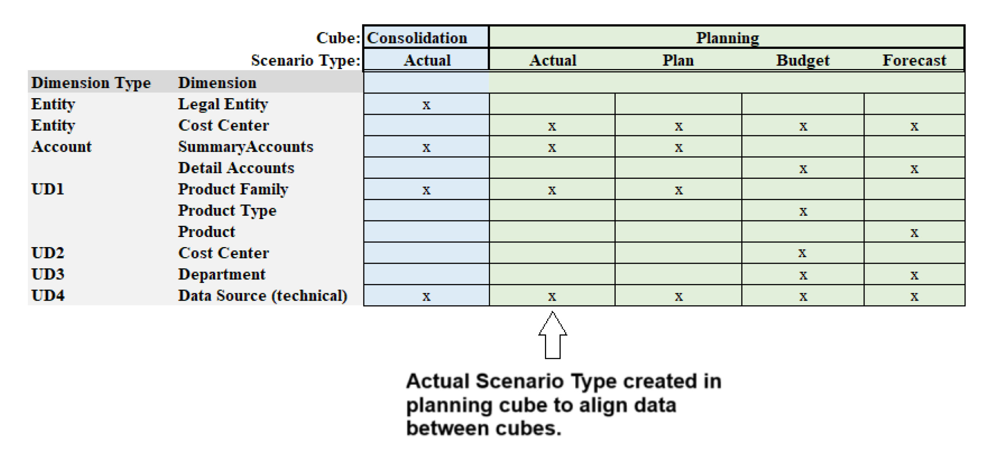

#### Example 3: Hybrid

In this example, we have one planning Scenario Type that shares an entity with the consolidation cube, while the rest of the planning scenarios use cost center. Both cubes will use horizontal extensibility to extend dimensions to different Scenario Types. The Actual Scenario Type is being used in the planning cube here, just like the last example.

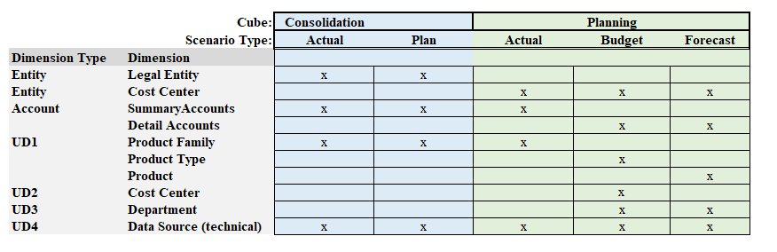

#### Conclusion On Extensibility

Extensibility should always be a part of your cube design. Depending on the requirements you’ve uncovered during the BPD, there are a few ways it can be applied effectively. Carefully look at each Scenario Type and identify the similarities and differences between them. Then, use extensibility to bring them together in a unified model.

### Specialty Cubes

You will likely encounter datasets that need to go into the cube for analytic reasons or where the data is needed in other cubes for calculations. These can sometimes be referred to as specialty cubes. Some examples are: • Driver data cubes • Labor reporting cubes • Profitability cubes These cubes can still use leverage extensibility and shared dimensions with other cubes if needed, and should be scrutinized with the same principles for optimizing performance and maintenance.

### Specialty Planning Solutions

Let’s go back to my first planning project, where we deployed People Planning for the first time. The requirement was to calculate employee-related costs using individual attributes for salary, bonus, and benefit categories. To accomplish this, we needed somewhere to store this information. We also needed to run complex calculations against the data to derive the plan. We could have created a cube with an employee dimension and imported the payroll data to the cube. This was certainly possible but was likely to be a bad idea for several reasons. Over time, this dimension would grow larger and larger as the company hired new employees. Employees who left the company would remain in the cube as they would have data associated with them. Data structures like this – that are constantly changing, or which are dependent on a point in time – are a good example of transient data. This type of data poses a challenge if kept inside the cube due to the constant maintenance that is required to keep the dimensions and members up to date. Performance will also suffer as the cube becomes larger and sparser. Over time, more and more members would be created only to be eventually deprecated. This data is much better served in a relational table. The data can be collected in a transactional register, where it can be summarized and mapped to a cube. Specialty planning solutions also have a powerful calculation engine that can perform complex logic and math expressions on the transactional data. Specialty planning should be your go-to tool for requirements like the one above. There are numerous other use cases for specialty planning solutions: • Asset planning • Project planning • Cash planning • Travel planning • Sales planning The use of these solutions should be identified early in the project as they have additional configuration considerations and will influence how cubes are structured.

### Staging Tables

Data is staged in the OneStream data integration suite before it is summarized, transformed, and loaded into the cube. The staging tables are designed to hold the raw data from transactional source systems. Staging tables have columns for all 18 dimensions available in the cube, and 40 additional attribute columns. These attribute columns can be used to store detail that can be drilled into from reports. Say, for example, we are loading sales data, by product, from an external system into our planning cube. The source file contains a field that indicates whether a product has been discontinued. This information has little analytic value, so we may choose not to load it into the cube. However, it still might be useful to know which products are discontinued so that we don’t calculate a sales forecast for them. By mapping the data to an attribute column in Stage, we can still easily perform lookups on the staging table in our rules. A key limitation is that entries into these tables can only be made through the import workflow steps. Users cannot make manual entries into staging tables or edit them through dashboards. For this requirement, it is best to use a custom SQL table. Chapter 6 on Data Integration goes in-depth on this topic.

### Custom SQL Tables

The OneStream database architecture consists of dozens of SQL tables. Most configurations, settings, and mapping tables are stored in SQL tables. Most solutions available in the Solution Exchange use custom SQL tables as well. In addition to the pre-installed tables, additional tables can be created to store custom datasets. When creating custom SQL tables, make sure to consult the client’s database administrator and adhere to SQL best practices. The benefits of SQL tables are that they can be completely customized for the specific dataset you need. You can create a table with two columns or 40, and give each column its own name and data type. Data can be loaded into the tables through Excel using a standard OneStream import template. Table data can also be referenced in business rules using several API and BRAPI functions.

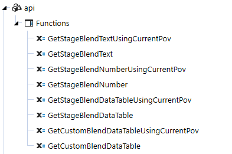

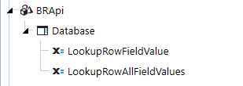

Another benefit to custom tables is that they can be integrated into workflows and exposed to users so they can add rows or edit the tables. Let’s take our discontinued product example from before. Instead of the discontinued product information being available in the import file, it needs to be inputted into the system by the product manager. In this case, staging tables will not work as they are read-only and can only be populated via data imports. Instead, we can create a custom SQL table with columns for product name and status. Additional columns could be added to collect other information, such as discontinuation date or reason. Custom SQL tables can be embedded into workflows seamlessly using dashboards. If a custom SQL table is used in workflow, you should make the table dynamic by adding workflow point of view columns to the table. These can be hidden from the user, and the table can be automatically copied from period to period if needed.

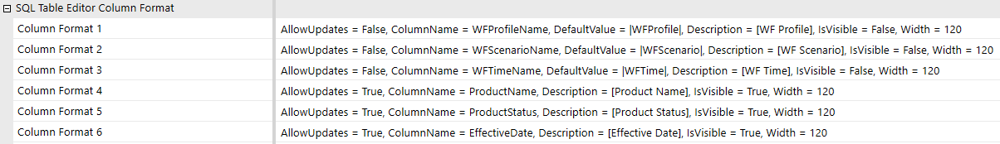

A `Where` clause can be used to filter the table to the user’s current Workflow POV.

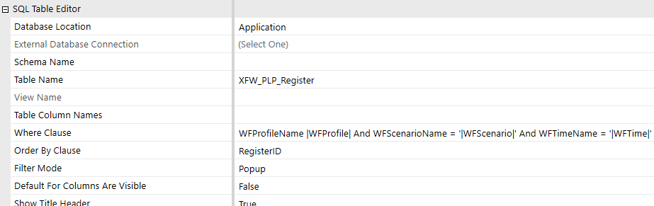

### Analytic Blend

Analytic Blend is an aggregate storage model designed to support large data volumes that are often transactional in nature. Simple calculations and fast aggregations can be performed on Analytic Blend data. Analytic Blend also has powerful and robust reporting and data visualization tools. A key limitation of Analytic Blend is that it is read-only, so users cannot adjust or make inputs to the data. If you have a dataset that needs one or more of the above, then you should strongly consider using the Analytic Blend solution. Refer to Chapter 12 for more detail on how this tool can be used.

### Conclusion On Data Model

OneStream is a tool that can handle just about any type of financial planning that takes place within an organization. More and more data is becoming available to FP&A departments, and that data is being used to create more accurate financial plans. This can make plans more intelligent but also poses technical challenges for planning software. During an implementation, it’s important to identify allthe data that is required for the creation of the plan. Below is a summary of the benefits of each tool.

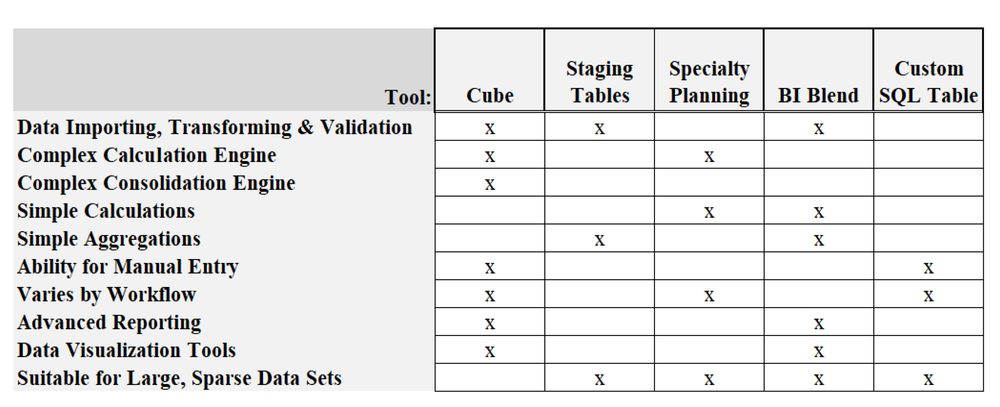

## Business Rules And Calculations

Just about every planning solution will need calculations. Luckily, OneStream has a powerful calculation engine that can handle calculations of the highest complexity. Chapter 8 covers business rules basics, so please refer to that chapter for explanations of basic concepts and syntax. Depending on which plan methods are employed within your solution, you may end up with a large volume of calculations. If you’re not careful, you can easily create a monstrosity that is cumbersome to manage and maintain. As stated in the introduction to this chapter, performance and maintenance are the two key benchmarks that you should be constantly thinking about. Nowhere is this more important than when writing calculations. This section will talk you through how to best organize your calculations so that they perform well and are maintainable by the customer.

### Determine Rule Types

While OneStream’s calculation engine has a common framework, API function library, and syntax, you can break calculations down into their functional objective for organizational purposes. Below are some groupings that can be used: • Seeding rules – rules that move data from one cube or scenario to another within OneStream. For example, copying Actual data to the Actual months of the Forecast. • Planning rules – rules that support the creation of the plan. These can be further broken down into driver-based calculations, allocations, and factor-based calculations. • Reporting rules – dynamic calculations that support reporting, such as ratio or KPIs.

### Custom Calculate Versus Calculate

When building your cube calculations, you have the option to use two finance function types – calculate or custom calculate. On the surface, the difference can seem subtle but – fundamentally – the difference is quite large.

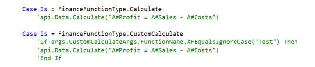

Custom calculate was actually added to the product as a direct response to the needs of planning projects. It is recommended that custom calculate rules be the default finance function type used on planning projects that have a large volume of calculations, as they will generally perform much better if built and used correctly.

#### First, A Bit Of History

Way back in 2015, OneStream had started implementing more and more planning solutions. Many customers that started with consolidation were exploring ways to extend and expand the software. A large hospital operator had been using OneStream for consolidation and was in the midst of designing their planning solution. For consolidation, each hospital would submit a trial balance, then calculate and consolidate the entire hospital (Hospital was designated as the Entity dimension). Their budgeting process followed a slightly different process where department managers would enter budget drivers for an entire department within the hospital and then calculate results for that department. Since Budget and Actuals used the same Entity dimension (Hospital), each time a department manager executed a calculation, it would run all Member Formulas and business rules for that entity regardless of the department. This was wreaking havoc within the budget process as department managers were seeing calculated figures before they even calculated, not to mention that performance was suffering given that department managers were constantly running calculations on top of each other. To remedy this problem, the custom calculate function was added. This now allowed calculations to run at a more granular level than the Data Unit. Department managers could now execute a calculation for only their departments instead of having to run all calculations for an entity. This is a testament to OneStream’s dedication to the continual evolution of the product to meet customers’ needs.

#### What Exactly Is The Difference?

The calculate function type runs within the Data Unit Calculation Sequence (DUCS). All the steps in the DUCS are executed each time a calculation or consolidation is run for a Data Unit. This means all Member Formulas, formula passes, and business rules will run on every calculation instance. The DUCS is built into the calculation and consolidation engine and is very useful in preserving data quality by organizing many calculation functions, such as clearing data and writing to members within the Consolidation dimension. However, it can be a bit ‘heavy-handed’ when it comes to planning, where there will likely be a larger volume of highly detailed calculations. The custom calculate function type allows calculations to take place outside the Data Unit Calculation Sequence. Calculations can be built to be more specific to the exact view of data that a user is working with. A user can calculate sales for five departments without executing any other calculations in the cube.

#### Using Custom Calculate Rules

There are a few things you need to make sure you do when you use custom calculate rules. DUCS takes care of a lot of things behind the scenes that you’ll now have to make sure to include in each custom calculate rule.

#### Data Clearing

A clear data scriptshould be added at the top of every custom calculate rule so that all previously calculated data is cleared before re-calculating. If you fail to include this, you could end up with data from a previous calculation ‘stuck’ in your cube, which could become very difficult to find and remedy.

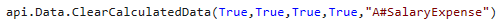

It’s important to align your clear data script with your calculation script so that the data being cleared aligns directly to the data being calculated.

#### Durable Data

The is Durable Data option should be used so that OneStream does not clear the data during DUCS. At some point, the cube will get consolidated and the DUCS will run; when it does, all calculated data will be cleared, assuming the Clear Calculated Data property on the scenario is set to True. OneStream does not treat all calculated data the same. The data that results from a calculation can be set as durable,which will protect it from being cleared during a consolidation.

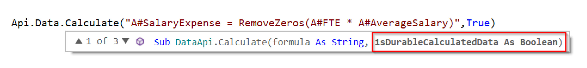

#### Linking To Workflow

You’ll want to give some thought as to where and how custom calculate rules are launched since they won’t be executed as part of the standard calculation/consolidation algorithm. Custom calculate functions can be executed from two places: • Data management steps and sequences • Dashboard buttons Either of these two components should be linked to a user’s workflow so the calculation can be executed within the natural flow of the process.

#### Using Parameters & POV Members

Another very useful aspect of the custom calculate function is the ability to pass user-controlled parameters into the rule via name-value pairs or `API.Pov`. This can add a lot of flexibility to your  rules and give users more control over what is calculated. It can also help reduce maintenance and the overall volume of code needed in a build.

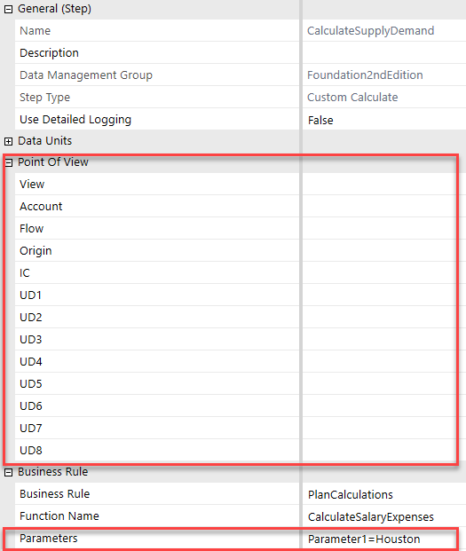

### Calculation Examples

The OneStream Financial Rules and Calculations Handbook should be referred to for a detailed breakdown of the finance engine and how to write calculations. This section will give some basic examples of planning rules that should give you a strong arsenal of knowledge for writing calculations in your planning project. These examples will expand upon the fundamentals covered in Chapter 8 to planning-specific use cases. Below are a few assumptions to note about the examples: • `RemoveZeros` is used to ‘clean up’ our data buffers by ensuring that any cells that have  no data or zeros are removed. Using `RemoveZeros` for all rules is a good practice.  • It is assumed that we are following best practice and only running calculations at base- level entities and the local consolidation member.

#### Driver-Based Planning Calculations

#### API.Data.Calculate

`Api.Data.Calculate` is the most fundamental function for writing calculations in OneStream. It  is very powerful at performing math functions on data within a multidimensional model. One simple `Api.Data.Calculate `rule can produce hundreds of thousands of data cells.   Let’s start with a simple example of what a typical driver-based calculation might look like using `Api.Data.Calculate`. We’ll again use salary expense as our example. The drivers used to  calculate `Salary Expense` are FTEs (full-time employees) and average salary expense. The  formula is simply FTE multiplied by average salary.

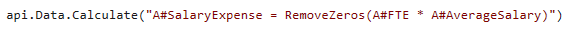

The above calculation is making use of the `Api.Data.Calculate` function. This function is  fundamental in nearly all OneStream calculations as it allows for the simple arithmetic of two or more data buffers. Remember from the Rules Chapter that a data buffer is just a group of data cells. Since the `Api.Data.Calculate` function allows us to multiply/divide/add/subtract groups of  cells, we can create a lot of output cells with one simple calculation. We can visualize what our `Api.Data.Calculate` function is doing by looking at the data within the input data buffers.   `A#FTE`:

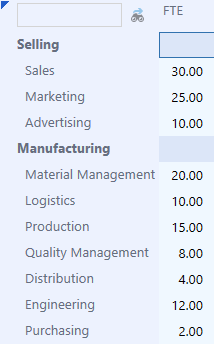

`A#AverageSalary`:

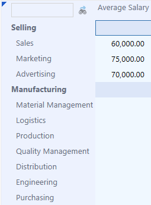

The first thing you probably noticed is that our manufacturing departments are lacking values for average salary. This will be cleared up in the next example. For now, let’s look at the output data buffer: `A#SalaryExpense`:

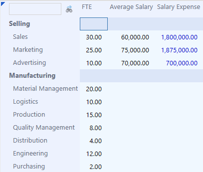

The output of our calculation created three new data cells. We can see no output values were calculated for our manufacturing departments since one of the input data buffers did not have cells in those members. In a real cube, you will likely have many more cells in your output data buffers, generating hundreds or thousands of new records in the database. You can quickly start to see the power of the `Api.Data.Calculate` function.    Rarely will a calculation be that simple, so let’s add a few complexities. Let’s address our manufacturing departments, which will use a different logic to calculate average salary. The manufacturing departments will use an average hourly wage instead of salary, and we will also need the number of working hours in each month. To handle this requirement, we will need to include a filterin our calculation script. The new salary calculation will look like this:

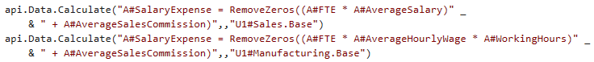

We can now separate our calculation into two distinct `Api.Data.Calculate` functions, using a  filter to make each calculation only run for specific departments. The filter removes cells from the result data buffer cells, narrowing the scope of the calculation. Next, let’s add another dimension to our model – cost center. We want our salary expense to have cost center detail; however, average salary data is not available for each cost center. We do have cost center detail for headcount, though. We will discover in Chapter 8 that data buffers must be balanced (have the same dimension details) to perform math functions on them, so our formulas, as written above, will not work unless we use the MultiplyUnbalanced function. The ‘unbalanced’ functions in OneStream give an easy way to perform math functions on data buffers that have different levels of detail. Let’s now re-write our calculations using the `MultiplyUnbalanced` function.

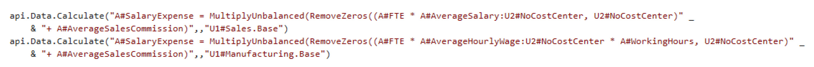

Since the average salary account lacks cost center detail, we know that all data will be on the `NoCostCenter` member. That member gets concatenated to the average salary account and then  specified in the third argument of the `MultiplyUnbalanced` function. The resulting salary  expense account will now contain cost center detail as the result data buffer inherits the detail of the unbalanced buffer.

#### Eval Function

The Eval function allows for the evaluation of individual data cells in a data buffer. This function is extremely useful for calculations that require more complex logic, and is a back pocket necessity for every planning consultant. For example, you may need to check a cell value and apply different logic depending on the value. Or you may need to perform a lookup in a relational table based on the dimensionality of an individual cell. This type of cell informationcannot be accessed with an `Api.Data.Calculate ` function. When using Eval, the cells from that data buffer can be looped through in a sub-function and manipulated. To illustrate the Eval function, let’s add one more complexity to our calculation requirement. We want to calculate overtime based on the headcount compared to FTE. If our FTE value is greater than the headcount value, then we can assume we will need to pay some overtime. Our formula written in plain English would be:

```text
Overtime Expense = (FTE / Headcount) * Average Overtime Wage
```

You will notice that we need to put a condition in here somewhere to only run this calculation if the `(FTE / Headcount)` expression is greater than 1. This isn’t possible using the filter function. To  accomplish this, we will need to analyze the amount of each data cell in the data buffer. For this, we will need to use the Evalfunction. In our case, we need to evaluate the resulting data buffer of `(FTE / Headcount)`. We can apply  the `Eval` this way:

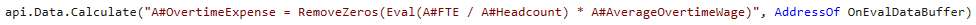

The expression `(A#FTE / A#Headcount)` is wrapped in the `Eval` function. The sub-function is  referenced in the last argument of the `Api.Data.Calculate` function. The sub-function will  filter the result cells of the expression and then execute the rest of the formula. The sub-function is shown below.

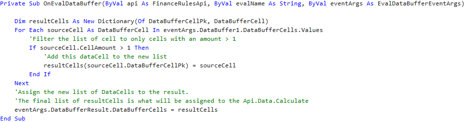

The `Eval` sub-function executes a loop through all of the result cells and then applies logic to  them. In this case, we are checking whether the amount is greater than 1. Only if the condition is true are the cells then included.

#### Calculation Drilldown

Also covered in Chapter 8, data that is the result of a formula can be drilled into so that users can see the details of calculation logic. It is a good idea to always use Calculation Drilldown formulas for all calculations, but it’s worth making special note of this feature here because of the heavy use of calculations in driver-based planning. Let’s look at an example of a Calculation Drilldown formula for our driver-based `Api.Data.Calculate` example from before:

#### Formula

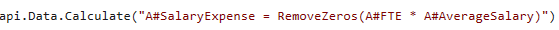

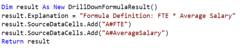

We can see that the drilldown formula is written so that the formula definition is displayed along with the inputs to the calculation. This will give the user visibility into the data that was used to derive the calculation result.

#### Factor-Based Planning Calculations

Like driver-based planning, factor-based planning will mostly be derived via calculations. The general process is that a user will input a factor or growth rate, which is then multiplied against data from another scenario, like Actuals.

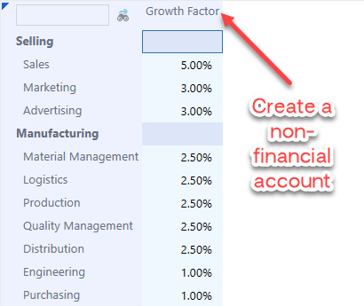

The growth factor can then be applied to all accounts via an `Api.Data.Calculate `function in  the scenario formula.

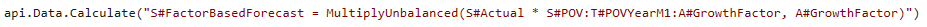

Since the growth factor is constant for all months the users will input on, we could also extrapolate the plan based on the trailing 12-month average of the last Actual month.

### Data Seeding

Data seeding is the process of copying data from one scenario to another and is likely to be an important part of your planning solution. Some plan types will require data from historical periods to arrive at a full-year view. Remember our YTG rolling forecast example where Actual and Forecast data is blended to derive an end-of-year financial projection.

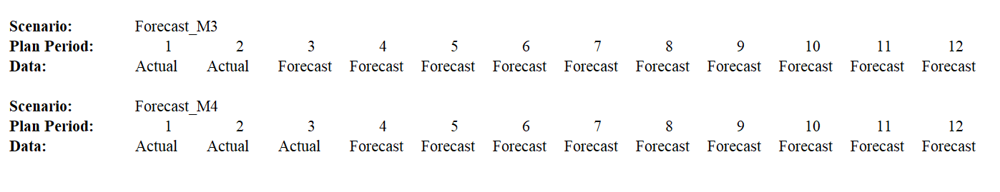

Some plan types may also use data from other scenarios as a baseline. Data from one scenario can be used as a starting point or as the basis for a factor-based plan. If using versions for a plan type, data from the prior version will need to be copied into the current version. We’ve established that data seeding is important, so let’s now discuss the different tools available in OneStream and how to use them.

#### Data Copying Methods

There are several ways to copy data between scenarios. We will make mention of the two most prevalently used methods, although one is certainly used more than the other.

#### Data Management

The first method involves using a Copy Data data management step.

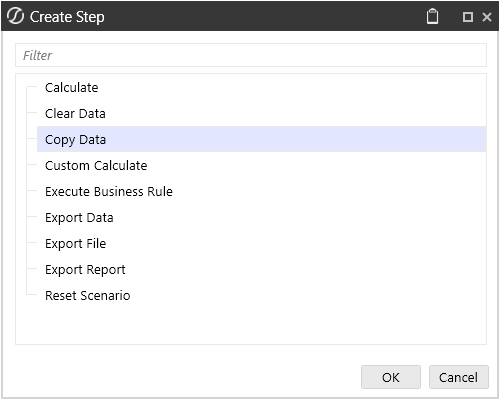

In a Copy Data step, source and destination Data Units can be specified, and there are options for copying forms, imported, or adjustment data.

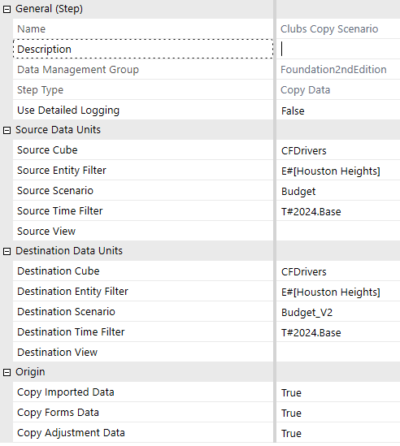

The data management step can be executed within a sequence from a dashboard or integrated into a user’s workflow, so that it executes at the proper time in the plan process. It’s important to note that copying data in this way also copies audit information, which will likely run slower than the second method. Due to performance and lack of flexibility, this is not the most widely used method.

#### Seeding Using Custom Calculate Finance Business Rules

The second method involves using a custom calculate finance business rule. Data can be copied quickly and easily within the OneStream calculation engine. We’ve already gone through several examples of writing finance rules, and we can apply the same principles to our seeding rules. Let’s start with the `Api.Data.Calculate `function. Below is a simple  example of a scenario copy rule using `Api.Data.Calculate`:

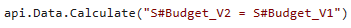

That’s it! That’s all it takes to copy all the data from one scenario to another. Integrating logic to only copy certain entities, accounts, or time can make your seeding rules much more complex, so you’ll likely need the full arsenal of business rule writing skills you’ve learned in this book.

#### Location Of Seeding Rules

In general, seeding rules should run as a custom calculate finance rule. A few sections ago, I described the differences between custom calculate and Data Unit Calculation Sequence calculations. Since seeding rules typically copy data that does not change, they will only need to be run once, or when the source data has changed, which will likely not be often. Seeding rules that run in the DUCS will run every time a calculation and consolidation is executed, resulting in unnecessary clearing and re-copying of the same data and suboptimal performance. The custom calculate rule can be linked to a dashboard and executed centrally by an admin or by each user and their respective set of entities. Remember to use the DurableData = True and always include a ClearCalculateData script!

#### What’s In A Name?

In the Scenario section, we touched on naming conventions for scenario members. Data seeding should also be considered when naming scenarios. In many cases, the period, year, or version will be included in the scenario name and can be parsed out in your rule. Let’s look at the seeding rule for our YTG forecast scenarios. For this plan type, our scenario names include the current month number (e.g., `Forecast_M2`,` Forecast_M3`, etc.). Let’s say we want to copy the previous  month’s forecast into the current forecast. Here is how the seeding rule might look.

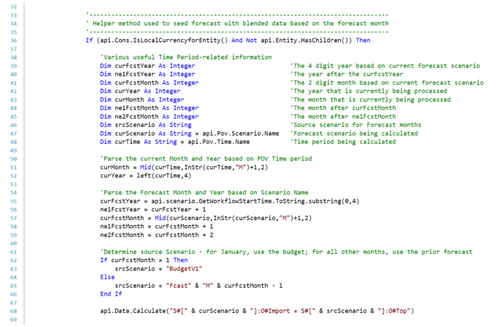

In line 57, we can parse out the month name from the scenario name using standard VB.NET (or C#) functions. From here, we can do some simple math to determine the prior month’s scenario. Since there is no `Forecast_M0`, we have a special condition to set the source scenario to  `BudgetV1` when the current scenario is `Forecast_M1`.

#### Use Scenario Text Properties!

Like naming conventions, scenario text properties can be used to store information that can be used in seeding rule logic.

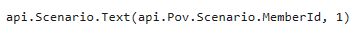

Text properties can provide more flexibility in that they can be easily changed by an administrator. To give an example, let’s look at an example budget preparation cycle. Users will start preparing the budget in September and go through several iterations before finalizing in late October. Beginning balances for balance sheet accounts are being pulled from the most recently closed month of Actuals. From the start of the budget cycle to the end, another month will be closed. Storing the most recently closed Actual month in a text property allows the administrator to easily update the beginning balance logic without having to touch any code.

#### Remove The Guesswork!

OneStream’s dashboard tool can create slick interfaces that give users drop-down menus, selection boxes, and input screens. While this flexibility can be extremely useful elsewhere in your build, I would try to avoid it when it comes to seeding rules. Seeding logic should be predetermined to the greatest extent possible. This removes any room for user error. Imagine a CFO looking at a plan that was derived from baseline data seeded from another scenario. It may not be clear what the user selected as the baseline scenario, or it could have changed from version to version. If strict seeding logic is agreed upon – upfront – it can be cleverly programmed into the seeding rules so that you always have a predictable outcome.

#### Copying Between Extended Scenarios

If you are using extended cubes and dimensions across Scenario Types, you will likely need to copy data from a cube or scenario that uses different dimensionality. The `ConvertDataBufferExtendedMembers` function is designed to convert data from an extended  cube or scenario to the dimensionality of the destination cube.

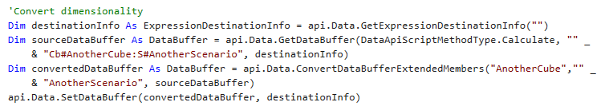

#### Conclusion On Seeding Rules

In general, you should strive to build your seeding rules with the intention that they should never have to be touched unless new plan types are added, or there are material changes in the data seeding methodology of existing plan types. Using the tips and techniques above can help create rules that both perform well and require minimal maintenance over time.

## Workflow

Workflow is the last section in this chapter because it brings everything we’ve covered so far together in one place for users. We refer to ‘that place’ as a Workflow Profile,and each user will navigate to one before doing almost anything in OneStream. Workflow is so important, in fact, that there is an entire chapter in this book dedicated to it. Chapter 7 covers the fundamentals and basics of workflow design, so this section will mostly focus on planning-specific considerations. Let’s quickly review the main goals of workflow: • To protect the end-user from analytic model complexities • Manage and audit data collection • Manage and enforce data quality, certification, and locking • Manage and intelligently coordinate the data consolidation and calculation process • Deliver reports and analytic tools • Create a standardized end-user experience

### Designing Workflow For Planning

In contrast to financial processes like consolidation, which can require stringent controls and audit requirements, planning processes are mostly liberated from those constraints. This isn’t necessarily always the case but, generally, you have a lot more flexibility with how planning workflows are designed. I have seen planning Workflow Profile structures range from dozens of profiles organized into a hierarchy to just one universal workflow that all users access and navigate like a web page. Now that I’ve left you more confused than you started, let’s go through how to approach a planning workflow design. A planning workflow design should consist of three things:

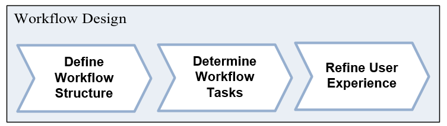

Your ultimate workflow design will depend on what kind of user experience the customer wants for its users. Find out what users are used to, from tools they have used in the past. This is where you will go back to the plan process flows defined in the BPD to use as your starting point.

#### Determine Workflow Profile Structure

A workflow structure refers to how Workflow Profiles are organized. A workflow structure can organize profiles in a hierarchy with various levels of review points, or have them laid out in a flat list. A Workflow Profile structure also serves technical purposes with how data importing, clearing, and locking behaves. Below are some requirements that will influence your Workflow Profile structure design.

#### Data Importing To The Cube

Data imports require some special workflow considerations due to how OneStream clears and loads data into the cube. Entities can be assigned to workflows, which restrict data imports to that entity from other workflows. Additionally, data generally cannot be loaded to the same entity from multiple Workflow Profiles without the use of workflow channels. This ties back to the section where we discussed how the workflow plays a role in Entity dimension selection.

#### Data Locking Requirements

An important requirement that relates to workflow structure is if, and how, data needs to be locked. Most of the time, this isn’t very important since planning data isn’t subject to the same audit requirements as Actual data. However, if you fall into the exception, you must give careful thought to your workflow structure. This also relates to the Entity dimension, as data is locked for an entire entity (ignoring workflow channel usage), so you typically want a Workflow Profile per Workflow Unit if possible. Consider a process for Actuals in which there are 25 legal entities. Each user submits data for a legal entity and locks the workflow (and, by definition, the entity). For the budget, department managers submit budgets across multiple legal entities. Since department drives the budget workflows, the requirement is to lock each department. Workflow channels would need to be used to lock only certain departments within the entity. This is possible in OneStream using workflow channels, but only one UD dimension can be used as the channel. This is also an application setting, which means it cannot be set per cube or Scenario Type. Another option would be to ‘lock’ the data outside the standard workflow mechanism using conditional input business rules assigned to the cube. This option can certainly work well in some situations, but additional maintenance should be considered.

#### Determine User Types

Identifying user types will help drive the workflow design by helping to provide context for a structure. Different user types will interact differently with the solution, and users within the same type will be completing many of the same tasks. Some general classifications of user types: • Data preparers – users are generally interacting with data by importing files, typing numbers, and running calculations. They will also do some review and analysis. • Data reviewers – users that are primarily responsible for some or all of reviewing, approving, and locking data. • Plan administrators – users that execute central tasks such as opening scenarios, seeding data, or importing central files.

#### Extensible Workflows

Workflow Profile structures can be shared across Scenario Types with the underlying tasks associated with that profile specific to the scenario. If the budget submission process follows closely to Actual, you can leverage the same structure. If not, extensible workflows can be used. Extensible workflow essentially gives you the ability to create a completely different set of Workflow Profiles specific to a Scenario Type. This creates a fundamental separation between the different processes for both the end-user and administrator.

#### Determine Workflow Tasks

For every Workflow Profile identified, you will need to determine each task that a user needs to complete. Hopefully, a light is going off because this should sound familiar. We already started to uncover this during the plan process flow exercise in the BPD. Starting with the plan process flow, you can distill things down to individual tasks that a user needs to complete. Next, try to understand the order in which each of those tasks needs to be completed, and if there need to be reviews or sign-off points within the process. These will all need to be presented to the user at some point within the workflow.

#### Refine The User Experience

There are thousands of books written on user experience theories and techniques. I simply do not have the expertise or the page space to explore this in great detail, so I will only make a few points here. The most important thing to remember is that OneStream gives you a framework for building just about any type of user experience you can come up with. You can build strict, linear processes that carefully guide a user from task to task. You could also venture to the other end of the spectrum, where users work in a freeform Workspace, navigating haphazardly back and forth between tasks. Make sure you allocate enough time in the project to go through several iterations of the user experience design. Start with something basic and have users test it, collect feedback, and refine. In most cases, users do not know what they want until they see something and start to use it.

#### Using Dashboards

Many workflow types in OneStream are designed to fit a linear process (e.g., a user imports a file, validates the data, then loads and processes the cube before finally certifying the workflow). While some planning processes will fit that mold, it is more common to have a planning process that is circular (e.g., a user inputs drivers, calculates costs, runs a report, changes a driver, recalculates, and repeats multiple times before finally certifying the data). For these types of processes, OneStream’s robust dashboarding tool is available. Dashboards give users more of the ‘web page’ experience. Using dashboards, you can create and tailor the user experience to exact specifications. You can put data entry screens, reports, and buttons to execute tasks all on the same screen.

#### Standardize As Much As Possible

“If you try to make everyone happy, you’ll make nobody happy.” While dashboards are tremendously powerful in creating tailored user experiences, they will also require additional build time and maintenance (remember our rule from before). Creating a dashboard specific to every user’s wishes will create a maintenance nightmare. Spend time early in the project standardizing dashboards as much as possible. To address this exact point, OneStream has several solutions (found on the Solution Exchange) that can be easily installed and configured into any application. • Actor Workspaces – these are pre-built dashboards geared towards specific user types that can be configured for your specifications. They can be set as a user’s home screen or linked to a workflow. These dashboards pull properties from user properties and security so that the dashboard is relevant to each user. • Data Entry 123 – the Data Entry 123 Solution is a contextual development environment for creating data entry forms. The framework provides a simple design paradigm that facilitates quick form building. This centralized approach helps standardize the look and feel across forms while easing the change management process of forms, selectors, and calculations. I highly recommend leveraging these solutions as they can significantly reduce development time and reduce maintenance.

## Conclusion

OneStream is a dynamic software platform that was designed to support all corporate financial planning processes. FP&A teams have more data available at their fingertips than ever before. This puts a lot of strain on the chosen planning tool. If you’re not careful, you can easily get lost in the maze of design. I hope that after reading this chapter, you have a better knowledge foundation to draw from when you are designing your next planning solution in OneStream.

## Epilogue


OneStream opened our global headquarters in Rochester, Michigan, in 2015. It reflects our “Work Hard, Play Hard” mentality.
