# Rules And Calculations

Originally written by Nick Kroppe and Chul Smith, updated by Nick Kroppe and Chul Smith Rules and calculations influence almost every area of the OneStream platform and are a pivotal skill to develop over the course of any OneStream career. Taking the time and effort to learn them enables you to develop new skillsets that will tremendously empower you throughout an implementation. Every OneStream rule writer will likely state the same thing – there are few more satisfying feelings in the OneStream world than writing a perfect business rule or calculation for the first time. Reading this chapter is your first step to becoming a rules and calculations expert! In this chapter, we’ll focus on sharpening your understanding of rules and calculations by exploring the scope of business rules and the purpose they serve. We’ll also review the fundamentals and main considerations of how rules and calculations should be designed and implemented. Finally, we’ll take a deep dive through the calculation engine and review must- know business rule best practices and syntax tips we’ve learned across the past decade. Let’s begin our journey by taking a stroll through the scope of OneStream rules, and discuss how best to apply them in a OneStream application.

## Rules Scope And How To Apply Them In An Application

The goal of this section is to review the different types of rules within the platform, introduce their purpose, and discuss how they’re triggered. OneStream rules can be broken out into two different categories: business rules and Member Formulas. We’ll discuss each one and then finish by highlighting their use cases.

### OneStream Programming Language Options

Although you may have noticed that the screenshots of example code presented throughout this book are in VB.NET, OneStream has recently expanded its coding language options. In addition to VB.NET, consultants and administrators now have the option to develop business rules using C#. However, it’s worth noting that currently, the option to develop in C# is only available in business rules, while Member Formulas and other areas in the product that support code require VB.NET. Given the choice of coding language for business rules, which one is better, preferred, or recommended for your application? The answer ultimately lies with the customer.

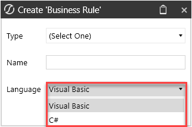

There are numerous comparisons of these languages on the web, so I won’t go into those arguments here. It’s important that the customer decides which coding language they want to use to develop custom business rules within their OneStream application. Some customers have internal resources who are very competent in using VB.NET or C#, which will drive their decision. Customers who must hire to fill the administrator role will likely encounter more candidates with C# experience. Furthermore, OneStream plans for new releases via the Solution Exchange to be written in C#. However, most candidates and former consultants with extensive OneStream experience will have written most of their rules using VB.NET. I’ve heard some coders say, “VB.NET is a dead language, and it will be retired soon.” Although I can’t speak to the validity of that statement, I’m able to say that OneStream successfully navigated Microsoft’s sunsetting of Silverlight in 2021 and currently has no plans to retire the use of VB.NET in the OneStream platform. Either way, I suggest language consistency when developing custom business rules in an application.

### Types Of OneStream Business Rules

The way OneStream business rules are organized and grouped within the platform is driven by their purpose and how they are applied in an application. The different types of rules in the OneStream business rule library are listed below. 1.Finance 2.Parser 3.Connector 4.Smart integration function 5.Conditional rule 6.Derivative rule 7.Cube View Extender 8.Dashboard dataset 9.Dashboard Extender 10.Dashboard XFBR string 11.Extensibility rules 12.Spreadsheet

#### Finance Rules

Understanding finance rules and their fundamentals is a logical place to begin our business rule learning path because of their flexibility, versatility, and familiarity among many applications. We use finance business rules for many different purposes within the platform. The finance function type describes and groups the different use cases of a finance rule; they include financial calculations, member lists, custom translations, complex ownership and elimination logic, conditional input, on-demand rules, and much more. From this statement alone, it’s clear that this type of rule does it all and will likely be a major factor in your application. Although the use cases and flexibility of a finance rule often seem to be limitless, the implementation of a finance rule is satisfyingly simple and consistent. During the rule design, you must first decide its purpose and how you want it to be triggered. This will lead to your decision on what finance function type (remember, this is the use case) you’ll use to write your logic. In the figure below, you can see a visual of the most popular finance function types, which are what I often refer to as use cases for a finance business rule. At the end of the day, the finance function type case statement, in which you place your code, correlates with the purpose of your logic and controls how the code will be triggered in a OneStream application.

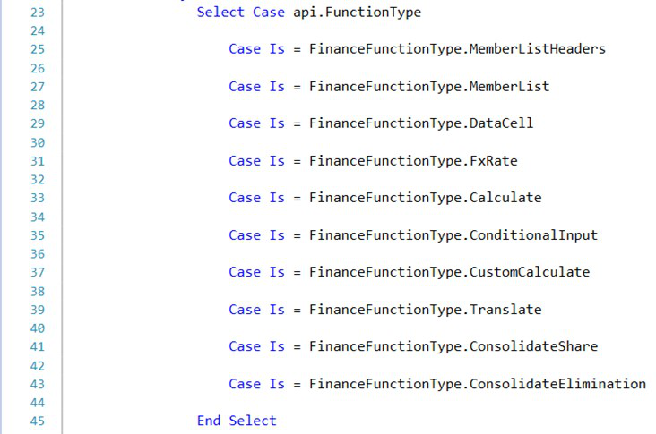

We use the cube and the financial events that occur in a cube – such as a calculation, consolidation, or the rendering of a report – to act as the natural triggering mechanism for the finance business rule. You do this by attaching the rule to a cube. Keep in mind that there are a few exceptions to attaching the finance rule to the cube to trigger it. The use of finance function types, such as member list and data cell, are not required to be attached to the cube and can instead be triggered directly from a Cube View row or column, while the finance function type confirmation can be triggered from a confirmation rule.

#### Parser Rules

Business rules are leveraged and called directly from data sources in OneStream. These types of integration rules enable you to use code along with OneStream’s staging engine to effectively parse incoming data during an import event. Use cases for a parser business rule include integration efforts such as parsing the debit and credit field values from a source GL file, character trimming and concatenating, and the common use case of deriving a source ID from a source file name. A parser business rule can be called directly from a data source dimension by setting the Logical Operator to Business Rule and defining the logical expression value as the parser business rule name you wish to apply to the data source dimension.

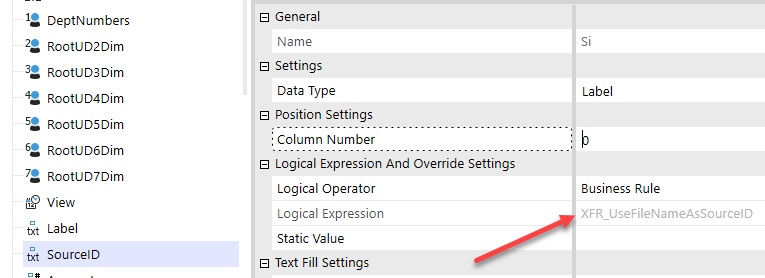

#### Connector Rules

A connector business rule can be used to facilitate integration efforts to pull data out of an external database, data warehouse, or OneStream ancillary table, and into a workflow. Although not required for integrations that pull data out of an ancillary table, a connector rule typically leverages an external connection that is configured on the application server, which enables the connector to pull data from an external system. A connector rule can be attached directly to a connector data source and is triggered when a user clicks import in a workflow. Lastly, a connector rule can also be used to enable detailed sub-ledger drill back functionality, which enriches a user’s data investigation and analysis in OneStream. In a connector business rule, there are four specific `ConnectorActionTypes` that correlate with  a connector’s capability and use cases, listed in the code below. The `GetFieldList` action type  defines the field names that will be returned in the source data table. It’s triggered when the Stage engine reads the configured data source upon an import event. Secondly, the `GetData` action type is used to process (query) the incoming source data, whilst the  `GetDrillbackTypes` action type helps enable you to design custom drill back to additional  detail that may reside in an external database or data warehouse. Lastly, the `GetDrillBack` action  type formally handles the drill back processing to retrieve the drill detail and present it in a specific display.

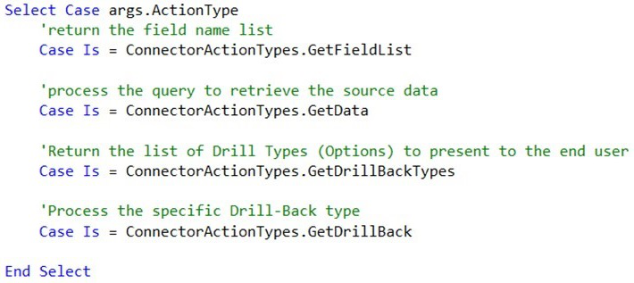

#### Smart Integration Function Rules

A smart integration function rule is a new type of business rule originally released in platform version 7.2 as a private preview. It later became more widely used in 7.4 and hit generally available release status in platform version 8.0 and upwards. This type of business rule may be used to execute remote functions in support of Smart Integration Connector-facilitated integrations that are written in connector or extender business rules. The goals for Smart Integration Connector are to establish all required data source connections without VPN and establish residency and management of data source connections solely in your network. With Smart Integration Connector, you can: •Securely establish connectivity between OneStream Cloud and data sources in your network without a VPN connection. •Create and manage network data source integration using OneStream administration interfaces. •Locally manage database credentials and ancillary files. Ultimately, smart integration function rules enable you to code and centrally store remote functions that need to be called from other business rules, such as a connector business rule to facilitate integrations that pull or push data from OneStream.

#### Conditional Rules

A conditional rule can be used to conditionally map an incoming source value to a target value by leveraging coding logic. A common use case for a conditional rule would be to dynamically set the target value based on the transformed target or source member for a particular Stage dimension. This technique uses the `Args.GetTarget()` or `Args.GetSource()` arguments as shown next.

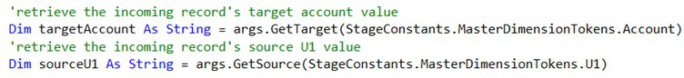

Some other conditional rule use cases include leveraging the metadata properties of a target dimension member to determine the mapping for a value in another Stage dimension. For example, you can use a conditional rule to map source UD1 members to specific UD1 targets depending on whether or not the Stage record is being mapped to an intercompany account. The conditional business rules can be as dynamic and flexible as you need them to be, depending on the complexity of the mapping requirement. However, keep in mind that this type of mapping technique is very intensive from a processing and performance perspective. A conditional business rule can ultimately be applied to an individual transformation rule, including composite, range, list, and mask transformation rules, and is triggered when the transformation fires during an import event.

#### Derivative Rules

A derivative business rule generally completes two main tasks in OneStream. First, it can derive or add a record to Stage, then set the resulting record’s amount via a calculation. This derived record can be temporary – which means the record does not get transformed and can be used for check rule validations. This is what we refer to as an interim-derived record in Stage. Alternatively, this derived record can be final – which means the record can then be transformed and loaded into the financial cube. Lastly, a derivative business rule can be used to enable pass or fail data validation checks, or check rules, which can be used to enforce specific data validation logic during the validate step of a workflow. For example, a derivative rule can facilitate a data validation check that will ensure the trial balance is in balance before allowing a user to complete the validate step. Ultimately, a derivative business rule is attached to a derivative transformation rule in the logical operator setting. It can then be triggered upon import, when deriving records in Stage, as well as upon the validate step when used as a derivative check rule.

#### Cube View Extender Rules

Cube View Extender business rules can be used in an implementation to highly customize and format Cube View PDF reports. If you need to implement specific formatting for a Cube View in PDF format that is not available with standard Cube View formatting settings, a Cube View Extender may be a good option for you. These rules have the ability to format any individual item on a PDF report, such as a logo, page number, title, header font, word wrapping, font color, cell value, and much more. The ability to individually format a Cube View PDF report with a Cube View Extender rule is nearly limitless. These business rules are applied and triggered directly on a Cube View by setting the Custom Report Task property to Execute Cube View Extender Business Rule and by setting the business rule property to the name of your Cube View Extender business rule.

> **Note:** An extremely important item to note is the logic and formatting that a Cube View

Extender business rule facilitates can only be applied and triggered when the Cube View runs as a PDF report. Your logic will not, and cannot, fire when the Cube View runs as a data explorer grid.

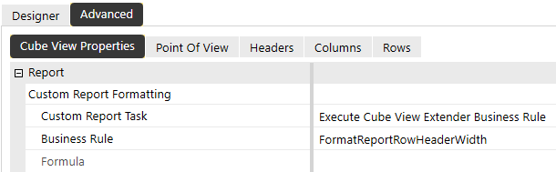

#### Dashboard Dataset Rules

Dashboard dataset rules are a personal favorite of mine and can be used to create custom datasets and data tables for advanced parameters, reports, and dashboards. If you can master the dashboard dataset rule technique, you’ll be able to deliver on nearly any custom reporting request during your OneStream career. Dashboard dataset rules enable you to execute SQL queries, Method queries, and OneStream BRAPIs to tailor customized datasets using the power, conditional logic, and flexibility of coding. This means that this type of rule can be used to execute custom SQL queries to query data from the OneStream application database, framework database, or even an external data warehouse. Perhaps the most powerful use case of the dashboard dataset rule is its ability to leverage OneStream BRAPIs to build data tables from scratch, or massage and customize data tables on the fly that may be originally produced by a SQL query or Method query. Now that we understand the basics of the use cases for a dashboard dataset rule, let’s discuss how they are applied in an application. A dashboard dataset rule can be called in two main ways. First, they can be called directly in a data adapter to enable dashboard reporting.

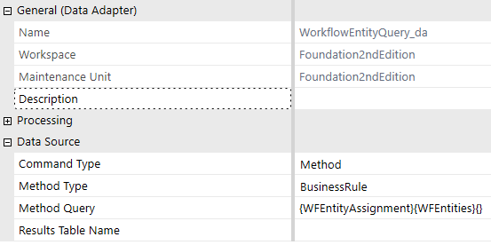

Second, they can be called in a bound list parameter to create a custom list of selections to present to a user in a parameter or dashboard component.

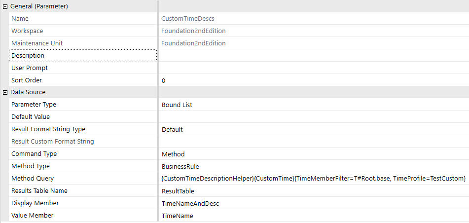

If you need to create a custom data table to source a parameter or query a OneStream database table or external table to source a report, a dashboard dataset rule should be your go-to option.

#### Dashboard Extender Rules

Dashboard Extender business rules can be used to create highly customized interactive dashboards, including the facilitation of task-driven dashboard clicks. If you are tasked with building advanced interactive dashboards for a client, knowing the ins and outs of Dashboard Extenders will be invaluable to the construction and functionality of your dashboards. These rules provide tools to explore the art of the possible, taking your dashboarding abilities to the next level. Some common use cases for a Dashboard Extender include designing button click actions that send emails to OneStream users, the execution and triggering of a OneStream workflow process (such as an import event or workflow status update), as well as the presentation of a custom message to a user. There are three main ways to apply and trigger a Dashboard Extender business rule; we call this the Dashboard Extender function type (or use case). As you can see in the figure below, there are three Dashboard Extender function types: `LoadDashboard`, `ComponentSelectionChanged`,  and `SQLTableEditorSaveDate`, all of which are triggered differently.    `LoadDashboard` triggers when a dashboard attempts to render, `ComponentSelectionChanged ` triggers when a dashboard component such as a button or combo box is clicked, and `SQLTableEditorSaveData` triggers upon clicking save in a SQL table editor component. The  trigger method drives where you need to write your rule. For example, if you want your code to fire upon a user clicking or selecting something, you would write your rule within the `ComponentSelectionChanged` function type.

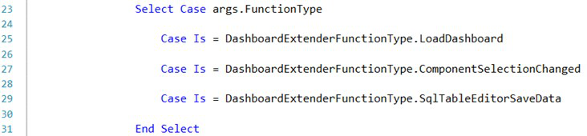

When it comes to applying Dashboard Extender business rules, you can first apply the rule directly to a dashboard. However, the Dashboard Extender can only be triggered on a main dashboard and cannot be applied and triggered in dashboards that are nested within a main dashboard. Secondly, you can call a Dashboard Extender on almost any dashboard component, such as a button, combo box, chart, Cube View, grid view, and more. Lastly, a Dashboard Extender can be called directly on a SQL table editor dashboard component to enable custom logic when a user clicks save in a SQL table editor component.

#### Dashboard XFBR String Rules

I’m fanatical that consultants and administrators who have no coding experience in VB.NET, C#, or any other programming language should start with dashboard XFBR string rules. Why? These incredibly flexible rules can be found and used virtually everywhere in an application. Noobs don’t need to worry about understanding Data Units, data buffers, balanced or unbalanced dimensionality, or data explosion – the rules simply return text that is based on logic. The rule writers will learn simple functions, syntax, and logic. They’ll figure out common calls like how to get the name of a dimension or Workflow Profile or user. It’s the best starting point for someone who will progress on to writing finance business rules and Member Formulas. What do I mean by they can be “used virtually everywhere in the application?” Well, the statement speaks for itself – they can be used nearly anywhere an application is expecting text; this includes report books, formatting properties, headers or row/column names in Cube Views, and any component in dashboards. Again, the rules return text that is based on logic. Some common use cases of implementing a dashboard XFBR string rule include dynamically setting a Cube View POV member, formatting a Cube View or dashboard, setting a Cube View row or column’s Member Filter, setting a Cube View’s row or column shared template, setting a parameter’s default value, and pulling data cell amounts from a cube to be used to facilitate a Specialty Planning calculation. The key word or theme here is dynamic. The impact this business rule has across the platform minimizes maintenance. For example, your report contains three columns: Actual, Current Forecast, and Prior Forecast. The current month is March. You named your Forecasts: `Jan_FC`, `Feb_FC`, `Mar_FC`, etc. So, when  you want to report on March, your Current Forecast is `Mar_FC` and your Prior Forecast is `Feb_FC`.  Moving on to April, `Apr_FC` becomes Current, and `Mar_FC` becomes Prior. To prevent the user  from having to select all three columns, you can prompt the user to select only the current month which would give you the correct Actual and Current Forecast columns. How does OneStream know the Prior Forecast without user input? There’s some simple logic that needs to happen. You could write an XFBR string rule to use the month that the user selected and – based on that selection – return the correct Prior Forecast. If you want to improve and enhance the end-user experience, and it can be supported by conditional logic, a dashboard XFBR string business rule will become your best friend and go-to solution.

#### Extensibility Rules

Extensibility rules might just be the most underutilized type of business rule in OneStream. There are two main types of extensibility business rules, which we classify as Extender rules and Event Handler rules. Extender business rules are mainly used to facilitate the execution of custom automated tasks. Common use cases include automating the import of source GL data in a workflow, file management tasks such as picking up or placing a file on an FTP server, and the export of custom datasets to a CSV file (or other file types) to then be stored in a specific file location. The unique part about Extender rules is they’re one of only two types of business rule that can be called directly from a data management step. We often see these two components working together in a fully automated solution and, thus, you’ll want to consider an Extender business rule as a vehicle for you to write logic that enables automated tasks in OneStream. The second type of extensibility rule is an Event Handler business rule. The first time you see the power and capability of an Event Handler rule in action, you will probably lose your mind and be blown away! OK, I’m exaggerating – these rules can’t compete with seeing an English bulldog riding a skateboard through a 30-person leg tunnel. [Google it.] Event Handler business rules can be used to trigger custom tasks or processes in an application when a specific event occurs in the platform. Some powerful use cases include writing an Event Handler to seed a scenario upon a process cube workflow event, sending an email to application admins when an import fails in a workflow, emailing a journal approver when a journal is submitted, emailing a specific user when a workflow is certified, and auto-creating members in the dimension library upon an import event. In addition, an Event Handler rule can be used to block specific processes from occurring, such as preventing a user from locking or certifying a workflow and, in general, throwing custom error messages to a user upon a specific event occurring in an application. You’re probably wondering how Event Handler business rules are called within an application. These rules are the only type of rule that do not need to be called from another artifact to be triggered. OneStream has an event engine built within the platform that listens for when specific events occur and subsequently triggers the code you wrote in that type of Event Handler. There are seven different types of Event Handler rules: 1.Transformation Event Handler 2.Journal Event Handler 3.Data Quality Event Handler 4.Data Management Event Handler 5.Forms Event Handler 6.Workflow Event Handler 7.WCF Event Handler The event you use to trigger your custom code determines what type of Event Handler business rule to use and how to write the logic within it. Within each individual Event Handler business rule, you can access specific sub-events in which you will write your logic. BR event operation types are specific events that happen in an application. For example, within a Transformation Event Handler business rule, you can write code to intercept many different transformation events such as import, validate, load cube, and clear Stage data sub-events. The sub-events that you can leverage to execute custom logic can be found within the event listing section of the OneStream API guide, and we’ll talk more about Event Handler design tips and tricks later in this chapter.

#### Spreadsheet Rules

A Spreadsheet business rule enables users to read or write to database tables that exist in the OneStream application within the Spreadsheet tool. The table view data presented in Spreadsheet can originate from any OneStream database table, such as a Solution Exchange solution ancillary table or a custom data table created on-the-fly using code. This type of extremely powerful business rule enables users to perform read/write actions and analysis on ancillary table data using a familiar reporting interface. Common use cases for a Spreadsheet rule include designing a report that enables users to analyze Specialty Planning register data, a report that allows users to modify, add, and remove data from a Specialty Planning register, or a report that presents a custom data table – all presented within the Spreadsheet tool. This is yet another powerful reporting option when it comes to reporting on data that originates from a custom data table or OneStream database table. As you’ve probably guessed, a Spreadsheet business rule can only be applied and triggered directly on a Spreadsheet file by creating a table view definition.

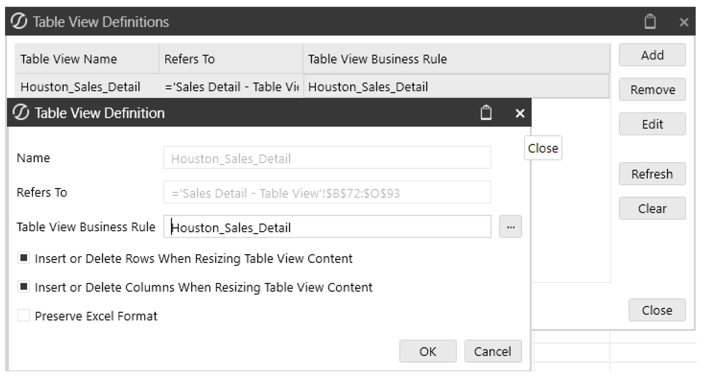

### Member Formulas And Calculation Drilldown

As I mentioned earlier, Member Formulas make up the second category of rules in OneStream. This means we not only have the ability to write calculations in individual business rules, but we also have the option to write calculations directly on dimension members. The Member Formula calculation can result in stored calculated data point(s) that reside in the cube or dynamically calculated data, i.e., calculated on-the-fly, and presented in a report. In this section, we’ll introduce the basic concepts of Member Formulas and Calculation Drilldown, talk about how they’re triggered, and end by comparing the differences between writing calculations directly on a member and writing calculations in a business rule. In addition to facilitating calculations, Member Formulas enable you to write a Calculation Drilldown formula to present a user with drilldown detail for calculated data. The Calculation Drilldown feature can also be used to give the user insight into how a particular result was calculated by exposing the inputs of the calculation formula. You can write Member Formulas and Calculation Drilldown formulas on Scenario, Flow, Account, and UD1-UD8 dimension members. When comparing the execution behavior of a stored Member Formula versus a dynamic calculation, the differences are twofold. Member Formulas written as stored calculations can be triggered upon a calculation, consolidation, or translation event, while dynamic calculation Member Formulas are triggered and calculated when called in a report. Lastly, a Calculation Drilldown formula triggers when a user drills down on a dimension member that contains a formula for Calculation Drilldown (see the next figure). This is often used to expose the member’s calculation inputs, which allows the user to see exactly how OneStream amounted to the result of the calculation.

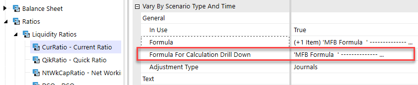

### Business Rules Versus Member Formulas

When designing a OneStream calculation, there are a handful of fundamental considerations to think about when ultimately choosing which type of OneStream rule best suits the requirements of a client’s calculation. These concepts can be split into four different categories: 1. purpose, 2. flexibility & maintenance, 3. execution requirements, and 4. performance. Keep in mind the goal of this section is not to steer you towards writing calculations as a Member Formula or as a business rule, but instead to compare the two approaches and discuss the differences so that you can pick the best approach for your specific calculations.

#### Purpose

Clearly understanding the purpose of rule requirements is critical when choosing whether to design a client’s calculation in a finance business rule or directly on a member in a Member Formula. There are specific rule purposes such as custom translation, share, and consolidation logic, that will need to reside in a finance rule. Your experience with other CPM tools may have you questioning why OneStream would even create Member Formulas if they’re doing the same thing as a business rule. This thought is completely valid, and I’ll expand on the advantages and disadvantages of using them.

#### Flexibility & Maintenance

The flexibility and ease of maintenance of Member Formulas versus business rules is more complex than you may initially think. The benefits of Member Formulas in a consolidation implementation are often a drawback when using them in a planning implementation. Let’s explore further. When written properly, Member Formulas run specifically to that particular member. No more sifting through thousands of lines of code to find a particular formula! Member Formulas can vary by Scenario Type and/or time without the need to write code. The Member Formula stores all of these variations directly on the member via properties, through which the administrator can carry out maintenance using drop-down menus. For example, you’ll likely encounter a client who wants a member calculation to change as of a certain date, or to calculate things differently between an Actual scenario and a Forecast scenario. Again, the Member Formula accommodates this out-of-the-box, without needing to write additional lines of code. Calculated members are then all assigned one of 16 formula passes that fire according to DUCS (more on that in the next section). This allows the admin to order them as needed, and those calculated members – dependent on other calculated members – can fire sequentially. I’ll revisit this in the performance section. To summarize, Member Formulas allow the administrator to easily find related code, minimize coding by time and Scenario Type, and assign formula passes for sequential calculations. These convenience factors sound great and are a big plus, especially after go-live, when we leave the client, as administrators generally don’t have the skill sets to maintain the rules at our level. However, with the positives come the potential drawbacks. Due to the formula being held at the dimension member level, if a calculation is the same for many members, the administrator may replicate the same code over and over for each individual member. If the administrator needs to change the code, that person needs to go to each member to change each formula one-by-one. This not only takes time but also increases the risk that the administrator will miss updating some of them. The formula passes assigned to the members cannot vary by Scenario Type or time. In other words, if you have a Member Formula currently firing on pass three for Actual, but need it to fire on pass five for Budget, you can’t write a Member Formula that will satisfy both requirements – at least one calculation would need to go in a business rule. A third way of describing this is that a member can only be assigned one formula pass. If the formula pass is three, it’s three for all Scenario Types and time. Again, consultants and administrators address these drawbacks by putting some types of calculations in a business rule. As a very general rule of thumb, calculations for consolidation or Actual data, use more Member Formulas, while calculations for planning or forecasting data use business rules. Why? Actual data is generally sourced from ERPs, and the calculations are very specific to the individual members. Prior year retained earnings is a very specific calculation and ends up on a very specific member. Current year retained earnings is the same. Key KPIs can be described similarly, too – DSO, DPO, % of sales, % of gross profit, as examples. On the other hand, planning data often uses Actual data as a calculation input, and the calculations may span over very large groups of members within a given dimension. For example, Jon mentioned three types of planning methodologies – driver-based, factor-based, and zero-based planning. The results of each of those methodologies are multiplying drivers for large groups of accounts. All sales accounts might be price * quantity. No one wants to go into each of the sales accounts to write the same formula on each individual account. If the customer multiplies prior year Actuals by a growth factor, you’d have the same headache. So, calculations of this nature are generally written in a business rule and NOT on Member Formulas.

#### Execution Requirements

The next consideration when choosing to write your calculations in a Member Formula versus a business rule is how you’ll trigger the calculation. Again, both execute every time a Data Unit calculates or consolidates. If this is your requirement, your choice may remain as a toss-up. However, if you only want the calculation to execute on-demand by a user, consider using the custom calculate finance business rule. These types of rules are far more common in planning implementations and are often triggered by an end-user during their data submission process. These rules have the ability to run individually as well as separately from the standard business rules and Member Formulas that execute during a calculation or consolidation event. During the design of workflow, it’s important to understand what the end-user will be doing at every step during the process. For example, let’s say a user calculates a group of accounts in the fourth step of their data submission process. They don’t subsequently modify any of the source data in the calculations, and the remaining steps in that user’s process, therefore, should not re- calculate those accounts. Granted, if they do re-calculate, the results won’t change, and no harm, no foul. My argument is why re-calculate if the results won’t change? By re-calculating over and over, they need to wait for the engine to do things it’s already done with no additional benefit.

#### Performance

The performance difference between Member Formulas and business rules – out-of-the-box – favors Member Formulas. OneStream multi-threads Member Formulas for each dimension within a specific formula pass during the calculation sequence. In other words, all accounts with Member Formulas on the same formula pass fire simultaneously. This point of efficiency is built into the OneStream engine with no additional coding. On the other hand, business rules execute as they’re written. If you write five calculations in a business rule, OneStream will execute them in the order in which they appear in the rule. Change the five calculations to hundreds, and you’ll experience a considerable difference in performance between writing the calculations as Member Formulas versus within a single business rule. This fact somewhat puts the option of using Member Formulas far ahead of using business rules, but the design considerations drive out which option better suits and addresses the requirements. Writing calculations in business rules isn’t a bad thing to do – in fact, it’s probably necessary. Good consultants and coders develop logic to address some of the ‘downfalls’ of writing calculations in business rules. These include calculating only the intersections that are required to be calculated (e.g., at base entity and local currency only), using data buffers effectively, and building triggers into the workflow for the calculations to execute once rather than multiple times throughout the process. I would expect to find a balance of both Member Formulas and business rules in any application that’s been configured to address requirements for multiple processes.

## Must-Know Financial Calculation Concepts

Now that you’ve acquired a solid foundation of rules knowledge – including a high-level understanding of their use cases and how they’re triggered in an application – understanding the platform’s calculation engine will be pivotal in taking your financial rules knowledge to the next level. When designing financial rules and calculations in OneStream, you must have a deep understanding of DUCS… and I’m not talking about Ernie’s favorite bathtime toy. In the OneStream world, we refer to the OneStream calculation sequence as the Data Unit Calculation Sequence or DUCS for short. When I talk about truly understanding DUCS, I mean knowing what the heck happens behind the scenes when you run a calculate or force calculate in the platform. Understanding the precise order of when calculations and rules fire during a calculation process is a must-know concept during your rules journey! Along with an understanding of the calculation sequence, it is equally as important to begin to train your mind to think of financial calculations in units of Data Units and data buffers. Understanding both concepts will provide you with the tools and skills to write functional and, most importantly, performant financial rules in an implementation.

### OneStream Calculation Sequence

As we discussed earlier in this chapter, a financial calculation that gets triggered during a cube calculation event can be written in a variety of different places, including in a finance business rule, and directly on a member as a stored Member Formula. Furthermore, in a OneStream application, you’ll likely have multiple members in different dimensions that have Member Formulas. You may even have calculations that have dependencies on others, meaning a calculated member’s formula may refer to the results of another calculated member. As you can begin to see, there is the potential for many calculations to fire during a calculation event, including Member Formulas and up to eight unique finance business rules that may be assigned to a cube. However, not to worry, there is a method to the calculation engine’s madness. The platform’s calculation engine is a master of precision as it fires rules in a very methodical manner and precise order. Understanding the order behind the scenes will enable you to design your financial rules in the right place, to fire at the right time, as well as take advantage of the engine’s ability to multi-thread calculations as much as possible. When a calculation event occurs in the system, the finance engine handles the event by executing the following calculation sequence: • Clear previously calculated data (based on cell storage type – will not clear durable data). Note: OneStream will only perform this action if the calculated scenario has its Clear Calculated Data During Calc setting set to True • Run scenario Member Formula • Perform reverse translations by calculating Flow members from other alternate currency input Flow members • Execute business rules 1 and 2 (as assigned to cube) • Execute formula passes 1 through 4 (account formulas, then flow formulas, then UD1 formulas, UD2, … UD8) • Execute business rules 3 and 4 (as assigned to cube) • Execute formula passes 5 through 8 (account formulas, then flow formulas, then UD1 formulas, UD2, … UD8) • Execute business rules 5 and 6 (as assigned to cube) • Execute formula passes 9 through 12 (account formulas, then flow formulas, then UD1 formulas, UD2, … UD8) • Execute business rules 7 and 8 (as assigned to cube) • Execute formula passes 13 through 16 (account formulas, then flow formulas, then UD1 formulas, UD2, … UD8) It is also very important to note that the calculation sequence can fire multiple times at varying levels of the Consolidation dimension when consolidating a parent-level entity. The calculation sequence, as described above, can trigger up to seven times during a single consolidation or force consolidate event based on the following intervals: Levels of consolidation for each entity (up to seven calculate operations). • Calculate local currency • Translate local currency to parent’s default currency (i.e., `C#Translated`)   • Calculate translated currency • Calculate`OwnerPreAdj` • Perform the default or custom share functions (if default, share is calc-on-the-fly. If custom consolidation, calculate share) • Execute default or custom elimination functions (including populating `O#Elimination`), then calculate elimination   • Calculate`OwnerPostAdj` • Combine the data from top consolidation member from each child entity to insert data in the parent entity’s local consolidation member • Step 9 is to calculate parent entity’s local currency consolidation member Because individual calculations can be triggered at many different stages of the calculation and consolidation sequence(s), designing your financial rules to fire at the appropriate times is absolutely critical to a well-performing application. The golden nugget to keep in mind here is you only want your rules to fire when they are needed to execute – this methodical and purposeful mindset will promote well-performing calculation and consolidation processing times in a OneStream application.

### Calculations Start With The Data Unit

Now that you understand when financial rules can be triggered, you’re likely wondering how to control if and when a rule fires during a calculation and consolidation sequence. In this section, we’ll explain how Data Units drive the design and the execution behavior of your financial calculations. An important concept to understand when it comes to the finance engine is that every calculation and consolidation event in OneStream is driven by the Data Unit for which the financial event is run (triggered). The Data Unit is ultimately the subset of data that will be calculated or consolidated. Data Unit dimensions are defined by cube, scenario, time, entity, parent, and consolidation member. When performing a calculation or consolidation in OneStream, the finance engine is simply not aware of the non-Data Unit dimensions (Account, Flow, Origin, IC, UD1-UD8) set in your point of view. Instead, the finance engine is purely focused on – and tied to – the Data Unit dimensions. When designing calculations in a finance business rule or Member Formula, it is extremely important to determine and control when a rule will execute during a calculation sequence by defining the specific levels of the Data Unit – such as the consolidation and entity – for which the rule will fire. It’s often strongly suggested to implement Data Unit Ifconditions – to control when a rule should execute during a calculation sequence. For example, many times a financial calculation is only required to execute on specific Data Units such as on base entity and local currency Data Units. Refer to the following code for a common best practice Data Unit `If` condition – that controls a calculation to run for base entities and local currency.

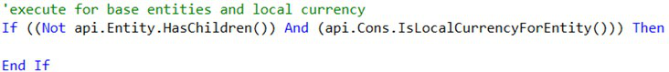

> **Note:** If your calculation is required to fire for specific Data Units and – thus – you have

the use for Data Unit `If` conditions, it is best practice to insert the necessary Data Unit `If` conditions as early as possible in your logic, towards the top of your rule. This will ensure all variable declarations and proceeding code is only triggered for Data Units that meet the `If` statement calculation criteria. This promotes better performance as you will have  designed your code to avoid processing code for Data Units that are not required to be calculated. As we discussed earlier in this chapter, during a consolidation event, it is possible for a single formula to calculate up to seven different times at varying levels of the Consolidation dimension for a given entity. By implementing Data Unit conditions in your financial rules, you can prevent your Member Formulas and finance rules from firing unnecessarily at all levels of the Consolidation and Entity dimension – such as at parent entities, foreign currencies, or relationship- type consolidation levels.

### Learning To Think Of Calculations In Units Of Data Buffers

Now that we understand the importance of Data Units and how they drive the financial events that occur in OneStream, the next step in our finance rules journey will be to learn how to think of the inputs (sources) and outputs (results) of our calculations in units called data buffers. In the OneStream world, a data buffer is a term used to describe a ‘slice’ or subset of data that exists within a given Data Unit. A data buffer can be a collection of cells that refer to both the input (source) and output (result) of a financial calculation. In reality, it is important to note that a Data Unit is, in fact, a data buffer itself – it’s a large collection of cells. The data buffers we’re discussing in this section relate to breaking down Data Units into smaller data buffers. When designing a stored calculation in a finance business rule or Member Formula, a calculation is often the result of math that is performed on a collection of data cells (DatabufferA + DatabufferB) that result in multiple output/result cells being calculated. The collection of data cells in the source, and the result of calculations that are associated with specific dimensionality within a Data Unit, are what we describe as a data buffer. To better visualize the meaning of a data buffer and further understand how they’re an important piece of OneStream calculations, let’s review a basic calculation example together. In the example calculation, below, we have defined the inputs (source) and output (result) of our calculation as such: Result = A + B. Please note that screenshots of code often use line breaks to fit the code within the page margins.

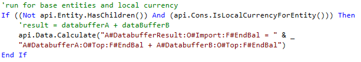

Notice that our rule begins with Data Unit `If` conditions to ensure the rule only fires for base  entities and local currency as we’ll let the consolidation engine naturally handle the consolidation of the data up the Consolidation and Entity dimensions (rather than unnecessarily calculating these data points). Next, it is important to understand that the source of the calculation (`databuffer A + ` `databuffer B`) consists of two different subsets of dimensionality, which are both unique data  buffers that are comprised of a collection of unique data cells. Because we’ve defined only three dimensions within each source data buffer (Account, Origin, Flow), there is a possibility for multiple cells to exist within each slice of dimensionality. For example, in the `SourceDatabufferA` account at `O#Top:F#EndBal`, there could be many data cells that exist in  this dimensionality across the UD1-UD8 dimensions. The same concept applies to the `SourceDatabufferB` account at `O#Top:F#EndBal` where many data cells could exist in  undefined dimensions as well. It is important to understand that unless you have defined all 12 account-type dimensions (Account, Flow, Origin, IC, UD1-UD8) in the result and source of your formula, you will be performing math on data buffers, and the result is a data buffer that may contain a collection of cells produced by the calculation. Now that you understand the definition of a data buffer, and how we use them when writing calculations in OneStream, we’ll review our top must-know stored calculation best practices.

## Stored Calculation Techniques And Best Practices

In this section, we’ll introduce commonly used API functions that are utilized in the majority of the calculations in OneStream and review our stored calculation best practices and performance considerations.

### Stored Calculations Using API.Data.Calculate

The `api.Data.Calculate` function is by far the most popular API and technique to use in  calculating financial cube data in OneStream… and for a good reason! The API is a straightforward function where you specify a source and result of your calculation. The function also allows you to utilize optional arguments to further control the precision and efficiency of the calculation. It is critical to understand that all stored calculations, including those that are facilitated by an `api.Data.Calculate `function, will run on all Account-type dimensions of the result and  source Data Units of the calculation. In the earlier example, listed again below, although the calculate API only has the Account, Origin, and Flow dimensions specified in the source and target of the calculation, the formula will process and calculate for all the dimensions that are not specified, such as the Intercompany and User Defined dimensions.


In fact, any dimension not specified on the left and right-hand side of the equals sign in the calculate function will run for all members within the dimension. For example, the calculation outlined previously will query and potentially write cells to any of the dimension members in the IC and User Defined dimensions that contain data in the source data buffer. This is an extremely important concept to understand when writing stored calculations, and we’ll talk more about it later in this section. An `api.Data.Calculate` function is what we refer to as an overloaded API function in  OneStream. This function can be used in three different formats depending on the complexity and requirements of the calculation. Let’s review each of them below. Three different versions of `api.Data.Calculate` – bold arguments are required, while the  nonbolded arguments are optional.

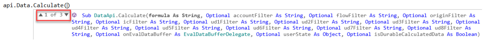

1.Formula with Durable Calculated Data – typically used when writing a simple calculation that requires the calculated data to be stored as durable data. • `api.Data.Calculate(``Formula as String``, ``IsDurableCalculatedData `

```text
as Boolean)
```

2.Formula As String with Eval and User State – typically used when writing a calculation that leverages an Eval, which enables the rule writer to evaluate the individual source cells of a data buffer to conditionally process data cells for a calculation. • `api.Data.Calculate(``Formula as String, onEvalDataBuffer as `

```text
EvalDataBufferDelegate, UserState as Object)
```

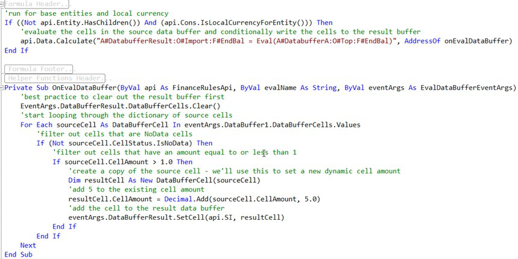

3.Formula with Account-Type Dimension Filtering, Eval, User State, and Durable Calculated Data – this is the most commonly used instance of the `api.Data.Calculate` function and allows for the most flexibility in either simple or  complex calculations. This instance only requires a formula argument and can leverage the filtering arguments. We’ll discuss the details and importance of filtering in an `api.Data.Calculate` later on in this chapter.   • `api.Data.Calculate(``Formula as string,`` accountFilter as `

```text
String, flowFilter as String, originFilter as String, icFilter
as String, ud1Filter as String, ud2Filter as String, ud3Filter
as String, ud4Filter as String, ud5Filter as String, ud6Filter
as String, ud7Filter as String, ud8Filter as String,
onEvalDataBuffer as EvalDataBufferDelegate, UserState as
Object,IsDurableCalculatedData as Boolean)
```

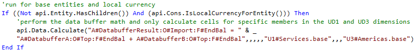

Ultimately, the version of the calculate API function you use varies, based on the situation and complexity of the requirements. Personal choice also plays a factor. In the upcoming sections, we’ll focus on the performance considerations which will lead to the use of the filtering arguments found in the third `api.Data.Calculate` example above.

### Stored Calculations Using Get/Set Data Buffer

In addition to the `api.Data.Calculate `function, the Get/Set data buffer functions are  another leading calculation technique that uses data buffer math to calculate result cells for your calculations. The choice to use one of these calculation functions is based on the rule writer’s personal preference, as there is not necessarily a firm best practice recommendation. That being said, for complex calculations that require conditional cell-by-cell processing, I personally prefer the flexibility and precision that the Get/Set data buffer approach offers. We’ll dive into the fundamentals and abilities of the Get/Set data buffer functions together throughout this section. As mentioned earlier, the Get/Set data buffer technique enables you to perform data buffer math and is similar to the `api.Data.Calculate` function in theory. The technique can be split into  three fundamental pieces. 1.`GetExpressionDestinationInfo `– used to define the result’s dimensionality, aka  the result data buffer, or the target dimensionality to which the calculation will be written. • `Api.Data.GetExpressionDestinationInfo(``destDataBufferScript`` as `

```text
String)
```

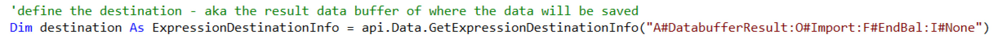

2.`GetDataBuffer `– Overloaded function used to retrieve a source data buffer that is used  as an input to a calculation, or the source data buffer. This is equivalent to the right-hand side of the equals sign in an` api.Data.Calculate` function. (Required arguments in  bold.) • `Api.Data.GetDataBuffer(``scriptMethodType`` as `

```text
DataApiScriptMethodType, sourceDataBufferScript as String,
expressionDestinationInfo as ExpressionDestinationInfo)
```

• `Api.Data.GetDataBuffer(``scriptMethodType`` as `

```text
DataApiScriptMethodType, sourceDataBufferScript as String,
changeIDsToCommonIfNotUsingAll as Boolean,
expressionDestinationInfo as ExpressionDestinationInfo)
```

• `Api.Data.GetDataBuffer(``scriptMethodType`` as `

```text
DataApiScriptMethodType, sourceDataBufferScript as String,
changeIDsToCommonIfNotUsingAll as Boolean,
includeUDAttributeMembersWhenUsingAll as Boolean,
expressionDestinationInfo as ExpressionDestinationInfo)
```

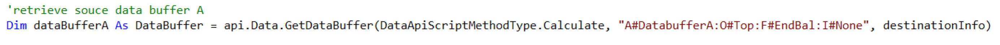

3.`SetDataBuffer` – Used to save a data buffer (collection of cells) to a result destination.  This is equivalent to the left-hand side of the equals sign in an `api.Data.Calculate` function. This API ultimately saves the calculated data. (Required arguments in bold.) • `Api.Data.SetDataBuffer(``dataBuffer as DataBuffer``, `

```text
expressionDestinationInfo as ExpressionDestinationInfo,
accountFilter as String, flowFilter as String, originFilter as
String, icfilter as String, accountFilter as String, ud1Filter
as String, ud2Filter as String, ud3Filter as String, ud4Filter
as String, ud5Filter as String, ud6Filter as String, ud7Filter
as String, ud8Filter as String, isDurableCalculatedData as
Boolean)
```

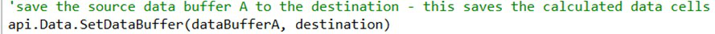

With the Get/Set data buffer technique, you can retrieve source data buffers, perform data buffer math, and write a collection of cells to specific result dimensionality (a result data buffer). When it comes to retrieving the source data buffer(s) that make up the source of the calculation, there is another powerful API you can use to retrieve data buffers and perform data buffer math to facilitate the source of your calculation. The `GetDataBufferUsingFormula ` API function works much like the `GetDataBuffer` API; however, the former provides  additional flexibility and performance tuning by enabling you to define Account-type dimension filtering syntax to further home in on the source cells that are required for your calculation. Let’s review the `GetDataBufferUsingFormula` API below.   1.`GetDataBufferUsingFormula `– overloaded function used to retrieve the source data  buffer(s) of a calculation. This API provides you with the ability to perform data buffer math within one API function and enables you to filter down the source data buffer with the `FilterMembers` syntax. Note that within the `FilterMembers` syntax, the  specific ordering of the dimension filters does not matter. (Required arguments in bold.) • `Api.Data.GetDataBufferUsingFormula(``formula as String``, `

```text
scriptMethodType as DataApiScriptMethodType,
changeIDsToCommonIfNotUsingAll as Boolean,
includeUDAttributeMembersWhenUsingAll as Boolean,
expressionDestinationInfo as ExpressionDestinationInfo,
onEvalDataBuffer as EvalDataBufferDelegate, userState as
Object)
```

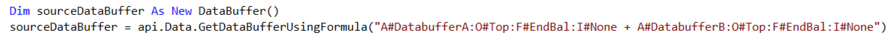

• `Api.Data.GetDataBufferUsingFormula(``formula ``as String, `

```text
scriptMethodType as DataApiScriptMethodType,
changeIDsToCommonIfNotUsingAll as Boolean,
includeUDAttributeMembersWhenUsingAll as Boolean,
expressionDestinationInfo as ExpressionDestinationInfo,
onEvalDataBuffer as EvalDataBufferDelegate, userState as
Object)
```

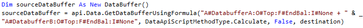

Syntax notes: ordering of the Account-type dimension filters does not matter. When using one dimension filter, square brackets [] are not required around the filter. When using more than one dimension filter, square brackets are required to be wrapped around each individual dimension filter. It’s good practice to get into the habit of wrapping square brackets around each filter.

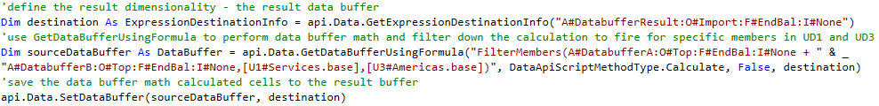

Lastly, another convenience that the Get/Set data buffer technique offers is ease and performance when it comes to cell-by-cell processing. By utilizing a `GetDataBuffer` API  function in your calculation, you query a collection of data cells in memory and now have convenient access to the data cells in the form of a data buffer cell dictionary. With this data buffer cell dictionary object, you can now loop very efficiently through the data buffer cells, evaluate, and conditionally process the source cells based on their cell amount, cell status, and dimensionality. In addition, you not only have the power and flexibility to conditionally include or exclude the source cells that are potential inputs for your calculation, but you also have the ability to dynamically set the result calculated cells’ cell status, cell amount, and result dimensionality. In the example below, you’ll find an advanced example of a financial calculation that uses the Get/Set data buffer technique to conditionally process the source cells of a calculation by cell status while dynamically setting the result calculated cell dimensionality.

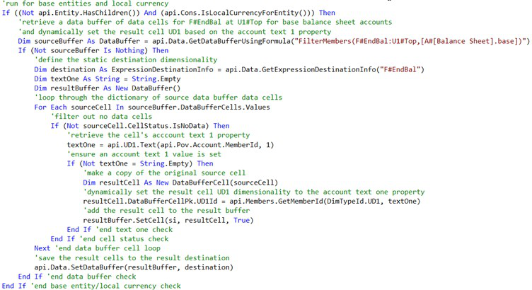

Now that we’ve learned the fundamentals of using data buffer functions to facilitate calculations, let’s further discuss our best practice performance considerations and the tips that you’ll need to write efficient financial rules in OneStream, which will keep your application healthy and your customers happy!

### Stored Calculation Performance Considerations & Tips

When writing calculations, the efficiency of the calculation is nearly as important as the ability to calculate the correct cell values. You might smirk at that statement at first, but throughout your OneStream journey, you will find that inefficient calculations can cripple an application’s performance, especially when working with large data models. In this section, we’ll outline our key considerations and tips to enable you to write performant calculations and promote sound consolidation performance. One of the fundamental laws when writing performant calculations is to always – and I mean always – avoid nesting a calculation within a member list loop. All too often, I see rules that initialize a member list, such as a list of accounts, then loop through the list and ultimately execute a calculation via an `api.Data.Calculate` within the loop. These types of  calculations have the potential to derail the calculation and consolidation performance of an application, especially in large data models. This is due to the inefficiency of looping through a list in code and iteratively executing a calculation over and over for each member in the list; this becomes an awfully slow approach to performing a calculation for a subset of members. In a situation like this, if the member list consists of hundreds or thousands of members, the art of looping through these members and performing a calculation one by one will take an eternity in terms of code processing time. Have a look at the code below as an example of what NOT to do when writing a calculation. In general, avoid executing a calculation within a member list loop – at all costs!

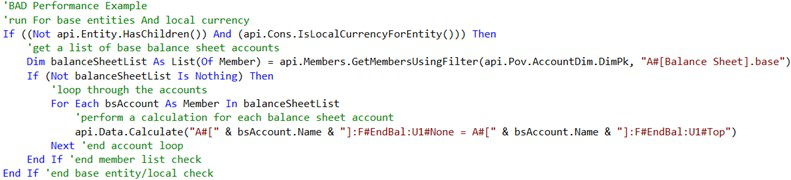

The inefficient calculation in the code above could easily be avoided and optimized by taking advantage of our ability to implement filtering in an `api.Data.Calculate` or  `GetDataBufferUsingFormula` function.    In the code above, the logic is essentially written in a way that filters the calculation to specifically run for base balance sheet accounts. This same concept of filtering can be applied but in a much more efficient manner by leveraging the techniques in the example shown below. Utilizing filter arguments in an `api.Data.Calculate `or the `FilterMembers `syntax in an  `api.Data.GetDataBufferUsingFormula` function are two great ways to filter down your  calculations to fire on specific Account-type dimension members. This filtering technique will assist you in avoiding member list loops and limit the number of cells the calculation is required to evaluate and calculate. Filtering is a fundamental approach to writing efficient calculations in OneStream.

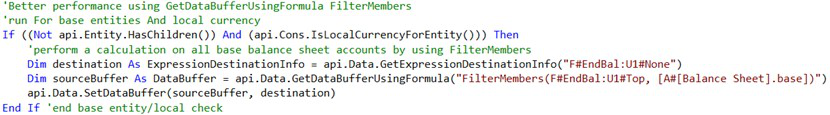

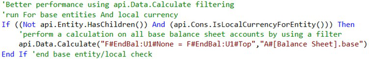

When implementing filtering in an `api.Data.Calculate` function, there are several syntax tips  worth noting. The ordering of the dimension filters is specifically important, and empty placeholders are required for the filters that are between the optional/unused arguments and the used arguments. For example, you may utilize a UD2 filter and not require the use of additional filters or additional arguments in the calculate function. In this situation, your filter would look like the example below:

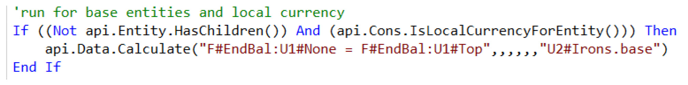

The same concept applies when using multiple filters or a filter argument and another argument such as an Eval. Empty placeholders are required when implementing multiple arguments that have unused arguments between them. However, if additional optional arguments are not used after the last used argument in the function, the proceeding arguments (filters, Eval, etc.) are not required.

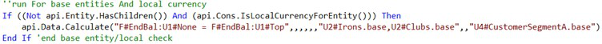

Also, it is important to note that all instances of filtering in an `api.Data.Calculate` and  `api.DataGetDataBufferUsing` formula can use any standard OneStream Member Filter  syntax and valid Member Expansion. The general rule of thumb is that if you can use a specific Member Filter or expansion in a Cube View, you can use it as a filter in a calculation. Lastly, in regards to filtering syntax, the `FilterMembers `syntax is unique and is specified  differently than the filtering defined in an `api.Data.Calculate` function. When implementing  one Account-type dimension filter, square brackets around the filter are not required, and the ordering of the filters does not matter. However, it is my recommendation to get into the habit of using brackets because you will need them when using multiple filters. See the examples below for visuals of filtering within an `api.Data.GetDataBufferUsingFormula` function.

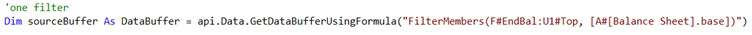

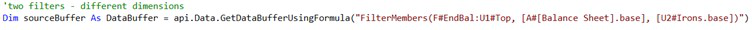

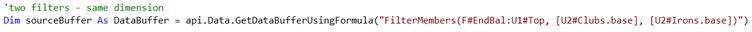

In addition to implementing filtering in your stored calculations, the `RemoveNoData` and  `RemoveZeros` syntax enable you to write your calculations to avoid processing source cells that  are no data cells, or data cells that are equal to zero. Keep in mind, in specific situations, a no data cell or zero cell may need to be evaluated and even written to the database as a calculated value. However, in many cases, you may not have the requirement to calculate these types of cells. The Remove Zeros function is designed to filter out cells that are equal to zero as well as cells that have a cell status of No Data, while the Remove No Data function will simply filter out no data cells. A rule of thumb is to avoid using the Remove Zeros syntax when writing a calculation to a periodic view member, which often occurs indirectly when the scenario being calculated has a default view property set to periodic. Periodic calculations often require zeros to be evaluated and written as derived data to the database. However, in YTD calculations, zero cells and no data cells are often not required to be calculated, and can be avoided by leveraging the Remove Zeros or Remove No Data functions, respectively. At the end of the day, implementing remove functions in your stored calculations can eliminate the wasted processing of cells that are not required to be calculated, as well as limit the writing of unnecessary cells to the database. Both functions can reduce calculation times and improve overall consolidation performance. See the code below for syntax examples on how to introduce the Remove Zeros and Remove No Data functions into your stored calculations.

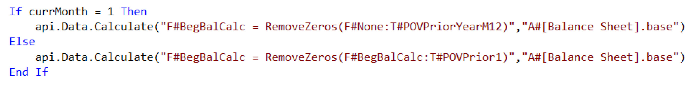

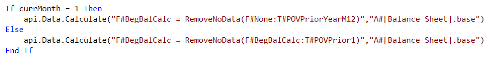

Another very helpful performance tip – when writing stored calculations – is to leverage formula variables to effectively cache reused data buffers in memory. This allows the finance rule or Member Formula to refer to a data buffer in multiple calculations that require the same source data buffer. For example, if you have a requirement to perform two calculations and each calculation requires data buffer math that uses a commonly shared input, the use of formula variables will enable you to retrieve and cache the data buffer in memory once, and refer to this data buffer in each calculation. The idea here is that if a data buffer is going to be used in multiple calculations within the same rule, why query the same data buffer more than once when we have the ability to query, cache it in memory once, and refer to it as many times as we need throughout the rule. The example below contains an example of using formula variables to set a data buffer variable in memory and refer to it in two different stored calculations. Note that the syntax used to refer to a formula variable is the variable name you assign to the object and a prefix of a dollar sign, e.g., `$DataBufferVariable`.

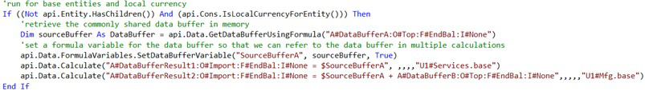

A more advanced derivation of this can be applied by using `GetFilteredDataBuffer`. Since we  are talking about foundational knowledge in this book, I won’t go into a detailed explanation of the function. However, to give you a high-level summary, you basically create and use a dictionary to filter, or get a subset of, a data buffer that you previously brought into memory, and use it in your calculation. Like using a data buffer variable, it prevents you from having to query an additional data buffer since it’s already in memory. Lastly, another must-know and strongly recommended stored calculation best practice is to avoid using BRAPIs in finance business rules and Member Formulas when an equivalent API is available. The use of BRAPIs in finance rules should be avoided when possible due to OneStream potentially needing to open a connection to the database when executing a BRAPI function from the finance engine. In an application with a lot of entities, where multi-threading occurs on a regular basis during a calculation process, the BRAPI calls found in a finance rule or stored Member Formula can open additional database connections for each entity and each rule where a BRAPI is present. If unnecessary BRAPI functions are scattered regularly across many different finance rules and Member Formulas, this could result in an error message during a consolidation that states: max connection pool reached and can ultimately cause database deadlocks to occur during consolidations. When a database deadlock occurs during a consolidation, a CPU thread is required to wait until another database connection is available, which results in a calculation slowing to a halt and causing poor calculation performance. In general, avoid the use of BRAPIs in a finance rule and stored Member Formula when equivalent APIs are available. In this section, we’ve learned the ins and outs of stored calculations, including an overview of the fundamental stored calculation API functions, and reviewed our OneStream stored calculation best practices and performance tips. In the upcoming sections, we’ll review business rule design tips and use cases to further understand how rules are designed and used in an implementation.

## Calculate Versus Custom Calculate

You know what OneStream needs to calculate, so now think about when it should calculate. As highlighted previously, the process holds as much importance in OneStream as the calculations and consolidations. I think we all agree that running a top-of-the-house consolidation each time a user wants to see the result of a calculation on one entity is overkill. Using that concept, running all calculations for an entity each time a user wants to see the result of a specific calculation on that entity is equally as redundant. This is where you evaluate if you’re going to use the calculate or custom calculate function in your business rule. Back to the task at hand – when should my calculation fire? The answer is fairly straightforward; if you want it to calculate every single time OneStream calculates or consolidates a Data Unit (based on the given entity’s calc status), you would use the calculate function. On the other hand, if you want to run a calculation at a specific point in time (i.e., on-demand) and not over and over and over, you would use OneStream’s custom calculate function. This can save a lot of time during the processing of any cube(s), thus enriching the end-user experience. Jon went into detail, previously, and gave a few examples when considering using them during a planning implementation. On the consolidation side, I’ve most commonly seen them used for more complex allocation rules. For example, generally speaking, allocations only need to run if the data that’s being allocated has been loaded. Hopefully, your rule skips the allocation section in the rule if there’s no source data anyway; but, if you wrote it in a custom calculate function, you can have the end-user trigger it when they want to (or even better, bake it into their process, so it runs automatically when it needs to run).

## Designing Member Lists

The member list functions in finance business rules don’t necessarily require a whole lot of forethought. Many lists can be called by simply using filters in your Cube Views or business rules, but sometimes you want more sophisticated lists. GolfStream provides a number of custom lists. The two most common that I’ve used are an alphabetized member list and a ranked member list (e.g., by descending sales for the top 20 customers). Basically, you’ll want to use a member list rule any time you want to add logic to a list that goes beyond what the `where` clause can handle in your Member Filter – listing your dimension  members in a particular order being the most common.

## Designing Translation Rules

Foreign currency translation is common to the majority of OneStream customers. These translation rules allow flexibility and ease the maintenance of the multiple rates at which data may need to be translated. As you already know, when you set up a scenario, it asks if you want to use the cube FX settings or not. Should you not use the cube settings, it asks for the rule and rate types for that particular scenario. Rethink the common, knee-jerk reaction to set up new rate types for each of your scenarios! Let’s talk about a Forecast scenario as an example. The months that are being copied from the Actual scenario are generally translated using the Actual rates. The rest of the year holds Forecast data, and that rate will be different – it could be the Budget rate, the most recent average rate, or the most recent closing rate (maybe it even has its own rate). In any case, I ask the simple question – are the rates you need to use already in the system? In our Forecast example, the answer is yes for the Actual months and – depending on the requirement – could be yes for the Forecast months. If you set up a new Forecast set of Forecast rates, then the administrator (or whoever maintains the rates) would need to enter the Actual rates in two different rate types – the one the Actual scenario uses, and the one the Forecast scenario uses. Instead, we can use these business rules to return the rate we want to use from any rate type, as well as change the rule type on any account type. To do this, you’ll create a finance business rule and use the `FxRate` function. This function simply  analyzes the period and scenario it’s processing during translation and – based on the logic written – goes and grabs the rate from where it’s located in the system. For our Forecast example, the Actual months would use the rate found in the Actual scenario rate type for the period and account that’s being translated. The Forecast months would use a different rate – let’s say it’s the most recent closing rate – using the same business rule logic. Again, all the rule is doing is returning a rate from a rate type, a cube intersection, or it can calculate a rate for you and use it during translation. In addition to the rate, these rules can also change the rule type on accounts. For example, most US customers translate assets and liabilities using the direct method (i.e., YTD balance multiplied by a rate), and revenue and expense using the periodic method (i.e., periodic Jan balance multiplied by Jan rate, plus periodic Feb balance multiplied by Feb rate, plus, etc.). There are exceptions to this; for example, when a customer wants to translate non-cash assets using the periodic method while the rest of the balance sheet uses the direct method. When this has been the case, I have needed to create a rule to change the rule type when translating these exceptions. Overall, it’s important to ask questions to determine how many different rates and rate types will be used across the various scenarios while minimizing the maintenance required for all of them. If the rate already exists, use these rules to tell OneStream where to find it and how to translate it. Sometimes, customers have much more complex translation requirements – ones that may not be solved using OneStream’s out-of-the-box translation functionality. I’ve seen customers use either a UD or the Flow dimension and the translated amounts reside in the local consolidation member. In such a case, they needed to pair this with a translate rule. These types of currency requirements are rare, but we do have several customers who have used this method for their currency analysis reporting.

## Designing Consolidation Rules

OneStream’s standard engine addresses most customers’ consolidation requirements, but what do you do when it doesn’t? There are standard settings on entity relationships that tell OneStream ownership and consolidation percentages and ownership type. You can use these settings to drive your consolidation rules. Turning on custom consolidation does impact application performance, so keep this in mind when determining if it’s required. If your customer just has a handful of entities that can be handled using the standard consolidation, it’s better to use it than to write a bunch of rules. My philosophy is that the best business rule is no business rule. What’s the best way to determine if you can use OneStream’s consolidation engine, or if you’re going to write custom consolidation rules? The first thing to remember is that OneStream utilizes multi-threading – it analyzes all Data Units that it can process at the same time in parallel threads. This can be an issue if you need to process certain base entities sequentially. You’re able to set this sequence using the sibling consolidation pass, so it’s not a definitive reason to write custom

## Consolidation Rules.

A second example might be that a customer has a non-controlling interest balance. Again, by itself, it’s not enough information to drive the decision. Do they load it, calculate it, or book a journal entry? How do they want to handle it going forward? Do they want to see the subsidiary with (or without) NCI, or both? Additional questions to ask should address if they have consolidating or non-consolidating subsidiaries. These answers start to paint the picture and drive you down one path or the other. An alternative to using the entity relationship settings is to use an equity control cube. That standalone cube uses the entity/intercompany intersection to hold the percentages in ownership. This may be the solution in circumstances where you may have layered ownership. Customers sometimes want eliminations to happen on a UD member so they can see layers of the data as it eliminates. Granted, this could be a training topic as the elimination layer already exists on the consolidation and origin members. If the customer wants to see different types of eliminations, then using a UD would satisfy that requirement. Either way, UD members can be easier for end-users to comprehend, so the customer may prefer it in their reporting.

## No Input Rules

No input rules (or conditional no input rules) allow you to protect specific intersections from being imported to via a workflow or modified via forms and XFSetCell. This obviously works in conjunction with the OneStream security model to provide an environment where people can only change the data to which they have write access. The end-users subjected to no input rules still have access to view that data. Granted, data access security (aka slice security) can be employed as an additional layer of security to lock down cubes at a more granular level of detail than just the Data Unit. Sometimes, though, you may not want to complicate your overall security model for just a few intersections. This would be a perfect solution, given the users are allowed to view data but not change it. These rules check to see if the user trying to modify data belongs (or doesn’t belong) to a specific security group. Based on this, it will either allow the user to save the data or not, throwing an error notifying the user of a security limitation. Again, your logic can run these rules based on anything that’s available within the APIs or BRAPIs.

## Designing Dynamic Calculations And Member Formulas

Where do you start when determining what type of Member Formula you should write? You must determine a couple of things: 1. Will the calculated data need to be aggregated, consolidated, or translated? 2. Will the calculated data feed another database, application, or data warehouse? If the answer is yes to either of those questions, the calculation will likely be a stored Member Formula. Because dynamic calculations aren’t stored, they don’t aggregate, consolidate, or translate and aren’t available for extraction via data management or SQL queries. If you didn’t initially discuss this with the customer, and you’re well into your build, you’re not completely out of luck. You can rewrite a majority of the calculations fairly easily as a stored calculation, or you can get creative by providing a Cube View or Quick View of the data, which will run the calculation and use that as your data source to feed your downstream database. OK, OneStream doesn’t need to aggregate, consolidate, or translate the resulting calculation and won’t source the data to any other systems – so do you go dynamic or stored? Performance is the second consideration. Since dynamic calculations run when they’re called, the user waits until those calculations complete, and the Cube View renders. Stored calculations run when the cube calculates or consolidates. Once that data is stored, OneStream doesn’t process any calculations when the Cube View renders; it simply retrieves data. So, it may depend on the volume of dynamic calculations, along with their complexity found on a Cube View – does it take a while to render (e.g., over five seconds)? If it does, you may want to think about changing those to stored calculations. You’ve deduced that performance doesn’t cause any issues on either end, so – again – do you go dynamic or stored? The complexity of the calculation can factor into the decision. I like to break calculations down into different types – percentages, sums/differences, and quotients/products. I break percentages out from the rest because they generally aren’t aggregated and need to be calculated at base and parent levels. Dynamic calculations fit this type of situation perfectly. They’re also easier to write because you don’t need to think about Data Units or any aspects of the OneStream calculation engine. Any dimensions omitted from the code use the members from the Cube View. Next, I analyze the sums and differences to see if it’s possible for these to be handled using an alternate hierarchy. Again, my philosophy is the best business rule is no business rule. Yes, it’s an additional hierarchy to maintain for the administrator, but if I think about future changes, I ask if that person would be more comfortable modifying a hierarchy or business rule. Finally, the quotient/products are pretty straightforward and extremely common, especially in allocations and driver-based planning models. These rules are more complex in nature and require more thought. These types of rules commonly use data buffers and unbalanced math, so it could be possible that writing Member Formulas on every member isn’t the best solution. Now that you’ve decided to write a stored calculation, OneStream recommends following some best practices to ensure performant execution. Start by writing the rule to fire at only base entities and local currency. The consolidation engine takes it from there. If you end up needing it to fire at the parents as well as the base entities, then you can always change it. Second, place importance on the precision of your calculation. You want your rule to fire when it absolutely has to execute and perhaps for specific intersections. For example, you need to write a calculation for an account on three specific UD members. Focus on writing your rule to only fire for the three UD members rather than running it for all of them – pretty straightforward. These two tips will ensure your application calculates, consolidates, and translates with maximum efficiency. I previously mentioned that end-users can drill down on calculated members to see the components of the calculation. Unfortunately, administrators and/or consultants must write the Member Formulas for Calculation Drilldown separately from the calculation Member Formula, which means there are two formulas to be written. Member Formulas for Calculation Drilldown also work for those calculations that are written on a calculate or custom calculate business rule instead of directly on the member. End-users find great value in this feature, so it’s important that you write these throughout the build. It’s easiest to just write them upon completion of the Member Formula or business rules. A final reminder that often frustrated me when I wrote these during my early OneStream days – don’t forget to change the formula type on your member! I can’t tell you how many times I wrote a Member Formula that didn’t calculate due to not changing that property to a valid formula pass. Also, remember that your dynamic calculation members need to be specified as `DynamicCalc` on  both the formula type and account type. One more tip when troubleshooting your stored calculations. If the formula result differs from what you expect, change your formula type to formula pass 16. This ensures that the result calculates last during the calculation sequence. I’ve encountered numerous times where my Member Formula was correct, but a different rule somewhere in the application overwrote my calculation.

## Seeding Rule Best Practices

I can’t name an implementation where I didn’t need to write a seeding rule. These rules provide a starting point in a process by copying existing OneStream data to a new cube or scenario. There are a few ways you can achieve this, some better than others, but they’re all available depending on the customer’s business requirements. When thinking about seeding rules, it’s generally a one-time exercise that establishes a starting point for a given process. That dataset, unless broken down, can be very large; the larger the dataset, the longer it takes (naturally) for OneStream to process it. It’s important to discuss the customer’s vision for the process. As a first step, will one user trigger the process for the entire company, or will individual end-users seed their own data as they start their process? Will the source data change during the forecast process, or will it be locked down to any changes? These two answers give you different ways of thinking about how you’re going to integrate this step into the process, as well as how you write your business rule. To answer the first question, let’s assume the customer wants one user to seed the data for the entire company. You know this may take some time due to the large dataset, so maybe it’s something that is scheduled to run overnight while no one is working in the system. What if there are a number of international users who will still be working in OneStream during the process? Just another thing to accommodate. Hopefully, the source data remains static as the international users are working in other sections of the application. The alternative to one giant load would be to break it down into smaller datasets by allowing end- users to seed their own data as the first step in their process. This way, end-users must wait for their data to be seeded, rather than the entire company’s data, to begin their work. Going a step further, one method that has recently gained traction among customers has been using Event Handler rules to seed all Forecast scenarios once the month has been closed. This technique isn’t more performant than seeding the entire scenario at once, however the end-user perceives that it is. In both methods, the same volume of data is seeded to the Forecast scenario and takes the same amount of total time. By using Event Handler rules, the end-user only waits for a month of data to be seeded because the other months have already been copied when they weren’t waiting for it. Once seeded, the process has started, and the end-users have their starting point. In a perfect world, there’s no need to run the seeding rule again. Since we’re all imperfect, I believe we can agree that both methods need to be flexible enough to perform the seeding process multiple times if needed. However, you want to avoid running the seeding rule during every calculation or consolidation – no one wants to wait for that every time. Therefore, you should write these rules as custom calculations and possibly durable data. Users can trigger the rule via dashboard or data management on demand – regardless of whether it’s one giant dataset or multiple smaller datasets. The next step you’ll want to do is determine how you want to tell OneStream how many months to seed. Some customers use the Global POV for this. Others embed the selection in the dashboard or mechanism where the user triggers the business rule. You could also base this on the specific scenario setting, no input periods, as a third option. This also goes back to the vision that the customer may have as to how they want to complete the seeding process. The last dataset will seed the remaining Forecast months – it doesn’t matter if it’s a yearly Forecast or a rolling Forecast that spans years; you still need to know if those months need to contain data or not. To reinforce the takeaways from the seeding rule process, the size of the dataset (and therefore its processing time) and the desired process will drive how best to configure the seeding rules. That’s all fine and good when the dimensions haven’t been extended, but what happens if you’re dealing with extended dimensions between your source and target? You need to use a data buffer along with the API to convert the extended members to the target dimensions. This only works if your target is at a higher level than your source. If your target is at a lower level than your source, OneStream doesn’t know how to distribute or allocate that high-level number across the lower levels so you must define it in your rule. One last request I’ve seen from customers is seeding commentary or consolidating commentary that’s been stored in the system. OneStream stores comments, annotations, and variance explanations differently than data – in fact, it doesn’t even consider it data. These are stored at specific metadata intersections, and they stay there. They don’t consolidate or translate as it doesn’t really make sense. Imagine consolidating a bunch of variance commentary to a parent entity – you’d see “due to increasing fuel prices, volumes lower than expected, Covid furlough.” Again, it doesn’t make a lot of sense. However, there are customers who still see value in ‘consolidating’ these – like if they want to view all of the comments in one dashboard without having to find each intersection. In that case, there’s a dynamic calc that you can use to show them on reports. But I digress… we’re talking about seeding comments, not consolidating them. Seeding comments require you to write a custom calculate rule to get the data cell annotations and set them on the target intersections. This rule also requires a SQL query to pull from the `DataAttachment` table (again, OneStream doesn’t consider it data). You would then trigger the  rule using a data management job (or dashboard button, or process cube that triggers the data management job). This isn’t a very common request, but it does pop up from time to time and, yes, like most requests, OneStream can do it.

## Dashboard Dataset Rules

When you have the requirement to build a custom report or bound list parameter that uses a data adapter to create a custom dataset that will be viewed in a OneStream dashboard component – such as a grid view, report, chart, combo box, BI viewer, etc. – designing the dataset in a dashboard dataset rule should be your first preference due to a dashboard dataset rule’s performance and overall flexibility. Throughout my OneStream career, I’ve most commonly used the dashboard dataset rule technique to avoid having to write complex and inefficient SQL joins against multiple OneStream database tables to create a custom dataset or data table for a report or parameter. After seeing years’ worth of one-off customer reporting requests, you’ll often find a client may request a custom dataset that will require an intense SQL join on two to three OneStream database tables to produce the required data. The most common driver for performing a SQL join, for a custom dataset, is when you are looking to retrieve the name of a dimension member, workflow, property, or other OneStream artifact in which the name and ID or key exists in different OneStream database tables. Before you fall deeper into the complexity, poor performance, and dilemma of an intensive SQL query using joins, let’s first think of the power that a dashboard dataset rule has to offer. Within a dashboard dataset rule, you have the power and flexibility to craft a truly custom dataset/data table using the power of OneStream BRAPIs. Let’s have a look at the following custom report request below. Let’s say we have a client that has a custom reporting request to create a grid view report that displays information relating to the Workflow Profile to which an entity is assigned within a given cube root Workflow Profile structure. When considering how to retrieve the required dataset, you might have a quick look through the application database tables. Here, you’ll find that the Workflow Profile entity assignment information exists in the table called `WorkflowProfileEntities`. However, you’ll find the initially deflating fact that the data in the  table itself is stored using IDs and keys, both of which are meaningless information to the end- users that will be running the report.

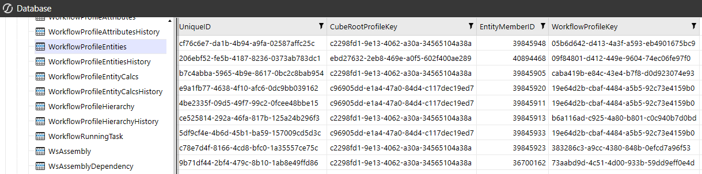

When you find yourself in a situation like this, avoid listening to that little devil on your shoulder egging you on to create a data adapter that performs intensive SQL joins on multiple OneStream tables, such as the `Member` and `WorkflowProfileHierarchy` tables to source the Entity  member name and Workflow Profile name fields. Instead, think of using a much more flexible and performant dashboard dataset rule to go after this missing information. With the use of a dashboard dataset rule, you can design a rule that creates a starting data table by performing a Select * on the `WorkflowProfileEntities` table. From there, we can then  massage the starting data table by creating and populating three additional fields in our amended data table. We’ll ultimately use the power of coding and the OneStream BRAPIs to derive and populate new fields that will contain the entity name, workflow, and cube root profile name information we were originally lacking by converting the IDs and keys to meaningful names. Leveraging OneStream BRAPIs in a dashboard dataset rule to query and derive the missing information is a huge performance saver that will help you avoid writing intensive SQL queries to source the same information. Let’s review the code below as an example of how we can design a dashboard dataset rule to tailor a custom dataset that presents the workflow entity assignment information using the Entity member and Workflow Profile names.

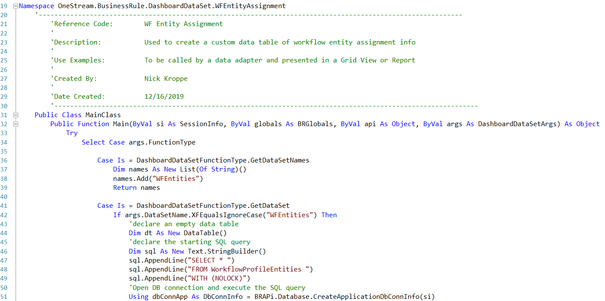

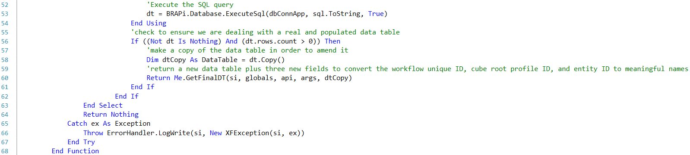

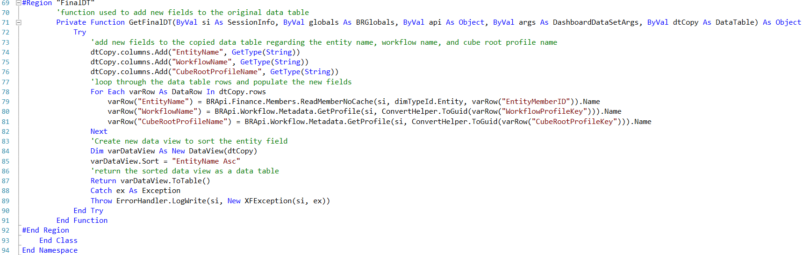

In the code example above, our dashboard dataset rule implements the following principles, which can be used to tailor a custom dataset: 1.Build a starting data table or dataset by executing a SQL or method query. 2.Make a copy of the data table so that you can use coding to massage the data and create additional fields. 3.Add the required additional new fields (columns) to the data table. 4.Loop through the data table rows and populate values for the newly added fields. Oftentimes, this step leverages OneStream BRAPIs to convert specific field values for each row, which will then be used to populate values for the newly added fields. 5.Leverage the DataView object to perform custom sorting, filtering, etc. 6.Return the final data table or dataset, which will effectively be your customized dataset. 7.Leverage reporting techniques to only display the relevant result fields in a report, grid, etc., to the end-user. Furthermore, it is worth noting that it is not required to leverage the starting point results of a SQL query or method query, and a dataset can instead be created completely from scratch by creating rows and columns on-the-fly in your business rule. Please refer to the code below for an example snippet of how to create a data table that consists of a set of rows and columns from scratch on- the-fly.

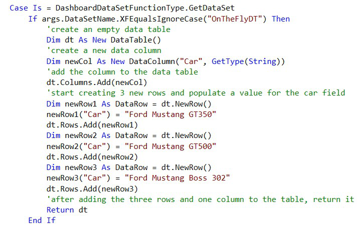

Lastly, you’ll want to consider that the data returned in a dashboard dataset rule is cached in memory, meaning the query will perform more efficiently – versus when running a SQL query written directly in a data adapter. The performance benefits of your custom dataset/data table being cached in memory, via a dashboard dataset rule, should not be overlooked as a report that can be cached in memory will perform and scale across an end-user community much more efficiently in a OneStream environment.

## Designing Dashboard XFBR String Rules

As I previously mentioned, dashboard XFBR string rules can and will be used everywhere throughout your application. I suggest writing one customer-specific rule that contains all functions as a starting point. You can name it whatever you like, but the standard recommendation uses the customer name (or a shortened version) followed by `_ParamHelper`. Many different  Solution Exchange solutions use that naming convention, so it would help you maintain consistency. Once the rule has been created, I like to have the main function call the helper functions that I create in a region further down in the rule. This method keeps the rule tidy and organized, and an administrator can easily decipher and modify it if necessary.

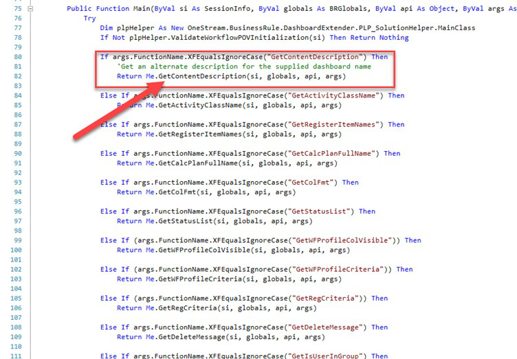

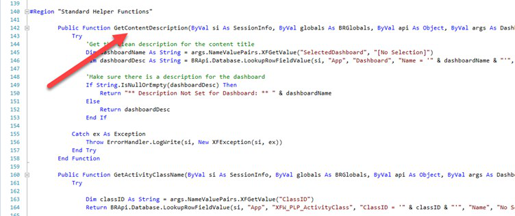

It also helps to write in a comment as to how to call the rule from the component. This ensures that the rule name, function name, and any variables are passed to the rule correctly. You can use these two coding tips in all business rules if you prefer the layout. It eliminates the need for the administrator to sift through lines and lines of code to find a specific section.

## Designing Dashboard Extender Rules

When designing a Dashboard Extender business rule, you’ll need to consider the requirements of when you need the rule to execute. As we discussed earlier, common trigger points for a Dashboard Extender rule include the execution of the rule via a button click, combo box click, load dashboard event, or SQL table editor component save event. In this section, we’ll review two specific use cases of a Dashboard Extender business rule and discuss the design considerations you’ll need to be aware of. In addition, this section will include incredibly useful code snippets that will assist you throughout your rules journey. These code snippets will include examples of setting and refreshing a workflow status, navigating to another workflow, displaying a custom message to a user, and passing values to parameters nested in a dashboard. In the first example, we’ll review a commonly used technique to set default values for dashboard components, such as a combo box or list box component that is nested within the main frame dashboard. When creating custom dashboards – such as a dashboard form that uses combo box or list box components – it is very common for a client to ask for specific default values to be inserted into the components when a user runs the dashboard. To meet this requirement, we can design a Dashboard Extender rule that fires upon the main dashboard initializing, and use an extremely handy `XFLoadDashboardTaskResult` object to  enable us to set a parameter value within the main dashboard. In the snippet found in the example below, we’ll query the user’s Workflow POV profile, and pass in the first entity assigned to the workflow as the default value for an entity parameter (combo box) that is nested in the dashboard called `WFProfileAssignedEntities`. This will ensure that when a user runs the main  dashboard, a Workflow Profile assigned entity is passed as a default value to the combo box used to facilitate an entity selection.

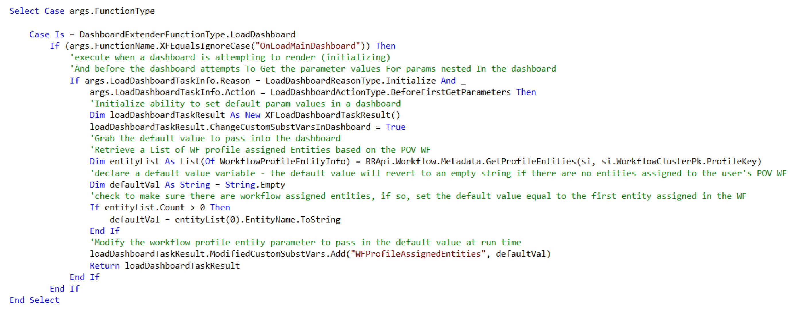

Once the Dashboard Extender rule is designed and written, the rule should then be applied directly on the main dashboard, like the figure below. The implementation of the rule on the main dashboard enables the Dashboard Extender rule to fire when it renders.

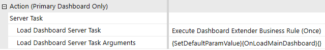

Next, we’ll review a Dashboard Extender implementation example that involves calling a Dashboard Extender business rule directly from a dashboard button component (the most common use case of this type of business rule). As mentioned earlier in this chapter, having the knowledge to design and implement a Dashboard Extender business rule can vastly bolster your dashboarding skills in OneStream. After reading this section, you should be equipped with an understanding and an example of how to design a dashboard component, such as a button, to execute a Dashboard Extender business rule. This rule will enable you to perform dynamic and powerful actions such as setting a workflow’s status, presenting a custom message, and navigating to a specific page or workflow in OneStream. In the code below, you’ll see a code snippet for a use case that facilitates a click action in a dashboard that completes a workflow’s Workspace, displays a custom message to the user, and takes the user to the next workflow step (an input forms step). Once you’ve created the Dashboard Extender rule, you can attach it directly to a dashboard component. In our example, it’s on a button component, as the below examples show.

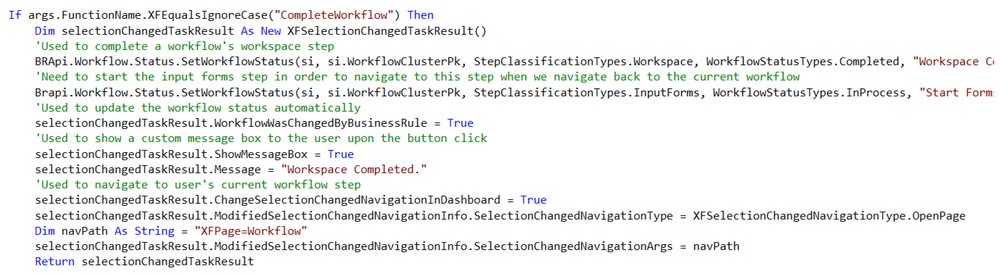

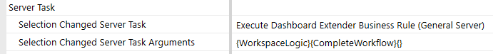

In the figure below, a user is presented with a Workspace step and a simple dashboard with a Complete Workflow button. Note that the workflow has an additional input forms step to navigate to, after the Workspace step has been completed.

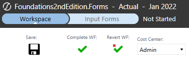

Upon clicking the Complete Workflow button, the Dashboard Extender rule triggers, updating the Workspace to a completed status, and brings the user to the input forms step to start working on their next workflow tasks.

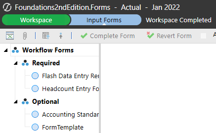

This type of advanced button-click functionality is all made possible thanks to the brilliance of Dashboard Extender business rules!

## Designing Extensibility Rules

In my opinion, extensibility rules are an often misunderstood and underutilized type of business rule in OneStream; they offer a lot of power and convenience in the platform. For starters, let’s talk about the convenience of these business rules. As we mentioned earlier in this chapter, extensibility rules can be split into two different categories: an Extender rule and an Event Handler rule. We’ll begin this section by discussing the role and convenience Extender rules have in the platform. Typically, any time you are looking to automate a workflow, data extraction, or email notification process in OneStream, an Extender rule will be the best tool to facilitate said efforts. Data management jobs and Extender rules work closely together to facilitate automation solutions in the platform. Having the option to call an Extender rule directly from a data management job is ultimately a huge point of convenience because triggering the logic found in your business rule becomes a simple exercise of configuring a data management job. Secondly, to further add to an Extender rule’s execution convenience and capabilities, an Extender rule is the only type of business rule that can be triggered directly from the business rule UI. This ultimately results in an exceptional point of convenience when designing and testing your logic, as you don’t need to set up a dashboard button or data management job specifically to trigger the rule. In the figure shown below, I’ve emphasized the Execute Extender play button that enables you to trigger an Extender rule directly from the business rule page.

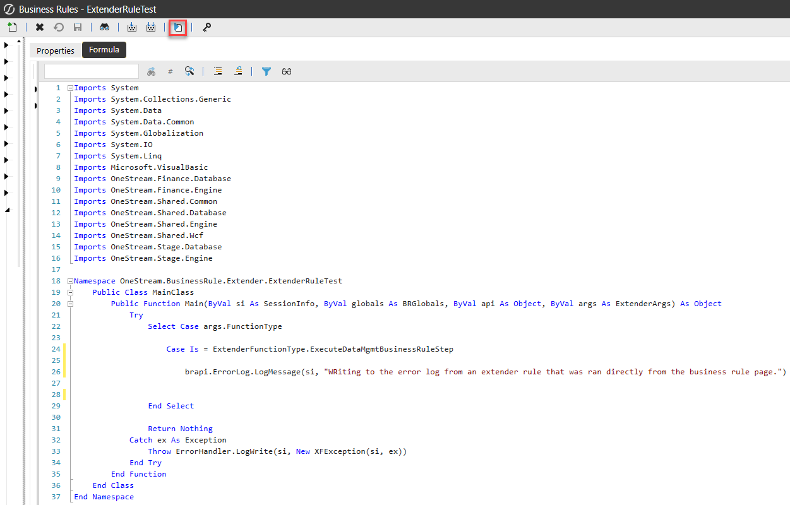

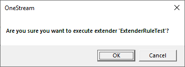

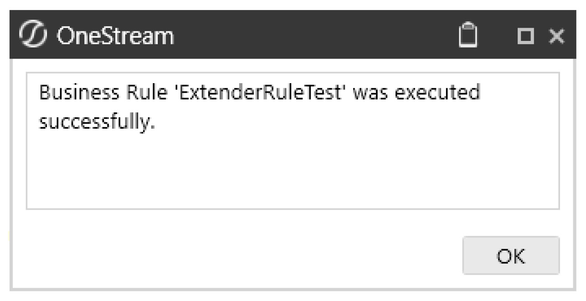

I oftentimes kindly refer to an Extender business rule as a rule writer’s personal playground. If you’re not using an Extender rule to explore and test OneStream’s BRAPIs and coding capabilities, I highly encourage you to start doing so! A quick tip when it comes to designing an Extender business rule is to place your code within the following case statements:


The unknown `ExtenderFunctionType` case statement enables your code to be executed directly  from the business rule (as previously mentioned), while the `ExecuteDataMgmtBusinessRuleStep` case enables your logic to be executable from a data  management job. I highly recommend that you design your Extender rule logic within both of the case statements, as per the code above, to enable your business rule logic to be executable from the business rule page and from a data management job. Next up on our extensibility rules discussion is the rule category called Event Handlers. As mentioned earlier in this chapter, an Event Handler business rule is a specific type of extensibility rule that allows you to use specific events that occur in OneStream to accentuate, block, or trigger other processes within the application. When designing an Event Handler business rule, you’ll want to consider that each specific Event Handler business rule type can only be implemented once in an application, and the name of the Event Handler rule cannot be adjusted or updated. For example, let’s say we have a requirement to trigger an email to an administrator user upon a workflow certify event. The specific type of Event Handler business rule we would use would be called a Data Quality Event Handler; notice that you cannot edit the rule name.


This is an important detail to note, as you will want to be conscious of situations where you may upload an XML file that contains an Event Handler business rule. Because the business rule name cannot be changed, one must be mindful when migrating this type of rule across applications. Before uploading an XML rules file, double-check both the source and target applications to determine if this rule exists in both of them. If they do exist in both applications, the XML load file will overwrite any code and properties of the business rule in the target application. Let’s say that again… if you have an existing Event Handler business rule and you load an XML that contains the same Event Handler business rule, it REPLACES the existing rule. If you’re migrating only a section of the rule, you’ll want to copy/paste the code into your existing rule rather than using load/extract functionality. Lastly, although Event Handler business rules are an extremely powerful tool in OneStream, they can be dangerous from a performance perspective if used inefficiently. When designing an Event Handler business rule, always be sure you are cognizant of when the rule will trigger. Your goal should be to limit and control when the rule will fire to ensure the rule does not fire unnecessarily and will only be triggered when absolutely necessary, as per the business process requirements. A great way to precisely control when the logic in an Event Handler rule fires is to implement `If` conditions in the business rule, much like we do (and preach) in finance rules and stored calculations. Oftentimes, an Event Handler is used to intercept and supplement specific workflow actions, such as a workflow lock, unlock, import, validate, load cube, certify, or un-certify an event. Typically, the events you are attempting to listen for and supplement are only required for a specific workflow, scenario, and/or time period. For instance, you might have the requirement to supplement an import event for the Actual scenario and for specific workflows. In the code below, we have a small snippet of a Transformation Event Handler rule listening for the `EndValidateTransform` sub-event that uses `If` conditions to control the logic to only execute if  the event’s workflow scenario is set to `Actual` and if the Workflow Profile name ends with  `_Load`.


An important tip when it comes to Event Handler rules is to leverage the DirectCast syntax, used in the code above, to cast an input of a particular sub-event to ultimately enable you to derive information about the event. Common use cases of this include deriving the Workflow Profile, scenario, and time information from a workflow-related sub-event as well as deriving transformation information, such as source ID, record count, username, and start time, related to an import or validate sub-event. To determine the valid inputs of a particular sub-event, leverage the API guide to view a visual of all the inputs that you can cast to derive specific information about the event. Check out the figure below for an example of the inputs available for the `EndValidateTransform` sub-event within a  Transformation Event Handler rule.


The OneStream API guide, which can be found by clicking the Help button from within your application and searching ‘API Guide’, should be considered your best friend when designing Event Handler rules. The guide comes complete with an entire section dedicated to event listing, and can be used to understand what sub-events and inputs are available within a particular Event Handler business rule. Lastly, in an Event Handler rule, it is strongly recommended to avoid leveraging a user’s session info object to access workflow information such as the user’s current Workflow Profile, scenario, and time. Tying an Event Handler rule to a user’s Workflow POV is generally not a good practice. This logic and concept can cause issues if using batch processes or process automation. In both examples, the user’s session info Workflow POV may not be a reliable source in determining the workflow information relevant to a particular event. Instead, use the casting technique shown in the figures above to derive workflow information about a particular sub-event; this technique will always be reliable in determining the workflow information an event was triggered for.

## Less Common Rule Tips

Wow. You’ve almost made it through a very meaty chapter. At this point, I’ll tell you that there isn’t a lot you CAN’T do with business rules – being a double negative – business rules can do so much, it can be overwhelming. I’ll cover a few lesser-known capabilities of business rules prior to wrapping up, so you can keep them in your back pocket should the need arise. The first ‘more common’ of the ‘lesser-known’ capabilities is updating metadata via a business rule. Let’s say that your customer has no existing internal process to notify the OneStream administrator when or if a new member is added to one of their ERPs, and a member needs to be added to OneStream. Lame, but we can handle it. You can write a business rule within your Transformation Event Handler to add the missing member to OneStream if it doesn’t exist, but it has its limitations. First, business rules aren’t smart – they just do what they’re told. So, yes, it can add the member with a member name and description (given those two fields are present upon import). That’s where its intelligence really ends. It doesn’t know the hierarchy (or hierarchies) to which it belongs. It doesn’t know what its aggregation weight should be. It doesn’t know the member’s account type or any defaults or constraints. It doesn’t know what all of the text field settings should be. And, in the case of entity, it doesn’t know the most important properties of local currency, percent consolidation/ownership, and security groups. All that being said, you might be asking why anyone wants this in their application due to its limitations. The main reason is to allow end-users to temporarily continue through their workflow process. The transformation will complete successfully; they’ll be able to load data to the cube and continue with their forms and journals. The data at the top won’t be correct until the administrator has a chance to go into the dimension library and move the new member(s) to their home(s), assign the correct properties, and add any necessary text fields. But at least the administrator isn’t holding up the end-user. Secondly, the Globals technique is like the PED of business rules – they optimize processing times when applied properly but can be devastating should you abuse them. The high-level explanation of global objects is that they’re set at the beginning of a calculation, consolidation, etc., and they’re retained in memory throughout the process – readily available for referencing from most types of business rules. As you can imagine, if you’re constantly referencing the same table or data throughout your business rule, querying it each time can take considerably longer than querying it once and then referencing it throughout the rule. These are commonly used when some type of SQL tables and queries are involved with calculations within OneStream. You can write a SQL query and assign the resulting table to a global object. Then, throughout the rule, reference the global object rather than having to query for each calculation. Finally, I’ll leave you with a few easy pointers as you venture out on your own to write some of these business rules. If you haven’t already done it, go out to the Solution Exchange and download Snippet Editor. Seriously, put this down and do it now. I’ll wait… Once imported into your application, you can reference numerous, well, snippets of common code. They appear in the middle window when you have a business rule open. When you select one, it gives you the code that you copy/paste into your rule and change what you need to make it work within your application. I’ve been working with OneStream since 2013 and still use them when I can’t remember the proper syntax.


In turn, use the IntelliSense! As you’re typing out the code, it will give you options in a dropdown that you can select (or hit tab if you’re a keyboard shortcut person like me), and it completes the next section of the code for you.


Additionally, it shows you all of the valid variations of the code. For example, I want to write a calculate statement, and the IntelliSense shows me that I have three options for the properties. I can page through them using the up or down arrows and select the one I want.


To add to this tip, if you find yourself modifying code that already exists, a quick way to get the IntelliSense to show up is to type a comma where it would expect a comma. For example, you need to modify this statement with some filters.


You know that the filters come after the formula, but don’t know the order in which they’re listed. In the next-to-last character in the line – after the double quote and closing parenthesis – enter a comma, and the IntelliSense will show up.


You may need to use the arrows to get to the syntax that you want, but it prevents you from having to re-type out the entire line just to get some guidance.

## Conclusion

Congratulations! You’ve officially taken a drink from the OneStream firehose! Hopefully, this chapter gave you a solid foundation on, and introduction into, our business rules. Not only did you learn the fundamentals of how to write them, but when you can and should use them, a glimpse into OneStream’s rule engine, and general guidance for effective rule writing. It’s not the sexiest chapter to come back and re-read during your next implementation, but it’s definitely one to keep earmarked.

## Epilogue

(Nick Kroppe) One of my favorite memories at OneStream was back in 2015 when the Maersk team visited the newly- built Rochester headquarters for the first time. After a hard day at work, we decided to challenge our jetlagged Danish friends to a friendly game of dodgeball. Well, our friendly game of dodgeball quickly turned into more – next thing I know, I found myself winding up, pulling a Tom Brady and absolutely nailing Kasper and Peter Svendsen in the head with a dodgeball.


Mid-throw, I quickly realized my demise as it dawned on me that I had just headshot two of our colleagues from our biggest and most important customer. At the time, I was as junior in the company as you could get, and I nervously looked over at my boss – Peter Fugere – for his reaction. I thought I was going to be fired, lol, but luckily our Danish friends (and Peter) laughed it off, and we capped off a great night getting dinner and drinks in Clarkston, MI. (Chul Smith) In 2013, I was an independent Consultant staffed on my first OneStream project. I worked at a customer with Eric Davidson, Shawn Stalker, Matt Baranowski, Tony Dimitrie, and Ricardo Rasche. I remember testing out some functionality and thought it could be improved. Those guys told me to email Tom, so… ermmm… okay… I did, and we exchanged a few emails. Later that night (at 2 am), he said that he had recoded the software and it would be in the next patch.
