# Security

Originally written by Jody Di Giovanni, updated by Bobby Doyon In this chapter, we will discuss the areas that you can secure within the OneStream application, and general best practices around setting them up. You will also learn how to ensure that data and objects within the application are secured at the right level, at the right time, and for the right user. You may find, while reading this chapter as well as other sections of the book, that there are various ways to go about securing data and objects, and there is not always a right or wrong way. But there can be times when doing it one way (versus another) that can make administering the application harder down the road! Integrating security into your design and – at the very least – having a ‘security check’ in place to determine how you will implement security as the build progresses, as well as processes as they get introduced into the application, should make applying security a natural part of the implementation. Often, keeping a OneStream security design modest is all that is needed to successfully give all types of users the access they need. This can be done effectively and keep the OneStream administrator’s job of managing security, low maintenance. Yes, there are business cases that lend themselves to complex security designs and OneStream can accommodate these models as well; however, understanding where and when to secure an object, role, and access to data, is the key to flexibility when designing future phases and administrative ease. It is so much easier to add security later, than unravel and rework it because you applied too much out of the gate. Of course, new requirements in the future may require even more complex security layers to accomplish the end goal. What this chapter will not cover is the security design around our Specialty or Solution Exchange solutions. We will touch on items to bear in mind when designing security for OneStream and how it relates to the platform and Solution Exchange solution interaction, but the focus for this chapter is to canvas as much of the core functionality as it relates to the platform itself. In addition, this chapter is not intended to be a ‘how-to’ guide, although you will find examples are provided. These examples are for illustrating use cases and supporting the thought processes behind the design for each of them. For a more comprehensive guide to applying OneStream security and terminology, please reference the Design and Reference Guide. By the end of this chapter, you should have a greater understanding of how to design and apply OneStream security with ease. You will be able to refer to the application and understand how OneStream security flows throughout the product. We will discuss business cases with examples of common types of users and how we apply the different types of access to grant them the access they need. By the end, you will have a good understanding of the application and system security roles and how they can be applied to different objects throughout the application. In addition, you will see how creating groups that are directly applicable to the application’s metadata, when combined with the correct security role access, will not only grant users the desired access, but will also aid in developing a template for adding on to your security model. Along with this, you will take away some tips and tricks for not only setting up security but also for passing on to your administrators so that they can properly pick up and carry on. Look for references to other sections that relate to the specific handling of security under their respective topics in this chapter as well.

## Framework And Environments

Before we begin to look at security design considerations, and how we can achieve the desired end results, we first need to understand where security lives. OneStream’s application security is held in its own SQL database framework. This database is shared by all applications that are in a single OneStream environment. Ideally, customers will have separate environments for production, QA and development, and – in this case – there would be a separate framework database for each of them. You can copy and refresh the security databases when necessary, if security testing is required. Non-production environments may be for admins only and, therefore, only a handful of users should have access to them. As part of the OneStream SAAS offering, clients are provided with two environments. These have separate framework databases and can be secured as mentioned above. Requirements for additional environments can be reviewed and added at the client’s request. Should a company have only one environment with multiple applications for development efforts, then we can secure the applications to a restricted group of users, application by application. Similarly, there may also be multiple production applications in a production environment that are just for a subset of users. In such cases, we would secure the individual applications as well. This is made possible by applying security to the OpenApplication security role. Security roles like this one will be talked about in more detail as we move through the chapter. You can refer to Figure 9.2 for a full listing of application security roles.

### A Heads-Up As You Read Through This Chapter

Here are a couple of quick tips and terms as you read through the sections in this chapter. If you are starting with a fresh application, there are going to be default settings related to security, and two are important to take into consideration so you don’t spend time trying to work around them! One is the user called administrator. You will notice that you can only disable this user – you cannot delete it. You will likely not want to use it or assign it to any groups. Something else to be aware of is the out-of-the-box administrator group. We will discuss how you can have varying levels of administrators (admins, super-users, etc.) depending on the roles they play in the application. However, there are certain key functions of the administrator group, and the biggest is that this group controls security in an application. Essentially, the administrator group bypasses all security settings in the application, and you cannot change this. This often requires discussion and consideration on planning projects that include sensitive employee data. Outside of this role, you can have lower levels of administrator access; however, this one is pre- defined, so bear this in mind when adding users to this group! We will cover the various layers of application security and how it all works together to enable the user to perform the tasks they are supposed to. Application and system security roles are unique and will have specific references on how they correlate to the access we are trying to achieve. Applying security on dimensions varies across the dimension library, with entity having the most flexibility for applying multiple types and groups. The Entity dimension is also where we signal the cube to look for data cell access (often referred to as ‘slice’) security. Scenario will allow for separate levels of security as well, although (most often) the workflow is leveraged for restricting data loads to a scenario. The remaining dimensions have a setting for display access, which should not be confused with the actual restriction of data in that dimension. It will merely restrict the ability of a user to see the dimension member in a member list. Workflow channels, which are tied to the workflow and are generally used for phased submissions (but which can also be used as a way of applying security) are also applied on the dimensions. Both display access and workflow channels are for functional purposes and should not be used as a level of security, as we would think about in our overall design.

## Application Security

As we move through the flow of security in this chapter, it makes most sense to start with how we create, increase, and decrease the access a user will ultimately have. Figure 9.1, below, shows how the user passes through checkpoints as they attempt to do something in the application. If, at any one of these checkpoints, they are not in the appropriate group that allows them to complete that action, they cannot move on to the next area. The security groups that are assigned to each of these respective areas work together to ultimately allow a user to complete some sort of action. This could be anything, from viewing a report, loading data into an entity or entities, building out a set of report books and emailing them out, or managing objects within the application itself (and anything in between!). Let’s think of how this works. A user can be in one or many groups. The group(s) that this user is in will first need to be assigned to the application they are trying to log into. Provided they are in a group that allows them to open that application, they can move on. Next, cube access is verified. Again, if one of the groups that the user is assigned to is at least in the access group of the cube (or cubes) they are accessing, they can move on. With this step and with any other, if they are not, the process stops. If the user is attempting to access data, we move through the full example below with scenario, entity, and data cell access, or ‘slice’ security access groups, in order for them to complete their tasks. Keep in mind that there are many more objects that will have been verified in the application security roles for them to carry out different tasks in the application. As mentioned above, you will be determining and assigning groups to these areas. When working through the design of the application and determining where the data sits, you will be asking how the data is getting there. These are examples of two separate groups that will be relevant for this dataset. One group is the data loaders, and the other is the data consumers. We will look at how and where you need to think about securing this data. Another question you need to think about is when users need to access the data. For the data loader, it is obvious that they need to first access the application and then load it. However, for the user that is consuming the data, when are they consuming it, and to what level? Once it is in the cube? Do they need to drill down on it? Are we limiting any part of that data, or can they see the full dataset as it was loaded? You must assign users to groups and will find that there are times when nesting groups in groups will promote ease of administration. In other areas of the application, however, you will not want to overcomplicate your security design with several levels of nesting. We will walk through some examples of what past implementations have shown us to be proven winners, and how others can pose future implications when you are adding additional phases or users. The key is not to have your administrator or administrators – down the line – inherit an overly complicated process when it comes to explaining access to auditors, or changing how users get access to something should business needs change.

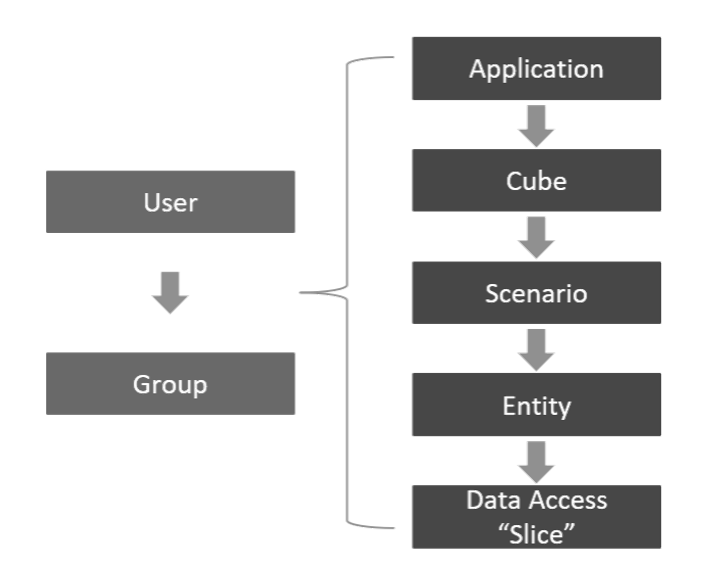

## Security Roles

As mentioned earlier, to get anywhere in the application, a user must first be in the correct role(s). Again, when thinking about the different types of users in the application, you will want to determine who will oversee the different functions in the application. Some companies have view- only users, data loaders, and administrators. Others may have contributors that are in-between, plus roles that require individuals to load exchange rates, update transformation rules, maintain reports, etc., but they are not administrators. Some refer to these types of users as ‘super-users’. However we choose to label them, we can segregate users and their functions by creating groups and assigning these groups to application security roles. As you can see, OneStream allows us to recognize different roles within organizations and apply access accordingly. Furthermore, we can apply role-based access by application. In addition to the application security roles in OneStream, there are system security roles. These roles will determine who can access and manage security- related objects and logs. We will cover this towards the end of this topic.

### Application Security Roles

Application security roles address everything from who can access the application itself, to modifying data, to un-certifying and unlocking workflows, to accessing and modifying artifacts. We will go through some of the best practices related to application security roles, plus some business cases that show how to secure certain roles at a more granular level. One thing that I can’t stress enough is not to get too crazy about securing everything and everyone. Often, you will find that if you map out the functions (roles) of the users and what they are accessing (and when), you can streamline and simplify your security model. Knowing what you are ultimately trying to secure is key as well. And while it may not be evident upfront, assigning the ‘everyone’ access group to a role isn’t a blanket statement that they have that level of access for that object across the application. Role access should work together with specific object access that is relative to the area that users are working with at that given time. Furthermore, object access should work with any additional access related to metadata that the user is associated with. We will get into a few working examples of this when we look at workflow security, as well as other common user access requests. Within security roles, there are two sections. In Figure 9.2, we see that when a new application is created, everything will default to the administrator security group, apart from two roles. These exceptions are for less common activities where we want to make the ability to administer these activities deliberate and by a select group. Therefore, they default to nobody.

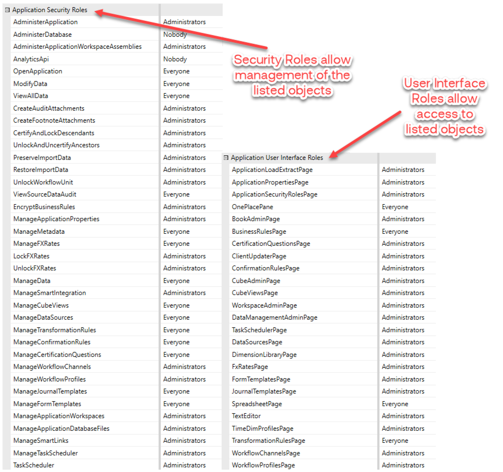

On the left, you see the application security roles. These are roles that allow for access to manage or action something within that item or object (e.g., data, FX rates, dashboards, etc.). On the right are the application interface roles. These are roles that allow access to the object but prevent the management or action of anything within that role. Recognizing how we can give users visibility to objects in the application – while still restricting management access – will be key in any line of questioning as to who will need to view items versus who will need to update them.

### System Security Roles

System security roles are typically reserved for your administrators. Should the application have varying levels of admins, system security roles are applied to the groups that administrators with the highest level of access are in. While lesser levels may be assigned to interface roles, the ability to manage roles should generally be reserved for your administrator functions. For example, within the system security roles, you can limit the number of users that are able to administer security; however, you can still allow others to report on security. By creating a group that allows access to the system pane, you can then assign additional groups, based on role, to the pages shown below, should you want folks outside of your administrator function to view information about users and processes related to the application. This includes, but is not limited to, activity and error logs, access to the underlying database tables, etc. Below, in Figure 9.3, is an example of assigned settings for the system security roles in an application.

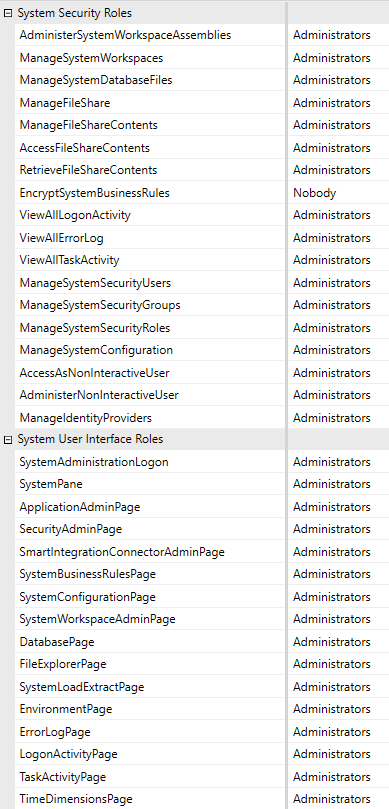

As we get further into this chapter, we won’t be focusing on designing for the system security roles, as these are usually reserved for the application administrators. In the cases where they are extended beyond this group, the configuration involved is not coordinated with the cube or data within it, so there is flexibility when updating or editing this type of access after the initial design.

## Securing Metadata

There are different methods of applying security to entities. Depending on how granular security needs to be, an organization may need to apply security at the entity level, as a 1:1 relationship with a security group. This means that for every entity, a security group would be created and assigned to the read data group and another created and assigned to the read and write data group. OneStream also allows for a second read data group and second read and write data group, where necessary. When this level of granularity is not necessary, entities may be grouped and secured at a parent level. For example, if we are thinking of OneStream’s GolfStream Reference application, and we wanted to manage the security by product line parent, we may see one read group for `V_Clubs` and one read and write data group for `M_Clubs`, where these groups would be applied to  all the Clubs entities in the hierarchy. With either approach, you will see how we apply the write access via the workflow, but it all starts with the entity security groups. To illustrate entity security and how it will work together with our roles, mentioned above, and workflow security and functionality, we will talk through several use cases below. We will also discuss how we need to look at the security on the scenario as well as ‘slice’, ensuring that there are no restrictions on any of the intersections that the user is looking to report on or write data to. All these items will come into play as you are designing your security model and the types of users that will be created in the application.

## Common Types Of Users

In this section, we are going to discuss some of the more common types of users that most companies will have. We will review what roles and additional security rights to consider when creating the groups that will eventually be assigned to these types of users. What should also be apparent by the end of this section is how we can leverage the same groups for different users when access is the same for some areas, and then deviate and apply different, additional roles when more rights are granted. In some cases, we will apply ‘slice’ security when we need to take away partial access to data already granted.

### Administrators

Administrators are the team of individuals who are going to own the application. They can flip all the switches, see everything in the application, and modify data as well. Due to this all-powerful role, you will want to discuss with the business what this means now and in future phases. Designing security for phase one may only mean focusing on Actuals or a financial consolidations project. In this case, having an administrator role with access to the full application is not out of the ordinary. Furthermore, having several administrators in this group may be justified, depending on the size of the organization and other considerations when it comes to administering a larger application. Fast forward to a future phase, or flip this design around, and say phase one was for planning. In this second case, the business may have a different view on who can have this powerful role, especially when sensitive data is involved. Let’s think about the design considerations for both situations and why the administrator function would want to be narrowed down depending on the type of data collection. In scenario number one, let’s imagine we will have an administrators’ group with access to everything. In other words, they will have full access to administer both the application and security. Let’s also assume, for this design, that the group of administrators will be handling all the ‘administrator-type’ tasks. Pretty simple, right? If this is the goal, then the AdministerApplication rolein your application security roles (refer to Figure 9.2) would be set to Administrators. There will be other application security roles that you will likely leave at the administrator group level as well, due to this very simplistic model. The same would apply for your system security roles (Figure 9.3). Where the application applies to the administrator group in the system security roles by default, as well as the system user interface roles, you could leave as is. The users that are defined as administrators would then be in your administrator group, and nothing more would need to be done for them to have full access to the application and system, including security functions. Now let’s imagine the design for administrators is not quite as simple as our first example, and we are going to want an administrator group – just like above – for a select few to handle security, and another application admin group to assist in the management of metadata and FX rates. I’m sure you are already looking back to the application security roles and determining what we can apply security on. The answer to that is just about everything! Application roles can be applied by defining who can ‘manage’ and who can ‘access’. Referring to Figure 9.2, and the roles on the right (which, if you are in the software, are in the top section), we can see who controls the management of objects or processes. By setting a role in the top section to a security group [`R_ApplicationAdmin`], for our roles `ManageMetadata,``ManageFXRates`,  `LockFXRates `and `UnlockFXRates` we are saying that users in this group will have the ability to  add/delete/edit metadata and add/edit/lock/unlock exchange rates in the application. However, just giving them access to manage is not sufficient. They must have access to the page, which is in the application user interface role. Designing for this is key, as you may want users outside of any admin function to access this page in a view-only state, while not being able to change the values. If this is the case, we want to have a separate group on it. This separate group can then be nested in the `R_ApplicationAdmin` group, leaving the interface role open to a  separate audience with view-only access. I want to illustrate this because, in this example, we are showing how two application roles are working together to provide the application admin with access to a page and manage; later on, we can assign the page access to a different type of user. Let’s examine how our administrator access looks in this second design, and how we are still leaving the door open for groups of users down the road who would be allowed to have view-only access to a page. In Figure 9.4, you can see how we have applied specific security groups to the roles we discussed above. The administrators group has been assigned to most of the others, except for other common roles that are left open to other groups, which we will expand on later in other design discussions.

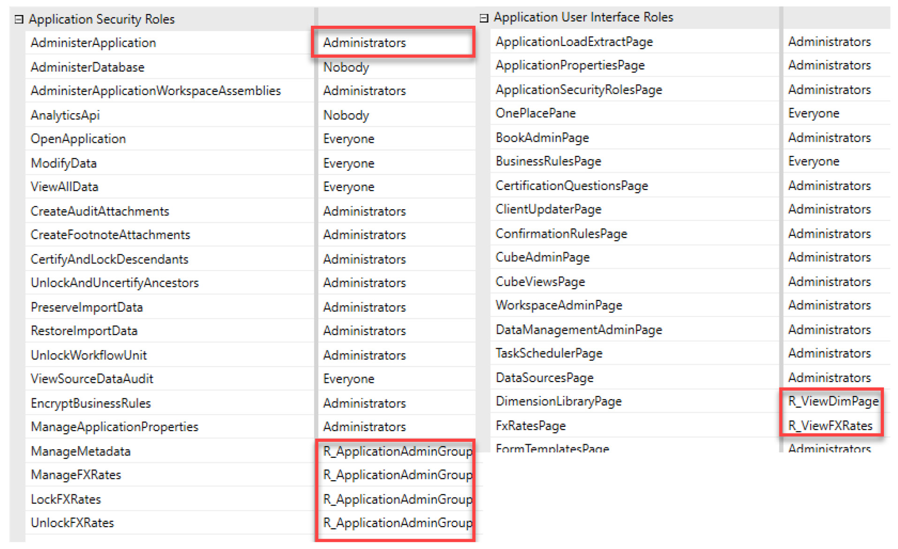

In Figure 9.5, we are showing how the roles work together to provide the intended level of access when the user is added to the right combination of groups. In our example, we could have assigned the user to the individual groups; however, the roles need to work together. So, assigning a group to another group made sense, as one would not work without the other.

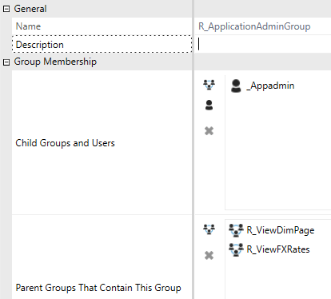

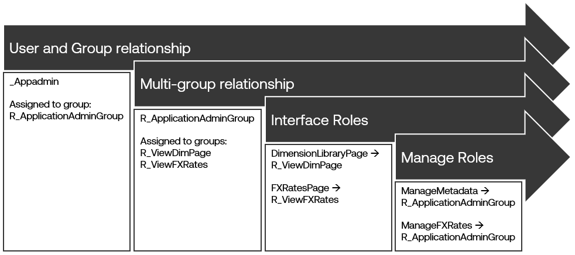

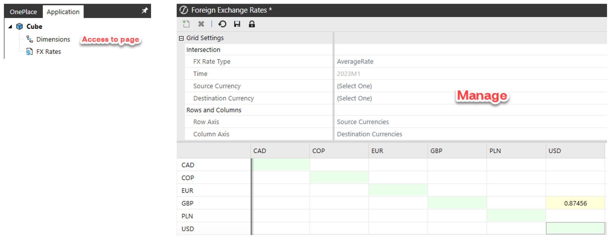

Now, what happens when you work with sensitive data relating to your employees? While I won’t get too deep into our Solution Exchange solutions, in this case I am thinking of People Planning and the register detail in it. This is a worthwhile topic that needs to be planned for. We talk about the administrator group and how it automatically has the ability to add/delete/edit everything to do with security. In theory, this means that even if we change all of the roles in the application that ordinarily default to administrator when a new application is created to another administrator-type group, this administrator group would still have overriding authority. Not to mention, somebody needs to be in it! The reality is that we know there is a need to secure the register detail and – in some cases – this will mean that the administrators’ group needs to be able to do their jobs while still being excluded from having visibility to this information. In order to do this, we use custom Event Handlers and BRAPI calls. When getting into design considerations for Solution Exchange solutions, this is one of many, many considerations and items to plan for when thinking about how security will come into play for a given solution. App admins and super-users can look different from one organization to the next. The key to allowing them to have access to the functions they need in the application – while not creating a tangled web when it comes to their access – is to map this out as with anything else you are designing. Determine if there is a role that can define their function or if there will need to be additional security placed after. If you find that there are a lot of restrictions being placed after the fact, you may be starting in the wrong spot. While the user might be responsible for admin-type functions, maybe they need access to specific datasets first, with increased application access second. If this is the case, look to the object access and different settings that can be found within their key function, before jumping through hoops to create a unique role.

### View All Users

Not to be confused with view-only users who have view-only access to specific datasets, most applications will have a set of users that have view access to all data. View all users may have additional rights that give them more access to data (e.g., modify), or certification rights in a workflow, or maybe super-user responsibility, but the idea is that they have no limits to access the data they can view in the cubes in the application. It is important not to overthink or overcomplicate view all access. This can easily be accomplished by creating one security group and assigning that group to an out-of-the-box security role. The security role is self-administered so that when new entities, scenarios, etc. are added, this security group, and the users assigned to it, will also be granted access. When planning for view all users, the only way you can restrict access to this user navigating to an entity in a Member Filter is by setting the display access to Nobody. However, this will not stop them from accessing the data in the entity should they type in the entity name in an xfgetcell or in a prompt that asks for a freeform entry. It should also be noted that view all users will not be restricted by data cell access security. The main point is, once a user is in the `ViewAllData` group, you cannot restrict the data they can  view. You can, however, grant more rights to specific datasets via the workflow, for example. The topics of display access and data cell access security will be discussed in more detail later. In Figure 9.6, we see our `_ViewAllUser` with view access to all entities in the displayed report on  the right. Again, we can layer on additional access for this particular access, based on their function; however, we cannot limit view access to specific intersections of data because we granted access via the ViewAllData role.

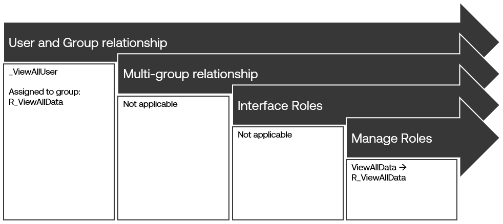

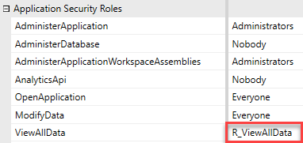

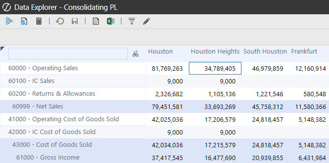

#### Data Loaders

Data loading is tied heavily to our workflow setup, and I will therefore reference Chapter 7: Workflow for best practices on design when it comes to the specific workflow functionality. In addition to the workflow, the user will need to be assigned to group(s) that are permitted the correct level of access to everything they are trying to write to. This includes cube, scenario, entity, account, flow, and all User Defined dimensions that are used in the cube. Some of these dimensions may be set to Everyone (e.g. cube and scenario). Account, flow, and the UDs – while not having the ability to assign a security group to the dimension member itself – may have ‘slice’ security attached. Or, as mentioned before, workflow channels may be in use in the case of account or UD, whereby access to specific workflow channels needs to be checked to load to them. On the latter, these should be considered for functions related to workflow processes, and not for security design. When thinking about your design for security around data loading, there are a few considerations to keep in mind so that there is no unnecessary work being done. As with earlier examples, regarding administrators and view-only users, it is easiest to talk through design considerations and best practices with a couple of examples. These examples will show how security can be controlled mostly through the workflow when a couple of key concepts are followed. Let’s get started by thinking about your data collection. The workflow setup should drive a lot of how your security setup looks here. If you are having data submitted by many locations, and those locations translate into workflows, we will likely be securing at the workflow level. Within each workflow, there may be different levels of security for the varying roles that a workflow allows for. Right now, we are looking at the data loader. Our first use case is for a data loader that needs to load data for two entities which are part of the same workflow. This data loader is not going to have the final word when it comes to signing or certifying their workflow. We first start by thinking about what we are giving the data loader access to, and how OneStream will check the access to ensure they are authorized to pass through all the security checkpoints. Our design and requirements will serve as a process flow for how security will pass through these checkpoints. Again, our goal for this data loader and our other basic data loaders will be to get into the application, access their workflow, import, validate, and load the cube. While there are configuration steps in the data collection process that will be covered in the Workflow and Data Integration sections – Chapters 7 and 6, respectively – we are going to cover what the application is looking for this user to have, in order to get to and pass through these gates to achieve success. On the right in Figure 9.7, you will see the process that the application is passing the user through, and we need, therefore, to ensure that the appropriate access is assigned to the groups that the user will be in. On the left are examples of how this was achieved in this business case. Of course, this is not the only way this can be accomplished. For example, groups do not have to be assigned to other groups; however, where it makes sense and the parent/child group relationship will always make sense, group them together so that when a change is needed, or a new user with similar access is added, you can provision them with ease and little administration.

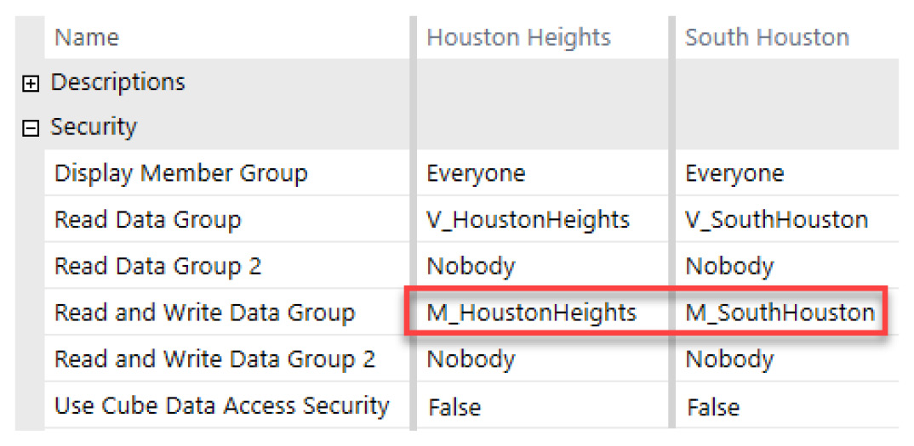

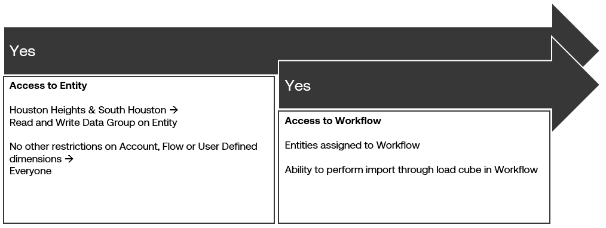

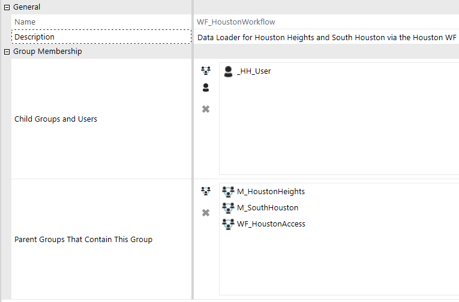

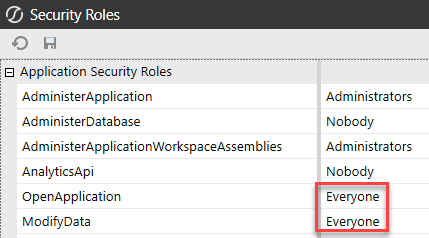

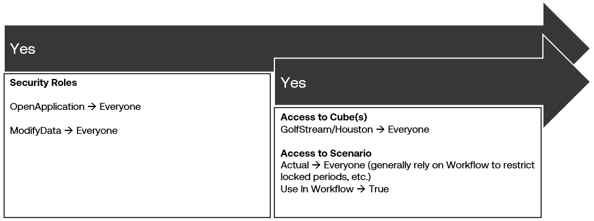

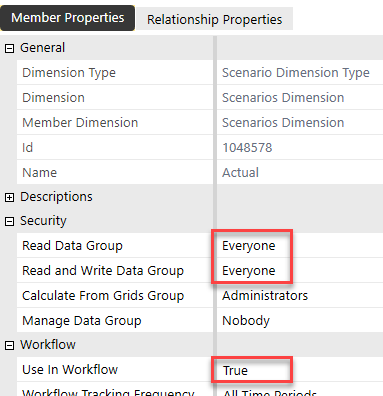

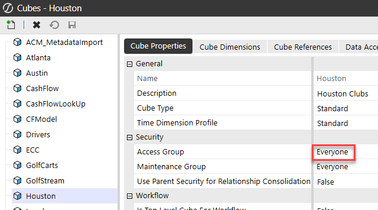

We can take a closer look, in Figure 9.8, at how a user and groups are configured in relation to the workflow. The user is assigned to a single group, `WF_HoustonWorkflow`. The access to 1.  modify the entities and 2. access the workflow are then nested by assigning them to the `WF_HoustonWorkflow` group.

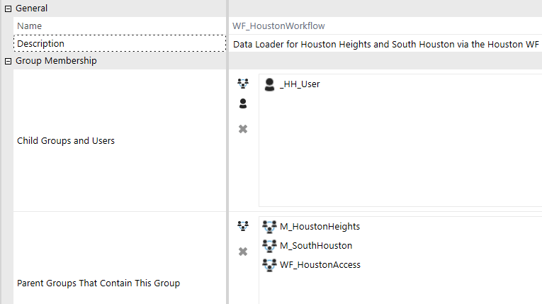

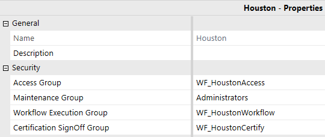

Figure 9.9 shows what the successful data loader looks like in this case. We see the user was able to complete the steps that allowed them to import, validate, and load data to the cube. In Figure 9.10, this same user was prevented from certifying the workflow (greyed out buttons).

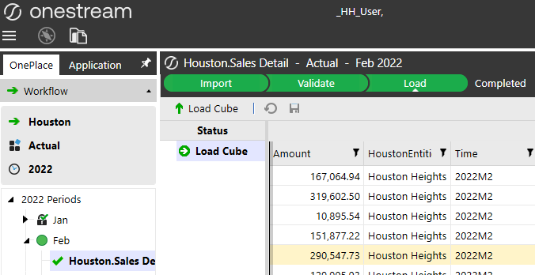

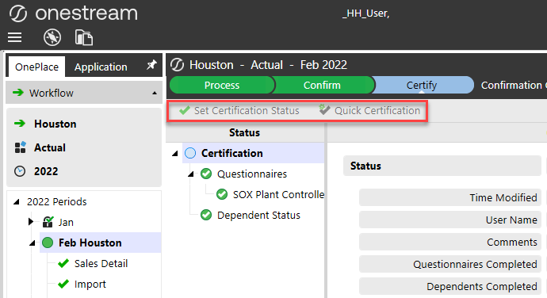

This is a good time to pause and talk about the ModifyData role. You will note that it is set to Everyone in this example. This is not an error nor an oversight. Although this may strike you as odd, this can be set to everyone, providing the items above are in place. There will be additional considerations that need to be determined with different application designs, but due to the way that OneStream checks the access that the user has across the application, you should be able to rely on the security checkpoints in place. These checkpoints will be related to the Data Unit and workflow. We also look at ‘slice’ security, when applicable. To quickly illustrate, we can look at two users that are attempting to load data to the same entity, `HoustonHeights`. The first one is our example above, where we have all of the  roles and proper access working harmoniously together in order to allow the user to achieve the final goal of loading data into the cube for `HoustonHeights`, yet not being able to certify the  workflow parent [`Houston`].   Now let’s look at a second user, `_SH_Houston`, and apply security for the entities  (`HoustonHeights` and `SouthHouston`) and review the workflow security (Figure 9.11).

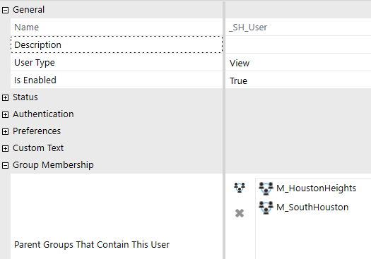

Observe in Figure 9.12 that this user cannot access the workflow to import the data. They can only see the cube root, no workflows underneath. This is because we did not add the workflow group to their ID.

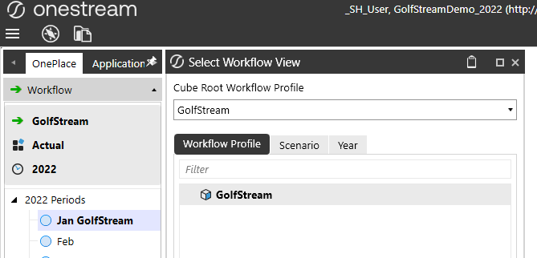

In this case, the user could still access reporting and other items in the application; however, we are using this example to point out the function of the workflow group. Let’s circle back on reporting in just a moment. Another example of security not aligning in an efficient manner would be when the workflow group is added, but the entity access for modification does not align with the assigned entities in the workflow. In this next example, we will add the workflow to the user’s profile, but this time, we will omit the `M_HoustonHeights` group from the `WF_HoustonWorkflow` group. You will  see that the user can access the workflow, and import the file containing the data related to the `HoustonHeights` entity, but will get an error when trying to validate against that entity.

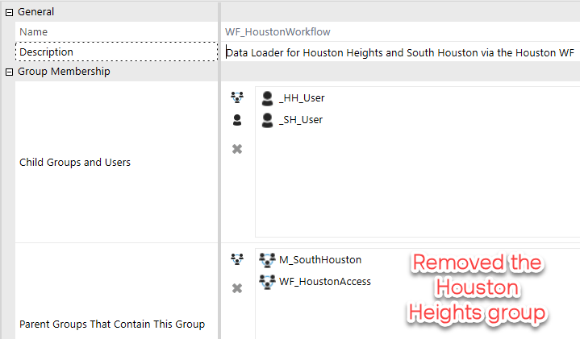

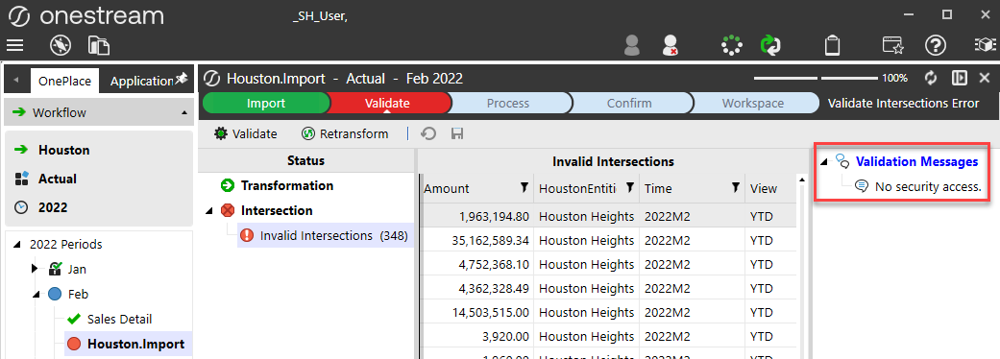

If you look at Figure 9.13, we have removed the entity group associated with Houston Heights read and write (`M_HoustonHeights`) from the `WF_HoustonWorkflow` parent/child relationship.  By doing this, the result is the error shown in the bottom half of the illustration.

#### Data Loaders With Varying Access

Now that we have talked about designing for a simple data loader, and how we can leverage a single workflow group to nest the additional groups that will give the user access to the workflow and modify access to the entities, let’s circle back on what else we may (or may not) need this data loader to do. The use case has now expanded for this user to view the data for another location, which is Frankfurt. However, we don’t want the user to see all the data for Frankfurt. Only the balance sheet data should be visible; the P&L data should be restricted. This will require the use of data cell access security, or ‘slice’ security. Since this is only viewing the data and not loading, we will not address this via the workflow. We can grant the view access to the entity with the read data group assigned in the Entity dimension. We will then leverage a security group that is assigned to our ‘slice’ security to restrict access on the P&L. It is important to note that we cannot grant limited access to Frankfurt by going straight to the ‘slice’ security. Data cell access can only work on the premise that a user has first been granted access to an entity and its data in security. Next, we can decrease levels of access to an intersection, or subset of data, and from there have the ability to increase levels or access to intersections, or subsets of data, all stemming from the original access. Refer to Figure 9.14 to see how the access works together between the Entity dimension, data cell access, and security, and how we assign this to the user.

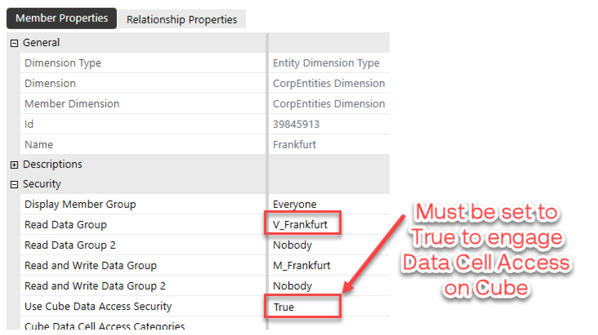

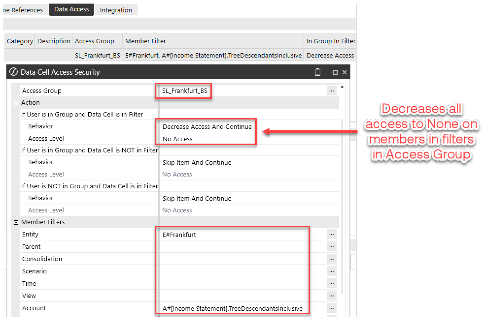

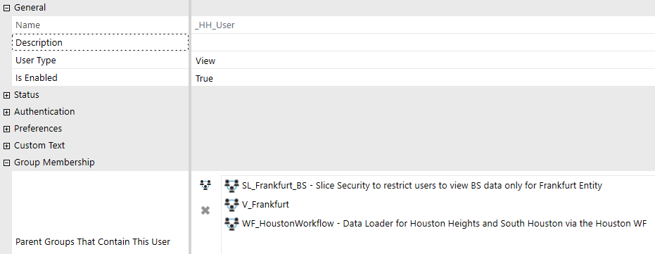

Here is what our user is seeing with the addition of the `V_Frankfurt` group in Figure 9.15 (top)  and then with the addition of the `SL_Frankfurt_BS` ‘slice’ group added (bottom).

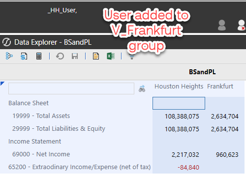

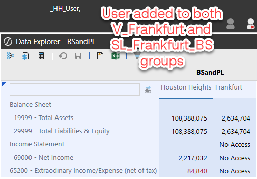

Let’s continue with this use case and layer on additional access as it relates to application roles. Think back to when we were discussing the difference between allowing lower-level administrators the ability to manage, lock/unlock the FX rates, and how we were keeping page access separate from the ability to update the rates. This use case will help demonstrate why designing for this is a good reason for keeping your options open. We want to allow this user to access the FX rates page, but we want to ensure that they cannot update the rates when they are unlocked. In addition to this, we want to give the user access to the Spreadsheet module within OneStream. We will want to allow this user and all users access to Spreadsheet. These two items are easily accomplished because we did not go crazy when we started designing our application security by creating security groups for every role and assigning them one for one. We are creating and designing based on our processes and types of users, how they access the data, and when and where they access the data. As a refresher, Figure 9.16 shows us the `FXRatesPage` role is set to the security group,  `R_ViewFXRates`. In addition, the `SpreadsheetPage` is open to Everyone.

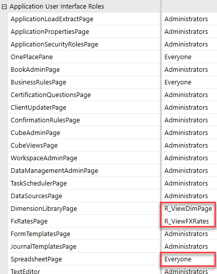

If we add our user to the `R_ViewFXRates` group, we will achieve the expanded access we are  looking for, which can be seen by the user if they click on the Application tab. Figure 9.17 shows that `_HH_User `is now added to the group assigned to the `ViewFXRates` interface role.  Refreshing the app under this user ID reveals that they can now see the FX Rates icon, as well as the Spreadsheet icon on the Application tab. OneStreamPress.com OneStreamPress.com is the website for OneStream Press. Here, you can discover all our current and upcoming titles, read chapter excerpts, learn about bulk sales, pitch new book ideas, enter prize draws, and much more.

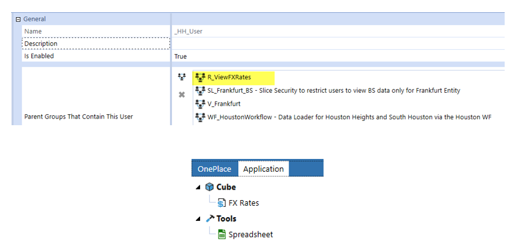

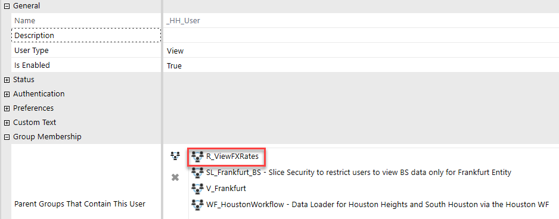

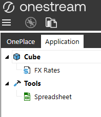

Another example of data loaders with varying access includes journal posting, reviewing, and approving. A common client requirement is to segregate these duties and prevent users from being able to self-post or self-approve their own journal entries. This security can be controlled using the workflow security properties shown in Figure 9.18 below.

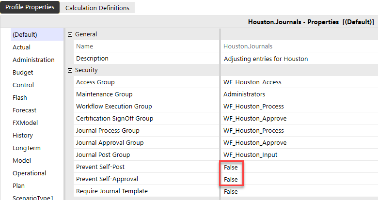

To recap, we started out with a use case for a data loader that needed to import, validate, and load data for a single workflow that had two entities assigned to it. We needed to ensure that they could not certify this workflow parent. We then extended this use case so that the user would be able to view the data of another entity but be restricted to a certain set of accounts. We also added additional role-based access that would allow the user to access Spreadsheet, and view-only access to the FX rates page from the Application tab. Lastly, we added role-based access that would prevent a journal creator from posting or approving their own journal entries. To close out our design, and the requirements for our data loaders, our use case should also have shown you how we can have groups assigned to various types of users for the different functions they perform. The groups, when combined with other groups, give you the flexibility to not only give access to different datasets in the application, but to the different roles that users play as well.

#### View Users With Workflow Responsibility

Now that we have covered our view all users, data loaders, and data loaders with additional view access, let’s touch on varying degrees of access within the workflow. If you read Chapter 7: Workflow, I would venture to guess that you have an appreciation of just how powerful the workflow is in OneStream, and how it will guide the user through processes – as well as where you may want them to enter the application. Workflow has many layers and many places where you will have the opportunity to introduce different components of the application. Most of these processes and components can be secured individually; however, it is strongly recommended that you understand how all of them work together before you start creating and applying security on each of them (similar to how we discussed roles). Over-securing areas in the workflow can create a web that is sometimes hard to follow and, most times, cumbersome and unnecessary. If the design of the workflow considers how users actually access the processes they relate to (and the data involved), then security should be applied when it is required. Our use case this time will be our Houston Approver. They will not need to load the data for either entity that is loaded in this workflow, but will need to certify the workflow parent after reviewing the figures. Let’s think about what this user is going to need to have access to, regarding review and execution. They will need the same level of access to the workflow, but a different level of execution. Our previous group of users loaded data; this user is certifying. In the workflow, we have a separate security setting for this. We also don’t need this user to change any numbers in the entity; therefore, we don’t need them to have edit rights to the entities, only view.

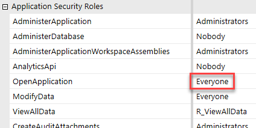

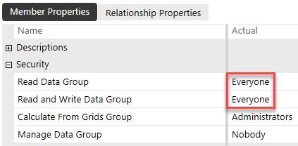

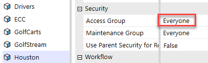

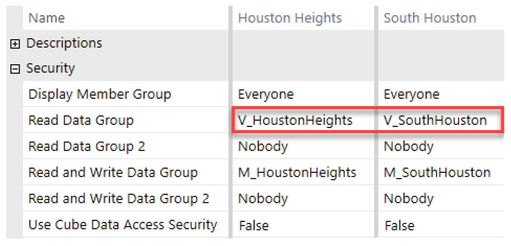

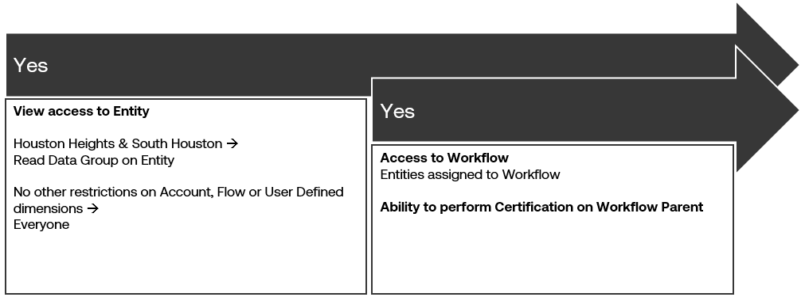

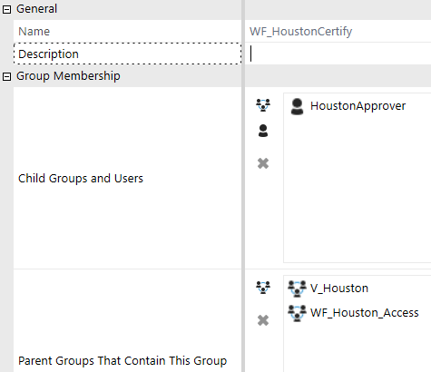

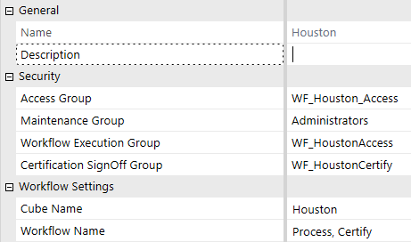

As you can see in Figure 9.19, similar to our data loaders, everything from the roles to the cube and scenario access, right down to the dimension and workflow security – everything has to work together to give this user the right amount of access to perform their work. You can see in Figure 9.20 that `HoustonApprover` is not allowed to import/change data but is  allowed to view the appropriate entities’ data and certify the workflow.

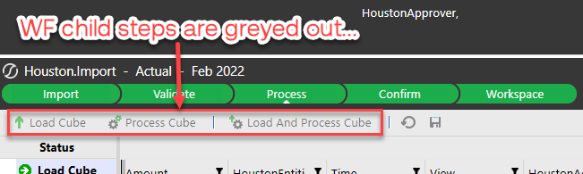

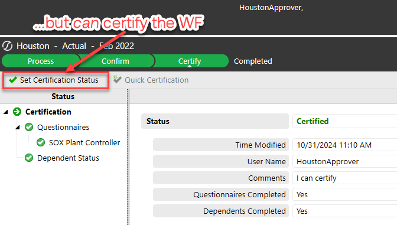

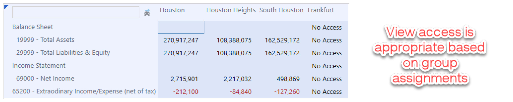

Let’s expand on this use case and say that `HoustonApprover` is to have access to view all data in  the application, but must still be restricted on the workflow responsibilities. If you remember back to the view all data design considerations, we will simply expand on this user’s permissions by adding the security group that is already assigned to our `ViewAllData` application security role.  Once we add the `HoustonApprover` to the group for the `ViewAllData` role, via the security  group `R_ViewAllData`, we see in Figure 9.21 that the user can now see data in the Frankfurt  entity when we rerun the same report.

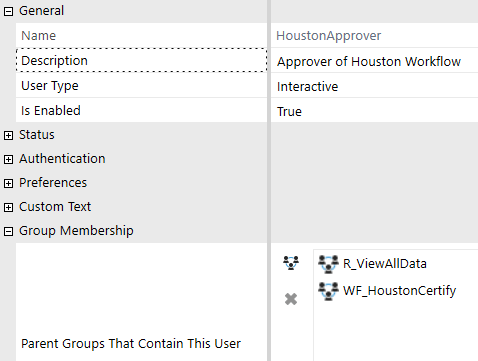

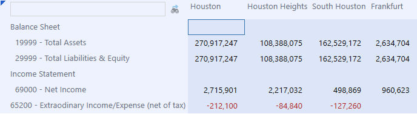

Thinking back to how we continued to expand on our requirements for our data loader, and when we gave them view access to Frankfurt, we circled back and restricted that access to balance sheet- only accounts. What happens if our requirement was the same for the Houston certifier? Could we simply add the same data cell access or ‘slice’ security group on?

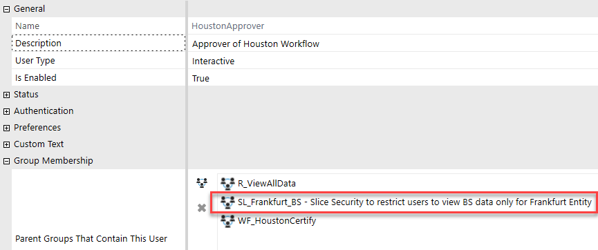

Figure 9.22 Figure 9.22 reveals that by adding the `HoustonApprover` to the `SL_Frankfurt_BS` group, it  does nothing in the way of decreasing their access to the P&L accounts. Due to this user being in a group that is assigned to a role that gives them view all access to all data in the application, data cell access will not apply. For this requirement to be honored, we would have to independently build out the entity access as it relates to view for all of the entities, grant it to the user, and then decrease it based on the dimensions we want to restrict.

#### Relationship Security

For some companies, the user’s access to the relationship members on the Consolidation dimension is determined by their rights to the current entity’s immediate parent. To put this in context, each entity in OneStream has the consolidation members in Figure 9.23 associated with it. The ones inside the box are the relationship members for the parent entity in that view.

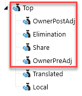

If we now need to design our security with a requirement to base our user’s rights on the access the user has with the parent, we will need to apply a setting on the Cube Properties for each cube we want to enable this setting on. Based on the access we want to give the user, we then need to consider the access they not only have to their entity(s), but we also need to consider their parents and the access we are granting with regard to those relationships. Let’s go back to our data loader use case and pick up where we left off. This user only had access to the two entities they could load – Houston Heights and South Houston – with additional, restricted access to Frankfurt. Our requirement is to control the viewing of the consolidation members based on the access this user has to the parent/child relationship between Houston and its children. In Figure 9.24, you can see how there are no restrictions on the cons members before we make any changes. Next, we will make the change to the cube setting to use parent security for relationship consolidation. Once we do this, and without changing any security for this user, their access to the cons members is impacted. They no longer have access to anything outside of local and translated, which are determined by the user’s rights to the entity itself.

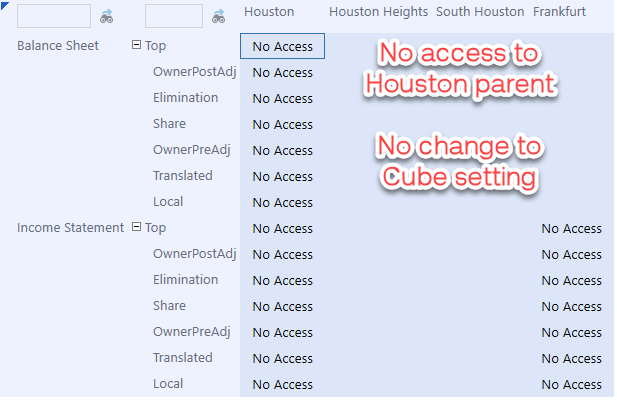

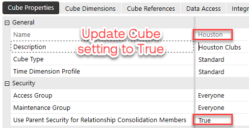

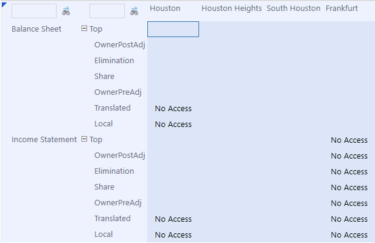

Since our requirement was to have no restrictions for this particular user, we will want to add view access to the parent. We will do this by adding them to the `V_Houston` group. You will see the  access change after making this change (Figure 9.26).

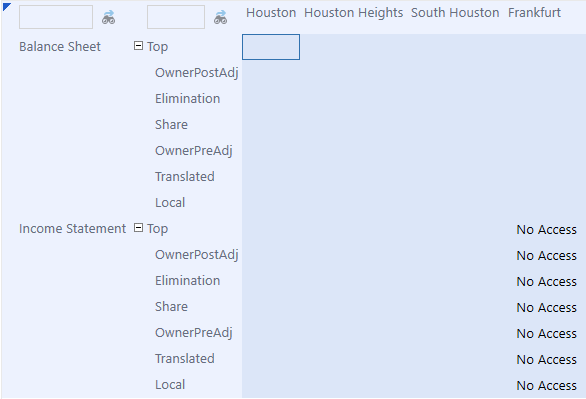

Relationship security can vary from one hierarchy to the next, or from one user to the next. However, as mentioned above, it is a cube setting. Once you turn it on, it then becomes a design consideration for all users outside of administrators and those in the `ViewAllData` role.    The relationship in each hierarchy will need to be reviewed, and if access to all levels of the Consolidation dimension will need to be accessible to a user, they will need to have view(s) to the immediate parent in each hierarchy that this is relevant for. If you are looking to put in this functionality and you don’t want a subset of users to have access to the data of the parent, but need to have the data available at all levels of the Consolidation dimension for the base entity, ‘slice’ security will need to be introduced.

## Access To Reporting For Users

We discussed how data loaders and WF certifiers come in through the workflow, and generally speaking, the reports that will be made available to them through OnePlace, as shown below (Figure 9.27). We can also present Cube Views and dashboards to the user when they are related to specific steps within the workflow process, by creating and assigning profiles. The creation of the profiles is covered in Chapter 10: Reporting. Once the profiles are created, they can be assigned in data quality settings in the workflow configuration to better assist the user in their end-to-end process. We also walked through a use case where a user may not have any workflow responsibilities. However, these users will need to report on data. We can still present Cube Views and dashboards to these users in OnePlace and not have a workflow assignment (Figure 9.27). One thing to keep in mind is not to have any WF references in the reports presented to these users, or they will not run properly. Keeping your reports dynamic and flexible, based on the user, while still being able to adhere to the user’s security permissions is feasible by referencing Cube POV references or parameters utilizing member lists from the dimension library.

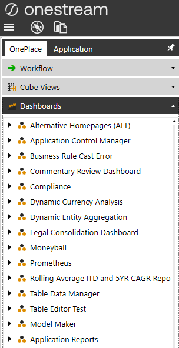

We mentioned above that data loaders, as well as non-data loaders, can access reports in the form of Cube Views and dashboards. When it comes to securing and administering dashboards, you need to think about dashboard groups, which are then assigned to dashboard profiles. Both dashboard profiles and dashboard groups have access groups to which you can assign security access. The profiles are how you will ultimately get the dashboards in front of your users. You can create many profiles and add the same groups over and over, across multiple profiles, in order to create unique dashboard profile groups, which will then be assigned to your user groups or, in some cases, be left open to everyone. You can individually manage the groups under the profiles, but bear in mind the groups are unique to the application, not to the profile you assign them to. In addition to the security, dashboard profiles can be specified where they will be visible in the application. While there will be more information on this in Chapter 10: Reporting, it is worth mentioning here since this is a functional way to secure where you are displaying them. Figure 9.28 shows an example of a dashboard group related to a dashboard profile and the visibility and security associated with it.

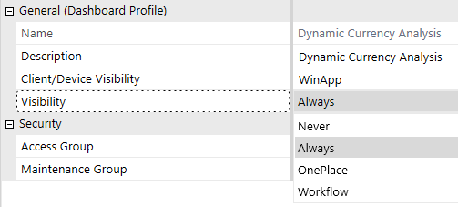

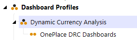

Like how the dashboard groups and profiles are secured and presented to the user, Cube Views will have the same relationship. Cube View groups will be assigned to Cube View Profiles, and the access group is assigned on the profile. Cube View Profiles, like dashboard profiles, also have visibility selection; however, it varies since Cube Views and dashboards can be presented in different areas of the application (Figure 9.28). Another difference is that on the Cube View itself, there is another setting that can be changed to determine if the Cube View will be visible in profiles. This is a True/False setting, shown in Figure 9.29 and Figure 9.30, and changing it to False will remove it from the user’s view in OnePlace and in the workflow presentation.

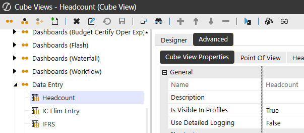

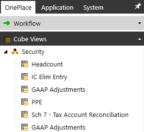

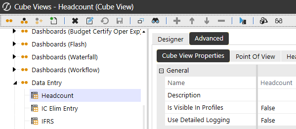

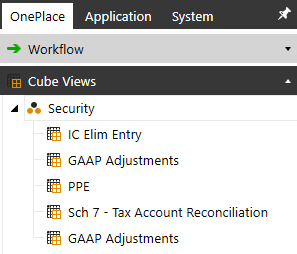

On top of ensuring the correct security is set for accessing Cube Views and dashboards, both have maintenance group security that needs to be addressed on the profiles. Typically, this is an administrative or super-user function since reporting is an area of the application that needs to be heavily supervised when it comes to what the reports are producing. Another area to address in Cube Views is allowing or restricting the ability to calculate or consolidate from a grid. Most times, we have users run Cube Views to display data, not to calculate. However, there are some instances where administrators use the grid view output from a Cube View to run an on-the-fly calculation or consolidation. In these cases, you generally design Cube Views just for the administrators, with this functionality turned on. For the general population and any Cube Views being run for reporting purposes, you would turn this off to limit the number of calculations being run. This last piece of this type of access that allows the user to calculate or ultimately update data will tie back to the scenario they are in and goes back to one of our earlier checks on the scenario security settings. To help tie all this together, refer to the illustrations below to show the object access on a Cube View group, security restrictions on a Cube View, and the security settings on the Actuals scenario (Figure 9.31). Here, you see how to restrict access on functionality; however, we need to realize that there is a need for a data loader to have their data consolidated for their workflow if they are loading multiple entities, or perhaps consolidating a certain parent when their piece of the organization is complete. This can be accomplished via the workflow and is, more or less, behind the scenes. Please refer to the configuration of calculation definitions in the Design and Reference Guide, as this is the best place to achieve this for a data loader.

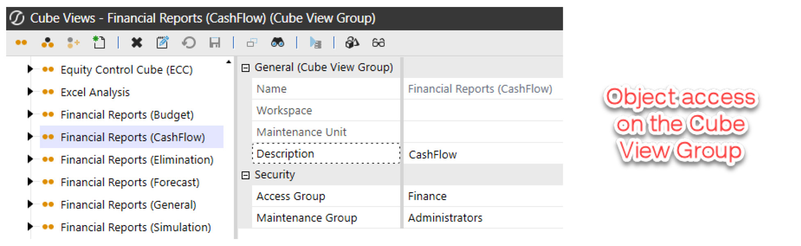

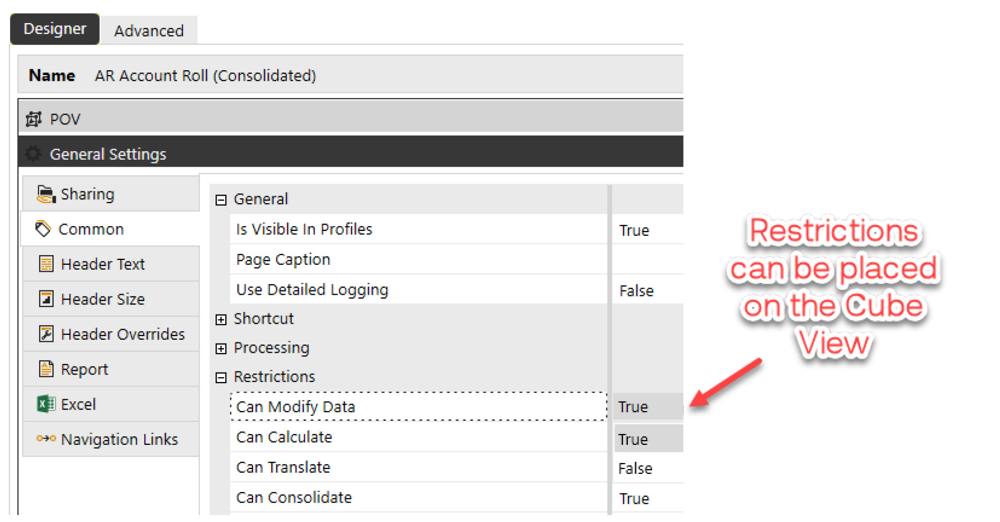

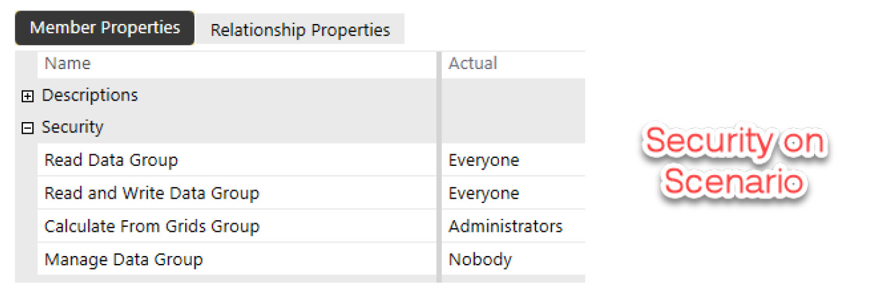

## Additional Items To Note

We have discussed various types of users and security considerations that should be discussed as you are building out your application. As with most things in this software, there are multiple ways to go about designing how the different components of your application will look. Security is no exception! I have gone through common user types in order to speak to the different areas of the software and how security applies to them. There are a few key areas where – depending on what you are securing or when you are securing it – you may find that applying access in the ways I have described is better achieved in a rule. A good example of this is ‘slice’ security. It is possible to apply data cell access via ‘no input rules’. Refer to Chapter 8: Rules, for an example of how to do this. In addition, if you have large amounts of transactional data and your design has taken you in the direction of using an Analytic Blend model with underlying blend tables, you will still be using OneStream’s security related to the workflow. However, from there, you are restricting the data users see (related to what they are able to view, based on the relationship blend data they are presented with). There is more information on this in Chapter 12: Analytic Blend. There are also ways to limit the information presented to users by leveraging text field properties in workflows. Using these, in conjunction with references to dimensions, you can limit the information that is on a form, for example. This can limit the need to create additional security groups for ‘slice’ security, if the form supports this type of reference and the workflow is configured correctly as well. If you have a need to restrict the scenarios that are available to your users in the workflow, be sure to design and build out your application with the workflow suffixes in mind. These are settings on the individual cubes under Cube Properties. These are very important and need to be set at the beginning of an implementation and, most importantly, before any data is loaded to the scenarios. Please refer to Chapter 7: Workflow for a more in-depth explanation on this topic. In summary, the above are configuration items that can secure access to data, without the need to over-apply security. It is important to understand what functionality is available in the workflow, reporting, rules, and all additional components of the software, so that the design and build of the application is configured in a way that the security is applied with those same considerations in mind.

### A Deeper Dive Into Data Access On Cubes

Circling back on ‘slice’, data cell access can only work on the premise that a user has already been granted access to an entity, and its data, before access is decreased to an intersection; from there, there is the option to increase levels of access to different intersections or subsets of data. Earlier, we discussed how to decrease access on an intersection where access was already given. Sometimes, we find that we grant access via our conventional security model, then we need to take away access in large chunks before giving back specific intersections across the cube(s) in an application. This is where the order of ‘slice’ security becomes very important. When you know you will need to design for this type of security, plan for it carefully because the order in which you apply it, decrease it, increase it, etc., will ultimately determine if it is meeting the organization’s needs.

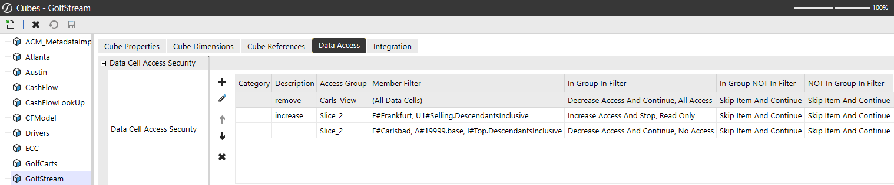

In Figure 9.32, we see three lines of data cell access ‘slice’. `Slice_2` group is being applied to  both the second and third lines; however, the users in this group will never make it to the third line. This is because we apply this access in order, and by what the filter is telling the application to do. In this case, the filter on the second line is saying if the user is `In Group In Filter, ` `Increase Access and Stop, Read Only`. The `Stop` action tells us not to look for any  additional ‘slice’ security for this user. This is where the order and the actions in the filter are very important. Also, note again that the dimensions that you are designing slice around, need to be applied on all of the cubes where those dimensions exist. Data cell conditional input should not be confused with ‘slice’ security, as you are not designing this with specific users in mind; this impacts EVERYONE. Data cell conditional input is generally used when you need to set conditions around input for a particular intersection. Quite often, we see time introduced here. As with most historical input, data is loaded into accounts or unique dimensions that are used for past reporting and are no longer valid for input. Once data tie out exercises are complete, you can then restrict access to accounts, flows, etc., that are no longer in use.

## Conclusion

By now, I hope I have convinced you that you should be planning your security model as you plan out your processes (including workflow), metadata model, reporting, and – of course – types of users. Certainly, there are more items to design security around, but these are the essentials as we think about contributors, consumers, and admins. By going through the use cases in this chapter, I hope I have illustrated how the different types of security are applied – and work together – so that there is no need to over-apply security in an application. By designing security in a consistent manner, the handoff of security to your administrators should be relatively easy. Consistent naming conventions, which you may have picked up on (above), along with keeping to a reliable methodology, will be key. Remember to look for security-specific references in other chapters for more detailed design guidance relative to each of those areas.

## Epilogue

It’s not often you can say a company has an ‘all hands on deck’ mentality and can back it up. Throughout my years here at OneStream, I can honestly say that I have been a part of, and witnessed many times more, where this has been the case. A gentleman in this picture has been known to say in many meetings, “We aren’t perfect, but we will work together to make it right.” Here is my crew, and while none of us have worked in the same department together, we have worked numerous times on the same project to ensure that we maintain our mission of being 100% referenceable!

