# Excel And Spreadsheet Reporting

Originally written by Nick Blazosky, updated by Nick Blazosky If you’ve made it this far in the book, congratulations! You are well on your way to creating your very own OneStream application. By now, you should have a fair amount of shape to your application. Dimensions, business rules, workflow, Cube Views, and – hopefully – some data to start tying everything together. But even the best-designed applications, with the most sophisticated rules and a voluminous dataset, are not fully ready unless that data can be represented in a meaningful and concise way to your finance and business end-users. In many cases, despite the plethora of other reporting options, folks in finance like to create reports in Excel. You could have taken 30 data sources in 100 different currencies and consolidated and translated them, but without having a way to view this data in the format your business partners want to see it, you might as well be speaking to them in a foreign language. It may seem silly – you did the hard work – why am I stuck in a meeting talking about the shade of blue on this report? You said blue, right? How was I supposed to know you meant cobalt?! Back on one of my many field consulting engagements, I remember working for weeks on a specific calculation, creating a 35-step waterfall allocation of Budget data to replicate a downstream general ledger allocation. After the meticulous validation of every step, I remember finally reaching the point where I was pencils down, and I proudly announced that my work was complete in one of our team’s calls. Well, that was short-lived, as I was asked to show my work. I stumbled around in the guts of a financial business rule, various logs, and finally a simple report – showing that my starting amount equaled my ending amount – showcased the fact that my rule was successfully allocating data on these 35 steps! The client, understandably, was not impressed. The academic part of the exercise may have been completed, but without the proper report, it had zero value. The data was not digestible by the folks who I was building this for – the folks who were consequently signing off on my hours for the project. If you have ever been in that situation, or you are new to CPM or the OneStream ecosystem, this chapter is for you. In fact, I wouldn’t be surprised if you reviewed this chapter at some point before reaching this point in the book. The concepts we are going to describe are paramount for not only your business partners to get data out of OneStream but are equally helpful in your own efforts to validate data along the way. I’ve also written this chapter to be helpful for those who, frankly, may not care or will not be doing the heavy lifting with regards to complex rules, FX translations, workflow, and all the other hard stuff you need to get the application up and running. Business partners and consumers of OneStream data, this chapter is as equally for you as for the technical architect combing over 100 lines of VB. These ad-hoc Excel reporting skills can be mastered by all. There is no better way to learn about a OneStream application than by having to write reports against it. In my first job out of college (I was working as a consultant for a very large telecommunications behemoth that, at the time, was based in San Antonio, TX), I had no idea what this product called Hyperion Financial Management (HFM) was, or even the problems that it solved, but I was asked to author Financial Reporting (FR) reports. It took a few weeks, but working in a converted broom closet with nothing but Google University and some legacy reports that were printed on green and white continuous paper, complete with perforated tear edges, I finally started to grasp exactly what HFM was reporting. To all the other folks working in converted broom closets who have no idea what OneStream is, this chapter is also for you. After reading this, and with a little practice, you too will be able to create reports worthy of replacing those dot-matrix reports you were given!

## Understanding When To Use Excel Or Spreadsheet, Cube

## Views, Quick Views, And Table Views

Have you ever been to the grocery store, and your wife/husband/partner/passive-aggressive roommate asked you to pick up tomato sauce? Seems like a simple thing. “I need two 8oz cans of tomato sauce for a recipe.” Easy, I got this. So, as I’m wheeling my cart down the aisle, I see all the various canned tomato products. But wait, there are a lot of varieties when it comes to canned tomato sauce. Do I want to get the HEB brand or should I shell out the extra nickel for Hunts? Wasn’t it my mother’s Italian friend who said she always used Contadina? Oh wait, there is this new one from Italy, and something called passata that is like tomato sauce, at least according to Siri. Too adventurous? Yeah, probably, I’ll just go with the Contadina. Now, should I get the organic (are tomatoes on the dirty dozen list)? Siri, are tomatoes on the dirty dozen list? Organic, good. What about with basil, garlic, oregano? No salt!? Soon, you notice people in the store are beginning to turn their carts around in the middle of the aisle, mothers grabbing their children by their shoulders and instructing them to go down any other aisle – Any. Other. Aisle. – even the candy aisle. Why? Because you are there juggling four 8oz cans of sauce, mumbling to yourself, and debating the merits of each. As you slowly descend into madness, you finally snap and start piling a dozen cans of tomato sauce into your basket in the hope that this will satisfy the requirement for whatever dinner consists of. So maybe this is the extreme example; hopefully, you were better prepared at the store than I was, but the concept of choice presents us with an interesting paradox. We like choice, but we are always afraid that with choice, we might make the wrong decision. Which is possible because, in this case, my recipe really needed tomato paste, not sauce. You live, you learn. When it comes to ad-hoc reporting in OneStream, you’ve all seen the demo and read the guide (right?!) about various ad-hoc reporting methods. But which one is for me? We are going to approach the next section as a sort of decision matrix to help you decide which tool is right for you. The more you understand what each tool does and doesn’t do, the better equipped you are going to be to make the right decision when using ad-hoc reports. Let’s walk through the Excel and Spreadsheet reporting options and try to understand which is the right tool for you. We are going to start at the macro level and get more specific as we go along.

### Excel Or Spreadsheet?

There are two primary ways to create ad-hoc reports. One is through traditional Microsoft Excel using a COM-based add-in that is physically installed on your individual computer. During this chapter, we are going to refer to this as the Excel add-in (see Figure 11.1). The other is embedded in OneStream and looks and feels like Excel, but it’s not Excel. We call this Spreadsheet, and it offers Excel-like functionality, delivered inside of OneStream.

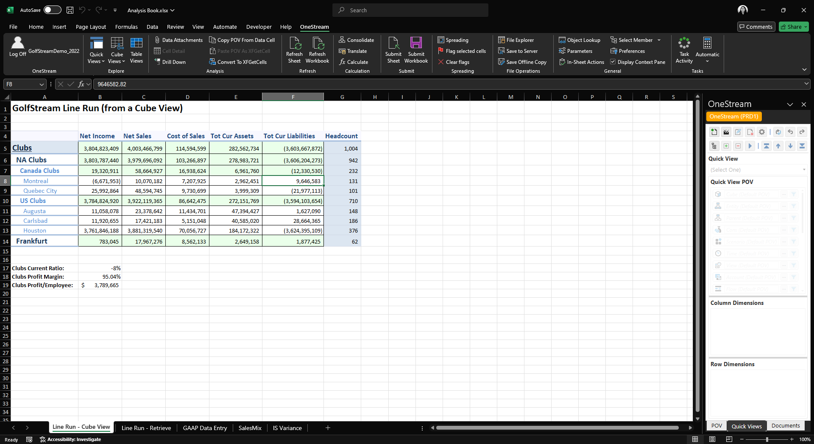

Let’s talk about the Excel add-in first, and when you might consider using this. First, it’s going to be a nonstarter if you, or someone in your IT department, does not have administrative rights on your computer to install the add-in. Think of your user community as well. If they don’t have those rights, or your organization has a policy against these types of add-ins, then let’s just say that this option is not for you. The other thing to keep in mind about the Excel add-in is that it requires patching and updates. As you update OneStream servers with the latest version, you and your users are going to have to make updates to your individual machines and install a new version of the Excel add-in. It’s a very simple update, but an update, nonetheless. For you, the administrator, and your immediate team, there is no reason you shouldn’t have the traditional add-in, but when you are talking about rolling this out to 500 users, you might take a pause. Maybe I don’t want to administer this for that many users. If that’s the case, consider the Spreadsheet option. Spreadsheet (Figure 11.2) is your other option for creating rich, ad-hoc reporting using OneStream data. It looks and feels like Microsoft Excel, with a few exceptions. The first two to note are that you can’t run macros using Spreadsheet, and the number of shortcuts or hotkeys is slightly more limited than traditional Excel. A third consideration is that as of version 8.4, Spreadsheet’s functionality via the Modern Browser Experience (MBE) is catching up to that of the Windows application. For example, it currently features limited chart types and formatting options but lacks Quick View functionality. Our product team continues ongoing Spreadsheet development for the MBE. The Spreadsheet examples shown throughout this chapter have been done in the Windows client. You can read more about the MBE at documentation.onestream.com. The good news is that getting the OneStream Windows application is easy and doesn’t require you to have administrative rights on your computer in order to install it, nor does it require a separate update. Once on the OneStream servers, or in a managed cloud environment where it’s done for you, there is no need for a secondary update. It’s a great option when you are looking to get the power of Excel ad-hoc into the hands of many users without worrying about crafting an IT strategy to support the roll-out of an installed COM add-in. Table views are designed for reviewing, reporting, updating, and inserting new records into relational tables associated with the OneStream solution. The key word is relational tables. This is not the OneStream cube data. Think Specialty Planning data, or raw data used for the close and consolidation. Now, there are lots of ways to report or update this relational detail inside OneStream that we have discussed in previous chapters, so this is not the only way to get this detail. For example, you can use a BI viewer component that is linked to a data adapter in order to query the relational detail. This functionality is not unique, but you may find that this might be the easiest way for your end-users to internalize this relational detail. After all, it’s essentially an Excel interface allowing you to query and update this data. With table views, you must create a business rule in order to limit the query and control what actions you can take with the relational data. In other words, what tables you can query, what fields can be updated, and where you can insert new records. We are going to discuss this in more detail later.

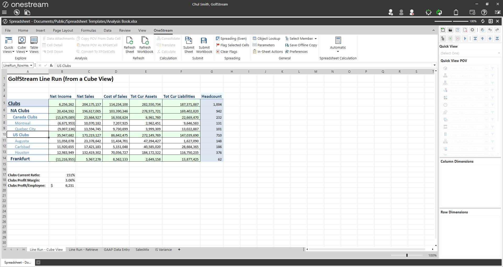

Spreadsheet files are also stored a little differently to Excel add-in files. In traditional Excel, you must save the file to a local or shared drive that you have access to. In most cases, when you create an Excel add-in file, it will be stored locally on your computer. However, since the Spreadsheet tool is embedded in the application, any file that you create can be saved locally to your machine, or can be saved directly to the OneStream server. In fact, you have a few different options when using Spreadsheet as to where you can save your file. The OneStream File System is probably the most commonly used. Think of it like your C: drive on your computer, but in OneStream. It has a folder structure that is controlled by security, allowing me to save or open files in public or private folders. If you plan on using Spreadsheet, take some time to set up folders with security so people can save items there. A lesser-utilized feature – geared towards power users and administrators – is the ability to save a Spreadsheet component directly as an application or system dashboard file. This is handy if you are designing reports to be used as part of a custom dashboard, but certainly not for everyday ad-hoc use.

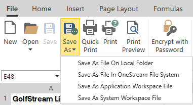

No matter where you save your files, and no matter where they were authored, files are portable between Excel and Spreadsheet. If you author a file in Spreadsheet, and then save it locally, and open it with the Excel add-in, that file will be supported. Likewise, you can start in Excel and move to Spreadsheet. I’ve done this numerous times and have had no issue moving between the two. I tend to be a little more comfortable using the Excel add-in, so I’ll generally start designing reports there, and then move them to a Spreadsheet component.

|Col1|Col2|Col3|Col4|Col5|
|---|---|---|---|---|
|||**Excel Add-**||**Spreadsheet**|
|||**In**|**In**|**In**|
|Quick Views|Yes|Yes|Yes|Yes|
|Cube Views|Yes|Yes|Yes|Yes|
|Table Views|Yes|Yes|Yes|Yes|
|Keyboard shortcuts|Yes|Yes|Yes|Some –<br>But Not All|
|Supports Macros|Yes|Yes|Yes|No|
|Save as .XLXS file|Yes|Yes|Yes|Yes|

Figure 11.4 As you can see, the choice of using Excel over Spreadsheet comes down to who, how, and what. 1.Who plans on using this? What control do they have over their local machine to install programs? 2.How do they plan on using macros? Do they live by Excel hotkey? Are they a master of Excel and only the real thing will do? If so, it is probably best to use the Excel add-in.

### Cube Views, Quick Views, Xfget Cells, Or Table Views?

You picked between Excel and Spreadsheet; now let’s see what type of report is best for you. You have four options for ad-hoc reporting: Cube Views, Quick Views, XFGet cells, or table views. We are going to approach this decision matrix a little bit backwards from the way we approached the decision on Excel vs. Spreadsheet. (Let’s face it, you either have admin rights to install an add- in on your corporate laptop, or you don’t.) For this, we need to dig into the functionality of each reporting tool, and that should help you decide what security rights we want to grant users, and what each way of retrieving data can do.

#### Cube Views In Excel Or Spreadsheet

Cube Views, described in Chapter 10 can be leveraged in both Excel and Spreadsheet. Cube Views are one of the fundamental building blocks inside OneStream. You have learned that Cube Views are the basis for just about any report, data entry form, or dashboard you can author inside OneStream. Once you understand how to author Cube Views, you have a powerful tool at your disposal. However, Cube Views in Excel and Spreadsheet can seem somewhat rigid, in particular for end- users who may not have the ability to update those reports. The POV, rows, columns, and even formatting are defined in the OneStream application. There is no interface in Excel or Spreadsheet that allows anyone to make changes that impact the underlying Cube View. All modifications to a Cube View need to be done in the OneStream application. This is partially because Cube Views may also be leveraged by multiple teams and multiple users. Cube Views can be used for data input forms, dashboards, or as the basis for data adapters for BI viewer components. They are not simply Excel and Spreadsheet reporting tools. So, even though they may be available for you to use in Excel, those artifacts may be leveraged elsewhere. Why might you consider using Cube Views for reporting? First off, it’s an easy way to disseminate a large number of reports that have been pre-formatted to a poignant dataset in your application. As you will learn later, Quick Views are much more free-form, but a well-defined Cube View gets you data fast. Depending on the size and complexity of your application, it may be easy to get lost in your dimensionality. Cube Views eliminate that issue. You’ve already defined the POV, rows, and columns for your users to consume. They can simply bring the Cube View into Excel or Spreadsheet and use it for reporting. They can even use the POV of the Cube View as a jumping- off point for creating their own ad-hoc reports or Quick Views. In short, it’s hard to get lost when you have a Cube View on your report. Figure 11.5 shows a Cube View in action.

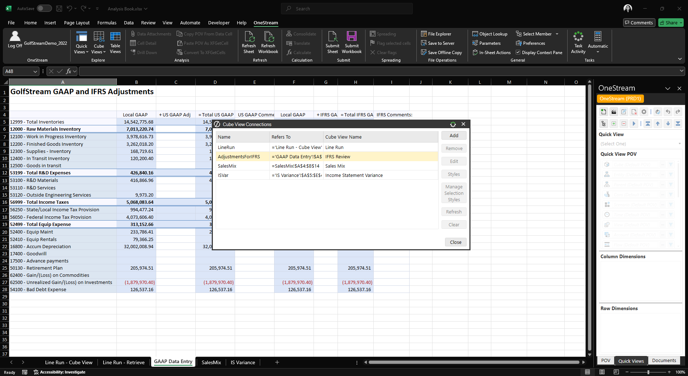

The other choice to consider, which is unique to Cube Views, is if you want to take advantage of the retain formulas in Cube View content feature. This feature allows you to take a Cube View and use a native Excel or Spreadsheet formula reference to derive a value that would be submitted back to OneStream. When enabled on a Cube View, this feature allows formulas in Excel or Spreadsheet to be retained on submission and retrieval instead of being replaced with the Actual value in OneStream. The most common use case here is for an Excel- or Spreadsheet-based submission of Plan/Budget/Forecast data back to OneStream. In some cases, offline models previously built in Excel sheets may have already been created to calculate a value that needs to be submitted into OneStream. This allows those offline sheets to be connected to a OneStream Cube View, eliminating the need to ‘copy and paste’ values from those other workbooks in order to submit them back into OneStream. We will explore this in more detail later, but if you have a requirement for this type of submission – using formulas – Cube Views are your only option, as Quick Views does not support this. Formatting is yet another consideration. If you plan on creating reports in Excel for a picky management team, I am going to advise you (strongly) to consider exploring Cube Views as your reporting tool of choice. And by picky, I mean if you know that the person you are going to produce this report for is going to call you into their office to discuss why the color you used doesn’t conform to the corporate standard of “Customer First Blue.” If you’re rolling your eyes now and thinking of that exact person, I feel your pain. All I can say is that we have all been there. One former boss of mine said that he was withdrawn from a potential promotion(!) because one of his PowerPoint presentations didn’t use the new enterprise standard. Don’t be that guy. When compared to other means of reporting out data in Excel or Spreadsheet, Cube Views are the most highly formattable. When working with Quick Views, you are going to face limits with your formatting ability. It’s not really meant to be for “boss quality” presentations. It’s meant to be for looking into issues or variances, not sending to the CFO. Cube Views allow you to select the font, color, background color, conditional formatting, number formatting, borders, and more. Essentially, any formatting options that you would have with any other report or dataset in Excel can be accomplished with Cube Views when you set them up. The formatting of Cube Views in Excel and Spreadsheet is highly flexible; in addition to all the formatting options we described when you author a Cube View, they can all be overwritten with whatever formatting you want to deliver in Excel or Spreadsheet. This can go so far as having cell- specific formatting. So, if you have a Cube View and you want one number to show up in pink with bold text and in Comic Sans, you can do it (but please don’t, because that sounds awful.) This is a big difference when compared to Quick Views, which are essentially limited to formatting three parts of the Quick View, which are row header, column header, and the data. With Quick Views, you – thankfully – can’t highlight one data cell in pink with bold text in Comic Sans. All the data cells would have to follow that format, not just one as allowed in Cube Views. We will go into more detail about how to actually apply formatting a bit later in this chapter. The last thing to consider – and it’s a big one – is something I like to call the asymmetrical grid problem. Cube Views are excellent at handling asymmetry. When I set up the Cube View, I can define how many rows and columns I want, and what I want to reference in each of those rows and columns. In Quick Views, I’m stuck with one row and one column. That’s not a bad thing, it can be quite beneficial from an ad-hoc perspective, but it does cause some complications on precisely formatted reports. And one of the biggest things, especially for those making the transition to OneStream from a legacy tool, is this concept of asymmetry. What is the asymmetrical grid problem? Let’s illustrate with a simple use case that you might have tried to author using a Quick View, to see where you may get into trouble and why you may want to consider a Cube View. Let’s say I’m being asked for a report where I’m looking at Actual operating income for March. That’s a simple request; I can do that easily in a Quick View. It’s one row and one column, and it will look something like this.

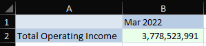

Easy, right? Let’s expand the use case, and say that I want to view March compared to budgeted numbers. So now the Scenario dimension is coming out of my Point of View (POV) for the Quick View and into my columns. It’s still a fairly simple report; we are still fine.

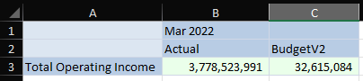

Let’s make it a bit more sophisticated and expand the use case. We now want to have a field to show the variance between Actual and Budget. This is where Quick View can potentially start to break down on you. I have a UD8 dynamically-calculated member called `Bud Vs Act $` that I  use to calculate the variance between Budget and Actuals. When I bring my UD8 dimension down to the column to show `UD8#None` and `UD8# Bud Vs Act $ (U8#None,U8#[Bud vs Act ` `$])` I start to see some repetition in my data that I don’t want for reporting purposes. This is what  my report looks like now.

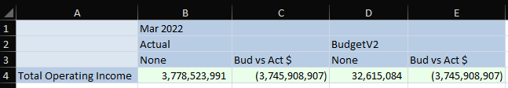

Huh, you can see this is not really my intended result. Now, instead of looking at three columns for each period of Actual, Budget, and BudgetV2 – I’m seeing four. Why is that? This is what I call the asymmetry issue with Quick Views. Really, what I wanted was `Actuals`, `Budget`, and `Actual ` `vs Budget`. That’s it. But because I’ve introduced a new dimension into my Quick View analysis  with two members, the Quick View will multiply by the two members that I added in. I’ve specified I want to see two members in my UD8 dimension, `None` and `Bud vs Act $`; however, because I already have two scenarios and  I’m adding two UD8 members in my columns, the Quick View will multiply to four columns. In this case, the Quick View has no way of knowing that I only want to see the UD8 member [`Bud ` `vs Act $`] once. Remember, the Quick View only knows of one column set and one row set. For  each column and row set, you get a one-Member Filter for each row and column. However, using Cube Views, I can achieve the desired results of simply having three columns. See Figure 11.9.

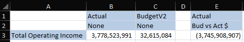

How are we able to satisfy this in Cube Views versus a Quick View? We can have multiple columns and rows, each with their own Member Filters. This is a simple example, but I guarantee that if you start working in Quick Views, you may run into asymmetry in some form or fashion. If you do, I’m going to advise you to move to a Cube View. There are a few tricks around how to do this in a Quick View (that we will cover in the Achieving Asymmetry in Quick View section of this chapter), but I will warn you, you are going to be writing cross-dimensional operators that sort of defeats the purpose of dragging and dropping dimension into your analysis. Quick View also tends not to be the choice when you want to add blank columns or ‘spaces’ in between the analysis. Let’s say I was satisfied with the way the Quick View looked (above in between Actual and Budget. I simply can’t do that using a Quick View. Setting a blank white column or row between any range in a Quick View is not possible. You need to be thinking of a Cube View if you want to see a formatted report like the one above in Figure 11.9.

#### Quick View In Excel Or Spreadsheet

We might have beat up Quick View a bit, especially compared to Cube Views, but they are a remarkably helpful reporting and quick analysis toolset that almost everyone uses. So, when are they useful, and when should I be considering using them? Quick Views are best for fast analysis and are great for creating those one-off sheets that don’t require the data to be highly formatted. There are three ways to create Quick Views. You can leverage an existing Cube View or Quick View to create one. You can create a Quick View from scratch, which will default your account in the rows and time in your columns. Or you can use the type-in method to define the rows and columns that you want, and select the Create Quick View button. Personally, I always try to leverage an existing report to create a Quick View instead of starting from scratch. It saves me a lot of time and frustration when searching for, and trying to define, the correct POV. Quick Views have one row and one column. You must have at least one dimension present in each row and column. All other dimensions reside in the point of view (POV). This functions as a master view for the Quick View. You can only have one member in the POV. A common confusion when speaking about the POV is there can be a difference between the POV and what is in the Member Filter. In Figure 11.10, the POV for Quick View is the member `Actual`.   Don’t be confused by what is in the little funnel icon over to the right of the member. That is known as the Member Filter. That only impacts the Quick View when that dimension is in the row or column of a Quick View. Pay attention to what is inside the box to determine the POV. It will either show up in gray or black font. Gray means it’s the default (which is determined by the user’s POV), and black font indicates you have changed it. The scenario is set to `Actual` for the POV, not `Root.Children`; that is the filter and has no  impact on the POV. A filter will only impact the report when dropped into the rows or columns.

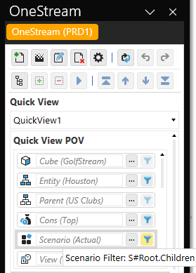

The asymmetry issue is what is probably going to be your biggest challenge when looking to use Quick Views exclusively for reports. Cube Views, as we noted above, are much better at handling asymmetry because they can have multiple independent columns and rows with their own unique selections. The formatting of Quick Views is not as extensive as the options listed for Cube Views, but I think it’s quicker and easier to create for the vast majority of reports. You are limited to formatting four areas of a Quick View, and you get to apply one format to each area. So, again, if you want to change one cell to be different than the rest, you can’t. To illustrate the four different areas you have the ability to control, I’ve highlighted the four different color areas in this Quick View in Figure 11.11. • Orange – upper-left style • Yellow – row header style • Green – column header style • Blue – data style

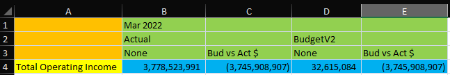

Fewer options make things easier, and that is certainly true when I start to modify my Quick View. As I drag in different dimensions and expand my rows and columns, my formatting holds up. No need to go back and specify what needs to be done. My formatting simply follows suit. Figure 11.12 shows the same Quick View expanded; see how the formatting holds up even when we expand rows and columns. If you have played around with Quick Views, you may think that your formatting options are limited to the list provided in the drop-down selection. And you are going to see some strange ones in there – like 20% - Accent1 – and wonder what those may mean. Those are cell formats that Excel and Spreadsheet have natively, and which are controlled through Styles in those products. The good news is that you can create your own styles for any workbook and use them. More on how to define those later.

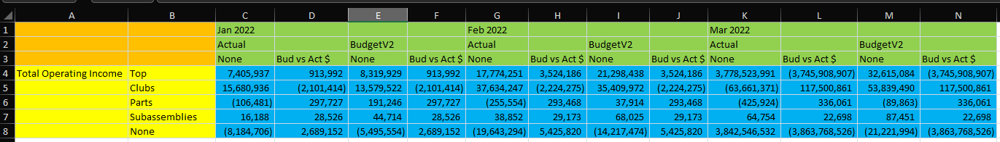

The last thing to consider when deciding to use Quick Views relates to performance. Please turn on Sparse Data Suppression / Sparse Row Suppressionfor Quick Views. Really, this should be your default setting for ANY new Quick View. Even more so, if you have a very large Quick View that accounts for a number of deep, sparsely populated dimensions, you may run into longer than expected retrieval times. The only drawback to this feature is if you have dynamically calculated members, it will suppress them. However, you can override this on a Quick View by Quick View basis. So, it is best to keep it on and only turn it off as needed. Quick Views, as the name implies, give your users a very fast way to create their own analysis of OneStream data. There are still several formatting options that can be deployed that are simple to maintain and manage. Certainly, you will be creating many Quick Views for analysis during your OneStream tenure, but know when to use them over Cube Views.

#### Xfget In Excel & Spreadsheet

XFGet functions are yet another way to get data out of OneStream using Excel and Spreadsheet. They are closer to Quick Views, as anyone with access to the Excel add-in or Spreadsheet can create formulaic retrieves using one of the many XFGet functions defined. XFGet provides several functions that provide users with the ability to retrieve data, or certain properties about the cell, dimension, or even an FX Rate. I can also use XFGet functions to submit data back into OneStream through an XFSet function. For a handy, complete listing of all the functions available, select the Insertfunction button on your formula bar in Excel and filter by the category OneStreamExcelAddIn.XFFunctions. There, you will find the comprehensive list of XFGet and XFSet functions available to use, as well as formula helpers. See the following Figure.

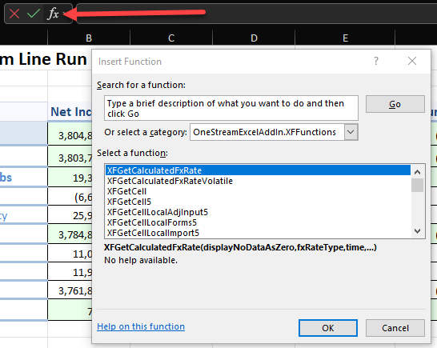

We are going to focus on XFGetCell functions because those are the most used and are the most helpful when authoring your own reports in Excel and Spreadsheet. Think of this formula like GPS coordinates. It allows me to create a precise retrieval for one intersection of data inside OneStream. You will need to define every dimension, otherwise the XFGetCell will not retrieve a value.

```text
=XFGetCell(TRUE,"Houston","Houston","","USD","BudgetV2","2022M3",
"YTD","60999","None","Top","Top","Top","Top","Top","Top","None",
"None","None","PriorYearActual")
```

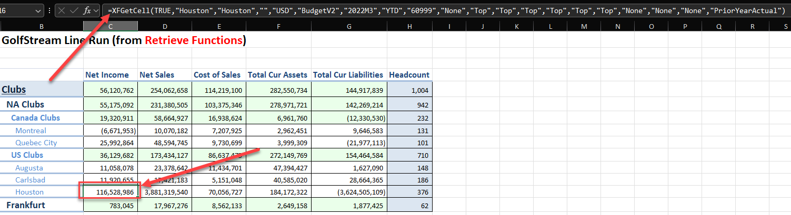

As with any formula in Excel, you can substitute cell references inside the formula instead of explicitly naming them. For example, if I have defined the Time dimension in cell C3 as `2022M3`, I  can place cell `$C$3` in place of `2022M3` into the XFGetCell formula. This is handy when you have  a lot of XFGetCell references on one sheet, and you want a sort of Global POV to control what you are looking at without having to update every formula. The formatting advantages of XFGetCells are many, as they are treated like normal Excel or Spreadsheet formulas. Any formatting is available and will stick, based on the selections you make. They are just like any cell in Excel. The XFGetCell function can also help with the asymmetrical retrieve issue we spoke about earlier that you may experience with Quick Views, especially if you are not going to have access to creating Cube Views. Let’s go back to our earlier example where we want to show three columns, not four, when comparing Actuals to Budget. A handy feature is that we can convert any Quick View into an XFGetCell using the click of a button. This function is called Convert To XFGetCells and is purpose-built for situations like this. Note that this can only be done once, and it cannot be undone. There is also no way to convert XFGetCells into Quick Views; at least for now.

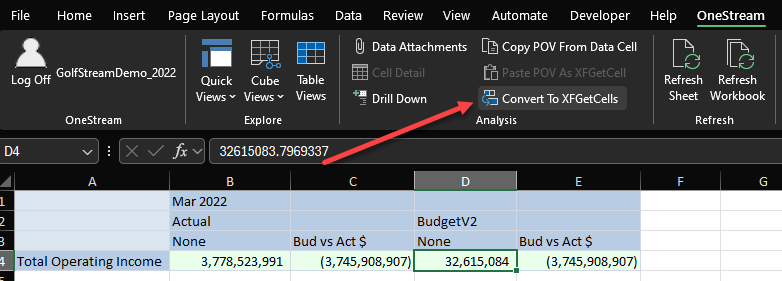

Once you convert to an XFGetCell reference, the Quick View reference is deleted, and a long formula is put in its place. The formatting that was on the Quick View is retained. There is no dependency on the rows or columns now; the cell now contains the complete reference. I am also free to delete any rows, columns, or cells, and format as I please. Figure 11.16 shows the long formula that was generated with little effort.

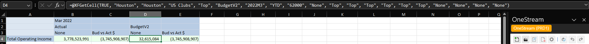

As you can see, I now have the formatted report (Figure 11.17) that I wanted, and I didn’t have to create it using a Cube View.

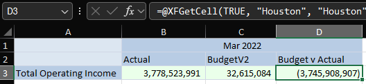

XFGetCell functions are a great option when looking for specific values, or when you have highly specific formatting requirements. Using a Quick View as a starting place is not a bad idea either, as this can cut down on the time it takes to author the report of your choosing. As ideal as it sounds, using XFGetCells also has its considerations. The most significant deterrent is that they are static files, whether you decide to store them on a shared drive, your local drive, or the OneStream File System. This means that if mass formatting updates are needed or member hierarchies change, requiring report updates, users (or, even worse, the administrator) would need to update each individual file to reflect the changes. This can often be avoided by a smart use of Cube Views and the parameters within them.

#### Table Views In Spreadsheet & Excel

Table views provide the ability to read, update, and even insert records into OneStream relational tables. This is data that you might have in an Analytic Blend table, People Planning, or Thing Planning registry, or the raw source data that was used to populate the OneStream cube. Think of it like this. Let’s say we loaded in sales detail from our data warehouse by invoice, but we don’t have an invoice dimension in OneStream (for very good reasons). If you were in Spreadsheet or Excel, and you wanted to see the invoice-level detail that you loaded in using our data quality engine, you can drill down to navigate to the source-level detail. This drilldown is querying the underlying raw data from my data warehouse that I loaded into OneStream, that I used to load and map up to my cube. This drilldown feature is a native feature in Excel or Spreadsheet. For example, we have sales for the `Mach5` product, for the `Northeast` region for the `Golf Hub ` customer, for February. There were many invoices that made up that $431,463 sales number that we have loaded into OneStream, but we don’t store all the detail at the cube level. So, we leave some of that behind in the underlying relational tables, which is a smart design move. Not everything belongs in the cube. However, we may want to look at details that we left behind in the relational layer. Enter drilldown. If we drill down into that result in Spreadsheet, all the way back to the source detail, we will see the raw invoice details.

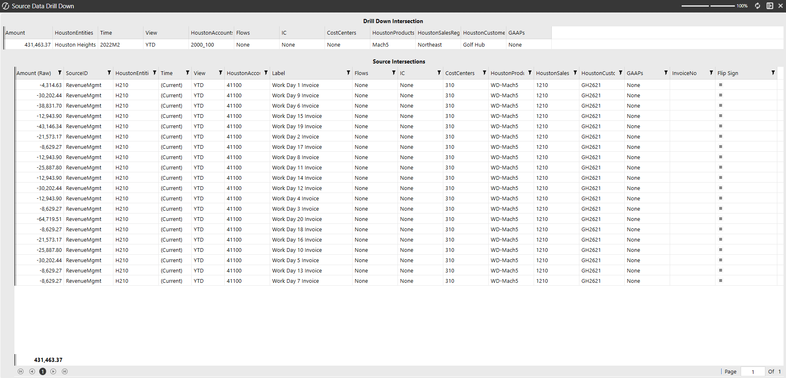

Above is a great report, but it took a little bit to drill into. Enter table views, which allow you to create your own query to look at the same dataset without having to drill down from the cube. Table view functions very much like a Cube View does in that it must be defined in the OneStream application first, and then be added to a Spreadsheet. This is an example of a table view, which replicates the same query as the drilldown but is represented on the workbook and driven off parameter-driven prompts.

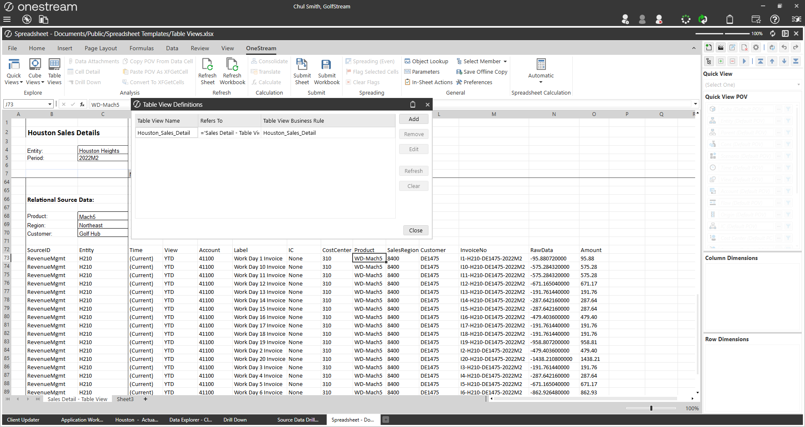

This is not the only way to query relational data inside OneStream. You can use a grid viewer or BI viewer component to report and update relational data as well. Table views is just another option and is embedded in Spreadsheet, which gives users more of that Excel-like experience to consume data. Table views are not created on the fly. They must be set up as business rules, and users must be given access to the underlying table view rules. This is probably the most advanced option that we have discussed to date, if you want to set one of these up. You are going to need working knowledge of VB.Net or C#, SQL, and the underlying structure of the tables you plan on querying. Upon the setup of these rules, you will also define security and whether you will allow for the editing of fields or the insertion of new records. The simplest table view is one where you simply retrieve values. They get more complex as you decide what fields can be added and what fields can be edited. When deciding to make a table view editable, I will caution that with great power comes great responsibility. Exercise caution about what tables you are allowing people to update. I know this is not the technical reference guide, but if you plan on setting one of these up, make sure you pay attention to the Restrictions chapter. There are simply some tables that you don’t want to – or can’t – touch. If you are interested in writing your own table views, the most up-to-date documentation can be found in the Supplemental Design and Reference Guide on Table Views, available on the Solution Exchange or at documentation.onestream.com.

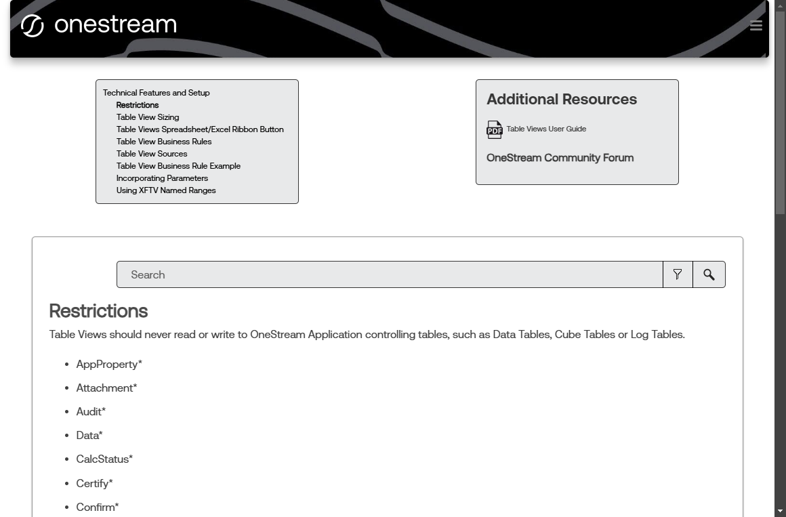

With this in mind, I find table views a great supplement for editing and inserting data into any of the Specialty Planning solutions, such as People Planning. The Spreadsheet interface provides an easy and familiar way to make updates to the relational data outside the out-of-the-box interface provided by the Specialty Planning solutions. Like the Specialty Planning solutions in the Solution Exchange, the number of columns that I retrieve can expand and contract depending on the status that I am looking at. I can also write some clever automation when a certain action has occurred. For example, in a table view rule, I can auto- create a row of data if an active employee is marked as transferred. Or, if I mark an employee as split, I can change the status of that employee and auto-generate another record for that employee as well. I can also add more than one employee at a time, giving me the flexibility to use the comfort of the Spreadsheet interface to update this dataset. Figure 11.21 illustrates this.

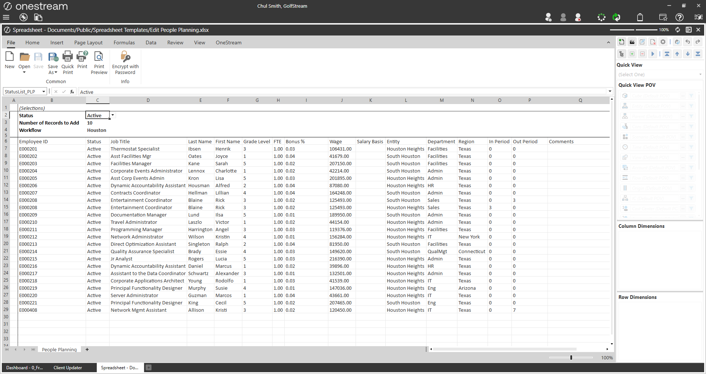

#### So, Which One Is Right For Me?

We’ve gone through the plethora of reporting options for Excel and Spreadsheet. Depending on your requirements, you can choose what level of access is appropriate for your users or, after reading this, you can request access from your administrator to expand your OneStream Excel reporting options.

## Using Cube Views In Excel And Spreadsheet

We’ve gone through what a Cube View is, and when best to use it. Let’s now walk through the practicalities of getting a Cube View into Excel and Spreadsheet, formatting, submitting data, and some ways to hide any prompts you might have for parameters.

### Inserting Cube Views Into Excel Or Spreadsheet

Getting a Cube View into Excel or Spreadsheet is a straightforward exercise. If you have a Cube View that you have created – but can’t see it in Excel – you either don’t have the appropriate security rights, or the Cube View does not belong to a group that is in a profile that has Visibility set for Excel.

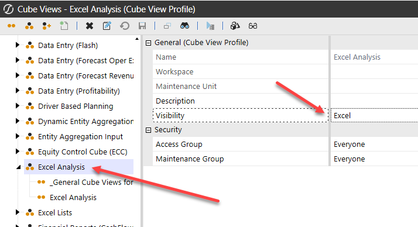

In order to add a Cube View to Excel or Spreadsheet, simply select CubeViews >Cube View Connections>Addand select the appropriate Cube View. Here are a couple of guidelines when adding Cube Views to your workbook. 1.If you plan on having multiple Cube Views on the same worksheet, along with other content such as Quick Views or text in cell, I recommend you stick to aligning the content vertically or horizontally, but not both. It’s really important you don’t select both; you really want to choose one or the other. The dynamic nature of these items means they can change. By selecting either horizontal or vertical stacking, you ensure that content is not overwritten. i.If you plan on aligning the content vertically, make sure the Insert Or Delete Rows When Resizing Cube View Contentis selected. Do not also select the option for columns. ii.If you plan on aligning the content horizontally, make sure the Insert Or Delete Columns When Resizing Cube View Contentis selected. Do not also select the option for rows at the same time. iii.If you choose to have content both horizontally and vertically aligned, do so at your own risk. I recommend – if you select this option – that the content is static and will not expand or contract over time. That means the rows and the columns in Cube Views should have a defined member list with suppression turned off. You will also not want to enable any resizing of Cube View or Quick View content. Figure 11.23 shows all options turned off to minimize disruption to the rest of the sheet.

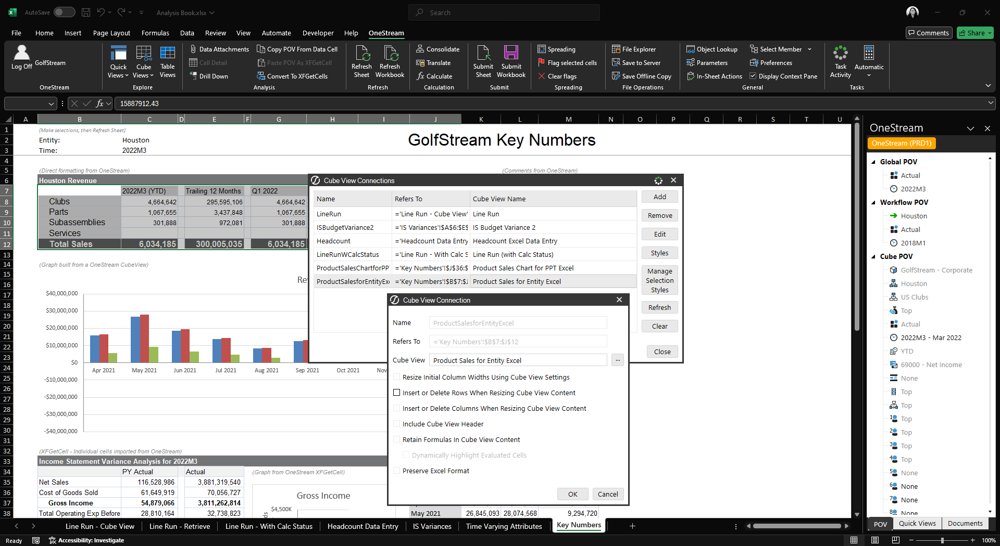

2.When inserting a Cube View, select the cell that you want to place the Cube View on. If you select cell A4, the uppermost left corner of your Cube View will start on that cell. 3.If a Cube View is added to the incorrect location on your sheet and you need to move it, you can easily move the Cube View. Simply highlight the entire cube or select the name of the Cube View in the Name Box. You will get a dark green border around the Cube View.

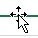

Hover over that dark green border until you see the Move Selected Cells pointer Then, move the range of cells to the desired location. This trick actually works for Quick Views as well.

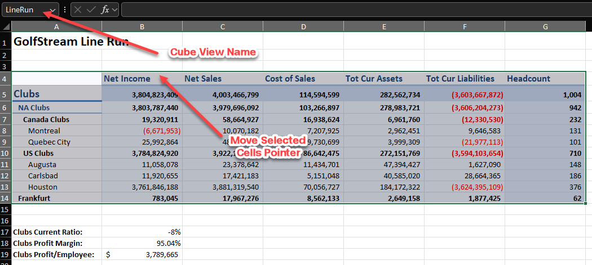

In our example, the move looks like the following.

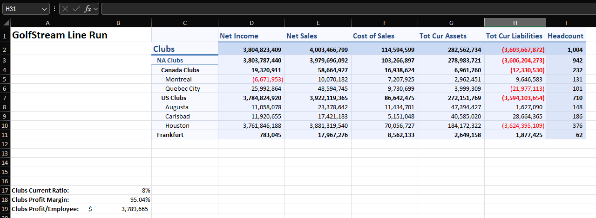

4.If you plan on sharing this workbook with someone who does not have access to OneStream, consider turning the add-in preferences Invalidate Old Data when Workbook is Openedto False. When the receiving party receives that Excel File, they will see values in your Cube View or Quick View, not `#Refresh` in the cells.

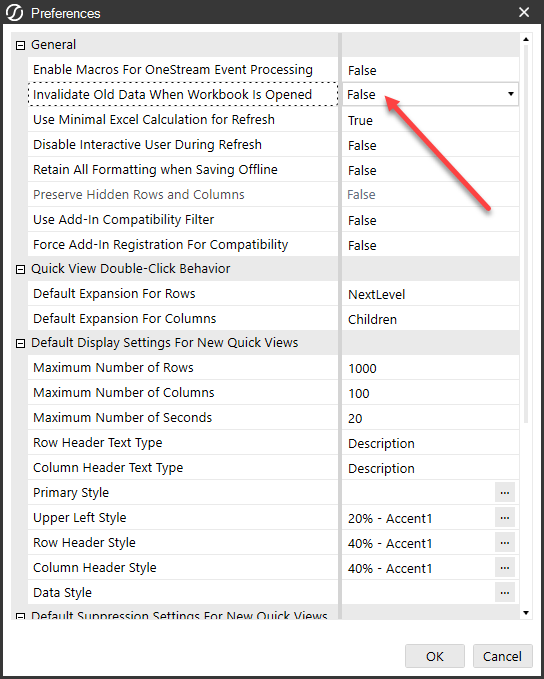

You can name the Cube View in your sheet whatever you like, provided there are no spaces in the name or special characters. If you don’t select a name, one will be created for you. A unique name allows you to have the same Cube View twice in the same workbook. It is also the basis for creating name ranges automatically. The number of named ranges created will depend on the layout of the Cube View. This is important for formatting, as we shall see later. There are a few options when inserting a Cube View; the first two are always auto-selected for you. There are two options that, by default, OneStream selects for you, but you can deselect as appropriate.

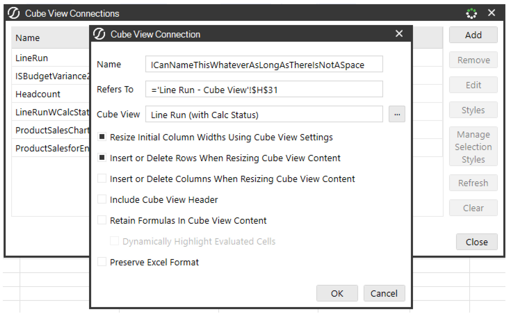

#### Resize Initial Column Widths Using Cube View Settings

This is auto-selected for a good reason; the column widths will expand when first adding the Cube View to the page. If not, you are going to have to resize them yourself. If you already have other objects on your sheet, and don’t want them resized, you can turn this selection off. Figures 11.28 and 11.29 show the page with resize deselected, and then selected.

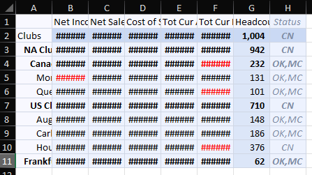

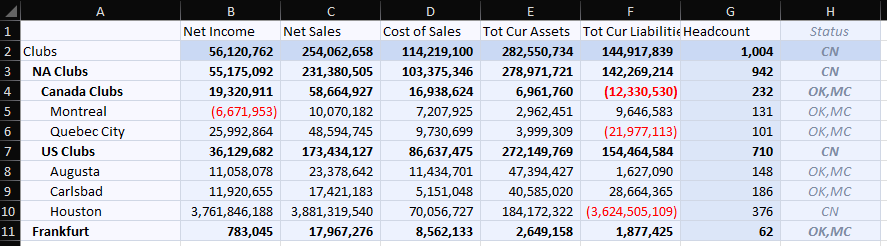

#### Insert Or Delete Rows When Resizing Cube View Content

If you plan on stacking everything vertically on your worksheet, select this option while in the Quick View (see figure 11.30). This will auto-add or auto-delete rows as the Cube View expands and contracts. Do not select this and the Insert Or Delete Columns When Resizing Cube View Content at the same time (see figure 11.31).

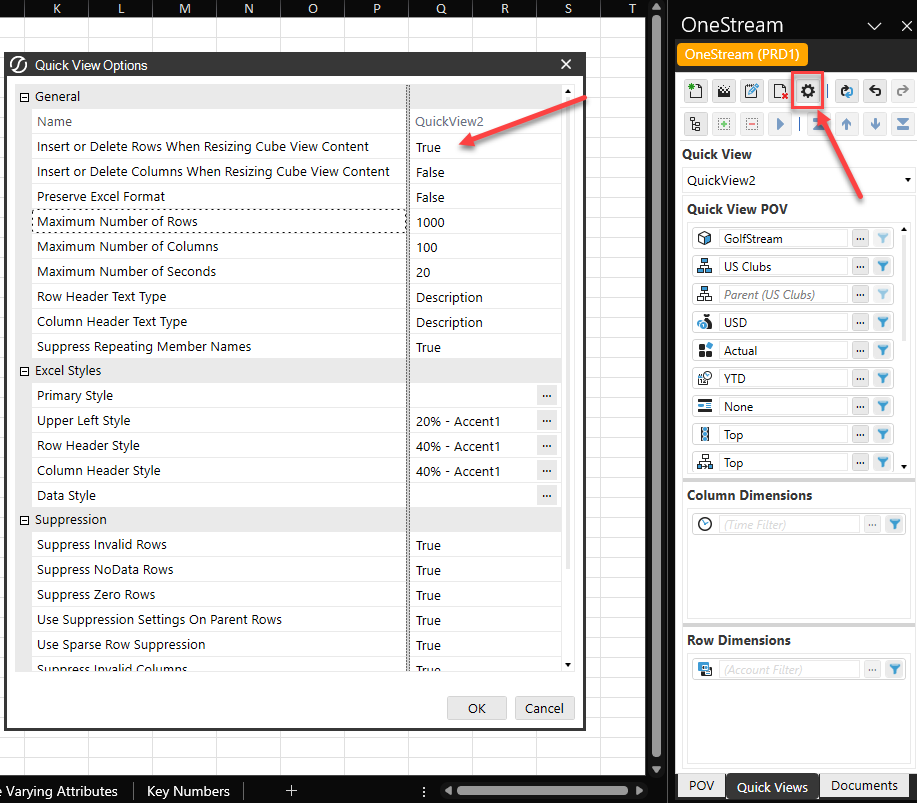

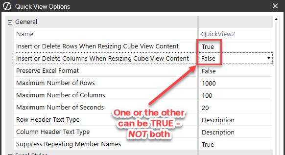

#### Insert Or Delete Columns When Resizing Cube View Content

If you plan on stacking everything horizontally on your worksheet, select this option. This will auto-add or auto-delete columns as the Cube View expands and contracts. Do not select this and the Insert Or Delete Rows When Resizing Cube View Content at the same time.

#### Retain Formulas In Cube View Content

Only select this if you have a Cube View that you plan on using for data submission (using Excel formula references). Otherwise, leave it deselected; it’s not necessary.

#### Dynamically Highlight Evaluated Cells

This option will be available if the previous option is selected. This will highlight the cell if the formula reference has changed without having to refresh the sheet. The reason this is not automatically turned on is because it can impact performance and slow down retrieval times. Use with caution on large, sparse Cube Views. There are plenty more options, but these are the most important. Having a good understanding of these options will ultimately help you when adding Cube Views to your sheet; you’ll create sheets that look good and don’t conflict with other data that you have.

### Cube Views Advanced Formatting Options

Once a Cube View is on your worksheet, you may want to modify the formatting that has been provided. Simply going to the Excel home page and changing the font or background color may appear to do the job, at first, but you will be disappointed to see that upon a refresh of the sheet, the formatting will disappear. The only exception to this is conditional formatting. Native Excel or Spreadsheet conditional formatting will work and stick on Cube Views without any special considerations. But if you are looking to perform other types of formatting, this section will explore how to create custom formatting and how to make it stick to a Cube View.

#### Order Of Precedence

When deciding what style to use, you should first understand the order or precedence for each style. One selection may override a previously made selection. The default Cube View style is overwritten by anything setup at the Cube View level, called custom Cube View format. Conditional formatting overrides that, and so on and so forth. This handy chart below will help you understand the order of precedence for Cube View formatting.

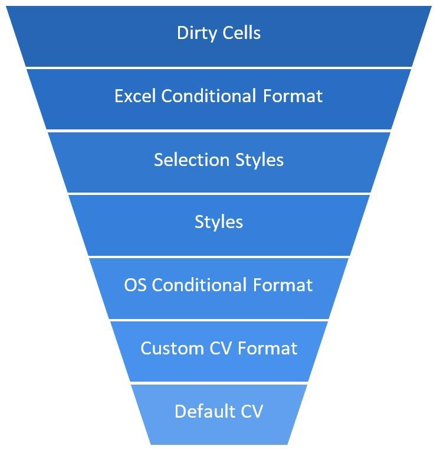

#### Styles, Selection Styles, Conditional Formatting

We are not going to cover the bottom three formatting styles; those are set up in the Cube View itself and were covered in the previous chapter on Cube Views. Here, we are going to cover styles, selection styles, and Excel/Spreadsheet conditional formatting. Yes, there are two styles to define formatting for Cube Views that sound very similar – styles versus selection styles – but what’s the difference, and when should you use one over the other? Styles are defined with the Cube View connection and are limited to defining one style per named range, created in each Cube View. Name ranges are created automatically when the Cube View is brought into Excel or Spreadsheet. Because each Cube View can have multiple rows and columns when it is initially set up, the number of ranges that you have depends on how the Cube View was built. To see the named ranges for each Cube View, go back to your Cube View connections and select Styles. You can see, in the below Figure, that the `LineRun` Cube View has quite a few ranges that  have been created, based on the way it has been configured.

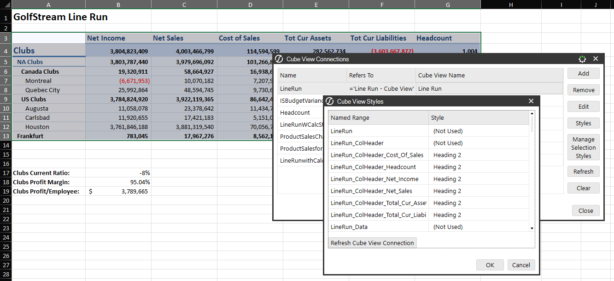

Focusing on the header, you will see that there are multiple named ranges. In this case, one for cost of sales, headcount, net income, etc. Why is that? For that answer, let’s turn to the raw Cube View itself, and how it was setup. The below Figure shows the configuration of that Cube View.

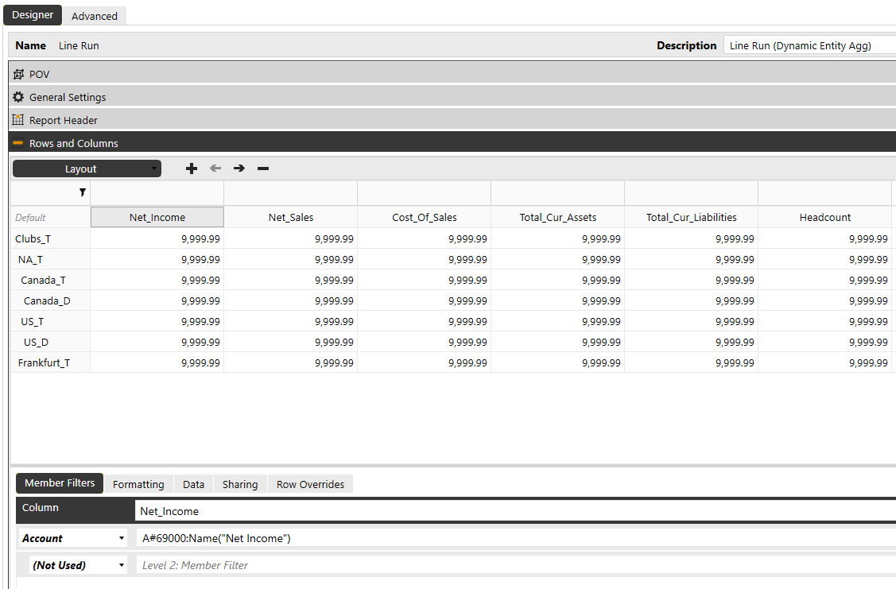

This Cube View is comprised of six columns. A range is established for each column setup in the Cube View. Does it need to be setup in this way? It depends. There are certainly good reasons to separate out different columns; remember, Cube Views are not just used for Excel reporting. Having separate columns allows the Cube View to be formatted appropriately inside the application. Remember that each column or row in the Cube View setup can have multiple members. Taking a closer look at the `Canada_D` row, you can see that this one row has multiple Entity members. This  is still treated as one row for named range purposes in Excel and Spreadsheet.

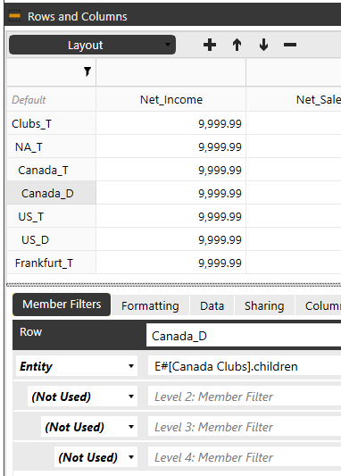

Regardless of how your Cube View is setup, and how many rows and columns it has, it’s still possible to achieve your formatting goals. Let’s say my goal was to have the entire column header formatted consistently. The best way to achieve this is to set the Cube View column header to the style that I am looking for. I’m going to select the style of Total as the column header style.

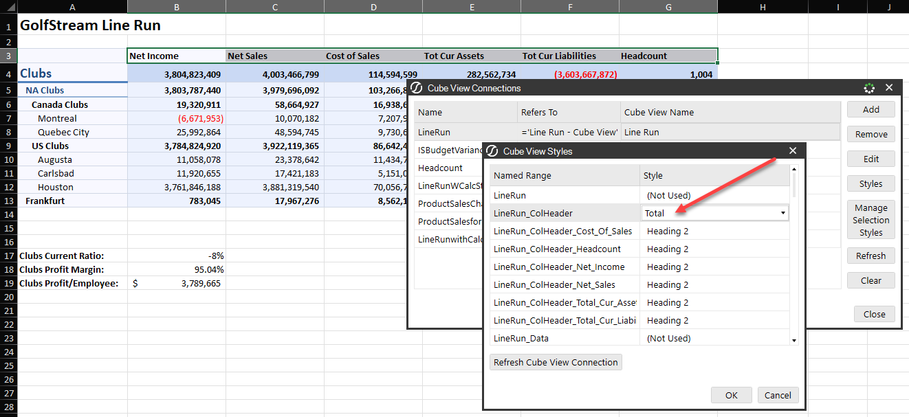

The distinct advantage of having one format for all the column headers is that if additional rows or columns are added, you don’t need to worry about reformatting your sheet; they will simply follow suit. As an example, let’s say the Cube View is modified to include an additional column for operating expenses. That addition as a new column will follow the custom format for the column we defined. Overrides are allowed, and if you define specific formatting for one range, it will not use the default setting; it will use what is defined. In the below example, I’ve set `Net Income` to a red  background color called `Bad`. Specific formatting styles always override what has been set for the  column, row, or data range.

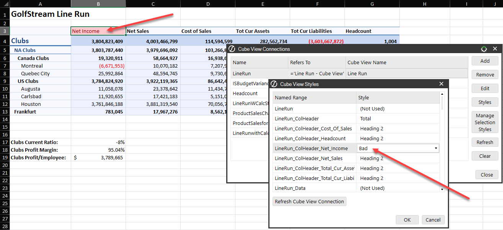

If you found styles a bit overwhelming, or simply don’t like the idea of having to use named ranges to set up formatting, there is another option. Selection styles was introduced to give you more flexibility to define a range of formatting, much like you would in native Excel, without regard to the named ranges established. Selection styles override regular styles, so if you’ve tried styles and just can’t get the desired result, give selection styles a try. Another advantage of selection styles is that you can format the Cube View using native Excel or Spreadsheet functions, and then define that as a custom style. Take, for example, the following Cube View. The `Services` line of business does not have any data for this period as it was a  discontinued line of business.

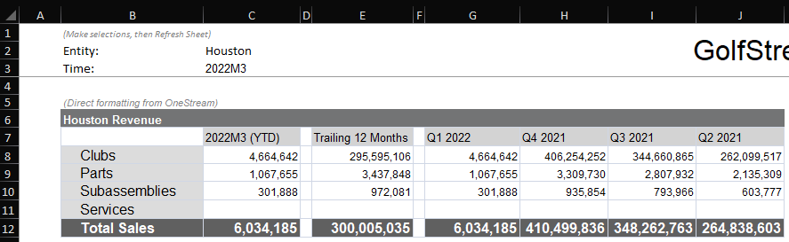

For this report, I want to highlight the `Services` LOB line in orange to indicate that it is no longer  active. By simply going to the font color and defining this as orange, I can create the desired impact. But remember that if I click refresh on the sheet, the formatting will disappear. I need to associate it with the Cube View via selection styles. While you have those cells highlighted, navigate to Cube View > Selection Styles.

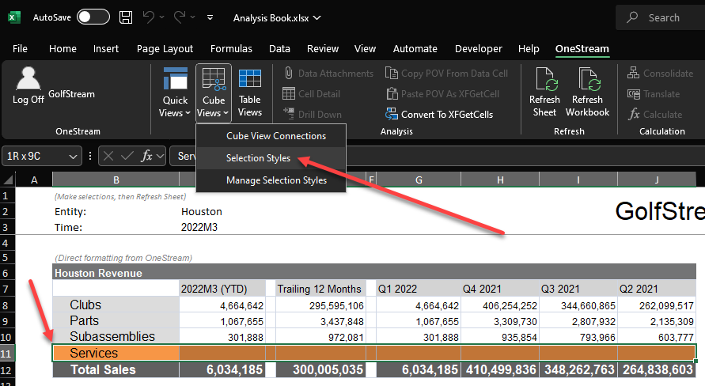

Provide a name for this selection style. I’m going to call this the `Discontinued LOB`. The style  name is going to be saved locally to this workbook only; it is not stored in OneStream.

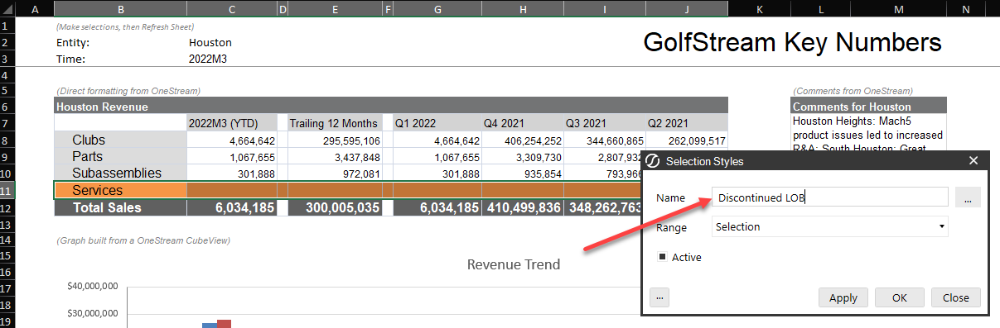

I encourage you to read more about selection styles in the Design and Reference Guide, as they will go into other scenarios about de-activating a selection style and how to manage them (which we will not cover here today). However, here are a few tips and tricks that I’ve learned about selection styles, which are not documented. 1.If you add in cells above or below the `Services` LOB line, those new lines will receive  the formatting from the Cube View, not the new selection styles you defined. It’s very handy, as changing metadata and placement of items on specific rows will not impact the selection style.

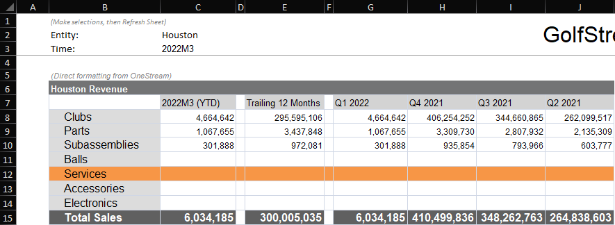

2.The creation of a selection style creates a native Excel or Spreadsheet style. Navigating back to the home screen, you will see that anything created via the means of selection styles shows up as a native style. This provides users with additional editing capabilities to define fonts, borders, or refine sizes. Instead of creating a selection style in the way we described above, you can simply define native Excel or Spreadsheet styles and use them in selection styles.

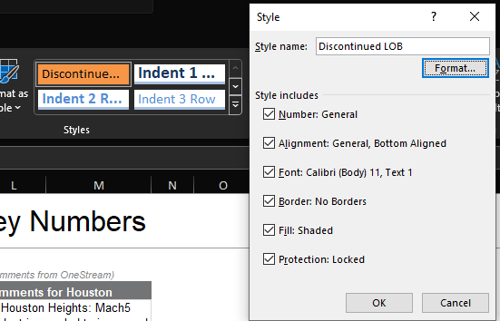

3.The selection style, or any style, cannot be a mix of different styles. For example, you cannot have one selection style to have the columns in bold text, but the dataset to be in regular text. When defining and setting selection styles, they must be consistent. No mixing and matching! The final option for formatting Cube Views is the easiest and will take up the least amount of space. This is native Excel or Spreadsheet conditional formatting. There is no special magic; no ranges you need to understand. Assuming you are using 6.0 or later of OneStream, conditional formatting simply works and will stick to your Cube View using the native functions. Enjoy the gift; it’s that simple.

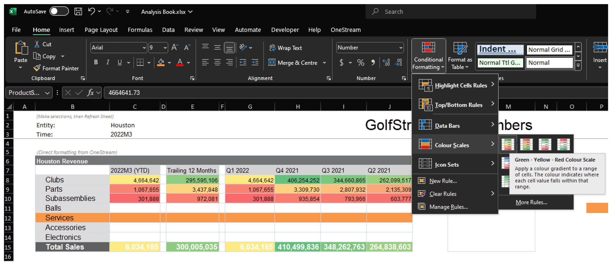

### Hiding Parameter Prompts

Many Cube Views that you may leverage in Excel or Spreadsheet may contain parameters for either the POV, row, or columns – to help refine the dataset you are retrieving. When your sheet contains parameters in a Cube View, and you view it in either Excel or Spreadsheet, you will receive a prompt asking you to define the parameter. This can be annoying and burdensome when refreshing a workbook with many parameters embedded in it. How can I remove the prompt but still define what I would like the parameter to be?

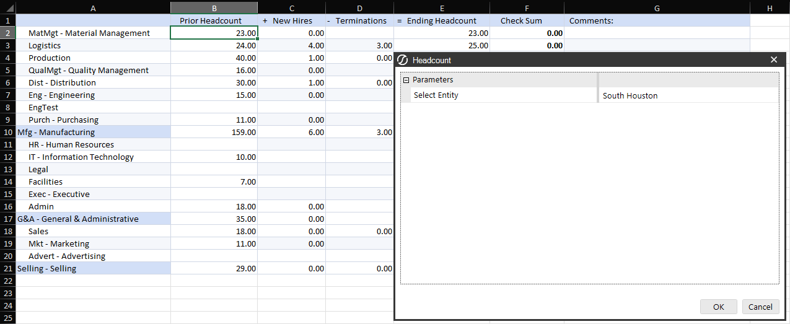

There is a simple solution. A Cube View in Excel or Spreadsheet evaluates values in the name manager when you refresh your Cube View. If you define the parameter as a name, you can avoid having a prompt for the parameter. The only caveat I must make is that you must know what the name of the parameter is. For the above Cube View, in Figure 11.44, related to headcount data entry, we need to open the OneStream application to understand the name of the parameter that is prompting me for the entity. Remember, the parameter may be in the rows, columns, or POV. In this case, the parameter is in the POV under the Entity members and is called `|!WfProfile_Assigned_Entities!|`. There is another parameter for time, but that is based on  the WF, so we don’t need to be concerned with that.

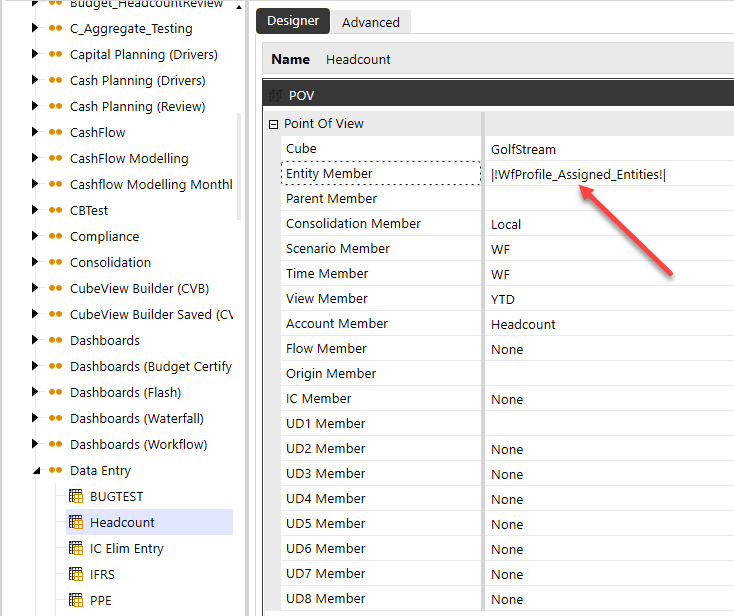

Copy the name of the parameter defined in the Cube View. Disregard the leading and trailing pipe `|` and exclamation point `!`. In Excel or Spreadsheet, set a cell equal to the value you wish to replace  with the parameter. Select Define Name > New Name and set the parameter equal to the new name.

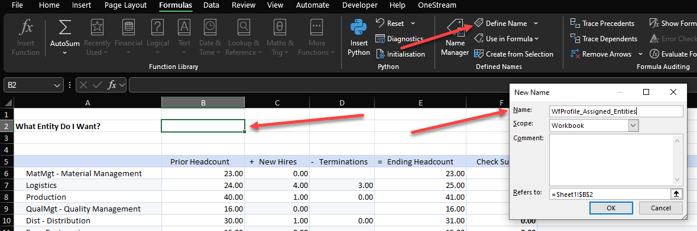

Upon refreshing the sheet, you will no longer be prompted to select the value for the parameter. In many instances, you may want to have a list of available values that match any parameter that is being prompted for on the page. It’s a little extra work, but it will pay dividends, especially if you plan on distributing this workbook to a larger audience, or if this parameter is tied to metadata that will grow over time. First, track down the underlying value of the parameter in the dashboard and what members it references. The parameter was `|!WfProfile_Assigned_Entities!| `The values of that  parameter are found in dashboards, not Cube Views.


I recommend using the search button  in order to track it down. Once you do, you can see the Member Filter for this parameter, which in this case is `E#Houston.Base`

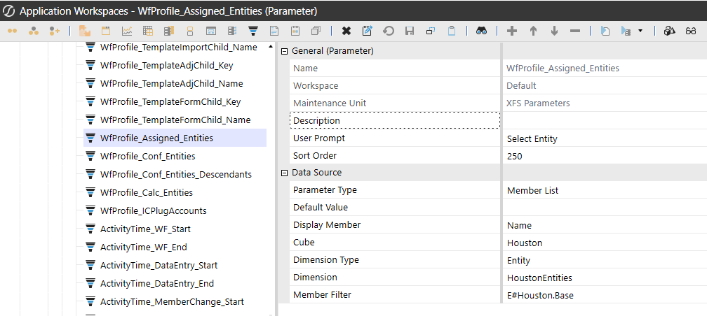

Next, create a new Cube View, where only the rows match the Member Filter defined in the parameter.

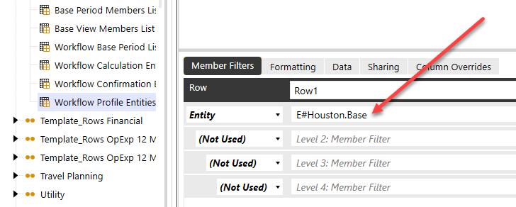

The Cube View can then be added to a new worksheet. Here, I’ve titled this `Lists`. The rows show  the same values as the parameter prompt.

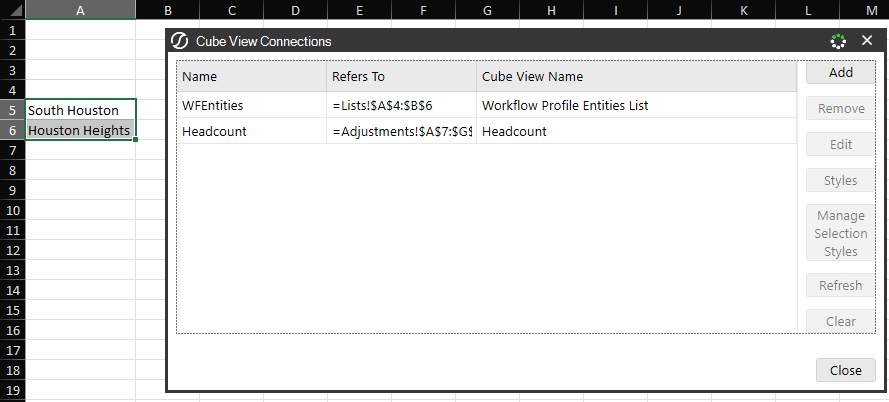

In Excel, select the cell where you have defined the name. Change the cell to perform a list validation against the newly inserted Cube View, as shown in Figure 11.50.

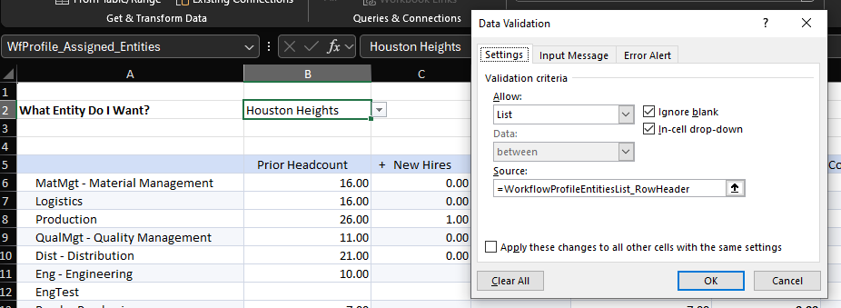

Now, you will be able to select from a list to define the parameter you wish to retrieve.

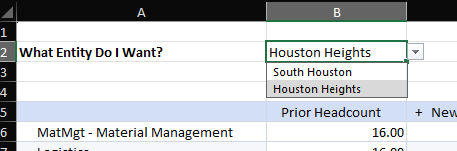

The advantage of this method is that the sheet becomes much more dynamic. As metadata changes, so will the Cube View used for the reference. As an example, if five more entities are listed under Houston, they will show up in the drop-down on your sheet to retrieve data against.

## Creating Quick Views In Excel And Spreadsheet

Personally, this is my favorite topic to do with the OneStream platform. There is nothing more satisfying than being able to quickly look at data and explore financial results than with a Quick View. It’s something that almost everyone who touches OneStream will use at some point in time. It’s simple enough for the new analyst who just joined out of college to understand, yet has the sophistication that the controller can use to quickly answer questions about data without having to bring in the OneStream experts.

### Important Preferences And The Importance Of Workflow

Consider this the precursor to your knowledge of Quick Views. It’s imperative that you set your preferences before creating Quick Views, as this can save you a lot of frustration later. Even if you have worked with Quick Views before, I implore you to review this section to understand how and why you should care about these preferences. Preferences are set by the individual user and are localized. The preferences you have in Excel or Spreadsheet are yours. Global preferences define worksheet-level behavior and are the starting place for all new Quick Views you create. This is your baseline, the way you want to start with all your new Quick Views. That means if you have suppression turned on for invalid rows, every Quick View you create will default to that preference. Global preferences can be overwritten. These are called Quick View options, which are tied to each Quick View you create and can be changed independently of your global preferences. It should be noted that changing your global preferences will not impact any existing Quick Views you have already created except for double-click behavior. The key word here is existing Quick Views. I’ve seen this so many times when someone is trying to change suppression, and they wonder why it doesn’t work. Ten out of ten times, it’s because they are changing the global preferences and not the Quick View-specific preferences under Quick View options. And remember, each Quick View can have its own unique preferences. It’s not an ‘all or nothing’ type of situation. In a sheet with many Quick Views, you can have different styles and different suppressions set up between them.

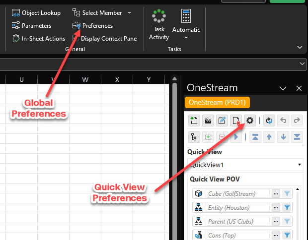

Let’s talk about global preferences first. Those are found under OneStream > Administration > Preferences.

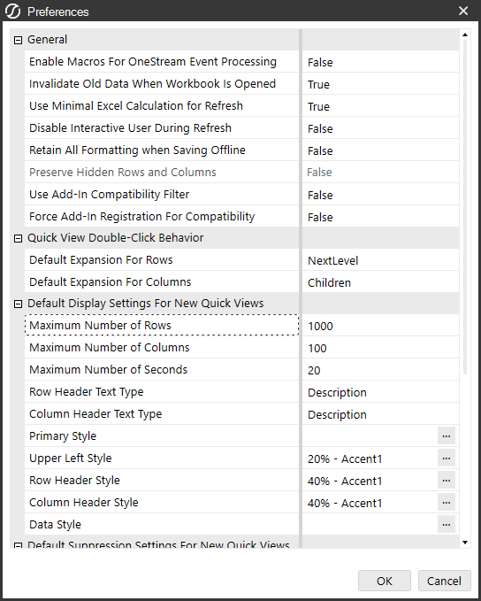

#### Important General Preferences

Invalidate Old Data When Workbook is Opened – this is important if you are distributing Excel files with Cube View or Quick View data to users who do not have access to OneStream or the add-in. If selected, when those users open the book, it will show `#Refresh`, not the Actual data  values. So don’t select it if you plan on passing this along to a boss who doesn’t plan on refreshing the sheet. Where this does come in handy is when there is frequently changing data. By forcing you to refresh your sheet, it ensures that the data you see on your sheet is up-to-date. Think of it as a good reminder to make sure you have the latest and greatest dataset. Retain all Formatting when Saving Offline – I highly recommend you set this to `true`. An offline  copy can lose all the formatting work you put into it, so keep it on.

#### Quick View Double-Click Behavior

These settings are global for all Quick Views you have on your Excel or Spreadsheet file. My only caution on these is to know your hierarchies. If they are cliff-like, and they are very sparse or large, I would stay away from the descendants or base as you could be in store for lengthy retrieval times. Default Expansion for Rows – I prefer mine set to `NextLevel`.   Default Expansion for Columns – I prefer mine set to `Children`.

#### Default Display Settings For New Quick Views

The number of rows and columns is set to a suggested number of 1000 and 10 for your protection, in case you do accidentally drill into a very deep hierarchy. Modify at your own discretion or consider using a Cube View, which at the time of writing had a sparse data suppression feature that greatly improved performance when retrieving large datasets. That has not been extended to Quick Views yet. Row/Column Header Text – based on your preference, but remember that even if you select `Description` or `Short Description`, you cannot type those in when changing selections.   Style – For a detailed discussion, see Figure 11.11 in this chapter.

#### Default Suppression Settings For New Quick Views

Suppression settings are described in detail in the Design and Reference Guide.

> **Warning:** if you turn suppression on, this can cause a great deal of confusion. If you are new to

Quick Views, don’t turn on suppression right away. It will make it seem as if there is no data or members in your list. Start to turn suppression on when you get a little more comfortable.

### Creating A Quick View From A Data Explorer

If you are new to Quick Views, there is no better way to get started on your ad-hoc analysis journey. This feature was introduced to overly simplify the creation of a Quick View. Simply open a data explorer grid or anything with a Cube View embedded in it. Right mouse click on the cell and select Create Quick View Using the POV From Selected Cell. You will have the option to render it in Excel or Spreadsheet and your analysis journey begins. The most advantageous thing is that you don’t need to worry about setting a POV as it will inherit it from an existing report that is well-formed, making this a foolproof method for creating a Quick View with data. It really is that simple, and you have the fine folks on the platform to thank for that handy enhancement.

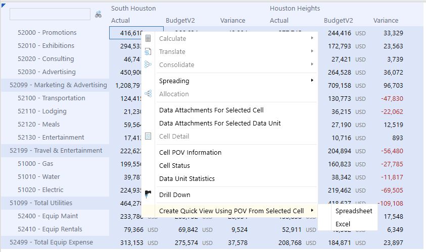

With little effort, you can start slicing and dicing any number using that one action. Analysis in a few clicks.

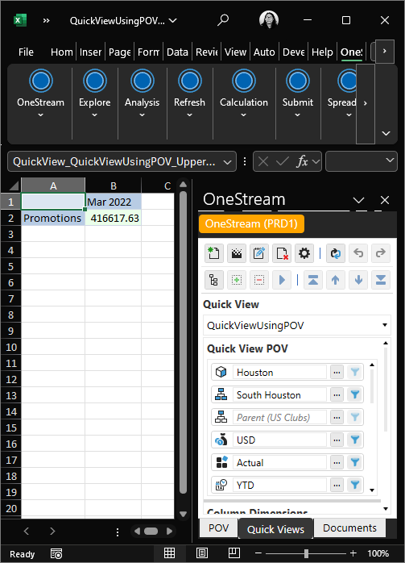

If you have a great idea like this, be sure to log it in IdeaStream, which you can access via the OneStream Community page (community.onestreamsoftware.com.) The OneStream development team really pays attention to this, and it is partially how they prioritize new features. If you have never been, be sure to check it out and vote up the ideas you find interesting. During Splash 2023, in Washington D.C., at the regular Excel presentation, Gidon Albert suggested a new feature to have drill down available on XFGet cells and asked the room to vote it up on IdeaStream. Well, Gidon asked and the community responded, and the development team listened. By Splash 2024, the drill down on XFGet cells was a welcome addition to the platform. So, get out there and have a look at the current suggestions and add your own!


### Creating A Quick View From Scratch

There are a few different ways to create a Quick View from scratch. The most common way is to go to the OneStream Menu and select Quick Views > Create Quick View.

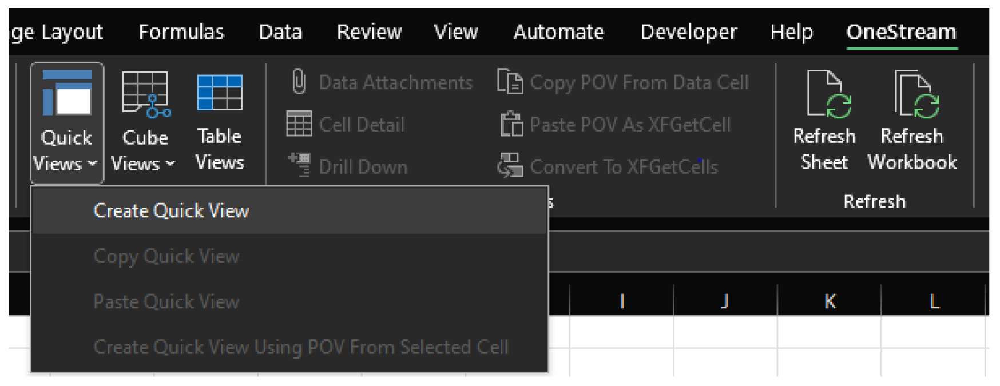

The Quick View will give you an option to name it, or it will default to `QuickView1`. As you add  additional Quick Views, OneStream will auto-index the number so you don’t end up with the same name for multiple Quick Views. As per our discussion with Cube Views, if you are planning on having multiple Quick Views on the same sheet, it is best to decide if you plan on stacking them horizontally or vertically. It is not recommended to do both, as this can create conflicts. If you plan on stacking vertically, keep the default Insert or Delete Rows when Resizing Cube View Content. Otherwise, if you plan on organizing horizontally, select the column action. It is not recommended to select both.

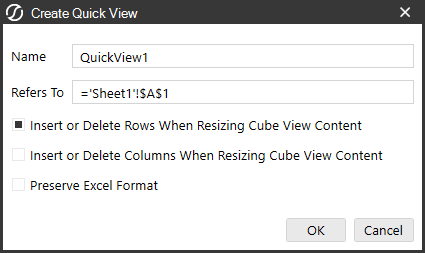

The Quick View will appear on your sheet. By default, time will always appear in the column, and account will always appear in the rows.

#### The Importance Of The POV

When you first create a Quick View, your individual user POV is going to dictate the Quick View POV. If you are unsure as to what your POV is, open the tab titled POV. This is the same POV you will have when you log into the OneStream application. It can change as you navigate to different workflows, so be cognizant of what your POV is on a Quick View.

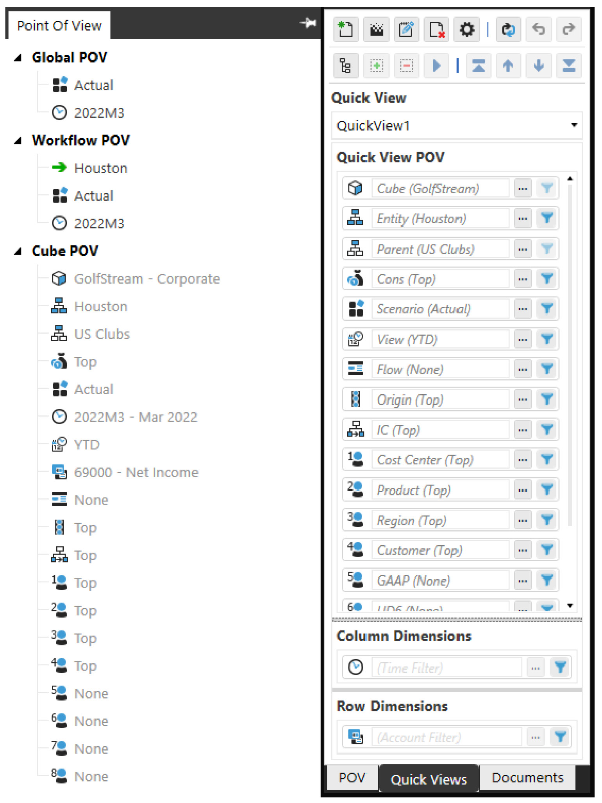

As you change your POV – either in the application or in Excel – the Quick View POV will follow suit unless you explicitly change it. Notice the color of the POV in the Quick View. It’s shaded in gray and indicates what dimension it is. This means that you are using the POV. For example, in the above Figure, you can see that my POV for the Scenario dimension is set to Actual because it is displayed in gray and lists the dimension prior to the member. In order to override the POV, you can change it by selecting the ellipses (…) next to the name, or by typing in the member name directly. This removes the dimension name and will display your selection in black text. This indicates that you have overwritten the POV with your own selections, and those selections are decoupled from the user’s POV.

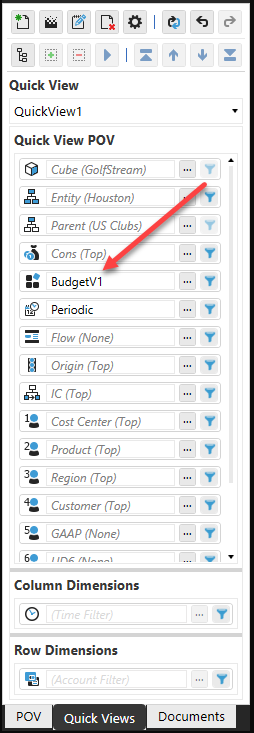

The other important distinction is my POV member versus my Member Filter. This is another gotcha, and I can see why. It’s a little confusing, especially when I start to drag and drop dimensions from my POV to my grid in either the rows or columns. Remember, the POV member is explicitly listed in the box and is either using the user’s POV or is overwritten and displayed in black text. The Member Filter is different to the POV. The filter is what is in that little funnel to the right of the POV, as you can see in the below graphic. When you create a Quick View, you have no control over what members are placed in the Member Filter by default. This is something the OneStream platform controls; you cannot set it. By default, the Member Filter on all dimensions is going to be set to `Root.Children`. The only exception is the  View dimension, which contains the members `YTD` and `Periodic`.

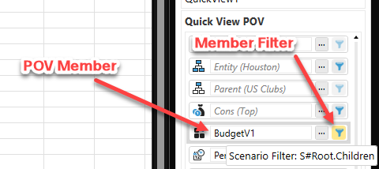

When the dimension is in the POV, the Member Filter has no impact on the Quick View. I want to reiterate this: no impact! Likewise, when the dimension is in the column or row, the POV has no bearing on what is shown in either the column or the row. In the above example, you can see that I have `BudgetV1` set as my POV, and the filter is set to  `S#Root.Children`. Let’s explore what happens when I move this down to my Column  dimension.

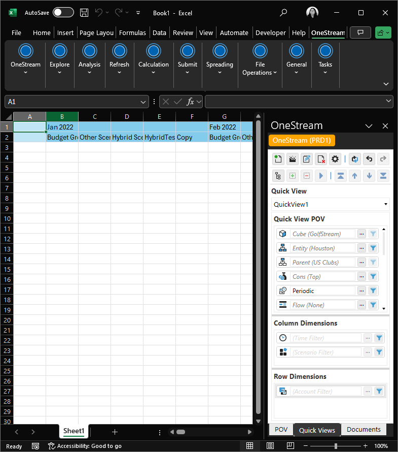

Notice that the Member Filter takes over. It is showing me the children under the root Scenario dimension, not `BudgetV1` that I set it to in the POV.  If I inverse the move, and return the Scenario dimension back to the POV, notice that it will revert to the single POV member `BudgetV1` and will still retain the filter that I had in place.

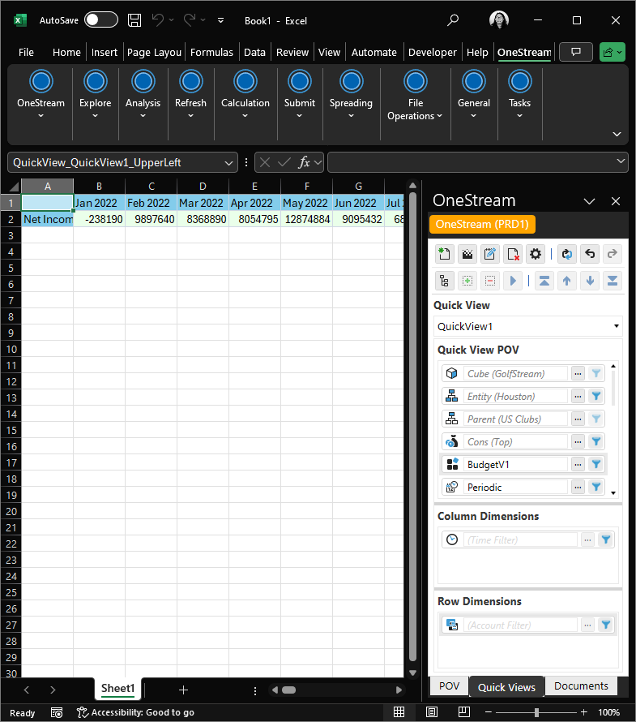

The bottom line is don’t get confused or frustrated. Just know the difference between the POV member and what is in your Member Filter.

### Another Way To Create A Quick View From Scratch

If you are a bit more adventurous and really know your OneStream metadata, there is another way to create a Quick View from scratch. You can simply type in the POV you wish to create. You are, however, limited to only using the member name, not the description. This is because OneStream allows you to use the same description across multiple members in the same hierarchy. You must also prefix each dimension because you can have duplicate member names across different dimensions. In other words, don’t just type in `2022M3`; for example, it must be `T#2022M3` to  specify it is part of the Time dimension. I’ve included this handy chart on dimensional prefixing.

|Col1|Col2|Col3|Col4|Col5|Col6|Col7|
|---|---|---|---|---|---|---|
||||**Dimension Prefixing**||||
|A# - Account|A# - Account|A# - Account|I# - IC (Intercompany)|T# - Time|T# - Time|T# - Time|
|C# - Consolidation|C# - Consolidation|C# - Consolidation|O# - Origin|UD1# - UD8# -<br>Custom Dimensions<br>(these also work!<br>U1# - U8#)|UD1# - UD8# -<br>Custom Dimensions<br>(these also work!<br>U1# - U8#)|UD1# - UD8# -<br>Custom Dimensions<br>(these also work!<br>U1# - U8#)|
|E# - Entity|E# - Entity|E# - Entity|P# - Parent|V# - View|V# - View|V# - View|
|F# - Flow|F# - Flow|F# - Flow|S# - Scenario||||

Figure 11.64 The advantage of this method for the power user is that you can define many members at once, including expansion operators. And if you don’t remember what a member is called, use the Select Member button to browse out for the member in the hierarchy. An active Cube View is not required to use this function.

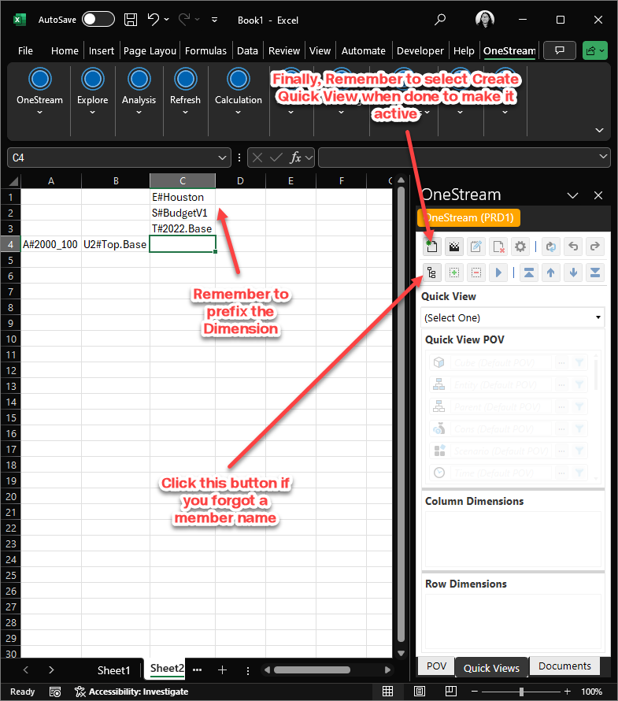

Once you have defined all the dimensions and expansion operators, highlight the range of cells and select Create Quick View. Any dimension not defined will show up in your Quick View POV and will inherit the POV from the user. The report below in Figure 11.66 is the result of what I typed in Figure 11.65.

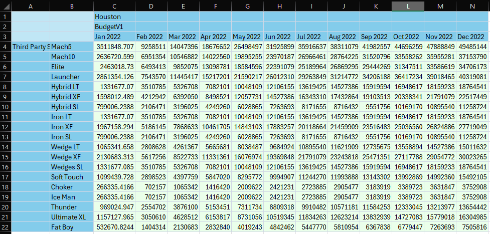

### Creating A Quick View From A Cube View Or Existing Quick View

If you are new to Quick Views, this is also a good way to get started. You leverage existing Cube Views or Quick Views for your own analysis (although arguably the easiest way is to create a Quick View from a data explorer grid.) Under the Quick View menu, you will see an option called Create Quick View using the POV of the selected cell. Let’s create a new Quick View from the one we just authored in Figure 11.65. The `Fat Boy` product needs some examining, and I want to have my own Quick View in order to drill  into some details.  Simply select the cell and go to Quick View > Create Quick View Using POV From Selected Cell.

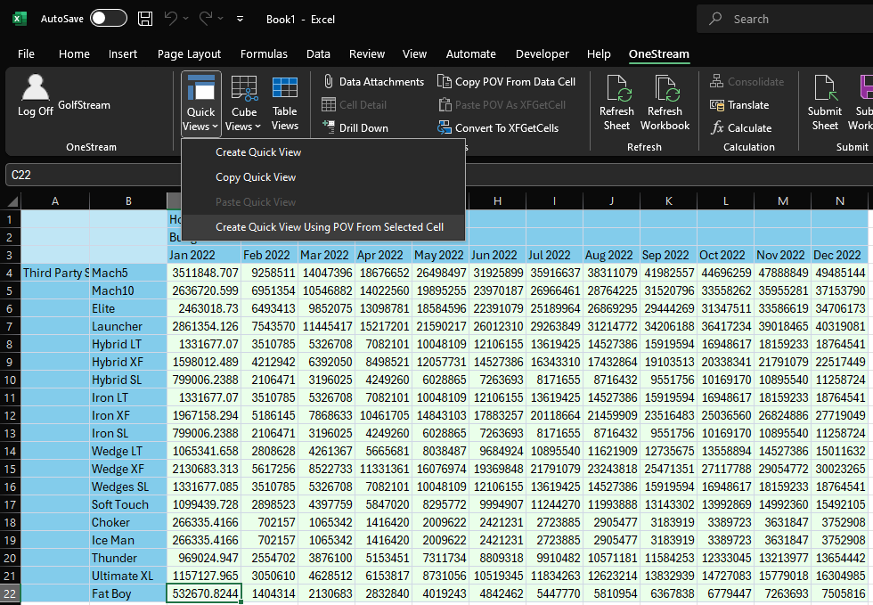

The resulting Quick View will have an overwritten POV, as indicated by the black text in the Quick View POV. The Quick View will also have account defined in the row, and time in the column. Note that the POV for this new Quick View is not set to the POV; it is set based on the intersection of the Quick View it was authored from, which is why the POV will be in all-black font.

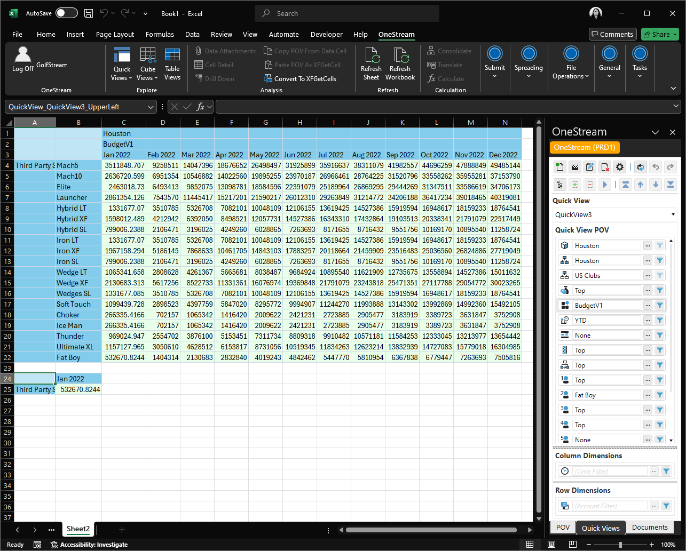

### Achieving Asymmetry In Quick Views

The final topic on Quick Views is working around asymmetry. We discussed asymmetry at the beginning of the chapter and recommended Cube Views to combat this due to the unlimited nature of the number of rows and columns you can add to them. In some cases, Quick Views could be used to represent asymmetry using cross-dimensional member references. Let’s say we have a requirement to see one product aligned to one account. For example, we want to see third-party sales for the `Mach5` product and `Returns` and allowance for the `Hybrid LT` product. In other words, two rows. Quick Views present a unique challenge as we only have one real row and column to work with. And there is no way to explicitly limit the products to an account when introducing two dimensions to a row. This is the traditional result of our efforts using a Quick View.

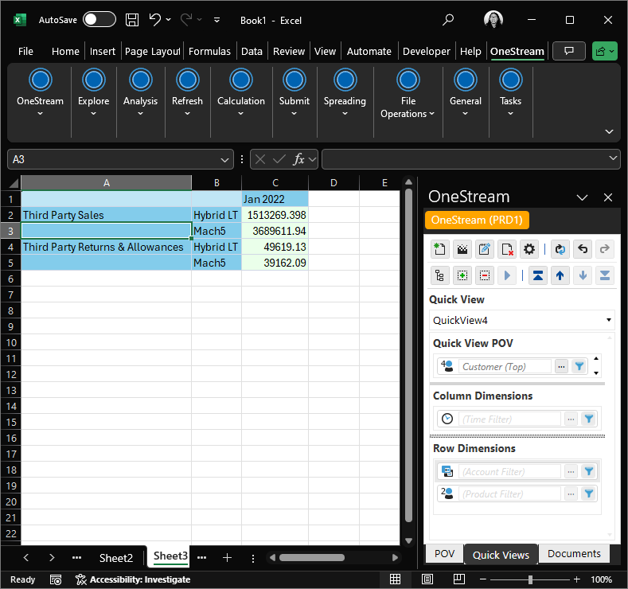

But there is another way. Instead of formally introducing the UD2 dimension into the row, I can leverage a little scripting to call out the corresponding partner member I want to see with the account. Place the Product Filter back into the POV. Open the Account Filter and use the colon symbol to join third-party sales (`A#2000_100`) with the Product dimension Mach 5 (`UD2#Mach5`). The  resulting concatenation overrides the POV and allows you to use just one row to represent a very succinct data point. This is sometimes referred to as cross-dimensional member operators.

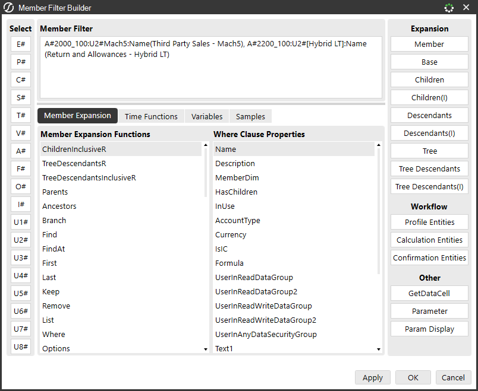

I do recommend using the `Name` function (after) to give the row a precise name. Without it, it will  only show the account name.

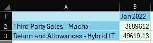

## Conclusion

You made it to the end on Excel and Spreadsheet! We’ve spent a lot of time reviewing the plethora of options available to you from a reporting perspective in Excel and Spreadsheet. After reading the chapter, my sincere hope is that you have the tools you need in order to use Cube Views and Quick Views in a meaningful way that will satisfy the requirements of your customer or organization. This chapter is the culmination of years working in the OneStream ad-hoc toolset, and coming from other Excel add-ins. I hope you enjoyed reading this as much as I enjoyed writing it.

## Epilogue

This was from Presidents Club 2020 in Cancun, Mexico, with my favorite people at OneStream Software. It’s the first time that my wife got to meet Roy and Diane, and our last trip and last meal before the COVID-19 lockdown took effect. We were blissfully unaware of the year that would unfold in front of us. I’m glad we had that time together before the whole world shut down.


From left to right: Katy & Tucker Pease, Allie (my lovely wife) & Nick Blazosky, Diane Terrusa & Roy Googin.
