# Setting Up Your Workspace

A well-organized Workspace is the foundation of a productive and efficient OneStream experience. Whether you’re a new user exploring the platform for the first time, an experienced administrator looking to fine-tune your environment, or a developer eager to better manage your development projects in an organized way, setting up your Workspace correctly ensures seamless navigation, improved workflow efficiency, and quick access to essential tools and data. OneStream is a powerful and flexible platform designed to unify financial processes such as budgeting, forecasting, reporting, and consolidation. However, to fully leverage its capabilities, it’s crucial to tailor your Workspace to your specific needs. From customizing dashboards and setting up workflow structures to adjusting user preferences and configuring security settings, a properly configured Workspace enables you to work smarter and faster. In this chapter, we’ll guide you through the key steps to optimize your OneStream environment. You’ll learn about: •Navigating the OneStream interface to understand its layout and key components. •Workspace Properties explained to provide detailed explanations of Workspace properties and how to use and configure them. •Managing security and access controls to ensure the right users have appropriate permissions. •How to set up a Workspace to serve as a starting point for future development. •Workspace Filter Functionality to help you focus on what you’re working on and/or reviewing. By the end of this chapter, you’ll have a fully customized OneStream Workspace that enhances your efficiency and gives you the tools to leverage OneStream Workspaces and extend your use of the OneStream platform. Let’s dive in and start setting up your Workspace for success!

## Navigating The Workspace Interface

OneStream’s Workspace interface is designed for efficiency, providing users with seamless access to key tools, reports, and workflows. Understanding how to navigate the interface ensures a smoother experience, allowing users to maximize productivity while leveraging OneStream’s powerful financial planning, reporting, and analytics capabilities. This section provides an in-depth guide to the key components of the OneStream Workspace and how to navigate them effectively.

### Toolbar Buttons

Below is a complete inventory of the Workspace toolbar buttons and a description of their function.

1.Create Group: Create a new Cube View group (if the cursor is on the Cube View groups icon), dashboard group (if on the dashboard groups text of a maintenance unit), or data management group (if the cursor is on the data management icon).

2.Create Profile: Create a new Cube View Profile (if you have selected a Cube View Profile) or dashboard profile (if you have selected a dashboard profile).

3.Manage Profile Members: Displays the profile builder dialog box if you have selected either a Cube View Profile or a dashboard profile. If the Cube View or dashboard is not in the default Workspace, a tool tip will display the Workspace prefix when you hover the cursor over the group name.

4.Create Workspace: Create a new Workspace (security role-based).

5.Create Maintenance Unit: Create a new maintenance unit to store dashboards.

6.Create Dashboard: Create a new dashboard to attach components to.

7.Create Cube View: Create a new Cube View when viewing Cube View groups.

8.Create Sequence: Create a new sequence within data management groups.

9.CreateStep: Create a new step within data management groups.

10.Create Dashboard Component: Opens a dialog listing components to pick to create.

11.Create Data Adapter: Create a new data adapter to add to a dashboard component.

12.Create Parameter: Create a new parameter to create lists or use in formatting.

13.Create File: Create a new file to be used in the Workspace.

14.Create String: Create a new string to use on Cube View headers.

15.Create Assembly: Create a new Workspace Assembly.

16.Delete Selected Item: Delete selected component item. You can select multiple Cube Views, Cube View groups, and data management group steps and sequences. You can only delete empty Cube View groups, and multi-select more than one data management sequence and step to delete within the same data management group. Multiple Cube Views can only be selected and deleted if they are in the same Cube View group. You cannot delete data management sequences or steps within different data management groups at the same time. For an Assembly, you must be on the Properties tab to be able to delete it.

17.Rename Selected Item: Opens the Rename dialog box.

18.Cancel All Changes Since Last Save: Will undo all changes made to an object.

19.Save: The button is visible when adding or modifying an object.

20.Copy: Makes a copy of the selected items. Select more than one item of the same type by pressing and holding the Ctrl button and clicking each item with the mouse. You can also select the items to copy, then right-click to open a context menu. You can only copy items of the same type.

21.Paste: Pastes copied items into the selected destination. `_Copy`is appended to the  name of the newly pasted item.

22.Search: Search for a component using the Select Workspace Object dialog box. Cube Views and data management sequences and steps are added to the list of searchable objects.

23.Plus Sign: Adds a data management group sequence or step, Cube View row or column, or dashboard component.

24.Move Up: Moves up a data management group sequence or step, Cube View row or column, or dashboard component.

25.Move Down: Moves down a data management group sequence or step, Cube View rowor column, or dashboard component.

26.Minus Sign: Removes a data management group sequence or step, Cube View row orcolumn, or dashboard component.

27.View Dashboard: Displays dashboard.

28.View Dashboard in Design Mode: Displays dashboard with the structure outlined to visually select objects to navigate to directly.

29.Show Objects That Reference the Selected Item: Opens the Object Usage Viewer and lists all objects that reference the selected item.

30.Object Lookup: Opens the Object Lookup dialog box, letting you search for any object in the application, such as all Workspaces that contain data management sequences and any other object.

### Workspace Structure

Workspaces are incredibly powerful when it comes to organizing dashboards. They also provide developers with dedicated development environments where they can build dashboards and application functionality within an isolated Workspace. With the recently added capability to build Cube Views, data management sequences, and Workspace Assemblies within Workspaces, solutions can truly be developed for packaging and distribution, whether you want to share a solution or create a solution for the Partner Exchange or Community Exchange. The introduction of Workspaces has led to some changes to the Workspaces (formerly dashboards) user interface, as the Workspaces, profiles, and default objects are stored slightly differently than before Workspaces were available in the OneStream Platform. Below are some main differences, as well as items that have remained the same. Cube View groups and data management groups that are not built within a new Workspace are located under the default maintenance unit, which is a child of the default Workspace. Maintenance units that existed before Workspaces were available are under the default Workspace.

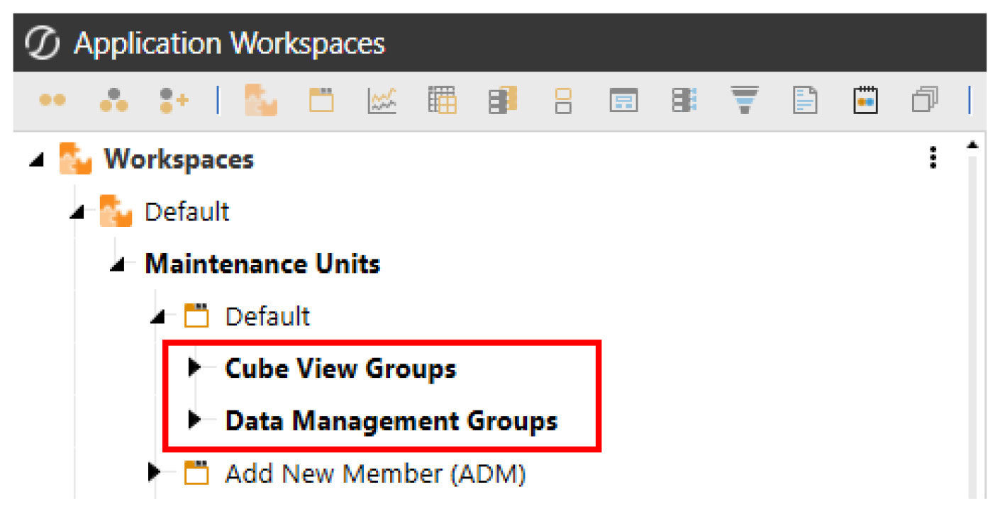

Dashboard profiles and Cube View Profiles are globally located under the Workspaces tree; these profiles are not Workspace-specific and have remained in the same location.

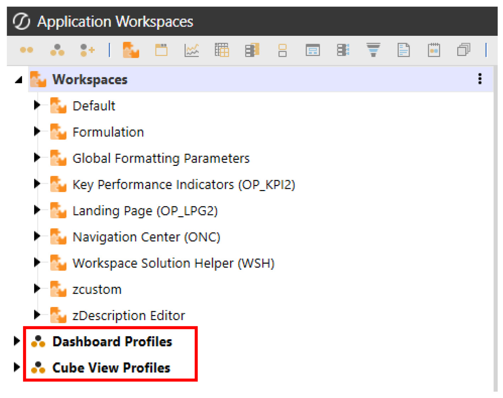

New Workspaces that have been created manually, as well as some solutions from the Solution Exchange that began using Workspaces upon deployment of the solution, contain their own maintenance units, Cube View groups, data management groups, and Workspace Assemblies.

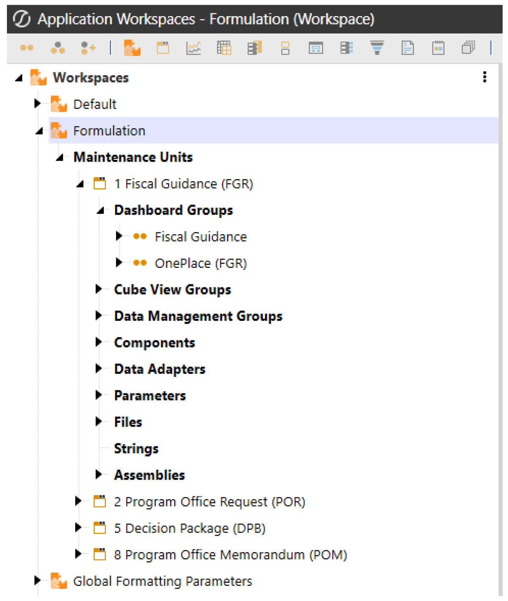

## Workspace Properties Explained

### General (Workspace)

#### Name

The name of your Workspace should reflect its purpose and how you plan to organize your work. There are several approaches you can take when naming Workspaces: •By Development Groups – Useful if your organization has distinct teams working on different aspects of OneStream. •By Functionality – Ideal for grouping dashboards and tools, based on their specific purpose, such as reporting, analysis, or automation. •By Workstreams – A great option for aligning Workspaces with business processes, such as Financial Close, Planning, or Forecasting. •By Personas – Where Workspaces are named, based on user roles and the dashboards they interact with, ensuring easy navigation and usability. •By Development Teams – If OneStream is used as a development platform, Workspaces can be named after development teams, allowing for clear ownership and organization. Choosing the right naming convention helps maintain clarity, improves collaboration, and ensures that users can easily locate and work within their designated environments.

#### Description

This field provides a brief description of the Workspace to help users understand its purpose and intended use. Sometimes, the name of the Workspace alone doesn’t clearly convey its function, so the description offers an opportunity to provide additional context that the name may not capture. For example, I often include details about how and where the Workspace’s dashboards will be used. If I have a Workspace named `Financial Close`, I might enter the description as “Financial  Close Workflow Dashboards” to clarify its specific role. While descriptions are not mandatory, they are a helpful way to provide more clarity and ensure users know exactly what they are looking at and how it fits into the broader workflow. This added context can make navigation and understanding much easier for everyone involved.

#### Notes

This free-form text field allows you to enter notes that provide valuable context about the Workspace. Developers can use this field to document important information, such as completion dates, the status of dashboards in progress, or reminders about ongoing projects. While entering notes is not required, doing so can significantly enhance collaboration and clarity within the Workspace. By using this field, developers can easily track progress and communicate key updates or tasks associated with the Workspace. For example, you might note when a particular task was completed, outline any pending issues, or list goals for upcoming work. These notes not only serve as a helpful reference for the person working on the Workspace but can also provide useful context to other team members or users who interact with the Workspace in the future. Ultimately, this field adds contextual value, based on the specific purpose of the Workspace and any additional information that may be useful to users, making it easier to manage projects and collaborate efficiently.

#### Substitution Variable Items

Substitution variables are a convenient way to create and manage variable references within a Workspace, allowing developers to use the same value or text throughout the Workspace without needing to retype it. These variables are not displayed directly on the Workspace interface; instead, the field shows as (Collection) with an ellipsis button. Clicking this button opens a dialog where you can view or manage the substitution variables. To view or add substitution variables, simply click the ellipsis button, which will open a dialog box containing any existing variables. Add substitution variables as needed from this window by clicking the Add Item button and then entering the substitution variables suffix name and substitution variables value. When using substitution variables in your Workspace, remember to prefix them with `WSSV `when referencing them on a dashboard or object. For example, if you have  a substitution variable named `Developer`, you would reference it as `|WSSVDeveloper|`. The  exercise below demonstrates how to create and use this example.

### Security

#### Access Group

The Access Group determines who can access the Workspace. Users in this access security group are granted permission to view the Workspace and its dashboards, but they do not have the ability to modify the Workspace or any of its objects. This ensures that while they can interact with the content, they cannot make changes to the Workspace’s structure or underlying components.

#### Maintenance Group

The Maintenance Group controls who can manage and administer the Workspace. Users in the maintenance security group can access the Workspace, view its dashboards, and have the necessary permissions to modify the Workspace and its objects. Depending on your OneStream security structure, users may belong to multiple or nested security groups. This flexibility allows you to apply layered security, offering more granular control rather than limiting access to a simple either/or selection. This approach enables you to tailor permissions based on specific roles and responsibilities within the Workspace.

### Sharing

#### Is Shareable Workspace

This setting allows you to control whether objects, such as parameters or dashboards within the Workspace, can be shared with other Workspaces for re-use or reference. For example, if your Workspace contains objects like parameters that are used in other Workspaces, you would want to set this property to True to make the Workspace shareable. This ensures that the parameters, as well as other dashboard objects, are accessible to other Workspaces. An important step to keep in mind is that the Workspace name will need to be added to the Shared Workspace Names property on the Workspaces it will be shared with. If the property is set to False, and another Workspace tries to use a parameter from your Workspace, the parameter will not be recognized. As a result, the user will be prompted to input the parameter manually. In essence, this property facilitates outward sharing, allowing other Workspaces to access your objects. The next property, on the other hand, is designed to allow inward sharing, enabling your Workspace to use objects from other Workspaces.

#### Shared Workspace Names

This setting allows you to define the Workspaces from which your Workspace can re-use or reference objects. The Default Workspace is always shared and accessible by any other Workspace, regardless of whether it’s explicitly listed in this field. To re-use objects from other Workspaces, enter the names of the Workspaces you want to include in a comma-separated list. Be sure to order the list based on how you want shared items to appear in any search results when referencing them within your Workspace. The list of shared Workspaces can be modified at any time. However, it’s important that the Workspaces you list here have the Is Shareable Workspace setting set to True in order for the sharing to work properly.

### Assemblies

#### Namespace Prefix

This field is important when working with Workspace Assemblies in OneStream, as it allows you to write syntax that can execute code from other Workspaces or from within the same (current) Workspace. This property lets you define a shorter or code-based name, making it easier to reference and use in your Workspace Assemblies.

#### Imports Namespace 1–8

When a Workspace Assembly depends on another Workspace, these properties allow you to dynamically reference that dependency by specifying the source code Assembly in this field. The reference is then passed into the current Workspace Assembly. This is especially helpful when managing changes to Assemblies, as the reference is stored in the Workspace properties. This eliminates the need to search for and update the reference within the Assembly itself, streamlining maintenance and reducing the chance of errors.

#### Workspace Assembly Service

Here, you define the name of the Workspace Assembly Service Factory. The correct syntax is `AssemblyName.FactoryName`, where `AssemblyName` refers to the name of the Workspace  Assembly, and `FactoryName` is the specific Service Factory type within that Assembly.  `FactoryName` is the actual name of the Service Factory, which is typically the same as the name  of the file containing its code (minus its extension; e.g., “.cs” or “.vb”). For a more detailed explanation of Workspace Assemblies, including their concepts and various examples, refer to Chapter 5, where these topics are explored in depth.

### Text 1-8

The Text1-8 fields enable you to store string values that can be easily referenced within Workspace Assemblies. For instance, if you have a string that needs to be referenced in an Assembly – but may change over time – the typical approach would require developers to update the Assembly every time the string changes, adding unnecessary administrative burden. However, by utilizing the Workspace text fields, developers can directly access these fields within the Assembly, eliminating the need to modify the Assembly itself. This approach not only reduces maintenance efforts but also makes the Assembly rules more dynamic and flexible, allowing them to automatically adapt to changes without requiring manual intervention. For example, to reference a `Text1` field within an Assembly, you can use the following syntax:  Dim WSText1 AsString = BRApi.Dashboards.Workspaces.GetWorkspace(si, False, args.PrimaryDashboard.WorkspaceID).Text1 This allows the Assembly to dynamically use the value stored in the Text1 field, making it easier to manage updates without modifying the Assembly code.

## Configuring Application Security For Workspaces

To ensure your developers have the required access to the Workspaces page, and can create or modify Workspaces, it’s crucial to first review the Application Security Role assignments. These roles define what users can and cannot do within the OneStream platform, including their ability to access certain pages and perform specific actions such as Workspace creation or modification. Here’s how to approach it: 1.Review Existing Role Assignments: Check the current security roles assigned to developers. You’ll want to confirm whether they have the appropriate permissions to access the Workspaces page, which includes both viewing and modifying Workspace configurations. 2.Identify Required Permissions: Ensure that the necessary security rights are granted, such as the ability to create new Workspaces, modify existing ones, and manage security settings within the Workspaces. You may need to assign specific roles like “Workspace Administrator” or “Workspace Creator”, depending on the level of access required. 3.Administrator Involvement: In most cases, your administrator will need to take the lead in reviewing and adjusting these security role assignments. This may involve adding or removing specific roles for developers, ensuring they have the appropriate level of access based on their responsibilities. 4.Make Modifications if Necessary: If roles and permissions are not configured correctly, your administrator will need to modify them. This can include granting access to certain features or restricting actions to ensure that only authorized users can make significant changes, such as creating new Workspaces or modifying security settings. 5.Testing and Verification: After adjustments are made, it’s important to test whether developers can successfully access the Workspaces page and perform the necessary tasks. This ensures that the role assignments are working as intended and that developers have the permissions they need to be productive. By reviewing and fine-tuning the application security role assignments, you can ensure that developers have the right level of access to efficiently work within the OneStream platform while maintaining the necessary security controls. From the Application tab, navigate to Security Roles under the Tools section. This page displays the security assignments for both Application Security Roles and Application User Interface Roles. In the Application Security Roles section, review the security groups assigned to the following roles: •AdministerApplicationWorkspaceAssemblies: Users in this group have the ability to modify existing Assemblies as well as create new ones. •ManageApplicationWorkspaces: Users in this group can create new Workspaces. Depending on your organizational needs, you may want to limit Workspace creation to certain users or administrators. This ensures that only approved users can create Workspaces, helping to prevent unnecessary clutter. With this approach, developers can still build and modify Workspaces with the appropriate security assignments, but they will need an administrator to initially create the Workspace for them. By carefully reviewing these security roles, you can maintain control over Workspace creation and Assembly modifications while still empowering developers to work within the platform.

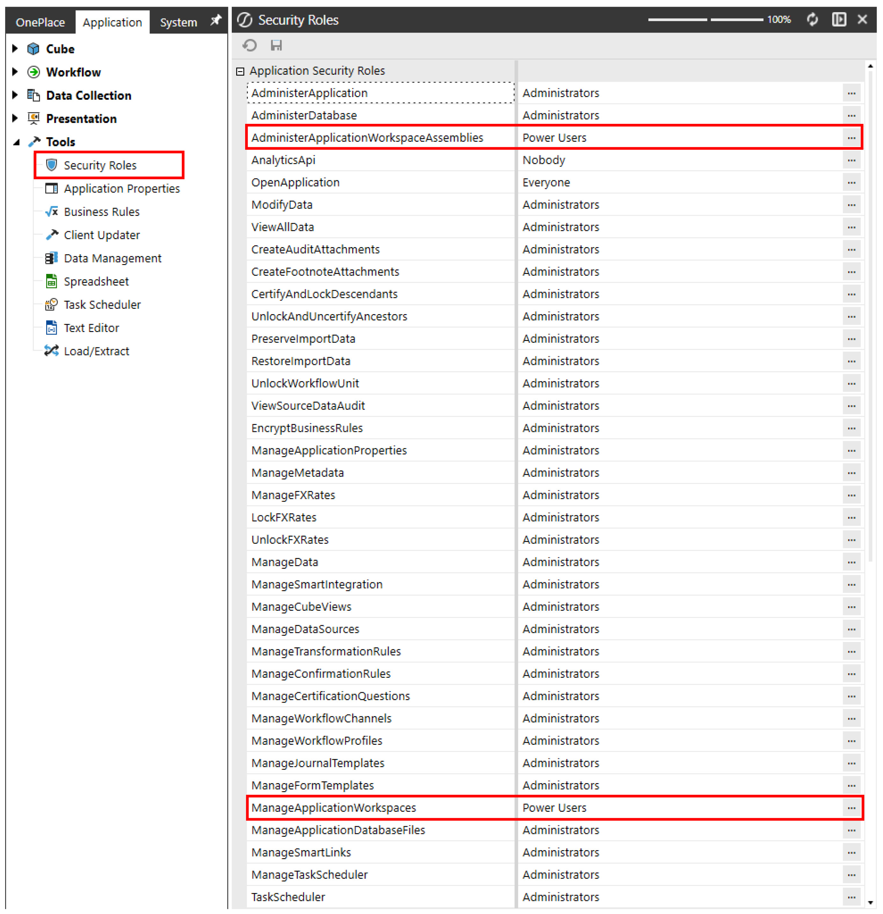

In the Application User Interface Roles section, review the WorkspaceAdminPage security role assignment. To grant developers access to the Workspaces page from the Application tab, assign a security group that includes your developers to this role. Without this assignment, they will not have access to the Application tab and, consequently, will be unable to navigate to the Workspaces Admin Page.

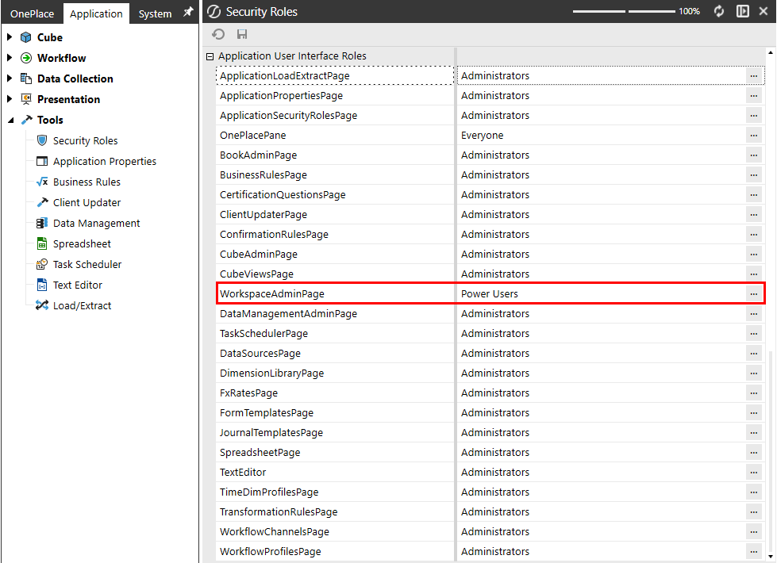

## Creating A New Workspace

Creating Workspaces in OneStream is simpler than you might expect. With just a few clicks, you can set up multiple Workspaces, each with tailored security settings to ensure the seamless separation of workstreams. This allows your developers to dive straight into their dedicated environments without delay. Now that you understand Workspace properties and how to use security groups to assign the right roles, let’s walk through a straightforward yet powerful example of setting up a Workspace effectively. This exercise will give you hands-on experience configuring Workspaces, reinforcing key concepts such as security assignment, access control, and environment customization. By the end, you’ll be equipped with the practical knowledge needed to structure Workspaces efficiently, empowering your teams to collaborate effectively while maintaining security and organization. This exercise will be continued in Chapter 10, where we walk through an end-to-end Workspace exercise, incorporating Workspace Assemblies, showing examples of sharing between Workspaces, and how to export a packaged solution with a single application export. Navigate to the Application tab and select `Workspaces` under the `Presentation` section.

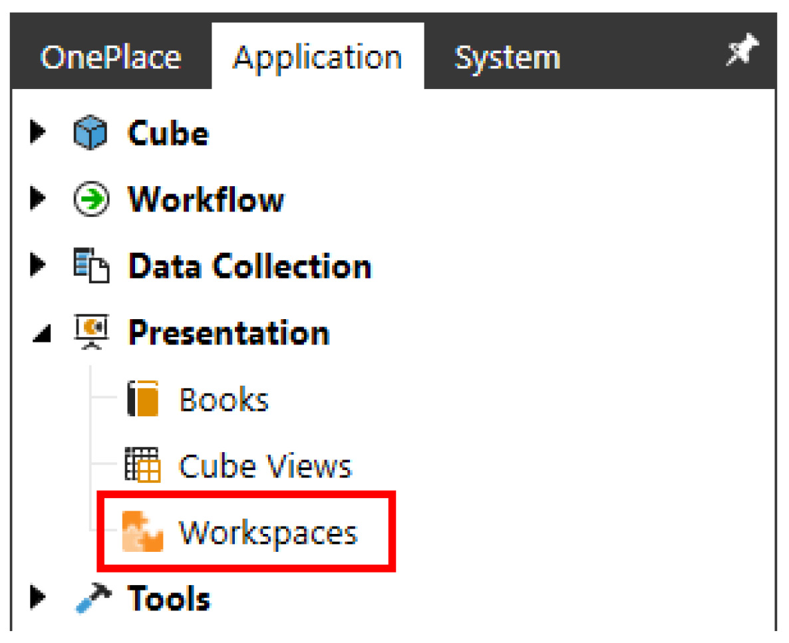

Click on `Workspaces` and then click the Create Workspace button from the toolbar menu.

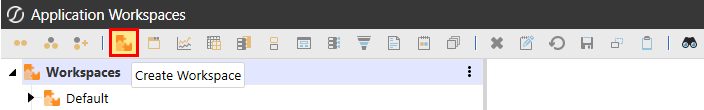

Type in the name of your Workspace and then click Save. For this exercise, we’ll name our Workspace `Formulation`, as this Workspace will encompass all Workflow dashboards related to  the budget formulation process.

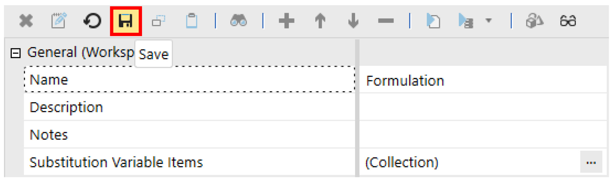

> **Note:** When renaming Workspaces, check the Workspace inventory for any Workspaces

that list your Workspace as a Shared Workspace; these will need to be updated to reflect the new name and allow sharing to remain undisturbed. Figure 3.9 Type into the following properties (optional): •Description: Formulation Workflow Dashboards •Notes: Fiscal Guidance completed 2/20. Decision Package completed 3/15.

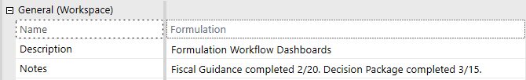

Click the Edit button on the Substitution Variable Items property; this will open a dialog box where you can add substitution variables. For this exercise, we will create two substitution variables that we will display on dashboards in a later step.

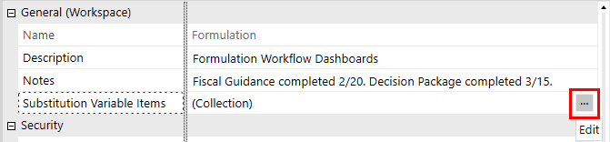

Once the Substitution Variable Items dialog box opens, click the Add Item (+) button. Type Developer into the Substitution Variable Name Suffix, and Jessica into the Substitution Variable Value. Click the Add Item (+) button again. Type StartDateinto the Substitution Variable Name Suffix, and 3/1/2025into the Substitution Variable Value.

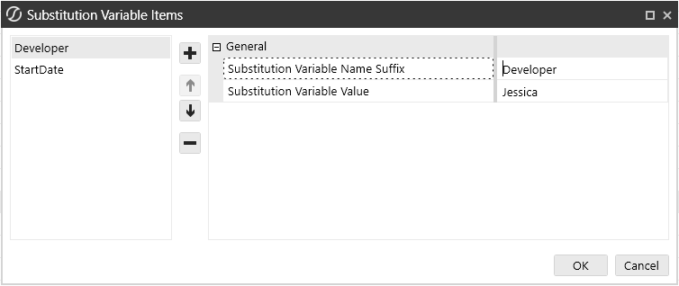

To display Workspace substitution variables, the syntax is `WSSV` followed by the substitution  variable name suffix. For the variables we created, you would use `|WSSVDeveloper|` and  `|WSSVStartDate|` to display their respective values.  From the Substitution Variable Items dialog box, hover over the Suffix field to view the tool tip, which will provide additional guidance on the syntax.

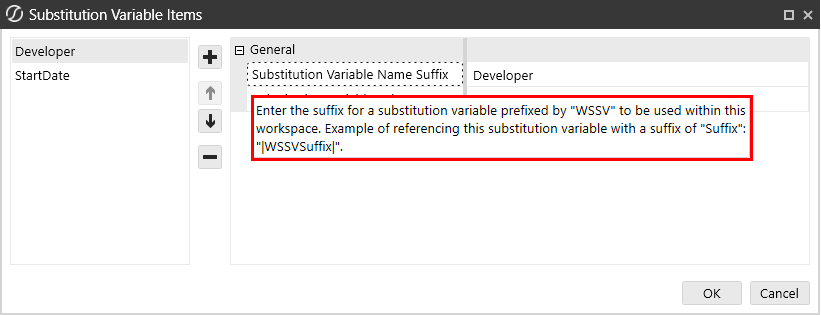

Click the Edit button on the Access Group property and select a security group. Repeat this step to select a security group for the Workspace’s Maintenance Group property.

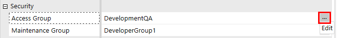

Set the Is Shareable Workspace property to True. Enabling this property allows us to open a dashboard within the Workspace directly from a button on the landing page, which is stored in the `Landing Page (OP_LPG)` Workspace.  In this exercise, our Workspace will contain Cube Views that use parameters to dynamically apply Cube View formatting, eliminating the need to recreate the parameters. To enable this functionality, we’ll add the Shared Workspace Name for Global Formatting Parameters, allowing these global parameters to be shared with our new Workspace and ensuring the appropriate formatting is applied.

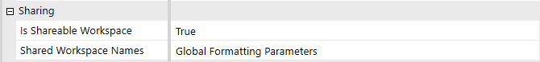

> **Note:** We must also add the FormulationWorkspace name to the Landing Page

`(OP_LPG)` Workspace’s Shared Workspace Names to enable shared navigation.  The Workspace should look like the following figure, once all the preceding steps have been completed.

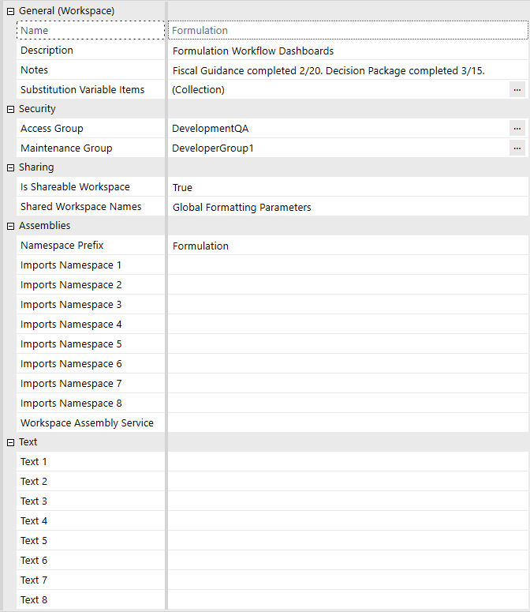

In Chapter 10, we will walk through an end-to-end Workspace exercise where we’ll demonstrate how to build maintenance units within the Workspaces and configure Workspace Assemblies within the Workspace. For the final step of this exercise, let’s explore how to use the substitution variables we created earlier. Remember the substitution variables we set for Developer and StartDate? We’ll use these variables to display key information on the dashboard’s Page Caption, such as the developer’s name and the date when development started. On the dashboard shown below, notice that the Page Caption property has been filled in with the following syntax: `Developer: |WSSVDeveloper| - StartDate: |WSSVStartDate|`.

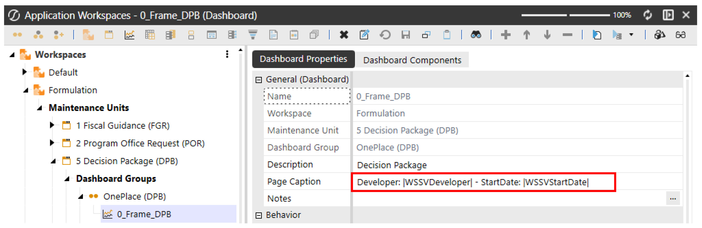

When the dashboard is rendered, notice the dashboard’s title now displays the substitution variable values that we defined in the Workspace properties and entered into the dashboard’s Page Caption property.

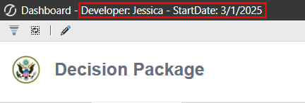

## Workspaces Filter Functionality

In OneStream, Workspace Filters allow users to refine the Workspaces displayed within their filter selections. This allows developers to focus on their dedicated development Workspaces, and power users can limit what they want to see without cluttering the screen with Workspaces they are not concerned with. This filtering functionality enhances navigation and organization, allowing users to quickly access relevant Workspaces without having to manually search through potentially long lists of Workspaces used throughout the organization.

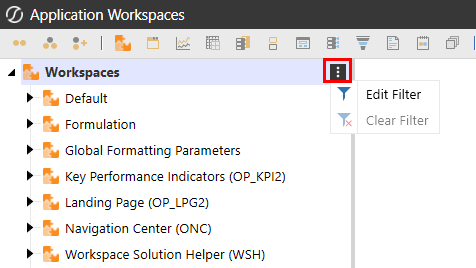

By effectively using Workspace filters, users can focus their own view on prioritized Workspaces, optimizing their overall experience within OneStream. Conclusion Setting up your OneStream Workspace is a crucial step toward maximizing efficiency and productivity. By customizing dashboards, configuring workflows, adjusting user preferences, and managing security settings, you can create an environment tailored to your specific needs. A well- organized Workspace structure allows you to navigate the platform seamlessly, access critical data quickly, and streamline your financial processes. In this chapter, we covered: •Navigating the OneStream interface to understand its layout and key components. •Workspace Properties Explained to provide detailed explanations of Workspace properties and how to use and configure them. •Managing security and access controls to ensure the right users have appropriate permissions. •How to set up a Workspace to serve as a starting point for future development. •Workspace Filter Functionality to help you focus on what you’re working on, and/or reviewing. By applying these principles, you can build a Workspace that not only meets your operational requirements but also enhances your ability to analyze data and make informed decisions efficiently. As you continue using OneStream, don’t hesitate to refine your setup further to adapt to changing business needs. Now that your Workspace is properly configured, you’re ready to explore the next steps in leveraging OneStream’s full capabilities. We will move forward and complete another exercise in Chapter 10.
