# Understanding Assemblies

## The New Business Rules

My wife used to tell me that 40 was the new 30 (until she turned 50 😊😊). Similarly, Assemblies are the new business rules. Now, almost all types of business rules are available as Assemblies. If you are unfamiliar with Assemblies, no worries; I will walk you through the concepts and the transition from business rules to Assemblies. OneStream has a unique and powerful approach to business rules: we have different rule types for various aspects of the application. We have finance BRs, Cube View Extender BRs, dashboard data set BRs, dashboard extender BRs, dashboard XFBR string BRs, extensibility rules BRs, and Spreadsheet BRs.

### Business Rules 101

For users new to OneStream, a quick explanation of business rules is in order. The OneStream platform is very powerful and has the flexibility to configure almost every part of your application through code called business rules. Many parts of the application can be configured and customized, things like dashboards, Cube Views, reports, cube data, relational data, connectors, etc. Because of the breadth of everything that can be customized, there are several types of business rules. Here is a list of the types of business rules that users can configure through the application:

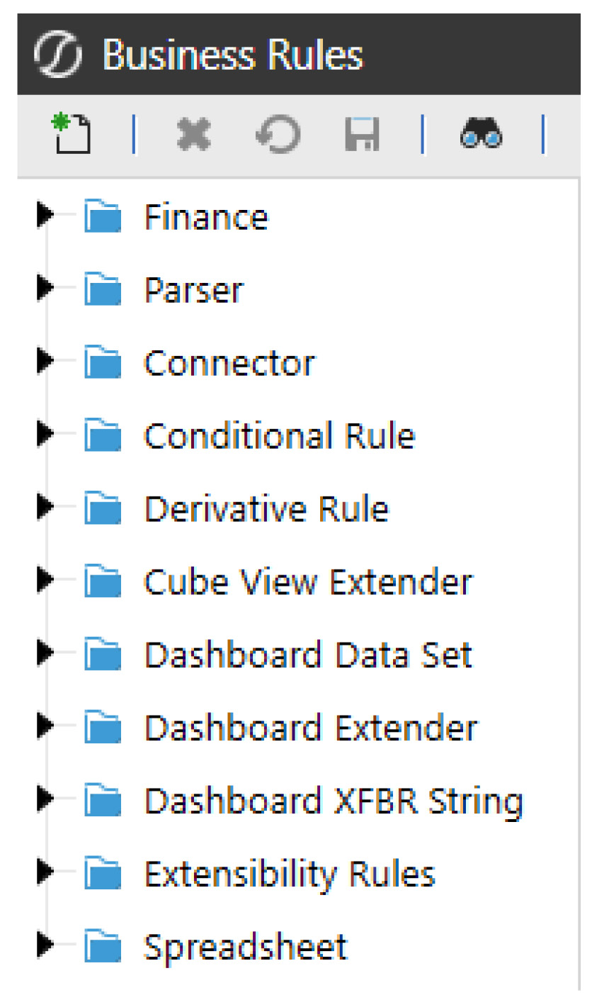

Each of these business rules serves a slightly different purpose and, together, they make OneStream incredibly powerful for designing the perfect application for your business. These rules are written in either VB.Net or C# and adhere to all the conventions of these two languages, in addition to incorporating OneStream platform API calls. If you are familiar with Visual Basic and/or C#, you will just need to understand the OneStream API calls to write the necessary business rules. The intent of this book is not to deep dive into all these business rule types, but to point out how Assemblies within Workspaces treat these distinct types of rules. For a more detailed exploration of these rule types, please refer to the OneStream Design and Reference Guide.

### Assemblies 101

The introduction of Assemblies in Workspaces has brought some new basic terminology that you will need to understand. Here are some new terms. •Assembly: the entire group of files and dependencies. •Codebase: VB.Net or C# will be declared at the Assembly level, and every file within that Assembly will have that selected codebase. •Source Code Type: when creating a new Assembly file, you select the source code type to create the file with the correct libraries (we will cover this later). •Dependencies: external libraries, other Workspace Assemblies, or business rules required by an Assembly to function properly, ensuring it has access to the resources or functionality it depends on. •Assembly Business Rule: a file within an Assembly that has specific source code that defines its purpose. •Assembly Service Factory: a file within an Assembly that is a central place to route references to the correct Assembly service files. •Assembly Service: a file within an Assembly that contains specific source code. This file is executed by the Service Factory. •Assembly Standard Class: a file within an Assembly that does not contain predetermined OneStream code and is open to building generic classes of code. Here is a screenshot of where these different components (with the exception of the source code type) are situated within the Workspace.

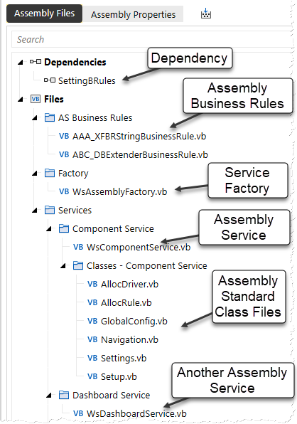

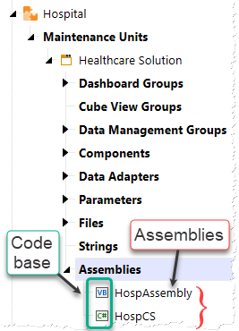

### Location Of Assemblies And Traditional Business Rules

All Assemblies, including Assembly business rules and Assembly Services, are now contained within Workspaces and located within a Workspace Maintenance Unit (WSMU), as shown in Figure 5.2. This organization makes it much easier to keep business rules and logic in the same functional space as dashboards, Cube Views, data management jobs, parameters, etc., facilitating easier troubleshooting and enhancement of these rules as needed. Before the introduction of Assemblies in Workspaces, all code was stored in a central repository (as shown in Figure 5.4). This often made it difficult to locate and analyze various pieces of code if there was a lack of disciplined naming conventions. As we discussed in the prior section, traditional business rules are grouped by type and – as they are contained in this central repository – it can be challenging to find all the components used for a specific functional area when multiple business rule types are involved. With Assembly files now organized within Workspaces, a developer working on a specific functional area of the application can access all the necessary code in one place because all business rule types are contained within the same Assembly (as shown in Figure 5.5). This organization also ensures that work in one functional area does not impact developers working on other areas. The bottom line is that the code required to configure areas of the application – such as forecasts or annual operating plans – can be stored right alongside all related components. This makes it easier to find and locate code that is specific to these functional areas of the application and allows for easy portability of the functional solutions, especially when moving from development to production servers. Here is an example to illustrate the distinction between the traditional business rule repository and Assemblies, emphasizing how business rules are organized and how the Assembly concept ensures that different rule types are contained within the same functional area. Central Repository          Assemblies Within Workspace Organized by Rule Type   Organized by Functional Area (All Rule Types together)

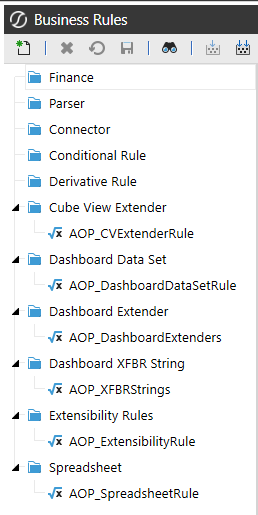

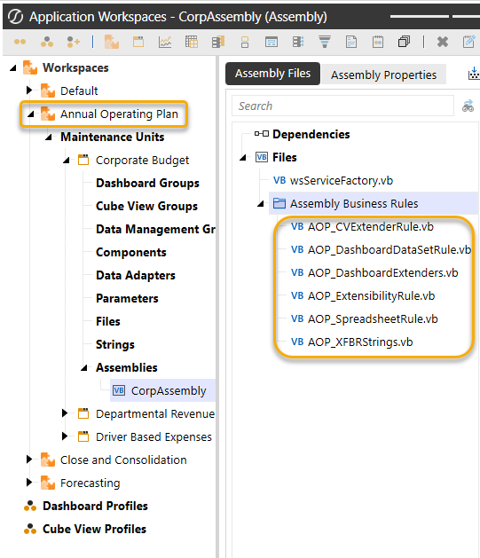

#### Location Of Traditional Business Rules In Central Repository

This is probably obvious to anyone who has used OneStream before, but for comparison’s sake, and to be complete, traditional business rules are located in a central place under the Application tab under Tools:

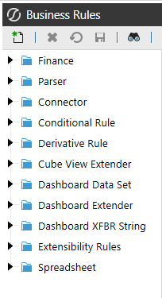

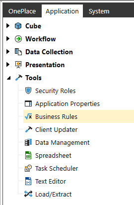

Here is an example (Figure 5.7) of the central repository concept and a typical number of business rules within a single business rule type. Notice all of the different rules that represent different functional areas of the application. Contrast this with a more focused approach to grouping business rules within a Workspace that only pertain to items within the Workspace (as shown above in Figure 5.5). This illustrates the advantage of Workspace Assemblies, where all relevant code for that Workspace is organized together.

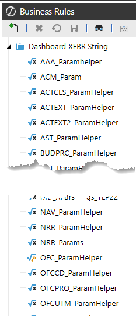

#### Location Of Assemblies

Assembly business rules and Assembly Services are located in the maintenance units within Workspaces on the Application tab and in the Presentation section. Each Workspace can have multiple maintenance units, and each maintenance unit can have multiple Assemblies. We will discuss the proper way to organize and reference the appropriate Assemblies in the upcoming chapters.

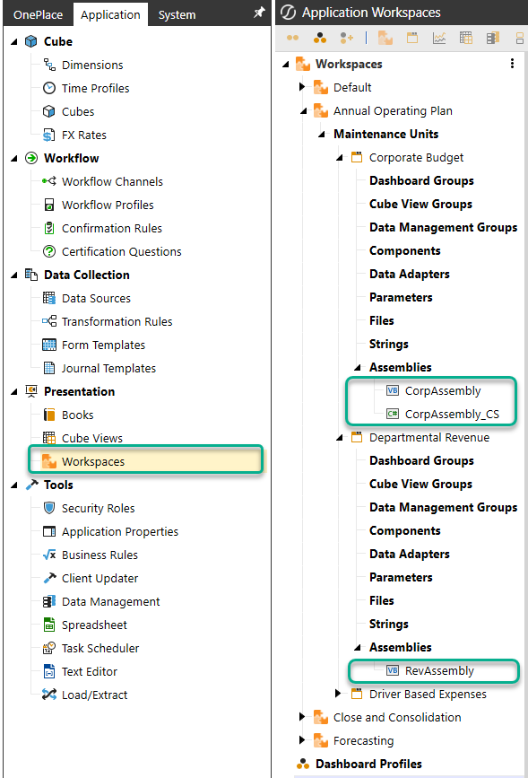

### Benefits Of Assemblies Within Workspaces

OneStream’s use of Assemblies offers several improvements over traditional business rules: 1.Organization and Segmentation: Assemblies allow developers to organize code more efficiently by grouping related logic together. This segmentation of related code makes it easier to manage and maintain, reducing the risk of errors and improving overall performance. 2.Reduced Complexity: Traditional business rules often involve a single large file with hundreds of lines of code, which can be difficult to manage and optimize. Assemblies break down this complexity into smaller, more manageable files, making it easier to optimize and troubleshoot code. 3.Improved Portability: Assemblies can be easily moved between different environments with the related dashboard components, such as development and production servers, without the need for extensive reconfiguration. This improves the portability of functional solutions and reduces downtime during deployment. 4.Dynamic Services: Assemblies enable the creation of dynamic services like dynamic dashboards and dynamic cubes, which can adapt to changing data and user-specific needs in real-time, providing more flexible and responsive solutions. 5.Improved Performance: Assemblies support multithreading, which allows for the concurrent processing of tasks. This can significantly boost performance, especially when dealing with large datasets or complex calculations. 6.Development Tools: Assemblies can be developed using external tools like Visual Studio, which provide advanced debugging, code analysis, and other features that can enhance performance and productivity. 7.Enhanced Security: Assemblies bring improved security measures for managing the code. By writing code within Assemblies, access is more tightly controlled, reducing the risk of unauthorized modifications and protecting sensitive logic. 8.Support for Advanced Solutions: Assemblies are particularly useful for advanced application solutions, allowing technical teams to build sophisticated, customized solutions for clients. Overall, the use of Assemblies in OneStream leads to more efficient coding practices, better performance, and easier maintenance compared to traditional business rules.

### More Than One Type Of Assembly Logic

There are two main types of Assembly approaches within Workspaces, which can sometimes cause confusion: Assembly Business Rulesand Assembly Services. I’ll describe the differences between these two shortly, but first, let me share a graphic that shows how traditional business rule types can be converted to the two Assembly types, and how they map:

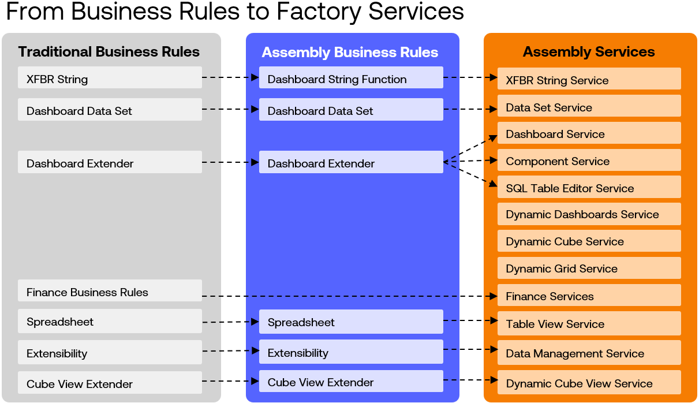

Workspaces were first introduced in OneStream version 7.3 and initially included only Assembly business rules. The first Assembly Services were introduced in version 8.0, finance Assembly Services followed in version 8.4, and additional Assembly Services will continue to be added in the future.

#### What Is An Assembly Business Rule?

Assembly business rules are files within a Workspace that contain code to alter various parts of the application, similar to traditional business rules. They help organize the code within the functional area represented by the Workspace and serve as an initial transition from traditional business rules to Workspaces. The ultimate goal is to encourage developers to adopt Assembly Services within Workspaces, and Assembly business rules provide a stepping stone toward that goal. While Assembly business rules share the same purpose and code structure as traditional business rules, their key distinction is their location. They reside within a Workspace maintenance unit (WSMU) rather than the central repository. Converting traditional business rules to Assembly business rules is a straightforward, one-to-one process. The new Assembly business rule can retain the same name as its traditional counterpart, with nearly identical code. When updating references, the only thing that will change is the prefix with the Workspace and Assembly location, reflecting its new structure.

#### Limitations Of The Assembly Business Rules

As I just mentioned, the Assembly business rules are meant to be a transition from traditional business rules to Assembly Services. Because of this, there are limitations on the types of business rules that can be created as Assembly business rules. Namely, there are no finance business rule types for Assembly business rules. There are also no dynamic dashboards or dynamic cubes in

#### Assembly Business Rules.

#### Benefits Of Using Assembly Business Rules

The transition from pre-Workspace to Workspace-aware applications is straightforward with Assembly business rules. Since they are quite similar to traditional business rules in terms of how they are called and the syntax used, it is easy to transition existing business rules to these new Assembly business rules. The code remains the same and is surfaced in the same way; the only difference is how they are called. Essentially, it involves placing the rules in a different folder and updating the reference to that folder, which now resides inside Workspace > Maintenance Unit > Assembly instead of the root directory of traditional business rules. I will show examples of this in a later section, describing the differences between Assembly business rules and Assembly Services.

#### Conclusion

The bottom line is that Assembly business rules contain all of the advantages of the object-oriented programming approach (as listed at the beginning of this chapter) and are a very handy tool to convert an existing OneStream application from a pre-Workspace application to a Workspace- aware application. However, OneStream recommends using Assembly Services for more sophisticated logic in your application. Here are some graphics that point out the transition of the traditional business rule types to

#### Assembly Business Rules.

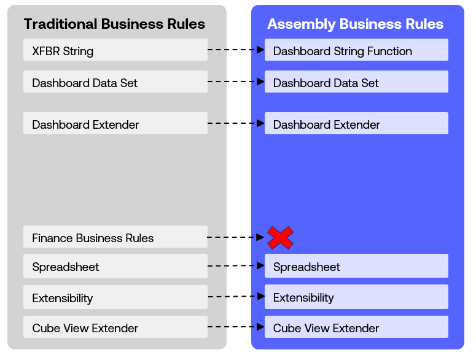

Traditional Business Rule Groups

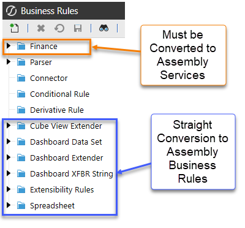

When creating a new Assembly file, we select whether this file will be an Assembly business rule or an Assembly service. This dropdown (Figure 5.12) has all the different choices for source code types. This is important because each of these selections seeds different code libraries as a starting point for you to build your business logic. You can see the selection of the Assembly business rules highlighted in blue.

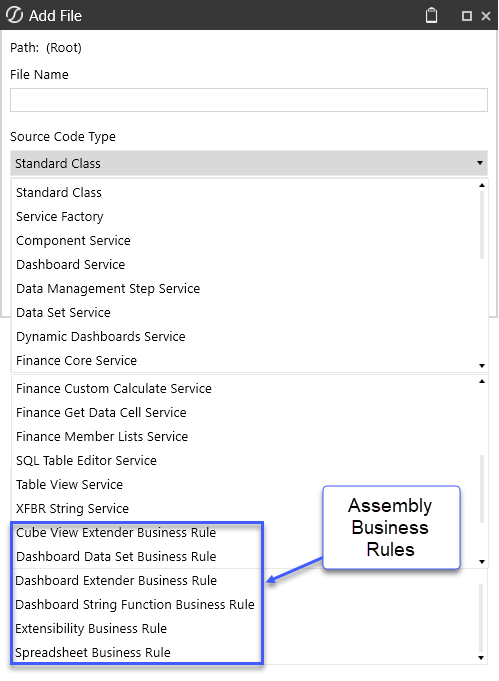

#### What Are Assembly Services?

Assembly Servicesare files containing code that can be called from various places within the application. These services are defined in a file called an Assembly Service Factory, which routes specific request types to the appropriate service file. This approach significantly improves coding efficiency and organization while enabling the use of external development tools like Visual Studio.

#### Limitations Of Assembly Services

While not a technical limitation, the learning curve for mastering the differences in the Assembly Services approach can seem intimidating. However, my hope is that the next few chapters will help to ease that process and make your learning journey just a little better.

#### Benefits Of Using Assembly Services

Transitioning to Assembly Services from traditional business rules may be less straightforward than working with Assembly business rules. Nonetheless, once you are comfortable with them, Assembly Services allow you to segment business logic into smaller, more manageable units, enhancing organization and maintainability. By leveraging Workspace Assembly Services, we can boost performance and security while preserving the familiar structure of traditional business rules. Transitioning involves encapsulating rules within Assemblies and updating references to point to the new Assemblies within the OneStream platform. One of the key advantages of Assembly Services is their ability to support advanced, in-memory solutions like dynamic dashboards, dynamic cubes, and dynamic Cube Views. These features unlock significant functionality for creating flexible and responsive applications.

#### Conclusion

The bottom line is that by embracing Assembly Services, you can create a well-organized, efficient, and maintainable codebase that enhances the functionality and performance of your OneStream application. These advantages make Assembly Services a powerful tool for developing robust and scalable financial applications. Here is a graphic of how traditional business rules map to the new Assembly Services:

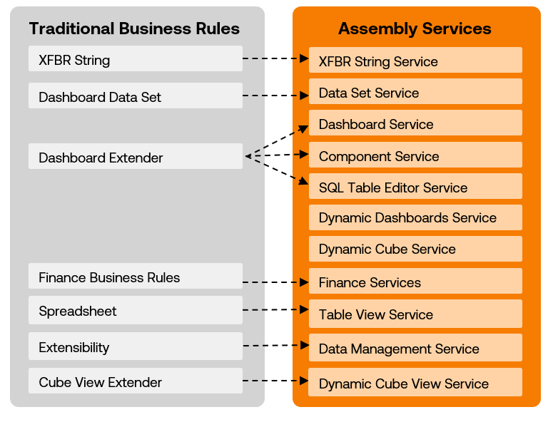

As we discussed in the previous section, when creating a new Assembly file, you must choose the source code type to make these files Assembly Services or Assembly business rules (Figure 5.14). Pay attention to the suffixes of business rules against the suffixes of the services. Once selected, the new file will have certain libraries and sample source code that will be a starting point to build your logic. Also, note that there is a selection for a Service Factory. This is very important when working with Assembly Services because this file will route the request to the appropriate service file.

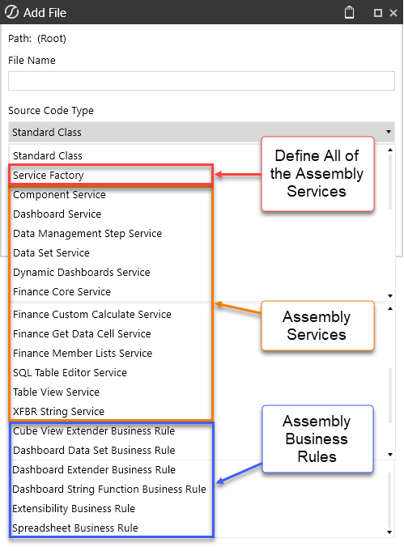

### Main Differences Between Assembly Business Rules And

### Assembly Services

Given my experience in developing OS applications and working with traditional business rules, transitioning to Assembly business rules was a very straightforward process for me. However, understanding the intricacies of Assembly Services and Assembly service factories was very challenging for me. In the upcoming chapters, my goal is to clarify these differences so you will be comfortable with Assembly Services. This understanding is crucial, as Assembly Services are where we implement finance logic and all of the nice dynamic services. One nuanced difference between Assembly business rules and Assembly Services is how they are invoked. Assembly business rules are Assembly files that can be named whatever you like, and when they are invoked, you will call the name of the Assembly file, very much like we have always done with all traditional business rules. As such, most application developers who have been building traditional business rules will see almost no difference when working with Assembly business rules, other than where this file is located within the Workspace and Assembly.

#### Examples Of Invoking Code

To illustrate the differences in how the code is invoked from these different approaches, let me give examples of how a dashboard extender rule is invoked from these three methods: 1.Traditional business rules from a central repository 2.Assembly business rules from within a Workspace 3.Assembly service from a Service Factory inside a Workspace I’ve created the same dashboard extender rule in all three places. We will call this logic from a Cube View component within a dashboard.

#### 1. Traditional Business Rules From Central Repository

We are calling a dashboard extender rule from the Server Task setting of a Cube View DB component. Traditional Reference:

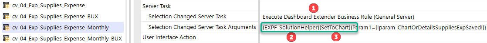

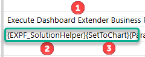

This statement is telling OS to look in the business rules repository for a dashboard extender business rule  named `EXPF_SolutionHelper` and run the function `SetToChart`. Here is  where OS will go and find the code (Figure 5.16):


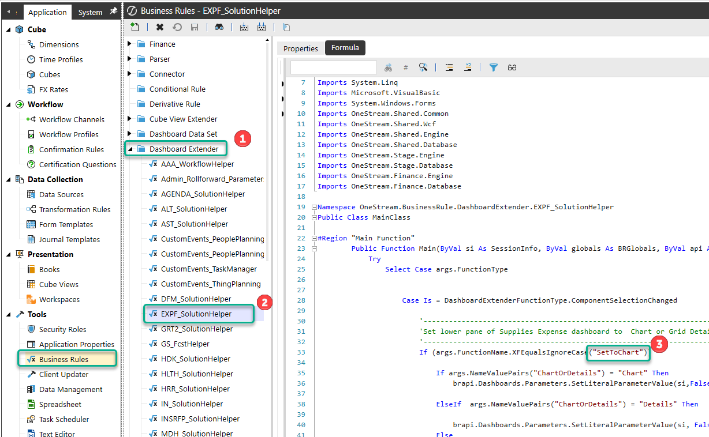

#### 2. Assembly Business Rules From Within A Workspace

We are calling a dashboard extender rule from the Server Task setting of a Cube View DB component. Assembly Business Rule Reference:

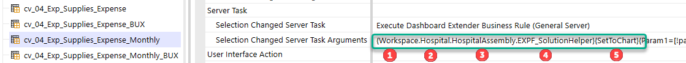

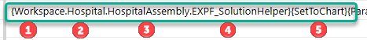

This statement is telling OS to look in the Workspace  named `Hospital` and look in the  Assembly named `HospAssembly` for an Assembly file named `EXPF_SolutionHelper` and  run the function `SetToChart`. Here is where OS will go and find the code (Figure 5.18):


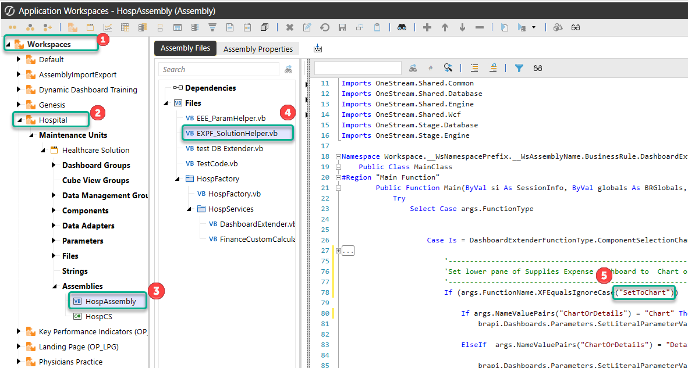

> **Note:** This is very similar to the traditional business rule, where OS is looking for the name

`EXPF_SolutionHelper`, but it is just located in a new place within the Workspace and  Assembly.

#### 3. Assembly Service From Within A Workspace

We are calling a dashboard extender rule from the Server Task setting of a Cube View DB component. Assembly Service Reference:

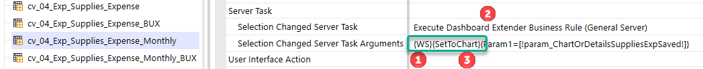

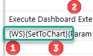

This is telling OS to look in the current Workspace where the Assembly is defined  and the Service Factory will find the service for dashboard extender  and run the function `SetToChart` Here is where OS will go and find the code (Figure 5.20):


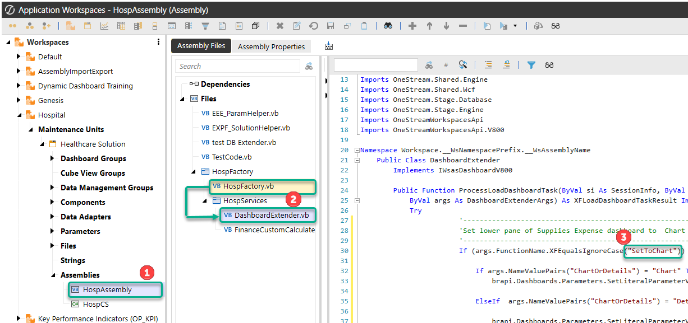

With Assembly Services, the names of the files are not invoked during the call; rather, the Workspace has an Assembly and Service Factory defined and will get routed to the correct code. The Service Factory is a file that points to other Assembly service files that contain the code. We will get into the details around Assembly Services in Chapter 7, but I wanted to mention it here because this nuance can get very confusing when you are converting from pre-Workspaces to Workspaces. The bottom line is that the Assembly business rules know exactly which file to route to because you give the exact name of the Assembly file when you call the action. Assembly Services are different because we don’t tell the server task the exact name of the Assembly file to look for. We just tell the action (e.g., execute dashboard extender business rule (general server)) to look in the Workspace and Assembly Service Factory to look for the corresponding service file (e.g., DashboardExtender.vb). The Service Factory then routes the action to the correct Assembly file to run the appropriate function (e.g., SetToChart).

### Object-Oriented Programming (Oop) In OneStream: A Beginner’s

Guide I don’t have a programming background, more of a finance and math background, so I needed to learn these programming concepts while working with CPM software. Understanding how namespaces, classes, functions, subroutines, objects, and modules come together to make your code well-organized and portable will truly help you appreciate OneStream’s Workspaces, which allow for Assembly business rules and Assembly Services. Here is a basic introduction to OOP for those new to these concepts or, like me, years of writing business rules without fully grasping these concepts. If you’re already familiar with these concepts, feel free to skip ahead to Chapter 6. This book is not a comprehensive guide to VB.Net or C#. However, to grasp why Assemblies and Assembly Services are a more efficient way to develop OneStream applications, you need a fundamental understanding of OOP. Both VB.Net and C# are OOP languages, and they are the foundation upon which OneStream is built. Imagine you have a complex financial puzzle to solve. Instead of tackling it all at once, you break it down into smaller, manageable pieces. This is where Object-Oriented Programming (OOP) comes in. OOP allows you to break down your code into smaller, reusable parts that can be referenced in different areas, eliminating the need to repeatedly write the same type of code over and over to accomplish similar tasks in different parts of your application. For the purpose of getting a basic understanding of OOP, I will stick to VB.Net for these examples and not go into C#. For VB.Net, we are mainly using the following parts in our OneStream Assembly files: •Namespaces •Classes •Methods `o`Subroutines  `o`Functions  •Objects (as in “Object” Oriented Programming) •Public vs Private

> **Note:** We will only cover the elements pertinent to Assemblies for organizing code, so we

won’t delve into other aspects of VB.Net like data types (e.g., string vs. integer vs. decimal) and collection classes (e.g., List(Of ValueClass) vs. Dictionary(Of KeyClass, ValueClass)).

#### Components Of Oop

#### Namespace

Namespace is a container that allows you to organize your code into groups. Typically, you will have one namespace per business rule or per Assembly.

#### Classes

A class is a blueprint for creating objects. It defines the attributes (properties) and behaviors (methods) that the objects created from the class will have.

```vb
Public Class Car
Public Property Make As String
Public Property Model As String
Public Property Price As Decimal
Public Sub SetPrice(amount As Decimal)
Price = amount
End Sub
Public Function StartEngine()
Return "Engine started."
End Function
End Class
```

#### Methods

Methods are functions or subroutines (`Sub`s) defined within a class. They represent the actions that  objects created from the class can perform. There are two different types of methods that are common in OOP: 1. Subroutines (Subs): Methods that perform an action, butwhich do not return a value.

```vb
Public Sub SetPrice(amount As Decimal)
Price = amount
End Sub
```

2. Functions: Methods that perform an action and return a value.

```vb
Public Function StartEngine()
Return "Engine started."
End Function
```

#### Properties

Properties are attributes meant to encapsulate data within a class.

```vb
Public Property Make As String
Public Property Model As String
Public Property Price As Decimal
```

#### Objects – {Important}

Objects are instances of classes, and this is a key concept because a new object inherits all the properties and methods of its class. They are created from classes and have the properties and methods defined by the class.

```vb
Dim myCar As New Car()
myCar.Make = "Toyota"
myCar.Model = "Corolla"
myCar.SetPrice(25000)
myCar.StartEngine()
```

It is crucial to understand that once `myCar` is defined as a new object of the `Car` class, it becomes a  completely new variable with all the properties, attributes, and methods of the class. In OneStream, we can create these classes once and reference them in various places, eliminating the need to rewrite all the code within the class.

#### Public Vs Private

As the names suggest, public members are accessible from any other code within the namespace (the business rules or Assemblies). Private members, in comparison, are only accessible within the same class or module in which they are declared. They are not accessible from outside the class or module. Note that you can also import public members from another namespace through dependencies and imports. This introductory section provides a simplified view of OOP concepts, which is essential for understanding Assemblies and Assembly Services in OneStream. By leveraging these principles, you can create well-organized, efficient, and maintainable code.

#### Example Problem To Solve:

To illustrate these OOP principles, here is a simple example of how these concepts work. For this example, we need to write VB.Net code that can be reused to calculate a simple calculation for a customer’s banking accounts. Here is a summary of the steps that we will execute, as each step is meant to illustrate different concepts of OOP. 1.Create a `Customer` class with properties `Name` and `Balance`, and a method to calculate a  balance. (Organized Structure) 2.Create multiple customer objects using the `Customer` class. (Reusability)  3.Update the `Customer` class to include an additional item in the balance calculation. This  update will apply to all customers who use this class. (Maintainability) 4.Create a new `Customer2`class that utilizes a private variable and methods to calculate the  deposit balance and then a method to return that value. (Encapsulation) 5.Create a new customer object that uses the new `Customer2`class, showing how you need  to reference the methods to set and return balance values. (Abstraction) 6.Create a new `SavingsAccount` class that inherits from the `Customer2`class to  demonstrate inheritance and reusability. (Inheritance)

#### 1. Organized Structure (Formal Structure Helps Usability)

Create a `Customer` class with properties `Name` and `Balance`, and a method to calculate a  balance. `o`Classes and Objects: In OOP, we create “classes” as blueprints for objects,  allowing us to call them in different parts of our code. For example, we might have a `Customer` class with properties like `Name` and `Balance` and methods like  `UpdateBalance()`. This helps us organize our code logically.  `o`Example: This class defines two properties and also has a method to update the  `Balance` property with a deposit amount when called.

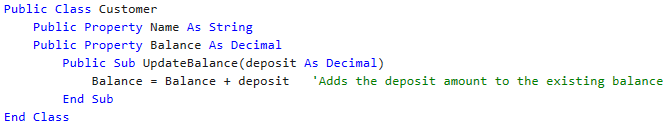

#### 2. Reusability (Build Once, Reference Everywhere)

Create multiple customer objects using the `Customer` class.  `o`Code Reuse: Once we create a class, we can use it multiple times across different  parts of our project. This saves time and effort because we don’t have to write the same code repeatedly. `o`Example: Using the `Customer` class from above, the variables `customer1` and  `customer2 `both have all the properties and methods of the `Customer` class. We  can define the public properties `Name` and `Balance` for these customers. Public  components can be referenced outside of the class where they are defined.

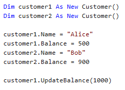

#### 3. Maintainability (Update In One Place, Permeated Throughout Code)

Update the `Customer` Class to include an additional item in the balance calculation. This  update will apply to all customers who use this class. `o`Easy Updates: If we need to change how a `Customer` works, we only need to  update the `Customer` class. All objects created from that class will automatically  reflect the changes. `o`Example: By updating the `Sub UpdateBalance` method to include a withdrawal  amount in the formula, `customer1` and `customer2` will automatically use the  new formula when this method is called. Thus, we update `customer1` and  `customer2` without modifying their individual code.

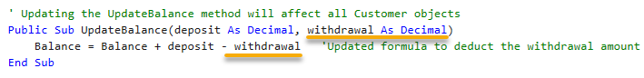

#### 4. Encapsulation (Bundle Code Into A Single Unit)

Create a new `Customer2`class that utilizes a private variable and methods to calculate the  deposit balance, and then a method to return that value. `o`Code Protection: OOP allows us to hide the internal details of our classes (like the  private properties), exposing only what is necessary. This ensures that the code is safe and only accessible through defined methods. `o`Example: This example creates a new `Customer2 `class utilizing a private  variable `_balance` that cannot be referenced outside the class. When we create an  object from this class, we must set the new balance using the public `SetBalance` subroutine instead of referencing the internal `_balance `variable directly. In the  previous example, we could set the `Balance` property because it was defined as a  public property. Here, we must call the public `SetBalance` method and let the  internal logic handle the details.

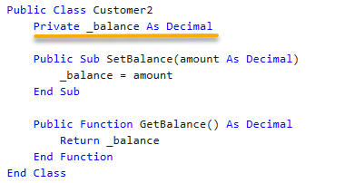

#### 5. Abstraction (Reference Other Classes)

Create a new customer object that uses the new `Customer2`class, showing how you need to  reference the methods to set and return balance values. `o`Simplified Interaction: By focusing on what an object does rather than how it  does it, OOP allows us to work with complex systems more easily. `o`Example: We can use the `SetBalance` method of the `Customer` class to write a  new balance amount and the `GetBalance` method to retrieve the balance without  worrying about the formulas that are performing the calculations.

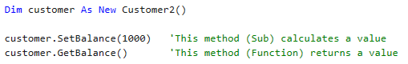

#### 6. Inheritance (Allows Methods From One Class To Be Used For New Classes)

Create a new `SavingsAccount` class that inherits from the `Customer2`class to demonstrate  inheritance and reusability. `o`Building on Existing Code: OOP allows us to create new classes that inherit  properties and methods from existing ones. This promotes code reuse and helps us build more complex applications efficiently. `o`Example: We create a new class that inherits from the `Customer2` class above.  This gives us all the methods (subs and functions) from the parent class to use in our new class. Notice that we can call `SetBalance` and `GetBalance` to create a  new subroutine.

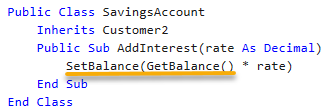

By utilizing these OOP concepts, you can configure your OneStream application with VB.Net and C# to create a well-organized, efficient, and maintainable codebase that helps tackle complex financial tasks with ease.

## Conclusion

The introduction of Assemblies really marks a transformative leap forward for the OneStream platform. By adopting Assembly business rules and Assembly Services, you can organize code more effectively, unlock advanced functionality like dynamic dashboards and cube services, and create portable, scalable solutions. These innovations not only enhance the development experience but also future-proof your applications by offering robust, modular, and maintainable architectures. While the transition from traditional business rules may require some adjustment, the benefits far outweigh the challenges. Assemblies empower developers to leverage Object-Oriented Programming principles, streamline workflows, and deliver high-performing solutions that align with modern best practices. As you embrace these tools, you’ll find that Assemblies open the door to new possibilities, laying the groundwork for a more dynamic and efficient approach to financial application development.
