# Managing Assembly Services

## Future Of Managing Logic And Calculations In OneStream

After I had been working with Assembly business rules for a while, I got to the point of needing to write financial calculations in the Workspace. This led me to work with Assembly Services and service factories, and I am happy to say that I survived the process(!), and I’m thrilled that I made the transition. Assembly Services not only unlock financial calculations within the Workspace but also provide access to the dynamic functionality that OneStream continues to innovate. This includes features like dynamic dashboards, dynamic dimensions, and dynamic cubes, which enable OneStream to process many operations in-memory for better performance. Beyond these advantages, they bring structure and efficiency to working within a Workspace. In this chapter, I will attempt to bridge the gap between working in a pre-Workspace environment and working with all of the latest OneStream features, empowering you to take your application to the next level.

### Understanding Assembly Services In OneStream

Transitioning to Assembly Services was challenging at first, but the benefits quickly became clear. Let’s explore how these benefits come together by breaking down service factories in an easy-to- grasp way. To explain service factories in layman’s terms, imagine this: Assembly Business Rules are like multiple stand-alone stores that each sell only one type of food item. So, if you only need one type of food, this is very efficient, but to go grocery shopping for the week, you need to visit multiple stores to get all the different types of food you need (very inefficient). A Service Factory is like a supermarket grocery store. When you enter and ask the worker which section has bread, she points you to the bakery section. If you ask about getting chicken, she points you to the butchery section, and so on. Now, all your grocery shopping needs are met in one place, even though there are different sections within the supermarket. In this analogy, the supermarket represents the Service Factory, which centralizes and organizes the various services (or sections) you need, making the process more efficient and user-friendly. From a more technical perspective, Assembly Services and service factories are designed to enhance flexibility and modularity in managing business rules and operations. A Service Factory acts as a dispatcher, routing requests to the right service for the task – whether it’s managing dashboards, processing financial calculations, or executing data steps. This structure allows organizations to centralize operations, tailor services to specific contexts (such as weekday vs. weekend workflows), and streamline complex workflows with ease.

#### How Assembly Services Eliminate The Need For Explicit File

References In the case of Assembly Services, you no longer need to specify the file name where the code resides, as you would with traditional business rules or Assembly business rules. This concept was initially confusing for me because it wasn’t clear how OneStream knew which code to execute without explicitly referencing a file. After discussing this with a very knowledgeable colleague, Jerome Marcq, I came to understand that the system determines the correct code to run based on the context of the call. The location from which the code is invoked informs the Service Factory about the type of service requested. This eliminates the need to specify the exact Assembly file, as the Service Factory seamlessly routes the request to the correct service. Here are three practical examples that showcase how the Service Factory routes requests based on different types of rules, ensuring each one is directed to the appropriate destination.

#### Example 1: Data Management Step – Custom Calculate

For a data management step defined with a Step Type of CustomCalculate, you only need to specify which Workspace to use. The system then automatically refers to the Workspace Service Factory to locate the Assembly service file for the Financial Custom Calculate service type and executes the required function. There’s no need to explicitly point the data management job to a specific Assembly file – the Service Factory already knows where to route the request. Figure 7.1 is an example of syntax within a data management step that references the Workspace, but not a specific business rule.

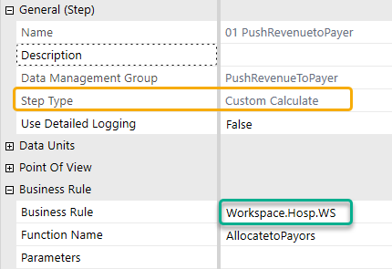

Figure 7.2 is a flow chart of how OneStream routes the request to the Service Factory and the factory routes that call to the appropriate Finance CustomCalc service file.

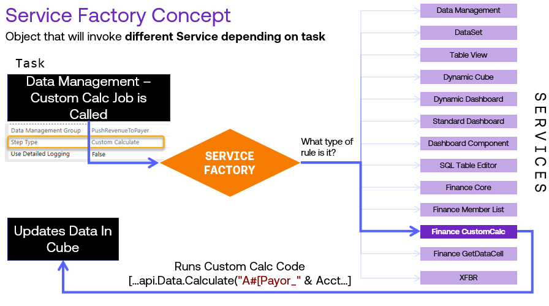

#### Example 2: Dashboard Extender Code Request

Let’s now consider a different scenario: routing a dashboard extender code request. When executing a server task with the Execute Dashboard Extender Business Rule option within a Cube View dashboard component, you simply indicate that the system should look in the current Workspace. From there, the system consults the Workspace Service Factory to locate the appropriate dashboard extender service file. This process occurs seamlessly, with the Service Factory routing the request to the correct service without requiring you to specify the exact name of the file. Figure 7.3 is an example of syntax within a dashboard component that references the Workspace, but not a business rule.

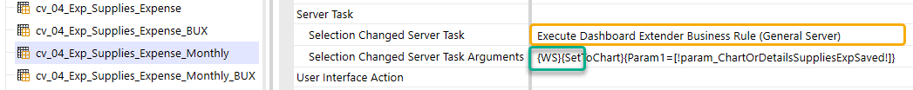

Figure 7.4 is a flow chart of how OneStream routes this request to the Service Factory and the factory routes that call to the appropriate dashboard component service file.

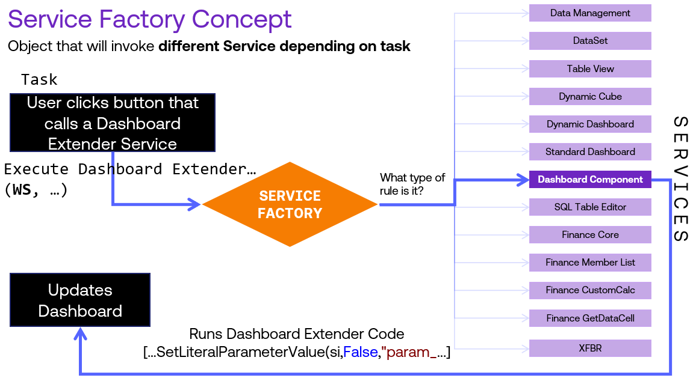

#### Example 3: XFBR String Function Called

Finally, let’s consider a different scenario: routing an XFBR string code request. An XFBR string function dynamically returns a text value to any OneStream setting that can accept a parameter. These rules provide enhanced flexibility compared to standard parameters or substitution variables, as they use code to generate string outputs for dashboards, Cube Views, and extensible documents. When you invoke an XFBR function and designate the current Workspace, the system automatically queries the Workspace Service Factory to locate the necessary XFBR string service file. As with the other examples, there is no need to reference the file by name – the Service Factory handles the request routing seamlessly. Figure 7.5 is an example of syntax within an XFBR function that references the Workspace, but not a business rule.

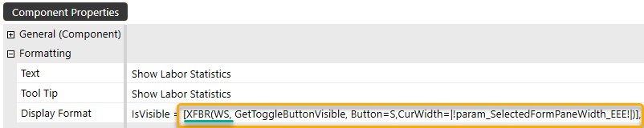

Figure 7.6 is a flow chart of how OneStream routes this request to the Service Factory and the factory routes that call to the appropriate XFBR string service file.

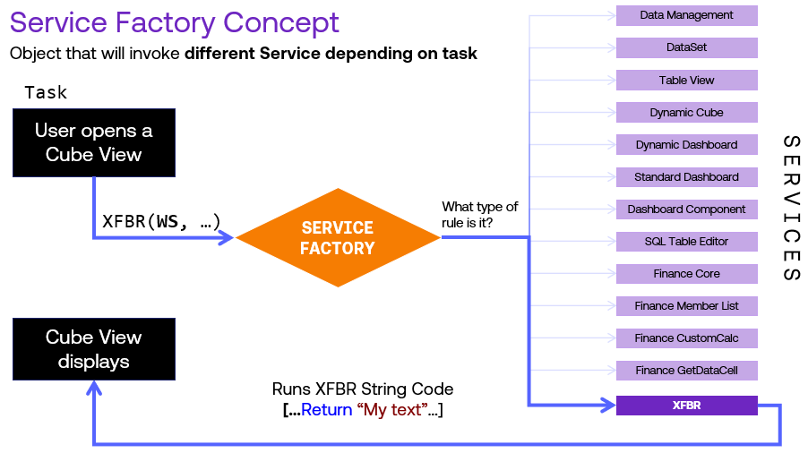

Now that we’ve looked at these three examples, here is a reminder of the number of services available as of version 9.0, and the transition from traditional business rules to these Assembly Services.

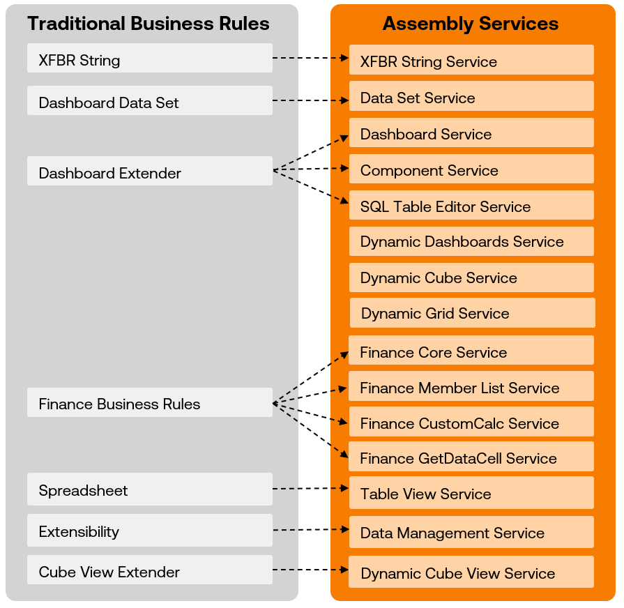

Before we move on to the details of how to set all of this up, here is an example of a comprehensive Service Factory that can route requests to multiple Assembly Services. Notice how the `Case` statement identifies the specific `WsAssemblyType` being called and determines the  corresponding `Assembly Service` file. This approach ensures the appropriate service is executed  based on the type of request.

> **Note:** By default, a service file contains the declaration of a class of the same name. While

you can rename both independently, it’s good practice to keep them aligned. What matters is the name of the class included in the file. It’s important to remember that the names of the Assembly service classes must align exactly with the references in the Service Factory calls. While you can name these files and classes whatever you prefer, maintaining consistency between the class names and their references in the Service Factory is crucial for proper functionality.

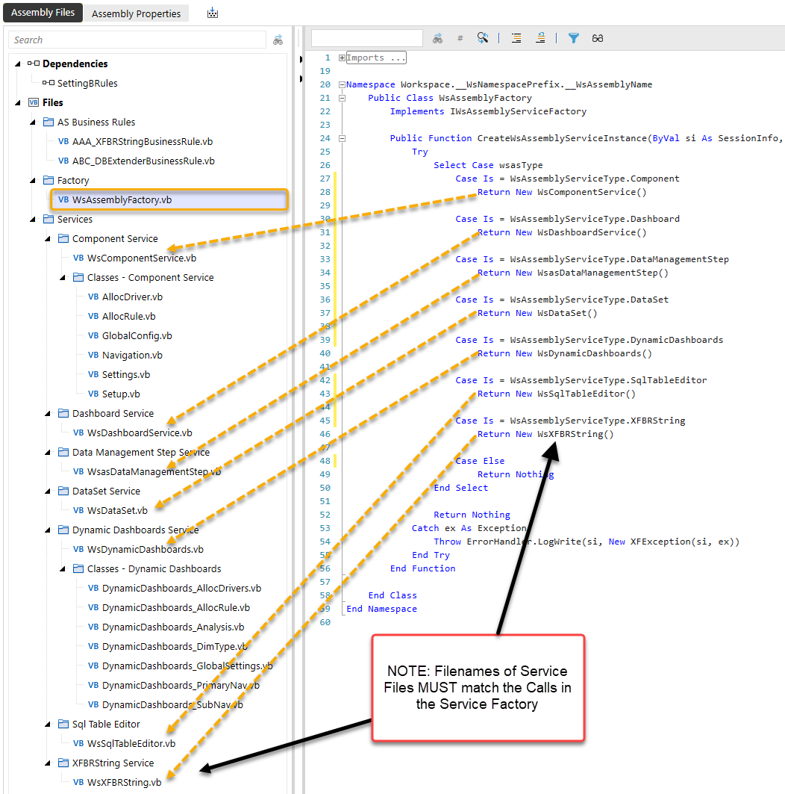

We should now have a good reference point of how Assembly Services are routed from an Assembly Service Factory, so let’s dive into some specific steps of how service factories and service files are configured.

### Setting Up The Service Factory

Now that we understand the Service Factory is the gatekeeper for Assembly service files, we’re going to walk through the process of setting one up. It’s important to note that you don’t need to include all service types within a Service Factory – you can include just one if that’s all you need for a particular maintenance unit’s services. The most critical requirement when creating a Service Factory is ensuring that the ServiceFile referenced in the`Return New ServiceFile()` statement matches the ServiceFile name exactly.  Any mismatch will result in errors. At its core, the Service Factory contains a function that returns a class based on the AssemblyType of the call’s origin. While the code structure is relatively simple, there are a few key points to keep in mind: •If you call a ServiceType in the factory, there must be a corresponding Assembly service file (and therefore class) created and enabled for compiling. •If the file and class don’t exist or are disabled for compiling, the Service Factory won’t know where to retrieve the service, causing errors – even if you aren’t directly calling that service type. •If the names do not match, this is the same as the reference not existing, and this will cause errors. Best Practice Suggestion: Organize your folder structure. It is wise to set up a structured folder system when creating a new Assembly, as you won’t be able to move files into different folders after they are created. The more organization you put into your Assembly, the easier it will be to maintain good, clean code. A great example of a full and robust Assembly that has a nice, structured folder strategy is from the Assembly that was used above in Figure 7.8. Here, we have folders for Assembly business rules, service factories, services, individual services, and classes within the services. Here is a cleaner image of that Assembly structure (Figure 7.9):

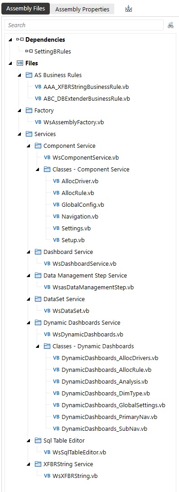

#### Step-By-Step Guide To Creating A Service Factory

In this next section, we will create a sample Service Factory, a component service file, and a standard class file to highlight the nuances of Assembly Services.

#### Summary Of Steps:

1.Create the folder structure that you will need. 2.Create the Service Factory. 3.Open the Assembly service type in the Service Factory file. 4.Create the Assembly service file that corresponds to the Assembly service type (with exactly the same name). 5.Create a standard class file that the service file calls.

#### Steps With Screenshots:

1.Create the folder structure that you will need. It is important to have a general structure in mind when you start to keep these files well organized. Typically, I have folders for the factory, all services, individual services, and classes that the services will call.

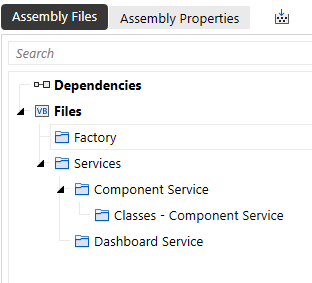

2.Create the Service Factory. When you create the Service Factory file, right-click on the folder you want the factory file to reside in and select Service Factory as the Source Code Type:

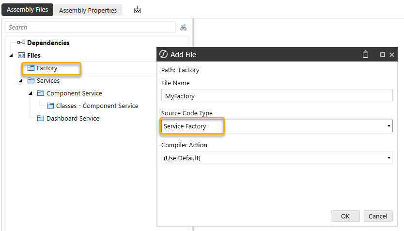

This file will be prepopulated with all of the `AssemblyServiceTypes` (these service types will  continue to be expanded when new services are introduced), but the code is commented out as a starting point.

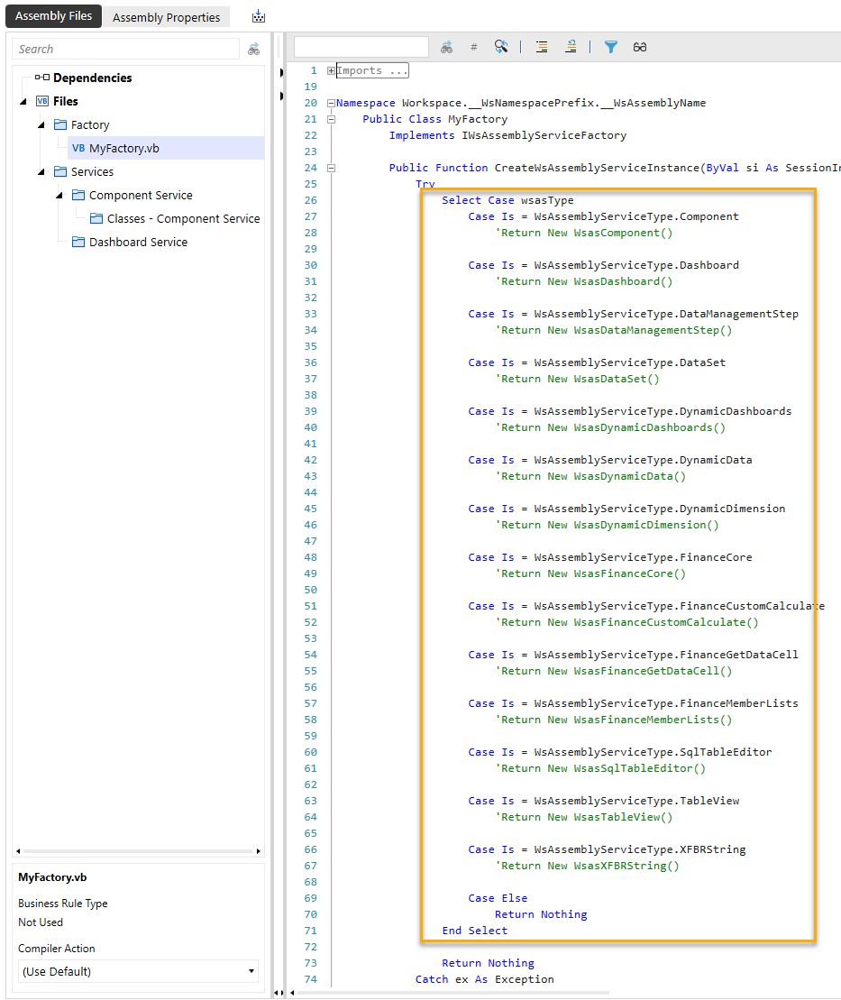

3.Open the Assembly service type in the Service Factory file. To open up any of the service types, uncomment the appropriate line and give the `Return` value a  name you would like for your corresponding service file. From this:

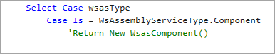

To this:

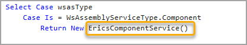

> **Warning:** If you open up a ServiceType and you don’t have a matching Assembly

service file, you will get errors when you try to run the Assembly factory and when you compile the Assembly, like below (Figure 7.15):

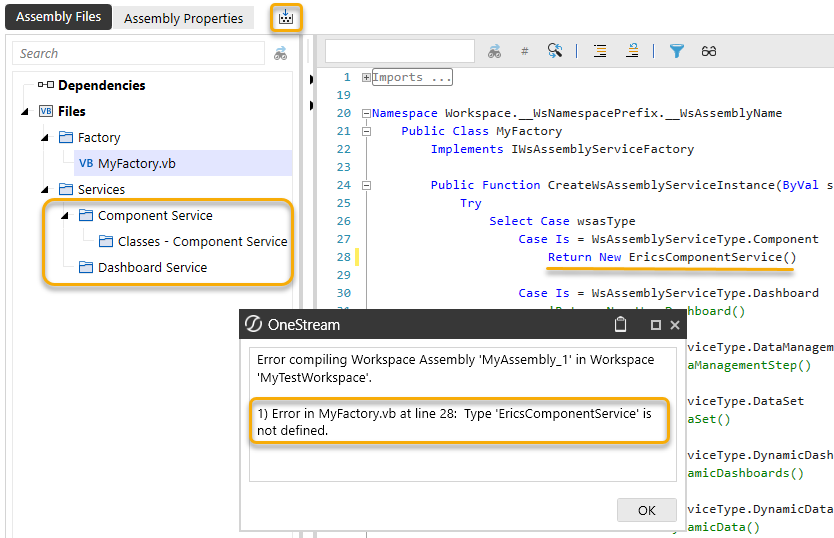

4.Create the Assembly service file that corresponds to the Assembly service type (with exactly the same name). Right-click on the folder in which you would like the file to be placed and Add File. Add a component service file with the same name you chose in the Service Factory.

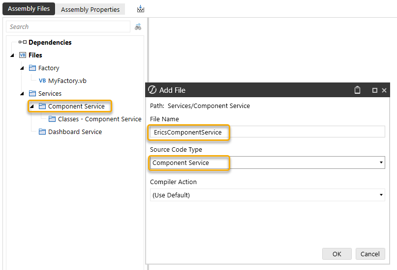

The service file will be prepopulated with pertinent libraries and classes. As we discussed in Chapter 5, a `Public Class` is created with the name of the file. This `Public Class`is how the  Service Factory is able to call this file and run the code defined here.

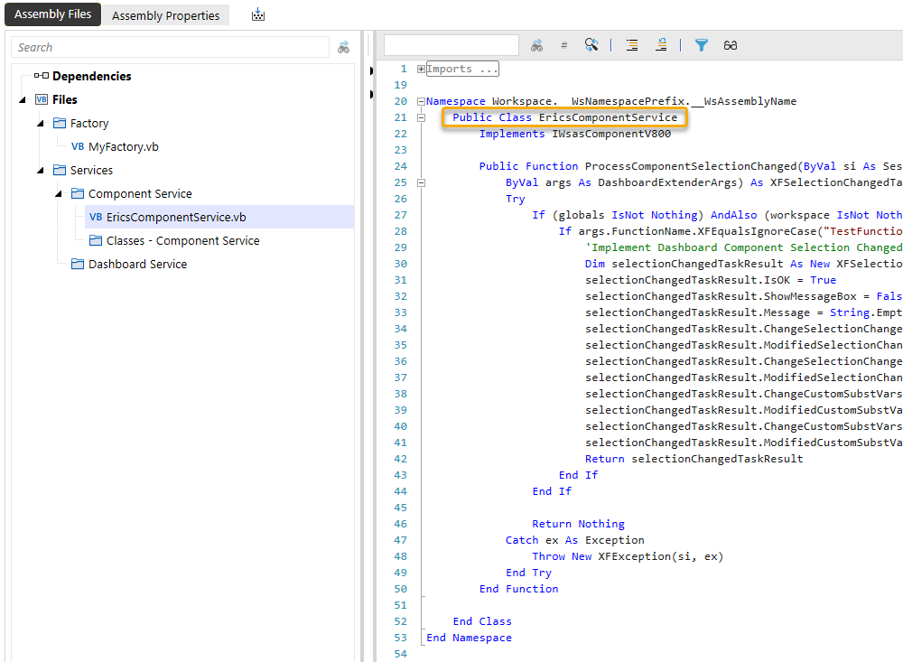

5.Create a standard class file that the service file calls. Now, let’s create a standard class file and demonstrate how to reference it from the component service file. This will showcase how modular design helps you organize and manage your code in smaller, more efficient pieces. To start, right-click on the folder where you would like the file to be placed, then select Add File and select Standard Class as the Source Code Type.

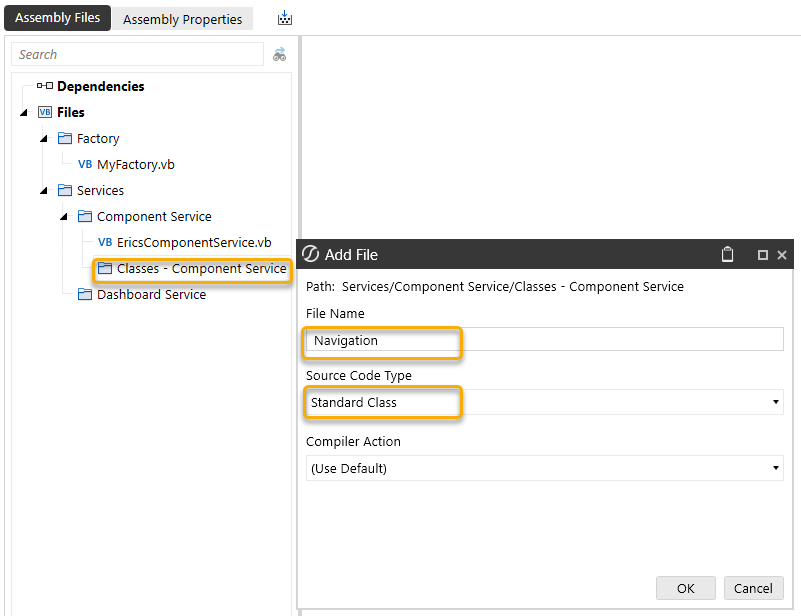

This file is defined as a public class that our other service files can use:

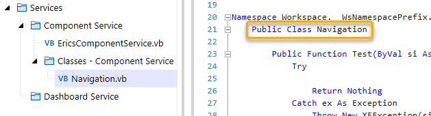

Finally, let’s see how we call this new class in our service file. Because there is now a file with a `Public Class` called `Navigation`, we can create a new object from the `Navigation` class.

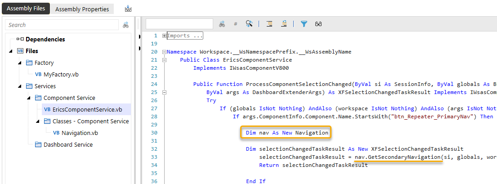

This example demonstrates how a structured approach to creating service factories, service files, and class files ensures better organization, scalability, and maintainability of your code. Now that we’ve walked through the process of setting up a Service Factory, let’s shift our focus to how service calls are managed and routed using OneStream’s built-in mechanisms.

### Invoking Assembly Services: Ws Vs Wsmu Vs Implicit

A critical part of using Assembly Services effectively is understanding the routing mechanisms provided by WS and WSMU. These tools determine how service calls are handled, ensuring that the correct Service Factory processes each request based on its scope and context. When it comes to calling your Service Factory, WS (Workspace Service) and WSMU (Workspace Maintenance Unit) are used in different scenarios to control how and where service calls are routed. Let’s break this down: Workspace Service (WS) •Definition: WS referencesthe Service Factory specified at the Workspace level. It looks for the Service Factory specified on the Workspace that contains the object. If the Service Factory isn’t defined at this level, the call will fail. •Use Case: Use WS when the object you’re working with has a broader scope across the Workspace, and you want the Workspace’s Service Factory to handle the service call. Workspace Maintenance Unit (WSMU) •Definition: WSMUreferencesthe Service Factory specified at the maintenance unit level. It looks for the Service Factory specified on the maintenance unit that contains the object. If the Service Factory isn’t defined at this level, it will search at the Workspace level. If it still can’t find the Service Factory, the call will fail. •Use Case: Use WSMU when the object is more granularly scoped within a specific maintenance unit, and you want that specific unit’s Service Factory to handle the service call. Inplicit •Definition: Certain tools, like dynamic dashboards, do not use WS or WSMU as they implicitly look up the chain. On opening a dynamic dashboard, OneStream will look for a Service Factory with a Dynamic Dashboard Service by first looking at the maintenance unit, then at the Workspace. •Use Case: Dynamic dashboards require you to provide a Service Factory either at the maintenance unit or the Workspace. Let’s explore where these settings are defined with some examples of setting the Workspace Service Factory (WS) vs the Workspace Maintenance Unit Service Factory (WSMU): The Workspace Service Factory (WS) is defined in the Workspace Properties as Workspace Assembly Service. Figure 7.21 illustrates how the Assembly Service Factory MyAssembly_2.MyServiceFactory_2will be called when the WS is invoked.

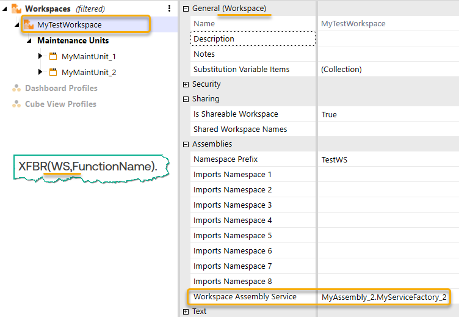

The Workspace Maintenance Unit Service Factory (WSMU) is defined in the Maintenance Unit Properties as Workspace Assembly Service. Figure 7.22 shows how the Assembly Service Factory MyAssembly_1.MyServiceFactory_1is called when the “WSMU” is invoked.

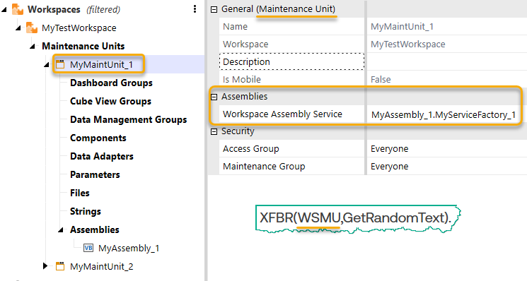

#### Syntax Conventions For Calling Assembly Services

Now, let’s address a potentially confusing aspect: each service type in OneStream has unique syntax restrictions that govern how it can be called, which can sometimes be confusing. Below are the syntax conventions you need to understand: •`{WS,..}` : Called when the object calling the service is in the same Workspace.  •`{WSMU,…}`: Called when the object calling the service is in the same maintenance unit. •`{Workspace.xxxx.WS,…}` : Syntax to explicitly call a different Workspace.  •`{Workspace.xxxx.yyyy.WSMU,…}` : Syntax to explicitly call a different Workspace  and/or maintenance unit. In these examples: •`xxxx` represents either the `workspaceName`, `workspaceNamePrefix`, or `"Current"` if  the object is in the same Workspace. •`yyyy` represents either the `maintenanceUnitName` or `"Current"`if the object is in the  same maintenance unit. It’s also important to note the distinctions between the various enclosure symbols you may encounter in the syntax: •Curly brackets `{ }` : Used to enclose certain routing instructions for Service Factory  calls. •Parentheses `( )` : Used to encapsulate parameters for functions, such as XFBR.  •Square brackets`[ ]` : Commonly used in Cube View syntax to reference member lists or  functions. •In some cases, no enclosure symbols are required, depending on the context and the service type being invoked. Understanding and correctly applying these syntax conventions ensures the accurate routing of service requests and minimizes configuration errors.

#### Comparison Of Syntax Restrictions For Different Service Types

Now that we’ve outlined the general syntax conventions, I’d like to compare and contrast how these conventions apply to different service types, using XFBR and Finance GetDataCell services as the two examples to make the point of differing syntax requirements.

#### XFBR Service Syntax

XFBR rules allow for multiple flexible syntax options, such as: •`XFBR(Workspace.``workspaceName``.``maintenanceUnitName``.WSMU,MyStringFunct`

```text
ion)
```

•`XFBR(Workspace.``workspaceName``.WS,MyStringFunction) ` •`XFBR(Workspace.``Current``.``maintenanceUnitName``.WSMU,MyStringFunction) ` •`XFBR(Workspace.``Current``.``Current``.WSMU,MyStringFunction) ` •`XFBR(Workspace.``Current``.WS,MyStringFunction) ` •`XFBR(WS,MyStringFunction) ` •`XFBR(WSMU,MyStringFunction) `

#### Finance Getdatacell Service Syntax:

In contrast, the Finance GetDataCell service type has stricter syntax requirements. It mandates the explicit inclusion of both the `workspaceName` and `maintenanceUnitName`. You cannot simplify  this by relying on just the Workspace or the “Current” keywords. For example:

```text
GetDataCell(“BR#
```

`[Workspace.`workspaceName`.`maintenanceUnitName`.WSMU,MyDataCellFunction]”) ` The ultimate purpose of these different syntax methods is to ensure that OneStream can find the correct Assembly service, regardless of the context in which the spreadsheet is opened (within a dashboard of that maintenance unit or in Excel on a local computer). Because OneStream supports a variety of business rule types, each service type has tailored syntax to fit its specific use case and operational context. Due to these nuances, I will provide a detailed list of every service type along with its syntax requirements in subsequent sections.

#### Detailed Syntax For All 13 Assembly Services

This section should be a good reference guide for you when making calls for an Assembly service. I hope these references and examples will help save you time as you learn the nuances of the Assembly Services approach within Workspaces. Here are the syntax requirements for the current list of Assembly Services, in no particular order. I’ve also included a screenshot of where these are referenced in OneStream:

#### XFBR String Service

> **Note:** This is called from anywhere within any OneStream setting that can accept a parameter.

•`XFBR(Workspace.workspaceName.maintenanceUnitName.WSMU,MyStringFunct`

```text
ion)
```

•`XFBR(Workspace.workspaceName.WS,MyStringFunction) ` •`XFBR(Workspace.Current.maintenanceUnitName.WSMU,MyStringFunction) ` •`XFBR(Workspace.Current.Current.WSMU,MyStringFunction) ` •`XFBR(Workspace.Current.WS,MyStringFunction) ` •`XFBR(WS,MyStringFunction) ` •`XFBR(WSMU,MyStringFunction) `

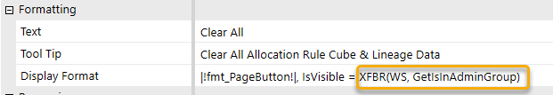

#### Data Set Services [Method Queries On Data Adapters]

> **Note:** This is called from a data adapter object within a Workspace.

•`{WS}{DataSetName}{Parameter1=Value1} ` •`{WSMU}{DataSetName}{Parameter1=Value1} `

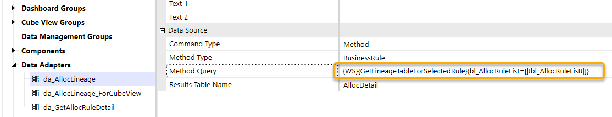

Dashboard Service [Execute Dashboard Extender Rule (General Server)]

> **Note:** This is called from a dashboard object.

•`{Workspace.workspaceName.maintenanceUnitName.WSMU}{DBFunction} `

```text
{Param=“input”}
```

•`{Workspace.workspaceName.WS}{DBFunction}{Param=“input”} ` •`{Workspace.Current.maintenanceUnitName.WSMU}{DBFunction} `

```text
{Param=“input”}
```

•`{Workspace.Current.Current.WSMU}{DBFunction}{Param=“input”} ` •`{Workspace.Current.WS}{DBFunction}{Param=“input”} ` •`{WS}{DBFunction}{Param=“input”} ` •`{WSMU}{DBFunction}{Param=“input”} `

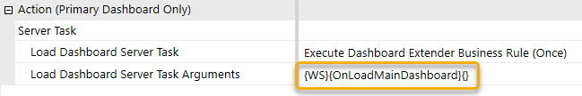

Component Service [Execute Dashboard Extender Rule (General Server)]

> **Note:** This is called from a dashboard component, like a button, combo box, CV, etc.

•`{Workspace.workspaceName.maintenanceUnitName.WSMU}{DBFunction} `

```text
{Param=“input”}
```

•`{Workspace.workspaceName.WS}{DBFunction}{Param=“input”} ` •`{Workspace.Current.maintenanceUnitName.WSMU}{DBFunction} `

```text
{Param=“input”}
```

•`{Workspace.Current.Current.WSMU}{DBFunction}{Param=“input”} ` •`{Workspace.Current.WS}{DBFunction}{Param=“input”} ` •`{WS}{DBFunction}{Param=“input”} ` •`{WSMU}{DBFunction}{Param=“input”} `

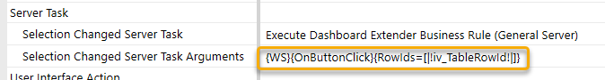

SQL Table Editor Service [Execute Dashboard Extender Rule]

> **Note:** This is called from a SQL table editor component.

•`{Workspace.workspaceName.maintenanceUnitName.WSMU}{SQLFunction} `

```text
{Param=“input”}
```

•`{Workspace.workspaceName.WS}{SQLFunction}{Param=“input”} ` •`{Workspace.Current.maintenanceUnitName.WSMU}{SQLFunction} `

```text
{Param=“input”}
```

•`{Workspace.Current.Current.WSMU}{SQLFunction}{Param=“input”} ` •`{Workspace.Current.WS}{SQLFunction}{Param=“input”} ` •`{WS}{SQLFunction}{Param=“input”} ` •`{WSMU}{SQLFunction}{Param=“input”} `

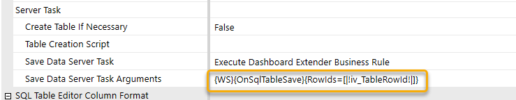

Dynamic Dashboard Service [Embedded Dynamic Dashboard Type]

> **Note:** This is called when a dashboard of the type Embedded Dynamic is called.

•Implicit reference so no syntax for WS or WSMU – Dashboard Type = Embedded Dynamic will trigger this service when the dashboard is called. •We will discuss this further in Chapter 8.

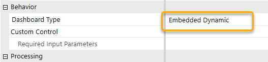

Dynamic Cube Service

> **Note:** This is called when a cube with dynamic source data is called from an Assembly service.

•`Workspace.workspaceName.WS “Current” is not allowed `

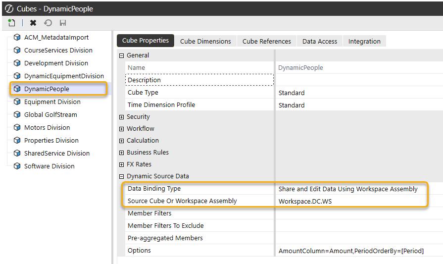

Finance Core Service [Cube Business Rules]

> **Note:** This is called from the business rules of a cube.

•`Workspace.workspaceName.WS “Current” is not allowed `

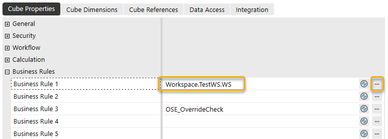

Ellipsis returns available Workspaces and syntax.

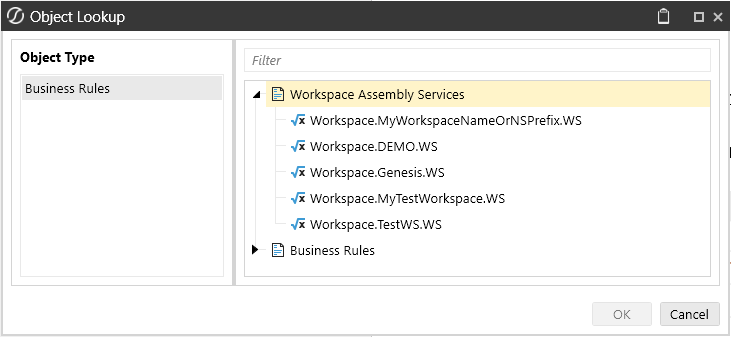

Finance Member List Service [Member Filter for Cube Views]

> **Note:** This is called when a Cube View is retrieving a list of members.

•`[Workspace.workspaceName.maintenanceUnitName.WSMU,…] “Current” is `

```text
not allowed
```

•Since this reference is used within a Cube View and Cube Views may execute without a current Workspace context (and may span Workspaces), the `workspaceName` and  `maintenanceUnitName` must be explicitly specified.  •The reason that `.WS` is not allowed for this service call is because Cube Views are  evaluated by the Finance engine and may execute without a current Workspace context and potentially across Workspaces. A `.WS` reference relies on an implicit “Current” Workspace,  which cannot be guaranteed in this execution model.

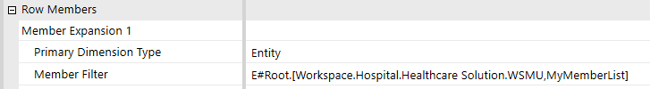

Finance GetDataCell Service [Member Filter for Cube Views]

> **Note:** This is called when a Cube View is returning data for an individual cell.

•`[Workspace.workspaceName.maintenanceUnitName.WSMU,…] “Current” is `

```text
not allowed
```

•Since this reference is used within a Cube View and Cube Views may execute without a current Workspace context (and may span Workspaces), the `workspaceName` and  `maintenanceUnitName` must be explicitly specified.  •For the same reason as the Member List service, `.WS `is not allowed; Cube Views are  evaluated by the Finance engine and may execute without a current Workspace context and potentially across Workspaces. A `.WS` reference relies on an implicit “Current” Workspace,  which cannot be guaranteed in this execution model.

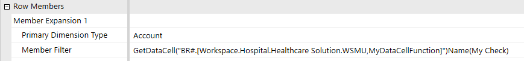

Finance CustomCalc Service [Data management Step of type “Custom Calculate”]

> **Note:** This is called when a data management job calls a Custom Calculate.

•`Workspace.workspaceName.WS ` •`Workspace.workspaceName.maintenanceUnitName.WSMU ` •Note: The Function Name is referenced on a different field.

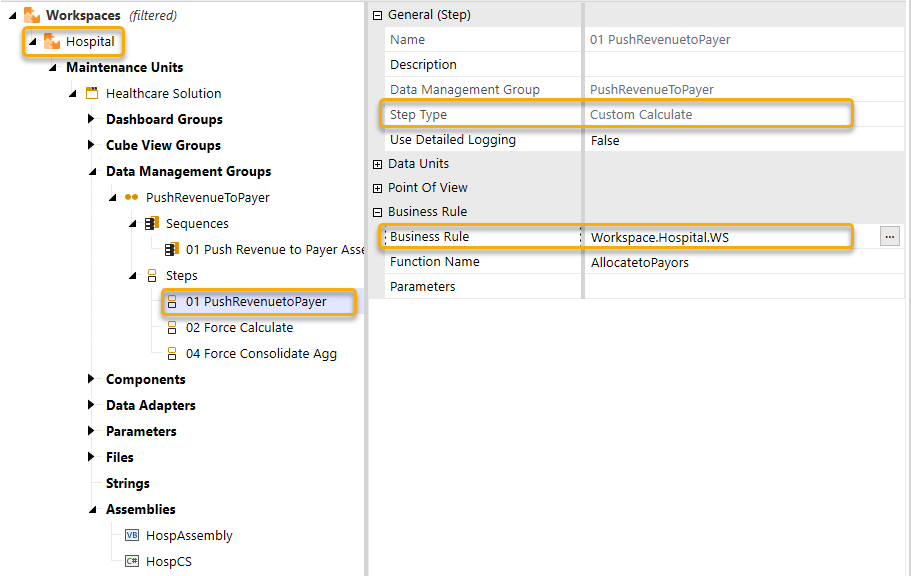

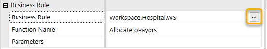

Ellipsis returns available Workspaces and syntax. Note that only the available Workspace References (WS) are listed here, but there are also Workspace Maintenance Unit references (WSMU) that are valid.

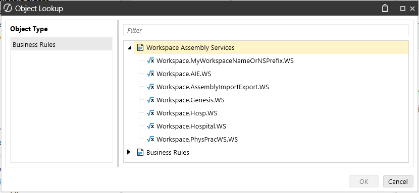

#### Table View Service [Spreadsheet Table View]

> **Note:** This is called when working with table views within the Spreadsheet editor.

•`Workspace.workspaceName.maintenanceUnitName.WSMU ` •`Workspace.workspaceName.WS ` •`Workspace.Current.maintenanceUnitName.WSMU ` •`Workspace.Current.Current.WSMU ` •`Workspace.Current.WS ` •`WS ` •`WSMU ` Ellipsis gives you syntax as well as available Workspaces.

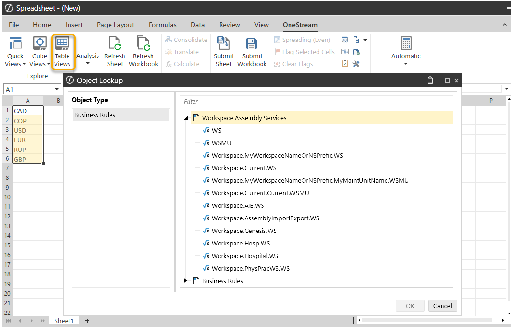

> **Note:** For table views, it is recommended to use explicit references to ensure that the

spreadsheet can be opened from anywhere. Data Management Service [Data management Step of type “Execute Business Rule”]

> **Note:** This is called when a data management job calls an Execute business rule.

•`Workspace.workspaceName.maintenanceUnitName.WSMU ` •`Workspace.workspaceName.WS ` •`Workspace.Current.maintenanceUnitName.WSMU ` •`Workspace.Current.Current.WSMU ` Note that, as of the time of writing, the ellipsis for business rules only shows the Assembly business rule syntax and available traditional business rules. It does not show the Assembly service syntax or the available Workspaces for services.

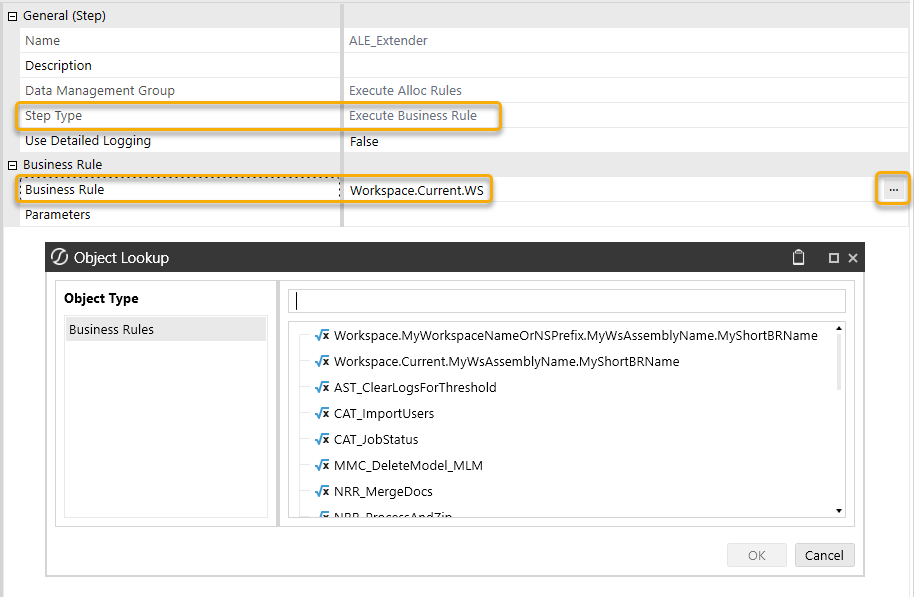

#### Version Control

One of the great advantages of working with Assemblies and service factories with WS and WSMU references is that they can be a great help for version control. If you have a first version of your dashboard working Assembly, say `MyAssemblyV1`, you can always choose to copy and paste  your Assembly and create `MyAssemblyV2`. This will allow you to modify the code while keeping a  working copy as a backup. If you want to run the dashboard using the new code, update the maintenance unit or Workspace Assembly factory once, and all components of your dashboard will use your new code. Need to revert? Simply update the reference back to the old code, and all components will start using the old working code.

#### Ws And Wsmu - Conclusion

In this section, I wanted to break down how the WS (Workspace Service) and WSMU (Workspace Maintenance Unit) work in OneStream, and why understanding them is so important. Basically, these two determine how service calls are routed to the right Service Factory. WS is your go-to for broader, Workspace-level calls, while WSMU steps in when you need more specific, granular control within a maintenance unit. One of the great things about this system is its flexibility – you’re not restricted to using service factories in the same Workspace or maintenance unit. You can call service factories from different ones as long as those Workspaces are shared, which is a handy feature when working across larger setups. Another key point I’ve tried to highlight is how different service types come with their own syntax rules. For example, XFBR is more forgiving with options like “Current” keywords, whereas Finance GetDataCell requires you to explicitly name both the Workspace and maintenance unit. Knowing these nuances helps you route your service calls efficiently, no matter the type or context. By understanding WS and WSMU, along with the unique syntax for different service types, you’ll be able to configure your service factories effectively and make sure everything runs like clockwork.

### Advanced Topics

Assembly Services and service factories unlock a level of flexibility in OneStream that might surprise you. In this section, we’ll explore a few creative ways to configure service factories, showcasing how they can be adapted to meet unique needs. Hopefully, these examples will spark your imagination and inspire your own innovative solutions to make your application even more powerful.

#### Service Factory Routing

Now that we’ve covered the basics of setting up a standard Service Factory file, let’s explore how you can take things further with creative configurations. Here is an example of a Service Factory conditioned on the ‘day of the week’ to select which data management step service file to return. This approach allows you to schedule long, time-intensive processes to run exclusively on weekends, ensuring smoother operations during the week.

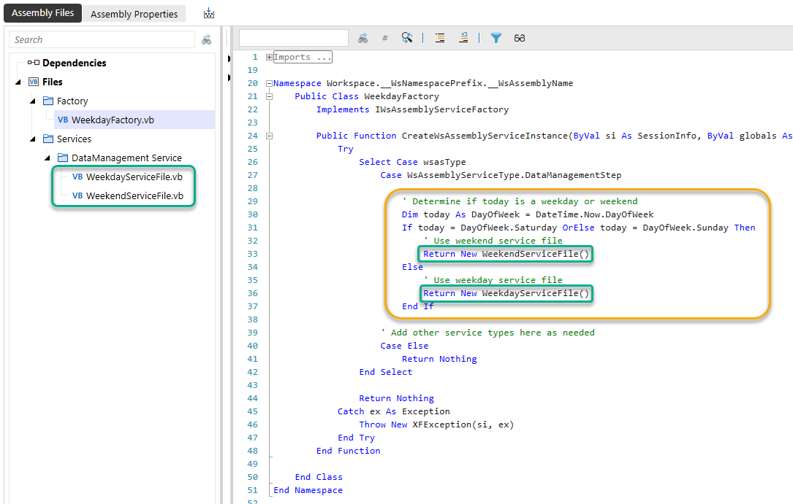

This is just one of many ways to customize service factories. Think about how you could apply similar logic to create tailored workflows and make your application even more robust and adaptable.

#### Advanced Orchestration

Jack Lacava, another genius here at OneStream, recently shared an inspiring blog on the OneStream Community. His article highlights a creative way to use service factories, which could be a game-changer for your Assembly service journey. In his blog, Jack explores the idea of using nested factories, where one factory retrieves its services from another. This approach streamlines privilege-based logic and keeps your Service Factory clean and maintainable.

#### Jack Lacava’s Blog

Factories must return service objects, of course; however, there is no rule about having to create such instances right there and then. What if I had a factory that gets its services from... another factory? For example, let’s say we want to build a particular interface in substantially different ways, depending on whether the user is an administrator or not. That setting will determine so many things that you might end up having completely different services for dashboards, components, even Custom Calculate jobs.

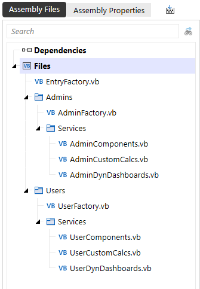

AdminFactory will dispatch to Admin services, and UserFactory will dispatch User services, keeping their logic very clean. And then, in EntryFactory, you would just delegate the choice to one factory or the other, depending on privilege checking:

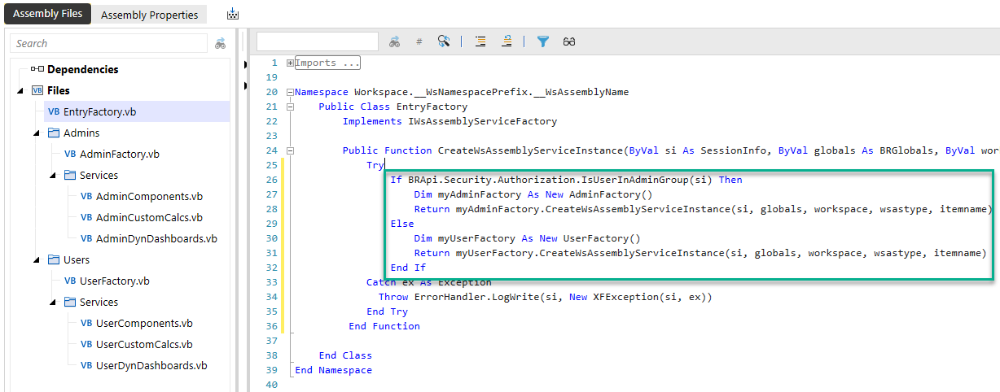

(Actual Text of Code for clarity)

```vb
Public Function CreateWsAssemblyServiceInstance(...) [...]
Try
If BRApi.Security.Authorization.IsUserInAdminGroup(si) Then
Dim myAdminFactory As New AdminFactory()
Return myAdminFactory.CreateWsAssemblyServiceInstance(si,
globals, workspace, wsastype, itemname)
Else
Dim myUserFactory As New UserFactory()
Return myUserFactory.CreateWsAssemblyServiceInstance(si,
globals, workspace, wsastype, itemname)
End If
Catch ex As Exception
Throw ErrorHandler.LogWrite(si, New XFException(si, ex))
End Try
End Function
```

Instead of having code that checks the privilege for each individual service, polluting our class with repetitive (and error-prone) copy/pasted lines, we have one clear check at the very start of the process, and everything flows from there. [End of Blog] As you can see from these two examples, Assembly Services and the use of service factories can greatly improve the flexibility and control of how to run the code that controls your OneStream application. There are an infinite number of possibilities with OneStream’s use of Assembly Services. Think about how you might implement similar logic to address unique challenges in your own application.

## Conclusion

Wrapping it all up, Assembly Services and service factories are like the secret sauce to making your OneStream application efficient, scalable, and downright powerful. Once you grasp how WS and WSMU operate, and how they route service calls smartly, you’ll feel like you’ve unlocked a new level of control over your application. Plus, the flexibility to call service factories across shared Workspaces or maintenance units opens up endless possibilities for larger, more complex setups. The big takeaway here is that Assembly Services aren’t just about solving today’s problems – they’re about future-proofing your application. With a solid understanding of these tools and some creative implementation, you’ll be setting up your OneStream environment to handle anything that comes its way and build a foundation for long-term success.
