# Troubleshooting Workspaces

# And Assemblies

Developing OneStream applications with a Workspace approach unlocks endless possibilities and empowers you to create dynamic, adaptable solutions. As with any advanced toolset, there may be times when everything seems properly set up, yet something doesn’t work as expected. These moments, however, are opportunities to learn, grow, and sharpen your skills. Whether that’s something straightforward, like configuring a combo box from another Workspace, or tackling a more intricate challenge, such as refining a dynamic dashboard service. This chapter is here to support you through those challenges. Together, we’ll explore some of the common errors you might encounter and uncover practical strategies to address them. While not exhaustive, this guide aims to equip you with a solid foundation, ensuring you feel prepared to resolve issues and move forward with confidence. Let’s dive in!

## Troubleshooting Approach

Most of the Workspace and Assembly development that we do relies on a simple philosophy: we try to start small, stay focused, and test regularly. With this in mind, we’ll first cover the essential areas where confusion often arises. Many times, the issue is a slight syntax error that can be frustrating, but very relieving when you find it and realize that your logic was correct all along. Other times, it could be a particular setting that wasn’t turned on when it needed to be. You’ll also encounter scenarios involving reference errors when you are trying to reference objects in another Workspace, and in some cases, the same Workspace. We will try to give examples of the most common errors and even touch on some more technical issues like dependencies within the Assemblies. From experience, we can confidently say that the more you engage with Workspaces and Assemblies, the easier it becomes to anticipate and overcome these challenges. With every hurdle cleared, you’ll grow more adept at preventing them altogether.

### Common Workspace Issues

OneStream’s out-of-the-box security framework is a robust slice security model that allows nearly every object in the application to be securitized, allowing administrators to grant and/or restrict user access and maintenance rights with a fine-tooth comb. This security model is incredibly powerful in controlling user access to data and metadata; this also extends to Workspace development, allowing you to leverage your existing model by layering in security groups specific to your development teams. Reviewing your security model when modifying configuration – to allow your developers access to only areas you deem appropriate within the application – is essential. Here are some examples of security restrictions that may limit users from accessing and modifying Workspaces, and the security configuration settings to troubleshoot.

#### User Cannot Access Workspaces

The first step in setting up your developers for success is granting them access to the Workspace Admin page. If users do not see the Application tab with the Workspaces option when they log in to OneStream, they most likely do not have the appropriate security group assignment.

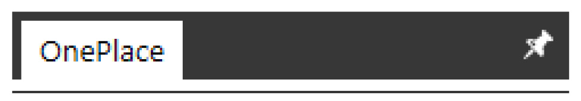

To access the Workspaces administration page in OneStream, users must belong to the security group assigned to the WorkspaceAdminPage property, located under the Application User Interface Role settings from the Security Roles page. Once the user is added to the security group assigned to the WorkspaceAdminPage property, they will see the Workspaces option under the Application tab.

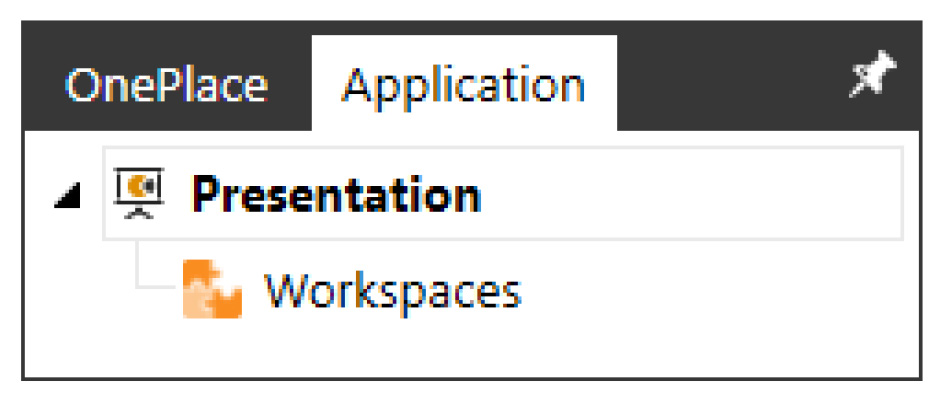

#### User Cannot Create Workspaces

As you start utilizing Workspaces in your development, you’ll want to consider who should have the ability to create new Workspaces. Do you want to allow your developers to create new Workspaces? Or, do you want to only allow administrators to create Workspaces when they are needed? Depending on your development teams and number of users, you may want to limit Workspace creation to certain users in order to control which Workspaces are in your library to avoid clutter. To create new Workspaces in OneStream, users must belong to the security group assigned to the ManageApplicationWorkspaces property, located under the Application Security Role settings from the Security Roles page. Users who are assigned to this security group have the ability to click the Create Workspace button.

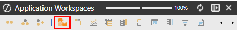

Users who are not assigned to this security group will see the Create Workspace button, but will not have the ability to click the button.


#### User Cannot Modify Workspace Assemblies

Developers building solutions in OneStream will most likely need to create and modify Workspace Assemblies. However, depending on the scope of their work and their expertise, you may want to limit who can modify Assemblies. For example, if you have multiple developers working in the same Workspace but only want to allow Developer #1 to modify Assemblies, then you would need to assign Developer #1 to a separate security group role to restrict the other developers from making changes to Assemblies that are not approved. To create or modify Workspace Assemblies, users must belong to the security group assigned to the AdministerApplicationWorkspaceAssemblies property from the Application Security Roles. Users with Workspace access will see any existing Workspace Assemblies; however, they will only be able to create or modify Assemblies if they are in the appropriate security group. If they are not in the security group with rights to modify Assemblies, they will see a dialog box like the one below, telling them that they are not authorized to make changes.

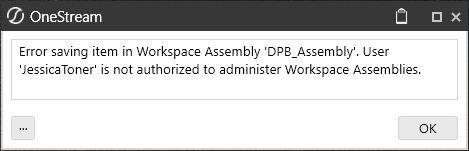

#### Error When Using Shared Object

To reuse any object from another Workspace, the share settings must be properly set. As an example, let’s look at creating an embedded dashboard component and select the dashboard you want to reuse from the embedded dashboard selector. In the figure below, you want to reuse a help document that is located within the Landing Page (`OP_LPG2`) Workspace.

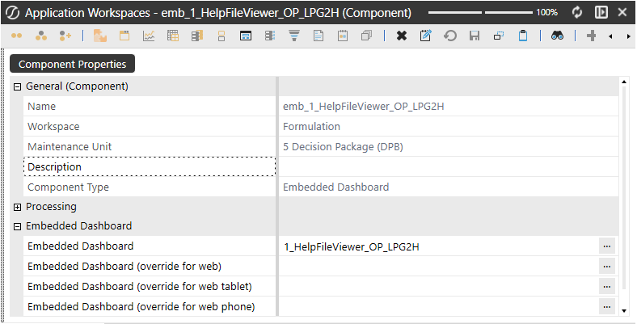

After attaching the embedded dashboard component to our dashboard, we get the following error message upon viewing the dashboard.

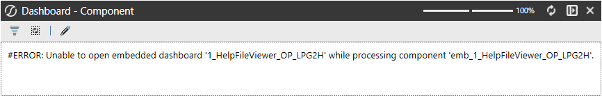

What is causing this error? There are two places to check your configuration to fix this error.

#### Is Shareable Workspace

In order to reuse objects from another Workspace, the Workspace that you are sharing from must have the Is Shareable Workspace property set to True. In the example below, we see that the Workspace we are sharing from is set to False. You would fix this error by changing this to True.

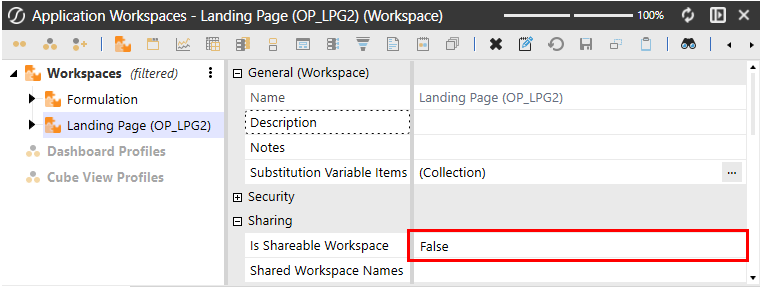

#### Shared Workspace Names

In order to reuse objects from another Workspace, the Workspace that you are sharing from must be listed in your current Workspace’sShared Workspace Names property. In the example below, you would fix this error by entering the Workspace name from which you are reusing the object.

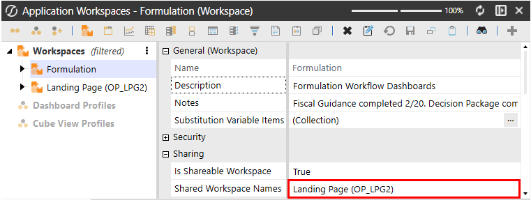

Once you’ve fixed the Workspace sharing properties, the dashboard will display the desired result.

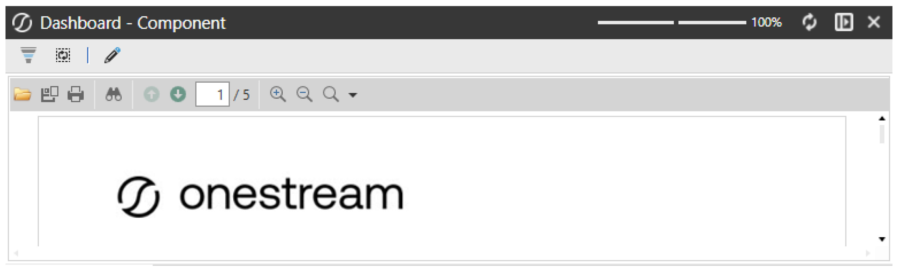

### Common Assembly Issues

#### Calling Assembly Business Rules And Assembly Services

The most common issue when working with Assemblies and Service Factories is getting the correct syntax for all the different types of calls. There are a lot of syntax variations between all the calls from Assembly business rules and Assembly Services. Please go back to Chapter 6 and look through the detailed list of the six types of Assembly business rules and the required syntax: •Cube View Extender Business Rules •Dashboard Data Set Business Rules •Dashboard Extender Business Rules •Dashboard String Function Business Rules •Extensibility Business Rules •Spreadsheet Business Rules In chapter 7, we have a detailed list of syntax variations for the current 13 types of Assembly Services. •Component Service •Dashboard Service •Data Management Service •Data Set Service •Dynamic Dashboards Service •Dynamic Cube Service •Finance Core Service •Finance Custom Calculate Service •Finance Get Data Cell Service •Finance Member Lists Service •SQL Table Editor Service •Table View Service •XFBR String Service

#### Common Dependency Errors

Dependencies are a powerful strategy for building efficient code within Assemblies, but they can sometimes lead to errors if not managed correctly. Below, we outline common issues and their resolutions.

#### Common Dependency Errors

Undefined Classes: Compilation errors like “class is not defined” often occur due to: •Incorrect definitions of the referenced Workspace or Assembly. •Syntax errors when referencing classes and functions. Here’s an example of a typical error message:

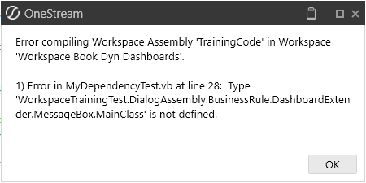

Since the error doesn’t specify whether the issue lies in the dependency definition or the syntax, start by verifying the dependency definition. Let’s look at dependencies defined as Workspace Assemblies first, and then go over dependencies defined as traditional business rules.

#### Dependency Calling Another Workspace Assembly

#### Defining Dependency

When defining a dependency from another Assembly, you define the dependency as a Workspace Assembly and give the Workspace Name and Assembly Name of the location of the Assembly business rule. It’s very important to give the referenced Assembly the correct name. To reference an Assembly from another Workspace, follow these steps: 1.Specify as a Workspace Assembly: `o`Set the Shared Workspace Name to match the actual Workspace name. `o`Define the Dependency Name as the referenced Assembly’s name.

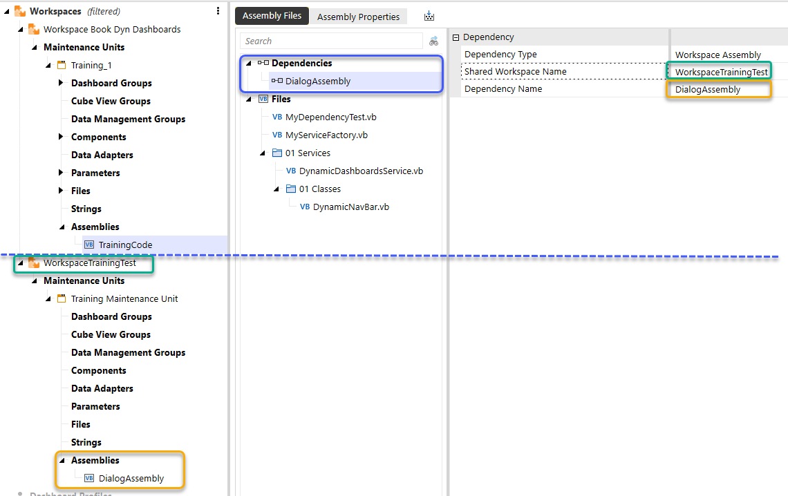

Key Details: •Shared Workspace Name: Must match the exact Workspace name (not the namespace prefix). •Dependency Name: Must match the Assembly name being referenced.

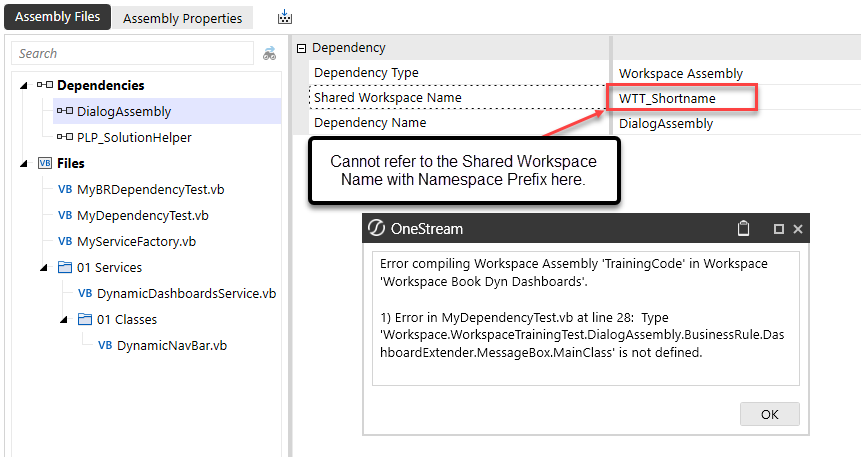

In the dependency definition, Shared Workspace Name MUST be the actual Workspace name and not the namespace prefix.

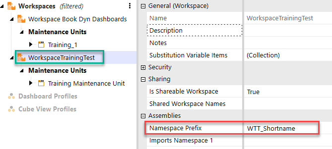

Dependency name must be the Assembly name being referenced.

#### Referencing Classes And Methods In A Dependency

Once you’ve successfully defined the dependency, you’ll need to use the correct syntax to reference classes and methods from the dependent Assembly. Follow this structure: 1.Create an Object: Use the `Dim` keyword to create an object from the dependency,  referencing the Workspace, Assembly, and class hierarchy. Syntax:

```vb
Dim yourObjectName As New
Workspace.WorkspaceName(orNamespacePrefix).AssemblyName.BusinessRule.
DashboardExtender.YourFileName.YourClassName
```

Example:

```vb
Dim DependencyTest As New
Workspace.WorkspaceTrainingTest.DialogAssembly.BusinessRule.
DashboardExtender.MessageBox.MainClass
```

2.Access Public Methods and Functions: Once your object is created, you can call public functions or subs within the class by referencing the object. Example:

```vb
Dim sReturn As String = DependencyTest.DialogTest(si)
```

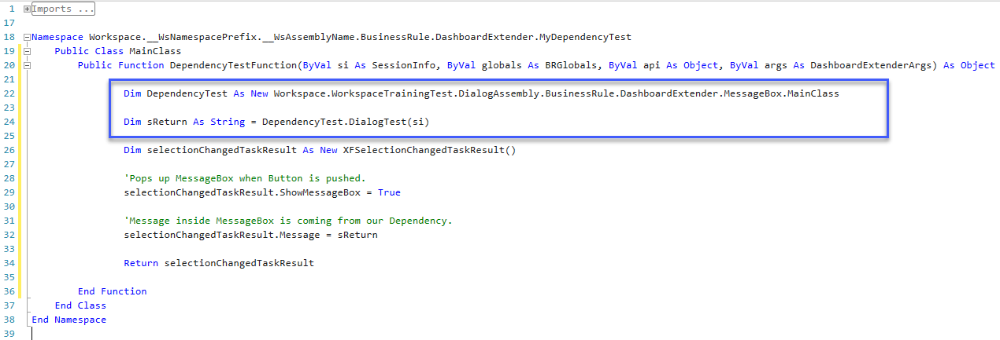

Key Notes: •Workspace Name vs. Namespace Prefix: If your dependent Workspace has a namespace prefix defined, you must use the namespace prefix instead of the actual Workspace name in your code. Using the Workspace name will cause an error in this case. •Consistent Naming: Ensure that the Workspace, Assembly, and class names match exactly with their definitions to avoid compilation errors.

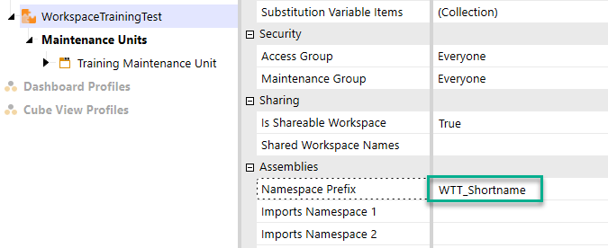

Use a namespace prefix in code.

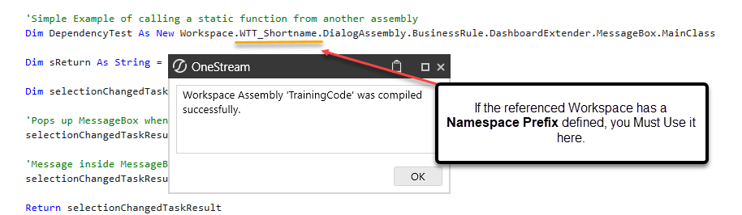

If the Workspace has a namespace prefix defined, putting in the actual Workspace name will throw an error. If the Workspace does not have a namespace prefix, the actual Workspace name works as expected.

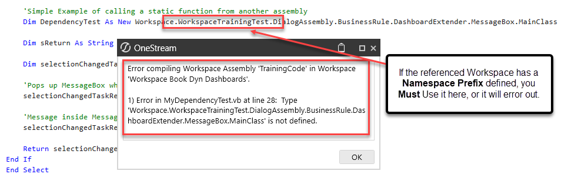

#### Advanced Description Of Namespace Prefix Dependency Error

When working with dependencies, errors related to namespace prefixes can arise, preventing your rule from compiling. Here’s a detailed technical explanation of the issue and how to address it. Understanding the Issue If the referenced Workspace has a namespace prefix defined, VB.NET substitutes the namespace prefix in the fully qualified namespace when resolving the dependency. This replacement often breaks the reference, as the target code expects the original Workspace name. Example Behavior: •Referenced Workspace: WorkspaceTrainingTest •Namespace Prefix: WTT_Shortname Dependency Code Example: In this case, when the target code is trying to run the dependency with this line of code in Figure 11.19:

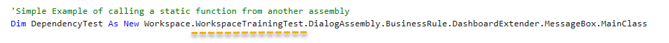

What is actually run:

```text
Workspace.WTT_Shortname.DialogAssembly.BusinessRule.DashboardExtender.
MessageBox.MainClass
```

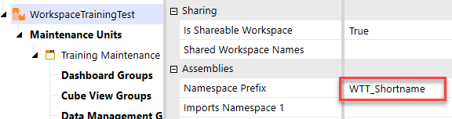

In this scenario, the target code searches for WorkspaceTrainingTest, but the dependency code sends WTT_Shortname instead, causing a mismatch and breaking the reference. The dependency code sends the namespace prefix because of the default variable in `Namespace` of  `__WsNamespacePrefix`, as shown in Figure 11.21. This variable gets replaced by the namespace  prefix if it exists, or the actual Workspace name if there is no namespace prefix.

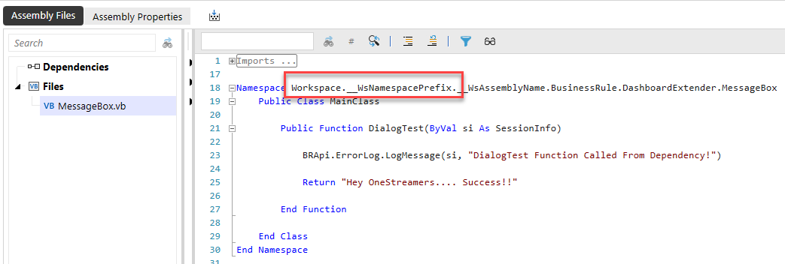

Fixing the Error To resolve namespace prefix errors, you can Update the Target Code and replace the Workspace name in your target code with the Namespace Prefix defined for the referenced Workspace. For example:

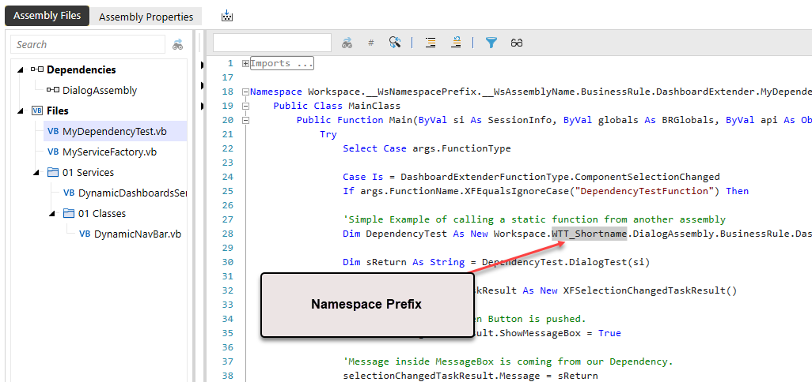

#### Dependency Calling A Traditional Business Rule

When defining a dependency with a dependency type of Business Rule, this refers specifically to a traditional business rule. In this case, the dependency name should be set to the name of the business rule itself.

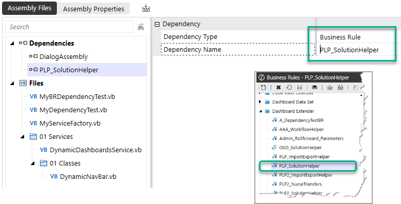

Syntax for Calling the Dependency To reference the traditional business rule as a dependency, use the following syntax:

```text
OneStream.BusinessRule.DashboardExtender.SharedRulename.
SharedClassName
```

Example:

```text
OneStream.BusinessRule.DashboardExtender.PLP_SolutionHelper.MainClass
```

This demonstrates the proper approach to calling a traditional business rule as a dependency within your code.

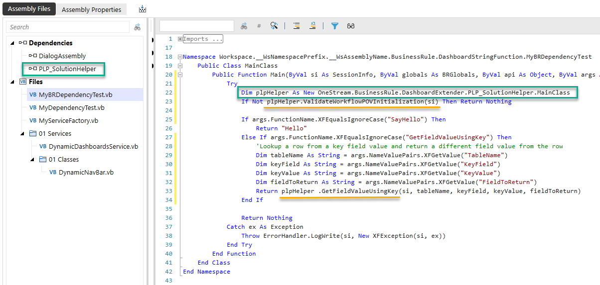

Additional Note: •Ensure the business rule name and class name match exactly as defined in your configuration.

#### Traditional Business Rule Referencing Assemblies

When using a traditional business rule, the syntax for referenced Assemblies in the business rule properties differs from the syntax used for other business rules or external DLL files. An incorrectly referenced Assembly entry will result in the following error when attempting to call a class in a Workspace Assembly:

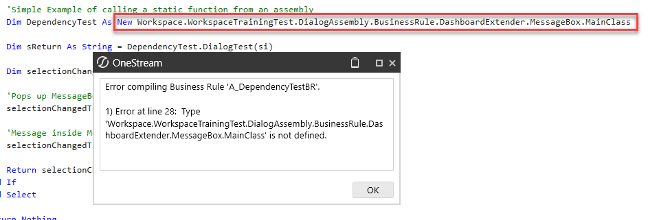

Correct Syntax for Referencing an Assembly BR To reference an Assembly Business Rule (BR) correctly, follow these steps: 1.Define the Referenced Assembly: In the Referenced Assemblies field, use the following syntax:

```text
WS\Workspace.YourWorkspaceName.YourAssemblyName
```

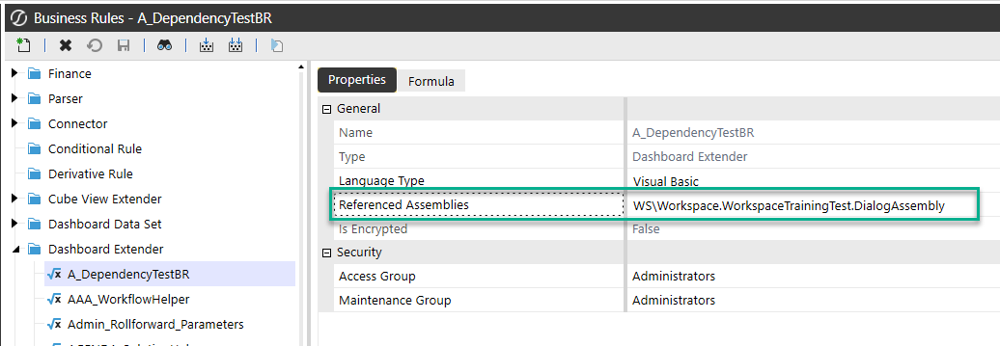

2.Call Classes and Methods: Use the same convention to define and reference classes within the Workspace Assembly: Syntax:

```vb
Dim yourClassName As
Workspace.YourWorkspaceName.YourAssemblyName.BusinessRule.
DashboardExtender.YourFileName.MainClass
```

Example (Figure 11.27):

```vb
Dim DependencyTest As
Workspace.WorkspaceTrainingTest.DialogAssembly.BusinessRule.
DashboardExtender.MessageBox.MainClass
```

> **Note:** Typically, the referenced business rules are dashboard extender types, and you need

to include this type in the reference when you are calling the ClassName (e.g., `.BusinessRule.DashboardExtender.` ).

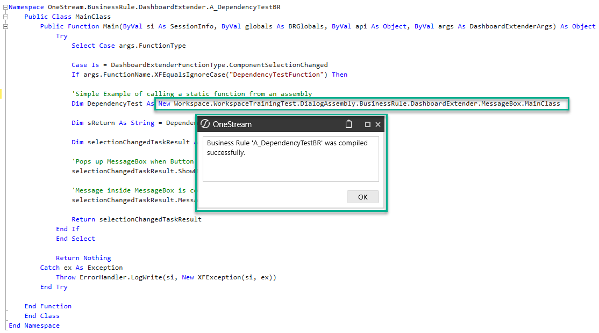

> **Note:** If calling the same rule in multiple places within your business rule, you can save

some typing by adding `Imports `

```text
Workspace.WorkspaceTrainingTest.DialogAssembly.BusinessRule.
```

`DashboardExtender` to the list of imported libraries at the top. Then you just need to  reference `Yourfilename.MainClass`. (e.g., Figure 11.28.)

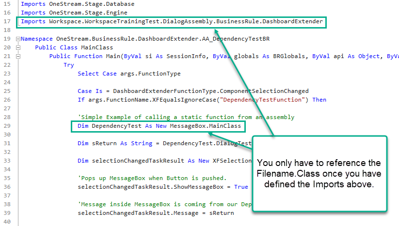

#### Working Example Of A Workspace Assembly Dependency

In this section, I will walk through a full working example of using an Assembly dashboard extender business rule as a dependency, so you can see all the screens and references working.

#### Example To Solve

Create a button that shows a dialog box with a message, where the message is generated from a dependency.

#### Example: Solution Steps

1.Create an Assembly dashboard extender business rule that calls a MessageBox with a static message. 2.In a different Workspace, create a dependency that references the Workspace and Assembly of the code we just created. 3.Create an Assembly dashboard extender business rule that will reference the function in step 1. 4.Create a button that executes the Assembly dashboard extender business rule of step 3. 5.Create a dashboard that has that one button on it. 6.Execute the dashboard and test the button. Example: Solution Step Details: 1.Create an Assembly dashboard extender business rule that calls a MessageBox with a static message.

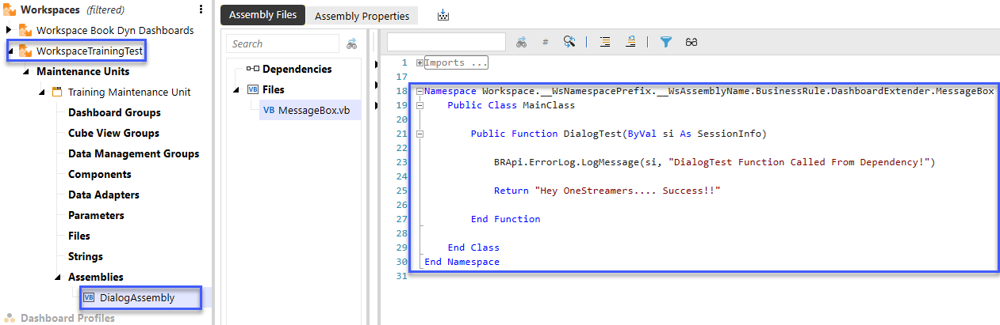

2.In a different Workspace, create a dependency that references the Workspace and Assembly of the code we just created.

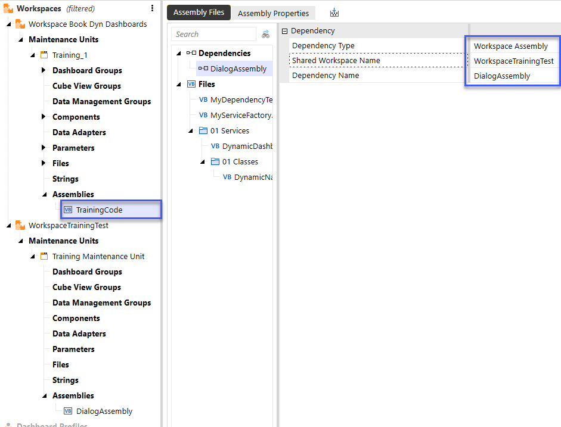

3.Create an Assembly dashboard extender business rule that will reference the function in step 1.

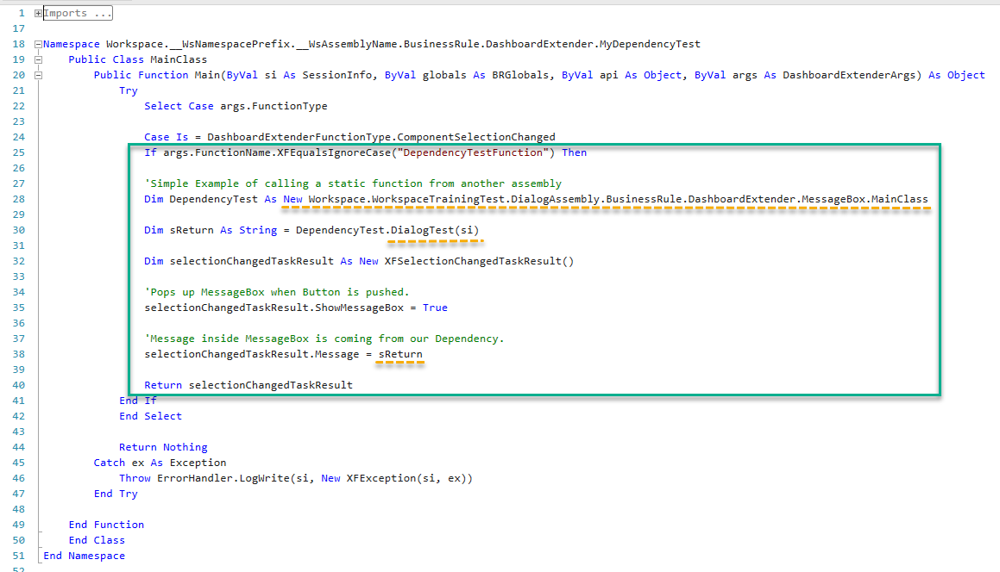

4.Create a button that executes the Assembly dashboard extender business rule of step 3.

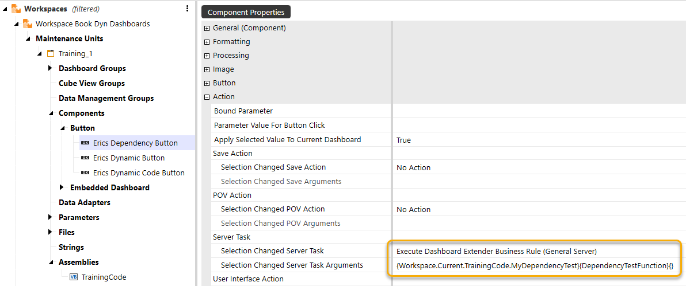

5.Create a dashboard with that one button.

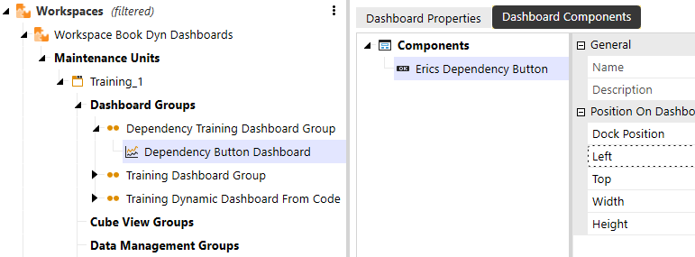

6.Execute the dashboard and test the button.

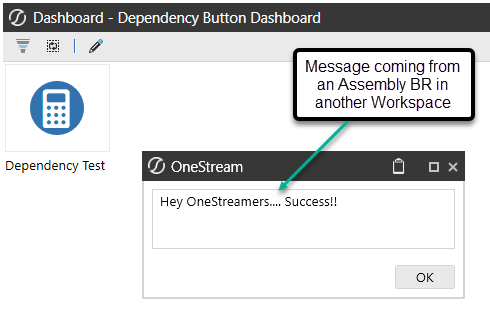

#### Renaming Assemblies And Assembly Files

If you need to rename anything around Assemblies, there are some things to keep in mind to keep your application running smoothly. One crucial point to note: references are not updated automatically when renaming. You must manually update all references to the renamed items. In general, when you need to rename an Assembly or an Assembly file, try to follow these guidelines. Guidelines for Renaming Assemblies and Files Follow these best practices to ensure smooth transitions: •Search and Update References: `o`After renaming, perform a thorough search across your Workspace and Assemblies  for references to the old file name and update them to the new name. •Workspace Editor Updates: `o`Update the Workspace Editor to reflect the renamed file. Ensure the Assembly is  listed under its new name. •Test in Isolation: `o`Test the renamed Assembly independently to confirm proper execution before  integrating it with other components. •Document Changes: `o`Maintain a naming convention document or change log to track renamed files and  their corresponding updates. With these principles in mind, let’s dive into specific scenarios for renaming Assemblies and files.

#### Renaming An Assembly

When renaming an Assembly, ensure that you update the following references: 1.Workspace Settings: •Update the Workspace Assembly Service settings to reflect the new Assembly name.

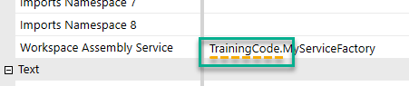

2.Maintenance Unit Settings: •Update references in the maintenance unit settings to ensure alignment with the renamed Assembly.

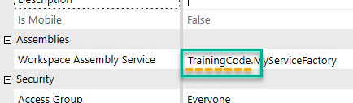

3.Component References: •Update any Workspace component that is referencing code within this Assembly and has a reference such as:

```text
{Workspace.WorkspaceName.AssemblyName.Filename}{MyFunction}{Param1=
[MyValue1],Param2=[MyValue2]}
```

4.Dependencies: •Check for dependencies in other Assemblies that reference the renamed Assembly and update their definitions.

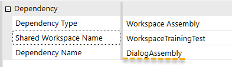

5.References Within Code: •Update any references in your code that use the renamed Assembly files. For example:

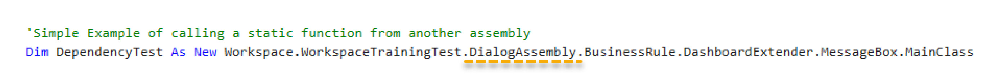

#### Renaming An Assembly Service Factory File

Renaming an Assembly Service Factory file requires careful attention due to the way OneStream defines classes within the file. Key considerations include ensuring the file and its Public Class are aligned to avoid errors. Key Steps for Renaming: 1.Update the Public Class within the File: •Renaming a file DOES NOT automatically rename the Public Class inside that file. After renaming the Service Factory file, ensure the Public Class inside the file is updated to match the new filename.

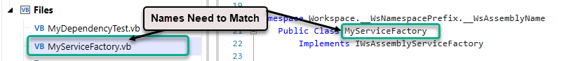

2.Workspace Settings: •Update Workspace Assembly Service settings to reflect the new filename.

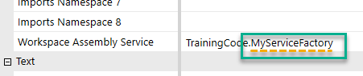

3.Maintenance Unit Settings: •Check and update all Workspace Assembly Service settings within maintenance units.

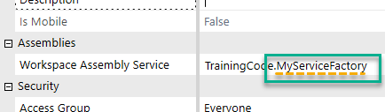

4.Components References: •Update any Workspace components that reference the factory. Ensure all dependencies and references are consistent with the new name.

#### Renaming An Assembly Service File

Renaming an Assembly service file requires careful attention – similar to Service Factory files – due to the way OneStream defines classes within the files. Additionally, you must update the Service Factory reference to reflect the new name. 1.Update the Public Class within the File: •Renaming a file does not automatically rename the Public Class inside it. Update the Public Class within the file to match the new filename.

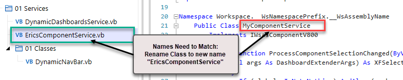

2.Rename the Service Factory Reference: •Renaming the file does not update its reference in the Service Factory. Ensure you update the reference to this service in the Service Factory.

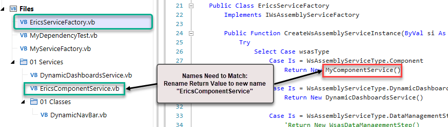

#### Rename An Assembly Business Rule File

When renaming an Assembly business rule file, you’ll need to update multiple references to ensure functionality. These updates include arguments within the file, other code files, and dashboard component references. 1.Update the Namespace Within the File: •The name of an Assembly business rule file must equal the namespace inside the file:

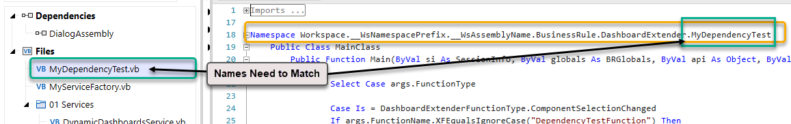

2.Update References in Other Code Files: •Locate and update all references to the renamed Assembly business rule file in other code files.

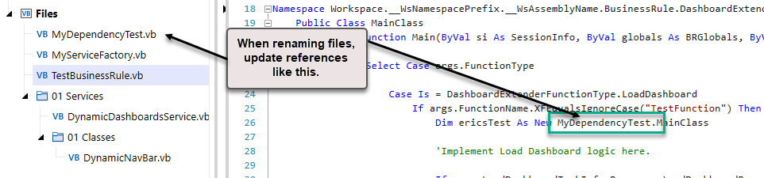

3.Update Component References: •Update any Workspace component that references the Assembly business rule file. Here’s an example of the syntax:

```text
{Workspace.WorkspaceName.AssemblyName.Filename}{MyFunction}{Param1=
[MyValue1],Param2=[MyValue2]}
```

#### Key Notes For Renaming Assemblies And Files

When renaming Assemblies, files, or related components in OneStream, keep these overarching principles in mind to ensure a smooth process: •Manually Update All References: References to renamed items – such as files, classes, namespaces, and dependencies – are not updated automatically. Perform a thorough search and update them manually across your Workspace, including settings, components, and code. •Maintain Consistency: Ensure that file names, class names, and namespaces are consistent to prevent compilation errors or broken dependencies. •Test Thoroughly: Test renamed Assemblies, files, and their dependencies in isolation to confirm proper functionality before reintegrating them with other components. •Keep Records: Maintain a naming convention document or change log to track renamed files and their corresponding updates. This can streamline troubleshooting and future updates.

## Conclusion

Troubleshooting Workspaces and Assemblies can sometimes feel like navigating a maze, but every challenge is an opportunity to learn and grow. Those “why won’t this work?” moments might be frustrating at first, but the sense of accomplishment when you finally uncover the solution is second to none. Whether it’s perfecting syntax, resolving dependencies, or deciphering those tricky reference errors, each success brings you one step closer to mastering the Workspace approach. Jessica and I have been through this journey ourselves. We’ve tackled unexpected errors and, through persistence and problem-solving, gained invaluable insights. Over time, we’ve learned to anticipate potential hiccups, streamline our process, and even enjoy the problem-solving process. Because of these experiences, we’ve become more confident and capable OneStream developers, and we know the same will happen for you. With every hurdle you clear, you’ll gain the tools and instincts to handle whatever comes next – and before you know it, you’ll naturally start to recognize and resolve these challenges before they even occur. Keep troubleshooting, keep learning, and keep building – you’ve got this!
